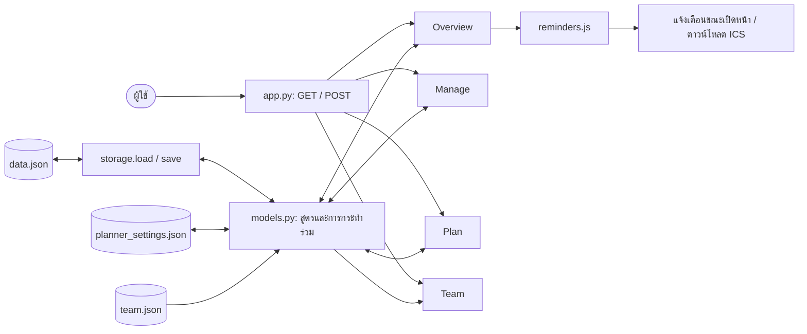
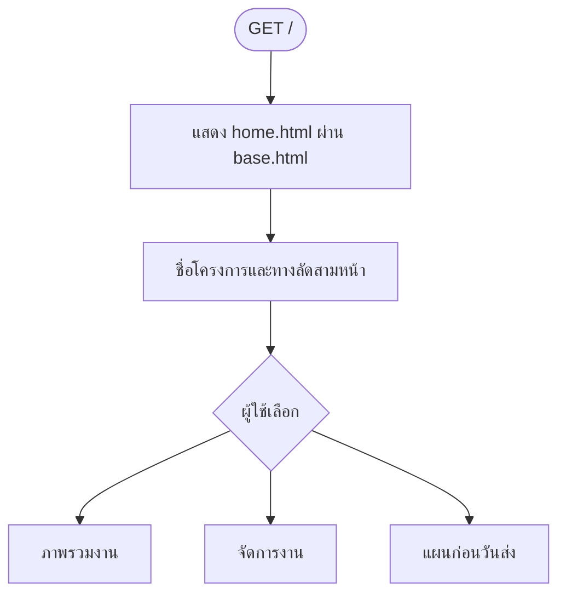
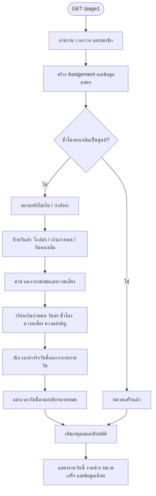
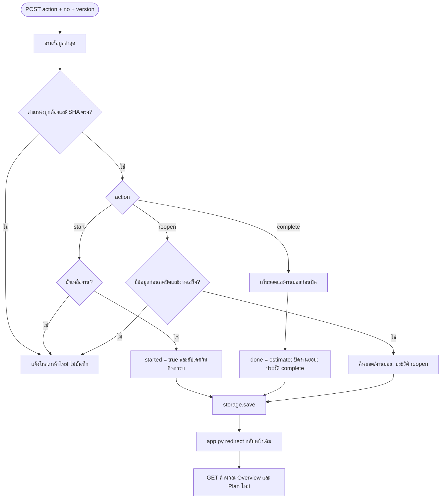
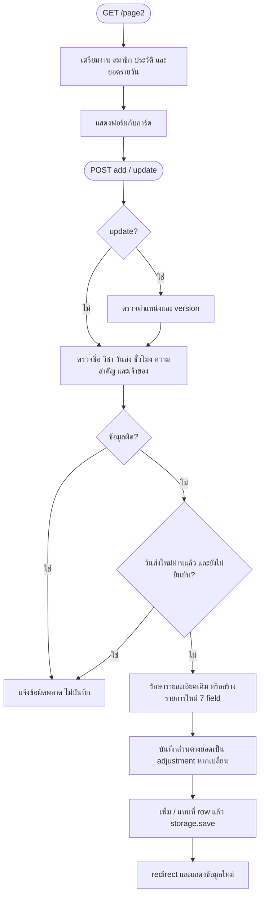
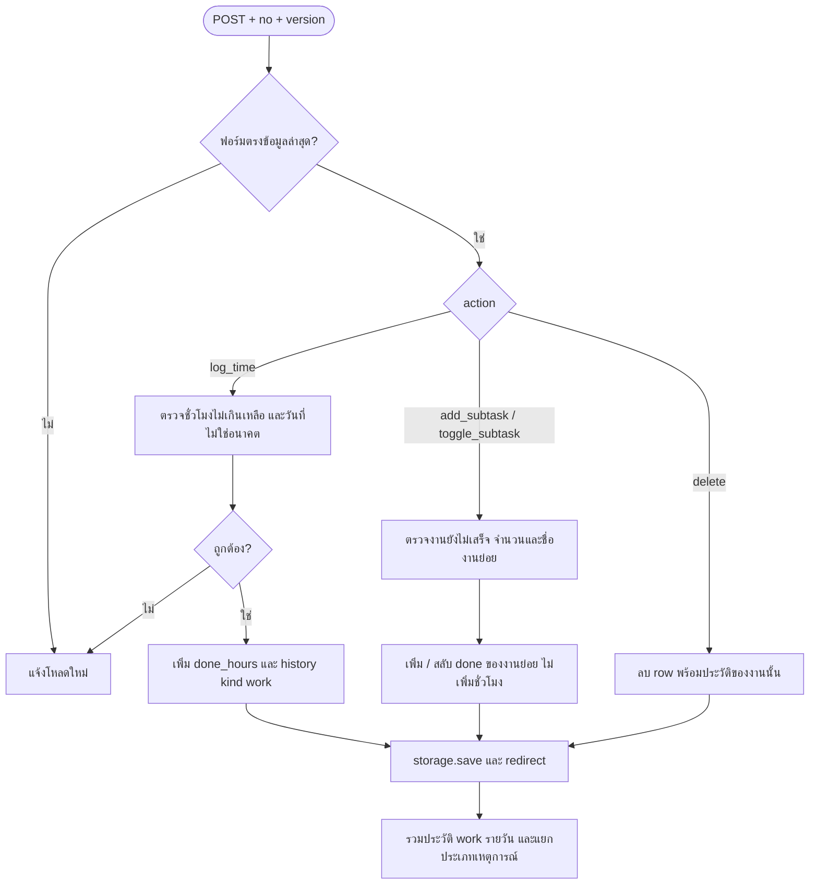
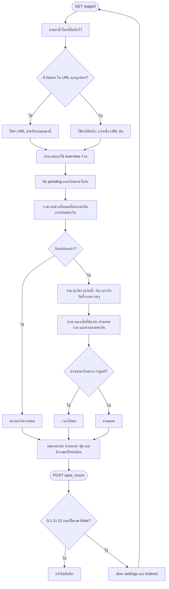
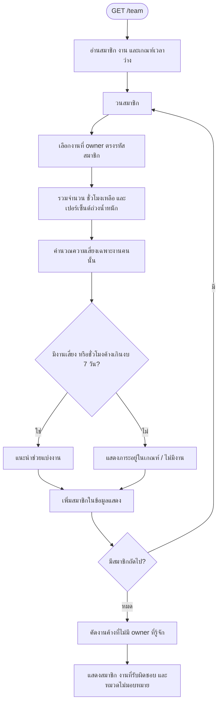
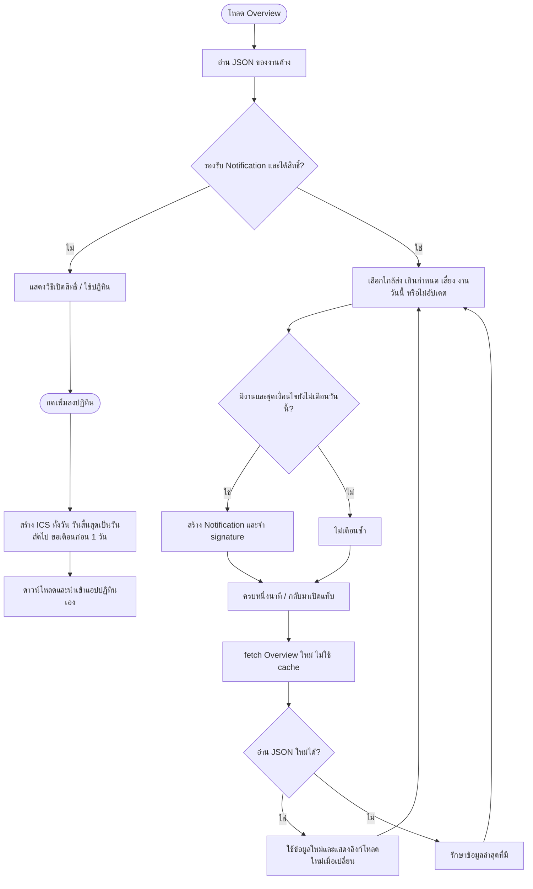
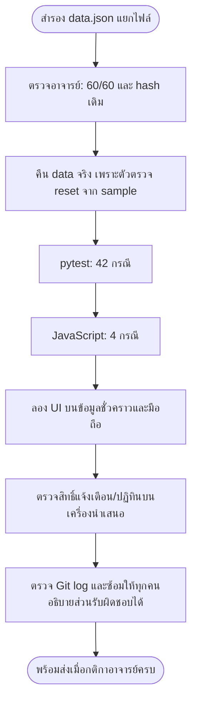

# ผังงานฉบับปรับปรุง — เดดไลน์ไม่ชนกัน

อ้างอิง source ปัจจุบัน 30 กันยายน 2569 งานเปลี่ยนสถานะผ่าน POST ตาม app.py เดิม รายการงานเก็บใน data.json และค่าชั่วโมงรายวันเก็บใน planner_settings.json

## 1. ภาพรวมระบบ

## 2. หน้าแรก

หน้าแรกอธิบายประโยชน์ ไม่มีการคำนวณรายการงาน

## 3. Page 1 — เปิด Overview

ป้ายการทำงานและป้ายวันส่งแยกกัน งานกำลังทำอาจเป็นงานเกินกำหนดได้ด้วย งานที่ครบงบวันนี้แล้วไม่ถูกตีความว่าเสร็จทุกชิ้น

## 4. Page 1/2/3 — เริ่ม ปิด และเปิดกลับ

complete/reopen ไม่ถูกนับเป็นเวลาทำงานจริง หากกด complete งานที่เสร็จอยู่แล้วจะแจ้งเสร็จแล้วโดยไม่บันทึกซ้ำ

## 5. Page 2 — เพิ่มและแก้ไขงาน

Python ตรวจข้อมูลซ้ำแม้ปิด JavaScript การแก้รายการที่มีวันส่งเกินกำหนดอยู่แล้วใช้วันเดิมได้

## 6. Page 2 — เวลา งานย่อย และลบ

ฟอร์มลบมีคำยืนยัน และการลบงานลบประวัติของงานนั้นด้วย ควรใช้เว็บข้อมูลชั่วคราวในการทดสอบเส้นทางลบ

## 7. Page 3 — บันทึกเวลาว่างและแผน

งานวันเดียวกันใช้ภาระรวมเดียวกัน หน้าแผนใช้ค่าสูงที่สุดของช่วงส่งในอนาคตเป็นค่าเฉลี่ยสรุป ชั่วโมงและส่วนขาดปัดขึ้นหลังตัดสินความเสี่ยง

## 8. Team — ภาระรายคน

เกณฑ์รายวันเดียวกันใช้กับทุกคน ยังไม่มีตารางเวลารายสมาชิกหรือบัญชีผู้ใช้

## 9. การแจ้งเตือนและปฏิทิน

ปิดหน้าแล้วไม่มีการแจ้งเตือนต่อ รายการบนหน้าจอไม่ได้แทนที่เองระหว่าง polling ไม่มีการซิงก์ไฟล์ปฏิทินกับงานภายหลัง

## 10. ตรวจและส่งงาน

ผลอัตโนมัติ 60 คะแนนยังไม่รวมคะแนนทีมและนำเสนอ 40 คะแนน อ่าน [คู่มือผู้ทดสอบ](TESTER_SUMMARY.md) และ [รายละเอียดสูตร](UPGRADE_DETAILS.md) ประกอบ
