# ผังงานระบบ “เดดไลน์ไม่ชนกัน”

ผังงานนี้อ้างอิงโค้ดจริง ณ วันที่ 29 กันยายน 2569 ลูกศรคือทิศทางการทำงาน สี่เหลี่ยมคือขั้นตอน ข้าวหลามตัดคือเงื่อนไข กระบอกคือไฟล์ข้อมูล และกรอบปลายมนคือจุดเริ่ม/จบ ผลที่เกี่ยวกับวันจะเปลี่ยนตามวันที่เครื่องรัน

## 1. ภาพรวมทั้งระบบ

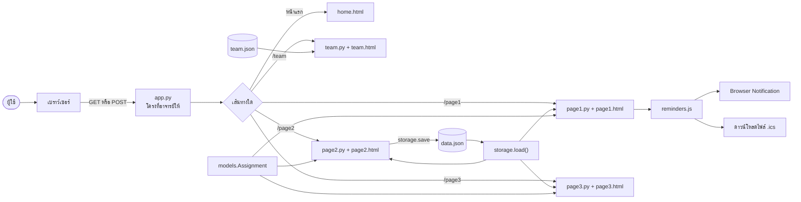

ข้อสังเกต: app.py, storage.py, base.html และไฟล์ตรวจเป็นไฟล์ห้ามแก้ ระบบไม่มีฐานข้อมูล บัญชีผู้ใช้ หรือบริการ push ภายนอก การบันทึกจากหน้า2เขียน data.json ทั้งไฟล์

## 2. หน้าแรก /

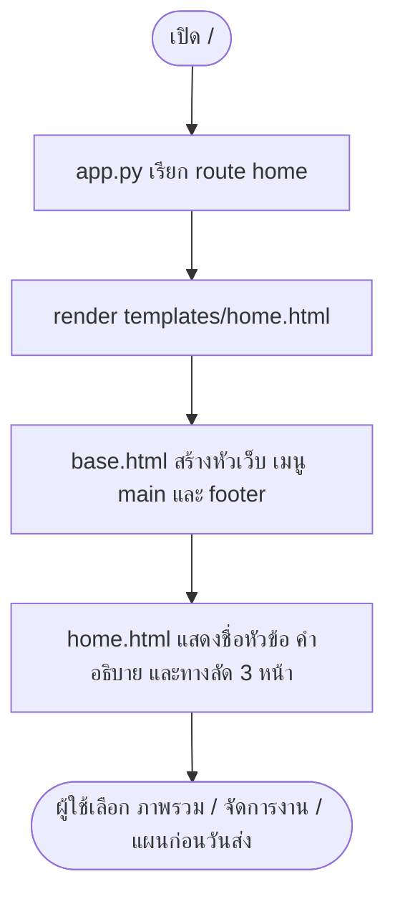

หน้าแรกไม่มี `build()` และไม่อ่าน `data.json` เพื่อคำนวณตัวเลข เป็นทางเข้าและอธิบายประโยชน์ของระบบ ชื่อกลุ่มในหัว/ท้ายมาจาก context ของ `team.json` ที่ app.py จัดให้

## 3. หน้าทีม /team

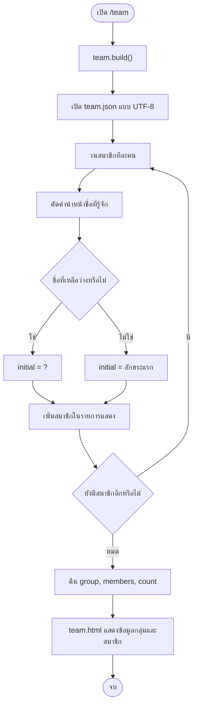

หน้าทีมใช้ไฟล์เดิมจาก skeleton ซึ่งกลุ่มแก้เฉพาะข้อมูลใน `team.json` ไม่ควรกล่าวว่าแก้ `pages/team.py` หรือ `templates/team.html` หากไม่มีการเปลี่ยนจริง

## 4. Page 1 — ภาพรวมงาน

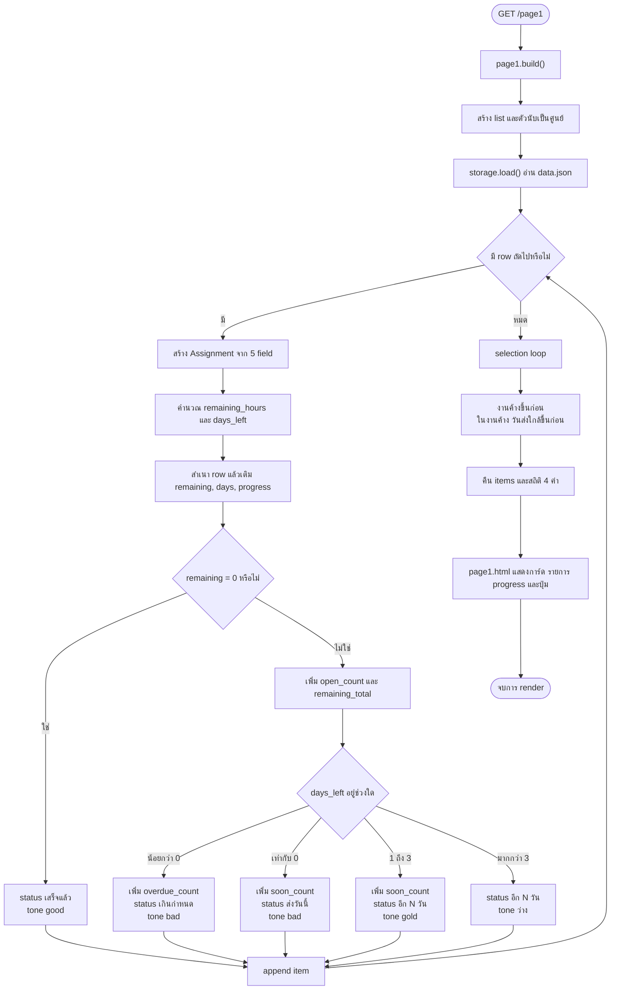

### นิยามที่มักสับสน

- `soon_count` นับงานค้างที่ส่งวันนี้ถึงอีก 3 วัน ไม่รวมงานเกินกำหนด
- `progress` ใช้ `int` ตัดเศษและ `min(100, ...)` จำกัดไม่เกิน 100
- งานเสร็จยังอยู่ในรายการ แต่ selection loop วางไว้หลังงานค้าง
- การเรียงเป็น selection loop ประมาณ `O(n²)` เพื่อให้เห็น loop/if ตามบทเรียน

## 5. Page 1 — การแจ้งเตือนในเบราว์เซอร์

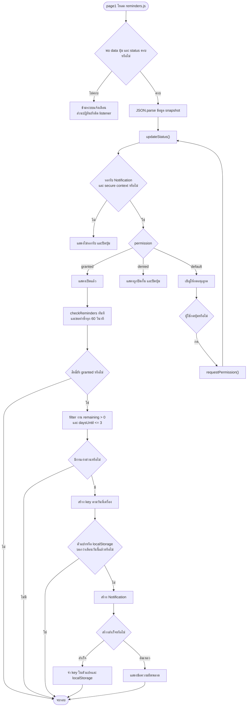

ข้อจำกัดสำคัญ: `tasks` เป็นข้อมูลตอนโหลดหน้า หากแก้ข้อมูลในอีกแท็บต้อง reload; งานเกินกำหนดเข้าเกณฑ์เพราะค่าติดลบยัง `<= 3`; timer อาจถูกเบราว์เซอร์หน่วง; เมื่อปิดหน้าไม่มี service worker หรือ push ทำงานต่อ; localStorage ลดการเตือนซ้ำใน origin เดิมแต่ไม่รับประกันหนึ่งครั้งในหลายแท็บ/หลายเครื่อง

## 6. Page 1 — ดาวน์โหลดไฟล์ปฏิทิน

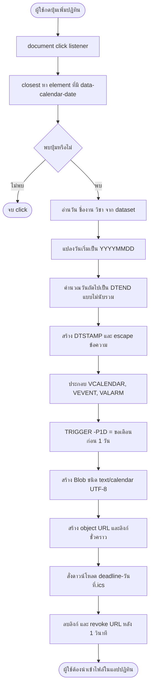

นี่เป็นกิจกรรมทั้งวัน ไม่มีเวลา 09:00 หรือ 23:59 ไม่มีการเชื่อม Google Calendar API และไม่มี live sync เมื่อแก้งาน UID สร้างจากเวลาที่กดทุกครั้ง การดาวน์โหลดซ้ำจึงอาจนำเข้าเป็นรายการซ้ำ

## 7. Page 2 — เปิดหน้าจัดการงาน

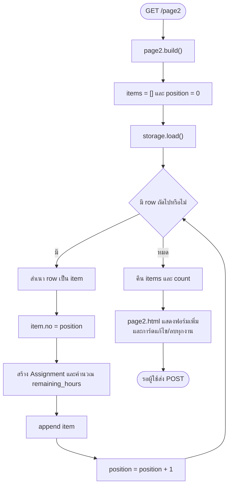

`no` เป็นตำแหน่งชั่วคราวเริ่ม 0 ไม่ใช่รหัสงานถาวร ฟอร์มเพิ่ม แก้ไข และลบเป็นคนละ `form` ไม่ซ้อนกัน

## 8. Page 2 — ตรวจข้อมูลร่วม

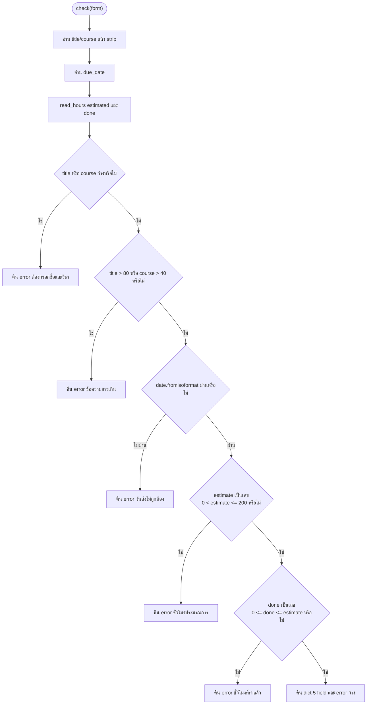

`read_hours` รับ `TypeError/ValueError` และปฏิเสธ `NaN` กับ infinity ด้วย Python validation จึงไม่พึ่งเพียง `required/min/max` ใน HTML

## 9. Page 2 — POST เพิ่ม แก้ไข ลบ

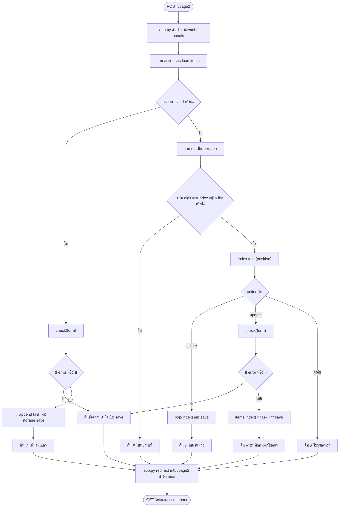

การ reload จาก POST ผ่าน redirect ช่วยลดการส่งฟอร์มซ้ำเมื่อผู้ใช้กด refresh แต่ไม่มี transaction หรือการป้องกันสองผู้ใช้เขียนพร้อมกัน

## 10. Page 3 — แผนก่อนวันส่ง

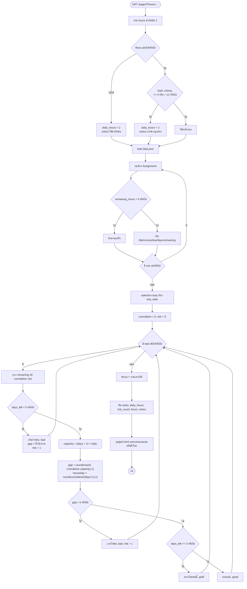

จุดที่ต้องตอบตามโค้ด: งานเกินกำหนดถูกบวกใน `cumulative_hours` ก่อนเข้ากิ่ง และจึงเพิ่มภาระให้ deadline ถัดไป; capacity รวมวันนี้ด้วย `+1`; `gap` ถูกปัดหนึ่งตำแหน่งก่อนตรวจ; `risk_count` นับรายการเสี่ยง ไม่ได้นับจำนวนวันที่ชนกัน

## 11. การทดสอบและการส่งงาน

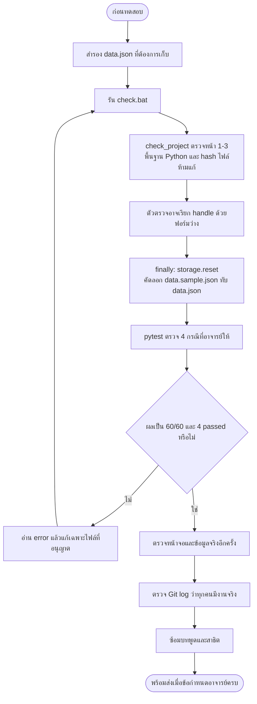

60/60 เป็นคะแนนอัตโนมัติจาก 60 คะแนน อีก 40 คะแนนเป็นการทำงานเป็นทีมและการนำเสนอ ตัวทดสอบสี่กรณีไม่ได้พิสูจน์สูตร การแจ้งเตือน ความเข้ากันได้ของปฏิทิน หรือการใช้งานพร้อมกันทุกกรณี

## 12. ตารางเชื่อมผังงานกับไฟล์

| ผัง | แหล่งหลัก |
|---|---|
| ภาพรวม/route | app.py, storage.py, base.html ซึ่งห้ามแก้ |
| หน้าแรก | templates/home.html |
| ทีม | team.json ร่วมกับ pages/team.py และ templates/team.html เดิม |
| Page 1 | models.py, pages/page1.py, templates/page1.html |
| Notification/ICS | templates/page1.html, static/js/reminders.js |
| Page 2 | pages/page2.py, templates/page2.html |
| Page 3 | pages/page3.py, templates/page3.html |
| ทดสอบ | check.bat, check_project.py, test_pages.py, data.sample.json |

## วิธีใช้ตอนพรีเซนต์

เลือกแสดงผัง 1, 4, 9 และ 10 เป็นหลัก: ผัง 1 ให้ภาพรวม ผัง 4 อธิบายสถานะ ผัง 9 สาธิต CRUD และ validation ผัง 10 อธิบายความเสี่ยง หากอาจารย์ถามการแจ้งเตือนค่อยเปิดผัง 5–6 ไม่จำเป็นต้องอ่านทุกกล่องตามลำดับ ให้ชี้จุดตัดสินใจและยกตัวอย่างหนึ่งงาน
