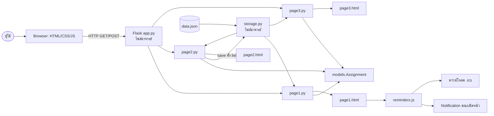

# PROJECT DETAIL — เดดไลน์ไม่ชนกัน

**กลุ่ม:** CodeMind · กลุ่ม 6  
**รายวิชา:** 1309102 การเขียนโปรแกรมคอมพิวเตอร์  
**วันที่ตรวจ source เพื่อจัดทำเอกสาร:** 29 กันยายน 2569  
**วันที่ประกอบคู่มือฉบับนี้:** 30 กันยายน 2569

เอกสารนี้เป็นคู่มือหลักสำหรับอ่านโครงการ ซ้อมอธิบาย และตอบคำถามอาจารย์ โดยยึด source จริงในโฟลเดอร์ ไม่แต่งฟังก์ชันที่ยังไม่มี เนื้อหารายบรรทัดรวม 798 บรรทัดของ 14 ไฟล์ที่ปรับสำหรับหัวข้อโครงการ และบันทึก README อีก 1 บรรทัดเป็นบริบท รวม source ที่แสดงและอธิบาย 799 physical lines

คำว่า “ทุกตัวอักษร” ในคู่มือนี้หมายถึงเก็บ source ทุกบรรทัดและอธิบาย token/เครื่องหมายที่ภาษาโปรแกรมตีความ เช่น operator, tag, attribute, Jinja expression, selector, declaration, key และค่า ชื่อ `remaining_hours` เป็น identifier หนึ่งหน่วย ตัว `r` เดี่ยวไม่ได้เป็นคำสั่งแยก

## แฟ้มเอกสารที่ส่งมอบ

| เอกสาร | ใช้ทำอะไร |
|---|---|
| `PROJECT_DETAIL.md` | คู่มือรวมฉบับนี้ ตั้งแต่โจทย์ สถาปัตยกรรม การใช้งาน ไปถึง source รายบรรทัด |
| `PRESENTATION_SCRIPT.md` | บทพูดเต็มประมาณ 7 นาที 15 วินาที บทสั้นประมาณ 4 นาที คำสั่งสาธิต และคำตอบคำถาม |
| `FLOWCHARTS.md` | Mermaid 11 ผัง ครบหน้าแรก ทีม หน้า1–3 CRUD validation notification ปฏิทิน และการทดสอบ |
| `PYTHON_DETAIL.md` | ภาคผนวก Python 230/230 บรรทัด |
| `FRONTEND_DETAIL.md` | ภาคผนวก HTML/Jinja/CSS 375/375 บรรทัด |
| `JAVASCRIPT_DATA_DETAIL.md` | ภาคผนวก JavaScript/JSON/PAGES/README 194/194 บรรทัด |

## 1. สรุปโครงการสำหรับผู้ที่ไม่ใช่นักพัฒนา

“เดดไลน์ไม่ชนกัน” เป็นเว็บวางแผนงานเรียน ผู้ใช้บันทึกชื่องาน วิชา วันส่ง เวลาที่คาดว่าจะใช้ และเวลาที่ทำแล้ว ระบบทำหน้าที่สามอย่าง:

1. หน้า **ภาพรวมงาน** บอกงานค้าง งานใกล้ส่ง งานเกินกำหนด และเวลารวมที่ยังต้องใช้
2. หน้า **จัดการงาน** เพิ่ม แก้ไขความคืบหน้า และลบรายการ โดยตรวจข้อมูลก่อนบันทึก
3. หน้า **แผนก่อนวันส่ง** เรียงงานตามกำหนดและเปรียบเทียบชั่วโมงงานสะสมกับเวลาว่างต่อวัน เพื่อชี้ว่างานใดมีแนวโน้มไม่ทัน

ระบบเสริมการจำด้วย Browser Notification ขณะหน้า1เปิดอยู่ และสร้างไฟล์ `.ics` ให้ผู้ใช้นำเข้าแอปปฏิทินเพื่อรับการเตือนภายหลัง

แนวคิดเปรียบเทียบง่าย ๆ คือ ตารางงานเป็น “ตะกร้าการบ้าน” คลาส `Assignment` เป็น “ป้ายข้อมูลมาตรฐาน” ของแต่ละชิ้น หน้า1เป็นกระดานหน้าห้อง หน้า2เป็นโต๊ะรับข้อมูล และหน้า3เป็นเครื่องชั่งว่าเวลาที่มีรับน้ำหนักงานทั้งหมดได้หรือไม่

## 2. ปัญหาและคุณค่า

นักศึกษามักเห็นวันส่งแต่ไม่เห็น **ปริมาณเวลาที่ซ้อนกันก่อนวันส่ง** งานสองชิ้นที่ส่งคนละวันอาจชนกันในทางปฏิบัติ หากงานแรกใช้เวลามากจนกินเวลาของงานถัดไป ระบบนี้จึงใช้ทั้ง “วัน” และ “ชั่วโมง” แทนการเตือนด้วยวันที่อย่างเดียว

ขอบเขตที่ทำจริง:

- เก็บรายการงานในไฟล์ JSON ภายในเครื่อง
- ใช้งานผ่านเว็บ Flask ในเครื่อง
- ประเมินเวลาว่างเท่ากันทุกวันตามค่าที่ผู้ใช้กรอก
- แจ้งสถานะด้วยข้อความและสี
- ลดการลืมด้วย notification ระหว่างเปิดหน้า และไฟล์ปฏิทินที่นำเข้าเอง

ขอบเขตที่ยังไม่มี:

- บัญชีผู้ใช้ ฐานข้อมูล Cloud และการแยกข้อมูลแต่ละคน
- push notification หลังปิดหน้าเว็บ
- PWA, service worker และการติดตั้งเป็นแอป
- การเชื่อม Google Calendar/Outlook แบบสด
- ตารางเวลาว่างรายวัน เวลาส่งระดับชั่วโมง และการจัดตารางอัตโนมัติ
- การรองรับหลายผู้ใช้เขียนข้อมูลพร้อมกัน

## 3. สมาชิกและขอบเขตนำเสนอ

| สมาชิก | รหัส | บทบาทใน `team.json` | ส่วนที่นำเสนอ |
|---|---|---|---|
| นายวายุ ทาโสม | 69130840182 | Project Lead (PM) | ปัญหา ภาพรวม `models.py` และคลาส Assignment |
| นางสาวลักขณา ศรีโพธิ์ | 69130840153 | Backend Dev (Python) | Page 1 ภาพรวม สถานะ และการเตือน |
| นายไกรวิชญ์ บุ้งทอง | 69130840247 | Frontend Dev (HTML/CSS) | Page 2 CRUD, validation และ UI |
| นายธีรเดช ฤทธิ์คำรพ | 69130840320 | QA / Test | Page 3 สูตรความเสี่ยง การตรวจ และข้อจำกัด |

นี่เป็นการแบ่งหน้าที่ตามข้อมูลกลุ่ม ไม่ใช่หลักฐานว่าทุกคนมี commit แล้ว ประวัติ Git ที่ตรวจพบมีสอง commit ภายใต้ผู้เขียนรายเดียว และช่อง “ทุกคนอยู่ใน git log” ใน `PAGES.md` ยังไม่ถูกติ๊ก สมาชิกต้องสร้างผลงาน/commit ของตนเองจริงตามกติกาอาจารย์ ห้ามปลอมย้อนหลังหรือเปลี่ยนชื่อผู้เขียนเพื่อให้ดูครบ

## 4. ข้อกำหนดรายวิชาและสิ่งที่โครงการตอบ

| ข้อกำหนด | การทำให้สำเร็จ | หลักฐาน |
|---|---|---|
| เว็บ 3 หน้าและหน้าทีม | page1–3 กับ team | `pages/` และ `templates/` |
| ทุกหน้าหลักมีงาน Python | loop/if/build ในทุก page | ภาคผนวก Python |
| class มี init และ method | Assignment มี `__init__`, `remaining_hours`, `days_left` | `models.py` |
| ข้อมูล list of dict 3–7 field | งานละ 5 field มี 7 รายการ | `data.json` |
| ใช้ catalog เป็นฐาน | list+stats, form, ranking+calculator | `PAGES.md` และ docstring |
| ไม่เพิ่ม package | ใช้ Flask ที่โครงให้ และ standard library | `requirements.txt` ยังมี flask/pytest |
| ไฟล์ห้ามแก้คงเดิม | hash ทั้ง 6 ไฟล์ตรง `.given_hashes.json` | ตารางหัวข้อ 11 |
| อัตโนมัติ 60 คะแนน | ผลรอบตรวจที่บันทึก 60/60 | `PAGES.md` บรรทัด 44 |
| การนำเสนอและทีม 40 คะแนน | เตรียมบทพูดแล้ว งาน Git รายคนยังต้องทำจริง | Presentation script และ Git log |

คะแนน `60/60` เป็นเฉพาะส่วนอัตโนมัติ 60 คะแนน ไม่ใช่ `100/100` ของรายวิชา

## 5. สถาปัตยกรรม



### การเปิดหน้าแบบ GET

1. `app.py` ตรวจชื่อหน้าและ import ไฟล์ `pages/pageN.py` ใหม่ทุก request
2. ถ้า `build` มีพารามิเตอร์ จะส่ง query string เข้าไป; ถ้าไม่มีจะเรียก `build()`
3. build ต้องคืน dict
4. Flask ส่ง dict เป็น context ให้ template ชื่อเดียวกัน
5. `base.html` เติม header, เมนู, banner และ footer
6. template หน้านั้นสร้าง HTML ที่เบราว์เซอร์เห็น

ตัวแปรระดับโมดูลใน page ไม่คงอยู่ข้าม request เพราะ app โหลดไฟล์หน้าใหม่ ข้อมูลที่ต้องจำจึงอยู่ใน `data.json`

### การส่งฟอร์มแบบ POST

1. `app.py` แปลงฟอร์มเป็น dict แล้วเรียก `handle(form)`
2. page2 อ่าน `action` เป็น add/update/delete
3. Python ตรวจข้อมูล ไม่พึ่ง validation ของ HTML อย่างเดียว
4. เมื่อสำเร็จ `storage.save` เขียน list ทั้งก้อน
5. handler คืนข้อความ
6. app redirect กลับหน้าเดิมและแสดงข้อความผ่าน banner

รูปแบบ redirect หลัง POST ช่วยลดการส่งซ้ำจาก refresh แต่ยังไม่มี transaction, CSRF token หรือการควบคุมการเขียนพร้อมกัน

## 6. พจนานุกรมข้อมูล

### Field ที่บันทึกจริง

| Field | ชนิด | ตัวอย่าง | กฎ |
|---|---|---|---|
| `title` | string | รายงานการทดลองวงจร | หลัง strip ต้องไม่ว่าง ยาวไม่เกิน 80 |
| `course` | string | ฟิสิกส์ | หลัง strip ต้องไม่ว่าง ยาวไม่เกิน 40 |
| `due_date` | string | 2026-10-01 | ต้องผ่าน `date.fromisoformat` |
| `estimated_hours` | number | 6 หรือ 4.5 | มากกว่า 0 และไม่เกิน 200 |
| `done_hours` | number | 2 หรือ 0.5 | ตั้งแต่ 0 ถึง estimated รวมขอบ |

รหัสงานถาวรไม่มีตามแนวทาง skeleton หน้า2เติม `no` จากตำแหน่ง list ในเวลาสร้างหน้า

### Field ที่คำนวณ ไม่เขียนกลับ JSON

| Field | สร้างที่ | ความหมาย |
|---|---|---|
| `remaining_hours` | model/page | ชั่วโมงที่เหลือ |
| `days_left` | model/page | จำนวนวันถึงวันส่ง |
| `progress` | page1 | เปอร์เซ็นต์ทำแล้ว |
| `status` / `tone` | page1/page3 | ข้อความและคลาสสี |
| `no` | page2 | index ชั่วคราว |
| `gap` | page3 | ชั่วโมงที่ขาดตามภาระสะสม |
| `hours_per_day` | page3 | ชั่วโมงเฉลี่ยต่อวันที่ต้องทำ |

`data.json` คือข้อมูลใช้งาน ส่วน `data.sample.json` คือชุดตั้งต้นที่ตัวตรวจนำกลับมาทับได้ ทั้งสองไฟล์เหมือนกัน ณ ตอนทำคู่มือ แต่ไม่ได้ซิงก์กันอัตโนมัติ

## 7. ตรรกะหน้า 1

แต่ละ row ถูกแปลงเป็น Assignment เพื่อคำนวณ:

    remaining = max(0, estimated_hours - done_hours)
    days_left = due_date - today
    progress = min(100, int(done_hours * 100 / estimated_hours))

เงื่อนไขสถานะ:

| เงื่อนไข | สถานะ | tone | ตัวนับ |
|---|---|---|---|
| remaining = 0 | เสร็จแล้ว | good | ไม่เพิ่ม open |
| days < 0 | เกินกำหนด N วัน | bad | overdue +1 |
| days = 0 | ส่งวันนี้ | bad | soon +1 |
| 1 ≤ days ≤ 3 | อีก N วัน | gold | soon +1 |
| days > 3 | อีก N วัน | ว่าง | ไม่มี soon |

จากนั้น selection loop เลือกงานค้างให้อยู่ก่อนงานเสร็จ และในกลุ่มงานค้างเลือก ISO due date ที่น้อยกว่าก่อน ความซับซ้อนประมาณ `O(n²)` เหมาะกับข้อมูล 5–10 แถวของรายวิชา

ณ 29 กันยายน 2569 ข้อมูลตัวอย่างให้ open 7, overdue 3, soon 1 และ remaining total 29 ชั่วโมง ตัวเลขเปลี่ยนเมื่อวันหรือข้อมูลเปลี่ยน

## 8. ตรรกะหน้า 2

### read_hours

- ลองแปลงด้วย `float`
- TypeError/ValueError คืน None
- `value != value` จับ NaN
- ตรวจ positive/negative infinity เพิ่ม

### check

ตรวจข้อความว่าง ความยาว วันที่ ช่วง estimated และความสัมพันธ์ `0 ≤ done ≤ estimate` คืนคู่ `(clean_data, "")` เมื่อผ่าน หรือ `(None, error)` เมื่อไม่ผ่าน

### handle

- add: check → append → save
- delete: ตรวจ no → pop → save
- update: ตรวจ no → check → แทน dict → save
- ค่า action อื่น: คืน “ไม่รู้จักคำสั่ง” โดยไม่บันทึก

ข้อจำกัดคือ `no` เป็นตำแหน่ง หากเปิดสองแท็บแล้วแท็บหนึ่งลบรายการ ตำแหน่งในอีกแท็บอาจล้าสมัย

## 9. ตรรกะหน้า 3

daily hours รับ 0 < ค่า ≤ 12 หากแปลงไม่ได้ เป็น NaN/infinity หรืออยู่นอกช่วง จะใช้ 2 และตั้ง notice

หลังคัดเฉพาะงานค้างและเรียง due date:

    cumulative_hours += task.remaining_hours
    available_hours = (days_left + 1) * daily_hours
    gap = round(max(0, cumulative_hours - available_hours), 1)
    hours_per_day = round(cumulative_hours / (days_left + 1), 1)

คำว่า cumulative สำคัญ ระบบไม่ได้ดูงานปัจจุบันแยกเดี่ยว แต่รวมงานที่ต้องเสร็จก่อนหน้าด้วย งานเกินกำหนดถูกบวกสะสมก่อนเข้ากิ่ง days < 0 จึงเพิ่มภาระของงานอนาคต

กติกาสถานะ:

- days < 0: เกินกำหนด, gap เท่าชั่วโมงของงานนั้น, risk +1
- gap > 0: เวลาไม่พอ, risk +1
- gap = 0 และ days ≤ 3: ควรเริ่มตอนนี้
- อื่น ๆ: ตามแผน

ข้อจำกัด: gap ถูก round ก่อนตรวจ ส่วนขาดเล็กมากอาจเป็น 0; งานวันเดียวกันประเมินทีละแถว; เวลาว่างถูกสมมติเท่ากันทุกวัน; risk count คือจำนวนรายการที่ถูก flag ไม่ใช่จำนวน “วันที่ชน”

## 10. การแจ้งเตือน

### Browser Notification

- โหลดเฉพาะ page1
- อ่าน snapshot จาก JSON ที่ Jinja ฝังตอนโหลด
- urgent = remaining > 0 และ daysUntil ≤ 3 จึงรวมงานเกินกำหนด
- ขอสิทธิ์จากการคลิกปุ่ม
- ตรวจครั้งแรกและร้องขอให้ตรวจทุก 60 วินาที
- ใช้ตัวแปรในแท็บกับ localStorage key รายวันลดการเตือนซ้ำ
- กด notification จะ focus หน้าต่าง

ปิดหน้าแล้วสคริปต์หยุด ไม่มี service worker/push timer อาจถูก browser หน่วง งานที่แก้ในอีกแท็บไม่เข้า snapshot จน reload หลายแท็บมีโอกาสแข่งกันสร้างเตือน และการตั้งค่าระบบปฏิบัติการมีผลต่อการแสดงจริง

### ไฟล์ปฏิทิน

- คลิกปุ่มของงานที่ยังค้างและยังไม่เกินกำหนด
- สร้างกิจกรรมทั้งวันในวันส่ง
- DTEND เป็นวันถัดไปแบบไม่นับรวม
- VALARM ใช้ `TRIGGER:-P1D` ขอเตือนก่อนหนึ่งวัน
- สร้าง Blob ใน browser และดาวน์โหลด `deadline-YYYY-MM-DD.ics`

ไฟล์ไม่ถูกอัปโหลด ผู้ใช้ต้องนำเข้าเอง ไม่มี live sync ไม่มีเวลา 09:00 และ UID สร้างใหม่ทุกครั้งจึงอาจเกิดรายการซ้ำ ผู้สร้างยังไม่ได้ทำ line folding ตามคำแนะนำ 75 octets หรือรับรองกับแอปปฏิทินทุกตัว

## 11. ไฟล์ที่ปรับและหน้าที่

| ไฟล์ | บรรทัด | หน้าที่ |
|---|---:|---|
| `models.py` | 18 | class Assignment และสูตรกลาง |
| `pages/page1.py` | 63 | สรุปสถานะ สถิติ และจัดลำดับ |
| `pages/page2.py` | 86 | อ่านฟอร์ม validation และ CRUD |
| `pages/page3.py` | 63 | เรียงวันและคำนวณภาระสะสม |
| `templates/home.html` | 17 | หน้าเริ่มต้นและทางลัด |
| `templates/page1.html` | 53 | แดชบอร์ด งาน progress notification/calendar controls |
| `templates/page2.html` | 36 | ฟอร์มเพิ่ม แก้ไข ลบ |
| `templates/page3.html` | 30 | แบบปรับเวลาว่างและแผน |
| `static/style.css` | 239 | design system เดิมและกฎ Deadline Compass ด้านล่าง |
| `static/js/reminders.js` | 111 | Notification และ .ics |
| `data.json` | 9 | ข้อมูลใช้งาน 7 งาน |
| `data.sample.json` | 9 | ข้อมูลตั้งต้นสำรอง |
| `team.json` | 14 | ข้อมูล CodeMind กลุ่ม 6 และสมาชิก |
| `PAGES.md` | 50 | แผน/สถานะตามแบบรายวิชา |

รวม 798 บรรทัด ทุกบรรทัดอยู่ในภาคผนวกของคู่มือฉบับนี้ `README.md` หนึ่งบรรทัดถูกบันทึกเพิ่มเป็นบริบท แต่ไม่จัดเป็นหนึ่งใน 14 ไฟล์ฟังก์ชันโครงการ

## 12. ไฟล์ห้ามแก้และการตรวจ hash

ค่าที่คำนวณจากไฟล์จริงตรงกับ `.given_hashes.json` ทั้งหมด:

| ไฟล์ | SHA-256 ขึ้นต้น | สถานะ |
|---|---|---|
| `app.py` | 75f04ee33a5a | ตรง |
| `storage.py` | ee73d250308f | ตรง |
| `check_project.py` | 5fadc82f1c5c | ตรง |
| `test_pages.py` | 3b82e4be17ae | ตรง |
| `templates/base.html` | a1f3c7b83770 | ตรง |
| `templates/_not_built.html` | 4db3009b8944 | ตรง |

ไฟล์สนับสนุนที่ไม่ได้ปรับ logic ได้แก่ `pages/team.py`, `templates/team.html`, สคริปต์ setup/run/check, catalog และคู่มือใต้ `docs/tools` ข้อมูลทีมเปลี่ยนผ่าน `team.json` ตามช่องทางที่ skeleton ออกแบบไว้

## 13. UI/UX

### โทนภาพ

| Token | สี | ใช้ |
|---|---|---|
| maroon | #7a1f2b | แบรนด์ ปุ่ม หัวข้อ |
| maroon dark | #5c1620 | gradient และหัวเรื่อง |
| gold | #e6b422 | งานใกล้ส่ง focus |
| ink | #1f2933 | ข้อความหลัก |
| muted | #6b7280 | ข้อความรอง |
| background | #f7f5f2 | พื้นหน้า |
| card | #ffffff | การ์ด/แผง |
| good | #1b6b3a บน #e6f5ec | สถานะเชิงบวก |
| bad | #9b1c1c บน #fdecec | เร่งด่วน/ผิดพลาด |

สี maroon/gold เชื่อมกับแม่แบบคณะ ส่วนพื้นโทนอุ่นลดความแข็งของแดชบอร์ด Font stack ใช้ Segoe UI, Sarabun, Noto Sans Thai และ system-ui ตามที่เครื่องมี ไม่มีการดาวน์โหลด font จึงอาจแสดงต่างกันเล็กน้อย

### Layout

- กรอบเนื้อหากว้างสูงสุด 960px
- hero บอกปัญหาและ action หลัก
- stat grid ปรับจำนวนคอลัมน์ตามพื้นที่
- หน้า2ใช้สองคอลัมน์ form + รายการ และยุบเป็นหนึ่งคอลัมน์ที่ 720px
- ที่ 640px ซ่อนรูปปฏิทินตกแต่ง ปุ่ม hero เต็มความกว้าง และการ์ดเปลี่ยนเป็นแนวตั้ง
- sticky add form ใช้บนจอกว้างและกลับเป็น static บนมือถือ

### Accessibility ที่มีจริง

- `lang="th"` อยู่ใน base
- label จับคู่ input ด้วย for/id
- progressbar มี aria label/value
- status การแจ้งเตือนมี aria-live polite
- รูปตกแต่งมี aria-hidden
- focus-visible ใช้ outline สีทอง
- สีสถานะมีข้อความกำกับ ไม่พึ่งสีอย่างเดียว

ยังไม่ได้ตรวจ WCAG อย่างเป็นทางการ และ `confirm` ของ browser, notification และ date input อาจต่างตามอุปกรณ์

## 14. ประสิทธิภาพ ความปลอดภัย และความพร้อมใช้งาน

### ประสิทธิภาพ

กับข้อมูล 5–10 แถว การอ่าน JSON และ selection loop เร็วพอ หน้า1/3เป็น `O(n²)` แต่ไม่เหมาะกับรายการหลักหมื่น การพัฒนาระยะต่อไปควรใช้ฐานข้อมูลและ sort ที่เหมาะสมเมื่อข้อกำหนดรายวิชาอนุญาต

### ความปลอดภัย

จุดที่มี:

- ตรวจชนิด/ช่วงตัวเลข วัน และความยาวข้อความใน Python
- Jinja autoescape ใน template HTML ตามค่าปกติของ Flask
- ไม่ฝัง API key หรือส่งรายการงานไปบริการภายนอก
- Blob .ics อยู่ใน browser และ object URL ถูก revoke
- ไฟล์อัปโหลดไม่ถูกใช้ในหน้าโครงการนี้

ข้อจำกัด:

- ไม่มี login/authorization ทุกคนที่เข้าถึงเว็บแก้ข้อมูลชุดเดียวกันได้
- ไม่มี CSRF token
- Flask `debug=True` เป็น development mode ห้ามเปิดสู่เครือข่ายสาธารณะ
- JSON ไม่มี lock/transaction การเขียนพร้อมกันอาจทับข้อมูล
- error page จาก skeleton อาจแสดง traceback เพื่อการเรียนรู้
- localStorage และ notification เป็นของ origin/browser ไม่ใช่ระบบสิทธิ์ผู้ใช้ของแอป

### Online/Offline

ระบบหลักทำงานโดยไม่ใช้อินเทอร์เน็ตเมื่อ Python environment และไฟล์อยู่ในเครื่อง แต่ต้องเปิด Flask server อยู่ จึงเป็น local web app ไม่ใช่ offline PWA การทำให้เป็นระบบ online จริงต้องเพิ่ม production WSGI server, database, authentication, HTTPS, backup และการ deploy ซึ่งอยู่นอกขอบเขต skeleton นี้

## 15. วิธีรันและสาธิต

### Windows

1. ครั้งแรกใช้ `setup.bat`
2. เปิดเว็บด้วย `run.bat`
3. เปิด URL ที่โปรแกรมแสดง ปกติ `http://localhost:5000`
4. เปิดหน้าแรก หน้า1 หน้า2 หน้า3 และทีม

### ชุดสาธิต

1. สำรอง `data.json` เป็นชื่อใหม่ก่อน demo
2. เพิ่ม “งานสาธิตก่อนนำเสนอ” วันส่งพรุ่งนี้ 4 ชั่วโมง
3. เปิดหน้า1 ชี้ว่างานอยู่ใกล้ส่ง
4. เปิด notification โดยเข้าใจว่าอาจไม่เด้งซ้ำในวันเดียว
5. ดาวน์โหลด .ics และอธิบายว่าต้อง import
6. กลับหน้า2 อัปเดต done แล้วดู progress
7. เปิดหน้า3 เปลี่ยน daily hours เพื่อแสดงผลความเสี่ยง
8. ลบงานสาธิตหรือคืนไฟล์สำรอง

### ก่อนรันตัวตรวจ

`check_project.py` อาจทดลอง `handle({})` แล้วใน finally เรียก reset ที่นำ `data.sample.json` มาทับ `data.json` ต้องสำรองข้อมูลใช้งานที่ต้องเก็บแยกก่อน อย่าใช้การ copy ทับ sample เป็น “สำรอง” โดยไม่ตั้งใจเปลี่ยนข้อมูลตั้งต้น

## 16. หลักฐานการตรวจ

ผลการตรวจที่มีหลักฐาน:

- `pytest` ตรวจซ้ำวันที่ 30 กันยายน 2569: 4 tests passed ใน 0.81 วินาที
- `check_project.py` จากรอบก่อนจัดทำเอกสารแสดงคะแนนอัตโนมัติ 60/60 ไม่มี warning; รอบเอกสารนี้ไม่ได้เรียกซ้ำ เพราะตัวตรวจมีขั้นตอน reset ข้อมูลจาก sample
- hash ไฟล์ห้ามแก้ตรงครบ 6 ไฟล์
- GET หน้า /, /page1, /page2, /page3 และ /team เคยตรวจว่าเปิดได้
- เคยทดสอบเพิ่ม แก้ ลบ และค่าตัวเลขผิดปกติในไฟล์ข้อมูลชั่วคราว
- เคยตรวจ JavaScript syntax/logic ด้วย mock สำหรับ notification และเนื้อหา ICS
- เคยตรวจหน้าจอจริงทั้งสามหน้า

ขอบเขตของหลักฐาน:

- pytest ที่อาจารย์ให้ตรวจหน้า 1–3 ว่า status 200 ไม่เป็นหน้าที่ยังไม่พร้อม ไม่เหลือข้อความ TODO ใน source และหน้าทีมไม่มีรหัสตัวอย่าง ไม่ได้ตรวจทุกสูตร
- mock notification ไม่เท่ากับการยืนยัน native notification ของทุก browser/OS
- ไม่ได้ยืนยันการ import .ics ในทุกแอปปฏิทิน
- ไม่มี load/concurrency/security penetration/accessibility audit
- เอกสารไม่สร้างหลักฐาน Git รายบุคคลแทนสมาชิก

## 17. ความเสี่ยงและแนวทางพัฒนาต่อ

| ความเสี่ยงปัจจุบัน | ผล | แนวทางต่อไป |
|---|---|---|
| index เป็นตัวระบุ | ลบแล้วตำแหน่งเลื่อน | เพิ่ม UUID |
| JSON เขียนทั้งก้อน | ทับกัน/เสียหายเมื่อหลายผู้ใช้ | SQLite พร้อม transaction |
| ไม่มีบัญชี | ข้อมูลทุกคนปนกัน | authentication และ owner id |
| notification ต้องเปิดหน้า | ลืมเมื่อปิดเว็บ | service worker/push พร้อม HTTPS |
| .ics ไม่ซิงก์ | แก้เว็บแล้วปฏิทินไม่เปลี่ยน | calendar API และ stable UID |
| เวลาว่างค่าเดียว | ไม่สะท้อนแต่ละวัน | availability รายวัน |
| O(n²) | ช้าเมื่อข้อมูลมาก | sort/query index |
| debug server | ไม่เหมาะ production | WSGI server และ config แยก |
| round ก่อนตัดสิน | ส่วนขาดเล็กอาจหาย | เทียบค่าดิบแล้ว round เฉพาะแสดงผล |
| งานวันเดียวกันทีละแถว | สถานะในวันเดียวกันอาจต่าง | group ตาม deadline ก่อนประเมิน |

## 18. Checklist ก่อนส่ง

- [ ] แต่ละคนอ่านและอธิบาย Python ในส่วนของตนได้
- [ ] ทุกคนมี commit ที่สะท้อนงานจริงใน `git log`
- [ ] สำรองข้อมูลก่อน check
- [ ] รัน `check.bat` แล้วบันทึกผลล่าสุด
- [ ] เปิดครบ /, /page1, /page2, /page3, /team
- [ ] ทดลองเพิ่ม/แก้/ลบหนึ่งรายการแล้วคืนข้อมูล
- [ ] ตรวจชื่อ CodeMind กลุ่ม 6 และรายชื่อ/รหัส
- [ ] ซ้อมบท 4 นาทีและ 7 นาที
- [ ] เตรียมภาพหน้าจอสำรอง
- [ ] ไม่กล่าวว่า notification ทำงานหลังปิดเว็บ
- [ ] ไม่กล่าวว่า 60/60 เท่ากับ 100/100

## 19. ทางลัดเอกสาร

- บทพูด: [PRESENTATION_SCRIPT.md](PRESENTATION_SCRIPT.md)
- ผังงาน: [FLOWCHARTS.md](FLOWCHARTS.md)
- ภาค Python แยก: [PYTHON_DETAIL.md](PYTHON_DETAIL.md)
- ภาค HTML/CSS แยก: [FRONTEND_DETAIL.md](FRONTEND_DETAIL.md)
- ภาค JavaScript/ข้อมูลแยก: [JAVASCRIPT_DATA_DETAIL.md](JAVASCRIPT_DATA_DETAIL.md)

ส่วนต่อไปฝังภาคผนวกทั้งสามฉบับไว้ในไฟล์นี้ จึงสามารถอ่านไฟล์เดียวได้ เนื้อหาที่ซ้ำมีไว้ให้เปิดภาคผนวกแยกและตรวจ coverage ได้ง่าย

---

# ภาคผนวก A — Python ทุกบรรทัด

ต้นฉบับภาคผนวก: [PYTHON_DETAIL.md](PYTHON_DETAIL.md)

# คำอธิบาย Python ทุกบรรทัด

เอกสารนี้อธิบาย source จริงของ models.py และ page1.py ถึง page3.py ครบทุก physical line รวมบรรทัดว่าง เลขบรรทัดและ SHA-256 ผูกกับไฟล์ ณ วันที่จัดทำ เมื่อแก้โค้ดภายหลังให้ถือคำอธิบายเลขบรรทัดเป็นฉบับเก่าจนกว่าจะปรับตาม

## โครงสร้าง

    data.json -> storage.load -> models.Assignment
                              -> page1.build -> page1.html
                              -> page2.build/handle -> page2.html -> storage.save -> data.json
                              -> page3.build(query) -> page3.html

models.py เปรียบเหมือนแม่พิมพ์งานหนึ่งชิ้น หน้า1เป็นกระดานสรุป หน้า2เป็นเคาน์เตอร์รับแก้ข้อมูล หน้า3เป็นผู้ช่วยคำนวณแผน ทั้งสามหน้าใช้สูตรกลางร่วมกัน app.py และ storage.py เป็นไฟล์ที่อาจารย์ให้และห้ามแก้

## สูตร

| สูตร | ความหมาย |
|---|---|
| remaining = max(0, estimated - done) | ชั่วโมงคงเหลือไม่ติดลบ |
| days = due date - today | ติดลบคือเกินกำหนด ศูนย์คือวันนี้ |
| progress = min(100, int(done * 100 / estimated)) | เปอร์เซ็นต์แบบตัดเศษและไม่เกิน 100 |
| capacity = (days left + 1) * daily hours | เวลาที่ทำได้โดยรวมวันนี้ |
| gap = round(max(0, cumulative - capacity), 1) | ชั่วโมงขาดของภาระสะสม |
| hours per day = round(cumulative / (days left + 1), 1) | ค่าเฉลี่ยต่อวันที่ต้องทำ |

## ลำดับสำคัญ

หน้า1อ่านงาน สร้าง Assignment เติม remaining/days/progress แบ่งสถานะ สะสมตัวนับ แล้วใช้ selection loop ย้ายงานค้างขึ้นก่อนและเรียงวัน หน้า2ตรวจข้อมูลก่อนเพิ่ม/แก้ไข/ลบ และเขียน JSON ทั้ง list หน้า3คัดงานค้าง เรียงวัน บวกชั่วโมงสะสมก่อนประเมินแต่ละงาน แล้วเทียบกับเวลาว่างสะสม

soon count ในหน้า1นับเฉพาะส่งวันนี้ถึงอีกสามวัน ไม่รวมงานเกินกำหนด แต่ JavaScript notification ใช้ days <= 3 จึงรวมงานเกินกำหนดด้วย

## เครื่องหมายหลัก

การเยื้องสี่ช่องเป็นไวยากรณ์บอกบล็อก จุดใช้เข้าถึง attribute วงเล็บกลมใช้เรียกฟังก์ชัน วงเล็บเหลี่ยมใช้ list/index/key ปีกกาใช้ dict colon เปิดบล็อกหรือคั่น key กับ value comma คั่นสมาชิก เครื่องหมายเท่ากับหนึ่งตัวกำหนดค่า สองตัวเปรียบเทียบ และ hash เริ่ม comment

คำว่าอธิบายทุกตัวอักษรในเอกสารนี้หมายถึงแสดง source ทุกบรรทัดและแจกแจง token ทุกหน่วยที่ Python ตีความ ชื่อ remaining_hours เป็น identifier หนึ่งชื่อ ตัวอักษร r หรือ e แยกเดี่ยวไม่มีความหมายเป็นคำสั่ง

## ข้อจำกัดที่ต้องตอบตรง

- selection loop เป็น O(n squared) แต่ข้อมูลตัวอย่างมีเพียงเจ็ดรายการ
- วันต้องเป็น ISO ที่ถูกต้อง ข้อมูลแก้มือผิดอาจทำให้ days_left เกิด ValueError
- หน้า2ใช้ตำแหน่ง list เป็น no ไม่มี ID ถาวร หลายแท็บอาจทำให้ตำแหน่งเปลี่ยน
- isdigit รับตัวเลข Unicode บางแบบที่ int อาจแปลงไม่ได้ เป็น edge case ที่ยังไม่ครอบ
- JSON ถูกเขียนทั้งก้อนและไม่มี lock จึงเหมาะกับงานรายวิชาในเครื่อง
- หน้า3สมมติเวลาว่างเท่ากันทุกวัน และ gap ถูกปัดหนึ่งตำแหน่งก่อนตรวจ
- งานวันเดียวกันประเมินทีละแถว จึงอาจได้สถานะต่างกันตามลำดับเดิม

## คำอธิบายรายบรรทัด


## models.py — 18 บรรทัด

SHA-256: 085065c4aebb680472253967fe5bbda8f3086707eb32503e8c39a108f3b324e8

### L001

    """A small model for one assignment in data.json."""

หน้าที่: docstring อธิบายวัตถุประสงค์ของไฟล์สำหรับผู้อ่าน ไม่มีเงื่อนไขธุรกิจ

token และอักขระที่มีความหมาย:

- '"""A small model for one assignment in data.json."""' — docstring แบบสาม quote

### L002

    

หน้าที่: บรรทัดว่างแบ่งกลุ่มความคิด ไม่มีคำสั่งทำงานและไม่สร้างค่า

token: ไม่มี เป็นบรรทัดว่างสำหรับจัดกลุ่มโค้ด

### L003

    from datetime import date

หน้าที่: นำ dependency ในโครงการหรือ standard library มาใช้ ไม่มีการติดตั้ง package

token และอักขระที่มีความหมาย:

- 'from' — เลือกนำเข้าชื่อจากโมดูล
- 'datetime' — identifier: ชื่อตัวแปร ฟังก์ชัน method attribute หรือโมดูลตามบริบท
- 'import' — นำโมดูลหรือชื่อมาใช้
- 'date' — class วันที่ใน standard library

### L004

    

หน้าที่: บรรทัดว่างแบ่งกลุ่มความคิด ไม่มีคำสั่งทำงานและไม่สร้างค่า

token: ไม่มี เป็นบรรทัดว่างสำหรับจัดกลุ่มโค้ด

### L005

    

หน้าที่: บรรทัดว่างแบ่งกลุ่มความคิด ไม่มีคำสั่งทำงานและไม่สร้างค่า

token: ไม่มี เป็นบรรทัดว่างสำหรับจัดกลุ่มโค้ด

### L006

    class Assignment:

หน้าที่: ประกาศ class Assignment เป็นแม่แบบกลางของงานหนึ่งชิ้น

token และอักขระที่มีความหมาย:

- 'class' — ประกาศแม่แบบวัตถุ
- 'Assignment' — class แทนงานหนึ่งชิ้น
- ':' — เปิดบล็อกหรือคั่น key กับ value

### L007

        def __init__(self, title, course, due_date, estimated_hours, done_hours):

หน้าที่: ประกาศฟังก์ชัน __init__: รับห้า field แล้วเก็บเป็น attribute ของ object

token และอักขระที่มีความหมาย:

- 'def' — ประกาศฟังก์ชันหรือเมธอด
- '__init__' — identifier: ชื่อตัวแปร ฟังก์ชัน method attribute หรือโมดูลตามบริบท
- '(' — เปิดกลุ่ม expression หรือ argument
- 'self' — object Assignment ตัวที่กำลังทำงาน
- ',' — คั่นสมาชิก argument หรือคู่ข้อมูล
- 'title' — identifier ของ ชื่องาน
- ',' — คั่นสมาชิก argument หรือคู่ข้อมูล
- 'course' — identifier ของ ชื่อวิชา
- ',' — คั่นสมาชิก argument หรือคู่ข้อมูล
- 'due_date' — identifier ของ วันส่งรูป YYYY-MM-DD
- ',' — คั่นสมาชิก argument หรือคู่ข้อมูล
- 'estimated_hours' — identifier ของ ชั่วโมงทั้งหมดที่คาดว่าจะใช้
- ',' — คั่นสมาชิก argument หรือคู่ข้อมูล
- 'done_hours' — identifier ของ ชั่วโมงที่ทำแล้ว
- ')' — ปิดกลุ่ม expression หรือ argument
- ':' — เปิดบล็อกหรือคั่น key กับ value

### L008

            self.title = title

หน้าที่: คำนวณหรืออ่านค่าด้านขวา แล้วกำหนดให้ตัวแปร field หรือสมาชิกด้านซ้าย

token และอักขระที่มีความหมาย:

- 'self' — object Assignment ตัวที่กำลังทำงาน
- '.' — เข้าถึง attribute หรือ method
- 'title' — identifier ของ ชื่องาน
- '=' — กำหนดค่าด้านขวาให้ด้านซ้าย
- 'title' — identifier ของ ชื่องาน

### L009

            self.course = course

หน้าที่: คำนวณหรืออ่านค่าด้านขวา แล้วกำหนดให้ตัวแปร field หรือสมาชิกด้านซ้าย

token และอักขระที่มีความหมาย:

- 'self' — object Assignment ตัวที่กำลังทำงาน
- '.' — เข้าถึง attribute หรือ method
- 'course' — identifier ของ ชื่อวิชา
- '=' — กำหนดค่าด้านขวาให้ด้านซ้าย
- 'course' — identifier ของ ชื่อวิชา

### L010

            self.due_date = due_date

หน้าที่: คำนวณหรืออ่านค่าด้านขวา แล้วกำหนดให้ตัวแปร field หรือสมาชิกด้านซ้าย

token และอักขระที่มีความหมาย:

- 'self' — object Assignment ตัวที่กำลังทำงาน
- '.' — เข้าถึง attribute หรือ method
- 'due_date' — identifier ของ วันส่งรูป YYYY-MM-DD
- '=' — กำหนดค่าด้านขวาให้ด้านซ้าย
- 'due_date' — identifier ของ วันส่งรูป YYYY-MM-DD

### L011

            self.estimated_hours = estimated_hours

หน้าที่: คำนวณหรืออ่านค่าด้านขวา แล้วกำหนดให้ตัวแปร field หรือสมาชิกด้านซ้าย

token และอักขระที่มีความหมาย:

- 'self' — object Assignment ตัวที่กำลังทำงาน
- '.' — เข้าถึง attribute หรือ method
- 'estimated_hours' — identifier ของ ชั่วโมงทั้งหมดที่คาดว่าจะใช้
- '=' — กำหนดค่าด้านขวาให้ด้านซ้าย
- 'estimated_hours' — identifier ของ ชั่วโมงทั้งหมดที่คาดว่าจะใช้

### L012

            self.done_hours = done_hours

หน้าที่: คำนวณหรืออ่านค่าด้านขวา แล้วกำหนดให้ตัวแปร field หรือสมาชิกด้านซ้าย

token และอักขระที่มีความหมาย:

- 'self' — object Assignment ตัวที่กำลังทำงาน
- '.' — เข้าถึง attribute หรือ method
- 'done_hours' — identifier ของ ชั่วโมงที่ทำแล้ว
- '=' — กำหนดค่าด้านขวาให้ด้านซ้าย
- 'done_hours' — identifier ของ ชั่วโมงที่ทำแล้ว

### L013

    

หน้าที่: บรรทัดว่างแบ่งกลุ่มความคิด ไม่มีคำสั่งทำงานและไม่สร้างค่า

token: ไม่มี เป็นบรรทัดว่างสำหรับจัดกลุ่มโค้ด

### L014

        def remaining_hours(self):

หน้าที่: ประกาศฟังก์ชัน remaining_hours: คำนวณชั่วโมงคงเหลือ

token และอักขระที่มีความหมาย:

- 'def' — ประกาศฟังก์ชันหรือเมธอด
- 'remaining_hours' — identifier ของ ชั่วโมงที่ยังเหลือ
- '(' — เปิดกลุ่ม expression หรือ argument
- 'self' — object Assignment ตัวที่กำลังทำงาน
- ')' — ปิดกลุ่ม expression หรือ argument
- ':' — เปิดบล็อกหรือคั่น key กับ value

### L015

            return max(0, self.estimated_hours - self.done_hours)

หน้าที่: ลบชั่วโมงที่ทำแล้วจากชั่วโมงทั้งหมด แล้วใช้ max หนีบค่าต่ำสุดไว้ที่ศูนย์

token และอักขระที่มีความหมาย:

- 'return' — ส่งค่ากลับและจบการเรียก
- 'max' — built-in function ของ Python
- '(' — เปิดกลุ่ม expression หรือ argument
- '0' — number literal สำหรับคำนวณ เปรียบเทียบ หรือกำหนดค่าเริ่มต้น
- ',' — คั่นสมาชิก argument หรือคู่ข้อมูล
- 'self' — object Assignment ตัวที่กำลังทำงาน
- '.' — เข้าถึง attribute หรือ method
- 'estimated_hours' — identifier ของ ชั่วโมงทั้งหมดที่คาดว่าจะใช้
- '-' — ลบหรือทำค่าติดลบ
- 'self' — object Assignment ตัวที่กำลังทำงาน
- '.' — เข้าถึง attribute หรือ method
- 'done_hours' — identifier ของ ชั่วโมงที่ทำแล้ว
- ')' — ปิดกลุ่ม expression หรือ argument

### L016

    

หน้าที่: บรรทัดว่างแบ่งกลุ่มความคิด ไม่มีคำสั่งทำงานและไม่สร้างค่า

token: ไม่มี เป็นบรรทัดว่างสำหรับจัดกลุ่มโค้ด

### L017

        def days_left(self):

หน้าที่: ประกาศฟังก์ชัน days_left: คำนวณจำนวนวันถึงกำหนด

token และอักขระที่มีความหมาย:

- 'def' — ประกาศฟังก์ชันหรือเมธอด
- 'days_left' — identifier ของ จำนวนวันถึงวันส่ง
- '(' — เปิดกลุ่ม expression หรือ argument
- 'self' — object Assignment ตัวที่กำลังทำงาน
- ')' — ปิดกลุ่ม expression หรือ argument
- ':' — เปิดบล็อกหรือคั่น key กับ value

### L018

            return (date.fromisoformat(self.due_date) - date.today()).days

หน้าที่: แปลงวันส่ง ISO ลบวันที่ระบบวันนี้ แล้วอ่านจำนวนวันเต็ม ค่าลบคือเกินกำหนด ศูนย์คือวันนี้

token และอักขระที่มีความหมาย:

- 'return' — ส่งค่ากลับและจบการเรียก
- '(' — เปิดกลุ่ม expression หรือ argument
- 'date' — class วันที่ใน standard library
- '.' — เข้าถึง attribute หรือ method
- 'fromisoformat' — identifier: ชื่อตัวแปร ฟังก์ชัน method attribute หรือโมดูลตามบริบท
- '(' — เปิดกลุ่ม expression หรือ argument
- 'self' — object Assignment ตัวที่กำลังทำงาน
- '.' — เข้าถึง attribute หรือ method
- 'due_date' — identifier ของ วันส่งรูป YYYY-MM-DD
- ')' — ปิดกลุ่ม expression หรือ argument
- '-' — ลบหรือทำค่าติดลบ
- 'date' — class วันที่ใน standard library
- '.' — เข้าถึง attribute หรือ method
- 'today' — identifier: ชื่อตัวแปร ฟังก์ชัน method attribute หรือโมดูลตามบริบท
- '(' — เปิดกลุ่ม expression หรือ argument
- ')' — ปิดกลุ่ม expression หรือ argument
- ')' — ปิดกลุ่ม expression หรือ argument
- '.' — เข้าถึง attribute หรือ method
- 'days' — identifier: ชื่อตัวแปร ฟังก์ชัน method attribute หรือโมดูลตามบริบท


## pages/page1.py — 63 บรรทัด

SHA-256: 0be8c1e56c4f38cbfa256c8493d3af70ed189dbfbaefd82674506802ecff0f23

### L001

    """Dashboard based on catalog/list and catalog/stats."""

หน้าที่: docstring อธิบายวัตถุประสงค์ของไฟล์สำหรับผู้อ่าน ไม่มีเงื่อนไขธุรกิจ

token และอักขระที่มีความหมาย:

- '"""Dashboard based on catalog/list and catalog/stats."""' — docstring แบบสาม quote

### L002

    import models

หน้าที่: นำ dependency ในโครงการหรือ standard library มาใช้ ไม่มีการติดตั้ง package

token และอักขระที่มีความหมาย:

- 'import' — นำโมดูลหรือชื่อมาใช้
- 'models' — โมดูลแบบจำลองของโครงการ

### L003

    import storage

หน้าที่: นำ dependency ในโครงการหรือ standard library มาใช้ ไม่มีการติดตั้ง package

token และอักขระที่มีความหมาย:

- 'import' — นำโมดูลหรือชื่อมาใช้
- 'storage' — โมดูลอ่านเขียน JSON ที่อาจารย์ให้

### L004

    

หน้าที่: บรรทัดว่างแบ่งกลุ่มความคิด ไม่มีคำสั่งทำงานและไม่สร้างค่า

token: ไม่มี เป็นบรรทัดว่างสำหรับจัดกลุ่มโค้ด

### L005

    TITLE = "ภาพรวมงาน"

หน้าที่: กำหนดชื่อหน้าให้ app.py ใช้ในเมนูและ title

token และอักขระที่มีความหมาย:

- 'TITLE' — ชื่อหน้าในเมนูและหัวเรื่อง
- '=' — กำหนดค่าด้านขวาให้ด้านซ้าย
- '"ภาพรวมงาน"' — string literal; quote เป็นขอบเขต ไม่เป็นส่วนของค่าข้อความ

### L006

    

หน้าที่: บรรทัดว่างแบ่งกลุ่มความคิด ไม่มีคำสั่งทำงานและไม่สร้างค่า

token: ไม่มี เป็นบรรทัดว่างสำหรับจัดกลุ่มโค้ด

### L007

    

หน้าที่: บรรทัดว่างแบ่งกลุ่มความคิด ไม่มีคำสั่งทำงานและไม่สร้างค่า

token: ไม่มี เป็นบรรทัดว่างสำหรับจัดกลุ่มโค้ด

### L008

    def build():

หน้าที่: ประกาศฟังก์ชัน build: สร้าง context dict สำหรับ template ในคำขอ GET

token และอักขระที่มีความหมาย:

- 'def' — ประกาศฟังก์ชันหรือเมธอด
- 'build' — identifier: ชื่อตัวแปร ฟังก์ชัน method attribute หรือโมดูลตามบริบท
- '(' — เปิดกลุ่ม expression หรือ argument
- ')' — ปิดกลุ่ม expression หรือ argument
- ':' — เปิดบล็อกหรือคั่น key กับ value

### L009

        items = []

หน้าที่: คำนวณหรืออ่านค่าด้านขวา แล้วกำหนดให้ตัวแปร field หรือสมาชิกด้านซ้าย

token และอักขระที่มีความหมาย:

- 'items' — list งานหลายรายการ
- '=' — กำหนดค่าด้านขวาให้ด้านซ้าย
- '[' — เปิด list/index/key access
- ']' — ปิด list/index/key access

### L010

        open_count = 0

หน้าที่: คำนวณหรืออ่านค่าด้านขวา แล้วกำหนดให้ตัวแปร field หรือสมาชิกด้านซ้าย

token และอักขระที่มีความหมาย:

- 'open_count' — identifier: ชื่อตัวแปร ฟังก์ชัน method attribute หรือโมดูลตามบริบท
- '=' — กำหนดค่าด้านขวาให้ด้านซ้าย
- '0' — number literal สำหรับคำนวณ เปรียบเทียบ หรือกำหนดค่าเริ่มต้น

### L011

        soon_count = 0

หน้าที่: คำนวณหรืออ่านค่าด้านขวา แล้วกำหนดให้ตัวแปร field หรือสมาชิกด้านซ้าย

token และอักขระที่มีความหมาย:

- 'soon_count' — identifier: ชื่อตัวแปร ฟังก์ชัน method attribute หรือโมดูลตามบริบท
- '=' — กำหนดค่าด้านขวาให้ด้านซ้าย
- '0' — number literal สำหรับคำนวณ เปรียบเทียบ หรือกำหนดค่าเริ่มต้น

### L012

        overdue_count = 0

หน้าที่: คำนวณหรืออ่านค่าด้านขวา แล้วกำหนดให้ตัวแปร field หรือสมาชิกด้านซ้าย

token และอักขระที่มีความหมาย:

- 'overdue_count' — identifier: ชื่อตัวแปร ฟังก์ชัน method attribute หรือโมดูลตามบริบท
- '=' — กำหนดค่าด้านขวาให้ด้านซ้าย
- '0' — number literal สำหรับคำนวณ เปรียบเทียบ หรือกำหนดค่าเริ่มต้น

### L013

        remaining_total = 0

หน้าที่: คำนวณหรืออ่านค่าด้านขวา แล้วกำหนดให้ตัวแปร field หรือสมาชิกด้านซ้าย

token และอักขระที่มีความหมาย:

- 'remaining_total' — identifier: ชื่อตัวแปร ฟังก์ชัน method attribute หรือโมดูลตามบริบท
- '=' — กำหนดค่าด้านขวาให้ด้านซ้าย
- '0' — number literal สำหรับคำนวณ เปรียบเทียบ หรือกำหนดค่าเริ่มต้น

### L014

    

หน้าที่: บรรทัดว่างแบ่งกลุ่มความคิด ไม่มีคำสั่งทำงานและไม่สร้างค่า

token: ไม่มี เป็นบรรทัดว่างสำหรับจัดกลุ่มโค้ด

### L015

        for row in storage.load():

หน้าที่: เริ่ม loop อ่านสมาชิกทีละตัวจากชุดด้านขวา บล็อกที่เยื้องจะทำซ้ำ

token และอักขระที่มีความหมาย:

- 'for' — วนรับสมาชิกทีละรายการ
- 'row' — dict งานหนึ่งแถวจาก data.json
- 'in' — ระบุชุดสำหรับวนหรือตรวจสมาชิก
- 'storage' — โมดูลอ่านเขียน JSON ที่อาจารย์ให้
- '.' — เข้าถึง attribute หรือ method
- 'load' — identifier: ชื่อตัวแปร ฟังก์ชัน method attribute หรือโมดูลตามบริบท
- '(' — เปิดกลุ่ม expression หรือ argument
- ')' — ปิดกลุ่ม expression หรือ argument
- ':' — เปิดบล็อกหรือคั่น key กับ value

### L016

            task = models.Assignment(row["title"], row["course"], row["due_date"],

หน้าที่: เริ่มสร้าง Assignment จาก row; argument ยังต่อในบรรทัดถัดไป

token และอักขระที่มีความหมาย:

- 'task' — Assignment หรือ dict งานตามบริบท
- '=' — กำหนดค่าด้านขวาให้ด้านซ้าย
- 'models' — โมดูลแบบจำลองของโครงการ
- '.' — เข้าถึง attribute หรือ method
- 'Assignment' — class แทนงานหนึ่งชิ้น
- '(' — เปิดกลุ่ม expression หรือ argument
- 'row' — dict งานหนึ่งแถวจาก data.json
- '[' — เปิด list/index/key access
- '"title"' — string ชื่อ field: ชื่องาน
- ']' — ปิด list/index/key access
- ',' — คั่นสมาชิก argument หรือคู่ข้อมูล
- 'row' — dict งานหนึ่งแถวจาก data.json
- '[' — เปิด list/index/key access
- '"course"' — string ชื่อ field: ชื่อวิชา
- ']' — ปิด list/index/key access
- ',' — คั่นสมาชิก argument หรือคู่ข้อมูล
- 'row' — dict งานหนึ่งแถวจาก data.json
- '[' — เปิด list/index/key access
- '"due_date"' — string ชื่อ field: วันส่งรูป YYYY-MM-DD
- ']' — ปิด list/index/key access
- ',' — คั่นสมาชิก argument หรือคู่ข้อมูล

### L017

                                     row["estimated_hours"], row["done_hours"])

หน้าที่: เข้าถึง field ใน dict row เป็นส่วนต่อเนื่องของ constructor ก่อนหน้า

token และอักขระที่มีความหมาย:

- 'row' — dict งานหนึ่งแถวจาก data.json
- '[' — เปิด list/index/key access
- '"estimated_hours"' — string ชื่อ field: ชั่วโมงทั้งหมดที่คาดว่าจะใช้
- ']' — ปิด list/index/key access
- ',' — คั่นสมาชิก argument หรือคู่ข้อมูล
- 'row' — dict งานหนึ่งแถวจาก data.json
- '[' — เปิด list/index/key access
- '"done_hours"' — string ชื่อ field: ชั่วโมงที่ทำแล้ว
- ']' — ปิด list/index/key access
- ')' — ปิดกลุ่ม expression หรือ argument

### L018

            remaining = task.remaining_hours()

หน้าที่: คำนวณหรืออ่านค่าด้านขวา แล้วกำหนดให้ตัวแปร field หรือสมาชิกด้านซ้าย

token และอักขระที่มีความหมาย:

- 'remaining' — ชั่วโมงคงเหลือหรือ list งานค้างตามบริบท
- '=' — กำหนดค่าด้านขวาให้ด้านซ้าย
- 'task' — Assignment หรือ dict งานตามบริบท
- '.' — เข้าถึง attribute หรือ method
- 'remaining_hours' — identifier ของ ชั่วโมงที่ยังเหลือ
- '(' — เปิดกลุ่ม expression หรือ argument
- ')' — ปิดกลุ่ม expression หรือ argument

### L019

            days = task.days_left()

หน้าที่: คำนวณหรืออ่านค่าด้านขวา แล้วกำหนดให้ตัวแปร field หรือสมาชิกด้านซ้าย

token และอักขระที่มีความหมาย:

- 'days' — identifier: ชื่อตัวแปร ฟังก์ชัน method attribute หรือโมดูลตามบริบท
- '=' — กำหนดค่าด้านขวาให้ด้านซ้าย
- 'task' — Assignment หรือ dict งานตามบริบท
- '.' — เข้าถึง attribute หรือ method
- 'days_left' — identifier ของ จำนวนวันถึงวันส่ง
- '(' — เปิดกลุ่ม expression หรือ argument
- ')' — ปิดกลุ่ม expression หรือ argument

### L020

            item = dict(row)

หน้าที่: คำนวณหรืออ่านค่าด้านขวา แล้วกำหนดให้ตัวแปร field หรือสมาชิกด้านซ้าย

token และอักขระที่มีความหมาย:

- 'item' — dict สำเนาที่เติมค่าคำนวณเพื่อแสดงผล
- '=' — กำหนดค่าด้านขวาให้ด้านซ้าย
- 'dict' — built-in function ของ Python
- '(' — เปิดกลุ่ม expression หรือ argument
- 'row' — dict งานหนึ่งแถวจาก data.json
- ')' — ปิดกลุ่ม expression หรือ argument

### L021

            item["remaining_hours"] = remaining

หน้าที่: คำนวณหรืออ่านค่าด้านขวา แล้วกำหนดให้ตัวแปร field หรือสมาชิกด้านซ้าย

token และอักขระที่มีความหมาย:

- 'item' — dict สำเนาที่เติมค่าคำนวณเพื่อแสดงผล
- '[' — เปิด list/index/key access
- '"remaining_hours"' — string ชื่อ field: ชั่วโมงที่ยังเหลือ
- ']' — ปิด list/index/key access
- '=' — กำหนดค่าด้านขวาให้ด้านซ้าย
- 'remaining' — ชั่วโมงคงเหลือหรือ list งานค้างตามบริบท

### L022

            item["days_left"] = days

หน้าที่: คำนวณหรืออ่านค่าด้านขวา แล้วกำหนดให้ตัวแปร field หรือสมาชิกด้านซ้าย

token และอักขระที่มีความหมาย:

- 'item' — dict สำเนาที่เติมค่าคำนวณเพื่อแสดงผล
- '[' — เปิด list/index/key access
- '"days_left"' — string ชื่อ field: จำนวนวันถึงวันส่ง
- ']' — ปิด list/index/key access
- '=' — กำหนดค่าด้านขวาให้ด้านซ้าย
- 'days' — identifier: ชื่อตัวแปร ฟังก์ชัน method attribute หรือโมดูลตามบริบท

### L023

            item["progress"] = 0

หน้าที่: คำนวณหรืออ่านค่าด้านขวา แล้วกำหนดให้ตัวแปร field หรือสมาชิกด้านซ้าย

token และอักขระที่มีความหมาย:

- 'item' — dict สำเนาที่เติมค่าคำนวณเพื่อแสดงผล
- '[' — เปิด list/index/key access
- '"progress"' — string ชื่อ field: เปอร์เซ็นต์ความคืบหน้า
- ']' — ปิด list/index/key access
- '=' — กำหนดค่าด้านขวาให้ด้านซ้าย
- '0' — number literal สำหรับคำนวณ เปรียบเทียบ หรือกำหนดค่าเริ่มต้น

### L024

            if row["estimated_hours"] > 0:

หน้าที่: ตรวจเงื่อนไข หากจริงจึงทำบล็อกที่เยื้องถัดไป

token และอักขระที่มีความหมาย:

- 'if' — ตรวจเงื่อนไขแรก
- 'row' — dict งานหนึ่งแถวจาก data.json
- '[' — เปิด list/index/key access
- '"estimated_hours"' — string ชื่อ field: ชั่วโมงทั้งหมดที่คาดว่าจะใช้
- ']' — ปิด list/index/key access
- '>' — มากกว่า
- '0' — number literal สำหรับคำนวณ เปรียบเทียบ หรือกำหนดค่าเริ่มต้น
- ':' — เปิดบล็อกหรือคั่น key กับ value

### L025

                item["progress"] = min(100, int(row["done_hours"] * 100 / row["estimated_hours"]))

หน้าที่: คำนวณเปอร์เซ็นต์ ตัดทศนิยมด้วย int และจำกัดด้านบนที่ 100 โดยบรรทัดก่อนป้องกันหารศูนย์

token และอักขระที่มีความหมาย:

- 'item' — dict สำเนาที่เติมค่าคำนวณเพื่อแสดงผล
- '[' — เปิด list/index/key access
- '"progress"' — string ชื่อ field: เปอร์เซ็นต์ความคืบหน้า
- ']' — ปิด list/index/key access
- '=' — กำหนดค่าด้านขวาให้ด้านซ้าย
- 'min' — built-in function ของ Python
- '(' — เปิดกลุ่ม expression หรือ argument
- '100' — number literal สำหรับคำนวณ เปรียบเทียบ หรือกำหนดค่าเริ่มต้น
- ',' — คั่นสมาชิก argument หรือคู่ข้อมูล
- 'int' — built-in function ของ Python
- '(' — เปิดกลุ่ม expression หรือ argument
- 'row' — dict งานหนึ่งแถวจาก data.json
- '[' — เปิด list/index/key access
- '"done_hours"' — string ชื่อ field: ชั่วโมงที่ทำแล้ว
- ']' — ปิด list/index/key access
- '*' — คูณ
- '100' — number literal สำหรับคำนวณ เปรียบเทียบ หรือกำหนดค่าเริ่มต้น
- '/' — หาร
- 'row' — dict งานหนึ่งแถวจาก data.json
- '[' — เปิด list/index/key access
- '"estimated_hours"' — string ชื่อ field: ชั่วโมงทั้งหมดที่คาดว่าจะใช้
- ']' — ปิด list/index/key access
- ')' — ปิดกลุ่ม expression หรือ argument
- ')' — ปิดกลุ่ม expression หรือ argument

### L026

    

หน้าที่: บรรทัดว่างแบ่งกลุ่มความคิด ไม่มีคำสั่งทำงานและไม่สร้างค่า

token: ไม่มี เป็นบรรทัดว่างสำหรับจัดกลุ่มโค้ด

### L027

            if remaining == 0:

หน้าที่: ตรวจเงื่อนไข หากจริงจึงทำบล็อกที่เยื้องถัดไป

token และอักขระที่มีความหมาย:

- 'if' — ตรวจเงื่อนไขแรก
- 'remaining' — ชั่วโมงคงเหลือหรือ list งานค้างตามบริบท
- '==' — เปรียบเทียบว่าเท่ากัน
- '0' — number literal สำหรับคำนวณ เปรียบเทียบ หรือกำหนดค่าเริ่มต้น
- ':' — เปิดบล็อกหรือคั่น key กับ value

### L028

                item["status"] = "เสร็จแล้ว"

หน้าที่: คำนวณหรืออ่านค่าด้านขวา แล้วกำหนดให้ตัวแปร field หรือสมาชิกด้านซ้าย

token และอักขระที่มีความหมาย:

- 'item' — dict สำเนาที่เติมค่าคำนวณเพื่อแสดงผล
- '[' — เปิด list/index/key access
- '"status"' — string ชื่อ field: ข้อความสถานะ
- ']' — ปิด list/index/key access
- '=' — กำหนดค่าด้านขวาให้ด้านซ้าย
- '"เสร็จแล้ว"' — string literal; quote เป็นขอบเขต ไม่เป็นส่วนของค่าข้อความ

### L029

                item["tone"] = "good"

หน้าที่: คำนวณหรืออ่านค่าด้านขวา แล้วกำหนดให้ตัวแปร field หรือสมาชิกด้านซ้าย

token และอักขระที่มีความหมาย:

- 'item' — dict สำเนาที่เติมค่าคำนวณเพื่อแสดงผล
- '[' — เปิด list/index/key access
- '"tone"' — string ชื่อ field: ชื่อโทนสี CSS
- ']' — ปิด list/index/key access
- '=' — กำหนดค่าด้านขวาให้ด้านซ้าย
- '"good"' — string literal; quote เป็นขอบเขต ไม่เป็นส่วนของค่าข้อความ

### L030

            else:

หน้าที่: เปิดกิ่งกรณีเงื่อนไขก่อนหน้าไม่ตรง

token และอักขระที่มีความหมาย:

- 'else' — รับกรณีที่เงื่อนไขก่อนหน้าไม่ตรง
- ':' — เปิดบล็อกหรือคั่น key กับ value

### L031

                open_count = open_count + 1

หน้าที่: คำนวณหรืออ่านค่าด้านขวา แล้วกำหนดให้ตัวแปร field หรือสมาชิกด้านซ้าย

token และอักขระที่มีความหมาย:

- 'open_count' — identifier: ชื่อตัวแปร ฟังก์ชัน method attribute หรือโมดูลตามบริบท
- '=' — กำหนดค่าด้านขวาให้ด้านซ้าย
- 'open_count' — identifier: ชื่อตัวแปร ฟังก์ชัน method attribute หรือโมดูลตามบริบท
- '+' — บวกตัวเลขหรือต่อข้อความตามชนิด
- '1' — number literal สำหรับคำนวณ เปรียบเทียบ หรือกำหนดค่าเริ่มต้น

### L032

                remaining_total = remaining_total + remaining

หน้าที่: คำนวณหรืออ่านค่าด้านขวา แล้วกำหนดให้ตัวแปร field หรือสมาชิกด้านซ้าย

token และอักขระที่มีความหมาย:

- 'remaining_total' — identifier: ชื่อตัวแปร ฟังก์ชัน method attribute หรือโมดูลตามบริบท
- '=' — กำหนดค่าด้านขวาให้ด้านซ้าย
- 'remaining_total' — identifier: ชื่อตัวแปร ฟังก์ชัน method attribute หรือโมดูลตามบริบท
- '+' — บวกตัวเลขหรือต่อข้อความตามชนิด
- 'remaining' — ชั่วโมงคงเหลือหรือ list งานค้างตามบริบท

### L033

                if days < 0:

หน้าที่: ตรวจเงื่อนไข หากจริงจึงทำบล็อกที่เยื้องถัดไป

token และอักขระที่มีความหมาย:

- 'if' — ตรวจเงื่อนไขแรก
- 'days' — identifier: ชื่อตัวแปร ฟังก์ชัน method attribute หรือโมดูลตามบริบท
- '<' — น้อยกว่า
- '0' — number literal สำหรับคำนวณ เปรียบเทียบ หรือกำหนดค่าเริ่มต้น
- ':' — เปิดบล็อกหรือคั่น key กับ value

### L034

                    overdue_count = overdue_count + 1

หน้าที่: คำนวณหรืออ่านค่าด้านขวา แล้วกำหนดให้ตัวแปร field หรือสมาชิกด้านซ้าย

token และอักขระที่มีความหมาย:

- 'overdue_count' — identifier: ชื่อตัวแปร ฟังก์ชัน method attribute หรือโมดูลตามบริบท
- '=' — กำหนดค่าด้านขวาให้ด้านซ้าย
- 'overdue_count' — identifier: ชื่อตัวแปร ฟังก์ชัน method attribute หรือโมดูลตามบริบท
- '+' — บวกตัวเลขหรือต่อข้อความตามชนิด
- '1' — number literal สำหรับคำนวณ เปรียบเทียบ หรือกำหนดค่าเริ่มต้น

### L035

                    item["status"] = "เกินกำหนด " + str(-days) + " วัน"

หน้าที่: คำนวณหรืออ่านค่าด้านขวา แล้วกำหนดให้ตัวแปร field หรือสมาชิกด้านซ้าย

token และอักขระที่มีความหมาย:

- 'item' — dict สำเนาที่เติมค่าคำนวณเพื่อแสดงผล
- '[' — เปิด list/index/key access
- '"status"' — string ชื่อ field: ข้อความสถานะ
- ']' — ปิด list/index/key access
- '=' — กำหนดค่าด้านขวาให้ด้านซ้าย
- '"เกินกำหนด "' — string literal; quote เป็นขอบเขต ไม่เป็นส่วนของค่าข้อความ
- '+' — บวกตัวเลขหรือต่อข้อความตามชนิด
- 'str' — built-in function ของ Python
- '(' — เปิดกลุ่ม expression หรือ argument
- '-' — ลบหรือทำค่าติดลบ
- 'days' — identifier: ชื่อตัวแปร ฟังก์ชัน method attribute หรือโมดูลตามบริบท
- ')' — ปิดกลุ่ม expression หรือ argument
- '+' — บวกตัวเลขหรือต่อข้อความตามชนิด
- '" วัน"' — string literal; quote เป็นขอบเขต ไม่เป็นส่วนของค่าข้อความ

### L036

                    item["tone"] = "bad"

หน้าที่: คำนวณหรืออ่านค่าด้านขวา แล้วกำหนดให้ตัวแปร field หรือสมาชิกด้านซ้าย

token และอักขระที่มีความหมาย:

- 'item' — dict สำเนาที่เติมค่าคำนวณเพื่อแสดงผล
- '[' — เปิด list/index/key access
- '"tone"' — string ชื่อ field: ชื่อโทนสี CSS
- ']' — ปิด list/index/key access
- '=' — กำหนดค่าด้านขวาให้ด้านซ้าย
- '"bad"' — string literal; quote เป็นขอบเขต ไม่เป็นส่วนของค่าข้อความ

### L037

                elif days == 0:

หน้าที่: ตรวจเงื่อนไขถัดไปเฉพาะเมื่อกิ่งก่อนหน้าไม่ทำ

token และอักขระที่มีความหมาย:

- 'elif' — ตรวจเงื่อนไขถัดไปเมื่อกิ่งก่อนหน้าไม่ทำ
- 'days' — identifier: ชื่อตัวแปร ฟังก์ชัน method attribute หรือโมดูลตามบริบท
- '==' — เปรียบเทียบว่าเท่ากัน
- '0' — number literal สำหรับคำนวณ เปรียบเทียบ หรือกำหนดค่าเริ่มต้น
- ':' — เปิดบล็อกหรือคั่น key กับ value

### L038

                    soon_count = soon_count + 1

หน้าที่: คำนวณหรืออ่านค่าด้านขวา แล้วกำหนดให้ตัวแปร field หรือสมาชิกด้านซ้าย

token และอักขระที่มีความหมาย:

- 'soon_count' — identifier: ชื่อตัวแปร ฟังก์ชัน method attribute หรือโมดูลตามบริบท
- '=' — กำหนดค่าด้านขวาให้ด้านซ้าย
- 'soon_count' — identifier: ชื่อตัวแปร ฟังก์ชัน method attribute หรือโมดูลตามบริบท
- '+' — บวกตัวเลขหรือต่อข้อความตามชนิด
- '1' — number literal สำหรับคำนวณ เปรียบเทียบ หรือกำหนดค่าเริ่มต้น

### L039

                    item["status"] = "ส่งวันนี้"

หน้าที่: คำนวณหรืออ่านค่าด้านขวา แล้วกำหนดให้ตัวแปร field หรือสมาชิกด้านซ้าย

token และอักขระที่มีความหมาย:

- 'item' — dict สำเนาที่เติมค่าคำนวณเพื่อแสดงผล
- '[' — เปิด list/index/key access
- '"status"' — string ชื่อ field: ข้อความสถานะ
- ']' — ปิด list/index/key access
- '=' — กำหนดค่าด้านขวาให้ด้านซ้าย
- '"ส่งวันนี้"' — string literal; quote เป็นขอบเขต ไม่เป็นส่วนของค่าข้อความ

### L040

                    item["tone"] = "bad"

หน้าที่: คำนวณหรืออ่านค่าด้านขวา แล้วกำหนดให้ตัวแปร field หรือสมาชิกด้านซ้าย

token และอักขระที่มีความหมาย:

- 'item' — dict สำเนาที่เติมค่าคำนวณเพื่อแสดงผล
- '[' — เปิด list/index/key access
- '"tone"' — string ชื่อ field: ชื่อโทนสี CSS
- ']' — ปิด list/index/key access
- '=' — กำหนดค่าด้านขวาให้ด้านซ้าย
- '"bad"' — string literal; quote เป็นขอบเขต ไม่เป็นส่วนของค่าข้อความ

### L041

                elif days <= 3:

หน้าที่: ตรวจเงื่อนไขถัดไปเฉพาะเมื่อกิ่งก่อนหน้าไม่ทำ

token และอักขระที่มีความหมาย:

- 'elif' — ตรวจเงื่อนไขถัดไปเมื่อกิ่งก่อนหน้าไม่ทำ
- 'days' — identifier: ชื่อตัวแปร ฟังก์ชัน method attribute หรือโมดูลตามบริบท
- '<=' — น้อยกว่าหรือเท่ากับ
- '3' — number literal สำหรับคำนวณ เปรียบเทียบ หรือกำหนดค่าเริ่มต้น
- ':' — เปิดบล็อกหรือคั่น key กับ value

### L042

                    soon_count = soon_count + 1

หน้าที่: คำนวณหรืออ่านค่าด้านขวา แล้วกำหนดให้ตัวแปร field หรือสมาชิกด้านซ้าย

token และอักขระที่มีความหมาย:

- 'soon_count' — identifier: ชื่อตัวแปร ฟังก์ชัน method attribute หรือโมดูลตามบริบท
- '=' — กำหนดค่าด้านขวาให้ด้านซ้าย
- 'soon_count' — identifier: ชื่อตัวแปร ฟังก์ชัน method attribute หรือโมดูลตามบริบท
- '+' — บวกตัวเลขหรือต่อข้อความตามชนิด
- '1' — number literal สำหรับคำนวณ เปรียบเทียบ หรือกำหนดค่าเริ่มต้น

### L043

                    item["status"] = "อีก " + str(days) + " วัน"

หน้าที่: คำนวณหรืออ่านค่าด้านขวา แล้วกำหนดให้ตัวแปร field หรือสมาชิกด้านซ้าย

token และอักขระที่มีความหมาย:

- 'item' — dict สำเนาที่เติมค่าคำนวณเพื่อแสดงผล
- '[' — เปิด list/index/key access
- '"status"' — string ชื่อ field: ข้อความสถานะ
- ']' — ปิด list/index/key access
- '=' — กำหนดค่าด้านขวาให้ด้านซ้าย
- '"อีก "' — string literal; quote เป็นขอบเขต ไม่เป็นส่วนของค่าข้อความ
- '+' — บวกตัวเลขหรือต่อข้อความตามชนิด
- 'str' — built-in function ของ Python
- '(' — เปิดกลุ่ม expression หรือ argument
- 'days' — identifier: ชื่อตัวแปร ฟังก์ชัน method attribute หรือโมดูลตามบริบท
- ')' — ปิดกลุ่ม expression หรือ argument
- '+' — บวกตัวเลขหรือต่อข้อความตามชนิด
- '" วัน"' — string literal; quote เป็นขอบเขต ไม่เป็นส่วนของค่าข้อความ

### L044

                    item["tone"] = "gold"

หน้าที่: คำนวณหรืออ่านค่าด้านขวา แล้วกำหนดให้ตัวแปร field หรือสมาชิกด้านซ้าย

token และอักขระที่มีความหมาย:

- 'item' — dict สำเนาที่เติมค่าคำนวณเพื่อแสดงผล
- '[' — เปิด list/index/key access
- '"tone"' — string ชื่อ field: ชื่อโทนสี CSS
- ']' — ปิด list/index/key access
- '=' — กำหนดค่าด้านขวาให้ด้านซ้าย
- '"gold"' — string literal; quote เป็นขอบเขต ไม่เป็นส่วนของค่าข้อความ

### L045

                else:

หน้าที่: เปิดกิ่งกรณีเงื่อนไขก่อนหน้าไม่ตรง

token และอักขระที่มีความหมาย:

- 'else' — รับกรณีที่เงื่อนไขก่อนหน้าไม่ตรง
- ':' — เปิดบล็อกหรือคั่น key กับ value

### L046

                    item["status"] = "อีก " + str(days) + " วัน"

หน้าที่: คำนวณหรืออ่านค่าด้านขวา แล้วกำหนดให้ตัวแปร field หรือสมาชิกด้านซ้าย

token และอักขระที่มีความหมาย:

- 'item' — dict สำเนาที่เติมค่าคำนวณเพื่อแสดงผล
- '[' — เปิด list/index/key access
- '"status"' — string ชื่อ field: ข้อความสถานะ
- ']' — ปิด list/index/key access
- '=' — กำหนดค่าด้านขวาให้ด้านซ้าย
- '"อีก "' — string literal; quote เป็นขอบเขต ไม่เป็นส่วนของค่าข้อความ
- '+' — บวกตัวเลขหรือต่อข้อความตามชนิด
- 'str' — built-in function ของ Python
- '(' — เปิดกลุ่ม expression หรือ argument
- 'days' — identifier: ชื่อตัวแปร ฟังก์ชัน method attribute หรือโมดูลตามบริบท
- ')' — ปิดกลุ่ม expression หรือ argument
- '+' — บวกตัวเลขหรือต่อข้อความตามชนิด
- '" วัน"' — string literal; quote เป็นขอบเขต ไม่เป็นส่วนของค่าข้อความ

### L047

                    item["tone"] = ""

หน้าที่: คำนวณหรืออ่านค่าด้านขวา แล้วกำหนดให้ตัวแปร field หรือสมาชิกด้านซ้าย

token และอักขระที่มีความหมาย:

- 'item' — dict สำเนาที่เติมค่าคำนวณเพื่อแสดงผล
- '[' — เปิด list/index/key access
- '"tone"' — string ชื่อ field: ชื่อโทนสี CSS
- ']' — ปิด list/index/key access
- '=' — กำหนดค่าด้านขวาให้ด้านซ้าย
- '""' — string literal; quote เป็นขอบเขต ไม่เป็นส่วนของค่าข้อความ

### L048

            items.append(item)

หน้าที่: เพิ่มสมาชิกหนึ่งตัวท้าย list ในหน่วยความจำ

token และอักขระที่มีความหมาย:

- 'items' — list งานหลายรายการ
- '.' — เข้าถึง attribute หรือ method
- 'append' — identifier: ชื่อตัวแปร ฟังก์ชัน method attribute หรือโมดูลตามบริบท
- '(' — เปิดกลุ่ม expression หรือ argument
- 'item' — dict สำเนาที่เติมค่าคำนวณเพื่อแสดงผล
- ')' — ปิดกลุ่ม expression หรือ argument

### L049

    

หน้าที่: บรรทัดว่างแบ่งกลุ่มความคิด ไม่มีคำสั่งทำงานและไม่สร้างค่า

token: ไม่มี เป็นบรรทัดว่างสำหรับจัดกลุ่มโค้ด

### L050

        # Keep unfinished work nearest to its deadline at the top of the dashboard.

หน้าที่: comment อธิบายเจตนาของ algorithm Python ไม่ประมวลผลข้อความนี้

token และอักขระที่มีความหมาย:

- '# Keep unfinished work nearest to its deadline at the top of the dashboard.' — comment ถึงท้ายบรรทัด

### L051

        ordered = []

หน้าที่: คำนวณหรืออ่านค่าด้านขวา แล้วกำหนดให้ตัวแปร field หรือสมาชิกด้านซ้าย

token และอักขระที่มีความหมาย:

- 'ordered' — list หลังเรียงลำดับ
- '=' — กำหนดค่าด้านขวาให้ด้านซ้าย
- '[' — เปิด list/index/key access
- ']' — ปิด list/index/key access

### L052

        while items:

หน้าที่: เริ่ม loop ที่ทำซ้ำขณะ list ยังไม่ว่าง และมีการ remove หนึ่งรายการต่อรอบ

token และอักขระที่มีความหมาย:

- 'while' — ทำซ้ำตราบใดที่เงื่อนไขจริง
- 'items' — list งานหลายรายการ
- ':' — เปิดบล็อกหรือคั่น key กับ value

### L053

            first = items[0]

หน้าที่: คำนวณหรืออ่านค่าด้านขวา แล้วกำหนดให้ตัวแปร field หรือสมาชิกด้านซ้าย

token และอักขระที่มีความหมาย:

- 'first' — ตัวเลือกชั่วคราวที่ดีที่สุดใน selection loop
- '=' — กำหนดค่าด้านขวาให้ด้านซ้าย
- 'items' — list งานหลายรายการ
- '[' — เปิด list/index/key access
- '0' — number literal สำหรับคำนวณ เปรียบเทียบ หรือกำหนดค่าเริ่มต้น
- ']' — ปิด list/index/key access

### L054

            for item in items:

หน้าที่: เริ่ม loop อ่านสมาชิกทีละตัวจากชุดด้านขวา บล็อกที่เยื้องจะทำซ้ำ

token และอักขระที่มีความหมาย:

- 'for' — วนรับสมาชิกทีละรายการ
- 'item' — dict สำเนาที่เติมค่าคำนวณเพื่อแสดงผล
- 'in' — ระบุชุดสำหรับวนหรือตรวจสมาชิก
- 'items' — list งานหลายรายการ
- ':' — เปิดบล็อกหรือคั่น key กับ value

### L055

                if first["remaining_hours"] == 0 and item["remaining_hours"] > 0:

หน้าที่: ถ้าตัวเลือกเดิมเสร็จแล้วแต่ผู้สมัครยังค้าง ให้ย้ายงานค้างขึ้นก่อน

token และอักขระที่มีความหมาย:

- 'if' — ตรวจเงื่อนไขแรก
- 'first' — ตัวเลือกชั่วคราวที่ดีที่สุดใน selection loop
- '[' — เปิด list/index/key access
- '"remaining_hours"' — string ชื่อ field: ชั่วโมงที่ยังเหลือ
- ']' — ปิด list/index/key access
- '==' — เปรียบเทียบว่าเท่ากัน
- '0' — number literal สำหรับคำนวณ เปรียบเทียบ หรือกำหนดค่าเริ่มต้น
- 'and' — ตรรกะและแบบหยุดก่อนเมื่อพบค่าเท็จ
- 'item' — dict สำเนาที่เติมค่าคำนวณเพื่อแสดงผล
- '[' — เปิด list/index/key access
- '"remaining_hours"' — string ชื่อ field: ชั่วโมงที่ยังเหลือ
- ']' — ปิด list/index/key access
- '>' — มากกว่า
- '0' — number literal สำหรับคำนวณ เปรียบเทียบ หรือกำหนดค่าเริ่มต้น
- ':' — เปิดบล็อกหรือคั่น key กับ value

### L056

                    first = item

หน้าที่: คำนวณหรืออ่านค่าด้านขวา แล้วกำหนดให้ตัวแปร field หรือสมาชิกด้านซ้าย

token และอักขระที่มีความหมาย:

- 'first' — ตัวเลือกชั่วคราวที่ดีที่สุดใน selection loop
- '=' — กำหนดค่าด้านขวาให้ด้านซ้าย
- 'item' — dict สำเนาที่เติมค่าคำนวณเพื่อแสดงผล

### L057

                elif item["remaining_hours"] > 0 and first["remaining_hours"] > 0 and item["due_date"] < first["due_date"]:

หน้าที่: เมื่อทั้งคู่ยังค้าง ให้เลือก due_date ที่เป็น ISO string น้อยกว่า ซึ่งคือวันก่อนกว่า

token และอักขระที่มีความหมาย:

- 'elif' — ตรวจเงื่อนไขถัดไปเมื่อกิ่งก่อนหน้าไม่ทำ
- 'item' — dict สำเนาที่เติมค่าคำนวณเพื่อแสดงผล
- '[' — เปิด list/index/key access
- '"remaining_hours"' — string ชื่อ field: ชั่วโมงที่ยังเหลือ
- ']' — ปิด list/index/key access
- '>' — มากกว่า
- '0' — number literal สำหรับคำนวณ เปรียบเทียบ หรือกำหนดค่าเริ่มต้น
- 'and' — ตรรกะและแบบหยุดก่อนเมื่อพบค่าเท็จ
- 'first' — ตัวเลือกชั่วคราวที่ดีที่สุดใน selection loop
- '[' — เปิด list/index/key access
- '"remaining_hours"' — string ชื่อ field: ชั่วโมงที่ยังเหลือ
- ']' — ปิด list/index/key access
- '>' — มากกว่า
- '0' — number literal สำหรับคำนวณ เปรียบเทียบ หรือกำหนดค่าเริ่มต้น
- 'and' — ตรรกะและแบบหยุดก่อนเมื่อพบค่าเท็จ
- 'item' — dict สำเนาที่เติมค่าคำนวณเพื่อแสดงผล
- '[' — เปิด list/index/key access
- '"due_date"' — string ชื่อ field: วันส่งรูป YYYY-MM-DD
- ']' — ปิด list/index/key access
- '<' — น้อยกว่า
- 'first' — ตัวเลือกชั่วคราวที่ดีที่สุดใน selection loop
- '[' — เปิด list/index/key access
- '"due_date"' — string ชื่อ field: วันส่งรูป YYYY-MM-DD
- ']' — ปิด list/index/key access
- ':' — เปิดบล็อกหรือคั่น key กับ value

### L058

                    first = item

หน้าที่: คำนวณหรืออ่านค่าด้านขวา แล้วกำหนดให้ตัวแปร field หรือสมาชิกด้านซ้าย

token และอักขระที่มีความหมาย:

- 'first' — ตัวเลือกชั่วคราวที่ดีที่สุดใน selection loop
- '=' — กำหนดค่าด้านขวาให้ด้านซ้าย
- 'item' — dict สำเนาที่เติมค่าคำนวณเพื่อแสดงผล

### L059

            ordered.append(first)

หน้าที่: เพิ่มสมาชิกหนึ่งตัวท้าย list ในหน่วยความจำ

token และอักขระที่มีความหมาย:

- 'ordered' — list หลังเรียงลำดับ
- '.' — เข้าถึง attribute หรือ method
- 'append' — identifier: ชื่อตัวแปร ฟังก์ชัน method attribute หรือโมดูลตามบริบท
- '(' — เปิดกลุ่ม expression หรือ argument
- 'first' — ตัวเลือกชั่วคราวที่ดีที่สุดใน selection loop
- ')' — ปิดกลุ่ม expression หรือ argument

### L060

            items.remove(first)

หน้าที่: ลบสมาชิกที่เลือกออกจาก pool เพื่อให้ selection loop เดินหน้าสู่จุดจบ

token และอักขระที่มีความหมาย:

- 'items' — list งานหลายรายการ
- '.' — เข้าถึง attribute หรือ method
- 'remove' — identifier: ชื่อตัวแปร ฟังก์ชัน method attribute หรือโมดูลตามบริบท
- '(' — เปิดกลุ่ม expression หรือ argument
- 'first' — ตัวเลือกชั่วคราวที่ดีที่สุดใน selection loop
- ')' — ปิดกลุ่ม expression หรือ argument

### L061

    

หน้าที่: บรรทัดว่างแบ่งกลุ่มความคิด ไม่มีคำสั่งทำงานและไม่สร้างค่า

token: ไม่มี เป็นบรรทัดว่างสำหรับจัดกลุ่มโค้ด

### L062

        return {"items": ordered, "open_count": open_count, "soon_count": soon_count,

หน้าที่: คืนผลให้ผู้เรียกและจบฟังก์ชันในเส้นทางนี้

token และอักขระที่มีความหมาย:

- 'return' — ส่งค่ากลับและจบการเรียก
- '{' — เปิด dict
- '"items"' — string literal; quote เป็นขอบเขต ไม่เป็นส่วนของค่าข้อความ
- ':' — เปิดบล็อกหรือคั่น key กับ value
- 'ordered' — list หลังเรียงลำดับ
- ',' — คั่นสมาชิก argument หรือคู่ข้อมูล
- '"open_count"' — string literal; quote เป็นขอบเขต ไม่เป็นส่วนของค่าข้อความ
- ':' — เปิดบล็อกหรือคั่น key กับ value
- 'open_count' — identifier: ชื่อตัวแปร ฟังก์ชัน method attribute หรือโมดูลตามบริบท
- ',' — คั่นสมาชิก argument หรือคู่ข้อมูล
- '"soon_count"' — string literal; quote เป็นขอบเขต ไม่เป็นส่วนของค่าข้อความ
- ':' — เปิดบล็อกหรือคั่น key กับ value
- 'soon_count' — identifier: ชื่อตัวแปร ฟังก์ชัน method attribute หรือโมดูลตามบริบท
- ',' — คั่นสมาชิก argument หรือคู่ข้อมูล

### L063

                "overdue_count": overdue_count, "remaining_total": remaining_total}

หน้าที่: ส่วนต่อเนื่องของ dict/string/คำสั่งหลายบรรทัดที่เริ่มก่อนหน้า ต้องอ่านรวมกัน

token และอักขระที่มีความหมาย:

- '"overdue_count"' — string literal; quote เป็นขอบเขต ไม่เป็นส่วนของค่าข้อความ
- ':' — เปิดบล็อกหรือคั่น key กับ value
- 'overdue_count' — identifier: ชื่อตัวแปร ฟังก์ชัน method attribute หรือโมดูลตามบริบท
- ',' — คั่นสมาชิก argument หรือคู่ข้อมูล
- '"remaining_total"' — string literal; quote เป็นขอบเขต ไม่เป็นส่วนของค่าข้อความ
- ':' — เปิดบล็อกหรือคั่น key กับ value
- 'remaining_total' — identifier: ชื่อตัวแปร ฟังก์ชัน method attribute หรือโมดูลตามบริบท
- '}' — ปิด dict


## pages/page2.py — 86 บรรทัด

SHA-256: c384dcb77d540e87134fe25fb638631d9c053e364b0260eff39cc73c0fa4f8e5

### L001

    """Add, edit, and delete assignments based on catalog/form."""

หน้าที่: docstring อธิบายวัตถุประสงค์ของไฟล์สำหรับผู้อ่าน ไม่มีเงื่อนไขธุรกิจ

token และอักขระที่มีความหมาย:

- '"""Add, edit, and delete assignments based on catalog/form."""' — docstring แบบสาม quote

### L002

    from datetime import date

หน้าที่: นำ dependency ในโครงการหรือ standard library มาใช้ ไม่มีการติดตั้ง package

token และอักขระที่มีความหมาย:

- 'from' — เลือกนำเข้าชื่อจากโมดูล
- 'datetime' — identifier: ชื่อตัวแปร ฟังก์ชัน method attribute หรือโมดูลตามบริบท
- 'import' — นำโมดูลหรือชื่อมาใช้
- 'date' — class วันที่ใน standard library

### L003

    

หน้าที่: บรรทัดว่างแบ่งกลุ่มความคิด ไม่มีคำสั่งทำงานและไม่สร้างค่า

token: ไม่มี เป็นบรรทัดว่างสำหรับจัดกลุ่มโค้ด

### L004

    import models

หน้าที่: นำ dependency ในโครงการหรือ standard library มาใช้ ไม่มีการติดตั้ง package

token และอักขระที่มีความหมาย:

- 'import' — นำโมดูลหรือชื่อมาใช้
- 'models' — โมดูลแบบจำลองของโครงการ

### L005

    import storage

หน้าที่: นำ dependency ในโครงการหรือ standard library มาใช้ ไม่มีการติดตั้ง package

token และอักขระที่มีความหมาย:

- 'import' — นำโมดูลหรือชื่อมาใช้
- 'storage' — โมดูลอ่านเขียน JSON ที่อาจารย์ให้

### L006

    

หน้าที่: บรรทัดว่างแบ่งกลุ่มความคิด ไม่มีคำสั่งทำงานและไม่สร้างค่า

token: ไม่มี เป็นบรรทัดว่างสำหรับจัดกลุ่มโค้ด

### L007

    TITLE = "จัดการงาน"

หน้าที่: กำหนดชื่อหน้าให้ app.py ใช้ในเมนูและ title

token และอักขระที่มีความหมาย:

- 'TITLE' — ชื่อหน้าในเมนูและหัวเรื่อง
- '=' — กำหนดค่าด้านขวาให้ด้านซ้าย
- '"จัดการงาน"' — string literal; quote เป็นขอบเขต ไม่เป็นส่วนของค่าข้อความ

### L008

    

หน้าที่: บรรทัดว่างแบ่งกลุ่มความคิด ไม่มีคำสั่งทำงานและไม่สร้างค่า

token: ไม่มี เป็นบรรทัดว่างสำหรับจัดกลุ่มโค้ด

### L009

    

หน้าที่: บรรทัดว่างแบ่งกลุ่มความคิด ไม่มีคำสั่งทำงานและไม่สร้างค่า

token: ไม่มี เป็นบรรทัดว่างสำหรับจัดกลุ่มโค้ด

### L010

    def build():

หน้าที่: ประกาศฟังก์ชัน build: สร้าง context dict สำหรับ template ในคำขอ GET

token และอักขระที่มีความหมาย:

- 'def' — ประกาศฟังก์ชันหรือเมธอด
- 'build' — identifier: ชื่อตัวแปร ฟังก์ชัน method attribute หรือโมดูลตามบริบท
- '(' — เปิดกลุ่ม expression หรือ argument
- ')' — ปิดกลุ่ม expression หรือ argument
- ':' — เปิดบล็อกหรือคั่น key กับ value

### L011

        items = []

หน้าที่: คำนวณหรืออ่านค่าด้านขวา แล้วกำหนดให้ตัวแปร field หรือสมาชิกด้านซ้าย

token และอักขระที่มีความหมาย:

- 'items' — list งานหลายรายการ
- '=' — กำหนดค่าด้านขวาให้ด้านซ้าย
- '[' — เปิด list/index/key access
- ']' — ปิด list/index/key access

### L012

        position = 0

หน้าที่: คำนวณหรืออ่านค่าด้านขวา แล้วกำหนดให้ตัวแปร field หรือสมาชิกด้านซ้าย

token และอักขระที่มีความหมาย:

- 'position' — ตำแหน่ง list ที่เริ่มจากศูนย์
- '=' — กำหนดค่าด้านขวาให้ด้านซ้าย
- '0' — number literal สำหรับคำนวณ เปรียบเทียบ หรือกำหนดค่าเริ่มต้น

### L013

        for row in storage.load():

หน้าที่: เริ่ม loop อ่านสมาชิกทีละตัวจากชุดด้านขวา บล็อกที่เยื้องจะทำซ้ำ

token และอักขระที่มีความหมาย:

- 'for' — วนรับสมาชิกทีละรายการ
- 'row' — dict งานหนึ่งแถวจาก data.json
- 'in' — ระบุชุดสำหรับวนหรือตรวจสมาชิก
- 'storage' — โมดูลอ่านเขียน JSON ที่อาจารย์ให้
- '.' — เข้าถึง attribute หรือ method
- 'load' — identifier: ชื่อตัวแปร ฟังก์ชัน method attribute หรือโมดูลตามบริบท
- '(' — เปิดกลุ่ม expression หรือ argument
- ')' — ปิดกลุ่ม expression หรือ argument
- ':' — เปิดบล็อกหรือคั่น key กับ value

### L014

            item = dict(row)

หน้าที่: คำนวณหรืออ่านค่าด้านขวา แล้วกำหนดให้ตัวแปร field หรือสมาชิกด้านซ้าย

token และอักขระที่มีความหมาย:

- 'item' — dict สำเนาที่เติมค่าคำนวณเพื่อแสดงผล
- '=' — กำหนดค่าด้านขวาให้ด้านซ้าย
- 'dict' — built-in function ของ Python
- '(' — เปิดกลุ่ม expression หรือ argument
- 'row' — dict งานหนึ่งแถวจาก data.json
- ')' — ปิดกลุ่ม expression หรือ argument

### L015

            item["no"] = position

หน้าที่: คำนวณหรืออ่านค่าด้านขวา แล้วกำหนดให้ตัวแปร field หรือสมาชิกด้านซ้าย

token และอักขระที่มีความหมาย:

- 'item' — dict สำเนาที่เติมค่าคำนวณเพื่อแสดงผล
- '[' — เปิด list/index/key access
- '"no"' — string ชื่อ field: ตำแหน่งงานใน list
- ']' — ปิด list/index/key access
- '=' — กำหนดค่าด้านขวาให้ด้านซ้าย
- 'position' — ตำแหน่ง list ที่เริ่มจากศูนย์

### L016

            task = models.Assignment(row["title"], row["course"], row["due_date"],

หน้าที่: เริ่มสร้าง Assignment จาก row; argument ยังต่อในบรรทัดถัดไป

token และอักขระที่มีความหมาย:

- 'task' — Assignment หรือ dict งานตามบริบท
- '=' — กำหนดค่าด้านขวาให้ด้านซ้าย
- 'models' — โมดูลแบบจำลองของโครงการ
- '.' — เข้าถึง attribute หรือ method
- 'Assignment' — class แทนงานหนึ่งชิ้น
- '(' — เปิดกลุ่ม expression หรือ argument
- 'row' — dict งานหนึ่งแถวจาก data.json
- '[' — เปิด list/index/key access
- '"title"' — string ชื่อ field: ชื่องาน
- ']' — ปิด list/index/key access
- ',' — คั่นสมาชิก argument หรือคู่ข้อมูล
- 'row' — dict งานหนึ่งแถวจาก data.json
- '[' — เปิด list/index/key access
- '"course"' — string ชื่อ field: ชื่อวิชา
- ']' — ปิด list/index/key access
- ',' — คั่นสมาชิก argument หรือคู่ข้อมูล
- 'row' — dict งานหนึ่งแถวจาก data.json
- '[' — เปิด list/index/key access
- '"due_date"' — string ชื่อ field: วันส่งรูป YYYY-MM-DD
- ']' — ปิด list/index/key access
- ',' — คั่นสมาชิก argument หรือคู่ข้อมูล

### L017

                                     row["estimated_hours"], row["done_hours"])

หน้าที่: เข้าถึง field ใน dict row เป็นส่วนต่อเนื่องของ constructor ก่อนหน้า

token และอักขระที่มีความหมาย:

- 'row' — dict งานหนึ่งแถวจาก data.json
- '[' — เปิด list/index/key access
- '"estimated_hours"' — string ชื่อ field: ชั่วโมงทั้งหมดที่คาดว่าจะใช้
- ']' — ปิด list/index/key access
- ',' — คั่นสมาชิก argument หรือคู่ข้อมูล
- 'row' — dict งานหนึ่งแถวจาก data.json
- '[' — เปิด list/index/key access
- '"done_hours"' — string ชื่อ field: ชั่วโมงที่ทำแล้ว
- ']' — ปิด list/index/key access
- ')' — ปิดกลุ่ม expression หรือ argument

### L018

            item["remaining_hours"] = task.remaining_hours()

หน้าที่: คำนวณหรืออ่านค่าด้านขวา แล้วกำหนดให้ตัวแปร field หรือสมาชิกด้านซ้าย

token และอักขระที่มีความหมาย:

- 'item' — dict สำเนาที่เติมค่าคำนวณเพื่อแสดงผล
- '[' — เปิด list/index/key access
- '"remaining_hours"' — string ชื่อ field: ชั่วโมงที่ยังเหลือ
- ']' — ปิด list/index/key access
- '=' — กำหนดค่าด้านขวาให้ด้านซ้าย
- 'task' — Assignment หรือ dict งานตามบริบท
- '.' — เข้าถึง attribute หรือ method
- 'remaining_hours' — identifier ของ ชั่วโมงที่ยังเหลือ
- '(' — เปิดกลุ่ม expression หรือ argument
- ')' — ปิดกลุ่ม expression หรือ argument

### L019

            items.append(item)

หน้าที่: เพิ่มสมาชิกหนึ่งตัวท้าย list ในหน่วยความจำ

token และอักขระที่มีความหมาย:

- 'items' — list งานหลายรายการ
- '.' — เข้าถึง attribute หรือ method
- 'append' — identifier: ชื่อตัวแปร ฟังก์ชัน method attribute หรือโมดูลตามบริบท
- '(' — เปิดกลุ่ม expression หรือ argument
- 'item' — dict สำเนาที่เติมค่าคำนวณเพื่อแสดงผล
- ')' — ปิดกลุ่ม expression หรือ argument

### L020

            position = position + 1

หน้าที่: คำนวณหรืออ่านค่าด้านขวา แล้วกำหนดให้ตัวแปร field หรือสมาชิกด้านซ้าย

token และอักขระที่มีความหมาย:

- 'position' — ตำแหน่ง list ที่เริ่มจากศูนย์
- '=' — กำหนดค่าด้านขวาให้ด้านซ้าย
- 'position' — ตำแหน่ง list ที่เริ่มจากศูนย์
- '+' — บวกตัวเลขหรือต่อข้อความตามชนิด
- '1' — number literal สำหรับคำนวณ เปรียบเทียบ หรือกำหนดค่าเริ่มต้น

### L021

        return {"items": items, "count": len(items)}

หน้าที่: คืนผลให้ผู้เรียกและจบฟังก์ชันในเส้นทางนี้

token และอักขระที่มีความหมาย:

- 'return' — ส่งค่ากลับและจบการเรียก
- '{' — เปิด dict
- '"items"' — string literal; quote เป็นขอบเขต ไม่เป็นส่วนของค่าข้อความ
- ':' — เปิดบล็อกหรือคั่น key กับ value
- 'items' — list งานหลายรายการ
- ',' — คั่นสมาชิก argument หรือคู่ข้อมูล
- '"count"' — string literal; quote เป็นขอบเขต ไม่เป็นส่วนของค่าข้อความ
- ':' — เปิดบล็อกหรือคั่น key กับ value
- 'len' — built-in function ของ Python
- '(' — เปิดกลุ่ม expression หรือ argument
- 'items' — list งานหลายรายการ
- ')' — ปิดกลุ่ม expression หรือ argument
- '}' — ปิด dict

### L022

    

หน้าที่: บรรทัดว่างแบ่งกลุ่มความคิด ไม่มีคำสั่งทำงานและไม่สร้างค่า

token: ไม่มี เป็นบรรทัดว่างสำหรับจัดกลุ่มโค้ด

### L023

    

หน้าที่: บรรทัดว่างแบ่งกลุ่มความคิด ไม่มีคำสั่งทำงานและไม่สร้างค่า

token: ไม่มี เป็นบรรทัดว่างสำหรับจัดกลุ่มโค้ด

### L024

    def read_hours(text):

หน้าที่: ประกาศฟังก์ชัน read_hours: แปลงข้อความชั่วโมงเป็น float ที่ใช้ได้หรือ None

token และอักขระที่มีความหมาย:

- 'def' — ประกาศฟังก์ชันหรือเมธอด
- 'read_hours' — identifier: ชื่อตัวแปร ฟังก์ชัน method attribute หรือโมดูลตามบริบท
- '(' — เปิดกลุ่ม expression หรือ argument
- 'text' — identifier: ชื่อตัวแปร ฟังก์ชัน method attribute หรือโมดูลตามบริบท
- ')' — ปิดกลุ่ม expression หรือ argument
- ':' — เปิดบล็อกหรือคั่น key กับ value

### L025

        try:

หน้าที่: เปิดบล็อกที่อาจเกิดข้อยกเว้น

token และอักขระที่มีความหมาย:

- 'try' — เริ่มส่วนที่อาจเกิดข้อยกเว้น
- ':' — เปิดบล็อกหรือคั่น key กับ value

### L026

            value = float(text)

หน้าที่: พยายามแปลงข้อความเป็น float; nan และ infinity แปลงผ่านได้จึงมีด่านตรวจบรรทัดถัดไป

token และอักขระที่มีความหมาย:

- 'value' — identifier: ชื่อตัวแปร ฟังก์ชัน method attribute หรือโมดูลตามบริบท
- '=' — กำหนดค่าด้านขวาให้ด้านซ้าย
- 'float' — built-in function ของ Python
- '(' — เปิดกลุ่ม expression หรือ argument
- 'text' — identifier: ชื่อตัวแปร ฟังก์ชัน method attribute หรือโมดูลตามบริบท
- ')' — ปิดกลุ่ม expression หรือ argument

### L027

        except (TypeError, ValueError):

หน้าที่: รับข้อยกเว้นที่ระบุแล้วใช้ค่าหรือข้อความสำรอง

token และอักขระที่มีความหมาย:

- 'except' — รับข้อยกเว้นชนิดที่ระบุ
- '(' — เปิดกลุ่ม expression หรือ argument
- 'TypeError' — identifier: ชื่อตัวแปร ฟังก์ชัน method attribute หรือโมดูลตามบริบท
- ',' — คั่นสมาชิก argument หรือคู่ข้อมูล
- 'ValueError' — identifier: ชื่อตัวแปร ฟังก์ชัน method attribute หรือโมดูลตามบริบท
- ')' — ปิดกลุ่ม expression หรือ argument
- ':' — เปิดบล็อกหรือคั่น key กับ value

### L028

            return None

หน้าที่: คืนผลให้ผู้เรียกและจบฟังก์ชันในเส้นทางนี้

token และอักขระที่มีความหมาย:

- 'return' — ส่งค่ากลับและจบการเรียก
- 'None' — ค่าไม่มีข้อมูล ไม่ใช่ข้อความและไม่ใช่ศูนย์

### L029

        if value != value or value in (float("inf"), float("-inf")):

หน้าที่: ตรวจ NaN ด้วยคุณสมบัติว่าไม่เท่ากับตัวเอง และปฏิเสธ infinity ทั้งบวกและลบ

token และอักขระที่มีความหมาย:

- 'if' — ตรวจเงื่อนไขแรก
- 'value' — identifier: ชื่อตัวแปร ฟังก์ชัน method attribute หรือโมดูลตามบริบท
- '!=' — เปรียบเทียบว่าไม่เท่ากัน
- 'value' — identifier: ชื่อตัวแปร ฟังก์ชัน method attribute หรือโมดูลตามบริบท
- 'or' — ตรรกะหรือแบบหยุดก่อนเมื่อพบค่าจริง
- 'value' — identifier: ชื่อตัวแปร ฟังก์ชัน method attribute หรือโมดูลตามบริบท
- 'in' — ระบุชุดสำหรับวนหรือตรวจสมาชิก
- '(' — เปิดกลุ่ม expression หรือ argument
- 'float' — built-in function ของ Python
- '(' — เปิดกลุ่ม expression หรือ argument
- '"inf"' — string literal; quote เป็นขอบเขต ไม่เป็นส่วนของค่าข้อความ
- ')' — ปิดกลุ่ม expression หรือ argument
- ',' — คั่นสมาชิก argument หรือคู่ข้อมูล
- 'float' — built-in function ของ Python
- '(' — เปิดกลุ่ม expression หรือ argument
- '"-inf"' — string literal; quote เป็นขอบเขต ไม่เป็นส่วนของค่าข้อความ
- ')' — ปิดกลุ่ม expression หรือ argument
- ')' — ปิดกลุ่ม expression หรือ argument
- ':' — เปิดบล็อกหรือคั่น key กับ value

### L030

            return None

หน้าที่: คืนผลให้ผู้เรียกและจบฟังก์ชันในเส้นทางนี้

token และอักขระที่มีความหมาย:

- 'return' — ส่งค่ากลับและจบการเรียก
- 'None' — ค่าไม่มีข้อมูล ไม่ใช่ข้อความและไม่ใช่ศูนย์

### L031

        return value

หน้าที่: คืนผลให้ผู้เรียกและจบฟังก์ชันในเส้นทางนี้

token และอักขระที่มีความหมาย:

- 'return' — ส่งค่ากลับและจบการเรียก
- 'value' — identifier: ชื่อตัวแปร ฟังก์ชัน method attribute หรือโมดูลตามบริบท

### L032

    

หน้าที่: บรรทัดว่างแบ่งกลุ่มความคิด ไม่มีคำสั่งทำงานและไม่สร้างค่า

token: ไม่มี เป็นบรรทัดว่างสำหรับจัดกลุ่มโค้ด

### L033

    

หน้าที่: บรรทัดว่างแบ่งกลุ่มความคิด ไม่มีคำสั่งทำงานและไม่สร้างค่า

token: ไม่มี เป็นบรรทัดว่างสำหรับจัดกลุ่มโค้ด

### L034

    def check(form):

หน้าที่: ประกาศฟังก์ชัน check: ตรวจและทำความสะอาดข้อมูลฟอร์ม

token และอักขระที่มีความหมาย:

- 'def' — ประกาศฟังก์ชันหรือเมธอด
- 'check' — identifier: ชื่อตัวแปร ฟังก์ชัน method attribute หรือโมดูลตามบริบท
- '(' — เปิดกลุ่ม expression หรือ argument
- 'form' — ข้อมูลฟอร์ม POST แบบ mapping
- ')' — ปิดกลุ่ม expression หรือ argument
- ':' — เปิดบล็อกหรือคั่น key กับ value

### L035

        title = form.get("title", "").strip()

หน้าที่: คำนวณหรืออ่านค่าด้านขวา แล้วกำหนดให้ตัวแปร field หรือสมาชิกด้านซ้าย

token และอักขระที่มีความหมาย:

- 'title' — identifier ของ ชื่องาน
- '=' — กำหนดค่าด้านขวาให้ด้านซ้าย
- 'form' — ข้อมูลฟอร์ม POST แบบ mapping
- '.' — เข้าถึง attribute หรือ method
- 'get' — identifier: ชื่อตัวแปร ฟังก์ชัน method attribute หรือโมดูลตามบริบท
- '(' — เปิดกลุ่ม expression หรือ argument
- '"title"' — string ชื่อ field: ชื่องาน
- ',' — คั่นสมาชิก argument หรือคู่ข้อมูล
- '""' — string literal; quote เป็นขอบเขต ไม่เป็นส่วนของค่าข้อความ
- ')' — ปิดกลุ่ม expression หรือ argument
- '.' — เข้าถึง attribute หรือ method
- 'strip' — identifier: ชื่อตัวแปร ฟังก์ชัน method attribute หรือโมดูลตามบริบท
- '(' — เปิดกลุ่ม expression หรือ argument
- ')' — ปิดกลุ่ม expression หรือ argument

### L036

        course = form.get("course", "").strip()

หน้าที่: คำนวณหรืออ่านค่าด้านขวา แล้วกำหนดให้ตัวแปร field หรือสมาชิกด้านซ้าย

token และอักขระที่มีความหมาย:

- 'course' — identifier ของ ชื่อวิชา
- '=' — กำหนดค่าด้านขวาให้ด้านซ้าย
- 'form' — ข้อมูลฟอร์ม POST แบบ mapping
- '.' — เข้าถึง attribute หรือ method
- 'get' — identifier: ชื่อตัวแปร ฟังก์ชัน method attribute หรือโมดูลตามบริบท
- '(' — เปิดกลุ่ม expression หรือ argument
- '"course"' — string ชื่อ field: ชื่อวิชา
- ',' — คั่นสมาชิก argument หรือคู่ข้อมูล
- '""' — string literal; quote เป็นขอบเขต ไม่เป็นส่วนของค่าข้อความ
- ')' — ปิดกลุ่ม expression หรือ argument
- '.' — เข้าถึง attribute หรือ method
- 'strip' — identifier: ชื่อตัวแปร ฟังก์ชัน method attribute หรือโมดูลตามบริบท
- '(' — เปิดกลุ่ม expression หรือ argument
- ')' — ปิดกลุ่ม expression หรือ argument

### L037

        due_date = form.get("due_date", "")

หน้าที่: คำนวณหรืออ่านค่าด้านขวา แล้วกำหนดให้ตัวแปร field หรือสมาชิกด้านซ้าย

token และอักขระที่มีความหมาย:

- 'due_date' — identifier ของ วันส่งรูป YYYY-MM-DD
- '=' — กำหนดค่าด้านขวาให้ด้านซ้าย
- 'form' — ข้อมูลฟอร์ม POST แบบ mapping
- '.' — เข้าถึง attribute หรือ method
- 'get' — identifier: ชื่อตัวแปร ฟังก์ชัน method attribute หรือโมดูลตามบริบท
- '(' — เปิดกลุ่ม expression หรือ argument
- '"due_date"' — string ชื่อ field: วันส่งรูป YYYY-MM-DD
- ',' — คั่นสมาชิก argument หรือคู่ข้อมูล
- '""' — string literal; quote เป็นขอบเขต ไม่เป็นส่วนของค่าข้อความ
- ')' — ปิดกลุ่ม expression หรือ argument

### L038

        estimate = read_hours(form.get("estimated_hours", ""))

หน้าที่: คำนวณหรืออ่านค่าด้านขวา แล้วกำหนดให้ตัวแปร field หรือสมาชิกด้านซ้าย

token และอักขระที่มีความหมาย:

- 'estimate' — identifier: ชื่อตัวแปร ฟังก์ชัน method attribute หรือโมดูลตามบริบท
- '=' — กำหนดค่าด้านขวาให้ด้านซ้าย
- 'read_hours' — identifier: ชื่อตัวแปร ฟังก์ชัน method attribute หรือโมดูลตามบริบท
- '(' — เปิดกลุ่ม expression หรือ argument
- 'form' — ข้อมูลฟอร์ม POST แบบ mapping
- '.' — เข้าถึง attribute หรือ method
- 'get' — identifier: ชื่อตัวแปร ฟังก์ชัน method attribute หรือโมดูลตามบริบท
- '(' — เปิดกลุ่ม expression หรือ argument
- '"estimated_hours"' — string ชื่อ field: ชั่วโมงทั้งหมดที่คาดว่าจะใช้
- ',' — คั่นสมาชิก argument หรือคู่ข้อมูล
- '""' — string literal; quote เป็นขอบเขต ไม่เป็นส่วนของค่าข้อความ
- ')' — ปิดกลุ่ม expression หรือ argument
- ')' — ปิดกลุ่ม expression หรือ argument

### L039

        done = read_hours(form.get("done_hours", "0"))

หน้าที่: คำนวณหรืออ่านค่าด้านขวา แล้วกำหนดให้ตัวแปร field หรือสมาชิกด้านซ้าย

token และอักขระที่มีความหมาย:

- 'done' — identifier: ชื่อตัวแปร ฟังก์ชัน method attribute หรือโมดูลตามบริบท
- '=' — กำหนดค่าด้านขวาให้ด้านซ้าย
- 'read_hours' — identifier: ชื่อตัวแปร ฟังก์ชัน method attribute หรือโมดูลตามบริบท
- '(' — เปิดกลุ่ม expression หรือ argument
- 'form' — ข้อมูลฟอร์ม POST แบบ mapping
- '.' — เข้าถึง attribute หรือ method
- 'get' — identifier: ชื่อตัวแปร ฟังก์ชัน method attribute หรือโมดูลตามบริบท
- '(' — เปิดกลุ่ม expression หรือ argument
- '"done_hours"' — string ชื่อ field: ชั่วโมงที่ทำแล้ว
- ',' — คั่นสมาชิก argument หรือคู่ข้อมูล
- '"0"' — string literal; quote เป็นขอบเขต ไม่เป็นส่วนของค่าข้อความ
- ')' — ปิดกลุ่ม expression หรือ argument
- ')' — ปิดกลุ่ม expression หรือ argument

### L040

    

หน้าที่: บรรทัดว่างแบ่งกลุ่มความคิด ไม่มีคำสั่งทำงานและไม่สร้างค่า

token: ไม่มี เป็นบรรทัดว่างสำหรับจัดกลุ่มโค้ด

### L041

        if title == "" or course == "":

หน้าที่: ตรวจเงื่อนไข หากจริงจึงทำบล็อกที่เยื้องถัดไป

token และอักขระที่มีความหมาย:

- 'if' — ตรวจเงื่อนไขแรก
- 'title' — identifier ของ ชื่องาน
- '==' — เปรียบเทียบว่าเท่ากัน
- '""' — string literal; quote เป็นขอบเขต ไม่เป็นส่วนของค่าข้อความ
- 'or' — ตรรกะหรือแบบหยุดก่อนเมื่อพบค่าจริง
- 'course' — identifier ของ ชื่อวิชา
- '==' — เปรียบเทียบว่าเท่ากัน
- '""' — string literal; quote เป็นขอบเขต ไม่เป็นส่วนของค่าข้อความ
- ':' — เปิดบล็อกหรือคั่น key กับ value

### L042

            return None, "กรุณากรอกชื่องานและวิชา"

หน้าที่: คืนผลให้ผู้เรียกและจบฟังก์ชันในเส้นทางนี้

token และอักขระที่มีความหมาย:

- 'return' — ส่งค่ากลับและจบการเรียก
- 'None' — ค่าไม่มีข้อมูล ไม่ใช่ข้อความและไม่ใช่ศูนย์
- ',' — คั่นสมาชิก argument หรือคู่ข้อมูล
- '"กรุณากรอกชื่องานและวิชา"' — string literal; quote เป็นขอบเขต ไม่เป็นส่วนของค่าข้อความ

### L043

        if len(title) > 80 or len(course) > 40:

หน้าที่: ตรวจเงื่อนไข หากจริงจึงทำบล็อกที่เยื้องถัดไป

token และอักขระที่มีความหมาย:

- 'if' — ตรวจเงื่อนไขแรก
- 'len' — built-in function ของ Python
- '(' — เปิดกลุ่ม expression หรือ argument
- 'title' — identifier ของ ชื่องาน
- ')' — ปิดกลุ่ม expression หรือ argument
- '>' — มากกว่า
- '80' — number literal สำหรับคำนวณ เปรียบเทียบ หรือกำหนดค่าเริ่มต้น
- 'or' — ตรรกะหรือแบบหยุดก่อนเมื่อพบค่าจริง
- 'len' — built-in function ของ Python
- '(' — เปิดกลุ่ม expression หรือ argument
- 'course' — identifier ของ ชื่อวิชา
- ')' — ปิดกลุ่ม expression หรือ argument
- '>' — มากกว่า
- '40' — number literal สำหรับคำนวณ เปรียบเทียบ หรือกำหนดค่าเริ่มต้น
- ':' — เปิดบล็อกหรือคั่น key กับ value

### L044

            return None, "ชื่องานหรือวิชายาวเกินไป"

หน้าที่: คืนผลให้ผู้เรียกและจบฟังก์ชันในเส้นทางนี้

token และอักขระที่มีความหมาย:

- 'return' — ส่งค่ากลับและจบการเรียก
- 'None' — ค่าไม่มีข้อมูล ไม่ใช่ข้อความและไม่ใช่ศูนย์
- ',' — คั่นสมาชิก argument หรือคู่ข้อมูล
- '"ชื่องานหรือวิชายาวเกินไป"' — string literal; quote เป็นขอบเขต ไม่เป็นส่วนของค่าข้อความ

### L045

        try:

หน้าที่: เปิดบล็อกที่อาจเกิดข้อยกเว้น

token และอักขระที่มีความหมาย:

- 'try' — เริ่มส่วนที่อาจเกิดข้อยกเว้น
- ':' — เปิดบล็อกหรือคั่น key กับ value

### L046

            date.fromisoformat(due_date)

หน้าที่: ตรวจว่าข้อความเป็นวันที่ ISO ที่มีจริง ผล date ไม่ต้องเก็บเพราะใช้เพียง validation

token และอักขระที่มีความหมาย:

- 'date' — class วันที่ใน standard library
- '.' — เข้าถึง attribute หรือ method
- 'fromisoformat' — identifier: ชื่อตัวแปร ฟังก์ชัน method attribute หรือโมดูลตามบริบท
- '(' — เปิดกลุ่ม expression หรือ argument
- 'due_date' — identifier ของ วันส่งรูป YYYY-MM-DD
- ')' — ปิดกลุ่ม expression หรือ argument

### L047

        except ValueError:

หน้าที่: รับข้อยกเว้นที่ระบุแล้วใช้ค่าหรือข้อความสำรอง

token และอักขระที่มีความหมาย:

- 'except' — รับข้อยกเว้นชนิดที่ระบุ
- 'ValueError' — identifier: ชื่อตัวแปร ฟังก์ชัน method attribute หรือโมดูลตามบริบท
- ':' — เปิดบล็อกหรือคั่น key กับ value

### L048

            return None, "กรุณาเลือกวันส่งที่ถูกต้อง"

หน้าที่: คืนผลให้ผู้เรียกและจบฟังก์ชันในเส้นทางนี้

token และอักขระที่มีความหมาย:

- 'return' — ส่งค่ากลับและจบการเรียก
- 'None' — ค่าไม่มีข้อมูล ไม่ใช่ข้อความและไม่ใช่ศูนย์
- ',' — คั่นสมาชิก argument หรือคู่ข้อมูล
- '"กรุณาเลือกวันส่งที่ถูกต้อง"' — string literal; quote เป็นขอบเขต ไม่เป็นส่วนของค่าข้อความ

### L049

        if estimate is None or estimate <= 0 or estimate > 200:

หน้าที่: กำหนดช่วง estimate มากกว่าศูนย์ถึง 200 และใช้ short circuit ป้องกันเปรียบเทียบ None

token และอักขระที่มีความหมาย:

- 'if' — ตรวจเงื่อนไขแรก
- 'estimate' — identifier: ชื่อตัวแปร ฟังก์ชัน method attribute หรือโมดูลตามบริบท
- 'is' — คำสงวนของ Python
- 'None' — ค่าไม่มีข้อมูล ไม่ใช่ข้อความและไม่ใช่ศูนย์
- 'or' — ตรรกะหรือแบบหยุดก่อนเมื่อพบค่าจริง
- 'estimate' — identifier: ชื่อตัวแปร ฟังก์ชัน method attribute หรือโมดูลตามบริบท
- '<=' — น้อยกว่าหรือเท่ากับ
- '0' — number literal สำหรับคำนวณ เปรียบเทียบ หรือกำหนดค่าเริ่มต้น
- 'or' — ตรรกะหรือแบบหยุดก่อนเมื่อพบค่าจริง
- 'estimate' — identifier: ชื่อตัวแปร ฟังก์ชัน method attribute หรือโมดูลตามบริบท
- '>' — มากกว่า
- '200' — number literal สำหรับคำนวณ เปรียบเทียบ หรือกำหนดค่าเริ่มต้น
- ':' — เปิดบล็อกหรือคั่น key กับ value

### L050

            return None, "ชั่วโมงที่คาดว่าจะใช้ต้องมากกว่า 0 และไม่เกิน 200"

หน้าที่: คืนผลให้ผู้เรียกและจบฟังก์ชันในเส้นทางนี้

token และอักขระที่มีความหมาย:

- 'return' — ส่งค่ากลับและจบการเรียก
- 'None' — ค่าไม่มีข้อมูล ไม่ใช่ข้อความและไม่ใช่ศูนย์
- ',' — คั่นสมาชิก argument หรือคู่ข้อมูล
- '"ชั่วโมงที่คาดว่าจะใช้ต้องมากกว่า 0 และไม่เกิน 200"' — string literal; quote เป็นขอบเขต ไม่เป็นส่วนของค่าข้อความ

### L051

        if done is None or done < 0 or done > estimate:

หน้าที่: กำหนด done ตั้งแต่ศูนย์ถึง estimate รวมขอบ

token และอักขระที่มีความหมาย:

- 'if' — ตรวจเงื่อนไขแรก
- 'done' — identifier: ชื่อตัวแปร ฟังก์ชัน method attribute หรือโมดูลตามบริบท
- 'is' — คำสงวนของ Python
- 'None' — ค่าไม่มีข้อมูล ไม่ใช่ข้อความและไม่ใช่ศูนย์
- 'or' — ตรรกะหรือแบบหยุดก่อนเมื่อพบค่าจริง
- 'done' — identifier: ชื่อตัวแปร ฟังก์ชัน method attribute หรือโมดูลตามบริบท
- '<' — น้อยกว่า
- '0' — number literal สำหรับคำนวณ เปรียบเทียบ หรือกำหนดค่าเริ่มต้น
- 'or' — ตรรกะหรือแบบหยุดก่อนเมื่อพบค่าจริง
- 'done' — identifier: ชื่อตัวแปร ฟังก์ชัน method attribute หรือโมดูลตามบริบท
- '>' — มากกว่า
- 'estimate' — identifier: ชื่อตัวแปร ฟังก์ชัน method attribute หรือโมดูลตามบริบท
- ':' — เปิดบล็อกหรือคั่น key กับ value

### L052

            return None, "ชั่วโมงที่ทำแล้วต้องอยู่ระหว่าง 0 ถึงชั่วโมงที่คาดว่าจะใช้"

หน้าที่: คืนผลให้ผู้เรียกและจบฟังก์ชันในเส้นทางนี้

token และอักขระที่มีความหมาย:

- 'return' — ส่งค่ากลับและจบการเรียก
- 'None' — ค่าไม่มีข้อมูล ไม่ใช่ข้อความและไม่ใช่ศูนย์
- ',' — คั่นสมาชิก argument หรือคู่ข้อมูล
- '"ชั่วโมงที่ทำแล้วต้องอยู่ระหว่าง 0 ถึงชั่วโมงที่คาดว่าจะใช้"' — string literal; quote เป็นขอบเขต ไม่เป็นส่วนของค่าข้อความ

### L053

    

หน้าที่: บรรทัดว่างแบ่งกลุ่มความคิด ไม่มีคำสั่งทำงานและไม่สร้างค่า

token: ไม่มี เป็นบรรทัดว่างสำหรับจัดกลุ่มโค้ด

### L054

        return {"title": title, "course": course, "due_date": due_date,

หน้าที่: คืนผลให้ผู้เรียกและจบฟังก์ชันในเส้นทางนี้

token และอักขระที่มีความหมาย:

- 'return' — ส่งค่ากลับและจบการเรียก
- '{' — เปิด dict
- '"title"' — string ชื่อ field: ชื่องาน
- ':' — เปิดบล็อกหรือคั่น key กับ value
- 'title' — identifier ของ ชื่องาน
- ',' — คั่นสมาชิก argument หรือคู่ข้อมูล
- '"course"' — string ชื่อ field: ชื่อวิชา
- ':' — เปิดบล็อกหรือคั่น key กับ value
- 'course' — identifier ของ ชื่อวิชา
- ',' — คั่นสมาชิก argument หรือคู่ข้อมูล
- '"due_date"' — string ชื่อ field: วันส่งรูป YYYY-MM-DD
- ':' — เปิดบล็อกหรือคั่น key กับ value
- 'due_date' — identifier ของ วันส่งรูป YYYY-MM-DD
- ',' — คั่นสมาชิก argument หรือคู่ข้อมูล

### L055

                "estimated_hours": estimate, "done_hours": done}, ""

หน้าที่: ส่วนต่อเนื่องของ dict/string/คำสั่งหลายบรรทัดที่เริ่มก่อนหน้า ต้องอ่านรวมกัน

token และอักขระที่มีความหมาย:

- '"estimated_hours"' — string ชื่อ field: ชั่วโมงทั้งหมดที่คาดว่าจะใช้
- ':' — เปิดบล็อกหรือคั่น key กับ value
- 'estimate' — identifier: ชื่อตัวแปร ฟังก์ชัน method attribute หรือโมดูลตามบริบท
- ',' — คั่นสมาชิก argument หรือคู่ข้อมูล
- '"done_hours"' — string ชื่อ field: ชั่วโมงที่ทำแล้ว
- ':' — เปิดบล็อกหรือคั่น key กับ value
- 'done' — identifier: ชื่อตัวแปร ฟังก์ชัน method attribute หรือโมดูลตามบริบท
- '}' — ปิด dict
- ',' — คั่นสมาชิก argument หรือคู่ข้อมูล
- '""' — string literal; quote เป็นขอบเขต ไม่เป็นส่วนของค่าข้อความ

### L056

    

หน้าที่: บรรทัดว่างแบ่งกลุ่มความคิด ไม่มีคำสั่งทำงานและไม่สร้างค่า

token: ไม่มี เป็นบรรทัดว่างสำหรับจัดกลุ่มโค้ด

### L057

    

หน้าที่: บรรทัดว่างแบ่งกลุ่มความคิด ไม่มีคำสั่งทำงานและไม่สร้างค่า

token: ไม่มี เป็นบรรทัดว่างสำหรับจัดกลุ่มโค้ด

### L058

    def handle(form):

หน้าที่: ประกาศฟังก์ชัน handle: เลือกคำสั่ง POST และบันทึกเมื่อผ่าน validation

token และอักขระที่มีความหมาย:

- 'def' — ประกาศฟังก์ชันหรือเมธอด
- 'handle' — identifier: ชื่อตัวแปร ฟังก์ชัน method attribute หรือโมดูลตามบริบท
- '(' — เปิดกลุ่ม expression หรือ argument
- 'form' — ข้อมูลฟอร์ม POST แบบ mapping
- ')' — ปิดกลุ่ม expression หรือ argument
- ':' — เปิดบล็อกหรือคั่น key กับ value

### L059

        action = form.get("action", "")

หน้าที่: คำนวณหรืออ่านค่าด้านขวา แล้วกำหนดให้ตัวแปร field หรือสมาชิกด้านซ้าย

token และอักขระที่มีความหมาย:

- 'action' — identifier ของ คำสั่ง add update หรือ delete
- '=' — กำหนดค่าด้านขวาให้ด้านซ้าย
- 'form' — ข้อมูลฟอร์ม POST แบบ mapping
- '.' — เข้าถึง attribute หรือ method
- 'get' — identifier: ชื่อตัวแปร ฟังก์ชัน method attribute หรือโมดูลตามบริบท
- '(' — เปิดกลุ่ม expression หรือ argument
- '"action"' — string ชื่อ field: คำสั่ง add update หรือ delete
- ',' — คั่นสมาชิก argument หรือคู่ข้อมูล
- '""' — string literal; quote เป็นขอบเขต ไม่เป็นส่วนของค่าข้อความ
- ')' — ปิดกลุ่ม expression หรือ argument

### L060

        items = storage.load()

หน้าที่: คำนวณหรืออ่านค่าด้านขวา แล้วกำหนดให้ตัวแปร field หรือสมาชิกด้านซ้าย

token และอักขระที่มีความหมาย:

- 'items' — list งานหลายรายการ
- '=' — กำหนดค่าด้านขวาให้ด้านซ้าย
- 'storage' — โมดูลอ่านเขียน JSON ที่อาจารย์ให้
- '.' — เข้าถึง attribute หรือ method
- 'load' — identifier: ชื่อตัวแปร ฟังก์ชัน method attribute หรือโมดูลตามบริบท
- '(' — เปิดกลุ่ม expression หรือ argument
- ')' — ปิดกลุ่ม expression หรือ argument

### L061

    

หน้าที่: บรรทัดว่างแบ่งกลุ่มความคิด ไม่มีคำสั่งทำงานและไม่สร้างค่า

token: ไม่มี เป็นบรรทัดว่างสำหรับจัดกลุ่มโค้ด

### L062

        if action == "add":

หน้าที่: ตรวจเงื่อนไข หากจริงจึงทำบล็อกที่เยื้องถัดไป

token และอักขระที่มีความหมาย:

- 'if' — ตรวจเงื่อนไขแรก
- 'action' — identifier ของ คำสั่ง add update หรือ delete
- '==' — เปรียบเทียบว่าเท่ากัน
- '"add"' — string literal; quote เป็นขอบเขต ไม่เป็นส่วนของค่าข้อความ
- ':' — เปิดบล็อกหรือคั่น key กับ value

### L063

            task, error = check(form)

หน้าที่: คำนวณหรืออ่านค่าด้านขวา แล้วกำหนดให้ตัวแปร field หรือสมาชิกด้านซ้าย

token และอักขระที่มีความหมาย:

- 'task' — Assignment หรือ dict งานตามบริบท
- ',' — คั่นสมาชิก argument หรือคู่ข้อมูล
- 'error' — identifier: ชื่อตัวแปร ฟังก์ชัน method attribute หรือโมดูลตามบริบท
- '=' — กำหนดค่าด้านขวาให้ด้านซ้าย
- 'check' — identifier: ชื่อตัวแปร ฟังก์ชัน method attribute หรือโมดูลตามบริบท
- '(' — เปิดกลุ่ม expression หรือ argument
- 'form' — ข้อมูลฟอร์ม POST แบบ mapping
- ')' — ปิดกลุ่ม expression หรือ argument

### L064

            if error:

หน้าที่: ตรวจเงื่อนไข หากจริงจึงทำบล็อกที่เยื้องถัดไป

token และอักขระที่มีความหมาย:

- 'if' — ตรวจเงื่อนไขแรก
- 'error' — identifier: ชื่อตัวแปร ฟังก์ชัน method attribute หรือโมดูลตามบริบท
- ':' — เปิดบล็อกหรือคั่น key กับ value

### L065

                return "✗ " + error

หน้าที่: คืนผลให้ผู้เรียกและจบฟังก์ชันในเส้นทางนี้

token และอักขระที่มีความหมาย:

- 'return' — ส่งค่ากลับและจบการเรียก
- '"✗ "' — string literal; quote เป็นขอบเขต ไม่เป็นส่วนของค่าข้อความ
- '+' — บวกตัวเลขหรือต่อข้อความตามชนิด
- 'error' — identifier: ชื่อตัวแปร ฟังก์ชัน method attribute หรือโมดูลตามบริบท

### L066

            items.append(task)

หน้าที่: เพิ่มสมาชิกหนึ่งตัวท้าย list ในหน่วยความจำ

token และอักขระที่มีความหมาย:

- 'items' — list งานหลายรายการ
- '.' — เข้าถึง attribute หรือ method
- 'append' — identifier: ชื่อตัวแปร ฟังก์ชัน method attribute หรือโมดูลตามบริบท
- '(' — เปิดกลุ่ม expression หรือ argument
- 'task' — Assignment หรือ dict งานตามบริบท
- ')' — ปิดกลุ่ม expression หรือ argument

### L067

            storage.save(items)

หน้าที่: ส่ง list ทั้งชุดให้ storage.py เขียนทับ data.json

token และอักขระที่มีความหมาย:

- 'storage' — โมดูลอ่านเขียน JSON ที่อาจารย์ให้
- '.' — เข้าถึง attribute หรือ method
- 'save' — identifier: ชื่อตัวแปร ฟังก์ชัน method attribute หรือโมดูลตามบริบท
- '(' — เปิดกลุ่ม expression หรือ argument
- 'items' — list งานหลายรายการ
- ')' — ปิดกลุ่ม expression หรือ argument

### L068

            return "✓ เพิ่มงานแล้ว"

หน้าที่: คืนผลให้ผู้เรียกและจบฟังก์ชันในเส้นทางนี้

token และอักขระที่มีความหมาย:

- 'return' — ส่งค่ากลับและจบการเรียก
- '"✓ เพิ่มงานแล้ว"' — string literal; quote เป็นขอบเขต ไม่เป็นส่วนของค่าข้อความ

### L069

    

หน้าที่: บรรทัดว่างแบ่งกลุ่มความคิด ไม่มีคำสั่งทำงานและไม่สร้างค่า

token: ไม่มี เป็นบรรทัดว่างสำหรับจัดกลุ่มโค้ด

### L070

        position = form.get("no", "")

หน้าที่: คำนวณหรืออ่านค่าด้านขวา แล้วกำหนดให้ตัวแปร field หรือสมาชิกด้านซ้าย

token และอักขระที่มีความหมาย:

- 'position' — ตำแหน่ง list ที่เริ่มจากศูนย์
- '=' — กำหนดค่าด้านขวาให้ด้านซ้าย
- 'form' — ข้อมูลฟอร์ม POST แบบ mapping
- '.' — เข้าถึง attribute หรือ method
- 'get' — identifier: ชื่อตัวแปร ฟังก์ชัน method attribute หรือโมดูลตามบริบท
- '(' — เปิดกลุ่ม expression หรือ argument
- '"no"' — string ชื่อ field: ตำแหน่งงานใน list
- ',' — คั่นสมาชิก argument หรือคู่ข้อมูล
- '""' — string literal; quote เป็นขอบเขต ไม่เป็นส่วนของค่าข้อความ
- ')' — ปิดกลุ่ม expression หรือ argument

### L071

        if not position.isdigit() or int(position) >= len(items):

หน้าที่: ตรวจตำแหน่งเป็น digit และอยู่ใน list; short circuit ป้องกัน int เมื่อไม่ใช่ digit แต่ Unicode digit บางชนิดยังเป็น edge case

token และอักขระที่มีความหมาย:

- 'if' — ตรวจเงื่อนไขแรก
- 'not' — กลับค่าความจริง
- 'position' — ตำแหน่ง list ที่เริ่มจากศูนย์
- '.' — เข้าถึง attribute หรือ method
- 'isdigit' — identifier: ชื่อตัวแปร ฟังก์ชัน method attribute หรือโมดูลตามบริบท
- '(' — เปิดกลุ่ม expression หรือ argument
- ')' — ปิดกลุ่ม expression หรือ argument
- 'or' — ตรรกะหรือแบบหยุดก่อนเมื่อพบค่าจริง
- 'int' — built-in function ของ Python
- '(' — เปิดกลุ่ม expression หรือ argument
- 'position' — ตำแหน่ง list ที่เริ่มจากศูนย์
- ')' — ปิดกลุ่ม expression หรือ argument
- '>=' — มากกว่าหรือเท่ากับ
- 'len' — built-in function ของ Python
- '(' — เปิดกลุ่ม expression หรือ argument
- 'items' — list งานหลายรายการ
- ')' — ปิดกลุ่ม expression หรือ argument
- ':' — เปิดบล็อกหรือคั่น key กับ value

### L072

            return "✗ ไม่พบงานนี้"

หน้าที่: คืนผลให้ผู้เรียกและจบฟังก์ชันในเส้นทางนี้

token และอักขระที่มีความหมาย:

- 'return' — ส่งค่ากลับและจบการเรียก
- '"✗ ไม่พบงานนี้"' — string literal; quote เป็นขอบเขต ไม่เป็นส่วนของค่าข้อความ

### L073

        index = int(position)

หน้าที่: คำนวณหรืออ่านค่าด้านขวา แล้วกำหนดให้ตัวแปร field หรือสมาชิกด้านซ้าย

token และอักขระที่มีความหมาย:

- 'index' — ตำแหน่ง list หลังแปลงเป็น int
- '=' — กำหนดค่าด้านขวาให้ด้านซ้าย
- 'int' — built-in function ของ Python
- '(' — เปิดกลุ่ม expression หรือ argument
- 'position' — ตำแหน่ง list ที่เริ่มจากศูนย์
- ')' — ปิดกลุ่ม expression หรือ argument

### L074

    

หน้าที่: บรรทัดว่างแบ่งกลุ่มความคิด ไม่มีคำสั่งทำงานและไม่สร้างค่า

token: ไม่มี เป็นบรรทัดว่างสำหรับจัดกลุ่มโค้ด

### L075

        if action == "delete":

หน้าที่: ตรวจเงื่อนไข หากจริงจึงทำบล็อกที่เยื้องถัดไป

token และอักขระที่มีความหมาย:

- 'if' — ตรวจเงื่อนไขแรก
- 'action' — identifier ของ คำสั่ง add update หรือ delete
- '==' — เปรียบเทียบว่าเท่ากัน
- '"delete"' — string literal; quote เป็นขอบเขต ไม่เป็นส่วนของค่าข้อความ
- ':' — เปิดบล็อกหรือคั่น key กับ value

### L076

            items.pop(index)

หน้าที่: ลบสมาชิกตำแหน่ง index แล้วทำให้สมาชิกถัดไปเลื่อนตำแหน่ง

token และอักขระที่มีความหมาย:

- 'items' — list งานหลายรายการ
- '.' — เข้าถึง attribute หรือ method
- 'pop' — identifier: ชื่อตัวแปร ฟังก์ชัน method attribute หรือโมดูลตามบริบท
- '(' — เปิดกลุ่ม expression หรือ argument
- 'index' — ตำแหน่ง list หลังแปลงเป็น int
- ')' — ปิดกลุ่ม expression หรือ argument

### L077

            storage.save(items)

หน้าที่: ส่ง list ทั้งชุดให้ storage.py เขียนทับ data.json

token และอักขระที่มีความหมาย:

- 'storage' — โมดูลอ่านเขียน JSON ที่อาจารย์ให้
- '.' — เข้าถึง attribute หรือ method
- 'save' — identifier: ชื่อตัวแปร ฟังก์ชัน method attribute หรือโมดูลตามบริบท
- '(' — เปิดกลุ่ม expression หรือ argument
- 'items' — list งานหลายรายการ
- ')' — ปิดกลุ่ม expression หรือ argument

### L078

            return "✓ ลบงานแล้ว"

หน้าที่: คืนผลให้ผู้เรียกและจบฟังก์ชันในเส้นทางนี้

token และอักขระที่มีความหมาย:

- 'return' — ส่งค่ากลับและจบการเรียก
- '"✓ ลบงานแล้ว"' — string literal; quote เป็นขอบเขต ไม่เป็นส่วนของค่าข้อความ

### L079

        if action == "update":

หน้าที่: ตรวจเงื่อนไข หากจริงจึงทำบล็อกที่เยื้องถัดไป

token และอักขระที่มีความหมาย:

- 'if' — ตรวจเงื่อนไขแรก
- 'action' — identifier ของ คำสั่ง add update หรือ delete
- '==' — เปรียบเทียบว่าเท่ากัน
- '"update"' — string literal; quote เป็นขอบเขต ไม่เป็นส่วนของค่าข้อความ
- ':' — เปิดบล็อกหรือคั่น key กับ value

### L080

            task, error = check(form)

หน้าที่: คำนวณหรืออ่านค่าด้านขวา แล้วกำหนดให้ตัวแปร field หรือสมาชิกด้านซ้าย

token และอักขระที่มีความหมาย:

- 'task' — Assignment หรือ dict งานตามบริบท
- ',' — คั่นสมาชิก argument หรือคู่ข้อมูล
- 'error' — identifier: ชื่อตัวแปร ฟังก์ชัน method attribute หรือโมดูลตามบริบท
- '=' — กำหนดค่าด้านขวาให้ด้านซ้าย
- 'check' — identifier: ชื่อตัวแปร ฟังก์ชัน method attribute หรือโมดูลตามบริบท
- '(' — เปิดกลุ่ม expression หรือ argument
- 'form' — ข้อมูลฟอร์ม POST แบบ mapping
- ')' — ปิดกลุ่ม expression หรือ argument

### L081

            if error:

หน้าที่: ตรวจเงื่อนไข หากจริงจึงทำบล็อกที่เยื้องถัดไป

token และอักขระที่มีความหมาย:

- 'if' — ตรวจเงื่อนไขแรก
- 'error' — identifier: ชื่อตัวแปร ฟังก์ชัน method attribute หรือโมดูลตามบริบท
- ':' — เปิดบล็อกหรือคั่น key กับ value

### L082

                return "✗ " + error

หน้าที่: คืนผลให้ผู้เรียกและจบฟังก์ชันในเส้นทางนี้

token และอักขระที่มีความหมาย:

- 'return' — ส่งค่ากลับและจบการเรียก
- '"✗ "' — string literal; quote เป็นขอบเขต ไม่เป็นส่วนของค่าข้อความ
- '+' — บวกตัวเลขหรือต่อข้อความตามชนิด
- 'error' — identifier: ชื่อตัวแปร ฟังก์ชัน method attribute หรือโมดูลตามบริบท

### L083

            items[index] = task

หน้าที่: แทน dict เดิมทั้งก้อนด้วย dict ที่ผ่าน validation

token และอักขระที่มีความหมาย:

- 'items' — list งานหลายรายการ
- '[' — เปิด list/index/key access
- 'index' — ตำแหน่ง list หลังแปลงเป็น int
- ']' — ปิด list/index/key access
- '=' — กำหนดค่าด้านขวาให้ด้านซ้าย
- 'task' — Assignment หรือ dict งานตามบริบท

### L084

            storage.save(items)

หน้าที่: ส่ง list ทั้งชุดให้ storage.py เขียนทับ data.json

token และอักขระที่มีความหมาย:

- 'storage' — โมดูลอ่านเขียน JSON ที่อาจารย์ให้
- '.' — เข้าถึง attribute หรือ method
- 'save' — identifier: ชื่อตัวแปร ฟังก์ชัน method attribute หรือโมดูลตามบริบท
- '(' — เปิดกลุ่ม expression หรือ argument
- 'items' — list งานหลายรายการ
- ')' — ปิดกลุ่ม expression หรือ argument

### L085

            return "✓ บันทึกการแก้ไขแล้ว"

หน้าที่: คืนผลให้ผู้เรียกและจบฟังก์ชันในเส้นทางนี้

token และอักขระที่มีความหมาย:

- 'return' — ส่งค่ากลับและจบการเรียก
- '"✓ บันทึกการแก้ไขแล้ว"' — string literal; quote เป็นขอบเขต ไม่เป็นส่วนของค่าข้อความ

### L086

        return "✗ ไม่รู้จักคำสั่ง"

หน้าที่: คืนผลให้ผู้เรียกและจบฟังก์ชันในเส้นทางนี้

token และอักขระที่มีความหมาย:

- 'return' — ส่งค่ากลับและจบการเรียก
- '"✗ ไม่รู้จักคำสั่ง"' — string literal; quote เป็นขอบเขต ไม่เป็นส่วนของค่าข้อความ


## pages/page3.py — 63 บรรทัด

SHA-256: 0cd4fb940f5572aef7d82536b44b9ddb04fad296094182f6f55f62b47f388666

### L001

    """Deadline order and workload estimate based on catalog/ranking and calculator."""

หน้าที่: docstring อธิบายวัตถุประสงค์ของไฟล์สำหรับผู้อ่าน ไม่มีเงื่อนไขธุรกิจ

token และอักขระที่มีความหมาย:

- '"""Deadline order and workload estimate based on catalog/ranking and calculator."""' — docstring แบบสาม quote

### L002

    import models

หน้าที่: นำ dependency ในโครงการหรือ standard library มาใช้ ไม่มีการติดตั้ง package

token และอักขระที่มีความหมาย:

- 'import' — นำโมดูลหรือชื่อมาใช้
- 'models' — โมดูลแบบจำลองของโครงการ

### L003

    import storage

หน้าที่: นำ dependency ในโครงการหรือ standard library มาใช้ ไม่มีการติดตั้ง package

token และอักขระที่มีความหมาย:

- 'import' — นำโมดูลหรือชื่อมาใช้
- 'storage' — โมดูลอ่านเขียน JSON ที่อาจารย์ให้

### L004

    

หน้าที่: บรรทัดว่างแบ่งกลุ่มความคิด ไม่มีคำสั่งทำงานและไม่สร้างค่า

token: ไม่มี เป็นบรรทัดว่างสำหรับจัดกลุ่มโค้ด

### L005

    TITLE = "แผนก่อนวันส่ง"

หน้าที่: กำหนดชื่อหน้าให้ app.py ใช้ในเมนูและ title

token และอักขระที่มีความหมาย:

- 'TITLE' — ชื่อหน้าในเมนูและหัวเรื่อง
- '=' — กำหนดค่าด้านขวาให้ด้านซ้าย
- '"แผนก่อนวันส่ง"' — string literal; quote เป็นขอบเขต ไม่เป็นส่วนของค่าข้อความ

### L006

    

หน้าที่: บรรทัดว่างแบ่งกลุ่มความคิด ไม่มีคำสั่งทำงานและไม่สร้างค่า

token: ไม่มี เป็นบรรทัดว่างสำหรับจัดกลุ่มโค้ด

### L007

    

หน้าที่: บรรทัดว่างแบ่งกลุ่มความคิด ไม่มีคำสั่งทำงานและไม่สร้างค่า

token: ไม่มี เป็นบรรทัดว่างสำหรับจัดกลุ่มโค้ด

### L008

    def build(query):

หน้าที่: ประกาศฟังก์ชัน build: สร้าง context dict สำหรับ template ในคำขอ GET

token และอักขระที่มีความหมาย:

- 'def' — ประกาศฟังก์ชันหรือเมธอด
- 'build' — identifier: ชื่อตัวแปร ฟังก์ชัน method attribute หรือโมดูลตามบริบท
- '(' — เปิดกลุ่ม expression หรือ argument
- 'query' — พารามิเตอร์ GET แบบ mapping
- ')' — ปิดกลุ่ม expression หรือ argument
- ':' — เปิดบล็อกหรือคั่น key กับ value

### L009

        notice = ""

หน้าที่: คำนวณหรืออ่านค่าด้านขวา แล้วกำหนดให้ตัวแปร field หรือสมาชิกด้านซ้าย

token และอักขระที่มีความหมาย:

- 'notice' — identifier ของ ข้อความแจ้งค่าที่ไม่ถูกต้อง
- '=' — กำหนดค่าด้านขวาให้ด้านซ้าย
- '""' — string literal; quote เป็นขอบเขต ไม่เป็นส่วนของค่าข้อความ

### L010

        try:

หน้าที่: เปิดบล็อกที่อาจเกิดข้อยกเว้น

token และอักขระที่มีความหมาย:

- 'try' — เริ่มส่วนที่อาจเกิดข้อยกเว้น
- ':' — เปิดบล็อกหรือคั่น key กับ value

### L011

            daily_hours = float(query.get("hours", "2"))

หน้าที่: อ่าน hours จาก URL และใช้ค่าเริ่มต้น 2 ก่อนแปลงเป็น float

token และอักขระที่มีความหมาย:

- 'daily_hours' — เวลาว่างต่อวันที่ผู้ใช้ระบุ
- '=' — กำหนดค่าด้านขวาให้ด้านซ้าย
- 'float' — built-in function ของ Python
- '(' — เปิดกลุ่ม expression หรือ argument
- 'query' — พารามิเตอร์ GET แบบ mapping
- '.' — เข้าถึง attribute หรือ method
- 'get' — identifier: ชื่อตัวแปร ฟังก์ชัน method attribute หรือโมดูลตามบริบท
- '(' — เปิดกลุ่ม expression หรือ argument
- '"hours"' — string ชื่อ field: พารามิเตอร์เวลาว่างต่อวัน
- ',' — คั่นสมาชิก argument หรือคู่ข้อมูล
- '"2"' — string literal; quote เป็นขอบเขต ไม่เป็นส่วนของค่าข้อความ
- ')' — ปิดกลุ่ม expression หรือ argument
- ')' — ปิดกลุ่ม expression หรือ argument

### L012

        except ValueError:

หน้าที่: รับข้อยกเว้นที่ระบุแล้วใช้ค่าหรือข้อความสำรอง

token และอักขระที่มีความหมาย:

- 'except' — รับข้อยกเว้นชนิดที่ระบุ
- 'ValueError' — identifier: ชื่อตัวแปร ฟังก์ชัน method attribute หรือโมดูลตามบริบท
- ':' — เปิดบล็อกหรือคั่น key กับ value

### L013

            daily_hours = 2

หน้าที่: คำนวณหรืออ่านค่าด้านขวา แล้วกำหนดให้ตัวแปร field หรือสมาชิกด้านซ้าย

token และอักขระที่มีความหมาย:

- 'daily_hours' — เวลาว่างต่อวันที่ผู้ใช้ระบุ
- '=' — กำหนดค่าด้านขวาให้ด้านซ้าย
- '2' — number literal สำหรับคำนวณ เปรียบเทียบ หรือกำหนดค่าเริ่มต้น

### L014

            notice = "ใช้ค่าเริ่มต้น 2 ชั่วโมงต่อวัน"

หน้าที่: คำนวณหรืออ่านค่าด้านขวา แล้วกำหนดให้ตัวแปร field หรือสมาชิกด้านซ้าย

token และอักขระที่มีความหมาย:

- 'notice' — identifier ของ ข้อความแจ้งค่าที่ไม่ถูกต้อง
- '=' — กำหนดค่าด้านขวาให้ด้านซ้าย
- '"ใช้ค่าเริ่มต้น 2 ชั่วโมงต่อวัน"' — string literal; quote เป็นขอบเขต ไม่เป็นส่วนของค่าข้อความ

### L015

        if daily_hours != daily_hours or daily_hours in (float("inf"), float("-inf")) or daily_hours <= 0 or daily_hours > 12:

หน้าที่: ปฏิเสธ NaN infinity ค่าที่ไม่เกินศูนย์ และค่ามากกว่า 12 แล้วใช้ค่าเริ่มต้น

token และอักขระที่มีความหมาย:

- 'if' — ตรวจเงื่อนไขแรก
- 'daily_hours' — เวลาว่างต่อวันที่ผู้ใช้ระบุ
- '!=' — เปรียบเทียบว่าไม่เท่ากัน
- 'daily_hours' — เวลาว่างต่อวันที่ผู้ใช้ระบุ
- 'or' — ตรรกะหรือแบบหยุดก่อนเมื่อพบค่าจริง
- 'daily_hours' — เวลาว่างต่อวันที่ผู้ใช้ระบุ
- 'in' — ระบุชุดสำหรับวนหรือตรวจสมาชิก
- '(' — เปิดกลุ่ม expression หรือ argument
- 'float' — built-in function ของ Python
- '(' — เปิดกลุ่ม expression หรือ argument
- '"inf"' — string literal; quote เป็นขอบเขต ไม่เป็นส่วนของค่าข้อความ
- ')' — ปิดกลุ่ม expression หรือ argument
- ',' — คั่นสมาชิก argument หรือคู่ข้อมูล
- 'float' — built-in function ของ Python
- '(' — เปิดกลุ่ม expression หรือ argument
- '"-inf"' — string literal; quote เป็นขอบเขต ไม่เป็นส่วนของค่าข้อความ
- ')' — ปิดกลุ่ม expression หรือ argument
- ')' — ปิดกลุ่ม expression หรือ argument
- 'or' — ตรรกะหรือแบบหยุดก่อนเมื่อพบค่าจริง
- 'daily_hours' — เวลาว่างต่อวันที่ผู้ใช้ระบุ
- '<=' — น้อยกว่าหรือเท่ากับ
- '0' — number literal สำหรับคำนวณ เปรียบเทียบ หรือกำหนดค่าเริ่มต้น
- 'or' — ตรรกะหรือแบบหยุดก่อนเมื่อพบค่าจริง
- 'daily_hours' — เวลาว่างต่อวันที่ผู้ใช้ระบุ
- '>' — มากกว่า
- '12' — number literal สำหรับคำนวณ เปรียบเทียบ หรือกำหนดค่าเริ่มต้น
- ':' — เปิดบล็อกหรือคั่น key กับ value

### L016

            daily_hours = 2

หน้าที่: คำนวณหรืออ่านค่าด้านขวา แล้วกำหนดให้ตัวแปร field หรือสมาชิกด้านซ้าย

token และอักขระที่มีความหมาย:

- 'daily_hours' — เวลาว่างต่อวันที่ผู้ใช้ระบุ
- '=' — กำหนดค่าด้านขวาให้ด้านซ้าย
- '2' — number literal สำหรับคำนวณ เปรียบเทียบ หรือกำหนดค่าเริ่มต้น

### L017

            notice = "กรุณาระบุเวลาว่างมากกว่า 0 และไม่เกิน 12 ชั่วโมงต่อวัน"

หน้าที่: คำนวณหรืออ่านค่าด้านขวา แล้วกำหนดให้ตัวแปร field หรือสมาชิกด้านซ้าย

token และอักขระที่มีความหมาย:

- 'notice' — identifier ของ ข้อความแจ้งค่าที่ไม่ถูกต้อง
- '=' — กำหนดค่าด้านขวาให้ด้านซ้าย
- '"กรุณาระบุเวลาว่างมากกว่า 0 และไม่เกิน 12 ชั่วโมงต่อวัน"' — string literal; quote เป็นขอบเขต ไม่เป็นส่วนของค่าข้อความ

### L018

    

หน้าที่: บรรทัดว่างแบ่งกลุ่มความคิด ไม่มีคำสั่งทำงานและไม่สร้างค่า

token: ไม่มี เป็นบรรทัดว่างสำหรับจัดกลุ่มโค้ด

### L019

        remaining = []

หน้าที่: คำนวณหรืออ่านค่าด้านขวา แล้วกำหนดให้ตัวแปร field หรือสมาชิกด้านซ้าย

token และอักขระที่มีความหมาย:

- 'remaining' — ชั่วโมงคงเหลือหรือ list งานค้างตามบริบท
- '=' — กำหนดค่าด้านขวาให้ด้านซ้าย
- '[' — เปิด list/index/key access
- ']' — ปิด list/index/key access

### L020

        for row in storage.load():

หน้าที่: เริ่ม loop อ่านสมาชิกทีละตัวจากชุดด้านขวา บล็อกที่เยื้องจะทำซ้ำ

token และอักขระที่มีความหมาย:

- 'for' — วนรับสมาชิกทีละรายการ
- 'row' — dict งานหนึ่งแถวจาก data.json
- 'in' — ระบุชุดสำหรับวนหรือตรวจสมาชิก
- 'storage' — โมดูลอ่านเขียน JSON ที่อาจารย์ให้
- '.' — เข้าถึง attribute หรือ method
- 'load' — identifier: ชื่อตัวแปร ฟังก์ชัน method attribute หรือโมดูลตามบริบท
- '(' — เปิดกลุ่ม expression หรือ argument
- ')' — ปิดกลุ่ม expression หรือ argument
- ':' — เปิดบล็อกหรือคั่น key กับ value

### L021

            task = models.Assignment(row["title"], row["course"], row["due_date"],

หน้าที่: เริ่มสร้าง Assignment จาก row; argument ยังต่อในบรรทัดถัดไป

token และอักขระที่มีความหมาย:

- 'task' — Assignment หรือ dict งานตามบริบท
- '=' — กำหนดค่าด้านขวาให้ด้านซ้าย
- 'models' — โมดูลแบบจำลองของโครงการ
- '.' — เข้าถึง attribute หรือ method
- 'Assignment' — class แทนงานหนึ่งชิ้น
- '(' — เปิดกลุ่ม expression หรือ argument
- 'row' — dict งานหนึ่งแถวจาก data.json
- '[' — เปิด list/index/key access
- '"title"' — string ชื่อ field: ชื่องาน
- ']' — ปิด list/index/key access
- ',' — คั่นสมาชิก argument หรือคู่ข้อมูล
- 'row' — dict งานหนึ่งแถวจาก data.json
- '[' — เปิด list/index/key access
- '"course"' — string ชื่อ field: ชื่อวิชา
- ']' — ปิด list/index/key access
- ',' — คั่นสมาชิก argument หรือคู่ข้อมูล
- 'row' — dict งานหนึ่งแถวจาก data.json
- '[' — เปิด list/index/key access
- '"due_date"' — string ชื่อ field: วันส่งรูป YYYY-MM-DD
- ']' — ปิด list/index/key access
- ',' — คั่นสมาชิก argument หรือคู่ข้อมูล

### L022

                                     row["estimated_hours"], row["done_hours"])

หน้าที่: เข้าถึง field ใน dict row เป็นส่วนต่อเนื่องของ constructor ก่อนหน้า

token และอักขระที่มีความหมาย:

- 'row' — dict งานหนึ่งแถวจาก data.json
- '[' — เปิด list/index/key access
- '"estimated_hours"' — string ชื่อ field: ชั่วโมงทั้งหมดที่คาดว่าจะใช้
- ']' — ปิด list/index/key access
- ',' — คั่นสมาชิก argument หรือคู่ข้อมูล
- 'row' — dict งานหนึ่งแถวจาก data.json
- '[' — เปิด list/index/key access
- '"done_hours"' — string ชื่อ field: ชั่วโมงที่ทำแล้ว
- ']' — ปิด list/index/key access
- ')' — ปิดกลุ่ม expression หรือ argument

### L023

            if task.remaining_hours() > 0:

หน้าที่: ตรวจเงื่อนไข หากจริงจึงทำบล็อกที่เยื้องถัดไป

token และอักขระที่มีความหมาย:

- 'if' — ตรวจเงื่อนไขแรก
- 'task' — Assignment หรือ dict งานตามบริบท
- '.' — เข้าถึง attribute หรือ method
- 'remaining_hours' — identifier ของ ชั่วโมงที่ยังเหลือ
- '(' — เปิดกลุ่ม expression หรือ argument
- ')' — ปิดกลุ่ม expression หรือ argument
- '>' — มากกว่า
- '0' — number literal สำหรับคำนวณ เปรียบเทียบ หรือกำหนดค่าเริ่มต้น
- ':' — เปิดบล็อกหรือคั่น key กับ value

### L024

                remaining.append({"title": task.title, "course": task.course,

หน้าที่: เพิ่มสมาชิกหนึ่งตัวท้าย list ในหน่วยความจำ

token และอักขระที่มีความหมาย:

- 'remaining' — ชั่วโมงคงเหลือหรือ list งานค้างตามบริบท
- '.' — เข้าถึง attribute หรือ method
- 'append' — identifier: ชื่อตัวแปร ฟังก์ชัน method attribute หรือโมดูลตามบริบท
- '(' — เปิดกลุ่ม expression หรือ argument
- '{' — เปิด dict
- '"title"' — string ชื่อ field: ชื่องาน
- ':' — เปิดบล็อกหรือคั่น key กับ value
- 'task' — Assignment หรือ dict งานตามบริบท
- '.' — เข้าถึง attribute หรือ method
- 'title' — identifier ของ ชื่องาน
- ',' — คั่นสมาชิก argument หรือคู่ข้อมูล
- '"course"' — string ชื่อ field: ชื่อวิชา
- ':' — เปิดบล็อกหรือคั่น key กับ value
- 'task' — Assignment หรือ dict งานตามบริบท
- '.' — เข้าถึง attribute หรือ method
- 'course' — identifier ของ ชื่อวิชา
- ',' — คั่นสมาชิก argument หรือคู่ข้อมูล

### L025

                                  "due_date": task.due_date, "days_left": task.days_left(),

หน้าที่: ส่วนต่อเนื่องของ dict/string/คำสั่งหลายบรรทัดที่เริ่มก่อนหน้า ต้องอ่านรวมกัน

token และอักขระที่มีความหมาย:

- '"due_date"' — string ชื่อ field: วันส่งรูป YYYY-MM-DD
- ':' — เปิดบล็อกหรือคั่น key กับ value
- 'task' — Assignment หรือ dict งานตามบริบท
- '.' — เข้าถึง attribute หรือ method
- 'due_date' — identifier ของ วันส่งรูป YYYY-MM-DD
- ',' — คั่นสมาชิก argument หรือคู่ข้อมูล
- '"days_left"' — string ชื่อ field: จำนวนวันถึงวันส่ง
- ':' — เปิดบล็อกหรือคั่น key กับ value
- 'task' — Assignment หรือ dict งานตามบริบท
- '.' — เข้าถึง attribute หรือ method
- 'days_left' — identifier ของ จำนวนวันถึงวันส่ง
- '(' — เปิดกลุ่ม expression หรือ argument
- ')' — ปิดกลุ่ม expression หรือ argument
- ',' — คั่นสมาชิก argument หรือคู่ข้อมูล

### L026

                                  "remaining_hours": task.remaining_hours()})

หน้าที่: ส่วนต่อเนื่องของ dict/string/คำสั่งหลายบรรทัดที่เริ่มก่อนหน้า ต้องอ่านรวมกัน

token และอักขระที่มีความหมาย:

- '"remaining_hours"' — string ชื่อ field: ชั่วโมงที่ยังเหลือ
- ':' — เปิดบล็อกหรือคั่น key กับ value
- 'task' — Assignment หรือ dict งานตามบริบท
- '.' — เข้าถึง attribute หรือ method
- 'remaining_hours' — identifier ของ ชั่วโมงที่ยังเหลือ
- '(' — เปิดกลุ่ม expression หรือ argument
- ')' — ปิดกลุ่ม expression หรือ argument
- '}' — ปิด dict
- ')' — ปิดกลุ่ม expression หรือ argument

### L027

    

หน้าที่: บรรทัดว่างแบ่งกลุ่มความคิด ไม่มีคำสั่งทำงานและไม่สร้างค่า

token: ไม่มี เป็นบรรทัดว่างสำหรับจัดกลุ่มโค้ด

### L028

        # Selection loop from catalog/ranking: nearest deadline comes first.

หน้าที่: comment อธิบายเจตนาของ algorithm Python ไม่ประมวลผลข้อความนี้

token และอักขระที่มีความหมาย:

- '# Selection loop from catalog/ranking: nearest deadline comes first.' — comment ถึงท้ายบรรทัด

### L029

        ordered = []

หน้าที่: คำนวณหรืออ่านค่าด้านขวา แล้วกำหนดให้ตัวแปร field หรือสมาชิกด้านซ้าย

token และอักขระที่มีความหมาย:

- 'ordered' — list หลังเรียงลำดับ
- '=' — กำหนดค่าด้านขวาให้ด้านซ้าย
- '[' — เปิด list/index/key access
- ']' — ปิด list/index/key access

### L030

        while remaining:

หน้าที่: เริ่ม loop ที่ทำซ้ำขณะ list ยังไม่ว่าง และมีการ remove หนึ่งรายการต่อรอบ

token และอักขระที่มีความหมาย:

- 'while' — ทำซ้ำตราบใดที่เงื่อนไขจริง
- 'remaining' — ชั่วโมงคงเหลือหรือ list งานค้างตามบริบท
- ':' — เปิดบล็อกหรือคั่น key กับ value

### L031

            first = remaining[0]

หน้าที่: คำนวณหรืออ่านค่าด้านขวา แล้วกำหนดให้ตัวแปร field หรือสมาชิกด้านซ้าย

token และอักขระที่มีความหมาย:

- 'first' — ตัวเลือกชั่วคราวที่ดีที่สุดใน selection loop
- '=' — กำหนดค่าด้านขวาให้ด้านซ้าย
- 'remaining' — ชั่วโมงคงเหลือหรือ list งานค้างตามบริบท
- '[' — เปิด list/index/key access
- '0' — number literal สำหรับคำนวณ เปรียบเทียบ หรือกำหนดค่าเริ่มต้น
- ']' — ปิด list/index/key access

### L032

            for task in remaining:

หน้าที่: เริ่ม loop อ่านสมาชิกทีละตัวจากชุดด้านขวา บล็อกที่เยื้องจะทำซ้ำ

token และอักขระที่มีความหมาย:

- 'for' — วนรับสมาชิกทีละรายการ
- 'task' — Assignment หรือ dict งานตามบริบท
- 'in' — ระบุชุดสำหรับวนหรือตรวจสมาชิก
- 'remaining' — ชั่วโมงคงเหลือหรือ list งานค้างตามบริบท
- ':' — เปิดบล็อกหรือคั่น key กับ value

### L033

                if task["due_date"] < first["due_date"]:

หน้าที่: ตรวจเงื่อนไข หากจริงจึงทำบล็อกที่เยื้องถัดไป

token และอักขระที่มีความหมาย:

- 'if' — ตรวจเงื่อนไขแรก
- 'task' — Assignment หรือ dict งานตามบริบท
- '[' — เปิด list/index/key access
- '"due_date"' — string ชื่อ field: วันส่งรูป YYYY-MM-DD
- ']' — ปิด list/index/key access
- '<' — น้อยกว่า
- 'first' — ตัวเลือกชั่วคราวที่ดีที่สุดใน selection loop
- '[' — เปิด list/index/key access
- '"due_date"' — string ชื่อ field: วันส่งรูป YYYY-MM-DD
- ']' — ปิด list/index/key access
- ':' — เปิดบล็อกหรือคั่น key กับ value

### L034

                    first = task

หน้าที่: คำนวณหรืออ่านค่าด้านขวา แล้วกำหนดให้ตัวแปร field หรือสมาชิกด้านซ้าย

token และอักขระที่มีความหมาย:

- 'first' — ตัวเลือกชั่วคราวที่ดีที่สุดใน selection loop
- '=' — กำหนดค่าด้านขวาให้ด้านซ้าย
- 'task' — Assignment หรือ dict งานตามบริบท

### L035

            ordered.append(first)

หน้าที่: เพิ่มสมาชิกหนึ่งตัวท้าย list ในหน่วยความจำ

token และอักขระที่มีความหมาย:

- 'ordered' — list หลังเรียงลำดับ
- '.' — เข้าถึง attribute หรือ method
- 'append' — identifier: ชื่อตัวแปร ฟังก์ชัน method attribute หรือโมดูลตามบริบท
- '(' — เปิดกลุ่ม expression หรือ argument
- 'first' — ตัวเลือกชั่วคราวที่ดีที่สุดใน selection loop
- ')' — ปิดกลุ่ม expression หรือ argument

### L036

            remaining.remove(first)

หน้าที่: ลบสมาชิกที่เลือกออกจาก pool เพื่อให้ selection loop เดินหน้าสู่จุดจบ

token และอักขระที่มีความหมาย:

- 'remaining' — ชั่วโมงคงเหลือหรือ list งานค้างตามบริบท
- '.' — เข้าถึง attribute หรือ method
- 'remove' — identifier: ชื่อตัวแปร ฟังก์ชัน method attribute หรือโมดูลตามบริบท
- '(' — เปิดกลุ่ม expression หรือ argument
- 'first' — ตัวเลือกชั่วคราวที่ดีที่สุดใน selection loop
- ')' — ปิดกลุ่ม expression หรือ argument

### L037

    

หน้าที่: บรรทัดว่างแบ่งกลุ่มความคิด ไม่มีคำสั่งทำงานและไม่สร้างค่า

token: ไม่มี เป็นบรรทัดว่างสำหรับจัดกลุ่มโค้ด

### L038

        cumulative_hours = 0

หน้าที่: คำนวณหรืออ่านค่าด้านขวา แล้วกำหนดให้ตัวแปร field หรือสมาชิกด้านซ้าย

token และอักขระที่มีความหมาย:

- 'cumulative_hours' — ชั่วโมงคงเหลือสะสมถึงงานปัจจุบัน
- '=' — กำหนดค่าด้านขวาให้ด้านซ้าย
- '0' — number literal สำหรับคำนวณ เปรียบเทียบ หรือกำหนดค่าเริ่มต้น

### L039

        risk_count = 0

หน้าที่: คำนวณหรืออ่านค่าด้านขวา แล้วกำหนดให้ตัวแปร field หรือสมาชิกด้านซ้าย

token และอักขระที่มีความหมาย:

- 'risk_count' — จำนวนงานที่เกินกำหนดหรือเวลาไม่พอ
- '=' — กำหนดค่าด้านขวาให้ด้านซ้าย
- '0' — number literal สำหรับคำนวณ เปรียบเทียบ หรือกำหนดค่าเริ่มต้น

### L040

        for task in ordered:

หน้าที่: เริ่ม loop อ่านสมาชิกทีละตัวจากชุดด้านขวา บล็อกที่เยื้องจะทำซ้ำ

token และอักขระที่มีความหมาย:

- 'for' — วนรับสมาชิกทีละรายการ
- 'task' — Assignment หรือ dict งานตามบริบท
- 'in' — ระบุชุดสำหรับวนหรือตรวจสมาชิก
- 'ordered' — list หลังเรียงลำดับ
- ':' — เปิดบล็อกหรือคั่น key กับ value

### L041

            cumulative_hours = cumulative_hours + task["remaining_hours"]

หน้าที่: บวกชั่วโมงงานปัจจุบันก่อนแบ่งกิ่ง จึงรวมงานเกินกำหนดไว้ในภาระของงานอนาคต

token และอักขระที่มีความหมาย:

- 'cumulative_hours' — ชั่วโมงคงเหลือสะสมถึงงานปัจจุบัน
- '=' — กำหนดค่าด้านขวาให้ด้านซ้าย
- 'cumulative_hours' — ชั่วโมงคงเหลือสะสมถึงงานปัจจุบัน
- '+' — บวกตัวเลขหรือต่อข้อความตามชนิด
- 'task' — Assignment หรือ dict งานตามบริบท
- '[' — เปิด list/index/key access
- '"remaining_hours"' — string ชื่อ field: ชั่วโมงที่ยังเหลือ
- ']' — ปิด list/index/key access

### L042

            if task["days_left"] < 0:

หน้าที่: ตรวจเงื่อนไข หากจริงจึงทำบล็อกที่เยื้องถัดไป

token และอักขระที่มีความหมาย:

- 'if' — ตรวจเงื่อนไขแรก
- 'task' — Assignment หรือ dict งานตามบริบท
- '[' — เปิด list/index/key access
- '"days_left"' — string ชื่อ field: จำนวนวันถึงวันส่ง
- ']' — ปิด list/index/key access
- '<' — น้อยกว่า
- '0' — number literal สำหรับคำนวณ เปรียบเทียบ หรือกำหนดค่าเริ่มต้น
- ':' — เปิดบล็อกหรือคั่น key กับ value

### L043

                task["status"] = "เกินกำหนด"

หน้าที่: คำนวณหรืออ่านค่าด้านขวา แล้วกำหนดให้ตัวแปร field หรือสมาชิกด้านซ้าย

token และอักขระที่มีความหมาย:

- 'task' — Assignment หรือ dict งานตามบริบท
- '[' — เปิด list/index/key access
- '"status"' — string ชื่อ field: ข้อความสถานะ
- ']' — ปิด list/index/key access
- '=' — กำหนดค่าด้านขวาให้ด้านซ้าย
- '"เกินกำหนด"' — string literal; quote เป็นขอบเขต ไม่เป็นส่วนของค่าข้อความ

### L044

                task["tone"] = "bad"

หน้าที่: คำนวณหรืออ่านค่าด้านขวา แล้วกำหนดให้ตัวแปร field หรือสมาชิกด้านซ้าย

token และอักขระที่มีความหมาย:

- 'task' — Assignment หรือ dict งานตามบริบท
- '[' — เปิด list/index/key access
- '"tone"' — string ชื่อ field: ชื่อโทนสี CSS
- ']' — ปิด list/index/key access
- '=' — กำหนดค่าด้านขวาให้ด้านซ้าย
- '"bad"' — string literal; quote เป็นขอบเขต ไม่เป็นส่วนของค่าข้อความ

### L045

                task["gap"] = task["remaining_hours"]

หน้าที่: คำนวณหรืออ่านค่าด้านขวา แล้วกำหนดให้ตัวแปร field หรือสมาชิกด้านซ้าย

token และอักขระที่มีความหมาย:

- 'task' — Assignment หรือ dict งานตามบริบท
- '[' — เปิด list/index/key access
- '"gap"' — string ชื่อ field: ชั่วโมงที่ขาดตามแผนสะสม
- ']' — ปิด list/index/key access
- '=' — กำหนดค่าด้านขวาให้ด้านซ้าย
- 'task' — Assignment หรือ dict งานตามบริบท
- '[' — เปิด list/index/key access
- '"remaining_hours"' — string ชื่อ field: ชั่วโมงที่ยังเหลือ
- ']' — ปิด list/index/key access

### L046

                risk_count = risk_count + 1

หน้าที่: คำนวณหรืออ่านค่าด้านขวา แล้วกำหนดให้ตัวแปร field หรือสมาชิกด้านซ้าย

token และอักขระที่มีความหมาย:

- 'risk_count' — จำนวนงานที่เกินกำหนดหรือเวลาไม่พอ
- '=' — กำหนดค่าด้านขวาให้ด้านซ้าย
- 'risk_count' — จำนวนงานที่เกินกำหนดหรือเวลาไม่พอ
- '+' — บวกตัวเลขหรือต่อข้อความตามชนิด
- '1' — number literal สำหรับคำนวณ เปรียบเทียบ หรือกำหนดค่าเริ่มต้น

### L047

            else:

หน้าที่: เปิดกิ่งกรณีเงื่อนไขก่อนหน้าไม่ตรง

token และอักขระที่มีความหมาย:

- 'else' — รับกรณีที่เงื่อนไขก่อนหน้าไม่ตรง
- ':' — เปิดบล็อกหรือคั่น key กับ value

### L048

                available_hours = (task["days_left"] + 1) * daily_hours

หน้าที่: รวมวันนี้ด้วยการบวกหนึ่ง แล้วคูณเวลาว่างต่อวันเป็น capacity สะสม

token และอักขระที่มีความหมาย:

- 'available_hours' — เวลาที่ทำได้สะสมถึงวันส่ง
- '=' — กำหนดค่าด้านขวาให้ด้านซ้าย
- '(' — เปิดกลุ่ม expression หรือ argument
- 'task' — Assignment หรือ dict งานตามบริบท
- '[' — เปิด list/index/key access
- '"days_left"' — string ชื่อ field: จำนวนวันถึงวันส่ง
- ']' — ปิด list/index/key access
- '+' — บวกตัวเลขหรือต่อข้อความตามชนิด
- '1' — number literal สำหรับคำนวณ เปรียบเทียบ หรือกำหนดค่าเริ่มต้น
- ')' — ปิดกลุ่ม expression หรือ argument
- '*' — คูณ
- 'daily_hours' — เวลาว่างต่อวันที่ผู้ใช้ระบุ

### L049

                task["gap"] = round(max(0, cumulative_hours - available_hours), 1)

หน้าที่: หาส่วนขาดสะสม ไม่ให้ติดลบ และปัดหนึ่งตำแหน่งก่อนนำ gap ไปตัดสินความเสี่ยง

token และอักขระที่มีความหมาย:

- 'task' — Assignment หรือ dict งานตามบริบท
- '[' — เปิด list/index/key access
- '"gap"' — string ชื่อ field: ชั่วโมงที่ขาดตามแผนสะสม
- ']' — ปิด list/index/key access
- '=' — กำหนดค่าด้านขวาให้ด้านซ้าย
- 'round' — identifier: ชื่อตัวแปร ฟังก์ชัน method attribute หรือโมดูลตามบริบท
- '(' — เปิดกลุ่ม expression หรือ argument
- 'max' — built-in function ของ Python
- '(' — เปิดกลุ่ม expression หรือ argument
- '0' — number literal สำหรับคำนวณ เปรียบเทียบ หรือกำหนดค่าเริ่มต้น
- ',' — คั่นสมาชิก argument หรือคู่ข้อมูล
- 'cumulative_hours' — ชั่วโมงคงเหลือสะสมถึงงานปัจจุบัน
- '-' — ลบหรือทำค่าติดลบ
- 'available_hours' — เวลาที่ทำได้สะสมถึงวันส่ง
- ')' — ปิดกลุ่ม expression หรือ argument
- ',' — คั่นสมาชิก argument หรือคู่ข้อมูล
- '1' — number literal สำหรับคำนวณ เปรียบเทียบ หรือกำหนดค่าเริ่มต้น
- ')' — ปิดกลุ่ม expression หรือ argument

### L050

                task["hours_per_day"] = round(cumulative_hours / (task["days_left"] + 1), 1)

หน้าที่: หารงานสะสมด้วยจำนวนวันที่รวมวันนี้ แล้วปัดหนึ่งตำแหน่ง

token และอักขระที่มีความหมาย:

- 'task' — Assignment หรือ dict งานตามบริบท
- '[' — เปิด list/index/key access
- '"hours_per_day"' — string ชื่อ field: ชั่วโมงเฉลี่ยต่อวันที่ต้องทำ
- ']' — ปิด list/index/key access
- '=' — กำหนดค่าด้านขวาให้ด้านซ้าย
- 'round' — identifier: ชื่อตัวแปร ฟังก์ชัน method attribute หรือโมดูลตามบริบท
- '(' — เปิดกลุ่ม expression หรือ argument
- 'cumulative_hours' — ชั่วโมงคงเหลือสะสมถึงงานปัจจุบัน
- '/' — หาร
- '(' — เปิดกลุ่ม expression หรือ argument
- 'task' — Assignment หรือ dict งานตามบริบท
- '[' — เปิด list/index/key access
- '"days_left"' — string ชื่อ field: จำนวนวันถึงวันส่ง
- ']' — ปิด list/index/key access
- '+' — บวกตัวเลขหรือต่อข้อความตามชนิด
- '1' — number literal สำหรับคำนวณ เปรียบเทียบ หรือกำหนดค่าเริ่มต้น
- ')' — ปิดกลุ่ม expression หรือ argument
- ',' — คั่นสมาชิก argument หรือคู่ข้อมูล
- '1' — number literal สำหรับคำนวณ เปรียบเทียบ หรือกำหนดค่าเริ่มต้น
- ')' — ปิดกลุ่ม expression หรือ argument

### L051

                if task["gap"] > 0:

หน้าที่: ตรวจเงื่อนไข หากจริงจึงทำบล็อกที่เยื้องถัดไป

token และอักขระที่มีความหมาย:

- 'if' — ตรวจเงื่อนไขแรก
- 'task' — Assignment หรือ dict งานตามบริบท
- '[' — เปิด list/index/key access
- '"gap"' — string ชื่อ field: ชั่วโมงที่ขาดตามแผนสะสม
- ']' — ปิด list/index/key access
- '>' — มากกว่า
- '0' — number literal สำหรับคำนวณ เปรียบเทียบ หรือกำหนดค่าเริ่มต้น
- ':' — เปิดบล็อกหรือคั่น key กับ value

### L052

                    task["status"] = "เวลาไม่พอ"

หน้าที่: คำนวณหรืออ่านค่าด้านขวา แล้วกำหนดให้ตัวแปร field หรือสมาชิกด้านซ้าย

token และอักขระที่มีความหมาย:

- 'task' — Assignment หรือ dict งานตามบริบท
- '[' — เปิด list/index/key access
- '"status"' — string ชื่อ field: ข้อความสถานะ
- ']' — ปิด list/index/key access
- '=' — กำหนดค่าด้านขวาให้ด้านซ้าย
- '"เวลาไม่พอ"' — string literal; quote เป็นขอบเขต ไม่เป็นส่วนของค่าข้อความ

### L053

                    task["tone"] = "bad"

หน้าที่: คำนวณหรืออ่านค่าด้านขวา แล้วกำหนดให้ตัวแปร field หรือสมาชิกด้านซ้าย

token และอักขระที่มีความหมาย:

- 'task' — Assignment หรือ dict งานตามบริบท
- '[' — เปิด list/index/key access
- '"tone"' — string ชื่อ field: ชื่อโทนสี CSS
- ']' — ปิด list/index/key access
- '=' — กำหนดค่าด้านขวาให้ด้านซ้าย
- '"bad"' — string literal; quote เป็นขอบเขต ไม่เป็นส่วนของค่าข้อความ

### L054

                    risk_count = risk_count + 1

หน้าที่: คำนวณหรืออ่านค่าด้านขวา แล้วกำหนดให้ตัวแปร field หรือสมาชิกด้านซ้าย

token และอักขระที่มีความหมาย:

- 'risk_count' — จำนวนงานที่เกินกำหนดหรือเวลาไม่พอ
- '=' — กำหนดค่าด้านขวาให้ด้านซ้าย
- 'risk_count' — จำนวนงานที่เกินกำหนดหรือเวลาไม่พอ
- '+' — บวกตัวเลขหรือต่อข้อความตามชนิด
- '1' — number literal สำหรับคำนวณ เปรียบเทียบ หรือกำหนดค่าเริ่มต้น

### L055

                elif task["days_left"] <= 3:

หน้าที่: ตรวจเงื่อนไขถัดไปเฉพาะเมื่อกิ่งก่อนหน้าไม่ทำ

token และอักขระที่มีความหมาย:

- 'elif' — ตรวจเงื่อนไขถัดไปเมื่อกิ่งก่อนหน้าไม่ทำ
- 'task' — Assignment หรือ dict งานตามบริบท
- '[' — เปิด list/index/key access
- '"days_left"' — string ชื่อ field: จำนวนวันถึงวันส่ง
- ']' — ปิด list/index/key access
- '<=' — น้อยกว่าหรือเท่ากับ
- '3' — number literal สำหรับคำนวณ เปรียบเทียบ หรือกำหนดค่าเริ่มต้น
- ':' — เปิดบล็อกหรือคั่น key กับ value

### L056

                    task["status"] = "ควรเริ่มตอนนี้"

หน้าที่: คำนวณหรืออ่านค่าด้านขวา แล้วกำหนดให้ตัวแปร field หรือสมาชิกด้านซ้าย

token และอักขระที่มีความหมาย:

- 'task' — Assignment หรือ dict งานตามบริบท
- '[' — เปิด list/index/key access
- '"status"' — string ชื่อ field: ข้อความสถานะ
- ']' — ปิด list/index/key access
- '=' — กำหนดค่าด้านขวาให้ด้านซ้าย
- '"ควรเริ่มตอนนี้"' — string literal; quote เป็นขอบเขต ไม่เป็นส่วนของค่าข้อความ

### L057

                    task["tone"] = "gold"

หน้าที่: คำนวณหรืออ่านค่าด้านขวา แล้วกำหนดให้ตัวแปร field หรือสมาชิกด้านซ้าย

token และอักขระที่มีความหมาย:

- 'task' — Assignment หรือ dict งานตามบริบท
- '[' — เปิด list/index/key access
- '"tone"' — string ชื่อ field: ชื่อโทนสี CSS
- ']' — ปิด list/index/key access
- '=' — กำหนดค่าด้านขวาให้ด้านซ้าย
- '"gold"' — string literal; quote เป็นขอบเขต ไม่เป็นส่วนของค่าข้อความ

### L058

                else:

หน้าที่: เปิดกิ่งกรณีเงื่อนไขก่อนหน้าไม่ตรง

token และอักขระที่มีความหมาย:

- 'else' — รับกรณีที่เงื่อนไขก่อนหน้าไม่ตรง
- ':' — เปิดบล็อกหรือคั่น key กับ value

### L059

                    task["status"] = "ตามแผน"

หน้าที่: คำนวณหรืออ่านค่าด้านขวา แล้วกำหนดให้ตัวแปร field หรือสมาชิกด้านซ้าย

token และอักขระที่มีความหมาย:

- 'task' — Assignment หรือ dict งานตามบริบท
- '[' — เปิด list/index/key access
- '"status"' — string ชื่อ field: ข้อความสถานะ
- ']' — ปิด list/index/key access
- '=' — กำหนดค่าด้านขวาให้ด้านซ้าย
- '"ตามแผน"' — string literal; quote เป็นขอบเขต ไม่เป็นส่วนของค่าข้อความ

### L060

                    task["tone"] = "good"

หน้าที่: คำนวณหรืออ่านค่าด้านขวา แล้วกำหนดให้ตัวแปร field หรือสมาชิกด้านซ้าย

token และอักขระที่มีความหมาย:

- 'task' — Assignment หรือ dict งานตามบริบท
- '[' — เปิด list/index/key access
- '"tone"' — string ชื่อ field: ชื่อโทนสี CSS
- ']' — ปิด list/index/key access
- '=' — กำหนดค่าด้านขวาให้ด้านซ้าย
- '"good"' — string literal; quote เป็นขอบเขต ไม่เป็นส่วนของค่าข้อความ

### L061

    

หน้าที่: บรรทัดว่างแบ่งกลุ่มความคิด ไม่มีคำสั่งทำงานและไม่สร้างค่า

token: ไม่มี เป็นบรรทัดว่างสำหรับจัดกลุ่มโค้ด

### L062

        return {"tasks": ordered, "daily_hours": daily_hours, "risk_count": risk_count,

หน้าที่: คืนผลให้ผู้เรียกและจบฟังก์ชันในเส้นทางนี้

token และอักขระที่มีความหมาย:

- 'return' — ส่งค่ากลับและจบการเรียก
- '{' — เปิด dict
- '"tasks"' — string literal; quote เป็นขอบเขต ไม่เป็นส่วนของค่าข้อความ
- ':' — เปิดบล็อกหรือคั่น key กับ value
- 'ordered' — list หลังเรียงลำดับ
- ',' — คั่นสมาชิก argument หรือคู่ข้อมูล
- '"daily_hours"' — string literal; quote เป็นขอบเขต ไม่เป็นส่วนของค่าข้อความ
- ':' — เปิดบล็อกหรือคั่น key กับ value
- 'daily_hours' — เวลาว่างต่อวันที่ผู้ใช้ระบุ
- ',' — คั่นสมาชิก argument หรือคู่ข้อมูล
- '"risk_count"' — string literal; quote เป็นขอบเขต ไม่เป็นส่วนของค่าข้อความ
- ':' — เปิดบล็อกหรือคั่น key กับ value
- 'risk_count' — จำนวนงานที่เกินกำหนดหรือเวลาไม่พอ
- ',' — คั่นสมาชิก argument หรือคู่ข้อมูล

### L063

                "focus": ordered[0] if ordered else None, "notice": notice}

หน้าที่: ส่วนต่อเนื่องของ dict/string/คำสั่งหลายบรรทัดที่เริ่มก่อนหน้า ต้องอ่านรวมกัน

token และอักขระที่มีความหมาย:

- '"focus"' — string ชื่อ field: งานแรกหรือ None
- ':' — เปิดบล็อกหรือคั่น key กับ value
- 'ordered' — list หลังเรียงลำดับ
- '[' — เปิด list/index/key access
- '0' — number literal สำหรับคำนวณ เปรียบเทียบ หรือกำหนดค่าเริ่มต้น
- ']' — ปิด list/index/key access
- 'if' — ตรวจเงื่อนไขแรก
- 'ordered' — list หลังเรียงลำดับ
- 'else' — รับกรณีที่เงื่อนไขก่อนหน้าไม่ตรง
- 'None' — ค่าไม่มีข้อมูล ไม่ใช่ข้อความและไม่ใช่ศูนย์
- ',' — คั่นสมาชิก argument หรือคู่ข้อมูล
- '"notice"' — string ชื่อ field: ข้อความแจ้งค่าที่ไม่ถูกต้อง
- ':' — เปิดบล็อกหรือคั่น key กับ value
- 'notice' — identifier ของ ข้อความแจ้งค่าที่ไม่ถูกต้อง
- '}' — ปิด dict

## ตัวอย่างค่าจริง ณ 29 กันยายน 2569

data.json มีงานเปิดเจ็ดงาน เหลือรวมยี่สิบเก้าชั่วโมง เกินกำหนดสามงาน และใกล้ส่งตามนิยามหน้า1หนึ่งงาน เมื่อหน้า3ใช้สองชั่วโมงต่อวัน ผลสะสมเป็นดังนี้:

| งาน | days left | ชั่วโมงงาน | ชั่วโมงสะสม | capacity | ผล |
|---|---:|---:|---:|---:|---|
| วงจร | -3 | 4 | 4 | ไม่คำนวณ | เกินกำหนด gap 4 |
| อนุพันธ์ | -2 | 4 | 8 | ไม่คำนวณ | เกินกำหนด gap 4 |
| สรุปแล็บ | -1 | 4 | 12 | ไม่คำนวณ | เกินกำหนด gap 4 |
| ภาษาอังกฤษ | 2 | 6 | 18 | 6 | ขาด 12 |
| โครงงาน | 5 | 6 | 24 | 12 | ขาด 12 |
| โปสเตอร์ | 7 | 3 | 27 | 16 | ขาด 11 |
| ทบทวน | 9 | 2 | 29 | 20 | ขาด 9 |

ผลนี้เปลี่ยนตามวันที่จริงและข้อมูลจริง ต้องชี้ค่าบนหน้าจอวันนำเสนอ

## คำถามทบทวน

1. Assignment ช่วยอะไร: รวม field กับสูตรกลาง ลดโอกาสแต่ละหน้าใช้กติกาไม่เหมือนกัน
2. dict(row) ช่วยอะไร: สำเนา dict ก่อนเติม field แสดงผล ไม่เติมลงข้อมูลต้นทางโดยตรง
3. เหตุใด ISO string เรียงตามวันได้: รูปปีเดือนไว้หน้าและเติมศูนย์ เมื่อตรวจรูปถูกต้องลำดับข้อความตรงลำดับวัน
4. เหตุใดตรวจทั้ง HTML และ Python: HTML ช่วยผู้ใช้แต่ request ถูกแก้ได้ Python จึงตรวจอีกครั้งก่อน save
5. value != value คืออะไร: NaN เป็นค่าพิเศษที่ไม่เท่ากับตัวเอง
6. เหตุใดงานเกินกำหนดกระทบงานอนาคต: cumulative ถูกบวกก่อน if days left ติดลบ
7. คะแนนอัตโนมัติ 60 เต็ม 60 พิสูจน์สูตรทั้งหมดหรือไม่: ไม่ ตัวตรวจดูหน้าเปิดได้และพื้นฐานโครงสร้าง สูตรและ edge case ต้องทดสอบแยก

## Coverage

| ไฟล์ | อธิบาย | SHA-256 |
|---|---:|---|
| models.py | 18/18 | 085065c4aebb680472253967fe5bbda8f3086707eb32503e8c39a108f3b324e8 |
| pages/page1.py | 63/63 | 0be8c1e56c4f38cbfa256c8493d3af70ed189dbfbaefd82674506802ecff0f23 |
| pages/page2.py | 86/86 | c384dcb77d540e87134fe25fb638631d9c053e364b0260eff39cc73c0fa4f8e5 |
| pages/page3.py | 63/63 | 0cd4fb940f5572aef7d82536b44b9ddb04fad296094182f6f55f62b47f388666 |

รวม 230 physical lines ทุกบรรทัดแสดง source หน้าที่ และ token หรือระบุว่าเป็นบรรทัดว่าง

---

# ภาคผนวก B — HTML, Jinja และ CSS ทุกบรรทัด

ต้นฉบับภาคผนวก: [FRONTEND_DETAIL.md](FRONTEND_DETAIL.md)

# คู่มือ HTML, Jinja และ CSS ทุกบรรทัด — CodeMind กลุ่ม 6

เอกสารเพื่อให้นักศึกษาปี 1 ทบทวนและตอบคำถามอาจารย์ อ่านจากไฟล์จริงวันที่ 29 กันยายน 2026 รวมบรรทัดว่าง แยก HTML ทุกแท็ก ทุก attribute และ Jinja ทุกคำสั่ง ส่วน CSS แยกทุก selector และ declaration พร้อมค่าจริง ไม่ได้แก้แอปหรือรันชุดทดสอบในการจัดทำเอกสารนี้ และไม่ใช่การรับรองความปลอดภัยระดับระบบใช้งานจริง

## วิธีอ่าน

หัวข้อ L001 หมายถึง physical line ที่ 1 ของไฟล์ในหัวข้อใหญ่ปัจจุบัน กรอบโค้ดคัดลอกจากบรรทัดนั้นตรง ๆ รวมการย่อหน้า บรรทัดว่างมีกรอบว่างและคำอธิบาย ชื่อและตัวเลขที่เขียนตายตัวเป็น literal ส่วนที่อยู่ใน Jinja คำนวณก่อนส่งหน้าให้ browser

CRLF หรือ LF เป็นตัวจบบรรทัดและไม่มีความหมายเป็นคำสั่งของแอป HTML ปกติรวม whitespace ต่อเนื่องเป็นช่องว่างเดียว การย่อหน้า HTML/CSS ช่วยอ่านโครงสร้าง ต่างจาก Python ที่จำนวนการเยื้องแบ่งบล็อกคำสั่ง

## พจนานุกรมอักขระ HTML และ Jinja

| รูปแบบ | ความหมาย |
|---|---|
| <tag ...> | เครื่องหมาย < กับ > ล้อมแท็กเปิดและ attributes |
| </tag> | / หลัง < บอกว่าเป็นแท็กปิด ไม่ใช่การหาร |
| input | void element ไม่มีแท็กปิดใน HTML นี้ |
| name="value" | = เชื่อมชื่อ attribute กับค่า คำพูดคู่ล้อมค่า ไม่ปรากฏบนหน้าจอ |
| class="a b" | มีคลาส a และ b บน element เดียว ช่องว่างคั่นชื่อ CSS ใช้คลาสเลือก element |
| id="..." | ชื่อเฉพาะ element ในหน้า ใช้อ้างจาก label หรือ JavaScript |
| {{ expression }} | ประเมินค่า Jinja ฝั่งเซิร์ฟเวอร์แล้วแทรกผลลง HTML ปีกกาคู่ไม่ถูกส่งเป็นตัวอักษรให้ผู้ใช้เห็น |
|  | คำสั่งควบคุม Jinja เช่น if, for, block ไม่ใช่ข้อความที่แสดง |
| 'text' หรือ "text" ใน Jinja | string literal คำพูดเดี่ยวภายใน expression เป็นคนละชั้นกับคำพูดคู่ที่ล้อม HTML attribute |
| item.title | จุดเข้าถึงค่าของสมาชิก ในงานนี้ item เป็น dict ที่ Jinja อ่าน key title ผ่านจุดได้ |
| () | เรียกฟังก์ชันหรือเมธอดและล้อม arguments |
| , ใน arguments | คั่น argument แต่ละตัว |
| name='page1' | keyword argument ของ url_for ไม่ใช่การแก้ตัวแปรบนหน้า |
| ==, >, >= | เท่ากัน มากกว่า มากกว่าหรือเท่ากัน เป็นการเปรียบเทียบ |
| and | เงื่อนไขสองฝั่งต้องจริงพร้อมกัน |
| A if condition else B | เลือก A เมื่อจริง ไม่เช่นนั้นเลือก B |
| x \| filter | ส่ง x ผ่าน filter ของ Jinja เช่น length หรือ tojson ไม่ใช่ OR |
| "{:,.1f}".format(x) | {} ช่องแทนค่า, : เริ่มข้อกำหนด, , คั่นหลักพัน, .1 ทศนิยมหนึ่งตำแหน่ง, f เลขทศนิยมคงที่ ไม่แก้ค่าที่บันทึกจริง |
| else ของ for | แสดงเมื่อไม่มีรายการให้วน ไม่ได้แสดงหลังจบลูปที่มีสมาชิกตามปกติ |
| else ของ if | แสดงเมื่อเงื่อนไข if เป็นเท็จ |
| data-* | attribute เก็บข้อมูลกำหนดเองที่ JavaScript อ่านผ่าน dataset เช่น data-calendar-title → dataset.calendarTitle |
| ✓, 28, →, +, ·, 🔔 ในข้อความ | ตัวอักษร/สัญลักษณ์แสดงผล โดย · คั่นข้อความและ 28 เป็นเลขตกแต่งคงที่ ไม่ใช่วันที่ปัจจุบัน |

Flask ใช้ autoescape กับ template .html ตามค่าปกติของโครงงาน ชื่องานที่มีเครื่องหมาย HTML จึงถูกแสดงเป็นข้อความที่ escape แล้ว การ escape ไม่ทดแทนการตรวจเลข วันที่ หรือสิทธิ์ฝั่งเซิร์ฟเวอร์

## ข้อมูลเชื่อม Python กับหน้าเว็บ

| ไฟล์ | ผู้เตรียมข้อมูลและความหมาย |
|---|---|
| home.html | route home ใน app.py และข้อมูลส่วนกลาง หน้า home มีทางลัด ไม่มีการคำนวณจำนวนงานเอง |
| page1.html | page1.build(): items มีข้อมูลทุกงานพร้อม remaining_hours, days_left, progress, tone, status; open_count งานยังไม่เสร็จ; soon_count งานส่งวันนี้ถึงอีก 3 วันซึ่งยังไม่เสร็จ; overdue_count งานค้างเลยกำหนด; remaining_total รวมชั่วโมงค้าง |
| page2.html | page2.build(): items พร้อม no ซึ่งเป็นตำแหน่งแถวเริ่มที่ 0 และ remaining_hours; count คือ len(items); handle(form) รับ action add/update/delete จาก POST |
| page3.html | page3.build(query): tasks งานยังไม่เสร็จเรียงวันส่ง; daily_hours เวลาต่อวันที่ตรวจแล้ว; risk_count จำนวนงานเกินกำหนดหรือ gap > 0; focus งานแรกหรือ None; notice แสดงโดย base.html |

base.html เป็นแม่แบบหลักที่ห้ามแก้ มี html/head/header/menu/main/footer และ link stylesheet แล้ว ทุก template นี้สืบทอดและแทนพื้นที่ block content หน้า 1 เพิ่ม block scripts ที่ท้าย body

ฟอร์มหน้า 2 ไม่มี action attribute จึงส่งไป URL ปัจจุบันด้วย POST ช่อง hidden ชื่อ action คือข้อมูลเลือกคำสั่ง ไม่ใช่ attribute action ของ form ฟอร์มเพิ่มไม่มี done_hours จึงใช้ค่าตั้งต้น 0 ใน Python ฟอร์มแก้ไขกับฟอร์มลบแยกกัน ไม่ได้ซ้อนกัน

ฟอร์มหน้า 3 ใช้ GET เพราะเป็นการคำนวณแผน URL จึงมี ?hours=... และไม่มีการบันทึก hours ลง data.json ข้อความ notice อยู่ใน base.html จึงไม่พบตัวแปร notice โดยตรงใน page3.html

## ข้อจำกัดและจุดที่ควรตอบให้ตรง source

1. การแจ้งเตือนและไฟล์ reminders.js โหลดเฉพาะหน้า 1 ปุ่มเปิดสิทธิ์และกล่อง JSON ก็อยู่หน้านี้ การปิดหน้า 1 จึงไม่เหลือสคริปต์หน้านั้นทำงานแบบ push เบื้องหลัง การนำไฟล์นัดหมายเข้าแอปปฏิทินต้องทำโดยผู้ใช้ และการเตือนหลังปิดเว็บขึ้นกับแอปปฏิทิน
2. รายชื่อ font-family เป็น fallback ตามฟอนต์ที่ติดตั้ง/รองรับอักษร ไม่มี @font-face หรือ @import ดาวน์โหลดฟอนต์ ไม่มีหลักประกันว่าทุกเครื่องแสดง Sarabun
3. CSS จอไม่เกิน 720px ทำหน้าจัดการเป็นคอลัมน์เดียวและยกเลิก sticky ส่วนไม่เกิน 640px ปรับการ์ด/ปุ่มและซ่อนรูปตกแต่ง นี่อธิบายโค้ดที่รองรับ responsive ไม่ใช่หลักฐานว่าทดสอบครบทุกอุปกรณ์
4. required/min/max/maxlength เป็นการช่วยกรอกใน browser ผู้ใช้แก้ request ได้ Python จึงต้องตรวจซ้ำ
5. no เป็นตำแหน่งแถวปัจจุบันเริ่มที่ 0 ไม่ใช่รหัสถาวร หากหลายแท็บลบ/แก้พร้อมกัน ตำแหน่งเดิมอาจชี้รายการใหม่ เป็นข้อจำกัดของงานที่ใช้ JSON
6. สีมีข้อความสถานะกำกับ มี label/ARIA และ focus บางส่วน แต่ไม่อ้างว่าตรวจมาตรฐานการเข้าถึงครบทั้งระบบ
7. หน้า 3 ประเมินภาระสะสมจากชั่วโมงที่กรอก ไม่ใช่ระบบจัดปฏิทินรายชั่วโมงอัตโนมัติ และชั่วโมงที่ทำแล้วต้องกรอกเอง
8. เลข 28 ในรูปปฏิทินเป็น literal รูปทั้งก้อนมี aria-hidden=true เพื่อให้โปรแกรมอ่านหน้าจอข้าม

## พจนานุกรม CSS

| รูปแบบ | ความหมาย |
|---|---|
| /* ... */ | comment ไม่เป็นกฎแสดงผล |
| selector { property: value; } | selector เลือก element; {} ครอบบล็อก; : คั่นชื่อกับค่า; ; จบ declaration |
| .class | คลาส; .btn.small ต้องมีทั้งสองคลาสบน element เดียว |
| A B | เลือก B ที่อยู่ภายใน A ระดับใดก็ได้ |
| A > B | B เป็นลูกโดยตรงของ A |
| A, B | หลาย selector ใช้ declarations ชุดเดียว |
| :root | element รากของ HTML ใช้ประกาศตัวแปรสี |
| :hover | สถานะเมาส์ชี้ พฤติกรรมสัมผัสอาจต่างจากเมาส์ |
| :first-child / :last-child | ลูกตัวแรก/สุดท้ายในกลุ่มพี่น้อง |
| :focus-visible | browser เห็นว่าควรแสดง focus เช่นใช้แป้นพิมพ์ |
| --name / var(--name) | custom property และการอ่านค่ามาใช้ |
| @media (max-width: Npx) | กฎทำงานเมื่อ viewport กว้างไม่เกิน N รวมเท่ากับ N |
| px | CSS pixel ไม่จำเป็นต้องเท่าจุดจริงของฮาร์ดแวร์ |
| % | สัดส่วนตาม property เช่น width เทียบกล่องครอบ; border-radius 50% ทำวงกลมเมื่อกล่องจัตุรัส |
| vh / vw | 1% ของความสูง/ความกว้าง viewport |
| em | เท่าของ font-size เช่น letter-spacing .13em |
| fr | ส่วนแบ่งพื้นที่เหลือของ Grid หลังหัก gap และพิจารณาข้อจำกัด |
| deg | องศามุมหมุนหรือไล่สี |
| s | วินาที เช่น .1s = 0.1 วินาที |
| 0, .85, 1.55 | เลขไม่มีหน่วย; 0 ระยะศูนย์, opacity 0–1, line-height ไม่มีหน่วยคูณ font-size |
| #fff / #ffffff | สีฐานสิบหก 3/6 หลัก ทั้งสองตัวอย่างคือสีขาว |
| rgba(r,g,b,a) | RGB 0–255 และ alpha 0–1 ค่าท้ายต่ำยิ่งโปร่งใส |
| linear-gradient(...) | ไล่สีเส้นตรง องศากำหนดทิศและ % กำหนดจุดเปลี่ยนสี |
| conic-gradient(...) | ไล่สีวนรอบศูนย์กลาง ใช้ทำ donut ร่วมวงพื้นด้านใน |
| repeat(auto-fit, minmax(...)) | สร้างคอลัมน์ตามที่ว่างพร้อมยุบช่องว่างไม่มีสมาชิก minmax บอกขอบล่าง/บน |
| repeat(auto-fill, minmax(...)) | เติมช่องให้เต็มพื้นที่และอาจเหลือช่องเปล่า ต่างจาก auto-fit |
| min(...) / clamp(min, preferred, max) | เลือกค่าต่ำสุดในรายการ/บังคับค่ากลางให้อยู่ในช่วง |
| calc(...) | คำนวณ CSS เช่น var(--p) * 1% |
| padding/margin 1/2/3/4 ค่า | ทุกด้าน / บนล่าง-ซ้ายขวา / บน-ซ้ายขวา-ล่าง / บน-ขวา-ล่าง-ซ้าย |
| border: width style color | ความหนา ชนิดเส้น สี; solid ทึบ dashed ประ transparent โปร่งใส |
| box-shadow: x y blur color | ระยะเงานอน ตั้ง ฟุ้ง สี โดย blur=0 ขอบคม |
| flex: grow shrink basis | อัตราขยาย หด ฐาน เช่น 0 0 170px ไม่ขยายไม่หดและเริ่ม 170px |
| auto / none / inherit | ให้คำนวณอัตโนมัติ / ไม่มีตาม property / สืบค่าจากแม่ |
| ค่าลบ | เช่น translateY(-2px) ยกขึ้น และไม่เปลี่ยนตำแหน่งฐานใน layout |

ไม่มีกฎ !important ในไฟล์นี้ การทับกฎอาศัย specificity และลำดับใน stylesheet กฎท้ายไฟล์ไม่ได้ชนะทุกกรณีโดยอัตโนมัติ ส่วน .deadline-form-layout ต้องมี media query เฉพาะท้ายไฟล์ เพราะประกาศคอลัมน์ทับ .two-col ของเดิมมาแล้ว

## รายการต้นฉบับ

| ไฟล์ | บรรทัด | SHA-256 ขณะอ่าน |
|---|---:|---|
| `templates/home.html` | 17 | `7f0f5c8caedfe79704fcdcafb3fe1066a3c978d9a2f93e929452751bba0edb97` |
| `templates/page1.html` | 53 | `86a767ec39886bd9662f1efb4536ab8ccbe253463549bcf2c7f6fffb0f8dd351` |
| `templates/page2.html` | 36 | `1f4701f31b30eff539eb7d34a97161e47a2344fc73e2684d008f69ce66e5df1e` |
| `templates/page3.html` | 30 | `20f788b1d050a902d1ef119faee3479748e4bfe59cc6afc849352368c7873811` |
| `static/style.css` | 239 | `f6f4bbc0f896e9c83a767704666460879cafcdda7dbcab8a238f2590160f3820` |

## templates/home.html — 17 บรรทัด

### L001

```html

```

- Jinja ``: สืบทอดแม่แบบหลัก base.html ร่วม header/menu/footer/stylesheet

### L002

```html

```

- Jinja ``: เปิดบล็อกเนื้อหาแทนพื้นที่ content ของแม่แบบ

### L003

```html
<section class="deadline-hero deadline-home-hero">
```

- `<section>`: กลุ่มเนื้อหาที่มีหัวข้อร่วมกัน
  - `class="deadline-hero deadline-home-hero"`: คลาสที่ใช้เลือกกฎ CSS แยกแต่ละชื่อด้วยช่องว่าง ดูคำอธิบาย selector ในส่วน CSS

### L004

```html
  <div>
```

- `<div>`: กล่องโครงสร้างทั่วไปสำหรับจัดวางด้วย CSS

### L005

```html
    <span class="deadline-eyebrow">DEADLINE COMPASS</span>
```

- `<span>`: ข้อความย่อยแบบ inline ตามปกติ ก่อน CSS เปลี่ยน display
  - `class="deadline-eyebrow"`: คลาสที่ใช้เลือกกฎ CSS แยกแต่ละชื่อด้วยช่องว่าง ดูคำอธิบาย selector ในส่วน CSS
- ข้อความแสดงผล `DEADLINE COMPASS`: literal อ่านตามอักขระ ไม่มีการคำนวณแฝง
- `</span>`: ปิด span ที่เปิดไว้ตามลำดับการซ้อน HTML

### L006

```html
    <h1>เดดไลน์ไม่ชนกัน</h1>
```

- `<h1>`: หัวข้อหลัก
- ข้อความแสดงผล `เดดไลน์ไม่ชนกัน`: literal อ่านตามอักขระ ไม่มีการคำนวณแฝง
- `</h1>`: ปิด h1 ที่เปิดไว้ตามลำดับการซ้อน HTML

### L007

```html
    <p>เห็นงานทั้งหมด วางเวลาที่มี และเริ่มงานสำคัญก่อนถึงวันส่ง</p>
```

- `<p>`: ย่อหน้าข้อความ
- ข้อความแสดงผล `เห็นงานทั้งหมด วางเวลาที่มี และเริ่มงานสำคัญก่อนถึงวันส่ง`: literal อ่านตามอักขระ ไม่มีการคำนวณแฝง
- `</p>`: ปิด p ที่เปิดไว้ตามลำดับการซ้อน HTML

### L008

```html
    <a class="btn" href="{{ url_for('page', name='page1') }}">เปิดภาพรวมงาน →</a>
```

- `<a>`: ลิงก์ไป URL ปลายทางเมื่อกด
  - `class="btn"`: คลาสที่ใช้เลือกกฎ CSS แยกแต่ละชื่อด้วยช่องว่าง ดูคำอธิบาย selector ในส่วน CSS
  - `href="{{ url_for('page', name='page1') }}"`: URL ปลายทางของลิงก์ สร้างโดย url_for
    - Expression `{{ url_for('page', name='page1') }}`: Flask url_for(endpoint page, name=page1) สร้าง URL ไป /page1 ตาม route ของ app.py
- ข้อความแสดงผล `เปิดภาพรวมงาน →`: literal อ่านตามอักขระ ไม่มีการคำนวณแฝง
- `</a>`: ปิด a ที่เปิดไว้ตามลำดับการซ้อน HTML

### L009

```html
  </div>
```

- `</div>`: ปิด div ที่เปิดไว้ตามลำดับการซ้อน HTML

### L010

```html
  <div class="deadline-hero-mark" aria-hidden="true"><span>✓</span><span>28</span></div>
```

- `<div>`: กล่องโครงสร้างทั่วไปสำหรับจัดวางด้วย CSS
  - `class="deadline-hero-mark"`: คลาสที่ใช้เลือกกฎ CSS แยกแต่ละชื่อด้วยช่องว่าง ดูคำอธิบาย selector ในส่วน CSS
  - `aria-hidden="true"`: true ให้โปรแกรมอ่านหน้าจอข้ามเพราะเป็นสิ่งตกแต่ง
- `<span>`: ข้อความย่อยแบบ inline ตามปกติ ก่อน CSS เปลี่ยน display
- ข้อความแสดงผล `✓`: literal อ่านตามอักขระ ไม่มีการคำนวณแฝง
- `</span>`: ปิด span ที่เปิดไว้ตามลำดับการซ้อน HTML
- `<span>`: ข้อความย่อยแบบ inline ตามปกติ ก่อน CSS เปลี่ยน display
- ข้อความแสดงผล `28`: literal อ่านตามอักขระ ไม่มีการคำนวณแฝง
- `</span>`: ปิด span ที่เปิดไว้ตามลำดับการซ้อน HTML
- `</div>`: ปิด div ที่เปิดไว้ตามลำดับการซ้อน HTML

### L011

```html
</section>
```

- `</section>`: ปิด section ที่เปิดไว้ตามลำดับการซ้อน HTML

### L012

```html
<section class="cards deadline-home-cards">
```

- `<section>`: กลุ่มเนื้อหาที่มีหัวข้อร่วมกัน
  - `class="cards deadline-home-cards"`: คลาสที่ใช้เลือกกฎ CSS แยกแต่ละชื่อด้วยช่องว่าง ดูคำอธิบาย selector ในส่วน CSS

### L013

```html
  <a class="card" href="{{ url_for('page', name='page1') }}"><span class="card-kicker">01 · ภาพรวม</span><span class="card-title">วันนี้มีอะไรต้องทำ</span><span class="note">ดูงานและสถานะในที่เดียว</span></a>
```

- `<a>`: ลิงก์ไป URL ปลายทางเมื่อกด
  - `class="card"`: คลาสที่ใช้เลือกกฎ CSS แยกแต่ละชื่อด้วยช่องว่าง ดูคำอธิบาย selector ในส่วน CSS
  - `href="{{ url_for('page', name='page1') }}"`: URL ปลายทางของลิงก์ สร้างโดย url_for
    - Expression `{{ url_for('page', name='page1') }}`: Flask url_for(endpoint page, name=page1) สร้าง URL ไป /page1 ตาม route ของ app.py
- `<span>`: ข้อความย่อยแบบ inline ตามปกติ ก่อน CSS เปลี่ยน display
  - `class="card-kicker"`: คลาสที่ใช้เลือกกฎ CSS แยกแต่ละชื่อด้วยช่องว่าง ดูคำอธิบาย selector ในส่วน CSS
- ข้อความแสดงผล `01 · ภาพรวม`: literal อ่านตามอักขระ ไม่มีการคำนวณแฝง
- `</span>`: ปิด span ที่เปิดไว้ตามลำดับการซ้อน HTML
- `<span>`: ข้อความย่อยแบบ inline ตามปกติ ก่อน CSS เปลี่ยน display
  - `class="card-title"`: คลาสที่ใช้เลือกกฎ CSS แยกแต่ละชื่อด้วยช่องว่าง ดูคำอธิบาย selector ในส่วน CSS
- ข้อความแสดงผล `วันนี้มีอะไรต้องทำ`: literal อ่านตามอักขระ ไม่มีการคำนวณแฝง
- `</span>`: ปิด span ที่เปิดไว้ตามลำดับการซ้อน HTML
- `<span>`: ข้อความย่อยแบบ inline ตามปกติ ก่อน CSS เปลี่ยน display
  - `class="note"`: คลาสที่ใช้เลือกกฎ CSS แยกแต่ละชื่อด้วยช่องว่าง ดูคำอธิบาย selector ในส่วน CSS
- ข้อความแสดงผล `ดูงานและสถานะในที่เดียว`: literal อ่านตามอักขระ ไม่มีการคำนวณแฝง
- `</span>`: ปิด span ที่เปิดไว้ตามลำดับการซ้อน HTML
- `</a>`: ปิด a ที่เปิดไว้ตามลำดับการซ้อน HTML

### L014

```html
  <a class="card" href="{{ url_for('page', name='page2') }}"><span class="card-kicker">02 · จัดการ</span><span class="card-title">บันทึกงานให้ครบ</span><span class="note">เพิ่ม แก้ไข และติดตามชั่วโมง</span></a>
```

- `<a>`: ลิงก์ไป URL ปลายทางเมื่อกด
  - `class="card"`: คลาสที่ใช้เลือกกฎ CSS แยกแต่ละชื่อด้วยช่องว่าง ดูคำอธิบาย selector ในส่วน CSS
  - `href="{{ url_for('page', name='page2') }}"`: URL ปลายทางของลิงก์ สร้างโดย url_for
    - Expression `{{ url_for('page', name='page2') }}`: Flask url_for(endpoint page, name=page2) สร้าง URL ไป /page2 ตาม route ของ app.py
- `<span>`: ข้อความย่อยแบบ inline ตามปกติ ก่อน CSS เปลี่ยน display
  - `class="card-kicker"`: คลาสที่ใช้เลือกกฎ CSS แยกแต่ละชื่อด้วยช่องว่าง ดูคำอธิบาย selector ในส่วน CSS
- ข้อความแสดงผล `02 · จัดการ`: literal อ่านตามอักขระ ไม่มีการคำนวณแฝง
- `</span>`: ปิด span ที่เปิดไว้ตามลำดับการซ้อน HTML
- `<span>`: ข้อความย่อยแบบ inline ตามปกติ ก่อน CSS เปลี่ยน display
  - `class="card-title"`: คลาสที่ใช้เลือกกฎ CSS แยกแต่ละชื่อด้วยช่องว่าง ดูคำอธิบาย selector ในส่วน CSS
- ข้อความแสดงผล `บันทึกงานให้ครบ`: literal อ่านตามอักขระ ไม่มีการคำนวณแฝง
- `</span>`: ปิด span ที่เปิดไว้ตามลำดับการซ้อน HTML
- `<span>`: ข้อความย่อยแบบ inline ตามปกติ ก่อน CSS เปลี่ยน display
  - `class="note"`: คลาสที่ใช้เลือกกฎ CSS แยกแต่ละชื่อด้วยช่องว่าง ดูคำอธิบาย selector ในส่วน CSS
- ข้อความแสดงผล `เพิ่ม แก้ไข และติดตามชั่วโมง`: literal อ่านตามอักขระ ไม่มีการคำนวณแฝง
- `</span>`: ปิด span ที่เปิดไว้ตามลำดับการซ้อน HTML
- `</a>`: ปิด a ที่เปิดไว้ตามลำดับการซ้อน HTML

### L015

```html
  <a class="card" href="{{ url_for('page', name='page3') }}"><span class="card-kicker">03 · วางแผน</span><span class="card-title">รู้ทันงานที่ชนกัน</span><span class="note">เทียบงานค้างกับเวลาที่มีจริง</span></a>
```

- `<a>`: ลิงก์ไป URL ปลายทางเมื่อกด
  - `class="card"`: คลาสที่ใช้เลือกกฎ CSS แยกแต่ละชื่อด้วยช่องว่าง ดูคำอธิบาย selector ในส่วน CSS
  - `href="{{ url_for('page', name='page3') }}"`: URL ปลายทางของลิงก์ สร้างโดย url_for
    - Expression `{{ url_for('page', name='page3') }}`: Flask url_for(endpoint page, name=page3) สร้าง URL ไป /page3 ตาม route ของ app.py
- `<span>`: ข้อความย่อยแบบ inline ตามปกติ ก่อน CSS เปลี่ยน display
  - `class="card-kicker"`: คลาสที่ใช้เลือกกฎ CSS แยกแต่ละชื่อด้วยช่องว่าง ดูคำอธิบาย selector ในส่วน CSS
- ข้อความแสดงผล `03 · วางแผน`: literal อ่านตามอักขระ ไม่มีการคำนวณแฝง
- `</span>`: ปิด span ที่เปิดไว้ตามลำดับการซ้อน HTML
- `<span>`: ข้อความย่อยแบบ inline ตามปกติ ก่อน CSS เปลี่ยน display
  - `class="card-title"`: คลาสที่ใช้เลือกกฎ CSS แยกแต่ละชื่อด้วยช่องว่าง ดูคำอธิบาย selector ในส่วน CSS
- ข้อความแสดงผล `รู้ทันงานที่ชนกัน`: literal อ่านตามอักขระ ไม่มีการคำนวณแฝง
- `</span>`: ปิด span ที่เปิดไว้ตามลำดับการซ้อน HTML
- `<span>`: ข้อความย่อยแบบ inline ตามปกติ ก่อน CSS เปลี่ยน display
  - `class="note"`: คลาสที่ใช้เลือกกฎ CSS แยกแต่ละชื่อด้วยช่องว่าง ดูคำอธิบาย selector ในส่วน CSS
- ข้อความแสดงผล `เทียบงานค้างกับเวลาที่มีจริง`: literal อ่านตามอักขระ ไม่มีการคำนวณแฝง
- `</span>`: ปิด span ที่เปิดไว้ตามลำดับการซ้อน HTML
- `</a>`: ปิด a ที่เปิดไว้ตามลำดับการซ้อน HTML

### L016

```html
</section>
```

- `</section>`: ปิด section ที่เปิดไว้ตามลำดับการซ้อน HTML

### L017

```html

```

- Jinja ``: ปิดบล็อกล่าสุด ไม่มีตัวอักษรแสดงจากคำสั่งนี้

## templates/page1.html — 53 บรรทัด

### L001

```html

```

- Jinja ``: สืบทอดแม่แบบหลัก base.html ร่วม header/menu/footer/stylesheet

### L002

```html

```

- Jinja ``: เปิดบล็อกเนื้อหาแทนพื้นที่ content ของแม่แบบ

### L003

```html
<section class="deadline-hero">
```

- `<section>`: กลุ่มเนื้อหาที่มีหัวข้อร่วมกัน
  - `class="deadline-hero"`: คลาสที่ใช้เลือกกฎ CSS แยกแต่ละชื่อด้วยช่องว่าง ดูคำอธิบาย selector ในส่วน CSS

### L004

```html
  <div>
```

- `<div>`: กล่องโครงสร้างทั่วไปสำหรับจัดวางด้วย CSS

### L005

```html
    <span class="deadline-eyebrow">DEADLINE COMPASS · ภาพรวม</span>
```

- `<span>`: ข้อความย่อยแบบ inline ตามปกติ ก่อน CSS เปลี่ยน display
  - `class="deadline-eyebrow"`: คลาสที่ใช้เลือกกฎ CSS แยกแต่ละชื่อด้วยช่องว่าง ดูคำอธิบาย selector ในส่วน CSS
- ข้อความแสดงผล `DEADLINE COMPASS · ภาพรวม`: literal อ่านตามอักขระ ไม่มีการคำนวณแฝง
- `</span>`: ปิด span ที่เปิดไว้ตามลำดับการซ้อน HTML

### L006

```html
    <h1>เห็นทุกงาน ก่อนงานจะชนกัน</h1>
```

- `<h1>`: หัวข้อหลัก
- ข้อความแสดงผล `เห็นทุกงาน ก่อนงานจะชนกัน`: literal อ่านตามอักขระ ไม่มีการคำนวณแฝง
- `</h1>`: ปิด h1 ที่เปิดไว้ตามลำดับการซ้อน HTML

### L007

```html
    <p>เช็กสิ่งที่ต้องส่งและเวลาที่เหลือ แล้วเลือกงานที่ควรเริ่มวันนี้</p>
```

- `<p>`: ย่อหน้าข้อความ
- ข้อความแสดงผล `เช็กสิ่งที่ต้องส่งและเวลาที่เหลือ แล้วเลือกงานที่ควรเริ่มวันนี้`: literal อ่านตามอักขระ ไม่มีการคำนวณแฝง
- `</p>`: ปิด p ที่เปิดไว้ตามลำดับการซ้อน HTML

### L008

```html
    <a class="btn" href="{{ url_for('page', name='page2') }}">+ เพิ่มงานใหม่</a>
```

- `<a>`: ลิงก์ไป URL ปลายทางเมื่อกด
  - `class="btn"`: คลาสที่ใช้เลือกกฎ CSS แยกแต่ละชื่อด้วยช่องว่าง ดูคำอธิบาย selector ในส่วน CSS
  - `href="{{ url_for('page', name='page2') }}"`: URL ปลายทางของลิงก์ สร้างโดย url_for
    - Expression `{{ url_for('page', name='page2') }}`: Flask url_for(endpoint page, name=page2) สร้าง URL ไป /page2 ตาม route ของ app.py
- ข้อความแสดงผล `+ เพิ่มงานใหม่`: literal อ่านตามอักขระ ไม่มีการคำนวณแฝง
- `</a>`: ปิด a ที่เปิดไว้ตามลำดับการซ้อน HTML

### L009

```html
    <a class="btn ghost" href="{{ url_for('page', name='page3') }}">ดูแผนก่อนวันส่ง →</a>
```

- `<a>`: ลิงก์ไป URL ปลายทางเมื่อกด
  - `class="btn ghost"`: คลาสที่ใช้เลือกกฎ CSS แยกแต่ละชื่อด้วยช่องว่าง ดูคำอธิบาย selector ในส่วน CSS
  - `href="{{ url_for('page', name='page3') }}"`: URL ปลายทางของลิงก์ สร้างโดย url_for
    - Expression `{{ url_for('page', name='page3') }}`: Flask url_for(endpoint page, name=page3) สร้าง URL ไป /page3 ตาม route ของ app.py
- ข้อความแสดงผล `ดูแผนก่อนวันส่ง →`: literal อ่านตามอักขระ ไม่มีการคำนวณแฝง
- `</a>`: ปิด a ที่เปิดไว้ตามลำดับการซ้อน HTML

### L010

```html
  </div>
```

- `</div>`: ปิด div ที่เปิดไว้ตามลำดับการซ้อน HTML

### L011

```html
  <div class="deadline-hero-mark" aria-hidden="true"><span>✓</span><span>28</span></div>
```

- `<div>`: กล่องโครงสร้างทั่วไปสำหรับจัดวางด้วย CSS
  - `class="deadline-hero-mark"`: คลาสที่ใช้เลือกกฎ CSS แยกแต่ละชื่อด้วยช่องว่าง ดูคำอธิบาย selector ในส่วน CSS
  - `aria-hidden="true"`: true ให้โปรแกรมอ่านหน้าจอข้ามเพราะเป็นสิ่งตกแต่ง
- `<span>`: ข้อความย่อยแบบ inline ตามปกติ ก่อน CSS เปลี่ยน display
- ข้อความแสดงผล `✓`: literal อ่านตามอักขระ ไม่มีการคำนวณแฝง
- `</span>`: ปิด span ที่เปิดไว้ตามลำดับการซ้อน HTML
- `<span>`: ข้อความย่อยแบบ inline ตามปกติ ก่อน CSS เปลี่ยน display
- ข้อความแสดงผล `28`: literal อ่านตามอักขระ ไม่มีการคำนวณแฝง
- `</span>`: ปิด span ที่เปิดไว้ตามลำดับการซ้อน HTML
- `</div>`: ปิด div ที่เปิดไว้ตามลำดับการซ้อน HTML

### L012

```html
</section>
```

- `</section>`: ปิด section ที่เปิดไว้ตามลำดับการซ้อน HTML

### L013

```html

```

บรรทัดว่างแบ่งส่วนให้อ่านง่าย ไม่สร้าง element หรือคำสั่งเพิ่ม

### L014

```html
<div class="stat-grid deadline-summary">
```

- `<div>`: กล่องโครงสร้างทั่วไปสำหรับจัดวางด้วย CSS
  - `class="stat-grid deadline-summary"`: คลาสที่ใช้เลือกกฎ CSS แยกแต่ละชื่อด้วยช่องว่าง ดูคำอธิบาย selector ในส่วน CSS

### L015

```html
  <div class="stat"><div class="label">งานที่ยังไม่เสร็จ</div><div class="value">{{ open_count }}</div><div class="unit">รายการ</div></div>
```

- `<div>`: กล่องโครงสร้างทั่วไปสำหรับจัดวางด้วย CSS
  - `class="stat"`: คลาสที่ใช้เลือกกฎ CSS แยกแต่ละชื่อด้วยช่องว่าง ดูคำอธิบาย selector ในส่วน CSS
- `<div>`: กล่องโครงสร้างทั่วไปสำหรับจัดวางด้วย CSS
  - `class="label"`: คลาสที่ใช้เลือกกฎ CSS แยกแต่ละชื่อด้วยช่องว่าง ดูคำอธิบาย selector ในส่วน CSS
- ข้อความแสดงผล `งานที่ยังไม่เสร็จ`: literal อ่านตามอักขระ ไม่มีการคำนวณแฝง
- `</div>`: ปิด div ที่เปิดไว้ตามลำดับการซ้อน HTML
- `<div>`: กล่องโครงสร้างทั่วไปสำหรับจัดวางด้วย CSS
  - `class="value"`: คลาสที่ใช้เลือกกฎ CSS แยกแต่ละชื่อด้วยช่องว่าง ดูคำอธิบาย selector ในส่วน CSS
- Expression `{{ open_count }}`: จำนวนงานที่ remaining_hours > 0 จาก page1
- `</div>`: ปิด div ที่เปิดไว้ตามลำดับการซ้อน HTML
- `<div>`: กล่องโครงสร้างทั่วไปสำหรับจัดวางด้วย CSS
  - `class="unit"`: คลาสที่ใช้เลือกกฎ CSS แยกแต่ละชื่อด้วยช่องว่าง ดูคำอธิบาย selector ในส่วน CSS
- ข้อความแสดงผล `รายการ`: literal อ่านตามอักขระ ไม่มีการคำนวณแฝง
- `</div>`: ปิด div ที่เปิดไว้ตามลำดับการซ้อน HTML
- `</div>`: ปิด div ที่เปิดไว้ตามลำดับการซ้อน HTML

### L016

```html
  <div class="stat gold"><div class="label">ส่งภายใน 3 วัน</div><div class="value">{{ soon_count }}</div><div class="unit">รายการ</div></div>
```

- `<div>`: กล่องโครงสร้างทั่วไปสำหรับจัดวางด้วย CSS
  - `class="stat gold"`: คลาสที่ใช้เลือกกฎ CSS แยกแต่ละชื่อด้วยช่องว่าง ดูคำอธิบาย selector ในส่วน CSS
- `<div>`: กล่องโครงสร้างทั่วไปสำหรับจัดวางด้วย CSS
  - `class="label"`: คลาสที่ใช้เลือกกฎ CSS แยกแต่ละชื่อด้วยช่องว่าง ดูคำอธิบาย selector ในส่วน CSS
- ข้อความแสดงผล `ส่งภายใน 3 วัน`: literal อ่านตามอักขระ ไม่มีการคำนวณแฝง
- `</div>`: ปิด div ที่เปิดไว้ตามลำดับการซ้อน HTML
- `<div>`: กล่องโครงสร้างทั่วไปสำหรับจัดวางด้วย CSS
  - `class="value"`: คลาสที่ใช้เลือกกฎ CSS แยกแต่ละชื่อด้วยช่องว่าง ดูคำอธิบาย selector ในส่วน CSS
- Expression `{{ soon_count }}`: งานยังไม่เสร็จที่ days_left 0 ถึง 3 ไม่รวมเลยกำหนด
- `</div>`: ปิด div ที่เปิดไว้ตามลำดับการซ้อน HTML
- `<div>`: กล่องโครงสร้างทั่วไปสำหรับจัดวางด้วย CSS
  - `class="unit"`: คลาสที่ใช้เลือกกฎ CSS แยกแต่ละชื่อด้วยช่องว่าง ดูคำอธิบาย selector ในส่วน CSS
- ข้อความแสดงผล `รายการ`: literal อ่านตามอักขระ ไม่มีการคำนวณแฝง
- `</div>`: ปิด div ที่เปิดไว้ตามลำดับการซ้อน HTML
- `</div>`: ปิด div ที่เปิดไว้ตามลำดับการซ้อน HTML

### L017

```html
  <div class="stat"><div class="label">เวลาที่ยังต้องใช้</div><div class="value">{{ "{:,.1f}".format(remaining_total) }}</div><div class="unit">ชั่วโมง</div></div>
```

- `<div>`: กล่องโครงสร้างทั่วไปสำหรับจัดวางด้วย CSS
  - `class="stat"`: คลาสที่ใช้เลือกกฎ CSS แยกแต่ละชื่อด้วยช่องว่าง ดูคำอธิบาย selector ในส่วน CSS
- `<div>`: กล่องโครงสร้างทั่วไปสำหรับจัดวางด้วย CSS
  - `class="label"`: คลาสที่ใช้เลือกกฎ CSS แยกแต่ละชื่อด้วยช่องว่าง ดูคำอธิบาย selector ในส่วน CSS
- ข้อความแสดงผล `เวลาที่ยังต้องใช้`: literal อ่านตามอักขระ ไม่มีการคำนวณแฝง
- `</div>`: ปิด div ที่เปิดไว้ตามลำดับการซ้อน HTML
- `<div>`: กล่องโครงสร้างทั่วไปสำหรับจัดวางด้วย CSS
  - `class="value"`: คลาสที่ใช้เลือกกฎ CSS แยกแต่ละชื่อด้วยช่องว่าง ดูคำอธิบาย selector ในส่วน CSS
- Expression `{{ "{:,.1f}".format(remaining_total) }}`: จัด remaining_total (ผลรวมชั่วโมงคงเหลืองานยังไม่เสร็จ) เป็นข้อความคั่นหลักพันและทศนิยม 1 ตำแหน่งตามพจนานุกรม ไม่แก้ข้อมูลจริง
- `</div>`: ปิด div ที่เปิดไว้ตามลำดับการซ้อน HTML
- `<div>`: กล่องโครงสร้างทั่วไปสำหรับจัดวางด้วย CSS
  - `class="unit"`: คลาสที่ใช้เลือกกฎ CSS แยกแต่ละชื่อด้วยช่องว่าง ดูคำอธิบาย selector ในส่วน CSS
- ข้อความแสดงผล `ชั่วโมง`: literal อ่านตามอักขระ ไม่มีการคำนวณแฝง
- `</div>`: ปิด div ที่เปิดไว้ตามลำดับการซ้อน HTML
- `</div>`: ปิด div ที่เปิดไว้ตามลำดับการซ้อน HTML

### L018

```html
</div>
```

- `</div>`: ปิด div ที่เปิดไว้ตามลำดับการซ้อน HTML

### L019

```html

```

บรรทัดว่างแบ่งส่วนให้อ่านง่าย ไม่สร้าง element หรือคำสั่งเพิ่ม

### L020

```html
<div class="deadline-alert" role="status">มีงานเกินกำหนด {{ overdue_count }} รายการ ควรตรวจและปรับแผนวันนี้</div>
```

- Jinja ``: แสดงคำเตือนเมื่อจำนวนงานค้างเกินกำหนดไม่เป็นศูนย์
- `<div>`: กล่องโครงสร้างทั่วไปสำหรับจัดวางด้วย CSS
  - `class="deadline-alert"`: คลาสที่ใช้เลือกกฎ CSS แยกแต่ละชื่อด้วยช่องว่าง ดูคำอธิบาย selector ในส่วน CSS
  - `role="status"`: บทบาทสำหรับเทคโนโลยีช่วยอ่าน status=ข้อความสถานะ progressbar=แถบความคืบหน้า
- Expression `{{ overdue_count }}`: งานยังไม่เสร็จที่ days_left < 0
- ข้อความแสดงผล `มีงานเกินกำหนด  รายการ ควรตรวจและปรับแผนวันนี้`: literal อ่านตามอักขระ ไม่มีการคำนวณแฝง
- `</div>`: ปิด div ที่เปิดไว้ตามลำดับการซ้อน HTML
- Jinja ``: ปิด if ล่าสุดที่ยังเปิดอยู่ ถ้าซ้อนกันปิดจากด้านในออกด้านนอก

### L021

```html

```

บรรทัดว่างแบ่งส่วนให้อ่านง่าย ไม่สร้าง element หรือคำสั่งเพิ่ม

### L022

```html
<div class="deadline-section-head">
```

- `<div>`: กล่องโครงสร้างทั่วไปสำหรับจัดวางด้วย CSS
  - `class="deadline-section-head"`: คลาสที่ใช้เลือกกฎ CSS แยกแต่ละชื่อด้วยช่องว่าง ดูคำอธิบาย selector ในส่วน CSS

### L023

```html
  <div><h2>งานทั้งหมด</h2><p class="note">สีช่วยแยกสถานะ และมีข้อความกำกับทุกงาน</p></div>
```

- `<div>`: กล่องโครงสร้างทั่วไปสำหรับจัดวางด้วย CSS
- `<h2>`: หัวข้อรอง
- ข้อความแสดงผล `งานทั้งหมด`: literal อ่านตามอักขระ ไม่มีการคำนวณแฝง
- `</h2>`: ปิด h2 ที่เปิดไว้ตามลำดับการซ้อน HTML
- `<p>`: ย่อหน้าข้อความ
  - `class="note"`: คลาสที่ใช้เลือกกฎ CSS แยกแต่ละชื่อด้วยช่องว่าง ดูคำอธิบาย selector ในส่วน CSS
- ข้อความแสดงผล `สีช่วยแยกสถานะ และมีข้อความกำกับทุกงาน`: literal อ่านตามอักขระ ไม่มีการคำนวณแฝง
- `</p>`: ปิด p ที่เปิดไว้ตามลำดับการซ้อน HTML
- `</div>`: ปิด div ที่เปิดไว้ตามลำดับการซ้อน HTML

### L024

```html
  <div class="deadline-reminder-control">
```

- `<div>`: กล่องโครงสร้างทั่วไปสำหรับจัดวางด้วย CSS
  - `class="deadline-reminder-control"`: คลาสที่ใช้เลือกกฎ CSS แยกแต่ละชื่อด้วยช่องว่าง ดูคำอธิบาย selector ในส่วน CSS

### L025

```html
    <button id="enable-reminders" class="btn ghost small" type="button">🔔 เปิดการแจ้งเตือน</button>
```

- `<button>`: ปุ่มสำหรับผู้ใช้กด
  - `id="enable-reminders"`: ชื่อ element สำหรับ label หรือ JS อ้างอิง ต้องไม่ซ้ำในหน้า
  - `class="btn ghost small"`: คลาสที่ใช้เลือกกฎ CSS แยกแต่ละชื่อด้วยช่องว่าง ดูคำอธิบาย selector ในส่วน CSS
  - `type="button"`: ปุ่มทั่วไปไม่ส่งฟอร์ม ใช้ให้ JS รับ click
- ข้อความแสดงผล `🔔 เปิดการแจ้งเตือน`: literal อ่านตามอักขระ ไม่มีการคำนวณแฝง
- `</button>`: ปิด button ที่เปิดไว้ตามลำดับการซ้อน HTML

### L026

```html
    <span id="reminder-status" class="note" aria-live="polite"></span>
```

- `<span>`: ข้อความย่อยแบบ inline ตามปกติ ก่อน CSS เปลี่ยน display
  - `id="reminder-status"`: ชื่อ element สำหรับ label หรือ JS อ้างอิง ต้องไม่ซ้ำในหน้า
  - `class="note"`: คลาสที่ใช้เลือกกฎ CSS แยกแต่ละชื่อด้วยช่องว่าง ดูคำอธิบาย selector ในส่วน CSS
  - `aria-live="polite"`: polite แจ้งข้อความเมื่อเปลี่ยนโดยรอจังหวะไม่ขัดการอ่านเดิม
- `</span>`: ปิด span ที่เปิดไว้ตามลำดับการซ้อน HTML

### L027

```html
  </div>
```

- `</div>`: ปิด div ที่เปิดไว้ตามลำดับการซ้อน HTML

### L028

```html
</div>
```

- `</div>`: ปิด div ที่เปิดไว้ตามลำดับการซ้อน HTML

### L029

```html

```

บรรทัดว่างแบ่งส่วนให้อ่านง่าย ไม่สร้าง element หรือคำสั่งเพิ่ม

### L030

```html
<div class="deadline-task-list">
```

- `<div>`: กล่องโครงสร้างทั่วไปสำหรับจัดวางด้วย CSS
  - `class="deadline-task-list"`: คลาสที่ใช้เลือกกฎ CSS แยกแต่ละชื่อด้วยช่องว่าง ดูคำอธิบาย selector ในส่วน CSS

### L031

```html
  
```

- Jinja ``: วนสมาชิกจาก items ทีละตัวในชื่อตัวแปร item HTML ภายในจึงซ้ำตามจำนวนสมาชิก

### L032

```html
  <article class="deadline-task">
```

- `<article>`: เนื้อหาหนึ่งรายการแยกอ่านได้ เช่นการ์ดงาน
  - `class="deadline-task"`: คลาสที่ใช้เลือกกฎ CSS แยกแต่ละชื่อด้วยช่องว่าง ดูคำอธิบาย selector ในส่วน CSS

### L033

```html
    <div class="deadline-task-main">
```

- `<div>`: กล่องโครงสร้างทั่วไปสำหรับจัดวางด้วย CSS
  - `class="deadline-task-main"`: คลาสที่ใช้เลือกกฎ CSS แยกแต่ละชื่อด้วยช่องว่าง ดูคำอธิบาย selector ในส่วน CSS

### L034

```html
      <span class="deadline-course">{{ item.course }}</span>
```

- `<span>`: ข้อความย่อยแบบ inline ตามปกติ ก่อน CSS เปลี่ยน display
  - `class="deadline-course"`: คลาสที่ใช้เลือกกฎ CSS แยกแต่ละชื่อด้วยช่องว่าง ดูคำอธิบาย selector ในส่วน CSS
- Expression `{{ item.course }}`: item คือ สมาชิกปัจจุบันของ items; ชื่อวิชา
- `</span>`: ปิด span ที่เปิดไว้ตามลำดับการซ้อน HTML

### L035

```html
      <h3>{{ item.title }}</h3>
```

- `<h3>`: หัวข้องาน/หัวข้อย่อยลำดับสาม
- Expression `{{ item.title }}`: item คือ สมาชิกปัจจุบันของ items; ชื่องาน
- `</h3>`: ปิด h3 ที่เปิดไว้ตามลำดับการซ้อน HTML

### L036

```html
      <p class="deadline-meta">กำหนดส่ง <time datetime="{{ item.due_date }}">{{ item.due_date }}</time> · เหลือ {{ "{:,.1f}".format(item.remaining_hours) }} ชั่วโมง</p>
```

- `<p>`: ย่อหน้าข้อความ
  - `class="deadline-meta"`: คลาสที่ใช้เลือกกฎ CSS แยกแต่ละชื่อด้วยช่องว่าง ดูคำอธิบาย selector ในส่วน CSS
- ข้อความแสดงผล `กำหนดส่ง`: literal อ่านตามอักขระ ไม่มีการคำนวณแฝง
- `<time>`: วันที่ที่มีข้อความสำหรับคนและ datetime สำหรับเครื่อง
  - `datetime="{{ item.due_date }}"`: วันที่รูปแบบ ISO ให้เครื่องอ่าน ข้อความใน time ให้คนอ่าน
    - Expression `{{ item.due_date }}`: item คือ สมาชิกปัจจุบันของ items; วันส่ง ISO YYYY-MM-DD
- Expression `{{ item.due_date }}`: item คือ สมาชิกปัจจุบันของ items; วันส่ง ISO YYYY-MM-DD
- `</time>`: ปิด time ที่เปิดไว้ตามลำดับการซ้อน HTML
- Expression `{{ "{:,.1f}".format(item.remaining_hours) }}`: จัด item.remaining_hours (item คือ สมาชิกปัจจุบันของ items; ชั่วโมงที่ Assignment.remaining_hours() คำนวณ) เป็นข้อความคั่นหลักพันและทศนิยม 1 ตำแหน่งตามพจนานุกรม ไม่แก้ข้อมูลจริง
- ข้อความแสดงผล `· เหลือ  ชั่วโมง`: literal อ่านตามอักขระ ไม่มีการคำนวณแฝง
- `</p>`: ปิด p ที่เปิดไว้ตามลำดับการซ้อน HTML

### L037

```html
      <div class="progress deadline-progress" role="progressbar" aria-label="ความคืบหน้า {{ item.title }}" aria-valuenow="{{ item.progress }}" aria-valuemin="0" aria-valuemax="100"><div style="width: {{ item.progress }}%"></div></div>
```

- `<div>`: กล่องโครงสร้างทั่วไปสำหรับจัดวางด้วย CSS
  - `class="progress deadline-progress"`: คลาสที่ใช้เลือกกฎ CSS แยกแต่ละชื่อด้วยช่องว่าง ดูคำอธิบาย selector ในส่วน CSS
  - `role="progressbar"`: บทบาทสำหรับเทคโนโลยีช่วยอ่าน status=ข้อความสถานะ progressbar=แถบความคืบหน้า
  - `aria-label="ความคืบหน้า {{ item.title }}"`: ชื่อสำหรับโปรแกรมอ่านหน้าจอ แทรกชื่องานให้รู้ว่าเป็นแถบของงานใด
    - Expression `{{ item.title }}`: item คือ สมาชิกปัจจุบันของ items; ชื่องาน
  - `aria-valuenow="{{ item.progress }}"`: ค่าความคืบหน้าปัจจุบัน อ่าน item.progress เดียวกับความกว้างแถบ
    - Expression `{{ item.progress }}`: item คือ สมาชิกปัจจุบันของ items; เปอร์เซ็นต์จำนวนเต็มที่ page1 คำนวณ จำกัดบน 100
  - `aria-valuemin="0"`: ขอบล่างช่วงความคืบหน้าเป็น 0
  - `aria-valuemax="100"`: ขอบบนช่วงความคืบหน้าเป็น 100
- `<div>`: กล่องโครงสร้างทั่วไปสำหรับจัดวางด้วย CSS
  - `style="width: {{ item.progress }}%"`: CSS เฉพาะ element: width ใช้ item.progress ต่อด้วย % จึงเป็นสัดส่วนของแถบแม่
    - Expression `{{ item.progress }}`: item คือ สมาชิกปัจจุบันของ items; เปอร์เซ็นต์จำนวนเต็มที่ page1 คำนวณ จำกัดบน 100
- `</div>`: ปิด div ที่เปิดไว้ตามลำดับการซ้อน HTML
- `</div>`: ปิด div ที่เปิดไว้ตามลำดับการซ้อน HTML

### L038

```html
    </div>
```

- `</div>`: ปิด div ที่เปิดไว้ตามลำดับการซ้อน HTML

### L039

```html
    <div class="deadline-task-actions">
```

- `<div>`: กล่องโครงสร้างทั่วไปสำหรับจัดวางด้วย CSS
  - `class="deadline-task-actions"`: คลาสที่ใช้เลือกกฎ CSS แยกแต่ละชื่อด้วยช่องว่าง ดูคำอธิบาย selector ในส่วน CSS

### L040

```html
      <span class="badge {{ item.tone }}">{{ item.status }}</span>
```

- `<span>`: ข้อความย่อยแบบ inline ตามปกติ ก่อน CSS เปลี่ยน display
  - `class="badge {{ item.tone }}"`: คลาสที่ใช้เลือกกฎ CSS แยกแต่ละชื่อด้วยช่องว่าง ดูคำอธิบาย selector ในส่วน CSS
    - Expression `{{ item.tone }}`: item คือ สมาชิกปัจจุบันของ items; คลาสสีจาก Python good/bad/gold หรือว่าง
- Expression `{{ item.status }}`: item คือ สมาชิกปัจจุบันของ items; ข้อความสถานะจากเงื่อนไข Python
- `</span>`: ปิด span ที่เปิดไว้ตามลำดับการซ้อน HTML

### L041

```html
      
```

- Jinja ``: แสดงปฏิทินเมื่อยังไม่เสร็จและวันส่งยังไม่ผ่าน วันนี้มี days_left=0 จึงผ่าน

### L042

```html
      <button class="deadline-text-button" type="button" data-calendar-title="{{ item.title }}" data-calendar-course="{{ item.course }}" data-calendar-date="{{ item.due_date }}">เพิ่มลงปฏิทิน</button>
```

- `<button>`: ปุ่มสำหรับผู้ใช้กด
  - `class="deadline-text-button"`: คลาสที่ใช้เลือกกฎ CSS แยกแต่ละชื่อด้วยช่องว่าง ดูคำอธิบาย selector ในส่วน CSS
  - `type="button"`: ปุ่มทั่วไปไม่ส่งฟอร์ม ใช้ให้ JS รับ click
  - `data-calendar-title="{{ item.title }}"`: ส่ง ชื่องาน ให้ reminders.js สร้างไฟล์ปฏิทินเมื่อกด ไม่ได้นำเข้าแอปปฏิทินโดยอัตโนมัติ
    - Expression `{{ item.title }}`: item คือ สมาชิกปัจจุบันของ items; ชื่องาน
  - `data-calendar-course="{{ item.course }}"`: ส่ง วิชา ให้ reminders.js สร้างไฟล์ปฏิทินเมื่อกด ไม่ได้นำเข้าแอปปฏิทินโดยอัตโนมัติ
    - Expression `{{ item.course }}`: item คือ สมาชิกปัจจุบันของ items; ชื่อวิชา
  - `data-calendar-date="{{ item.due_date }}"`: ส่ง วันส่ง ให้ reminders.js สร้างไฟล์ปฏิทินเมื่อกด ไม่ได้นำเข้าแอปปฏิทินโดยอัตโนมัติ
    - Expression `{{ item.due_date }}`: item คือ สมาชิกปัจจุบันของ items; วันส่ง ISO YYYY-MM-DD
- ข้อความแสดงผล `เพิ่มลงปฏิทิน`: literal อ่านตามอักขระ ไม่มีการคำนวณแฝง
- `</button>`: ปิด button ที่เปิดไว้ตามลำดับการซ้อน HTML

### L043

```html
      
```

- Jinja ``: ปิด if ล่าสุดที่ยังเปิดอยู่ ถ้าซ้อนกันปิดจากด้านในออกด้านนอก

### L044

```html
    </div>
```

- `</div>`: ปิด div ที่เปิดไว้ตามลำดับการซ้อน HTML

### L045

```html
  </article>
```

- `</article>`: ปิด article ที่เปิดไว้ตามลำดับการซ้อน HTML

### L046

```html
  
```

- Jinja ``: else ของลูป แสดงสถานะรายการว่างเมื่อไม่มีสมาชิก

### L047

```html
  <div class="empty">ยังไม่มีงาน เพิ่มงานแรกในหน้าจัดการงาน</div>
```

- `<div>`: กล่องโครงสร้างทั่วไปสำหรับจัดวางด้วย CSS
  - `class="empty"`: คลาสที่ใช้เลือกกฎ CSS แยกแต่ละชื่อด้วยช่องว่าง ดูคำอธิบาย selector ในส่วน CSS
- ข้อความแสดงผล `ยังไม่มีงาน เพิ่มงานแรกในหน้าจัดการงาน`: literal อ่านตามอักขระ ไม่มีการคำนวณแฝง
- `</div>`: ปิด div ที่เปิดไว้ตามลำดับการซ้อน HTML

### L048

```html
  
```

- Jinja ``: ปิดลูปล่าสุด ถัดจากนี้อยู่นอก HTML ที่ทำซ้ำ

### L049

```html
</div>
```

- `</div>`: ปิด div ที่เปิดไว้ตามลำดับการซ้อน HTML

### L050

```html
<p class="note deadline-footnote">การเตือนผ่านเบราว์เซอร์ทำงานเมื่อเปิดหน้านี้อยู่ หากต้องการเตือนหลังปิดเว็บ ให้กด “เพิ่มลงปฏิทิน” แล้วนำไฟล์ที่ได้เข้าแอปปฏิทินของคุณ</p>
```

- `<p>`: ย่อหน้าข้อความ
  - `class="note deadline-footnote"`: คลาสที่ใช้เลือกกฎ CSS แยกแต่ละชื่อด้วยช่องว่าง ดูคำอธิบาย selector ในส่วน CSS
- ข้อความแสดงผล `การเตือนผ่านเบราว์เซอร์ทำงานเมื่อเปิดหน้านี้อยู่ หากต้องการเตือนหลังปิดเว็บ ให้กด “เพิ่มลงปฏิทิน” แล้วนำไฟล์ที่ได้เข้าแอปปฏิทินของคุณ`: literal อ่านตามอักขระ ไม่มีการคำนวณแฝง
- `</p>`: ปิด p ที่เปิดไว้ตามลำดับการซ้อน HTML

### L051

```html
<script id="reminder-data" type="application/json">{{ items|tojson }}</script>
```

- `<script>`: ส่วนข้อมูลหรือโหลดสคริปต์ พิจารณา type และ src
  - `id="reminder-data"`: ชื่อ element สำหรับ label หรือ JS อ้างอิง ต้องไม่ซ้ำในหน้า
  - `type="application/json"`: ข้อมูล JSON ไม่ใช่ JS executable ให้ reminders.js อ่าน
- Expression `{{ items|tojson }}`: Jinja filter tojson แปลงรายการ dict เป็น JSON พร้อม escape อักขระที่เสี่ยงปิด script ในบริบทนี้ วางใน script application/json เป็นข้อมูลให้ JS อ่าน ไม่ได้รันข้อมูลนี้เป็นโค้ด
- `</script>`: ปิด script ที่เปิดไว้ตามลำดับการซ้อน HTML

### L052

```html

```

- Jinja ``: ปิดบล็อกล่าสุด ไม่มีตัวอักษรแสดงจากคำสั่งนี้

### L053

```html
<script src="{{ url_for('static', filename='js/reminders.js') }}" defer></script>
```

- Jinja ``: เปิดบล็อกสคริปต์เฉพาะหน้าที่แม่แบบวางท้าย body
- `<script>`: ส่วนข้อมูลหรือโหลดสคริปต์ พิจารณา type และ src
  - `src="{{ url_for('static', filename='js/reminders.js') }}"`: URL ไฟล์ script ภายนอกสร้างด้วย url_for
    - Expression `{{ url_for('static', filename='js/reminders.js') }}`: Flask url_for(endpoint static, filename=js/reminders.js) สร้าง URL สคริปต์ ปกติ /static/js/reminders.js
  - `defer`: boolean โหลด external script ระหว่าง parse HTML ได้ แต่รอ parse เสร็จจึงรัน
- `</script>`: ปิด script ที่เปิดไว้ตามลำดับการซ้อน HTML
- Jinja ``: ปิดบล็อกล่าสุด ไม่มีตัวอักษรแสดงจากคำสั่งนี้

## templates/page2.html — 36 บรรทัด

### L001

```html

```

- Jinja ``: สืบทอดแม่แบบหลัก base.html ร่วม header/menu/footer/stylesheet

### L002

```html

```

- Jinja ``: เปิดบล็อกเนื้อหาแทนพื้นที่ content ของแม่แบบ

### L003

```html
<div class="deadline-page-title"><span class="deadline-eyebrow">จัดการงาน</span><h1>เพิ่มงานและอัปเดตความคืบหน้า</h1><p class="lead">กรอกเวลาที่คาดว่าจะใช้ให้ใกล้เคียงจริง เพื่อให้หน้าแผนช่วยเตือนได้แม่นยำ</p></div>
```

- `<div>`: กล่องโครงสร้างทั่วไปสำหรับจัดวางด้วย CSS
  - `class="deadline-page-title"`: คลาสที่ใช้เลือกกฎ CSS แยกแต่ละชื่อด้วยช่องว่าง ดูคำอธิบาย selector ในส่วน CSS
- `<span>`: ข้อความย่อยแบบ inline ตามปกติ ก่อน CSS เปลี่ยน display
  - `class="deadline-eyebrow"`: คลาสที่ใช้เลือกกฎ CSS แยกแต่ละชื่อด้วยช่องว่าง ดูคำอธิบาย selector ในส่วน CSS
- ข้อความแสดงผล `จัดการงาน`: literal อ่านตามอักขระ ไม่มีการคำนวณแฝง
- `</span>`: ปิด span ที่เปิดไว้ตามลำดับการซ้อน HTML
- `<h1>`: หัวข้อหลัก
- ข้อความแสดงผล `เพิ่มงานและอัปเดตความคืบหน้า`: literal อ่านตามอักขระ ไม่มีการคำนวณแฝง
- `</h1>`: ปิด h1 ที่เปิดไว้ตามลำดับการซ้อน HTML
- `<p>`: ย่อหน้าข้อความ
  - `class="lead"`: คลาสที่ใช้เลือกกฎ CSS แยกแต่ละชื่อด้วยช่องว่าง ดูคำอธิบาย selector ในส่วน CSS
- ข้อความแสดงผล `กรอกเวลาที่คาดว่าจะใช้ให้ใกล้เคียงจริง เพื่อให้หน้าแผนช่วยเตือนได้แม่นยำ`: literal อ่านตามอักขระ ไม่มีการคำนวณแฝง
- `</p>`: ปิด p ที่เปิดไว้ตามลำดับการซ้อน HTML
- `</div>`: ปิด div ที่เปิดไว้ตามลำดับการซ้อน HTML

### L004

```html

```

บรรทัดว่างแบ่งส่วนให้อ่านง่าย ไม่สร้าง element หรือคำสั่งเพิ่ม

### L005

```html
<div class="two-col deadline-form-layout">
```

- `<div>`: กล่องโครงสร้างทั่วไปสำหรับจัดวางด้วย CSS
  - `class="two-col deadline-form-layout"`: คลาสที่ใช้เลือกกฎ CSS แยกแต่ละชื่อด้วยช่องว่าง ดูคำอธิบาย selector ในส่วน CSS

### L006

```html
  <form method="post" class="panel deadline-add-form">
```

- `<form>`: ชุดข้อมูลที่ส่งเมื่อ submit
  - `method="post"`: post ส่งข้อมูลใน body ให้ handle(form); get ส่ง query string ให้ build(query)
  - `class="panel deadline-add-form"`: คลาสที่ใช้เลือกกฎ CSS แยกแต่ละชื่อด้วยช่องว่าง ดูคำอธิบาย selector ในส่วน CSS

### L007

```html
    <h2>งานใหม่</h2>
```

- `<h2>`: หัวข้อรอง
- ข้อความแสดงผล `งานใหม่`: literal อ่านตามอักขระ ไม่มีการคำนวณแฝง
- `</h2>`: ปิด h2 ที่เปิดไว้ตามลำดับการซ้อน HTML

### L008

```html
    <input type="hidden" name="action" value="add">
```

- `<input>`: ช่องรับข้อมูลแบบ void ไม่มีแท็กปิด
  - `type="hidden"`: ช่องซ่อนส่ง action/no แก้ได้ผ่านเครื่องมือ browser จึงไม่ใช่ความลับหรือหลักฐานสิทธิ์
  - `name="action"`: key ที่ browser ส่งให้ Python ตามชื่อนี้
  - `value="add"`: ค่าเริ่มต้น/ค่าที่ส่งในฟอร์ม hidden ส่งค่าถึงจะไม่มีช่องบนจอ

### L009

```html
    <div class="field"><label for="new-title">ชื่องาน</label><input id="new-title" name="title" maxlength="80" placeholder="เช่น รายงานการทดลอง" required></div>
```

- `<div>`: กล่องโครงสร้างทั่วไปสำหรับจัดวางด้วย CSS
  - `class="field"`: คลาสที่ใช้เลือกกฎ CSS แยกแต่ละชื่อด้วยช่องว่าง ดูคำอธิบาย selector ในส่วน CSS
- `<label>`: ชื่อช่องผูกกับ input ด้วย for/id
  - `for="new-title"`: ผูก label กับ input id เดียวกัน คลิกชื่อเพื่อเลือกช่องได้
- ข้อความแสดงผล `ชื่องาน`: literal อ่านตามอักขระ ไม่มีการคำนวณแฝง
- `</label>`: ปิด label ที่เปิดไว้ตามลำดับการซ้อน HTML
- `<input>`: ช่องรับข้อมูลแบบ void ไม่มีแท็กปิด
  - `id="new-title"`: ชื่อ element สำหรับ label หรือ JS อ้างอิง ต้องไม่ซ้ำในหน้า
  - `name="title"`: key ที่ browser ส่งให้ Python ตามชื่อนี้
  - `maxlength="80"`: จำกัดความยาวข้อความที่ browser ยอมรับ Python ตรวจซ้ำ
  - `placeholder="เช่น รายงานการทดลอง"`: ตัวอย่างเมื่อช่องว่าง ไม่ใช่ข้อมูลที่ส่งและไม่แทน label
  - `required`: boolean attribute มีอยู่หมายถึงต้องกรอก browser ตรวจตอน submit ไม่จำเป็นเขียน =true
- `</div>`: ปิด div ที่เปิดไว้ตามลำดับการซ้อน HTML

### L010

```html
    <div class="field"><label for="new-course">วิชา</label><input id="new-course" name="course" maxlength="40" placeholder="เช่น ฟิสิกส์" required></div>
```

- `<div>`: กล่องโครงสร้างทั่วไปสำหรับจัดวางด้วย CSS
  - `class="field"`: คลาสที่ใช้เลือกกฎ CSS แยกแต่ละชื่อด้วยช่องว่าง ดูคำอธิบาย selector ในส่วน CSS
- `<label>`: ชื่อช่องผูกกับ input ด้วย for/id
  - `for="new-course"`: ผูก label กับ input id เดียวกัน คลิกชื่อเพื่อเลือกช่องได้
- ข้อความแสดงผล `วิชา`: literal อ่านตามอักขระ ไม่มีการคำนวณแฝง
- `</label>`: ปิด label ที่เปิดไว้ตามลำดับการซ้อน HTML
- `<input>`: ช่องรับข้อมูลแบบ void ไม่มีแท็กปิด
  - `id="new-course"`: ชื่อ element สำหรับ label หรือ JS อ้างอิง ต้องไม่ซ้ำในหน้า
  - `name="course"`: key ที่ browser ส่งให้ Python ตามชื่อนี้
  - `maxlength="40"`: จำกัดความยาวข้อความที่ browser ยอมรับ Python ตรวจซ้ำ
  - `placeholder="เช่น ฟิสิกส์"`: ตัวอย่างเมื่อช่องว่าง ไม่ใช่ข้อมูลที่ส่งและไม่แทน label
  - `required`: boolean attribute มีอยู่หมายถึงต้องกรอก browser ตรวจตอน submit ไม่จำเป็นเขียน =true
- `</div>`: ปิด div ที่เปิดไว้ตามลำดับการซ้อน HTML

### L011

```html
    <div class="field"><label for="new-date">วันส่ง</label><input id="new-date" name="due_date" type="date" required></div>
```

- `<div>`: กล่องโครงสร้างทั่วไปสำหรับจัดวางด้วย CSS
  - `class="field"`: คลาสที่ใช้เลือกกฎ CSS แยกแต่ละชื่อด้วยช่องว่าง ดูคำอธิบาย selector ในส่วน CSS
- `<label>`: ชื่อช่องผูกกับ input ด้วย for/id
  - `for="new-date"`: ผูก label กับ input id เดียวกัน คลิกชื่อเพื่อเลือกช่องได้
- ข้อความแสดงผล `วันส่ง`: literal อ่านตามอักขระ ไม่มีการคำนวณแฝง
- `</label>`: ปิด label ที่เปิดไว้ตามลำดับการซ้อน HTML
- `<input>`: ช่องรับข้อมูลแบบ void ไม่มีแท็กปิด
  - `id="new-date"`: ชื่อ element สำหรับ label หรือ JS อ้างอิง ต้องไม่ซ้ำในหน้า
  - `name="due_date"`: key ที่ browser ส่งให้ Python ตามชื่อนี้
  - `type="date"`: ช่องวัน browser ส่ง ISO YYYY-MM-DD แม้หน้าตาอาจตามภาษาท้องถิ่น
  - `required`: boolean attribute มีอยู่หมายถึงต้องกรอก browser ตรวจตอน submit ไม่จำเป็นเขียน =true
- `</div>`: ปิด div ที่เปิดไว้ตามลำดับการซ้อน HTML

### L012

```html
    <div class="field"><label for="new-hours">เวลาที่คาดว่าจะใช้ (ชั่วโมง)</label><input id="new-hours" name="estimated_hours" type="number" min="0.1" max="200" step="0.1" placeholder="เช่น 4" required></div>
```

- `<div>`: กล่องโครงสร้างทั่วไปสำหรับจัดวางด้วย CSS
  - `class="field"`: คลาสที่ใช้เลือกกฎ CSS แยกแต่ละชื่อด้วยช่องว่าง ดูคำอธิบาย selector ในส่วน CSS
- `<label>`: ชื่อช่องผูกกับ input ด้วย for/id
  - `for="new-hours"`: ผูก label กับ input id เดียวกัน คลิกชื่อเพื่อเลือกช่องได้
- ข้อความแสดงผล `เวลาที่คาดว่าจะใช้ (ชั่วโมง)`: literal อ่านตามอักขระ ไม่มีการคำนวณแฝง
- `</label>`: ปิด label ที่เปิดไว้ตามลำดับการซ้อน HTML
- `<input>`: ช่องรับข้อมูลแบบ void ไม่มีแท็กปิด
  - `id="new-hours"`: ชื่อ element สำหรับ label หรือ JS อ้างอิง ต้องไม่ซ้ำในหน้า
  - `name="estimated_hours"`: key ที่ browser ส่งให้ Python ตามชื่อนี้
  - `type="number"`: ช่องเลขใช้ min/max/step แต่ Python ได้ข้อความก่อนแปลง float
  - `min="0.1"`: ขอบล่างช่องตัวเลขฝั่ง browser Python ตรวจเงื่อนไขซ้ำ
  - `max="200"`: ขอบบนช่องตัวเลขฝั่ง browser Python ตรวจซ้ำ
  - `step="0.1"`: ขั้นของเลขที่ browser ยอมรับและปุ่มเพิ่มลด 0.1 คือทีละหนึ่งส่วนสิบ
  - `placeholder="เช่น 4"`: ตัวอย่างเมื่อช่องว่าง ไม่ใช่ข้อมูลที่ส่งและไม่แทน label
  - `required`: boolean attribute มีอยู่หมายถึงต้องกรอก browser ตรวจตอน submit ไม่จำเป็นเขียน =true
- `</div>`: ปิด div ที่เปิดไว้ตามลำดับการซ้อน HTML

### L013

```html
    <button class="btn full" type="submit">บันทึกงาน</button>
```

- `<button>`: ปุ่มสำหรับผู้ใช้กด
  - `class="btn full"`: คลาสที่ใช้เลือกกฎ CSS แยกแต่ละชื่อด้วยช่องว่าง ดูคำอธิบาย selector ในส่วน CSS
  - `type="submit"`: ปุ่มส่ง form ที่ตนอยู่ภายใน
- ข้อความแสดงผล `บันทึกงาน`: literal อ่านตามอักขระ ไม่มีการคำนวณแฝง
- `</button>`: ปิด button ที่เปิดไว้ตามลำดับการซ้อน HTML

### L014

```html
  </form>
```

- `</form>`: ปิด form ที่เปิดไว้ตามลำดับการซ้อน HTML

### L015

```html

```

บรรทัดว่างแบ่งส่วนให้อ่านง่าย ไม่สร้าง element หรือคำสั่งเพิ่ม

### L016

```html
  <div>
```

- `<div>`: กล่องโครงสร้างทั่วไปสำหรับจัดวางด้วย CSS

### L017

```html
    <div class="deadline-section-head"><div><h2>รายการที่บันทึก</h2><p class="note">{{ count }} งาน · เปิดแต่ละการ์ดเพื่อแก้ไข</p></div></div>
```

- `<div>`: กล่องโครงสร้างทั่วไปสำหรับจัดวางด้วย CSS
  - `class="deadline-section-head"`: คลาสที่ใช้เลือกกฎ CSS แยกแต่ละชื่อด้วยช่องว่าง ดูคำอธิบาย selector ในส่วน CSS
- `<div>`: กล่องโครงสร้างทั่วไปสำหรับจัดวางด้วย CSS
- `<h2>`: หัวข้อรอง
- ข้อความแสดงผล `รายการที่บันทึก`: literal อ่านตามอักขระ ไม่มีการคำนวณแฝง
- `</h2>`: ปิด h2 ที่เปิดไว้ตามลำดับการซ้อน HTML
- `<p>`: ย่อหน้าข้อความ
  - `class="note"`: คลาสที่ใช้เลือกกฎ CSS แยกแต่ละชื่อด้วยช่องว่าง ดูคำอธิบาย selector ในส่วน CSS
- Expression `{{ count }}`: len(items) ใน page2.build()
- ข้อความแสดงผล `งาน · เปิดแต่ละการ์ดเพื่อแก้ไข`: literal อ่านตามอักขระ ไม่มีการคำนวณแฝง
- `</p>`: ปิด p ที่เปิดไว้ตามลำดับการซ้อน HTML
- `</div>`: ปิด div ที่เปิดไว้ตามลำดับการซ้อน HTML
- `</div>`: ปิด div ที่เปิดไว้ตามลำดับการซ้อน HTML

### L018

```html
    
```

- Jinja ``: วนสมาชิกจาก items ทีละตัวในชื่อตัวแปร item HTML ภายในจึงซ้ำตามจำนวนสมาชิก

### L019

```html
    <article class="panel deadline-edit-card">
```

- `<article>`: เนื้อหาหนึ่งรายการแยกอ่านได้ เช่นการ์ดงาน
  - `class="panel deadline-edit-card"`: คลาสที่ใช้เลือกกฎ CSS แยกแต่ละชื่อด้วยช่องว่าง ดูคำอธิบาย selector ในส่วน CSS

### L020

```html
      <div class="deadline-edit-heading"><div><span class="deadline-course">{{ item.course }}</span><h3>{{ item.title }}</h3><p class="deadline-meta">ส่ง {{ item.due_date }} · เหลือ {{ "{:,.1f}".format(item.remaining_hours) }} ชั่วโมง</p></div><span class="badge {{ 'good' if item.remaining_hours == 0 else 'gold' }}">{{ 'เสร็จแล้ว' if item.remaining_hours == 0 else 'กำลังทำ' }}</span></div>
```

- `<div>`: กล่องโครงสร้างทั่วไปสำหรับจัดวางด้วย CSS
  - `class="deadline-edit-heading"`: คลาสที่ใช้เลือกกฎ CSS แยกแต่ละชื่อด้วยช่องว่าง ดูคำอธิบาย selector ในส่วน CSS
- `<div>`: กล่องโครงสร้างทั่วไปสำหรับจัดวางด้วย CSS
- `<span>`: ข้อความย่อยแบบ inline ตามปกติ ก่อน CSS เปลี่ยน display
  - `class="deadline-course"`: คลาสที่ใช้เลือกกฎ CSS แยกแต่ละชื่อด้วยช่องว่าง ดูคำอธิบาย selector ในส่วน CSS
- Expression `{{ item.course }}`: item คือ สมาชิกปัจจุบันของ items; ชื่อวิชา
- `</span>`: ปิด span ที่เปิดไว้ตามลำดับการซ้อน HTML
- `<h3>`: หัวข้องาน/หัวข้อย่อยลำดับสาม
- Expression `{{ item.title }}`: item คือ สมาชิกปัจจุบันของ items; ชื่องาน
- `</h3>`: ปิด h3 ที่เปิดไว้ตามลำดับการซ้อน HTML
- `<p>`: ย่อหน้าข้อความ
  - `class="deadline-meta"`: คลาสที่ใช้เลือกกฎ CSS แยกแต่ละชื่อด้วยช่องว่าง ดูคำอธิบาย selector ในส่วน CSS
- Expression `{{ item.due_date }}`: item คือ สมาชิกปัจจุบันของ items; วันส่ง ISO YYYY-MM-DD
- Expression `{{ "{:,.1f}".format(item.remaining_hours) }}`: จัด item.remaining_hours (item คือ สมาชิกปัจจุบันของ items; ชั่วโมงที่ Assignment.remaining_hours() คำนวณ) เป็นข้อความคั่นหลักพันและทศนิยม 1 ตำแหน่งตามพจนานุกรม ไม่แก้ข้อมูลจริง
- ข้อความแสดงผล `ส่ง  · เหลือ  ชั่วโมง`: literal อ่านตามอักขระ ไม่มีการคำนวณแฝง
- `</p>`: ปิด p ที่เปิดไว้ตามลำดับการซ้อน HTML
- `</div>`: ปิด div ที่เปิดไว้ตามลำดับการซ้อน HTML
- `<span>`: ข้อความย่อยแบบ inline ตามปกติ ก่อน CSS เปลี่ยน display
  - `class="badge {{ 'good' if item.remaining_hours == 0 else 'gold' }}"`: คลาสที่ใช้เลือกกฎ CSS แยกแต่ละชื่อด้วยช่องว่าง ดูคำอธิบาย selector ในส่วน CSS
    - Expression `{{ 'good' if item.remaining_hours == 0 else 'gold' }}`: เลือกคลาส good ถ้าชั่วโมงเหลือ 0 มิฉะนั้น gold
- Expression `{{ 'เสร็จแล้ว' if item.remaining_hours == 0 else 'กำลังทำ' }}`: เลือกข้อความเสร็จแล้วเมื่อชั่วโมงเหลือ 0 มิฉะนั้นกำลังทำ; หน้า 2 ไม่แยก badge งานเกินกำหนดแบบหน้า 1
- `</span>`: ปิด span ที่เปิดไว้ตามลำดับการซ้อน HTML
- `</div>`: ปิด div ที่เปิดไว้ตามลำดับการซ้อน HTML

### L021

```html
      <details>
```

- `<details>`: ส่วนพับ/ขยาย native browser ไม่ต้องเขียน JS ควบคุมการเปิดเอง

### L022

```html
        <summary>แก้ไขงานหรือบันทึกชั่วโมงที่ทำแล้ว</summary>
```

- `<summary>`: หัวข้อกดเปิด/ปิดของ details
- ข้อความแสดงผล `แก้ไขงานหรือบันทึกชั่วโมงที่ทำแล้ว`: literal อ่านตามอักขระ ไม่มีการคำนวณแฝง
- `</summary>`: ปิด summary ที่เปิดไว้ตามลำดับการซ้อน HTML

### L023

```html
        <form method="post" class="deadline-edit-form">
```

- `<form>`: ชุดข้อมูลที่ส่งเมื่อ submit
  - `method="post"`: post ส่งข้อมูลใน body ให้ handle(form); get ส่ง query string ให้ build(query)
  - `class="deadline-edit-form"`: คลาสที่ใช้เลือกกฎ CSS แยกแต่ละชื่อด้วยช่องว่าง ดูคำอธิบาย selector ในส่วน CSS

### L024

```html
          <input type="hidden" name="action" value="update"><input type="hidden" name="no" value="{{ item.no }}">
```

- `<input>`: ช่องรับข้อมูลแบบ void ไม่มีแท็กปิด
  - `type="hidden"`: ช่องซ่อนส่ง action/no แก้ได้ผ่านเครื่องมือ browser จึงไม่ใช่ความลับหรือหลักฐานสิทธิ์
  - `name="action"`: key ที่ browser ส่งให้ Python ตามชื่อนี้
  - `value="update"`: ค่าเริ่มต้น/ค่าที่ส่งในฟอร์ม hidden ส่งค่าถึงจะไม่มีช่องบนจอ
- `<input>`: ช่องรับข้อมูลแบบ void ไม่มีแท็กปิด
  - `type="hidden"`: ช่องซ่อนส่ง action/no แก้ได้ผ่านเครื่องมือ browser จึงไม่ใช่ความลับหรือหลักฐานสิทธิ์
  - `name="no"`: key ที่ browser ส่งให้ Python ตามชื่อนี้
  - `value="{{ item.no }}"`: ค่าเริ่มต้น/ค่าที่ส่งในฟอร์ม hidden ส่งค่าถึงจะไม่มีช่องบนจอ
    - Expression `{{ item.no }}`: item คือ สมาชิกปัจจุบันของ items; ตำแหน่งแถวใน storage.load() เริ่ม 0 ที่ page2 เพิ่ม ไม่ใช่ ID ถาวร

### L025

```html
          <div class="field"><label for="title-{{ item.no }}">ชื่องาน</label><input id="title-{{ item.no }}" name="title" value="{{ item.title }}" maxlength="80" required></div>
```

- `<div>`: กล่องโครงสร้างทั่วไปสำหรับจัดวางด้วย CSS
  - `class="field"`: คลาสที่ใช้เลือกกฎ CSS แยกแต่ละชื่อด้วยช่องว่าง ดูคำอธิบาย selector ในส่วน CSS
- `<label>`: ชื่อช่องผูกกับ input ด้วย for/id
  - `for="title-{{ item.no }}"`: ผูก label กับ input id เดียวกัน คลิกชื่อเพื่อเลือกช่องได้
    - Expression `{{ item.no }}`: item คือ สมาชิกปัจจุบันของ items; ตำแหน่งแถวใน storage.load() เริ่ม 0 ที่ page2 เพิ่ม ไม่ใช่ ID ถาวร
- ข้อความแสดงผล `ชื่องาน`: literal อ่านตามอักขระ ไม่มีการคำนวณแฝง
- `</label>`: ปิด label ที่เปิดไว้ตามลำดับการซ้อน HTML
- `<input>`: ช่องรับข้อมูลแบบ void ไม่มีแท็กปิด
  - `id="title-{{ item.no }}"`: ชื่อ element สำหรับ label หรือ JS อ้างอิง ต้องไม่ซ้ำในหน้า
    - Expression `{{ item.no }}`: item คือ สมาชิกปัจจุบันของ items; ตำแหน่งแถวใน storage.load() เริ่ม 0 ที่ page2 เพิ่ม ไม่ใช่ ID ถาวร
  - `name="title"`: key ที่ browser ส่งให้ Python ตามชื่อนี้
  - `value="{{ item.title }}"`: ค่าเริ่มต้น/ค่าที่ส่งในฟอร์ม hidden ส่งค่าถึงจะไม่มีช่องบนจอ
    - Expression `{{ item.title }}`: item คือ สมาชิกปัจจุบันของ items; ชื่องาน
  - `maxlength="80"`: จำกัดความยาวข้อความที่ browser ยอมรับ Python ตรวจซ้ำ
  - `required`: boolean attribute มีอยู่หมายถึงต้องกรอก browser ตรวจตอน submit ไม่จำเป็นเขียน =true
- `</div>`: ปิด div ที่เปิดไว้ตามลำดับการซ้อน HTML

### L026

```html
          <div class="field"><label for="course-{{ item.no }}">วิชา</label><input id="course-{{ item.no }}" name="course" value="{{ item.course }}" maxlength="40" required></div>
```

- `<div>`: กล่องโครงสร้างทั่วไปสำหรับจัดวางด้วย CSS
  - `class="field"`: คลาสที่ใช้เลือกกฎ CSS แยกแต่ละชื่อด้วยช่องว่าง ดูคำอธิบาย selector ในส่วน CSS
- `<label>`: ชื่อช่องผูกกับ input ด้วย for/id
  - `for="course-{{ item.no }}"`: ผูก label กับ input id เดียวกัน คลิกชื่อเพื่อเลือกช่องได้
    - Expression `{{ item.no }}`: item คือ สมาชิกปัจจุบันของ items; ตำแหน่งแถวใน storage.load() เริ่ม 0 ที่ page2 เพิ่ม ไม่ใช่ ID ถาวร
- ข้อความแสดงผล `วิชา`: literal อ่านตามอักขระ ไม่มีการคำนวณแฝง
- `</label>`: ปิด label ที่เปิดไว้ตามลำดับการซ้อน HTML
- `<input>`: ช่องรับข้อมูลแบบ void ไม่มีแท็กปิด
  - `id="course-{{ item.no }}"`: ชื่อ element สำหรับ label หรือ JS อ้างอิง ต้องไม่ซ้ำในหน้า
    - Expression `{{ item.no }}`: item คือ สมาชิกปัจจุบันของ items; ตำแหน่งแถวใน storage.load() เริ่ม 0 ที่ page2 เพิ่ม ไม่ใช่ ID ถาวร
  - `name="course"`: key ที่ browser ส่งให้ Python ตามชื่อนี้
  - `value="{{ item.course }}"`: ค่าเริ่มต้น/ค่าที่ส่งในฟอร์ม hidden ส่งค่าถึงจะไม่มีช่องบนจอ
    - Expression `{{ item.course }}`: item คือ สมาชิกปัจจุบันของ items; ชื่อวิชา
  - `maxlength="40"`: จำกัดความยาวข้อความที่ browser ยอมรับ Python ตรวจซ้ำ
  - `required`: boolean attribute มีอยู่หมายถึงต้องกรอก browser ตรวจตอน submit ไม่จำเป็นเขียน =true
- `</div>`: ปิด div ที่เปิดไว้ตามลำดับการซ้อน HTML

### L027

```html
          <div class="field-row"><div class="field"><label for="date-{{ item.no }}">วันส่ง</label><input id="date-{{ item.no }}" name="due_date" type="date" value="{{ item.due_date }}" required></div><div class="field"><label for="hours-{{ item.no }}">ชั่วโมงทั้งหมด</label><input id="hours-{{ item.no }}" name="estimated_hours" type="number" min="0.1" max="200" step="0.1" value="{{ item.estimated_hours }}" required></div><div class="field"><label for="done-{{ item.no }}">ทำแล้ว (ชั่วโมง)</label><input id="done-{{ item.no }}" name="done_hours" type="number" min="0" step="0.1" value="{{ item.done_hours }}" required></div></div>
```

- `<div>`: กล่องโครงสร้างทั่วไปสำหรับจัดวางด้วย CSS
  - `class="field-row"`: คลาสที่ใช้เลือกกฎ CSS แยกแต่ละชื่อด้วยช่องว่าง ดูคำอธิบาย selector ในส่วน CSS
- `<div>`: กล่องโครงสร้างทั่วไปสำหรับจัดวางด้วย CSS
  - `class="field"`: คลาสที่ใช้เลือกกฎ CSS แยกแต่ละชื่อด้วยช่องว่าง ดูคำอธิบาย selector ในส่วน CSS
- `<label>`: ชื่อช่องผูกกับ input ด้วย for/id
  - `for="date-{{ item.no }}"`: ผูก label กับ input id เดียวกัน คลิกชื่อเพื่อเลือกช่องได้
    - Expression `{{ item.no }}`: item คือ สมาชิกปัจจุบันของ items; ตำแหน่งแถวใน storage.load() เริ่ม 0 ที่ page2 เพิ่ม ไม่ใช่ ID ถาวร
- ข้อความแสดงผล `วันส่ง`: literal อ่านตามอักขระ ไม่มีการคำนวณแฝง
- `</label>`: ปิด label ที่เปิดไว้ตามลำดับการซ้อน HTML
- `<input>`: ช่องรับข้อมูลแบบ void ไม่มีแท็กปิด
  - `id="date-{{ item.no }}"`: ชื่อ element สำหรับ label หรือ JS อ้างอิง ต้องไม่ซ้ำในหน้า
    - Expression `{{ item.no }}`: item คือ สมาชิกปัจจุบันของ items; ตำแหน่งแถวใน storage.load() เริ่ม 0 ที่ page2 เพิ่ม ไม่ใช่ ID ถาวร
  - `name="due_date"`: key ที่ browser ส่งให้ Python ตามชื่อนี้
  - `type="date"`: ช่องวัน browser ส่ง ISO YYYY-MM-DD แม้หน้าตาอาจตามภาษาท้องถิ่น
  - `value="{{ item.due_date }}"`: ค่าเริ่มต้น/ค่าที่ส่งในฟอร์ม hidden ส่งค่าถึงจะไม่มีช่องบนจอ
    - Expression `{{ item.due_date }}`: item คือ สมาชิกปัจจุบันของ items; วันส่ง ISO YYYY-MM-DD
  - `required`: boolean attribute มีอยู่หมายถึงต้องกรอก browser ตรวจตอน submit ไม่จำเป็นเขียน =true
- `</div>`: ปิด div ที่เปิดไว้ตามลำดับการซ้อน HTML
- `<div>`: กล่องโครงสร้างทั่วไปสำหรับจัดวางด้วย CSS
  - `class="field"`: คลาสที่ใช้เลือกกฎ CSS แยกแต่ละชื่อด้วยช่องว่าง ดูคำอธิบาย selector ในส่วน CSS
- `<label>`: ชื่อช่องผูกกับ input ด้วย for/id
  - `for="hours-{{ item.no }}"`: ผูก label กับ input id เดียวกัน คลิกชื่อเพื่อเลือกช่องได้
    - Expression `{{ item.no }}`: item คือ สมาชิกปัจจุบันของ items; ตำแหน่งแถวใน storage.load() เริ่ม 0 ที่ page2 เพิ่ม ไม่ใช่ ID ถาวร
- ข้อความแสดงผล `ชั่วโมงทั้งหมด`: literal อ่านตามอักขระ ไม่มีการคำนวณแฝง
- `</label>`: ปิด label ที่เปิดไว้ตามลำดับการซ้อน HTML
- `<input>`: ช่องรับข้อมูลแบบ void ไม่มีแท็กปิด
  - `id="hours-{{ item.no }}"`: ชื่อ element สำหรับ label หรือ JS อ้างอิง ต้องไม่ซ้ำในหน้า
    - Expression `{{ item.no }}`: item คือ สมาชิกปัจจุบันของ items; ตำแหน่งแถวใน storage.load() เริ่ม 0 ที่ page2 เพิ่ม ไม่ใช่ ID ถาวร
  - `name="estimated_hours"`: key ที่ browser ส่งให้ Python ตามชื่อนี้
  - `type="number"`: ช่องเลขใช้ min/max/step แต่ Python ได้ข้อความก่อนแปลง float
  - `min="0.1"`: ขอบล่างช่องตัวเลขฝั่ง browser Python ตรวจเงื่อนไขซ้ำ
  - `max="200"`: ขอบบนช่องตัวเลขฝั่ง browser Python ตรวจซ้ำ
  - `step="0.1"`: ขั้นของเลขที่ browser ยอมรับและปุ่มเพิ่มลด 0.1 คือทีละหนึ่งส่วนสิบ
  - `value="{{ item.estimated_hours }}"`: ค่าเริ่มต้น/ค่าที่ส่งในฟอร์ม hidden ส่งค่าถึงจะไม่มีช่องบนจอ
    - Expression `{{ item.estimated_hours }}`: item คือ สมาชิกปัจจุบันของ items; ชั่วโมงทั้งหมดที่ประมาณไว้
  - `required`: boolean attribute มีอยู่หมายถึงต้องกรอก browser ตรวจตอน submit ไม่จำเป็นเขียน =true
- `</div>`: ปิด div ที่เปิดไว้ตามลำดับการซ้อน HTML
- `<div>`: กล่องโครงสร้างทั่วไปสำหรับจัดวางด้วย CSS
  - `class="field"`: คลาสที่ใช้เลือกกฎ CSS แยกแต่ละชื่อด้วยช่องว่าง ดูคำอธิบาย selector ในส่วน CSS
- `<label>`: ชื่อช่องผูกกับ input ด้วย for/id
  - `for="done-{{ item.no }}"`: ผูก label กับ input id เดียวกัน คลิกชื่อเพื่อเลือกช่องได้
    - Expression `{{ item.no }}`: item คือ สมาชิกปัจจุบันของ items; ตำแหน่งแถวใน storage.load() เริ่ม 0 ที่ page2 เพิ่ม ไม่ใช่ ID ถาวร
- ข้อความแสดงผล `ทำแล้ว (ชั่วโมง)`: literal อ่านตามอักขระ ไม่มีการคำนวณแฝง
- `</label>`: ปิด label ที่เปิดไว้ตามลำดับการซ้อน HTML
- `<input>`: ช่องรับข้อมูลแบบ void ไม่มีแท็กปิด
  - `id="done-{{ item.no }}"`: ชื่อ element สำหรับ label หรือ JS อ้างอิง ต้องไม่ซ้ำในหน้า
    - Expression `{{ item.no }}`: item คือ สมาชิกปัจจุบันของ items; ตำแหน่งแถวใน storage.load() เริ่ม 0 ที่ page2 เพิ่ม ไม่ใช่ ID ถาวร
  - `name="done_hours"`: key ที่ browser ส่งให้ Python ตามชื่อนี้
  - `type="number"`: ช่องเลขใช้ min/max/step แต่ Python ได้ข้อความก่อนแปลง float
  - `min="0"`: ขอบล่างช่องตัวเลขฝั่ง browser Python ตรวจเงื่อนไขซ้ำ
  - `step="0.1"`: ขั้นของเลขที่ browser ยอมรับและปุ่มเพิ่มลด 0.1 คือทีละหนึ่งส่วนสิบ
  - `value="{{ item.done_hours }}"`: ค่าเริ่มต้น/ค่าที่ส่งในฟอร์ม hidden ส่งค่าถึงจะไม่มีช่องบนจอ
    - Expression `{{ item.done_hours }}`: item คือ สมาชิกปัจจุบันของ items; ชั่วโมงที่ผู้ใช้บันทึกว่าทำแล้ว
  - `required`: boolean attribute มีอยู่หมายถึงต้องกรอก browser ตรวจตอน submit ไม่จำเป็นเขียน =true
- `</div>`: ปิด div ที่เปิดไว้ตามลำดับการซ้อน HTML
- `</div>`: ปิด div ที่เปิดไว้ตามลำดับการซ้อน HTML

### L028

```html
          <button class="btn small" type="submit">บันทึกการแก้ไข</button>
```

- `<button>`: ปุ่มสำหรับผู้ใช้กด
  - `class="btn small"`: คลาสที่ใช้เลือกกฎ CSS แยกแต่ละชื่อด้วยช่องว่าง ดูคำอธิบาย selector ในส่วน CSS
  - `type="submit"`: ปุ่มส่ง form ที่ตนอยู่ภายใน
- ข้อความแสดงผล `บันทึกการแก้ไข`: literal อ่านตามอักขระ ไม่มีการคำนวณแฝง
- `</button>`: ปิด button ที่เปิดไว้ตามลำดับการซ้อน HTML

### L029

```html
        </form>
```

- `</form>`: ปิด form ที่เปิดไว้ตามลำดับการซ้อน HTML

### L030

```html
        <form method="post" class="deadline-delete-form" onsubmit="return confirm('ต้องการลบงานนี้หรือไม่?')"><input type="hidden" name="action" value="delete"><input type="hidden" name="no" value="{{ item.no }}"><button class="btn danger small" type="submit">ลบงานนี้</button></form>
```

- `<form>`: ชุดข้อมูลที่ส่งเมื่อ submit
  - `method="post"`: post ส่งข้อมูลใน body ให้ handle(form); get ส่ง query string ให้ build(query)
  - `class="deadline-delete-form"`: คลาสที่ใช้เลือกกฎ CSS แยกแต่ละชื่อด้วยช่องว่าง ดูคำอธิบาย selector ในส่วน CSS
  - `onsubmit="return confirm('ต้องการลบงานนี้หรือไม่?')"`: JS return confirm(...) ถามก่อนส่ง true ส่งต่อ false ยกเลิก; คำพูดเดี่ยวล้อมข้อความภายใน attribute คำพูดคู่
- `<input>`: ช่องรับข้อมูลแบบ void ไม่มีแท็กปิด
  - `type="hidden"`: ช่องซ่อนส่ง action/no แก้ได้ผ่านเครื่องมือ browser จึงไม่ใช่ความลับหรือหลักฐานสิทธิ์
  - `name="action"`: key ที่ browser ส่งให้ Python ตามชื่อนี้
  - `value="delete"`: ค่าเริ่มต้น/ค่าที่ส่งในฟอร์ม hidden ส่งค่าถึงจะไม่มีช่องบนจอ
- `<input>`: ช่องรับข้อมูลแบบ void ไม่มีแท็กปิด
  - `type="hidden"`: ช่องซ่อนส่ง action/no แก้ได้ผ่านเครื่องมือ browser จึงไม่ใช่ความลับหรือหลักฐานสิทธิ์
  - `name="no"`: key ที่ browser ส่งให้ Python ตามชื่อนี้
  - `value="{{ item.no }}"`: ค่าเริ่มต้น/ค่าที่ส่งในฟอร์ม hidden ส่งค่าถึงจะไม่มีช่องบนจอ
    - Expression `{{ item.no }}`: item คือ สมาชิกปัจจุบันของ items; ตำแหน่งแถวใน storage.load() เริ่ม 0 ที่ page2 เพิ่ม ไม่ใช่ ID ถาวร
- `<button>`: ปุ่มสำหรับผู้ใช้กด
  - `class="btn danger small"`: คลาสที่ใช้เลือกกฎ CSS แยกแต่ละชื่อด้วยช่องว่าง ดูคำอธิบาย selector ในส่วน CSS
  - `type="submit"`: ปุ่มส่ง form ที่ตนอยู่ภายใน
- ข้อความแสดงผล `ลบงานนี้`: literal อ่านตามอักขระ ไม่มีการคำนวณแฝง
- `</button>`: ปิด button ที่เปิดไว้ตามลำดับการซ้อน HTML
- `</form>`: ปิด form ที่เปิดไว้ตามลำดับการซ้อน HTML

### L031

```html
      </details>
```

- `</details>`: ปิด details ที่เปิดไว้ตามลำดับการซ้อน HTML

### L032

```html
    </article>
```

- `</article>`: ปิด article ที่เปิดไว้ตามลำดับการซ้อน HTML

### L033

```html
    <div class="empty">ยังไม่มีงานที่บันทึกไว้</div>
```

- Jinja ``: else ของลูป แสดงสถานะรายการว่างเมื่อไม่มีสมาชิก
- `<div>`: กล่องโครงสร้างทั่วไปสำหรับจัดวางด้วย CSS
  - `class="empty"`: คลาสที่ใช้เลือกกฎ CSS แยกแต่ละชื่อด้วยช่องว่าง ดูคำอธิบาย selector ในส่วน CSS
- ข้อความแสดงผล `ยังไม่มีงานที่บันทึกไว้`: literal อ่านตามอักขระ ไม่มีการคำนวณแฝง
- `</div>`: ปิด div ที่เปิดไว้ตามลำดับการซ้อน HTML
- Jinja ``: ปิดลูปล่าสุด ถัดจากนี้อยู่นอก HTML ที่ทำซ้ำ

### L034

```html
  </div>
```

- `</div>`: ปิด div ที่เปิดไว้ตามลำดับการซ้อน HTML

### L035

```html
</div>
```

- `</div>`: ปิด div ที่เปิดไว้ตามลำดับการซ้อน HTML

### L036

```html

```

- Jinja ``: ปิดบล็อกล่าสุด ไม่มีตัวอักษรแสดงจากคำสั่งนี้

## templates/page3.html — 30 บรรทัด

### L001

```html

```

- Jinja ``: สืบทอดแม่แบบหลัก base.html ร่วม header/menu/footer/stylesheet

### L002

```html

```

- Jinja ``: เปิดบล็อกเนื้อหาแทนพื้นที่ content ของแม่แบบ

### L003

```html
<div class="deadline-page-title"><span class="deadline-eyebrow">วางแผน</span><h1>รู้ก่อนว่างานจะชนกัน</h1><p class="lead">กำหนดเวลาที่คุณทำงานได้ต่อวัน แล้วดูว่าแต่ละช่วงมีเวลาพอหรือไม่</p></div>
```

- `<div>`: กล่องโครงสร้างทั่วไปสำหรับจัดวางด้วย CSS
  - `class="deadline-page-title"`: คลาสที่ใช้เลือกกฎ CSS แยกแต่ละชื่อด้วยช่องว่าง ดูคำอธิบาย selector ในส่วน CSS
- `<span>`: ข้อความย่อยแบบ inline ตามปกติ ก่อน CSS เปลี่ยน display
  - `class="deadline-eyebrow"`: คลาสที่ใช้เลือกกฎ CSS แยกแต่ละชื่อด้วยช่องว่าง ดูคำอธิบาย selector ในส่วน CSS
- ข้อความแสดงผล `วางแผน`: literal อ่านตามอักขระ ไม่มีการคำนวณแฝง
- `</span>`: ปิด span ที่เปิดไว้ตามลำดับการซ้อน HTML
- `<h1>`: หัวข้อหลัก
- ข้อความแสดงผล `รู้ก่อนว่างานจะชนกัน`: literal อ่านตามอักขระ ไม่มีการคำนวณแฝง
- `</h1>`: ปิด h1 ที่เปิดไว้ตามลำดับการซ้อน HTML
- `<p>`: ย่อหน้าข้อความ
  - `class="lead"`: คลาสที่ใช้เลือกกฎ CSS แยกแต่ละชื่อด้วยช่องว่าง ดูคำอธิบาย selector ในส่วน CSS
- ข้อความแสดงผล `กำหนดเวลาที่คุณทำงานได้ต่อวัน แล้วดูว่าแต่ละช่วงมีเวลาพอหรือไม่`: literal อ่านตามอักขระ ไม่มีการคำนวณแฝง
- `</p>`: ปิด p ที่เปิดไว้ตามลำดับการซ้อน HTML
- `</div>`: ปิด div ที่เปิดไว้ตามลำดับการซ้อน HTML

### L004

```html

```

บรรทัดว่างแบ่งส่วนให้อ่านง่าย ไม่สร้าง element หรือคำสั่งเพิ่ม

### L005

```html
<form method="get" class="panel deadline-hours-form">
```

- `<form>`: ชุดข้อมูลที่ส่งเมื่อ submit
  - `method="get"`: post ส่งข้อมูลใน body ให้ handle(form); get ส่ง query string ให้ build(query)
  - `class="panel deadline-hours-form"`: คลาสที่ใช้เลือกกฎ CSS แยกแต่ละชื่อด้วยช่องว่าง ดูคำอธิบาย selector ในส่วน CSS

### L006

```html
  <div class="field"><label for="daily-hours">เวลาที่ทำงานได้ต่อวัน (ชั่วโมง)</label><input id="daily-hours" name="hours" type="number" min="0.1" max="12" step="0.1" value="{{ daily_hours }}" required></div>
```

- `<div>`: กล่องโครงสร้างทั่วไปสำหรับจัดวางด้วย CSS
  - `class="field"`: คลาสที่ใช้เลือกกฎ CSS แยกแต่ละชื่อด้วยช่องว่าง ดูคำอธิบาย selector ในส่วน CSS
- `<label>`: ชื่อช่องผูกกับ input ด้วย for/id
  - `for="daily-hours"`: ผูก label กับ input id เดียวกัน คลิกชื่อเพื่อเลือกช่องได้
- ข้อความแสดงผล `เวลาที่ทำงานได้ต่อวัน (ชั่วโมง)`: literal อ่านตามอักขระ ไม่มีการคำนวณแฝง
- `</label>`: ปิด label ที่เปิดไว้ตามลำดับการซ้อน HTML
- `<input>`: ช่องรับข้อมูลแบบ void ไม่มีแท็กปิด
  - `id="daily-hours"`: ชื่อ element สำหรับ label หรือ JS อ้างอิง ต้องไม่ซ้ำในหน้า
  - `name="hours"`: key ที่ browser ส่งให้ Python ตามชื่อนี้
  - `type="number"`: ช่องเลขใช้ min/max/step แต่ Python ได้ข้อความก่อนแปลง float
  - `min="0.1"`: ขอบล่างช่องตัวเลขฝั่ง browser Python ตรวจเงื่อนไขซ้ำ
  - `max="12"`: ขอบบนช่องตัวเลขฝั่ง browser Python ตรวจซ้ำ
  - `step="0.1"`: ขั้นของเลขที่ browser ยอมรับและปุ่มเพิ่มลด 0.1 คือทีละหนึ่งส่วนสิบ
  - `value="{{ daily_hours }}"`: ค่าเริ่มต้น/ค่าที่ส่งในฟอร์ม hidden ส่งค่าถึงจะไม่มีช่องบนจอ
    - Expression `{{ daily_hours }}`: ชั่วโมงต่อวันที่ page3 ตรวจแล้ว ค่าเริ่มต้นหรือค่าผิดใช้ 2
  - `required`: boolean attribute มีอยู่หมายถึงต้องกรอก browser ตรวจตอน submit ไม่จำเป็นเขียน =true
- `</div>`: ปิด div ที่เปิดไว้ตามลำดับการซ้อน HTML

### L007

```html
  <button class="btn" type="submit">คำนวณแผน</button>
```

- `<button>`: ปุ่มสำหรับผู้ใช้กด
  - `class="btn"`: คลาสที่ใช้เลือกกฎ CSS แยกแต่ละชื่อด้วยช่องว่าง ดูคำอธิบาย selector ในส่วน CSS
  - `type="submit"`: ปุ่มส่ง form ที่ตนอยู่ภายใน
- ข้อความแสดงผล `คำนวณแผน`: literal อ่านตามอักขระ ไม่มีการคำนวณแฝง
- `</button>`: ปิด button ที่เปิดไว้ตามลำดับการซ้อน HTML

### L008

```html
</form>
```

- `</form>`: ปิด form ที่เปิดไว้ตามลำดับการซ้อน HTML

### L009

```html

```

บรรทัดว่างแบ่งส่วนให้อ่านง่าย ไม่สร้าง element หรือคำสั่งเพิ่ม

### L010

```html
<div class="stat-grid deadline-summary">
```

- `<div>`: กล่องโครงสร้างทั่วไปสำหรับจัดวางด้วย CSS
  - `class="stat-grid deadline-summary"`: คลาสที่ใช้เลือกกฎ CSS แยกแต่ละชื่อด้วยช่องว่าง ดูคำอธิบาย selector ในส่วน CSS

### L011

```html
  <div class="stat"><div class="label">งานที่ต้องวางแผน</div><div class="value">{{ tasks|length }}</div><div class="unit">รายการ</div></div>
```

- `<div>`: กล่องโครงสร้างทั่วไปสำหรับจัดวางด้วย CSS
  - `class="stat"`: คลาสที่ใช้เลือกกฎ CSS แยกแต่ละชื่อด้วยช่องว่าง ดูคำอธิบาย selector ในส่วน CSS
- `<div>`: กล่องโครงสร้างทั่วไปสำหรับจัดวางด้วย CSS
  - `class="label"`: คลาสที่ใช้เลือกกฎ CSS แยกแต่ละชื่อด้วยช่องว่าง ดูคำอธิบาย selector ในส่วน CSS
- ข้อความแสดงผล `งานที่ต้องวางแผน`: literal อ่านตามอักขระ ไม่มีการคำนวณแฝง
- `</div>`: ปิด div ที่เปิดไว้ตามลำดับการซ้อน HTML
- `<div>`: กล่องโครงสร้างทั่วไปสำหรับจัดวางด้วย CSS
  - `class="value"`: คลาสที่ใช้เลือกกฎ CSS แยกแต่ละชื่อด้วยช่องว่าง ดูคำอธิบาย selector ในส่วน CSS
- Expression `{{ tasks|length }}`: Jinja filter length คืนจำนวนงานยังไม่เสร็จใน tasks
- `</div>`: ปิด div ที่เปิดไว้ตามลำดับการซ้อน HTML
- `<div>`: กล่องโครงสร้างทั่วไปสำหรับจัดวางด้วย CSS
  - `class="unit"`: คลาสที่ใช้เลือกกฎ CSS แยกแต่ละชื่อด้วยช่องว่าง ดูคำอธิบาย selector ในส่วน CSS
- ข้อความแสดงผล `รายการ`: literal อ่านตามอักขระ ไม่มีการคำนวณแฝง
- `</div>`: ปิด div ที่เปิดไว้ตามลำดับการซ้อน HTML
- `</div>`: ปิด div ที่เปิดไว้ตามลำดับการซ้อน HTML

### L012

```html
  <div class="stat {{ 'bad' if risk_count else 'good' }}"><div class="label">งานที่เสี่ยงไม่ทัน</div><div class="value">{{ risk_count }}</div><div class="unit">รายการ</div></div>
```

- `<div>`: กล่องโครงสร้างทั่วไปสำหรับจัดวางด้วย CSS
  - `class="stat {{ 'bad' if risk_count else 'good' }}"`: คลาสที่ใช้เลือกกฎ CSS แยกแต่ละชื่อด้วยช่องว่าง ดูคำอธิบาย selector ในส่วน CSS
    - Expression `{{ 'bad' if risk_count else 'good' }}`: เลือก bad เมื่อ risk_count ไม่เป็นศูนย์ มิฉะนั้น good เพื่อเปลี่ยนสีตัวเลขสรุป
- `<div>`: กล่องโครงสร้างทั่วไปสำหรับจัดวางด้วย CSS
  - `class="label"`: คลาสที่ใช้เลือกกฎ CSS แยกแต่ละชื่อด้วยช่องว่าง ดูคำอธิบาย selector ในส่วน CSS
- ข้อความแสดงผล `งานที่เสี่ยงไม่ทัน`: literal อ่านตามอักขระ ไม่มีการคำนวณแฝง
- `</div>`: ปิด div ที่เปิดไว้ตามลำดับการซ้อน HTML
- `<div>`: กล่องโครงสร้างทั่วไปสำหรับจัดวางด้วย CSS
  - `class="value"`: คลาสที่ใช้เลือกกฎ CSS แยกแต่ละชื่อด้วยช่องว่าง ดูคำอธิบาย selector ในส่วน CSS
- Expression `{{ risk_count }}`: จำนวนงานเกินกำหนดหรือมี gap > 0
- `</div>`: ปิด div ที่เปิดไว้ตามลำดับการซ้อน HTML
- `<div>`: กล่องโครงสร้างทั่วไปสำหรับจัดวางด้วย CSS
  - `class="unit"`: คลาสที่ใช้เลือกกฎ CSS แยกแต่ละชื่อด้วยช่องว่าง ดูคำอธิบาย selector ในส่วน CSS
- ข้อความแสดงผล `รายการ`: literal อ่านตามอักขระ ไม่มีการคำนวณแฝง
- `</div>`: ปิด div ที่เปิดไว้ตามลำดับการซ้อน HTML
- `</div>`: ปิด div ที่เปิดไว้ตามลำดับการซ้อน HTML

### L013

```html
  <div class="stat gold"><div class="label">เวลาที่แบ่งได้</div><div class="value">{{ daily_hours }}</div><div class="unit">ชั่วโมงต่อวัน</div></div>
```

- `<div>`: กล่องโครงสร้างทั่วไปสำหรับจัดวางด้วย CSS
  - `class="stat gold"`: คลาสที่ใช้เลือกกฎ CSS แยกแต่ละชื่อด้วยช่องว่าง ดูคำอธิบาย selector ในส่วน CSS
- `<div>`: กล่องโครงสร้างทั่วไปสำหรับจัดวางด้วย CSS
  - `class="label"`: คลาสที่ใช้เลือกกฎ CSS แยกแต่ละชื่อด้วยช่องว่าง ดูคำอธิบาย selector ในส่วน CSS
- ข้อความแสดงผล `เวลาที่แบ่งได้`: literal อ่านตามอักขระ ไม่มีการคำนวณแฝง
- `</div>`: ปิด div ที่เปิดไว้ตามลำดับการซ้อน HTML
- `<div>`: กล่องโครงสร้างทั่วไปสำหรับจัดวางด้วย CSS
  - `class="value"`: คลาสที่ใช้เลือกกฎ CSS แยกแต่ละชื่อด้วยช่องว่าง ดูคำอธิบาย selector ในส่วน CSS
- Expression `{{ daily_hours }}`: ชั่วโมงต่อวันที่ page3 ตรวจแล้ว ค่าเริ่มต้นหรือค่าผิดใช้ 2
- `</div>`: ปิด div ที่เปิดไว้ตามลำดับการซ้อน HTML
- `<div>`: กล่องโครงสร้างทั่วไปสำหรับจัดวางด้วย CSS
  - `class="unit"`: คลาสที่ใช้เลือกกฎ CSS แยกแต่ละชื่อด้วยช่องว่าง ดูคำอธิบาย selector ในส่วน CSS
- ข้อความแสดงผล `ชั่วโมงต่อวัน`: literal อ่านตามอักขระ ไม่มีการคำนวณแฝง
- `</div>`: ปิด div ที่เปิดไว้ตามลำดับการซ้อน HTML
- `</div>`: ปิด div ที่เปิดไว้ตามลำดับการซ้อน HTML

### L014

```html
</div>
```

- `</div>`: ปิด div ที่เปิดไว้ตามลำดับการซ้อน HTML

### L015

```html

```

บรรทัดว่างแบ่งส่วนให้อ่านง่าย ไม่สร้าง element หรือคำสั่งเพิ่ม

### L016

```html
<div class="deadline-focus"><span class="deadline-eyebrow">เริ่มจากงานนี้</span><strong>{{ focus.title }}</strong><span>วิชา {{ focus.course }} · ส่ง {{ focus.due_date }}</span></div>
```

- Jinja ``: แสดงงานแนะนำเมื่อ focus เป็นงานจริง ถ้า None จะข้าม
- `<div>`: กล่องโครงสร้างทั่วไปสำหรับจัดวางด้วย CSS
  - `class="deadline-focus"`: คลาสที่ใช้เลือกกฎ CSS แยกแต่ละชื่อด้วยช่องว่าง ดูคำอธิบาย selector ในส่วน CSS
- `<span>`: ข้อความย่อยแบบ inline ตามปกติ ก่อน CSS เปลี่ยน display
  - `class="deadline-eyebrow"`: คลาสที่ใช้เลือกกฎ CSS แยกแต่ละชื่อด้วยช่องว่าง ดูคำอธิบาย selector ในส่วน CSS
- ข้อความแสดงผล `เริ่มจากงานนี้`: literal อ่านตามอักขระ ไม่มีการคำนวณแฝง
- `</span>`: ปิด span ที่เปิดไว้ตามลำดับการซ้อน HTML
- `<strong>`: เน้นความสำคัญเชิงความหมาย ปกติแสดงตัวหนา
- Expression `{{ focus.title }}`: focus คือ งานแรกของ page3; ชื่องาน
- `</strong>`: ปิด strong ที่เปิดไว้ตามลำดับการซ้อน HTML
- `<span>`: ข้อความย่อยแบบ inline ตามปกติ ก่อน CSS เปลี่ยน display
- Expression `{{ focus.course }}`: focus คือ งานแรกของ page3; ชื่อวิชา
- Expression `{{ focus.due_date }}`: focus คือ งานแรกของ page3; วันส่ง ISO YYYY-MM-DD
- ข้อความแสดงผล `วิชา  · ส่ง`: literal อ่านตามอักขระ ไม่มีการคำนวณแฝง
- `</span>`: ปิด span ที่เปิดไว้ตามลำดับการซ้อน HTML
- `</div>`: ปิด div ที่เปิดไว้ตามลำดับการซ้อน HTML
- Jinja ``: ปิด if ล่าสุดที่ยังเปิดอยู่ ถ้าซ้อนกันปิดจากด้านในออกด้านนอก

### L017

```html

```

บรรทัดว่างแบ่งส่วนให้อ่านง่าย ไม่สร้าง element หรือคำสั่งเพิ่ม

### L018

```html
<div class="deadline-section-head"><div><h2>ลำดับงานตามวันส่ง</h2><p class="note">ระบบรวมชั่วโมงงานที่ต้องเสร็จก่อนแต่ละวัน แล้วเทียบกับเวลาที่มี</p></div></div>
```

- `<div>`: กล่องโครงสร้างทั่วไปสำหรับจัดวางด้วย CSS
  - `class="deadline-section-head"`: คลาสที่ใช้เลือกกฎ CSS แยกแต่ละชื่อด้วยช่องว่าง ดูคำอธิบาย selector ในส่วน CSS
- `<div>`: กล่องโครงสร้างทั่วไปสำหรับจัดวางด้วย CSS
- `<h2>`: หัวข้อรอง
- ข้อความแสดงผล `ลำดับงานตามวันส่ง`: literal อ่านตามอักขระ ไม่มีการคำนวณแฝง
- `</h2>`: ปิด h2 ที่เปิดไว้ตามลำดับการซ้อน HTML
- `<p>`: ย่อหน้าข้อความ
  - `class="note"`: คลาสที่ใช้เลือกกฎ CSS แยกแต่ละชื่อด้วยช่องว่าง ดูคำอธิบาย selector ในส่วน CSS
- ข้อความแสดงผล `ระบบรวมชั่วโมงงานที่ต้องเสร็จก่อนแต่ละวัน แล้วเทียบกับเวลาที่มี`: literal อ่านตามอักขระ ไม่มีการคำนวณแฝง
- `</p>`: ปิด p ที่เปิดไว้ตามลำดับการซ้อน HTML
- `</div>`: ปิด div ที่เปิดไว้ตามลำดับการซ้อน HTML
- `</div>`: ปิด div ที่เปิดไว้ตามลำดับการซ้อน HTML

### L019

```html
<div class="deadline-task-list">
```

- `<div>`: กล่องโครงสร้างทั่วไปสำหรับจัดวางด้วย CSS
  - `class="deadline-task-list"`: คลาสที่ใช้เลือกกฎ CSS แยกแต่ละชื่อด้วยช่องว่าง ดูคำอธิบาย selector ในส่วน CSS

### L020

```html
  
```

- Jinja ``: วนสมาชิกจาก tasks ทีละตัวในชื่อตัวแปร task HTML ภายในจึงซ้ำตามจำนวนสมาชิก

### L021

```html
  <article class="deadline-task deadline-plan-task">
```

- `<article>`: เนื้อหาหนึ่งรายการแยกอ่านได้ เช่นการ์ดงาน
  - `class="deadline-task deadline-plan-task"`: คลาสที่ใช้เลือกกฎ CSS แยกแต่ละชื่อด้วยช่องว่าง ดูคำอธิบาย selector ในส่วน CSS

### L022

```html
    <div class="deadline-task-main"><span class="deadline-course">{{ task.course }}</span><h3>{{ task.title }}</h3><p class="deadline-meta">ส่ง <time datetime="{{ task.due_date }}">{{ task.due_date }}</time> · เหลือ {{ "{:,.1f}".format(task.remaining_hours) }} ชั่วโมง</p>
```

- `<div>`: กล่องโครงสร้างทั่วไปสำหรับจัดวางด้วย CSS
  - `class="deadline-task-main"`: คลาสที่ใช้เลือกกฎ CSS แยกแต่ละชื่อด้วยช่องว่าง ดูคำอธิบาย selector ในส่วน CSS
- `<span>`: ข้อความย่อยแบบ inline ตามปกติ ก่อน CSS เปลี่ยน display
  - `class="deadline-course"`: คลาสที่ใช้เลือกกฎ CSS แยกแต่ละชื่อด้วยช่องว่าง ดูคำอธิบาย selector ในส่วน CSS
- Expression `{{ task.course }}`: task คือ สมาชิกปัจจุบันของ tasks; ชื่อวิชา
- `</span>`: ปิด span ที่เปิดไว้ตามลำดับการซ้อน HTML
- `<h3>`: หัวข้องาน/หัวข้อย่อยลำดับสาม
- Expression `{{ task.title }}`: task คือ สมาชิกปัจจุบันของ tasks; ชื่องาน
- `</h3>`: ปิด h3 ที่เปิดไว้ตามลำดับการซ้อน HTML
- `<p>`: ย่อหน้าข้อความ
  - `class="deadline-meta"`: คลาสที่ใช้เลือกกฎ CSS แยกแต่ละชื่อด้วยช่องว่าง ดูคำอธิบาย selector ในส่วน CSS
- ข้อความแสดงผล `ส่ง`: literal อ่านตามอักขระ ไม่มีการคำนวณแฝง
- `<time>`: วันที่ที่มีข้อความสำหรับคนและ datetime สำหรับเครื่อง
  - `datetime="{{ task.due_date }}"`: วันที่รูปแบบ ISO ให้เครื่องอ่าน ข้อความใน time ให้คนอ่าน
    - Expression `{{ task.due_date }}`: task คือ สมาชิกปัจจุบันของ tasks; วันส่ง ISO YYYY-MM-DD
- Expression `{{ task.due_date }}`: task คือ สมาชิกปัจจุบันของ tasks; วันส่ง ISO YYYY-MM-DD
- `</time>`: ปิด time ที่เปิดไว้ตามลำดับการซ้อน HTML
- Expression `{{ "{:,.1f}".format(task.remaining_hours) }}`: จัด task.remaining_hours (task คือ สมาชิกปัจจุบันของ tasks; ชั่วโมงที่ Assignment.remaining_hours() คำนวณ) เป็นข้อความคั่นหลักพันและทศนิยม 1 ตำแหน่งตามพจนานุกรม ไม่แก้ข้อมูลจริง
- ข้อความแสดงผล `· เหลือ  ชั่วโมง`: literal อ่านตามอักขระ ไม่มีการคำนวณแฝง
- `</p>`: ปิด p ที่เปิดไว้ตามลำดับการซ้อน HTML

### L023

```html
      <p class="deadline-plan-detail">งานสะสมถึงวันส่งนี้ต้องทำเฉลี่ย <strong>{{ task.hours_per_day }} ชั่วโมง/วัน</strong> · ขาดเวลาอีก <strong>{{ task.gap }} ชั่วโมง</strong></p><p class="deadline-plan-detail">เลยวันส่งแล้ว ควรติดต่อผู้สอนและจัดการงานนี้ก่อน</p>
```

- Jinja ``: แสดง hours_per_day เฉพาะงานยังไม่เลยกำหนด งานเลยกำหนดไม่มี key นี้
- `<p>`: ย่อหน้าข้อความ
  - `class="deadline-plan-detail"`: คลาสที่ใช้เลือกกฎ CSS แยกแต่ละชื่อด้วยช่องว่าง ดูคำอธิบาย selector ในส่วน CSS
- ข้อความแสดงผล `งานสะสมถึงวันส่งนี้ต้องทำเฉลี่ย`: literal อ่านตามอักขระ ไม่มีการคำนวณแฝง
- `<strong>`: เน้นความสำคัญเชิงความหมาย ปกติแสดงตัวหนา
- Expression `{{ task.hours_per_day }}`: task คือ สมาชิกปัจจุบันของ tasks; ชั่วโมงงานสะสมหาร days_left+1 ปัดทศนิยม 1 ตำแหน่ง
- ข้อความแสดงผล `ชั่วโมง/วัน`: literal อ่านตามอักขระ ไม่มีการคำนวณแฝง
- `</strong>`: ปิด strong ที่เปิดไว้ตามลำดับการซ้อน HTML
- Jinja ``: เพิ่มข้อความขาดเวลาเมื่อ gap > 0 เท่านั้น
- ข้อความแสดงผล `· ขาดเวลาอีก`: literal อ่านตามอักขระ ไม่มีการคำนวณแฝง
- `<strong>`: เน้นความสำคัญเชิงความหมาย ปกติแสดงตัวหนา
- Expression `{{ task.gap }}`: task คือ สมาชิกปัจจุบันของ tasks; ชั่วโมงที่ภาระสะสมเกินเวลาที่มี ปัดทศนิยม 1 ตำแหน่ง
- ข้อความแสดงผล `ชั่วโมง`: literal อ่านตามอักขระ ไม่มีการคำนวณแฝง
- `</strong>`: ปิด strong ที่เปิดไว้ตามลำดับการซ้อน HTML
- Jinja ``: ปิด if ล่าสุดที่ยังเปิดอยู่ ถ้าซ้อนกันปิดจากด้านในออกด้านนอก
- `</p>`: ปิด p ที่เปิดไว้ตามลำดับการซ้อน HTML
- Jinja ``: else ของ if task.days_left >= 0 แสดงข้อความเมื่อเลยวันส่ง
- `<p>`: ย่อหน้าข้อความ
  - `class="deadline-plan-detail"`: คลาสที่ใช้เลือกกฎ CSS แยกแต่ละชื่อด้วยช่องว่าง ดูคำอธิบาย selector ในส่วน CSS
- ข้อความแสดงผล `เลยวันส่งแล้ว ควรติดต่อผู้สอนและจัดการงานนี้ก่อน`: literal อ่านตามอักขระ ไม่มีการคำนวณแฝง
- `</p>`: ปิด p ที่เปิดไว้ตามลำดับการซ้อน HTML
- Jinja ``: ปิด if ล่าสุดที่ยังเปิดอยู่ ถ้าซ้อนกันปิดจากด้านในออกด้านนอก

### L024

```html
    </div>
```

- `</div>`: ปิด div ที่เปิดไว้ตามลำดับการซ้อน HTML

### L025

```html
    <span class="badge {{ task.tone }}">{{ task.status }}</span>
```

- `<span>`: ข้อความย่อยแบบ inline ตามปกติ ก่อน CSS เปลี่ยน display
  - `class="badge {{ task.tone }}"`: คลาสที่ใช้เลือกกฎ CSS แยกแต่ละชื่อด้วยช่องว่าง ดูคำอธิบาย selector ในส่วน CSS
    - Expression `{{ task.tone }}`: task คือ สมาชิกปัจจุบันของ tasks; คลาสสีจาก Python good/bad/gold หรือว่าง
- Expression `{{ task.status }}`: task คือ สมาชิกปัจจุบันของ tasks; ข้อความสถานะจากเงื่อนไข Python
- `</span>`: ปิด span ที่เปิดไว้ตามลำดับการซ้อน HTML

### L026

```html
  </article>
```

- `</article>`: ปิด article ที่เปิดไว้ตามลำดับการซ้อน HTML

### L027

```html
  <div class="empty">งานทั้งหมดเสร็จแล้ว หรือยังไม่ได้เพิ่มงาน</div>
```

- Jinja ``: else ของลูป แสดงสถานะรายการว่างเมื่อไม่มีสมาชิก
- `<div>`: กล่องโครงสร้างทั่วไปสำหรับจัดวางด้วย CSS
  - `class="empty"`: คลาสที่ใช้เลือกกฎ CSS แยกแต่ละชื่อด้วยช่องว่าง ดูคำอธิบาย selector ในส่วน CSS
- ข้อความแสดงผล `งานทั้งหมดเสร็จแล้ว หรือยังไม่ได้เพิ่มงาน`: literal อ่านตามอักขระ ไม่มีการคำนวณแฝง
- `</div>`: ปิด div ที่เปิดไว้ตามลำดับการซ้อน HTML
- Jinja ``: ปิดลูปล่าสุด ถัดจากนี้อยู่นอก HTML ที่ทำซ้ำ

### L028

```html
</div>
```

- `</div>`: ปิด div ที่เปิดไว้ตามลำดับการซ้อน HTML

### L029

```html
<p class="note deadline-footnote">ผลลัพธ์เป็นการประมาณจากชั่วโมงที่กรอกไว้ หากมีเวลาทำงานไม่เท่ากันในแต่ละวัน ให้ปรับค่าแล้วคำนวณใหม่</p>
```

- `<p>`: ย่อหน้าข้อความ
  - `class="note deadline-footnote"`: คลาสที่ใช้เลือกกฎ CSS แยกแต่ละชื่อด้วยช่องว่าง ดูคำอธิบาย selector ในส่วน CSS
- ข้อความแสดงผล `ผลลัพธ์เป็นการประมาณจากชั่วโมงที่กรอกไว้ หากมีเวลาทำงานไม่เท่ากันในแต่ละวัน ให้ปรับค่าแล้วคำนวณใหม่`: literal อ่านตามอักขระ ไม่มีการคำนวณแฝง
- `</p>`: ปิด p ที่เปิดไว้ตามลำดับการซ้อน HTML

### L030

```html

```

- Jinja ``: ปิดบล็อกล่าสุด ไม่มีตัวอักษรแสดงจากคำสั่งนี้

## static/style.css — 239 บรรทัด

ส่วนเดิมจาก skeleton คือบรรทัด 1–170 บรรทัด 171 เป็น marker your own styles below ส่วนโครงการ Deadline Compass เพิ่มหลัง marker นี้ การอธิบายส่วนเดิมไม่ได้หมายความว่าสมาชิกเขียน CSS เดิมทั้งหมด บาง component เช่น gallery/chart/donut/game-board มีอยู่ใน skeleton แต่ไม่ได้เรียกใช้จาก template โครงงานปัจจุบัน

### L001

```css
/* style.css — given, but you may ADD your own rules at the bottom. */
```

ส่วนเดิมของ skeleton

Comment อธิบายชื่อกลุ่ม/การใช้งาน component ตามข้อความต้นฉบับ Browser ข้ามข้อความระหว่าง /* กับ */ ไม่เป็นคำสั่งตกแต่ง

### L002

```css
:root {
```

ส่วนเดิมของ skeleton

- Selector `:root`: element ราก HTML ใช้ประกาศ custom properties ที่สืบทอดไปยังลูก

### L003

```css
  --maroon: #7a1f2b;
```

ส่วนเดิมของ skeleton

- Declaration `--maroon: #7a1f2b;`: ประกาศตัวแปร CSS --maroon เป็นสีแดงเลือดหมูหลัก ใช้ซ้ำได้ด้วย var(--maroon); ค่าที่ใช้จริงคือ `#7a1f2b` อ่านหน่วยและเครื่องหมายตามพจนานุกรม

### L004

```css
  --maroon-dark: #5c1620;
```

ส่วนเดิมของ skeleton

- Declaration `--maroon-dark: #5c1620;`: ประกาศตัวแปร CSS --maroon-dark เป็นสีแดงเลือดหมูเข้ม ใช้ซ้ำได้ด้วย var(--maroon-dark); ค่าที่ใช้จริงคือ `#5c1620` อ่านหน่วยและเครื่องหมายตามพจนานุกรม

### L005

```css
  --gold: #e6b422;
```

ส่วนเดิมของ skeleton

- Declaration `--gold: #e6b422;`: ประกาศตัวแปร CSS --gold เป็นสีทองเน้นข้อมูล ใช้ซ้ำได้ด้วย var(--gold); ค่าที่ใช้จริงคือ `#e6b422` อ่านหน่วยและเครื่องหมายตามพจนานุกรม

### L006

```css
  --ink: #1f2933;
```

ส่วนเดิมของ skeleton

- Declaration `--ink: #1f2933;`: ประกาศตัวแปร CSS --ink เป็นสีข้อความหลักเข้ม ใช้ซ้ำได้ด้วย var(--ink); ค่าที่ใช้จริงคือ `#1f2933` อ่านหน่วยและเครื่องหมายตามพจนานุกรม

### L007

```css
  --muted: #6b7280;
```

ส่วนเดิมของ skeleton

- Declaration `--muted: #6b7280;`: ประกาศตัวแปร CSS --muted เป็นสีข้อความรองเทา ใช้ซ้ำได้ด้วย var(--muted); ค่าที่ใช้จริงคือ `#6b7280` อ่านหน่วยและเครื่องหมายตามพจนานุกรม

### L008

```css
  --line: #e5e7eb;
```

ส่วนเดิมของ skeleton

- Declaration `--line: #e5e7eb;`: ประกาศตัวแปร CSS --line เป็นสีเส้นแบ่งอ่อน ใช้ซ้ำได้ด้วย var(--line); ค่าที่ใช้จริงคือ `#e5e7eb` อ่านหน่วยและเครื่องหมายตามพจนานุกรม

### L009

```css
  --bg: #f7f5f2;
```

ส่วนเดิมของ skeleton

- Declaration `--bg: #f7f5f2;`: ประกาศตัวแปร CSS --bg เป็นสีพื้นหลังครีม ใช้ซ้ำได้ด้วย var(--bg); ค่าที่ใช้จริงคือ `#f7f5f2` อ่านหน่วยและเครื่องหมายตามพจนานุกรม

### L010

```css
  --card: #ffffff;
```

ส่วนเดิมของ skeleton

- Declaration `--card: #ffffff;`: ประกาศตัวแปร CSS --card เป็นสีพื้นการ์ดขาว ใช้ซ้ำได้ด้วย var(--card); ค่าที่ใช้จริงคือ `#ffffff` อ่านหน่วยและเครื่องหมายตามพจนานุกรม

### L011

```css
}
```

ส่วนเดิมของ skeleton

ปีกกาปิดจบบล็อก `:root` กฎถัดไปจึงอยู่นอกขอบเขตนี้

### L012

```css
* { box-sizing: border-box; }
```

ส่วนเดิมของ skeleton

- Selector `*`: universal selector เลือกทุก element
- Declaration `box-sizing: border-box;`: border-box ทำให้ width/height รวม padding และ border แล้ว ช่วยคุมกล่องไม่ขยายเกินขนาดที่กำหนด; ค่าที่ใช้จริงคือ `border-box` อ่านหน่วยและเครื่องหมายตามพจนานุกรม

### L013

```css
html, body { margin: 0; }
```

ส่วนเดิมของ skeleton

- Selector `html`: แท็ก html
- Selector `body`: แท็ก body
- Declaration `margin: 0;`: ช่องว่างนอกกรอบ อ่านลำดับค่าตามพจนานุกรม; auto แนวนอนแบ่งพื้นที่ว่างสองข้างเพื่อจัดกลางเมื่อเงื่อนไขรองรับ; ค่าที่ใช้จริงคือ `0` อ่านหน่วยและเครื่องหมายตามพจนานุกรม

### L014

```css
body {
```

ส่วนเดิมของ skeleton

- Selector `body`: แท็ก body

### L015

```css
  font-family: "Segoe UI", Sarabun, "Noto Sans Thai", system-ui, sans-serif;
```

ส่วนเดิมของ skeleton

- Declaration `font-family: "Segoe UI", Sarabun, "Noto Sans Thai", system-ui, sans-serif;`: รายชื่อฟอนต์สำรองเรียงลำดับ ไม่มีการดาวน์โหลดฟอนต์จาก property นี้; inherit รับจากแม่; monospace คือตัวกว้างเท่ากัน; ค่าที่ใช้จริงคือ `"Segoe UI", Sarabun, "Noto Sans Thai", system-ui, sans-serif` อ่านหน่วยและเครื่องหมายตามพจนานุกรม

### L016

```css
  color: var(--ink);
```

ส่วนเดิมของ skeleton

- Declaration `color: var(--ink);`: สีตัวอักษรหรือ currentColor ของ element; อ่านตัวแปร --ink; ค่าที่ใช้จริงคือ `var(--ink)` อ่านหน่วยและเครื่องหมายตามพจนานุกรม

### L017

```css
  background: var(--bg);
```

ส่วนเดิมของ skeleton

- Declaration `background: var(--bg);`: พื้นหลังสีหรือ gradient; transparent ทำพื้นโปร่งใส; อ่านตัวแปร --bg; ค่าที่ใช้จริงคือ `var(--bg)` อ่านหน่วยและเครื่องหมายตามพจนานุกรม

### L018

```css
  line-height: 1.55;
```

ส่วนเดิมของ skeleton

- Declaration `line-height: 1.55;`: ความสูงแต่ละบรรทัด ถ้าไม่มีหน่วยคูณ font-size แต่ px เป็นค่าคงที่; ค่าที่ใช้จริงคือ `1.55` อ่านหน่วยและเครื่องหมายตามพจนานุกรม

### L019

```css
  display: flex; flex-direction: column; min-height: 100vh;
```

ส่วนเดิมของ skeleton

- Declaration `display: flex;`: รูปแบบกล่อง: flex ใช้ Flexbox; grid ใช้ Grid; block เป็นบล็อก; inline-block เป็นกล่องในบรรทัด; inline อยู่แนวข้อความ; none ซ่อนไม่ใช้พื้นที่แสดงผล; ค่าที่ใช้จริงคือ `flex` อ่านหน่วยและเครื่องหมายตามพจนานุกรม
- Declaration `flex-direction: column;`: ทิศแกนหลัก flex: column บนลงล่าง; row แนวนอนตามทิศภาษา; ค่าที่ใช้จริงคือ `column` อ่านหน่วยและเครื่องหมายตามพจนานุกรม
- Declaration `min-height: 100vh;`: ความสูงขั้นต่ำ; 100vh อย่างน้อยเท่าความสูง viewport; ค่าที่ใช้จริงคือ `100vh` อ่านหน่วยและเครื่องหมายตามพจนานุกรม

### L020

```css
}
```

ส่วนเดิมของ skeleton

ปีกกาปิดจบบล็อก `body` กฎถัดไปจึงอยู่นอกขอบเขตนี้

### L021

```css
.wrap { max-width: 960px; margin: 0 auto; padding: 0 20px; width: 100%; }
```

ส่วนเดิมของ skeleton

- Selector `.wrap`: คลาส wrap
- Declaration `max-width: 960px;`: ขอบบนของความกว้าง; none ยกเลิกเพดานความกว้างเดิม; ค่าที่ใช้จริงคือ `960px` อ่านหน่วยและเครื่องหมายตามพจนานุกรม
- Declaration `margin: 0 auto;`: ช่องว่างนอกกรอบ อ่านลำดับค่าตามพจนานุกรม; auto แนวนอนแบ่งพื้นที่ว่างสองข้างเพื่อจัดกลางเมื่อเงื่อนไขรองรับ; บนล่าง 0; ซ้ายขวา auto; ค่าที่ใช้จริงคือ `0 auto` อ่านหน่วยและเครื่องหมายตามพจนานุกรม
- Declaration `padding: 0 20px;`: ระยะว่างภายในกรอบ ดูลำดับค่าบนขวาล่างซ้ายตามพจนานุกรม; บนล่าง 0; ซ้ายขวา 20px; ค่าที่ใช้จริงคือ `0 20px` อ่านหน่วยและเครื่องหมายตามพจนานุกรม
- Declaration `width: 100%;`: ความกว้างกล่อง; 100% เทียบ containing block; px เป็น CSS pixels; ค่าที่ใช้จริงคือ `100%` อ่านหน่วยและเครื่องหมายตามพจนานุกรม

### L022

```css

```

ส่วนเดิมของ skeleton

บรรทัดว่างแบ่งกลุ่มให้อ่านง่าย ไม่มีผลสร้างกฎใหม่

### L023

```css
/* ---------- header ---------- */
```

ส่วนเดิมของ skeleton

Comment อธิบายชื่อกลุ่ม/การใช้งาน component ตามข้อความต้นฉบับ Browser ข้ามข้อความระหว่าง /* กับ */ ไม่เป็นคำสั่งตกแต่ง

### L024

```css
.site-header { background: linear-gradient(180deg, var(--maroon), var(--maroon-dark)); color: #fff; }
```

ส่วนเดิมของ skeleton

- Selector `.site-header`: คลาส site-header
- Declaration `background: linear-gradient(180deg, var(--maroon), var(--maroon-dark));`: พื้นหลังสีหรือ gradient; transparent ทำพื้นโปร่งใส; อ่านตัวแปร --maroon, --maroon-dark; ไล่สีตามองศาและจุดสี/% เรียงในวงเล็บ; ค่าที่ใช้จริงคือ `linear-gradient(180deg, var(--maroon), var(--maroon-dark))` อ่านหน่วยและเครื่องหมายตามพจนานุกรม
- Declaration `color: #fff;`: สีตัวอักษรหรือ currentColor ของ element; ค่าที่ใช้จริงคือ `#fff` อ่านหน่วยและเครื่องหมายตามพจนานุกรม

### L025

```css
.header-row { display: flex; align-items: center; justify-content: space-between; gap: 16px; padding: 12px 20px; }
```

ส่วนเดิมของ skeleton

- Selector `.header-row`: คลาส header-row
- Declaration `display: flex;`: รูปแบบกล่อง: flex ใช้ Flexbox; grid ใช้ Grid; block เป็นบล็อก; inline-block เป็นกล่องในบรรทัด; inline อยู่แนวข้อความ; none ซ่อนไม่ใช้พื้นที่แสดงผล; ค่าที่ใช้จริงคือ `flex` อ่านหน่วยและเครื่องหมายตามพจนานุกรม
- Declaration `align-items: center;`: จัดลูกตามแกนขวางของ flex หรือแนว block ของ grid: center กลาง, start/end ขอบเริ่ม/ท้าย, flex-end ท้ายแกนขวาง; ค่าที่ใช้จริงคือ `center` อ่านหน่วยและเครื่องหมายตามพจนานุกรม
- Declaration `justify-content: space-between;`: จัดลูกตามแกนหลักของ flex หรือ inline axis ของ grid: space-between กระจายระหว่างรายการ, center กลาง, flex-end ท้ายแกน; ค่าที่ใช้จริงคือ `space-between` อ่านหน่วยและเครื่องหมายตามพจนานุกรม
- Declaration `gap: 16px;`: ช่องว่างระหว่างลูก flex/grid ไม่เพิ่มพื้นที่ขอบนอกของกลุ่ม; ค่าที่ใช้จริงคือ `16px` อ่านหน่วยและเครื่องหมายตามพจนานุกรม
- Declaration `padding: 12px 20px;`: ระยะว่างภายในกรอบ ดูลำดับค่าบนขวาล่างซ้ายตามพจนานุกรม; บนล่าง 12px; ซ้ายขวา 20px; ค่าที่ใช้จริงคือ `12px 20px` อ่านหน่วยและเครื่องหมายตามพจนานุกรม

### L026

```css
.brand { display: flex; align-items: center; gap: 14px; color: #fff; text-decoration: none; }
```

ส่วนเดิมของ skeleton

- Selector `.brand`: คลาส brand
- Declaration `display: flex;`: รูปแบบกล่อง: flex ใช้ Flexbox; grid ใช้ Grid; block เป็นบล็อก; inline-block เป็นกล่องในบรรทัด; inline อยู่แนวข้อความ; none ซ่อนไม่ใช้พื้นที่แสดงผล; ค่าที่ใช้จริงคือ `flex` อ่านหน่วยและเครื่องหมายตามพจนานุกรม
- Declaration `align-items: center;`: จัดลูกตามแกนขวางของ flex หรือแนว block ของ grid: center กลาง, start/end ขอบเริ่ม/ท้าย, flex-end ท้ายแกนขวาง; ค่าที่ใช้จริงคือ `center` อ่านหน่วยและเครื่องหมายตามพจนานุกรม
- Declaration `gap: 14px;`: ช่องว่างระหว่างลูก flex/grid ไม่เพิ่มพื้นที่ขอบนอกของกลุ่ม; ค่าที่ใช้จริงคือ `14px` อ่านหน่วยและเครื่องหมายตามพจนานุกรม
- Declaration `color: #fff;`: สีตัวอักษรหรือ currentColor ของ element; ค่าที่ใช้จริงคือ `#fff` อ่านหน่วยและเครื่องหมายตามพจนานุกรม
- Declaration `text-decoration: none;`: none เอาเส้นตกแต่งออก; underline ใส่เส้นใต้เพื่อสื่อว่ากดได้; ค่าที่ใช้จริงคือ `none` อ่านหน่วยและเครื่องหมายตามพจนานุกรม

### L027

```css
.brand img { height: 56px; width: 56px; border-radius: 50%; background: #fff; padding: 2px; }
```

ส่วนเดิมของ skeleton

- Selector `.brand img`: คลาส brand; แท็ก img; ช่องว่างเลือกตัวท้ายที่เป็นลูกหลานของส่วนหน้าในระดับใดก็ได้
- Declaration `height: 56px;`: ความสูง; 100% อ้างความสูงแม่เมื่อมีฐานคำนวณได้; ค่าที่ใช้จริงคือ `56px` อ่านหน่วยและเครื่องหมายตามพจนานุกรม
- Declaration `width: 56px;`: ความกว้างกล่อง; 100% เทียบ containing block; px เป็น CSS pixels; ค่าที่ใช้จริงคือ `56px` อ่านหน่วยและเครื่องหมายตามพจนานุกรม
- Declaration `border-radius: 50%;`: รัศมีมุมโค้ง; 999px ทำทรงแคปซูล; 50% ในกรอบจัตุรัสเป็นวงกลม; สี่ค่าเรียงซ้ายบน ขวาบน ขวาล่าง ซ้ายล่าง; ค่าที่ใช้จริงคือ `50%` อ่านหน่วยและเครื่องหมายตามพจนานุกรม
- Declaration `background: #fff;`: พื้นหลังสีหรือ gradient; transparent ทำพื้นโปร่งใส; ค่าที่ใช้จริงคือ `#fff` อ่านหน่วยและเครื่องหมายตามพจนานุกรม
- Declaration `padding: 2px;`: ระยะว่างภายในกรอบ ดูลำดับค่าบนขวาล่างซ้ายตามพจนานุกรม; ค่าที่ใช้จริงคือ `2px` อ่านหน่วยและเครื่องหมายตามพจนานุกรม

### L028

```css
.brand-text { display: flex; flex-direction: column; }
```

ส่วนเดิมของ skeleton

- Selector `.brand-text`: คลาส brand-text
- Declaration `display: flex;`: รูปแบบกล่อง: flex ใช้ Flexbox; grid ใช้ Grid; block เป็นบล็อก; inline-block เป็นกล่องในบรรทัด; inline อยู่แนวข้อความ; none ซ่อนไม่ใช้พื้นที่แสดงผล; ค่าที่ใช้จริงคือ `flex` อ่านหน่วยและเครื่องหมายตามพจนานุกรม
- Declaration `flex-direction: column;`: ทิศแกนหลัก flex: column บนลงล่าง; row แนวนอนตามทิศภาษา; ค่าที่ใช้จริงคือ `column` อ่านหน่วยและเครื่องหมายตามพจนานุกรม

### L029

```css
.brand-line1 { font-weight: 700; font-size: 17px; letter-spacing: .2px; }
```

ส่วนเดิมของ skeleton

- Selector `.brand-line1`: คลาส brand-line1
- Declaration `font-weight: 700;`: น้ำหนักตัวอักษร normal ปกติ 600 กึ่งหนา 700 หนา 800 หนามาก ขึ้นกับฟอนต์ที่มีจริง; ค่าที่ใช้จริงคือ `700` อ่านหน่วยและเครื่องหมายตามพจนานุกรม
- Declaration `font-size: 17px;`: ขนาดฟอนต์ px คงที่หรือ clamp ปรับตาม viewport ภายในขอบเขต; ค่าที่ใช้จริงคือ `17px` อ่านหน่วยและเครื่องหมายตามพจนานุกรม
- Declaration `letter-spacing: .2px;`: ช่องเพิ่มระหว่างอักขระ; em เทียบขนาดฟอนต์ปัจจุบัน; ค่าที่ใช้จริงคือ `.2px` อ่านหน่วยและเครื่องหมายตามพจนานุกรม

### L030

```css
.brand-line2 { font-size: 12.5px; opacity: .85; }
```

ส่วนเดิมของ skeleton

- Selector `.brand-line2`: คลาส brand-line2
- Declaration `font-size: 12.5px;`: ขนาดฟอนต์ px คงที่หรือ clamp ปรับตาม viewport ภายในขอบเขต; ค่าที่ใช้จริงคือ `12.5px` อ่านหน่วยและเครื่องหมายตามพจนานุกรม
- Declaration `opacity: .85;`: ความทึบทั้ง element และเนื้อหาลูก 1 ทึบเต็ม ค่าน้อยลงยิ่งโปร่ง; ค่าที่ใช้จริงคือ `.85` อ่านหน่วยและเครื่องหมายตามพจนานุกรม

### L031

```css
.group-badge { font-size: 13px; background: rgba(255,255,255,.14); border: 1px solid rgba(255,255,255,.3); padding: 4px 12px; border-radius: 999px; white-space: nowrap; }
```

ส่วนเดิมของ skeleton

- Selector `.group-badge`: คลาส group-badge
- Declaration `font-size: 13px;`: ขนาดฟอนต์ px คงที่หรือ clamp ปรับตาม viewport ภายในขอบเขต; ค่าที่ใช้จริงคือ `13px` อ่านหน่วยและเครื่องหมายตามพจนานุกรม
- Declaration `background: rgba(255,255,255,.14);`: พื้นหลังสีหรือ gradient; transparent ทำพื้นโปร่งใส; ค่าที่ใช้จริงคือ `rgba(255,255,255,.14)` อ่านหน่วยและเครื่องหมายตามพจนานุกรม
- Declaration `border: 1px solid rgba(255,255,255,.3);`: เส้นขอบทุกด้าน: ความหนา ชนิดเส้น สี; none/0 ยกเลิกเส้นตามรูปแบบคำสั่ง; ค่าที่ใช้จริงคือ `1px solid rgba(255,255,255,.3)` อ่านหน่วยและเครื่องหมายตามพจนานุกรม
- Declaration `padding: 4px 12px;`: ระยะว่างภายในกรอบ ดูลำดับค่าบนขวาล่างซ้ายตามพจนานุกรม; บนล่าง 4px; ซ้ายขวา 12px; ค่าที่ใช้จริงคือ `4px 12px` อ่านหน่วยและเครื่องหมายตามพจนานุกรม
- Declaration `border-radius: 999px;`: รัศมีมุมโค้ง; 999px ทำทรงแคปซูล; 50% ในกรอบจัตุรัสเป็นวงกลม; สี่ค่าเรียงซ้ายบน ขวาบน ขวาล่าง ซ้ายล่าง; ค่าที่ใช้จริงคือ `999px` อ่านหน่วยและเครื่องหมายตามพจนานุกรม
- Declaration `white-space: nowrap;`: nowrap ป้องกันการตัดขึ้นบรรทัดใหม่ตามปกติ; ค่าที่ใช้จริงคือ `nowrap` อ่านหน่วยและเครื่องหมายตามพจนานุกรม

### L032

```css
.site-nav { display: flex; gap: 4px; flex-wrap: wrap; padding: 0 20px 0; border-top: 1px solid rgba(255,255,255,.15); }
```

ส่วนเดิมของ skeleton

- Selector `.site-nav`: คลาส site-nav
- Declaration `display: flex;`: รูปแบบกล่อง: flex ใช้ Flexbox; grid ใช้ Grid; block เป็นบล็อก; inline-block เป็นกล่องในบรรทัด; inline อยู่แนวข้อความ; none ซ่อนไม่ใช้พื้นที่แสดงผล; ค่าที่ใช้จริงคือ `flex` อ่านหน่วยและเครื่องหมายตามพจนานุกรม
- Declaration `gap: 4px;`: ช่องว่างระหว่างลูก flex/grid ไม่เพิ่มพื้นที่ขอบนอกของกลุ่ม; ค่าที่ใช้จริงคือ `4px` อ่านหน่วยและเครื่องหมายตามพจนานุกรม
- Declaration `flex-wrap: wrap;`: wrap ให้ flex item ขึ้นแถวใหม่เมื่อพื้นที่ไม่พอ; ค่าที่ใช้จริงคือ `wrap` อ่านหน่วยและเครื่องหมายตามพจนานุกรม
- Declaration `padding: 0 20px 0;`: ระยะว่างภายในกรอบ ดูลำดับค่าบนขวาล่างซ้ายตามพจนานุกรม; บน 0; ซ้ายขวา 20px; ล่าง 0; ค่าที่ใช้จริงคือ `0 20px 0` อ่านหน่วยและเครื่องหมายตามพจนานุกรม
- Declaration `border-top: 1px solid rgba(255,255,255,.15);`: เส้นขอบเฉพาะด้านบน; ค่าที่ใช้จริงคือ `1px solid rgba(255,255,255,.15)` อ่านหน่วยและเครื่องหมายตามพจนานุกรม

### L033

```css
.site-nav a { color: #fff; text-decoration: none; padding: 10px 14px; font-size: 14px; border-bottom: 3px solid transparent; opacity: .85; }
```

ส่วนเดิมของ skeleton

- Selector `.site-nav a`: คลาส site-nav; แท็ก a; ช่องว่างเลือกตัวท้ายที่เป็นลูกหลานของส่วนหน้าในระดับใดก็ได้
- Declaration `color: #fff;`: สีตัวอักษรหรือ currentColor ของ element; ค่าที่ใช้จริงคือ `#fff` อ่านหน่วยและเครื่องหมายตามพจนานุกรม
- Declaration `text-decoration: none;`: none เอาเส้นตกแต่งออก; underline ใส่เส้นใต้เพื่อสื่อว่ากดได้; ค่าที่ใช้จริงคือ `none` อ่านหน่วยและเครื่องหมายตามพจนานุกรม
- Declaration `padding: 10px 14px;`: ระยะว่างภายในกรอบ ดูลำดับค่าบนขวาล่างซ้ายตามพจนานุกรม; บนล่าง 10px; ซ้ายขวา 14px; ค่าที่ใช้จริงคือ `10px 14px` อ่านหน่วยและเครื่องหมายตามพจนานุกรม
- Declaration `font-size: 14px;`: ขนาดฟอนต์ px คงที่หรือ clamp ปรับตาม viewport ภายในขอบเขต; ค่าที่ใช้จริงคือ `14px` อ่านหน่วยและเครื่องหมายตามพจนานุกรม
- Declaration `border-bottom: 3px solid transparent;`: เส้นขอบเฉพาะด้านล่าง; none ยกเลิก; ค่าที่ใช้จริงคือ `3px solid transparent` อ่านหน่วยและเครื่องหมายตามพจนานุกรม
- Declaration `opacity: .85;`: ความทึบทั้ง element และเนื้อหาลูก 1 ทึบเต็ม ค่าน้อยลงยิ่งโปร่ง; ค่าที่ใช้จริงคือ `.85` อ่านหน่วยและเครื่องหมายตามพจนานุกรม

### L034

```css
.site-nav a:hover { opacity: 1; }
```

ส่วนเดิมของ skeleton

- Selector `.site-nav a:hover`: คลาส site-nav; แท็ก a; สถานะ/ตำแหน่ง :hover ตามพจนานุกรม; ช่องว่างเลือกตัวท้ายที่เป็นลูกหลานของส่วนหน้าในระดับใดก็ได้
- Declaration `opacity: 1;`: ความทึบทั้ง element และเนื้อหาลูก 1 ทึบเต็ม ค่าน้อยลงยิ่งโปร่ง; ค่าที่ใช้จริงคือ `1` อ่านหน่วยและเครื่องหมายตามพจนานุกรม

### L035

```css
.site-nav a.active { border-bottom-color: var(--gold); opacity: 1; font-weight: 600; }
```

ส่วนเดิมของ skeleton

- Selector `.site-nav a.active`: คลาส site-nav; คลาส active; แท็ก a; ช่องว่างเลือกตัวท้ายที่เป็นลูกหลานของส่วนหน้าในระดับใดก็ได้
- Declaration `border-bottom-color: var(--gold);`: เปลี่ยนสีเส้นล่างโดยรักษาความหนาและรูปแบบจากเดิม; อ่านตัวแปร --gold; ค่าที่ใช้จริงคือ `var(--gold)` อ่านหน่วยและเครื่องหมายตามพจนานุกรม
- Declaration `opacity: 1;`: ความทึบทั้ง element และเนื้อหาลูก 1 ทึบเต็ม ค่าน้อยลงยิ่งโปร่ง; ค่าที่ใช้จริงคือ `1` อ่านหน่วยและเครื่องหมายตามพจนานุกรม
- Declaration `font-weight: 600;`: น้ำหนักตัวอักษร normal ปกติ 600 กึ่งหนา 700 หนา 800 หนามาก ขึ้นกับฟอนต์ที่มีจริง; ค่าที่ใช้จริงคือ `600` อ่านหน่วยและเครื่องหมายตามพจนานุกรม

### L036

```css

```

ส่วนเดิมของ skeleton

บรรทัดว่างแบ่งกลุ่มให้อ่านง่าย ไม่มีผลสร้างกฎใหม่

### L037

```css
/* ---------- main ---------- */
```

ส่วนเดิมของ skeleton

Comment อธิบายชื่อกลุ่ม/การใช้งาน component ตามข้อความต้นฉบับ Browser ข้ามข้อความระหว่าง /* กับ */ ไม่เป็นคำสั่งตกแต่ง

### L038

```css
main { flex: 1; padding: 28px 20px 48px; }
```

ส่วนเดิมของ skeleton

- Selector `main`: แท็ก main
- Declaration `flex: 1;`: การโต/หด/ฐานของ flex item; flex:1 รับพื้นที่ว่างตามส่วนแบ่งพร้อมฐานเริ่มต้นศูนย์ตาม shorthand; ค่าที่ใช้จริงคือ `1` อ่านหน่วยและเครื่องหมายตามพจนานุกรม
- Declaration `padding: 28px 20px 48px;`: ระยะว่างภายในกรอบ ดูลำดับค่าบนขวาล่างซ้ายตามพจนานุกรม; บน 28px; ซ้ายขวา 20px; ล่าง 48px; ค่าที่ใช้จริงคือ `28px 20px 48px` อ่านหน่วยและเครื่องหมายตามพจนานุกรม

### L039

```css
h1 { font-size: 26px; margin: 0 0 8px; }
```

ส่วนเดิมของ skeleton

- Selector `h1`: แท็ก h1
- Declaration `font-size: 26px;`: ขนาดฟอนต์ px คงที่หรือ clamp ปรับตาม viewport ภายในขอบเขต; ค่าที่ใช้จริงคือ `26px` อ่านหน่วยและเครื่องหมายตามพจนานุกรม
- Declaration `margin: 0 0 8px;`: ช่องว่างนอกกรอบ อ่านลำดับค่าตามพจนานุกรม; auto แนวนอนแบ่งพื้นที่ว่างสองข้างเพื่อจัดกลางเมื่อเงื่อนไขรองรับ; บน 0; ซ้ายขวา 0; ล่าง 8px; ค่าที่ใช้จริงคือ `0 0 8px` อ่านหน่วยและเครื่องหมายตามพจนานุกรม

### L040

```css
h2 { font-size: 19px; margin: 28px 0 10px; }
```

ส่วนเดิมของ skeleton

- Selector `h2`: แท็ก h2
- Declaration `font-size: 19px;`: ขนาดฟอนต์ px คงที่หรือ clamp ปรับตาม viewport ภายในขอบเขต; ค่าที่ใช้จริงคือ `19px` อ่านหน่วยและเครื่องหมายตามพจนานุกรม
- Declaration `margin: 28px 0 10px;`: ช่องว่างนอกกรอบ อ่านลำดับค่าตามพจนานุกรม; auto แนวนอนแบ่งพื้นที่ว่างสองข้างเพื่อจัดกลางเมื่อเงื่อนไขรองรับ; บน 28px; ซ้ายขวา 0; ล่าง 10px; ค่าที่ใช้จริงคือ `28px 0 10px` อ่านหน่วยและเครื่องหมายตามพจนานุกรม

### L041

```css
.lead { color: var(--muted); margin-top: 0; }
```

ส่วนเดิมของ skeleton

- Selector `.lead`: คลาส lead
- Declaration `color: var(--muted);`: สีตัวอักษรหรือ currentColor ของ element; อ่านตัวแปร --muted; ค่าที่ใช้จริงคือ `var(--muted)` อ่านหน่วยและเครื่องหมายตามพจนานุกรม
- Declaration `margin-top: 0;`: ระยะนอกด้านบน; auto ใน flex column รับที่ว่างและผลักส่วนนี้ลงล่าง; ค่าที่ใช้จริงคือ `0` อ่านหน่วยและเครื่องหมายตามพจนานุกรม

### L042

```css
.muted { color: var(--muted); font-weight: normal; font-size: 14px; }
```

ส่วนเดิมของ skeleton

- Selector `.muted`: คลาส muted
- Declaration `color: var(--muted);`: สีตัวอักษรหรือ currentColor ของ element; อ่านตัวแปร --muted; ค่าที่ใช้จริงคือ `var(--muted)` อ่านหน่วยและเครื่องหมายตามพจนานุกรม
- Declaration `font-weight: normal;`: น้ำหนักตัวอักษร normal ปกติ 600 กึ่งหนา 700 หนา 800 หนามาก ขึ้นกับฟอนต์ที่มีจริง; ค่าที่ใช้จริงคือ `normal` อ่านหน่วยและเครื่องหมายตามพจนานุกรม
- Declaration `font-size: 14px;`: ขนาดฟอนต์ px คงที่หรือ clamp ปรับตาม viewport ภายในขอบเขต; ค่าที่ใช้จริงคือ `14px` อ่านหน่วยและเครื่องหมายตามพจนานุกรม

### L043

```css
small.muted { font-size: 15px; }
```

ส่วนเดิมของ skeleton

- Selector `small.muted`: คลาส muted; แท็ก small
- Declaration `font-size: 15px;`: ขนาดฟอนต์ px คงที่หรือ clamp ปรับตาม viewport ภายในขอบเขต; ค่าที่ใช้จริงคือ `15px` อ่านหน่วยและเครื่องหมายตามพจนานุกรม

### L044

```css
.banner { background: #fff8e1; border: 1px solid #f6d46a; color: #6b4d00; padding: 10px 14px; border-radius: 8px; margin-bottom: 18px; }
```

ส่วนเดิมของ skeleton

- Selector `.banner`: คลาส banner
- Declaration `background: #fff8e1;`: พื้นหลังสีหรือ gradient; transparent ทำพื้นโปร่งใส; ค่าที่ใช้จริงคือ `#fff8e1` อ่านหน่วยและเครื่องหมายตามพจนานุกรม
- Declaration `border: 1px solid #f6d46a;`: เส้นขอบทุกด้าน: ความหนา ชนิดเส้น สี; none/0 ยกเลิกเส้นตามรูปแบบคำสั่ง; ค่าที่ใช้จริงคือ `1px solid #f6d46a` อ่านหน่วยและเครื่องหมายตามพจนานุกรม
- Declaration `color: #6b4d00;`: สีตัวอักษรหรือ currentColor ของ element; ค่าที่ใช้จริงคือ `#6b4d00` อ่านหน่วยและเครื่องหมายตามพจนานุกรม
- Declaration `padding: 10px 14px;`: ระยะว่างภายในกรอบ ดูลำดับค่าบนขวาล่างซ้ายตามพจนานุกรม; บนล่าง 10px; ซ้ายขวา 14px; ค่าที่ใช้จริงคือ `10px 14px` อ่านหน่วยและเครื่องหมายตามพจนานุกรม
- Declaration `border-radius: 8px;`: รัศมีมุมโค้ง; 999px ทำทรงแคปซูล; 50% ในกรอบจัตุรัสเป็นวงกลม; สี่ค่าเรียงซ้ายบน ขวาบน ขวาล่าง ซ้ายล่าง; ค่าที่ใช้จริงคือ `8px` อ่านหน่วยและเครื่องหมายตามพจนานุกรม
- Declaration `margin-bottom: 18px;`: ระยะนอกด้านล่าง; ค่าที่ใช้จริงคือ `18px` อ่านหน่วยและเครื่องหมายตามพจนานุกรม

### L045

```css

```

ส่วนเดิมของ skeleton

บรรทัดว่างแบ่งกลุ่มให้อ่านง่าย ไม่มีผลสร้างกฎใหม่

### L046

```css
table { width: 100%; border-collapse: collapse; background: var(--card); border: 1px solid var(--line); border-radius: 10px; overflow: hidden; }
```

ส่วนเดิมของ skeleton

- Selector `table`: แท็ก table
- Declaration `width: 100%;`: ความกว้างกล่อง; 100% เทียบ containing block; px เป็น CSS pixels; ค่าที่ใช้จริงคือ `100%` อ่านหน่วยและเครื่องหมายตามพจนานุกรม
- Declaration `border-collapse: collapse;`: collapse ให้เส้น cell ตารางติดกันรวมเป็นเส้นเดียว; ค่าที่ใช้จริงคือ `collapse` อ่านหน่วยและเครื่องหมายตามพจนานุกรม
- Declaration `background: var(--card);`: พื้นหลังสีหรือ gradient; transparent ทำพื้นโปร่งใส; อ่านตัวแปร --card; ค่าที่ใช้จริงคือ `var(--card)` อ่านหน่วยและเครื่องหมายตามพจนานุกรม
- Declaration `border: 1px solid var(--line);`: เส้นขอบทุกด้าน: ความหนา ชนิดเส้น สี; none/0 ยกเลิกเส้นตามรูปแบบคำสั่ง; อ่านตัวแปร --line; ค่าที่ใช้จริงคือ `1px solid var(--line)` อ่านหน่วยและเครื่องหมายตามพจนานุกรม
- Declaration `border-radius: 10px;`: รัศมีมุมโค้ง; 999px ทำทรงแคปซูล; 50% ในกรอบจัตุรัสเป็นวงกลม; สี่ค่าเรียงซ้ายบน ขวาบน ขวาล่าง ซ้ายล่าง; ค่าที่ใช้จริงคือ `10px` อ่านหน่วยและเครื่องหมายตามพจนานุกรม
- Declaration `overflow: hidden;`: hidden ตัดส่วนที่ล้นกล่องจากการแสดงผล ไม่ลบข้อมูลจาก DOM; ค่าที่ใช้จริงคือ `hidden` อ่านหน่วยและเครื่องหมายตามพจนานุกรม

### L047

```css
th, td { text-align: left; padding: 10px 12px; border-bottom: 1px solid var(--line); font-size: 14.5px; }
```

ส่วนเดิมของ skeleton

- Selector `th`: แท็ก th
- Selector `td`: แท็ก td
- Declaration `text-align: left;`: จัดข้อความ/inline content: left ซ้าย right ขวา center กลาง; ค่าที่ใช้จริงคือ `left` อ่านหน่วยและเครื่องหมายตามพจนานุกรม
- Declaration `padding: 10px 12px;`: ระยะว่างภายในกรอบ ดูลำดับค่าบนขวาล่างซ้ายตามพจนานุกรม; บนล่าง 10px; ซ้ายขวา 12px; ค่าที่ใช้จริงคือ `10px 12px` อ่านหน่วยและเครื่องหมายตามพจนานุกรม
- Declaration `border-bottom: 1px solid var(--line);`: เส้นขอบเฉพาะด้านล่าง; none ยกเลิก; อ่านตัวแปร --line; ค่าที่ใช้จริงคือ `1px solid var(--line)` อ่านหน่วยและเครื่องหมายตามพจนานุกรม
- Declaration `font-size: 14.5px;`: ขนาดฟอนต์ px คงที่หรือ clamp ปรับตาม viewport ภายในขอบเขต; ค่าที่ใช้จริงคือ `14.5px` อ่านหน่วยและเครื่องหมายตามพจนานุกรม

### L048

```css
th { background: #f1ede8; color: var(--muted); font-weight: 600; font-size: 13px; }
```

ส่วนเดิมของ skeleton

- Selector `th`: แท็ก th
- Declaration `background: #f1ede8;`: พื้นหลังสีหรือ gradient; transparent ทำพื้นโปร่งใส; ค่าที่ใช้จริงคือ `#f1ede8` อ่านหน่วยและเครื่องหมายตามพจนานุกรม
- Declaration `color: var(--muted);`: สีตัวอักษรหรือ currentColor ของ element; อ่านตัวแปร --muted; ค่าที่ใช้จริงคือ `var(--muted)` อ่านหน่วยและเครื่องหมายตามพจนานุกรม
- Declaration `font-weight: 600;`: น้ำหนักตัวอักษร normal ปกติ 600 กึ่งหนา 700 หนา 800 หนามาก ขึ้นกับฟอนต์ที่มีจริง; ค่าที่ใช้จริงคือ `600` อ่านหน่วยและเครื่องหมายตามพจนานุกรม
- Declaration `font-size: 13px;`: ขนาดฟอนต์ px คงที่หรือ clamp ปรับตาม viewport ภายในขอบเขต; ค่าที่ใช้จริงคือ `13px` อ่านหน่วยและเครื่องหมายตามพจนานุกรม

### L049

```css
tr:last-child td { border-bottom: none; }
```

ส่วนเดิมของ skeleton

- Selector `tr:last-child td`: แท็ก tr, td; สถานะ/ตำแหน่ง :last-child ตามพจนานุกรม; ช่องว่างเลือกตัวท้ายที่เป็นลูกหลานของส่วนหน้าในระดับใดก็ได้
- Declaration `border-bottom: none;`: เส้นขอบเฉพาะด้านล่าง; none ยกเลิก; ค่าที่ใช้จริงคือ `none` อ่านหน่วยและเครื่องหมายตามพจนานุกรม

### L050

```css
td.num, th.num { text-align: right; font-variant-numeric: tabular-nums; }
```

ส่วนเดิมของ skeleton

- Selector `td.num`: คลาส num; แท็ก td
- Selector `th.num`: คลาส num; แท็ก th
- Declaration `text-align: right;`: จัดข้อความ/inline content: left ซ้าย right ขวา center กลาง; ค่าที่ใช้จริงคือ `right` อ่านหน่วยและเครื่องหมายตามพจนานุกรม
- Declaration `font-variant-numeric: tabular-nums;`: tabular-nums ขอรูปแบบเลขความกว้างเท่ากันจากฟอนต์ ช่วยอ่านจำนวนเรียงกัน; ค่าที่ใช้จริงคือ `tabular-nums` อ่านหน่วยและเครื่องหมายตามพจนานุกรม

### L051

```css

```

ส่วนเดิมของ skeleton

บรรทัดว่างแบ่งกลุ่มให้อ่านง่าย ไม่มีผลสร้างกฎใหม่

### L052

```css
.btn { display: inline-block; padding: 8px 16px; border-radius: 8px; border: 1px solid var(--maroon); background: var(--maroon); color: #fff; font-size: 14px; text-decoration: none; cursor: pointer; }
```

ส่วนเดิมของ skeleton

- Selector `.btn`: คลาส btn
- Declaration `display: inline-block;`: รูปแบบกล่อง: flex ใช้ Flexbox; grid ใช้ Grid; block เป็นบล็อก; inline-block เป็นกล่องในบรรทัด; inline อยู่แนวข้อความ; none ซ่อนไม่ใช้พื้นที่แสดงผล; ค่าที่ใช้จริงคือ `inline-block` อ่านหน่วยและเครื่องหมายตามพจนานุกรม
- Declaration `padding: 8px 16px;`: ระยะว่างภายในกรอบ ดูลำดับค่าบนขวาล่างซ้ายตามพจนานุกรม; บนล่าง 8px; ซ้ายขวา 16px; ค่าที่ใช้จริงคือ `8px 16px` อ่านหน่วยและเครื่องหมายตามพจนานุกรม
- Declaration `border-radius: 8px;`: รัศมีมุมโค้ง; 999px ทำทรงแคปซูล; 50% ในกรอบจัตุรัสเป็นวงกลม; สี่ค่าเรียงซ้ายบน ขวาบน ขวาล่าง ซ้ายล่าง; ค่าที่ใช้จริงคือ `8px` อ่านหน่วยและเครื่องหมายตามพจนานุกรม
- Declaration `border: 1px solid var(--maroon);`: เส้นขอบทุกด้าน: ความหนา ชนิดเส้น สี; none/0 ยกเลิกเส้นตามรูปแบบคำสั่ง; อ่านตัวแปร --maroon; ค่าที่ใช้จริงคือ `1px solid var(--maroon)` อ่านหน่วยและเครื่องหมายตามพจนานุกรม
- Declaration `background: var(--maroon);`: พื้นหลังสีหรือ gradient; transparent ทำพื้นโปร่งใส; อ่านตัวแปร --maroon; ค่าที่ใช้จริงคือ `var(--maroon)` อ่านหน่วยและเครื่องหมายตามพจนานุกรม
- Declaration `color: #fff;`: สีตัวอักษรหรือ currentColor ของ element; ค่าที่ใช้จริงคือ `#fff` อ่านหน่วยและเครื่องหมายตามพจนานุกรม
- Declaration `font-size: 14px;`: ขนาดฟอนต์ px คงที่หรือ clamp ปรับตาม viewport ภายในขอบเขต; ค่าที่ใช้จริงคือ `14px` อ่านหน่วยและเครื่องหมายตามพจนานุกรม
- Declaration `text-decoration: none;`: none เอาเส้นตกแต่งออก; underline ใส่เส้นใต้เพื่อสื่อว่ากดได้; ค่าที่ใช้จริงคือ `none` อ่านหน่วยและเครื่องหมายตามพจนานุกรม
- Declaration `cursor: pointer;`: pointer เปลี่ยนตัวชี้เมาส์เป็นมือเหนือสิ่งกดได้; ค่าที่ใช้จริงคือ `pointer` อ่านหน่วยและเครื่องหมายตามพจนานุกรม

### L053

```css
.btn.ghost { background: #fff; color: var(--maroon); }
```

ส่วนเดิมของ skeleton

- Selector `.btn.ghost`: คลาส btn; คลาส ghost; คลาสติดกันต้องอยู่ใน element เดียว
- Declaration `background: #fff;`: พื้นหลังสีหรือ gradient; transparent ทำพื้นโปร่งใส; ค่าที่ใช้จริงคือ `#fff` อ่านหน่วยและเครื่องหมายตามพจนานุกรม
- Declaration `color: var(--maroon);`: สีตัวอักษรหรือ currentColor ของ element; อ่านตัวแปร --maroon; ค่าที่ใช้จริงคือ `var(--maroon)` อ่านหน่วยและเครื่องหมายตามพจนานุกรม

### L054

```css
.field { margin-bottom: 14px; }
```

ส่วนเดิมของ skeleton

- Selector `.field`: คลาส field
- Declaration `margin-bottom: 14px;`: ระยะนอกด้านล่าง; ค่าที่ใช้จริงคือ `14px` อ่านหน่วยและเครื่องหมายตามพจนานุกรม

### L055

```css
.field label { display: block; font-size: 13px; color: var(--muted); margin-bottom: 4px; }
```

ส่วนเดิมของ skeleton

- Selector `.field label`: คลาส field; แท็ก label; ช่องว่างเลือกตัวท้ายที่เป็นลูกหลานของส่วนหน้าในระดับใดก็ได้
- Declaration `display: block;`: รูปแบบกล่อง: flex ใช้ Flexbox; grid ใช้ Grid; block เป็นบล็อก; inline-block เป็นกล่องในบรรทัด; inline อยู่แนวข้อความ; none ซ่อนไม่ใช้พื้นที่แสดงผล; ค่าที่ใช้จริงคือ `block` อ่านหน่วยและเครื่องหมายตามพจนานุกรม
- Declaration `font-size: 13px;`: ขนาดฟอนต์ px คงที่หรือ clamp ปรับตาม viewport ภายในขอบเขต; ค่าที่ใช้จริงคือ `13px` อ่านหน่วยและเครื่องหมายตามพจนานุกรม
- Declaration `color: var(--muted);`: สีตัวอักษรหรือ currentColor ของ element; อ่านตัวแปร --muted; ค่าที่ใช้จริงคือ `var(--muted)` อ่านหน่วยและเครื่องหมายตามพจนานุกรม
- Declaration `margin-bottom: 4px;`: ระยะนอกด้านล่าง; ค่าที่ใช้จริงคือ `4px` อ่านหน่วยและเครื่องหมายตามพจนานุกรม

### L056

```css
.field input, .field select, .field textarea { width: 100%; max-width: 380px; padding: 8px 10px; border: 1px solid #cbd5e1; border-radius: 8px; font-size: 14px; font-family: inherit; }
```

ส่วนเดิมของ skeleton

- Selector `.field input`: คลาส field; แท็ก input; ช่องว่างเลือกตัวท้ายที่เป็นลูกหลานของส่วนหน้าในระดับใดก็ได้
- Selector `.field select`: คลาส field; แท็ก select; ช่องว่างเลือกตัวท้ายที่เป็นลูกหลานของส่วนหน้าในระดับใดก็ได้
- Selector `.field textarea`: คลาส field; แท็ก textarea; ช่องว่างเลือกตัวท้ายที่เป็นลูกหลานของส่วนหน้าในระดับใดก็ได้
- Declaration `width: 100%;`: ความกว้างกล่อง; 100% เทียบ containing block; px เป็น CSS pixels; ค่าที่ใช้จริงคือ `100%` อ่านหน่วยและเครื่องหมายตามพจนานุกรม
- Declaration `max-width: 380px;`: ขอบบนของความกว้าง; none ยกเลิกเพดานความกว้างเดิม; ค่าที่ใช้จริงคือ `380px` อ่านหน่วยและเครื่องหมายตามพจนานุกรม
- Declaration `padding: 8px 10px;`: ระยะว่างภายในกรอบ ดูลำดับค่าบนขวาล่างซ้ายตามพจนานุกรม; บนล่าง 8px; ซ้ายขวา 10px; ค่าที่ใช้จริงคือ `8px 10px` อ่านหน่วยและเครื่องหมายตามพจนานุกรม
- Declaration `border: 1px solid #cbd5e1;`: เส้นขอบทุกด้าน: ความหนา ชนิดเส้น สี; none/0 ยกเลิกเส้นตามรูปแบบคำสั่ง; ค่าที่ใช้จริงคือ `1px solid #cbd5e1` อ่านหน่วยและเครื่องหมายตามพจนานุกรม
- Declaration `border-radius: 8px;`: รัศมีมุมโค้ง; 999px ทำทรงแคปซูล; 50% ในกรอบจัตุรัสเป็นวงกลม; สี่ค่าเรียงซ้ายบน ขวาบน ขวาล่าง ซ้ายล่าง; ค่าที่ใช้จริงคือ `8px` อ่านหน่วยและเครื่องหมายตามพจนานุกรม
- Declaration `font-size: 14px;`: ขนาดฟอนต์ px คงที่หรือ clamp ปรับตาม viewport ภายในขอบเขต; ค่าที่ใช้จริงคือ `14px` อ่านหน่วยและเครื่องหมายตามพจนานุกรม
- Declaration `font-family: inherit;`: รายชื่อฟอนต์สำรองเรียงลำดับ ไม่มีการดาวน์โหลดฟอนต์จาก property นี้; inherit รับจากแม่; monospace คือตัวกว้างเท่ากัน; ค่าที่ใช้จริงคือ `inherit` อ่านหน่วยและเครื่องหมายตามพจนานุกรม

### L057

```css

```

ส่วนเดิมของ skeleton

บรรทัดว่างแบ่งกลุ่มให้อ่านง่าย ไม่มีผลสร้างกฎใหม่

### L058

```css
.stat-grid { display: grid; grid-template-columns: repeat(auto-fit, minmax(180px, 1fr)); gap: 12px; }
```

ส่วนเดิมของ skeleton

- Selector `.stat-grid`: คลาส stat-grid
- Declaration `display: grid;`: รูปแบบกล่อง: flex ใช้ Flexbox; grid ใช้ Grid; block เป็นบล็อก; inline-block เป็นกล่องในบรรทัด; inline อยู่แนวข้อความ; none ซ่อนไม่ใช้พื้นที่แสดงผล; ค่าที่ใช้จริงคือ `grid` อ่านหน่วยและเครื่องหมายตามพจนานุกรม
- Declaration `grid-template-columns: repeat(auto-fit, minmax(180px, 1fr));`: กำหนดคอลัมน์ของ Grid ทั้งขนาด สัดส่วน หรือจำนวนซ้ำตาม repeat/minmax ในพจนานุกรม; auto-fit ยุบช่องที่ไม่มี item; minmax กำหนดกว้างขั้นต่ำและขยายสูงสุดตาม 1fr; ค่าที่ใช้จริงคือ `repeat(auto-fit, minmax(180px, 1fr))` อ่านหน่วยและเครื่องหมายตามพจนานุกรม
- Declaration `gap: 12px;`: ช่องว่างระหว่างลูก flex/grid ไม่เพิ่มพื้นที่ขอบนอกของกลุ่ม; ค่าที่ใช้จริงคือ `12px` อ่านหน่วยและเครื่องหมายตามพจนานุกรม

### L059

```css
.stat { background: var(--card); border: 1px solid var(--line); border-radius: 10px; padding: 14px 16px; }
```

ส่วนเดิมของ skeleton

- Selector `.stat`: คลาส stat
- Declaration `background: var(--card);`: พื้นหลังสีหรือ gradient; transparent ทำพื้นโปร่งใส; อ่านตัวแปร --card; ค่าที่ใช้จริงคือ `var(--card)` อ่านหน่วยและเครื่องหมายตามพจนานุกรม
- Declaration `border: 1px solid var(--line);`: เส้นขอบทุกด้าน: ความหนา ชนิดเส้น สี; none/0 ยกเลิกเส้นตามรูปแบบคำสั่ง; อ่านตัวแปร --line; ค่าที่ใช้จริงคือ `1px solid var(--line)` อ่านหน่วยและเครื่องหมายตามพจนานุกรม
- Declaration `border-radius: 10px;`: รัศมีมุมโค้ง; 999px ทำทรงแคปซูล; 50% ในกรอบจัตุรัสเป็นวงกลม; สี่ค่าเรียงซ้ายบน ขวาบน ขวาล่าง ซ้ายล่าง; ค่าที่ใช้จริงคือ `10px` อ่านหน่วยและเครื่องหมายตามพจนานุกรม
- Declaration `padding: 14px 16px;`: ระยะว่างภายในกรอบ ดูลำดับค่าบนขวาล่างซ้ายตามพจนานุกรม; บนล่าง 14px; ซ้ายขวา 16px; ค่าที่ใช้จริงคือ `14px 16px` อ่านหน่วยและเครื่องหมายตามพจนานุกรม

### L060

```css
.stat .label { color: var(--muted); font-size: 13px; }
```

ส่วนเดิมของ skeleton

- Selector `.stat .label`: คลาส stat; คลาส label; ช่องว่างเลือกตัวท้ายที่เป็นลูกหลานของส่วนหน้าในระดับใดก็ได้
- Declaration `color: var(--muted);`: สีตัวอักษรหรือ currentColor ของ element; อ่านตัวแปร --muted; ค่าที่ใช้จริงคือ `var(--muted)` อ่านหน่วยและเครื่องหมายตามพจนานุกรม
- Declaration `font-size: 13px;`: ขนาดฟอนต์ px คงที่หรือ clamp ปรับตาม viewport ภายในขอบเขต; ค่าที่ใช้จริงคือ `13px` อ่านหน่วยและเครื่องหมายตามพจนานุกรม

### L061

```css
.stat .value { font-size: 26px; font-weight: 700; color: var(--maroon); }
```

ส่วนเดิมของ skeleton

- Selector `.stat .value`: คลาส stat; คลาส value; ช่องว่างเลือกตัวท้ายที่เป็นลูกหลานของส่วนหน้าในระดับใดก็ได้
- Declaration `font-size: 26px;`: ขนาดฟอนต์ px คงที่หรือ clamp ปรับตาม viewport ภายในขอบเขต; ค่าที่ใช้จริงคือ `26px` อ่านหน่วยและเครื่องหมายตามพจนานุกรม
- Declaration `font-weight: 700;`: น้ำหนักตัวอักษร normal ปกติ 600 กึ่งหนา 700 หนา 800 หนามาก ขึ้นกับฟอนต์ที่มีจริง; ค่าที่ใช้จริงคือ `700` อ่านหน่วยและเครื่องหมายตามพจนานุกรม
- Declaration `color: var(--maroon);`: สีตัวอักษรหรือ currentColor ของ element; อ่านตัวแปร --maroon; ค่าที่ใช้จริงคือ `var(--maroon)` อ่านหน่วยและเครื่องหมายตามพจนานุกรม

### L062

```css

```

ส่วนเดิมของ skeleton

บรรทัดว่างแบ่งกลุ่มให้อ่านง่าย ไม่มีผลสร้างกฎใหม่

### L063

```css
.empty { color: var(--muted); padding: 32px; text-align: center; background: var(--card); border: 1px dashed var(--line); border-radius: 10px; }
```

ส่วนเดิมของ skeleton

- Selector `.empty`: คลาส empty
- Declaration `color: var(--muted);`: สีตัวอักษรหรือ currentColor ของ element; อ่านตัวแปร --muted; ค่าที่ใช้จริงคือ `var(--muted)` อ่านหน่วยและเครื่องหมายตามพจนานุกรม
- Declaration `padding: 32px;`: ระยะว่างภายในกรอบ ดูลำดับค่าบนขวาล่างซ้ายตามพจนานุกรม; ค่าที่ใช้จริงคือ `32px` อ่านหน่วยและเครื่องหมายตามพจนานุกรม
- Declaration `text-align: center;`: จัดข้อความ/inline content: left ซ้าย right ขวา center กลาง; ค่าที่ใช้จริงคือ `center` อ่านหน่วยและเครื่องหมายตามพจนานุกรม
- Declaration `background: var(--card);`: พื้นหลังสีหรือ gradient; transparent ทำพื้นโปร่งใส; อ่านตัวแปร --card; ค่าที่ใช้จริงคือ `var(--card)` อ่านหน่วยและเครื่องหมายตามพจนานุกรม
- Declaration `border: 1px dashed var(--line);`: เส้นขอบทุกด้าน: ความหนา ชนิดเส้น สี; none/0 ยกเลิกเส้นตามรูปแบบคำสั่ง; อ่านตัวแปร --line; ค่าที่ใช้จริงคือ `1px dashed var(--line)` อ่านหน่วยและเครื่องหมายตามพจนานุกรม
- Declaration `border-radius: 10px;`: รัศมีมุมโค้ง; 999px ทำทรงแคปซูล; 50% ในกรอบจัตุรัสเป็นวงกลม; สี่ค่าเรียงซ้ายบน ขวาบน ขวาล่าง ซ้ายล่าง; ค่าที่ใช้จริงคือ `10px` อ่านหน่วยและเครื่องหมายตามพจนานุกรม

### L064

```css

```

ส่วนเดิมของ skeleton

บรรทัดว่างแบ่งกลุ่มให้อ่านง่าย ไม่มีผลสร้างกฎใหม่

### L065

```css
/* home */
```

ส่วนเดิมของ skeleton

Comment อธิบายชื่อกลุ่ม/การใช้งาน component ตามข้อความต้นฉบับ Browser ข้ามข้อความระหว่าง /* กับ */ ไม่เป็นคำสั่งตกแต่ง

### L066

```css
.hero { padding: 8px 0 20px; }
```

ส่วนเดิมของ skeleton

- Selector `.hero`: คลาส hero
- Declaration `padding: 8px 0 20px;`: ระยะว่างภายในกรอบ ดูลำดับค่าบนขวาล่างซ้ายตามพจนานุกรม; บน 8px; ซ้ายขวา 0; ล่าง 20px; ค่าที่ใช้จริงคือ `8px 0 20px` อ่านหน่วยและเครื่องหมายตามพจนานุกรม

### L067

```css
.cards { display: grid; grid-template-columns: repeat(auto-fit, minmax(200px, 1fr)); gap: 14px; }
```

ส่วนเดิมของ skeleton

- Selector `.cards`: คลาส cards
- Declaration `display: grid;`: รูปแบบกล่อง: flex ใช้ Flexbox; grid ใช้ Grid; block เป็นบล็อก; inline-block เป็นกล่องในบรรทัด; inline อยู่แนวข้อความ; none ซ่อนไม่ใช้พื้นที่แสดงผล; ค่าที่ใช้จริงคือ `grid` อ่านหน่วยและเครื่องหมายตามพจนานุกรม
- Declaration `grid-template-columns: repeat(auto-fit, minmax(200px, 1fr));`: กำหนดคอลัมน์ของ Grid ทั้งขนาด สัดส่วน หรือจำนวนซ้ำตาม repeat/minmax ในพจนานุกรม; auto-fit ยุบช่องที่ไม่มี item; minmax กำหนดกว้างขั้นต่ำและขยายสูงสุดตาม 1fr; ค่าที่ใช้จริงคือ `repeat(auto-fit, minmax(200px, 1fr))` อ่านหน่วยและเครื่องหมายตามพจนานุกรม
- Declaration `gap: 14px;`: ช่องว่างระหว่างลูก flex/grid ไม่เพิ่มพื้นที่ขอบนอกของกลุ่ม; ค่าที่ใช้จริงคือ `14px` อ่านหน่วยและเครื่องหมายตามพจนานุกรม

### L068

```css
.card { background: var(--card); border: 1px solid var(--line); border-radius: 12px; padding: 18px; text-decoration: none; color: var(--ink); display: flex; flex-direction: column; gap: 4px; transition: transform .1s, box-shadow .1s; }
```

ส่วนเดิมของ skeleton

- Selector `.card`: คลาส card
- Declaration `background: var(--card);`: พื้นหลังสีหรือ gradient; transparent ทำพื้นโปร่งใส; อ่านตัวแปร --card; ค่าที่ใช้จริงคือ `var(--card)` อ่านหน่วยและเครื่องหมายตามพจนานุกรม
- Declaration `border: 1px solid var(--line);`: เส้นขอบทุกด้าน: ความหนา ชนิดเส้น สี; none/0 ยกเลิกเส้นตามรูปแบบคำสั่ง; อ่านตัวแปร --line; ค่าที่ใช้จริงคือ `1px solid var(--line)` อ่านหน่วยและเครื่องหมายตามพจนานุกรม
- Declaration `border-radius: 12px;`: รัศมีมุมโค้ง; 999px ทำทรงแคปซูล; 50% ในกรอบจัตุรัสเป็นวงกลม; สี่ค่าเรียงซ้ายบน ขวาบน ขวาล่าง ซ้ายล่าง; ค่าที่ใช้จริงคือ `12px` อ่านหน่วยและเครื่องหมายตามพจนานุกรม
- Declaration `padding: 18px;`: ระยะว่างภายในกรอบ ดูลำดับค่าบนขวาล่างซ้ายตามพจนานุกรม; ค่าที่ใช้จริงคือ `18px` อ่านหน่วยและเครื่องหมายตามพจนานุกรม
- Declaration `text-decoration: none;`: none เอาเส้นตกแต่งออก; underline ใส่เส้นใต้เพื่อสื่อว่ากดได้; ค่าที่ใช้จริงคือ `none` อ่านหน่วยและเครื่องหมายตามพจนานุกรม
- Declaration `color: var(--ink);`: สีตัวอักษรหรือ currentColor ของ element; อ่านตัวแปร --ink; ค่าที่ใช้จริงคือ `var(--ink)` อ่านหน่วยและเครื่องหมายตามพจนานุกรม
- Declaration `display: flex;`: รูปแบบกล่อง: flex ใช้ Flexbox; grid ใช้ Grid; block เป็นบล็อก; inline-block เป็นกล่องในบรรทัด; inline อยู่แนวข้อความ; none ซ่อนไม่ใช้พื้นที่แสดงผล; ค่าที่ใช้จริงคือ `flex` อ่านหน่วยและเครื่องหมายตามพจนานุกรม
- Declaration `flex-direction: column;`: ทิศแกนหลัก flex: column บนลงล่าง; row แนวนอนตามทิศภาษา; ค่าที่ใช้จริงคือ `column` อ่านหน่วยและเครื่องหมายตามพจนานุกรม
- Declaration `gap: 4px;`: ช่องว่างระหว่างลูก flex/grid ไม่เพิ่มพื้นที่ขอบนอกของกลุ่ม; ค่าที่ใช้จริงคือ `4px` อ่านหน่วยและเครื่องหมายตามพจนานุกรม
- Declaration `transition: transform .1s, box-shadow .1s;`: เปลี่ยน transform และ box-shadow แบบค่อยเป็นค่อยไปอย่างละ .1s=0.1 วินาทีเมื่อสถานะเปลี่ยน; ค่าที่ใช้จริงคือ `transform .1s, box-shadow .1s` อ่านหน่วยและเครื่องหมายตามพจนานุกรม

### L069

```css
.card:hover { transform: translateY(-2px); box-shadow: 0 6px 18px rgba(0,0,0,.07); }
```

ส่วนเดิมของ skeleton

- Selector `.card:hover`: คลาส card; สถานะ/ตำแหน่ง :hover ตามพจนานุกรม
- Declaration `transform: translateY(-2px);`: แปลงตำแหน่ง/หมุนภาพโดยไม่จัด layout ฐานใหม่: translateY(-2px) ยก 2px; rotate(9deg) หมุน 9 องศา; ค่าที่ใช้จริงคือ `translateY(-2px)` อ่านหน่วยและเครื่องหมายตามพจนานุกรม
- Declaration `box-shadow: 0 6px 18px rgba(0,0,0,.07);`: เงากล่อง อ่านเป็น x y ความฟุ้ง และสี rgba ตามลำดับ; ค่าที่ใช้จริงคือ `0 6px 18px rgba(0,0,0,.07)` อ่านหน่วยและเครื่องหมายตามพจนานุกรม

### L070

```css
.card-kicker { font-size: 12px; color: var(--muted); text-transform: uppercase; letter-spacing: .5px; }
```

ส่วนเดิมของ skeleton

- Selector `.card-kicker`: คลาส card-kicker
- Declaration `font-size: 12px;`: ขนาดฟอนต์ px คงที่หรือ clamp ปรับตาม viewport ภายในขอบเขต; ค่าที่ใช้จริงคือ `12px` อ่านหน่วยและเครื่องหมายตามพจนานุกรม
- Declaration `color: var(--muted);`: สีตัวอักษรหรือ currentColor ของ element; อ่านตัวแปร --muted; ค่าที่ใช้จริงคือ `var(--muted)` อ่านหน่วยและเครื่องหมายตามพจนานุกรม
- Declaration `text-transform: uppercase;`: uppercase แสดงตัวอักษรที่มีรูปพิมพ์ใหญ่ เช่นอังกฤษ เป็นพิมพ์ใหญ่ ไม่เปลี่ยนต้นฉบับใน DOM; ค่าที่ใช้จริงคือ `uppercase` อ่านหน่วยและเครื่องหมายตามพจนานุกรม
- Declaration `letter-spacing: .5px;`: ช่องเพิ่มระหว่างอักขระ; em เทียบขนาดฟอนต์ปัจจุบัน; ค่าที่ใช้จริงคือ `.5px` อ่านหน่วยและเครื่องหมายตามพจนานุกรม

### L071

```css
.card-title { font-size: 17px; font-weight: 600; color: var(--maroon); }
```

ส่วนเดิมของ skeleton

- Selector `.card-title`: คลาส card-title
- Declaration `font-size: 17px;`: ขนาดฟอนต์ px คงที่หรือ clamp ปรับตาม viewport ภายในขอบเขต; ค่าที่ใช้จริงคือ `17px` อ่านหน่วยและเครื่องหมายตามพจนานุกรม
- Declaration `font-weight: 600;`: น้ำหนักตัวอักษร normal ปกติ 600 กึ่งหนา 700 หนา 800 หนามาก ขึ้นกับฟอนต์ที่มีจริง; ค่าที่ใช้จริงคือ `600` อ่านหน่วยและเครื่องหมายตามพจนานุกรม
- Declaration `color: var(--maroon);`: สีตัวอักษรหรือ currentColor ของ element; อ่านตัวแปร --maroon; ค่าที่ใช้จริงคือ `var(--maroon)` อ่านหน่วยและเครื่องหมายตามพจนานุกรม

### L072

```css

```

ส่วนเดิมของ skeleton

บรรทัดว่างแบ่งกลุ่มให้อ่านง่าย ไม่มีผลสร้างกฎใหม่

### L073

```css
/* team */
```

ส่วนเดิมของ skeleton

Comment อธิบายชื่อกลุ่ม/การใช้งาน component ตามข้อความต้นฉบับ Browser ข้ามข้อความระหว่าง /* กับ */ ไม่เป็นคำสั่งตกแต่ง

### L074

```css
.member-grid { display: grid; grid-template-columns: repeat(auto-fit, minmax(200px, 1fr)); gap: 14px; margin-bottom: 8px; }
```

ส่วนเดิมของ skeleton

- Selector `.member-grid`: คลาส member-grid
- Declaration `display: grid;`: รูปแบบกล่อง: flex ใช้ Flexbox; grid ใช้ Grid; block เป็นบล็อก; inline-block เป็นกล่องในบรรทัด; inline อยู่แนวข้อความ; none ซ่อนไม่ใช้พื้นที่แสดงผล; ค่าที่ใช้จริงคือ `grid` อ่านหน่วยและเครื่องหมายตามพจนานุกรม
- Declaration `grid-template-columns: repeat(auto-fit, minmax(200px, 1fr));`: กำหนดคอลัมน์ของ Grid ทั้งขนาด สัดส่วน หรือจำนวนซ้ำตาม repeat/minmax ในพจนานุกรม; auto-fit ยุบช่องที่ไม่มี item; minmax กำหนดกว้างขั้นต่ำและขยายสูงสุดตาม 1fr; ค่าที่ใช้จริงคือ `repeat(auto-fit, minmax(200px, 1fr))` อ่านหน่วยและเครื่องหมายตามพจนานุกรม
- Declaration `gap: 14px;`: ช่องว่างระหว่างลูก flex/grid ไม่เพิ่มพื้นที่ขอบนอกของกลุ่ม; ค่าที่ใช้จริงคือ `14px` อ่านหน่วยและเครื่องหมายตามพจนานุกรม
- Declaration `margin-bottom: 8px;`: ระยะนอกด้านล่าง; ค่าที่ใช้จริงคือ `8px` อ่านหน่วยและเครื่องหมายตามพจนานุกรม

### L075

```css
.member { background: var(--card); border: 1px solid var(--line); border-radius: 12px; padding: 18px; text-align: center; }
```

ส่วนเดิมของ skeleton

- Selector `.member`: คลาส member
- Declaration `background: var(--card);`: พื้นหลังสีหรือ gradient; transparent ทำพื้นโปร่งใส; อ่านตัวแปร --card; ค่าที่ใช้จริงคือ `var(--card)` อ่านหน่วยและเครื่องหมายตามพจนานุกรม
- Declaration `border: 1px solid var(--line);`: เส้นขอบทุกด้าน: ความหนา ชนิดเส้น สี; none/0 ยกเลิกเส้นตามรูปแบบคำสั่ง; อ่านตัวแปร --line; ค่าที่ใช้จริงคือ `1px solid var(--line)` อ่านหน่วยและเครื่องหมายตามพจนานุกรม
- Declaration `border-radius: 12px;`: รัศมีมุมโค้ง; 999px ทำทรงแคปซูล; 50% ในกรอบจัตุรัสเป็นวงกลม; สี่ค่าเรียงซ้ายบน ขวาบน ขวาล่าง ซ้ายล่าง; ค่าที่ใช้จริงคือ `12px` อ่านหน่วยและเครื่องหมายตามพจนานุกรม
- Declaration `padding: 18px;`: ระยะว่างภายในกรอบ ดูลำดับค่าบนขวาล่างซ้ายตามพจนานุกรม; ค่าที่ใช้จริงคือ `18px` อ่านหน่วยและเครื่องหมายตามพจนานุกรม
- Declaration `text-align: center;`: จัดข้อความ/inline content: left ซ้าย right ขวา center กลาง; ค่าที่ใช้จริงคือ `center` อ่านหน่วยและเครื่องหมายตามพจนานุกรม

### L076

```css
.avatar { width: 56px; height: 56px; border-radius: 50%; background: var(--maroon); color: #fff; font-size: 24px; font-weight: 700; display: flex; align-items: center; justify-content: center; margin: 0 auto 10px; }
```

ส่วนเดิมของ skeleton

- Selector `.avatar`: คลาส avatar
- Declaration `width: 56px;`: ความกว้างกล่อง; 100% เทียบ containing block; px เป็น CSS pixels; ค่าที่ใช้จริงคือ `56px` อ่านหน่วยและเครื่องหมายตามพจนานุกรม
- Declaration `height: 56px;`: ความสูง; 100% อ้างความสูงแม่เมื่อมีฐานคำนวณได้; ค่าที่ใช้จริงคือ `56px` อ่านหน่วยและเครื่องหมายตามพจนานุกรม
- Declaration `border-radius: 50%;`: รัศมีมุมโค้ง; 999px ทำทรงแคปซูล; 50% ในกรอบจัตุรัสเป็นวงกลม; สี่ค่าเรียงซ้ายบน ขวาบน ขวาล่าง ซ้ายล่าง; ค่าที่ใช้จริงคือ `50%` อ่านหน่วยและเครื่องหมายตามพจนานุกรม
- Declaration `background: var(--maroon);`: พื้นหลังสีหรือ gradient; transparent ทำพื้นโปร่งใส; อ่านตัวแปร --maroon; ค่าที่ใช้จริงคือ `var(--maroon)` อ่านหน่วยและเครื่องหมายตามพจนานุกรม
- Declaration `color: #fff;`: สีตัวอักษรหรือ currentColor ของ element; ค่าที่ใช้จริงคือ `#fff` อ่านหน่วยและเครื่องหมายตามพจนานุกรม
- Declaration `font-size: 24px;`: ขนาดฟอนต์ px คงที่หรือ clamp ปรับตาม viewport ภายในขอบเขต; ค่าที่ใช้จริงคือ `24px` อ่านหน่วยและเครื่องหมายตามพจนานุกรม
- Declaration `font-weight: 700;`: น้ำหนักตัวอักษร normal ปกติ 600 กึ่งหนา 700 หนา 800 หนามาก ขึ้นกับฟอนต์ที่มีจริง; ค่าที่ใช้จริงคือ `700` อ่านหน่วยและเครื่องหมายตามพจนานุกรม
- Declaration `display: flex;`: รูปแบบกล่อง: flex ใช้ Flexbox; grid ใช้ Grid; block เป็นบล็อก; inline-block เป็นกล่องในบรรทัด; inline อยู่แนวข้อความ; none ซ่อนไม่ใช้พื้นที่แสดงผล; ค่าที่ใช้จริงคือ `flex` อ่านหน่วยและเครื่องหมายตามพจนานุกรม
- Declaration `align-items: center;`: จัดลูกตามแกนขวางของ flex หรือแนว block ของ grid: center กลาง, start/end ขอบเริ่ม/ท้าย, flex-end ท้ายแกนขวาง; ค่าที่ใช้จริงคือ `center` อ่านหน่วยและเครื่องหมายตามพจนานุกรม
- Declaration `justify-content: center;`: จัดลูกตามแกนหลักของ flex หรือ inline axis ของ grid: space-between กระจายระหว่างรายการ, center กลาง, flex-end ท้ายแกน; ค่าที่ใช้จริงคือ `center` อ่านหน่วยและเครื่องหมายตามพจนานุกรม
- Declaration `margin: 0 auto 10px;`: ช่องว่างนอกกรอบ อ่านลำดับค่าตามพจนานุกรม; auto แนวนอนแบ่งพื้นที่ว่างสองข้างเพื่อจัดกลางเมื่อเงื่อนไขรองรับ; บน 0; ซ้ายขวา auto; ล่าง 10px; ค่าที่ใช้จริงคือ `0 auto 10px` อ่านหน่วยและเครื่องหมายตามพจนานุกรม

### L077

```css
.member-name { font-weight: 600; }
```

ส่วนเดิมของ skeleton

- Selector `.member-name`: คลาส member-name
- Declaration `font-weight: 600;`: น้ำหนักตัวอักษร normal ปกติ 600 กึ่งหนา 700 หนา 800 หนามาก ขึ้นกับฟอนต์ที่มีจริง; ค่าที่ใช้จริงคือ `600` อ่านหน่วยและเครื่องหมายตามพจนานุกรม

### L078

```css
.role { color: var(--maroon); font-size: 13px; margin-top: 4px; }
```

ส่วนเดิมของ skeleton

- Selector `.role`: คลาส role
- Declaration `color: var(--maroon);`: สีตัวอักษรหรือ currentColor ของ element; อ่านตัวแปร --maroon; ค่าที่ใช้จริงคือ `var(--maroon)` อ่านหน่วยและเครื่องหมายตามพจนานุกรม
- Declaration `font-size: 13px;`: ขนาดฟอนต์ px คงที่หรือ clamp ปรับตาม viewport ภายในขอบเขต; ค่าที่ใช้จริงคือ `13px` อ่านหน่วยและเครื่องหมายตามพจนานุกรม
- Declaration `margin-top: 4px;`: ระยะนอกด้านบน; auto ใน flex column รับที่ว่างและผลักส่วนนี้ลงล่าง; ค่าที่ใช้จริงคือ `4px` อ่านหน่วยและเครื่องหมายตามพจนานุกรม

### L079

```css
.task { color: var(--muted); font-size: 13px; }
```

ส่วนเดิมของ skeleton

- Selector `.task`: คลาส task
- Declaration `color: var(--muted);`: สีตัวอักษรหรือ currentColor ของ element; อ่านตัวแปร --muted; ค่าที่ใช้จริงคือ `var(--muted)` อ่านหน่วยและเครื่องหมายตามพจนานุกรม
- Declaration `font-size: 13px;`: ขนาดฟอนต์ px คงที่หรือ clamp ปรับตาม viewport ภายในขอบเขต; ค่าที่ใช้จริงคือ `13px` อ่านหน่วยและเครื่องหมายตามพจนานุกรม

### L080

```css

```

ส่วนเดิมของ skeleton

บรรทัดว่างแบ่งกลุ่มให้อ่านง่าย ไม่มีผลสร้างกฎใหม่

### L081

```css
/* gallery */
```

ส่วนเดิมของ skeleton

Comment อธิบายชื่อกลุ่ม/การใช้งาน component ตามข้อความต้นฉบับ Browser ข้ามข้อความระหว่าง /* กับ */ ไม่เป็นคำสั่งตกแต่ง

### L082

```css
.gallery { display: grid; grid-template-columns: repeat(auto-fill, minmax(180px, 1fr)); gap: 14px; }
```

ส่วนเดิมของ skeleton

- Selector `.gallery`: คลาส gallery
- Declaration `display: grid;`: รูปแบบกล่อง: flex ใช้ Flexbox; grid ใช้ Grid; block เป็นบล็อก; inline-block เป็นกล่องในบรรทัด; inline อยู่แนวข้อความ; none ซ่อนไม่ใช้พื้นที่แสดงผล; ค่าที่ใช้จริงคือ `grid` อ่านหน่วยและเครื่องหมายตามพจนานุกรม
- Declaration `grid-template-columns: repeat(auto-fill, minmax(180px, 1fr));`: กำหนดคอลัมน์ของ Grid ทั้งขนาด สัดส่วน หรือจำนวนซ้ำตาม repeat/minmax ในพจนานุกรม; auto-fill สร้างช่องจนเต็มพื้นที่ อาจเหลือช่องว่าง; minmax กำหนดขั้นต่ำและ 1fr; ค่าที่ใช้จริงคือ `repeat(auto-fill, minmax(180px, 1fr))` อ่านหน่วยและเครื่องหมายตามพจนานุกรม
- Declaration `gap: 14px;`: ช่องว่างระหว่างลูก flex/grid ไม่เพิ่มพื้นที่ขอบนอกของกลุ่ม; ค่าที่ใช้จริงคือ `14px` อ่านหน่วยและเครื่องหมายตามพจนานุกรม

### L083

```css
.gallery figure { margin: 0; background: var(--card); border: 1px solid var(--line); border-radius: 10px; overflow: hidden; }
```

ส่วนเดิมของ skeleton

- Selector `.gallery figure`: คลาส gallery; แท็ก figure; ช่องว่างเลือกตัวท้ายที่เป็นลูกหลานของส่วนหน้าในระดับใดก็ได้
- Declaration `margin: 0;`: ช่องว่างนอกกรอบ อ่านลำดับค่าตามพจนานุกรม; auto แนวนอนแบ่งพื้นที่ว่างสองข้างเพื่อจัดกลางเมื่อเงื่อนไขรองรับ; ค่าที่ใช้จริงคือ `0` อ่านหน่วยและเครื่องหมายตามพจนานุกรม
- Declaration `background: var(--card);`: พื้นหลังสีหรือ gradient; transparent ทำพื้นโปร่งใส; อ่านตัวแปร --card; ค่าที่ใช้จริงคือ `var(--card)` อ่านหน่วยและเครื่องหมายตามพจนานุกรม
- Declaration `border: 1px solid var(--line);`: เส้นขอบทุกด้าน: ความหนา ชนิดเส้น สี; none/0 ยกเลิกเส้นตามรูปแบบคำสั่ง; อ่านตัวแปร --line; ค่าที่ใช้จริงคือ `1px solid var(--line)` อ่านหน่วยและเครื่องหมายตามพจนานุกรม
- Declaration `border-radius: 10px;`: รัศมีมุมโค้ง; 999px ทำทรงแคปซูล; 50% ในกรอบจัตุรัสเป็นวงกลม; สี่ค่าเรียงซ้ายบน ขวาบน ขวาล่าง ซ้ายล่าง; ค่าที่ใช้จริงคือ `10px` อ่านหน่วยและเครื่องหมายตามพจนานุกรม
- Declaration `overflow: hidden;`: hidden ตัดส่วนที่ล้นกล่องจากการแสดงผล ไม่ลบข้อมูลจาก DOM; ค่าที่ใช้จริงคือ `hidden` อ่านหน่วยและเครื่องหมายตามพจนานุกรม

### L084

```css
.gallery img { width: 100%; height: 140px; object-fit: cover; display: block; }
```

ส่วนเดิมของ skeleton

- Selector `.gallery img`: คลาส gallery; แท็ก img; ช่องว่างเลือกตัวท้ายที่เป็นลูกหลานของส่วนหน้าในระดับใดก็ได้
- Declaration `width: 100%;`: ความกว้างกล่อง; 100% เทียบ containing block; px เป็น CSS pixels; ค่าที่ใช้จริงคือ `100%` อ่านหน่วยและเครื่องหมายตามพจนานุกรม
- Declaration `height: 140px;`: ความสูง; 100% อ้างความสูงแม่เมื่อมีฐานคำนวณได้; ค่าที่ใช้จริงคือ `140px` อ่านหน่วยและเครื่องหมายตามพจนานุกรม
- Declaration `object-fit: cover;`: cover รักษาสัดส่วนภาพและครอบส่วนเกินให้เต็มกรอบ ไม่ยืดภาพผิดสัดส่วน; ค่าที่ใช้จริงคือ `cover` อ่านหน่วยและเครื่องหมายตามพจนานุกรม
- Declaration `display: block;`: รูปแบบกล่อง: flex ใช้ Flexbox; grid ใช้ Grid; block เป็นบล็อก; inline-block เป็นกล่องในบรรทัด; inline อยู่แนวข้อความ; none ซ่อนไม่ใช้พื้นที่แสดงผล; ค่าที่ใช้จริงคือ `block` อ่านหน่วยและเครื่องหมายตามพจนานุกรม

### L085

```css
.gallery figcaption { padding: 8px 10px; font-size: 13.5px; }
```

ส่วนเดิมของ skeleton

- Selector `.gallery figcaption`: คลาส gallery; แท็ก figcaption; ช่องว่างเลือกตัวท้ายที่เป็นลูกหลานของส่วนหน้าในระดับใดก็ได้
- Declaration `padding: 8px 10px;`: ระยะว่างภายในกรอบ ดูลำดับค่าบนขวาล่างซ้ายตามพจนานุกรม; บนล่าง 8px; ซ้ายขวา 10px; ค่าที่ใช้จริงคือ `8px 10px` อ่านหน่วยและเครื่องหมายตามพจนานุกรม
- Declaration `font-size: 13.5px;`: ขนาดฟอนต์ px คงที่หรือ clamp ปรับตาม viewport ภายในขอบเขต; ค่าที่ใช้จริงคือ `13.5px` อ่านหน่วยและเครื่องหมายตามพจนานุกรม

### L086

```css

```

ส่วนเดิมของ skeleton

บรรทัดว่างแบ่งกลุ่มให้อ่านง่าย ไม่มีผลสร้างกฎใหม่

### L087

```css
/* not built */
```

ส่วนเดิมของ skeleton

Comment อธิบายชื่อกลุ่ม/การใช้งาน component ตามข้อความต้นฉบับ Browser ข้ามข้อความระหว่าง /* กับ */ ไม่เป็นคำสั่งตกแต่ง

### L088

```css
.notbuilt { background: var(--card); border: 1px solid var(--line); border-radius: 12px; padding: 28px; }
```

ส่วนเดิมของ skeleton

- Selector `.notbuilt`: คลาส notbuilt
- Declaration `background: var(--card);`: พื้นหลังสีหรือ gradient; transparent ทำพื้นโปร่งใส; อ่านตัวแปร --card; ค่าที่ใช้จริงคือ `var(--card)` อ่านหน่วยและเครื่องหมายตามพจนานุกรม
- Declaration `border: 1px solid var(--line);`: เส้นขอบทุกด้าน: ความหนา ชนิดเส้น สี; none/0 ยกเลิกเส้นตามรูปแบบคำสั่ง; อ่านตัวแปร --line; ค่าที่ใช้จริงคือ `1px solid var(--line)` อ่านหน่วยและเครื่องหมายตามพจนานุกรม
- Declaration `border-radius: 12px;`: รัศมีมุมโค้ง; 999px ทำทรงแคปซูล; 50% ในกรอบจัตุรัสเป็นวงกลม; สี่ค่าเรียงซ้ายบน ขวาบน ขวาล่าง ซ้ายล่าง; ค่าที่ใช้จริงคือ `12px` อ่านหน่วยและเครื่องหมายตามพจนานุกรม
- Declaration `padding: 28px;`: ระยะว่างภายในกรอบ ดูลำดับค่าบนขวาล่างซ้ายตามพจนานุกรม; ค่าที่ใช้จริงคือ `28px` อ่านหน่วยและเครื่องหมายตามพจนานุกรม

### L089

```css
.notbuilt .reason { font-size: 16px; }
```

ส่วนเดิมของ skeleton

- Selector `.notbuilt .reason`: คลาส notbuilt; คลาส reason; ช่องว่างเลือกตัวท้ายที่เป็นลูกหลานของส่วนหน้าในระดับใดก็ได้
- Declaration `font-size: 16px;`: ขนาดฟอนต์ px คงที่หรือ clamp ปรับตาม viewport ภายในขอบเขต; ค่าที่ใช้จริงคือ `16px` อ่านหน่วยและเครื่องหมายตามพจนานุกรม

### L090

```css
.notbuilt pre { background: #1f2933; color: #f8fafc; padding: 12px; border-radius: 8px; overflow-x: auto; font-size: 12.5px; }
```

ส่วนเดิมของ skeleton

- Selector `.notbuilt pre`: คลาส notbuilt; แท็ก pre; ช่องว่างเลือกตัวท้ายที่เป็นลูกหลานของส่วนหน้าในระดับใดก็ได้
- Declaration `background: #1f2933;`: พื้นหลังสีหรือ gradient; transparent ทำพื้นโปร่งใส; ค่าที่ใช้จริงคือ `#1f2933` อ่านหน่วยและเครื่องหมายตามพจนานุกรม
- Declaration `color: #f8fafc;`: สีตัวอักษรหรือ currentColor ของ element; ค่าที่ใช้จริงคือ `#f8fafc` อ่านหน่วยและเครื่องหมายตามพจนานุกรม
- Declaration `padding: 12px;`: ระยะว่างภายในกรอบ ดูลำดับค่าบนขวาล่างซ้ายตามพจนานุกรม; ค่าที่ใช้จริงคือ `12px` อ่านหน่วยและเครื่องหมายตามพจนานุกรม
- Declaration `border-radius: 8px;`: รัศมีมุมโค้ง; 999px ทำทรงแคปซูล; 50% ในกรอบจัตุรัสเป็นวงกลม; สี่ค่าเรียงซ้ายบน ขวาบน ขวาล่าง ซ้ายล่าง; ค่าที่ใช้จริงคือ `8px` อ่านหน่วยและเครื่องหมายตามพจนานุกรม
- Declaration `overflow-x: auto;`: auto แสดงเลื่อนแนวนอนเมื่อเนื้อหาล้น; ค่าที่ใช้จริงคือ `auto` อ่านหน่วยและเครื่องหมายตามพจนานุกรม
- Declaration `font-size: 12.5px;`: ขนาดฟอนต์ px คงที่หรือ clamp ปรับตาม viewport ภายในขอบเขต; ค่าที่ใช้จริงคือ `12.5px` อ่านหน่วยและเครื่องหมายตามพจนานุกรม

### L091

```css
.notbuilt code { background: #f1ede8; padding: 1px 6px; border-radius: 4px; }
```

ส่วนเดิมของ skeleton

- Selector `.notbuilt code`: คลาส notbuilt; แท็ก code; ช่องว่างเลือกตัวท้ายที่เป็นลูกหลานของส่วนหน้าในระดับใดก็ได้
- Declaration `background: #f1ede8;`: พื้นหลังสีหรือ gradient; transparent ทำพื้นโปร่งใส; ค่าที่ใช้จริงคือ `#f1ede8` อ่านหน่วยและเครื่องหมายตามพจนานุกรม
- Declaration `padding: 1px 6px;`: ระยะว่างภายในกรอบ ดูลำดับค่าบนขวาล่างซ้ายตามพจนานุกรม; บนล่าง 1px; ซ้ายขวา 6px; ค่าที่ใช้จริงคือ `1px 6px` อ่านหน่วยและเครื่องหมายตามพจนานุกรม
- Declaration `border-radius: 4px;`: รัศมีมุมโค้ง; 999px ทำทรงแคปซูล; 50% ในกรอบจัตุรัสเป็นวงกลม; สี่ค่าเรียงซ้ายบน ขวาบน ขวาล่าง ซ้ายล่าง; ค่าที่ใช้จริงคือ `4px` อ่านหน่วยและเครื่องหมายตามพจนานุกรม

### L092

```css
.hint { color: var(--muted); font-size: 14px; }
```

ส่วนเดิมของ skeleton

- Selector `.hint`: คลาส hint
- Declaration `color: var(--muted);`: สีตัวอักษรหรือ currentColor ของ element; อ่านตัวแปร --muted; ค่าที่ใช้จริงคือ `var(--muted)` อ่านหน่วยและเครื่องหมายตามพจนานุกรม
- Declaration `font-size: 14px;`: ขนาดฟอนต์ px คงที่หรือ clamp ปรับตาม viewport ภายในขอบเขต; ค่าที่ใช้จริงคือ `14px` อ่านหน่วยและเครื่องหมายตามพจนานุกรม

### L093

```css

```

ส่วนเดิมของ skeleton

บรรทัดว่างแบ่งกลุ่มให้อ่านง่าย ไม่มีผลสร้างกฎใหม่

### L094

```css
/* footer */
```

ส่วนเดิมของ skeleton

Comment อธิบายชื่อกลุ่ม/การใช้งาน component ตามข้อความต้นฉบับ Browser ข้ามข้อความระหว่าง /* กับ */ ไม่เป็นคำสั่งตกแต่ง

### L095

```css
.site-footer { border-top: 1px solid var(--line); color: var(--muted); font-size: 13px; padding: 12px 0; background: #fff; }
```

ส่วนเดิมของ skeleton

- Selector `.site-footer`: คลาส site-footer
- Declaration `border-top: 1px solid var(--line);`: เส้นขอบเฉพาะด้านบน; อ่านตัวแปร --line; ค่าที่ใช้จริงคือ `1px solid var(--line)` อ่านหน่วยและเครื่องหมายตามพจนานุกรม
- Declaration `color: var(--muted);`: สีตัวอักษรหรือ currentColor ของ element; อ่านตัวแปร --muted; ค่าที่ใช้จริงคือ `var(--muted)` อ่านหน่วยและเครื่องหมายตามพจนานุกรม
- Declaration `font-size: 13px;`: ขนาดฟอนต์ px คงที่หรือ clamp ปรับตาม viewport ภายในขอบเขต; ค่าที่ใช้จริงคือ `13px` อ่านหน่วยและเครื่องหมายตามพจนานุกรม
- Declaration `padding: 12px 0;`: ระยะว่างภายในกรอบ ดูลำดับค่าบนขวาล่างซ้ายตามพจนานุกรม; บนล่าง 12px; ซ้ายขวา 0; ค่าที่ใช้จริงคือ `12px 0` อ่านหน่วยและเครื่องหมายตามพจนานุกรม
- Declaration `background: #fff;`: พื้นหลังสีหรือ gradient; transparent ทำพื้นโปร่งใส; ค่าที่ใช้จริงคือ `#fff` อ่านหน่วยและเครื่องหมายตามพจนานุกรม

### L096

```css
.site-footer .wrap { display: flex; justify-content: space-between; flex-wrap: wrap; gap: 8px; }
```

ส่วนเดิมของ skeleton

- Selector `.site-footer .wrap`: คลาส site-footer; คลาส wrap; ช่องว่างเลือกตัวท้ายที่เป็นลูกหลานของส่วนหน้าในระดับใดก็ได้
- Declaration `display: flex;`: รูปแบบกล่อง: flex ใช้ Flexbox; grid ใช้ Grid; block เป็นบล็อก; inline-block เป็นกล่องในบรรทัด; inline อยู่แนวข้อความ; none ซ่อนไม่ใช้พื้นที่แสดงผล; ค่าที่ใช้จริงคือ `flex` อ่านหน่วยและเครื่องหมายตามพจนานุกรม
- Declaration `justify-content: space-between;`: จัดลูกตามแกนหลักของ flex หรือ inline axis ของ grid: space-between กระจายระหว่างรายการ, center กลาง, flex-end ท้ายแกน; ค่าที่ใช้จริงคือ `space-between` อ่านหน่วยและเครื่องหมายตามพจนานุกรม
- Declaration `flex-wrap: wrap;`: wrap ให้ flex item ขึ้นแถวใหม่เมื่อพื้นที่ไม่พอ; ค่าที่ใช้จริงคือ `wrap` อ่านหน่วยและเครื่องหมายตามพจนานุกรม
- Declaration `gap: 8px;`: ช่องว่างระหว่างลูก flex/grid ไม่เพิ่มพื้นที่ขอบนอกของกลุ่ม; ค่าที่ใช้จริงคือ `8px` อ่านหน่วยและเครื่องหมายตามพจนานุกรม

### L097

```css

```

ส่วนเดิมของ skeleton

บรรทัดว่างแบ่งกลุ่มให้อ่านง่าย ไม่มีผลสร้างกฎใหม่

### L098

```css
@media (max-width: 640px) {
```

ส่วนเดิมของ skeleton

- Media query `@media (max-width: 640px)`: ใช้กฎด้านในเมื่อ viewport กว้างไม่เกิน 640 CSS px รวมเท่ากับค่านี้; วงเล็บครอบเงื่อนไข ปีกกาครอบกฎ

### L099

```css
  .brand-line1 { font-size: 14px; }
```

ส่วนเดิมของ skeleton

- Selector `.brand-line1`: คลาส brand-line1
- Declaration `font-size: 14px;`: ขนาดฟอนต์ px คงที่หรือ clamp ปรับตาม viewport ภายในขอบเขต; ค่าที่ใช้จริงคือ `14px` อ่านหน่วยและเครื่องหมายตามพจนานุกรม

### L100

```css
  .brand-line2 { display: none; }
```

ส่วนเดิมของ skeleton

- Selector `.brand-line2`: คลาส brand-line2
- Declaration `display: none;`: รูปแบบกล่อง: flex ใช้ Flexbox; grid ใช้ Grid; block เป็นบล็อก; inline-block เป็นกล่องในบรรทัด; inline อยู่แนวข้อความ; none ซ่อนไม่ใช้พื้นที่แสดงผล; ค่าที่ใช้จริงคือ `none` อ่านหน่วยและเครื่องหมายตามพจนานุกรม

### L101

```css
  .group-badge { display: none; }
```

ส่วนเดิมของ skeleton

- Selector `.group-badge`: คลาส group-badge
- Declaration `display: none;`: รูปแบบกล่อง: flex ใช้ Flexbox; grid ใช้ Grid; block เป็นบล็อก; inline-block เป็นกล่องในบรรทัด; inline อยู่แนวข้อความ; none ซ่อนไม่ใช้พื้นที่แสดงผล; ค่าที่ใช้จริงคือ `none` อ่านหน่วยและเครื่องหมายตามพจนานุกรม

### L102

```css
}
```

ส่วนเดิมของ skeleton

ปีกกาปิดจบบล็อก `@media max-width 640px` กฎถัดไปจึงอยู่นอกขอบเขตนี้

### L103

```css

```

ส่วนเดิมของ skeleton

บรรทัดว่างแบ่งกลุ่มให้อ่านง่าย ไม่มีผลสร้างกฎใหม่

### L104

```css

```

ส่วนเดิมของ skeleton

บรรทัดว่างแบ่งกลุ่มให้อ่านง่าย ไม่มีผลสร้างกฎใหม่

### L105

```css
/* ---------- components you can use on any page ---------- */
```

ส่วนเดิมของ skeleton

Comment อธิบายชื่อกลุ่ม/การใช้งาน component ตามข้อความต้นฉบับ Browser ข้ามข้อความระหว่าง /* กับ */ ไม่เป็นคำสั่งตกแต่ง

### L106

```css
/* panel / card */
```

ส่วนเดิมของ skeleton

Comment อธิบายชื่อกลุ่ม/การใช้งาน component ตามข้อความต้นฉบับ Browser ข้ามข้อความระหว่าง /* กับ */ ไม่เป็นคำสั่งตกแต่ง

### L107

```css
.panel { background: var(--card); border: 1px solid var(--line); border-radius: 12px; padding: 18px; }
```

ส่วนเดิมของ skeleton

- Selector `.panel`: คลาส panel
- Declaration `background: var(--card);`: พื้นหลังสีหรือ gradient; transparent ทำพื้นโปร่งใส; อ่านตัวแปร --card; ค่าที่ใช้จริงคือ `var(--card)` อ่านหน่วยและเครื่องหมายตามพจนานุกรม
- Declaration `border: 1px solid var(--line);`: เส้นขอบทุกด้าน: ความหนา ชนิดเส้น สี; none/0 ยกเลิกเส้นตามรูปแบบคำสั่ง; อ่านตัวแปร --line; ค่าที่ใช้จริงคือ `1px solid var(--line)` อ่านหน่วยและเครื่องหมายตามพจนานุกรม
- Declaration `border-radius: 12px;`: รัศมีมุมโค้ง; 999px ทำทรงแคปซูล; 50% ในกรอบจัตุรัสเป็นวงกลม; สี่ค่าเรียงซ้ายบน ขวาบน ขวาล่าง ซ้ายล่าง; ค่าที่ใช้จริงคือ `12px` อ่านหน่วยและเครื่องหมายตามพจนานุกรม
- Declaration `padding: 18px;`: ระยะว่างภายในกรอบ ดูลำดับค่าบนขวาล่างซ้ายตามพจนานุกรม; ค่าที่ใช้จริงคือ `18px` อ่านหน่วยและเครื่องหมายตามพจนานุกรม

### L108

```css
.two-col { display: grid; grid-template-columns: 2fr 1fr; gap: 18px; align-items: start; }
```

ส่วนเดิมของ skeleton

- Selector `.two-col`: คลาส two-col
- Declaration `display: grid;`: รูปแบบกล่อง: flex ใช้ Flexbox; grid ใช้ Grid; block เป็นบล็อก; inline-block เป็นกล่องในบรรทัด; inline อยู่แนวข้อความ; none ซ่อนไม่ใช้พื้นที่แสดงผล; ค่าที่ใช้จริงคือ `grid` อ่านหน่วยและเครื่องหมายตามพจนานุกรม
- Declaration `grid-template-columns: 2fr 1fr;`: กำหนดคอลัมน์ของ Grid ทั้งขนาด สัดส่วน หรือจำนวนซ้ำตาม repeat/minmax ในพจนานุกรม; คอลัมน์ซ้ายประมาณ 2 ส่วน ขวา 1 ส่วน; ค่าที่ใช้จริงคือ `2fr 1fr` อ่านหน่วยและเครื่องหมายตามพจนานุกรม
- Declaration `gap: 18px;`: ช่องว่างระหว่างลูก flex/grid ไม่เพิ่มพื้นที่ขอบนอกของกลุ่ม; ค่าที่ใช้จริงคือ `18px` อ่านหน่วยและเครื่องหมายตามพจนานุกรม
- Declaration `align-items: start;`: จัดลูกตามแกนขวางของ flex หรือแนว block ของ grid: center กลาง, start/end ขอบเริ่ม/ท้าย, flex-end ท้ายแกนขวาง; ค่าที่ใช้จริงคือ `start` อ่านหน่วยและเครื่องหมายตามพจนานุกรม

### L109

```css
@media (max-width: 720px) { .two-col { grid-template-columns: 1fr; } }
```

ส่วนเดิมของ skeleton

- Media query `@media (max-width: 720px)`: ใช้กฎด้านในเมื่อ viewport กว้างไม่เกิน 720 CSS px รวมเท่ากับค่านี้; วงเล็บครอบเงื่อนไข ปีกกาครอบกฎ
- Selector `.two-col`: คลาส two-col
- Declaration `grid-template-columns: 1fr;`: กำหนดคอลัมน์ของ Grid ทั้งขนาด สัดส่วน หรือจำนวนซ้ำตาม repeat/minmax ในพจนานุกรม; ค่าที่ใช้จริงคือ `1fr` อ่านหน่วยและเครื่องหมายตามพจนานุกรม

### L110

```css
.card-grid { display: grid; grid-template-columns: repeat(auto-fill, minmax(200px, 1fr)); gap: 14px; }
```

ส่วนเดิมของ skeleton

- Selector `.card-grid`: คลาส card-grid
- Declaration `display: grid;`: รูปแบบกล่อง: flex ใช้ Flexbox; grid ใช้ Grid; block เป็นบล็อก; inline-block เป็นกล่องในบรรทัด; inline อยู่แนวข้อความ; none ซ่อนไม่ใช้พื้นที่แสดงผล; ค่าที่ใช้จริงคือ `grid` อ่านหน่วยและเครื่องหมายตามพจนานุกรม
- Declaration `grid-template-columns: repeat(auto-fill, minmax(200px, 1fr));`: กำหนดคอลัมน์ของ Grid ทั้งขนาด สัดส่วน หรือจำนวนซ้ำตาม repeat/minmax ในพจนานุกรม; auto-fill สร้างช่องจนเต็มพื้นที่ อาจเหลือช่องว่าง; minmax กำหนดขั้นต่ำและ 1fr; ค่าที่ใช้จริงคือ `repeat(auto-fill, minmax(200px, 1fr))` อ่านหน่วยและเครื่องหมายตามพจนานุกรม
- Declaration `gap: 14px;`: ช่องว่างระหว่างลูก flex/grid ไม่เพิ่มพื้นที่ขอบนอกของกลุ่ม; ค่าที่ใช้จริงคือ `14px` อ่านหน่วยและเครื่องหมายตามพจนานุกรม

### L111

```css
.item-card { background: var(--card); border: 1px solid var(--line); border-radius: 12px; overflow: hidden; display: flex; flex-direction: column; }
```

ส่วนเดิมของ skeleton

- Selector `.item-card`: คลาส item-card
- Declaration `background: var(--card);`: พื้นหลังสีหรือ gradient; transparent ทำพื้นโปร่งใส; อ่านตัวแปร --card; ค่าที่ใช้จริงคือ `var(--card)` อ่านหน่วยและเครื่องหมายตามพจนานุกรม
- Declaration `border: 1px solid var(--line);`: เส้นขอบทุกด้าน: ความหนา ชนิดเส้น สี; none/0 ยกเลิกเส้นตามรูปแบบคำสั่ง; อ่านตัวแปร --line; ค่าที่ใช้จริงคือ `1px solid var(--line)` อ่านหน่วยและเครื่องหมายตามพจนานุกรม
- Declaration `border-radius: 12px;`: รัศมีมุมโค้ง; 999px ทำทรงแคปซูล; 50% ในกรอบจัตุรัสเป็นวงกลม; สี่ค่าเรียงซ้ายบน ขวาบน ขวาล่าง ซ้ายล่าง; ค่าที่ใช้จริงคือ `12px` อ่านหน่วยและเครื่องหมายตามพจนานุกรม
- Declaration `overflow: hidden;`: hidden ตัดส่วนที่ล้นกล่องจากการแสดงผล ไม่ลบข้อมูลจาก DOM; ค่าที่ใช้จริงคือ `hidden` อ่านหน่วยและเครื่องหมายตามพจนานุกรม
- Declaration `display: flex;`: รูปแบบกล่อง: flex ใช้ Flexbox; grid ใช้ Grid; block เป็นบล็อก; inline-block เป็นกล่องในบรรทัด; inline อยู่แนวข้อความ; none ซ่อนไม่ใช้พื้นที่แสดงผล; ค่าที่ใช้จริงคือ `flex` อ่านหน่วยและเครื่องหมายตามพจนานุกรม
- Declaration `flex-direction: column;`: ทิศแกนหลัก flex: column บนลงล่าง; row แนวนอนตามทิศภาษา; ค่าที่ใช้จริงคือ `column` อ่านหน่วยและเครื่องหมายตามพจนานุกรม

### L112

```css
.item-card img { width: 100%; height: 140px; object-fit: cover; background: #f1ede8; }
```

ส่วนเดิมของ skeleton

- Selector `.item-card img`: คลาส item-card; แท็ก img; ช่องว่างเลือกตัวท้ายที่เป็นลูกหลานของส่วนหน้าในระดับใดก็ได้
- Declaration `width: 100%;`: ความกว้างกล่อง; 100% เทียบ containing block; px เป็น CSS pixels; ค่าที่ใช้จริงคือ `100%` อ่านหน่วยและเครื่องหมายตามพจนานุกรม
- Declaration `height: 140px;`: ความสูง; 100% อ้างความสูงแม่เมื่อมีฐานคำนวณได้; ค่าที่ใช้จริงคือ `140px` อ่านหน่วยและเครื่องหมายตามพจนานุกรม
- Declaration `object-fit: cover;`: cover รักษาสัดส่วนภาพและครอบส่วนเกินให้เต็มกรอบ ไม่ยืดภาพผิดสัดส่วน; ค่าที่ใช้จริงคือ `cover` อ่านหน่วยและเครื่องหมายตามพจนานุกรม
- Declaration `background: #f1ede8;`: พื้นหลังสีหรือ gradient; transparent ทำพื้นโปร่งใส; ค่าที่ใช้จริงคือ `#f1ede8` อ่านหน่วยและเครื่องหมายตามพจนานุกรม

### L113

```css
.item-card .body { padding: 12px 14px; display: flex; flex-direction: column; gap: 4px; flex: 1; }
```

ส่วนเดิมของ skeleton

- Selector `.item-card .body`: คลาส item-card; คลาส body; ช่องว่างเลือกตัวท้ายที่เป็นลูกหลานของส่วนหน้าในระดับใดก็ได้
- Declaration `padding: 12px 14px;`: ระยะว่างภายในกรอบ ดูลำดับค่าบนขวาล่างซ้ายตามพจนานุกรม; บนล่าง 12px; ซ้ายขวา 14px; ค่าที่ใช้จริงคือ `12px 14px` อ่านหน่วยและเครื่องหมายตามพจนานุกรม
- Declaration `display: flex;`: รูปแบบกล่อง: flex ใช้ Flexbox; grid ใช้ Grid; block เป็นบล็อก; inline-block เป็นกล่องในบรรทัด; inline อยู่แนวข้อความ; none ซ่อนไม่ใช้พื้นที่แสดงผล; ค่าที่ใช้จริงคือ `flex` อ่านหน่วยและเครื่องหมายตามพจนานุกรม
- Declaration `flex-direction: column;`: ทิศแกนหลัก flex: column บนลงล่าง; row แนวนอนตามทิศภาษา; ค่าที่ใช้จริงคือ `column` อ่านหน่วยและเครื่องหมายตามพจนานุกรม
- Declaration `gap: 4px;`: ช่องว่างระหว่างลูก flex/grid ไม่เพิ่มพื้นที่ขอบนอกของกลุ่ม; ค่าที่ใช้จริงคือ `4px` อ่านหน่วยและเครื่องหมายตามพจนานุกรม
- Declaration `flex: 1;`: การโต/หด/ฐานของ flex item; flex:1 รับพื้นที่ว่างตามส่วนแบ่งพร้อมฐานเริ่มต้นศูนย์ตาม shorthand; ค่าที่ใช้จริงคือ `1` อ่านหน่วยและเครื่องหมายตามพจนานุกรม

### L114

```css
.item-card .price { font-weight: 700; color: var(--maroon); font-size: 18px; margin-top: auto; }
```

ส่วนเดิมของ skeleton

- Selector `.item-card .price`: คลาส item-card; คลาส price; ช่องว่างเลือกตัวท้ายที่เป็นลูกหลานของส่วนหน้าในระดับใดก็ได้
- Declaration `font-weight: 700;`: น้ำหนักตัวอักษร normal ปกติ 600 กึ่งหนา 700 หนา 800 หนามาก ขึ้นกับฟอนต์ที่มีจริง; ค่าที่ใช้จริงคือ `700` อ่านหน่วยและเครื่องหมายตามพจนานุกรม
- Declaration `color: var(--maroon);`: สีตัวอักษรหรือ currentColor ของ element; อ่านตัวแปร --maroon; ค่าที่ใช้จริงคือ `var(--maroon)` อ่านหน่วยและเครื่องหมายตามพจนานุกรม
- Declaration `font-size: 18px;`: ขนาดฟอนต์ px คงที่หรือ clamp ปรับตาม viewport ภายในขอบเขต; ค่าที่ใช้จริงคือ `18px` อ่านหน่วยและเครื่องหมายตามพจนานุกรม
- Declaration `margin-top: auto;`: ระยะนอกด้านบน; auto ใน flex column รับที่ว่างและผลักส่วนนี้ลงล่าง; ค่าที่ใช้จริงคือ `auto` อ่านหน่วยและเครื่องหมายตามพจนานุกรม

### L115

```css
/* badges & pills */
```

ส่วนเดิมของ skeleton

Comment อธิบายชื่อกลุ่ม/การใช้งาน component ตามข้อความต้นฉบับ Browser ข้ามข้อความระหว่าง /* กับ */ ไม่เป็นคำสั่งตกแต่ง

### L116

```css
.badge { display: inline-block; padding: 2px 9px; border-radius: 999px; font-size: 12px; font-weight: 600; background: #f1ede8; color: var(--muted); }
```

ส่วนเดิมของ skeleton

- Selector `.badge`: คลาส badge
- Declaration `display: inline-block;`: รูปแบบกล่อง: flex ใช้ Flexbox; grid ใช้ Grid; block เป็นบล็อก; inline-block เป็นกล่องในบรรทัด; inline อยู่แนวข้อความ; none ซ่อนไม่ใช้พื้นที่แสดงผล; ค่าที่ใช้จริงคือ `inline-block` อ่านหน่วยและเครื่องหมายตามพจนานุกรม
- Declaration `padding: 2px 9px;`: ระยะว่างภายในกรอบ ดูลำดับค่าบนขวาล่างซ้ายตามพจนานุกรม; บนล่าง 2px; ซ้ายขวา 9px; ค่าที่ใช้จริงคือ `2px 9px` อ่านหน่วยและเครื่องหมายตามพจนานุกรม
- Declaration `border-radius: 999px;`: รัศมีมุมโค้ง; 999px ทำทรงแคปซูล; 50% ในกรอบจัตุรัสเป็นวงกลม; สี่ค่าเรียงซ้ายบน ขวาบน ขวาล่าง ซ้ายล่าง; ค่าที่ใช้จริงคือ `999px` อ่านหน่วยและเครื่องหมายตามพจนานุกรม
- Declaration `font-size: 12px;`: ขนาดฟอนต์ px คงที่หรือ clamp ปรับตาม viewport ภายในขอบเขต; ค่าที่ใช้จริงคือ `12px` อ่านหน่วยและเครื่องหมายตามพจนานุกรม
- Declaration `font-weight: 600;`: น้ำหนักตัวอักษร normal ปกติ 600 กึ่งหนา 700 หนา 800 หนามาก ขึ้นกับฟอนต์ที่มีจริง; ค่าที่ใช้จริงคือ `600` อ่านหน่วยและเครื่องหมายตามพจนานุกรม
- Declaration `background: #f1ede8;`: พื้นหลังสีหรือ gradient; transparent ทำพื้นโปร่งใส; ค่าที่ใช้จริงคือ `#f1ede8` อ่านหน่วยและเครื่องหมายตามพจนานุกรม
- Declaration `color: var(--muted);`: สีตัวอักษรหรือ currentColor ของ element; อ่านตัวแปร --muted; ค่าที่ใช้จริงคือ `var(--muted)` อ่านหน่วยและเครื่องหมายตามพจนานุกรม

### L117

```css
.badge.good { background: #e6f5ec; color: #1b6b3a; }
```

ส่วนเดิมของ skeleton

- Selector `.badge.good`: คลาส badge; คลาส good; คลาสติดกันต้องอยู่ใน element เดียว
- Declaration `background: #e6f5ec;`: พื้นหลังสีหรือ gradient; transparent ทำพื้นโปร่งใส; ค่าที่ใช้จริงคือ `#e6f5ec` อ่านหน่วยและเครื่องหมายตามพจนานุกรม
- Declaration `color: #1b6b3a;`: สีตัวอักษรหรือ currentColor ของ element; ค่าที่ใช้จริงคือ `#1b6b3a` อ่านหน่วยและเครื่องหมายตามพจนานุกรม

### L118

```css
.badge.bad { background: #fdecec; color: #9b1c1c; }
```

ส่วนเดิมของ skeleton

- Selector `.badge.bad`: คลาส badge; คลาส bad; คลาสติดกันต้องอยู่ใน element เดียว
- Declaration `background: #fdecec;`: พื้นหลังสีหรือ gradient; transparent ทำพื้นโปร่งใส; ค่าที่ใช้จริงคือ `#fdecec` อ่านหน่วยและเครื่องหมายตามพจนานุกรม
- Declaration `color: #9b1c1c;`: สีตัวอักษรหรือ currentColor ของ element; ค่าที่ใช้จริงคือ `#9b1c1c` อ่านหน่วยและเครื่องหมายตามพจนานุกรม

### L119

```css
.badge.gold { background: #fff5d6; color: #8a6100; }
```

ส่วนเดิมของ skeleton

- Selector `.badge.gold`: คลาส badge; คลาส gold; คลาสติดกันต้องอยู่ใน element เดียว
- Declaration `background: #fff5d6;`: พื้นหลังสีหรือ gradient; transparent ทำพื้นโปร่งใส; ค่าที่ใช้จริงคือ `#fff5d6` อ่านหน่วยและเครื่องหมายตามพจนานุกรม
- Declaration `color: #8a6100;`: สีตัวอักษรหรือ currentColor ของ element; ค่าที่ใช้จริงคือ `#8a6100` อ่านหน่วยและเครื่องหมายตามพจนานุกรม

### L120

```css
.pills { display: flex; gap: 6px; flex-wrap: wrap; margin: 10px 0; }
```

ส่วนเดิมของ skeleton

- Selector `.pills`: คลาส pills
- Declaration `display: flex;`: รูปแบบกล่อง: flex ใช้ Flexbox; grid ใช้ Grid; block เป็นบล็อก; inline-block เป็นกล่องในบรรทัด; inline อยู่แนวข้อความ; none ซ่อนไม่ใช้พื้นที่แสดงผล; ค่าที่ใช้จริงคือ `flex` อ่านหน่วยและเครื่องหมายตามพจนานุกรม
- Declaration `gap: 6px;`: ช่องว่างระหว่างลูก flex/grid ไม่เพิ่มพื้นที่ขอบนอกของกลุ่ม; ค่าที่ใช้จริงคือ `6px` อ่านหน่วยและเครื่องหมายตามพจนานุกรม
- Declaration `flex-wrap: wrap;`: wrap ให้ flex item ขึ้นแถวใหม่เมื่อพื้นที่ไม่พอ; ค่าที่ใช้จริงคือ `wrap` อ่านหน่วยและเครื่องหมายตามพจนานุกรม
- Declaration `margin: 10px 0;`: ช่องว่างนอกกรอบ อ่านลำดับค่าตามพจนานุกรม; auto แนวนอนแบ่งพื้นที่ว่างสองข้างเพื่อจัดกลางเมื่อเงื่อนไขรองรับ; บนล่าง 10px; ซ้ายขวา 0; ค่าที่ใช้จริงคือ `10px 0` อ่านหน่วยและเครื่องหมายตามพจนานุกรม

### L121

```css
.pills a { padding: 5px 12px; border-radius: 999px; border: 1px solid var(--line); background: #fff; color: var(--ink); text-decoration: none; font-size: 13px; }
```

ส่วนเดิมของ skeleton

- Selector `.pills a`: คลาส pills; แท็ก a; ช่องว่างเลือกตัวท้ายที่เป็นลูกหลานของส่วนหน้าในระดับใดก็ได้
- Declaration `padding: 5px 12px;`: ระยะว่างภายในกรอบ ดูลำดับค่าบนขวาล่างซ้ายตามพจนานุกรม; บนล่าง 5px; ซ้ายขวา 12px; ค่าที่ใช้จริงคือ `5px 12px` อ่านหน่วยและเครื่องหมายตามพจนานุกรม
- Declaration `border-radius: 999px;`: รัศมีมุมโค้ง; 999px ทำทรงแคปซูล; 50% ในกรอบจัตุรัสเป็นวงกลม; สี่ค่าเรียงซ้ายบน ขวาบน ขวาล่าง ซ้ายล่าง; ค่าที่ใช้จริงคือ `999px` อ่านหน่วยและเครื่องหมายตามพจนานุกรม
- Declaration `border: 1px solid var(--line);`: เส้นขอบทุกด้าน: ความหนา ชนิดเส้น สี; none/0 ยกเลิกเส้นตามรูปแบบคำสั่ง; อ่านตัวแปร --line; ค่าที่ใช้จริงคือ `1px solid var(--line)` อ่านหน่วยและเครื่องหมายตามพจนานุกรม
- Declaration `background: #fff;`: พื้นหลังสีหรือ gradient; transparent ทำพื้นโปร่งใส; ค่าที่ใช้จริงคือ `#fff` อ่านหน่วยและเครื่องหมายตามพจนานุกรม
- Declaration `color: var(--ink);`: สีตัวอักษรหรือ currentColor ของ element; อ่านตัวแปร --ink; ค่าที่ใช้จริงคือ `var(--ink)` อ่านหน่วยและเครื่องหมายตามพจนานุกรม
- Declaration `text-decoration: none;`: none เอาเส้นตกแต่งออก; underline ใส่เส้นใต้เพื่อสื่อว่ากดได้; ค่าที่ใช้จริงคือ `none` อ่านหน่วยและเครื่องหมายตามพจนานุกรม
- Declaration `font-size: 13px;`: ขนาดฟอนต์ px คงที่หรือ clamp ปรับตาม viewport ภายในขอบเขต; ค่าที่ใช้จริงคือ `13px` อ่านหน่วยและเครื่องหมายตามพจนานุกรม

### L122

```css
.pills a.active { background: var(--maroon); border-color: var(--maroon); color: #fff; }
```

ส่วนเดิมของ skeleton

- Selector `.pills a.active`: คลาส pills; คลาส active; แท็ก a; ช่องว่างเลือกตัวท้ายที่เป็นลูกหลานของส่วนหน้าในระดับใดก็ได้
- Declaration `background: var(--maroon);`: พื้นหลังสีหรือ gradient; transparent ทำพื้นโปร่งใส; อ่านตัวแปร --maroon; ค่าที่ใช้จริงคือ `var(--maroon)` อ่านหน่วยและเครื่องหมายตามพจนานุกรม
- Declaration `border-color: var(--maroon);`: เปลี่ยนสีเส้นขอบทุกด้านโดยรักษาความหนา/ชนิดเดิม; อ่านตัวแปร --maroon; ค่าที่ใช้จริงคือ `var(--maroon)` อ่านหน่วยและเครื่องหมายตามพจนานุกรม
- Declaration `color: #fff;`: สีตัวอักษรหรือ currentColor ของ element; ค่าที่ใช้จริงคือ `#fff` อ่านหน่วยและเครื่องหมายตามพจนานุกรม

### L123

```css
/* stat card variants */
```

ส่วนเดิมของ skeleton

Comment อธิบายชื่อกลุ่ม/การใช้งาน component ตามข้อความต้นฉบับ Browser ข้ามข้อความระหว่าง /* กับ */ ไม่เป็นคำสั่งตกแต่ง

### L124

```css
.stat.good .value { color: #1b6b3a; }
```

ส่วนเดิมของ skeleton

- Selector `.stat.good .value`: คลาส stat; คลาส good; คลาส value; ช่องว่างเลือกตัวท้ายที่เป็นลูกหลานของส่วนหน้าในระดับใดก็ได้; คลาสติดกันต้องอยู่ใน element เดียว
- Declaration `color: #1b6b3a;`: สีตัวอักษรหรือ currentColor ของ element; ค่าที่ใช้จริงคือ `#1b6b3a` อ่านหน่วยและเครื่องหมายตามพจนานุกรม

### L125

```css
.stat.bad .value { color: #9b1c1c; }
```

ส่วนเดิมของ skeleton

- Selector `.stat.bad .value`: คลาส stat; คลาส bad; คลาส value; ช่องว่างเลือกตัวท้ายที่เป็นลูกหลานของส่วนหน้าในระดับใดก็ได้; คลาสติดกันต้องอยู่ใน element เดียว
- Declaration `color: #9b1c1c;`: สีตัวอักษรหรือ currentColor ของ element; ค่าที่ใช้จริงคือ `#9b1c1c` อ่านหน่วยและเครื่องหมายตามพจนานุกรม

### L126

```css
.stat.gold { background: #fffbe8; border-color: #f2df9a; }
```

ส่วนเดิมของ skeleton

- Selector `.stat.gold`: คลาส stat; คลาส gold; คลาสติดกันต้องอยู่ใน element เดียว
- Declaration `background: #fffbe8;`: พื้นหลังสีหรือ gradient; transparent ทำพื้นโปร่งใส; ค่าที่ใช้จริงคือ `#fffbe8` อ่านหน่วยและเครื่องหมายตามพจนานุกรม
- Declaration `border-color: #f2df9a;`: เปลี่ยนสีเส้นขอบทุกด้านโดยรักษาความหนา/ชนิดเดิม; ค่าที่ใช้จริงคือ `#f2df9a` อ่านหน่วยและเครื่องหมายตามพจนานุกรม

### L127

```css
.stat .unit { color: var(--muted); font-size: 12px; }
```

ส่วนเดิมของ skeleton

- Selector `.stat .unit`: คลาส stat; คลาส unit; ช่องว่างเลือกตัวท้ายที่เป็นลูกหลานของส่วนหน้าในระดับใดก็ได้
- Declaration `color: var(--muted);`: สีตัวอักษรหรือ currentColor ของ element; อ่านตัวแปร --muted; ค่าที่ใช้จริงคือ `var(--muted)` อ่านหน่วยและเครื่องหมายตามพจนานุกรม
- Declaration `font-size: 12px;`: ขนาดฟอนต์ px คงที่หรือ clamp ปรับตาม viewport ภายในขอบเขต; ค่าที่ใช้จริงคือ `12px` อ่านหน่วยและเครื่องหมายตามพจนานุกรม

### L128

```css
/* horizontal bars: width = percent of the biggest value (compute the % in Python) */
```

ส่วนเดิมของ skeleton

Comment อธิบายชื่อกลุ่ม/การใช้งาน component ตามข้อความต้นฉบับ Browser ข้ามข้อความระหว่าง /* กับ */ ไม่เป็นคำสั่งตกแต่ง

### L129

```css
.bar-row { display: grid; grid-template-columns: 120px 1fr 90px; align-items: center; gap: 10px; padding: 6px 0; }
```

ส่วนเดิมของ skeleton

- Selector `.bar-row`: คลาส bar-row
- Declaration `display: grid;`: รูปแบบกล่อง: flex ใช้ Flexbox; grid ใช้ Grid; block เป็นบล็อก; inline-block เป็นกล่องในบรรทัด; inline อยู่แนวข้อความ; none ซ่อนไม่ใช้พื้นที่แสดงผล; ค่าที่ใช้จริงคือ `grid` อ่านหน่วยและเครื่องหมายตามพจนานุกรม
- Declaration `grid-template-columns: 120px 1fr 90px;`: กำหนดคอลัมน์ของ Grid ทั้งขนาด สัดส่วน หรือจำนวนซ้ำตาม repeat/minmax ในพจนานุกรม; คอลัมน์ชื่อ 120px แถบขยายในพื้นที่เหลือ ตัวเลข 90px; ค่าที่ใช้จริงคือ `120px 1fr 90px` อ่านหน่วยและเครื่องหมายตามพจนานุกรม
- Declaration `align-items: center;`: จัดลูกตามแกนขวางของ flex หรือแนว block ของ grid: center กลาง, start/end ขอบเริ่ม/ท้าย, flex-end ท้ายแกนขวาง; ค่าที่ใช้จริงคือ `center` อ่านหน่วยและเครื่องหมายตามพจนานุกรม
- Declaration `gap: 10px;`: ช่องว่างระหว่างลูก flex/grid ไม่เพิ่มพื้นที่ขอบนอกของกลุ่ม; ค่าที่ใช้จริงคือ `10px` อ่านหน่วยและเครื่องหมายตามพจนานุกรม
- Declaration `padding: 6px 0;`: ระยะว่างภายในกรอบ ดูลำดับค่าบนขวาล่างซ้ายตามพจนานุกรม; บนล่าง 6px; ซ้ายขวา 0; ค่าที่ใช้จริงคือ `6px 0` อ่านหน่วยและเครื่องหมายตามพจนานุกรม

### L130

```css
.bar-track { background: #efeae4; border-radius: 6px; height: 14px; overflow: hidden; }
```

ส่วนเดิมของ skeleton

- Selector `.bar-track`: คลาส bar-track
- Declaration `background: #efeae4;`: พื้นหลังสีหรือ gradient; transparent ทำพื้นโปร่งใส; ค่าที่ใช้จริงคือ `#efeae4` อ่านหน่วยและเครื่องหมายตามพจนานุกรม
- Declaration `border-radius: 6px;`: รัศมีมุมโค้ง; 999px ทำทรงแคปซูล; 50% ในกรอบจัตุรัสเป็นวงกลม; สี่ค่าเรียงซ้ายบน ขวาบน ขวาล่าง ซ้ายล่าง; ค่าที่ใช้จริงคือ `6px` อ่านหน่วยและเครื่องหมายตามพจนานุกรม
- Declaration `height: 14px;`: ความสูง; 100% อ้างความสูงแม่เมื่อมีฐานคำนวณได้; ค่าที่ใช้จริงคือ `14px` อ่านหน่วยและเครื่องหมายตามพจนานุกรม
- Declaration `overflow: hidden;`: hidden ตัดส่วนที่ล้นกล่องจากการแสดงผล ไม่ลบข้อมูลจาก DOM; ค่าที่ใช้จริงคือ `hidden` อ่านหน่วยและเครื่องหมายตามพจนานุกรม

### L131

```css
.bar-fill { background: var(--maroon); height: 100%; border-radius: 6px; }
```

ส่วนเดิมของ skeleton

- Selector `.bar-fill`: คลาส bar-fill
- Declaration `background: var(--maroon);`: พื้นหลังสีหรือ gradient; transparent ทำพื้นโปร่งใส; อ่านตัวแปร --maroon; ค่าที่ใช้จริงคือ `var(--maroon)` อ่านหน่วยและเครื่องหมายตามพจนานุกรม
- Declaration `height: 100%;`: ความสูง; 100% อ้างความสูงแม่เมื่อมีฐานคำนวณได้; ค่าที่ใช้จริงคือ `100%` อ่านหน่วยและเครื่องหมายตามพจนานุกรม
- Declaration `border-radius: 6px;`: รัศมีมุมโค้ง; 999px ทำทรงแคปซูล; 50% ในกรอบจัตุรัสเป็นวงกลม; สี่ค่าเรียงซ้ายบน ขวาบน ขวาล่าง ซ้ายล่าง; ค่าที่ใช้จริงคือ `6px` อ่านหน่วยและเครื่องหมายตามพจนานุกรม

### L132

```css
.bar-fill.gold { background: var(--gold); }
```

ส่วนเดิมของ skeleton

- Selector `.bar-fill.gold`: คลาส bar-fill; คลาส gold; คลาสติดกันต้องอยู่ใน element เดียว
- Declaration `background: var(--gold);`: พื้นหลังสีหรือ gradient; transparent ทำพื้นโปร่งใส; อ่านตัวแปร --gold; ค่าที่ใช้จริงคือ `var(--gold)` อ่านหน่วยและเครื่องหมายตามพจนานุกรม

### L133

```css
.bar-fill.green { background: #2e8b57; }
```

ส่วนเดิมของ skeleton

- Selector `.bar-fill.green`: คลาส bar-fill; คลาส green; คลาสติดกันต้องอยู่ใน element เดียว
- Declaration `background: #2e8b57;`: พื้นหลังสีหรือ gradient; transparent ทำพื้นโปร่งใส; ค่าที่ใช้จริงคือ `#2e8b57` อ่านหน่วยและเครื่องหมายตามพจนานุกรม

### L134

```css
.bar-row .num { text-align: right; font-variant-numeric: tabular-nums; }
```

ส่วนเดิมของ skeleton

- Selector `.bar-row .num`: คลาส bar-row; คลาส num; ช่องว่างเลือกตัวท้ายที่เป็นลูกหลานของส่วนหน้าในระดับใดก็ได้
- Declaration `text-align: right;`: จัดข้อความ/inline content: left ซ้าย right ขวา center กลาง; ค่าที่ใช้จริงคือ `right` อ่านหน่วยและเครื่องหมายตามพจนานุกรม
- Declaration `font-variant-numeric: tabular-nums;`: tabular-nums ขอรูปแบบเลขความกว้างเท่ากันจากฟอนต์ ช่วยอ่านจำนวนเรียงกัน; ค่าที่ใช้จริงคือ `tabular-nums` อ่านหน่วยและเครื่องหมายตามพจนานุกรม

### L135

```css
/* progress bar */
```

ส่วนเดิมของ skeleton

Comment อธิบายชื่อกลุ่ม/การใช้งาน component ตามข้อความต้นฉบับ Browser ข้ามข้อความระหว่าง /* กับ */ ไม่เป็นคำสั่งตกแต่ง

### L136

```css
.progress { background: #efeae4; border-radius: 999px; height: 12px; overflow: hidden; }
```

ส่วนเดิมของ skeleton

- Selector `.progress`: คลาส progress
- Declaration `background: #efeae4;`: พื้นหลังสีหรือ gradient; transparent ทำพื้นโปร่งใส; ค่าที่ใช้จริงคือ `#efeae4` อ่านหน่วยและเครื่องหมายตามพจนานุกรม
- Declaration `border-radius: 999px;`: รัศมีมุมโค้ง; 999px ทำทรงแคปซูล; 50% ในกรอบจัตุรัสเป็นวงกลม; สี่ค่าเรียงซ้ายบน ขวาบน ขวาล่าง ซ้ายล่าง; ค่าที่ใช้จริงคือ `999px` อ่านหน่วยและเครื่องหมายตามพจนานุกรม
- Declaration `height: 12px;`: ความสูง; 100% อ้างความสูงแม่เมื่อมีฐานคำนวณได้; ค่าที่ใช้จริงคือ `12px` อ่านหน่วยและเครื่องหมายตามพจนานุกรม
- Declaration `overflow: hidden;`: hidden ตัดส่วนที่ล้นกล่องจากการแสดงผล ไม่ลบข้อมูลจาก DOM; ค่าที่ใช้จริงคือ `hidden` อ่านหน่วยและเครื่องหมายตามพจนานุกรม

### L137

```css
.progress > div { background: var(--gold); height: 100%; border-radius: 999px; }
```

ส่วนเดิมของ skeleton

- Selector `.progress > div`: คลาส progress; แท็ก div; > เลือกลูกโดยตรงเท่านั้น
- Declaration `background: var(--gold);`: พื้นหลังสีหรือ gradient; transparent ทำพื้นโปร่งใส; อ่านตัวแปร --gold; ค่าที่ใช้จริงคือ `var(--gold)` อ่านหน่วยและเครื่องหมายตามพจนานุกรม
- Declaration `height: 100%;`: ความสูง; 100% อ้างความสูงแม่เมื่อมีฐานคำนวณได้; ค่าที่ใช้จริงคือ `100%` อ่านหน่วยและเครื่องหมายตามพจนานุกรม
- Declaration `border-radius: 999px;`: รัศมีมุมโค้ง; 999px ทำทรงแคปซูล; 50% ในกรอบจัตุรัสเป็นวงกลม; สี่ค่าเรียงซ้ายบน ขวาบน ขวาล่าง ซ้ายล่าง; ค่าที่ใช้จริงคือ `999px` อ่านหน่วยและเครื่องหมายตามพจนานุกรม

### L138

```css
/* vertical columns chart: height = percent (compute the % in Python) */
```

ส่วนเดิมของ skeleton

Comment อธิบายชื่อกลุ่ม/การใช้งาน component ตามข้อความต้นฉบับ Browser ข้ามข้อความระหว่าง /* กับ */ ไม่เป็นคำสั่งตกแต่ง

### L139

```css
.chart { display: flex; align-items: flex-end; gap: 8px; height: 180px; padding: 8px 0; border-bottom: 1px solid var(--line); }
```

ส่วนเดิมของ skeleton

- Selector `.chart`: คลาส chart
- Declaration `display: flex;`: รูปแบบกล่อง: flex ใช้ Flexbox; grid ใช้ Grid; block เป็นบล็อก; inline-block เป็นกล่องในบรรทัด; inline อยู่แนวข้อความ; none ซ่อนไม่ใช้พื้นที่แสดงผล; ค่าที่ใช้จริงคือ `flex` อ่านหน่วยและเครื่องหมายตามพจนานุกรม
- Declaration `align-items: flex-end;`: จัดลูกตามแกนขวางของ flex หรือแนว block ของ grid: center กลาง, start/end ขอบเริ่ม/ท้าย, flex-end ท้ายแกนขวาง; ค่าที่ใช้จริงคือ `flex-end` อ่านหน่วยและเครื่องหมายตามพจนานุกรม
- Declaration `gap: 8px;`: ช่องว่างระหว่างลูก flex/grid ไม่เพิ่มพื้นที่ขอบนอกของกลุ่ม; ค่าที่ใช้จริงคือ `8px` อ่านหน่วยและเครื่องหมายตามพจนานุกรม
- Declaration `height: 180px;`: ความสูง; 100% อ้างความสูงแม่เมื่อมีฐานคำนวณได้; ค่าที่ใช้จริงคือ `180px` อ่านหน่วยและเครื่องหมายตามพจนานุกรม
- Declaration `padding: 8px 0;`: ระยะว่างภายในกรอบ ดูลำดับค่าบนขวาล่างซ้ายตามพจนานุกรม; บนล่าง 8px; ซ้ายขวา 0; ค่าที่ใช้จริงคือ `8px 0` อ่านหน่วยและเครื่องหมายตามพจนานุกรม
- Declaration `border-bottom: 1px solid var(--line);`: เส้นขอบเฉพาะด้านล่าง; none ยกเลิก; อ่านตัวแปร --line; ค่าที่ใช้จริงคือ `1px solid var(--line)` อ่านหน่วยและเครื่องหมายตามพจนานุกรม

### L140

```css
.chart .col { flex: 1; display: flex; flex-direction: column; justify-content: flex-end; height: 100%; }
```

ส่วนเดิมของ skeleton

- Selector `.chart .col`: คลาส chart; คลาส col; ช่องว่างเลือกตัวท้ายที่เป็นลูกหลานของส่วนหน้าในระดับใดก็ได้
- Declaration `flex: 1;`: การโต/หด/ฐานของ flex item; flex:1 รับพื้นที่ว่างตามส่วนแบ่งพร้อมฐานเริ่มต้นศูนย์ตาม shorthand; ค่าที่ใช้จริงคือ `1` อ่านหน่วยและเครื่องหมายตามพจนานุกรม
- Declaration `display: flex;`: รูปแบบกล่อง: flex ใช้ Flexbox; grid ใช้ Grid; block เป็นบล็อก; inline-block เป็นกล่องในบรรทัด; inline อยู่แนวข้อความ; none ซ่อนไม่ใช้พื้นที่แสดงผล; ค่าที่ใช้จริงคือ `flex` อ่านหน่วยและเครื่องหมายตามพจนานุกรม
- Declaration `flex-direction: column;`: ทิศแกนหลัก flex: column บนลงล่าง; row แนวนอนตามทิศภาษา; ค่าที่ใช้จริงคือ `column` อ่านหน่วยและเครื่องหมายตามพจนานุกรม
- Declaration `justify-content: flex-end;`: จัดลูกตามแกนหลักของ flex หรือ inline axis ของ grid: space-between กระจายระหว่างรายการ, center กลาง, flex-end ท้ายแกน; ค่าที่ใช้จริงคือ `flex-end` อ่านหน่วยและเครื่องหมายตามพจนานุกรม
- Declaration `height: 100%;`: ความสูง; 100% อ้างความสูงแม่เมื่อมีฐานคำนวณได้; ค่าที่ใช้จริงคือ `100%` อ่านหน่วยและเครื่องหมายตามพจนานุกรม

### L141

```css
.chart .col > div { background: var(--maroon); border-radius: 4px 4px 0 0; }
```

ส่วนเดิมของ skeleton

- Selector `.chart .col > div`: คลาส chart; คลาส col; แท็ก div; > เลือกลูกโดยตรงเท่านั้น
- Declaration `background: var(--maroon);`: พื้นหลังสีหรือ gradient; transparent ทำพื้นโปร่งใส; อ่านตัวแปร --maroon; ค่าที่ใช้จริงคือ `var(--maroon)` อ่านหน่วยและเครื่องหมายตามพจนานุกรม
- Declaration `border-radius: 4px 4px 0 0;`: รัศมีมุมโค้ง; 999px ทำทรงแคปซูล; 50% ในกรอบจัตุรัสเป็นวงกลม; สี่ค่าเรียงซ้ายบน ขวาบน ขวาล่าง ซ้ายล่าง; ซ้ายบน/ขวาบน/ขวาล่าง/ซ้ายล่าง 4px / 4px / 0 / 0; ค่าที่ใช้จริงคือ `4px 4px 0 0` อ่านหน่วยและเครื่องหมายตามพจนานุกรม

### L142

```css
.chart .col > div.gold { background: var(--gold); }
```

ส่วนเดิมของ skeleton

- Selector `.chart .col > div.gold`: คลาส chart; คลาส col; คลาส gold; แท็ก div; > เลือกลูกโดยตรงเท่านั้น
- Declaration `background: var(--gold);`: พื้นหลังสีหรือ gradient; transparent ทำพื้นโปร่งใส; อ่านตัวแปร --gold; ค่าที่ใช้จริงคือ `var(--gold)` อ่านหน่วยและเครื่องหมายตามพจนานุกรม

### L143

```css
.chart-labels { display: flex; gap: 8px; }
```

ส่วนเดิมของ skeleton

- Selector `.chart-labels`: คลาส chart-labels
- Declaration `display: flex;`: รูปแบบกล่อง: flex ใช้ Flexbox; grid ใช้ Grid; block เป็นบล็อก; inline-block เป็นกล่องในบรรทัด; inline อยู่แนวข้อความ; none ซ่อนไม่ใช้พื้นที่แสดงผล; ค่าที่ใช้จริงคือ `flex` อ่านหน่วยและเครื่องหมายตามพจนานุกรม
- Declaration `gap: 8px;`: ช่องว่างระหว่างลูก flex/grid ไม่เพิ่มพื้นที่ขอบนอกของกลุ่ม; ค่าที่ใช้จริงคือ `8px` อ่านหน่วยและเครื่องหมายตามพจนานุกรม

### L144

```css
.chart-labels span { flex: 1; text-align: center; font-size: 12px; color: var(--muted); }
```

ส่วนเดิมของ skeleton

- Selector `.chart-labels span`: คลาส chart-labels; แท็ก span; ช่องว่างเลือกตัวท้ายที่เป็นลูกหลานของส่วนหน้าในระดับใดก็ได้
- Declaration `flex: 1;`: การโต/หด/ฐานของ flex item; flex:1 รับพื้นที่ว่างตามส่วนแบ่งพร้อมฐานเริ่มต้นศูนย์ตาม shorthand; ค่าที่ใช้จริงคือ `1` อ่านหน่วยและเครื่องหมายตามพจนานุกรม
- Declaration `text-align: center;`: จัดข้อความ/inline content: left ซ้าย right ขวา center กลาง; ค่าที่ใช้จริงคือ `center` อ่านหน่วยและเครื่องหมายตามพจนานุกรม
- Declaration `font-size: 12px;`: ขนาดฟอนต์ px คงที่หรือ clamp ปรับตาม viewport ภายในขอบเขต; ค่าที่ใช้จริงคือ `12px` อ่านหน่วยและเครื่องหมายตามพจนานุกรม
- Declaration `color: var(--muted);`: สีตัวอักษรหรือ currentColor ของ element; อ่านตัวแปร --muted; ค่าที่ใช้จริงคือ `var(--muted)` อ่านหน่วยและเครื่องหมายตามพจนานุกรม

### L145

```css
/* buttons */
```

ส่วนเดิมของ skeleton

Comment อธิบายชื่อกลุ่ม/การใช้งาน component ตามข้อความต้นฉบับ Browser ข้ามข้อความระหว่าง /* กับ */ ไม่เป็นคำสั่งตกแต่ง

### L146

```css
.btn.small { padding: 4px 10px; font-size: 13px; }
```

ส่วนเดิมของ skeleton

- Selector `.btn.small`: คลาส btn; คลาส small; คลาสติดกันต้องอยู่ใน element เดียว
- Declaration `padding: 4px 10px;`: ระยะว่างภายในกรอบ ดูลำดับค่าบนขวาล่างซ้ายตามพจนานุกรม; บนล่าง 4px; ซ้ายขวา 10px; ค่าที่ใช้จริงคือ `4px 10px` อ่านหน่วยและเครื่องหมายตามพจนานุกรม
- Declaration `font-size: 13px;`: ขนาดฟอนต์ px คงที่หรือ clamp ปรับตาม viewport ภายในขอบเขต; ค่าที่ใช้จริงคือ `13px` อ่านหน่วยและเครื่องหมายตามพจนานุกรม

### L147

```css
.btn.full { display: block; width: 100%; text-align: center; }
```

ส่วนเดิมของ skeleton

- Selector `.btn.full`: คลาส btn; คลาส full; คลาสติดกันต้องอยู่ใน element เดียว
- Declaration `display: block;`: รูปแบบกล่อง: flex ใช้ Flexbox; grid ใช้ Grid; block เป็นบล็อก; inline-block เป็นกล่องในบรรทัด; inline อยู่แนวข้อความ; none ซ่อนไม่ใช้พื้นที่แสดงผล; ค่าที่ใช้จริงคือ `block` อ่านหน่วยและเครื่องหมายตามพจนานุกรม
- Declaration `width: 100%;`: ความกว้างกล่อง; 100% เทียบ containing block; px เป็น CSS pixels; ค่าที่ใช้จริงคือ `100%` อ่านหน่วยและเครื่องหมายตามพจนานุกรม
- Declaration `text-align: center;`: จัดข้อความ/inline content: left ซ้าย right ขวา center กลาง; ค่าที่ใช้จริงคือ `center` อ่านหน่วยและเครื่องหมายตามพจนานุกรม

### L148

```css
.btn.danger { background: #fff; color: #9b1c1c; border-color: #f3b4b4; }
```

ส่วนเดิมของ skeleton

- Selector `.btn.danger`: คลาส btn; คลาส danger; คลาสติดกันต้องอยู่ใน element เดียว
- Declaration `background: #fff;`: พื้นหลังสีหรือ gradient; transparent ทำพื้นโปร่งใส; ค่าที่ใช้จริงคือ `#fff` อ่านหน่วยและเครื่องหมายตามพจนานุกรม
- Declaration `color: #9b1c1c;`: สีตัวอักษรหรือ currentColor ของ element; ค่าที่ใช้จริงคือ `#9b1c1c` อ่านหน่วยและเครื่องหมายตามพจนานุกรม
- Declaration `border-color: #f3b4b4;`: เปลี่ยนสีเส้นขอบทุกด้านโดยรักษาความหนา/ชนิดเดิม; ค่าที่ใช้จริงคือ `#f3b4b4` อ่านหน่วยและเครื่องหมายตามพจนานุกรม

### L149

```css
form.inline { display: inline; }
```

ส่วนเดิมของ skeleton

- Selector `form.inline`: คลาส inline; แท็ก form
- Declaration `display: inline;`: รูปแบบกล่อง: flex ใช้ Flexbox; grid ใช้ Grid; block เป็นบล็อก; inline-block เป็นกล่องในบรรทัด; inline อยู่แนวข้อความ; none ซ่อนไม่ใช้พื้นที่แสดงผล; ค่าที่ใช้จริงคือ `inline` อ่านหน่วยและเครื่องหมายตามพจนานุกรม

### L150

```css
/* misc */
```

ส่วนเดิมของ skeleton

Comment อธิบายชื่อกลุ่ม/การใช้งาน component ตามข้อความต้นฉบับ Browser ข้ามข้อความระหว่าง /* กับ */ ไม่เป็นคำสั่งตกแต่ง

### L151

```css
.kbd { display: inline-block; padding: 2px 8px; border: 1px solid #cbd5e1; border-bottom-width: 3px; border-radius: 6px; background: #fff; font-family: monospace; font-size: 12px; }
```

ส่วนเดิมของ skeleton

- Selector `.kbd`: คลาส kbd
- Declaration `display: inline-block;`: รูปแบบกล่อง: flex ใช้ Flexbox; grid ใช้ Grid; block เป็นบล็อก; inline-block เป็นกล่องในบรรทัด; inline อยู่แนวข้อความ; none ซ่อนไม่ใช้พื้นที่แสดงผล; ค่าที่ใช้จริงคือ `inline-block` อ่านหน่วยและเครื่องหมายตามพจนานุกรม
- Declaration `padding: 2px 8px;`: ระยะว่างภายในกรอบ ดูลำดับค่าบนขวาล่างซ้ายตามพจนานุกรม; บนล่าง 2px; ซ้ายขวา 8px; ค่าที่ใช้จริงคือ `2px 8px` อ่านหน่วยและเครื่องหมายตามพจนานุกรม
- Declaration `border: 1px solid #cbd5e1;`: เส้นขอบทุกด้าน: ความหนา ชนิดเส้น สี; none/0 ยกเลิกเส้นตามรูปแบบคำสั่ง; ค่าที่ใช้จริงคือ `1px solid #cbd5e1` อ่านหน่วยและเครื่องหมายตามพจนานุกรม
- Declaration `border-bottom-width: 3px;`: ความหนาเฉพาะเส้นขอบล่าง; ค่าที่ใช้จริงคือ `3px` อ่านหน่วยและเครื่องหมายตามพจนานุกรม
- Declaration `border-radius: 6px;`: รัศมีมุมโค้ง; 999px ทำทรงแคปซูล; 50% ในกรอบจัตุรัสเป็นวงกลม; สี่ค่าเรียงซ้ายบน ขวาบน ขวาล่าง ซ้ายล่าง; ค่าที่ใช้จริงคือ `6px` อ่านหน่วยและเครื่องหมายตามพจนานุกรม
- Declaration `background: #fff;`: พื้นหลังสีหรือ gradient; transparent ทำพื้นโปร่งใส; ค่าที่ใช้จริงคือ `#fff` อ่านหน่วยและเครื่องหมายตามพจนานุกรม
- Declaration `font-family: monospace;`: รายชื่อฟอนต์สำรองเรียงลำดับ ไม่มีการดาวน์โหลดฟอนต์จาก property นี้; inherit รับจากแม่; monospace คือตัวกว้างเท่ากัน; ค่าที่ใช้จริงคือ `monospace` อ่านหน่วยและเครื่องหมายตามพจนานุกรม
- Declaration `font-size: 12px;`: ขนาดฟอนต์ px คงที่หรือ clamp ปรับตาม viewport ภายในขอบเขต; ค่าที่ใช้จริงคือ `12px` อ่านหน่วยและเครื่องหมายตามพจนานุกรม

### L152

```css
.hero-box { background: linear-gradient(135deg, #fff, #f7efe9); border: 1px solid var(--line); border-radius: 14px; padding: 24px; margin-bottom: 18px; }
```

ส่วนเดิมของ skeleton

- Selector `.hero-box`: คลาส hero-box
- Declaration `background: linear-gradient(135deg, #fff, #f7efe9);`: พื้นหลังสีหรือ gradient; transparent ทำพื้นโปร่งใส; ไล่สีตามองศาและจุดสี/% เรียงในวงเล็บ; ค่าที่ใช้จริงคือ `linear-gradient(135deg, #fff, #f7efe9)` อ่านหน่วยและเครื่องหมายตามพจนานุกรม
- Declaration `border: 1px solid var(--line);`: เส้นขอบทุกด้าน: ความหนา ชนิดเส้น สี; none/0 ยกเลิกเส้นตามรูปแบบคำสั่ง; อ่านตัวแปร --line; ค่าที่ใช้จริงคือ `1px solid var(--line)` อ่านหน่วยและเครื่องหมายตามพจนานุกรม
- Declaration `border-radius: 14px;`: รัศมีมุมโค้ง; 999px ทำทรงแคปซูล; 50% ในกรอบจัตุรัสเป็นวงกลม; สี่ค่าเรียงซ้ายบน ขวาบน ขวาล่าง ซ้ายล่าง; ค่าที่ใช้จริงคือ `14px` อ่านหน่วยและเครื่องหมายตามพจนานุกรม
- Declaration `padding: 24px;`: ระยะว่างภายในกรอบ ดูลำดับค่าบนขวาล่างซ้ายตามพจนานุกรม; ค่าที่ใช้จริงคือ `24px` อ่านหน่วยและเครื่องหมายตามพจนานุกรม
- Declaration `margin-bottom: 18px;`: ระยะนอกด้านล่าง; ค่าที่ใช้จริงคือ `18px` อ่านหน่วยและเครื่องหมายตามพจนานุกรม

### L153

```css
.note { font-size: 13px; color: var(--muted); }
```

ส่วนเดิมของ skeleton

- Selector `.note`: คลาส note
- Declaration `font-size: 13px;`: ขนาดฟอนต์ px คงที่หรือ clamp ปรับตาม viewport ภายในขอบเขต; ค่าที่ใช้จริงคือ `13px` อ่านหน่วยและเครื่องหมายตามพจนานุกรม
- Declaration `color: var(--muted);`: สีตัวอักษรหรือ currentColor ของ element; อ่านตัวแปร --muted; ค่าที่ใช้จริงคือ `var(--muted)` อ่านหน่วยและเครื่องหมายตามพจนานุกรม

### L154

```css

```

ส่วนเดิมของ skeleton

บรรทัดว่างแบ่งกลุ่มให้อ่านง่าย ไม่มีผลสร้างกฎใหม่

### L155

```css
/* stacked columns: put several <div class="seg"> inside a .col, heights in % of the column */
```

ส่วนเดิมของ skeleton

Comment อธิบายชื่อกลุ่ม/การใช้งาน component ตามข้อความต้นฉบับ Browser ข้ามข้อความระหว่าง /* กับ */ ไม่เป็นคำสั่งตกแต่ง

### L156

```css
.chart .col .seg { width: 100%; }
```

ส่วนเดิมของ skeleton

- Selector `.chart .col .seg`: คลาส chart; คลาส col; คลาส seg; ช่องว่างเลือกตัวท้ายที่เป็นลูกหลานของส่วนหน้าในระดับใดก็ได้
- Declaration `width: 100%;`: ความกว้างกล่อง; 100% เทียบ containing block; px เป็น CSS pixels; ค่าที่ใช้จริงคือ `100%` อ่านหน่วยและเครื่องหมายตามพจนานุกรม

### L157

```css
.chart .col .seg.gold { background: var(--gold); }
```

ส่วนเดิมของ skeleton

- Selector `.chart .col .seg.gold`: คลาส chart; คลาส col; คลาส seg; คลาส gold; ช่องว่างเลือกตัวท้ายที่เป็นลูกหลานของส่วนหน้าในระดับใดก็ได้; คลาสติดกันต้องอยู่ใน element เดียว
- Declaration `background: var(--gold);`: พื้นหลังสีหรือ gradient; transparent ทำพื้นโปร่งใส; อ่านตัวแปร --gold; ค่าที่ใช้จริงคือ `var(--gold)` อ่านหน่วยและเครื่องหมายตามพจนานุกรม

### L158

```css
.chart .col .seg.green { background: #2e8b57; }
```

ส่วนเดิมของ skeleton

- Selector `.chart .col .seg.green`: คลาส chart; คลาส col; คลาส seg; คลาส green; ช่องว่างเลือกตัวท้ายที่เป็นลูกหลานของส่วนหน้าในระดับใดก็ได้; คลาสติดกันต้องอยู่ใน element เดียว
- Declaration `background: #2e8b57;`: พื้นหลังสีหรือ gradient; transparent ทำพื้นโปร่งใส; ค่าที่ใช้จริงคือ `#2e8b57` อ่านหน่วยและเครื่องหมายตามพจนานุกรม

### L159

```css
/* donut: style="--p: 42" (percent) */
```

ส่วนเดิมของ skeleton

Comment อธิบายชื่อกลุ่ม/การใช้งาน component ตามข้อความต้นฉบับ Browser ข้ามข้อความระหว่าง /* กับ */ ไม่เป็นคำสั่งตกแต่ง

### L160

```css
.donut { width: 120px; height: 120px; border-radius: 50%; background: conic-gradient(var(--maroon) calc(var(--p) * 1%), #efeae4 0); display: flex; align-items: center; justify-content: center; }
```

ส่วนเดิมของ skeleton

- Selector `.donut`: คลาส donut
- Declaration `width: 120px;`: ความกว้างกล่อง; 100% เทียบ containing block; px เป็น CSS pixels; ค่าที่ใช้จริงคือ `120px` อ่านหน่วยและเครื่องหมายตามพจนานุกรม
- Declaration `height: 120px;`: ความสูง; 100% อ้างความสูงแม่เมื่อมีฐานคำนวณได้; ค่าที่ใช้จริงคือ `120px` อ่านหน่วยและเครื่องหมายตามพจนานุกรม
- Declaration `border-radius: 50%;`: รัศมีมุมโค้ง; 999px ทำทรงแคปซูล; 50% ในกรอบจัตุรัสเป็นวงกลม; สี่ค่าเรียงซ้ายบน ขวาบน ขวาล่าง ซ้ายล่าง; ค่าที่ใช้จริงคือ `50%` อ่านหน่วยและเครื่องหมายตามพจนานุกรม
- Declaration `background: conic-gradient(var(--maroon) calc(var(--p) * 1%), #efeae4 0);`: พื้นหลังสีหรือ gradient; transparent ทำพื้นโปร่งใส; อ่านตัวแปร --maroon, --p; สีแรกกินวงตาม --p×1% สี #efeae4 เป็นส่วนที่เหลือ โดย donut ไม่ได้ถูกใช้ในหน้า 1–3 ปัจจุบัน; ค่าที่ใช้จริงคือ `conic-gradient(var(--maroon) calc(var(--p) * 1%), #efeae4 0)` อ่านหน่วยและเครื่องหมายตามพจนานุกรม
- Declaration `display: flex;`: รูปแบบกล่อง: flex ใช้ Flexbox; grid ใช้ Grid; block เป็นบล็อก; inline-block เป็นกล่องในบรรทัด; inline อยู่แนวข้อความ; none ซ่อนไม่ใช้พื้นที่แสดงผล; ค่าที่ใช้จริงคือ `flex` อ่านหน่วยและเครื่องหมายตามพจนานุกรม
- Declaration `align-items: center;`: จัดลูกตามแกนขวางของ flex หรือแนว block ของ grid: center กลาง, start/end ขอบเริ่ม/ท้าย, flex-end ท้ายแกนขวาง; ค่าที่ใช้จริงคือ `center` อ่านหน่วยและเครื่องหมายตามพจนานุกรม
- Declaration `justify-content: center;`: จัดลูกตามแกนหลักของ flex หรือ inline axis ของ grid: space-between กระจายระหว่างรายการ, center กลาง, flex-end ท้ายแกน; ค่าที่ใช้จริงคือ `center` อ่านหน่วยและเครื่องหมายตามพจนานุกรม

### L161

```css
.donut > span { width: 78px; height: 78px; border-radius: 50%; background: var(--card); display: flex; align-items: center; justify-content: center; font-weight: 700; color: var(--maroon); }
```

ส่วนเดิมของ skeleton

- Selector `.donut > span`: คลาส donut; แท็ก span; > เลือกลูกโดยตรงเท่านั้น
- Declaration `width: 78px;`: ความกว้างกล่อง; 100% เทียบ containing block; px เป็น CSS pixels; ค่าที่ใช้จริงคือ `78px` อ่านหน่วยและเครื่องหมายตามพจนานุกรม
- Declaration `height: 78px;`: ความสูง; 100% อ้างความสูงแม่เมื่อมีฐานคำนวณได้; ค่าที่ใช้จริงคือ `78px` อ่านหน่วยและเครื่องหมายตามพจนานุกรม
- Declaration `border-radius: 50%;`: รัศมีมุมโค้ง; 999px ทำทรงแคปซูล; 50% ในกรอบจัตุรัสเป็นวงกลม; สี่ค่าเรียงซ้ายบน ขวาบน ขวาล่าง ซ้ายล่าง; ค่าที่ใช้จริงคือ `50%` อ่านหน่วยและเครื่องหมายตามพจนานุกรม
- Declaration `background: var(--card);`: พื้นหลังสีหรือ gradient; transparent ทำพื้นโปร่งใส; อ่านตัวแปร --card; ค่าที่ใช้จริงคือ `var(--card)` อ่านหน่วยและเครื่องหมายตามพจนานุกรม
- Declaration `display: flex;`: รูปแบบกล่อง: flex ใช้ Flexbox; grid ใช้ Grid; block เป็นบล็อก; inline-block เป็นกล่องในบรรทัด; inline อยู่แนวข้อความ; none ซ่อนไม่ใช้พื้นที่แสดงผล; ค่าที่ใช้จริงคือ `flex` อ่านหน่วยและเครื่องหมายตามพจนานุกรม
- Declaration `align-items: center;`: จัดลูกตามแกนขวางของ flex หรือแนว block ของ grid: center กลาง, start/end ขอบเริ่ม/ท้าย, flex-end ท้ายแกนขวาง; ค่าที่ใช้จริงคือ `center` อ่านหน่วยและเครื่องหมายตามพจนานุกรม
- Declaration `justify-content: center;`: จัดลูกตามแกนหลักของ flex หรือ inline axis ของ grid: space-between กระจายระหว่างรายการ, center กลาง, flex-end ท้ายแกน; ค่าที่ใช้จริงคือ `center` อ่านหน่วยและเครื่องหมายตามพจนานุกรม
- Declaration `font-weight: 700;`: น้ำหนักตัวอักษร normal ปกติ 600 กึ่งหนา 700 หนา 800 หนามาก ขึ้นกับฟอนต์ที่มีจริง; ค่าที่ใช้จริงคือ `700` อ่านหน่วยและเครื่องหมายตามพจนานุกรม
- Declaration `color: var(--maroon);`: สีตัวอักษรหรือ currentColor ของ element; อ่านตัวแปร --maroon; ค่าที่ใช้จริงคือ `var(--maroon)` อ่านหน่วยและเครื่องหมายตามพจนานุกรม

### L162

```css
/* small things forms and summaries keep needing */
```

ส่วนเดิมของ skeleton

Comment อธิบายชื่อกลุ่ม/การใช้งาน component ตามข้อความต้นฉบับ Browser ข้ามข้อความระหว่าง /* กับ */ ไม่เป็นคำสั่งตกแต่ง

### L163

```css
.thumb { width: 56px; height: 56px; object-fit: cover; border-radius: 8px; background: #f1ede8; }
```

ส่วนเดิมของ skeleton

- Selector `.thumb`: คลาส thumb
- Declaration `width: 56px;`: ความกว้างกล่อง; 100% เทียบ containing block; px เป็น CSS pixels; ค่าที่ใช้จริงคือ `56px` อ่านหน่วยและเครื่องหมายตามพจนานุกรม
- Declaration `height: 56px;`: ความสูง; 100% อ้างความสูงแม่เมื่อมีฐานคำนวณได้; ค่าที่ใช้จริงคือ `56px` อ่านหน่วยและเครื่องหมายตามพจนานุกรม
- Declaration `object-fit: cover;`: cover รักษาสัดส่วนภาพและครอบส่วนเกินให้เต็มกรอบ ไม่ยืดภาพผิดสัดส่วน; ค่าที่ใช้จริงคือ `cover` อ่านหน่วยและเครื่องหมายตามพจนานุกรม
- Declaration `border-radius: 8px;`: รัศมีมุมโค้ง; 999px ทำทรงแคปซูล; 50% ในกรอบจัตุรัสเป็นวงกลม; สี่ค่าเรียงซ้ายบน ขวาบน ขวาล่าง ซ้ายล่าง; ค่าที่ใช้จริงคือ `8px` อ่านหน่วยและเครื่องหมายตามพจนานุกรม
- Declaration `background: #f1ede8;`: พื้นหลังสีหรือ gradient; transparent ทำพื้นโปร่งใส; ค่าที่ใช้จริงคือ `#f1ede8` อ่านหน่วยและเครื่องหมายตามพจนานุกรม

### L164

```css
.field-row { display: flex; gap: 14px; flex-wrap: wrap; align-items: flex-end; }
```

ส่วนเดิมของ skeleton

- Selector `.field-row`: คลาส field-row
- Declaration `display: flex;`: รูปแบบกล่อง: flex ใช้ Flexbox; grid ใช้ Grid; block เป็นบล็อก; inline-block เป็นกล่องในบรรทัด; inline อยู่แนวข้อความ; none ซ่อนไม่ใช้พื้นที่แสดงผล; ค่าที่ใช้จริงคือ `flex` อ่านหน่วยและเครื่องหมายตามพจนานุกรม
- Declaration `gap: 14px;`: ช่องว่างระหว่างลูก flex/grid ไม่เพิ่มพื้นที่ขอบนอกของกลุ่ม; ค่าที่ใช้จริงคือ `14px` อ่านหน่วยและเครื่องหมายตามพจนานุกรม
- Declaration `flex-wrap: wrap;`: wrap ให้ flex item ขึ้นแถวใหม่เมื่อพื้นที่ไม่พอ; ค่าที่ใช้จริงคือ `wrap` อ่านหน่วยและเครื่องหมายตามพจนานุกรม
- Declaration `align-items: flex-end;`: จัดลูกตามแกนขวางของ flex หรือแนว block ของ grid: center กลาง, start/end ขอบเริ่ม/ท้าย, flex-end ท้ายแกนขวาง; ค่าที่ใช้จริงคือ `flex-end` อ่านหน่วยและเครื่องหมายตามพจนานุกรม

### L165

```css
.field-row .field { margin: 0; }
```

ส่วนเดิมของ skeleton

- Selector `.field-row .field`: คลาส field-row; คลาส field; ช่องว่างเลือกตัวท้ายที่เป็นลูกหลานของส่วนหน้าในระดับใดก็ได้
- Declaration `margin: 0;`: ช่องว่างนอกกรอบ อ่านลำดับค่าตามพจนานุกรม; auto แนวนอนแบ่งพื้นที่ว่างสองข้างเพื่อจัดกลางเมื่อเงื่อนไขรองรับ; ค่าที่ใช้จริงคือ `0` อ่านหน่วยและเครื่องหมายตามพจนานุกรม

### L166

```css
.sum-row { display: flex; justify-content: space-between; padding: 6px 0; border-bottom: 1px solid var(--line); }
```

ส่วนเดิมของ skeleton

- Selector `.sum-row`: คลาส sum-row
- Declaration `display: flex;`: รูปแบบกล่อง: flex ใช้ Flexbox; grid ใช้ Grid; block เป็นบล็อก; inline-block เป็นกล่องในบรรทัด; inline อยู่แนวข้อความ; none ซ่อนไม่ใช้พื้นที่แสดงผล; ค่าที่ใช้จริงคือ `flex` อ่านหน่วยและเครื่องหมายตามพจนานุกรม
- Declaration `justify-content: space-between;`: จัดลูกตามแกนหลักของ flex หรือ inline axis ของ grid: space-between กระจายระหว่างรายการ, center กลาง, flex-end ท้ายแกน; ค่าที่ใช้จริงคือ `space-between` อ่านหน่วยและเครื่องหมายตามพจนานุกรม
- Declaration `padding: 6px 0;`: ระยะว่างภายในกรอบ ดูลำดับค่าบนขวาล่างซ้ายตามพจนานุกรม; บนล่าง 6px; ซ้ายขวา 0; ค่าที่ใช้จริงคือ `6px 0` อ่านหน่วยและเครื่องหมายตามพจนานุกรม
- Declaration `border-bottom: 1px solid var(--line);`: เส้นขอบเฉพาะด้านล่าง; none ยกเลิก; อ่านตัวแปร --line; ค่าที่ใช้จริงคือ `1px solid var(--line)` อ่านหน่วยและเครื่องหมายตามพจนานุกรม

### L167

```css
.sum-row.total { border: 0; font-size: 18px; font-weight: 700; color: var(--maroon); }
```

ส่วนเดิมของ skeleton

- Selector `.sum-row.total`: คลาส sum-row; คลาส total; คลาสติดกันต้องอยู่ใน element เดียว
- Declaration `border: 0;`: เส้นขอบทุกด้าน: ความหนา ชนิดเส้น สี; none/0 ยกเลิกเส้นตามรูปแบบคำสั่ง; ค่าที่ใช้จริงคือ `0` อ่านหน่วยและเครื่องหมายตามพจนานุกรม
- Declaration `font-size: 18px;`: ขนาดฟอนต์ px คงที่หรือ clamp ปรับตาม viewport ภายในขอบเขต; ค่าที่ใช้จริงคือ `18px` อ่านหน่วยและเครื่องหมายตามพจนานุกรม
- Declaration `font-weight: 700;`: น้ำหนักตัวอักษร normal ปกติ 600 กึ่งหนา 700 หนา 800 หนามาก ขึ้นกับฟอนต์ที่มีจริง; ค่าที่ใช้จริงคือ `700` อ่านหน่วยและเครื่องหมายตามพจนานุกรม
- Declaration `color: var(--maroon);`: สีตัวอักษรหรือ currentColor ของ element; อ่านตัวแปร --maroon; ค่าที่ใช้จริงคือ `var(--maroon)` อ่านหน่วยและเครื่องหมายตามพจนานุกรม

### L168

```css
.game-board { display: block; margin: 0 auto; background: #1f2933; border: 4px solid var(--maroon); border-radius: 10px; }
```

ส่วนเดิมของ skeleton

- Selector `.game-board`: คลาส game-board
- Declaration `display: block;`: รูปแบบกล่อง: flex ใช้ Flexbox; grid ใช้ Grid; block เป็นบล็อก; inline-block เป็นกล่องในบรรทัด; inline อยู่แนวข้อความ; none ซ่อนไม่ใช้พื้นที่แสดงผล; ค่าที่ใช้จริงคือ `block` อ่านหน่วยและเครื่องหมายตามพจนานุกรม
- Declaration `margin: 0 auto;`: ช่องว่างนอกกรอบ อ่านลำดับค่าตามพจนานุกรม; auto แนวนอนแบ่งพื้นที่ว่างสองข้างเพื่อจัดกลางเมื่อเงื่อนไขรองรับ; บนล่าง 0; ซ้ายขวา auto; ค่าที่ใช้จริงคือ `0 auto` อ่านหน่วยและเครื่องหมายตามพจนานุกรม
- Declaration `background: #1f2933;`: พื้นหลังสีหรือ gradient; transparent ทำพื้นโปร่งใส; ค่าที่ใช้จริงคือ `#1f2933` อ่านหน่วยและเครื่องหมายตามพจนานุกรม
- Declaration `border: 4px solid var(--maroon);`: เส้นขอบทุกด้าน: ความหนา ชนิดเส้น สี; none/0 ยกเลิกเส้นตามรูปแบบคำสั่ง; อ่านตัวแปร --maroon; ค่าที่ใช้จริงคือ `4px solid var(--maroon)` อ่านหน่วยและเครื่องหมายตามพจนานุกรม
- Declaration `border-radius: 10px;`: รัศมีมุมโค้ง; 999px ทำทรงแคปซูล; 50% ในกรอบจัตุรัสเป็นวงกลม; สี่ค่าเรียงซ้ายบน ขวาบน ขวาล่าง ซ้ายล่าง; ค่าที่ใช้จริงคือ `10px` อ่านหน่วยและเครื่องหมายตามพจนานุกรม

### L169

```css
.hud { display: flex; gap: 10px; justify-content: center; margin: 10px 0; }
```

ส่วนเดิมของ skeleton

- Selector `.hud`: คลาส hud
- Declaration `display: flex;`: รูปแบบกล่อง: flex ใช้ Flexbox; grid ใช้ Grid; block เป็นบล็อก; inline-block เป็นกล่องในบรรทัด; inline อยู่แนวข้อความ; none ซ่อนไม่ใช้พื้นที่แสดงผล; ค่าที่ใช้จริงคือ `flex` อ่านหน่วยและเครื่องหมายตามพจนานุกรม
- Declaration `gap: 10px;`: ช่องว่างระหว่างลูก flex/grid ไม่เพิ่มพื้นที่ขอบนอกของกลุ่ม; ค่าที่ใช้จริงคือ `10px` อ่านหน่วยและเครื่องหมายตามพจนานุกรม
- Declaration `justify-content: center;`: จัดลูกตามแกนหลักของ flex หรือ inline axis ของ grid: space-between กระจายระหว่างรายการ, center กลาง, flex-end ท้ายแกน; ค่าที่ใช้จริงคือ `center` อ่านหน่วยและเครื่องหมายตามพจนานุกรม
- Declaration `margin: 10px 0;`: ช่องว่างนอกกรอบ อ่านลำดับค่าตามพจนานุกรม; auto แนวนอนแบ่งพื้นที่ว่างสองข้างเพื่อจัดกลางเมื่อเงื่อนไขรองรับ; บนล่าง 10px; ซ้ายขวา 0; ค่าที่ใช้จริงคือ `10px 0` อ่านหน่วยและเครื่องหมายตามพจนานุกรม

### L170

```css

```

ส่วนเดิมของ skeleton

บรรทัดว่างแบ่งกลุ่มให้อ่านง่าย ไม่มีผลสร้างกฎใหม่

### L171

```css
/* ---------- your own styles below ---------- */
```

marker แบ่งส่วน

Comment อธิบายชื่อกลุ่ม/การใช้งาน component ตามข้อความต้นฉบับ Browser ข้ามข้อความระหว่าง /* กับ */ ไม่เป็นคำสั่งตกแต่ง

### L172

```css

```

ส่วนเพิ่ม Deadline Compass

บรรทัดว่างแบ่งกลุ่มให้อ่านง่าย ไม่มีผลสร้างกฎใหม่

### L173

```css
/* Deadline Compass: page styles added without changing the given components. */
```

ส่วนเพิ่ม Deadline Compass

Comment อธิบายชื่อกลุ่ม/การใช้งาน component ตามข้อความต้นฉบับ Browser ข้ามข้อความระหว่าง /* กับ */ ไม่เป็นคำสั่งตกแต่ง

### L174

```css
.deadline-eyebrow { display: inline-block; color: var(--maroon); font-size: 12px; font-weight: 800; letter-spacing: .13em; text-transform: uppercase; }
```

ส่วนเพิ่ม Deadline Compass

- Selector `.deadline-eyebrow`: คลาส deadline-eyebrow
- Declaration `display: inline-block;`: รูปแบบกล่อง: flex ใช้ Flexbox; grid ใช้ Grid; block เป็นบล็อก; inline-block เป็นกล่องในบรรทัด; inline อยู่แนวข้อความ; none ซ่อนไม่ใช้พื้นที่แสดงผล; ค่าที่ใช้จริงคือ `inline-block` อ่านหน่วยและเครื่องหมายตามพจนานุกรม
- Declaration `color: var(--maroon);`: สีตัวอักษรหรือ currentColor ของ element; อ่านตัวแปร --maroon; ค่าที่ใช้จริงคือ `var(--maroon)` อ่านหน่วยและเครื่องหมายตามพจนานุกรม
- Declaration `font-size: 12px;`: ขนาดฟอนต์ px คงที่หรือ clamp ปรับตาม viewport ภายในขอบเขต; ค่าที่ใช้จริงคือ `12px` อ่านหน่วยและเครื่องหมายตามพจนานุกรม
- Declaration `font-weight: 800;`: น้ำหนักตัวอักษร normal ปกติ 600 กึ่งหนา 700 หนา 800 หนามาก ขึ้นกับฟอนต์ที่มีจริง; ค่าที่ใช้จริงคือ `800` อ่านหน่วยและเครื่องหมายตามพจนานุกรม
- Declaration `letter-spacing: .13em;`: ช่องเพิ่มระหว่างอักขระ; em เทียบขนาดฟอนต์ปัจจุบัน; ค่าที่ใช้จริงคือ `.13em` อ่านหน่วยและเครื่องหมายตามพจนานุกรม
- Declaration `text-transform: uppercase;`: uppercase แสดงตัวอักษรที่มีรูปพิมพ์ใหญ่ เช่นอังกฤษ เป็นพิมพ์ใหญ่ ไม่เปลี่ยนต้นฉบับใน DOM; ค่าที่ใช้จริงคือ `uppercase` อ่านหน่วยและเครื่องหมายตามพจนานุกรม

### L175

```css
.deadline-hero { display: flex; align-items: center; justify-content: space-between; gap: 24px; padding: 32px; margin-bottom: 20px; border: 1px solid #ead8cf; border-radius: 18px; background: linear-gradient(115deg, #fffaf4 0%, #f8ece5 68%, #f4e0d4 100%); overflow: hidden; }
```

ส่วนเพิ่ม Deadline Compass

- Selector `.deadline-hero`: คลาส deadline-hero
- Declaration `display: flex;`: รูปแบบกล่อง: flex ใช้ Flexbox; grid ใช้ Grid; block เป็นบล็อก; inline-block เป็นกล่องในบรรทัด; inline อยู่แนวข้อความ; none ซ่อนไม่ใช้พื้นที่แสดงผล; ค่าที่ใช้จริงคือ `flex` อ่านหน่วยและเครื่องหมายตามพจนานุกรม
- Declaration `align-items: center;`: จัดลูกตามแกนขวางของ flex หรือแนว block ของ grid: center กลาง, start/end ขอบเริ่ม/ท้าย, flex-end ท้ายแกนขวาง; ค่าที่ใช้จริงคือ `center` อ่านหน่วยและเครื่องหมายตามพจนานุกรม
- Declaration `justify-content: space-between;`: จัดลูกตามแกนหลักของ flex หรือ inline axis ของ grid: space-between กระจายระหว่างรายการ, center กลาง, flex-end ท้ายแกน; ค่าที่ใช้จริงคือ `space-between` อ่านหน่วยและเครื่องหมายตามพจนานุกรม
- Declaration `gap: 24px;`: ช่องว่างระหว่างลูก flex/grid ไม่เพิ่มพื้นที่ขอบนอกของกลุ่ม; ค่าที่ใช้จริงคือ `24px` อ่านหน่วยและเครื่องหมายตามพจนานุกรม
- Declaration `padding: 32px;`: ระยะว่างภายในกรอบ ดูลำดับค่าบนขวาล่างซ้ายตามพจนานุกรม; ค่าที่ใช้จริงคือ `32px` อ่านหน่วยและเครื่องหมายตามพจนานุกรม
- Declaration `margin-bottom: 20px;`: ระยะนอกด้านล่าง; ค่าที่ใช้จริงคือ `20px` อ่านหน่วยและเครื่องหมายตามพจนานุกรม
- Declaration `border: 1px solid #ead8cf;`: เส้นขอบทุกด้าน: ความหนา ชนิดเส้น สี; none/0 ยกเลิกเส้นตามรูปแบบคำสั่ง; ค่าที่ใช้จริงคือ `1px solid #ead8cf` อ่านหน่วยและเครื่องหมายตามพจนานุกรม
- Declaration `border-radius: 18px;`: รัศมีมุมโค้ง; 999px ทำทรงแคปซูล; 50% ในกรอบจัตุรัสเป็นวงกลม; สี่ค่าเรียงซ้ายบน ขวาบน ขวาล่าง ซ้ายล่าง; ค่าที่ใช้จริงคือ `18px` อ่านหน่วยและเครื่องหมายตามพจนานุกรม
- Declaration `background: linear-gradient(115deg, #fffaf4 0%, #f8ece5 68%, #f4e0d4 100%);`: พื้นหลังสีหรือ gradient; transparent ทำพื้นโปร่งใส; ไล่สีตามองศาและจุดสี/% เรียงในวงเล็บ; ค่าที่ใช้จริงคือ `linear-gradient(115deg, #fffaf4 0%, #f8ece5 68%, #f4e0d4 100%)` อ่านหน่วยและเครื่องหมายตามพจนานุกรม
- Declaration `overflow: hidden;`: hidden ตัดส่วนที่ล้นกล่องจากการแสดงผล ไม่ลบข้อมูลจาก DOM; ค่าที่ใช้จริงคือ `hidden` อ่านหน่วยและเครื่องหมายตามพจนานุกรม

### L176

```css
.deadline-hero h1 { font-size: clamp(27px, 4vw, 40px); line-height: 1.2; margin: 8px 0 10px; color: var(--maroon-dark); }
```

ส่วนเพิ่ม Deadline Compass

- Selector `.deadline-hero h1`: คลาส deadline-hero; แท็ก h1; ช่องว่างเลือกตัวท้ายที่เป็นลูกหลานของส่วนหน้าในระดับใดก็ได้
- Declaration `font-size: clamp(27px, 4vw, 40px);`: ขนาดฟอนต์ px คงที่หรือ clamp ปรับตาม viewport ภายในขอบเขต; ต่ำสุด 27px ค่ากลาง 4% ความกว้าง viewport สูงสุด 40px; ค่าที่ใช้จริงคือ `clamp(27px, 4vw, 40px)` อ่านหน่วยและเครื่องหมายตามพจนานุกรม
- Declaration `line-height: 1.2;`: ความสูงแต่ละบรรทัด ถ้าไม่มีหน่วยคูณ font-size แต่ px เป็นค่าคงที่; ค่าที่ใช้จริงคือ `1.2` อ่านหน่วยและเครื่องหมายตามพจนานุกรม
- Declaration `margin: 8px 0 10px;`: ช่องว่างนอกกรอบ อ่านลำดับค่าตามพจนานุกรม; auto แนวนอนแบ่งพื้นที่ว่างสองข้างเพื่อจัดกลางเมื่อเงื่อนไขรองรับ; บน 8px; ซ้ายขวา 0; ล่าง 10px; ค่าที่ใช้จริงคือ `8px 0 10px` อ่านหน่วยและเครื่องหมายตามพจนานุกรม
- Declaration `color: var(--maroon-dark);`: สีตัวอักษรหรือ currentColor ของ element; อ่านตัวแปร --maroon-dark; ค่าที่ใช้จริงคือ `var(--maroon-dark)` อ่านหน่วยและเครื่องหมายตามพจนานุกรม

### L177

```css
.deadline-hero p { max-width: 480px; margin: 0 0 20px; color: #5d5552; }
```

ส่วนเพิ่ม Deadline Compass

- Selector `.deadline-hero p`: คลาส deadline-hero; แท็ก p; ช่องว่างเลือกตัวท้ายที่เป็นลูกหลานของส่วนหน้าในระดับใดก็ได้
- Declaration `max-width: 480px;`: ขอบบนของความกว้าง; none ยกเลิกเพดานความกว้างเดิม; ค่าที่ใช้จริงคือ `480px` อ่านหน่วยและเครื่องหมายตามพจนานุกรม
- Declaration `margin: 0 0 20px;`: ช่องว่างนอกกรอบ อ่านลำดับค่าตามพจนานุกรม; auto แนวนอนแบ่งพื้นที่ว่างสองข้างเพื่อจัดกลางเมื่อเงื่อนไขรองรับ; บน 0; ซ้ายขวา 0; ล่าง 20px; ค่าที่ใช้จริงคือ `0 0 20px` อ่านหน่วยและเครื่องหมายตามพจนานุกรม
- Declaration `color: #5d5552;`: สีตัวอักษรหรือ currentColor ของ element; ค่าที่ใช้จริงคือ `#5d5552` อ่านหน่วยและเครื่องหมายตามพจนานุกรม

### L178

```css
.deadline-hero .btn { margin: 0 7px 7px 0; }
```

ส่วนเพิ่ม Deadline Compass

- Selector `.deadline-hero .btn`: คลาส deadline-hero; คลาส btn; ช่องว่างเลือกตัวท้ายที่เป็นลูกหลานของส่วนหน้าในระดับใดก็ได้
- Declaration `margin: 0 7px 7px 0;`: ช่องว่างนอกกรอบ อ่านลำดับค่าตามพจนานุกรม; auto แนวนอนแบ่งพื้นที่ว่างสองข้างเพื่อจัดกลางเมื่อเงื่อนไขรองรับ; บน/ขวา/ล่าง/ซ้าย 0 / 7px / 7px / 0; ค่าที่ใช้จริงคือ `0 7px 7px 0` อ่านหน่วยและเครื่องหมายตามพจนานุกรม

### L179

```css
.deadline-hero-mark { flex: 0 0 170px; width: 170px; height: 170px; transform: rotate(9deg); border: 9px solid var(--maroon); border-radius: 22px; background: #fff; box-shadow: 16px 16px 0 rgba(122,31,43,.11); text-align: center; overflow: hidden; }
```

ส่วนเพิ่ม Deadline Compass

- Selector `.deadline-hero-mark`: คลาส deadline-hero-mark
- Declaration `flex: 0 0 170px;`: การโต/หด/ฐานของ flex item; flex:1 รับพื้นที่ว่างตามส่วนแบ่งพร้อมฐานเริ่มต้นศูนย์ตาม shorthand; grow=0 shrink=0 basis=170px; ค่าที่ใช้จริงคือ `0 0 170px` อ่านหน่วยและเครื่องหมายตามพจนานุกรม
- Declaration `width: 170px;`: ความกว้างกล่อง; 100% เทียบ containing block; px เป็น CSS pixels; ค่าที่ใช้จริงคือ `170px` อ่านหน่วยและเครื่องหมายตามพจนานุกรม
- Declaration `height: 170px;`: ความสูง; 100% อ้างความสูงแม่เมื่อมีฐานคำนวณได้; ค่าที่ใช้จริงคือ `170px` อ่านหน่วยและเครื่องหมายตามพจนานุกรม
- Declaration `transform: rotate(9deg);`: แปลงตำแหน่ง/หมุนภาพโดยไม่จัด layout ฐานใหม่: translateY(-2px) ยก 2px; rotate(9deg) หมุน 9 องศา; ค่าที่ใช้จริงคือ `rotate(9deg)` อ่านหน่วยและเครื่องหมายตามพจนานุกรม
- Declaration `border: 9px solid var(--maroon);`: เส้นขอบทุกด้าน: ความหนา ชนิดเส้น สี; none/0 ยกเลิกเส้นตามรูปแบบคำสั่ง; อ่านตัวแปร --maroon; ค่าที่ใช้จริงคือ `9px solid var(--maroon)` อ่านหน่วยและเครื่องหมายตามพจนานุกรม
- Declaration `border-radius: 22px;`: รัศมีมุมโค้ง; 999px ทำทรงแคปซูล; 50% ในกรอบจัตุรัสเป็นวงกลม; สี่ค่าเรียงซ้ายบน ขวาบน ขวาล่าง ซ้ายล่าง; ค่าที่ใช้จริงคือ `22px` อ่านหน่วยและเครื่องหมายตามพจนานุกรม
- Declaration `background: #fff;`: พื้นหลังสีหรือ gradient; transparent ทำพื้นโปร่งใส; ค่าที่ใช้จริงคือ `#fff` อ่านหน่วยและเครื่องหมายตามพจนานุกรม
- Declaration `box-shadow: 16px 16px 0 rgba(122,31,43,.11);`: เงากล่อง อ่านเป็น x y ความฟุ้ง และสี rgba ตามลำดับ; ค่าที่ใช้จริงคือ `16px 16px 0 rgba(122,31,43,.11)` อ่านหน่วยและเครื่องหมายตามพจนานุกรม
- Declaration `text-align: center;`: จัดข้อความ/inline content: left ซ้าย right ขวา center กลาง; ค่าที่ใช้จริงคือ `center` อ่านหน่วยและเครื่องหมายตามพจนานุกรม
- Declaration `overflow: hidden;`: hidden ตัดส่วนที่ล้นกล่องจากการแสดงผล ไม่ลบข้อมูลจาก DOM; ค่าที่ใช้จริงคือ `hidden` อ่านหน่วยและเครื่องหมายตามพจนานุกรม

### L180

```css
.deadline-hero-mark span:first-child { display: block; height: 40px; background: var(--maroon); color: white; font-size: 26px; line-height: 32px; }
```

ส่วนเพิ่ม Deadline Compass

- Selector `.deadline-hero-mark span:first-child`: คลาส deadline-hero-mark; แท็ก span; สถานะ/ตำแหน่ง :first-child ตามพจนานุกรม; ช่องว่างเลือกตัวท้ายที่เป็นลูกหลานของส่วนหน้าในระดับใดก็ได้
- Declaration `display: block;`: รูปแบบกล่อง: flex ใช้ Flexbox; grid ใช้ Grid; block เป็นบล็อก; inline-block เป็นกล่องในบรรทัด; inline อยู่แนวข้อความ; none ซ่อนไม่ใช้พื้นที่แสดงผล; ค่าที่ใช้จริงคือ `block` อ่านหน่วยและเครื่องหมายตามพจนานุกรม
- Declaration `height: 40px;`: ความสูง; 100% อ้างความสูงแม่เมื่อมีฐานคำนวณได้; ค่าที่ใช้จริงคือ `40px` อ่านหน่วยและเครื่องหมายตามพจนานุกรม
- Declaration `background: var(--maroon);`: พื้นหลังสีหรือ gradient; transparent ทำพื้นโปร่งใส; อ่านตัวแปร --maroon; ค่าที่ใช้จริงคือ `var(--maroon)` อ่านหน่วยและเครื่องหมายตามพจนานุกรม
- Declaration `color: white;`: สีตัวอักษรหรือ currentColor ของ element; ค่าที่ใช้จริงคือ `white` อ่านหน่วยและเครื่องหมายตามพจนานุกรม
- Declaration `font-size: 26px;`: ขนาดฟอนต์ px คงที่หรือ clamp ปรับตาม viewport ภายในขอบเขต; ค่าที่ใช้จริงคือ `26px` อ่านหน่วยและเครื่องหมายตามพจนานุกรม
- Declaration `line-height: 32px;`: ความสูงแต่ละบรรทัด ถ้าไม่มีหน่วยคูณ font-size แต่ px เป็นค่าคงที่; ค่าที่ใช้จริงคือ `32px` อ่านหน่วยและเครื่องหมายตามพจนานุกรม

### L181

```css
.deadline-hero-mark span:last-child { display: block; color: var(--maroon); font-size: 76px; font-weight: 800; line-height: 115px; }
```

ส่วนเพิ่ม Deadline Compass

- Selector `.deadline-hero-mark span:last-child`: คลาส deadline-hero-mark; แท็ก span; สถานะ/ตำแหน่ง :last-child ตามพจนานุกรม; ช่องว่างเลือกตัวท้ายที่เป็นลูกหลานของส่วนหน้าในระดับใดก็ได้
- Declaration `display: block;`: รูปแบบกล่อง: flex ใช้ Flexbox; grid ใช้ Grid; block เป็นบล็อก; inline-block เป็นกล่องในบรรทัด; inline อยู่แนวข้อความ; none ซ่อนไม่ใช้พื้นที่แสดงผล; ค่าที่ใช้จริงคือ `block` อ่านหน่วยและเครื่องหมายตามพจนานุกรม
- Declaration `color: var(--maroon);`: สีตัวอักษรหรือ currentColor ของ element; อ่านตัวแปร --maroon; ค่าที่ใช้จริงคือ `var(--maroon)` อ่านหน่วยและเครื่องหมายตามพจนานุกรม
- Declaration `font-size: 76px;`: ขนาดฟอนต์ px คงที่หรือ clamp ปรับตาม viewport ภายในขอบเขต; ค่าที่ใช้จริงคือ `76px` อ่านหน่วยและเครื่องหมายตามพจนานุกรม
- Declaration `font-weight: 800;`: น้ำหนักตัวอักษร normal ปกติ 600 กึ่งหนา 700 หนา 800 หนามาก ขึ้นกับฟอนต์ที่มีจริง; ค่าที่ใช้จริงคือ `800` อ่านหน่วยและเครื่องหมายตามพจนานุกรม
- Declaration `line-height: 115px;`: ความสูงแต่ละบรรทัด ถ้าไม่มีหน่วยคูณ font-size แต่ px เป็นค่าคงที่; ค่าที่ใช้จริงคือ `115px` อ่านหน่วยและเครื่องหมายตามพจนานุกรม

### L182

```css
.deadline-summary { margin: 16px 0 24px; }
```

ส่วนเพิ่ม Deadline Compass

- Selector `.deadline-summary`: คลาส deadline-summary
- Declaration `margin: 16px 0 24px;`: ช่องว่างนอกกรอบ อ่านลำดับค่าตามพจนานุกรม; auto แนวนอนแบ่งพื้นที่ว่างสองข้างเพื่อจัดกลางเมื่อเงื่อนไขรองรับ; บน 16px; ซ้ายขวา 0; ล่าง 24px; ค่าที่ใช้จริงคือ `16px 0 24px` อ่านหน่วยและเครื่องหมายตามพจนานุกรม

### L183

```css
.deadline-summary .stat { box-shadow: 0 5px 18px rgba(31,41,51,.035); }
```

ส่วนเพิ่ม Deadline Compass

- Selector `.deadline-summary .stat`: คลาส deadline-summary; คลาส stat; ช่องว่างเลือกตัวท้ายที่เป็นลูกหลานของส่วนหน้าในระดับใดก็ได้
- Declaration `box-shadow: 0 5px 18px rgba(31,41,51,.035);`: เงากล่อง อ่านเป็น x y ความฟุ้ง และสี rgba ตามลำดับ; ค่าที่ใช้จริงคือ `0 5px 18px rgba(31,41,51,.035)` อ่านหน่วยและเครื่องหมายตามพจนานุกรม

### L184

```css
.deadline-summary .value { font-variant-numeric: tabular-nums; }
```

ส่วนเพิ่ม Deadline Compass

- Selector `.deadline-summary .value`: คลาส deadline-summary; คลาส value; ช่องว่างเลือกตัวท้ายที่เป็นลูกหลานของส่วนหน้าในระดับใดก็ได้
- Declaration `font-variant-numeric: tabular-nums;`: tabular-nums ขอรูปแบบเลขความกว้างเท่ากันจากฟอนต์ ช่วยอ่านจำนวนเรียงกัน; ค่าที่ใช้จริงคือ `tabular-nums` อ่านหน่วยและเครื่องหมายตามพจนานุกรม

### L185

```css
.deadline-alert { background: #fdecec; border: 1px solid #eab4b4; color: #802020; border-radius: 10px; padding: 12px 16px; margin-bottom: 18px; font-weight: 600; }
```

ส่วนเพิ่ม Deadline Compass

- Selector `.deadline-alert`: คลาส deadline-alert
- Declaration `background: #fdecec;`: พื้นหลังสีหรือ gradient; transparent ทำพื้นโปร่งใส; ค่าที่ใช้จริงคือ `#fdecec` อ่านหน่วยและเครื่องหมายตามพจนานุกรม
- Declaration `border: 1px solid #eab4b4;`: เส้นขอบทุกด้าน: ความหนา ชนิดเส้น สี; none/0 ยกเลิกเส้นตามรูปแบบคำสั่ง; ค่าที่ใช้จริงคือ `1px solid #eab4b4` อ่านหน่วยและเครื่องหมายตามพจนานุกรม
- Declaration `color: #802020;`: สีตัวอักษรหรือ currentColor ของ element; ค่าที่ใช้จริงคือ `#802020` อ่านหน่วยและเครื่องหมายตามพจนานุกรม
- Declaration `border-radius: 10px;`: รัศมีมุมโค้ง; 999px ทำทรงแคปซูล; 50% ในกรอบจัตุรัสเป็นวงกลม; สี่ค่าเรียงซ้ายบน ขวาบน ขวาล่าง ซ้ายล่าง; ค่าที่ใช้จริงคือ `10px` อ่านหน่วยและเครื่องหมายตามพจนานุกรม
- Declaration `padding: 12px 16px;`: ระยะว่างภายในกรอบ ดูลำดับค่าบนขวาล่างซ้ายตามพจนานุกรม; บนล่าง 12px; ซ้ายขวา 16px; ค่าที่ใช้จริงคือ `12px 16px` อ่านหน่วยและเครื่องหมายตามพจนานุกรม
- Declaration `margin-bottom: 18px;`: ระยะนอกด้านล่าง; ค่าที่ใช้จริงคือ `18px` อ่านหน่วยและเครื่องหมายตามพจนานุกรม
- Declaration `font-weight: 600;`: น้ำหนักตัวอักษร normal ปกติ 600 กึ่งหนา 700 หนา 800 หนามาก ขึ้นกับฟอนต์ที่มีจริง; ค่าที่ใช้จริงคือ `600` อ่านหน่วยและเครื่องหมายตามพจนานุกรม

### L186

```css
.deadline-section-head { display: flex; align-items: end; justify-content: space-between; gap: 16px; margin: 22px 0 12px; }
```

ส่วนเพิ่ม Deadline Compass

- Selector `.deadline-section-head`: คลาส deadline-section-head
- Declaration `display: flex;`: รูปแบบกล่อง: flex ใช้ Flexbox; grid ใช้ Grid; block เป็นบล็อก; inline-block เป็นกล่องในบรรทัด; inline อยู่แนวข้อความ; none ซ่อนไม่ใช้พื้นที่แสดงผล; ค่าที่ใช้จริงคือ `flex` อ่านหน่วยและเครื่องหมายตามพจนานุกรม
- Declaration `align-items: end;`: จัดลูกตามแกนขวางของ flex หรือแนว block ของ grid: center กลาง, start/end ขอบเริ่ม/ท้าย, flex-end ท้ายแกนขวาง; ค่าที่ใช้จริงคือ `end` อ่านหน่วยและเครื่องหมายตามพจนานุกรม
- Declaration `justify-content: space-between;`: จัดลูกตามแกนหลักของ flex หรือ inline axis ของ grid: space-between กระจายระหว่างรายการ, center กลาง, flex-end ท้ายแกน; ค่าที่ใช้จริงคือ `space-between` อ่านหน่วยและเครื่องหมายตามพจนานุกรม
- Declaration `gap: 16px;`: ช่องว่างระหว่างลูก flex/grid ไม่เพิ่มพื้นที่ขอบนอกของกลุ่ม; ค่าที่ใช้จริงคือ `16px` อ่านหน่วยและเครื่องหมายตามพจนานุกรม
- Declaration `margin: 22px 0 12px;`: ช่องว่างนอกกรอบ อ่านลำดับค่าตามพจนานุกรม; auto แนวนอนแบ่งพื้นที่ว่างสองข้างเพื่อจัดกลางเมื่อเงื่อนไขรองรับ; บน 22px; ซ้ายขวา 0; ล่าง 12px; ค่าที่ใช้จริงคือ `22px 0 12px` อ่านหน่วยและเครื่องหมายตามพจนานุกรม

### L187

```css
.deadline-section-head h2 { margin: 0 0 2px; }
```

ส่วนเพิ่ม Deadline Compass

- Selector `.deadline-section-head h2`: คลาส deadline-section-head; แท็ก h2; ช่องว่างเลือกตัวท้ายที่เป็นลูกหลานของส่วนหน้าในระดับใดก็ได้
- Declaration `margin: 0 0 2px;`: ช่องว่างนอกกรอบ อ่านลำดับค่าตามพจนานุกรม; auto แนวนอนแบ่งพื้นที่ว่างสองข้างเพื่อจัดกลางเมื่อเงื่อนไขรองรับ; บน 0; ซ้ายขวา 0; ล่าง 2px; ค่าที่ใช้จริงคือ `0 0 2px` อ่านหน่วยและเครื่องหมายตามพจนานุกรม

### L188

```css
.deadline-section-head .note { margin: 0; }
```

ส่วนเพิ่ม Deadline Compass

- Selector `.deadline-section-head .note`: คลาส deadline-section-head; คลาส note; ช่องว่างเลือกตัวท้ายที่เป็นลูกหลานของส่วนหน้าในระดับใดก็ได้
- Declaration `margin: 0;`: ช่องว่างนอกกรอบ อ่านลำดับค่าตามพจนานุกรม; auto แนวนอนแบ่งพื้นที่ว่างสองข้างเพื่อจัดกลางเมื่อเงื่อนไขรองรับ; ค่าที่ใช้จริงคือ `0` อ่านหน่วยและเครื่องหมายตามพจนานุกรม

### L189

```css
.deadline-reminder-control { display: flex; flex-direction: column; align-items: end; gap: 4px; text-align: right; }
```

ส่วนเพิ่ม Deadline Compass

- Selector `.deadline-reminder-control`: คลาส deadline-reminder-control
- Declaration `display: flex;`: รูปแบบกล่อง: flex ใช้ Flexbox; grid ใช้ Grid; block เป็นบล็อก; inline-block เป็นกล่องในบรรทัด; inline อยู่แนวข้อความ; none ซ่อนไม่ใช้พื้นที่แสดงผล; ค่าที่ใช้จริงคือ `flex` อ่านหน่วยและเครื่องหมายตามพจนานุกรม
- Declaration `flex-direction: column;`: ทิศแกนหลัก flex: column บนลงล่าง; row แนวนอนตามทิศภาษา; ค่าที่ใช้จริงคือ `column` อ่านหน่วยและเครื่องหมายตามพจนานุกรม
- Declaration `align-items: end;`: จัดลูกตามแกนขวางของ flex หรือแนว block ของ grid: center กลาง, start/end ขอบเริ่ม/ท้าย, flex-end ท้ายแกนขวาง; ค่าที่ใช้จริงคือ `end` อ่านหน่วยและเครื่องหมายตามพจนานุกรม
- Declaration `gap: 4px;`: ช่องว่างระหว่างลูก flex/grid ไม่เพิ่มพื้นที่ขอบนอกของกลุ่ม; ค่าที่ใช้จริงคือ `4px` อ่านหน่วยและเครื่องหมายตามพจนานุกรม
- Declaration `text-align: right;`: จัดข้อความ/inline content: left ซ้าย right ขวา center กลาง; ค่าที่ใช้จริงคือ `right` อ่านหน่วยและเครื่องหมายตามพจนานุกรม

### L190

```css
.deadline-task-list { display: grid; gap: 10px; }
```

ส่วนเพิ่ม Deadline Compass

- Selector `.deadline-task-list`: คลาส deadline-task-list
- Declaration `display: grid;`: รูปแบบกล่อง: flex ใช้ Flexbox; grid ใช้ Grid; block เป็นบล็อก; inline-block เป็นกล่องในบรรทัด; inline อยู่แนวข้อความ; none ซ่อนไม่ใช้พื้นที่แสดงผล; ค่าที่ใช้จริงคือ `grid` อ่านหน่วยและเครื่องหมายตามพจนานุกรม
- Declaration `gap: 10px;`: ช่องว่างระหว่างลูก flex/grid ไม่เพิ่มพื้นที่ขอบนอกของกลุ่ม; ค่าที่ใช้จริงคือ `10px` อ่านหน่วยและเครื่องหมายตามพจนานุกรม

### L191

```css
.deadline-task { display: flex; align-items: center; justify-content: space-between; gap: 20px; background: var(--card); border: 1px solid var(--line); border-radius: 12px; padding: 16px 18px; box-shadow: 0 3px 12px rgba(31,41,51,.025); }
```

ส่วนเพิ่ม Deadline Compass

- Selector `.deadline-task`: คลาส deadline-task
- Declaration `display: flex;`: รูปแบบกล่อง: flex ใช้ Flexbox; grid ใช้ Grid; block เป็นบล็อก; inline-block เป็นกล่องในบรรทัด; inline อยู่แนวข้อความ; none ซ่อนไม่ใช้พื้นที่แสดงผล; ค่าที่ใช้จริงคือ `flex` อ่านหน่วยและเครื่องหมายตามพจนานุกรม
- Declaration `align-items: center;`: จัดลูกตามแกนขวางของ flex หรือแนว block ของ grid: center กลาง, start/end ขอบเริ่ม/ท้าย, flex-end ท้ายแกนขวาง; ค่าที่ใช้จริงคือ `center` อ่านหน่วยและเครื่องหมายตามพจนานุกรม
- Declaration `justify-content: space-between;`: จัดลูกตามแกนหลักของ flex หรือ inline axis ของ grid: space-between กระจายระหว่างรายการ, center กลาง, flex-end ท้ายแกน; ค่าที่ใช้จริงคือ `space-between` อ่านหน่วยและเครื่องหมายตามพจนานุกรม
- Declaration `gap: 20px;`: ช่องว่างระหว่างลูก flex/grid ไม่เพิ่มพื้นที่ขอบนอกของกลุ่ม; ค่าที่ใช้จริงคือ `20px` อ่านหน่วยและเครื่องหมายตามพจนานุกรม
- Declaration `background: var(--card);`: พื้นหลังสีหรือ gradient; transparent ทำพื้นโปร่งใส; อ่านตัวแปร --card; ค่าที่ใช้จริงคือ `var(--card)` อ่านหน่วยและเครื่องหมายตามพจนานุกรม
- Declaration `border: 1px solid var(--line);`: เส้นขอบทุกด้าน: ความหนา ชนิดเส้น สี; none/0 ยกเลิกเส้นตามรูปแบบคำสั่ง; อ่านตัวแปร --line; ค่าที่ใช้จริงคือ `1px solid var(--line)` อ่านหน่วยและเครื่องหมายตามพจนานุกรม
- Declaration `border-radius: 12px;`: รัศมีมุมโค้ง; 999px ทำทรงแคปซูล; 50% ในกรอบจัตุรัสเป็นวงกลม; สี่ค่าเรียงซ้ายบน ขวาบน ขวาล่าง ซ้ายล่าง; ค่าที่ใช้จริงคือ `12px` อ่านหน่วยและเครื่องหมายตามพจนานุกรม
- Declaration `padding: 16px 18px;`: ระยะว่างภายในกรอบ ดูลำดับค่าบนขวาล่างซ้ายตามพจนานุกรม; บนล่าง 16px; ซ้ายขวา 18px; ค่าที่ใช้จริงคือ `16px 18px` อ่านหน่วยและเครื่องหมายตามพจนานุกรม
- Declaration `box-shadow: 0 3px 12px rgba(31,41,51,.025);`: เงากล่อง อ่านเป็น x y ความฟุ้ง และสี rgba ตามลำดับ; ค่าที่ใช้จริงคือ `0 3px 12px rgba(31,41,51,.025)` อ่านหน่วยและเครื่องหมายตามพจนานุกรม

### L192

```css
.deadline-task-main { min-width: 0; flex: 1; }
```

ส่วนเพิ่ม Deadline Compass

- Selector `.deadline-task-main`: คลาส deadline-task-main
- Declaration `min-width: 0;`: ความกว้างขั้นต่ำ; 0 อนุญาตลูก flex/grid หดต่ำกว่าความกว้างเนื้อหาขั้นต้น ช่วยลดปัญหาล้น; ค่าที่ใช้จริงคือ `0` อ่านหน่วยและเครื่องหมายตามพจนานุกรม
- Declaration `flex: 1;`: การโต/หด/ฐานของ flex item; flex:1 รับพื้นที่ว่างตามส่วนแบ่งพร้อมฐานเริ่มต้นศูนย์ตาม shorthand; ค่าที่ใช้จริงคือ `1` อ่านหน่วยและเครื่องหมายตามพจนานุกรม

### L193

```css
.deadline-course { color: var(--maroon); font-size: 12px; font-weight: 700; letter-spacing: .035em; }
```

ส่วนเพิ่ม Deadline Compass

- Selector `.deadline-course`: คลาส deadline-course
- Declaration `color: var(--maroon);`: สีตัวอักษรหรือ currentColor ของ element; อ่านตัวแปร --maroon; ค่าที่ใช้จริงคือ `var(--maroon)` อ่านหน่วยและเครื่องหมายตามพจนานุกรม
- Declaration `font-size: 12px;`: ขนาดฟอนต์ px คงที่หรือ clamp ปรับตาม viewport ภายในขอบเขต; ค่าที่ใช้จริงคือ `12px` อ่านหน่วยและเครื่องหมายตามพจนานุกรม
- Declaration `font-weight: 700;`: น้ำหนักตัวอักษร normal ปกติ 600 กึ่งหนา 700 หนา 800 หนามาก ขึ้นกับฟอนต์ที่มีจริง; ค่าที่ใช้จริงคือ `700` อ่านหน่วยและเครื่องหมายตามพจนานุกรม
- Declaration `letter-spacing: .035em;`: ช่องเพิ่มระหว่างอักขระ; em เทียบขนาดฟอนต์ปัจจุบัน; ค่าที่ใช้จริงคือ `.035em` อ่านหน่วยและเครื่องหมายตามพจนานุกรม

### L194

```css
.deadline-task h3, .deadline-edit-card h3 { margin: 2px 0 5px; font-size: 17px; line-height: 1.3; }
```

ส่วนเพิ่ม Deadline Compass

- Selector `.deadline-task h3`: คลาส deadline-task; แท็ก h3; ช่องว่างเลือกตัวท้ายที่เป็นลูกหลานของส่วนหน้าในระดับใดก็ได้
- Selector `.deadline-edit-card h3`: คลาส deadline-edit-card; แท็ก h3; ช่องว่างเลือกตัวท้ายที่เป็นลูกหลานของส่วนหน้าในระดับใดก็ได้
- Declaration `margin: 2px 0 5px;`: ช่องว่างนอกกรอบ อ่านลำดับค่าตามพจนานุกรม; auto แนวนอนแบ่งพื้นที่ว่างสองข้างเพื่อจัดกลางเมื่อเงื่อนไขรองรับ; บน 2px; ซ้ายขวา 0; ล่าง 5px; ค่าที่ใช้จริงคือ `2px 0 5px` อ่านหน่วยและเครื่องหมายตามพจนานุกรม
- Declaration `font-size: 17px;`: ขนาดฟอนต์ px คงที่หรือ clamp ปรับตาม viewport ภายในขอบเขต; ค่าที่ใช้จริงคือ `17px` อ่านหน่วยและเครื่องหมายตามพจนานุกรม
- Declaration `line-height: 1.3;`: ความสูงแต่ละบรรทัด ถ้าไม่มีหน่วยคูณ font-size แต่ px เป็นค่าคงที่; ค่าที่ใช้จริงคือ `1.3` อ่านหน่วยและเครื่องหมายตามพจนานุกรม

### L195

```css
.deadline-meta { color: var(--muted); font-size: 13px; margin: 0; }
```

ส่วนเพิ่ม Deadline Compass

- Selector `.deadline-meta`: คลาส deadline-meta
- Declaration `color: var(--muted);`: สีตัวอักษรหรือ currentColor ของ element; อ่านตัวแปร --muted; ค่าที่ใช้จริงคือ `var(--muted)` อ่านหน่วยและเครื่องหมายตามพจนานุกรม
- Declaration `font-size: 13px;`: ขนาดฟอนต์ px คงที่หรือ clamp ปรับตาม viewport ภายในขอบเขต; ค่าที่ใช้จริงคือ `13px` อ่านหน่วยและเครื่องหมายตามพจนานุกรม
- Declaration `margin: 0;`: ช่องว่างนอกกรอบ อ่านลำดับค่าตามพจนานุกรม; auto แนวนอนแบ่งพื้นที่ว่างสองข้างเพื่อจัดกลางเมื่อเงื่อนไขรองรับ; ค่าที่ใช้จริงคือ `0` อ่านหน่วยและเครื่องหมายตามพจนานุกรม

### L196

```css
.deadline-progress { width: min(100%, 360px); margin-top: 12px; height: 8px; }
```

ส่วนเพิ่ม Deadline Compass

- Selector `.deadline-progress`: คลาส deadline-progress
- Declaration `width: min(100%, 360px);`: ความกว้างกล่อง; 100% เทียบ containing block; px เป็น CSS pixels; เลือกค่าน้อยกว่าระหว่างเต็มกล่องกับ 360px; ค่าที่ใช้จริงคือ `min(100%, 360px)` อ่านหน่วยและเครื่องหมายตามพจนานุกรม
- Declaration `margin-top: 12px;`: ระยะนอกด้านบน; auto ใน flex column รับที่ว่างและผลักส่วนนี้ลงล่าง; ค่าที่ใช้จริงคือ `12px` อ่านหน่วยและเครื่องหมายตามพจนานุกรม
- Declaration `height: 8px;`: ความสูง; 100% อ้างความสูงแม่เมื่อมีฐานคำนวณได้; ค่าที่ใช้จริงคือ `8px` อ่านหน่วยและเครื่องหมายตามพจนานุกรม

### L197

```css
.deadline-task-actions { display: flex; flex-direction: column; align-items: end; gap: 9px; flex-shrink: 0; }
```

ส่วนเพิ่ม Deadline Compass

- Selector `.deadline-task-actions`: คลาส deadline-task-actions
- Declaration `display: flex;`: รูปแบบกล่อง: flex ใช้ Flexbox; grid ใช้ Grid; block เป็นบล็อก; inline-block เป็นกล่องในบรรทัด; inline อยู่แนวข้อความ; none ซ่อนไม่ใช้พื้นที่แสดงผล; ค่าที่ใช้จริงคือ `flex` อ่านหน่วยและเครื่องหมายตามพจนานุกรม
- Declaration `flex-direction: column;`: ทิศแกนหลัก flex: column บนลงล่าง; row แนวนอนตามทิศภาษา; ค่าที่ใช้จริงคือ `column` อ่านหน่วยและเครื่องหมายตามพจนานุกรม
- Declaration `align-items: end;`: จัดลูกตามแกนขวางของ flex หรือแนว block ของ grid: center กลาง, start/end ขอบเริ่ม/ท้าย, flex-end ท้ายแกนขวาง; ค่าที่ใช้จริงคือ `end` อ่านหน่วยและเครื่องหมายตามพจนานุกรม
- Declaration `gap: 9px;`: ช่องว่างระหว่างลูก flex/grid ไม่เพิ่มพื้นที่ขอบนอกของกลุ่ม; ค่าที่ใช้จริงคือ `9px` อ่านหน่วยและเครื่องหมายตามพจนานุกรม
- Declaration `flex-shrink: 0;`: 0 ห้าม item นี้หดเมื่อพื้นที่ flex ไม่พอ; ค่าที่ใช้จริงคือ `0` อ่านหน่วยและเครื่องหมายตามพจนานุกรม

### L198

```css
.deadline-text-button { background: transparent; border: 0; padding: 2px 0; color: var(--maroon); text-decoration: underline; font: inherit; font-size: 12px; cursor: pointer; }
```

ส่วนเพิ่ม Deadline Compass

- Selector `.deadline-text-button`: คลาส deadline-text-button
- Declaration `background: transparent;`: พื้นหลังสีหรือ gradient; transparent ทำพื้นโปร่งใส; ค่าที่ใช้จริงคือ `transparent` อ่านหน่วยและเครื่องหมายตามพจนานุกรม
- Declaration `border: 0;`: เส้นขอบทุกด้าน: ความหนา ชนิดเส้น สี; none/0 ยกเลิกเส้นตามรูปแบบคำสั่ง; ค่าที่ใช้จริงคือ `0` อ่านหน่วยและเครื่องหมายตามพจนานุกรม
- Declaration `padding: 2px 0;`: ระยะว่างภายในกรอบ ดูลำดับค่าบนขวาล่างซ้ายตามพจนานุกรม; บนล่าง 2px; ซ้ายขวา 0; ค่าที่ใช้จริงคือ `2px 0` อ่านหน่วยและเครื่องหมายตามพจนานุกรม
- Declaration `color: var(--maroon);`: สีตัวอักษรหรือ currentColor ของ element; อ่านตัวแปร --maroon; ค่าที่ใช้จริงคือ `var(--maroon)` อ่านหน่วยและเครื่องหมายตามพจนานุกรม
- Declaration `text-decoration: underline;`: none เอาเส้นตกแต่งออก; underline ใส่เส้นใต้เพื่อสื่อว่ากดได้; ค่าที่ใช้จริงคือ `underline` อ่านหน่วยและเครื่องหมายตามพจนานุกรม
- Declaration `font: inherit;`: shorthand ชุดคุณสมบัติฟอนต์; inherit รับจากแม่ ก่อน font-size ที่ตามมาจะกำหนดขนาดเฉพาะใหม่; ค่าที่ใช้จริงคือ `inherit` อ่านหน่วยและเครื่องหมายตามพจนานุกรม
- Declaration `font-size: 12px;`: ขนาดฟอนต์ px คงที่หรือ clamp ปรับตาม viewport ภายในขอบเขต; ค่าที่ใช้จริงคือ `12px` อ่านหน่วยและเครื่องหมายตามพจนานุกรม
- Declaration `cursor: pointer;`: pointer เปลี่ยนตัวชี้เมาส์เป็นมือเหนือสิ่งกดได้; ค่าที่ใช้จริงคือ `pointer` อ่านหน่วยและเครื่องหมายตามพจนานุกรม

### L199

```css
.deadline-footnote { margin-top: 15px; }
```

ส่วนเพิ่ม Deadline Compass

- Selector `.deadline-footnote`: คลาส deadline-footnote
- Declaration `margin-top: 15px;`: ระยะนอกด้านบน; auto ใน flex column รับที่ว่างและผลักส่วนนี้ลงล่าง; ค่าที่ใช้จริงคือ `15px` อ่านหน่วยและเครื่องหมายตามพจนานุกรม

### L200

```css
.deadline-page-title { margin: 2px 0 22px; }
```

ส่วนเพิ่ม Deadline Compass

- Selector `.deadline-page-title`: คลาส deadline-page-title
- Declaration `margin: 2px 0 22px;`: ช่องว่างนอกกรอบ อ่านลำดับค่าตามพจนานุกรม; auto แนวนอนแบ่งพื้นที่ว่างสองข้างเพื่อจัดกลางเมื่อเงื่อนไขรองรับ; บน 2px; ซ้ายขวา 0; ล่าง 22px; ค่าที่ใช้จริงคือ `2px 0 22px` อ่านหน่วยและเครื่องหมายตามพจนานุกรม

### L201

```css
.deadline-page-title h1 { margin-top: 5px; }
```

ส่วนเพิ่ม Deadline Compass

- Selector `.deadline-page-title h1`: คลาส deadline-page-title; แท็ก h1; ช่องว่างเลือกตัวท้ายที่เป็นลูกหลานของส่วนหน้าในระดับใดก็ได้
- Declaration `margin-top: 5px;`: ระยะนอกด้านบน; auto ใน flex column รับที่ว่างและผลักส่วนนี้ลงล่าง; ค่าที่ใช้จริงคือ `5px` อ่านหน่วยและเครื่องหมายตามพจนานุกรม

### L202

```css
.deadline-form-layout { grid-template-columns: minmax(255px, .85fr) minmax(0, 1.4fr); }
```

ส่วนเพิ่ม Deadline Compass

- Selector `.deadline-form-layout`: คลาส deadline-form-layout
- Declaration `grid-template-columns: minmax(255px, .85fr) minmax(0, 1.4fr);`: กำหนดคอลัมน์ของ Grid ทั้งขนาด สัดส่วน หรือจำนวนซ้ำตาม repeat/minmax ในพจนานุกรม; ซ้ายขั้นต่ำ 255px รับ .85 ส่วน ขวาขั้นต่ำ 0 รับ 1.4 ส่วน; ค่าที่ใช้จริงคือ `minmax(255px, .85fr) minmax(0, 1.4fr)` อ่านหน่วยและเครื่องหมายตามพจนานุกรม

### L203

```css
.deadline-add-form { position: sticky; top: 16px; }
```

ส่วนเพิ่ม Deadline Compass

- Selector `.deadline-add-form`: คลาส deadline-add-form
- Declaration `position: sticky;`: sticky เลื่อนจนถึงขอบกำหนดแล้วติดภายในขอบเขตกล่องครอบ; static กลับตำแหน่งปกติ; ค่าที่ใช้จริงคือ `sticky` อ่านหน่วยและเครื่องหมายตามพจนานุกรม
- Declaration `top: 16px;`: ระยะจากขอบบนใน positioning; sticky ใช้ 16px เป็นระยะยึดจากขอบบน; ค่าที่ใช้จริงคือ `16px` อ่านหน่วยและเครื่องหมายตามพจนานุกรม

### L204

```css
.deadline-add-form h2 { margin: 0 0 18px; }
```

ส่วนเพิ่ม Deadline Compass

- Selector `.deadline-add-form h2`: คลาส deadline-add-form; แท็ก h2; ช่องว่างเลือกตัวท้ายที่เป็นลูกหลานของส่วนหน้าในระดับใดก็ได้
- Declaration `margin: 0 0 18px;`: ช่องว่างนอกกรอบ อ่านลำดับค่าตามพจนานุกรม; auto แนวนอนแบ่งพื้นที่ว่างสองข้างเพื่อจัดกลางเมื่อเงื่อนไขรองรับ; บน 0; ซ้ายขวา 0; ล่าง 18px; ค่าที่ใช้จริงคือ `0 0 18px` อ่านหน่วยและเครื่องหมายตามพจนานุกรม

### L205

```css
.deadline-add-form .field input { max-width: none; }
```

ส่วนเพิ่ม Deadline Compass

- Selector `.deadline-add-form .field input`: คลาส deadline-add-form; คลาส field; แท็ก input; ช่องว่างเลือกตัวท้ายที่เป็นลูกหลานของส่วนหน้าในระดับใดก็ได้
- Declaration `max-width: none;`: ขอบบนของความกว้าง; none ยกเลิกเพดานความกว้างเดิม; ค่าที่ใช้จริงคือ `none` อ่านหน่วยและเครื่องหมายตามพจนานุกรม

### L206

```css
.deadline-edit-card { margin-bottom: 10px; }
```

ส่วนเพิ่ม Deadline Compass

- Selector `.deadline-edit-card`: คลาส deadline-edit-card
- Declaration `margin-bottom: 10px;`: ระยะนอกด้านล่าง; ค่าที่ใช้จริงคือ `10px` อ่านหน่วยและเครื่องหมายตามพจนานุกรม

### L207

```css
.deadline-edit-heading { display: flex; justify-content: space-between; align-items: start; gap: 12px; }
```

ส่วนเพิ่ม Deadline Compass

- Selector `.deadline-edit-heading`: คลาส deadline-edit-heading
- Declaration `display: flex;`: รูปแบบกล่อง: flex ใช้ Flexbox; grid ใช้ Grid; block เป็นบล็อก; inline-block เป็นกล่องในบรรทัด; inline อยู่แนวข้อความ; none ซ่อนไม่ใช้พื้นที่แสดงผล; ค่าที่ใช้จริงคือ `flex` อ่านหน่วยและเครื่องหมายตามพจนานุกรม
- Declaration `justify-content: space-between;`: จัดลูกตามแกนหลักของ flex หรือ inline axis ของ grid: space-between กระจายระหว่างรายการ, center กลาง, flex-end ท้ายแกน; ค่าที่ใช้จริงคือ `space-between` อ่านหน่วยและเครื่องหมายตามพจนานุกรม
- Declaration `align-items: start;`: จัดลูกตามแกนขวางของ flex หรือแนว block ของ grid: center กลาง, start/end ขอบเริ่ม/ท้าย, flex-end ท้ายแกนขวาง; ค่าที่ใช้จริงคือ `start` อ่านหน่วยและเครื่องหมายตามพจนานุกรม
- Declaration `gap: 12px;`: ช่องว่างระหว่างลูก flex/grid ไม่เพิ่มพื้นที่ขอบนอกของกลุ่ม; ค่าที่ใช้จริงคือ `12px` อ่านหน่วยและเครื่องหมายตามพจนานุกรม

### L208

```css
.deadline-edit-card details { border-top: 1px solid var(--line); margin-top: 12px; padding-top: 10px; }
```

ส่วนเพิ่ม Deadline Compass

- Selector `.deadline-edit-card details`: คลาส deadline-edit-card; แท็ก details; ช่องว่างเลือกตัวท้ายที่เป็นลูกหลานของส่วนหน้าในระดับใดก็ได้
- Declaration `border-top: 1px solid var(--line);`: เส้นขอบเฉพาะด้านบน; อ่านตัวแปร --line; ค่าที่ใช้จริงคือ `1px solid var(--line)` อ่านหน่วยและเครื่องหมายตามพจนานุกรม
- Declaration `margin-top: 12px;`: ระยะนอกด้านบน; auto ใน flex column รับที่ว่างและผลักส่วนนี้ลงล่าง; ค่าที่ใช้จริงคือ `12px` อ่านหน่วยและเครื่องหมายตามพจนานุกรม
- Declaration `padding-top: 10px;`: ระยะว่างภายในเฉพาะด้านบน; ค่าที่ใช้จริงคือ `10px` อ่านหน่วยและเครื่องหมายตามพจนานุกรม

### L209

```css
.deadline-edit-card summary { color: var(--maroon); cursor: pointer; font-size: 13px; font-weight: 700; }
```

ส่วนเพิ่ม Deadline Compass

- Selector `.deadline-edit-card summary`: คลาส deadline-edit-card; แท็ก summary; ช่องว่างเลือกตัวท้ายที่เป็นลูกหลานของส่วนหน้าในระดับใดก็ได้
- Declaration `color: var(--maroon);`: สีตัวอักษรหรือ currentColor ของ element; อ่านตัวแปร --maroon; ค่าที่ใช้จริงคือ `var(--maroon)` อ่านหน่วยและเครื่องหมายตามพจนานุกรม
- Declaration `cursor: pointer;`: pointer เปลี่ยนตัวชี้เมาส์เป็นมือเหนือสิ่งกดได้; ค่าที่ใช้จริงคือ `pointer` อ่านหน่วยและเครื่องหมายตามพจนานุกรม
- Declaration `font-size: 13px;`: ขนาดฟอนต์ px คงที่หรือ clamp ปรับตาม viewport ภายในขอบเขต; ค่าที่ใช้จริงคือ `13px` อ่านหน่วยและเครื่องหมายตามพจนานุกรม
- Declaration `font-weight: 700;`: น้ำหนักตัวอักษร normal ปกติ 600 กึ่งหนา 700 หนา 800 หนามาก ขึ้นกับฟอนต์ที่มีจริง; ค่าที่ใช้จริงคือ `700` อ่านหน่วยและเครื่องหมายตามพจนานุกรม

### L210

```css
.deadline-edit-form { margin-top: 16px; }
```

ส่วนเพิ่ม Deadline Compass

- Selector `.deadline-edit-form`: คลาส deadline-edit-form
- Declaration `margin-top: 16px;`: ระยะนอกด้านบน; auto ใน flex column รับที่ว่างและผลักส่วนนี้ลงล่าง; ค่าที่ใช้จริงคือ `16px` อ่านหน่วยและเครื่องหมายตามพจนานุกรม

### L211

```css
.deadline-edit-form .field { flex: 1; min-width: 120px; }
```

ส่วนเพิ่ม Deadline Compass

- Selector `.deadline-edit-form .field`: คลาส deadline-edit-form; คลาส field; ช่องว่างเลือกตัวท้ายที่เป็นลูกหลานของส่วนหน้าในระดับใดก็ได้
- Declaration `flex: 1;`: การโต/หด/ฐานของ flex item; flex:1 รับพื้นที่ว่างตามส่วนแบ่งพร้อมฐานเริ่มต้นศูนย์ตาม shorthand; ค่าที่ใช้จริงคือ `1` อ่านหน่วยและเครื่องหมายตามพจนานุกรม
- Declaration `min-width: 120px;`: ความกว้างขั้นต่ำ; 0 อนุญาตลูก flex/grid หดต่ำกว่าความกว้างเนื้อหาขั้นต้น ช่วยลดปัญหาล้น; ค่าที่ใช้จริงคือ `120px` อ่านหน่วยและเครื่องหมายตามพจนานุกรม

### L212

```css
.deadline-edit-form .field input { width: 100%; }
```

ส่วนเพิ่ม Deadline Compass

- Selector `.deadline-edit-form .field input`: คลาส deadline-edit-form; คลาส field; แท็ก input; ช่องว่างเลือกตัวท้ายที่เป็นลูกหลานของส่วนหน้าในระดับใดก็ได้
- Declaration `width: 100%;`: ความกว้างกล่อง; 100% เทียบ containing block; px เป็น CSS pixels; ค่าที่ใช้จริงคือ `100%` อ่านหน่วยและเครื่องหมายตามพจนานุกรม

### L213

```css
.deadline-delete-form { margin-top: 14px; }
```

ส่วนเพิ่ม Deadline Compass

- Selector `.deadline-delete-form`: คลาส deadline-delete-form
- Declaration `margin-top: 14px;`: ระยะนอกด้านบน; auto ใน flex column รับที่ว่างและผลักส่วนนี้ลงล่าง; ค่าที่ใช้จริงคือ `14px` อ่านหน่วยและเครื่องหมายตามพจนานุกรม

### L214

```css
.deadline-hours-form { display: flex; flex-wrap: wrap; align-items: end; gap: 12px; }
```

ส่วนเพิ่ม Deadline Compass

- Selector `.deadline-hours-form`: คลาส deadline-hours-form
- Declaration `display: flex;`: รูปแบบกล่อง: flex ใช้ Flexbox; grid ใช้ Grid; block เป็นบล็อก; inline-block เป็นกล่องในบรรทัด; inline อยู่แนวข้อความ; none ซ่อนไม่ใช้พื้นที่แสดงผล; ค่าที่ใช้จริงคือ `flex` อ่านหน่วยและเครื่องหมายตามพจนานุกรม
- Declaration `flex-wrap: wrap;`: wrap ให้ flex item ขึ้นแถวใหม่เมื่อพื้นที่ไม่พอ; ค่าที่ใช้จริงคือ `wrap` อ่านหน่วยและเครื่องหมายตามพจนานุกรม
- Declaration `align-items: end;`: จัดลูกตามแกนขวางของ flex หรือแนว block ของ grid: center กลาง, start/end ขอบเริ่ม/ท้าย, flex-end ท้ายแกนขวาง; ค่าที่ใช้จริงคือ `end` อ่านหน่วยและเครื่องหมายตามพจนานุกรม
- Declaration `gap: 12px;`: ช่องว่างระหว่างลูก flex/grid ไม่เพิ่มพื้นที่ขอบนอกของกลุ่ม; ค่าที่ใช้จริงคือ `12px` อ่านหน่วยและเครื่องหมายตามพจนานุกรม

### L215

```css
.deadline-hours-form .field { margin: 0; }
```

ส่วนเพิ่ม Deadline Compass

- Selector `.deadline-hours-form .field`: คลาส deadline-hours-form; คลาส field; ช่องว่างเลือกตัวท้ายที่เป็นลูกหลานของส่วนหน้าในระดับใดก็ได้
- Declaration `margin: 0;`: ช่องว่างนอกกรอบ อ่านลำดับค่าตามพจนานุกรม; auto แนวนอนแบ่งพื้นที่ว่างสองข้างเพื่อจัดกลางเมื่อเงื่อนไขรองรับ; ค่าที่ใช้จริงคือ `0` อ่านหน่วยและเครื่องหมายตามพจนานุกรม

### L216

```css
.deadline-hours-form input { max-width: 210px; }
```

ส่วนเพิ่ม Deadline Compass

- Selector `.deadline-hours-form input`: คลาส deadline-hours-form; แท็ก input; ช่องว่างเลือกตัวท้ายที่เป็นลูกหลานของส่วนหน้าในระดับใดก็ได้
- Declaration `max-width: 210px;`: ขอบบนของความกว้าง; none ยกเลิกเพดานความกว้างเดิม; ค่าที่ใช้จริงคือ `210px` อ่านหน่วยและเครื่องหมายตามพจนานุกรม

### L217

```css
.deadline-focus { display: flex; flex-direction: column; gap: 4px; padding: 20px 22px; border-radius: 12px; background: var(--maroon); color: #fff; }
```

ส่วนเพิ่ม Deadline Compass

- Selector `.deadline-focus`: คลาส deadline-focus
- Declaration `display: flex;`: รูปแบบกล่อง: flex ใช้ Flexbox; grid ใช้ Grid; block เป็นบล็อก; inline-block เป็นกล่องในบรรทัด; inline อยู่แนวข้อความ; none ซ่อนไม่ใช้พื้นที่แสดงผล; ค่าที่ใช้จริงคือ `flex` อ่านหน่วยและเครื่องหมายตามพจนานุกรม
- Declaration `flex-direction: column;`: ทิศแกนหลัก flex: column บนลงล่าง; row แนวนอนตามทิศภาษา; ค่าที่ใช้จริงคือ `column` อ่านหน่วยและเครื่องหมายตามพจนานุกรม
- Declaration `gap: 4px;`: ช่องว่างระหว่างลูก flex/grid ไม่เพิ่มพื้นที่ขอบนอกของกลุ่ม; ค่าที่ใช้จริงคือ `4px` อ่านหน่วยและเครื่องหมายตามพจนานุกรม
- Declaration `padding: 20px 22px;`: ระยะว่างภายในกรอบ ดูลำดับค่าบนขวาล่างซ้ายตามพจนานุกรม; บนล่าง 20px; ซ้ายขวา 22px; ค่าที่ใช้จริงคือ `20px 22px` อ่านหน่วยและเครื่องหมายตามพจนานุกรม
- Declaration `border-radius: 12px;`: รัศมีมุมโค้ง; 999px ทำทรงแคปซูล; 50% ในกรอบจัตุรัสเป็นวงกลม; สี่ค่าเรียงซ้ายบน ขวาบน ขวาล่าง ซ้ายล่าง; ค่าที่ใช้จริงคือ `12px` อ่านหน่วยและเครื่องหมายตามพจนานุกรม
- Declaration `background: var(--maroon);`: พื้นหลังสีหรือ gradient; transparent ทำพื้นโปร่งใส; อ่านตัวแปร --maroon; ค่าที่ใช้จริงคือ `var(--maroon)` อ่านหน่วยและเครื่องหมายตามพจนานุกรม
- Declaration `color: #fff;`: สีตัวอักษรหรือ currentColor ของ element; ค่าที่ใช้จริงคือ `#fff` อ่านหน่วยและเครื่องหมายตามพจนานุกรม

### L218

```css
.deadline-focus .deadline-eyebrow { color: #ffdc75; }
```

ส่วนเพิ่ม Deadline Compass

- Selector `.deadline-focus .deadline-eyebrow`: คลาส deadline-focus; คลาส deadline-eyebrow; ช่องว่างเลือกตัวท้ายที่เป็นลูกหลานของส่วนหน้าในระดับใดก็ได้
- Declaration `color: #ffdc75;`: สีตัวอักษรหรือ currentColor ของ element; ค่าที่ใช้จริงคือ `#ffdc75` อ่านหน่วยและเครื่องหมายตามพจนานุกรม

### L219

```css
.deadline-focus strong { font-size: 22px; }
```

ส่วนเพิ่ม Deadline Compass

- Selector `.deadline-focus strong`: คลาส deadline-focus; แท็ก strong; ช่องว่างเลือกตัวท้ายที่เป็นลูกหลานของส่วนหน้าในระดับใดก็ได้
- Declaration `font-size: 22px;`: ขนาดฟอนต์ px คงที่หรือ clamp ปรับตาม viewport ภายในขอบเขต; ค่าที่ใช้จริงคือ `22px` อ่านหน่วยและเครื่องหมายตามพจนานุกรม

### L220

```css
.deadline-focus span:last-child { font-size: 13px; opacity: .9; }
```

ส่วนเพิ่ม Deadline Compass

- Selector `.deadline-focus span:last-child`: คลาส deadline-focus; แท็ก span; สถานะ/ตำแหน่ง :last-child ตามพจนานุกรม; ช่องว่างเลือกตัวท้ายที่เป็นลูกหลานของส่วนหน้าในระดับใดก็ได้
- Declaration `font-size: 13px;`: ขนาดฟอนต์ px คงที่หรือ clamp ปรับตาม viewport ภายในขอบเขต; ค่าที่ใช้จริงคือ `13px` อ่านหน่วยและเครื่องหมายตามพจนานุกรม
- Declaration `opacity: .9;`: ความทึบทั้ง element และเนื้อหาลูก 1 ทึบเต็ม ค่าน้อยลงยิ่งโปร่ง; ค่าที่ใช้จริงคือ `.9` อ่านหน่วยและเครื่องหมายตามพจนานุกรม

### L221

```css
.deadline-plan-detail { margin: 9px 0 0; font-size: 13px; color: var(--ink); }
```

ส่วนเพิ่ม Deadline Compass

- Selector `.deadline-plan-detail`: คลาส deadline-plan-detail
- Declaration `margin: 9px 0 0;`: ช่องว่างนอกกรอบ อ่านลำดับค่าตามพจนานุกรม; auto แนวนอนแบ่งพื้นที่ว่างสองข้างเพื่อจัดกลางเมื่อเงื่อนไขรองรับ; บน 9px; ซ้ายขวา 0; ล่าง 0; ค่าที่ใช้จริงคือ `9px 0 0` อ่านหน่วยและเครื่องหมายตามพจนานุกรม
- Declaration `font-size: 13px;`: ขนาดฟอนต์ px คงที่หรือ clamp ปรับตาม viewport ภายในขอบเขต; ค่าที่ใช้จริงคือ `13px` อ่านหน่วยและเครื่องหมายตามพจนานุกรม
- Declaration `color: var(--ink);`: สีตัวอักษรหรือ currentColor ของ element; อ่านตัวแปร --ink; ค่าที่ใช้จริงคือ `var(--ink)` อ่านหน่วยและเครื่องหมายตามพจนานุกรม

### L222

```css
.deadline-home-hero { min-height: 260px; }
```

ส่วนเพิ่ม Deadline Compass

- Selector `.deadline-home-hero`: คลาส deadline-home-hero
- Declaration `min-height: 260px;`: ความสูงขั้นต่ำ; 100vh อย่างน้อยเท่าความสูง viewport; ค่าที่ใช้จริงคือ `260px` อ่านหน่วยและเครื่องหมายตามพจนานุกรม

### L223

```css
.deadline-home-cards .card { min-height: 132px; }
```

ส่วนเพิ่ม Deadline Compass

- Selector `.deadline-home-cards .card`: คลาส deadline-home-cards; คลาส card; ช่องว่างเลือกตัวท้ายที่เป็นลูกหลานของส่วนหน้าในระดับใดก็ได้
- Declaration `min-height: 132px;`: ความสูงขั้นต่ำ; 100vh อย่างน้อยเท่าความสูง viewport; ค่าที่ใช้จริงคือ `132px` อ่านหน่วยและเครื่องหมายตามพจนานุกรม

### L224

```css
.deadline-home-cards .card-title { line-height: 1.35; }
```

ส่วนเพิ่ม Deadline Compass

- Selector `.deadline-home-cards .card-title`: คลาส deadline-home-cards; คลาส card-title; ช่องว่างเลือกตัวท้ายที่เป็นลูกหลานของส่วนหน้าในระดับใดก็ได้
- Declaration `line-height: 1.35;`: ความสูงแต่ละบรรทัด ถ้าไม่มีหน่วยคูณ font-size แต่ px เป็นค่าคงที่; ค่าที่ใช้จริงคือ `1.35` อ่านหน่วยและเครื่องหมายตามพจนานุกรม

### L225

```css
.deadline-task :focus-visible, .deadline-edit-card :focus-visible, .deadline-hero :focus-visible, .deadline-hours-form :focus-visible { outline: 3px solid var(--gold); outline-offset: 3px; }
```

ส่วนเพิ่ม Deadline Compass

- Selector `.deadline-task :focus-visible`: คลาส deadline-task; สถานะ/ตำแหน่ง :focus-visible ตามพจนานุกรม; ช่องว่างเลือกตัวท้ายที่เป็นลูกหลานของส่วนหน้าในระดับใดก็ได้
- Selector `.deadline-edit-card :focus-visible`: คลาส deadline-edit-card; สถานะ/ตำแหน่ง :focus-visible ตามพจนานุกรม; ช่องว่างเลือกตัวท้ายที่เป็นลูกหลานของส่วนหน้าในระดับใดก็ได้
- Selector `.deadline-hero :focus-visible`: คลาส deadline-hero; สถานะ/ตำแหน่ง :focus-visible ตามพจนานุกรม; ช่องว่างเลือกตัวท้ายที่เป็นลูกหลานของส่วนหน้าในระดับใดก็ได้
- Selector `.deadline-hours-form :focus-visible`: คลาส deadline-hours-form; สถานะ/ตำแหน่ง :focus-visible ตามพจนานุกรม; ช่องว่างเลือกตัวท้ายที่เป็นลูกหลานของส่วนหน้าในระดับใดก็ได้
- Declaration `outline: 3px solid var(--gold);`: เส้นเน้นรอบ element เช่นการ focus ไม่เพิ่มขนาดกล่องเหมือน border; อ่านตัวแปร --gold; ค่าที่ใช้จริงคือ `3px solid var(--gold)` อ่านหน่วยและเครื่องหมายตามพจนานุกรม
- Declaration `outline-offset: 3px;`: ระยะห่างเส้น outline ออกจากกรอบ element; ค่าที่ใช้จริงคือ `3px` อ่านหน่วยและเครื่องหมายตามพจนานุกรม

### L226

```css
@media (max-width: 720px) {
```

ส่วนเพิ่ม Deadline Compass

- Media query `@media (max-width: 720px)`: ใช้กฎด้านในเมื่อ viewport กว้างไม่เกิน 720 CSS px รวมเท่ากับค่านี้; วงเล็บครอบเงื่อนไข ปีกกาครอบกฎ

### L227

```css
  .deadline-form-layout { grid-template-columns: 1fr; }
```

ส่วนเพิ่ม Deadline Compass

- Selector `.deadline-form-layout`: คลาส deadline-form-layout
- Declaration `grid-template-columns: 1fr;`: กำหนดคอลัมน์ของ Grid ทั้งขนาด สัดส่วน หรือจำนวนซ้ำตาม repeat/minmax ในพจนานุกรม; ค่าที่ใช้จริงคือ `1fr` อ่านหน่วยและเครื่องหมายตามพจนานุกรม

### L228

```css
  .deadline-add-form { position: static; }
```

ส่วนเพิ่ม Deadline Compass

- Selector `.deadline-add-form`: คลาส deadline-add-form
- Declaration `position: static;`: sticky เลื่อนจนถึงขอบกำหนดแล้วติดภายในขอบเขตกล่องครอบ; static กลับตำแหน่งปกติ; ค่าที่ใช้จริงคือ `static` อ่านหน่วยและเครื่องหมายตามพจนานุกรม

### L229

```css
}
```

ส่วนเพิ่ม Deadline Compass

ปีกกาปิดจบบล็อก `@media max-width 720px` กฎถัดไปจึงอยู่นอกขอบเขตนี้

### L230

```css
@media (max-width: 640px) {
```

ส่วนเพิ่ม Deadline Compass

- Media query `@media (max-width: 640px)`: ใช้กฎด้านในเมื่อ viewport กว้างไม่เกิน 640 CSS px รวมเท่ากับค่านี้; วงเล็บครอบเงื่อนไข ปีกกาครอบกฎ

### L231

```css
  .deadline-hero { padding: 24px 20px; }
```

ส่วนเพิ่ม Deadline Compass

- Selector `.deadline-hero`: คลาส deadline-hero
- Declaration `padding: 24px 20px;`: ระยะว่างภายในกรอบ ดูลำดับค่าบนขวาล่างซ้ายตามพจนานุกรม; บนล่าง 24px; ซ้ายขวา 20px; ค่าที่ใช้จริงคือ `24px 20px` อ่านหน่วยและเครื่องหมายตามพจนานุกรม

### L232

```css
  .deadline-hero-mark { display: none; }
```

ส่วนเพิ่ม Deadline Compass

- Selector `.deadline-hero-mark`: คลาส deadline-hero-mark
- Declaration `display: none;`: รูปแบบกล่อง: flex ใช้ Flexbox; grid ใช้ Grid; block เป็นบล็อก; inline-block เป็นกล่องในบรรทัด; inline อยู่แนวข้อความ; none ซ่อนไม่ใช้พื้นที่แสดงผล; ค่าที่ใช้จริงคือ `none` อ่านหน่วยและเครื่องหมายตามพจนานุกรม

### L233

```css
  .deadline-hero .btn { display: block; width: 100%; text-align: center; }
```

ส่วนเพิ่ม Deadline Compass

- Selector `.deadline-hero .btn`: คลาส deadline-hero; คลาส btn; ช่องว่างเลือกตัวท้ายที่เป็นลูกหลานของส่วนหน้าในระดับใดก็ได้
- Declaration `display: block;`: รูปแบบกล่อง: flex ใช้ Flexbox; grid ใช้ Grid; block เป็นบล็อก; inline-block เป็นกล่องในบรรทัด; inline อยู่แนวข้อความ; none ซ่อนไม่ใช้พื้นที่แสดงผล; ค่าที่ใช้จริงคือ `block` อ่านหน่วยและเครื่องหมายตามพจนานุกรม
- Declaration `width: 100%;`: ความกว้างกล่อง; 100% เทียบ containing block; px เป็น CSS pixels; ค่าที่ใช้จริงคือ `100%` อ่านหน่วยและเครื่องหมายตามพจนานุกรม
- Declaration `text-align: center;`: จัดข้อความ/inline content: left ซ้าย right ขวา center กลาง; ค่าที่ใช้จริงคือ `center` อ่านหน่วยและเครื่องหมายตามพจนานุกรม

### L234

```css
  .deadline-section-head { align-items: start; flex-direction: column; }
```

ส่วนเพิ่ม Deadline Compass

- Selector `.deadline-section-head`: คลาส deadline-section-head
- Declaration `align-items: start;`: จัดลูกตามแกนขวางของ flex หรือแนว block ของ grid: center กลาง, start/end ขอบเริ่ม/ท้าย, flex-end ท้ายแกนขวาง; ค่าที่ใช้จริงคือ `start` อ่านหน่วยและเครื่องหมายตามพจนานุกรม
- Declaration `flex-direction: column;`: ทิศแกนหลัก flex: column บนลงล่าง; row แนวนอนตามทิศภาษา; ค่าที่ใช้จริงคือ `column` อ่านหน่วยและเครื่องหมายตามพจนานุกรม

### L235

```css
  .deadline-reminder-control { align-items: start; text-align: left; }
```

ส่วนเพิ่ม Deadline Compass

- Selector `.deadline-reminder-control`: คลาส deadline-reminder-control
- Declaration `align-items: start;`: จัดลูกตามแกนขวางของ flex หรือแนว block ของ grid: center กลาง, start/end ขอบเริ่ม/ท้าย, flex-end ท้ายแกนขวาง; ค่าที่ใช้จริงคือ `start` อ่านหน่วยและเครื่องหมายตามพจนานุกรม
- Declaration `text-align: left;`: จัดข้อความ/inline content: left ซ้าย right ขวา center กลาง; ค่าที่ใช้จริงคือ `left` อ่านหน่วยและเครื่องหมายตามพจนานุกรม

### L236

```css
  .deadline-task { align-items: start; flex-direction: column; gap: 10px; }
```

ส่วนเพิ่ม Deadline Compass

- Selector `.deadline-task`: คลาส deadline-task
- Declaration `align-items: start;`: จัดลูกตามแกนขวางของ flex หรือแนว block ของ grid: center กลาง, start/end ขอบเริ่ม/ท้าย, flex-end ท้ายแกนขวาง; ค่าที่ใช้จริงคือ `start` อ่านหน่วยและเครื่องหมายตามพจนานุกรม
- Declaration `flex-direction: column;`: ทิศแกนหลัก flex: column บนลงล่าง; row แนวนอนตามทิศภาษา; ค่าที่ใช้จริงคือ `column` อ่านหน่วยและเครื่องหมายตามพจนานุกรม
- Declaration `gap: 10px;`: ช่องว่างระหว่างลูก flex/grid ไม่เพิ่มพื้นที่ขอบนอกของกลุ่ม; ค่าที่ใช้จริงคือ `10px` อ่านหน่วยและเครื่องหมายตามพจนานุกรม

### L237

```css
  .deadline-task-actions { align-items: start; flex-direction: row; flex-wrap: wrap; }
```

ส่วนเพิ่ม Deadline Compass

- Selector `.deadline-task-actions`: คลาส deadline-task-actions
- Declaration `align-items: start;`: จัดลูกตามแกนขวางของ flex หรือแนว block ของ grid: center กลาง, start/end ขอบเริ่ม/ท้าย, flex-end ท้ายแกนขวาง; ค่าที่ใช้จริงคือ `start` อ่านหน่วยและเครื่องหมายตามพจนานุกรม
- Declaration `flex-direction: row;`: ทิศแกนหลัก flex: column บนลงล่าง; row แนวนอนตามทิศภาษา; ค่าที่ใช้จริงคือ `row` อ่านหน่วยและเครื่องหมายตามพจนานุกรม
- Declaration `flex-wrap: wrap;`: wrap ให้ flex item ขึ้นแถวใหม่เมื่อพื้นที่ไม่พอ; ค่าที่ใช้จริงคือ `wrap` อ่านหน่วยและเครื่องหมายตามพจนานุกรม

### L238

```css
  .deadline-edit-heading { flex-direction: column; }
```

ส่วนเพิ่ม Deadline Compass

- Selector `.deadline-edit-heading`: คลาส deadline-edit-heading
- Declaration `flex-direction: column;`: ทิศแกนหลัก flex: column บนลงล่าง; row แนวนอนตามทิศภาษา; ค่าที่ใช้จริงคือ `column` อ่านหน่วยและเครื่องหมายตามพจนานุกรม

### L239

```css
}
```

ส่วนเพิ่ม Deadline Compass

ปีกกาปิดจบบล็อก `@media max-width 640px` กฎถัดไปจึงอยู่นอกขอบเขตนี้

## คำถาม Frontend ที่ควรซ้อมตอบ

**HTML กับ Python แบ่งงานกันอย่างไร?**  
Python อ่าน/คำนวณแล้วส่ง dict ให้ template Jinja แทรกค่าตามจุด HTML บอกโครงสร้าง CSS ตกแต่ง เช่น progress=50 จาก Python กลายเป็น width:50% ของแถบใน HTML

**ทำไมหน้า 2 มีหลาย form?**  
เพิ่ม แก้ไข และลบเป็นคำสั่งแยกกัน ส่ง hidden action คนละค่า ฟอร์มลบไม่ผูกกับ required ของฟอร์มแก้ไขเพราะเป็นคนละ form และ form เหล่านี้ไม่ซ้อนกัน

**hidden input ถือว่าปลอดภัยหรือไม่?**  
ซ่อนจากหน้าจอปกติ แต่แก้ใน request ได้ จึงต้องตรวจฝั่ง Python และ no ยังเป็นตำแหน่งแถว ไม่ใช่ ID ถาวร

**ทำไมงานบางชิ้นไม่มีปุ่มปฏิทิน?**  
แสดงเฉพาะชิ้นที่ remaining_hours > 0 และ days_left >= 0 งานเสร็จแล้วและงานเกินกำหนดจึงไม่มีปุ่มนั้น

**aria ช่วยอะไร?**  
เพิ่มข้อมูลให้เทคโนโลยีช่วยอ่าน เช่นชื่อและเปอร์เซ็นต์ของแถบความคืบหน้า ข้ามรูปตกแต่ง และประกาศข้อความที่เปลี่ยนตาม aria-live ไม่ใช่โค้ดที่เปิด Notification เอง

**เลข 28 มาจากไหน?**  
เป็นข้อความตกแต่งที่เขียนคงที่ วันส่งจริงอ่าน item.due_date หรือ task.due_date ไม่อธิบายว่า 28 คือวันปัจจุบัน

**เหตุใดไม่ติดตั้ง UI framework เพิ่ม?**  
โครงงานมี CSS component มาให้และข้อกำหนดห้ามเพิ่ม package จึงใช้ CSS เดิมร่วมกับ deadline-* ที่ท้ายไฟล์

**ปิดเว็บแล้ว browser เตือนต่อได้หรือไม่?**  
สคริปต์ทำงานในหน้า 1 ที่เปิดอยู่ ไม่มี background push ใน template ชุดนี้ การเตือนหลังปิดเว็บใช้ไฟล์ที่นำเข้าแอปปฏิทินและขึ้นกับแอปนั้น

**ค่าที่กรอกกับ min/max ของ HTML รับประกันข้อมูลถูกต้องหรือไม่?**  
HTML ช่วยผู้ใช้ทั่วไป แต่สามารถส่ง request ข้ามได้ Python จึงตรวจตัวเลข วันที่ ความยาว และความสัมพันธ์ของชั่วโมงซ้ำ

**รูปแบบมือถือทำอย่างไร?**  
ใช้ media query ที่ 720px และ 640px เปลี่ยนคอลัมน์และทิศ flex บางกลุ่ม รวมถึงซ่อนปฏิทินตกแต่ง ออกแบบให้เนื้อหาอ่านต่อได้โดยไม่ติดตั้งแพ็กเกจ

## การรักษาความตรงกันของเอกสาร

เอกสารบันทึก snippet ทุกบรรทัดของ source ขณะอ่าน พร้อม SHA-256 หากแก้ source ในอนาคต ต้องปรับหมายเลขและคำอธิบายที่เกี่ยวข้อง ไม่ควรใช้ผลทดสอบเก่าเป็นหลักฐานว่า source ใหม่ผ่านแล้ว การจัดทำเอกสารนี้ไม่ได้รันหรือเปลี่ยนชุดทดสอบอาจารย์

---

# ภาคผนวก C — JavaScript, JSON และเอกสารกำกับทุกบรรทัด

ต้นฉบับภาคผนวก: [JAVASCRIPT_DATA_DETAIL.md](JAVASCRIPT_DATA_DETAIL.md)

# รายละเอียด JavaScript ข้อมูล JSON และเอกสารกำกับ

เอกสารนี้อ้างถึงไฟล์จริง ณ วันที่ 29 กันยายน 2569 เลขบรรทัดนับตามไฟล์บนดิสก์ รวมบรรทัดว่างและ comment หากเปิดเว็บแล้วบันทึกข้อมูล storage.save อาจจัดย่อหน้า JSON ใหม่ ทำให้เลขบรรทัดเปลี่ยนได้ ให้ใช้เนื้อหาและค่า SHA-256 ประกอบการเทียบ

## วิธีอ่านอักขระและเครื่องหมาย

คำว่า “ทุกตัวอักษร” ในการอธิบายโปรแกรมควรอ่านเป็นทั้งหน่วยความหมาย: เช่น remaining_hours เป็นชื่อตัวแปรหนึ่งชื่อ ตัว r ไม่ใช่คำสั่งแยกต่างหาก เอกสารเก็บ source จริงทุกบรรทัด และแจกแจงคำสั่ง ชื่อข้อมูล operator ตัวเลข ข้อความ และเครื่องหมายที่มีผลต่อการตีความ รวมทั้งชี้ว่าช่องว่าง/บรรทัดว่างมีหน้าที่ใด

| เครื่องหมาย/คำ | ความหมายใน JavaScript นี้ | ข้อสังเกต |
|---|---|---|
| const / let | ตัวแปรห้ามกำหนด reference ใหม่ / ตัวแปรกำหนดใหม่ได้ | const ที่เก็บ object ยังแก้ property ได้ |
| = / === / !== | กำหนดค่า / เท่ากันแบบเคร่งครัด / ไม่เท่ากันแบบเคร่งครัด | = ไม่ใช่คำถามเปรียบเทียบ |
| > / <= | มากกว่า / น้อยกว่าหรือเท่ากับ | ขอบ3วันถูกรวมด้วย <= |
| ! / && / `||` | ไม่ / และ / หรือ | มีการประเมินแบบหยุดก่อนเมื่อรู้ผล |
| + / - / / | บวกหรือเชื่อม string / ลบ / หาร | / เมื่อครอบ pattern เป็น regex มีความหมายต่างจากหาร |
| . | เข้าถึง property/method | เช่น task.title, tasks.filter |
| ( ) | argument หรือจัดกลุ่ม expression | function และ if ใช้ตามบริบท |
| [ ] | array หรือ index | แต่ใน string selector เป็น attribute selector |
| { } | block หรือ object | {body} ย่อจาก {body: body} |
| , / ; / : | คั่นรายการ / จบ statement / ผูก key-value หรือกิ่ง ternary | ถ้าอยู่ใน quote ถือเป็นข้อความ |
| ? : | เลือกค่าจากเงื่อนไข | condition ? whenTrue : whenFalse |
| => | arrow function | รับค่าด้านซ้าย ทำงาน/คืนค่าด้านขวา |
| "..." | string literal | ตัวเลขใน quote เป็นข้อความ |
| // และ /* */ | comment ถึงท้ายบรรทัด / comment ครอบช่วง | ไม่ทำงาน |
| async / await | ฟังก์ชันทำงานกับ Promise / รอผลในฟังก์ชันนั้น | ไม่ได้ทำให้ส่วน Python เป็น async |
| try / catch | ลองคำสั่งและรับข้อผิดพลาด | ไม่ได้ซ่อนข้อผิดพลาดทุกจุดทั้งระบบ |
| new | สร้าง instance | Date, Notification, Blob |
| return | คืนผลและจบการเรียกฟังก์ชัน | return เปล่าคืน undefined |

## หลักการ escape: สิ่งที่เห็นใน source กับสิ่งที่อยู่ในไฟล์จริง

| source JavaScript | ค่าหรือความหมายจริง |
|---|---|
| `/\\/g` | regex จับ backslash หนึ่งตัวทุกตำแหน่ง |
| `"\\\\"` | string ที่มี backslash สองตัว |
| `/\n/g` | regex จับอักขระขึ้นบรรทัดใหม่ LF |
| `"\\n"` | string ที่มี backslash ตามด้วยตัว n สองตัวอักษร ไม่ใช่การขึ้นบรรทัด |
| `"\\,"` / `"\\;"` | backslash ตามด้วย comma / semicolon |
| `"\r\n"` | CR และ LF จริง ใช้แบ่งบรรทัดในไฟล์ ICS |
| `/[-:]/g` | character class จับ - หรือ : ทุกตำแหน่ง |
| `/\.\d{3}/` | จุดจริงตามด้วยตัวเลขสามหลัก |
| `g` หลัง slash | global: ทำกับทุก match ไม่ใช่เฉพาะครั้งแรก |

## วงจรชีวิตข้อมูลสองชุด

1. Python อ่าน data.json เพื่อสร้าง items และ remaining_hours ในแต่ละ HTTP request
2. Jinja tojson ใส่ข้อมูลลง script element ชนิด application/json ในหน้า1
3. JSON.parse สร้าง tasks ใน JavaScript เพียงครั้งเดียวเมื่อโหลดหน้า
4. timer คำนวณความห่างวันที่ใหม่ แต่ใช้ชื่องานและชั่วโมงจาก tasks ชุดเดิม
5. เมื่อแก้ไขงานในอีกแท็บ ควร reload หน้า1 เพื่อให้ข้อมูลเตือนตรงกับข้อมูลล่าสุด
6. localStorage เก็บเพียงธงว่าเตือนวันนี้แล้ว ไม่ได้สำรองรายการงานทั้งหมด และไม่ใช่ระบบทำงานออฟไลน์แบบ PWA


## static/js/reminders.js

ไฟล์ใหม่สำหรับฟังก์ชันเสริมของหน้า1 มีสองเส้นทาง: การแจ้งเตือนในเบราว์เซอร์ และดาวน์โหลด .ics การสมัคร listener ปฏิทินอยู่นอก if ของระบบเตือน

จำนวน 111 บรรทัดจริง · SHA-256: b650e9c0f4efe69b7db27f63b6f24fb5c5e7624c96aaa4bfac32f128dc7b84ea

### บรรทัด 1

```javascript
// Browser reminders while the dashboard is open, plus calendar files for later alerts.
```

`//` เริ่ม comment จนจบบรรทัด ข้อความระบุวัตถุประสงค์สองส่วน: เตือนระหว่างเปิดหน้าภาพรวม และสร้างไฟล์ปฏิทินสำหรับเตือนภายหลัง เบราว์เซอร์ไม่ประมวลผลข้อความใน comment

### บรรทัด 2

```javascript
const reminderData = document.getElementById("reminder-data");
```

ประกาศตัวแปร `const reminderData` อ้างถึง element ที่มี `id="reminder-data"` ใน page1.html; `document` คือเอกสาร DOM ปัจจุบัน; `getElementById(...)` ค้นหาหนึ่ง element หรือคืน `null`; `=` กำหนดค่า; `;` ปิดคำสั่ง ส่วนนี้ยังไม่อ่าน JSON

### บรรทัด 3

```javascript
const reminderButton = document.getElementById("enable-reminders");
```

ค้นหาปุ่มที่มี id `enable-reminders` แล้วเก็บ reference ใน `reminderButton` เพื่อผูกการคลิกและเปลี่ยนสถานะปุ่ม ชื่อในเครื่องหมายคำพูดต้องตรงกับ id ใน HTML ทุกตัว

### บรรทัด 4

```javascript
const reminderStatus = document.getElementById("reminder-status");
```

ค้นหา element ข้อความสถานะที่มี id `reminder-status` แล้วเก็บไว้ใน `reminderStatus` สำหรับแสดงผลขอสิทธิ์หรือข้อผิดพลาด

### บรรทัด 5

```javascript

```

บรรทัดว่าง แยกกลุ่มคำสั่งให้อ่านง่าย ไม่มีคำสั่งทำงานและไม่สร้างข้อมูลใหม่

### บรรทัด 6

```javascript
if (reminderData && reminderButton && reminderStatus) {
```

`if (...)` ตรวจว่าทั้งสาม reference มีค่าใช้งานได้; `&&` ต้องเป็นจริงทุกเงื่อนไขและหยุดตรวจทันทีที่พบค่าเท็จ; `{` เปิดขอบเขตคำสั่ง หากขาด element ใดจะข้ามระบบเตือนภายใน แต่ตัวจัดการไฟล์ปฏิทินบรรทัด 84 ยังถูกติดตั้ง

### บรรทัด 7

```javascript
  const tasks = JSON.parse(reminderData.textContent);
```

อ่าน `textContent` ของ element JSON แล้วใช้ `JSON.parse` แปลงข้อความเป็น array ของ object เก็บใน `tasks`; HTML ส่งข้อมูลจาก Python ด้วย Jinja `tojson` นี่เป็นสำเนาข้อมูลตอนโหลดหน้า ไม่ได้อ่าน data.json ตรงจากเครื่องหรือเรียก API ในทุกนาที การ parse ไม่มี try/catch ครอบ หาก JSON ผิดจะหยุดสคริปต์

### บรรทัด 8

```javascript
  let lastShownKey = "";
```

`let` ใช้เพราะตัวแปรนี้จะเปลี่ยนค่าได้; `lastShownKey = ""` เริ่มจากข้อความว่าง เพื่อจำกุญแจวันล่าสุดที่สคริปต์หน้านี้สร้าง notification สำเร็จ ไม่ใช่วันล่าสุดของทุกเครื่องหรือทุกผู้ใช้

### บรรทัด 9

```javascript

```

บรรทัดว่าง แยกกลุ่มคำสั่งให้อ่านง่าย ไม่มีคำสั่งทำงานและไม่สร้างข้อมูลใหม่

### บรรทัด 10

```javascript
  function daysUntil(dateText) {
```

ประกาศฟังก์ชัน `daysUntil` รับ argument `dateText` เป็นวันที่ข้อความ แล้วคืนจำนวนวันห่างจากวันนี้; การประกาศฟังก์ชันยังไม่คำนวณจนกว่าจะเรียก

### บรรทัด 11

```javascript
    const parts = dateText.split("-").map(Number);
```

`split("-")` แยกเช่น "2026-10-01" เป็น ["2026","10","01"]; `map(Number)` แปลงสมาชิกเป็นตัวเลข ได้ [2026,10,1]; `Number` ถูกส่งเป็นฟังก์ชันให้ map ไม่ได้เป็นข้อความชื่อฟังก์ชัน

### บรรทัด 12

```javascript
    const now = new Date();
```

`new Date()` สร้างวัตถุเวลาปัจจุบันของอุปกรณ์ผู้เปิดเว็บ เก็บใน `now` จึงอาจต่างจากวันที่ที่ Python ใช้เมื่อเซิร์ฟเวอร์กับผู้ใช้ตั้งเขตเวลาหรือเวลาของเครื่องต่างกัน

### บรรทัด 13

```javascript
    const due = Date.UTC(parts[0], parts[1] - 1, parts[2]);
```

`parts[0]` ปี, `parts[1] - 1` เดือนลบหนึ่งเพราะ Date.UTC รับเดือน 0–11, `parts[2]` วัน; `Date.UTC` คืนจำนวนมิลลิวินาทีของวันนั้นที่เวลา 00:00 UTC นี่เป็นค่าตัวเลข ไม่ใช่ Date object

### บรรทัด 14

```javascript
    const today = Date.UTC(now.getFullYear(), now.getMonth(), now.getDate());
```

อ่านปี เดือน และวันตามเวลาท้องถิ่นจาก `now` แล้วนำไปสร้างเลข UTC ของวันเดียวกัน การใช้ UTC เป็นฐานทั้งสองฝั่งช่วยให้ส่วนต่างเป็นจำนวนวันตามปฏิทินโดยไม่ใช้ชั่วโมงปัจจุบันมาปน

### บรรทัด 15

```javascript
    return Math.round((due - today) / 86400000);
```

`due - today` ห่างกันเป็นมิลลิวินาที; `86400000` = 24×60×60×1000; หารเพื่อแปลงเป็นวันแล้ว `Math.round` ปัดเป็นจำนวนเต็ม; `return` ส่งกลับ เช่น -1 เกินกำหนดหนึ่งวัน, 0 ส่งวันนี้, 2 อีกสองวัน

### บรรทัด 16

```javascript
  }
```

ปีกกา `}` ปิดฟังก์ชัน daysUntil เมื่อถูกเรียกครั้งต่อไปจะสร้างตัวแปรภายในใหม่

### บรรทัด 17

```javascript

```

บรรทัดว่าง แยกกลุ่มคำสั่งให้อ่านง่าย ไม่มีคำสั่งทำงานและไม่สร้างข้อมูลใหม่

### บรรทัด 18

```javascript
  function todayKey() {
```

ประกาศ `todayKey()` ไม่มีพารามิเตอร์ ใช้สร้างวันที่ของเครื่องเป็นข้อความมาตรฐานสำหรับกุญแจป้องกันการเตือนซ้ำ

### บรรทัด 19

```javascript
    const now = new Date();
```

อ่านเวลาปัจจุบันใหม่ ณ การเรียก todayKey เพื่อไม่ใช้ Date object เก่าตลอดการเปิดหน้า

### บรรทัด 20

```javascript
    return [now.getFullYear(), String(now.getMonth() + 1).padStart(2, "0"),
```

เปิด array ด้วย `[`; ใส่ปีเป็นสมาชิกแรก; เดือนใช้ `getMonth()+1` ให้ได้ 1–12; `String(...)` แปลงเป็นข้อความก่อน `padStart(2,"0")` เติมศูนย์ทางซ้ายให้ยาวอย่างน้อยสองตัว เช่น 9→"09"; comma ท้ายบรรทัดหมายถึงยังมีสมาชิกต่อ

### บรรทัด 21

```javascript
      String(now.getDate()).padStart(2, "0")].join("-");
```

แปลงวันที่เป็นสองหลักแล้วปิด array ด้วย `]`; `join("-")` เชื่อมด้วยขีดกลาง ได้เช่น "2026-09-29"; return ที่เริ่มในบรรทัดก่อนจบที่ semicolon นี้

### บรรทัด 22

```javascript
  }
```

ปิดฟังก์ชัน todayKey

### บรรทัด 23

```javascript

```

บรรทัดว่าง แยกกลุ่มคำสั่งให้อ่านง่าย ไม่มีคำสั่งทำงานและไม่สร้างข้อมูลใหม่

### บรรทัด 24

```javascript
  function updateStatus() {
```

ประกาศ `updateStatus()` เพื่ออัปเดตข้อความและปุ่มตามความสามารถของเบราว์เซอร์และสถานะสิทธิ์ ไม่ได้สร้างการแจ้งเตือนเอง

### บรรทัด 25

```javascript
    if (!("Notification" in window) || !window.isSecureContext) {
```

`"Notification" in window` ตรวจว่ามี API นี้; `!` กลับค่าความจริง; `||` หมายถึงอย่างน้อยหนึ่งเงื่อนไขเป็นจริง; `!window.isSecureContext` ตรวจว่าไม่ใช่บริบทปลอดภัย หากไม่มี API หรือบริบทไม่เหมาะสมจะเข้ากิ่งแรก

### บรรทัด 26

```javascript
      reminderStatus.textContent = "เบราว์เซอร์นี้ไม่รองรับการแจ้งเตือนในหน้านี้";
```

กำหนดข้อความภาษาไทยลง `textContent` จึงตีความเป็นข้อความ ไม่เป็นแท็ก HTML ข้อความบอกว่าใช้การเตือนในหน้านี้ไม่ได้

### บรรทัด 27

```javascript
      reminderButton.disabled = true;
```

ตั้ง property `disabled = true` ปิดการกดปุ่มในกิ่งที่ไม่รองรับ ไม่ได้เปลี่ยนสิทธิ์ของเบราว์เซอร์

### บรรทัด 28

```javascript
    } else if (Notification.permission === "granted") {
```

`} else if (...) {` ปิดกิ่งก่อนและเปิดเงื่อนไขถัดไป; `Notification.permission` อ่านสถานะสิทธิ์; `===` เทียบค่ากับชนิดอย่างเคร่งครัด; "granted" คืออนุญาตแล้ว

### บรรทัด 29

```javascript
      reminderStatus.textContent = "เปิดแล้ว · เตือนเมื่อหน้านี้เปิดอยู่";
```

ข้อความอธิบายว่าเปิดสิทธิ์แล้วและเตือนขณะหน้าเว็บยังเปิดอยู่ ข้อความนี้ไม่ได้ยืนยันว่าระบบปฏิบัติการจะแสดงแบนเนอร์จริงทุกครั้ง

### บรรทัด 30

```javascript
      reminderButton.textContent = "🔔 เปิดการแจ้งเตือนแล้ว";
```

เปลี่ยนข้อความบนปุ่มเป็นรูปกระดิ่งและข้อความว่าเปิดแล้ว Emoji เป็นอักขระใน string ไม่มีการโหลดไฟล์ภาพ

### บรรทัด 31

```javascript
    } else if (Notification.permission === "denied") {
```

ถ้ากิ่งก่อนหน้าไม่ตรง ให้ตรวจว่า permission เป็น "denied" หรือถูกปฏิเสธ/ปิดกั้น

### บรรทัด 32

```javascript
      reminderStatus.textContent = "เบราว์เซอร์ปิดกั้นการแจ้งเตือน โปรดเปลี่ยนในการตั้งค่าเว็บไซต์";
```

แสดงวิธีให้ผู้ใช้ไปเปลี่ยนสิทธิ์ในการตั้งค่าเว็บไซต์ เพราะสคริปต์ไม่สามารถอนุญาตสิทธิ์แทนผู้ใช้ได้

### บรรทัด 33

```javascript
      reminderButton.disabled = true;
```

ปิดปุ่มเมื่อถูกปฏิเสธ หากผู้ใช้เปลี่ยนสิทธิ์ภายนอก ควรโหลดหน้าใหม่; ฟังก์ชันนี้ไม่มีบรรทัดตั้ง disabled กลับเป็น false

### บรรทัด 34

```javascript
    } else {
```

`else` รับกรณีที่เหลือหลังจากตรวจความสามารถและสิทธิ์แล้ว โดยทั่วไปคือสถานะ "default" ที่ยังไม่ตัดสินใจ

### บรรทัด 35

```javascript
      reminderStatus.textContent = "กดเพื่ออนุญาตให้เบราว์เซอร์เตือน";
```

บอกให้ผู้ใช้กดปุ่มเพื่อเริ่มขออนุญาต ไม่ส่งคำขออนุญาตทันทีตั้งแต่เปิดหน้า

### บรรทัด 36

```javascript
    }
```

ปิดกิ่ง else ของ updateStatus

### บรรทัด 37

```javascript
  }
```

ปิดฟังก์ชัน updateStatus

### บรรทัด 38

```javascript

```

บรรทัดว่าง แยกกลุ่มคำสั่งให้อ่านง่าย ไม่มีคำสั่งทำงานและไม่สร้างข้อมูลใหม่

### บรรทัด 39

```javascript
  function checkReminders() {
```

ประกาศ `checkReminders()` ฟังก์ชันคัดงานเร่งด่วน ตรวจการเตือนซ้ำ แล้วลองสร้าง notification

### บรรทัด 40

```javascript
    if (!("Notification" in window) || Notification.permission !== "granted") return;
```

ถ้าไม่มี API หรือสิทธิ์ไม่ใช่ "granted" ให้ `return;` ออกจากฟังก์ชันทันทีโดยไม่คืนค่าเฉพาะ; `!==` คือไม่เท่ากันแบบไม่แปลงชนิด คำสั่งนี้ไม่มีวงเล็บปีกกาเพราะกิ่ง if มีคำสั่งเดียว

### บรรทัด 41

```javascript
    const urgent = tasks.filter((task) => task.remaining_hours > 0 && daysUntil(task.due_date) <= 3);
```

`filter` สร้าง array ใหม่จากงานที่ผ่าน callback `(task) => ...`; เงื่อนไขคืองานยังเหลือชั่วโมง `> 0` และวันถึงกำหนด `<= 3`; รวมงานเกินกำหนดทุกวันในอดีตเพราะไม่มีขอบเขตล่าง ผล filter คงลำดับต้นฉบับที่หน้า1จัดไว้แล้ว

### บรรทัด 42

```javascript
    if (urgent.length === 0) return;
```

ถ้า `urgent.length === 0` แปลว่าไม่มีงานตรงเงื่อนไข จึงจบฟังก์ชัน ไม่สร้าง notification และไม่เขียนกุญแจประจำวัน

### บรรทัด 43

```javascript
    const key = "deadline-reminder-" + todayKey();
```

นำ prefix "deadline-reminder-" ต่อกับ todayKey ด้วย `+` เช่น "deadline-reminder-2026-09-29" เพื่อใช้เป็นชื่อรายการใน localStorage

### บรรทัด 44

```javascript
    if (lastShownKey === key) return;
```

หากตัวแปรในหน่วยความจำบอกว่าเคยเตือนด้วยกุญแจวันนี้แล้ว ให้จบฟังก์ชัน เป็นชั้นป้องกันซ้ำภายในแท็บที่เปิดอยู่

### บรรทัด 45

```javascript
    try {
```

`try {` เริ่มส่วนที่อาจเกิดข้อผิดพลาดจากการเข้าถึงพื้นที่เก็บข้อมูลของเบราว์เซอร์

### บรรทัด 46

```javascript
      if (localStorage.getItem(key) === "shown") return;
```

`localStorage.getItem(key)` อ่านข้อความที่บันทึกกับกุญแจวันนั้น; ถ้าเท่ากับ "shown" ให้หยุด เป็นชั้นจำข้ามการโหลดหน้าใน origin เดิม เช่น host และ port เดิม

### บรรทัด 47

```javascript
    } catch (_) {
```

`catch (_)` รับ error ถ้าอ่าน localStorage ไม่ได้; ชื่อ `_` เป็นชื่อตัวแปรธรรมดาที่ผู้เขียนใช้สื่อว่าไม่ได้ใช้ค่า error ไม่ใช่ไวยากรณ์พิเศษสำหรับละเลยข้อผิดพลาด

### บรรทัด 48

```javascript
      // The notification can still appear if browser storage is unavailable.
```

comment บอกเจตนาว่าแม้พื้นที่เก็บข้อมูลใช้ไม่ได้ ก็ยังลองสร้าง notification ต่อได้ ไม่ใช่คำสั่งข้ามการขอสิทธิ์

### บรรทัด 49

```javascript
    }
```

ปิด catch แล้วไหลต่อไปยังการสร้างข้อความแจ้งเตือน

### บรรทัด 50

```javascript
    const body = urgent.length === 1
```

เริ่มกำหนด `body` ด้วย ternary expression เงื่อนไขคือจำนวน urgent เท่ากับ 1; เครื่องหมาย ? และ : ที่บรรทัดถัดไปเป็นส่วนเดียวกัน

### บรรทัด 51

```javascript
      ? urgent[0].title + " · ส่ง " + urgent[0].due_date
```

`?` เลือกคำตอบเมื่อจริง: ชื่องานแรก `urgent[0].title` ต่อข้อความและวันที่ส่ง; index 0 คือสมาชิกแรก ไม่ใช่ลำดับที่ผู้ใช้เห็นแบบเริ่มหนึ่ง

### บรรทัด 52

```javascript
      : "มี " + urgent.length + " งานที่ใกล้ส่งหรือเกินกำหนด · เริ่มจาก " + urgent[0].title;
```

`:` เลือกคำตอบเมื่อมีมากกว่าหนึ่งงาน: แจ้งจำนวนรวมและชื่องานแรก; JavaScript แปลงตัวเลข length เป็นข้อความเมื่อต่อกับ string ด้วย +

### บรรทัด 53

```javascript
    try {
```

เริ่ม try สำหรับการสร้าง notification เนื่องจาก API มีอยู่และอนุญาตแล้วก็ยังอาจสร้างไม่ได้ในบางสภาพแวดล้อม

### บรรทัด 54

```javascript
      const notification = new Notification("ตรวจเดดไลน์วันนี้", { body });
```

`new Notification(title, options)` สร้าง notification ชื่อ "ตรวจเดดไลน์วันนี้"; `{ body }` คือ object แบบย่อ เทียบเท่า {body: body}; การสร้างสำเร็จตาม JavaScript ไม่ใช่หลักฐานว่าผู้ใช้เห็นบนจอหรือได้ยินเสียง

### บรรทัด 55

```javascript
      notification.onclick = () => window.focus();
```

ตั้ง event handler `onclick` เป็น arrow function ไม่มีพารามิเตอร์; เมื่อกด notification จะเรียก `window.focus()` ขอให้หน้าต่างเดิมกลับมาเด่น ไม่ได้นำทางไปงานหนึ่งโดยอัตโนมัติ

### บรรทัด 56

```javascript
      lastShownKey = key;
```

หลัง constructor ไม่ throw จึงจำ key วันนี้ไว้ในตัวแปร lastShownKey เพื่อระงับการสร้างซ้ำในแท็บเดียวกัน

### บรรทัด 57

```javascript
      try { localStorage.setItem(key, "shown"); } catch (_) { /* storage is optional */ }
```

try/catch ซ้อนแบบบรรทัดเดียว: บันทึก key เป็น "shown" ใน localStorage; หากเขียนไม่ได้ให้ข้ามโดยไม่แสดง error; comment `/* ... */` จบที่ */ และไม่มีผลต่อการทำงาน

### บรรทัด 58

```javascript
    } catch (_) {
```

catch นี้รับข้อผิดพลาดจาก try บรรทัด53 เช่น notification constructor ไม่รองรับ; การเขียน storage ที่มี catch ของตนเองจะไม่หลุดมาถึงส่วนนี้

### บรรทัด 59

```javascript
      reminderStatus.textContent = "เบราว์เซอร์ไม่สามารถแสดงการแจ้งเตือนได้";
```

เปลี่ยนข้อความสถานะเพื่อแจ้งว่าสร้างการเตือนไม่สำเร็จ กิ่งนี้ไม่มีการเปลี่ยน key เพิ่มเอง

### บรรทัด 60

```javascript
    }
```

ปิด catch ของการสร้าง notification

### บรรทัด 61

```javascript
  }
```

ปิดฟังก์ชัน checkReminders

### บรรทัด 62

```javascript

```

บรรทัดว่าง แยกกลุ่มคำสั่งให้อ่านง่าย ไม่มีคำสั่งทำงานและไม่สร้างข้อมูลใหม่

### บรรทัด 63

```javascript
  reminderButton.addEventListener("click", async () => {
```

`addEventListener("click", ...)` สมัคร callback เมื่อกดปุ่ม; `async () => {` ทำให้ callback ใช้ await ได้และคืน Promise; ไม่มีการเรียก callback ทันทีตอนลงทะเบียน

### บรรทัด 64

```javascript
    if (!("Notification" in window)) return;
```

ตรวจ API ซ้ำภายใน callback หากไม่มี ให้จบก่อนขออนุญาต แม้ปุ่มควรถูกปิดจาก updateStatus อยู่แล้ว

### บรรทัด 65

```javascript
    try {
```

เริ่ม try ครอบการขอสิทธิ์และการอัปเดตภายหลัง เพื่อแสดงข้อความแทนการปล่อย error

### บรรทัด 66

```javascript
      await Notification.requestPermission();
```

`await Notification.requestPermission()` รอผู้ใช้/เบราว์เซอร์ตอบเรื่องสิทธิ์โดยไม่ใช้ loop รอ; ผลลัพธ์ไม่ได้เก็บในตัวแปร แต่ฟังก์ชันถัดไปอ่าน Notification.permission

### บรรทัด 67

```javascript
      updateStatus();
```

อ่านสิทธิ์ล่าสุดและปรับข้อความด้วย updateStatus

### บรรทัด 68

```javascript
      checkReminders();
```

ลองคัดงานและเตือนทันทีหลังการตอบสิทธิ์ หากไม่อนุญาต checkReminders จะคืนกลับตั้งแต่ guard บรรทัด40

### บรรทัด 69

```javascript
    } catch (_) {
```

ถ้าคำสั่งใน try เกิดข้อผิดพลาด ให้เข้ากิ่ง catch นี้

### บรรทัด 70

```javascript
      reminderStatus.textContent = "ไม่สามารถขออนุญาตแจ้งเตือนได้ในเบราว์เซอร์นี้";
```

แสดงข้อความว่าขออนุญาตไม่ได้ โดยไม่อ้างว่าโปรแกรมจะเตือนได้เองแม้เบราว์เซอร์ปฏิเสธ

### บรรทัด 71

```javascript
    }
```

ปิด catch ของ callback การคลิกปุ่ม

### บรรทัด 72

```javascript
  });
```

`}` ปิด callback, `)` ปิดการเรียก addEventListener, `;` ปิดคำสั่ง เห็นหลายเครื่องหมายเพราะกำลังปิดโครงสร้างซ้อนกัน

### บรรทัด 73

```javascript

```

บรรทัดว่าง แยกกลุ่มคำสั่งให้อ่านง่าย ไม่มีคำสั่งทำงานและไม่สร้างข้อมูลใหม่

### บรรทัด 74

```javascript
  updateStatus();
```

เรียก updateStatus ครั้งแรกทันทีที่โหลดและได้ element ครบ เพื่อแสดงสถานะที่ถูกต้องก่อนการกดปุ่ม

### บรรทัด 75

```javascript
  checkReminders();
```

เรียก checkReminders ครั้งแรก ถ้าเคยอนุญาตและยังไม่เตือนวันนี้ อาจสร้าง notification ได้เลยโดยไม่ต้องกดอีก

### บรรทัด 76

```javascript
  window.setInterval(checkReminders, 60000);
```

`setInterval(checkReminders, 60000)` ส่ง reference ฟังก์ชันให้ระบบเรียกซ้ำโดยขอช่วงห่าง 60,000 มิลลิวินาที = 60 วินาที; ไม่ใส่ () หลังชื่อฟังก์ชันเพราะไม่ได้ต้องการเรียกใน argument; เป็นการตรวจจาก tasks เดิมและอาจช้ากว่าหนึ่งนาทีเมื่อเบราว์เซอร์จำกัด timer

### บรรทัด 77

```javascript
}
```

ปิด if ใหญ่ที่เริ่มบรรทัด6 ฟังก์ชันเตือนและ tasks อยู่ในขอบเขตนี้

### บรรทัด 78

```javascript

```

บรรทัดว่าง แยกกลุ่มคำสั่งให้อ่านง่าย ไม่มีคำสั่งทำงานและไม่สร้างข้อมูลใหม่

### บรรทัด 79

```javascript
function escapeCalendarText(value) {
```

ประกาศ `escapeCalendarText(value)` นอก if เตือน จึงใช้ในส่วนปฏิทินได้เสมอเมื่อสคริปต์โหลดสำเร็จ; รับข้อความและคืนข้อความที่ escape สำหรับค่า TEXT ของ iCalendar

### บรรทัด 80

```javascript
  return value.replace(/\\/g, "\\\\").replace(/\n/g, "\\n")
```

เรียก replace แบบต่อเนื่อง: regex `/\\/g` จับ backslash จริงทุกตัว แล้ว replacement `"\\\\"` เป็น backslash สองตัวจริง; regex `/\n/g` จับ LF จริง แล้ว `"\\n"` แทนด้วย backslash ตามด้วย n; escape backslash ก่อนจึงไม่ไปเพิ่มซ้ำให้ backslash ที่เพิ่งสร้างในขั้นถัดไป

### บรรทัด 81

```javascript
    .replace(/,/g, "\\,").replace(/;/g, "\\;");
```

regex `/,/g` และ `/;/g` จับ comma/semicolon ทุกตัว แล้วเติม backslash หน้าอักขระ; `.replace` ต่อจากผลบรรทัดก่อน; semicolon สุดท้ายจบ return หลายบรรทัดนี้ ดูตาราง escape ด้านล่างสำหรับจำนวนตัวอักษรจริง

### บรรทัด 82

```javascript
}
```

ปิด escapeCalendarText; ฟังก์ชันนี้ไม่ได้ escape HTML และไม่ได้ sanitize URL ใช้กับ TEXT ในไฟล์ปฏิทินเท่านั้น

### บรรทัด 83

```javascript

```

บรรทัดว่าง แยกกลุ่มคำสั่งให้อ่านง่าย ไม่มีคำสั่งทำงานและไม่สร้างข้อมูลใหม่

### บรรทัด 84

```javascript
document.addEventListener("click", (event) => {
```

สมัคร click listener กับ document หนึ่งตัว ใช้หลัก event delegation ให้จับการคลิกปุ่มปฏิทินหลายปุ่มผ่านการส่งต่อเหตุการณ์; `event` คือข้อมูลการคลิก

### บรรทัด 85

```javascript
  const button = event.target.closest("[data-calendar-date]");
```

`event.target` คือ element ที่ถูกคลิก; `closest("[data-calendar-date]")` หา element นั้นหรือบรรพบุรุษใกล้ที่สุดที่มี attribute นี้; วงเล็บเหลี่ยมใน string เป็น CSS attribute selector ไม่ใช่ array

### บรรทัด 86

```javascript
  if (!button) return;
```

ถ้าไม่พบปุ่มตรงเงื่อนไข ให้ return ออกจาก callback คลิกครั้งนี้โดยไม่ทำอะไรเพิ่มเติม

### บรรทัด 87

```javascript

```

บรรทัดว่าง แยกกลุ่มคำสั่งให้อ่านง่าย ไม่มีคำสั่งทำงานและไม่สร้างข้อมูลใหม่

### บรรทัด 88

```javascript
  const dateText = button.dataset.calendarDate;
```

อ่าน `button.dataset.calendarDate` ซึ่งสัมพันธ์กับ HTML attribute `data-calendar-date`; ค่าที่ได้เป็น string เช่น "2026-10-01"

### บรรทัด 89

```javascript
  const start = dateText.replace(/-/g, "");
```

ลบขีดกลางทุกตัวด้วย regex `/-/g` เพื่อสร้างค่า DATE รูป YYYYMMDD เช่น "20261001"

### บรรทัด 90

```javascript
  const next = new Date(dateText + "T00:00:00Z");
```

นำวันต่อกับ "T00:00:00Z" แล้วสร้าง Date; T คั่นวันกับเวลา, Z ระบุ UTC; ใช้เวลาเที่ยงคืน UTC เพื่อคำนวณวันสิ้นสุดโดยไม่เลื่อนตามเขตเวลาท้องถิ่น

### บรรทัด 91

```javascript
  next.setUTCDate(next.getUTCDate() + 1);
```

อ่านเลขวัน UTC แล้วเพิ่มหนึ่ง ก่อนตั้งกลับด้วย setUTCDate; Date จัดการข้ามเดือน/ปีให้เอง เช่น 31 ธันวาคมไป 1 มกราคม

### บรรทัด 92

```javascript
  const end = next.toISOString().slice(0, 10).replace(/-/g, "");
```

แปลงวันถัดไปเป็น ISO string แล้ว `slice(0,10)` ตัดเอาตัวอักษรตำแหน่ง0–9 ซึ่งเป็นวัน YYYY-MM-DD จากนั้นลบขีดกลาง; ค่านี้คือวันสิ้นสุดที่ไม่นับรวมของกิจกรรมทั้งวัน

### บรรทัด 93

```javascript
  const stamp = new Date().toISOString().replace(/[-:]/g, "").replace(/\.\d{3}/, "");
```

สร้าง DTSTAMP เป็นเวลาที่สร้างไฟล์ใน UTC; regex `/[-:]/g` ลบ - หรือ : ทุกตัว; `/\.\d{3}/` จับจุดจริงตามด้วยตัวเลขสามหลักเพื่อเอามิลลิวินาทีออก; คง T กับ Z ไว้ เช่น 20260929T130000Z

### บรรทัด 94

```javascript
  const title = escapeCalendarText("ส่งงาน: " + button.dataset.calendarTitle);
```

ประกอบหัวข้อ "ส่งงาน: " กับ dataset.calendarTitle แล้ว escape; ใน HTML ชื่อตรงกับ data-calendar-title; title ที่ escape แล้วจะถูกใช้ใน SUMMARY และข้อความของ alarm

### บรรทัด 95

```javascript
  const detail = escapeCalendarText("วิชา " + button.dataset.calendarCourse + " · เปิดเว็บเดดไลน์ไม่ชนกันเพื่อดูแผน");
```

สร้างรายละเอียดจากชื่อวิชาใน data-calendar-course และข้อความชวนกลับมาดูเว็บ ก่อน escape; ไม่มี URL แบบเชื่อมกลับเว็บเฉพาะรายการ

### บรรทัด 96

```javascript
  const lines = ["BEGIN:VCALENDAR", "VERSION:2.0", "PRODID:-//Deadline Compass//TH",
```

เริ่ม array ของบรรทัด iCalendar: BEGIN:VCALENDAR เปิดเอกสาร, VERSION:2.0 ระบุรูปแบบ, PRODID เป็นตัวระบุซอฟต์แวร์ ไม่ใช่ชื่อบัญชีหรือเครื่องที่จะส่งข้อความ

### บรรทัด 97

```javascript
    "BEGIN:VEVENT", "UID:" + Date.now() + "@deadline-compass.local", "DTSTAMP:" + stamp,
```

BEGIN:VEVENT เปิดกิจกรรมหนึ่งรายการ; UID ต่อมิลลิวินาทีจาก Date.now กับโดเมนข้อความลงท้าย; DTSTAMP คือเวลาสร้างจากบรรทัด93; UID นี้สร้างใหม่ทุกครั้ง จึงไม่ใช่รหัสงานถาวรสำหรับซิงก์

### บรรทัด 98

```javascript
    "DTSTART;VALUE=DATE:" + start, "DTEND;VALUE=DATE:" + end,
```

DTSTART;VALUE=DATE ระบุวันที่เริ่มแบบทั้งวัน; DTEND;VALUE=DATE เป็นวันถัดไปแบบไม่นับรวม; semicolon และ colon ภายใน string เป็นไวยากรณ์ iCalendar ส่วน comma นอก string คั่นสมาชิก array ของ JavaScript

### บรรทัด 99

```javascript
    "SUMMARY:" + title, "DESCRIPTION:" + detail,
```

SUMMARY คือชื่อกิจกรรมและ DESCRIPTION คือรายละเอียดที่ escape แล้ว แต่ละ string เป็นคนละบรรทัดของไฟล์เมื่อ join

### บรรทัด 100

```javascript
    "BEGIN:VALARM", "ACTION:DISPLAY", "DESCRIPTION:" + title,
```

BEGIN:VALARM เปิดส่วนแจ้งเตือนย่อยในกิจกรรม; ACTION:DISPLAY ขอให้แสดงข้อความ; DESCRIPTION ใช้ชื่อกิจกรรม ไม่ใช่การส่งอีเมลหรือ push จาก Python

### บรรทัด 101

```javascript
    "TRIGGER:-P1D", "END:VALARM", "END:VEVENT", "END:VCALENDAR"];
```

TRIGGER:-P1D ขอเตือนหนึ่งวันก่อนเวลาเริ่ม โดย - แสดงก่อน, P เริ่ม duration, 1D คือหนึ่งวัน; END:VALARM, END:VEVENT, END:VCALENDAR ปิดส่วนจากในออกนอก; ] ปิด array; เวลาแสดงจริงขึ้นกับการนำเข้าและการตั้งค่าปฏิทิน

### บรรทัด 102

```javascript
  const file = new Blob([lines.join("\r\n") + "\r\n"], { type: "text/calendar;charset=utf-8" });
```

`lines.join("\r\n")` เชื่อมด้วย CRLF แล้วเติม CRLF ท้าย; `new Blob([text], {type: ...})` สร้างข้อมูลไฟล์ในหน่วยความจำ; MIME text/calendar และ charset=utf-8 ระบุรูปแบบและการเข้ารหัส รองรับข้อความไทย

### บรรทัด 103

```javascript
  const url = URL.createObjectURL(file);
```

`URL.createObjectURL(file)` ให้ URL ชั่วคราวอ้างถึง Blob ภายในเบราว์เซอร์ ไม่อัปโหลดไฟล์และไม่สร้างลิงก์สาธารณะบนอินเทอร์เน็ต

### บรรทัด 104

```javascript
  const link = document.createElement("a");
```

สร้าง element ลิงก์ <a> ในหน่วยความจำไว้กระตุ้นการดาวน์โหลด ขณะนี้ยังไม่ได้เพิ่มเข้าหน้า

### บรรทัด 105

```javascript
  link.href = url;
```

ตั้ง href ของลิงก์ให้ชี้ไป object URL

### บรรทัด 106

```javascript
  link.download = "deadline-" + dateText + ".ics";
```

ตั้ง attribute/property download ให้เสนอชื่อไฟล์เช่น "deadline-2026-10-01.ics"; นามสกุล .ics ช่วยให้ระบบรู้ว่าเป็นไฟล์ปฏิทิน แต่ผู้ใช้ยังต้องนำเข้าแอปปฏิทิน

### บรรทัด 107

```javascript
  document.body.appendChild(link);
```

เพิ่มลิงก์เป็นลูกของ document.body เพื่อให้การคลิกดาวน์โหลดทำงานได้ในเบราว์เซอร์ที่ต้องมี element อยู่ในเอกสาร

### บรรทัด 108

```javascript
  link.click();
```

เรียก click() ด้วยโปรแกรมเพื่อเริ่มดาวน์โหลดไฟล์จากการกดของผู้ใช้ ไม่ใช่การส่งฟอร์มไปเซิร์ฟเวอร์

### บรรทัด 109

```javascript
  link.remove();
```

นำลิงก์ที่สร้างชั่วคราวออกจาก DOM หลังคลิก ไม่ลบ Blob ในทันที

### บรรทัด 110

```javascript
  window.setTimeout(() => URL.revokeObjectURL(url), 1000);
```

ตั้ง timer หนึ่งครั้ง 1,000 มิลลิวินาทีให้เรียก revokeObjectURL เพื่อคืนทรัพยากรของ object URL หลังให้เวลาการดาวน์โหลดเริ่ม; ไม่ได้ลบไฟล์ที่ผู้ใช้บันทึกลงเครื่อง

### บรรทัด 111

```javascript
});
```

ปิด callback, การเรียก document.addEventListener และคำสั่งด้วย }); ครบโครงสร้างที่เปิดบรรทัด84


## เงื่อนไขและข้อจำกัดของการเตือนที่ควรตอบได้

- สคริปต์นี้ถูกโหลดในหน้า1เท่านั้น ไม่มี service worker, push server หรือ scheduler ใน Python เมื่อปิดหน้า/ปิดเบราว์เซอร์จึงไม่มีโค้ดชุดนี้ทำงานต่อ
- localStorage แยกตาม origin และอยู่ในเบราว์เซอร์นั้น กุญแจเป็นวัน ไม่ใช่งาน/บัญชี ถ้ามีงานเพิ่มหลังเตือนวันนี้ ระบบไม่ส่งอีกเพราะใช้กุญแจเดิม การล้าง storage ทำให้ความจำหาย
- เปิดหลายแท็บพร้อมกันอาจอ่านว่ายังไม่เตือนก่อนทั้งคู่เขียนค่า เกิดการเตือนซ้ำได้ จึงเป็นการลดความซ้ำ มิใช่การรับประกันหนึ่งครั้งทั้งระบบ
- ถ้า storage ใช้ไม่ได้ ตัวแปร lastShownKey ยังช่วยในแท็บเดิม แต่ reload แล้วค่าหาย
- การขอสิทธิ์ต้องอาศัยการกระทำของผู้ใช้ และความสามารถของเบราว์เซอร์ การแสดงผลยังขึ้นกับระบบปฏิบัติการ [MDN: Notification](https://developer.mozilla.org/en-US/docs/Web/API/Notification)
- ช่วงเวลา60วินาทีเป็นเวลาที่ร้องขอ ไม่ใช่การรับประกันว่าจะทำงานตรงทุกนาที [MDN: setInterval](https://developer.mozilla.org/en-US/docs/Web/API/Window/setInterval)
- ICS เป็นสำเนากิจกรรมหนึ่งงาน ดาวน์โหลดแล้วต้องนำเข้าแอปปฏิทินเอง การแก้ไขหรือลบงานในเว็บไม่ซิงก์ไปแก้ในปฏิทิน และดาวน์โหลดซ้ำอาจนำเข้าเป็นกิจกรรมซ้ำเพราะ UID ใหม่
- DTEND ของกิจกรรมทั้งวันเป็นวันสิ้นสุดที่ไม่นับรวม ส่วน VALARM ขอเตือนก่อนเริ่มหนึ่งวัน การนำเข้าและการตั้งค่าแอปปลายทางมีผลต่อการเตือนจริง ไม่ได้กำหนดเวลา09:00ไว้ [RFC 5545 ส่วน3.6.1 และ3.8.6.3](https://www.rfc-editor.org/rfc/rfc5545.html)
- ตัวสร้าง ICS ยังไม่มีการพับบรรทัดยาวตามข้อแนะนำ75 octets และไม่ได้ตรวจความเข้ากันได้กับแอปปฏิทินทุกตัว จึงไม่ควรอ้างว่าผ่านการตรวจมาตรฐานครบถ้วน [RFC 5545 ส่วน3.1](https://www.rfc-editor.org/rfc/rfc5545.html#section-3.1)

## โครงสร้าง JSON และกติกาที่ทุกคนควรรู้

| ส่วน | ความหมาย |
|---|---|
| [ ... ] | array หลายรายการ; Python อ่านเป็น list |
| { ... } | object ของ key-value; Python อ่านเป็น dict |
| "key": value | colon จับคู่ชื่อ field กับค่า |
| , | คั่น field/รายการ; ห้ามมีตัวสุดท้ายเกินมา |
| "ข้อความ" | string ต้องใช้ double quote ใน JSON |
| 6, 2, 0 | number; JSON อาจเป็นจำนวนเต็มหรือทศนิยม |
| ช่องว่าง/การขึ้นบรรทัด | ช่วยอ่าน ไม่เปลี่ยนโครงสร้างข้อมูลนอก string |

ห้า field ของงานเป็นข้อมูลที่บันทึกจริง ส่วน remaining_hours, days_left, progress, status, tone, no, gap และ hours_per_day เป็นข้อมูลคำนวณเฉพาะหน้า ไม่จำเป็นต้องเพิ่มกลับลง data.json

## ต่างกันอย่างไรระหว่างไฟล์ข้อมูลสองไฟล์

data.json เป็นข้อมูลใช้งานปัจจุบัน หน้า2เขียนไฟล์นี้ ส่วน data.sample.json เป็นชุดตั้งต้นที่ตัวตรวจใช้คืนค่า ทั้งสองไฟล์ตรงกัน ณ วันที่จัดทำเอกสาร แต่ไม่มีระบบทำสำเนาให้ตรงกันทุกครั้งที่แก้ไขงาน หากจะเก็บงานจริงก่อนตรวจ ให้สำรองข้อมูลออกอีกไฟล์ หรือปรับ sample เมื่อกลุ่มตั้งใจเปลี่ยนชุดตั้งต้นด้วย


## data.json

เจ็ดงานตัวอย่าง มีห้า field ต่อรายการ

จำนวน 9 บรรทัดจริง · SHA-256: 74d01faf3a45a52d5f7a73d40c8593f4d49bf7d96e3d69e9d62e92dc873c17b1

### บรรทัด 1

```json
[
```

`[` เปิด array ของ JSON เมื่อ Python อ่านจะเป็น list เก็บงานตามลำดับ แต่ละงานเป็น object/dict และไม่มี field id ตามรูปแบบรายวิชา

### บรรทัด 2

```json
  {"title": "รายงานการทดลองวงจร", "course": "ฟิสิกส์", "due_date": "2026-09-26", "estimated_hours": 6, "done_hours": 2},
```

รายการตำแหน่ง 0 ใน list: `title` = รายงานการทดลองวงจร; `course` = ฟิสิกส์; `due_date` = 2026-09-26 เป็น string วันที่แบบปี-เดือน-วัน; `estimated_hours` = 6 ชั่วโมงที่คาดว่าจะใช้ทั้งหมด; `done_hours` = 2 ชั่วโมงที่ทำแล้ว; จึงเหลือ 4 ชั่วโมงจาก max(0, estimated_hours−done_hours). ปีกกาเปิด/ปิดครอบ object หนึ่งงาน; ชื่อ key และค่าข้อความใช้ double quote; colon ผูก key กับค่า; comma ภายใน object คั่นห้า field; ตัวเลขไม่ใส่ quote เพื่ออ่านเป็นจำนวนได้ทันที. comma หลังปีกกาปิดคั่นรายการนี้จากงานถัดไป

### บรรทัด 3

```json
  {"title": "แบบฝึกหัดอนุพันธ์", "course": "คณิตศาสตร์", "due_date": "2026-09-27", "estimated_hours": 4, "done_hours": 0},
```

รายการตำแหน่ง 1 ใน list: `title` = แบบฝึกหัดอนุพันธ์; `course` = คณิตศาสตร์; `due_date` = 2026-09-27 เป็น string วันที่แบบปี-เดือน-วัน; `estimated_hours` = 4 ชั่วโมงที่คาดว่าจะใช้ทั้งหมด; `done_hours` = 0 ชั่วโมงที่ทำแล้ว; จึงเหลือ 4 ชั่วโมงจาก max(0, estimated_hours−done_hours). ปีกกาเปิด/ปิดครอบ object หนึ่งงาน; ชื่อ key และค่าข้อความใช้ double quote; colon ผูก key กับค่า; comma ภายใน object คั่นห้า field; ตัวเลขไม่ใส่ quote เพื่ออ่านเป็นจำนวนได้ทันที. comma หลังปีกกาปิดคั่นรายการนี้จากงานถัดไป

### บรรทัด 4

```json
  {"title": "สรุปผลห้องปฏิบัติการ", "course": "เคมี", "due_date": "2026-09-28", "estimated_hours": 5, "done_hours": 1},
```

รายการตำแหน่ง 2 ใน list: `title` = สรุปผลห้องปฏิบัติการ; `course` = เคมี; `due_date` = 2026-09-28 เป็น string วันที่แบบปี-เดือน-วัน; `estimated_hours` = 5 ชั่วโมงที่คาดว่าจะใช้ทั้งหมด; `done_hours` = 1 ชั่วโมงที่ทำแล้ว; จึงเหลือ 4 ชั่วโมงจาก max(0, estimated_hours−done_hours). ปีกกาเปิด/ปิดครอบ object หนึ่งงาน; ชื่อ key และค่าข้อความใช้ double quote; colon ผูก key กับค่า; comma ภายใน object คั่นห้า field; ตัวเลขไม่ใส่ quote เพื่ออ่านเป็นจำนวนได้ทันที. comma หลังปีกกาปิดคั่นรายการนี้จากงานถัดไป

### บรรทัด 5

```json
  {"title": "นำเสนอหัวข้อภาษาอังกฤษ", "course": "ภาษาอังกฤษ", "due_date": "2026-10-01", "estimated_hours": 6, "done_hours": 0},
```

รายการตำแหน่ง 3 ใน list: `title` = นำเสนอหัวข้อภาษาอังกฤษ; `course` = ภาษาอังกฤษ; `due_date` = 2026-10-01 เป็น string วันที่แบบปี-เดือน-วัน; `estimated_hours` = 6 ชั่วโมงที่คาดว่าจะใช้ทั้งหมด; `done_hours` = 0 ชั่วโมงที่ทำแล้ว; จึงเหลือ 6 ชั่วโมงจาก max(0, estimated_hours−done_hours). ปีกกาเปิด/ปิดครอบ object หนึ่งงาน; ชื่อ key และค่าข้อความใช้ double quote; colon ผูก key กับค่า; comma ภายใน object คั่นห้า field; ตัวเลขไม่ใส่ quote เพื่ออ่านเป็นจำนวนได้ทันที. comma หลังปีกกาปิดคั่นรายการนี้จากงานถัดไป

### บรรทัด 6

```json
  {"title": "โครงงานเขียนโปรแกรม", "course": "การเขียนโปรแกรม", "due_date": "2026-10-04", "estimated_hours": 8, "done_hours": 2},
```

รายการตำแหน่ง 4 ใน list: `title` = โครงงานเขียนโปรแกรม; `course` = การเขียนโปรแกรม; `due_date` = 2026-10-04 เป็น string วันที่แบบปี-เดือน-วัน; `estimated_hours` = 8 ชั่วโมงที่คาดว่าจะใช้ทั้งหมด; `done_hours` = 2 ชั่วโมงที่ทำแล้ว; จึงเหลือ 6 ชั่วโมงจาก max(0, estimated_hours−done_hours). ปีกกาเปิด/ปิดครอบ object หนึ่งงาน; ชื่อ key และค่าข้อความใช้ double quote; colon ผูก key กับค่า; comma ภายใน object คั่นห้า field; ตัวเลขไม่ใส่ quote เพื่ออ่านเป็นจำนวนได้ทันที. comma หลังปีกกาปิดคั่นรายการนี้จากงานถัดไป

### บรรทัด 7

```json
  {"title": "โปสเตอร์แนวคิดผลิตภัณฑ์", "course": "การออกแบบ", "due_date": "2026-10-06", "estimated_hours": 3, "done_hours": 0},
```

รายการตำแหน่ง 5 ใน list: `title` = โปสเตอร์แนวคิดผลิตภัณฑ์; `course` = การออกแบบ; `due_date` = 2026-10-06 เป็น string วันที่แบบปี-เดือน-วัน; `estimated_hours` = 3 ชั่วโมงที่คาดว่าจะใช้ทั้งหมด; `done_hours` = 0 ชั่วโมงที่ทำแล้ว; จึงเหลือ 3 ชั่วโมงจาก max(0, estimated_hours−done_hours). ปีกกาเปิด/ปิดครอบ object หนึ่งงาน; ชื่อ key และค่าข้อความใช้ double quote; colon ผูก key กับค่า; comma ภายใน object คั่นห้า field; ตัวเลขไม่ใส่ quote เพื่ออ่านเป็นจำนวนได้ทันที. comma หลังปีกกาปิดคั่นรายการนี้จากงานถัดไป

### บรรทัด 8

```json
  {"title": "ทบทวนก่อนสอบย่อย", "course": "คณิตศาสตร์", "due_date": "2026-10-08", "estimated_hours": 2, "done_hours": 0}
```

รายการตำแหน่ง 6 ใน list: `title` = ทบทวนก่อนสอบย่อย; `course` = คณิตศาสตร์; `due_date` = 2026-10-08 เป็น string วันที่แบบปี-เดือน-วัน; `estimated_hours` = 2 ชั่วโมงที่คาดว่าจะใช้ทั้งหมด; `done_hours` = 0 ชั่วโมงที่ทำแล้ว; จึงเหลือ 2 ชั่วโมงจาก max(0, estimated_hours−done_hours). ปีกกาเปิด/ปิดครอบ object หนึ่งงาน; ชื่อ key และค่าข้อความใช้ double quote; colon ผูก key กับค่า; comma ภายใน object คั่นห้า field; ตัวเลขไม่ใส่ quote เพื่ออ่านเป็นจำนวนได้ทันที. ไม่มี comma หลังปีกกาปิด เพราะเป็นงานสุดท้าย

### บรรทัด 9

```json
]
```

`]` ปิด array ที่เริ่มบรรทัด1 ไม่มี comma ต่อท้ายรายการสุดท้าย JSON ใช้ข้อมูลล้วนและไม่รองรับ comment แบบ Python/JavaScript


## data.sample.json

สำเนาข้อมูลตั้งต้นเนื้อหาเหมือน data.json ณ วันที่เอกสารนี้จัดทำ อธิบายทุกบรรทัดซ้ำเพื่อให้เปิดอ่านแยกไฟล์ได้

จำนวน 9 บรรทัดจริง · SHA-256: 74d01faf3a45a52d5f7a73d40c8593f4d49bf7d96e3d69e9d62e92dc873c17b1

### บรรทัด 1

```json
[
```

`[` เปิด array ของ JSON เมื่อ Python อ่านจะเป็น list เก็บงานตามลำดับ แต่ละงานเป็น object/dict และไม่มี field id ตามรูปแบบรายวิชา

### บรรทัด 2

```json
  {"title": "รายงานการทดลองวงจร", "course": "ฟิสิกส์", "due_date": "2026-09-26", "estimated_hours": 6, "done_hours": 2},
```

รายการตำแหน่ง 0 ใน list: `title` = รายงานการทดลองวงจร; `course` = ฟิสิกส์; `due_date` = 2026-09-26 เป็น string วันที่แบบปี-เดือน-วัน; `estimated_hours` = 6 ชั่วโมงที่คาดว่าจะใช้ทั้งหมด; `done_hours` = 2 ชั่วโมงที่ทำแล้ว; จึงเหลือ 4 ชั่วโมงจาก max(0, estimated_hours−done_hours). ปีกกาเปิด/ปิดครอบ object หนึ่งงาน; ชื่อ key และค่าข้อความใช้ double quote; colon ผูก key กับค่า; comma ภายใน object คั่นห้า field; ตัวเลขไม่ใส่ quote เพื่ออ่านเป็นจำนวนได้ทันที. comma หลังปีกกาปิดคั่นรายการนี้จากงานถัดไป

### บรรทัด 3

```json
  {"title": "แบบฝึกหัดอนุพันธ์", "course": "คณิตศาสตร์", "due_date": "2026-09-27", "estimated_hours": 4, "done_hours": 0},
```

รายการตำแหน่ง 1 ใน list: `title` = แบบฝึกหัดอนุพันธ์; `course` = คณิตศาสตร์; `due_date` = 2026-09-27 เป็น string วันที่แบบปี-เดือน-วัน; `estimated_hours` = 4 ชั่วโมงที่คาดว่าจะใช้ทั้งหมด; `done_hours` = 0 ชั่วโมงที่ทำแล้ว; จึงเหลือ 4 ชั่วโมงจาก max(0, estimated_hours−done_hours). ปีกกาเปิด/ปิดครอบ object หนึ่งงาน; ชื่อ key และค่าข้อความใช้ double quote; colon ผูก key กับค่า; comma ภายใน object คั่นห้า field; ตัวเลขไม่ใส่ quote เพื่ออ่านเป็นจำนวนได้ทันที. comma หลังปีกกาปิดคั่นรายการนี้จากงานถัดไป

### บรรทัด 4

```json
  {"title": "สรุปผลห้องปฏิบัติการ", "course": "เคมี", "due_date": "2026-09-28", "estimated_hours": 5, "done_hours": 1},
```

รายการตำแหน่ง 2 ใน list: `title` = สรุปผลห้องปฏิบัติการ; `course` = เคมี; `due_date` = 2026-09-28 เป็น string วันที่แบบปี-เดือน-วัน; `estimated_hours` = 5 ชั่วโมงที่คาดว่าจะใช้ทั้งหมด; `done_hours` = 1 ชั่วโมงที่ทำแล้ว; จึงเหลือ 4 ชั่วโมงจาก max(0, estimated_hours−done_hours). ปีกกาเปิด/ปิดครอบ object หนึ่งงาน; ชื่อ key และค่าข้อความใช้ double quote; colon ผูก key กับค่า; comma ภายใน object คั่นห้า field; ตัวเลขไม่ใส่ quote เพื่ออ่านเป็นจำนวนได้ทันที. comma หลังปีกกาปิดคั่นรายการนี้จากงานถัดไป

### บรรทัด 5

```json
  {"title": "นำเสนอหัวข้อภาษาอังกฤษ", "course": "ภาษาอังกฤษ", "due_date": "2026-10-01", "estimated_hours": 6, "done_hours": 0},
```

รายการตำแหน่ง 3 ใน list: `title` = นำเสนอหัวข้อภาษาอังกฤษ; `course` = ภาษาอังกฤษ; `due_date` = 2026-10-01 เป็น string วันที่แบบปี-เดือน-วัน; `estimated_hours` = 6 ชั่วโมงที่คาดว่าจะใช้ทั้งหมด; `done_hours` = 0 ชั่วโมงที่ทำแล้ว; จึงเหลือ 6 ชั่วโมงจาก max(0, estimated_hours−done_hours). ปีกกาเปิด/ปิดครอบ object หนึ่งงาน; ชื่อ key และค่าข้อความใช้ double quote; colon ผูก key กับค่า; comma ภายใน object คั่นห้า field; ตัวเลขไม่ใส่ quote เพื่ออ่านเป็นจำนวนได้ทันที. comma หลังปีกกาปิดคั่นรายการนี้จากงานถัดไป

### บรรทัด 6

```json
  {"title": "โครงงานเขียนโปรแกรม", "course": "การเขียนโปรแกรม", "due_date": "2026-10-04", "estimated_hours": 8, "done_hours": 2},
```

รายการตำแหน่ง 4 ใน list: `title` = โครงงานเขียนโปรแกรม; `course` = การเขียนโปรแกรม; `due_date` = 2026-10-04 เป็น string วันที่แบบปี-เดือน-วัน; `estimated_hours` = 8 ชั่วโมงที่คาดว่าจะใช้ทั้งหมด; `done_hours` = 2 ชั่วโมงที่ทำแล้ว; จึงเหลือ 6 ชั่วโมงจาก max(0, estimated_hours−done_hours). ปีกกาเปิด/ปิดครอบ object หนึ่งงาน; ชื่อ key และค่าข้อความใช้ double quote; colon ผูก key กับค่า; comma ภายใน object คั่นห้า field; ตัวเลขไม่ใส่ quote เพื่ออ่านเป็นจำนวนได้ทันที. comma หลังปีกกาปิดคั่นรายการนี้จากงานถัดไป

### บรรทัด 7

```json
  {"title": "โปสเตอร์แนวคิดผลิตภัณฑ์", "course": "การออกแบบ", "due_date": "2026-10-06", "estimated_hours": 3, "done_hours": 0},
```

รายการตำแหน่ง 5 ใน list: `title` = โปสเตอร์แนวคิดผลิตภัณฑ์; `course` = การออกแบบ; `due_date` = 2026-10-06 เป็น string วันที่แบบปี-เดือน-วัน; `estimated_hours` = 3 ชั่วโมงที่คาดว่าจะใช้ทั้งหมด; `done_hours` = 0 ชั่วโมงที่ทำแล้ว; จึงเหลือ 3 ชั่วโมงจาก max(0, estimated_hours−done_hours). ปีกกาเปิด/ปิดครอบ object หนึ่งงาน; ชื่อ key และค่าข้อความใช้ double quote; colon ผูก key กับค่า; comma ภายใน object คั่นห้า field; ตัวเลขไม่ใส่ quote เพื่ออ่านเป็นจำนวนได้ทันที. comma หลังปีกกาปิดคั่นรายการนี้จากงานถัดไป

### บรรทัด 8

```json
  {"title": "ทบทวนก่อนสอบย่อย", "course": "คณิตศาสตร์", "due_date": "2026-10-08", "estimated_hours": 2, "done_hours": 0}
```

รายการตำแหน่ง 6 ใน list: `title` = ทบทวนก่อนสอบย่อย; `course` = คณิตศาสตร์; `due_date` = 2026-10-08 เป็น string วันที่แบบปี-เดือน-วัน; `estimated_hours` = 2 ชั่วโมงที่คาดว่าจะใช้ทั้งหมด; `done_hours` = 0 ชั่วโมงที่ทำแล้ว; จึงเหลือ 2 ชั่วโมงจาก max(0, estimated_hours−done_hours). ปีกกาเปิด/ปิดครอบ object หนึ่งงาน; ชื่อ key และค่าข้อความใช้ double quote; colon ผูก key กับค่า; comma ภายใน object คั่นห้า field; ตัวเลขไม่ใส่ quote เพื่ออ่านเป็นจำนวนได้ทันที. ไม่มี comma หลังปีกกาปิด เพราะเป็นงานสุดท้าย

### บรรทัด 9

```json
]
```

`]` ปิด array ที่เริ่มบรรทัด1 ไม่มี comma ต่อท้ายรายการสุดท้าย JSON ใช้ข้อมูลล้วนและไม่รองรับ comment แบบ Python/JavaScript


## team.json

ข้อมูลทีมใช้ใน header/footer จาก base.html และในหน้า /team ผ่าน pages/team.py โดยไม่ต้องแก้ base.html

จำนวน 14 บรรทัดจริง · SHA-256: 08a3ff548fe93720618fd6764cd75415a10d4ff04bf6300f094bbddfd9180427

### บรรทัด 1

```json
{
```

ปีกกาเปิด JSON object ระดับนอกสุด มีสอง key คือ group และ members

### บรรทัด 2

```json
  "group": {
```

key `group` จับคู่กับ object ย่อยสำหรับข้อมูลกลุ่ม เปิดปีกกาไว้เพื่อใส่สี่ field

### บรรทัด 3

```json
    "name": "CodeMind",
```

`name` = "CodeMind" เป็นชื่อกลุ่มที่ base.html และหน้า /team นำไปแสดง ไม่ใช่ชื่อ class Python

### บรรทัด 4

```json
    "section": "กลุ่ม 6",
```

`section` = "กลุ่ม 6" คือข้อความแสดงกลุ่มตามที่ผู้ใช้ให้มา แม้ชื่อ field เดิมจะชื่อ section ก็ยังไม่ใช่หลักฐานยืนยันเลขเซกชันของรายวิชาแยกต่างหาก

### บรรทัด 5

```json
    "topic": "เดดไลน์ไม่ชนกัน",
```

`topic` = "เดดไลน์ไม่ชนกัน" เป็นชื่อโครงงาน แสดงในหน้าทีม/ส่วนท้ายเว็บ

### บรรทัด 6

```json
    "description": "เว็บช่วยบันทึกงาน วางแผนเวลา และเตือนก่อนงานหลายวิชาชนกัน"
```

`description` เก็บคำอธิบายสั้นของประโยชน์เว็บ ไม่มี comma ท้ายเพราะเป็น field สุดท้ายใน group

### บรรทัด 7

```json
  },
```

ปิด object group ด้วย } และใช้ comma คั่นก่อน key members ที่อยู่ระดับเดียวกัน

### บรรทัด 8

```json
  "members": [
```

`members` จับคู่กับ array ของสมาชิก เปิด [ เพื่อรับ object ของแต่ละคน

### บรรทัด 9

```json
    {"name": "นางสาวลักขณา ศรีโพธิ์", "id": "69130840153", "role": "Backend Dev (Python)", "task": "page1 · ภาพรวมงาน"},
```

สมาชิกคนที่1: ชื่อ นางสาวลักขณา ศรีโพธิ์; id "69130840153" เป็น string เพื่อเป็นรหัสประจำตัวไม่ใช่ค่าคำนวณ; role "Backend Dev (Python)"; task "page1 · ภาพรวมงาน". ทั้งสี่ key ใช้ในหน้า /team; comma หลัง } ระบุว่ายังมีสมาชิกถัดไป

### บรรทัด 10

```json
    {"name": "นายวายุ ทาโสม", "id": "69130840182", "role": "Project Lead (PM)", "task": "models.py · Assignment"},
```

สมาชิกคนที่2: ชื่อ นายวายุ ทาโสม; id "69130840182"; role "Project Lead (PM)"; task "models.py · Assignment". ค่านี้ระบุหน้าที่ตามที่กลุ่มมอบหมาย ไม่ได้เป็นหลักฐาน Git ว่าคนนี้เขียนทุกบรรทัดเอง

### บรรทัด 11

```json
    {"name": "นายไกรวิชญ์ บุ้งทอง", "id": "69130840247", "role": "Frontend Dev (HTML/CSS)", "task": "page2 · จัดการงาน"},
```

สมาชิกคนที่3: ชื่อ นายไกรวิชญ์ บุ้งทอง; id "69130840247"; role "Frontend Dev (HTML/CSS)"; task "page2 · จัดการงาน". เครื่องหมาย / และวงเล็บอยู่ภายใน string จึงเป็นเพียงข้อความ

### บรรทัด 12

```json
    {"name": "นายธีรเดช ฤทธิ์คำรพ", "id": "69130840320", "role": "QA / Test", "task": "page3 · แผนก่อนวันส่ง และ check.bat"}
```

สมาชิกคนที่4: ชื่อ นายธีรเดช ฤทธิ์คำรพ; id "69130840320"; role "QA / Test"; task "page3 · แผนก่อนวันส่ง และ check.bat". เป็นรายการสุดท้ายจึงไม่เติม comma หลังปีกกาปิด

### บรรทัด 13

```json
  ]
```

] ปิด array members ลำดับรายชื่อบนหน้าทีมตามลำดับข้อมูลนี้ อาจต่างจากลำดับพูดเพื่อให้เรื่องราวต่อเนื่อง

### บรรทัด 14

```json
}
```

} ปิด object ทั้งไฟล์ ต้องครบคู่กับบรรทัด1 ไม่มีคำสั่งให้โปรแกรมทำงานในไฟล์ JSON


## PAGES.md

เอกสารติดตามงานในแบบที่อาจารย์ให้มา ช่องติ๊กเป็นข้อความสถานะ ไม่ใช่ระบบทดสอบอัตโนมัติ

จำนวน 50 บรรทัดจริง · SHA-256: 7f332ea4c7777cdaa45ac358c8d38c8e7ddfe0d2b83e4e2c9ac6bb83240c5f80

### บรรทัด 1

```markdown
# PAGES · แดชบอร์ดความคืบหน้า
```

`#` ตามด้วยช่องว่างเป็นหัวเรื่อง Markdown ระดับ1; PAGES เป็นแบบบันทึกความคืบหน้าของรายวิชา ไม่ใช่โค้ด Python

### บรรทัด 2

```markdown

```

บรรทัดว่าง แยกกลุ่มคำสั่งให้อ่านง่าย ไม่มีคำสั่งทำงานและไม่สร้างข้อมูลใหม่

### บรรทัด 3

```markdown
กรอกสัปดาห์ที่ 1 แล้วอัปเดตทุกครั้งที่ commit — อาจารย์ดูไฟล์นี้ + `git log` แทนการถาม
```

คำแนะนำเดิมให้อัปเดตแผนหลัง commit และใช้ Git log ตรวจงาน ข้อความนี้ไม่ได้สั่งให้โปรแกรมรัน git อัตโนมัติ

### บรรทัด 4

```markdown

```

บรรทัดว่าง แยกกลุ่มคำสั่งให้อ่านง่าย ไม่มีคำสั่งทำงานและไม่สร้างข้อมูลใหม่

### บรรทัด 5

```markdown
**หัวข้อ:** เดดไลน์ไม่ชนกัน
```

`**...**` ทำตัวหนา; ระบุหัวข้อที่กลุ่มเลือกคือเดดไลน์ไม่ชนกัน

### บรรทัด 6

```markdown
**ชื่อกลุ่ม:** CodeMind · กลุ่ม 6
```

ระบุชื่อ CodeMind และกลุ่ม6 ตามข้อมูลผู้ใช้ เครื่องหมายจุดกลางใช้คั่นข้อความ

### บรรทัด 7

```markdown
**data.json เก็บอะไร (field):** title, course, due_date, estimated_hours, done_hours
```

บอกห้า field ใน data.json ให้ทีมใช้ชื่อสอดคล้องกันทุกหน้า การแสดงรายชื่อตรงนี้ไม่บังคับ schema ให้อัตโนมัติ

### บรรทัด 8

```markdown
**คัดลอก data.json → data.sample.json แล้ว:** [x]
```

`[x]` ในข้อความบอกว่ามีการคัดลอกข้อมูลตัวอย่างแล้ว; นี่เป็นบันทึกสถานะด้วยมือ ไม่ได้คัดลอกไฟล์เมื่อเปิด Markdown

### บรรทัด 9

```markdown

```

บรรทัดว่าง แยกกลุ่มคำสั่งให้อ่านง่าย ไม่มีคำสั่งทำงานและไม่สร้างข้อมูลใหม่

### บรรทัด 10

```markdown
## team — หน้าทีม (สัปดาห์ 0)
```

`##` หัวข้อระดับ2 แยกงานหน้า /team ในสัปดาห์0

### บรรทัด 11

```markdown
- [x] กรอก `team.json` ครบทุกคน (ชื่อ, รหัส, บทบาท, งานที่รับผิดชอบ)
```

`- [x]` คือรายการตรวจที่ติ๊กแล้ว; กรอก team.json ครบชื่อ รหัส บทบาท และงาน เป็นสถานะตามเอกสาร

### บรรทัด 12

```markdown
- [x] เปิด /team เห็นชื่อทุกคน
```

บันทึกว่าตรวจหน้า /team แล้วเห็นสมาชิก ต้องตรวจซ้ำหลังเปลี่ยนข้อมูลหากจะยืนยันสถานะปัจจุบัน

### บรรทัด 13

```markdown
- [ ] commit `team: members filled` + push
```

`- [ ]` คือรายการยังไม่ติ๊ก; ข้อความใน backtick เป็นตัวอย่าง commit message การทำเอกสารชุดนี้ไม่ได้สร้าง commit หรือ push แทนสมาชิก

### บรรทัด 14

```markdown

```

บรรทัดว่าง แยกกลุ่มคำสั่งให้อ่านง่าย ไม่มีคำสั่งทำงานและไม่สร้างข้อมูลใหม่

### บรรทัด 15

```markdown
## page1 — ผู้รับผิดชอบ: นางสาวลักขณา ศรีโพธิ์ · แบบจาก catalog: list + stats
```

กำหนดเจ้าของ page1 เป็นลักขณา และอ้างรูปแบบ list + stats จาก catalog ซึ่งสอดคล้องกับรายการงานและตัวนับสรุป

### บรรทัด 16

```markdown
- [x] คัดลอกจาก catalog แล้วเปลี่ยน TITLE
```

บันทึกว่านำแบบตัวอย่างมาปรับ TITLE แล้ว TITLE ถูกใช้เป็นชื่อหน้าในเมนู

### บรรทัด 17

```markdown
- [x] ใช้ field ของ data.json ของกลุ่ม
```

บันทึกว่าหน้า1ใช้ชื่อ field ของกลุ่มตรงกับ JSON

### บรรทัด 18

```markdown
- [x] เปิด /page1 ได้ ไม่มี TODO
```

บันทึกว่าหน้า /page1 เปิดได้และไม่มีตัวแทนงานที่ยังไม่ทำในไฟล์ที่ตรวจ ไม่ได้หมายถึงทุกกรณีผิดพลาดผ่านการทดสอบแล้ว

### บรรทัด 19

```markdown
- [x] `check.bat` → /page1 ✓ ไม่มี warning
```

บันทึกผลตรวจหน้า1จาก check.bat ว่าผ่านและไม่มี warning ณ รอบที่บันทึก

### บรรทัด 20

```markdown
- [ ] commit `page1: ...`
```

ช่อง commit ของ page1 ยังว่าง ต้องเป็นประวัติงานจริงของผู้รับผิดชอบ ไม่ควรแต่งประวัติย้อนหลัง

### บรรทัด 21

```markdown

```

บรรทัดว่าง แยกกลุ่มคำสั่งให้อ่านง่าย ไม่มีคำสั่งทำงานและไม่สร้างข้อมูลใหม่

### บรรทัด 22

```markdown
## page2 — ผู้รับผิดชอบ: นายไกรวิชญ์ บุ้งทอง · แบบจาก catalog: form
```

กำหนดเจ้าของ page2 เป็นไกรวิชญ์ และอ้าง catalog/form ซึ่งนำไปใช้กับเพิ่ม/แก้ไข/ลบงาน

### บรรทัด 23

```markdown
- [x] คัดลอกจาก catalog แล้วเปลี่ยน TITLE
```

บันทึกว่าปรับแบบและ TITLE ของหน้า2 แล้ว

### บรรทัด 24

```markdown
- [x] ใช้ field ของ data.json ของกลุ่ม
```

บันทึกว่าหน้า2ใช้ field ตรงกับข้อมูล เช่น estimated_hours และ done_hours

### บรรทัด 25

```markdown
- [x] เปิด /page2 ได้ ไม่มี TODO
```

บันทึกว่าหน้า /page2 เปิดได้และไม่มี placeholder ในไฟล์ที่ระบบตรวจ

### บรรทัด 26

```markdown
- [x] `check.bat` → /page2 ✓ ไม่มี warning
```

บันทึกผล check.bat ของหน้า2 จากรอบที่ตรวจ ไม่ครอบคลุมการโจมตีหรือการใช้งานพร้อมกันหลายคน

### บรรทัด 27

```markdown
- [ ] commit `page2: ...`
```

ช่อง commit หน้า2 ยังว่าง เป็นงานด้านประวัติการทำงานที่สมาชิกต้องทำจริง

### บรรทัด 28

```markdown

```

บรรทัดว่าง แยกกลุ่มคำสั่งให้อ่านง่าย ไม่มีคำสั่งทำงานและไม่สร้างข้อมูลใหม่

### บรรทัด 29

```markdown
## page3 — ผู้รับผิดชอบ: นายธีรเดช ฤทธิ์คำรพ · แบบจาก catalog: ranking + calculator
```

กำหนดเจ้าของ page3 เป็นธีรเดช อ้าง catalog/ranking + calculator: จัดลำดับวันส่งและคำนวณเวลาที่มี

### บรรทัด 30

```markdown
- [x] คัดลอกจาก catalog แล้วเปลี่ยน TITLE
```

บันทึกว่าปรับแบบและ TITLE หน้า3 แล้ว

### บรรทัด 31

```markdown
- [x] ใช้ field ของ data.json ของกลุ่ม
```

บันทึกว่าหน้า3ใช้ field กลุ่มตรงกัน

### บรรทัด 32

```markdown
- [x] เปิด /page3 ได้ ไม่มี TODO
```

บันทึกว่าหน้า /page3 เปิดได้และไม่เหลือ placeholder ในไฟล์ที่ตรวจ

### บรรทัด 33

```markdown
- [x] `check.bat` → /page3 ✓ ไม่มี warning
```

บันทึกผล check.bat ของหน้า3 ว่าผ่านในรอบที่ตรวจ

### บรรทัด 34

```markdown
- [ ] commit `page3: ...`
```

ช่อง commit หน้า3 ยังไม่ติ๊ก ไม่ถือว่าการสร้างคู่มือแทนที่ข้อกำหนดนี้

### บรรทัด 35

```markdown

```

บรรทัดว่าง แยกกลุ่มคำสั่งให้อ่านง่าย ไม่มีคำสั่งทำงานและไม่สร้างข้อมูลใหม่

### บรรทัด 36

```markdown
## models.py — ผู้รับผิดชอบ: นายวายุ ทาโสม
```

หัวข้องาน models.py กำหนดวายุเป็นผู้รับผิดชอบอธิบายแบบจำลอง Assignment

### บรรทัด 37

```markdown
- [x] เปลี่ยนชื่อ class ให้ตรงหัวข้อ, field ตรง data.json
```

บันทึกว่าชื่อ class และ field ตรงหัวข้อและข้อมูลจริง

### บรรทัด 38

```markdown
- [x] method 1 ตัวที่มีประโยชน์ (ไม่เหลือ TODO)
```

บันทึกว่ามี method ที่มีประโยชน์ ปัจจุบันมี remaining_hours และ days_left เพิ่มจาก __init__

### บรรทัด 39

```markdown
- [x] มีหน้าใดหน้าหนึ่งใช้ class นี้ (เช่น แบบ detail)
```

บันทึกว่ามีหน้าใช้ class นี้จริง ปัจจุบัน page1/page2/page3 ต่างสร้าง Assignment

### บรรทัด 40

```markdown
- [x] `python check_project.py` → class ✓ 9/9
```

บันทึกผลคะแนนส่วน class 9/9 จากตัวตรวจ ไม่ใช่คะแนนรวมทั้งรายวิชา

### บรรทัด 41

```markdown
- [ ] commit `models: ...`
```

ช่อง commit models ยังว่าง ข้อความ models: ... เป็นรูปแบบให้สมาชิกใส่รายละเอียดจริง

### บรรทัด 42

```markdown

```

บรรทัดว่าง แยกกลุ่มคำสั่งให้อ่านง่าย ไม่มีคำสั่งทำงานและไม่สร้างข้อมูลใหม่

### บรรทัด 43

```markdown
## ส่งงาน
```

หัวข้อรายการก่อนส่งงาน

### บรรทัด 44

```markdown
- [x] `check.bat` → 60/60, pytest 4 passed, ไม่มี warning
```

บันทึกผลเดิมว่า automated score60/60 และ pytest4ผ่าน ไม่มี warning; อีก40คะแนนเป็นอาจารย์ให้เรื่องทีมและการนำเสนอ จึงห้ามกล่าวว่าได้100/100แล้ว

### บรรทัด 45

```markdown
- [ ] ทุกคนอยู่ใน `git log`
```

ช่องยืนยันว่าทุกคนอยู่ใน git log ยังว่าง เอกสารนำเสนอระบุความรับผิดชอบ ไม่อ้างว่าข้อกำหนดนี้สำเร็จ

### บรรทัด 46

```markdown
- [ ] นำเสนอ: ทุกคนอธิบายหน้าของตัวเอง 1 นาที
```

ช่องซ้อมนำเสนอคนละหนึ่งนาทียังว่าง สคริปต์ฉบับย่อในเอกสารนำเสนอจัดไว้รองรับข้อนี้

### บรรทัด 47

```markdown

```

บรรทัดว่าง แยกกลุ่มคำสั่งให้อ่านง่าย ไม่มีคำสั่งทำงานและไม่สร้างข้อมูลใหม่

### บรรทัด 48

```markdown
## หมายเหตุเรื่องข้อมูล
```

หัวข้อคำอธิบายผลข้างเคียงของตัวตรวจต่อข้อมูล

### บรรทัด 49

```markdown

```

บรรทัดว่าง แยกกลุ่มคำสั่งให้อ่านง่าย ไม่มีคำสั่งทำงานและไม่สร้างข้อมูลใหม่

### บรรทัด 50

```markdown
หน้านี้มีฟอร์มบันทึกงาน ก่อนรัน `check.bat` หรือ `check.sh` หลังจากกรอกงานจริงแล้ว ให้คัดลอก `data.json` ไป `data.sample.json` ก่อน เพราะตัวตรวจจะคืน `data.json` จากไฟล์สำรองนี้เมื่อทดสอบฟอร์ม
```

คำเตือนเฉพาะโครงการ: check_project ทดลอง handle({}) แล้วคืน data.json จาก sample; ถ้ามีข้อมูลจริงที่ต้องเก็บ ควรสำรองก่อนตรวจ การคัดลอกข้อมูลจริงไป sample เป็นทางเลือกเมื่อกลุ่มต้องการเปลี่ยนข้อมูลตั้งต้นด้วย อย่าคัดลอกทับโดยไม่ตรวจว่าต้องการเก็บ sample ชุดเดิมหรือไม่


## README.md

ไฟล์นี้เป็นบริบทเพิ่มเติมนอก14ไฟล์ที่ปรับทำโครงงาน ไม่ใช่ข้อกำหนดของระบบคำนวณ

จำนวน 1 บรรทัดจริง · SHA-256: 5d1b2b5f242be741d478c94acb43671007aa891a5bf4f10e37a550219c32e57a

### บรรทัด 1

```markdown
"# ManagerTime" 
```

ไฟล์ประกอบที่มีอยู่ก่อนงานเอกสารรอบนี้ ข้อความจริงคือ `"# ManagerTime" ` มี double quote ครอบข้อความ ทำให้ # ไม่ได้อยู่ต้นบรรทัดตามรูป heading Markdown ปกติ จึงอาจแสดงเป็นข้อความธรรมดา เอกสารนี้บันทึกไว้เพื่อให้เห็นบริบท ไม่ได้อ้างว่าเป็นไฟล์ที่ปรับระหว่างสร้างฟังก์ชันเดดไลน์


## ตัวอย่างข้อมูล ณ วันที่อ้างอิง 29 กันยายน 2569

วันอ้างอิงมีไว้สำหรับอธิบายเท่านั้น โปรแกรมอ่านวันจริงจากเครื่องเมื่อเปิดหน้า

| งาน | เหลือชั่วโมง | days_left | หน้า1 | สะสมก่อน/ถึงงานนี้ |
|---|---:|---:|---|---:|
| รายงานการทดลองวงจร | 4 | -3 | เกินกำหนด | 4 |
| แบบฝึกหัดอนุพันธ์ | 4 | -2 | เกินกำหนด | 8 |
| สรุปผลห้องปฏิบัติการ | 4 | -1 | เกินกำหนด | 12 |
| นำเสนอหัวข้อภาษาอังกฤษ | 6 | 2 | ใกล้ส่ง | 18 |
| โครงงานเขียนโปรแกรม | 6 | 5 | ยังมีเวลา | 24 |
| โปสเตอร์แนวคิดผลิตภัณฑ์ | 3 | 7 | ยังมีเวลา | 27 |
| ทบทวนก่อนสอบย่อย | 2 | 9 | ยังมีเวลา | 29 |

หน้า1จึงมีงานเปิด7งาน เหลือรวม29ชั่วโมง เกินกำหนด3งาน และใกล้ส่งรวมวันนี้ถึงอีก3วันจำนวน1งาน คำแสดงสถานะในตารางนี้สรุปความหมาย ให้ดู string ต้นฉบับ Python เมื่อต้องตอบข้อความบนจอแบบตรงตัว

ที่ว่างวันละ2ชั่วโมง หน้า3จะมองทั้ง7งานมีความเสี่ยง: สามงานแรกเกินกำหนด; งานภาษาอังกฤษมี18ชั่วโมงสะสมแต่มี6ชั่วโมงให้ทำจึงขาด12; โครงงานมี24แต่มี12จึงขาด12; โปสเตอร์มี27แต่มี16จึงขาด11; ทบทวนมี29แต่มี20จึงขาด9 ตัวเลขนี้ไม่ได้หมายความว่าวันอื่นจะได้ผลเหมือนกัน

## คำถามทบทวนส่วนนี้

1. JSON.parse กับ json.load ต่างกันอย่างไร? ตัวแรกในเบราว์เซอร์แปลงข้อความที่ฝังใน HTML ส่วนตัวหลังใน Python อ่านข้อมูลจาก file object
2. เหตุใด localStorage ไม่ใช่ฐานข้อมูลของเว็บนี้? มันเก็บเพียงกุญแจเตือนรายวัน ข้อมูลหลักยังอยู่ที่ data.json ฝั่ง Python
3. กดอนุญาตแล้วไม่เห็นแบนเนอร์แปลว่าโค้ดผิดเสมอหรือไม่? ไม่เสมอ อาจเตือนวันนี้แล้ว ไม่มีงานเข้าเกณฑ์ หรือระบบ/เบราว์เซอร์จำกัดการแสดง ต้องตรวจแต่ละเงื่อนไข
4. ไฟล์ .ics ทำงานเองเมื่อดาวน์โหลดหรือไม่? ไม่ ผู้ใช้ต้องนำเข้าในปฏิทินที่รองรับและเปิดการแจ้งเตือน
5. การรันตัวตรวจมีผลกับข้อมูลหรือไม่? มี ตัวตรวจคืน data.json จาก data.sample.json หลังทดลอง handler
6. เหตุใดรหัสนักศึกษาใส่ quote? เป็นรหัสระบุตัว ไม่ใช่ค่าที่นำมาบวกหรือลบ และควรคงตัวอักษรเดิม
