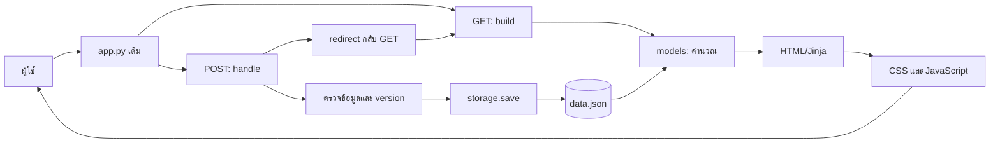

# รายละเอียดรวมทุกไฟล์ — โค้ดปัจจุบัน

เดดไลน์ไม่ชนกัน · CodeMind กลุ่ม 6 · 1 ตุลาคม 2569 (2026-10-01)

เอกสารนี้รวมบทจากคู่มือรายไฟล์ครบ 26 ไฟล์ จำนวน 2709 บรรทัดจริง ไม่แก้โค้ดเพื่อประกอบเอกสาร เริ่มอ่านตามส่วนรับผิดชอบ หากเอกสารยาวเกินควรใช้ [สารบัญแยกรายไฟล์](README.md)

## ภาพรวมการเดินทางของข้อมูล

ผู้ใช้ → app.py เดิม → GET/build หรือ POST/handle → models/storage → template Jinja → HTML/CSS/JavaScript → ผู้ใช้



## สูตรที่ต้องใช้ร่วมกัน

- remaining = max(0, estimate−done); progress = int(done×100/estimate) จำกัด 0–100
- วันคงเหลือ = due−วันนี้; วันทำได้ = วันคงเหลือ+1 สำหรับกำหนดที่ยังไม่ผ่าน
- cumulative = ผลรวม remaining ของ pending ที่ due ก่อนหรือเท่ากับวันตรวจ รวมงานค้าง
- spent = min(งบต่อวัน, work ที่บันทึกวันนี้จากทุกงาน); capacity = days×hours−spent
- required = (cumulative+spent)/days; gap = max(0,cumulative−capacity)
- shortfall/day = max(0,required−hours); ปัดค่าแสดงส่วนขาดขึ้น 0.1 หลังตัดสินความเสี่ยง
- today budget = max(0,hours−work วันนี้จริง); จัดสรรด้วย min(remaining,budget) แล้วลด budget
- work เท่านั้นรวม actual_total; adjustment/complete/reopen แสดงเหตุการณ์แต่ไม่เพิ่มเวลาจริง

## แผนที่เชื่อมหน้า

| หน้า | Python | Template | JavaScript |
|---|---|---|---|
| หน้าแรก / | app.py เดิม | home.html | ไม่มีเฉพาะหน้า |
| Overview | page1.py | page1.html + _task_card.html | reminders.js |
| Manage | page2.py | page2.html + _task_card.html | forms.js |
| Plan | page3.py | page3.html + _task_card.html | ไม่มี script เฉพาะหน้า |
| Team | team.py | team.html | ไม่มี script เฉพาะหน้า |

## ไฟล์เดิมที่ห้ามแก้และใช้เป็นบริบท

| ไฟล์ | หน้าที่ | สถานะ |
|---|---|---|
| app.py | route โหลด page/เรียก build/handle/render/redirect | ไม่แก้ |
| storage.py | load/save/reset ของรายการ JSON | ไม่แก้ |
| templates/base.html | header/nav/footer และ block | ไม่แก้ |
| templates/_not_built.html | หน้าอธิบายข้อผิดพลาด | ไม่แก้ |
| check_project.py | ตรวจคะแนนพื้นฐานและ hash | ไม่แก้ |
| test_pages.py | ชุดทดสอบอาจารย์ 4 กรณี | ไม่แก้ |

## สิ่งที่มีจริงและข้อจำกัด

ใช้ JSON ในเครื่อง ไม่มี login/database transaction/permanent task ID/service worker/push สถานะทีมไม่ใช่หลักฐาน commit ใช้ SHA ตรวจฟอร์มเก่าแต่ไม่มี file lock การแจ้งเตือนทำงานขณะเปิด Overview และ server

เมื่อโฟลเดอร์โครงการอ่านอย่างเดียว configure_storage เลือกพื้นที่ชั่วคราวสำหรับข้อมูลและ settings พร้อมข้อความแจ้งผู้ใช้ หรือใช้ DEADLINE_DATA_DIR ที่ผู้ดูแลกำหนด ข้อมูลชั่วคราวบน serverless ไม่รับประกันข้าม instance/การเริ่มระบบใหม่ อ่าน [คู่มือ deployment](../../DEPLOYMENT.md)

## เอกสารและภาพที่สร้าง/ปรับปรุงประกอบโครงการ

| รายการ | หน้าที่ |
|---|---|
| PROJECT_DETAIL.md, PYTHON_DETAIL.md, FRONTEND_DETAIL.md, JAVASCRIPT_DATA_DETAIL.md | ประวัติ source ฉบับแรก มีข้อความนำไปชุด current |
| UPGRADE_DETAILS.md | กติกาและความสามารถตามการปรับปรุง 14 ข้อ |
| TESTER_SUMMARY.md | สูตร/กรณีตรวจ/บทพูดของผู้ทดสอบ |
| PRESENTATION_SCRIPT.md | บทพูดแยกสมาชิก |
| FLOWCHARTS.md | ผังงาน GET/POST และแต่ละหน้า |
| docs/qa/QA_REPORT.md | ผลตรวจและขอบเขตที่ยังไม่ยืนยัน |
| docs/DEPLOYMENT.md | สาเหตุ EROFS รูปแบบพื้นที่จัดเก็บ และข้อจำกัดบนโฮสต์ |
| .gitignore | เพิ่ม runtime-data/ เพื่อไม่ส่งข้อมูล runtime ตัวอย่างเข้า Git |
| docs/qa/overview-desktop.jpg, overview-mobile.jpg | ภาพจากข้อมูลตัวอย่างจริง |
| docs/qa/overview-mobile-fixture.jpg, history-mobile-fixture.jpg | ภาพจากข้อมูลทดสอบชั่วคราว |
| study_metadata.json, study_symbols.json, study_questions.json | แหล่งคำอธิบาย/คำถามที่เขียนประกอบ source สำหรับสร้างชุดนี้ |
| build_current_details.py | เครื่องมือสร้าง snapshot docs; ไม่ใช่ส่วนที่ app.py โหลด |
| current/README.md, TEACHER_QUESTIONS.md, files/, source_manifest.json | สารบัญ คำถาม รายไฟล์ และข้อมูลตรวจความครบ |

## วิธีตรวจและใช้งานเอกสาร

1. อ่าน README เลือกไฟล์ของตนและตรวจ SHA หากมีการแก้ source
2. ซ้อมคำถามแล้วเปิด line ที่เกี่ยวข้อง ไม่จำเฉพาะข้อความ
3. ดูเว็บด้วย run.bat ที่พอร์ตที่เครื่องแจ้ง หากรัน check.bat ให้สำรอง data แยกก่อน
4. ใช้ pytest/Node/fixture ตาม TESTER_SUMMARY เพื่อทดสอบเพิ่มเติม ไม่แก้ไฟล์ห้ามแตะ
5. ตรวจ git log และ commit งานของตนจริงตามกติกา ไม่อ้างว่าคู่มือทำให้คะแนนทีมครบ

## สารบัญบททุกไฟล์

1. [models.py](#file-1)
2. [pages/page1.py](#file-2)
3. [pages/page2.py](#file-3)
4. [pages/page3.py](#file-4)
5. [pages/team.py](#file-5)
6. [templates/home.html](#file-6)
7. [templates/page1.html](#file-7)
8. [templates/page2.html](#file-8)
9. [templates/page3.html](#file-9)
10. [templates/team.html](#file-10)
11. [templates/_task_card.html](#file-11)
12. [static/style.css](#file-12)
13. [static/js/forms.js](#file-13)
14. [static/js/reminders.js](#file-14)
15. [data.json](#file-15)
16. [data.sample.json](#file-16)
17. [team.json](#file-17)
18. [planner_settings.json](#file-18)
19. [test_planner_features.py](#file-19)
20. [docs/qa/serve_fixture.py](#file-20)
21. [docs/qa/test_reminders.cjs](#file-21)
22. [PAGES.md](#file-22)
23. [README.md](#file-23)
24. [check.bat](#file-24)
25. [docs/qa/before_upgrade/data.json](#file-25)
26. [docs/qa/before_upgrade/data.sample.json](#file-26)

<a id="file-1"></a>

## ไฟล์ 1: models.py

## models.py — คลาสและกติกากลางของระบบ

อ้างอิงไฟล์ปัจจุบัน 1 ตุลาคม 2569 (2026-10-01); 500 physical lines (รวมบรรทัดว่าง)

**SHA-256 ของไฟล์จริง:** `6eabe7d01b493040bcfaa6d04ec1582c74611fb0ebc6d79b1b8e55fc6dfad681`

**ผู้ศึกษา/บทบาท:** นายวายุ ทาโสม · PM

### 1. หน้าที่และการเชื่อมต่อ

เลือกตำแหน่งข้อมูลที่เขียนได้ก่อนโหลดหน้า แทนงานหนึ่งชิ้นด้วย Assignment และรวมสูตร ลำดับงาน สถานะ ประวัติ และการเปลี่ยนสถานะที่ทุกหน้าใช้ร่วมกัน

- **รับเข้า:** row งาน 7 field, สมาชิกจาก team.json, form ที่ app.py ส่งให้ และชั่วโมงว่างรายวัน
- **ผลลัพธ์:** ข้อมูลแสดงผลที่คำนวณแล้ว dict/list/tuple และข้อความผลการบันทึก; บางฟังก์ชันเขียน data.json หรือ settings

**เกี่ยวข้องกับ:** storage.py (อ่าน/เขียนงาน); team.json (ข้อมูลสมาชิก); planner_settings.json (งบรายวัน); datetime, errno, hashlib, json, math, os, tempfile (standard library)

### 2. ลำดับทำงาน

1. configure_storage เลือกพื้นที่จาก DEADLINE_DATA_DIR หรือโฟลเดอร์โครงการ ทดสอบสิทธิ์และย้ายไปพื้นที่ชั่วคราวหากพื้นที่เดิมอ่านอย่างเดียว
2. สร้างสำเนาข้อมูล/settings เฉพาะที่ยังไม่มีและกำหนด storage.DATA_FILE/SETTINGS_FILE โดยไม่แก้ storage.py
3. สร้าง Assignment จาก field หลักและคำนวณ remaining/days/progress
4. สร้าง view ของงาน เติมเจ้าของ สถานะ ป้ายวันส่ง งานย่อย และ version
5. รวมภาระงานตามกำหนดส่ง หักเวลา work วันนี้ และตรวจเวลาไม่พอ
6. เรียงลำดับแล้วแบ่งเวลาวันนี้ไม่เกินงบคงเหลือ
7. แยก completed และนับสถิติพร้อม focus
8. ตรวจ version ของฟอร์มก่อนเปลี่ยนสถานะและบันทึก
9. รวม history แบบแยกชั่วโมงทำจริงจากเหตุการณ์อื่น

### 3. จุดที่ต้องอธิบายให้ถูก

- พื้นที่ชั่วคราวบน serverless ไม่เก็บถาวรและไม่ใช้ร่วมกันทุก instance; STORAGE_NOTICE แจ้งผู้ใช้ผ่าน context
- dict(row) สำเนาระดับบน; details_of ใช้ JSON round trip เพื่อคัดลอกข้อมูลซ้อนที่เป็น JSON
- ไม่มี permanent ID สำหรับงาน; no เป็นตำแหน่งเริ่ม 0 และ SHA ตรวจเนื้อหาเดิม
- hash ไม่ใช่ login, CSRF token หรือ file lock; JSON พร้อมกันหลาย process ยังอาจเขียนทับ
- progress เป็นยอด done_hours จึงรวมผลปิดงานตามประมาณ ส่วน actual_total รวม work เท่านั้น
- ceil_tenth ใช้ epsilon เล็กน้อยเพื่อลดผลคลาดเคลื่อน float; ความเสี่ยงตัดสินจาก raw_gap
- selection loop และการรวมภาระมีลักษณะ O(n²) เหมาะกับข้อมูลขนาดเล็กในรายวิชา

### 4. คำถามซ้อมตอบที่เกี่ยวกับไฟล์

- [Q003: ทำไมใช้ Python และ Flask?](TEACHER_QUESTIONS.md#q003)
- [Q011: class Assignment คืออะไร?](TEACHER_QUESTIONS.md#q011)
- [Q012: __init__ มีหน้าที่อะไร?](TEACHER_QUESTIONS.md#q012)
- [Q013: self หมายถึงอะไร?](TEACHER_QUESTIONS.md#q013)
- [Q014: attribute กับ method ต่างกันอย่างไร?](TEACHER_QUESTIONS.md#q014)
- [Q015: list กับ dict ใช้ต่างกันอย่างไรในงานนี้?](TEACHER_QUESTIONS.md#q015)
- [Q016: for กับ while ใช้ตรงไหน?](TEACHER_QUESTIONS.md#q016)
- [Q017: if/elif/else ทำงานตามลำดับอย่างไร?](TEACHER_QUESTIONS.md#q017)
- [Q020: try/except และ None ใช้เพื่ออะไร?](TEACHER_QUESTIONS.md#q020)
- [Q021: remaining_hours คำนวณอย่างไร?](TEACHER_QUESTIONS.md#q021)
- [Q022: progress คำนวณอย่างไร ทำไม 1.5 จาก 4 ได้ 37%?](TEACHER_QUESTIONS.md#q022)
- [Q023: days_left เป็นค่าติดลบได้หรือไม่?](TEACHER_QUESTIONS.md#q023)
- [Q024: ทำไมต้องตรวจ math.isfinite?](TEACHER_QUESTIONS.md#q024)
- [Q025: ทำไม read_date ตรวจ isoformat กลับอีกครั้ง?](TEACHER_QUESTIONS.md#q025)
- [Q026: dict(row) กับ details_of คัดลอกต่างกันอย่างไร?](TEACHER_QUESTIONS.md#q026)
- [Q027: no กับ version ใช้เพื่ออะไร?](TEACHER_QUESTIONS.md#q027)
- [Q028: SHA-256 ในที่นี้เข้ารหัสข้อมูลหรือไม่?](TEACHER_QUESTIONS.md#q028)
- [Q029: ทำไมไม่ใช้ sorted(key=...) และการเรียงมีต้นทุนเท่าไร?](TEACHER_QUESTIONS.md#q029)
- [Q030: ทำไมแยก work, adjustment, complete, reopen?](TEACHER_QUESTIONS.md#q030)
- [Q032: เรียงตามความเร่งด่วนด้วยอะไร?](TEACHER_QUESTIONS.md#q032)
- [Q033: งานสำคัญสูงที่ส่งไกลจะขึ้นก่อนงานส่งพรุ่งนี้หรือไม่?](TEACHER_QUESTIONS.md#q033)
- [Q034: ยังไม่เริ่มกับกำลังทำต่างกันอย่างไร?](TEACHER_QUESTIONS.md#q034)
- [Q035: งานกำลังทำและเกินกำหนดพร้อมกันได้หรือไม่?](TEACHER_QUESTIONS.md#q035)
- [Q036: soon_count รวมงานเกินกำหนดหรือไม่?](TEACHER_QUESTIONS.md#q036)
- [Q037: ทำไมเวลาแนะนำวันนี้ไม่เกินเวลาว่าง?](TEACHER_QUESTIONS.md#q037)
- [Q038: ทำวันนี้ 1.5 ชั่วโมง จากงบ 4 ระบบควรแนะนำเพิ่มเท่าไร?](TEACHER_QUESTIONS.md#q038)
- [Q039: ถ้าวันนี้ครบงบแต่ยังมีงานค้าง ทำอย่างไร?](TEACHER_QUESTIONS.md#q039)
- [Q040: กดเสร็จแล้วตัวเลข Overview เปลี่ยนอย่างไร?](TEACHER_QUESTIONS.md#q040)
- [Q048: ทำไมประวัติจริงไม่สร้างจาก done_hours เดิมทั้งหมด?](TEACHER_QUESTIONS.md#q048)
- [Q049: กดเปิดกลับคืนอะไร และทุกงานเสร็จเปิดกลับได้หรือไม่?](TEACHER_QUESTIONS.md#q049)
- [Q051: ทำไมคำนวณจำนวนวันด้วย days_left + 1?](TEACHER_QUESTIONS.md#q051)
- [Q052: ภาระสะสมคืออะไร?](TEACHER_QUESTIONS.md#q052)
- [Q053: สองงาน 3 และ 4 ชั่วโมงส่งวันนี้ ว่าง 4 ผลเป็นอย่างไร?](TEACHER_QUESTIONS.md#q053)
- [Q054: งาน 18 ชั่วโมงส่งพรุ่งนี้ ว่าง 4 ต่อวัน ขาดเท่าไร?](TEACHER_QUESTIONS.md#q054)
- [Q055: บันทึก work วันนี้แล้วสูตรความจุเปลี่ยนอย่างไร?](TEACHER_QUESTIONS.md#q055)
- [Q056: ว่าง 2 วันนี้ทำแล้ว 1 แต่ยังเหลืองานวันนี้ 2 ผลเท่าไร?](TEACHER_QUESTIONS.md#q056)
- [Q057: งานเกินกำหนดถูกคำนวณหารด้วยวันติดลบหรือไม่?](TEACHER_QUESTIONS.md#q057)
- [Q058: ทำไมขาดจริง 0.01 แสดง 0.1 และยังเสี่ยง?](TEACHER_QUESTIONS.md#q058)
- [Q060: required_daily เป็น 0 แต่ยังมีงานเสี่ยงได้หรือไม่?](TEACHER_QUESTIONS.md#q060)
- [Q066: hidden ป้องกันผู้ใช้แก้ค่าได้หรือไม่?](TEACHER_QUESTIONS.md#q066)
- [Q081: data.json เก็บกี่ field?](TEACHER_QUESTIONS.md#q081)
- [Q083: ข้อมูลเก่า 5 field ยังเปิดได้หรือไม่?](TEACHER_QUESTIONS.md#q083)
- [Q097: version ป้องกันผู้ใช้สองคนบันทึกพร้อมกันทั้งหมดหรือไม่?](TEACHER_QUESTIONS.md#q097)
- [Q098: ทำไมบน Vercel บันทึกไม่ได้ และแก้แล้วเก็บถาวรหรือไม่?](TEACHER_QUESTIONS.md#q098)
- [Q100: ถ้าอาจารย์ให้เปลี่ยนโจทย์หรือจับ bug สด ควรเริ่มตรงไหน?](TEACHER_QUESTIONS.md#q100)

### 5. ฟังก์ชัน/คลาสและตำแหน่ง

| ชื่อ | บรรทัดจริง | หน้าที่ |
|---|---|---|
| `configure_storage` | L18–L59 | ประกาศฟังก์ชัน `configure_storage`: ตรวจสิทธิ์เขียนและเลือกพื้นที่สำหรับข้อมูล/settings ตั้งปลายทาง storage โดยไม่แก้ไฟล์อาจารย์ คืนข้อความเมื่อเลือกพื้นที่ชั่วคราว; ทำงานเมื่อ import models |
| `Assignment` | L65–L85 | ประกาศ class `Assignment` เป็นแบบแทนงาน; ไม่ได้สร้าง object จนกว่าจะเรียก constructor |
| `__init__` | L66–L74 | ประกาศฟังก์ชัน `__init__`: รับข้อมูล 7 field และเก็บใน self; priority ปกติและ details ว่างเป็นค่าเริ่มต้นสำหรับข้อมูลเก่า |
| `remaining_hours` | L76–L77 | ประกาศฟังก์ชัน `remaining_hours`: คืนชั่วโมง estimate−done ไม่ติดลบ และปัด 2 ตำแหน่ง ไม่มีการเขียนไฟล์ |
| `days_left` | L79–L80 | ประกาศฟังก์ชัน `days_left`: คืนจำนวนวันส่ง−วันนี้ของ Python อาจเป็นลบ ไม่ใช้เวลาในวัน |
| `progress` | L82–L85 | ประกาศฟังก์ชัน `progress`: คืนเปอร์เซ็นต์ done/estimate แบบ int และจำกัด 0–100; estimate ไม่บวกคืน 0 |
| `read_number` | L88–L95 | ประกาศฟังก์ชัน `read_number`: ลอง float และตรวจ finite; คืน None เมื่อแปลงไม่ได้หรือเป็น NaN/Infinity |
| `read_date` | L98–L105 | ประกาศฟังก์ชัน `read_date`: อ่านวันและเทียบ isoformat ให้ตรง YYYY-MM-DD; คืน date หรือ None |
| `daily_hours` | L108–L112 | ประกาศฟังก์ชัน `daily_hours`: อ่านเลขผ่าน read_number แล้วรับเฉพาะ 0.1–12 ชั่วโมง |
| `load_daily_hours` | L115–L124 | ประกาศฟังก์ชัน `load_daily_hours`: อ่าน settings และตรวจค่า; หากไฟล์/โครงสร้าง/ค่าผิด ใช้ 2 |
| `save_daily_hours` | L127–L129 | ประกาศฟังก์ชัน `save_daily_hours`: เขียน object daily_hours ลง SETTINGS_FILE ด้วย UTF-8; ผู้เรียกต้องตรวจค่าก่อน |
| `team_data` | L132–L134 | ประกาศฟังก์ชัน `team_data`: อ่าน TEAM_FILE JSON เป็น dict; ฟังก์ชันนี้ไม่มี fallback เมื่อไฟล์เสีย |
| `details_of` | L137–L149 | ประกาศฟังก์ชัน `details_of`: สำเนารายละเอียดซ้อนผ่าน JSON round trip และ setdefault เฉพาะ key ที่หาย ไม่บันทึกลงไฟล์ |
| `version_of` | L152–L154 | ประกาศฟังก์ชัน `version_of`: serialize row แบบ sort_keys แล้วคืน SHA-256 hex สำหรับตรวจฟอร์มเดิม ไม่ใช่การเข้ารหัส |
| `ceil_tenth` | L157–L158 | ประกาศฟังก์ชัน `ceil_tenth`: จำกัดไม่ติดลบและปัดขึ้น 0.1 ชั่วโมง พร้อม epsilon เล็กเพื่อลดการปัดเกินจาก float |
| `task_view` | L161–L218 | ประกาศฟังก์ชัน `task_view`: สร้าง view จาก row: คำนวณชั่วโมง วัน เปอร์เซ็นต์ สถานะ เจ้าของ deadline งานย่อย stale และ version |
| `all_views` | L221–L227 | ประกาศฟังก์ชัน `all_views`: วน row ทีละรายการ เรียก task_view พร้อม position ตั้งแต่ 0 แล้วคืน list ใหม่ |
| `order_items` | L230–L241 | ประกาศฟังก์ชัน `order_items`: selection loop เลือก key น้อยที่สุดซ้ำจนรายการที่เหลือว่าง ไม่ใช้ sorted/lambda |
| `order_key` | L244–L259 | ประกาศฟังก์ชัน `order_key`: คืน tuple ที่ใช้เทียบลำดับ; mode deadline คืนวัน/index; urgency ตามเกณฑ์ 6 ข้อที่กำหนด |
| `worked_today` | L262–L268 | ประกาศฟังก์ชัน `worked_today`: รวม history kind=work ที่ date ตรงวันนี้ของทุก item รวมงานเสร็จ ปัด 2 ตำแหน่ง |
| `annotate_plan` | L271–L316 | ประกาศฟังก์ชัน `annotate_plan`: คัด pending และเติมภาระสะสม/ความจุ/เฉลี่ย/ส่วนขาด/สถานะใน view คืน ordered กับ risk_count |
| `today_plan` | L319–L341 | ประกาศฟังก์ชัน `today_plan`: เรียง pending แล้วเติมเหตุผลและ today_hours โดยลด budget ทุกงาน คืน ordered กับ recommendations |
| `overview` | L344–L377 | ประกาศฟังก์ชัน `overview`: รวมข้อมูลทุกงาน แผน การจัดสรรวันนี้ และสถิติเป็น context เดียวให้ทุกหน้าใช้ |
| `record_history` | L380–L386 | ประกาศฟังก์ชัน `record_history`: เติม event ลง row ในหน่วยความจำ ปรับ started/progress_on; ไม่เรียก storage.save เอง |
| `row_index` | L389–L398 | ประกาศฟังก์ชัน `row_index`: รับ no ASCII digit ไม่เกิน 8 หลัก ตรวจขอบเขตและ version; คืน index หรือ None |
| `quick_action` | L401–L453 | ประกาศฟังก์ชัน `quick_action`: โหลดงานล่าสุด ตรวจฟอร์ม เปลี่ยน start/complete/reopen และ storage.save หากผ่าน |
| `work_history` | L456–L483 | ประกาศฟังก์ชัน `work_history`: รวมประวัติทุกงาน เติมชื่อ/เจ้าของ/ประเภท เรียงวันที่ใหม่ก่อน และรวมจริงเฉพาะ work |
| `daily_history` | L486–L500 | ประกาศฟังก์ชัน `daily_history`: รวม history work ต่อ date เป็น hours/count โดยใช้รายการที่เรียงวันที่แล้ว |

### 6. ชื่อและคำศัพท์ที่พบใน Python

ชื่อที่เป็น local variable ให้ดูคำสั่งที่กำหนดค่าในบรรทัดจริง ตัวแปรชื่อเดียวกันต่างฟังก์ชันไม่จำเป็นต้องหมายถึง object เดียวกัน

| ชื่อ | ความหมาย |
|---|---|
| `Assignment` | ชื่อที่ประกาศ/นำเข้า/เข้าถึงใน source; ตรวจตำแหน่งนิยามและ argument ในโค้ดด้านล่าง |
| `AttributeError` | ชื่อที่ประกาศ/นำเข้า/เข้าถึงใน source; ตรวจตำแหน่งนิยามและ argument ในโค้ดด้านล่าง |
| `DATA_FILE` | ชื่อที่ประกาศ/นำเข้า/เข้าถึงใน source; ตรวจตำแหน่งนิยามและ argument ในโค้ดด้านล่าง |
| `EACCES` | ไม่มีสิทธิ์เข้าถึง |
| `EPERM` | ไม่มีสิทธิ์ทำการดำเนินการนี้ |
| `EROFS` | พื้นที่ไฟล์อ่านอย่างเดียว |
| `FileExistsError` | ชื่อที่ประกาศ/นำเข้า/เข้าถึงใน source; ตรวจตำแหน่งนิยามและ argument ในโค้ดด้านล่าง |
| `HERE` | โฟลเดอร์ root ที่ได้จากตำแหน่งไฟล์ models.py |
| `OSError` | ชื่อที่ประกาศ/นำเข้า/เข้าถึงใน source; ตรวจตำแหน่งนิยามและ argument ในโค้ดด้านล่าง |
| `OverflowError` | ชื่อที่ประกาศ/นำเข้า/เข้าถึงใน source; ตรวจตำแหน่งนิยามและ argument ในโค้ดด้านล่าง |
| `PRIORITIES` | dict แปล priority เป็นข้อความไทย |
| `SETTINGS_FILE` | path ของ planner_settings.json |
| `STORAGE_NOTICE` | ข้อความสถานะพื้นที่เก็บข้อมูลที่ initializer คืน ว่างเมื่อใช้พื้นที่โครงการหรือพื้นที่ที่กำหนดเอง |
| `TEAM_FILE` | path ของ team.json |
| `TemporaryFile` | เปิดไฟล์ชั่วคราวและลบอัตโนมัติเมื่อปิด ใช้ทดสอบสิทธิ์เขียนของโฟลเดอร์ |
| `TypeError` | ชื่อที่ประกาศ/นำเข้า/เข้าถึงใน source; ตรวจตำแหน่งนิยามและ argument ในโค้ดด้านล่าง |
| `ValueError` | ชื่อที่ประกาศ/นำเข้า/เข้าถึงใน source; ตรวจตำแหน่งนิยามและ argument ในโค้ดด้านล่าง |
| `__file__` | ชื่อที่ประกาศ/นำเข้า/เข้าถึงใน source; ตรวจตำแหน่งนิยามและ argument ในโค้ดด้านล่าง |
| `__init__` | รับข้อมูล 7 field และเก็บใน self; priority ปกติและ details ว่างเป็นค่าเริ่มต้นสำหรับข้อมูลเก่า |
| `abspath` | ชื่อที่ประกาศ/นำเข้า/เข้าถึงใน source; ตรวจตำแหน่งนิยามและ argument ในโค้ดด้านล่าง |
| `action` | ชื่อที่ประกาศ/นำเข้า/เข้าถึงใน source; ตรวจตำแหน่งนิยามและ argument ในโค้ดด้านล่าง |
| `actual_today` | ชั่วโมงประวัติ work ของวันนี้ |
| `actual_total` | ชั่วโมง work จริงที่มีบันทึกทั้งหมด |
| `all_views` | วน row ทีละรายการ เรียก task_view พร้อม position ตั้งแต่ 0 แล้วคืน list ใหม่ |
| `annotate_plan` | คัด pending และเติมภาระสะสม/ความจุ/เฉลี่ย/ส่วนขาด/สถานะใน view คืน ordered กับ risk_count |
| `append` | เพิ่มหนึ่งรายการต่อท้าย list |
| `budget` | งบเวลาที่ยังแบ่งให้รายการถัดไปได้ |
| `capacity` | ชั่วโมงความจุที่ยังมีถึงวันส่งหลังหักเวลา work วันนี้ |
| `ceil` | ชื่อที่ประกาศ/นำเข้า/เข้าถึงใน source; ตรวจตำแหน่งนิยามและ argument ในโค้ดด้านล่าง |
| `ceil_tenth` | จำกัดไม่ติดลบและปัดขึ้น 0.1 ชั่วโมง พร้อม epsilon เล็กเพื่อลดการปัดเกินจาก float |
| `completed` | รายการงานที่ remaining=0 |
| `configure_storage` | ตรวจสิทธิ์เขียนและเลือกพื้นที่สำหรับข้อมูล/settings ตั้งปลายทาง storage โดยไม่แก้ไฟล์อาจารย์ คืนข้อความเมื่อเลือกพื้นที่ชั่วคราว; ทำงานเมื่อ import models |
| `configured` | path ที่ผู้ดูแลกำหนดผ่าน DEADLINE_DATA_DIR หลังตัดช่องว่าง |
| `course` | ชื่อวิชา |
| `cumulative` | ชั่วโมงงานสะสมถึงกำหนดส่งที่ตรวจ |
| `daily_history` | รวม history work ต่อ date เป็น hours/count โดยใช้รายการที่เรียงวันที่แล้ว |
| `daily_hours` | เวลาว่างรายวันที่ตั้งไว้ |
| `data_dir` | โฟลเดอร์ปลายทางที่เลือกให้เขียนข้อมูล/settings |
| `date` | ชนิดวันที่ระดับวันจาก datetime |
| `datetime` | ชื่อที่ประกาศ/นำเข้า/เข้าถึงใน source; ตรวจตำแหน่งนิยามและ argument ในโค้ดด้านล่าง |
| `day` | สรุปวันที่หนึ่งใน daily_history |
| `days` | จำนวนวันรวมวันนี้ หรือ list สรุปวันตามบริบท |
| `days_left` | วันส่ง−วันนี้ |
| `details` | dict รายละเอียดซ้อนที่สำเนาแล้ว |
| `details_of` | สำเนารายละเอียดซ้อนผ่าน JSON round trip และ setdefault เฉพาะ key ที่หาย ไม่บันทึกลงไฟล์ |
| `dict` | ชนิด map; dict(row) เป็นสำเนาระดับบน |
| `dir` | ชื่อที่ประกาศ/นำเข้า/เข้าถึงใน source; ตรวจตำแหน่งนิยามและ argument ในโค้ดด้านล่าง |
| `dirname` | ชื่อที่ประกาศ/นำเข้า/เข้าถึงใน source; ตรวจตำแหน่งนิยามและ argument ในโค้ดด้านล่าง |
| `done_hours` | ยอดความคืบหน้าสะสม รวมการปรับ/ปิดงานตามประมาณ |
| `due_date` | วันส่งมาตรฐาน YYYY-MM-DD |
| `dump` | เขียน JSON ลงไฟล์ |
| `dumps` | แปลง object เป็นข้อความ JSON |
| `encode` | แปลงข้อความเป็น bytes UTF-8 |
| `encoding` | ชื่อที่ประกาศ/นำเข้า/เข้าถึงใน source; ตรวจตำแหน่งนิยามและ argument ในโค้ดด้านล่าง |
| `ensure_ascii` | ชื่อที่ประกาศ/นำเข้า/เข้าถึงใน source; ตรวจตำแหน่งนิยามและ argument ในโค้ดด้านล่าง |
| `entry` | รายการประวัติหนึ่งครั้ง |
| `environ` | mapping ของตัวแปรสภาพแวดล้อมของ process |
| `errno` | module ค่ารหัสข้อผิดพลาดของระบบปฏิบัติการ |
| `error` | ข้อความข้อผิดพลาดจาก check |
| `estimated_hours` | ชั่วโมงที่คาดว่าจะใช้ทั้งงาน |
| `exist_ok` | ชื่อที่ประกาศ/นำเข้า/เข้าถึงใน source; ตรวจตำแหน่งนิยามและ argument ในโค้ดด้านล่าง |
| `existing` | สรุปวันที่พบแล้ว หรือ None |
| `exists` | ชื่อที่ประกาศ/นำเข้า/เข้าถึงใน source; ตรวจตำแหน่งนิยามและ argument ในโค้ดด้านล่าง |
| `file` | ไฟล์ที่เปิดใน with |
| `first` | รายการที่มี key น้อยที่สุดในรอบเลือก |
| `float` | แปลงเป็นเลขทศนิยม ยังต้องตรวจ finite |
| `focus` | งาน pending แรกตามความเร่งด่วน หรือ None |
| `form` | dict ของข้อมูลฟอร์ม POST |
| `fromisoformat` | แปลงข้อความมาตรฐานเป็น date |
| `get` | อ่านค่า dict พร้อม default เมื่อไม่มี key |
| `gettempdir` | คืนตำแหน่งพื้นที่ชั่วคราวของระบบ เช่น /tmp บน Linux |
| `hashlib` | standard library สำหรับค่า hash |
| `hexdigest` | คืน hash เป็น string เลขฐานสิบหก |
| `history` | ประวัติหลายรายการ |
| `hours` | จำนวนชั่วโมง; อ่านหน่วยรายวันหรือครั้งนี้ตามฟังก์ชัน |
| `indent` | ชื่อที่ประกาศ/นำเข้า/เข้าถึงใน source; ตรวจตำแหน่งนิยามและ argument ในโค้ดด้านล่าง |
| `index` | ตำแหน่งที่ผ่านตรวจขอบเขต |
| `int` | แปลงเป็นจำนวนเต็ม ตัดเศษของเลขบวกใน progress |
| `isascii` | ตรวจอักขระอยู่ใน ASCII |
| `isdigit` | ตรวจว่าเป็นกลุ่มตัวเลข; ใน no ใช้คู่ isascii ป้องกัน unicode digit |
| `isfinite` | ตรวจว่าเป็นเลขจำกัด ไม่ใช่ NaN/Infinity |
| `isinstance` | ตรวจชนิด object |
| `isoformat` | แปลง date เป็น YYYY-MM-DD |
| `item` | dict สำหรับแสดงผล/รายการที่กำลังวนตามบริบทฟังก์ชัน |
| `items` | list ของข้อมูลแสดงผล |
| `join` | ชื่อที่ประกาศ/นำเข้า/เข้าถึงใน source; ตรวจตำแหน่งนิยามและ argument ในโค้ดด้านล่าง |
| `json` | standard library serialize/parse JSON |
| `kind` | ชนิด event work/adjustment/complete/reopen |
| `latest` | ประวัติที่มีวันที่ใหม่ที่สุดในรอบเลือก |
| `len` | จำนวนสมาชิก/อักขระ |
| `line` | ชื่อที่ประกาศ/นำเข้า/เข้าถึงใน source; ตรวจตำแหน่งนิยามและ argument ในโค้ดด้านล่าง |
| `list` | ชนิดรายการ; list(items) สำเนารายการระดับบน |
| `load` | อ่าน/parse JSON หรือ storage.load ตาม module ที่เรียก |
| `load_daily_hours` | อ่าน settings และตรวจค่า; หากไฟล์/โครงสร้าง/ค่าผิด ใช้ 2 |
| `loads` | แปลงข้อความ JSON กลับเป็น object |
| `makedirs` | สร้างโฟลเดอร์พร้อม parent; exist_ok=True ยอมรับโฟลเดอร์ที่มีแล้ว |
| `math` | standard library finite และ ceil |
| `max` | เลือกค่ามากที่สุด |
| `member` | สมาชิกหนึ่งคน |
| `members` | list สมาชิกจาก team.json |
| `message` | ข้อความคืนให้ app แสดง banner |
| `min` | เลือกค่าน้อยที่สุด |
| `mode` | ชื่อที่ประกาศ/นำเข้า/เข้าถึงใน source; ตรวจตำแหน่งนิยามและ argument ในโค้ดด้านล่าง |
| `name` | ชื่อสมาชิก/ข้อความงานย่อยตามบริบท |
| `note` | หมายเหตุของประวัติ |
| `on_date` | วันที่ทำงานที่ผู้ใช้เลือก |
| `open` | เปิดไฟล์ตาม mode/encoding ที่กำหนด |
| `order_items` | selection loop เลือก key น้อยที่สุดซ้ำจนรายการที่เหลือว่าง ไม่ใช้ sorted/lambda |
| `order_key` | คืน tuple ที่ใช้เทียบลำดับ; mode deadline คืนวัน/index; urgency ตามเกณฑ์ 6 ข้อที่กำหนด |
| `ordered` | รายการหลังเรียงตามเกณฑ์ |
| `os` | standard library จัดการ path |
| `other` | ชื่อที่ประกาศ/นำเข้า/เข้าถึงใน source; ตรวจตำแหน่งนิยามและ argument ในโค้ดด้านล่าง |
| `overdue_count` | จำนวนงานค้างที่วันส่งก่อนวันนี้ |
| `overdue_rank` | ชื่อที่ประกาศ/นำเข้า/เข้าถึงใน source; ตรวจตำแหน่งนิยามและ argument ในโค้ดด้านล่าง |
| `overview` | รวมข้อมูลทุกงาน แผน การจัดสรรวันนี้ และสถิติเป็น context เดียวให้ทุกหน้าใช้ |
| `path` | ชื่อที่ประกาศ/นำเข้า/เข้าถึงใน source; ตรวจตำแหน่งนิยามและ argument ในโค้ดด้านล่าง |
| `pending` | รายการงานที่ remaining>0 |
| `pop` | ลบ key หรือ index และคืนค่า; หาก dict ให้ default ใช้เมื่อไม่พบ |
| `position` | ตัวนับตำแหน่งงานเริ่ม 0 |
| `previous` | row/ค่าก่อนเปลี่ยน หรือสถานะงานย่อยก่อนปิดตามบริบท |
| `priority` | ระดับ high/normal/low |
| `priority_rank` | ชื่อที่ประกาศ/นำเข้า/เข้าถึงใน source; ตรวจตำแหน่งนิยามและ argument ในโค้ดด้านล่าง |
| `progress` | เปอร์เซ็นต์แบบจำนวนเต็ม |
| `progress_date` | วันที่อัปเดตล่าสุด/วันที่สร้างที่ใช้เช็ก stale |
| `quick_action` | โหลดงานล่าสุด ตรวจฟอร์ม เปลี่ยน start/complete/reopen และ storage.save หากผ่าน |
| `raw_gap` | ชื่อที่ประกาศ/นำเข้า/เข้าถึงใน source; ตรวจตำแหน่งนิยามและ argument ในโค้ดด้านล่าง |
| `read` | ชื่อที่ประกาศ/นำเข้า/เข้าถึงใน source; ตรวจตำแหน่งนิยามและ argument ในโค้ดด้านล่าง |
| `read_date` | อ่านวันและเทียบ isoformat ให้ตรง YYYY-MM-DD; คืน date หรือ None |
| `read_number` | ลอง float และตรวจ finite; คืน None เมื่อแปลงไม่ได้หรือเป็น NaN/Infinity |
| `recommendations` | งานที่ได้รับการจัดสรรเวลาเพิ่มวันนี้ |
| `record_history` | เติม event ลง row ในหน่วยความจำ ปรับ started/progress_on; ไม่เรียก storage.save เอง |
| `remaining` | ชั่วโมงคงเหลือหรือรายการที่เหลือในการเรียงตามบริบท |
| `remaining_hours` | คืนชั่วโมง estimate−done ไม่ติดลบ และปัด 2 ตำแหน่ง ไม่มีการเขียนไฟล์ |
| `remaining_total` | ผลรวมชั่วโมงคงเหลือ pending |
| `remove` | เอารายการที่เท่ากับค่าที่ให้หนึ่งรายการออกจาก list |
| `required` | ชั่วโมงเฉลี่ยที่ต้องทำ/ค่าสูงสุดของช่วงตามบริบท |
| `result` | ชื่อที่ประกาศ/นำเข้า/เข้าถึงใน source; ตรวจตำแหน่งนิยามและ argument ในโค้ดด้านล่าง |
| `risk_count` | จำนวนงานที่ at_risk จริง |
| `risk_rank` | ชื่อที่ประกาศ/นำเข้า/เข้าถึงใน source; ตรวจตำแหน่งนิยามและ argument ในโค้ดด้านล่าง |
| `round` | ปัดตัวเลขตามจำนวนตำแหน่งที่ระบุ |
| `row` | dict ข้อมูลงานหนึ่งรายการ |
| `row_index` | รับ no ASCII digit ไม่เกิน 8 หลัก ตรวจขอบเขตและ version; คืน index หรือ None |
| `rows` | list ข้อมูลงานจาก storage |
| `save` | เขียนทั้งรายการงานผ่าน storage |
| `save_daily_hours` | เขียน object daily_hours ลง SETTINGS_FILE ด้วย UTF-8; ผู้เรียกต้องตรวจค่าก่อน |
| `self` | object ของงานที่เมธอดกำลังทำงานอยู่ |
| `setdefault` | เติม default เฉพาะ key ที่ยังไม่มี |
| `settings` | object ของค่าชั่วโมงรายวัน |
| `sha256` | ชื่อที่ประกาศ/นำเข้า/เข้าถึงใน source; ตรวจตำแหน่งนิยามและ argument ในโค้ดด้านล่าง |
| `soon_count` | งานค้างส่งวันนี้ถึงอีก 3 วัน ไม่รวมเกินกำหนด |
| `sort_keys` | ชื่อที่ประกาศ/นำเข้า/เข้าถึงใน source; ตรวจตำแหน่งนิยามและ argument ในโค้ดด้านล่าง |
| `source` | ชื่อที่ประกาศ/นำเข้า/เข้าถึงใน source; ตรวจตำแหน่งนิยามและ argument ในโค้ดด้านล่าง |
| `spent` | work วันนี้ที่ถูก cap ไม่เกินงบรายวัน |
| `stale_count` | จำนวนงานค้างที่ไม่มีวันอัปเดต/ผ่านอย่างน้อย 2 วัน |
| `storage` | module อ่าน/เขียนงานที่อาจารย์ให้ |
| `str` | แปลงเป็นข้อความ |
| `strip` | ตัดช่องว่างริมข้อความทั้งสองด้าน |
| `subtask` | ชื่อที่ประกาศ/นำเข้า/เข้าถึงใน source; ตรวจตำแหน่งนิยามและ argument ในโค้ดด้านล่าง |
| `suffix` | รหัส SHA ของ HERE 12 อักขระเพื่อแยกโฟลเดอร์ชั่วคราวตามตำแหน่งโครงการ |
| `target` | path ไฟล์ข้อมูลปลายทางใน initializer |
| `task` | Assignment หรือ dict ของงานตามฟังก์ชันที่ใช้งาน |
| `task_view` | สร้าง view จาก row: คำนวณชั่วโมง วัน เปอร์เซ็นต์ สถานะ เจ้าของ deadline งานย่อย stale และ version |
| `team_data` | อ่าน TEAM_FILE JSON เป็น dict; ฟังก์ชันนี้ไม่มี fallback เมื่อไฟล์เสีย |
| `tempfile` | standard library สร้างพื้นที่ชั่วคราว |
| `temporary` | boolean ว่าเลือกพื้นที่ชั่วคราวอัตโนมัติหรือไม่ |
| `text` | ข้อความก่อนแปลงหรือ serialize |
| `title` | ชื่องาน/ชื่อหัวข้อขึ้นกับ dict |
| `today` | วันที่ปัจจุบันจากเครื่อง Python |
| `today_plan` | เรียง pending แล้วเติมเหตุผลและ today_hours โดยลด budget ทุกงาน คืน ordered กับ recommendations |
| `today_remaining` | เวลางบวันนี้ที่ยังจัดสรรเพิ่มได้ |
| `total` | ชื่อที่ประกาศ/นำเข้า/เข้าถึงใน source; ตรวจตำแหน่งนิยามและ argument ในโค้ดด้านล่าง |
| `value` | ค่าที่อ่าน/ตรวจอยู่ในฟังก์ชัน |
| `version_of` | serialize row แบบ sort_keys แล้วคืน SHA-256 hex สำหรับตรวจฟอร์มเดิม ไม่ใช่การเข้ารหัส |
| `work_history` | รวมประวัติทุกงาน เติมชื่อ/เจ้าของ/ประเภท เรียงวันที่ใหม่ก่อน และรวมจริงเฉพาะ work |
| `worked_today` | รวม history kind=work ที่ date ตรงวันนี้ของทุก item รวมงานเสร็จ ปัด 2 ตำแหน่ง |
| `write` | ชื่อที่ประกาศ/นำเข้า/เข้าถึงใน source; ตรวจตำแหน่งนิยามและ argument ในโค้ดด้านล่าง |

### 7. โค้ดปัจจุบันครบทั้งไฟล์

คัดลอกเพื่ออ่านประกอบเท่านั้น ไม่ใช้สำเนานี้ทับ source โดยไม่ตรวจ SHA ถ้าไฟล์จริงเปลี่ยนเลขบรรทัดอาจไม่ตรง LF/CRLF แสดงเป็นการขึ้นบรรทัดในเอกสาร แต่ SHA คำนวณจาก bytes จริง

```python
"""Assignment, shared calculations, and form actions for Deadline Compass."""
from datetime import date
import errno
import hashlib
import json
import math
import os
import tempfile

import storage

HERE = os.path.dirname(os.path.abspath(__file__))
SETTINGS_FILE = os.path.join(HERE, "planner_settings.json")
TEAM_FILE = os.path.join(HERE, "team.json")
PRIORITIES = {"high": "สูง", "normal": "ปกติ", "low": "ต่ำ"}


def configure_storage():
    """Keep the given storage API; select a writable location before pages use it."""
    global SETTINGS_FILE
    configured = os.environ.get("DEADLINE_DATA_DIR", "").strip()
    data_dir = os.path.abspath(configured or HERE)
    temporary = False
    try:
        os.makedirs(data_dir, exist_ok=True)
        with tempfile.TemporaryFile(dir=data_dir):
            pass
    except OSError as error:
        if configured or error.errno not in (errno.EROFS, errno.EACCES, errno.EPERM):
            raise
        suffix = hashlib.sha256(HERE.encode("utf-8")).hexdigest()[:12]
        data_dir = os.path.join(tempfile.gettempdir(), "deadline-compass-" + suffix)
        os.makedirs(data_dir, exist_ok=True)
        temporary = True
    if data_dir == os.path.abspath(HERE):
        return ""
    for name in ("data.json", "planner_settings.json"):
        target = os.path.join(data_dir, name)
        if not os.path.exists(target):
            source = os.path.join(HERE, name)
            if os.path.exists(source):
                with open(source, encoding="utf-8") as file:
                    text = file.read()
            elif name == "data.json":
                text = "[]"
            else:
                text = '{"daily_hours": 2}'
            try:
                # Exclusive creation preserves data already saved by another start.
                with open(target, "x", encoding="utf-8") as file:
                    file.write(text)
            except FileExistsError:
                pass
    storage.DATA_FILE = os.path.join(data_dir, "data.json")
    SETTINGS_FILE = os.path.join(data_dir, "planner_settings.json")
    if temporary:
        return ("เวอร์ชันสาธิต: ข้อมูลเก็บชั่วคราว อาจหายหรือไม่ต่อเนื่องเมื่อระบบเริ่มใหม่ "
                "หากต้องการเก็บงานถาวร กรุณาใช้งานในเครื่องหรือพื้นที่จัดเก็บถาวร")
    return ""


STORAGE_NOTICE = configure_storage()


class Assignment:
    def __init__(self, title, course, due_date, estimated_hours, done_hours,
                 priority="normal", details=None):
        self.title = title
        self.course = course
        self.due_date = due_date
        self.estimated_hours = estimated_hours
        self.done_hours = done_hours
        self.priority = priority
        self.details = details or {}

    def remaining_hours(self):
        return round(max(0, self.estimated_hours - self.done_hours), 2)

    def days_left(self):
        return (date.fromisoformat(self.due_date) - date.today()).days

    def progress(self):
        if self.estimated_hours <= 0:
            return 0
        return min(100, max(0, int(self.done_hours * 100 / self.estimated_hours)))


def read_number(text):
    try:
        value = float(text)
    except (TypeError, ValueError, OverflowError):
        return None
    if not math.isfinite(value):
        return None
    return value


def read_date(text):
    try:
        result = date.fromisoformat(str(text))
    except (TypeError, ValueError):
        return None
    if result.isoformat() != text:
        return None
    return result


def daily_hours(text):
    value = read_number(text)
    if value is None or value < 0.1 or value > 12:
        return None
    return value


def load_daily_hours():
    try:
        with open(SETTINGS_FILE, encoding="utf-8") as file:
            settings = json.load(file)
        value = daily_hours(settings.get("daily_hours"))
    except (OSError, ValueError, AttributeError):
        value = None
    if value is None:
        return 2
    return value


def save_daily_hours(value):
    with open(SETTINGS_FILE, "w", encoding="utf-8") as file:
        json.dump({"daily_hours": value}, file, ensure_ascii=False, indent=2)


def team_data():
    with open(TEAM_FILE, encoding="utf-8") as file:
        return json.load(file)


def details_of(row):
    # Make an independent copy, including the nested subtasks and history.
    details = row.get("details", {})
    if not isinstance(details, dict):
        details = {}
    details = json.loads(json.dumps(details, ensure_ascii=False))
    details.setdefault("started", row["done_hours"] > 0)
    details.setdefault("owner", "")
    details.setdefault("subtasks", [])
    details.setdefault("history", [])
    details.setdefault("progress_on", "")
    details.setdefault("created_on", "")
    return details


def version_of(row):
    text = json.dumps(row, ensure_ascii=False, sort_keys=True)
    return hashlib.sha256(text.encode("utf-8")).hexdigest()


def ceil_tenth(value):
    return math.ceil(max(0, value) * 10 - 0.000000001) / 10


def task_view(row, position, members):
    details = details_of(row)
    task = Assignment(row["title"], row["course"], row["due_date"],
                      row["estimated_hours"], row["done_hours"],
                      row.get("priority", "normal"), details)
    item = dict(row)
    item["details"] = details
    item["priority"] = task.priority
    item["priority_label"] = PRIORITIES.get(task.priority, "ปกติ")
    item["no"] = position
    item["version"] = version_of(row)
    item["remaining_hours"] = task.remaining_hours()
    item["days_left"] = task.days_left()
    item["progress"] = task.progress()
    item["owner_name"] = "ยังไม่มีผู้รับผิดชอบ"
    for member in members:
        if member["id"] == details["owner"]:
            item["owner_name"] = member["name"]
    if item["remaining_hours"] == 0:
        item["status"] = "เสร็จแล้ว"
        item["status_icon"] = "✓"
        item["tone"] = "good"
    elif details["started"] or task.done_hours > 0:
        item["status"] = "กำลังทำ"
        item["status_icon"] = "▶"
        item["tone"] = "gold"
    else:
        item["status"] = "ยังไม่เริ่ม"
        item["status_icon"] = "○"
        item["tone"] = ""
    if item["days_left"] < 0:
        item["deadline_label"] = "เกินกำหนด " + str(-item["days_left"]) + " วัน"
        item["deadline_icon"] = "!"
        item["deadline_tone"] = "bad"
    elif item["days_left"] <= 3:
        item["deadline_label"] = "ใกล้ถึงกำหนด · อีก " + str(item["days_left"]) + " วัน"
        if item["days_left"] == 0:
            item["deadline_label"] = "ใกล้ถึงกำหนด · ส่งวันนี้"
        item["deadline_icon"] = "◷"
        item["deadline_tone"] = "gold"
    else:
        item["deadline_label"] = "ส่งอีก " + str(item["days_left"]) + " วัน"
        item["deadline_icon"] = "▣"
        item["deadline_tone"] = ""
    item["subtask_done"] = 0
    for subtask in details["subtasks"]:
        if subtask.get("done"):
            item["subtask_done"] = item["subtask_done"] + 1
    item["subtask_count"] = len(details["subtasks"])
    item["stale"] = False
    progress_date = read_date(details["progress_on"])
    if progress_date is None:
        progress_date = read_date(details["created_on"])
    if progress_date is None:
        item["stale"] = item["remaining_hours"] > 0
    elif item["remaining_hours"] > 0:
        item["stale"] = (date.today() - progress_date).days >= 2
    return item


def all_views(rows, members):
    items = []
    position = 0
    for row in rows:
        items.append(task_view(row, position, members))
        position = position + 1
    return items


def order_items(items, mode="urgency"):
    # Selection loop adapted from catalog/ranking.
    remaining = list(items)
    ordered = []
    while remaining:
        first = remaining[0]
        for item in remaining:
            if order_key(item, mode) < order_key(first, mode):
                first = item
        ordered.append(first)
        remaining.remove(first)
    return ordered


def order_key(item, mode):
    if mode == "deadline":
        return (item["due_date"], item["no"])
    overdue_rank = 1
    if item["days_left"] < 0:
        overdue_rank = 0
    risk_rank = 1
    if item.get("at_risk"):
        risk_rank = 0
    priority_rank = 1
    if item["priority"] == "high":
        priority_rank = 0
    elif item["priority"] == "low":
        priority_rank = 2
    return (overdue_rank, item["due_date"], -item["remaining_hours"],
            risk_rank, priority_rank, item["no"])


def worked_today(items):
    total = 0
    for item in items:
        for entry in item["details"]["history"]:
            if entry["kind"] == "work" and entry["date"] == date.today().isoformat():
                total = total + entry["hours"]
    return round(total, 2)


def annotate_plan(items, hours):
    spent = min(hours, worked_today(items))
    pending = []
    for item in items:
        if item["remaining_hours"] > 0:
            pending.append(item)
    ordered = order_items(pending, "deadline")
    risk_count = 0
    for task in ordered:
        cumulative = 0
        # Equal deadlines share the whole day's cumulative workload.
        for other in ordered:
            if other["due_date"] <= task["due_date"]:
                cumulative = cumulative + other["remaining_hours"]
        task["cumulative_hours"] = round(cumulative, 2)
        task["available_daily"] = hours
        task["at_risk"] = False
        if task["days_left"] < 0:
            task["plan_status"] = "เกินกำหนด"
            task["plan_icon"] = "!"
            task["plan_tone"] = "bad"
            task["gap"] = task["remaining_hours"]
            task["hours_per_day"] = task["remaining_hours"]
            task["shortfall_per_day"] = 0
            task["available_hours"] = 0
            task["at_risk"] = True
        else:
            days = task["days_left"] + 1
            capacity = days * hours - spent
            required = (cumulative + spent) / days
            raw_gap = max(0, cumulative - capacity)
            task["available_hours"] = round(capacity, 2)
            task["hours_per_day"] = ceil_tenth(required)
            task["gap"] = ceil_tenth(raw_gap)
            task["shortfall_per_day"] = ceil_tenth(max(0, required - hours))
            task["plan_status"] = "ตามแผน"
            task["plan_icon"] = "✓"
            task["plan_tone"] = "good"
            if raw_gap > 0.000000001:
                task["plan_status"] = "เวลาไม่พอ"
                task["plan_icon"] = "!"
                task["plan_tone"] = "bad"
                task["at_risk"] = True
        if task["at_risk"]:
            risk_count = risk_count + 1
    return ordered, risk_count


def today_plan(pending, budget):
    ordered = order_items(pending)
    recommendations = []
    for task in ordered:
        task["today_hours"] = 0
        task["reasons"] = []
        if task["days_left"] < 0:
            task["reasons"].append("เกินกำหนดแล้ว ควรติดต่อผู้สอนและจัดการก่อน")
        elif task["days_left"] <= 3:
            task["reasons"].append("ใกล้ถึงกำหนด ควรเริ่มก่อน")
        if task["remaining_hours"] >= 6:
            task["reasons"].append("ใช้เวลามาก ควรแบ่งเป็นงานย่อย")
        if task["at_risk"]:
            task["reasons"].append("งานนี้เสี่ยงไม่ทันเมื่อเทียบกับเวลาที่มี")
        if task["priority"] == "high":
            task["reasons"].append("ตั้งความสำคัญไว้สูง")
        if not task["reasons"]:
            task["reasons"].append("วันส่งใกล้ที่สุดในงานที่เหลือ")
        if budget > 0.000000001:
            task["today_hours"] = round(min(task["remaining_hours"], budget), 2)
            budget = round(max(0, budget - task["today_hours"]), 2)
            recommendations.append(task)
    return ordered, recommendations


def overview(rows, hours):
    members = team_data()["members"]
    items = all_views(rows, members)
    pending, risk_count = annotate_plan(items, hours)
    actual_today = worked_today(items)
    today_remaining = round(max(0, hours - actual_today), 2)
    ordered, recommendations = today_plan(pending, today_remaining)
    completed = []
    soon_count = 0
    overdue_count = 0
    stale_count = 0
    remaining_total = 0
    for item in items:
        if item["remaining_hours"] == 0:
            completed.append(item)
        else:
            remaining_total = remaining_total + item["remaining_hours"]
            if item["days_left"] < 0:
                overdue_count = overdue_count + 1
            elif item["days_left"] <= 3:
                soon_count = soon_count + 1
            if item["stale"]:
                stale_count = stale_count + 1
    focus = None
    if ordered:
        focus = ordered[0]
    return {"items": ordered, "completed": completed, "all_items": items,
            "recommendations": recommendations, "focus": focus,
            "open_count": len(ordered), "completed_count": len(completed),
            "soon_count": soon_count, "overdue_count": overdue_count,
            "remaining_total": round(remaining_total, 2), "risk_count": risk_count,
            "daily_hours": hours, "stale_count": stale_count,
            "actual_today": actual_today, "today_remaining": today_remaining,
            "notice": STORAGE_NOTICE}


def record_history(row, hours, kind, on_date, note=""):
    details = details_of(row)
    details["history"].append({"date": on_date, "hours": round(hours, 2),
                               "kind": kind, "note": note})
    details["started"] = True
    details["progress_on"] = date.today().isoformat()
    row["details"] = details


def row_index(form, rows):
    text = str(form.get("no", ""))
    if text == "" or not text.isascii() or not text.isdigit() or len(text) > 8:
        return None
    index = int(text)
    if index >= len(rows):
        return None
    if form.get("version", "") != version_of(rows[index]):
        return None
    return index


def quick_action(form):
    """Shared transitions from Overview, Manage, and Plan."""
    rows = storage.load()
    index = row_index(form, rows)
    if index is None:
        return "✗ รายการเปลี่ยนไปแล้ว กรุณาโหลดหน้าใหม่แล้วลองอีกครั้ง"
    row = rows[index]
    details = details_of(row)
    action = form.get("action", "")
    remaining = max(0, row["estimated_hours"] - row["done_hours"])
    if action == "start":
        if remaining == 0:
            return "✗ งานนี้เสร็จแล้ว"
        details["started"] = True
        details["progress_on"] = date.today().isoformat()
        row["details"] = details
        message = "✓ เริ่มงานนี้แล้ว เปิดหน้าจัดการงานเพื่อบันทึกเวลาและงานย่อย"
    elif action == "complete":
        if remaining == 0:
            return "✓ งานนี้เสร็จแล้ว"
        details["before_complete"] = row["done_hours"]
        details["subtasks_before_complete"] = []
        for subtask in details["subtasks"]:
            details["subtasks_before_complete"].append(subtask.get("done", False))
            subtask["done"] = True
        details["completed_on"] = date.today().isoformat()
        row["details"] = details
        row["done_hours"] = row["estimated_hours"]
        record_history(row, remaining, "complete", date.today().isoformat(),
                       "ปิดงานตามเวลาประมาณ ไม่ใช่ชั่วโมงทำงานจริง")
        message = "✓ ทำเครื่องหมายว่าเสร็จแล้ว งานย้ายไปหมวดเสร็จแล้ว"
    elif action == "reopen":
        if remaining > 0 or "before_complete" not in details:
            return "✗ ยกเลิกได้เฉพาะงานที่กดทำเครื่องหมายเสร็จแล้ว หากต้องปรับเวลาทำจริงให้แก้ไขข้อมูลงาน"
        row["done_hours"] = min(row["estimated_hours"],
                                details["before_complete"])
        if row["done_hours"] >= row["estimated_hours"]:
            row["done_hours"] = 0
        previous = details.pop("subtasks_before_complete", [])
        position = 0
        for subtask in details["subtasks"]:
            if position < len(previous):
                subtask["done"] = previous[position]
            position = position + 1
        details.pop("completed_on", None)
        details["started"] = True
        row["details"] = details
        record_history(row, 0, "reopen", date.today().isoformat(), "เปิดงานกลับมาทำต่อ")
        message = "✓ เปิดงานกลับมาทำต่อแล้ว"
    else:
        return "✗ ไม่รู้จักคำสั่ง"
    storage.save(rows)
    return message


def work_history(items):
    history = []
    actual_total = 0
    for item in items:
        for entry in item["details"]["history"]:
            line = dict(entry)
            line["title"] = item["title"]
            line["course"] = item["course"]
            line["owner_name"] = item["owner_name"]
            line["label"] = "บันทึกเวลาทำงาน"
            if entry["kind"] == "work":
                actual_total = actual_total + entry["hours"]
            elif entry["kind"] == "complete":
                line["label"] = "ปิดงานตามเวลาประมาณ"
            elif entry["kind"] == "adjustment":
                line["label"] = "ปรับยอดความคืบหน้า"
            elif entry["kind"] == "reopen":
                line["label"] = "เปิดงานอีกครั้ง"
            history.append(line)
    ordered = []
    while history:
        latest = history[0]
        for entry in history:
            if entry["date"] > latest["date"]:
                latest = entry
        ordered.append(latest)
        history.remove(latest)
    return ordered, round(actual_total, 2)


def daily_history(history):
    days = []
    for entry in history:
        if entry["kind"] != "work":
            continue
        existing = None
        for day in days:
            if day["date"] == entry["date"]:
                existing = day
        if existing is None:
            existing = {"date": entry["date"], "hours": 0, "count": 0}
            days.append(existing)
        existing["hours"] = round(existing["hours"] + entry["hours"], 2)
        existing["count"] = existing["count"] + 1
    return days
```

### 8. คำอธิบายทุกบรรทัด

สตริง ชื่อ และเครื่องหมายอยู่ครบใน code block แต่ละบรรทัดด้านล่าง ชื่อ identifier เป็นหนึ่งหน่วย ไม่แยกอักษรของชื่อเดียวกันเป็นความหมายใหม่ ช่องว่างใน Python กำหนด block ส่วนช่องว่างในข้อความ/HTML ให้ดูชนิดส่วนที่ครอบ

#### L1

```python
"""Assignment, shared calculations, and form actions for Deadline Compass."""
```

- ข้อความ docstring อธิบาย module/function ไม่ใช่คำสั่งบันทึกงาน

#### L2

```python
from datetime import date
```

- นำเข้าชื่อ/module ที่ใช้ในไฟล์: `from datetime import date`
- ชื่อที่ต้องรู้: `date` = ชนิดวันที่ระดับวันจาก datetime

#### L3

```python
import errno
```

- นำเข้าชื่อ/module ที่ใช้ในไฟล์: `import errno`
- ชื่อที่ต้องรู้: `errno` = module ค่ารหัสข้อผิดพลาดของระบบปฏิบัติการ

#### L4

```python
import hashlib
```

- นำเข้าชื่อ/module ที่ใช้ในไฟล์: `import hashlib`
- ชื่อที่ต้องรู้: `hashlib` = standard library สำหรับค่า hash

#### L5

```python
import json
```

- นำเข้าชื่อ/module ที่ใช้ในไฟล์: `import json`
- ชื่อที่ต้องรู้: `json` = standard library serialize/parse JSON

#### L6

```python
import math
```

- นำเข้าชื่อ/module ที่ใช้ในไฟล์: `import math`
- ชื่อที่ต้องรู้: `math` = standard library finite และ ceil

#### L7

```python
import os
```

- นำเข้าชื่อ/module ที่ใช้ในไฟล์: `import os`
- ชื่อที่ต้องรู้: `os` = standard library จัดการ path

#### L8

```python
import tempfile
```

- นำเข้าชื่อ/module ที่ใช้ในไฟล์: `import tempfile`
- ชื่อที่ต้องรู้: `tempfile` = standard library สร้างพื้นที่ชั่วคราว

#### L9

(บรรทัดว่าง)

- บรรทัดว่าง แยกส่วนให้คนอ่าน ไม่มีคำสั่งทำงาน

#### L10

```python
import storage
```

- นำเข้าชื่อ/module ที่ใช้ในไฟล์: `import storage`
- ชื่อที่ต้องรู้: `storage` = module อ่าน/เขียนงานที่อาจารย์ให้

#### L11

(บรรทัดว่าง)

- บรรทัดว่าง แยกส่วนให้คนอ่าน ไม่มีคำสั่งทำงาน

#### L12

```python
HERE = os.path.dirname(os.path.abspath(__file__))
```

- เก็บผล เรียก `os.path.dirname` ด้วย argument ที่แสดงในโค้ด ลง `HERE`
- เครื่องหมาย: `=` กำหนดค่า/default/keyword argument ไม่ใช่การเปรียบเทียบ; `.` เข้าถึง attribute/method ของชื่อด้านซ้าย; `(` เปิดกลุ่มนิพจน์/argument/tuple; `)` ปิดกลุ่มที่เปิดด้วย (
- ชื่อที่ต้องรู้: `HERE` = โฟลเดอร์ root ที่ได้จากตำแหน่งไฟล์ models.py; `os` = standard library จัดการ path

#### L13

```python
SETTINGS_FILE = os.path.join(HERE, "planner_settings.json")
```

- เก็บผล เรียก `os.path.join` ด้วย argument ที่แสดงในโค้ด ลง `SETTINGS_FILE`
- เครื่องหมาย: `=` กำหนดค่า/default/keyword argument ไม่ใช่การเปรียบเทียบ; `.` เข้าถึง attribute/method ของชื่อด้านซ้าย; `(` เปิดกลุ่มนิพจน์/argument/tuple; `,` คั่นสมาชิก/argument; `)` ปิดกลุ่มที่เปิดด้วย (
- ชื่อที่ต้องรู้: `SETTINGS_FILE` = path ของ planner_settings.json; `os` = standard library จัดการ path; `HERE` = โฟลเดอร์ root ที่ได้จากตำแหน่งไฟล์ models.py

#### L14

```python
TEAM_FILE = os.path.join(HERE, "team.json")
```

- เก็บผล เรียก `os.path.join` ด้วย argument ที่แสดงในโค้ด ลง `TEAM_FILE`
- เครื่องหมาย: `=` กำหนดค่า/default/keyword argument ไม่ใช่การเปรียบเทียบ; `.` เข้าถึง attribute/method ของชื่อด้านซ้าย; `(` เปิดกลุ่มนิพจน์/argument/tuple; `,` คั่นสมาชิก/argument; `)` ปิดกลุ่มที่เปิดด้วย (
- ชื่อที่ต้องรู้: `TEAM_FILE` = path ของ team.json; `os` = standard library จัดการ path; `HERE` = โฟลเดอร์ root ที่ได้จากตำแหน่งไฟล์ models.py

#### L15

```python
PRIORITIES = {"high": "สูง", "normal": "ปกติ", "low": "ต่ำ"}
```

- เก็บผล dict ที่มี key `'high'`, `'normal'`, `'low'` ลง `PRIORITIES`
- เครื่องหมาย: `=` กำหนดค่า/default/keyword argument ไม่ใช่การเปรียบเทียบ; `{` เปิด dict/set ตามบริบท; `:` เริ่ม block หรือคั่น key:value ใน dict ตามบริบท; `,` คั่นสมาชิก/argument; `}` ปิด dict/set
- ชื่อที่ต้องรู้: `PRIORITIES` = dict แปล priority เป็นข้อความไทย

#### L16

(บรรทัดว่าง)

- บรรทัดว่าง แยกส่วนให้คนอ่าน ไม่มีคำสั่งทำงาน

#### L17

(บรรทัดว่าง)

- บรรทัดว่าง แยกส่วนให้คนอ่าน ไม่มีคำสั่งทำงาน

#### L18

```python
def configure_storage():
```

- ประกาศฟังก์ชัน `configure_storage`: ตรวจสิทธิ์เขียนและเลือกพื้นที่สำหรับข้อมูล/settings ตั้งปลายทาง storage โดยไม่แก้ไฟล์อาจารย์ คืนข้อความเมื่อเลือกพื้นที่ชั่วคราว; ทำงานเมื่อ import models
- เครื่องหมาย: `(` เปิดกลุ่มนิพจน์/argument/tuple; `)` ปิดกลุ่มที่เปิดด้วย (; `:` เริ่ม block หรือคั่น key:value ใน dict ตามบริบท

#### L19

```python
    """Keep the given storage API; select a writable location before pages use it."""
```

- ข้อความ docstring อธิบาย module/function ไม่ใช่คำสั่งบันทึกงาน
- ย่อหน้า 4 ช่องว่าง: อยู่ใน block ที่เปิดก่อนหน้า; Python ใช้ indentation จัดโครงสร้าง

#### L20

```python
    global SETTINGS_FILE
```

- ให้การกำหนดค่าของ `SETTINGS_FILE` ภายในฟังก์ชันอ้างตัวแปรระดับ module เช่น path การตั้งค่า ไม่ใช่รายการงานใน page
- ชื่อที่ต้องรู้: `SETTINGS_FILE` = path ของ planner_settings.json
- ย่อหน้า 4 ช่องว่าง: อยู่ใน block ที่เปิดก่อนหน้า; Python ใช้ indentation จัดโครงสร้าง

#### L21

```python
    configured = os.environ.get("DEADLINE_DATA_DIR", "").strip()
```

- เก็บผล เรียก `os.environ.get('DEADLINE_DATA_DIR', '').strip` ด้วย argument ที่แสดงในโค้ด ลง `configured`
- เครื่องหมาย: `=` กำหนดค่า/default/keyword argument ไม่ใช่การเปรียบเทียบ; `.` เข้าถึง attribute/method ของชื่อด้านซ้าย; `(` เปิดกลุ่มนิพจน์/argument/tuple; `,` คั่นสมาชิก/argument; `)` ปิดกลุ่มที่เปิดด้วย (
- ชื่อที่ต้องรู้: `configured` = path ที่ผู้ดูแลกำหนดผ่าน DEADLINE_DATA_DIR หลังตัดช่องว่าง; `os` = standard library จัดการ path; `environ` = mapping ของตัวแปรสภาพแวดล้อมของ process; `get` = อ่านค่า dict พร้อม default เมื่อไม่มี key; `strip` = ตัดช่องว่างริมข้อความทั้งสองด้าน
- ย่อหน้า 4 ช่องว่าง: อยู่ใน block ที่เปิดก่อนหน้า; Python ใช้ indentation จัดโครงสร้าง

#### L22

```python
    data_dir = os.path.abspath(configured or HERE)
```

- เก็บผล เรียก `os.path.abspath` ด้วย argument ที่แสดงในโค้ด ลง `data_dir`
- เครื่องหมาย: `=` กำหนดค่า/default/keyword argument ไม่ใช่การเปรียบเทียบ; `.` เข้าถึง attribute/method ของชื่อด้านซ้าย; `(` เปิดกลุ่มนิพจน์/argument/tuple; `)` ปิดกลุ่มที่เปิดด้วย (
- ชื่อที่ต้องรู้: `data_dir` = โฟลเดอร์ปลายทางที่เลือกให้เขียนข้อมูล/settings; `os` = standard library จัดการ path; `configured` = path ที่ผู้ดูแลกำหนดผ่าน DEADLINE_DATA_DIR หลังตัดช่องว่าง; `HERE` = โฟลเดอร์ root ที่ได้จากตำแหน่งไฟล์ models.py
- ย่อหน้า 4 ช่องว่าง: อยู่ใน block ที่เปิดก่อนหน้า; Python ใช้ indentation จัดโครงสร้าง

#### L23

```python
    temporary = False
```

- เก็บผล `False` ลง `temporary`
- เครื่องหมาย: `=` กำหนดค่า/default/keyword argument ไม่ใช่การเปรียบเทียบ
- ชื่อที่ต้องรู้: `temporary` = boolean ว่าเลือกพื้นที่ชั่วคราวอัตโนมัติหรือไม่; `False` = boolean เท็จ
- ย่อหน้า 4 ช่องว่าง: อยู่ใน block ที่เปิดก่อนหน้า; Python ใช้ indentation จัดโครงสร้าง

#### L24

```python
    try:
```

- ลองคำสั่งใน try; หากเกิด exception ที่ระบุจึงเข้า except
- เครื่องหมาย: `:` เริ่ม block หรือคั่น key:value ใน dict ตามบริบท
- ย่อหน้า 4 ช่องว่าง: อยู่ใน block ที่เปิดก่อนหน้า; Python ใช้ indentation จัดโครงสร้าง

#### L25

```python
        os.makedirs(data_dir, exist_ok=True)
```

- เรียก `os.makedirs` ด้วย argument ที่แสดงในโค้ด
- เครื่องหมาย: `.` เข้าถึง attribute/method ของชื่อด้านซ้าย; `(` เปิดกลุ่มนิพจน์/argument/tuple; `,` คั่นสมาชิก/argument; `=` กำหนดค่า/default/keyword argument ไม่ใช่การเปรียบเทียบ; `)` ปิดกลุ่มที่เปิดด้วย (
- ชื่อที่ต้องรู้: `os` = standard library จัดการ path; `makedirs` = สร้างโฟลเดอร์พร้อม parent; exist_ok=True ยอมรับโฟลเดอร์ที่มีแล้ว; `data_dir` = โฟลเดอร์ปลายทางที่เลือกให้เขียนข้อมูล/settings; `True` = boolean จริง
- ย่อหน้า 8 ช่องว่าง: อยู่ใน block ที่เปิดก่อนหน้า; Python ใช้ indentation จัดโครงสร้าง

#### L26

```python
        with tempfile.TemporaryFile(dir=data_dir):
```

- ใช้ resource ใน with: เรียก `tempfile.TemporaryFile` ด้วย argument ที่แสดงในโค้ด; ออกจาก block แล้วปิด resource ตาม context manager
- เครื่องหมาย: `.` เข้าถึง attribute/method ของชื่อด้านซ้าย; `(` เปิดกลุ่มนิพจน์/argument/tuple; `=` กำหนดค่า/default/keyword argument ไม่ใช่การเปรียบเทียบ; `)` ปิดกลุ่มที่เปิดด้วย (; `:` เริ่ม block หรือคั่น key:value ใน dict ตามบริบท
- ชื่อที่ต้องรู้: `tempfile` = standard library สร้างพื้นที่ชั่วคราว; `TemporaryFile` = เปิดไฟล์ชั่วคราวและลบอัตโนมัติเมื่อปิด ใช้ทดสอบสิทธิ์เขียนของโฟลเดอร์; `data_dir` = โฟลเดอร์ปลายทางที่เลือกให้เขียนข้อมูล/settings
- ย่อหน้า 8 ช่องว่าง: อยู่ใน block ที่เปิดก่อนหน้า; Python ใช้ indentation จัดโครงสร้าง

#### L27

```python
            pass
```

- คำสั่งว่างใน block; with ยังเปิดและปิดไฟล์ชั่วคราวเพื่อทดสอบสิทธิ์เขียน หรือ except รับข้อผิดพลาดที่คาดไว้ตามตำแหน่ง
- ย่อหน้า 12 ช่องว่าง: อยู่ใน block ที่เปิดก่อนหน้า; Python ใช้ indentation จัดโครงสร้าง

#### L28

```python
    except OSError as error:
```

- รับ exception `OSError` แล้วทำ branch นี้
- เครื่องหมาย: `:` เริ่ม block หรือคั่น key:value ใน dict ตามบริบท
- ชื่อที่ต้องรู้: `error` = ข้อความข้อผิดพลาดจาก check
- ย่อหน้า 4 ช่องว่าง: อยู่ใน block ที่เปิดก่อนหน้า; Python ใช้ indentation จัดโครงสร้าง

#### L29

```python
        if configured or error.errno not in (errno.EROFS, errno.EACCES, errno.EPERM):
```

- ตรวจเงื่อนไข: `configured` หรือ `error.errno` ไม่อยู่ใน tuple [`errno.EROFS`, `errno.EACCES`, `errno.EPERM`]; เมื่อจริงจึงทำ body ที่ย่อหน้าต่อไป
- เครื่องหมาย: `.` เข้าถึง attribute/method ของชื่อด้านซ้าย; `(` เปิดกลุ่มนิพจน์/argument/tuple; `,` คั่นสมาชิก/argument; `)` ปิดกลุ่มที่เปิดด้วย (; `:` เริ่ม block หรือคั่น key:value ใน dict ตามบริบท
- ชื่อที่ต้องรู้: `configured` = path ที่ผู้ดูแลกำหนดผ่าน DEADLINE_DATA_DIR หลังตัดช่องว่าง; `error` = ข้อความข้อผิดพลาดจาก check; `errno` = module ค่ารหัสข้อผิดพลาดของระบบปฏิบัติการ; `EROFS` = พื้นที่ไฟล์อ่านอย่างเดียว; `EACCES` = ไม่มีสิทธิ์เข้าถึง; `EPERM` = ไม่มีสิทธิ์ทำการดำเนินการนี้
- ย่อหน้า 8 ช่องว่าง: อยู่ใน block ที่เปิดก่อนหน้า; Python ใช้ indentation จัดโครงสร้าง

#### L30

```python
            raise
```

- ส่ง exception/exit ตามค่าที่ระบุ ไม่ใช่ return context
- ย่อหน้า 12 ช่องว่าง: อยู่ใน block ที่เปิดก่อนหน้า; Python ใช้ indentation จัดโครงสร้าง

#### L31

```python
        suffix = hashlib.sha256(HERE.encode("utf-8")).hexdigest()[:12]
```

- เก็บผล `hashlib.sha256(HERE.encode('utf-8')).hexdigest()[:12]` (อ่าน key/index) ลง `suffix`
- เครื่องหมาย: `=` กำหนดค่า/default/keyword argument ไม่ใช่การเปรียบเทียบ; `.` เข้าถึง attribute/method ของชื่อด้านซ้าย; `(` เปิดกลุ่มนิพจน์/argument/tuple; `)` ปิดกลุ่มที่เปิดด้วย (; `[` เปิด list หรือการอ้าง index/key; `:` เริ่ม block หรือคั่น key:value ใน dict ตามบริบท; `]` ปิด list/การอ้าง index/key
- ชื่อที่ต้องรู้: `suffix` = รหัส SHA ของ HERE 12 อักขระเพื่อแยกโฟลเดอร์ชั่วคราวตามตำแหน่งโครงการ; `hashlib` = standard library สำหรับค่า hash; `HERE` = โฟลเดอร์ root ที่ได้จากตำแหน่งไฟล์ models.py; `encode` = แปลงข้อความเป็น bytes UTF-8; `hexdigest` = คืน hash เป็น string เลขฐานสิบหก
- ย่อหน้า 8 ช่องว่าง: อยู่ใน block ที่เปิดก่อนหน้า; Python ใช้ indentation จัดโครงสร้าง

#### L32

```python
        data_dir = os.path.join(tempfile.gettempdir(), "deadline-compass-" + suffix)
```

- เก็บผล เรียก `os.path.join` ด้วย argument ที่แสดงในโค้ด ลง `data_dir`
- เครื่องหมาย: `=` กำหนดค่า/default/keyword argument ไม่ใช่การเปรียบเทียบ; `.` เข้าถึง attribute/method ของชื่อด้านซ้าย; `(` เปิดกลุ่มนิพจน์/argument/tuple; `)` ปิดกลุ่มที่เปิดด้วย (; `,` คั่นสมาชิก/argument; `+` บวกเลข/ต่อข้อความตามชนิด
- ชื่อที่ต้องรู้: `data_dir` = โฟลเดอร์ปลายทางที่เลือกให้เขียนข้อมูล/settings; `os` = standard library จัดการ path; `tempfile` = standard library สร้างพื้นที่ชั่วคราว; `gettempdir` = คืนตำแหน่งพื้นที่ชั่วคราวของระบบ เช่น /tmp บน Linux; `suffix` = รหัส SHA ของ HERE 12 อักขระเพื่อแยกโฟลเดอร์ชั่วคราวตามตำแหน่งโครงการ
- ย่อหน้า 8 ช่องว่าง: อยู่ใน block ที่เปิดก่อนหน้า; Python ใช้ indentation จัดโครงสร้าง

#### L33

```python
        os.makedirs(data_dir, exist_ok=True)
```

- เรียก `os.makedirs` ด้วย argument ที่แสดงในโค้ด
- เครื่องหมาย: `.` เข้าถึง attribute/method ของชื่อด้านซ้าย; `(` เปิดกลุ่มนิพจน์/argument/tuple; `,` คั่นสมาชิก/argument; `=` กำหนดค่า/default/keyword argument ไม่ใช่การเปรียบเทียบ; `)` ปิดกลุ่มที่เปิดด้วย (
- ชื่อที่ต้องรู้: `os` = standard library จัดการ path; `makedirs` = สร้างโฟลเดอร์พร้อม parent; exist_ok=True ยอมรับโฟลเดอร์ที่มีแล้ว; `data_dir` = โฟลเดอร์ปลายทางที่เลือกให้เขียนข้อมูล/settings; `True` = boolean จริง
- ย่อหน้า 8 ช่องว่าง: อยู่ใน block ที่เปิดก่อนหน้า; Python ใช้ indentation จัดโครงสร้าง

#### L34

```python
        temporary = True
```

- เก็บผล `True` ลง `temporary`
- เครื่องหมาย: `=` กำหนดค่า/default/keyword argument ไม่ใช่การเปรียบเทียบ
- ชื่อที่ต้องรู้: `temporary` = boolean ว่าเลือกพื้นที่ชั่วคราวอัตโนมัติหรือไม่; `True` = boolean จริง
- ย่อหน้า 8 ช่องว่าง: อยู่ใน block ที่เปิดก่อนหน้า; Python ใช้ indentation จัดโครงสร้าง

#### L35

```python
    if data_dir == os.path.abspath(HERE):
```

- ตรวจเงื่อนไข: `data_dir` เท่ากับ เรียก `os.path.abspath` ด้วย argument ที่แสดงในโค้ด; เมื่อจริงจึงทำ body ที่ย่อหน้าต่อไป
- เครื่องหมาย: `==` เปรียบเทียบเท่ากัน; `.` เข้าถึง attribute/method ของชื่อด้านซ้าย; `(` เปิดกลุ่มนิพจน์/argument/tuple; `)` ปิดกลุ่มที่เปิดด้วย (; `:` เริ่ม block หรือคั่น key:value ใน dict ตามบริบท
- ชื่อที่ต้องรู้: `data_dir` = โฟลเดอร์ปลายทางที่เลือกให้เขียนข้อมูล/settings; `os` = standard library จัดการ path; `HERE` = โฟลเดอร์ root ที่ได้จากตำแหน่งไฟล์ models.py
- ย่อหน้า 4 ช่องว่าง: อยู่ใน block ที่เปิดก่อนหน้า; Python ใช้ indentation จัดโครงสร้าง

#### L36

```python
        return ""
```

- คืนให้ผู้เรียกและจบฟังก์ชันรอบนี้: `''`
- ย่อหน้า 8 ช่องว่าง: อยู่ใน block ที่เปิดก่อนหน้า; Python ใช้ indentation จัดโครงสร้าง

#### L37

```python
    for name in ("data.json", "planner_settings.json"):
```

- วน tuple [`'data.json'`, `'planner_settings.json'`] ให้ `name` รับสมาชิกทีละรอบ
- เครื่องหมาย: `(` เปิดกลุ่มนิพจน์/argument/tuple; `,` คั่นสมาชิก/argument; `)` ปิดกลุ่มที่เปิดด้วย (; `:` เริ่ม block หรือคั่น key:value ใน dict ตามบริบท
- ชื่อที่ต้องรู้: `name` = ชื่อสมาชิก/ข้อความงานย่อยตามบริบท
- ย่อหน้า 4 ช่องว่าง: อยู่ใน block ที่เปิดก่อนหน้า; Python ใช้ indentation จัดโครงสร้าง

#### L38

```python
        target = os.path.join(data_dir, name)
```

- เก็บผล เรียก `os.path.join` ด้วย argument ที่แสดงในโค้ด ลง `target`
- เครื่องหมาย: `=` กำหนดค่า/default/keyword argument ไม่ใช่การเปรียบเทียบ; `.` เข้าถึง attribute/method ของชื่อด้านซ้าย; `(` เปิดกลุ่มนิพจน์/argument/tuple; `,` คั่นสมาชิก/argument; `)` ปิดกลุ่มที่เปิดด้วย (
- ชื่อที่ต้องรู้: `target` = path ไฟล์ข้อมูลปลายทางใน initializer; `os` = standard library จัดการ path; `data_dir` = โฟลเดอร์ปลายทางที่เลือกให้เขียนข้อมูล/settings; `name` = ชื่อสมาชิก/ข้อความงานย่อยตามบริบท
- ย่อหน้า 8 ช่องว่าง: อยู่ใน block ที่เปิดก่อนหน้า; Python ใช้ indentation จัดโครงสร้าง

#### L39

```python
        if not os.path.exists(target):
```

- ตรวจเงื่อนไข: ไม่เป็นจริง: เรียก `os.path.exists` ด้วย argument ที่แสดงในโค้ด; เมื่อจริงจึงทำ body ที่ย่อหน้าต่อไป
- เครื่องหมาย: `.` เข้าถึง attribute/method ของชื่อด้านซ้าย; `(` เปิดกลุ่มนิพจน์/argument/tuple; `)` ปิดกลุ่มที่เปิดด้วย (; `:` เริ่ม block หรือคั่น key:value ใน dict ตามบริบท
- ชื่อที่ต้องรู้: `os` = standard library จัดการ path; `target` = path ไฟล์ข้อมูลปลายทางใน initializer
- ย่อหน้า 8 ช่องว่าง: อยู่ใน block ที่เปิดก่อนหน้า; Python ใช้ indentation จัดโครงสร้าง

#### L40

```python
            source = os.path.join(HERE, name)
```

- เก็บผล เรียก `os.path.join` ด้วย argument ที่แสดงในโค้ด ลง `source`
- เครื่องหมาย: `=` กำหนดค่า/default/keyword argument ไม่ใช่การเปรียบเทียบ; `.` เข้าถึง attribute/method ของชื่อด้านซ้าย; `(` เปิดกลุ่มนิพจน์/argument/tuple; `,` คั่นสมาชิก/argument; `)` ปิดกลุ่มที่เปิดด้วย (
- ชื่อที่ต้องรู้: `os` = standard library จัดการ path; `HERE` = โฟลเดอร์ root ที่ได้จากตำแหน่งไฟล์ models.py; `name` = ชื่อสมาชิก/ข้อความงานย่อยตามบริบท
- ย่อหน้า 12 ช่องว่าง: อยู่ใน block ที่เปิดก่อนหน้า; Python ใช้ indentation จัดโครงสร้าง

#### L41

```python
            if os.path.exists(source):
```

- ตรวจเงื่อนไข: เรียก `os.path.exists` ด้วย argument ที่แสดงในโค้ด; เมื่อจริงจึงทำ body ที่ย่อหน้าต่อไป
- เครื่องหมาย: `.` เข้าถึง attribute/method ของชื่อด้านซ้าย; `(` เปิดกลุ่มนิพจน์/argument/tuple; `)` ปิดกลุ่มที่เปิดด้วย (; `:` เริ่ม block หรือคั่น key:value ใน dict ตามบริบท
- ชื่อที่ต้องรู้: `os` = standard library จัดการ path
- ย่อหน้า 12 ช่องว่าง: อยู่ใน block ที่เปิดก่อนหน้า; Python ใช้ indentation จัดโครงสร้าง

#### L42

```python
                with open(source, encoding="utf-8") as file:
```

- ใช้ resource ใน with: เรียก `open` ด้วย argument ที่แสดงในโค้ด; ออกจาก block แล้วปิด resource ตาม context manager
- เครื่องหมาย: `(` เปิดกลุ่มนิพจน์/argument/tuple; `,` คั่นสมาชิก/argument; `=` กำหนดค่า/default/keyword argument ไม่ใช่การเปรียบเทียบ; `)` ปิดกลุ่มที่เปิดด้วย (; `:` เริ่ม block หรือคั่น key:value ใน dict ตามบริบท
- ชื่อที่ต้องรู้: `open` = เปิดไฟล์ตาม mode/encoding ที่กำหนด; `file` = ไฟล์ที่เปิดใน with
- ย่อหน้า 16 ช่องว่าง: อยู่ใน block ที่เปิดก่อนหน้า; Python ใช้ indentation จัดโครงสร้าง

#### L43

```python
                    text = file.read()
```

- เก็บผล เรียก `file.read` ด้วย argument ที่แสดงในโค้ด ลง `text`
- เครื่องหมาย: `=` กำหนดค่า/default/keyword argument ไม่ใช่การเปรียบเทียบ; `.` เข้าถึง attribute/method ของชื่อด้านซ้าย; `(` เปิดกลุ่มนิพจน์/argument/tuple; `)` ปิดกลุ่มที่เปิดด้วย (
- ชื่อที่ต้องรู้: `text` = ข้อความก่อนแปลงหรือ serialize; `file` = ไฟล์ที่เปิดใน with
- ย่อหน้า 20 ช่องว่าง: อยู่ใน block ที่เปิดก่อนหน้า; Python ใช้ indentation จัดโครงสร้าง

#### L44

```python
            elif name == "data.json":
```

- ตรวจเงื่อนไข: `name` เท่ากับ `'data.json'`; เมื่อจริงจึงทำ body ที่ย่อหน้าต่อไป
- เครื่องหมาย: `==` เปรียบเทียบเท่ากัน; `:` เริ่ม block หรือคั่น key:value ใน dict ตามบริบท
- ชื่อที่ต้องรู้: `name` = ชื่อสมาชิก/ข้อความงานย่อยตามบริบท
- ย่อหน้า 12 ช่องว่าง: อยู่ใน block ที่เปิดก่อนหน้า; Python ใช้ indentation จัดโครงสร้าง

#### L45

```python
                text = "[]"
```

- เก็บผล `'[]'` ลง `text`
- เครื่องหมาย: `=` กำหนดค่า/default/keyword argument ไม่ใช่การเปรียบเทียบ
- ชื่อที่ต้องรู้: `text` = ข้อความก่อนแปลงหรือ serialize
- ย่อหน้า 16 ช่องว่าง: อยู่ใน block ที่เปิดก่อนหน้า; Python ใช้ indentation จัดโครงสร้าง

#### L46

```python
            else:
```

- else: ทำทางเลือกเมื่อเงื่อนไขก่อนหน้าไม่จริง
- เครื่องหมาย: `:` เริ่ม block หรือคั่น key:value ใน dict ตามบริบท
- ย่อหน้า 12 ช่องว่าง: อยู่ใน block ที่เปิดก่อนหน้า; Python ใช้ indentation จัดโครงสร้าง

#### L47

```python
                text = '{"daily_hours": 2}'
```

- เก็บผล `'{"daily_hours": 2}'` ลง `text`
- เครื่องหมาย: `=` กำหนดค่า/default/keyword argument ไม่ใช่การเปรียบเทียบ
- ชื่อที่ต้องรู้: `text` = ข้อความก่อนแปลงหรือ serialize
- ย่อหน้า 16 ช่องว่าง: อยู่ใน block ที่เปิดก่อนหน้า; Python ใช้ indentation จัดโครงสร้าง

#### L48

```python
            try:
```

- ลองคำสั่งใน try; หากเกิด exception ที่ระบุจึงเข้า except
- เครื่องหมาย: `:` เริ่ม block หรือคั่น key:value ใน dict ตามบริบท
- ย่อหน้า 12 ช่องว่าง: อยู่ใน block ที่เปิดก่อนหน้า; Python ใช้ indentation จัดโครงสร้าง

#### L49

```python
                # Exclusive creation preserves data already saved by another start.
```

- comment สำหรับผู้อ่าน: Exclusive creation preserves data already saved by another start.
- ย่อหน้า 16 ช่องว่าง: อยู่ใน block ที่เปิดก่อนหน้า; Python ใช้ indentation จัดโครงสร้าง

#### L50

```python
                with open(target, "x", encoding="utf-8") as file:
```

- ใช้ resource ใน with: เรียก `open` ด้วย argument ที่แสดงในโค้ด; ออกจาก block แล้วปิด resource ตาม context manager
- เครื่องหมาย: `(` เปิดกลุ่มนิพจน์/argument/tuple; `,` คั่นสมาชิก/argument; `=` กำหนดค่า/default/keyword argument ไม่ใช่การเปรียบเทียบ; `)` ปิดกลุ่มที่เปิดด้วย (; `:` เริ่ม block หรือคั่น key:value ใน dict ตามบริบท
- ชื่อที่ต้องรู้: `open` = เปิดไฟล์ตาม mode/encoding ที่กำหนด; `target` = path ไฟล์ข้อมูลปลายทางใน initializer; `file` = ไฟล์ที่เปิดใน with
- ย่อหน้า 16 ช่องว่าง: อยู่ใน block ที่เปิดก่อนหน้า; Python ใช้ indentation จัดโครงสร้าง

#### L51

```python
                    file.write(text)
```

- เรียก `file.write` ด้วย argument ที่แสดงในโค้ด
- เครื่องหมาย: `.` เข้าถึง attribute/method ของชื่อด้านซ้าย; `(` เปิดกลุ่มนิพจน์/argument/tuple; `)` ปิดกลุ่มที่เปิดด้วย (
- ชื่อที่ต้องรู้: `file` = ไฟล์ที่เปิดใน with; `text` = ข้อความก่อนแปลงหรือ serialize
- ย่อหน้า 20 ช่องว่าง: อยู่ใน block ที่เปิดก่อนหน้า; Python ใช้ indentation จัดโครงสร้าง

#### L52

```python
            except FileExistsError:
```

- รับ exception `FileExistsError` แล้วทำ branch นี้
- เครื่องหมาย: `:` เริ่ม block หรือคั่น key:value ใน dict ตามบริบท
- ย่อหน้า 12 ช่องว่าง: อยู่ใน block ที่เปิดก่อนหน้า; Python ใช้ indentation จัดโครงสร้าง

#### L53

```python
                pass
```

- คำสั่งว่างใน block; with ยังเปิดและปิดไฟล์ชั่วคราวเพื่อทดสอบสิทธิ์เขียน หรือ except รับข้อผิดพลาดที่คาดไว้ตามตำแหน่ง
- ย่อหน้า 16 ช่องว่าง: อยู่ใน block ที่เปิดก่อนหน้า; Python ใช้ indentation จัดโครงสร้าง

#### L54

```python
    storage.DATA_FILE = os.path.join(data_dir, "data.json")
```

- เก็บผล เรียก `os.path.join` ด้วย argument ที่แสดงในโค้ด ลง `storage.DATA_FILE`
- เครื่องหมาย: `.` เข้าถึง attribute/method ของชื่อด้านซ้าย; `=` กำหนดค่า/default/keyword argument ไม่ใช่การเปรียบเทียบ; `(` เปิดกลุ่มนิพจน์/argument/tuple; `,` คั่นสมาชิก/argument; `)` ปิดกลุ่มที่เปิดด้วย (
- ชื่อที่ต้องรู้: `storage` = module อ่าน/เขียนงานที่อาจารย์ให้; `os` = standard library จัดการ path; `data_dir` = โฟลเดอร์ปลายทางที่เลือกให้เขียนข้อมูล/settings
- ย่อหน้า 4 ช่องว่าง: อยู่ใน block ที่เปิดก่อนหน้า; Python ใช้ indentation จัดโครงสร้าง

#### L55

```python
    SETTINGS_FILE = os.path.join(data_dir, "planner_settings.json")
```

- เก็บผล เรียก `os.path.join` ด้วย argument ที่แสดงในโค้ด ลง `SETTINGS_FILE`
- เครื่องหมาย: `=` กำหนดค่า/default/keyword argument ไม่ใช่การเปรียบเทียบ; `.` เข้าถึง attribute/method ของชื่อด้านซ้าย; `(` เปิดกลุ่มนิพจน์/argument/tuple; `,` คั่นสมาชิก/argument; `)` ปิดกลุ่มที่เปิดด้วย (
- ชื่อที่ต้องรู้: `SETTINGS_FILE` = path ของ planner_settings.json; `os` = standard library จัดการ path; `data_dir` = โฟลเดอร์ปลายทางที่เลือกให้เขียนข้อมูล/settings
- ย่อหน้า 4 ช่องว่าง: อยู่ใน block ที่เปิดก่อนหน้า; Python ใช้ indentation จัดโครงสร้าง

#### L56

```python
    if temporary:
```

- ตรวจเงื่อนไข: `temporary`; เมื่อจริงจึงทำ body ที่ย่อหน้าต่อไป
- เครื่องหมาย: `:` เริ่ม block หรือคั่น key:value ใน dict ตามบริบท
- ชื่อที่ต้องรู้: `temporary` = boolean ว่าเลือกพื้นที่ชั่วคราวอัตโนมัติหรือไม่
- ย่อหน้า 4 ช่องว่าง: อยู่ใน block ที่เปิดก่อนหน้า; Python ใช้ indentation จัดโครงสร้าง

#### L57

```python
        return ("เวอร์ชันสาธิต: ข้อมูลเก็บชั่วคราว อาจหายหรือไม่ต่อเนื่องเมื่อระบบเริ่มใหม่ "
```

- คืนให้ผู้เรียกและจบฟังก์ชันรอบนี้: `'เวอร์ชันสาธิต: ข้อมูลเก็บชั่วคราว อาจหายหรือไม่ต่อเนื่องเมื่อระบบเริ่มใหม่ หากต้องการเก็บงานถาวร กรุณาใช้งานในเครื่องหรือพื้นที่จัดเก็บถาวร'`
- เครื่องหมาย: `(` เปิดกลุ่มนิพจน์/argument/tuple
- ย่อหน้า 8 ช่องว่าง: อยู่ใน block ที่เปิดก่อนหน้า; Python ใช้ indentation จัดโครงสร้าง

#### L58

```python
                "หากต้องการเก็บงานถาวร กรุณาใช้งานในเครื่องหรือพื้นที่จัดเก็บถาวร")
```

- ส่วนต่อ/ปิดนิพจน์ของคำสั่งเริ่ม L57: คืนให้ผู้เรียกและจบฟังก์ชันรอบนี้: `'เวอร์ชันสาธิต: ข้อมูลเก็บชั่วคราว อาจหายหรือไม่ต่อเนื่องเมื่อระบบเริ่มใหม่ หากต้องการเก็บงานถาวร กรุณาใช้งานในเครื่องหรือพื้นที่จัดเก็บถาวร'`
- เครื่องหมาย: `)` ปิดกลุ่มที่เปิดด้วย (
- ย่อหน้า 16 ช่องว่าง: อยู่ใน block ที่เปิดก่อนหน้า; Python ใช้ indentation จัดโครงสร้าง

#### L59

```python
    return ""
```

- คืนให้ผู้เรียกและจบฟังก์ชันรอบนี้: `''`
- ย่อหน้า 4 ช่องว่าง: อยู่ใน block ที่เปิดก่อนหน้า; Python ใช้ indentation จัดโครงสร้าง

#### L60

(บรรทัดว่าง)

- บรรทัดว่าง แยกส่วนให้คนอ่าน ไม่มีคำสั่งทำงาน

#### L61

(บรรทัดว่าง)

- บรรทัดว่าง แยกส่วนให้คนอ่าน ไม่มีคำสั่งทำงาน

#### L62

```python
STORAGE_NOTICE = configure_storage()
```

- เก็บผล เรียก `configure_storage`: ตรวจสิทธิ์เขียนและเลือกพื้นที่สำหรับข้อมูล/settings ตั้งปลายทาง storage โดยไม่แก้ไฟล์อาจารย์ คืนข้อความเมื่อเลือกพื้นที่ชั่วคราว; ทำงานเมื่อ import models ลง `STORAGE_NOTICE`
- เครื่องหมาย: `=` กำหนดค่า/default/keyword argument ไม่ใช่การเปรียบเทียบ; `(` เปิดกลุ่มนิพจน์/argument/tuple; `)` ปิดกลุ่มที่เปิดด้วย (
- ชื่อที่ต้องรู้: `STORAGE_NOTICE` = ข้อความสถานะพื้นที่เก็บข้อมูลที่ initializer คืน ว่างเมื่อใช้พื้นที่โครงการหรือพื้นที่ที่กำหนดเอง

#### L63

(บรรทัดว่าง)

- บรรทัดว่าง แยกส่วนให้คนอ่าน ไม่มีคำสั่งทำงาน

#### L64

(บรรทัดว่าง)

- บรรทัดว่าง แยกส่วนให้คนอ่าน ไม่มีคำสั่งทำงาน

#### L65

```python
class Assignment:
```

- ประกาศ class `Assignment` เป็นแบบแทนงาน; ไม่ได้สร้าง object จนกว่าจะเรียก constructor
- เครื่องหมาย: `:` เริ่ม block หรือคั่น key:value ใน dict ตามบริบท

#### L66

```python
    def __init__(self, title, course, due_date, estimated_hours, done_hours,
```

- ประกาศฟังก์ชัน `__init__`: รับข้อมูล 7 field และเก็บใน self; priority ปกติและ details ว่างเป็นค่าเริ่มต้นสำหรับข้อมูลเก่า
- เครื่องหมาย: `(` เปิดกลุ่มนิพจน์/argument/tuple; `,` คั่นสมาชิก/argument
- ชื่อที่ต้องรู้: `self` = object ของงานที่เมธอดกำลังทำงานอยู่; `title` = ชื่องาน/ชื่อหัวข้อขึ้นกับ dict; `course` = ชื่อวิชา; `due_date` = วันส่งมาตรฐาน YYYY-MM-DD; `estimated_hours` = ชั่วโมงที่คาดว่าจะใช้ทั้งงาน; `done_hours` = ยอดความคืบหน้าสะสม รวมการปรับ/ปิดงานตามประมาณ
- ย่อหน้า 4 ช่องว่าง: อยู่ใน block ที่เปิดก่อนหน้า; Python ใช้ indentation จัดโครงสร้าง

#### L67

```python
                 priority="normal", details=None):
```

- ส่วนต่อ/ปิดนิพจน์ของคำสั่งเริ่ม L66: ประกาศฟังก์ชัน `__init__`: รับข้อมูล 7 field และเก็บใน self; priority ปกติและ details ว่างเป็นค่าเริ่มต้นสำหรับข้อมูลเก่า
- เครื่องหมาย: `=` กำหนดค่า/default/keyword argument ไม่ใช่การเปรียบเทียบ; `,` คั่นสมาชิก/argument; `)` ปิดกลุ่มที่เปิดด้วย (; `:` เริ่ม block หรือคั่น key:value ใน dict ตามบริบท
- ชื่อที่ต้องรู้: `priority` = ระดับ high/normal/low; `details` = dict รายละเอียดซ้อนที่สำเนาแล้ว; `None` = ไม่มีค่าที่ใช้ได้ ไม่ใช่ 0 หรือ string ว่าง
- ย่อหน้า 17 ช่องว่าง: อยู่ใน block ที่เปิดก่อนหน้า; Python ใช้ indentation จัดโครงสร้าง

#### L68

```python
        self.title = title
```

- เก็บผล `title` ลง `self.title`
- เครื่องหมาย: `.` เข้าถึง attribute/method ของชื่อด้านซ้าย; `=` กำหนดค่า/default/keyword argument ไม่ใช่การเปรียบเทียบ
- ชื่อที่ต้องรู้: `self` = object ของงานที่เมธอดกำลังทำงานอยู่; `title` = ชื่องาน/ชื่อหัวข้อขึ้นกับ dict
- ย่อหน้า 8 ช่องว่าง: อยู่ใน block ที่เปิดก่อนหน้า; Python ใช้ indentation จัดโครงสร้าง

#### L69

```python
        self.course = course
```

- เก็บผล `course` ลง `self.course`
- เครื่องหมาย: `.` เข้าถึง attribute/method ของชื่อด้านซ้าย; `=` กำหนดค่า/default/keyword argument ไม่ใช่การเปรียบเทียบ
- ชื่อที่ต้องรู้: `self` = object ของงานที่เมธอดกำลังทำงานอยู่; `course` = ชื่อวิชา
- ย่อหน้า 8 ช่องว่าง: อยู่ใน block ที่เปิดก่อนหน้า; Python ใช้ indentation จัดโครงสร้าง

#### L70

```python
        self.due_date = due_date
```

- เก็บผล `due_date` ลง `self.due_date`
- เครื่องหมาย: `.` เข้าถึง attribute/method ของชื่อด้านซ้าย; `=` กำหนดค่า/default/keyword argument ไม่ใช่การเปรียบเทียบ
- ชื่อที่ต้องรู้: `self` = object ของงานที่เมธอดกำลังทำงานอยู่; `due_date` = วันส่งมาตรฐาน YYYY-MM-DD
- ย่อหน้า 8 ช่องว่าง: อยู่ใน block ที่เปิดก่อนหน้า; Python ใช้ indentation จัดโครงสร้าง

#### L71

```python
        self.estimated_hours = estimated_hours
```

- เก็บผล `estimated_hours` ลง `self.estimated_hours`
- เครื่องหมาย: `.` เข้าถึง attribute/method ของชื่อด้านซ้าย; `=` กำหนดค่า/default/keyword argument ไม่ใช่การเปรียบเทียบ
- ชื่อที่ต้องรู้: `self` = object ของงานที่เมธอดกำลังทำงานอยู่; `estimated_hours` = ชั่วโมงที่คาดว่าจะใช้ทั้งงาน
- ย่อหน้า 8 ช่องว่าง: อยู่ใน block ที่เปิดก่อนหน้า; Python ใช้ indentation จัดโครงสร้าง

#### L72

```python
        self.done_hours = done_hours
```

- เก็บผล `done_hours` ลง `self.done_hours`
- เครื่องหมาย: `.` เข้าถึง attribute/method ของชื่อด้านซ้าย; `=` กำหนดค่า/default/keyword argument ไม่ใช่การเปรียบเทียบ
- ชื่อที่ต้องรู้: `self` = object ของงานที่เมธอดกำลังทำงานอยู่; `done_hours` = ยอดความคืบหน้าสะสม รวมการปรับ/ปิดงานตามประมาณ
- ย่อหน้า 8 ช่องว่าง: อยู่ใน block ที่เปิดก่อนหน้า; Python ใช้ indentation จัดโครงสร้าง

#### L73

```python
        self.priority = priority
```

- เก็บผล `priority` ลง `self.priority`
- เครื่องหมาย: `.` เข้าถึง attribute/method ของชื่อด้านซ้าย; `=` กำหนดค่า/default/keyword argument ไม่ใช่การเปรียบเทียบ
- ชื่อที่ต้องรู้: `self` = object ของงานที่เมธอดกำลังทำงานอยู่; `priority` = ระดับ high/normal/low
- ย่อหน้า 8 ช่องว่าง: อยู่ใน block ที่เปิดก่อนหน้า; Python ใช้ indentation จัดโครงสร้าง

#### L74

```python
        self.details = details or {}
```

- เก็บผล `details` หรือ dict ที่มี key  ลง `self.details`
- เครื่องหมาย: `.` เข้าถึง attribute/method ของชื่อด้านซ้าย; `=` กำหนดค่า/default/keyword argument ไม่ใช่การเปรียบเทียบ; `{` เปิด dict/set ตามบริบท; `}` ปิด dict/set
- ชื่อที่ต้องรู้: `self` = object ของงานที่เมธอดกำลังทำงานอยู่; `details` = dict รายละเอียดซ้อนที่สำเนาแล้ว
- ย่อหน้า 8 ช่องว่าง: อยู่ใน block ที่เปิดก่อนหน้า; Python ใช้ indentation จัดโครงสร้าง

#### L75

(บรรทัดว่าง)

- บรรทัดว่าง แยกส่วนให้คนอ่าน ไม่มีคำสั่งทำงาน

#### L76

```python
    def remaining_hours(self):
```

- ประกาศฟังก์ชัน `remaining_hours`: คืนชั่วโมง estimate−done ไม่ติดลบ และปัด 2 ตำแหน่ง ไม่มีการเขียนไฟล์
- เครื่องหมาย: `(` เปิดกลุ่มนิพจน์/argument/tuple; `)` ปิดกลุ่มที่เปิดด้วย (; `:` เริ่ม block หรือคั่น key:value ใน dict ตามบริบท
- ชื่อที่ต้องรู้: `self` = object ของงานที่เมธอดกำลังทำงานอยู่
- ย่อหน้า 4 ช่องว่าง: อยู่ใน block ที่เปิดก่อนหน้า; Python ใช้ indentation จัดโครงสร้าง

#### L77

```python
        return round(max(0, self.estimated_hours - self.done_hours), 2)
```

- คืนให้ผู้เรียกและจบฟังก์ชันรอบนี้: `round`(`max`(`0`, (`self.estimated_hours` ลบ `self.done_hours`)), `2`)
- เครื่องหมาย: `(` เปิดกลุ่มนิพจน์/argument/tuple; `,` คั่นสมาชิก/argument; `.` เข้าถึง attribute/method ของชื่อด้านซ้าย; `-` ลบ/เครื่องหมายติดลบ; `)` ปิดกลุ่มที่เปิดด้วย (
- ชื่อที่ต้องรู้: `round` = ปัดตัวเลขตามจำนวนตำแหน่งที่ระบุ; `max` = เลือกค่ามากที่สุด; `self` = object ของงานที่เมธอดกำลังทำงานอยู่; `estimated_hours` = ชั่วโมงที่คาดว่าจะใช้ทั้งงาน; `done_hours` = ยอดความคืบหน้าสะสม รวมการปรับ/ปิดงานตามประมาณ
- ย่อหน้า 8 ช่องว่าง: อยู่ใน block ที่เปิดก่อนหน้า; Python ใช้ indentation จัดโครงสร้าง

#### L78

(บรรทัดว่าง)

- บรรทัดว่าง แยกส่วนให้คนอ่าน ไม่มีคำสั่งทำงาน

#### L79

```python
    def days_left(self):
```

- ประกาศฟังก์ชัน `days_left`: คืนจำนวนวันส่ง−วันนี้ของ Python อาจเป็นลบ ไม่ใช้เวลาในวัน
- เครื่องหมาย: `(` เปิดกลุ่มนิพจน์/argument/tuple; `)` ปิดกลุ่มที่เปิดด้วย (; `:` เริ่ม block หรือคั่น key:value ใน dict ตามบริบท
- ชื่อที่ต้องรู้: `days_left` = วันส่ง−วันนี้; `self` = object ของงานที่เมธอดกำลังทำงานอยู่
- ย่อหน้า 4 ช่องว่าง: อยู่ใน block ที่เปิดก่อนหน้า; Python ใช้ indentation จัดโครงสร้าง

#### L80

```python
        return (date.fromisoformat(self.due_date) - date.today()).days
```

- คืนให้ผู้เรียกและจบฟังก์ชันรอบนี้: `(date.fromisoformat(self.due_date) - date.today()).days`
- เครื่องหมาย: `(` เปิดกลุ่มนิพจน์/argument/tuple; `.` เข้าถึง attribute/method ของชื่อด้านซ้าย; `)` ปิดกลุ่มที่เปิดด้วย (; `-` ลบ/เครื่องหมายติดลบ
- ชื่อที่ต้องรู้: `date` = ชนิดวันที่ระดับวันจาก datetime; `fromisoformat` = แปลงข้อความมาตรฐานเป็น date; `self` = object ของงานที่เมธอดกำลังทำงานอยู่; `due_date` = วันส่งมาตรฐาน YYYY-MM-DD; `today` = วันที่ปัจจุบันจากเครื่อง Python; `days` = จำนวนวันรวมวันนี้ หรือ list สรุปวันตามบริบท
- ย่อหน้า 8 ช่องว่าง: อยู่ใน block ที่เปิดก่อนหน้า; Python ใช้ indentation จัดโครงสร้าง

#### L81

(บรรทัดว่าง)

- บรรทัดว่าง แยกส่วนให้คนอ่าน ไม่มีคำสั่งทำงาน

#### L82

```python
    def progress(self):
```

- ประกาศฟังก์ชัน `progress`: คืนเปอร์เซ็นต์ done/estimate แบบ int และจำกัด 0–100; estimate ไม่บวกคืน 0
- เครื่องหมาย: `(` เปิดกลุ่มนิพจน์/argument/tuple; `)` ปิดกลุ่มที่เปิดด้วย (; `:` เริ่ม block หรือคั่น key:value ใน dict ตามบริบท
- ชื่อที่ต้องรู้: `progress` = เปอร์เซ็นต์แบบจำนวนเต็ม; `self` = object ของงานที่เมธอดกำลังทำงานอยู่
- ย่อหน้า 4 ช่องว่าง: อยู่ใน block ที่เปิดก่อนหน้า; Python ใช้ indentation จัดโครงสร้าง

#### L83

```python
        if self.estimated_hours <= 0:
```

- ตรวจเงื่อนไข: `self.estimated_hours` ไม่เกิน `0`; เมื่อจริงจึงทำ body ที่ย่อหน้าต่อไป
- เครื่องหมาย: `.` เข้าถึง attribute/method ของชื่อด้านซ้าย; `<=` น้อยกว่าหรือเท่ากับ; `:` เริ่ม block หรือคั่น key:value ใน dict ตามบริบท
- ชื่อที่ต้องรู้: `self` = object ของงานที่เมธอดกำลังทำงานอยู่; `estimated_hours` = ชั่วโมงที่คาดว่าจะใช้ทั้งงาน
- ย่อหน้า 8 ช่องว่าง: อยู่ใน block ที่เปิดก่อนหน้า; Python ใช้ indentation จัดโครงสร้าง

#### L84

```python
            return 0
```

- คืนให้ผู้เรียกและจบฟังก์ชันรอบนี้: `0`
- ย่อหน้า 12 ช่องว่าง: อยู่ใน block ที่เปิดก่อนหน้า; Python ใช้ indentation จัดโครงสร้าง

#### L85

```python
        return min(100, max(0, int(self.done_hours * 100 / self.estimated_hours)))
```

- คืนให้ผู้เรียกและจบฟังก์ชันรอบนี้: `min`(`100`, `max`(`0`, `int`(((`self.done_hours` คูณ/ทำซ้ำ `100`) หาร/ต่อ Path `self.estimated_hours`))))
- เครื่องหมาย: `(` เปิดกลุ่มนิพจน์/argument/tuple; `,` คั่นสมาชิก/argument; `.` เข้าถึง attribute/method ของชื่อด้านซ้าย; `*` คูณ/ทำซ้ำข้อความ/ขยาย argument ตามตำแหน่ง; `/` หาร; กับ pathlib.Path เป็นการต่อ path; `)` ปิดกลุ่มที่เปิดด้วย (
- ชื่อที่ต้องรู้: `min` = เลือกค่าน้อยที่สุด; `max` = เลือกค่ามากที่สุด; `int` = แปลงเป็นจำนวนเต็ม ตัดเศษของเลขบวกใน progress; `self` = object ของงานที่เมธอดกำลังทำงานอยู่; `done_hours` = ยอดความคืบหน้าสะสม รวมการปรับ/ปิดงานตามประมาณ; `estimated_hours` = ชั่วโมงที่คาดว่าจะใช้ทั้งงาน
- ย่อหน้า 8 ช่องว่าง: อยู่ใน block ที่เปิดก่อนหน้า; Python ใช้ indentation จัดโครงสร้าง

#### L86

(บรรทัดว่าง)

- บรรทัดว่าง แยกส่วนให้คนอ่าน ไม่มีคำสั่งทำงาน

#### L87

(บรรทัดว่าง)

- บรรทัดว่าง แยกส่วนให้คนอ่าน ไม่มีคำสั่งทำงาน

#### L88

```python
def read_number(text):
```

- ประกาศฟังก์ชัน `read_number`: ลอง float และตรวจ finite; คืน None เมื่อแปลงไม่ได้หรือเป็น NaN/Infinity
- เครื่องหมาย: `(` เปิดกลุ่มนิพจน์/argument/tuple; `)` ปิดกลุ่มที่เปิดด้วย (; `:` เริ่ม block หรือคั่น key:value ใน dict ตามบริบท
- ชื่อที่ต้องรู้: `text` = ข้อความก่อนแปลงหรือ serialize

#### L89

```python
    try:
```

- ลองคำสั่งใน try; หากเกิด exception ที่ระบุจึงเข้า except
- เครื่องหมาย: `:` เริ่ม block หรือคั่น key:value ใน dict ตามบริบท
- ย่อหน้า 4 ช่องว่าง: อยู่ใน block ที่เปิดก่อนหน้า; Python ใช้ indentation จัดโครงสร้าง

#### L90

```python
        value = float(text)
```

- เก็บผล `float`(`text`) ลง `value`
- เครื่องหมาย: `=` กำหนดค่า/default/keyword argument ไม่ใช่การเปรียบเทียบ; `(` เปิดกลุ่มนิพจน์/argument/tuple; `)` ปิดกลุ่มที่เปิดด้วย (
- ชื่อที่ต้องรู้: `value` = ค่าที่อ่าน/ตรวจอยู่ในฟังก์ชัน; `float` = แปลงเป็นเลขทศนิยม ยังต้องตรวจ finite; `text` = ข้อความก่อนแปลงหรือ serialize
- ย่อหน้า 8 ช่องว่าง: อยู่ใน block ที่เปิดก่อนหน้า; Python ใช้ indentation จัดโครงสร้าง

#### L91

```python
    except (TypeError, ValueError, OverflowError):
```

- รับ exception tuple [`TypeError`, `ValueError`, `OverflowError`] แล้วทำ branch นี้
- เครื่องหมาย: `(` เปิดกลุ่มนิพจน์/argument/tuple; `,` คั่นสมาชิก/argument; `)` ปิดกลุ่มที่เปิดด้วย (; `:` เริ่ม block หรือคั่น key:value ใน dict ตามบริบท
- ย่อหน้า 4 ช่องว่าง: อยู่ใน block ที่เปิดก่อนหน้า; Python ใช้ indentation จัดโครงสร้าง

#### L92

```python
        return None
```

- คืนให้ผู้เรียกและจบฟังก์ชันรอบนี้: None (ไม่มีค่าที่ใช้ได้)
- ชื่อที่ต้องรู้: `None` = ไม่มีค่าที่ใช้ได้ ไม่ใช่ 0 หรือ string ว่าง
- ย่อหน้า 8 ช่องว่าง: อยู่ใน block ที่เปิดก่อนหน้า; Python ใช้ indentation จัดโครงสร้าง

#### L93

```python
    if not math.isfinite(value):
```

- ตรวจเงื่อนไข: ไม่เป็นจริง: เรียก `math.isfinite` ด้วย argument ที่แสดงในโค้ด; เมื่อจริงจึงทำ body ที่ย่อหน้าต่อไป
- เครื่องหมาย: `.` เข้าถึง attribute/method ของชื่อด้านซ้าย; `(` เปิดกลุ่มนิพจน์/argument/tuple; `)` ปิดกลุ่มที่เปิดด้วย (; `:` เริ่ม block หรือคั่น key:value ใน dict ตามบริบท
- ชื่อที่ต้องรู้: `math` = standard library finite และ ceil; `isfinite` = ตรวจว่าเป็นเลขจำกัด ไม่ใช่ NaN/Infinity; `value` = ค่าที่อ่าน/ตรวจอยู่ในฟังก์ชัน
- ย่อหน้า 4 ช่องว่าง: อยู่ใน block ที่เปิดก่อนหน้า; Python ใช้ indentation จัดโครงสร้าง

#### L94

```python
        return None
```

- คืนให้ผู้เรียกและจบฟังก์ชันรอบนี้: None (ไม่มีค่าที่ใช้ได้)
- ชื่อที่ต้องรู้: `None` = ไม่มีค่าที่ใช้ได้ ไม่ใช่ 0 หรือ string ว่าง
- ย่อหน้า 8 ช่องว่าง: อยู่ใน block ที่เปิดก่อนหน้า; Python ใช้ indentation จัดโครงสร้าง

#### L95

```python
    return value
```

- คืนให้ผู้เรียกและจบฟังก์ชันรอบนี้: `value`
- ชื่อที่ต้องรู้: `value` = ค่าที่อ่าน/ตรวจอยู่ในฟังก์ชัน
- ย่อหน้า 4 ช่องว่าง: อยู่ใน block ที่เปิดก่อนหน้า; Python ใช้ indentation จัดโครงสร้าง

#### L96

(บรรทัดว่าง)

- บรรทัดว่าง แยกส่วนให้คนอ่าน ไม่มีคำสั่งทำงาน

#### L97

(บรรทัดว่าง)

- บรรทัดว่าง แยกส่วนให้คนอ่าน ไม่มีคำสั่งทำงาน

#### L98

```python
def read_date(text):
```

- ประกาศฟังก์ชัน `read_date`: อ่านวันและเทียบ isoformat ให้ตรง YYYY-MM-DD; คืน date หรือ None
- เครื่องหมาย: `(` เปิดกลุ่มนิพจน์/argument/tuple; `)` ปิดกลุ่มที่เปิดด้วย (; `:` เริ่ม block หรือคั่น key:value ใน dict ตามบริบท
- ชื่อที่ต้องรู้: `text` = ข้อความก่อนแปลงหรือ serialize

#### L99

```python
    try:
```

- ลองคำสั่งใน try; หากเกิด exception ที่ระบุจึงเข้า except
- เครื่องหมาย: `:` เริ่ม block หรือคั่น key:value ใน dict ตามบริบท
- ย่อหน้า 4 ช่องว่าง: อยู่ใน block ที่เปิดก่อนหน้า; Python ใช้ indentation จัดโครงสร้าง

#### L100

```python
        result = date.fromisoformat(str(text))
```

- เก็บผล เรียก `date.fromisoformat` ด้วย argument ที่แสดงในโค้ด ลง `result`
- เครื่องหมาย: `=` กำหนดค่า/default/keyword argument ไม่ใช่การเปรียบเทียบ; `.` เข้าถึง attribute/method ของชื่อด้านซ้าย; `(` เปิดกลุ่มนิพจน์/argument/tuple; `)` ปิดกลุ่มที่เปิดด้วย (
- ชื่อที่ต้องรู้: `date` = ชนิดวันที่ระดับวันจาก datetime; `fromisoformat` = แปลงข้อความมาตรฐานเป็น date; `str` = แปลงเป็นข้อความ; `text` = ข้อความก่อนแปลงหรือ serialize
- ย่อหน้า 8 ช่องว่าง: อยู่ใน block ที่เปิดก่อนหน้า; Python ใช้ indentation จัดโครงสร้าง

#### L101

```python
    except (TypeError, ValueError):
```

- รับ exception tuple [`TypeError`, `ValueError`] แล้วทำ branch นี้
- เครื่องหมาย: `(` เปิดกลุ่มนิพจน์/argument/tuple; `,` คั่นสมาชิก/argument; `)` ปิดกลุ่มที่เปิดด้วย (; `:` เริ่ม block หรือคั่น key:value ใน dict ตามบริบท
- ย่อหน้า 4 ช่องว่าง: อยู่ใน block ที่เปิดก่อนหน้า; Python ใช้ indentation จัดโครงสร้าง

#### L102

```python
        return None
```

- คืนให้ผู้เรียกและจบฟังก์ชันรอบนี้: None (ไม่มีค่าที่ใช้ได้)
- ชื่อที่ต้องรู้: `None` = ไม่มีค่าที่ใช้ได้ ไม่ใช่ 0 หรือ string ว่าง
- ย่อหน้า 8 ช่องว่าง: อยู่ใน block ที่เปิดก่อนหน้า; Python ใช้ indentation จัดโครงสร้าง

#### L103

```python
    if result.isoformat() != text:
```

- ตรวจเงื่อนไข: เรียก `result.isoformat` ด้วย argument ที่แสดงในโค้ด ไม่เท่ากับ `text`; เมื่อจริงจึงทำ body ที่ย่อหน้าต่อไป
- เครื่องหมาย: `.` เข้าถึง attribute/method ของชื่อด้านซ้าย; `(` เปิดกลุ่มนิพจน์/argument/tuple; `)` ปิดกลุ่มที่เปิดด้วย (; `!=` เปรียบเทียบไม่เท่ากัน; `:` เริ่ม block หรือคั่น key:value ใน dict ตามบริบท
- ชื่อที่ต้องรู้: `isoformat` = แปลง date เป็น YYYY-MM-DD; `text` = ข้อความก่อนแปลงหรือ serialize
- ย่อหน้า 4 ช่องว่าง: อยู่ใน block ที่เปิดก่อนหน้า; Python ใช้ indentation จัดโครงสร้าง

#### L104

```python
        return None
```

- คืนให้ผู้เรียกและจบฟังก์ชันรอบนี้: None (ไม่มีค่าที่ใช้ได้)
- ชื่อที่ต้องรู้: `None` = ไม่มีค่าที่ใช้ได้ ไม่ใช่ 0 หรือ string ว่าง
- ย่อหน้า 8 ช่องว่าง: อยู่ใน block ที่เปิดก่อนหน้า; Python ใช้ indentation จัดโครงสร้าง

#### L105

```python
    return result
```

- คืนให้ผู้เรียกและจบฟังก์ชันรอบนี้: `result`
- ย่อหน้า 4 ช่องว่าง: อยู่ใน block ที่เปิดก่อนหน้า; Python ใช้ indentation จัดโครงสร้าง

#### L106

(บรรทัดว่าง)

- บรรทัดว่าง แยกส่วนให้คนอ่าน ไม่มีคำสั่งทำงาน

#### L107

(บรรทัดว่าง)

- บรรทัดว่าง แยกส่วนให้คนอ่าน ไม่มีคำสั่งทำงาน

#### L108

```python
def daily_hours(text):
```

- ประกาศฟังก์ชัน `daily_hours`: อ่านเลขผ่าน read_number แล้วรับเฉพาะ 0.1–12 ชั่วโมง
- เครื่องหมาย: `(` เปิดกลุ่มนิพจน์/argument/tuple; `)` ปิดกลุ่มที่เปิดด้วย (; `:` เริ่ม block หรือคั่น key:value ใน dict ตามบริบท
- ชื่อที่ต้องรู้: `daily_hours` = เวลาว่างรายวันที่ตั้งไว้; `text` = ข้อความก่อนแปลงหรือ serialize

#### L109

```python
    value = read_number(text)
```

- เก็บผล เรียก `read_number`: ลอง float และตรวจ finite; คืน None เมื่อแปลงไม่ได้หรือเป็น NaN/Infinity ลง `value`
- เครื่องหมาย: `=` กำหนดค่า/default/keyword argument ไม่ใช่การเปรียบเทียบ; `(` เปิดกลุ่มนิพจน์/argument/tuple; `)` ปิดกลุ่มที่เปิดด้วย (
- ชื่อที่ต้องรู้: `value` = ค่าที่อ่าน/ตรวจอยู่ในฟังก์ชัน; `text` = ข้อความก่อนแปลงหรือ serialize
- ย่อหน้า 4 ช่องว่าง: อยู่ใน block ที่เปิดก่อนหน้า; Python ใช้ indentation จัดโครงสร้าง

#### L110

```python
    if value is None or value < 0.1 or value > 12:
```

- ตรวจเงื่อนไข: `value` เป็น object เดียวกับ None (ไม่มีค่าที่ใช้ได้) หรือ `value` น้อยกว่า `0.1` หรือ `value` มากกว่า `12`; เมื่อจริงจึงทำ body ที่ย่อหน้าต่อไป
- เครื่องหมาย: `<` น้อยกว่า; `>` มากกว่า; `:` เริ่ม block หรือคั่น key:value ใน dict ตามบริบท
- ชื่อที่ต้องรู้: `value` = ค่าที่อ่าน/ตรวจอยู่ในฟังก์ชัน; `None` = ไม่มีค่าที่ใช้ได้ ไม่ใช่ 0 หรือ string ว่าง
- ย่อหน้า 4 ช่องว่าง: อยู่ใน block ที่เปิดก่อนหน้า; Python ใช้ indentation จัดโครงสร้าง

#### L111

```python
        return None
```

- คืนให้ผู้เรียกและจบฟังก์ชันรอบนี้: None (ไม่มีค่าที่ใช้ได้)
- ชื่อที่ต้องรู้: `None` = ไม่มีค่าที่ใช้ได้ ไม่ใช่ 0 หรือ string ว่าง
- ย่อหน้า 8 ช่องว่าง: อยู่ใน block ที่เปิดก่อนหน้า; Python ใช้ indentation จัดโครงสร้าง

#### L112

```python
    return value
```

- คืนให้ผู้เรียกและจบฟังก์ชันรอบนี้: `value`
- ชื่อที่ต้องรู้: `value` = ค่าที่อ่าน/ตรวจอยู่ในฟังก์ชัน
- ย่อหน้า 4 ช่องว่าง: อยู่ใน block ที่เปิดก่อนหน้า; Python ใช้ indentation จัดโครงสร้าง

#### L113

(บรรทัดว่าง)

- บรรทัดว่าง แยกส่วนให้คนอ่าน ไม่มีคำสั่งทำงาน

#### L114

(บรรทัดว่าง)

- บรรทัดว่าง แยกส่วนให้คนอ่าน ไม่มีคำสั่งทำงาน

#### L115

```python
def load_daily_hours():
```

- ประกาศฟังก์ชัน `load_daily_hours`: อ่าน settings และตรวจค่า; หากไฟล์/โครงสร้าง/ค่าผิด ใช้ 2
- เครื่องหมาย: `(` เปิดกลุ่มนิพจน์/argument/tuple; `)` ปิดกลุ่มที่เปิดด้วย (; `:` เริ่ม block หรือคั่น key:value ใน dict ตามบริบท

#### L116

```python
    try:
```

- ลองคำสั่งใน try; หากเกิด exception ที่ระบุจึงเข้า except
- เครื่องหมาย: `:` เริ่ม block หรือคั่น key:value ใน dict ตามบริบท
- ย่อหน้า 4 ช่องว่าง: อยู่ใน block ที่เปิดก่อนหน้า; Python ใช้ indentation จัดโครงสร้าง

#### L117

```python
        with open(SETTINGS_FILE, encoding="utf-8") as file:
```

- ใช้ resource ใน with: เรียก `open` ด้วย argument ที่แสดงในโค้ด; ออกจาก block แล้วปิด resource ตาม context manager
- เครื่องหมาย: `(` เปิดกลุ่มนิพจน์/argument/tuple; `,` คั่นสมาชิก/argument; `=` กำหนดค่า/default/keyword argument ไม่ใช่การเปรียบเทียบ; `)` ปิดกลุ่มที่เปิดด้วย (; `:` เริ่ม block หรือคั่น key:value ใน dict ตามบริบท
- ชื่อที่ต้องรู้: `open` = เปิดไฟล์ตาม mode/encoding ที่กำหนด; `SETTINGS_FILE` = path ของ planner_settings.json; `file` = ไฟล์ที่เปิดใน with
- ย่อหน้า 8 ช่องว่าง: อยู่ใน block ที่เปิดก่อนหน้า; Python ใช้ indentation จัดโครงสร้าง

#### L118

```python
            settings = json.load(file)
```

- เก็บผล เรียก `json.load` ด้วย argument ที่แสดงในโค้ด ลง `settings`
- เครื่องหมาย: `=` กำหนดค่า/default/keyword argument ไม่ใช่การเปรียบเทียบ; `.` เข้าถึง attribute/method ของชื่อด้านซ้าย; `(` เปิดกลุ่มนิพจน์/argument/tuple; `)` ปิดกลุ่มที่เปิดด้วย (
- ชื่อที่ต้องรู้: `settings` = object ของค่าชั่วโมงรายวัน; `json` = standard library serialize/parse JSON; `load` = อ่าน/parse JSON หรือ storage.load ตาม module ที่เรียก; `file` = ไฟล์ที่เปิดใน with
- ย่อหน้า 12 ช่องว่าง: อยู่ใน block ที่เปิดก่อนหน้า; Python ใช้ indentation จัดโครงสร้าง

#### L119

```python
        value = daily_hours(settings.get("daily_hours"))
```

- เก็บผล เรียก `daily_hours`: อ่านเลขผ่าน read_number แล้วรับเฉพาะ 0.1–12 ชั่วโมง ลง `value`
- เครื่องหมาย: `=` กำหนดค่า/default/keyword argument ไม่ใช่การเปรียบเทียบ; `(` เปิดกลุ่มนิพจน์/argument/tuple; `.` เข้าถึง attribute/method ของชื่อด้านซ้าย; `)` ปิดกลุ่มที่เปิดด้วย (
- ชื่อที่ต้องรู้: `value` = ค่าที่อ่าน/ตรวจอยู่ในฟังก์ชัน; `daily_hours` = เวลาว่างรายวันที่ตั้งไว้; `settings` = object ของค่าชั่วโมงรายวัน; `get` = อ่านค่า dict พร้อม default เมื่อไม่มี key
- ย่อหน้า 8 ช่องว่าง: อยู่ใน block ที่เปิดก่อนหน้า; Python ใช้ indentation จัดโครงสร้าง

#### L120

```python
    except (OSError, ValueError, AttributeError):
```

- รับ exception tuple [`OSError`, `ValueError`, `AttributeError`] แล้วทำ branch นี้
- เครื่องหมาย: `(` เปิดกลุ่มนิพจน์/argument/tuple; `,` คั่นสมาชิก/argument; `)` ปิดกลุ่มที่เปิดด้วย (; `:` เริ่ม block หรือคั่น key:value ใน dict ตามบริบท
- ย่อหน้า 4 ช่องว่าง: อยู่ใน block ที่เปิดก่อนหน้า; Python ใช้ indentation จัดโครงสร้าง

#### L121

```python
        value = None
```

- เก็บผล None (ไม่มีค่าที่ใช้ได้) ลง `value`
- เครื่องหมาย: `=` กำหนดค่า/default/keyword argument ไม่ใช่การเปรียบเทียบ
- ชื่อที่ต้องรู้: `value` = ค่าที่อ่าน/ตรวจอยู่ในฟังก์ชัน; `None` = ไม่มีค่าที่ใช้ได้ ไม่ใช่ 0 หรือ string ว่าง
- ย่อหน้า 8 ช่องว่าง: อยู่ใน block ที่เปิดก่อนหน้า; Python ใช้ indentation จัดโครงสร้าง

#### L122

```python
    if value is None:
```

- ตรวจเงื่อนไข: `value` เป็น object เดียวกับ None (ไม่มีค่าที่ใช้ได้); เมื่อจริงจึงทำ body ที่ย่อหน้าต่อไป
- เครื่องหมาย: `:` เริ่ม block หรือคั่น key:value ใน dict ตามบริบท
- ชื่อที่ต้องรู้: `value` = ค่าที่อ่าน/ตรวจอยู่ในฟังก์ชัน; `None` = ไม่มีค่าที่ใช้ได้ ไม่ใช่ 0 หรือ string ว่าง
- ย่อหน้า 4 ช่องว่าง: อยู่ใน block ที่เปิดก่อนหน้า; Python ใช้ indentation จัดโครงสร้าง

#### L123

```python
        return 2
```

- คืนให้ผู้เรียกและจบฟังก์ชันรอบนี้: `2`
- ย่อหน้า 8 ช่องว่าง: อยู่ใน block ที่เปิดก่อนหน้า; Python ใช้ indentation จัดโครงสร้าง

#### L124

```python
    return value
```

- คืนให้ผู้เรียกและจบฟังก์ชันรอบนี้: `value`
- ชื่อที่ต้องรู้: `value` = ค่าที่อ่าน/ตรวจอยู่ในฟังก์ชัน
- ย่อหน้า 4 ช่องว่าง: อยู่ใน block ที่เปิดก่อนหน้า; Python ใช้ indentation จัดโครงสร้าง

#### L125

(บรรทัดว่าง)

- บรรทัดว่าง แยกส่วนให้คนอ่าน ไม่มีคำสั่งทำงาน

#### L126

(บรรทัดว่าง)

- บรรทัดว่าง แยกส่วนให้คนอ่าน ไม่มีคำสั่งทำงาน

#### L127

```python
def save_daily_hours(value):
```

- ประกาศฟังก์ชัน `save_daily_hours`: เขียน object daily_hours ลง SETTINGS_FILE ด้วย UTF-8; ผู้เรียกต้องตรวจค่าก่อน
- เครื่องหมาย: `(` เปิดกลุ่มนิพจน์/argument/tuple; `)` ปิดกลุ่มที่เปิดด้วย (; `:` เริ่ม block หรือคั่น key:value ใน dict ตามบริบท
- ชื่อที่ต้องรู้: `value` = ค่าที่อ่าน/ตรวจอยู่ในฟังก์ชัน

#### L128

```python
    with open(SETTINGS_FILE, "w", encoding="utf-8") as file:
```

- ใช้ resource ใน with: เรียก `open` ด้วย argument ที่แสดงในโค้ด; ออกจาก block แล้วปิด resource ตาม context manager
- เครื่องหมาย: `(` เปิดกลุ่มนิพจน์/argument/tuple; `,` คั่นสมาชิก/argument; `=` กำหนดค่า/default/keyword argument ไม่ใช่การเปรียบเทียบ; `)` ปิดกลุ่มที่เปิดด้วย (; `:` เริ่ม block หรือคั่น key:value ใน dict ตามบริบท
- ชื่อที่ต้องรู้: `open` = เปิดไฟล์ตาม mode/encoding ที่กำหนด; `SETTINGS_FILE` = path ของ planner_settings.json; `file` = ไฟล์ที่เปิดใน with
- ย่อหน้า 4 ช่องว่าง: อยู่ใน block ที่เปิดก่อนหน้า; Python ใช้ indentation จัดโครงสร้าง

#### L129

```python
        json.dump({"daily_hours": value}, file, ensure_ascii=False, indent=2)
```

- เรียก `json.dump` ด้วย argument ที่แสดงในโค้ด
- เครื่องหมาย: `.` เข้าถึง attribute/method ของชื่อด้านซ้าย; `(` เปิดกลุ่มนิพจน์/argument/tuple; `{` เปิด dict/set ตามบริบท; `:` เริ่ม block หรือคั่น key:value ใน dict ตามบริบท; `}` ปิด dict/set; `,` คั่นสมาชิก/argument; `=` กำหนดค่า/default/keyword argument ไม่ใช่การเปรียบเทียบ; `)` ปิดกลุ่มที่เปิดด้วย (
- ชื่อที่ต้องรู้: `json` = standard library serialize/parse JSON; `dump` = เขียน JSON ลงไฟล์; `value` = ค่าที่อ่าน/ตรวจอยู่ในฟังก์ชัน; `file` = ไฟล์ที่เปิดใน with; `False` = boolean เท็จ
- ย่อหน้า 8 ช่องว่าง: อยู่ใน block ที่เปิดก่อนหน้า; Python ใช้ indentation จัดโครงสร้าง

#### L130

(บรรทัดว่าง)

- บรรทัดว่าง แยกส่วนให้คนอ่าน ไม่มีคำสั่งทำงาน

#### L131

(บรรทัดว่าง)

- บรรทัดว่าง แยกส่วนให้คนอ่าน ไม่มีคำสั่งทำงาน

#### L132

```python
def team_data():
```

- ประกาศฟังก์ชัน `team_data`: อ่าน TEAM_FILE JSON เป็น dict; ฟังก์ชันนี้ไม่มี fallback เมื่อไฟล์เสีย
- เครื่องหมาย: `(` เปิดกลุ่มนิพจน์/argument/tuple; `)` ปิดกลุ่มที่เปิดด้วย (; `:` เริ่ม block หรือคั่น key:value ใน dict ตามบริบท

#### L133

```python
    with open(TEAM_FILE, encoding="utf-8") as file:
```

- ใช้ resource ใน with: เรียก `open` ด้วย argument ที่แสดงในโค้ด; ออกจาก block แล้วปิด resource ตาม context manager
- เครื่องหมาย: `(` เปิดกลุ่มนิพจน์/argument/tuple; `,` คั่นสมาชิก/argument; `=` กำหนดค่า/default/keyword argument ไม่ใช่การเปรียบเทียบ; `)` ปิดกลุ่มที่เปิดด้วย (; `:` เริ่ม block หรือคั่น key:value ใน dict ตามบริบท
- ชื่อที่ต้องรู้: `open` = เปิดไฟล์ตาม mode/encoding ที่กำหนด; `TEAM_FILE` = path ของ team.json; `file` = ไฟล์ที่เปิดใน with
- ย่อหน้า 4 ช่องว่าง: อยู่ใน block ที่เปิดก่อนหน้า; Python ใช้ indentation จัดโครงสร้าง

#### L134

```python
        return json.load(file)
```

- คืนให้ผู้เรียกและจบฟังก์ชันรอบนี้: เรียก `json.load` ด้วย argument ที่แสดงในโค้ด
- เครื่องหมาย: `.` เข้าถึง attribute/method ของชื่อด้านซ้าย; `(` เปิดกลุ่มนิพจน์/argument/tuple; `)` ปิดกลุ่มที่เปิดด้วย (
- ชื่อที่ต้องรู้: `json` = standard library serialize/parse JSON; `load` = อ่าน/parse JSON หรือ storage.load ตาม module ที่เรียก; `file` = ไฟล์ที่เปิดใน with
- ย่อหน้า 8 ช่องว่าง: อยู่ใน block ที่เปิดก่อนหน้า; Python ใช้ indentation จัดโครงสร้าง

#### L135

(บรรทัดว่าง)

- บรรทัดว่าง แยกส่วนให้คนอ่าน ไม่มีคำสั่งทำงาน

#### L136

(บรรทัดว่าง)

- บรรทัดว่าง แยกส่วนให้คนอ่าน ไม่มีคำสั่งทำงาน

#### L137

```python
def details_of(row):
```

- ประกาศฟังก์ชัน `details_of`: สำเนารายละเอียดซ้อนผ่าน JSON round trip และ setdefault เฉพาะ key ที่หาย ไม่บันทึกลงไฟล์
- เครื่องหมาย: `(` เปิดกลุ่มนิพจน์/argument/tuple; `)` ปิดกลุ่มที่เปิดด้วย (; `:` เริ่ม block หรือคั่น key:value ใน dict ตามบริบท
- ชื่อที่ต้องรู้: `row` = dict ข้อมูลงานหนึ่งรายการ

#### L138

```python
    # Make an independent copy, including the nested subtasks and history.
```

- comment สำหรับผู้อ่าน: Make an independent copy, including the nested subtasks and history.
- ย่อหน้า 4 ช่องว่าง: อยู่ใน block ที่เปิดก่อนหน้า; Python ใช้ indentation จัดโครงสร้าง

#### L139

```python
    details = row.get("details", {})
```

- เก็บผล อ่าน `'details'` จาก `row` พร้อม default เมื่อไม่มี ลง `details`
- เครื่องหมาย: `=` กำหนดค่า/default/keyword argument ไม่ใช่การเปรียบเทียบ; `.` เข้าถึง attribute/method ของชื่อด้านซ้าย; `(` เปิดกลุ่มนิพจน์/argument/tuple; `,` คั่นสมาชิก/argument; `{` เปิด dict/set ตามบริบท; `}` ปิด dict/set; `)` ปิดกลุ่มที่เปิดด้วย (
- ชื่อที่ต้องรู้: `details` = dict รายละเอียดซ้อนที่สำเนาแล้ว; `row` = dict ข้อมูลงานหนึ่งรายการ; `get` = อ่านค่า dict พร้อม default เมื่อไม่มี key
- ย่อหน้า 4 ช่องว่าง: อยู่ใน block ที่เปิดก่อนหน้า; Python ใช้ indentation จัดโครงสร้าง

#### L140

```python
    if not isinstance(details, dict):
```

- ตรวจเงื่อนไข: ไม่เป็นจริง: เรียก `isinstance` ด้วย argument ที่แสดงในโค้ด; เมื่อจริงจึงทำ body ที่ย่อหน้าต่อไป
- เครื่องหมาย: `(` เปิดกลุ่มนิพจน์/argument/tuple; `,` คั่นสมาชิก/argument; `)` ปิดกลุ่มที่เปิดด้วย (; `:` เริ่ม block หรือคั่น key:value ใน dict ตามบริบท
- ชื่อที่ต้องรู้: `isinstance` = ตรวจชนิด object; `details` = dict รายละเอียดซ้อนที่สำเนาแล้ว; `dict` = ชนิด map; dict(row) เป็นสำเนาระดับบน
- ย่อหน้า 4 ช่องว่าง: อยู่ใน block ที่เปิดก่อนหน้า; Python ใช้ indentation จัดโครงสร้าง

#### L141

```python
        details = {}
```

- เก็บผล dict ที่มี key  ลง `details`
- เครื่องหมาย: `=` กำหนดค่า/default/keyword argument ไม่ใช่การเปรียบเทียบ; `{` เปิด dict/set ตามบริบท; `}` ปิด dict/set
- ชื่อที่ต้องรู้: `details` = dict รายละเอียดซ้อนที่สำเนาแล้ว
- ย่อหน้า 8 ช่องว่าง: อยู่ใน block ที่เปิดก่อนหน้า; Python ใช้ indentation จัดโครงสร้าง

#### L142

```python
    details = json.loads(json.dumps(details, ensure_ascii=False))
```

- เก็บผล เรียก `json.loads` ด้วย argument ที่แสดงในโค้ด ลง `details`
- เครื่องหมาย: `=` กำหนดค่า/default/keyword argument ไม่ใช่การเปรียบเทียบ; `.` เข้าถึง attribute/method ของชื่อด้านซ้าย; `(` เปิดกลุ่มนิพจน์/argument/tuple; `,` คั่นสมาชิก/argument; `)` ปิดกลุ่มที่เปิดด้วย (
- ชื่อที่ต้องรู้: `details` = dict รายละเอียดซ้อนที่สำเนาแล้ว; `json` = standard library serialize/parse JSON; `loads` = แปลงข้อความ JSON กลับเป็น object; `dumps` = แปลง object เป็นข้อความ JSON; `False` = boolean เท็จ
- ย่อหน้า 4 ช่องว่าง: อยู่ใน block ที่เปิดก่อนหน้า; Python ใช้ indentation จัดโครงสร้าง

#### L143

```python
    details.setdefault("started", row["done_hours"] > 0)
```

- เติม `'started'` ใน `details` เฉพาะเมื่อ key หาย
- เครื่องหมาย: `.` เข้าถึง attribute/method ของชื่อด้านซ้าย; `(` เปิดกลุ่มนิพจน์/argument/tuple; `,` คั่นสมาชิก/argument; `[` เปิด list หรือการอ้าง index/key; `]` ปิด list/การอ้าง index/key; `>` มากกว่า; `)` ปิดกลุ่มที่เปิดด้วย (
- ชื่อที่ต้องรู้: `details` = dict รายละเอียดซ้อนที่สำเนาแล้ว; `setdefault` = เติม default เฉพาะ key ที่ยังไม่มี; `row` = dict ข้อมูลงานหนึ่งรายการ
- ย่อหน้า 4 ช่องว่าง: อยู่ใน block ที่เปิดก่อนหน้า; Python ใช้ indentation จัดโครงสร้าง

#### L144

```python
    details.setdefault("owner", "")
```

- เติม `'owner'` ใน `details` เฉพาะเมื่อ key หาย
- เครื่องหมาย: `.` เข้าถึง attribute/method ของชื่อด้านซ้าย; `(` เปิดกลุ่มนิพจน์/argument/tuple; `,` คั่นสมาชิก/argument; `)` ปิดกลุ่มที่เปิดด้วย (
- ชื่อที่ต้องรู้: `details` = dict รายละเอียดซ้อนที่สำเนาแล้ว; `setdefault` = เติม default เฉพาะ key ที่ยังไม่มี
- ย่อหน้า 4 ช่องว่าง: อยู่ใน block ที่เปิดก่อนหน้า; Python ใช้ indentation จัดโครงสร้าง

#### L145

```python
    details.setdefault("subtasks", [])
```

- เติม `'subtasks'` ใน `details` เฉพาะเมื่อ key หาย
- เครื่องหมาย: `.` เข้าถึง attribute/method ของชื่อด้านซ้าย; `(` เปิดกลุ่มนิพจน์/argument/tuple; `,` คั่นสมาชิก/argument; `[` เปิด list หรือการอ้าง index/key; `]` ปิด list/การอ้าง index/key; `)` ปิดกลุ่มที่เปิดด้วย (
- ชื่อที่ต้องรู้: `details` = dict รายละเอียดซ้อนที่สำเนาแล้ว; `setdefault` = เติม default เฉพาะ key ที่ยังไม่มี
- ย่อหน้า 4 ช่องว่าง: อยู่ใน block ที่เปิดก่อนหน้า; Python ใช้ indentation จัดโครงสร้าง

#### L146

```python
    details.setdefault("history", [])
```

- เติม `'history'` ใน `details` เฉพาะเมื่อ key หาย
- เครื่องหมาย: `.` เข้าถึง attribute/method ของชื่อด้านซ้าย; `(` เปิดกลุ่มนิพจน์/argument/tuple; `,` คั่นสมาชิก/argument; `[` เปิด list หรือการอ้าง index/key; `]` ปิด list/การอ้าง index/key; `)` ปิดกลุ่มที่เปิดด้วย (
- ชื่อที่ต้องรู้: `details` = dict รายละเอียดซ้อนที่สำเนาแล้ว; `setdefault` = เติม default เฉพาะ key ที่ยังไม่มี
- ย่อหน้า 4 ช่องว่าง: อยู่ใน block ที่เปิดก่อนหน้า; Python ใช้ indentation จัดโครงสร้าง

#### L147

```python
    details.setdefault("progress_on", "")
```

- เติม `'progress_on'` ใน `details` เฉพาะเมื่อ key หาย
- เครื่องหมาย: `.` เข้าถึง attribute/method ของชื่อด้านซ้าย; `(` เปิดกลุ่มนิพจน์/argument/tuple; `,` คั่นสมาชิก/argument; `)` ปิดกลุ่มที่เปิดด้วย (
- ชื่อที่ต้องรู้: `details` = dict รายละเอียดซ้อนที่สำเนาแล้ว; `setdefault` = เติม default เฉพาะ key ที่ยังไม่มี
- ย่อหน้า 4 ช่องว่าง: อยู่ใน block ที่เปิดก่อนหน้า; Python ใช้ indentation จัดโครงสร้าง

#### L148

```python
    details.setdefault("created_on", "")
```

- เติม `'created_on'` ใน `details` เฉพาะเมื่อ key หาย
- เครื่องหมาย: `.` เข้าถึง attribute/method ของชื่อด้านซ้าย; `(` เปิดกลุ่มนิพจน์/argument/tuple; `,` คั่นสมาชิก/argument; `)` ปิดกลุ่มที่เปิดด้วย (
- ชื่อที่ต้องรู้: `details` = dict รายละเอียดซ้อนที่สำเนาแล้ว; `setdefault` = เติม default เฉพาะ key ที่ยังไม่มี
- ย่อหน้า 4 ช่องว่าง: อยู่ใน block ที่เปิดก่อนหน้า; Python ใช้ indentation จัดโครงสร้าง

#### L149

```python
    return details
```

- คืนให้ผู้เรียกและจบฟังก์ชันรอบนี้: `details`
- ชื่อที่ต้องรู้: `details` = dict รายละเอียดซ้อนที่สำเนาแล้ว
- ย่อหน้า 4 ช่องว่าง: อยู่ใน block ที่เปิดก่อนหน้า; Python ใช้ indentation จัดโครงสร้าง

#### L150

(บรรทัดว่าง)

- บรรทัดว่าง แยกส่วนให้คนอ่าน ไม่มีคำสั่งทำงาน

#### L151

(บรรทัดว่าง)

- บรรทัดว่าง แยกส่วนให้คนอ่าน ไม่มีคำสั่งทำงาน

#### L152

```python
def version_of(row):
```

- ประกาศฟังก์ชัน `version_of`: serialize row แบบ sort_keys แล้วคืน SHA-256 hex สำหรับตรวจฟอร์มเดิม ไม่ใช่การเข้ารหัส
- เครื่องหมาย: `(` เปิดกลุ่มนิพจน์/argument/tuple; `)` ปิดกลุ่มที่เปิดด้วย (; `:` เริ่ม block หรือคั่น key:value ใน dict ตามบริบท
- ชื่อที่ต้องรู้: `row` = dict ข้อมูลงานหนึ่งรายการ

#### L153

```python
    text = json.dumps(row, ensure_ascii=False, sort_keys=True)
```

- เก็บผล เรียก `json.dumps` ด้วย argument ที่แสดงในโค้ด ลง `text`
- เครื่องหมาย: `=` กำหนดค่า/default/keyword argument ไม่ใช่การเปรียบเทียบ; `.` เข้าถึง attribute/method ของชื่อด้านซ้าย; `(` เปิดกลุ่มนิพจน์/argument/tuple; `,` คั่นสมาชิก/argument; `)` ปิดกลุ่มที่เปิดด้วย (
- ชื่อที่ต้องรู้: `text` = ข้อความก่อนแปลงหรือ serialize; `json` = standard library serialize/parse JSON; `dumps` = แปลง object เป็นข้อความ JSON; `row` = dict ข้อมูลงานหนึ่งรายการ; `False` = boolean เท็จ; `True` = boolean จริง
- ย่อหน้า 4 ช่องว่าง: อยู่ใน block ที่เปิดก่อนหน้า; Python ใช้ indentation จัดโครงสร้าง

#### L154

```python
    return hashlib.sha256(text.encode("utf-8")).hexdigest()
```

- คืนให้ผู้เรียกและจบฟังก์ชันรอบนี้: เรียก `hashlib.sha256(text.encode('utf-8')).hexdigest` ด้วย argument ที่แสดงในโค้ด
- เครื่องหมาย: `.` เข้าถึง attribute/method ของชื่อด้านซ้าย; `(` เปิดกลุ่มนิพจน์/argument/tuple; `)` ปิดกลุ่มที่เปิดด้วย (
- ชื่อที่ต้องรู้: `hashlib` = standard library สำหรับค่า hash; `text` = ข้อความก่อนแปลงหรือ serialize; `encode` = แปลงข้อความเป็น bytes UTF-8; `hexdigest` = คืน hash เป็น string เลขฐานสิบหก
- ย่อหน้า 4 ช่องว่าง: อยู่ใน block ที่เปิดก่อนหน้า; Python ใช้ indentation จัดโครงสร้าง

#### L155

(บรรทัดว่าง)

- บรรทัดว่าง แยกส่วนให้คนอ่าน ไม่มีคำสั่งทำงาน

#### L156

(บรรทัดว่าง)

- บรรทัดว่าง แยกส่วนให้คนอ่าน ไม่มีคำสั่งทำงาน

#### L157

```python
def ceil_tenth(value):
```

- ประกาศฟังก์ชัน `ceil_tenth`: จำกัดไม่ติดลบและปัดขึ้น 0.1 ชั่วโมง พร้อม epsilon เล็กเพื่อลดการปัดเกินจาก float
- เครื่องหมาย: `(` เปิดกลุ่มนิพจน์/argument/tuple; `)` ปิดกลุ่มที่เปิดด้วย (; `:` เริ่ม block หรือคั่น key:value ใน dict ตามบริบท
- ชื่อที่ต้องรู้: `value` = ค่าที่อ่าน/ตรวจอยู่ในฟังก์ชัน

#### L158

```python
    return math.ceil(max(0, value) * 10 - 0.000000001) / 10
```

- คืนให้ผู้เรียกและจบฟังก์ชันรอบนี้: (เรียก `math.ceil` ด้วย argument ที่แสดงในโค้ด หาร/ต่อ Path `10`)
- เครื่องหมาย: `.` เข้าถึง attribute/method ของชื่อด้านซ้าย; `(` เปิดกลุ่มนิพจน์/argument/tuple; `,` คั่นสมาชิก/argument; `)` ปิดกลุ่มที่เปิดด้วย (; `*` คูณ/ทำซ้ำข้อความ/ขยาย argument ตามตำแหน่ง; `-` ลบ/เครื่องหมายติดลบ; `/` หาร; กับ pathlib.Path เป็นการต่อ path
- ชื่อที่ต้องรู้: `math` = standard library finite และ ceil; `max` = เลือกค่ามากที่สุด; `value` = ค่าที่อ่าน/ตรวจอยู่ในฟังก์ชัน
- ย่อหน้า 4 ช่องว่าง: อยู่ใน block ที่เปิดก่อนหน้า; Python ใช้ indentation จัดโครงสร้าง

#### L159

(บรรทัดว่าง)

- บรรทัดว่าง แยกส่วนให้คนอ่าน ไม่มีคำสั่งทำงาน

#### L160

(บรรทัดว่าง)

- บรรทัดว่าง แยกส่วนให้คนอ่าน ไม่มีคำสั่งทำงาน

#### L161

```python
def task_view(row, position, members):
```

- ประกาศฟังก์ชัน `task_view`: สร้าง view จาก row: คำนวณชั่วโมง วัน เปอร์เซ็นต์ สถานะ เจ้าของ deadline งานย่อย stale และ version
- เครื่องหมาย: `(` เปิดกลุ่มนิพจน์/argument/tuple; `,` คั่นสมาชิก/argument; `)` ปิดกลุ่มที่เปิดด้วย (; `:` เริ่ม block หรือคั่น key:value ใน dict ตามบริบท
- ชื่อที่ต้องรู้: `row` = dict ข้อมูลงานหนึ่งรายการ; `position` = ตัวนับตำแหน่งงานเริ่ม 0; `members` = list สมาชิกจาก team.json

#### L162

```python
    details = details_of(row)
```

- เก็บผล เรียก `details_of`: สำเนารายละเอียดซ้อนผ่าน JSON round trip และ setdefault เฉพาะ key ที่หาย ไม่บันทึกลงไฟล์ ลง `details`
- เครื่องหมาย: `=` กำหนดค่า/default/keyword argument ไม่ใช่การเปรียบเทียบ; `(` เปิดกลุ่มนิพจน์/argument/tuple; `)` ปิดกลุ่มที่เปิดด้วย (
- ชื่อที่ต้องรู้: `details` = dict รายละเอียดซ้อนที่สำเนาแล้ว; `row` = dict ข้อมูลงานหนึ่งรายการ
- ย่อหน้า 4 ช่องว่าง: อยู่ใน block ที่เปิดก่อนหน้า; Python ใช้ indentation จัดโครงสร้าง

#### L163

```python
    task = Assignment(row["title"], row["course"], row["due_date"],
```

- เก็บผล เรียก `Assignment` ด้วย argument ที่แสดงในโค้ด ลง `task`
- เครื่องหมาย: `=` กำหนดค่า/default/keyword argument ไม่ใช่การเปรียบเทียบ; `(` เปิดกลุ่มนิพจน์/argument/tuple; `[` เปิด list หรือการอ้าง index/key; `]` ปิด list/การอ้าง index/key; `,` คั่นสมาชิก/argument
- ชื่อที่ต้องรู้: `task` = Assignment หรือ dict ของงานตามฟังก์ชันที่ใช้งาน; `row` = dict ข้อมูลงานหนึ่งรายการ
- ย่อหน้า 4 ช่องว่าง: อยู่ใน block ที่เปิดก่อนหน้า; Python ใช้ indentation จัดโครงสร้าง

#### L164

```python
                      row["estimated_hours"], row["done_hours"],
```

- ส่วนต่อ/ปิดนิพจน์ของคำสั่งเริ่ม L163: เก็บผล เรียก `Assignment` ด้วย argument ที่แสดงในโค้ด ลง `task`
- เครื่องหมาย: `[` เปิด list หรือการอ้าง index/key; `]` ปิด list/การอ้าง index/key; `,` คั่นสมาชิก/argument
- ชื่อที่ต้องรู้: `row` = dict ข้อมูลงานหนึ่งรายการ
- ย่อหน้า 22 ช่องว่าง: อยู่ใน block ที่เปิดก่อนหน้า; Python ใช้ indentation จัดโครงสร้าง

#### L165

```python
                      row.get("priority", "normal"), details)
```

- ส่วนต่อ/ปิดนิพจน์ของคำสั่งเริ่ม L163: เก็บผล เรียก `Assignment` ด้วย argument ที่แสดงในโค้ด ลง `task`
- เครื่องหมาย: `.` เข้าถึง attribute/method ของชื่อด้านซ้าย; `(` เปิดกลุ่มนิพจน์/argument/tuple; `,` คั่นสมาชิก/argument; `)` ปิดกลุ่มที่เปิดด้วย (
- ชื่อที่ต้องรู้: `row` = dict ข้อมูลงานหนึ่งรายการ; `get` = อ่านค่า dict พร้อม default เมื่อไม่มี key; `details` = dict รายละเอียดซ้อนที่สำเนาแล้ว
- ย่อหน้า 22 ช่องว่าง: อยู่ใน block ที่เปิดก่อนหน้า; Python ใช้ indentation จัดโครงสร้าง

#### L166

```python
    item = dict(row)
```

- เก็บผล `dict`(`row`) ลง `item`
- เครื่องหมาย: `=` กำหนดค่า/default/keyword argument ไม่ใช่การเปรียบเทียบ; `(` เปิดกลุ่มนิพจน์/argument/tuple; `)` ปิดกลุ่มที่เปิดด้วย (
- ชื่อที่ต้องรู้: `item` = dict สำหรับแสดงผล/รายการที่กำลังวนตามบริบทฟังก์ชัน; `dict` = ชนิด map; dict(row) เป็นสำเนาระดับบน; `row` = dict ข้อมูลงานหนึ่งรายการ
- ย่อหน้า 4 ช่องว่าง: อยู่ใน block ที่เปิดก่อนหน้า; Python ใช้ indentation จัดโครงสร้าง

#### L167

```python
    item["details"] = details
```

- เก็บผล `details` ลง `item['details']`
- เครื่องหมาย: `[` เปิด list หรือการอ้าง index/key; `]` ปิด list/การอ้าง index/key; `=` กำหนดค่า/default/keyword argument ไม่ใช่การเปรียบเทียบ
- ชื่อที่ต้องรู้: `item` = dict สำหรับแสดงผล/รายการที่กำลังวนตามบริบทฟังก์ชัน; `details` = dict รายละเอียดซ้อนที่สำเนาแล้ว
- ย่อหน้า 4 ช่องว่าง: อยู่ใน block ที่เปิดก่อนหน้า; Python ใช้ indentation จัดโครงสร้าง

#### L168

```python
    item["priority"] = task.priority
```

- เก็บผล `task.priority` ลง `item['priority']`
- เครื่องหมาย: `[` เปิด list หรือการอ้าง index/key; `]` ปิด list/การอ้าง index/key; `=` กำหนดค่า/default/keyword argument ไม่ใช่การเปรียบเทียบ; `.` เข้าถึง attribute/method ของชื่อด้านซ้าย
- ชื่อที่ต้องรู้: `item` = dict สำหรับแสดงผล/รายการที่กำลังวนตามบริบทฟังก์ชัน; `task` = Assignment หรือ dict ของงานตามฟังก์ชันที่ใช้งาน; `priority` = ระดับ high/normal/low
- ย่อหน้า 4 ช่องว่าง: อยู่ใน block ที่เปิดก่อนหน้า; Python ใช้ indentation จัดโครงสร้าง

#### L169

```python
    item["priority_label"] = PRIORITIES.get(task.priority, "ปกติ")
```

- เก็บผล อ่าน `task.priority` จาก `PRIORITIES` พร้อม default เมื่อไม่มี ลง `item['priority_label']`
- เครื่องหมาย: `[` เปิด list หรือการอ้าง index/key; `]` ปิด list/การอ้าง index/key; `=` กำหนดค่า/default/keyword argument ไม่ใช่การเปรียบเทียบ; `.` เข้าถึง attribute/method ของชื่อด้านซ้าย; `(` เปิดกลุ่มนิพจน์/argument/tuple; `,` คั่นสมาชิก/argument; `)` ปิดกลุ่มที่เปิดด้วย (
- ชื่อที่ต้องรู้: `item` = dict สำหรับแสดงผล/รายการที่กำลังวนตามบริบทฟังก์ชัน; `PRIORITIES` = dict แปล priority เป็นข้อความไทย; `get` = อ่านค่า dict พร้อม default เมื่อไม่มี key; `task` = Assignment หรือ dict ของงานตามฟังก์ชันที่ใช้งาน; `priority` = ระดับ high/normal/low
- ย่อหน้า 4 ช่องว่าง: อยู่ใน block ที่เปิดก่อนหน้า; Python ใช้ indentation จัดโครงสร้าง

#### L170

```python
    item["no"] = position
```

- เก็บผล `position` ลง `item['no']`
- เครื่องหมาย: `[` เปิด list หรือการอ้าง index/key; `]` ปิด list/การอ้าง index/key; `=` กำหนดค่า/default/keyword argument ไม่ใช่การเปรียบเทียบ
- ชื่อที่ต้องรู้: `item` = dict สำหรับแสดงผล/รายการที่กำลังวนตามบริบทฟังก์ชัน; `position` = ตัวนับตำแหน่งงานเริ่ม 0
- ย่อหน้า 4 ช่องว่าง: อยู่ใน block ที่เปิดก่อนหน้า; Python ใช้ indentation จัดโครงสร้าง

#### L171

```python
    item["version"] = version_of(row)
```

- เก็บผล เรียก `version_of`: serialize row แบบ sort_keys แล้วคืน SHA-256 hex สำหรับตรวจฟอร์มเดิม ไม่ใช่การเข้ารหัส ลง `item['version']`
- เครื่องหมาย: `[` เปิด list หรือการอ้าง index/key; `]` ปิด list/การอ้าง index/key; `=` กำหนดค่า/default/keyword argument ไม่ใช่การเปรียบเทียบ; `(` เปิดกลุ่มนิพจน์/argument/tuple; `)` ปิดกลุ่มที่เปิดด้วย (
- ชื่อที่ต้องรู้: `item` = dict สำหรับแสดงผล/รายการที่กำลังวนตามบริบทฟังก์ชัน; `row` = dict ข้อมูลงานหนึ่งรายการ
- ย่อหน้า 4 ช่องว่าง: อยู่ใน block ที่เปิดก่อนหน้า; Python ใช้ indentation จัดโครงสร้าง

#### L172

```python
    item["remaining_hours"] = task.remaining_hours()
```

- เก็บผล เรียก `task.remaining_hours`: คืนชั่วโมง estimate−done ไม่ติดลบ และปัด 2 ตำแหน่ง ไม่มีการเขียนไฟล์ ลง `item['remaining_hours']`
- เครื่องหมาย: `[` เปิด list หรือการอ้าง index/key; `]` ปิด list/การอ้าง index/key; `=` กำหนดค่า/default/keyword argument ไม่ใช่การเปรียบเทียบ; `.` เข้าถึง attribute/method ของชื่อด้านซ้าย; `(` เปิดกลุ่มนิพจน์/argument/tuple; `)` ปิดกลุ่มที่เปิดด้วย (
- ชื่อที่ต้องรู้: `item` = dict สำหรับแสดงผล/รายการที่กำลังวนตามบริบทฟังก์ชัน; `task` = Assignment หรือ dict ของงานตามฟังก์ชันที่ใช้งาน
- ย่อหน้า 4 ช่องว่าง: อยู่ใน block ที่เปิดก่อนหน้า; Python ใช้ indentation จัดโครงสร้าง

#### L173

```python
    item["days_left"] = task.days_left()
```

- เก็บผล เรียก `task.days_left`: คืนจำนวนวันส่ง−วันนี้ของ Python อาจเป็นลบ ไม่ใช้เวลาในวัน ลง `item['days_left']`
- เครื่องหมาย: `[` เปิด list หรือการอ้าง index/key; `]` ปิด list/การอ้าง index/key; `=` กำหนดค่า/default/keyword argument ไม่ใช่การเปรียบเทียบ; `.` เข้าถึง attribute/method ของชื่อด้านซ้าย; `(` เปิดกลุ่มนิพจน์/argument/tuple; `)` ปิดกลุ่มที่เปิดด้วย (
- ชื่อที่ต้องรู้: `item` = dict สำหรับแสดงผล/รายการที่กำลังวนตามบริบทฟังก์ชัน; `task` = Assignment หรือ dict ของงานตามฟังก์ชันที่ใช้งาน; `days_left` = วันส่ง−วันนี้
- ย่อหน้า 4 ช่องว่าง: อยู่ใน block ที่เปิดก่อนหน้า; Python ใช้ indentation จัดโครงสร้าง

#### L174

```python
    item["progress"] = task.progress()
```

- เก็บผล เรียก `task.progress`: คืนเปอร์เซ็นต์ done/estimate แบบ int และจำกัด 0–100; estimate ไม่บวกคืน 0 ลง `item['progress']`
- เครื่องหมาย: `[` เปิด list หรือการอ้าง index/key; `]` ปิด list/การอ้าง index/key; `=` กำหนดค่า/default/keyword argument ไม่ใช่การเปรียบเทียบ; `.` เข้าถึง attribute/method ของชื่อด้านซ้าย; `(` เปิดกลุ่มนิพจน์/argument/tuple; `)` ปิดกลุ่มที่เปิดด้วย (
- ชื่อที่ต้องรู้: `item` = dict สำหรับแสดงผล/รายการที่กำลังวนตามบริบทฟังก์ชัน; `task` = Assignment หรือ dict ของงานตามฟังก์ชันที่ใช้งาน; `progress` = เปอร์เซ็นต์แบบจำนวนเต็ม
- ย่อหน้า 4 ช่องว่าง: อยู่ใน block ที่เปิดก่อนหน้า; Python ใช้ indentation จัดโครงสร้าง

#### L175

```python
    item["owner_name"] = "ยังไม่มีผู้รับผิดชอบ"
```

- เก็บผล `'ยังไม่มีผู้รับผิดชอบ'` ลง `item['owner_name']`
- เครื่องหมาย: `[` เปิด list หรือการอ้าง index/key; `]` ปิด list/การอ้าง index/key; `=` กำหนดค่า/default/keyword argument ไม่ใช่การเปรียบเทียบ
- ชื่อที่ต้องรู้: `item` = dict สำหรับแสดงผล/รายการที่กำลังวนตามบริบทฟังก์ชัน
- ย่อหน้า 4 ช่องว่าง: อยู่ใน block ที่เปิดก่อนหน้า; Python ใช้ indentation จัดโครงสร้าง

#### L176

```python
    for member in members:
```

- วน `members` ให้ `member` รับสมาชิกทีละรอบ
- เครื่องหมาย: `:` เริ่ม block หรือคั่น key:value ใน dict ตามบริบท
- ชื่อที่ต้องรู้: `member` = สมาชิกหนึ่งคน; `members` = list สมาชิกจาก team.json
- ย่อหน้า 4 ช่องว่าง: อยู่ใน block ที่เปิดก่อนหน้า; Python ใช้ indentation จัดโครงสร้าง

#### L177

```python
        if member["id"] == details["owner"]:
```

- ตรวจเงื่อนไข: `member['id']` (อ่าน key/index) เท่ากับ `details['owner']` (อ่าน key/index); เมื่อจริงจึงทำ body ที่ย่อหน้าต่อไป
- เครื่องหมาย: `[` เปิด list หรือการอ้าง index/key; `]` ปิด list/การอ้าง index/key; `==` เปรียบเทียบเท่ากัน; `:` เริ่ม block หรือคั่น key:value ใน dict ตามบริบท
- ชื่อที่ต้องรู้: `member` = สมาชิกหนึ่งคน; `details` = dict รายละเอียดซ้อนที่สำเนาแล้ว
- ย่อหน้า 8 ช่องว่าง: อยู่ใน block ที่เปิดก่อนหน้า; Python ใช้ indentation จัดโครงสร้าง

#### L178

```python
            item["owner_name"] = member["name"]
```

- เก็บผล `member['name']` (อ่าน key/index) ลง `item['owner_name']`
- เครื่องหมาย: `[` เปิด list หรือการอ้าง index/key; `]` ปิด list/การอ้าง index/key; `=` กำหนดค่า/default/keyword argument ไม่ใช่การเปรียบเทียบ
- ชื่อที่ต้องรู้: `item` = dict สำหรับแสดงผล/รายการที่กำลังวนตามบริบทฟังก์ชัน; `member` = สมาชิกหนึ่งคน
- ย่อหน้า 12 ช่องว่าง: อยู่ใน block ที่เปิดก่อนหน้า; Python ใช้ indentation จัดโครงสร้าง

#### L179

```python
    if item["remaining_hours"] == 0:
```

- ตรวจเงื่อนไข: `item['remaining_hours']` (อ่าน key/index) เท่ากับ `0`; เมื่อจริงจึงทำ body ที่ย่อหน้าต่อไป
- เครื่องหมาย: `[` เปิด list หรือการอ้าง index/key; `]` ปิด list/การอ้าง index/key; `==` เปรียบเทียบเท่ากัน; `:` เริ่ม block หรือคั่น key:value ใน dict ตามบริบท
- ชื่อที่ต้องรู้: `item` = dict สำหรับแสดงผล/รายการที่กำลังวนตามบริบทฟังก์ชัน
- ย่อหน้า 4 ช่องว่าง: อยู่ใน block ที่เปิดก่อนหน้า; Python ใช้ indentation จัดโครงสร้าง

#### L180

```python
        item["status"] = "เสร็จแล้ว"
```

- เก็บผล `'เสร็จแล้ว'` ลง `item['status']`
- เครื่องหมาย: `[` เปิด list หรือการอ้าง index/key; `]` ปิด list/การอ้าง index/key; `=` กำหนดค่า/default/keyword argument ไม่ใช่การเปรียบเทียบ
- ชื่อที่ต้องรู้: `item` = dict สำหรับแสดงผล/รายการที่กำลังวนตามบริบทฟังก์ชัน
- ย่อหน้า 8 ช่องว่าง: อยู่ใน block ที่เปิดก่อนหน้า; Python ใช้ indentation จัดโครงสร้าง

#### L181

```python
        item["status_icon"] = "✓"
```

- เก็บผล `'✓'` ลง `item['status_icon']`
- เครื่องหมาย: `[` เปิด list หรือการอ้าง index/key; `]` ปิด list/การอ้าง index/key; `=` กำหนดค่า/default/keyword argument ไม่ใช่การเปรียบเทียบ
- ชื่อที่ต้องรู้: `item` = dict สำหรับแสดงผล/รายการที่กำลังวนตามบริบทฟังก์ชัน
- ย่อหน้า 8 ช่องว่าง: อยู่ใน block ที่เปิดก่อนหน้า; Python ใช้ indentation จัดโครงสร้าง

#### L182

```python
        item["tone"] = "good"
```

- เก็บผล `'good'` ลง `item['tone']`
- เครื่องหมาย: `[` เปิด list หรือการอ้าง index/key; `]` ปิด list/การอ้าง index/key; `=` กำหนดค่า/default/keyword argument ไม่ใช่การเปรียบเทียบ
- ชื่อที่ต้องรู้: `item` = dict สำหรับแสดงผล/รายการที่กำลังวนตามบริบทฟังก์ชัน
- ย่อหน้า 8 ช่องว่าง: อยู่ใน block ที่เปิดก่อนหน้า; Python ใช้ indentation จัดโครงสร้าง

#### L183

```python
    elif details["started"] or task.done_hours > 0:
```

- ตรวจเงื่อนไข: `details['started']` (อ่าน key/index) หรือ `task.done_hours` มากกว่า `0`; เมื่อจริงจึงทำ body ที่ย่อหน้าต่อไป
- เครื่องหมาย: `[` เปิด list หรือการอ้าง index/key; `]` ปิด list/การอ้าง index/key; `.` เข้าถึง attribute/method ของชื่อด้านซ้าย; `>` มากกว่า; `:` เริ่ม block หรือคั่น key:value ใน dict ตามบริบท
- ชื่อที่ต้องรู้: `details` = dict รายละเอียดซ้อนที่สำเนาแล้ว; `task` = Assignment หรือ dict ของงานตามฟังก์ชันที่ใช้งาน; `done_hours` = ยอดความคืบหน้าสะสม รวมการปรับ/ปิดงานตามประมาณ
- ย่อหน้า 4 ช่องว่าง: อยู่ใน block ที่เปิดก่อนหน้า; Python ใช้ indentation จัดโครงสร้าง

#### L184

```python
        item["status"] = "กำลังทำ"
```

- เก็บผล `'กำลังทำ'` ลง `item['status']`
- เครื่องหมาย: `[` เปิด list หรือการอ้าง index/key; `]` ปิด list/การอ้าง index/key; `=` กำหนดค่า/default/keyword argument ไม่ใช่การเปรียบเทียบ
- ชื่อที่ต้องรู้: `item` = dict สำหรับแสดงผล/รายการที่กำลังวนตามบริบทฟังก์ชัน
- ย่อหน้า 8 ช่องว่าง: อยู่ใน block ที่เปิดก่อนหน้า; Python ใช้ indentation จัดโครงสร้าง

#### L185

```python
        item["status_icon"] = "▶"
```

- เก็บผล `'▶'` ลง `item['status_icon']`
- เครื่องหมาย: `[` เปิด list หรือการอ้าง index/key; `]` ปิด list/การอ้าง index/key; `=` กำหนดค่า/default/keyword argument ไม่ใช่การเปรียบเทียบ
- ชื่อที่ต้องรู้: `item` = dict สำหรับแสดงผล/รายการที่กำลังวนตามบริบทฟังก์ชัน
- ย่อหน้า 8 ช่องว่าง: อยู่ใน block ที่เปิดก่อนหน้า; Python ใช้ indentation จัดโครงสร้าง

#### L186

```python
        item["tone"] = "gold"
```

- เก็บผล `'gold'` ลง `item['tone']`
- เครื่องหมาย: `[` เปิด list หรือการอ้าง index/key; `]` ปิด list/การอ้าง index/key; `=` กำหนดค่า/default/keyword argument ไม่ใช่การเปรียบเทียบ
- ชื่อที่ต้องรู้: `item` = dict สำหรับแสดงผล/รายการที่กำลังวนตามบริบทฟังก์ชัน
- ย่อหน้า 8 ช่องว่าง: อยู่ใน block ที่เปิดก่อนหน้า; Python ใช้ indentation จัดโครงสร้าง

#### L187

```python
    else:
```

- else: ทำทางเลือกเมื่อเงื่อนไขก่อนหน้าไม่จริง
- เครื่องหมาย: `:` เริ่ม block หรือคั่น key:value ใน dict ตามบริบท
- ย่อหน้า 4 ช่องว่าง: อยู่ใน block ที่เปิดก่อนหน้า; Python ใช้ indentation จัดโครงสร้าง

#### L188

```python
        item["status"] = "ยังไม่เริ่ม"
```

- เก็บผล `'ยังไม่เริ่ม'` ลง `item['status']`
- เครื่องหมาย: `[` เปิด list หรือการอ้าง index/key; `]` ปิด list/การอ้าง index/key; `=` กำหนดค่า/default/keyword argument ไม่ใช่การเปรียบเทียบ
- ชื่อที่ต้องรู้: `item` = dict สำหรับแสดงผล/รายการที่กำลังวนตามบริบทฟังก์ชัน
- ย่อหน้า 8 ช่องว่าง: อยู่ใน block ที่เปิดก่อนหน้า; Python ใช้ indentation จัดโครงสร้าง

#### L189

```python
        item["status_icon"] = "○"
```

- เก็บผล `'○'` ลง `item['status_icon']`
- เครื่องหมาย: `[` เปิด list หรือการอ้าง index/key; `]` ปิด list/การอ้าง index/key; `=` กำหนดค่า/default/keyword argument ไม่ใช่การเปรียบเทียบ
- ชื่อที่ต้องรู้: `item` = dict สำหรับแสดงผล/รายการที่กำลังวนตามบริบทฟังก์ชัน
- ย่อหน้า 8 ช่องว่าง: อยู่ใน block ที่เปิดก่อนหน้า; Python ใช้ indentation จัดโครงสร้าง

#### L190

```python
        item["tone"] = ""
```

- เก็บผล `''` ลง `item['tone']`
- เครื่องหมาย: `[` เปิด list หรือการอ้าง index/key; `]` ปิด list/การอ้าง index/key; `=` กำหนดค่า/default/keyword argument ไม่ใช่การเปรียบเทียบ
- ชื่อที่ต้องรู้: `item` = dict สำหรับแสดงผล/รายการที่กำลังวนตามบริบทฟังก์ชัน
- ย่อหน้า 8 ช่องว่าง: อยู่ใน block ที่เปิดก่อนหน้า; Python ใช้ indentation จัดโครงสร้าง

#### L191

```python
    if item["days_left"] < 0:
```

- ตรวจเงื่อนไข: `item['days_left']` (อ่าน key/index) น้อยกว่า `0`; เมื่อจริงจึงทำ body ที่ย่อหน้าต่อไป
- เครื่องหมาย: `[` เปิด list หรือการอ้าง index/key; `]` ปิด list/การอ้าง index/key; `<` น้อยกว่า; `:` เริ่ม block หรือคั่น key:value ใน dict ตามบริบท
- ชื่อที่ต้องรู้: `item` = dict สำหรับแสดงผล/รายการที่กำลังวนตามบริบทฟังก์ชัน
- ย่อหน้า 4 ช่องว่าง: อยู่ใน block ที่เปิดก่อนหน้า; Python ใช้ indentation จัดโครงสร้าง

#### L192

```python
        item["deadline_label"] = "เกินกำหนด " + str(-item["days_left"]) + " วัน"
```

- เก็บผล ((`'เกินกำหนด '` บวก/ต่อ `str`(`-item['days_left']`)) บวก/ต่อ `' วัน'`) ลง `item['deadline_label']`
- เครื่องหมาย: `[` เปิด list หรือการอ้าง index/key; `]` ปิด list/การอ้าง index/key; `=` กำหนดค่า/default/keyword argument ไม่ใช่การเปรียบเทียบ; `+` บวกเลข/ต่อข้อความตามชนิด; `(` เปิดกลุ่มนิพจน์/argument/tuple; `-` ลบ/เครื่องหมายติดลบ; `)` ปิดกลุ่มที่เปิดด้วย (
- ชื่อที่ต้องรู้: `item` = dict สำหรับแสดงผล/รายการที่กำลังวนตามบริบทฟังก์ชัน; `str` = แปลงเป็นข้อความ
- ย่อหน้า 8 ช่องว่าง: อยู่ใน block ที่เปิดก่อนหน้า; Python ใช้ indentation จัดโครงสร้าง

#### L193

```python
        item["deadline_icon"] = "!"
```

- เก็บผล `'!'` ลง `item['deadline_icon']`
- เครื่องหมาย: `[` เปิด list หรือการอ้าง index/key; `]` ปิด list/การอ้าง index/key; `=` กำหนดค่า/default/keyword argument ไม่ใช่การเปรียบเทียบ
- ชื่อที่ต้องรู้: `item` = dict สำหรับแสดงผล/รายการที่กำลังวนตามบริบทฟังก์ชัน
- ย่อหน้า 8 ช่องว่าง: อยู่ใน block ที่เปิดก่อนหน้า; Python ใช้ indentation จัดโครงสร้าง

#### L194

```python
        item["deadline_tone"] = "bad"
```

- เก็บผล `'bad'` ลง `item['deadline_tone']`
- เครื่องหมาย: `[` เปิด list หรือการอ้าง index/key; `]` ปิด list/การอ้าง index/key; `=` กำหนดค่า/default/keyword argument ไม่ใช่การเปรียบเทียบ
- ชื่อที่ต้องรู้: `item` = dict สำหรับแสดงผล/รายการที่กำลังวนตามบริบทฟังก์ชัน
- ย่อหน้า 8 ช่องว่าง: อยู่ใน block ที่เปิดก่อนหน้า; Python ใช้ indentation จัดโครงสร้าง

#### L195

```python
    elif item["days_left"] <= 3:
```

- ตรวจเงื่อนไข: `item['days_left']` (อ่าน key/index) ไม่เกิน `3`; เมื่อจริงจึงทำ body ที่ย่อหน้าต่อไป
- เครื่องหมาย: `[` เปิด list หรือการอ้าง index/key; `]` ปิด list/การอ้าง index/key; `<=` น้อยกว่าหรือเท่ากับ; `:` เริ่ม block หรือคั่น key:value ใน dict ตามบริบท
- ชื่อที่ต้องรู้: `item` = dict สำหรับแสดงผล/รายการที่กำลังวนตามบริบทฟังก์ชัน
- ย่อหน้า 4 ช่องว่าง: อยู่ใน block ที่เปิดก่อนหน้า; Python ใช้ indentation จัดโครงสร้าง

#### L196

```python
        item["deadline_label"] = "ใกล้ถึงกำหนด · อีก " + str(item["days_left"]) + " วัน"
```

- เก็บผล ((`'ใกล้ถึงกำหนด · อีก '` บวก/ต่อ `str`(`item['days_left']` (อ่าน key/index))) บวก/ต่อ `' วัน'`) ลง `item['deadline_label']`
- เครื่องหมาย: `[` เปิด list หรือการอ้าง index/key; `]` ปิด list/การอ้าง index/key; `=` กำหนดค่า/default/keyword argument ไม่ใช่การเปรียบเทียบ; `+` บวกเลข/ต่อข้อความตามชนิด; `(` เปิดกลุ่มนิพจน์/argument/tuple; `)` ปิดกลุ่มที่เปิดด้วย (
- ชื่อที่ต้องรู้: `item` = dict สำหรับแสดงผล/รายการที่กำลังวนตามบริบทฟังก์ชัน; `str` = แปลงเป็นข้อความ
- ย่อหน้า 8 ช่องว่าง: อยู่ใน block ที่เปิดก่อนหน้า; Python ใช้ indentation จัดโครงสร้าง

#### L197

```python
        if item["days_left"] == 0:
```

- ตรวจเงื่อนไข: `item['days_left']` (อ่าน key/index) เท่ากับ `0`; เมื่อจริงจึงทำ body ที่ย่อหน้าต่อไป
- เครื่องหมาย: `[` เปิด list หรือการอ้าง index/key; `]` ปิด list/การอ้าง index/key; `==` เปรียบเทียบเท่ากัน; `:` เริ่ม block หรือคั่น key:value ใน dict ตามบริบท
- ชื่อที่ต้องรู้: `item` = dict สำหรับแสดงผล/รายการที่กำลังวนตามบริบทฟังก์ชัน
- ย่อหน้า 8 ช่องว่าง: อยู่ใน block ที่เปิดก่อนหน้า; Python ใช้ indentation จัดโครงสร้าง

#### L198

```python
            item["deadline_label"] = "ใกล้ถึงกำหนด · ส่งวันนี้"
```

- เก็บผล `'ใกล้ถึงกำหนด · ส่งวันนี้'` ลง `item['deadline_label']`
- เครื่องหมาย: `[` เปิด list หรือการอ้าง index/key; `]` ปิด list/การอ้าง index/key; `=` กำหนดค่า/default/keyword argument ไม่ใช่การเปรียบเทียบ
- ชื่อที่ต้องรู้: `item` = dict สำหรับแสดงผล/รายการที่กำลังวนตามบริบทฟังก์ชัน
- ย่อหน้า 12 ช่องว่าง: อยู่ใน block ที่เปิดก่อนหน้า; Python ใช้ indentation จัดโครงสร้าง

#### L199

```python
        item["deadline_icon"] = "◷"
```

- เก็บผล `'◷'` ลง `item['deadline_icon']`
- เครื่องหมาย: `[` เปิด list หรือการอ้าง index/key; `]` ปิด list/การอ้าง index/key; `=` กำหนดค่า/default/keyword argument ไม่ใช่การเปรียบเทียบ
- ชื่อที่ต้องรู้: `item` = dict สำหรับแสดงผล/รายการที่กำลังวนตามบริบทฟังก์ชัน
- ย่อหน้า 8 ช่องว่าง: อยู่ใน block ที่เปิดก่อนหน้า; Python ใช้ indentation จัดโครงสร้าง

#### L200

```python
        item["deadline_tone"] = "gold"
```

- เก็บผล `'gold'` ลง `item['deadline_tone']`
- เครื่องหมาย: `[` เปิด list หรือการอ้าง index/key; `]` ปิด list/การอ้าง index/key; `=` กำหนดค่า/default/keyword argument ไม่ใช่การเปรียบเทียบ
- ชื่อที่ต้องรู้: `item` = dict สำหรับแสดงผล/รายการที่กำลังวนตามบริบทฟังก์ชัน
- ย่อหน้า 8 ช่องว่าง: อยู่ใน block ที่เปิดก่อนหน้า; Python ใช้ indentation จัดโครงสร้าง

#### L201

```python
    else:
```

- else: ทำทางเลือกเมื่อเงื่อนไขก่อนหน้าไม่จริง
- เครื่องหมาย: `:` เริ่ม block หรือคั่น key:value ใน dict ตามบริบท
- ย่อหน้า 4 ช่องว่าง: อยู่ใน block ที่เปิดก่อนหน้า; Python ใช้ indentation จัดโครงสร้าง

#### L202

```python
        item["deadline_label"] = "ส่งอีก " + str(item["days_left"]) + " วัน"
```

- เก็บผล ((`'ส่งอีก '` บวก/ต่อ `str`(`item['days_left']` (อ่าน key/index))) บวก/ต่อ `' วัน'`) ลง `item['deadline_label']`
- เครื่องหมาย: `[` เปิด list หรือการอ้าง index/key; `]` ปิด list/การอ้าง index/key; `=` กำหนดค่า/default/keyword argument ไม่ใช่การเปรียบเทียบ; `+` บวกเลข/ต่อข้อความตามชนิด; `(` เปิดกลุ่มนิพจน์/argument/tuple; `)` ปิดกลุ่มที่เปิดด้วย (
- ชื่อที่ต้องรู้: `item` = dict สำหรับแสดงผล/รายการที่กำลังวนตามบริบทฟังก์ชัน; `str` = แปลงเป็นข้อความ
- ย่อหน้า 8 ช่องว่าง: อยู่ใน block ที่เปิดก่อนหน้า; Python ใช้ indentation จัดโครงสร้าง

#### L203

```python
        item["deadline_icon"] = "▣"
```

- เก็บผล `'▣'` ลง `item['deadline_icon']`
- เครื่องหมาย: `[` เปิด list หรือการอ้าง index/key; `]` ปิด list/การอ้าง index/key; `=` กำหนดค่า/default/keyword argument ไม่ใช่การเปรียบเทียบ
- ชื่อที่ต้องรู้: `item` = dict สำหรับแสดงผล/รายการที่กำลังวนตามบริบทฟังก์ชัน
- ย่อหน้า 8 ช่องว่าง: อยู่ใน block ที่เปิดก่อนหน้า; Python ใช้ indentation จัดโครงสร้าง

#### L204

```python
        item["deadline_tone"] = ""
```

- เก็บผล `''` ลง `item['deadline_tone']`
- เครื่องหมาย: `[` เปิด list หรือการอ้าง index/key; `]` ปิด list/การอ้าง index/key; `=` กำหนดค่า/default/keyword argument ไม่ใช่การเปรียบเทียบ
- ชื่อที่ต้องรู้: `item` = dict สำหรับแสดงผล/รายการที่กำลังวนตามบริบทฟังก์ชัน
- ย่อหน้า 8 ช่องว่าง: อยู่ใน block ที่เปิดก่อนหน้า; Python ใช้ indentation จัดโครงสร้าง

#### L205

```python
    item["subtask_done"] = 0
```

- เก็บผล `0` ลง `item['subtask_done']`
- เครื่องหมาย: `[` เปิด list หรือการอ้าง index/key; `]` ปิด list/การอ้าง index/key; `=` กำหนดค่า/default/keyword argument ไม่ใช่การเปรียบเทียบ
- ชื่อที่ต้องรู้: `item` = dict สำหรับแสดงผล/รายการที่กำลังวนตามบริบทฟังก์ชัน
- ย่อหน้า 4 ช่องว่าง: อยู่ใน block ที่เปิดก่อนหน้า; Python ใช้ indentation จัดโครงสร้าง

#### L206

```python
    for subtask in details["subtasks"]:
```

- วน `details['subtasks']` (อ่าน key/index) ให้ `subtask` รับสมาชิกทีละรอบ
- เครื่องหมาย: `[` เปิด list หรือการอ้าง index/key; `]` ปิด list/การอ้าง index/key; `:` เริ่ม block หรือคั่น key:value ใน dict ตามบริบท
- ชื่อที่ต้องรู้: `details` = dict รายละเอียดซ้อนที่สำเนาแล้ว
- ย่อหน้า 4 ช่องว่าง: อยู่ใน block ที่เปิดก่อนหน้า; Python ใช้ indentation จัดโครงสร้าง

#### L207

```python
        if subtask.get("done"):
```

- ตรวจเงื่อนไข: อ่าน `'done'` จาก `subtask` พร้อม default เมื่อไม่มี; เมื่อจริงจึงทำ body ที่ย่อหน้าต่อไป
- เครื่องหมาย: `.` เข้าถึง attribute/method ของชื่อด้านซ้าย; `(` เปิดกลุ่มนิพจน์/argument/tuple; `)` ปิดกลุ่มที่เปิดด้วย (; `:` เริ่ม block หรือคั่น key:value ใน dict ตามบริบท
- ชื่อที่ต้องรู้: `get` = อ่านค่า dict พร้อม default เมื่อไม่มี key
- ย่อหน้า 8 ช่องว่าง: อยู่ใน block ที่เปิดก่อนหน้า; Python ใช้ indentation จัดโครงสร้าง

#### L208

```python
            item["subtask_done"] = item["subtask_done"] + 1
```

- เก็บผล (`item['subtask_done']` (อ่าน key/index) บวก/ต่อ `1`) ลง `item['subtask_done']`
- เครื่องหมาย: `[` เปิด list หรือการอ้าง index/key; `]` ปิด list/การอ้าง index/key; `=` กำหนดค่า/default/keyword argument ไม่ใช่การเปรียบเทียบ; `+` บวกเลข/ต่อข้อความตามชนิด
- ชื่อที่ต้องรู้: `item` = dict สำหรับแสดงผล/รายการที่กำลังวนตามบริบทฟังก์ชัน
- ย่อหน้า 12 ช่องว่าง: อยู่ใน block ที่เปิดก่อนหน้า; Python ใช้ indentation จัดโครงสร้าง

#### L209

```python
    item["subtask_count"] = len(details["subtasks"])
```

- เก็บผล `len`(`details['subtasks']` (อ่าน key/index)) ลง `item['subtask_count']`
- เครื่องหมาย: `[` เปิด list หรือการอ้าง index/key; `]` ปิด list/การอ้าง index/key; `=` กำหนดค่า/default/keyword argument ไม่ใช่การเปรียบเทียบ; `(` เปิดกลุ่มนิพจน์/argument/tuple; `)` ปิดกลุ่มที่เปิดด้วย (
- ชื่อที่ต้องรู้: `item` = dict สำหรับแสดงผล/รายการที่กำลังวนตามบริบทฟังก์ชัน; `len` = จำนวนสมาชิก/อักขระ; `details` = dict รายละเอียดซ้อนที่สำเนาแล้ว
- ย่อหน้า 4 ช่องว่าง: อยู่ใน block ที่เปิดก่อนหน้า; Python ใช้ indentation จัดโครงสร้าง

#### L210

```python
    item["stale"] = False
```

- เก็บผล `False` ลง `item['stale']`
- เครื่องหมาย: `[` เปิด list หรือการอ้าง index/key; `]` ปิด list/การอ้าง index/key; `=` กำหนดค่า/default/keyword argument ไม่ใช่การเปรียบเทียบ
- ชื่อที่ต้องรู้: `item` = dict สำหรับแสดงผล/รายการที่กำลังวนตามบริบทฟังก์ชัน; `False` = boolean เท็จ
- ย่อหน้า 4 ช่องว่าง: อยู่ใน block ที่เปิดก่อนหน้า; Python ใช้ indentation จัดโครงสร้าง

#### L211

```python
    progress_date = read_date(details["progress_on"])
```

- เก็บผล เรียก `read_date`: อ่านวันและเทียบ isoformat ให้ตรง YYYY-MM-DD; คืน date หรือ None ลง `progress_date`
- เครื่องหมาย: `=` กำหนดค่า/default/keyword argument ไม่ใช่การเปรียบเทียบ; `(` เปิดกลุ่มนิพจน์/argument/tuple; `[` เปิด list หรือการอ้าง index/key; `]` ปิด list/การอ้าง index/key; `)` ปิดกลุ่มที่เปิดด้วย (
- ชื่อที่ต้องรู้: `progress_date` = วันที่อัปเดตล่าสุด/วันที่สร้างที่ใช้เช็ก stale; `details` = dict รายละเอียดซ้อนที่สำเนาแล้ว
- ย่อหน้า 4 ช่องว่าง: อยู่ใน block ที่เปิดก่อนหน้า; Python ใช้ indentation จัดโครงสร้าง

#### L212

```python
    if progress_date is None:
```

- ตรวจเงื่อนไข: `progress_date` เป็น object เดียวกับ None (ไม่มีค่าที่ใช้ได้); เมื่อจริงจึงทำ body ที่ย่อหน้าต่อไป
- เครื่องหมาย: `:` เริ่ม block หรือคั่น key:value ใน dict ตามบริบท
- ชื่อที่ต้องรู้: `progress_date` = วันที่อัปเดตล่าสุด/วันที่สร้างที่ใช้เช็ก stale; `None` = ไม่มีค่าที่ใช้ได้ ไม่ใช่ 0 หรือ string ว่าง
- ย่อหน้า 4 ช่องว่าง: อยู่ใน block ที่เปิดก่อนหน้า; Python ใช้ indentation จัดโครงสร้าง

#### L213

```python
        progress_date = read_date(details["created_on"])
```

- เก็บผล เรียก `read_date`: อ่านวันและเทียบ isoformat ให้ตรง YYYY-MM-DD; คืน date หรือ None ลง `progress_date`
- เครื่องหมาย: `=` กำหนดค่า/default/keyword argument ไม่ใช่การเปรียบเทียบ; `(` เปิดกลุ่มนิพจน์/argument/tuple; `[` เปิด list หรือการอ้าง index/key; `]` ปิด list/การอ้าง index/key; `)` ปิดกลุ่มที่เปิดด้วย (
- ชื่อที่ต้องรู้: `progress_date` = วันที่อัปเดตล่าสุด/วันที่สร้างที่ใช้เช็ก stale; `details` = dict รายละเอียดซ้อนที่สำเนาแล้ว
- ย่อหน้า 8 ช่องว่าง: อยู่ใน block ที่เปิดก่อนหน้า; Python ใช้ indentation จัดโครงสร้าง

#### L214

```python
    if progress_date is None:
```

- ตรวจเงื่อนไข: `progress_date` เป็น object เดียวกับ None (ไม่มีค่าที่ใช้ได้); เมื่อจริงจึงทำ body ที่ย่อหน้าต่อไป
- เครื่องหมาย: `:` เริ่ม block หรือคั่น key:value ใน dict ตามบริบท
- ชื่อที่ต้องรู้: `progress_date` = วันที่อัปเดตล่าสุด/วันที่สร้างที่ใช้เช็ก stale; `None` = ไม่มีค่าที่ใช้ได้ ไม่ใช่ 0 หรือ string ว่าง
- ย่อหน้า 4 ช่องว่าง: อยู่ใน block ที่เปิดก่อนหน้า; Python ใช้ indentation จัดโครงสร้าง

#### L215

```python
        item["stale"] = item["remaining_hours"] > 0
```

- เก็บผล `item['remaining_hours']` (อ่าน key/index) มากกว่า `0` ลง `item['stale']`
- เครื่องหมาย: `[` เปิด list หรือการอ้าง index/key; `]` ปิด list/การอ้าง index/key; `=` กำหนดค่า/default/keyword argument ไม่ใช่การเปรียบเทียบ; `>` มากกว่า
- ชื่อที่ต้องรู้: `item` = dict สำหรับแสดงผล/รายการที่กำลังวนตามบริบทฟังก์ชัน
- ย่อหน้า 8 ช่องว่าง: อยู่ใน block ที่เปิดก่อนหน้า; Python ใช้ indentation จัดโครงสร้าง

#### L216

```python
    elif item["remaining_hours"] > 0:
```

- ตรวจเงื่อนไข: `item['remaining_hours']` (อ่าน key/index) มากกว่า `0`; เมื่อจริงจึงทำ body ที่ย่อหน้าต่อไป
- เครื่องหมาย: `[` เปิด list หรือการอ้าง index/key; `]` ปิด list/การอ้าง index/key; `>` มากกว่า; `:` เริ่ม block หรือคั่น key:value ใน dict ตามบริบท
- ชื่อที่ต้องรู้: `item` = dict สำหรับแสดงผล/รายการที่กำลังวนตามบริบทฟังก์ชัน
- ย่อหน้า 4 ช่องว่าง: อยู่ใน block ที่เปิดก่อนหน้า; Python ใช้ indentation จัดโครงสร้าง

#### L217

```python
        item["stale"] = (date.today() - progress_date).days >= 2
```

- เก็บผล `(date.today() - progress_date).days` อย่างน้อย `2` ลง `item['stale']`
- เครื่องหมาย: `[` เปิด list หรือการอ้าง index/key; `]` ปิด list/การอ้าง index/key; `=` กำหนดค่า/default/keyword argument ไม่ใช่การเปรียบเทียบ; `(` เปิดกลุ่มนิพจน์/argument/tuple; `.` เข้าถึง attribute/method ของชื่อด้านซ้าย; `)` ปิดกลุ่มที่เปิดด้วย (; `-` ลบ/เครื่องหมายติดลบ; `>=` มากกว่าหรือเท่ากับ
- ชื่อที่ต้องรู้: `item` = dict สำหรับแสดงผล/รายการที่กำลังวนตามบริบทฟังก์ชัน; `date` = ชนิดวันที่ระดับวันจาก datetime; `today` = วันที่ปัจจุบันจากเครื่อง Python; `progress_date` = วันที่อัปเดตล่าสุด/วันที่สร้างที่ใช้เช็ก stale; `days` = จำนวนวันรวมวันนี้ หรือ list สรุปวันตามบริบท
- ย่อหน้า 8 ช่องว่าง: อยู่ใน block ที่เปิดก่อนหน้า; Python ใช้ indentation จัดโครงสร้าง

#### L218

```python
    return item
```

- คืนให้ผู้เรียกและจบฟังก์ชันรอบนี้: `item`
- ชื่อที่ต้องรู้: `item` = dict สำหรับแสดงผล/รายการที่กำลังวนตามบริบทฟังก์ชัน
- ย่อหน้า 4 ช่องว่าง: อยู่ใน block ที่เปิดก่อนหน้า; Python ใช้ indentation จัดโครงสร้าง

#### L219

(บรรทัดว่าง)

- บรรทัดว่าง แยกส่วนให้คนอ่าน ไม่มีคำสั่งทำงาน

#### L220

(บรรทัดว่าง)

- บรรทัดว่าง แยกส่วนให้คนอ่าน ไม่มีคำสั่งทำงาน

#### L221

```python
def all_views(rows, members):
```

- ประกาศฟังก์ชัน `all_views`: วน row ทีละรายการ เรียก task_view พร้อม position ตั้งแต่ 0 แล้วคืน list ใหม่
- เครื่องหมาย: `(` เปิดกลุ่มนิพจน์/argument/tuple; `,` คั่นสมาชิก/argument; `)` ปิดกลุ่มที่เปิดด้วย (; `:` เริ่ม block หรือคั่น key:value ใน dict ตามบริบท
- ชื่อที่ต้องรู้: `rows` = list ข้อมูลงานจาก storage; `members` = list สมาชิกจาก team.json

#### L222

```python
    items = []
```

- เก็บผล list [] ลง `items`
- เครื่องหมาย: `=` กำหนดค่า/default/keyword argument ไม่ใช่การเปรียบเทียบ; `[` เปิด list หรือการอ้าง index/key; `]` ปิด list/การอ้าง index/key
- ชื่อที่ต้องรู้: `items` = list ของข้อมูลแสดงผล
- ย่อหน้า 4 ช่องว่าง: อยู่ใน block ที่เปิดก่อนหน้า; Python ใช้ indentation จัดโครงสร้าง

#### L223

```python
    position = 0
```

- เก็บผล `0` ลง `position`
- เครื่องหมาย: `=` กำหนดค่า/default/keyword argument ไม่ใช่การเปรียบเทียบ
- ชื่อที่ต้องรู้: `position` = ตัวนับตำแหน่งงานเริ่ม 0
- ย่อหน้า 4 ช่องว่าง: อยู่ใน block ที่เปิดก่อนหน้า; Python ใช้ indentation จัดโครงสร้าง

#### L224

```python
    for row in rows:
```

- วน `rows` ให้ `row` รับสมาชิกทีละรอบ
- เครื่องหมาย: `:` เริ่ม block หรือคั่น key:value ใน dict ตามบริบท
- ชื่อที่ต้องรู้: `row` = dict ข้อมูลงานหนึ่งรายการ; `rows` = list ข้อมูลงานจาก storage
- ย่อหน้า 4 ช่องว่าง: อยู่ใน block ที่เปิดก่อนหน้า; Python ใช้ indentation จัดโครงสร้าง

#### L225

```python
        items.append(task_view(row, position, members))
```

- เพิ่ม เรียก `task_view`: สร้าง view จาก row: คำนวณชั่วโมง วัน เปอร์เซ็นต์ สถานะ เจ้าของ deadline งานย่อย stale และ version ไปท้าย `items`
- เครื่องหมาย: `.` เข้าถึง attribute/method ของชื่อด้านซ้าย; `(` เปิดกลุ่มนิพจน์/argument/tuple; `,` คั่นสมาชิก/argument; `)` ปิดกลุ่มที่เปิดด้วย (
- ชื่อที่ต้องรู้: `items` = list ของข้อมูลแสดงผล; `append` = เพิ่มหนึ่งรายการต่อท้าย list; `row` = dict ข้อมูลงานหนึ่งรายการ; `position` = ตัวนับตำแหน่งงานเริ่ม 0; `members` = list สมาชิกจาก team.json
- ย่อหน้า 8 ช่องว่าง: อยู่ใน block ที่เปิดก่อนหน้า; Python ใช้ indentation จัดโครงสร้าง

#### L226

```python
        position = position + 1
```

- เก็บผล (`position` บวก/ต่อ `1`) ลง `position`
- เครื่องหมาย: `=` กำหนดค่า/default/keyword argument ไม่ใช่การเปรียบเทียบ; `+` บวกเลข/ต่อข้อความตามชนิด
- ชื่อที่ต้องรู้: `position` = ตัวนับตำแหน่งงานเริ่ม 0
- ย่อหน้า 8 ช่องว่าง: อยู่ใน block ที่เปิดก่อนหน้า; Python ใช้ indentation จัดโครงสร้าง

#### L227

```python
    return items
```

- คืนให้ผู้เรียกและจบฟังก์ชันรอบนี้: `items`
- ชื่อที่ต้องรู้: `items` = list ของข้อมูลแสดงผล
- ย่อหน้า 4 ช่องว่าง: อยู่ใน block ที่เปิดก่อนหน้า; Python ใช้ indentation จัดโครงสร้าง

#### L228

(บรรทัดว่าง)

- บรรทัดว่าง แยกส่วนให้คนอ่าน ไม่มีคำสั่งทำงาน

#### L229

(บรรทัดว่าง)

- บรรทัดว่าง แยกส่วนให้คนอ่าน ไม่มีคำสั่งทำงาน

#### L230

```python
def order_items(items, mode="urgency"):
```

- ประกาศฟังก์ชัน `order_items`: selection loop เลือก key น้อยที่สุดซ้ำจนรายการที่เหลือว่าง ไม่ใช้ sorted/lambda
- เครื่องหมาย: `(` เปิดกลุ่มนิพจน์/argument/tuple; `,` คั่นสมาชิก/argument; `=` กำหนดค่า/default/keyword argument ไม่ใช่การเปรียบเทียบ; `)` ปิดกลุ่มที่เปิดด้วย (; `:` เริ่ม block หรือคั่น key:value ใน dict ตามบริบท
- ชื่อที่ต้องรู้: `items` = list ของข้อมูลแสดงผล

#### L231

```python
    # Selection loop adapted from catalog/ranking.
```

- comment สำหรับผู้อ่าน: Selection loop adapted from catalog/ranking.
- ย่อหน้า 4 ช่องว่าง: อยู่ใน block ที่เปิดก่อนหน้า; Python ใช้ indentation จัดโครงสร้าง

#### L232

```python
    remaining = list(items)
```

- เก็บผล `list`(`items`) ลง `remaining`
- เครื่องหมาย: `=` กำหนดค่า/default/keyword argument ไม่ใช่การเปรียบเทียบ; `(` เปิดกลุ่มนิพจน์/argument/tuple; `)` ปิดกลุ่มที่เปิดด้วย (
- ชื่อที่ต้องรู้: `remaining` = ชั่วโมงคงเหลือหรือรายการที่เหลือในการเรียงตามบริบท; `list` = ชนิดรายการ; list(items) สำเนารายการระดับบน; `items` = list ของข้อมูลแสดงผล
- ย่อหน้า 4 ช่องว่าง: อยู่ใน block ที่เปิดก่อนหน้า; Python ใช้ indentation จัดโครงสร้าง

#### L233

```python
    ordered = []
```

- เก็บผล list [] ลง `ordered`
- เครื่องหมาย: `=` กำหนดค่า/default/keyword argument ไม่ใช่การเปรียบเทียบ; `[` เปิด list หรือการอ้าง index/key; `]` ปิด list/การอ้าง index/key
- ชื่อที่ต้องรู้: `ordered` = รายการหลังเรียงตามเกณฑ์
- ย่อหน้า 4 ช่องว่าง: อยู่ใน block ที่เปิดก่อนหน้า; Python ใช้ indentation จัดโครงสร้าง

#### L234

```python
    while remaining:
```

- ทำซ้ำขณะ `remaining` เป็นจริง; body ต้องเปลี่ยนข้อมูลจนจบรอบได้
- เครื่องหมาย: `:` เริ่ม block หรือคั่น key:value ใน dict ตามบริบท
- ชื่อที่ต้องรู้: `remaining` = ชั่วโมงคงเหลือหรือรายการที่เหลือในการเรียงตามบริบท
- ย่อหน้า 4 ช่องว่าง: อยู่ใน block ที่เปิดก่อนหน้า; Python ใช้ indentation จัดโครงสร้าง

#### L235

```python
        first = remaining[0]
```

- เก็บผล `remaining[0]` (อ่าน key/index) ลง `first`
- เครื่องหมาย: `=` กำหนดค่า/default/keyword argument ไม่ใช่การเปรียบเทียบ; `[` เปิด list หรือการอ้าง index/key; `]` ปิด list/การอ้าง index/key
- ชื่อที่ต้องรู้: `first` = รายการที่มี key น้อยที่สุดในรอบเลือก; `remaining` = ชั่วโมงคงเหลือหรือรายการที่เหลือในการเรียงตามบริบท
- ย่อหน้า 8 ช่องว่าง: อยู่ใน block ที่เปิดก่อนหน้า; Python ใช้ indentation จัดโครงสร้าง

#### L236

```python
        for item in remaining:
```

- วน `remaining` ให้ `item` รับสมาชิกทีละรอบ
- เครื่องหมาย: `:` เริ่ม block หรือคั่น key:value ใน dict ตามบริบท
- ชื่อที่ต้องรู้: `item` = dict สำหรับแสดงผล/รายการที่กำลังวนตามบริบทฟังก์ชัน; `remaining` = ชั่วโมงคงเหลือหรือรายการที่เหลือในการเรียงตามบริบท
- ย่อหน้า 8 ช่องว่าง: อยู่ใน block ที่เปิดก่อนหน้า; Python ใช้ indentation จัดโครงสร้าง

#### L237

```python
            if order_key(item, mode) < order_key(first, mode):
```

- ตรวจเงื่อนไข: เรียก `order_key`: คืน tuple ที่ใช้เทียบลำดับ; mode deadline คืนวัน/index; urgency ตามเกณฑ์ 6 ข้อที่กำหนด น้อยกว่า เรียก `order_key`: คืน tuple ที่ใช้เทียบลำดับ; mode deadline คืนวัน/index; urgency ตามเกณฑ์ 6 ข้อที่กำหนด; เมื่อจริงจึงทำ body ที่ย่อหน้าต่อไป
- เครื่องหมาย: `(` เปิดกลุ่มนิพจน์/argument/tuple; `,` คั่นสมาชิก/argument; `)` ปิดกลุ่มที่เปิดด้วย (; `<` น้อยกว่า; `:` เริ่ม block หรือคั่น key:value ใน dict ตามบริบท
- ชื่อที่ต้องรู้: `item` = dict สำหรับแสดงผล/รายการที่กำลังวนตามบริบทฟังก์ชัน; `first` = รายการที่มี key น้อยที่สุดในรอบเลือก
- ย่อหน้า 12 ช่องว่าง: อยู่ใน block ที่เปิดก่อนหน้า; Python ใช้ indentation จัดโครงสร้าง

#### L238

```python
                first = item
```

- เก็บผล `item` ลง `first`
- เครื่องหมาย: `=` กำหนดค่า/default/keyword argument ไม่ใช่การเปรียบเทียบ
- ชื่อที่ต้องรู้: `first` = รายการที่มี key น้อยที่สุดในรอบเลือก; `item` = dict สำหรับแสดงผล/รายการที่กำลังวนตามบริบทฟังก์ชัน
- ย่อหน้า 16 ช่องว่าง: อยู่ใน block ที่เปิดก่อนหน้า; Python ใช้ indentation จัดโครงสร้าง

#### L239

```python
        ordered.append(first)
```

- เพิ่ม `first` ไปท้าย `ordered`
- เครื่องหมาย: `.` เข้าถึง attribute/method ของชื่อด้านซ้าย; `(` เปิดกลุ่มนิพจน์/argument/tuple; `)` ปิดกลุ่มที่เปิดด้วย (
- ชื่อที่ต้องรู้: `ordered` = รายการหลังเรียงตามเกณฑ์; `append` = เพิ่มหนึ่งรายการต่อท้าย list; `first` = รายการที่มี key น้อยที่สุดในรอบเลือก
- ย่อหน้า 8 ช่องว่าง: อยู่ใน block ที่เปิดก่อนหน้า; Python ใช้ indentation จัดโครงสร้าง

#### L240

```python
        remaining.remove(first)
```

- เอาสมาชิก/key ออกจาก `remaining` ตาม argument ในโค้ด
- เครื่องหมาย: `.` เข้าถึง attribute/method ของชื่อด้านซ้าย; `(` เปิดกลุ่มนิพจน์/argument/tuple; `)` ปิดกลุ่มที่เปิดด้วย (
- ชื่อที่ต้องรู้: `remaining` = ชั่วโมงคงเหลือหรือรายการที่เหลือในการเรียงตามบริบท; `remove` = เอารายการที่เท่ากับค่าที่ให้หนึ่งรายการออกจาก list; `first` = รายการที่มี key น้อยที่สุดในรอบเลือก
- ย่อหน้า 8 ช่องว่าง: อยู่ใน block ที่เปิดก่อนหน้า; Python ใช้ indentation จัดโครงสร้าง

#### L241

```python
    return ordered
```

- คืนให้ผู้เรียกและจบฟังก์ชันรอบนี้: `ordered`
- ชื่อที่ต้องรู้: `ordered` = รายการหลังเรียงตามเกณฑ์
- ย่อหน้า 4 ช่องว่าง: อยู่ใน block ที่เปิดก่อนหน้า; Python ใช้ indentation จัดโครงสร้าง

#### L242

(บรรทัดว่าง)

- บรรทัดว่าง แยกส่วนให้คนอ่าน ไม่มีคำสั่งทำงาน

#### L243

(บรรทัดว่าง)

- บรรทัดว่าง แยกส่วนให้คนอ่าน ไม่มีคำสั่งทำงาน

#### L244

```python
def order_key(item, mode):
```

- ประกาศฟังก์ชัน `order_key`: คืน tuple ที่ใช้เทียบลำดับ; mode deadline คืนวัน/index; urgency ตามเกณฑ์ 6 ข้อที่กำหนด
- เครื่องหมาย: `(` เปิดกลุ่มนิพจน์/argument/tuple; `,` คั่นสมาชิก/argument; `)` ปิดกลุ่มที่เปิดด้วย (; `:` เริ่ม block หรือคั่น key:value ใน dict ตามบริบท
- ชื่อที่ต้องรู้: `item` = dict สำหรับแสดงผล/รายการที่กำลังวนตามบริบทฟังก์ชัน

#### L245

```python
    if mode == "deadline":
```

- ตรวจเงื่อนไข: `mode` เท่ากับ `'deadline'`; เมื่อจริงจึงทำ body ที่ย่อหน้าต่อไป
- เครื่องหมาย: `==` เปรียบเทียบเท่ากัน; `:` เริ่ม block หรือคั่น key:value ใน dict ตามบริบท
- ย่อหน้า 4 ช่องว่าง: อยู่ใน block ที่เปิดก่อนหน้า; Python ใช้ indentation จัดโครงสร้าง

#### L246

```python
        return (item["due_date"], item["no"])
```

- คืนให้ผู้เรียกและจบฟังก์ชันรอบนี้: tuple [`item['due_date']` (อ่าน key/index), `item['no']` (อ่าน key/index)]
- เครื่องหมาย: `(` เปิดกลุ่มนิพจน์/argument/tuple; `[` เปิด list หรือการอ้าง index/key; `]` ปิด list/การอ้าง index/key; `,` คั่นสมาชิก/argument; `)` ปิดกลุ่มที่เปิดด้วย (
- ชื่อที่ต้องรู้: `item` = dict สำหรับแสดงผล/รายการที่กำลังวนตามบริบทฟังก์ชัน
- ย่อหน้า 8 ช่องว่าง: อยู่ใน block ที่เปิดก่อนหน้า; Python ใช้ indentation จัดโครงสร้าง

#### L247

```python
    overdue_rank = 1
```

- เก็บผล `1` ลง `overdue_rank`
- เครื่องหมาย: `=` กำหนดค่า/default/keyword argument ไม่ใช่การเปรียบเทียบ
- ย่อหน้า 4 ช่องว่าง: อยู่ใน block ที่เปิดก่อนหน้า; Python ใช้ indentation จัดโครงสร้าง

#### L248

```python
    if item["days_left"] < 0:
```

- ตรวจเงื่อนไข: `item['days_left']` (อ่าน key/index) น้อยกว่า `0`; เมื่อจริงจึงทำ body ที่ย่อหน้าต่อไป
- เครื่องหมาย: `[` เปิด list หรือการอ้าง index/key; `]` ปิด list/การอ้าง index/key; `<` น้อยกว่า; `:` เริ่ม block หรือคั่น key:value ใน dict ตามบริบท
- ชื่อที่ต้องรู้: `item` = dict สำหรับแสดงผล/รายการที่กำลังวนตามบริบทฟังก์ชัน
- ย่อหน้า 4 ช่องว่าง: อยู่ใน block ที่เปิดก่อนหน้า; Python ใช้ indentation จัดโครงสร้าง

#### L249

```python
        overdue_rank = 0
```

- เก็บผล `0` ลง `overdue_rank`
- เครื่องหมาย: `=` กำหนดค่า/default/keyword argument ไม่ใช่การเปรียบเทียบ
- ย่อหน้า 8 ช่องว่าง: อยู่ใน block ที่เปิดก่อนหน้า; Python ใช้ indentation จัดโครงสร้าง

#### L250

```python
    risk_rank = 1
```

- เก็บผล `1` ลง `risk_rank`
- เครื่องหมาย: `=` กำหนดค่า/default/keyword argument ไม่ใช่การเปรียบเทียบ
- ย่อหน้า 4 ช่องว่าง: อยู่ใน block ที่เปิดก่อนหน้า; Python ใช้ indentation จัดโครงสร้าง

#### L251

```python
    if item.get("at_risk"):
```

- ตรวจเงื่อนไข: อ่าน `'at_risk'` จาก `item` พร้อม default เมื่อไม่มี; เมื่อจริงจึงทำ body ที่ย่อหน้าต่อไป
- เครื่องหมาย: `.` เข้าถึง attribute/method ของชื่อด้านซ้าย; `(` เปิดกลุ่มนิพจน์/argument/tuple; `)` ปิดกลุ่มที่เปิดด้วย (; `:` เริ่ม block หรือคั่น key:value ใน dict ตามบริบท
- ชื่อที่ต้องรู้: `item` = dict สำหรับแสดงผล/รายการที่กำลังวนตามบริบทฟังก์ชัน; `get` = อ่านค่า dict พร้อม default เมื่อไม่มี key
- ย่อหน้า 4 ช่องว่าง: อยู่ใน block ที่เปิดก่อนหน้า; Python ใช้ indentation จัดโครงสร้าง

#### L252

```python
        risk_rank = 0
```

- เก็บผล `0` ลง `risk_rank`
- เครื่องหมาย: `=` กำหนดค่า/default/keyword argument ไม่ใช่การเปรียบเทียบ
- ย่อหน้า 8 ช่องว่าง: อยู่ใน block ที่เปิดก่อนหน้า; Python ใช้ indentation จัดโครงสร้าง

#### L253

```python
    priority_rank = 1
```

- เก็บผล `1` ลง `priority_rank`
- เครื่องหมาย: `=` กำหนดค่า/default/keyword argument ไม่ใช่การเปรียบเทียบ
- ย่อหน้า 4 ช่องว่าง: อยู่ใน block ที่เปิดก่อนหน้า; Python ใช้ indentation จัดโครงสร้าง

#### L254

```python
    if item["priority"] == "high":
```

- ตรวจเงื่อนไข: `item['priority']` (อ่าน key/index) เท่ากับ `'high'`; เมื่อจริงจึงทำ body ที่ย่อหน้าต่อไป
- เครื่องหมาย: `[` เปิด list หรือการอ้าง index/key; `]` ปิด list/การอ้าง index/key; `==` เปรียบเทียบเท่ากัน; `:` เริ่ม block หรือคั่น key:value ใน dict ตามบริบท
- ชื่อที่ต้องรู้: `item` = dict สำหรับแสดงผล/รายการที่กำลังวนตามบริบทฟังก์ชัน
- ย่อหน้า 4 ช่องว่าง: อยู่ใน block ที่เปิดก่อนหน้า; Python ใช้ indentation จัดโครงสร้าง

#### L255

```python
        priority_rank = 0
```

- เก็บผล `0` ลง `priority_rank`
- เครื่องหมาย: `=` กำหนดค่า/default/keyword argument ไม่ใช่การเปรียบเทียบ
- ย่อหน้า 8 ช่องว่าง: อยู่ใน block ที่เปิดก่อนหน้า; Python ใช้ indentation จัดโครงสร้าง

#### L256

```python
    elif item["priority"] == "low":
```

- ตรวจเงื่อนไข: `item['priority']` (อ่าน key/index) เท่ากับ `'low'`; เมื่อจริงจึงทำ body ที่ย่อหน้าต่อไป
- เครื่องหมาย: `[` เปิด list หรือการอ้าง index/key; `]` ปิด list/การอ้าง index/key; `==` เปรียบเทียบเท่ากัน; `:` เริ่ม block หรือคั่น key:value ใน dict ตามบริบท
- ชื่อที่ต้องรู้: `item` = dict สำหรับแสดงผล/รายการที่กำลังวนตามบริบทฟังก์ชัน
- ย่อหน้า 4 ช่องว่าง: อยู่ใน block ที่เปิดก่อนหน้า; Python ใช้ indentation จัดโครงสร้าง

#### L257

```python
        priority_rank = 2
```

- เก็บผล `2` ลง `priority_rank`
- เครื่องหมาย: `=` กำหนดค่า/default/keyword argument ไม่ใช่การเปรียบเทียบ
- ย่อหน้า 8 ช่องว่าง: อยู่ใน block ที่เปิดก่อนหน้า; Python ใช้ indentation จัดโครงสร้าง

#### L258

```python
    return (overdue_rank, item["due_date"], -item["remaining_hours"],
```

- คืนให้ผู้เรียกและจบฟังก์ชันรอบนี้: tuple จำนวน 6 สมาชิกตามโค้ด
- เครื่องหมาย: `(` เปิดกลุ่มนิพจน์/argument/tuple; `,` คั่นสมาชิก/argument; `[` เปิด list หรือการอ้าง index/key; `]` ปิด list/การอ้าง index/key; `-` ลบ/เครื่องหมายติดลบ
- ชื่อที่ต้องรู้: `item` = dict สำหรับแสดงผล/รายการที่กำลังวนตามบริบทฟังก์ชัน
- ย่อหน้า 4 ช่องว่าง: อยู่ใน block ที่เปิดก่อนหน้า; Python ใช้ indentation จัดโครงสร้าง

#### L259

```python
            risk_rank, priority_rank, item["no"])
```

- ส่วนต่อ/ปิดนิพจน์ของคำสั่งเริ่ม L258: คืนให้ผู้เรียกและจบฟังก์ชันรอบนี้: tuple จำนวน 6 สมาชิกตามโค้ด
- เครื่องหมาย: `,` คั่นสมาชิก/argument; `[` เปิด list หรือการอ้าง index/key; `]` ปิด list/การอ้าง index/key; `)` ปิดกลุ่มที่เปิดด้วย (
- ชื่อที่ต้องรู้: `item` = dict สำหรับแสดงผล/รายการที่กำลังวนตามบริบทฟังก์ชัน
- ย่อหน้า 12 ช่องว่าง: อยู่ใน block ที่เปิดก่อนหน้า; Python ใช้ indentation จัดโครงสร้าง

#### L260

(บรรทัดว่าง)

- บรรทัดว่าง แยกส่วนให้คนอ่าน ไม่มีคำสั่งทำงาน

#### L261

(บรรทัดว่าง)

- บรรทัดว่าง แยกส่วนให้คนอ่าน ไม่มีคำสั่งทำงาน

#### L262

```python
def worked_today(items):
```

- ประกาศฟังก์ชัน `worked_today`: รวม history kind=work ที่ date ตรงวันนี้ของทุก item รวมงานเสร็จ ปัด 2 ตำแหน่ง
- เครื่องหมาย: `(` เปิดกลุ่มนิพจน์/argument/tuple; `)` ปิดกลุ่มที่เปิดด้วย (; `:` เริ่ม block หรือคั่น key:value ใน dict ตามบริบท
- ชื่อที่ต้องรู้: `items` = list ของข้อมูลแสดงผล

#### L263

```python
    total = 0
```

- เก็บผล `0` ลง `total`
- เครื่องหมาย: `=` กำหนดค่า/default/keyword argument ไม่ใช่การเปรียบเทียบ
- ย่อหน้า 4 ช่องว่าง: อยู่ใน block ที่เปิดก่อนหน้า; Python ใช้ indentation จัดโครงสร้าง

#### L264

```python
    for item in items:
```

- วน `items` ให้ `item` รับสมาชิกทีละรอบ
- เครื่องหมาย: `:` เริ่ม block หรือคั่น key:value ใน dict ตามบริบท
- ชื่อที่ต้องรู้: `item` = dict สำหรับแสดงผล/รายการที่กำลังวนตามบริบทฟังก์ชัน; `items` = list ของข้อมูลแสดงผล
- ย่อหน้า 4 ช่องว่าง: อยู่ใน block ที่เปิดก่อนหน้า; Python ใช้ indentation จัดโครงสร้าง

#### L265

```python
        for entry in item["details"]["history"]:
```

- วน `item['details']['history']` (อ่าน key/index) ให้ `entry` รับสมาชิกทีละรอบ
- เครื่องหมาย: `[` เปิด list หรือการอ้าง index/key; `]` ปิด list/การอ้าง index/key; `:` เริ่ม block หรือคั่น key:value ใน dict ตามบริบท
- ชื่อที่ต้องรู้: `entry` = รายการประวัติหนึ่งครั้ง; `item` = dict สำหรับแสดงผล/รายการที่กำลังวนตามบริบทฟังก์ชัน
- ย่อหน้า 8 ช่องว่าง: อยู่ใน block ที่เปิดก่อนหน้า; Python ใช้ indentation จัดโครงสร้าง

#### L266

```python
            if entry["kind"] == "work" and entry["date"] == date.today().isoformat():
```

- ตรวจเงื่อนไข: `entry['kind']` (อ่าน key/index) เท่ากับ `'work'` และ `entry['date']` (อ่าน key/index) เท่ากับ เรียก `date.today().isoformat` ด้วย argument ที่แสดงในโค้ด; เมื่อจริงจึงทำ body ที่ย่อหน้าต่อไป
- เครื่องหมาย: `[` เปิด list หรือการอ้าง index/key; `]` ปิด list/การอ้าง index/key; `==` เปรียบเทียบเท่ากัน; `.` เข้าถึง attribute/method ของชื่อด้านซ้าย; `(` เปิดกลุ่มนิพจน์/argument/tuple; `)` ปิดกลุ่มที่เปิดด้วย (; `:` เริ่ม block หรือคั่น key:value ใน dict ตามบริบท
- ชื่อที่ต้องรู้: `entry` = รายการประวัติหนึ่งครั้ง; `date` = ชนิดวันที่ระดับวันจาก datetime; `today` = วันที่ปัจจุบันจากเครื่อง Python; `isoformat` = แปลง date เป็น YYYY-MM-DD
- ย่อหน้า 12 ช่องว่าง: อยู่ใน block ที่เปิดก่อนหน้า; Python ใช้ indentation จัดโครงสร้าง

#### L267

```python
                total = total + entry["hours"]
```

- เก็บผล (`total` บวก/ต่อ `entry['hours']` (อ่าน key/index)) ลง `total`
- เครื่องหมาย: `=` กำหนดค่า/default/keyword argument ไม่ใช่การเปรียบเทียบ; `+` บวกเลข/ต่อข้อความตามชนิด; `[` เปิด list หรือการอ้าง index/key; `]` ปิด list/การอ้าง index/key
- ชื่อที่ต้องรู้: `entry` = รายการประวัติหนึ่งครั้ง
- ย่อหน้า 16 ช่องว่าง: อยู่ใน block ที่เปิดก่อนหน้า; Python ใช้ indentation จัดโครงสร้าง

#### L268

```python
    return round(total, 2)
```

- คืนให้ผู้เรียกและจบฟังก์ชันรอบนี้: `round`(`total`, `2`)
- เครื่องหมาย: `(` เปิดกลุ่มนิพจน์/argument/tuple; `,` คั่นสมาชิก/argument; `)` ปิดกลุ่มที่เปิดด้วย (
- ชื่อที่ต้องรู้: `round` = ปัดตัวเลขตามจำนวนตำแหน่งที่ระบุ
- ย่อหน้า 4 ช่องว่าง: อยู่ใน block ที่เปิดก่อนหน้า; Python ใช้ indentation จัดโครงสร้าง

#### L269

(บรรทัดว่าง)

- บรรทัดว่าง แยกส่วนให้คนอ่าน ไม่มีคำสั่งทำงาน

#### L270

(บรรทัดว่าง)

- บรรทัดว่าง แยกส่วนให้คนอ่าน ไม่มีคำสั่งทำงาน

#### L271

```python
def annotate_plan(items, hours):
```

- ประกาศฟังก์ชัน `annotate_plan`: คัด pending และเติมภาระสะสม/ความจุ/เฉลี่ย/ส่วนขาด/สถานะใน view คืน ordered กับ risk_count
- เครื่องหมาย: `(` เปิดกลุ่มนิพจน์/argument/tuple; `,` คั่นสมาชิก/argument; `)` ปิดกลุ่มที่เปิดด้วย (; `:` เริ่ม block หรือคั่น key:value ใน dict ตามบริบท
- ชื่อที่ต้องรู้: `items` = list ของข้อมูลแสดงผล; `hours` = จำนวนชั่วโมง; อ่านหน่วยรายวันหรือครั้งนี้ตามฟังก์ชัน

#### L272

```python
    spent = min(hours, worked_today(items))
```

- เก็บผล `min`(`hours`, เรียก `worked_today`: รวม history kind=work ที่ date ตรงวันนี้ของทุก item รวมงานเสร็จ ปัด 2 ตำแหน่ง) ลง `spent`
- เครื่องหมาย: `=` กำหนดค่า/default/keyword argument ไม่ใช่การเปรียบเทียบ; `(` เปิดกลุ่มนิพจน์/argument/tuple; `,` คั่นสมาชิก/argument; `)` ปิดกลุ่มที่เปิดด้วย (
- ชื่อที่ต้องรู้: `spent` = work วันนี้ที่ถูก cap ไม่เกินงบรายวัน; `min` = เลือกค่าน้อยที่สุด; `hours` = จำนวนชั่วโมง; อ่านหน่วยรายวันหรือครั้งนี้ตามฟังก์ชัน; `items` = list ของข้อมูลแสดงผล
- ย่อหน้า 4 ช่องว่าง: อยู่ใน block ที่เปิดก่อนหน้า; Python ใช้ indentation จัดโครงสร้าง

#### L273

```python
    pending = []
```

- เก็บผล list [] ลง `pending`
- เครื่องหมาย: `=` กำหนดค่า/default/keyword argument ไม่ใช่การเปรียบเทียบ; `[` เปิด list หรือการอ้าง index/key; `]` ปิด list/การอ้าง index/key
- ชื่อที่ต้องรู้: `pending` = รายการงานที่ remaining>0
- ย่อหน้า 4 ช่องว่าง: อยู่ใน block ที่เปิดก่อนหน้า; Python ใช้ indentation จัดโครงสร้าง

#### L274

```python
    for item in items:
```

- วน `items` ให้ `item` รับสมาชิกทีละรอบ
- เครื่องหมาย: `:` เริ่ม block หรือคั่น key:value ใน dict ตามบริบท
- ชื่อที่ต้องรู้: `item` = dict สำหรับแสดงผล/รายการที่กำลังวนตามบริบทฟังก์ชัน; `items` = list ของข้อมูลแสดงผล
- ย่อหน้า 4 ช่องว่าง: อยู่ใน block ที่เปิดก่อนหน้า; Python ใช้ indentation จัดโครงสร้าง

#### L275

```python
        if item["remaining_hours"] > 0:
```

- ตรวจเงื่อนไข: `item['remaining_hours']` (อ่าน key/index) มากกว่า `0`; เมื่อจริงจึงทำ body ที่ย่อหน้าต่อไป
- เครื่องหมาย: `[` เปิด list หรือการอ้าง index/key; `]` ปิด list/การอ้าง index/key; `>` มากกว่า; `:` เริ่ม block หรือคั่น key:value ใน dict ตามบริบท
- ชื่อที่ต้องรู้: `item` = dict สำหรับแสดงผล/รายการที่กำลังวนตามบริบทฟังก์ชัน
- ย่อหน้า 8 ช่องว่าง: อยู่ใน block ที่เปิดก่อนหน้า; Python ใช้ indentation จัดโครงสร้าง

#### L276

```python
            pending.append(item)
```

- เพิ่ม `item` ไปท้าย `pending`
- เครื่องหมาย: `.` เข้าถึง attribute/method ของชื่อด้านซ้าย; `(` เปิดกลุ่มนิพจน์/argument/tuple; `)` ปิดกลุ่มที่เปิดด้วย (
- ชื่อที่ต้องรู้: `pending` = รายการงานที่ remaining>0; `append` = เพิ่มหนึ่งรายการต่อท้าย list; `item` = dict สำหรับแสดงผล/รายการที่กำลังวนตามบริบทฟังก์ชัน
- ย่อหน้า 12 ช่องว่าง: อยู่ใน block ที่เปิดก่อนหน้า; Python ใช้ indentation จัดโครงสร้าง

#### L277

```python
    ordered = order_items(pending, "deadline")
```

- เก็บผล เรียก `order_items`: selection loop เลือก key น้อยที่สุดซ้ำจนรายการที่เหลือว่าง ไม่ใช้ sorted/lambda ลง `ordered`
- เครื่องหมาย: `=` กำหนดค่า/default/keyword argument ไม่ใช่การเปรียบเทียบ; `(` เปิดกลุ่มนิพจน์/argument/tuple; `,` คั่นสมาชิก/argument; `)` ปิดกลุ่มที่เปิดด้วย (
- ชื่อที่ต้องรู้: `ordered` = รายการหลังเรียงตามเกณฑ์; `pending` = รายการงานที่ remaining>0
- ย่อหน้า 4 ช่องว่าง: อยู่ใน block ที่เปิดก่อนหน้า; Python ใช้ indentation จัดโครงสร้าง

#### L278

```python
    risk_count = 0
```

- เก็บผล `0` ลง `risk_count`
- เครื่องหมาย: `=` กำหนดค่า/default/keyword argument ไม่ใช่การเปรียบเทียบ
- ชื่อที่ต้องรู้: `risk_count` = จำนวนงานที่ at_risk จริง
- ย่อหน้า 4 ช่องว่าง: อยู่ใน block ที่เปิดก่อนหน้า; Python ใช้ indentation จัดโครงสร้าง

#### L279

```python
    for task in ordered:
```

- วน `ordered` ให้ `task` รับสมาชิกทีละรอบ
- เครื่องหมาย: `:` เริ่ม block หรือคั่น key:value ใน dict ตามบริบท
- ชื่อที่ต้องรู้: `task` = Assignment หรือ dict ของงานตามฟังก์ชันที่ใช้งาน; `ordered` = รายการหลังเรียงตามเกณฑ์
- ย่อหน้า 4 ช่องว่าง: อยู่ใน block ที่เปิดก่อนหน้า; Python ใช้ indentation จัดโครงสร้าง

#### L280

```python
        cumulative = 0
```

- เก็บผล `0` ลง `cumulative`
- เครื่องหมาย: `=` กำหนดค่า/default/keyword argument ไม่ใช่การเปรียบเทียบ
- ชื่อที่ต้องรู้: `cumulative` = ชั่วโมงงานสะสมถึงกำหนดส่งที่ตรวจ
- ย่อหน้า 8 ช่องว่าง: อยู่ใน block ที่เปิดก่อนหน้า; Python ใช้ indentation จัดโครงสร้าง

#### L281

```python
        # Equal deadlines share the whole day's cumulative workload.
```

- comment สำหรับผู้อ่าน: Equal deadlines share the whole day's cumulative workload.
- ย่อหน้า 8 ช่องว่าง: อยู่ใน block ที่เปิดก่อนหน้า; Python ใช้ indentation จัดโครงสร้าง

#### L282

```python
        for other in ordered:
```

- วน `ordered` ให้ `other` รับสมาชิกทีละรอบ
- เครื่องหมาย: `:` เริ่ม block หรือคั่น key:value ใน dict ตามบริบท
- ชื่อที่ต้องรู้: `ordered` = รายการหลังเรียงตามเกณฑ์
- ย่อหน้า 8 ช่องว่าง: อยู่ใน block ที่เปิดก่อนหน้า; Python ใช้ indentation จัดโครงสร้าง

#### L283

```python
            if other["due_date"] <= task["due_date"]:
```

- ตรวจเงื่อนไข: `other['due_date']` (อ่าน key/index) ไม่เกิน `task['due_date']` (อ่าน key/index); เมื่อจริงจึงทำ body ที่ย่อหน้าต่อไป
- เครื่องหมาย: `[` เปิด list หรือการอ้าง index/key; `]` ปิด list/การอ้าง index/key; `<=` น้อยกว่าหรือเท่ากับ; `:` เริ่ม block หรือคั่น key:value ใน dict ตามบริบท
- ชื่อที่ต้องรู้: `task` = Assignment หรือ dict ของงานตามฟังก์ชันที่ใช้งาน
- ย่อหน้า 12 ช่องว่าง: อยู่ใน block ที่เปิดก่อนหน้า; Python ใช้ indentation จัดโครงสร้าง

#### L284

```python
                cumulative = cumulative + other["remaining_hours"]
```

- เก็บผล (`cumulative` บวก/ต่อ `other['remaining_hours']` (อ่าน key/index)) ลง `cumulative`
- เครื่องหมาย: `=` กำหนดค่า/default/keyword argument ไม่ใช่การเปรียบเทียบ; `+` บวกเลข/ต่อข้อความตามชนิด; `[` เปิด list หรือการอ้าง index/key; `]` ปิด list/การอ้าง index/key
- ชื่อที่ต้องรู้: `cumulative` = ชั่วโมงงานสะสมถึงกำหนดส่งที่ตรวจ
- ย่อหน้า 16 ช่องว่าง: อยู่ใน block ที่เปิดก่อนหน้า; Python ใช้ indentation จัดโครงสร้าง

#### L285

```python
        task["cumulative_hours"] = round(cumulative, 2)
```

- เก็บผล `round`(`cumulative`, `2`) ลง `task['cumulative_hours']`
- เครื่องหมาย: `[` เปิด list หรือการอ้าง index/key; `]` ปิด list/การอ้าง index/key; `=` กำหนดค่า/default/keyword argument ไม่ใช่การเปรียบเทียบ; `(` เปิดกลุ่มนิพจน์/argument/tuple; `,` คั่นสมาชิก/argument; `)` ปิดกลุ่มที่เปิดด้วย (
- ชื่อที่ต้องรู้: `task` = Assignment หรือ dict ของงานตามฟังก์ชันที่ใช้งาน; `round` = ปัดตัวเลขตามจำนวนตำแหน่งที่ระบุ; `cumulative` = ชั่วโมงงานสะสมถึงกำหนดส่งที่ตรวจ
- ย่อหน้า 8 ช่องว่าง: อยู่ใน block ที่เปิดก่อนหน้า; Python ใช้ indentation จัดโครงสร้าง

#### L286

```python
        task["available_daily"] = hours
```

- เก็บผล `hours` ลง `task['available_daily']`
- เครื่องหมาย: `[` เปิด list หรือการอ้าง index/key; `]` ปิด list/การอ้าง index/key; `=` กำหนดค่า/default/keyword argument ไม่ใช่การเปรียบเทียบ
- ชื่อที่ต้องรู้: `task` = Assignment หรือ dict ของงานตามฟังก์ชันที่ใช้งาน; `hours` = จำนวนชั่วโมง; อ่านหน่วยรายวันหรือครั้งนี้ตามฟังก์ชัน
- ย่อหน้า 8 ช่องว่าง: อยู่ใน block ที่เปิดก่อนหน้า; Python ใช้ indentation จัดโครงสร้าง

#### L287

```python
        task["at_risk"] = False
```

- เก็บผล `False` ลง `task['at_risk']`
- เครื่องหมาย: `[` เปิด list หรือการอ้าง index/key; `]` ปิด list/การอ้าง index/key; `=` กำหนดค่า/default/keyword argument ไม่ใช่การเปรียบเทียบ
- ชื่อที่ต้องรู้: `task` = Assignment หรือ dict ของงานตามฟังก์ชันที่ใช้งาน; `False` = boolean เท็จ
- ย่อหน้า 8 ช่องว่าง: อยู่ใน block ที่เปิดก่อนหน้า; Python ใช้ indentation จัดโครงสร้าง

#### L288

```python
        if task["days_left"] < 0:
```

- ตรวจเงื่อนไข: `task['days_left']` (อ่าน key/index) น้อยกว่า `0`; เมื่อจริงจึงทำ body ที่ย่อหน้าต่อไป
- เครื่องหมาย: `[` เปิด list หรือการอ้าง index/key; `]` ปิด list/การอ้าง index/key; `<` น้อยกว่า; `:` เริ่ม block หรือคั่น key:value ใน dict ตามบริบท
- ชื่อที่ต้องรู้: `task` = Assignment หรือ dict ของงานตามฟังก์ชันที่ใช้งาน
- ย่อหน้า 8 ช่องว่าง: อยู่ใน block ที่เปิดก่อนหน้า; Python ใช้ indentation จัดโครงสร้าง

#### L289

```python
            task["plan_status"] = "เกินกำหนด"
```

- เก็บผล `'เกินกำหนด'` ลง `task['plan_status']`
- เครื่องหมาย: `[` เปิด list หรือการอ้าง index/key; `]` ปิด list/การอ้าง index/key; `=` กำหนดค่า/default/keyword argument ไม่ใช่การเปรียบเทียบ
- ชื่อที่ต้องรู้: `task` = Assignment หรือ dict ของงานตามฟังก์ชันที่ใช้งาน
- ย่อหน้า 12 ช่องว่าง: อยู่ใน block ที่เปิดก่อนหน้า; Python ใช้ indentation จัดโครงสร้าง

#### L290

```python
            task["plan_icon"] = "!"
```

- เก็บผล `'!'` ลง `task['plan_icon']`
- เครื่องหมาย: `[` เปิด list หรือการอ้าง index/key; `]` ปิด list/การอ้าง index/key; `=` กำหนดค่า/default/keyword argument ไม่ใช่การเปรียบเทียบ
- ชื่อที่ต้องรู้: `task` = Assignment หรือ dict ของงานตามฟังก์ชันที่ใช้งาน
- ย่อหน้า 12 ช่องว่าง: อยู่ใน block ที่เปิดก่อนหน้า; Python ใช้ indentation จัดโครงสร้าง

#### L291

```python
            task["plan_tone"] = "bad"
```

- เก็บผล `'bad'` ลง `task['plan_tone']`
- เครื่องหมาย: `[` เปิด list หรือการอ้าง index/key; `]` ปิด list/การอ้าง index/key; `=` กำหนดค่า/default/keyword argument ไม่ใช่การเปรียบเทียบ
- ชื่อที่ต้องรู้: `task` = Assignment หรือ dict ของงานตามฟังก์ชันที่ใช้งาน
- ย่อหน้า 12 ช่องว่าง: อยู่ใน block ที่เปิดก่อนหน้า; Python ใช้ indentation จัดโครงสร้าง

#### L292

```python
            task["gap"] = task["remaining_hours"]
```

- เก็บผล `task['remaining_hours']` (อ่าน key/index) ลง `task['gap']`
- เครื่องหมาย: `[` เปิด list หรือการอ้าง index/key; `]` ปิด list/การอ้าง index/key; `=` กำหนดค่า/default/keyword argument ไม่ใช่การเปรียบเทียบ
- ชื่อที่ต้องรู้: `task` = Assignment หรือ dict ของงานตามฟังก์ชันที่ใช้งาน
- ย่อหน้า 12 ช่องว่าง: อยู่ใน block ที่เปิดก่อนหน้า; Python ใช้ indentation จัดโครงสร้าง

#### L293

```python
            task["hours_per_day"] = task["remaining_hours"]
```

- เก็บผล `task['remaining_hours']` (อ่าน key/index) ลง `task['hours_per_day']`
- เครื่องหมาย: `[` เปิด list หรือการอ้าง index/key; `]` ปิด list/การอ้าง index/key; `=` กำหนดค่า/default/keyword argument ไม่ใช่การเปรียบเทียบ
- ชื่อที่ต้องรู้: `task` = Assignment หรือ dict ของงานตามฟังก์ชันที่ใช้งาน
- ย่อหน้า 12 ช่องว่าง: อยู่ใน block ที่เปิดก่อนหน้า; Python ใช้ indentation จัดโครงสร้าง

#### L294

```python
            task["shortfall_per_day"] = 0
```

- เก็บผล `0` ลง `task['shortfall_per_day']`
- เครื่องหมาย: `[` เปิด list หรือการอ้าง index/key; `]` ปิด list/การอ้าง index/key; `=` กำหนดค่า/default/keyword argument ไม่ใช่การเปรียบเทียบ
- ชื่อที่ต้องรู้: `task` = Assignment หรือ dict ของงานตามฟังก์ชันที่ใช้งาน
- ย่อหน้า 12 ช่องว่าง: อยู่ใน block ที่เปิดก่อนหน้า; Python ใช้ indentation จัดโครงสร้าง

#### L295

```python
            task["available_hours"] = 0
```

- เก็บผล `0` ลง `task['available_hours']`
- เครื่องหมาย: `[` เปิด list หรือการอ้าง index/key; `]` ปิด list/การอ้าง index/key; `=` กำหนดค่า/default/keyword argument ไม่ใช่การเปรียบเทียบ
- ชื่อที่ต้องรู้: `task` = Assignment หรือ dict ของงานตามฟังก์ชันที่ใช้งาน
- ย่อหน้า 12 ช่องว่าง: อยู่ใน block ที่เปิดก่อนหน้า; Python ใช้ indentation จัดโครงสร้าง

#### L296

```python
            task["at_risk"] = True
```

- เก็บผล `True` ลง `task['at_risk']`
- เครื่องหมาย: `[` เปิด list หรือการอ้าง index/key; `]` ปิด list/การอ้าง index/key; `=` กำหนดค่า/default/keyword argument ไม่ใช่การเปรียบเทียบ
- ชื่อที่ต้องรู้: `task` = Assignment หรือ dict ของงานตามฟังก์ชันที่ใช้งาน; `True` = boolean จริง
- ย่อหน้า 12 ช่องว่าง: อยู่ใน block ที่เปิดก่อนหน้า; Python ใช้ indentation จัดโครงสร้าง

#### L297

```python
        else:
```

- else: ทำทางเลือกเมื่อเงื่อนไขก่อนหน้าไม่จริง
- เครื่องหมาย: `:` เริ่ม block หรือคั่น key:value ใน dict ตามบริบท
- ย่อหน้า 8 ช่องว่าง: อยู่ใน block ที่เปิดก่อนหน้า; Python ใช้ indentation จัดโครงสร้าง

#### L298

```python
            days = task["days_left"] + 1
```

- เก็บผล (`task['days_left']` (อ่าน key/index) บวก/ต่อ `1`) ลง `days`
- เครื่องหมาย: `=` กำหนดค่า/default/keyword argument ไม่ใช่การเปรียบเทียบ; `[` เปิด list หรือการอ้าง index/key; `]` ปิด list/การอ้าง index/key; `+` บวกเลข/ต่อข้อความตามชนิด
- ชื่อที่ต้องรู้: `days` = จำนวนวันรวมวันนี้ หรือ list สรุปวันตามบริบท; `task` = Assignment หรือ dict ของงานตามฟังก์ชันที่ใช้งาน
- ย่อหน้า 12 ช่องว่าง: อยู่ใน block ที่เปิดก่อนหน้า; Python ใช้ indentation จัดโครงสร้าง

#### L299

```python
            capacity = days * hours - spent
```

- เก็บผล ((`days` คูณ/ทำซ้ำ `hours`) ลบ `spent`) ลง `capacity`
- เครื่องหมาย: `=` กำหนดค่า/default/keyword argument ไม่ใช่การเปรียบเทียบ; `*` คูณ/ทำซ้ำข้อความ/ขยาย argument ตามตำแหน่ง; `-` ลบ/เครื่องหมายติดลบ
- ชื่อที่ต้องรู้: `capacity` = ชั่วโมงความจุที่ยังมีถึงวันส่งหลังหักเวลา work วันนี้; `days` = จำนวนวันรวมวันนี้ หรือ list สรุปวันตามบริบท; `hours` = จำนวนชั่วโมง; อ่านหน่วยรายวันหรือครั้งนี้ตามฟังก์ชัน; `spent` = work วันนี้ที่ถูก cap ไม่เกินงบรายวัน
- ย่อหน้า 12 ช่องว่าง: อยู่ใน block ที่เปิดก่อนหน้า; Python ใช้ indentation จัดโครงสร้าง

#### L300

```python
            required = (cumulative + spent) / days
```

- เก็บผล ((`cumulative` บวก/ต่อ `spent`) หาร/ต่อ Path `days`) ลง `required`
- เครื่องหมาย: `=` กำหนดค่า/default/keyword argument ไม่ใช่การเปรียบเทียบ; `(` เปิดกลุ่มนิพจน์/argument/tuple; `+` บวกเลข/ต่อข้อความตามชนิด; `)` ปิดกลุ่มที่เปิดด้วย (; `/` หาร; กับ pathlib.Path เป็นการต่อ path
- ชื่อที่ต้องรู้: `required` = ชั่วโมงเฉลี่ยที่ต้องทำ/ค่าสูงสุดของช่วงตามบริบท; `cumulative` = ชั่วโมงงานสะสมถึงกำหนดส่งที่ตรวจ; `spent` = work วันนี้ที่ถูก cap ไม่เกินงบรายวัน; `days` = จำนวนวันรวมวันนี้ หรือ list สรุปวันตามบริบท
- ย่อหน้า 12 ช่องว่าง: อยู่ใน block ที่เปิดก่อนหน้า; Python ใช้ indentation จัดโครงสร้าง

#### L301

```python
            raw_gap = max(0, cumulative - capacity)
```

- เก็บผล `max`(`0`, (`cumulative` ลบ `capacity`)) ลง `raw_gap`
- เครื่องหมาย: `=` กำหนดค่า/default/keyword argument ไม่ใช่การเปรียบเทียบ; `(` เปิดกลุ่มนิพจน์/argument/tuple; `,` คั่นสมาชิก/argument; `-` ลบ/เครื่องหมายติดลบ; `)` ปิดกลุ่มที่เปิดด้วย (
- ชื่อที่ต้องรู้: `max` = เลือกค่ามากที่สุด; `cumulative` = ชั่วโมงงานสะสมถึงกำหนดส่งที่ตรวจ; `capacity` = ชั่วโมงความจุที่ยังมีถึงวันส่งหลังหักเวลา work วันนี้
- ย่อหน้า 12 ช่องว่าง: อยู่ใน block ที่เปิดก่อนหน้า; Python ใช้ indentation จัดโครงสร้าง

#### L302

```python
            task["available_hours"] = round(capacity, 2)
```

- เก็บผล `round`(`capacity`, `2`) ลง `task['available_hours']`
- เครื่องหมาย: `[` เปิด list หรือการอ้าง index/key; `]` ปิด list/การอ้าง index/key; `=` กำหนดค่า/default/keyword argument ไม่ใช่การเปรียบเทียบ; `(` เปิดกลุ่มนิพจน์/argument/tuple; `,` คั่นสมาชิก/argument; `)` ปิดกลุ่มที่เปิดด้วย (
- ชื่อที่ต้องรู้: `task` = Assignment หรือ dict ของงานตามฟังก์ชันที่ใช้งาน; `round` = ปัดตัวเลขตามจำนวนตำแหน่งที่ระบุ; `capacity` = ชั่วโมงความจุที่ยังมีถึงวันส่งหลังหักเวลา work วันนี้
- ย่อหน้า 12 ช่องว่าง: อยู่ใน block ที่เปิดก่อนหน้า; Python ใช้ indentation จัดโครงสร้าง

#### L303

```python
            task["hours_per_day"] = ceil_tenth(required)
```

- เก็บผล เรียก `ceil_tenth`: จำกัดไม่ติดลบและปัดขึ้น 0.1 ชั่วโมง พร้อม epsilon เล็กเพื่อลดการปัดเกินจาก float ลง `task['hours_per_day']`
- เครื่องหมาย: `[` เปิด list หรือการอ้าง index/key; `]` ปิด list/การอ้าง index/key; `=` กำหนดค่า/default/keyword argument ไม่ใช่การเปรียบเทียบ; `(` เปิดกลุ่มนิพจน์/argument/tuple; `)` ปิดกลุ่มที่เปิดด้วย (
- ชื่อที่ต้องรู้: `task` = Assignment หรือ dict ของงานตามฟังก์ชันที่ใช้งาน; `required` = ชั่วโมงเฉลี่ยที่ต้องทำ/ค่าสูงสุดของช่วงตามบริบท
- ย่อหน้า 12 ช่องว่าง: อยู่ใน block ที่เปิดก่อนหน้า; Python ใช้ indentation จัดโครงสร้าง

#### L304

```python
            task["gap"] = ceil_tenth(raw_gap)
```

- เก็บผล เรียก `ceil_tenth`: จำกัดไม่ติดลบและปัดขึ้น 0.1 ชั่วโมง พร้อม epsilon เล็กเพื่อลดการปัดเกินจาก float ลง `task['gap']`
- เครื่องหมาย: `[` เปิด list หรือการอ้าง index/key; `]` ปิด list/การอ้าง index/key; `=` กำหนดค่า/default/keyword argument ไม่ใช่การเปรียบเทียบ; `(` เปิดกลุ่มนิพจน์/argument/tuple; `)` ปิดกลุ่มที่เปิดด้วย (
- ชื่อที่ต้องรู้: `task` = Assignment หรือ dict ของงานตามฟังก์ชันที่ใช้งาน
- ย่อหน้า 12 ช่องว่าง: อยู่ใน block ที่เปิดก่อนหน้า; Python ใช้ indentation จัดโครงสร้าง

#### L305

```python
            task["shortfall_per_day"] = ceil_tenth(max(0, required - hours))
```

- เก็บผล เรียก `ceil_tenth`: จำกัดไม่ติดลบและปัดขึ้น 0.1 ชั่วโมง พร้อม epsilon เล็กเพื่อลดการปัดเกินจาก float ลง `task['shortfall_per_day']`
- เครื่องหมาย: `[` เปิด list หรือการอ้าง index/key; `]` ปิด list/การอ้าง index/key; `=` กำหนดค่า/default/keyword argument ไม่ใช่การเปรียบเทียบ; `(` เปิดกลุ่มนิพจน์/argument/tuple; `,` คั่นสมาชิก/argument; `-` ลบ/เครื่องหมายติดลบ; `)` ปิดกลุ่มที่เปิดด้วย (
- ชื่อที่ต้องรู้: `task` = Assignment หรือ dict ของงานตามฟังก์ชันที่ใช้งาน; `max` = เลือกค่ามากที่สุด; `required` = ชั่วโมงเฉลี่ยที่ต้องทำ/ค่าสูงสุดของช่วงตามบริบท; `hours` = จำนวนชั่วโมง; อ่านหน่วยรายวันหรือครั้งนี้ตามฟังก์ชัน
- ย่อหน้า 12 ช่องว่าง: อยู่ใน block ที่เปิดก่อนหน้า; Python ใช้ indentation จัดโครงสร้าง

#### L306

```python
            task["plan_status"] = "ตามแผน"
```

- เก็บผล `'ตามแผน'` ลง `task['plan_status']`
- เครื่องหมาย: `[` เปิด list หรือการอ้าง index/key; `]` ปิด list/การอ้าง index/key; `=` กำหนดค่า/default/keyword argument ไม่ใช่การเปรียบเทียบ
- ชื่อที่ต้องรู้: `task` = Assignment หรือ dict ของงานตามฟังก์ชันที่ใช้งาน
- ย่อหน้า 12 ช่องว่าง: อยู่ใน block ที่เปิดก่อนหน้า; Python ใช้ indentation จัดโครงสร้าง

#### L307

```python
            task["plan_icon"] = "✓"
```

- เก็บผล `'✓'` ลง `task['plan_icon']`
- เครื่องหมาย: `[` เปิด list หรือการอ้าง index/key; `]` ปิด list/การอ้าง index/key; `=` กำหนดค่า/default/keyword argument ไม่ใช่การเปรียบเทียบ
- ชื่อที่ต้องรู้: `task` = Assignment หรือ dict ของงานตามฟังก์ชันที่ใช้งาน
- ย่อหน้า 12 ช่องว่าง: อยู่ใน block ที่เปิดก่อนหน้า; Python ใช้ indentation จัดโครงสร้าง

#### L308

```python
            task["plan_tone"] = "good"
```

- เก็บผล `'good'` ลง `task['plan_tone']`
- เครื่องหมาย: `[` เปิด list หรือการอ้าง index/key; `]` ปิด list/การอ้าง index/key; `=` กำหนดค่า/default/keyword argument ไม่ใช่การเปรียบเทียบ
- ชื่อที่ต้องรู้: `task` = Assignment หรือ dict ของงานตามฟังก์ชันที่ใช้งาน
- ย่อหน้า 12 ช่องว่าง: อยู่ใน block ที่เปิดก่อนหน้า; Python ใช้ indentation จัดโครงสร้าง

#### L309

```python
            if raw_gap > 0.000000001:
```

- ตรวจเงื่อนไข: `raw_gap` มากกว่า `1e-09`; เมื่อจริงจึงทำ body ที่ย่อหน้าต่อไป
- เครื่องหมาย: `>` มากกว่า; `:` เริ่ม block หรือคั่น key:value ใน dict ตามบริบท
- ย่อหน้า 12 ช่องว่าง: อยู่ใน block ที่เปิดก่อนหน้า; Python ใช้ indentation จัดโครงสร้าง

#### L310

```python
                task["plan_status"] = "เวลาไม่พอ"
```

- เก็บผล `'เวลาไม่พอ'` ลง `task['plan_status']`
- เครื่องหมาย: `[` เปิด list หรือการอ้าง index/key; `]` ปิด list/การอ้าง index/key; `=` กำหนดค่า/default/keyword argument ไม่ใช่การเปรียบเทียบ
- ชื่อที่ต้องรู้: `task` = Assignment หรือ dict ของงานตามฟังก์ชันที่ใช้งาน
- ย่อหน้า 16 ช่องว่าง: อยู่ใน block ที่เปิดก่อนหน้า; Python ใช้ indentation จัดโครงสร้าง

#### L311

```python
                task["plan_icon"] = "!"
```

- เก็บผล `'!'` ลง `task['plan_icon']`
- เครื่องหมาย: `[` เปิด list หรือการอ้าง index/key; `]` ปิด list/การอ้าง index/key; `=` กำหนดค่า/default/keyword argument ไม่ใช่การเปรียบเทียบ
- ชื่อที่ต้องรู้: `task` = Assignment หรือ dict ของงานตามฟังก์ชันที่ใช้งาน
- ย่อหน้า 16 ช่องว่าง: อยู่ใน block ที่เปิดก่อนหน้า; Python ใช้ indentation จัดโครงสร้าง

#### L312

```python
                task["plan_tone"] = "bad"
```

- เก็บผล `'bad'` ลง `task['plan_tone']`
- เครื่องหมาย: `[` เปิด list หรือการอ้าง index/key; `]` ปิด list/การอ้าง index/key; `=` กำหนดค่า/default/keyword argument ไม่ใช่การเปรียบเทียบ
- ชื่อที่ต้องรู้: `task` = Assignment หรือ dict ของงานตามฟังก์ชันที่ใช้งาน
- ย่อหน้า 16 ช่องว่าง: อยู่ใน block ที่เปิดก่อนหน้า; Python ใช้ indentation จัดโครงสร้าง

#### L313

```python
                task["at_risk"] = True
```

- เก็บผล `True` ลง `task['at_risk']`
- เครื่องหมาย: `[` เปิด list หรือการอ้าง index/key; `]` ปิด list/การอ้าง index/key; `=` กำหนดค่า/default/keyword argument ไม่ใช่การเปรียบเทียบ
- ชื่อที่ต้องรู้: `task` = Assignment หรือ dict ของงานตามฟังก์ชันที่ใช้งาน; `True` = boolean จริง
- ย่อหน้า 16 ช่องว่าง: อยู่ใน block ที่เปิดก่อนหน้า; Python ใช้ indentation จัดโครงสร้าง

#### L314

```python
        if task["at_risk"]:
```

- ตรวจเงื่อนไข: `task['at_risk']` (อ่าน key/index); เมื่อจริงจึงทำ body ที่ย่อหน้าต่อไป
- เครื่องหมาย: `[` เปิด list หรือการอ้าง index/key; `]` ปิด list/การอ้าง index/key; `:` เริ่ม block หรือคั่น key:value ใน dict ตามบริบท
- ชื่อที่ต้องรู้: `task` = Assignment หรือ dict ของงานตามฟังก์ชันที่ใช้งาน
- ย่อหน้า 8 ช่องว่าง: อยู่ใน block ที่เปิดก่อนหน้า; Python ใช้ indentation จัดโครงสร้าง

#### L315

```python
            risk_count = risk_count + 1
```

- เก็บผล (`risk_count` บวก/ต่อ `1`) ลง `risk_count`
- เครื่องหมาย: `=` กำหนดค่า/default/keyword argument ไม่ใช่การเปรียบเทียบ; `+` บวกเลข/ต่อข้อความตามชนิด
- ชื่อที่ต้องรู้: `risk_count` = จำนวนงานที่ at_risk จริง
- ย่อหน้า 12 ช่องว่าง: อยู่ใน block ที่เปิดก่อนหน้า; Python ใช้ indentation จัดโครงสร้าง

#### L316

```python
    return ordered, risk_count
```

- คืนให้ผู้เรียกและจบฟังก์ชันรอบนี้: tuple [`ordered`, `risk_count`]
- เครื่องหมาย: `,` คั่นสมาชิก/argument
- ชื่อที่ต้องรู้: `ordered` = รายการหลังเรียงตามเกณฑ์; `risk_count` = จำนวนงานที่ at_risk จริง
- ย่อหน้า 4 ช่องว่าง: อยู่ใน block ที่เปิดก่อนหน้า; Python ใช้ indentation จัดโครงสร้าง

#### L317

(บรรทัดว่าง)

- บรรทัดว่าง แยกส่วนให้คนอ่าน ไม่มีคำสั่งทำงาน

#### L318

(บรรทัดว่าง)

- บรรทัดว่าง แยกส่วนให้คนอ่าน ไม่มีคำสั่งทำงาน

#### L319

```python
def today_plan(pending, budget):
```

- ประกาศฟังก์ชัน `today_plan`: เรียง pending แล้วเติมเหตุผลและ today_hours โดยลด budget ทุกงาน คืน ordered กับ recommendations
- เครื่องหมาย: `(` เปิดกลุ่มนิพจน์/argument/tuple; `,` คั่นสมาชิก/argument; `)` ปิดกลุ่มที่เปิดด้วย (; `:` เริ่ม block หรือคั่น key:value ใน dict ตามบริบท
- ชื่อที่ต้องรู้: `pending` = รายการงานที่ remaining>0; `budget` = งบเวลาที่ยังแบ่งให้รายการถัดไปได้

#### L320

```python
    ordered = order_items(pending)
```

- เก็บผล เรียก `order_items`: selection loop เลือก key น้อยที่สุดซ้ำจนรายการที่เหลือว่าง ไม่ใช้ sorted/lambda ลง `ordered`
- เครื่องหมาย: `=` กำหนดค่า/default/keyword argument ไม่ใช่การเปรียบเทียบ; `(` เปิดกลุ่มนิพจน์/argument/tuple; `)` ปิดกลุ่มที่เปิดด้วย (
- ชื่อที่ต้องรู้: `ordered` = รายการหลังเรียงตามเกณฑ์; `pending` = รายการงานที่ remaining>0
- ย่อหน้า 4 ช่องว่าง: อยู่ใน block ที่เปิดก่อนหน้า; Python ใช้ indentation จัดโครงสร้าง

#### L321

```python
    recommendations = []
```

- เก็บผล list [] ลง `recommendations`
- เครื่องหมาย: `=` กำหนดค่า/default/keyword argument ไม่ใช่การเปรียบเทียบ; `[` เปิด list หรือการอ้าง index/key; `]` ปิด list/การอ้าง index/key
- ชื่อที่ต้องรู้: `recommendations` = งานที่ได้รับการจัดสรรเวลาเพิ่มวันนี้
- ย่อหน้า 4 ช่องว่าง: อยู่ใน block ที่เปิดก่อนหน้า; Python ใช้ indentation จัดโครงสร้าง

#### L322

```python
    for task in ordered:
```

- วน `ordered` ให้ `task` รับสมาชิกทีละรอบ
- เครื่องหมาย: `:` เริ่ม block หรือคั่น key:value ใน dict ตามบริบท
- ชื่อที่ต้องรู้: `task` = Assignment หรือ dict ของงานตามฟังก์ชันที่ใช้งาน; `ordered` = รายการหลังเรียงตามเกณฑ์
- ย่อหน้า 4 ช่องว่าง: อยู่ใน block ที่เปิดก่อนหน้า; Python ใช้ indentation จัดโครงสร้าง

#### L323

```python
        task["today_hours"] = 0
```

- เก็บผล `0` ลง `task['today_hours']`
- เครื่องหมาย: `[` เปิด list หรือการอ้าง index/key; `]` ปิด list/การอ้าง index/key; `=` กำหนดค่า/default/keyword argument ไม่ใช่การเปรียบเทียบ
- ชื่อที่ต้องรู้: `task` = Assignment หรือ dict ของงานตามฟังก์ชันที่ใช้งาน
- ย่อหน้า 8 ช่องว่าง: อยู่ใน block ที่เปิดก่อนหน้า; Python ใช้ indentation จัดโครงสร้าง

#### L324

```python
        task["reasons"] = []
```

- เก็บผล list [] ลง `task['reasons']`
- เครื่องหมาย: `[` เปิด list หรือการอ้าง index/key; `]` ปิด list/การอ้าง index/key; `=` กำหนดค่า/default/keyword argument ไม่ใช่การเปรียบเทียบ
- ชื่อที่ต้องรู้: `task` = Assignment หรือ dict ของงานตามฟังก์ชันที่ใช้งาน
- ย่อหน้า 8 ช่องว่าง: อยู่ใน block ที่เปิดก่อนหน้า; Python ใช้ indentation จัดโครงสร้าง

#### L325

```python
        if task["days_left"] < 0:
```

- ตรวจเงื่อนไข: `task['days_left']` (อ่าน key/index) น้อยกว่า `0`; เมื่อจริงจึงทำ body ที่ย่อหน้าต่อไป
- เครื่องหมาย: `[` เปิด list หรือการอ้าง index/key; `]` ปิด list/การอ้าง index/key; `<` น้อยกว่า; `:` เริ่ม block หรือคั่น key:value ใน dict ตามบริบท
- ชื่อที่ต้องรู้: `task` = Assignment หรือ dict ของงานตามฟังก์ชันที่ใช้งาน
- ย่อหน้า 8 ช่องว่าง: อยู่ใน block ที่เปิดก่อนหน้า; Python ใช้ indentation จัดโครงสร้าง

#### L326

```python
            task["reasons"].append("เกินกำหนดแล้ว ควรติดต่อผู้สอนและจัดการก่อน")
```

- เพิ่ม `'เกินกำหนดแล้ว ควรติดต่อผู้สอนและจัดการก่อน'` ไปท้าย `task['reasons']` (อ่าน key/index)
- เครื่องหมาย: `[` เปิด list หรือการอ้าง index/key; `]` ปิด list/การอ้าง index/key; `.` เข้าถึง attribute/method ของชื่อด้านซ้าย; `(` เปิดกลุ่มนิพจน์/argument/tuple; `)` ปิดกลุ่มที่เปิดด้วย (
- ชื่อที่ต้องรู้: `task` = Assignment หรือ dict ของงานตามฟังก์ชันที่ใช้งาน; `append` = เพิ่มหนึ่งรายการต่อท้าย list
- ย่อหน้า 12 ช่องว่าง: อยู่ใน block ที่เปิดก่อนหน้า; Python ใช้ indentation จัดโครงสร้าง

#### L327

```python
        elif task["days_left"] <= 3:
```

- ตรวจเงื่อนไข: `task['days_left']` (อ่าน key/index) ไม่เกิน `3`; เมื่อจริงจึงทำ body ที่ย่อหน้าต่อไป
- เครื่องหมาย: `[` เปิด list หรือการอ้าง index/key; `]` ปิด list/การอ้าง index/key; `<=` น้อยกว่าหรือเท่ากับ; `:` เริ่ม block หรือคั่น key:value ใน dict ตามบริบท
- ชื่อที่ต้องรู้: `task` = Assignment หรือ dict ของงานตามฟังก์ชันที่ใช้งาน
- ย่อหน้า 8 ช่องว่าง: อยู่ใน block ที่เปิดก่อนหน้า; Python ใช้ indentation จัดโครงสร้าง

#### L328

```python
            task["reasons"].append("ใกล้ถึงกำหนด ควรเริ่มก่อน")
```

- เพิ่ม `'ใกล้ถึงกำหนด ควรเริ่มก่อน'` ไปท้าย `task['reasons']` (อ่าน key/index)
- เครื่องหมาย: `[` เปิด list หรือการอ้าง index/key; `]` ปิด list/การอ้าง index/key; `.` เข้าถึง attribute/method ของชื่อด้านซ้าย; `(` เปิดกลุ่มนิพจน์/argument/tuple; `)` ปิดกลุ่มที่เปิดด้วย (
- ชื่อที่ต้องรู้: `task` = Assignment หรือ dict ของงานตามฟังก์ชันที่ใช้งาน; `append` = เพิ่มหนึ่งรายการต่อท้าย list
- ย่อหน้า 12 ช่องว่าง: อยู่ใน block ที่เปิดก่อนหน้า; Python ใช้ indentation จัดโครงสร้าง

#### L329

```python
        if task["remaining_hours"] >= 6:
```

- ตรวจเงื่อนไข: `task['remaining_hours']` (อ่าน key/index) อย่างน้อย `6`; เมื่อจริงจึงทำ body ที่ย่อหน้าต่อไป
- เครื่องหมาย: `[` เปิด list หรือการอ้าง index/key; `]` ปิด list/การอ้าง index/key; `>=` มากกว่าหรือเท่ากับ; `:` เริ่ม block หรือคั่น key:value ใน dict ตามบริบท
- ชื่อที่ต้องรู้: `task` = Assignment หรือ dict ของงานตามฟังก์ชันที่ใช้งาน
- ย่อหน้า 8 ช่องว่าง: อยู่ใน block ที่เปิดก่อนหน้า; Python ใช้ indentation จัดโครงสร้าง

#### L330

```python
            task["reasons"].append("ใช้เวลามาก ควรแบ่งเป็นงานย่อย")
```

- เพิ่ม `'ใช้เวลามาก ควรแบ่งเป็นงานย่อย'` ไปท้าย `task['reasons']` (อ่าน key/index)
- เครื่องหมาย: `[` เปิด list หรือการอ้าง index/key; `]` ปิด list/การอ้าง index/key; `.` เข้าถึง attribute/method ของชื่อด้านซ้าย; `(` เปิดกลุ่มนิพจน์/argument/tuple; `)` ปิดกลุ่มที่เปิดด้วย (
- ชื่อที่ต้องรู้: `task` = Assignment หรือ dict ของงานตามฟังก์ชันที่ใช้งาน; `append` = เพิ่มหนึ่งรายการต่อท้าย list
- ย่อหน้า 12 ช่องว่าง: อยู่ใน block ที่เปิดก่อนหน้า; Python ใช้ indentation จัดโครงสร้าง

#### L331

```python
        if task["at_risk"]:
```

- ตรวจเงื่อนไข: `task['at_risk']` (อ่าน key/index); เมื่อจริงจึงทำ body ที่ย่อหน้าต่อไป
- เครื่องหมาย: `[` เปิด list หรือการอ้าง index/key; `]` ปิด list/การอ้าง index/key; `:` เริ่ม block หรือคั่น key:value ใน dict ตามบริบท
- ชื่อที่ต้องรู้: `task` = Assignment หรือ dict ของงานตามฟังก์ชันที่ใช้งาน
- ย่อหน้า 8 ช่องว่าง: อยู่ใน block ที่เปิดก่อนหน้า; Python ใช้ indentation จัดโครงสร้าง

#### L332

```python
            task["reasons"].append("งานนี้เสี่ยงไม่ทันเมื่อเทียบกับเวลาที่มี")
```

- เพิ่ม `'งานนี้เสี่ยงไม่ทันเมื่อเทียบกับเวลาที่มี'` ไปท้าย `task['reasons']` (อ่าน key/index)
- เครื่องหมาย: `[` เปิด list หรือการอ้าง index/key; `]` ปิด list/การอ้าง index/key; `.` เข้าถึง attribute/method ของชื่อด้านซ้าย; `(` เปิดกลุ่มนิพจน์/argument/tuple; `)` ปิดกลุ่มที่เปิดด้วย (
- ชื่อที่ต้องรู้: `task` = Assignment หรือ dict ของงานตามฟังก์ชันที่ใช้งาน; `append` = เพิ่มหนึ่งรายการต่อท้าย list
- ย่อหน้า 12 ช่องว่าง: อยู่ใน block ที่เปิดก่อนหน้า; Python ใช้ indentation จัดโครงสร้าง

#### L333

```python
        if task["priority"] == "high":
```

- ตรวจเงื่อนไข: `task['priority']` (อ่าน key/index) เท่ากับ `'high'`; เมื่อจริงจึงทำ body ที่ย่อหน้าต่อไป
- เครื่องหมาย: `[` เปิด list หรือการอ้าง index/key; `]` ปิด list/การอ้าง index/key; `==` เปรียบเทียบเท่ากัน; `:` เริ่ม block หรือคั่น key:value ใน dict ตามบริบท
- ชื่อที่ต้องรู้: `task` = Assignment หรือ dict ของงานตามฟังก์ชันที่ใช้งาน
- ย่อหน้า 8 ช่องว่าง: อยู่ใน block ที่เปิดก่อนหน้า; Python ใช้ indentation จัดโครงสร้าง

#### L334

```python
            task["reasons"].append("ตั้งความสำคัญไว้สูง")
```

- เพิ่ม `'ตั้งความสำคัญไว้สูง'` ไปท้าย `task['reasons']` (อ่าน key/index)
- เครื่องหมาย: `[` เปิด list หรือการอ้าง index/key; `]` ปิด list/การอ้าง index/key; `.` เข้าถึง attribute/method ของชื่อด้านซ้าย; `(` เปิดกลุ่มนิพจน์/argument/tuple; `)` ปิดกลุ่มที่เปิดด้วย (
- ชื่อที่ต้องรู้: `task` = Assignment หรือ dict ของงานตามฟังก์ชันที่ใช้งาน; `append` = เพิ่มหนึ่งรายการต่อท้าย list
- ย่อหน้า 12 ช่องว่าง: อยู่ใน block ที่เปิดก่อนหน้า; Python ใช้ indentation จัดโครงสร้าง

#### L335

```python
        if not task["reasons"]:
```

- ตรวจเงื่อนไข: ไม่เป็นจริง: `task['reasons']` (อ่าน key/index); เมื่อจริงจึงทำ body ที่ย่อหน้าต่อไป
- เครื่องหมาย: `[` เปิด list หรือการอ้าง index/key; `]` ปิด list/การอ้าง index/key; `:` เริ่ม block หรือคั่น key:value ใน dict ตามบริบท
- ชื่อที่ต้องรู้: `task` = Assignment หรือ dict ของงานตามฟังก์ชันที่ใช้งาน
- ย่อหน้า 8 ช่องว่าง: อยู่ใน block ที่เปิดก่อนหน้า; Python ใช้ indentation จัดโครงสร้าง

#### L336

```python
            task["reasons"].append("วันส่งใกล้ที่สุดในงานที่เหลือ")
```

- เพิ่ม `'วันส่งใกล้ที่สุดในงานที่เหลือ'` ไปท้าย `task['reasons']` (อ่าน key/index)
- เครื่องหมาย: `[` เปิด list หรือการอ้าง index/key; `]` ปิด list/การอ้าง index/key; `.` เข้าถึง attribute/method ของชื่อด้านซ้าย; `(` เปิดกลุ่มนิพจน์/argument/tuple; `)` ปิดกลุ่มที่เปิดด้วย (
- ชื่อที่ต้องรู้: `task` = Assignment หรือ dict ของงานตามฟังก์ชันที่ใช้งาน; `append` = เพิ่มหนึ่งรายการต่อท้าย list
- ย่อหน้า 12 ช่องว่าง: อยู่ใน block ที่เปิดก่อนหน้า; Python ใช้ indentation จัดโครงสร้าง

#### L337

```python
        if budget > 0.000000001:
```

- ตรวจเงื่อนไข: `budget` มากกว่า `1e-09`; เมื่อจริงจึงทำ body ที่ย่อหน้าต่อไป
- เครื่องหมาย: `>` มากกว่า; `:` เริ่ม block หรือคั่น key:value ใน dict ตามบริบท
- ชื่อที่ต้องรู้: `budget` = งบเวลาที่ยังแบ่งให้รายการถัดไปได้
- ย่อหน้า 8 ช่องว่าง: อยู่ใน block ที่เปิดก่อนหน้า; Python ใช้ indentation จัดโครงสร้าง

#### L338

```python
            task["today_hours"] = round(min(task["remaining_hours"], budget), 2)
```

- เก็บผล `round`(`min`(`task['remaining_hours']` (อ่าน key/index), `budget`), `2`) ลง `task['today_hours']`
- เครื่องหมาย: `[` เปิด list หรือการอ้าง index/key; `]` ปิด list/การอ้าง index/key; `=` กำหนดค่า/default/keyword argument ไม่ใช่การเปรียบเทียบ; `(` เปิดกลุ่มนิพจน์/argument/tuple; `,` คั่นสมาชิก/argument; `)` ปิดกลุ่มที่เปิดด้วย (
- ชื่อที่ต้องรู้: `task` = Assignment หรือ dict ของงานตามฟังก์ชันที่ใช้งาน; `round` = ปัดตัวเลขตามจำนวนตำแหน่งที่ระบุ; `min` = เลือกค่าน้อยที่สุด; `budget` = งบเวลาที่ยังแบ่งให้รายการถัดไปได้
- ย่อหน้า 12 ช่องว่าง: อยู่ใน block ที่เปิดก่อนหน้า; Python ใช้ indentation จัดโครงสร้าง

#### L339

```python
            budget = round(max(0, budget - task["today_hours"]), 2)
```

- เก็บผล `round`(`max`(`0`, (`budget` ลบ `task['today_hours']` (อ่าน key/index))), `2`) ลง `budget`
- เครื่องหมาย: `=` กำหนดค่า/default/keyword argument ไม่ใช่การเปรียบเทียบ; `(` เปิดกลุ่มนิพจน์/argument/tuple; `,` คั่นสมาชิก/argument; `-` ลบ/เครื่องหมายติดลบ; `[` เปิด list หรือการอ้าง index/key; `]` ปิด list/การอ้าง index/key; `)` ปิดกลุ่มที่เปิดด้วย (
- ชื่อที่ต้องรู้: `budget` = งบเวลาที่ยังแบ่งให้รายการถัดไปได้; `round` = ปัดตัวเลขตามจำนวนตำแหน่งที่ระบุ; `max` = เลือกค่ามากที่สุด; `task` = Assignment หรือ dict ของงานตามฟังก์ชันที่ใช้งาน
- ย่อหน้า 12 ช่องว่าง: อยู่ใน block ที่เปิดก่อนหน้า; Python ใช้ indentation จัดโครงสร้าง

#### L340

```python
            recommendations.append(task)
```

- เพิ่ม `task` ไปท้าย `recommendations`
- เครื่องหมาย: `.` เข้าถึง attribute/method ของชื่อด้านซ้าย; `(` เปิดกลุ่มนิพจน์/argument/tuple; `)` ปิดกลุ่มที่เปิดด้วย (
- ชื่อที่ต้องรู้: `recommendations` = งานที่ได้รับการจัดสรรเวลาเพิ่มวันนี้; `append` = เพิ่มหนึ่งรายการต่อท้าย list; `task` = Assignment หรือ dict ของงานตามฟังก์ชันที่ใช้งาน
- ย่อหน้า 12 ช่องว่าง: อยู่ใน block ที่เปิดก่อนหน้า; Python ใช้ indentation จัดโครงสร้าง

#### L341

```python
    return ordered, recommendations
```

- คืนให้ผู้เรียกและจบฟังก์ชันรอบนี้: tuple [`ordered`, `recommendations`]
- เครื่องหมาย: `,` คั่นสมาชิก/argument
- ชื่อที่ต้องรู้: `ordered` = รายการหลังเรียงตามเกณฑ์; `recommendations` = งานที่ได้รับการจัดสรรเวลาเพิ่มวันนี้
- ย่อหน้า 4 ช่องว่าง: อยู่ใน block ที่เปิดก่อนหน้า; Python ใช้ indentation จัดโครงสร้าง

#### L342

(บรรทัดว่าง)

- บรรทัดว่าง แยกส่วนให้คนอ่าน ไม่มีคำสั่งทำงาน

#### L343

(บรรทัดว่าง)

- บรรทัดว่าง แยกส่วนให้คนอ่าน ไม่มีคำสั่งทำงาน

#### L344

```python
def overview(rows, hours):
```

- ประกาศฟังก์ชัน `overview`: รวมข้อมูลทุกงาน แผน การจัดสรรวันนี้ และสถิติเป็น context เดียวให้ทุกหน้าใช้
- เครื่องหมาย: `(` เปิดกลุ่มนิพจน์/argument/tuple; `,` คั่นสมาชิก/argument; `)` ปิดกลุ่มที่เปิดด้วย (; `:` เริ่ม block หรือคั่น key:value ใน dict ตามบริบท
- ชื่อที่ต้องรู้: `rows` = list ข้อมูลงานจาก storage; `hours` = จำนวนชั่วโมง; อ่านหน่วยรายวันหรือครั้งนี้ตามฟังก์ชัน

#### L345

```python
    members = team_data()["members"]
```

- เก็บผล `team_data()['members']` (อ่าน key/index) ลง `members`
- เครื่องหมาย: `=` กำหนดค่า/default/keyword argument ไม่ใช่การเปรียบเทียบ; `(` เปิดกลุ่มนิพจน์/argument/tuple; `)` ปิดกลุ่มที่เปิดด้วย (; `[` เปิด list หรือการอ้าง index/key; `]` ปิด list/การอ้าง index/key
- ชื่อที่ต้องรู้: `members` = list สมาชิกจาก team.json
- ย่อหน้า 4 ช่องว่าง: อยู่ใน block ที่เปิดก่อนหน้า; Python ใช้ indentation จัดโครงสร้าง

#### L346

```python
    items = all_views(rows, members)
```

- เก็บผล เรียก `all_views`: วน row ทีละรายการ เรียก task_view พร้อม position ตั้งแต่ 0 แล้วคืน list ใหม่ ลง `items`
- เครื่องหมาย: `=` กำหนดค่า/default/keyword argument ไม่ใช่การเปรียบเทียบ; `(` เปิดกลุ่มนิพจน์/argument/tuple; `,` คั่นสมาชิก/argument; `)` ปิดกลุ่มที่เปิดด้วย (
- ชื่อที่ต้องรู้: `items` = list ของข้อมูลแสดงผล; `rows` = list ข้อมูลงานจาก storage; `members` = list สมาชิกจาก team.json
- ย่อหน้า 4 ช่องว่าง: อยู่ใน block ที่เปิดก่อนหน้า; Python ใช้ indentation จัดโครงสร้าง

#### L347

```python
    pending, risk_count = annotate_plan(items, hours)
```

- เก็บผล เรียก `annotate_plan`: คัด pending และเติมภาระสะสม/ความจุ/เฉลี่ย/ส่วนขาด/สถานะใน view คืน ordered กับ risk_count ลง `(pending, risk_count)`
- เครื่องหมาย: `,` คั่นสมาชิก/argument; `=` กำหนดค่า/default/keyword argument ไม่ใช่การเปรียบเทียบ; `(` เปิดกลุ่มนิพจน์/argument/tuple; `)` ปิดกลุ่มที่เปิดด้วย (
- ชื่อที่ต้องรู้: `pending` = รายการงานที่ remaining>0; `risk_count` = จำนวนงานที่ at_risk จริง; `items` = list ของข้อมูลแสดงผล; `hours` = จำนวนชั่วโมง; อ่านหน่วยรายวันหรือครั้งนี้ตามฟังก์ชัน
- ย่อหน้า 4 ช่องว่าง: อยู่ใน block ที่เปิดก่อนหน้า; Python ใช้ indentation จัดโครงสร้าง

#### L348

```python
    actual_today = worked_today(items)
```

- เก็บผล เรียก `worked_today`: รวม history kind=work ที่ date ตรงวันนี้ของทุก item รวมงานเสร็จ ปัด 2 ตำแหน่ง ลง `actual_today`
- เครื่องหมาย: `=` กำหนดค่า/default/keyword argument ไม่ใช่การเปรียบเทียบ; `(` เปิดกลุ่มนิพจน์/argument/tuple; `)` ปิดกลุ่มที่เปิดด้วย (
- ชื่อที่ต้องรู้: `actual_today` = ชั่วโมงประวัติ work ของวันนี้; `items` = list ของข้อมูลแสดงผล
- ย่อหน้า 4 ช่องว่าง: อยู่ใน block ที่เปิดก่อนหน้า; Python ใช้ indentation จัดโครงสร้าง

#### L349

```python
    today_remaining = round(max(0, hours - actual_today), 2)
```

- เก็บผล `round`(`max`(`0`, (`hours` ลบ `actual_today`)), `2`) ลง `today_remaining`
- เครื่องหมาย: `=` กำหนดค่า/default/keyword argument ไม่ใช่การเปรียบเทียบ; `(` เปิดกลุ่มนิพจน์/argument/tuple; `,` คั่นสมาชิก/argument; `-` ลบ/เครื่องหมายติดลบ; `)` ปิดกลุ่มที่เปิดด้วย (
- ชื่อที่ต้องรู้: `today_remaining` = เวลางบวันนี้ที่ยังจัดสรรเพิ่มได้; `round` = ปัดตัวเลขตามจำนวนตำแหน่งที่ระบุ; `max` = เลือกค่ามากที่สุด; `hours` = จำนวนชั่วโมง; อ่านหน่วยรายวันหรือครั้งนี้ตามฟังก์ชัน; `actual_today` = ชั่วโมงประวัติ work ของวันนี้
- ย่อหน้า 4 ช่องว่าง: อยู่ใน block ที่เปิดก่อนหน้า; Python ใช้ indentation จัดโครงสร้าง

#### L350

```python
    ordered, recommendations = today_plan(pending, today_remaining)
```

- เก็บผล เรียก `today_plan`: เรียง pending แล้วเติมเหตุผลและ today_hours โดยลด budget ทุกงาน คืน ordered กับ recommendations ลง `(ordered, recommendations)`
- เครื่องหมาย: `,` คั่นสมาชิก/argument; `=` กำหนดค่า/default/keyword argument ไม่ใช่การเปรียบเทียบ; `(` เปิดกลุ่มนิพจน์/argument/tuple; `)` ปิดกลุ่มที่เปิดด้วย (
- ชื่อที่ต้องรู้: `ordered` = รายการหลังเรียงตามเกณฑ์; `recommendations` = งานที่ได้รับการจัดสรรเวลาเพิ่มวันนี้; `pending` = รายการงานที่ remaining>0; `today_remaining` = เวลางบวันนี้ที่ยังจัดสรรเพิ่มได้
- ย่อหน้า 4 ช่องว่าง: อยู่ใน block ที่เปิดก่อนหน้า; Python ใช้ indentation จัดโครงสร้าง

#### L351

```python
    completed = []
```

- เก็บผล list [] ลง `completed`
- เครื่องหมาย: `=` กำหนดค่า/default/keyword argument ไม่ใช่การเปรียบเทียบ; `[` เปิด list หรือการอ้าง index/key; `]` ปิด list/การอ้าง index/key
- ชื่อที่ต้องรู้: `completed` = รายการงานที่ remaining=0
- ย่อหน้า 4 ช่องว่าง: อยู่ใน block ที่เปิดก่อนหน้า; Python ใช้ indentation จัดโครงสร้าง

#### L352

```python
    soon_count = 0
```

- เก็บผล `0` ลง `soon_count`
- เครื่องหมาย: `=` กำหนดค่า/default/keyword argument ไม่ใช่การเปรียบเทียบ
- ชื่อที่ต้องรู้: `soon_count` = งานค้างส่งวันนี้ถึงอีก 3 วัน ไม่รวมเกินกำหนด
- ย่อหน้า 4 ช่องว่าง: อยู่ใน block ที่เปิดก่อนหน้า; Python ใช้ indentation จัดโครงสร้าง

#### L353

```python
    overdue_count = 0
```

- เก็บผล `0` ลง `overdue_count`
- เครื่องหมาย: `=` กำหนดค่า/default/keyword argument ไม่ใช่การเปรียบเทียบ
- ชื่อที่ต้องรู้: `overdue_count` = จำนวนงานค้างที่วันส่งก่อนวันนี้
- ย่อหน้า 4 ช่องว่าง: อยู่ใน block ที่เปิดก่อนหน้า; Python ใช้ indentation จัดโครงสร้าง

#### L354

```python
    stale_count = 0
```

- เก็บผล `0` ลง `stale_count`
- เครื่องหมาย: `=` กำหนดค่า/default/keyword argument ไม่ใช่การเปรียบเทียบ
- ชื่อที่ต้องรู้: `stale_count` = จำนวนงานค้างที่ไม่มีวันอัปเดต/ผ่านอย่างน้อย 2 วัน
- ย่อหน้า 4 ช่องว่าง: อยู่ใน block ที่เปิดก่อนหน้า; Python ใช้ indentation จัดโครงสร้าง

#### L355

```python
    remaining_total = 0
```

- เก็บผล `0` ลง `remaining_total`
- เครื่องหมาย: `=` กำหนดค่า/default/keyword argument ไม่ใช่การเปรียบเทียบ
- ชื่อที่ต้องรู้: `remaining_total` = ผลรวมชั่วโมงคงเหลือ pending
- ย่อหน้า 4 ช่องว่าง: อยู่ใน block ที่เปิดก่อนหน้า; Python ใช้ indentation จัดโครงสร้าง

#### L356

```python
    for item in items:
```

- วน `items` ให้ `item` รับสมาชิกทีละรอบ
- เครื่องหมาย: `:` เริ่ม block หรือคั่น key:value ใน dict ตามบริบท
- ชื่อที่ต้องรู้: `item` = dict สำหรับแสดงผล/รายการที่กำลังวนตามบริบทฟังก์ชัน; `items` = list ของข้อมูลแสดงผล
- ย่อหน้า 4 ช่องว่าง: อยู่ใน block ที่เปิดก่อนหน้า; Python ใช้ indentation จัดโครงสร้าง

#### L357

```python
        if item["remaining_hours"] == 0:
```

- ตรวจเงื่อนไข: `item['remaining_hours']` (อ่าน key/index) เท่ากับ `0`; เมื่อจริงจึงทำ body ที่ย่อหน้าต่อไป
- เครื่องหมาย: `[` เปิด list หรือการอ้าง index/key; `]` ปิด list/การอ้าง index/key; `==` เปรียบเทียบเท่ากัน; `:` เริ่ม block หรือคั่น key:value ใน dict ตามบริบท
- ชื่อที่ต้องรู้: `item` = dict สำหรับแสดงผล/รายการที่กำลังวนตามบริบทฟังก์ชัน
- ย่อหน้า 8 ช่องว่าง: อยู่ใน block ที่เปิดก่อนหน้า; Python ใช้ indentation จัดโครงสร้าง

#### L358

```python
            completed.append(item)
```

- เพิ่ม `item` ไปท้าย `completed`
- เครื่องหมาย: `.` เข้าถึง attribute/method ของชื่อด้านซ้าย; `(` เปิดกลุ่มนิพจน์/argument/tuple; `)` ปิดกลุ่มที่เปิดด้วย (
- ชื่อที่ต้องรู้: `completed` = รายการงานที่ remaining=0; `append` = เพิ่มหนึ่งรายการต่อท้าย list; `item` = dict สำหรับแสดงผล/รายการที่กำลังวนตามบริบทฟังก์ชัน
- ย่อหน้า 12 ช่องว่าง: อยู่ใน block ที่เปิดก่อนหน้า; Python ใช้ indentation จัดโครงสร้าง

#### L359

```python
        else:
```

- else: ทำทางเลือกเมื่อเงื่อนไขก่อนหน้าไม่จริง
- เครื่องหมาย: `:` เริ่ม block หรือคั่น key:value ใน dict ตามบริบท
- ย่อหน้า 8 ช่องว่าง: อยู่ใน block ที่เปิดก่อนหน้า; Python ใช้ indentation จัดโครงสร้าง

#### L360

```python
            remaining_total = remaining_total + item["remaining_hours"]
```

- เก็บผล (`remaining_total` บวก/ต่อ `item['remaining_hours']` (อ่าน key/index)) ลง `remaining_total`
- เครื่องหมาย: `=` กำหนดค่า/default/keyword argument ไม่ใช่การเปรียบเทียบ; `+` บวกเลข/ต่อข้อความตามชนิด; `[` เปิด list หรือการอ้าง index/key; `]` ปิด list/การอ้าง index/key
- ชื่อที่ต้องรู้: `remaining_total` = ผลรวมชั่วโมงคงเหลือ pending; `item` = dict สำหรับแสดงผล/รายการที่กำลังวนตามบริบทฟังก์ชัน
- ย่อหน้า 12 ช่องว่าง: อยู่ใน block ที่เปิดก่อนหน้า; Python ใช้ indentation จัดโครงสร้าง

#### L361

```python
            if item["days_left"] < 0:
```

- ตรวจเงื่อนไข: `item['days_left']` (อ่าน key/index) น้อยกว่า `0`; เมื่อจริงจึงทำ body ที่ย่อหน้าต่อไป
- เครื่องหมาย: `[` เปิด list หรือการอ้าง index/key; `]` ปิด list/การอ้าง index/key; `<` น้อยกว่า; `:` เริ่ม block หรือคั่น key:value ใน dict ตามบริบท
- ชื่อที่ต้องรู้: `item` = dict สำหรับแสดงผล/รายการที่กำลังวนตามบริบทฟังก์ชัน
- ย่อหน้า 12 ช่องว่าง: อยู่ใน block ที่เปิดก่อนหน้า; Python ใช้ indentation จัดโครงสร้าง

#### L362

```python
                overdue_count = overdue_count + 1
```

- เก็บผล (`overdue_count` บวก/ต่อ `1`) ลง `overdue_count`
- เครื่องหมาย: `=` กำหนดค่า/default/keyword argument ไม่ใช่การเปรียบเทียบ; `+` บวกเลข/ต่อข้อความตามชนิด
- ชื่อที่ต้องรู้: `overdue_count` = จำนวนงานค้างที่วันส่งก่อนวันนี้
- ย่อหน้า 16 ช่องว่าง: อยู่ใน block ที่เปิดก่อนหน้า; Python ใช้ indentation จัดโครงสร้าง

#### L363

```python
            elif item["days_left"] <= 3:
```

- ตรวจเงื่อนไข: `item['days_left']` (อ่าน key/index) ไม่เกิน `3`; เมื่อจริงจึงทำ body ที่ย่อหน้าต่อไป
- เครื่องหมาย: `[` เปิด list หรือการอ้าง index/key; `]` ปิด list/การอ้าง index/key; `<=` น้อยกว่าหรือเท่ากับ; `:` เริ่ม block หรือคั่น key:value ใน dict ตามบริบท
- ชื่อที่ต้องรู้: `item` = dict สำหรับแสดงผล/รายการที่กำลังวนตามบริบทฟังก์ชัน
- ย่อหน้า 12 ช่องว่าง: อยู่ใน block ที่เปิดก่อนหน้า; Python ใช้ indentation จัดโครงสร้าง

#### L364

```python
                soon_count = soon_count + 1
```

- เก็บผล (`soon_count` บวก/ต่อ `1`) ลง `soon_count`
- เครื่องหมาย: `=` กำหนดค่า/default/keyword argument ไม่ใช่การเปรียบเทียบ; `+` บวกเลข/ต่อข้อความตามชนิด
- ชื่อที่ต้องรู้: `soon_count` = งานค้างส่งวันนี้ถึงอีก 3 วัน ไม่รวมเกินกำหนด
- ย่อหน้า 16 ช่องว่าง: อยู่ใน block ที่เปิดก่อนหน้า; Python ใช้ indentation จัดโครงสร้าง

#### L365

```python
            if item["stale"]:
```

- ตรวจเงื่อนไข: `item['stale']` (อ่าน key/index); เมื่อจริงจึงทำ body ที่ย่อหน้าต่อไป
- เครื่องหมาย: `[` เปิด list หรือการอ้าง index/key; `]` ปิด list/การอ้าง index/key; `:` เริ่ม block หรือคั่น key:value ใน dict ตามบริบท
- ชื่อที่ต้องรู้: `item` = dict สำหรับแสดงผล/รายการที่กำลังวนตามบริบทฟังก์ชัน
- ย่อหน้า 12 ช่องว่าง: อยู่ใน block ที่เปิดก่อนหน้า; Python ใช้ indentation จัดโครงสร้าง

#### L366

```python
                stale_count = stale_count + 1
```

- เก็บผล (`stale_count` บวก/ต่อ `1`) ลง `stale_count`
- เครื่องหมาย: `=` กำหนดค่า/default/keyword argument ไม่ใช่การเปรียบเทียบ; `+` บวกเลข/ต่อข้อความตามชนิด
- ชื่อที่ต้องรู้: `stale_count` = จำนวนงานค้างที่ไม่มีวันอัปเดต/ผ่านอย่างน้อย 2 วัน
- ย่อหน้า 16 ช่องว่าง: อยู่ใน block ที่เปิดก่อนหน้า; Python ใช้ indentation จัดโครงสร้าง

#### L367

```python
    focus = None
```

- เก็บผล None (ไม่มีค่าที่ใช้ได้) ลง `focus`
- เครื่องหมาย: `=` กำหนดค่า/default/keyword argument ไม่ใช่การเปรียบเทียบ
- ชื่อที่ต้องรู้: `focus` = งาน pending แรกตามความเร่งด่วน หรือ None; `None` = ไม่มีค่าที่ใช้ได้ ไม่ใช่ 0 หรือ string ว่าง
- ย่อหน้า 4 ช่องว่าง: อยู่ใน block ที่เปิดก่อนหน้า; Python ใช้ indentation จัดโครงสร้าง

#### L368

```python
    if ordered:
```

- ตรวจเงื่อนไข: `ordered`; เมื่อจริงจึงทำ body ที่ย่อหน้าต่อไป
- เครื่องหมาย: `:` เริ่ม block หรือคั่น key:value ใน dict ตามบริบท
- ชื่อที่ต้องรู้: `ordered` = รายการหลังเรียงตามเกณฑ์
- ย่อหน้า 4 ช่องว่าง: อยู่ใน block ที่เปิดก่อนหน้า; Python ใช้ indentation จัดโครงสร้าง

#### L369

```python
        focus = ordered[0]
```

- เก็บผล `ordered[0]` (อ่าน key/index) ลง `focus`
- เครื่องหมาย: `=` กำหนดค่า/default/keyword argument ไม่ใช่การเปรียบเทียบ; `[` เปิด list หรือการอ้าง index/key; `]` ปิด list/การอ้าง index/key
- ชื่อที่ต้องรู้: `focus` = งาน pending แรกตามความเร่งด่วน หรือ None; `ordered` = รายการหลังเรียงตามเกณฑ์
- ย่อหน้า 8 ช่องว่าง: อยู่ใน block ที่เปิดก่อนหน้า; Python ใช้ indentation จัดโครงสร้าง

#### L370

```python
    return {"items": ordered, "completed": completed, "all_items": items,
```

- คืนให้ผู้เรียกและจบฟังก์ชันรอบนี้: dict ที่มี key `'items'`, `'completed'`, `'all_items'`, `'recommendations'`, `'focus'`, `'open_count'`, `'completed_count'`, `'soon_count'`, `'overdue_count'`, `'remaining_total'`, `'risk_count'`, `'daily_hours'`, `'stale_count'`, `'actual_today'`, `'today_remaining'`, `'notice'`
- เครื่องหมาย: `{` เปิด dict/set ตามบริบท; `:` เริ่ม block หรือคั่น key:value ใน dict ตามบริบท; `,` คั่นสมาชิก/argument
- ชื่อที่ต้องรู้: `ordered` = รายการหลังเรียงตามเกณฑ์; `completed` = รายการงานที่ remaining=0; `items` = list ของข้อมูลแสดงผล
- ย่อหน้า 4 ช่องว่าง: อยู่ใน block ที่เปิดก่อนหน้า; Python ใช้ indentation จัดโครงสร้าง

#### L371

```python
            "recommendations": recommendations, "focus": focus,
```

- ส่วนต่อ/ปิดนิพจน์ของคำสั่งเริ่ม L370: คืนให้ผู้เรียกและจบฟังก์ชันรอบนี้: dict ที่มี key `'items'`, `'completed'`, `'all_items'`, `'recommendations'`, `'focus'`, `'open_count'`, `'completed_count'`, `'soon_count'`, `'overdue_count'`, `'remaining_total'`, `'risk_count'`, `'daily_hours'`, `'stale_count'`, `'actual_today'`, `'today_remaining'`, `'notice'`
- เครื่องหมาย: `:` เริ่ม block หรือคั่น key:value ใน dict ตามบริบท; `,` คั่นสมาชิก/argument
- ชื่อที่ต้องรู้: `recommendations` = งานที่ได้รับการจัดสรรเวลาเพิ่มวันนี้; `focus` = งาน pending แรกตามความเร่งด่วน หรือ None
- ย่อหน้า 12 ช่องว่าง: อยู่ใน block ที่เปิดก่อนหน้า; Python ใช้ indentation จัดโครงสร้าง

#### L372

```python
            "open_count": len(ordered), "completed_count": len(completed),
```

- ส่วนต่อ/ปิดนิพจน์ของคำสั่งเริ่ม L370: คืนให้ผู้เรียกและจบฟังก์ชันรอบนี้: dict ที่มี key `'items'`, `'completed'`, `'all_items'`, `'recommendations'`, `'focus'`, `'open_count'`, `'completed_count'`, `'soon_count'`, `'overdue_count'`, `'remaining_total'`, `'risk_count'`, `'daily_hours'`, `'stale_count'`, `'actual_today'`, `'today_remaining'`, `'notice'`
- เครื่องหมาย: `:` เริ่ม block หรือคั่น key:value ใน dict ตามบริบท; `(` เปิดกลุ่มนิพจน์/argument/tuple; `)` ปิดกลุ่มที่เปิดด้วย (; `,` คั่นสมาชิก/argument
- ชื่อที่ต้องรู้: `len` = จำนวนสมาชิก/อักขระ; `ordered` = รายการหลังเรียงตามเกณฑ์; `completed` = รายการงานที่ remaining=0
- ย่อหน้า 12 ช่องว่าง: อยู่ใน block ที่เปิดก่อนหน้า; Python ใช้ indentation จัดโครงสร้าง

#### L373

```python
            "soon_count": soon_count, "overdue_count": overdue_count,
```

- ส่วนต่อ/ปิดนิพจน์ของคำสั่งเริ่ม L370: คืนให้ผู้เรียกและจบฟังก์ชันรอบนี้: dict ที่มี key `'items'`, `'completed'`, `'all_items'`, `'recommendations'`, `'focus'`, `'open_count'`, `'completed_count'`, `'soon_count'`, `'overdue_count'`, `'remaining_total'`, `'risk_count'`, `'daily_hours'`, `'stale_count'`, `'actual_today'`, `'today_remaining'`, `'notice'`
- เครื่องหมาย: `:` เริ่ม block หรือคั่น key:value ใน dict ตามบริบท; `,` คั่นสมาชิก/argument
- ชื่อที่ต้องรู้: `soon_count` = งานค้างส่งวันนี้ถึงอีก 3 วัน ไม่รวมเกินกำหนด; `overdue_count` = จำนวนงานค้างที่วันส่งก่อนวันนี้
- ย่อหน้า 12 ช่องว่าง: อยู่ใน block ที่เปิดก่อนหน้า; Python ใช้ indentation จัดโครงสร้าง

#### L374

```python
            "remaining_total": round(remaining_total, 2), "risk_count": risk_count,
```

- ส่วนต่อ/ปิดนิพจน์ของคำสั่งเริ่ม L370: คืนให้ผู้เรียกและจบฟังก์ชันรอบนี้: dict ที่มี key `'items'`, `'completed'`, `'all_items'`, `'recommendations'`, `'focus'`, `'open_count'`, `'completed_count'`, `'soon_count'`, `'overdue_count'`, `'remaining_total'`, `'risk_count'`, `'daily_hours'`, `'stale_count'`, `'actual_today'`, `'today_remaining'`, `'notice'`
- เครื่องหมาย: `:` เริ่ม block หรือคั่น key:value ใน dict ตามบริบท; `(` เปิดกลุ่มนิพจน์/argument/tuple; `,` คั่นสมาชิก/argument; `)` ปิดกลุ่มที่เปิดด้วย (
- ชื่อที่ต้องรู้: `round` = ปัดตัวเลขตามจำนวนตำแหน่งที่ระบุ; `remaining_total` = ผลรวมชั่วโมงคงเหลือ pending; `risk_count` = จำนวนงานที่ at_risk จริง
- ย่อหน้า 12 ช่องว่าง: อยู่ใน block ที่เปิดก่อนหน้า; Python ใช้ indentation จัดโครงสร้าง

#### L375

```python
            "daily_hours": hours, "stale_count": stale_count,
```

- ส่วนต่อ/ปิดนิพจน์ของคำสั่งเริ่ม L370: คืนให้ผู้เรียกและจบฟังก์ชันรอบนี้: dict ที่มี key `'items'`, `'completed'`, `'all_items'`, `'recommendations'`, `'focus'`, `'open_count'`, `'completed_count'`, `'soon_count'`, `'overdue_count'`, `'remaining_total'`, `'risk_count'`, `'daily_hours'`, `'stale_count'`, `'actual_today'`, `'today_remaining'`, `'notice'`
- เครื่องหมาย: `:` เริ่ม block หรือคั่น key:value ใน dict ตามบริบท; `,` คั่นสมาชิก/argument
- ชื่อที่ต้องรู้: `hours` = จำนวนชั่วโมง; อ่านหน่วยรายวันหรือครั้งนี้ตามฟังก์ชัน; `stale_count` = จำนวนงานค้างที่ไม่มีวันอัปเดต/ผ่านอย่างน้อย 2 วัน
- ย่อหน้า 12 ช่องว่าง: อยู่ใน block ที่เปิดก่อนหน้า; Python ใช้ indentation จัดโครงสร้าง

#### L376

```python
            "actual_today": actual_today, "today_remaining": today_remaining,
```

- ส่วนต่อ/ปิดนิพจน์ของคำสั่งเริ่ม L370: คืนให้ผู้เรียกและจบฟังก์ชันรอบนี้: dict ที่มี key `'items'`, `'completed'`, `'all_items'`, `'recommendations'`, `'focus'`, `'open_count'`, `'completed_count'`, `'soon_count'`, `'overdue_count'`, `'remaining_total'`, `'risk_count'`, `'daily_hours'`, `'stale_count'`, `'actual_today'`, `'today_remaining'`, `'notice'`
- เครื่องหมาย: `:` เริ่ม block หรือคั่น key:value ใน dict ตามบริบท; `,` คั่นสมาชิก/argument
- ชื่อที่ต้องรู้: `actual_today` = ชั่วโมงประวัติ work ของวันนี้; `today_remaining` = เวลางบวันนี้ที่ยังจัดสรรเพิ่มได้
- ย่อหน้า 12 ช่องว่าง: อยู่ใน block ที่เปิดก่อนหน้า; Python ใช้ indentation จัดโครงสร้าง

#### L377

```python
            "notice": STORAGE_NOTICE}
```

- ส่วนต่อ/ปิดนิพจน์ของคำสั่งเริ่ม L370: คืนให้ผู้เรียกและจบฟังก์ชันรอบนี้: dict ที่มี key `'items'`, `'completed'`, `'all_items'`, `'recommendations'`, `'focus'`, `'open_count'`, `'completed_count'`, `'soon_count'`, `'overdue_count'`, `'remaining_total'`, `'risk_count'`, `'daily_hours'`, `'stale_count'`, `'actual_today'`, `'today_remaining'`, `'notice'`
- เครื่องหมาย: `:` เริ่ม block หรือคั่น key:value ใน dict ตามบริบท; `}` ปิด dict/set
- ชื่อที่ต้องรู้: `STORAGE_NOTICE` = ข้อความสถานะพื้นที่เก็บข้อมูลที่ initializer คืน ว่างเมื่อใช้พื้นที่โครงการหรือพื้นที่ที่กำหนดเอง
- ย่อหน้า 12 ช่องว่าง: อยู่ใน block ที่เปิดก่อนหน้า; Python ใช้ indentation จัดโครงสร้าง

#### L378

(บรรทัดว่าง)

- บรรทัดว่าง แยกส่วนให้คนอ่าน ไม่มีคำสั่งทำงาน

#### L379

(บรรทัดว่าง)

- บรรทัดว่าง แยกส่วนให้คนอ่าน ไม่มีคำสั่งทำงาน

#### L380

```python
def record_history(row, hours, kind, on_date, note=""):
```

- ประกาศฟังก์ชัน `record_history`: เติม event ลง row ในหน่วยความจำ ปรับ started/progress_on; ไม่เรียก storage.save เอง
- เครื่องหมาย: `(` เปิดกลุ่มนิพจน์/argument/tuple; `,` คั่นสมาชิก/argument; `=` กำหนดค่า/default/keyword argument ไม่ใช่การเปรียบเทียบ; `)` ปิดกลุ่มที่เปิดด้วย (; `:` เริ่ม block หรือคั่น key:value ใน dict ตามบริบท
- ชื่อที่ต้องรู้: `row` = dict ข้อมูลงานหนึ่งรายการ; `hours` = จำนวนชั่วโมง; อ่านหน่วยรายวันหรือครั้งนี้ตามฟังก์ชัน; `kind` = ชนิด event work/adjustment/complete/reopen; `on_date` = วันที่ทำงานที่ผู้ใช้เลือก; `note` = หมายเหตุของประวัติ

#### L381

```python
    details = details_of(row)
```

- เก็บผล เรียก `details_of`: สำเนารายละเอียดซ้อนผ่าน JSON round trip และ setdefault เฉพาะ key ที่หาย ไม่บันทึกลงไฟล์ ลง `details`
- เครื่องหมาย: `=` กำหนดค่า/default/keyword argument ไม่ใช่การเปรียบเทียบ; `(` เปิดกลุ่มนิพจน์/argument/tuple; `)` ปิดกลุ่มที่เปิดด้วย (
- ชื่อที่ต้องรู้: `details` = dict รายละเอียดซ้อนที่สำเนาแล้ว; `row` = dict ข้อมูลงานหนึ่งรายการ
- ย่อหน้า 4 ช่องว่าง: อยู่ใน block ที่เปิดก่อนหน้า; Python ใช้ indentation จัดโครงสร้าง

#### L382

```python
    details["history"].append({"date": on_date, "hours": round(hours, 2),
```

- เพิ่ม dict ที่มี key `'date'`, `'hours'`, `'kind'`, `'note'` ไปท้าย `details['history']` (อ่าน key/index)
- เครื่องหมาย: `[` เปิด list หรือการอ้าง index/key; `]` ปิด list/การอ้าง index/key; `.` เข้าถึง attribute/method ของชื่อด้านซ้าย; `(` เปิดกลุ่มนิพจน์/argument/tuple; `{` เปิด dict/set ตามบริบท; `:` เริ่ม block หรือคั่น key:value ใน dict ตามบริบท; `,` คั่นสมาชิก/argument; `)` ปิดกลุ่มที่เปิดด้วย (
- ชื่อที่ต้องรู้: `details` = dict รายละเอียดซ้อนที่สำเนาแล้ว; `append` = เพิ่มหนึ่งรายการต่อท้าย list; `on_date` = วันที่ทำงานที่ผู้ใช้เลือก; `round` = ปัดตัวเลขตามจำนวนตำแหน่งที่ระบุ; `hours` = จำนวนชั่วโมง; อ่านหน่วยรายวันหรือครั้งนี้ตามฟังก์ชัน
- ย่อหน้า 4 ช่องว่าง: อยู่ใน block ที่เปิดก่อนหน้า; Python ใช้ indentation จัดโครงสร้าง

#### L383

```python
                               "kind": kind, "note": note})
```

- ส่วนต่อ/ปิดนิพจน์ของคำสั่งเริ่ม L382: เพิ่ม dict ที่มี key `'date'`, `'hours'`, `'kind'`, `'note'` ไปท้าย `details['history']` (อ่าน key/index)
- เครื่องหมาย: `:` เริ่ม block หรือคั่น key:value ใน dict ตามบริบท; `,` คั่นสมาชิก/argument; `}` ปิด dict/set; `)` ปิดกลุ่มที่เปิดด้วย (
- ชื่อที่ต้องรู้: `kind` = ชนิด event work/adjustment/complete/reopen; `note` = หมายเหตุของประวัติ
- ย่อหน้า 31 ช่องว่าง: อยู่ใน block ที่เปิดก่อนหน้า; Python ใช้ indentation จัดโครงสร้าง

#### L384

```python
    details["started"] = True
```

- เก็บผล `True` ลง `details['started']`
- เครื่องหมาย: `[` เปิด list หรือการอ้าง index/key; `]` ปิด list/การอ้าง index/key; `=` กำหนดค่า/default/keyword argument ไม่ใช่การเปรียบเทียบ
- ชื่อที่ต้องรู้: `details` = dict รายละเอียดซ้อนที่สำเนาแล้ว; `True` = boolean จริง
- ย่อหน้า 4 ช่องว่าง: อยู่ใน block ที่เปิดก่อนหน้า; Python ใช้ indentation จัดโครงสร้าง

#### L385

```python
    details["progress_on"] = date.today().isoformat()
```

- เก็บผล เรียก `date.today().isoformat` ด้วย argument ที่แสดงในโค้ด ลง `details['progress_on']`
- เครื่องหมาย: `[` เปิด list หรือการอ้าง index/key; `]` ปิด list/การอ้าง index/key; `=` กำหนดค่า/default/keyword argument ไม่ใช่การเปรียบเทียบ; `.` เข้าถึง attribute/method ของชื่อด้านซ้าย; `(` เปิดกลุ่มนิพจน์/argument/tuple; `)` ปิดกลุ่มที่เปิดด้วย (
- ชื่อที่ต้องรู้: `details` = dict รายละเอียดซ้อนที่สำเนาแล้ว; `date` = ชนิดวันที่ระดับวันจาก datetime; `today` = วันที่ปัจจุบันจากเครื่อง Python; `isoformat` = แปลง date เป็น YYYY-MM-DD
- ย่อหน้า 4 ช่องว่าง: อยู่ใน block ที่เปิดก่อนหน้า; Python ใช้ indentation จัดโครงสร้าง

#### L386

```python
    row["details"] = details
```

- เก็บผล `details` ลง `row['details']`
- เครื่องหมาย: `[` เปิด list หรือการอ้าง index/key; `]` ปิด list/การอ้าง index/key; `=` กำหนดค่า/default/keyword argument ไม่ใช่การเปรียบเทียบ
- ชื่อที่ต้องรู้: `row` = dict ข้อมูลงานหนึ่งรายการ; `details` = dict รายละเอียดซ้อนที่สำเนาแล้ว
- ย่อหน้า 4 ช่องว่าง: อยู่ใน block ที่เปิดก่อนหน้า; Python ใช้ indentation จัดโครงสร้าง

#### L387

(บรรทัดว่าง)

- บรรทัดว่าง แยกส่วนให้คนอ่าน ไม่มีคำสั่งทำงาน

#### L388

(บรรทัดว่าง)

- บรรทัดว่าง แยกส่วนให้คนอ่าน ไม่มีคำสั่งทำงาน

#### L389

```python
def row_index(form, rows):
```

- ประกาศฟังก์ชัน `row_index`: รับ no ASCII digit ไม่เกิน 8 หลัก ตรวจขอบเขตและ version; คืน index หรือ None
- เครื่องหมาย: `(` เปิดกลุ่มนิพจน์/argument/tuple; `,` คั่นสมาชิก/argument; `)` ปิดกลุ่มที่เปิดด้วย (; `:` เริ่ม block หรือคั่น key:value ใน dict ตามบริบท
- ชื่อที่ต้องรู้: `form` = dict ของข้อมูลฟอร์ม POST; `rows` = list ข้อมูลงานจาก storage

#### L390

```python
    text = str(form.get("no", ""))
```

- เก็บผล `str`(อ่าน `'no'` จาก `form` พร้อม default เมื่อไม่มี) ลง `text`
- เครื่องหมาย: `=` กำหนดค่า/default/keyword argument ไม่ใช่การเปรียบเทียบ; `(` เปิดกลุ่มนิพจน์/argument/tuple; `.` เข้าถึง attribute/method ของชื่อด้านซ้าย; `,` คั่นสมาชิก/argument; `)` ปิดกลุ่มที่เปิดด้วย (
- ชื่อที่ต้องรู้: `text` = ข้อความก่อนแปลงหรือ serialize; `str` = แปลงเป็นข้อความ; `form` = dict ของข้อมูลฟอร์ม POST; `get` = อ่านค่า dict พร้อม default เมื่อไม่มี key
- ย่อหน้า 4 ช่องว่าง: อยู่ใน block ที่เปิดก่อนหน้า; Python ใช้ indentation จัดโครงสร้าง

#### L391

```python
    if text == "" or not text.isascii() or not text.isdigit() or len(text) > 8:
```

- ตรวจเงื่อนไข: `text` เท่ากับ `''` หรือ ไม่เป็นจริง: เรียก `text.isascii` ด้วย argument ที่แสดงในโค้ด หรือ ไม่เป็นจริง: เรียก `text.isdigit` ด้วย argument ที่แสดงในโค้ด หรือ `len`(`text`) มากกว่า `8`; เมื่อจริงจึงทำ body ที่ย่อหน้าต่อไป
- เครื่องหมาย: `==` เปรียบเทียบเท่ากัน; `.` เข้าถึง attribute/method ของชื่อด้านซ้าย; `(` เปิดกลุ่มนิพจน์/argument/tuple; `)` ปิดกลุ่มที่เปิดด้วย (; `>` มากกว่า; `:` เริ่ม block หรือคั่น key:value ใน dict ตามบริบท
- ชื่อที่ต้องรู้: `text` = ข้อความก่อนแปลงหรือ serialize; `isascii` = ตรวจอักขระอยู่ใน ASCII; `isdigit` = ตรวจว่าเป็นกลุ่มตัวเลข; ใน no ใช้คู่ isascii ป้องกัน unicode digit; `len` = จำนวนสมาชิก/อักขระ
- ย่อหน้า 4 ช่องว่าง: อยู่ใน block ที่เปิดก่อนหน้า; Python ใช้ indentation จัดโครงสร้าง

#### L392

```python
        return None
```

- คืนให้ผู้เรียกและจบฟังก์ชันรอบนี้: None (ไม่มีค่าที่ใช้ได้)
- ชื่อที่ต้องรู้: `None` = ไม่มีค่าที่ใช้ได้ ไม่ใช่ 0 หรือ string ว่าง
- ย่อหน้า 8 ช่องว่าง: อยู่ใน block ที่เปิดก่อนหน้า; Python ใช้ indentation จัดโครงสร้าง

#### L393

```python
    index = int(text)
```

- เก็บผล `int`(`text`) ลง `index`
- เครื่องหมาย: `=` กำหนดค่า/default/keyword argument ไม่ใช่การเปรียบเทียบ; `(` เปิดกลุ่มนิพจน์/argument/tuple; `)` ปิดกลุ่มที่เปิดด้วย (
- ชื่อที่ต้องรู้: `index` = ตำแหน่งที่ผ่านตรวจขอบเขต; `int` = แปลงเป็นจำนวนเต็ม ตัดเศษของเลขบวกใน progress; `text` = ข้อความก่อนแปลงหรือ serialize
- ย่อหน้า 4 ช่องว่าง: อยู่ใน block ที่เปิดก่อนหน้า; Python ใช้ indentation จัดโครงสร้าง

#### L394

```python
    if index >= len(rows):
```

- ตรวจเงื่อนไข: `index` อย่างน้อย `len`(`rows`); เมื่อจริงจึงทำ body ที่ย่อหน้าต่อไป
- เครื่องหมาย: `>=` มากกว่าหรือเท่ากับ; `(` เปิดกลุ่มนิพจน์/argument/tuple; `)` ปิดกลุ่มที่เปิดด้วย (; `:` เริ่ม block หรือคั่น key:value ใน dict ตามบริบท
- ชื่อที่ต้องรู้: `index` = ตำแหน่งที่ผ่านตรวจขอบเขต; `len` = จำนวนสมาชิก/อักขระ; `rows` = list ข้อมูลงานจาก storage
- ย่อหน้า 4 ช่องว่าง: อยู่ใน block ที่เปิดก่อนหน้า; Python ใช้ indentation จัดโครงสร้าง

#### L395

```python
        return None
```

- คืนให้ผู้เรียกและจบฟังก์ชันรอบนี้: None (ไม่มีค่าที่ใช้ได้)
- ชื่อที่ต้องรู้: `None` = ไม่มีค่าที่ใช้ได้ ไม่ใช่ 0 หรือ string ว่าง
- ย่อหน้า 8 ช่องว่าง: อยู่ใน block ที่เปิดก่อนหน้า; Python ใช้ indentation จัดโครงสร้าง

#### L396

```python
    if form.get("version", "") != version_of(rows[index]):
```

- ตรวจเงื่อนไข: อ่าน `'version'` จาก `form` พร้อม default เมื่อไม่มี ไม่เท่ากับ เรียก `version_of`: serialize row แบบ sort_keys แล้วคืน SHA-256 hex สำหรับตรวจฟอร์มเดิม ไม่ใช่การเข้ารหัส; เมื่อจริงจึงทำ body ที่ย่อหน้าต่อไป
- เครื่องหมาย: `.` เข้าถึง attribute/method ของชื่อด้านซ้าย; `(` เปิดกลุ่มนิพจน์/argument/tuple; `,` คั่นสมาชิก/argument; `)` ปิดกลุ่มที่เปิดด้วย (; `!=` เปรียบเทียบไม่เท่ากัน; `[` เปิด list หรือการอ้าง index/key; `]` ปิด list/การอ้าง index/key; `:` เริ่ม block หรือคั่น key:value ใน dict ตามบริบท
- ชื่อที่ต้องรู้: `form` = dict ของข้อมูลฟอร์ม POST; `get` = อ่านค่า dict พร้อม default เมื่อไม่มี key; `rows` = list ข้อมูลงานจาก storage; `index` = ตำแหน่งที่ผ่านตรวจขอบเขต
- ย่อหน้า 4 ช่องว่าง: อยู่ใน block ที่เปิดก่อนหน้า; Python ใช้ indentation จัดโครงสร้าง

#### L397

```python
        return None
```

- คืนให้ผู้เรียกและจบฟังก์ชันรอบนี้: None (ไม่มีค่าที่ใช้ได้)
- ชื่อที่ต้องรู้: `None` = ไม่มีค่าที่ใช้ได้ ไม่ใช่ 0 หรือ string ว่าง
- ย่อหน้า 8 ช่องว่าง: อยู่ใน block ที่เปิดก่อนหน้า; Python ใช้ indentation จัดโครงสร้าง

#### L398

```python
    return index
```

- คืนให้ผู้เรียกและจบฟังก์ชันรอบนี้: `index`
- ชื่อที่ต้องรู้: `index` = ตำแหน่งที่ผ่านตรวจขอบเขต
- ย่อหน้า 4 ช่องว่าง: อยู่ใน block ที่เปิดก่อนหน้า; Python ใช้ indentation จัดโครงสร้าง

#### L399

(บรรทัดว่าง)

- บรรทัดว่าง แยกส่วนให้คนอ่าน ไม่มีคำสั่งทำงาน

#### L400

(บรรทัดว่าง)

- บรรทัดว่าง แยกส่วนให้คนอ่าน ไม่มีคำสั่งทำงาน

#### L401

```python
def quick_action(form):
```

- ประกาศฟังก์ชัน `quick_action`: โหลดงานล่าสุด ตรวจฟอร์ม เปลี่ยน start/complete/reopen และ storage.save หากผ่าน
- เครื่องหมาย: `(` เปิดกลุ่มนิพจน์/argument/tuple; `)` ปิดกลุ่มที่เปิดด้วย (; `:` เริ่ม block หรือคั่น key:value ใน dict ตามบริบท
- ชื่อที่ต้องรู้: `form` = dict ของข้อมูลฟอร์ม POST

#### L402

```python
    """Shared transitions from Overview, Manage, and Plan."""
```

- ข้อความ docstring อธิบาย module/function ไม่ใช่คำสั่งบันทึกงาน
- ย่อหน้า 4 ช่องว่าง: อยู่ใน block ที่เปิดก่อนหน้า; Python ใช้ indentation จัดโครงสร้าง

#### L403

```python
    rows = storage.load()
```

- เก็บผล อ่านรายการงานล่าสุดผ่าน storage.load() ลง `rows`
- เครื่องหมาย: `=` กำหนดค่า/default/keyword argument ไม่ใช่การเปรียบเทียบ; `.` เข้าถึง attribute/method ของชื่อด้านซ้าย; `(` เปิดกลุ่มนิพจน์/argument/tuple; `)` ปิดกลุ่มที่เปิดด้วย (
- ชื่อที่ต้องรู้: `rows` = list ข้อมูลงานจาก storage; `storage` = module อ่าน/เขียนงานที่อาจารย์ให้; `load` = อ่าน/parse JSON หรือ storage.load ตาม module ที่เรียก
- ย่อหน้า 4 ช่องว่าง: อยู่ใน block ที่เปิดก่อนหน้า; Python ใช้ indentation จัดโครงสร้าง

#### L404

```python
    index = row_index(form, rows)
```

- เก็บผล เรียก `row_index`: รับ no ASCII digit ไม่เกิน 8 หลัก ตรวจขอบเขตและ version; คืน index หรือ None ลง `index`
- เครื่องหมาย: `=` กำหนดค่า/default/keyword argument ไม่ใช่การเปรียบเทียบ; `(` เปิดกลุ่มนิพจน์/argument/tuple; `,` คั่นสมาชิก/argument; `)` ปิดกลุ่มที่เปิดด้วย (
- ชื่อที่ต้องรู้: `index` = ตำแหน่งที่ผ่านตรวจขอบเขต; `form` = dict ของข้อมูลฟอร์ม POST; `rows` = list ข้อมูลงานจาก storage
- ย่อหน้า 4 ช่องว่าง: อยู่ใน block ที่เปิดก่อนหน้า; Python ใช้ indentation จัดโครงสร้าง

#### L405

```python
    if index is None:
```

- ตรวจเงื่อนไข: `index` เป็น object เดียวกับ None (ไม่มีค่าที่ใช้ได้); เมื่อจริงจึงทำ body ที่ย่อหน้าต่อไป
- เครื่องหมาย: `:` เริ่ม block หรือคั่น key:value ใน dict ตามบริบท
- ชื่อที่ต้องรู้: `index` = ตำแหน่งที่ผ่านตรวจขอบเขต; `None` = ไม่มีค่าที่ใช้ได้ ไม่ใช่ 0 หรือ string ว่าง
- ย่อหน้า 4 ช่องว่าง: อยู่ใน block ที่เปิดก่อนหน้า; Python ใช้ indentation จัดโครงสร้าง

#### L406

```python
        return "✗ รายการเปลี่ยนไปแล้ว กรุณาโหลดหน้าใหม่แล้วลองอีกครั้ง"
```

- คืนให้ผู้เรียกและจบฟังก์ชันรอบนี้: `'✗ รายการเปลี่ยนไปแล้ว กรุณาโหลดหน้าใหม่แล้วลองอีกครั้ง'`
- ย่อหน้า 8 ช่องว่าง: อยู่ใน block ที่เปิดก่อนหน้า; Python ใช้ indentation จัดโครงสร้าง

#### L407

```python
    row = rows[index]
```

- เก็บผล `rows[index]` (อ่าน key/index) ลง `row`
- เครื่องหมาย: `=` กำหนดค่า/default/keyword argument ไม่ใช่การเปรียบเทียบ; `[` เปิด list หรือการอ้าง index/key; `]` ปิด list/การอ้าง index/key
- ชื่อที่ต้องรู้: `row` = dict ข้อมูลงานหนึ่งรายการ; `rows` = list ข้อมูลงานจาก storage; `index` = ตำแหน่งที่ผ่านตรวจขอบเขต
- ย่อหน้า 4 ช่องว่าง: อยู่ใน block ที่เปิดก่อนหน้า; Python ใช้ indentation จัดโครงสร้าง

#### L408

```python
    details = details_of(row)
```

- เก็บผล เรียก `details_of`: สำเนารายละเอียดซ้อนผ่าน JSON round trip และ setdefault เฉพาะ key ที่หาย ไม่บันทึกลงไฟล์ ลง `details`
- เครื่องหมาย: `=` กำหนดค่า/default/keyword argument ไม่ใช่การเปรียบเทียบ; `(` เปิดกลุ่มนิพจน์/argument/tuple; `)` ปิดกลุ่มที่เปิดด้วย (
- ชื่อที่ต้องรู้: `details` = dict รายละเอียดซ้อนที่สำเนาแล้ว; `row` = dict ข้อมูลงานหนึ่งรายการ
- ย่อหน้า 4 ช่องว่าง: อยู่ใน block ที่เปิดก่อนหน้า; Python ใช้ indentation จัดโครงสร้าง

#### L409

```python
    action = form.get("action", "")
```

- เก็บผล อ่าน `'action'` จาก `form` พร้อม default เมื่อไม่มี ลง `action`
- เครื่องหมาย: `=` กำหนดค่า/default/keyword argument ไม่ใช่การเปรียบเทียบ; `.` เข้าถึง attribute/method ของชื่อด้านซ้าย; `(` เปิดกลุ่มนิพจน์/argument/tuple; `,` คั่นสมาชิก/argument; `)` ปิดกลุ่มที่เปิดด้วย (
- ชื่อที่ต้องรู้: `form` = dict ของข้อมูลฟอร์ม POST; `get` = อ่านค่า dict พร้อม default เมื่อไม่มี key
- ย่อหน้า 4 ช่องว่าง: อยู่ใน block ที่เปิดก่อนหน้า; Python ใช้ indentation จัดโครงสร้าง

#### L410

```python
    remaining = max(0, row["estimated_hours"] - row["done_hours"])
```

- เก็บผล `max`(`0`, (`row['estimated_hours']` (อ่าน key/index) ลบ `row['done_hours']` (อ่าน key/index))) ลง `remaining`
- เครื่องหมาย: `=` กำหนดค่า/default/keyword argument ไม่ใช่การเปรียบเทียบ; `(` เปิดกลุ่มนิพจน์/argument/tuple; `,` คั่นสมาชิก/argument; `[` เปิด list หรือการอ้าง index/key; `]` ปิด list/การอ้าง index/key; `-` ลบ/เครื่องหมายติดลบ; `)` ปิดกลุ่มที่เปิดด้วย (
- ชื่อที่ต้องรู้: `remaining` = ชั่วโมงคงเหลือหรือรายการที่เหลือในการเรียงตามบริบท; `max` = เลือกค่ามากที่สุด; `row` = dict ข้อมูลงานหนึ่งรายการ
- ย่อหน้า 4 ช่องว่าง: อยู่ใน block ที่เปิดก่อนหน้า; Python ใช้ indentation จัดโครงสร้าง

#### L411

```python
    if action == "start":
```

- ตรวจเงื่อนไข: `action` เท่ากับ `'start'`; เมื่อจริงจึงทำ body ที่ย่อหน้าต่อไป
- เครื่องหมาย: `==` เปรียบเทียบเท่ากัน; `:` เริ่ม block หรือคั่น key:value ใน dict ตามบริบท
- ย่อหน้า 4 ช่องว่าง: อยู่ใน block ที่เปิดก่อนหน้า; Python ใช้ indentation จัดโครงสร้าง

#### L412

```python
        if remaining == 0:
```

- ตรวจเงื่อนไข: `remaining` เท่ากับ `0`; เมื่อจริงจึงทำ body ที่ย่อหน้าต่อไป
- เครื่องหมาย: `==` เปรียบเทียบเท่ากัน; `:` เริ่ม block หรือคั่น key:value ใน dict ตามบริบท
- ชื่อที่ต้องรู้: `remaining` = ชั่วโมงคงเหลือหรือรายการที่เหลือในการเรียงตามบริบท
- ย่อหน้า 8 ช่องว่าง: อยู่ใน block ที่เปิดก่อนหน้า; Python ใช้ indentation จัดโครงสร้าง

#### L413

```python
            return "✗ งานนี้เสร็จแล้ว"
```

- คืนให้ผู้เรียกและจบฟังก์ชันรอบนี้: `'✗ งานนี้เสร็จแล้ว'`
- ย่อหน้า 12 ช่องว่าง: อยู่ใน block ที่เปิดก่อนหน้า; Python ใช้ indentation จัดโครงสร้าง

#### L414

```python
        details["started"] = True
```

- เก็บผล `True` ลง `details['started']`
- เครื่องหมาย: `[` เปิด list หรือการอ้าง index/key; `]` ปิด list/การอ้าง index/key; `=` กำหนดค่า/default/keyword argument ไม่ใช่การเปรียบเทียบ
- ชื่อที่ต้องรู้: `details` = dict รายละเอียดซ้อนที่สำเนาแล้ว; `True` = boolean จริง
- ย่อหน้า 8 ช่องว่าง: อยู่ใน block ที่เปิดก่อนหน้า; Python ใช้ indentation จัดโครงสร้าง

#### L415

```python
        details["progress_on"] = date.today().isoformat()
```

- เก็บผล เรียก `date.today().isoformat` ด้วย argument ที่แสดงในโค้ด ลง `details['progress_on']`
- เครื่องหมาย: `[` เปิด list หรือการอ้าง index/key; `]` ปิด list/การอ้าง index/key; `=` กำหนดค่า/default/keyword argument ไม่ใช่การเปรียบเทียบ; `.` เข้าถึง attribute/method ของชื่อด้านซ้าย; `(` เปิดกลุ่มนิพจน์/argument/tuple; `)` ปิดกลุ่มที่เปิดด้วย (
- ชื่อที่ต้องรู้: `details` = dict รายละเอียดซ้อนที่สำเนาแล้ว; `date` = ชนิดวันที่ระดับวันจาก datetime; `today` = วันที่ปัจจุบันจากเครื่อง Python; `isoformat` = แปลง date เป็น YYYY-MM-DD
- ย่อหน้า 8 ช่องว่าง: อยู่ใน block ที่เปิดก่อนหน้า; Python ใช้ indentation จัดโครงสร้าง

#### L416

```python
        row["details"] = details
```

- เก็บผล `details` ลง `row['details']`
- เครื่องหมาย: `[` เปิด list หรือการอ้าง index/key; `]` ปิด list/การอ้าง index/key; `=` กำหนดค่า/default/keyword argument ไม่ใช่การเปรียบเทียบ
- ชื่อที่ต้องรู้: `row` = dict ข้อมูลงานหนึ่งรายการ; `details` = dict รายละเอียดซ้อนที่สำเนาแล้ว
- ย่อหน้า 8 ช่องว่าง: อยู่ใน block ที่เปิดก่อนหน้า; Python ใช้ indentation จัดโครงสร้าง

#### L417

```python
        message = "✓ เริ่มงานนี้แล้ว เปิดหน้าจัดการงานเพื่อบันทึกเวลาและงานย่อย"
```

- เก็บผล `'✓ เริ่มงานนี้แล้ว เปิดหน้าจัดการงานเพื่อบันทึกเวลาและงานย่อย'` ลง `message`
- เครื่องหมาย: `=` กำหนดค่า/default/keyword argument ไม่ใช่การเปรียบเทียบ
- ชื่อที่ต้องรู้: `message` = ข้อความคืนให้ app แสดง banner
- ย่อหน้า 8 ช่องว่าง: อยู่ใน block ที่เปิดก่อนหน้า; Python ใช้ indentation จัดโครงสร้าง

#### L418

```python
    elif action == "complete":
```

- ตรวจเงื่อนไข: `action` เท่ากับ `'complete'`; เมื่อจริงจึงทำ body ที่ย่อหน้าต่อไป
- เครื่องหมาย: `==` เปรียบเทียบเท่ากัน; `:` เริ่ม block หรือคั่น key:value ใน dict ตามบริบท
- ย่อหน้า 4 ช่องว่าง: อยู่ใน block ที่เปิดก่อนหน้า; Python ใช้ indentation จัดโครงสร้าง

#### L419

```python
        if remaining == 0:
```

- ตรวจเงื่อนไข: `remaining` เท่ากับ `0`; เมื่อจริงจึงทำ body ที่ย่อหน้าต่อไป
- เครื่องหมาย: `==` เปรียบเทียบเท่ากัน; `:` เริ่ม block หรือคั่น key:value ใน dict ตามบริบท
- ชื่อที่ต้องรู้: `remaining` = ชั่วโมงคงเหลือหรือรายการที่เหลือในการเรียงตามบริบท
- ย่อหน้า 8 ช่องว่าง: อยู่ใน block ที่เปิดก่อนหน้า; Python ใช้ indentation จัดโครงสร้าง

#### L420

```python
            return "✓ งานนี้เสร็จแล้ว"
```

- คืนให้ผู้เรียกและจบฟังก์ชันรอบนี้: `'✓ งานนี้เสร็จแล้ว'`
- ย่อหน้า 12 ช่องว่าง: อยู่ใน block ที่เปิดก่อนหน้า; Python ใช้ indentation จัดโครงสร้าง

#### L421

```python
        details["before_complete"] = row["done_hours"]
```

- เก็บผล `row['done_hours']` (อ่าน key/index) ลง `details['before_complete']`
- เครื่องหมาย: `[` เปิด list หรือการอ้าง index/key; `]` ปิด list/การอ้าง index/key; `=` กำหนดค่า/default/keyword argument ไม่ใช่การเปรียบเทียบ
- ชื่อที่ต้องรู้: `details` = dict รายละเอียดซ้อนที่สำเนาแล้ว; `row` = dict ข้อมูลงานหนึ่งรายการ
- ย่อหน้า 8 ช่องว่าง: อยู่ใน block ที่เปิดก่อนหน้า; Python ใช้ indentation จัดโครงสร้าง

#### L422

```python
        details["subtasks_before_complete"] = []
```

- เก็บผล list [] ลง `details['subtasks_before_complete']`
- เครื่องหมาย: `[` เปิด list หรือการอ้าง index/key; `]` ปิด list/การอ้าง index/key; `=` กำหนดค่า/default/keyword argument ไม่ใช่การเปรียบเทียบ
- ชื่อที่ต้องรู้: `details` = dict รายละเอียดซ้อนที่สำเนาแล้ว
- ย่อหน้า 8 ช่องว่าง: อยู่ใน block ที่เปิดก่อนหน้า; Python ใช้ indentation จัดโครงสร้าง

#### L423

```python
        for subtask in details["subtasks"]:
```

- วน `details['subtasks']` (อ่าน key/index) ให้ `subtask` รับสมาชิกทีละรอบ
- เครื่องหมาย: `[` เปิด list หรือการอ้าง index/key; `]` ปิด list/การอ้าง index/key; `:` เริ่ม block หรือคั่น key:value ใน dict ตามบริบท
- ชื่อที่ต้องรู้: `details` = dict รายละเอียดซ้อนที่สำเนาแล้ว
- ย่อหน้า 8 ช่องว่าง: อยู่ใน block ที่เปิดก่อนหน้า; Python ใช้ indentation จัดโครงสร้าง

#### L424

```python
            details["subtasks_before_complete"].append(subtask.get("done", False))
```

- เพิ่ม อ่าน `'done'` จาก `subtask` พร้อม default เมื่อไม่มี ไปท้าย `details['subtasks_before_complete']` (อ่าน key/index)
- เครื่องหมาย: `[` เปิด list หรือการอ้าง index/key; `]` ปิด list/การอ้าง index/key; `.` เข้าถึง attribute/method ของชื่อด้านซ้าย; `(` เปิดกลุ่มนิพจน์/argument/tuple; `,` คั่นสมาชิก/argument; `)` ปิดกลุ่มที่เปิดด้วย (
- ชื่อที่ต้องรู้: `details` = dict รายละเอียดซ้อนที่สำเนาแล้ว; `append` = เพิ่มหนึ่งรายการต่อท้าย list; `get` = อ่านค่า dict พร้อม default เมื่อไม่มี key; `False` = boolean เท็จ
- ย่อหน้า 12 ช่องว่าง: อยู่ใน block ที่เปิดก่อนหน้า; Python ใช้ indentation จัดโครงสร้าง

#### L425

```python
            subtask["done"] = True
```

- เก็บผล `True` ลง `subtask['done']`
- เครื่องหมาย: `[` เปิด list หรือการอ้าง index/key; `]` ปิด list/การอ้าง index/key; `=` กำหนดค่า/default/keyword argument ไม่ใช่การเปรียบเทียบ
- ชื่อที่ต้องรู้: `True` = boolean จริง
- ย่อหน้า 12 ช่องว่าง: อยู่ใน block ที่เปิดก่อนหน้า; Python ใช้ indentation จัดโครงสร้าง

#### L426

```python
        details["completed_on"] = date.today().isoformat()
```

- เก็บผล เรียก `date.today().isoformat` ด้วย argument ที่แสดงในโค้ด ลง `details['completed_on']`
- เครื่องหมาย: `[` เปิด list หรือการอ้าง index/key; `]` ปิด list/การอ้าง index/key; `=` กำหนดค่า/default/keyword argument ไม่ใช่การเปรียบเทียบ; `.` เข้าถึง attribute/method ของชื่อด้านซ้าย; `(` เปิดกลุ่มนิพจน์/argument/tuple; `)` ปิดกลุ่มที่เปิดด้วย (
- ชื่อที่ต้องรู้: `details` = dict รายละเอียดซ้อนที่สำเนาแล้ว; `date` = ชนิดวันที่ระดับวันจาก datetime; `today` = วันที่ปัจจุบันจากเครื่อง Python; `isoformat` = แปลง date เป็น YYYY-MM-DD
- ย่อหน้า 8 ช่องว่าง: อยู่ใน block ที่เปิดก่อนหน้า; Python ใช้ indentation จัดโครงสร้าง

#### L427

```python
        row["details"] = details
```

- เก็บผล `details` ลง `row['details']`
- เครื่องหมาย: `[` เปิด list หรือการอ้าง index/key; `]` ปิด list/การอ้าง index/key; `=` กำหนดค่า/default/keyword argument ไม่ใช่การเปรียบเทียบ
- ชื่อที่ต้องรู้: `row` = dict ข้อมูลงานหนึ่งรายการ; `details` = dict รายละเอียดซ้อนที่สำเนาแล้ว
- ย่อหน้า 8 ช่องว่าง: อยู่ใน block ที่เปิดก่อนหน้า; Python ใช้ indentation จัดโครงสร้าง

#### L428

```python
        row["done_hours"] = row["estimated_hours"]
```

- เก็บผล `row['estimated_hours']` (อ่าน key/index) ลง `row['done_hours']`
- เครื่องหมาย: `[` เปิด list หรือการอ้าง index/key; `]` ปิด list/การอ้าง index/key; `=` กำหนดค่า/default/keyword argument ไม่ใช่การเปรียบเทียบ
- ชื่อที่ต้องรู้: `row` = dict ข้อมูลงานหนึ่งรายการ
- ย่อหน้า 8 ช่องว่าง: อยู่ใน block ที่เปิดก่อนหน้า; Python ใช้ indentation จัดโครงสร้าง

#### L429

```python
        record_history(row, remaining, "complete", date.today().isoformat(),
```

- เรียก `record_history`: เติม event ลง row ในหน่วยความจำ ปรับ started/progress_on; ไม่เรียก storage.save เอง
- เครื่องหมาย: `(` เปิดกลุ่มนิพจน์/argument/tuple; `,` คั่นสมาชิก/argument; `.` เข้าถึง attribute/method ของชื่อด้านซ้าย; `)` ปิดกลุ่มที่เปิดด้วย (
- ชื่อที่ต้องรู้: `row` = dict ข้อมูลงานหนึ่งรายการ; `remaining` = ชั่วโมงคงเหลือหรือรายการที่เหลือในการเรียงตามบริบท; `date` = ชนิดวันที่ระดับวันจาก datetime; `today` = วันที่ปัจจุบันจากเครื่อง Python; `isoformat` = แปลง date เป็น YYYY-MM-DD
- ย่อหน้า 8 ช่องว่าง: อยู่ใน block ที่เปิดก่อนหน้า; Python ใช้ indentation จัดโครงสร้าง

#### L430

```python
                       "ปิดงานตามเวลาประมาณ ไม่ใช่ชั่วโมงทำงานจริง")
```

- ส่วนต่อ/ปิดนิพจน์ของคำสั่งเริ่ม L429: เรียก `record_history`: เติม event ลง row ในหน่วยความจำ ปรับ started/progress_on; ไม่เรียก storage.save เอง
- เครื่องหมาย: `)` ปิดกลุ่มที่เปิดด้วย (
- ย่อหน้า 23 ช่องว่าง: อยู่ใน block ที่เปิดก่อนหน้า; Python ใช้ indentation จัดโครงสร้าง

#### L431

```python
        message = "✓ ทำเครื่องหมายว่าเสร็จแล้ว งานย้ายไปหมวดเสร็จแล้ว"
```

- เก็บผล `'✓ ทำเครื่องหมายว่าเสร็จแล้ว งานย้ายไปหมวดเสร็จแล้ว'` ลง `message`
- เครื่องหมาย: `=` กำหนดค่า/default/keyword argument ไม่ใช่การเปรียบเทียบ
- ชื่อที่ต้องรู้: `message` = ข้อความคืนให้ app แสดง banner
- ย่อหน้า 8 ช่องว่าง: อยู่ใน block ที่เปิดก่อนหน้า; Python ใช้ indentation จัดโครงสร้าง

#### L432

```python
    elif action == "reopen":
```

- ตรวจเงื่อนไข: `action` เท่ากับ `'reopen'`; เมื่อจริงจึงทำ body ที่ย่อหน้าต่อไป
- เครื่องหมาย: `==` เปรียบเทียบเท่ากัน; `:` เริ่ม block หรือคั่น key:value ใน dict ตามบริบท
- ย่อหน้า 4 ช่องว่าง: อยู่ใน block ที่เปิดก่อนหน้า; Python ใช้ indentation จัดโครงสร้าง

#### L433

```python
        if remaining > 0 or "before_complete" not in details:
```

- ตรวจเงื่อนไข: `remaining` มากกว่า `0` หรือ `'before_complete'` ไม่อยู่ใน `details`; เมื่อจริงจึงทำ body ที่ย่อหน้าต่อไป
- เครื่องหมาย: `>` มากกว่า; `:` เริ่ม block หรือคั่น key:value ใน dict ตามบริบท
- ชื่อที่ต้องรู้: `remaining` = ชั่วโมงคงเหลือหรือรายการที่เหลือในการเรียงตามบริบท; `details` = dict รายละเอียดซ้อนที่สำเนาแล้ว
- ย่อหน้า 8 ช่องว่าง: อยู่ใน block ที่เปิดก่อนหน้า; Python ใช้ indentation จัดโครงสร้าง

#### L434

```python
            return "✗ ยกเลิกได้เฉพาะงานที่กดทำเครื่องหมายเสร็จแล้ว หากต้องปรับเวลาทำจริงให้แก้ไขข้อมูลงาน"
```

- คืนให้ผู้เรียกและจบฟังก์ชันรอบนี้: `'✗ ยกเลิกได้เฉพาะงานที่กดทำเครื่องหมายเสร็จแล้ว หากต้องปรับเวลาทำจริงให้แก้ไขข้อมูลงาน'`
- ย่อหน้า 12 ช่องว่าง: อยู่ใน block ที่เปิดก่อนหน้า; Python ใช้ indentation จัดโครงสร้าง

#### L435

```python
        row["done_hours"] = min(row["estimated_hours"],
```

- เก็บผล `min`(`row['estimated_hours']` (อ่าน key/index), `details['before_complete']` (อ่าน key/index)) ลง `row['done_hours']`
- เครื่องหมาย: `[` เปิด list หรือการอ้าง index/key; `]` ปิด list/การอ้าง index/key; `=` กำหนดค่า/default/keyword argument ไม่ใช่การเปรียบเทียบ; `(` เปิดกลุ่มนิพจน์/argument/tuple; `,` คั่นสมาชิก/argument
- ชื่อที่ต้องรู้: `row` = dict ข้อมูลงานหนึ่งรายการ; `min` = เลือกค่าน้อยที่สุด
- ย่อหน้า 8 ช่องว่าง: อยู่ใน block ที่เปิดก่อนหน้า; Python ใช้ indentation จัดโครงสร้าง

#### L436

```python
                                details["before_complete"])
```

- ส่วนต่อ/ปิดนิพจน์ของคำสั่งเริ่ม L435: เก็บผล `min`(`row['estimated_hours']` (อ่าน key/index), `details['before_complete']` (อ่าน key/index)) ลง `row['done_hours']`
- เครื่องหมาย: `[` เปิด list หรือการอ้าง index/key; `]` ปิด list/การอ้าง index/key; `)` ปิดกลุ่มที่เปิดด้วย (
- ชื่อที่ต้องรู้: `details` = dict รายละเอียดซ้อนที่สำเนาแล้ว
- ย่อหน้า 32 ช่องว่าง: อยู่ใน block ที่เปิดก่อนหน้า; Python ใช้ indentation จัดโครงสร้าง

#### L437

```python
        if row["done_hours"] >= row["estimated_hours"]:
```

- ตรวจเงื่อนไข: `row['done_hours']` (อ่าน key/index) อย่างน้อย `row['estimated_hours']` (อ่าน key/index); เมื่อจริงจึงทำ body ที่ย่อหน้าต่อไป
- เครื่องหมาย: `[` เปิด list หรือการอ้าง index/key; `]` ปิด list/การอ้าง index/key; `>=` มากกว่าหรือเท่ากับ; `:` เริ่ม block หรือคั่น key:value ใน dict ตามบริบท
- ชื่อที่ต้องรู้: `row` = dict ข้อมูลงานหนึ่งรายการ
- ย่อหน้า 8 ช่องว่าง: อยู่ใน block ที่เปิดก่อนหน้า; Python ใช้ indentation จัดโครงสร้าง

#### L438

```python
            row["done_hours"] = 0
```

- เก็บผล `0` ลง `row['done_hours']`
- เครื่องหมาย: `[` เปิด list หรือการอ้าง index/key; `]` ปิด list/การอ้าง index/key; `=` กำหนดค่า/default/keyword argument ไม่ใช่การเปรียบเทียบ
- ชื่อที่ต้องรู้: `row` = dict ข้อมูลงานหนึ่งรายการ
- ย่อหน้า 12 ช่องว่าง: อยู่ใน block ที่เปิดก่อนหน้า; Python ใช้ indentation จัดโครงสร้าง

#### L439

```python
        previous = details.pop("subtasks_before_complete", [])
```

- เก็บผล เอาสมาชิก/key ออกจาก `details` ตาม argument ในโค้ด ลง `previous`
- เครื่องหมาย: `=` กำหนดค่า/default/keyword argument ไม่ใช่การเปรียบเทียบ; `.` เข้าถึง attribute/method ของชื่อด้านซ้าย; `(` เปิดกลุ่มนิพจน์/argument/tuple; `,` คั่นสมาชิก/argument; `[` เปิด list หรือการอ้าง index/key; `]` ปิด list/การอ้าง index/key; `)` ปิดกลุ่มที่เปิดด้วย (
- ชื่อที่ต้องรู้: `previous` = row/ค่าก่อนเปลี่ยน หรือสถานะงานย่อยก่อนปิดตามบริบท; `details` = dict รายละเอียดซ้อนที่สำเนาแล้ว; `pop` = ลบ key หรือ index และคืนค่า; หาก dict ให้ default ใช้เมื่อไม่พบ
- ย่อหน้า 8 ช่องว่าง: อยู่ใน block ที่เปิดก่อนหน้า; Python ใช้ indentation จัดโครงสร้าง

#### L440

```python
        position = 0
```

- เก็บผล `0` ลง `position`
- เครื่องหมาย: `=` กำหนดค่า/default/keyword argument ไม่ใช่การเปรียบเทียบ
- ชื่อที่ต้องรู้: `position` = ตัวนับตำแหน่งงานเริ่ม 0
- ย่อหน้า 8 ช่องว่าง: อยู่ใน block ที่เปิดก่อนหน้า; Python ใช้ indentation จัดโครงสร้าง

#### L441

```python
        for subtask in details["subtasks"]:
```

- วน `details['subtasks']` (อ่าน key/index) ให้ `subtask` รับสมาชิกทีละรอบ
- เครื่องหมาย: `[` เปิด list หรือการอ้าง index/key; `]` ปิด list/การอ้าง index/key; `:` เริ่ม block หรือคั่น key:value ใน dict ตามบริบท
- ชื่อที่ต้องรู้: `details` = dict รายละเอียดซ้อนที่สำเนาแล้ว
- ย่อหน้า 8 ช่องว่าง: อยู่ใน block ที่เปิดก่อนหน้า; Python ใช้ indentation จัดโครงสร้าง

#### L442

```python
            if position < len(previous):
```

- ตรวจเงื่อนไข: `position` น้อยกว่า `len`(`previous`); เมื่อจริงจึงทำ body ที่ย่อหน้าต่อไป
- เครื่องหมาย: `<` น้อยกว่า; `(` เปิดกลุ่มนิพจน์/argument/tuple; `)` ปิดกลุ่มที่เปิดด้วย (; `:` เริ่ม block หรือคั่น key:value ใน dict ตามบริบท
- ชื่อที่ต้องรู้: `position` = ตัวนับตำแหน่งงานเริ่ม 0; `len` = จำนวนสมาชิก/อักขระ; `previous` = row/ค่าก่อนเปลี่ยน หรือสถานะงานย่อยก่อนปิดตามบริบท
- ย่อหน้า 12 ช่องว่าง: อยู่ใน block ที่เปิดก่อนหน้า; Python ใช้ indentation จัดโครงสร้าง

#### L443

```python
                subtask["done"] = previous[position]
```

- เก็บผล `previous[position]` (อ่าน key/index) ลง `subtask['done']`
- เครื่องหมาย: `[` เปิด list หรือการอ้าง index/key; `]` ปิด list/การอ้าง index/key; `=` กำหนดค่า/default/keyword argument ไม่ใช่การเปรียบเทียบ
- ชื่อที่ต้องรู้: `previous` = row/ค่าก่อนเปลี่ยน หรือสถานะงานย่อยก่อนปิดตามบริบท; `position` = ตัวนับตำแหน่งงานเริ่ม 0
- ย่อหน้า 16 ช่องว่าง: อยู่ใน block ที่เปิดก่อนหน้า; Python ใช้ indentation จัดโครงสร้าง

#### L444

```python
            position = position + 1
```

- เก็บผล (`position` บวก/ต่อ `1`) ลง `position`
- เครื่องหมาย: `=` กำหนดค่า/default/keyword argument ไม่ใช่การเปรียบเทียบ; `+` บวกเลข/ต่อข้อความตามชนิด
- ชื่อที่ต้องรู้: `position` = ตัวนับตำแหน่งงานเริ่ม 0
- ย่อหน้า 12 ช่องว่าง: อยู่ใน block ที่เปิดก่อนหน้า; Python ใช้ indentation จัดโครงสร้าง

#### L445

```python
        details.pop("completed_on", None)
```

- เอาสมาชิก/key ออกจาก `details` ตาม argument ในโค้ด
- เครื่องหมาย: `.` เข้าถึง attribute/method ของชื่อด้านซ้าย; `(` เปิดกลุ่มนิพจน์/argument/tuple; `,` คั่นสมาชิก/argument; `)` ปิดกลุ่มที่เปิดด้วย (
- ชื่อที่ต้องรู้: `details` = dict รายละเอียดซ้อนที่สำเนาแล้ว; `pop` = ลบ key หรือ index และคืนค่า; หาก dict ให้ default ใช้เมื่อไม่พบ; `None` = ไม่มีค่าที่ใช้ได้ ไม่ใช่ 0 หรือ string ว่าง
- ย่อหน้า 8 ช่องว่าง: อยู่ใน block ที่เปิดก่อนหน้า; Python ใช้ indentation จัดโครงสร้าง

#### L446

```python
        details["started"] = True
```

- เก็บผล `True` ลง `details['started']`
- เครื่องหมาย: `[` เปิด list หรือการอ้าง index/key; `]` ปิด list/การอ้าง index/key; `=` กำหนดค่า/default/keyword argument ไม่ใช่การเปรียบเทียบ
- ชื่อที่ต้องรู้: `details` = dict รายละเอียดซ้อนที่สำเนาแล้ว; `True` = boolean จริง
- ย่อหน้า 8 ช่องว่าง: อยู่ใน block ที่เปิดก่อนหน้า; Python ใช้ indentation จัดโครงสร้าง

#### L447

```python
        row["details"] = details
```

- เก็บผล `details` ลง `row['details']`
- เครื่องหมาย: `[` เปิด list หรือการอ้าง index/key; `]` ปิด list/การอ้าง index/key; `=` กำหนดค่า/default/keyword argument ไม่ใช่การเปรียบเทียบ
- ชื่อที่ต้องรู้: `row` = dict ข้อมูลงานหนึ่งรายการ; `details` = dict รายละเอียดซ้อนที่สำเนาแล้ว
- ย่อหน้า 8 ช่องว่าง: อยู่ใน block ที่เปิดก่อนหน้า; Python ใช้ indentation จัดโครงสร้าง

#### L448

```python
        record_history(row, 0, "reopen", date.today().isoformat(), "เปิดงานกลับมาทำต่อ")
```

- เรียก `record_history`: เติม event ลง row ในหน่วยความจำ ปรับ started/progress_on; ไม่เรียก storage.save เอง
- เครื่องหมาย: `(` เปิดกลุ่มนิพจน์/argument/tuple; `,` คั่นสมาชิก/argument; `.` เข้าถึง attribute/method ของชื่อด้านซ้าย; `)` ปิดกลุ่มที่เปิดด้วย (
- ชื่อที่ต้องรู้: `row` = dict ข้อมูลงานหนึ่งรายการ; `date` = ชนิดวันที่ระดับวันจาก datetime; `today` = วันที่ปัจจุบันจากเครื่อง Python; `isoformat` = แปลง date เป็น YYYY-MM-DD
- ย่อหน้า 8 ช่องว่าง: อยู่ใน block ที่เปิดก่อนหน้า; Python ใช้ indentation จัดโครงสร้าง

#### L449

```python
        message = "✓ เปิดงานกลับมาทำต่อแล้ว"
```

- เก็บผล `'✓ เปิดงานกลับมาทำต่อแล้ว'` ลง `message`
- เครื่องหมาย: `=` กำหนดค่า/default/keyword argument ไม่ใช่การเปรียบเทียบ
- ชื่อที่ต้องรู้: `message` = ข้อความคืนให้ app แสดง banner
- ย่อหน้า 8 ช่องว่าง: อยู่ใน block ที่เปิดก่อนหน้า; Python ใช้ indentation จัดโครงสร้าง

#### L450

```python
    else:
```

- else: ทำทางเลือกเมื่อเงื่อนไขก่อนหน้าไม่จริง
- เครื่องหมาย: `:` เริ่ม block หรือคั่น key:value ใน dict ตามบริบท
- ย่อหน้า 4 ช่องว่าง: อยู่ใน block ที่เปิดก่อนหน้า; Python ใช้ indentation จัดโครงสร้าง

#### L451

```python
        return "✗ ไม่รู้จักคำสั่ง"
```

- คืนให้ผู้เรียกและจบฟังก์ชันรอบนี้: `'✗ ไม่รู้จักคำสั่ง'`
- ย่อหน้า 8 ช่องว่าง: อยู่ใน block ที่เปิดก่อนหน้า; Python ใช้ indentation จัดโครงสร้าง

#### L452

```python
    storage.save(rows)
```

- เขียนรายการงานทั้งไฟล์ผ่าน storage.save()
- เครื่องหมาย: `.` เข้าถึง attribute/method ของชื่อด้านซ้าย; `(` เปิดกลุ่มนิพจน์/argument/tuple; `)` ปิดกลุ่มที่เปิดด้วย (
- ชื่อที่ต้องรู้: `storage` = module อ่าน/เขียนงานที่อาจารย์ให้; `save` = เขียนทั้งรายการงานผ่าน storage; `rows` = list ข้อมูลงานจาก storage
- ย่อหน้า 4 ช่องว่าง: อยู่ใน block ที่เปิดก่อนหน้า; Python ใช้ indentation จัดโครงสร้าง

#### L453

```python
    return message
```

- คืนให้ผู้เรียกและจบฟังก์ชันรอบนี้: `message`
- ชื่อที่ต้องรู้: `message` = ข้อความคืนให้ app แสดง banner
- ย่อหน้า 4 ช่องว่าง: อยู่ใน block ที่เปิดก่อนหน้า; Python ใช้ indentation จัดโครงสร้าง

#### L454

(บรรทัดว่าง)

- บรรทัดว่าง แยกส่วนให้คนอ่าน ไม่มีคำสั่งทำงาน

#### L455

(บรรทัดว่าง)

- บรรทัดว่าง แยกส่วนให้คนอ่าน ไม่มีคำสั่งทำงาน

#### L456

```python
def work_history(items):
```

- ประกาศฟังก์ชัน `work_history`: รวมประวัติทุกงาน เติมชื่อ/เจ้าของ/ประเภท เรียงวันที่ใหม่ก่อน และรวมจริงเฉพาะ work
- เครื่องหมาย: `(` เปิดกลุ่มนิพจน์/argument/tuple; `)` ปิดกลุ่มที่เปิดด้วย (; `:` เริ่ม block หรือคั่น key:value ใน dict ตามบริบท
- ชื่อที่ต้องรู้: `items` = list ของข้อมูลแสดงผล

#### L457

```python
    history = []
```

- เก็บผล list [] ลง `history`
- เครื่องหมาย: `=` กำหนดค่า/default/keyword argument ไม่ใช่การเปรียบเทียบ; `[` เปิด list หรือการอ้าง index/key; `]` ปิด list/การอ้าง index/key
- ชื่อที่ต้องรู้: `history` = ประวัติหลายรายการ
- ย่อหน้า 4 ช่องว่าง: อยู่ใน block ที่เปิดก่อนหน้า; Python ใช้ indentation จัดโครงสร้าง

#### L458

```python
    actual_total = 0
```

- เก็บผล `0` ลง `actual_total`
- เครื่องหมาย: `=` กำหนดค่า/default/keyword argument ไม่ใช่การเปรียบเทียบ
- ชื่อที่ต้องรู้: `actual_total` = ชั่วโมง work จริงที่มีบันทึกทั้งหมด
- ย่อหน้า 4 ช่องว่าง: อยู่ใน block ที่เปิดก่อนหน้า; Python ใช้ indentation จัดโครงสร้าง

#### L459

```python
    for item in items:
```

- วน `items` ให้ `item` รับสมาชิกทีละรอบ
- เครื่องหมาย: `:` เริ่ม block หรือคั่น key:value ใน dict ตามบริบท
- ชื่อที่ต้องรู้: `item` = dict สำหรับแสดงผล/รายการที่กำลังวนตามบริบทฟังก์ชัน; `items` = list ของข้อมูลแสดงผล
- ย่อหน้า 4 ช่องว่าง: อยู่ใน block ที่เปิดก่อนหน้า; Python ใช้ indentation จัดโครงสร้าง

#### L460

```python
        for entry in item["details"]["history"]:
```

- วน `item['details']['history']` (อ่าน key/index) ให้ `entry` รับสมาชิกทีละรอบ
- เครื่องหมาย: `[` เปิด list หรือการอ้าง index/key; `]` ปิด list/การอ้าง index/key; `:` เริ่ม block หรือคั่น key:value ใน dict ตามบริบท
- ชื่อที่ต้องรู้: `entry` = รายการประวัติหนึ่งครั้ง; `item` = dict สำหรับแสดงผล/รายการที่กำลังวนตามบริบทฟังก์ชัน
- ย่อหน้า 8 ช่องว่าง: อยู่ใน block ที่เปิดก่อนหน้า; Python ใช้ indentation จัดโครงสร้าง

#### L461

```python
            line = dict(entry)
```

- เก็บผล `dict`(`entry`) ลง `line`
- เครื่องหมาย: `=` กำหนดค่า/default/keyword argument ไม่ใช่การเปรียบเทียบ; `(` เปิดกลุ่มนิพจน์/argument/tuple; `)` ปิดกลุ่มที่เปิดด้วย (
- ชื่อที่ต้องรู้: `dict` = ชนิด map; dict(row) เป็นสำเนาระดับบน; `entry` = รายการประวัติหนึ่งครั้ง
- ย่อหน้า 12 ช่องว่าง: อยู่ใน block ที่เปิดก่อนหน้า; Python ใช้ indentation จัดโครงสร้าง

#### L462

```python
            line["title"] = item["title"]
```

- เก็บผล `item['title']` (อ่าน key/index) ลง `line['title']`
- เครื่องหมาย: `[` เปิด list หรือการอ้าง index/key; `]` ปิด list/การอ้าง index/key; `=` กำหนดค่า/default/keyword argument ไม่ใช่การเปรียบเทียบ
- ชื่อที่ต้องรู้: `item` = dict สำหรับแสดงผล/รายการที่กำลังวนตามบริบทฟังก์ชัน
- ย่อหน้า 12 ช่องว่าง: อยู่ใน block ที่เปิดก่อนหน้า; Python ใช้ indentation จัดโครงสร้าง

#### L463

```python
            line["course"] = item["course"]
```

- เก็บผล `item['course']` (อ่าน key/index) ลง `line['course']`
- เครื่องหมาย: `[` เปิด list หรือการอ้าง index/key; `]` ปิด list/การอ้าง index/key; `=` กำหนดค่า/default/keyword argument ไม่ใช่การเปรียบเทียบ
- ชื่อที่ต้องรู้: `item` = dict สำหรับแสดงผล/รายการที่กำลังวนตามบริบทฟังก์ชัน
- ย่อหน้า 12 ช่องว่าง: อยู่ใน block ที่เปิดก่อนหน้า; Python ใช้ indentation จัดโครงสร้าง

#### L464

```python
            line["owner_name"] = item["owner_name"]
```

- เก็บผล `item['owner_name']` (อ่าน key/index) ลง `line['owner_name']`
- เครื่องหมาย: `[` เปิด list หรือการอ้าง index/key; `]` ปิด list/การอ้าง index/key; `=` กำหนดค่า/default/keyword argument ไม่ใช่การเปรียบเทียบ
- ชื่อที่ต้องรู้: `item` = dict สำหรับแสดงผล/รายการที่กำลังวนตามบริบทฟังก์ชัน
- ย่อหน้า 12 ช่องว่าง: อยู่ใน block ที่เปิดก่อนหน้า; Python ใช้ indentation จัดโครงสร้าง

#### L465

```python
            line["label"] = "บันทึกเวลาทำงาน"
```

- เก็บผล `'บันทึกเวลาทำงาน'` ลง `line['label']`
- เครื่องหมาย: `[` เปิด list หรือการอ้าง index/key; `]` ปิด list/การอ้าง index/key; `=` กำหนดค่า/default/keyword argument ไม่ใช่การเปรียบเทียบ
- ย่อหน้า 12 ช่องว่าง: อยู่ใน block ที่เปิดก่อนหน้า; Python ใช้ indentation จัดโครงสร้าง

#### L466

```python
            if entry["kind"] == "work":
```

- ตรวจเงื่อนไข: `entry['kind']` (อ่าน key/index) เท่ากับ `'work'`; เมื่อจริงจึงทำ body ที่ย่อหน้าต่อไป
- เครื่องหมาย: `[` เปิด list หรือการอ้าง index/key; `]` ปิด list/การอ้าง index/key; `==` เปรียบเทียบเท่ากัน; `:` เริ่ม block หรือคั่น key:value ใน dict ตามบริบท
- ชื่อที่ต้องรู้: `entry` = รายการประวัติหนึ่งครั้ง
- ย่อหน้า 12 ช่องว่าง: อยู่ใน block ที่เปิดก่อนหน้า; Python ใช้ indentation จัดโครงสร้าง

#### L467

```python
                actual_total = actual_total + entry["hours"]
```

- เก็บผล (`actual_total` บวก/ต่อ `entry['hours']` (อ่าน key/index)) ลง `actual_total`
- เครื่องหมาย: `=` กำหนดค่า/default/keyword argument ไม่ใช่การเปรียบเทียบ; `+` บวกเลข/ต่อข้อความตามชนิด; `[` เปิด list หรือการอ้าง index/key; `]` ปิด list/การอ้าง index/key
- ชื่อที่ต้องรู้: `actual_total` = ชั่วโมง work จริงที่มีบันทึกทั้งหมด; `entry` = รายการประวัติหนึ่งครั้ง
- ย่อหน้า 16 ช่องว่าง: อยู่ใน block ที่เปิดก่อนหน้า; Python ใช้ indentation จัดโครงสร้าง

#### L468

```python
            elif entry["kind"] == "complete":
```

- ตรวจเงื่อนไข: `entry['kind']` (อ่าน key/index) เท่ากับ `'complete'`; เมื่อจริงจึงทำ body ที่ย่อหน้าต่อไป
- เครื่องหมาย: `[` เปิด list หรือการอ้าง index/key; `]` ปิด list/การอ้าง index/key; `==` เปรียบเทียบเท่ากัน; `:` เริ่ม block หรือคั่น key:value ใน dict ตามบริบท
- ชื่อที่ต้องรู้: `entry` = รายการประวัติหนึ่งครั้ง
- ย่อหน้า 12 ช่องว่าง: อยู่ใน block ที่เปิดก่อนหน้า; Python ใช้ indentation จัดโครงสร้าง

#### L469

```python
                line["label"] = "ปิดงานตามเวลาประมาณ"
```

- เก็บผล `'ปิดงานตามเวลาประมาณ'` ลง `line['label']`
- เครื่องหมาย: `[` เปิด list หรือการอ้าง index/key; `]` ปิด list/การอ้าง index/key; `=` กำหนดค่า/default/keyword argument ไม่ใช่การเปรียบเทียบ
- ย่อหน้า 16 ช่องว่าง: อยู่ใน block ที่เปิดก่อนหน้า; Python ใช้ indentation จัดโครงสร้าง

#### L470

```python
            elif entry["kind"] == "adjustment":
```

- ตรวจเงื่อนไข: `entry['kind']` (อ่าน key/index) เท่ากับ `'adjustment'`; เมื่อจริงจึงทำ body ที่ย่อหน้าต่อไป
- เครื่องหมาย: `[` เปิด list หรือการอ้าง index/key; `]` ปิด list/การอ้าง index/key; `==` เปรียบเทียบเท่ากัน; `:` เริ่ม block หรือคั่น key:value ใน dict ตามบริบท
- ชื่อที่ต้องรู้: `entry` = รายการประวัติหนึ่งครั้ง
- ย่อหน้า 12 ช่องว่าง: อยู่ใน block ที่เปิดก่อนหน้า; Python ใช้ indentation จัดโครงสร้าง

#### L471

```python
                line["label"] = "ปรับยอดความคืบหน้า"
```

- เก็บผล `'ปรับยอดความคืบหน้า'` ลง `line['label']`
- เครื่องหมาย: `[` เปิด list หรือการอ้าง index/key; `]` ปิด list/การอ้าง index/key; `=` กำหนดค่า/default/keyword argument ไม่ใช่การเปรียบเทียบ
- ย่อหน้า 16 ช่องว่าง: อยู่ใน block ที่เปิดก่อนหน้า; Python ใช้ indentation จัดโครงสร้าง

#### L472

```python
            elif entry["kind"] == "reopen":
```

- ตรวจเงื่อนไข: `entry['kind']` (อ่าน key/index) เท่ากับ `'reopen'`; เมื่อจริงจึงทำ body ที่ย่อหน้าต่อไป
- เครื่องหมาย: `[` เปิด list หรือการอ้าง index/key; `]` ปิด list/การอ้าง index/key; `==` เปรียบเทียบเท่ากัน; `:` เริ่ม block หรือคั่น key:value ใน dict ตามบริบท
- ชื่อที่ต้องรู้: `entry` = รายการประวัติหนึ่งครั้ง
- ย่อหน้า 12 ช่องว่าง: อยู่ใน block ที่เปิดก่อนหน้า; Python ใช้ indentation จัดโครงสร้าง

#### L473

```python
                line["label"] = "เปิดงานอีกครั้ง"
```

- เก็บผล `'เปิดงานอีกครั้ง'` ลง `line['label']`
- เครื่องหมาย: `[` เปิด list หรือการอ้าง index/key; `]` ปิด list/การอ้าง index/key; `=` กำหนดค่า/default/keyword argument ไม่ใช่การเปรียบเทียบ
- ย่อหน้า 16 ช่องว่าง: อยู่ใน block ที่เปิดก่อนหน้า; Python ใช้ indentation จัดโครงสร้าง

#### L474

```python
            history.append(line)
```

- เพิ่ม `line` ไปท้าย `history`
- เครื่องหมาย: `.` เข้าถึง attribute/method ของชื่อด้านซ้าย; `(` เปิดกลุ่มนิพจน์/argument/tuple; `)` ปิดกลุ่มที่เปิดด้วย (
- ชื่อที่ต้องรู้: `history` = ประวัติหลายรายการ; `append` = เพิ่มหนึ่งรายการต่อท้าย list
- ย่อหน้า 12 ช่องว่าง: อยู่ใน block ที่เปิดก่อนหน้า; Python ใช้ indentation จัดโครงสร้าง

#### L475

```python
    ordered = []
```

- เก็บผล list [] ลง `ordered`
- เครื่องหมาย: `=` กำหนดค่า/default/keyword argument ไม่ใช่การเปรียบเทียบ; `[` เปิด list หรือการอ้าง index/key; `]` ปิด list/การอ้าง index/key
- ชื่อที่ต้องรู้: `ordered` = รายการหลังเรียงตามเกณฑ์
- ย่อหน้า 4 ช่องว่าง: อยู่ใน block ที่เปิดก่อนหน้า; Python ใช้ indentation จัดโครงสร้าง

#### L476

```python
    while history:
```

- ทำซ้ำขณะ `history` เป็นจริง; body ต้องเปลี่ยนข้อมูลจนจบรอบได้
- เครื่องหมาย: `:` เริ่ม block หรือคั่น key:value ใน dict ตามบริบท
- ชื่อที่ต้องรู้: `history` = ประวัติหลายรายการ
- ย่อหน้า 4 ช่องว่าง: อยู่ใน block ที่เปิดก่อนหน้า; Python ใช้ indentation จัดโครงสร้าง

#### L477

```python
        latest = history[0]
```

- เก็บผล `history[0]` (อ่าน key/index) ลง `latest`
- เครื่องหมาย: `=` กำหนดค่า/default/keyword argument ไม่ใช่การเปรียบเทียบ; `[` เปิด list หรือการอ้าง index/key; `]` ปิด list/การอ้าง index/key
- ชื่อที่ต้องรู้: `latest` = ประวัติที่มีวันที่ใหม่ที่สุดในรอบเลือก; `history` = ประวัติหลายรายการ
- ย่อหน้า 8 ช่องว่าง: อยู่ใน block ที่เปิดก่อนหน้า; Python ใช้ indentation จัดโครงสร้าง

#### L478

```python
        for entry in history:
```

- วน `history` ให้ `entry` รับสมาชิกทีละรอบ
- เครื่องหมาย: `:` เริ่ม block หรือคั่น key:value ใน dict ตามบริบท
- ชื่อที่ต้องรู้: `entry` = รายการประวัติหนึ่งครั้ง; `history` = ประวัติหลายรายการ
- ย่อหน้า 8 ช่องว่าง: อยู่ใน block ที่เปิดก่อนหน้า; Python ใช้ indentation จัดโครงสร้าง

#### L479

```python
            if entry["date"] > latest["date"]:
```

- ตรวจเงื่อนไข: `entry['date']` (อ่าน key/index) มากกว่า `latest['date']` (อ่าน key/index); เมื่อจริงจึงทำ body ที่ย่อหน้าต่อไป
- เครื่องหมาย: `[` เปิด list หรือการอ้าง index/key; `]` ปิด list/การอ้าง index/key; `>` มากกว่า; `:` เริ่ม block หรือคั่น key:value ใน dict ตามบริบท
- ชื่อที่ต้องรู้: `entry` = รายการประวัติหนึ่งครั้ง; `latest` = ประวัติที่มีวันที่ใหม่ที่สุดในรอบเลือก
- ย่อหน้า 12 ช่องว่าง: อยู่ใน block ที่เปิดก่อนหน้า; Python ใช้ indentation จัดโครงสร้าง

#### L480

```python
                latest = entry
```

- เก็บผล `entry` ลง `latest`
- เครื่องหมาย: `=` กำหนดค่า/default/keyword argument ไม่ใช่การเปรียบเทียบ
- ชื่อที่ต้องรู้: `latest` = ประวัติที่มีวันที่ใหม่ที่สุดในรอบเลือก; `entry` = รายการประวัติหนึ่งครั้ง
- ย่อหน้า 16 ช่องว่าง: อยู่ใน block ที่เปิดก่อนหน้า; Python ใช้ indentation จัดโครงสร้าง

#### L481

```python
        ordered.append(latest)
```

- เพิ่ม `latest` ไปท้าย `ordered`
- เครื่องหมาย: `.` เข้าถึง attribute/method ของชื่อด้านซ้าย; `(` เปิดกลุ่มนิพจน์/argument/tuple; `)` ปิดกลุ่มที่เปิดด้วย (
- ชื่อที่ต้องรู้: `ordered` = รายการหลังเรียงตามเกณฑ์; `append` = เพิ่มหนึ่งรายการต่อท้าย list; `latest` = ประวัติที่มีวันที่ใหม่ที่สุดในรอบเลือก
- ย่อหน้า 8 ช่องว่าง: อยู่ใน block ที่เปิดก่อนหน้า; Python ใช้ indentation จัดโครงสร้าง

#### L482

```python
        history.remove(latest)
```

- เอาสมาชิก/key ออกจาก `history` ตาม argument ในโค้ด
- เครื่องหมาย: `.` เข้าถึง attribute/method ของชื่อด้านซ้าย; `(` เปิดกลุ่มนิพจน์/argument/tuple; `)` ปิดกลุ่มที่เปิดด้วย (
- ชื่อที่ต้องรู้: `history` = ประวัติหลายรายการ; `remove` = เอารายการที่เท่ากับค่าที่ให้หนึ่งรายการออกจาก list; `latest` = ประวัติที่มีวันที่ใหม่ที่สุดในรอบเลือก
- ย่อหน้า 8 ช่องว่าง: อยู่ใน block ที่เปิดก่อนหน้า; Python ใช้ indentation จัดโครงสร้าง

#### L483

```python
    return ordered, round(actual_total, 2)
```

- คืนให้ผู้เรียกและจบฟังก์ชันรอบนี้: tuple [`ordered`, `round`(`actual_total`, `2`)]
- เครื่องหมาย: `,` คั่นสมาชิก/argument; `(` เปิดกลุ่มนิพจน์/argument/tuple; `)` ปิดกลุ่มที่เปิดด้วย (
- ชื่อที่ต้องรู้: `ordered` = รายการหลังเรียงตามเกณฑ์; `round` = ปัดตัวเลขตามจำนวนตำแหน่งที่ระบุ; `actual_total` = ชั่วโมง work จริงที่มีบันทึกทั้งหมด
- ย่อหน้า 4 ช่องว่าง: อยู่ใน block ที่เปิดก่อนหน้า; Python ใช้ indentation จัดโครงสร้าง

#### L484

(บรรทัดว่าง)

- บรรทัดว่าง แยกส่วนให้คนอ่าน ไม่มีคำสั่งทำงาน

#### L485

(บรรทัดว่าง)

- บรรทัดว่าง แยกส่วนให้คนอ่าน ไม่มีคำสั่งทำงาน

#### L486

```python
def daily_history(history):
```

- ประกาศฟังก์ชัน `daily_history`: รวม history work ต่อ date เป็น hours/count โดยใช้รายการที่เรียงวันที่แล้ว
- เครื่องหมาย: `(` เปิดกลุ่มนิพจน์/argument/tuple; `)` ปิดกลุ่มที่เปิดด้วย (; `:` เริ่ม block หรือคั่น key:value ใน dict ตามบริบท
- ชื่อที่ต้องรู้: `history` = ประวัติหลายรายการ

#### L487

```python
    days = []
```

- เก็บผล list [] ลง `days`
- เครื่องหมาย: `=` กำหนดค่า/default/keyword argument ไม่ใช่การเปรียบเทียบ; `[` เปิด list หรือการอ้าง index/key; `]` ปิด list/การอ้าง index/key
- ชื่อที่ต้องรู้: `days` = จำนวนวันรวมวันนี้ หรือ list สรุปวันตามบริบท
- ย่อหน้า 4 ช่องว่าง: อยู่ใน block ที่เปิดก่อนหน้า; Python ใช้ indentation จัดโครงสร้าง

#### L488

```python
    for entry in history:
```

- วน `history` ให้ `entry` รับสมาชิกทีละรอบ
- เครื่องหมาย: `:` เริ่ม block หรือคั่น key:value ใน dict ตามบริบท
- ชื่อที่ต้องรู้: `entry` = รายการประวัติหนึ่งครั้ง; `history` = ประวัติหลายรายการ
- ย่อหน้า 4 ช่องว่าง: อยู่ใน block ที่เปิดก่อนหน้า; Python ใช้ indentation จัดโครงสร้าง

#### L489

```python
        if entry["kind"] != "work":
```

- ตรวจเงื่อนไข: `entry['kind']` (อ่าน key/index) ไม่เท่ากับ `'work'`; เมื่อจริงจึงทำ body ที่ย่อหน้าต่อไป
- เครื่องหมาย: `[` เปิด list หรือการอ้าง index/key; `]` ปิด list/การอ้าง index/key; `!=` เปรียบเทียบไม่เท่ากัน; `:` เริ่ม block หรือคั่น key:value ใน dict ตามบริบท
- ชื่อที่ต้องรู้: `entry` = รายการประวัติหนึ่งครั้ง
- ย่อหน้า 8 ช่องว่าง: อยู่ใน block ที่เปิดก่อนหน้า; Python ใช้ indentation จัดโครงสร้าง

#### L490

```python
            continue
```

- ข้ามส่วนที่เหลือของรอบนี้และไปสมาชิกถัดไป
- ย่อหน้า 12 ช่องว่าง: อยู่ใน block ที่เปิดก่อนหน้า; Python ใช้ indentation จัดโครงสร้าง

#### L491

```python
        existing = None
```

- เก็บผล None (ไม่มีค่าที่ใช้ได้) ลง `existing`
- เครื่องหมาย: `=` กำหนดค่า/default/keyword argument ไม่ใช่การเปรียบเทียบ
- ชื่อที่ต้องรู้: `existing` = สรุปวันที่พบแล้ว หรือ None; `None` = ไม่มีค่าที่ใช้ได้ ไม่ใช่ 0 หรือ string ว่าง
- ย่อหน้า 8 ช่องว่าง: อยู่ใน block ที่เปิดก่อนหน้า; Python ใช้ indentation จัดโครงสร้าง

#### L492

```python
        for day in days:
```

- วน `days` ให้ `day` รับสมาชิกทีละรอบ
- เครื่องหมาย: `:` เริ่ม block หรือคั่น key:value ใน dict ตามบริบท
- ชื่อที่ต้องรู้: `day` = สรุปวันที่หนึ่งใน daily_history; `days` = จำนวนวันรวมวันนี้ หรือ list สรุปวันตามบริบท
- ย่อหน้า 8 ช่องว่าง: อยู่ใน block ที่เปิดก่อนหน้า; Python ใช้ indentation จัดโครงสร้าง

#### L493

```python
            if day["date"] == entry["date"]:
```

- ตรวจเงื่อนไข: `day['date']` (อ่าน key/index) เท่ากับ `entry['date']` (อ่าน key/index); เมื่อจริงจึงทำ body ที่ย่อหน้าต่อไป
- เครื่องหมาย: `[` เปิด list หรือการอ้าง index/key; `]` ปิด list/การอ้าง index/key; `==` เปรียบเทียบเท่ากัน; `:` เริ่ม block หรือคั่น key:value ใน dict ตามบริบท
- ชื่อที่ต้องรู้: `day` = สรุปวันที่หนึ่งใน daily_history; `entry` = รายการประวัติหนึ่งครั้ง
- ย่อหน้า 12 ช่องว่าง: อยู่ใน block ที่เปิดก่อนหน้า; Python ใช้ indentation จัดโครงสร้าง

#### L494

```python
                existing = day
```

- เก็บผล `day` ลง `existing`
- เครื่องหมาย: `=` กำหนดค่า/default/keyword argument ไม่ใช่การเปรียบเทียบ
- ชื่อที่ต้องรู้: `existing` = สรุปวันที่พบแล้ว หรือ None; `day` = สรุปวันที่หนึ่งใน daily_history
- ย่อหน้า 16 ช่องว่าง: อยู่ใน block ที่เปิดก่อนหน้า; Python ใช้ indentation จัดโครงสร้าง

#### L495

```python
        if existing is None:
```

- ตรวจเงื่อนไข: `existing` เป็น object เดียวกับ None (ไม่มีค่าที่ใช้ได้); เมื่อจริงจึงทำ body ที่ย่อหน้าต่อไป
- เครื่องหมาย: `:` เริ่ม block หรือคั่น key:value ใน dict ตามบริบท
- ชื่อที่ต้องรู้: `existing` = สรุปวันที่พบแล้ว หรือ None; `None` = ไม่มีค่าที่ใช้ได้ ไม่ใช่ 0 หรือ string ว่าง
- ย่อหน้า 8 ช่องว่าง: อยู่ใน block ที่เปิดก่อนหน้า; Python ใช้ indentation จัดโครงสร้าง

#### L496

```python
            existing = {"date": entry["date"], "hours": 0, "count": 0}
```

- เก็บผล dict ที่มี key `'date'`, `'hours'`, `'count'` ลง `existing`
- เครื่องหมาย: `=` กำหนดค่า/default/keyword argument ไม่ใช่การเปรียบเทียบ; `{` เปิด dict/set ตามบริบท; `:` เริ่ม block หรือคั่น key:value ใน dict ตามบริบท; `[` เปิด list หรือการอ้าง index/key; `]` ปิด list/การอ้าง index/key; `,` คั่นสมาชิก/argument; `}` ปิด dict/set
- ชื่อที่ต้องรู้: `existing` = สรุปวันที่พบแล้ว หรือ None; `entry` = รายการประวัติหนึ่งครั้ง
- ย่อหน้า 12 ช่องว่าง: อยู่ใน block ที่เปิดก่อนหน้า; Python ใช้ indentation จัดโครงสร้าง

#### L497

```python
            days.append(existing)
```

- เพิ่ม `existing` ไปท้าย `days`
- เครื่องหมาย: `.` เข้าถึง attribute/method ของชื่อด้านซ้าย; `(` เปิดกลุ่มนิพจน์/argument/tuple; `)` ปิดกลุ่มที่เปิดด้วย (
- ชื่อที่ต้องรู้: `days` = จำนวนวันรวมวันนี้ หรือ list สรุปวันตามบริบท; `append` = เพิ่มหนึ่งรายการต่อท้าย list; `existing` = สรุปวันที่พบแล้ว หรือ None
- ย่อหน้า 12 ช่องว่าง: อยู่ใน block ที่เปิดก่อนหน้า; Python ใช้ indentation จัดโครงสร้าง

#### L498

```python
        existing["hours"] = round(existing["hours"] + entry["hours"], 2)
```

- เก็บผล `round`((`existing['hours']` (อ่าน key/index) บวก/ต่อ `entry['hours']` (อ่าน key/index)), `2`) ลง `existing['hours']`
- เครื่องหมาย: `[` เปิด list หรือการอ้าง index/key; `]` ปิด list/การอ้าง index/key; `=` กำหนดค่า/default/keyword argument ไม่ใช่การเปรียบเทียบ; `(` เปิดกลุ่มนิพจน์/argument/tuple; `+` บวกเลข/ต่อข้อความตามชนิด; `,` คั่นสมาชิก/argument; `)` ปิดกลุ่มที่เปิดด้วย (
- ชื่อที่ต้องรู้: `existing` = สรุปวันที่พบแล้ว หรือ None; `round` = ปัดตัวเลขตามจำนวนตำแหน่งที่ระบุ; `entry` = รายการประวัติหนึ่งครั้ง
- ย่อหน้า 8 ช่องว่าง: อยู่ใน block ที่เปิดก่อนหน้า; Python ใช้ indentation จัดโครงสร้าง

#### L499

```python
        existing["count"] = existing["count"] + 1
```

- เก็บผล (`existing['count']` (อ่าน key/index) บวก/ต่อ `1`) ลง `existing['count']`
- เครื่องหมาย: `[` เปิด list หรือการอ้าง index/key; `]` ปิด list/การอ้าง index/key; `=` กำหนดค่า/default/keyword argument ไม่ใช่การเปรียบเทียบ; `+` บวกเลข/ต่อข้อความตามชนิด
- ชื่อที่ต้องรู้: `existing` = สรุปวันที่พบแล้ว หรือ None
- ย่อหน้า 8 ช่องว่าง: อยู่ใน block ที่เปิดก่อนหน้า; Python ใช้ indentation จัดโครงสร้าง

#### L500

```python
    return days
```

- คืนให้ผู้เรียกและจบฟังก์ชันรอบนี้: `days`
- ชื่อที่ต้องรู้: `days` = จำนวนวันรวมวันนี้ หรือ list สรุปวันตามบริบท
- ย่อหน้า 4 ช่องว่าง: อยู่ใน block ที่เปิดก่อนหน้า; Python ใช้ indentation จัดโครงสร้าง

---

<a id="file-2"></a>

## ไฟล์ 2: pages/page1.py

## pages/page1.py — Python ของหน้า Overview

อ้างอิงไฟล์ปัจจุบัน 1 ตุลาคม 2569 (2026-10-01); 23 physical lines (รวมบรรทัดว่าง)

**SHA-256 ของไฟล์จริง:** `b7d6819c28320d2c2c5a15095ca69d36a2e765fac6f7ade01947f37fb0e3f6c8`

**ผู้ศึกษา/บทบาท:** นางสาวลักขณา ศรีโพธิ์ · Page 1

### 1. หน้าที่และการเชื่อมต่อ

เตรียมภาพรวมและข้อมูลขั้นต่ำสำหรับเตือน พร้อมส่งคำสั่งเริ่ม/ปิด/เปิดกลับไปยังฟังก์ชันกลาง

- **รับเข้า:** งานจาก storage.load() และชั่วโมงจาก models.load_daily_hours(); POST form
- **ผลลัพธ์:** context สำหรับ page1.html พร้อม reminder_tasks; handle คืนข้อความ

**เกี่ยวข้องกับ:** models.overview; storage.load; models.quick_action; templates/page1.html; static/js/reminders.js

### 2. ลำดับทำงาน

1. build อ่านงานกับค่าชั่วโมงและเรียก overview
2. วนเฉพาะรายการ pending เพื่อสร้าง reminder_tasks 6 ค่า
3. เติมข้อมูลเตือนใน context แล้วคืน dict
4. handle อนุญาต start/complete/reopen และปฏิเสธ action อื่น

### 3. จุดที่ต้องอธิบายให้ถูก

- ไม่มี route หรือ request ในไฟล์นี้ app.py จัดการให้
- reminder_tasks ไม่ส่ง details/history/รหัสสมาชิกทั้งหมด
- ฟอร์มใช้ version ผ่าน macro; ไม่ควรรับตำแหน่งอย่างเดียว

### 4. คำถามซ้อมตอบที่เกี่ยวกับไฟล์

- [Q001: โครงการนี้แก้ปัญหาอะไร?](TEACHER_QUESTIONS.md#q001)
- [Q003: ทำไมใช้ Python และ Flask?](TEACHER_QUESTIONS.md#q003)
- [Q005: ทำไมหนึ่งหน้ามีทั้ง .py และ .html?](TEACHER_QUESTIONS.md#q005)
- [Q018: return ต่างจาก print อย่างไร?](TEACHER_QUESTIONS.md#q018)

### 5. ฟังก์ชัน/คลาสและตำแหน่ง

| ชื่อ | บรรทัดจริง | หน้าที่ |
|---|---|---|
| `build` | L8–L17 | ประกาศฟังก์ชัน `build`: build เตรียม context จาก GET |
| `handle` | L20–L23 | ประกาศฟังก์ชัน `handle`: handle รับฟอร์ม POST และคืนข้อความ |

### 6. ชื่อและคำศัพท์ที่พบใน Python

ชื่อที่เป็น local variable ให้ดูคำสั่งที่กำหนดค่าในบรรทัดจริง ตัวแปรชื่อเดียวกันต่างฟังก์ชันไม่จำเป็นต้องหมายถึง object เดียวกัน

| ชื่อ | ความหมาย |
|---|---|
| `TITLE` | ชื่อหน้าสำหรับเมนูที่ app อ่าน |
| `append` | เพิ่มหนึ่งรายการต่อท้าย list |
| `build` | ชื่อที่ประกาศ/นำเข้า/เข้าถึงใน source; ตรวจตำแหน่งนิยามและ argument ในโค้ดด้านล่าง |
| `context` | dict ที่คืนให้ template |
| `form` | dict ของข้อมูลฟอร์ม POST |
| `get` | อ่านค่า dict พร้อม default เมื่อไม่มี key |
| `handle` | ชื่อที่ประกาศ/นำเข้า/เข้าถึงใน source; ตรวจตำแหน่งนิยามและ argument ในโค้ดด้านล่าง |
| `item` | dict สำหรับแสดงผล/รายการที่กำลังวนตามบริบทฟังก์ชัน |
| `load` | อ่าน/parse JSON หรือ storage.load ตาม module ที่เรียก |
| `load_daily_hours` | อ่าน settings และตรวจค่า; หากไฟล์/โครงสร้าง/ค่าผิด ใช้ 2 |
| `models` | module คลาสและฟังก์ชันกลาง |
| `overview` | รวมข้อมูลทุกงาน แผน การจัดสรรวันนี้ และสถิติเป็น context เดียวให้ทุกหน้าใช้ |
| `quick_action` | โหลดงานล่าสุด ตรวจฟอร์ม เปลี่ยน start/complete/reopen และ storage.save หากผ่าน |
| `reminders` | ชื่อที่ประกาศ/นำเข้า/เข้าถึงใน source; ตรวจตำแหน่งนิยามและ argument ในโค้ดด้านล่าง |
| `storage` | module อ่าน/เขียนงานที่อาจารย์ให้ |

### 7. โค้ดปัจจุบันครบทั้งไฟล์

คัดลอกเพื่ออ่านประกอบเท่านั้น ไม่ใช้สำเนานี้ทับ source โดยไม่ตรวจ SHA ถ้าไฟล์จริงเปลี่ยนเลขบรรทัดอาจไม่ตรง LF/CRLF แสดงเป็นการขึ้นบรรทัดในเอกสาร แต่ SHA คำนวณจาก bytes จริง

```python
"""Overview adapted from catalog/list, stats, ranking, and cart actions."""
import models
import storage

TITLE = "ภาพรวมงาน"


def build():
    context = models.overview(storage.load(), models.load_daily_hours())
    reminders = []
    for item in context["items"]:
        reminders.append({"title": item["title"], "due_date": item["due_date"],
                          "remaining_hours": item["remaining_hours"],
                          "at_risk": item["at_risk"], "stale": item["stale"],
                          "today_hours": item["today_hours"]})
    context["reminder_tasks"] = reminders
    return context


def handle(form):
    if form.get("action", "") in ("start", "complete", "reopen"):
        return models.quick_action(form)
    return "✗ ไม่รู้จักคำสั่ง"
```

### 8. คำอธิบายทุกบรรทัด

สตริง ชื่อ และเครื่องหมายอยู่ครบใน code block แต่ละบรรทัดด้านล่าง ชื่อ identifier เป็นหนึ่งหน่วย ไม่แยกอักษรของชื่อเดียวกันเป็นความหมายใหม่ ช่องว่างใน Python กำหนด block ส่วนช่องว่างในข้อความ/HTML ให้ดูชนิดส่วนที่ครอบ

#### L1

```python
"""Overview adapted from catalog/list, stats, ranking, and cart actions."""
```

- ข้อความ docstring อธิบาย module/function ไม่ใช่คำสั่งบันทึกงาน

#### L2

```python
import models
```

- นำเข้าชื่อ/module ที่ใช้ในไฟล์: `import models`
- ชื่อที่ต้องรู้: `models` = module คลาสและฟังก์ชันกลาง

#### L3

```python
import storage
```

- นำเข้าชื่อ/module ที่ใช้ในไฟล์: `import storage`
- ชื่อที่ต้องรู้: `storage` = module อ่าน/เขียนงานที่อาจารย์ให้

#### L4

(บรรทัดว่าง)

- บรรทัดว่าง แยกส่วนให้คนอ่าน ไม่มีคำสั่งทำงาน

#### L5

```python
TITLE = "ภาพรวมงาน"
```

- เก็บผล `'ภาพรวมงาน'` ลง `TITLE`
- เครื่องหมาย: `=` กำหนดค่า/default/keyword argument ไม่ใช่การเปรียบเทียบ
- ชื่อที่ต้องรู้: `TITLE` = ชื่อหน้าสำหรับเมนูที่ app อ่าน

#### L6

(บรรทัดว่าง)

- บรรทัดว่าง แยกส่วนให้คนอ่าน ไม่มีคำสั่งทำงาน

#### L7

(บรรทัดว่าง)

- บรรทัดว่าง แยกส่วนให้คนอ่าน ไม่มีคำสั่งทำงาน

#### L8

```python
def build():
```

- ประกาศฟังก์ชัน `build`: build เตรียม context จาก GET
- เครื่องหมาย: `(` เปิดกลุ่มนิพจน์/argument/tuple; `)` ปิดกลุ่มที่เปิดด้วย (; `:` เริ่ม block หรือคั่น key:value ใน dict ตามบริบท

#### L9

```python
    context = models.overview(storage.load(), models.load_daily_hours())
```

- เก็บผล เรียก `models.overview`: รวมข้อมูลทุกงาน แผน การจัดสรรวันนี้ และสถิติเป็น context เดียวให้ทุกหน้าใช้ ลง `context`
- เครื่องหมาย: `=` กำหนดค่า/default/keyword argument ไม่ใช่การเปรียบเทียบ; `.` เข้าถึง attribute/method ของชื่อด้านซ้าย; `(` เปิดกลุ่มนิพจน์/argument/tuple; `)` ปิดกลุ่มที่เปิดด้วย (; `,` คั่นสมาชิก/argument
- ชื่อที่ต้องรู้: `context` = dict ที่คืนให้ template; `models` = module คลาสและฟังก์ชันกลาง; `storage` = module อ่าน/เขียนงานที่อาจารย์ให้; `load` = อ่าน/parse JSON หรือ storage.load ตาม module ที่เรียก
- ย่อหน้า 4 ช่องว่าง: อยู่ใน block ที่เปิดก่อนหน้า; Python ใช้ indentation จัดโครงสร้าง

#### L10

```python
    reminders = []
```

- เก็บผล list [] ลง `reminders`
- เครื่องหมาย: `=` กำหนดค่า/default/keyword argument ไม่ใช่การเปรียบเทียบ; `[` เปิด list หรือการอ้าง index/key; `]` ปิด list/การอ้าง index/key
- ย่อหน้า 4 ช่องว่าง: อยู่ใน block ที่เปิดก่อนหน้า; Python ใช้ indentation จัดโครงสร้าง

#### L11

```python
    for item in context["items"]:
```

- วน `context['items']` (อ่าน key/index) ให้ `item` รับสมาชิกทีละรอบ
- เครื่องหมาย: `[` เปิด list หรือการอ้าง index/key; `]` ปิด list/การอ้าง index/key; `:` เริ่ม block หรือคั่น key:value ใน dict ตามบริบท
- ชื่อที่ต้องรู้: `item` = dict สำหรับแสดงผล/รายการที่กำลังวนตามบริบทฟังก์ชัน; `context` = dict ที่คืนให้ template
- ย่อหน้า 4 ช่องว่าง: อยู่ใน block ที่เปิดก่อนหน้า; Python ใช้ indentation จัดโครงสร้าง

#### L12

```python
        reminders.append({"title": item["title"], "due_date": item["due_date"],
```

- เพิ่ม dict ที่มี key `'title'`, `'due_date'`, `'remaining_hours'`, `'at_risk'`, `'stale'`, `'today_hours'` ไปท้าย `reminders`
- เครื่องหมาย: `.` เข้าถึง attribute/method ของชื่อด้านซ้าย; `(` เปิดกลุ่มนิพจน์/argument/tuple; `{` เปิด dict/set ตามบริบท; `:` เริ่ม block หรือคั่น key:value ใน dict ตามบริบท; `[` เปิด list หรือการอ้าง index/key; `]` ปิด list/การอ้าง index/key; `,` คั่นสมาชิก/argument
- ชื่อที่ต้องรู้: `append` = เพิ่มหนึ่งรายการต่อท้าย list; `item` = dict สำหรับแสดงผล/รายการที่กำลังวนตามบริบทฟังก์ชัน
- ย่อหน้า 8 ช่องว่าง: อยู่ใน block ที่เปิดก่อนหน้า; Python ใช้ indentation จัดโครงสร้าง

#### L13

```python
                          "remaining_hours": item["remaining_hours"],
```

- ส่วนต่อ/ปิดนิพจน์ของคำสั่งเริ่ม L12: เพิ่ม dict ที่มี key `'title'`, `'due_date'`, `'remaining_hours'`, `'at_risk'`, `'stale'`, `'today_hours'` ไปท้าย `reminders`
- เครื่องหมาย: `:` เริ่ม block หรือคั่น key:value ใน dict ตามบริบท; `[` เปิด list หรือการอ้าง index/key; `]` ปิด list/การอ้าง index/key; `,` คั่นสมาชิก/argument
- ชื่อที่ต้องรู้: `item` = dict สำหรับแสดงผล/รายการที่กำลังวนตามบริบทฟังก์ชัน
- ย่อหน้า 26 ช่องว่าง: อยู่ใน block ที่เปิดก่อนหน้า; Python ใช้ indentation จัดโครงสร้าง

#### L14

```python
                          "at_risk": item["at_risk"], "stale": item["stale"],
```

- ส่วนต่อ/ปิดนิพจน์ของคำสั่งเริ่ม L12: เพิ่ม dict ที่มี key `'title'`, `'due_date'`, `'remaining_hours'`, `'at_risk'`, `'stale'`, `'today_hours'` ไปท้าย `reminders`
- เครื่องหมาย: `:` เริ่ม block หรือคั่น key:value ใน dict ตามบริบท; `[` เปิด list หรือการอ้าง index/key; `]` ปิด list/การอ้าง index/key; `,` คั่นสมาชิก/argument
- ชื่อที่ต้องรู้: `item` = dict สำหรับแสดงผล/รายการที่กำลังวนตามบริบทฟังก์ชัน
- ย่อหน้า 26 ช่องว่าง: อยู่ใน block ที่เปิดก่อนหน้า; Python ใช้ indentation จัดโครงสร้าง

#### L15

```python
                          "today_hours": item["today_hours"]})
```

- ส่วนต่อ/ปิดนิพจน์ของคำสั่งเริ่ม L12: เพิ่ม dict ที่มี key `'title'`, `'due_date'`, `'remaining_hours'`, `'at_risk'`, `'stale'`, `'today_hours'` ไปท้าย `reminders`
- เครื่องหมาย: `:` เริ่ม block หรือคั่น key:value ใน dict ตามบริบท; `[` เปิด list หรือการอ้าง index/key; `]` ปิด list/การอ้าง index/key; `}` ปิด dict/set; `)` ปิดกลุ่มที่เปิดด้วย (
- ชื่อที่ต้องรู้: `item` = dict สำหรับแสดงผล/รายการที่กำลังวนตามบริบทฟังก์ชัน
- ย่อหน้า 26 ช่องว่าง: อยู่ใน block ที่เปิดก่อนหน้า; Python ใช้ indentation จัดโครงสร้าง

#### L16

```python
    context["reminder_tasks"] = reminders
```

- เก็บผล `reminders` ลง `context['reminder_tasks']`
- เครื่องหมาย: `[` เปิด list หรือการอ้าง index/key; `]` ปิด list/การอ้าง index/key; `=` กำหนดค่า/default/keyword argument ไม่ใช่การเปรียบเทียบ
- ชื่อที่ต้องรู้: `context` = dict ที่คืนให้ template
- ย่อหน้า 4 ช่องว่าง: อยู่ใน block ที่เปิดก่อนหน้า; Python ใช้ indentation จัดโครงสร้าง

#### L17

```python
    return context
```

- คืนให้ผู้เรียกและจบฟังก์ชันรอบนี้: `context`
- ชื่อที่ต้องรู้: `context` = dict ที่คืนให้ template
- ย่อหน้า 4 ช่องว่าง: อยู่ใน block ที่เปิดก่อนหน้า; Python ใช้ indentation จัดโครงสร้าง

#### L18

(บรรทัดว่าง)

- บรรทัดว่าง แยกส่วนให้คนอ่าน ไม่มีคำสั่งทำงาน

#### L19

(บรรทัดว่าง)

- บรรทัดว่าง แยกส่วนให้คนอ่าน ไม่มีคำสั่งทำงาน

#### L20

```python
def handle(form):
```

- ประกาศฟังก์ชัน `handle`: handle รับฟอร์ม POST และคืนข้อความ
- เครื่องหมาย: `(` เปิดกลุ่มนิพจน์/argument/tuple; `)` ปิดกลุ่มที่เปิดด้วย (; `:` เริ่ม block หรือคั่น key:value ใน dict ตามบริบท
- ชื่อที่ต้องรู้: `form` = dict ของข้อมูลฟอร์ม POST

#### L21

```python
    if form.get("action", "") in ("start", "complete", "reopen"):
```

- ตรวจเงื่อนไข: อ่าน `'action'` จาก `form` พร้อม default เมื่อไม่มี อยู่ใน tuple [`'start'`, `'complete'`, `'reopen'`]; เมื่อจริงจึงทำ body ที่ย่อหน้าต่อไป
- เครื่องหมาย: `.` เข้าถึง attribute/method ของชื่อด้านซ้าย; `(` เปิดกลุ่มนิพจน์/argument/tuple; `,` คั่นสมาชิก/argument; `)` ปิดกลุ่มที่เปิดด้วย (; `:` เริ่ม block หรือคั่น key:value ใน dict ตามบริบท
- ชื่อที่ต้องรู้: `form` = dict ของข้อมูลฟอร์ม POST; `get` = อ่านค่า dict พร้อม default เมื่อไม่มี key
- ย่อหน้า 4 ช่องว่าง: อยู่ใน block ที่เปิดก่อนหน้า; Python ใช้ indentation จัดโครงสร้าง

#### L22

```python
        return models.quick_action(form)
```

- คืนให้ผู้เรียกและจบฟังก์ชันรอบนี้: เรียก `models.quick_action`: โหลดงานล่าสุด ตรวจฟอร์ม เปลี่ยน start/complete/reopen และ storage.save หากผ่าน
- เครื่องหมาย: `.` เข้าถึง attribute/method ของชื่อด้านซ้าย; `(` เปิดกลุ่มนิพจน์/argument/tuple; `)` ปิดกลุ่มที่เปิดด้วย (
- ชื่อที่ต้องรู้: `models` = module คลาสและฟังก์ชันกลาง; `form` = dict ของข้อมูลฟอร์ม POST
- ย่อหน้า 8 ช่องว่าง: อยู่ใน block ที่เปิดก่อนหน้า; Python ใช้ indentation จัดโครงสร้าง

#### L23

```python
    return "✗ ไม่รู้จักคำสั่ง"
```

- คืนให้ผู้เรียกและจบฟังก์ชันรอบนี้: `'✗ ไม่รู้จักคำสั่ง'`
- ย่อหน้า 4 ช่องว่าง: อยู่ใน block ที่เปิดก่อนหน้า; Python ใช้ indentation จัดโครงสร้าง

---

<a id="file-3"></a>

## ไฟล์ 3: pages/page2.py

## pages/page2.py — Python ของหน้าจัดการงาน

อ้างอิงไฟล์ปัจจุบัน 1 ตุลาคม 2569 (2026-10-01); 173 physical lines (รวมบรรทัดว่าง)

**SHA-256 ของไฟล์จริง:** `074946470958f467465fbb85ca0cdfcc21e39bcd199c09eaa4e7e315a13f4fa6`

**ผู้ศึกษา/บทบาท:** นายไกรวิชญ์ บุ้งทอง · Page 2

### 1. หน้าที่และการเชื่อมต่อ

ตรวจและบันทึกการเพิ่ม แก้ ลบ ชั่วโมงจริง และงานย่อย พร้อมเตรียมประวัติให้หน้า Manage

- **รับเข้า:** ข้อมูลปัจจุบัน สมาชิก form และวันที่เครื่อง
- **ผลลัพธ์:** context ของ page2.html หรือข้อความสำเร็จ/ผิดพลาด; รายการงานที่ผ่านตรวจถูกเขียนด้วย storage.save

**เกี่ยวข้องกับ:** models.overview; models.read_number/read_date; models.row_index/record_history; storage.load/save; templates/page2.html

### 2. ลำดับทำงาน

1. build เตรียม all_items, count, members, today, history, actual_total และ daily_history
2. check ตรวจข้อความ วันที่ เวลา priority และ owner ก่อนสร้าง 7 field
3. save_assignment รักษาประวัติเดิมและบันทึกส่วนต่างเป็น adjustment
4. log_time เพิ่มชั่วโมงจริงของครั้งนั้นและเพิ่มประวัติ work
5. change_subtask เพิ่มหรือติ๊กขั้นตอนโดยไม่เพิ่มชั่วโมง
6. handle แยก action และตรวจ no/version ก่อนแตะรายการเดิม

### 3. จุดที่ต้องอธิบายให้ถูก

- เบราว์เซอร์ช่วยตรวจแต่ Python เป็นด่านที่ห้ามข้าม
- เปลี่ยนวันส่งเป็นอดีตต้อง acknowledge_past=yes; วันส่งเดิมที่ผ่านแล้วแก้ข้อมูลอื่นได้
- delete ลบงานพร้อมงานย่อยและประวัติของงานนั้น ไม่มีถังขยะ
- form มาจาก HTTP เป็นข้อความ; แปลงตัวเลขก่อนใช้
- แก้ยอดสะสมไม่เท่ากับเวลาทำจริงรายวัน; ต้องเลือก log_time สำหรับการทำครั้งใหม่

### 4. คำถามซ้อมตอบที่เกี่ยวกับไฟล์

- [Q004: Frontend และ Backend ต่างกันอย่างไร?](TEACHER_QUESTIONS.md#q004)
- [Q007: ผู้ใช้กดบันทึกแล้วข้อมูลเดินทางอย่างไร?](TEACHER_QUESTIONS.md#q007)
- [Q008: build() กับ handle() ต่างกันอย่างไร?](TEACHER_QUESTIONS.md#q008)
- [Q009: ทำไมไม่เก็บงานในตัวแปรระดับบนของ page.py?](TEACHER_QUESTIONS.md#q009)
- [Q019: ทำไมใช้ form.get แทน form['x']?](TEACHER_QUESTIONS.md#q019)
- [Q020: try/except และ None ใช้เพื่ออะไร?](TEACHER_QUESTIONS.md#q020)
- [Q030: ทำไมแยก work, adjustment, complete, reopen?](TEACHER_QUESTIONS.md#q030)
- [Q041: ฟอร์มเพิ่มงานบังคับข้อมูลใด?](TEACHER_QUESTIONS.md#q041)
- [Q042: ตรวจชั่วโมงช่วงเท่าไร?](TEACHER_QUESTIONS.md#q042)
- [Q043: ชั่วโมงทั้งหมด ชั่วโมงที่ทำแล้ว และชั่วโมงครั้งนี้ต่างกันอย่างไร?](TEACHER_QUESTIONS.md#q043)
- [Q044: เลือกวันส่งอดีตแล้วทำไมยังบันทึกได้?](TEACHER_QUESTIONS.md#q044)
- [Q045: ถ้าปิด JavaScript จะข้าม validation ได้หรือไม่?](TEACHER_QUESTIONS.md#q045)
- [Q046: ติ๊กงานย่อยแล้ว progress เพิ่มเองหรือไม่?](TEACHER_QUESTIONS.md#q046)
- [Q047: งานย่อยมีข้อจำกัดอะไร?](TEACHER_QUESTIONS.md#q047)
- [Q050: กดลบงานแล้วประวัติยังอยู่หรือไม่?](TEACHER_QUESTIONS.md#q050)
- [Q100: ถ้าอาจารย์ให้เปลี่ยนโจทย์หรือจับ bug สด ควรเริ่มตรงไหน?](TEACHER_QUESTIONS.md#q100)

### 5. ฟังก์ชัน/คลาสและตำแหน่ง

| ชื่อ | บรรทัดจริง | หน้าที่ |
|---|---|---|
| `build` | L10–L20 | ประกาศฟังก์ชัน `build`: build เตรียม context จาก GET |
| `read_hours` | L23–L24 | ประกาศฟังก์ชัน `read_hours`: ส่งต่อไป models.read_number เพื่อไม่ทำ validation ตัวเลขคนละกติกา |
| `check` | L27–L73 | ประกาศฟังก์ชัน `check`: ตรวจข้อมูล form ให้ครบทั้งรูปแบบ ช่วง วันส่ง และเจ้าของ; คืน task,error และรักษา details เดิมเมื่อแก้ |
| `save_assignment` | L76–L103 | ประกาศฟังก์ชัน `save_assignment`: สร้าง task ที่ผ่าน check เพิ่มหรือแทน row และบันทึกส่วนต่าง done เป็น adjustment ก่อน storage.save |
| `log_time` | L106–L119 | ประกาศฟังก์ชัน `log_time`: ตรวจชั่วโมงครั้งนี้ วันที่ไม่ใช่อนาคต และหมายเหตุ เพิ่ม done และ event work ใน row ที่ส่งมา |
| `change_subtask` | L122–L146 | ประกาศฟังก์ชัน `change_subtask`: ตรวจ pending และจำนวน/ชื่อ/index งานย่อย แล้วเพิ่มหรือสลับ done โดยไม่แก้ชั่วโมง |
| `handle` | L149–L173 | ประกาศฟังก์ชัน `handle`: handle รับฟอร์ม POST และคืนข้อความ |

### 6. ชื่อและคำศัพท์ที่พบใน Python

ชื่อที่เป็น local variable ให้ดูคำสั่งที่กำหนดค่าในบรรทัดจริง ตัวแปรชื่อเดียวกันต่างฟังก์ชันไม่จำเป็นต้องหมายถึง object เดียวกัน

| ชื่อ | ความหมาย |
|---|---|
| `PRIORITIES` | dict แปล priority เป็นข้อความไทย |
| `TITLE` | ชื่อหน้าสำหรับเมนูที่ app อ่าน |
| `abs` | ค่าสัมบูรณ์ของส่วนต่าง |
| `action` | ชื่อที่ประกาศ/นำเข้า/เข้าถึงใน source; ตรวจตำแหน่งนิยามและ argument ในโค้ดด้านล่าง |
| `actual_total` | ชั่วโมง work จริงที่มีบันทึกทั้งหมด |
| `append` | เพิ่มหนึ่งรายการต่อท้าย list |
| `build` | ชื่อที่ประกาศ/นำเข้า/เข้าถึงใน source; ตรวจตำแหน่งนิยามและ argument ในโค้ดด้านล่าง |
| `change_subtask` | ตรวจ pending และจำนวน/ชื่อ/index งานย่อย แล้วเพิ่มหรือสลับ done โดยไม่แก้ชั่วโมง |
| `check` | ตรวจข้อมูล form ให้ครบทั้งรูปแบบ ช่วง วันส่ง และเจ้าของ; คืน task,error และรักษา details เดิมเมื่อแก้ |
| `context` | dict ที่คืนให้ template |
| `course` | ชื่อวิชา |
| `daily_history` | รวม history work ต่อ date เป็น hours/count โดยใช้รายการที่เรียงวันที่แล้ว |
| `date` | ชนิดวันที่ระดับวันจาก datetime |
| `datetime` | ชื่อที่ประกาศ/นำเข้า/เข้าถึงใน source; ตรวจตำแหน่งนิยามและ argument ในโค้ดด้านล่าง |
| `delta` | ชื่อที่ประกาศ/นำเข้า/เข้าถึงใน source; ตรวจตำแหน่งนิยามและ argument ในโค้ดด้านล่าง |
| `details` | dict รายละเอียดซ้อนที่สำเนาแล้ว |
| `details_of` | สำเนารายละเอียดซ้อนผ่าน JSON round trip และ setdefault เฉพาะ key ที่หาย ไม่บันทึกลงไฟล์ |
| `done` | ชั่วโมงที่ทำแล้ว/ยอดรวม done ในบริบทนั้น |
| `due` | ชื่อที่ประกาศ/นำเข้า/เข้าถึงใน source; ตรวจตำแหน่งนิยามและ argument ในโค้ดด้านล่าง |
| `due_text` | ชื่อที่ประกาศ/นำเข้า/เข้าถึงใน source; ตรวจตำแหน่งนิยามและ argument ในโค้ดด้านล่าง |
| `error` | ข้อความข้อผิดพลาดจาก check |
| `estimate` | ชั่วโมงประมาณของงาน |
| `form` | dict ของข้อมูลฟอร์ม POST |
| `get` | อ่านค่า dict พร้อม default เมื่อไม่มี key |
| `handle` | ชื่อที่ประกาศ/นำเข้า/เข้าถึงใน source; ตรวจตำแหน่งนิยามและ argument ในโค้ดด้านล่าง |
| `history` | ประวัติหลายรายการ |
| `hours` | จำนวนชั่วโมง; อ่านหน่วยรายวันหรือครั้งนี้ตามฟังก์ชัน |
| `index` | ตำแหน่งที่ผ่านตรวจขอบเขต |
| `int` | แปลงเป็นจำนวนเต็ม ตัดเศษของเลขบวกใน progress |
| `isascii` | ตรวจอักขระอยู่ใน ASCII |
| `isdigit` | ตรวจว่าเป็นกลุ่มตัวเลข; ใน no ใช้คู่ isascii ป้องกัน unicode digit |
| `isoformat` | แปลง date เป็น YYYY-MM-DD |
| `len` | จำนวนสมาชิก/อักขระ |
| `line` | ชื่อที่ประกาศ/นำเข้า/เข้าถึงใน source; ตรวจตำแหน่งนิยามและ argument ในโค้ดด้านล่าง |
| `lines` | ชื่อที่ประกาศ/นำเข้า/เข้าถึงใน source; ตรวจตำแหน่งนิยามและ argument ในโค้ดด้านล่าง |
| `load` | อ่าน/parse JSON หรือ storage.load ตาม module ที่เรียก |
| `load_daily_hours` | อ่าน settings และตรวจค่า; หากไฟล์/โครงสร้าง/ค่าผิด ใช้ 2 |
| `log_time` | ตรวจชั่วโมงครั้งนี้ วันที่ไม่ใช่อนาคต และหมายเหตุ เพิ่ม done และ event work ใน row ที่ส่งมา |
| `max` | เลือกค่ามากที่สุด |
| `member` | สมาชิกหนึ่งคน |
| `message` | ข้อความคืนให้ app แสดง banner |
| `models` | module คลาสและฟังก์ชันกลาง |
| `name` | ชื่อสมาชิก/ข้อความงานย่อยตามบริบท |
| `note` | หมายเหตุของประวัติ |
| `old_done` | ชื่อที่ประกาศ/นำเข้า/เข้าถึงใน source; ตรวจตำแหน่งนิยามและ argument ในโค้ดด้านล่าง |
| `on_date` | วันที่ทำงานที่ผู้ใช้เลือก |
| `overview` | รวมข้อมูลทุกงาน แผน การจัดสรรวันนี้ และสถิติเป็น context เดียวให้ทุกหน้าใช้ |
| `owner` | string รหัสสมาชิกที่รับงาน หรือว่าง |
| `pop` | ลบ key หรือ index และคืนค่า; หาก dict ให้ default ใช้เมื่อไม่พบ |
| `previous` | row/ค่าก่อนเปลี่ยน หรือสถานะงานย่อยก่อนปิดตามบริบท |
| `priority` | ระดับ high/normal/low |
| `quick_action` | โหลดงานล่าสุด ตรวจฟอร์ม เปลี่ยน start/complete/reopen และ storage.save หากผ่าน |
| `read_date` | อ่านวันและเทียบ isoformat ให้ตรง YYYY-MM-DD; คืน date หรือ None |
| `read_hours` | ส่งต่อไป models.read_number เพื่อไม่ทำ validation ตัวเลขคนละกติกา |
| `read_number` | ลอง float และตรวจ finite; คืน None เมื่อแปลงไม่ได้หรือเป็น NaN/Infinity |
| `record_history` | เติม event ลง row ในหน่วยความจำ ปรับ started/progress_on; ไม่เรียก storage.save เอง |
| `remaining` | ชั่วโมงคงเหลือหรือรายการที่เหลือในการเรียงตามบริบท |
| `round` | ปัดตัวเลขตามจำนวนตำแหน่งที่ระบุ |
| `row` | dict ข้อมูลงานหนึ่งรายการ |
| `row_index` | รับ no ASCII digit ไม่เกิน 8 หลัก ตรวจขอบเขตและ version; คืน index หรือ None |
| `rows` | list ข้อมูลงานจาก storage |
| `same_past_date` | ชื่อที่ประกาศ/นำเข้า/เข้าถึงใน source; ตรวจตำแหน่งนิยามและ argument ในโค้ดด้านล่าง |
| `save` | เขียนทั้งรายการงานผ่าน storage |
| `save_assignment` | สร้าง task ที่ผ่าน check เพิ่มหรือแทน row และบันทึกส่วนต่าง done เป็น adjustment ก่อน storage.save |
| `splitlines` | แยกข้อความเป็นหลายบรรทัด |
| `startswith` | ตรวจว่าข้อความขึ้นต้นตามที่กำหนด |
| `storage` | module อ่าน/เขียนงานที่อาจารย์ให้ |
| `str` | แปลงเป็นข้อความ |
| `strip` | ตัดช่องว่างริมข้อความทั้งสองด้าน |
| `task` | Assignment หรือ dict ของงานตามฟังก์ชันที่ใช้งาน |
| `team_data` | อ่าน TEAM_FILE JSON เป็น dict; ฟังก์ชันนี้ไม่มี fallback เมื่อไฟล์เสีย |
| `text` | ข้อความก่อนแปลงหรือ serialize |
| `title` | ชื่องาน/ชื่อหัวข้อขึ้นกับ dict |
| `today` | วันที่ปัจจุบันจากเครื่อง Python |
| `valid_owner` | ชื่อที่ประกาศ/นำเข้า/เข้าถึงใน source; ตรวจตำแหน่งนิยามและ argument ในโค้ดด้านล่าง |
| `work_history` | รวมประวัติทุกงาน เติมชื่อ/เจ้าของ/ประเภท เรียงวันที่ใหม่ก่อน และรวมจริงเฉพาะ work |

### 7. โค้ดปัจจุบันครบทั้งไฟล์

คัดลอกเพื่ออ่านประกอบเท่านั้น ไม่ใช้สำเนานี้ทับ source โดยไม่ตรวจ SHA ถ้าไฟล์จริงเปลี่ยนเลขบรรทัดอาจไม่ตรง LF/CRLF แสดงเป็นการขึ้นบรรทัดในเอกสาร แต่ SHA คำนวณจาก bytes จริง

```python
"""Manage assignments, subtasks, and work logs; adapted from catalog/form."""
from datetime import date

import models
import storage

TITLE = "จัดการงาน"


def build():
    context = models.overview(storage.load(), models.load_daily_hours())
    context["items"] = context["all_items"]
    context["count"] = len(context["items"])
    context["members"] = models.team_data()["members"]
    context["today"] = date.today().isoformat()
    history, actual_total = models.work_history(context["items"])
    context["history"] = history
    context["actual_total"] = actual_total
    context["daily_history"] = models.daily_history(history)
    return context


def read_hours(text):
    return models.read_number(text)


def check(form, previous=None):
    title = str(form.get("title", "") or "").strip()
    course = str(form.get("course", "") or "").strip()
    due_text = str(form.get("due_date", "") or "")
    due = models.read_date(due_text)
    estimate = read_hours(form.get("estimated_hours", ""))
    done = read_hours(form.get("done_hours", "0"))
    priority = form.get("priority", "normal")
    owner = form.get("owner", "")
    if title == "" or course == "":
        return None, "กรุณากรอกชื่องานและวิชา"
    if len(title) > 80 or len(course) > 40:
        return None, "ชื่องานไม่เกิน 80 และวิชาไม่เกิน 40 ตัวอักษร"
    if due is None:
        return None, "กรุณาเลือกวันส่งที่ถูกต้อง"
    if estimate is None or estimate < 0.1 or estimate > 200:
        return None, "เวลาที่คาดว่าจะใช้ทั้งหมดต้องตั้งแต่ 0.1 ถึง 200 ชั่วโมง"
    if done is None or done < 0 or done > estimate:
        return None, "เวลาที่ทำแล้วต้องตั้งแต่ 0 ถึงเวลาทั้งหมด"
    if priority not in models.PRIORITIES:
        return None, "กรุณาเลือกระดับความสำคัญที่มีในรายการ"
    valid_owner = owner == ""
    for member in models.team_data()["members"]:
        if member["id"] == owner:
            valid_owner = True
    if not valid_owner:
        return None, "ไม่พบสมาชิกที่รับผิดชอบ"
    same_past_date = previous is not None and previous["due_date"] == due_text
    if due < date.today() and not same_past_date and form.get("acknowledge_past") != "yes":
        return None, "วันส่งผ่านไปแล้ว หากต้องการติดตามงานค้าง ให้ยืนยันบันทึกงานเกินกำหนด"
    details = {"owner": owner, "started": done > 0, "subtasks": [],
               "history": [], "created_on": date.today().isoformat(),
               "progress_on": ""}
    if previous is not None:
        details = models.details_of(previous)
        details["owner"] = owner
    else:
        lines = str(form.get("subtasks", "") or "").splitlines()
        for line in lines:
            name = line.strip()
            if name:
                if len(name) > 100 or len(details["subtasks"]) >= 30:
                    return None, "งานย่อยไม่เกิน 30 รายการ ชื่อแต่ละรายการไม่เกิน 100 ตัวอักษร"
                details["subtasks"].append({"title": name, "done": False})
    return {"title": title, "course": course, "due_date": due_text,
            "estimated_hours": round(estimate, 2), "done_hours": round(done, 2),
            "priority": priority, "details": details}, ""


def save_assignment(form, rows, index=None):
    previous = None
    if index is not None:
        previous = rows[index]
    task, error = check(form, previous)
    if error:
        return "✗ " + error
    old_done = 0
    if previous is not None:
        old_done = previous["done_hours"]
    delta = task["done_hours"] - old_done
    if abs(delta) > 0.000000001:
        models.record_history(task, delta, "adjustment", date.today().isoformat(),
                              "ปรับยอดชั่วโมงที่ทำแล้ว ไม่ใช่รายการบันทึกเวลารายวัน")
    if task["done_hours"] < task["estimated_hours"]:
        task["details"].pop("completed_on", None)
        task["details"].pop("before_complete", None)
        task["details"].pop("subtasks_before_complete", None)
    if index is None:
        rows.append(task)
        message = "✓ เพิ่มงานแล้ว"
    else:
        rows[index] = task
        message = "✓ บันทึกการแก้ไขแล้ว"
    storage.save(rows)
    if task["due_date"] < date.today().isoformat():
        message = message + " · งานนี้เกินกำหนด ควรตรวจแผนและติดต่อผู้สอน"
    return message


def log_time(form, row):
    hours = read_hours(form.get("hours", ""))
    on_date = models.read_date(form.get("work_date", ""))
    note = str(form.get("note", "") or "").strip()
    remaining = max(0, row["estimated_hours"] - row["done_hours"])
    if hours is None or hours < 0.1 or hours > remaining:
        return "✗ ชั่วโมงที่บันทึกต้องตั้งแต่ 0.1 และไม่เกินชั่วโมงที่เหลือ"
    if on_date is None or on_date > date.today():
        return "✗ วันที่ทำงานต้องเป็นวันที่ถูกต้องและไม่ใช่อนาคต"
    if len(note) > 120:
        return "✗ หมายเหตุไม่เกิน 120 ตัวอักษร"
    row["done_hours"] = round(row["done_hours"] + hours, 2)
    models.record_history(row, hours, "work", on_date.isoformat(), note)
    return "✓ บันทึกเวลาทำงานจริงแล้ว"


def change_subtask(form, row):
    details = models.details_of(row)
    if row["done_hours"] >= row["estimated_hours"]:
        return "✗ เปิดงานกลับมาทำต่อก่อนแก้ไขงานย่อย"
    if form.get("action", "") == "add_subtask":
        name = str(form.get("subtask_title", "") or "").strip()
        if name == "" or len(name) > 100:
            return "✗ ชื่องานย่อยต้องมี 1 ถึง 100 ตัวอักษร"
        if len(details["subtasks"]) >= 30:
            return "✗ งานย่อยเต็ม 30 รายการแล้ว"
        details["subtasks"].append({"title": name, "done": False})
        message = "✓ เพิ่มงานย่อยแล้ว"
    else:
        text = str(form.get("subtask_no", ""))
        if not text.isascii() or not text.isdigit() or len(text) > 3:
            return "✗ ไม่พบงานย่อยนี้"
        index = int(text)
        if index >= len(details["subtasks"]):
            return "✗ ไม่พบงานย่อยนี้"
        details["subtasks"][index]["done"] = not details["subtasks"][index]["done"]
        details["started"] = True
        details["progress_on"] = date.today().isoformat()
        message = "✓ อัปเดตงานย่อยแล้ว · บันทึกชั่วโมงแยกเพื่อปรับความคืบหน้า"
    row["details"] = details
    return message


def handle(form):
    action = form.get("action", "")
    if action in ("start", "complete", "reopen"):
        return models.quick_action(form)
    if action not in ("add", "update", "delete", "log_time", "add_subtask", "toggle_subtask"):
        return "✗ ไม่รู้จักคำสั่ง"
    rows = storage.load()
    if action == "add":
        return save_assignment(form, rows)
    index = models.row_index(form, rows)
    if index is None:
        return "✗ รายการเปลี่ยนไปแล้ว กรุณาโหลดหน้าใหม่แล้วลองอีกครั้ง"
    if action == "update":
        return save_assignment(form, rows, index)
    if action == "delete":
        rows.pop(index)
        storage.save(rows)
        return "✓ ลบงานและประวัติของงานนี้แล้ว"
    if action == "log_time":
        message = log_time(form, rows[index])
    else:
        message = change_subtask(form, rows[index])
    if message.startswith("✓"):
        storage.save(rows)
    return message
```

### 8. คำอธิบายทุกบรรทัด

สตริง ชื่อ และเครื่องหมายอยู่ครบใน code block แต่ละบรรทัดด้านล่าง ชื่อ identifier เป็นหนึ่งหน่วย ไม่แยกอักษรของชื่อเดียวกันเป็นความหมายใหม่ ช่องว่างใน Python กำหนด block ส่วนช่องว่างในข้อความ/HTML ให้ดูชนิดส่วนที่ครอบ

#### L1

```python
"""Manage assignments, subtasks, and work logs; adapted from catalog/form."""
```

- ข้อความ docstring อธิบาย module/function ไม่ใช่คำสั่งบันทึกงาน

#### L2

```python
from datetime import date
```

- นำเข้าชื่อ/module ที่ใช้ในไฟล์: `from datetime import date`
- ชื่อที่ต้องรู้: `date` = ชนิดวันที่ระดับวันจาก datetime

#### L3

(บรรทัดว่าง)

- บรรทัดว่าง แยกส่วนให้คนอ่าน ไม่มีคำสั่งทำงาน

#### L4

```python
import models
```

- นำเข้าชื่อ/module ที่ใช้ในไฟล์: `import models`
- ชื่อที่ต้องรู้: `models` = module คลาสและฟังก์ชันกลาง

#### L5

```python
import storage
```

- นำเข้าชื่อ/module ที่ใช้ในไฟล์: `import storage`
- ชื่อที่ต้องรู้: `storage` = module อ่าน/เขียนงานที่อาจารย์ให้

#### L6

(บรรทัดว่าง)

- บรรทัดว่าง แยกส่วนให้คนอ่าน ไม่มีคำสั่งทำงาน

#### L7

```python
TITLE = "จัดการงาน"
```

- เก็บผล `'จัดการงาน'` ลง `TITLE`
- เครื่องหมาย: `=` กำหนดค่า/default/keyword argument ไม่ใช่การเปรียบเทียบ
- ชื่อที่ต้องรู้: `TITLE` = ชื่อหน้าสำหรับเมนูที่ app อ่าน

#### L8

(บรรทัดว่าง)

- บรรทัดว่าง แยกส่วนให้คนอ่าน ไม่มีคำสั่งทำงาน

#### L9

(บรรทัดว่าง)

- บรรทัดว่าง แยกส่วนให้คนอ่าน ไม่มีคำสั่งทำงาน

#### L10

```python
def build():
```

- ประกาศฟังก์ชัน `build`: build เตรียม context จาก GET
- เครื่องหมาย: `(` เปิดกลุ่มนิพจน์/argument/tuple; `)` ปิดกลุ่มที่เปิดด้วย (; `:` เริ่ม block หรือคั่น key:value ใน dict ตามบริบท

#### L11

```python
    context = models.overview(storage.load(), models.load_daily_hours())
```

- เก็บผล เรียก `models.overview`: รวมข้อมูลทุกงาน แผน การจัดสรรวันนี้ และสถิติเป็น context เดียวให้ทุกหน้าใช้ ลง `context`
- เครื่องหมาย: `=` กำหนดค่า/default/keyword argument ไม่ใช่การเปรียบเทียบ; `.` เข้าถึง attribute/method ของชื่อด้านซ้าย; `(` เปิดกลุ่มนิพจน์/argument/tuple; `)` ปิดกลุ่มที่เปิดด้วย (; `,` คั่นสมาชิก/argument
- ชื่อที่ต้องรู้: `context` = dict ที่คืนให้ template; `models` = module คลาสและฟังก์ชันกลาง; `storage` = module อ่าน/เขียนงานที่อาจารย์ให้; `load` = อ่าน/parse JSON หรือ storage.load ตาม module ที่เรียก
- ย่อหน้า 4 ช่องว่าง: อยู่ใน block ที่เปิดก่อนหน้า; Python ใช้ indentation จัดโครงสร้าง

#### L12

```python
    context["items"] = context["all_items"]
```

- เก็บผล `context['all_items']` (อ่าน key/index) ลง `context['items']`
- เครื่องหมาย: `[` เปิด list หรือการอ้าง index/key; `]` ปิด list/การอ้าง index/key; `=` กำหนดค่า/default/keyword argument ไม่ใช่การเปรียบเทียบ
- ชื่อที่ต้องรู้: `context` = dict ที่คืนให้ template
- ย่อหน้า 4 ช่องว่าง: อยู่ใน block ที่เปิดก่อนหน้า; Python ใช้ indentation จัดโครงสร้าง

#### L13

```python
    context["count"] = len(context["items"])
```

- เก็บผล `len`(`context['items']` (อ่าน key/index)) ลง `context['count']`
- เครื่องหมาย: `[` เปิด list หรือการอ้าง index/key; `]` ปิด list/การอ้าง index/key; `=` กำหนดค่า/default/keyword argument ไม่ใช่การเปรียบเทียบ; `(` เปิดกลุ่มนิพจน์/argument/tuple; `)` ปิดกลุ่มที่เปิดด้วย (
- ชื่อที่ต้องรู้: `context` = dict ที่คืนให้ template; `len` = จำนวนสมาชิก/อักขระ
- ย่อหน้า 4 ช่องว่าง: อยู่ใน block ที่เปิดก่อนหน้า; Python ใช้ indentation จัดโครงสร้าง

#### L14

```python
    context["members"] = models.team_data()["members"]
```

- เก็บผล `models.team_data()['members']` (อ่าน key/index) ลง `context['members']`
- เครื่องหมาย: `[` เปิด list หรือการอ้าง index/key; `]` ปิด list/การอ้าง index/key; `=` กำหนดค่า/default/keyword argument ไม่ใช่การเปรียบเทียบ; `.` เข้าถึง attribute/method ของชื่อด้านซ้าย; `(` เปิดกลุ่มนิพจน์/argument/tuple; `)` ปิดกลุ่มที่เปิดด้วย (
- ชื่อที่ต้องรู้: `context` = dict ที่คืนให้ template; `models` = module คลาสและฟังก์ชันกลาง
- ย่อหน้า 4 ช่องว่าง: อยู่ใน block ที่เปิดก่อนหน้า; Python ใช้ indentation จัดโครงสร้าง

#### L15

```python
    context["today"] = date.today().isoformat()
```

- เก็บผล เรียก `date.today().isoformat` ด้วย argument ที่แสดงในโค้ด ลง `context['today']`
- เครื่องหมาย: `[` เปิด list หรือการอ้าง index/key; `]` ปิด list/การอ้าง index/key; `=` กำหนดค่า/default/keyword argument ไม่ใช่การเปรียบเทียบ; `.` เข้าถึง attribute/method ของชื่อด้านซ้าย; `(` เปิดกลุ่มนิพจน์/argument/tuple; `)` ปิดกลุ่มที่เปิดด้วย (
- ชื่อที่ต้องรู้: `context` = dict ที่คืนให้ template; `date` = ชนิดวันที่ระดับวันจาก datetime; `today` = วันที่ปัจจุบันจากเครื่อง Python; `isoformat` = แปลง date เป็น YYYY-MM-DD
- ย่อหน้า 4 ช่องว่าง: อยู่ใน block ที่เปิดก่อนหน้า; Python ใช้ indentation จัดโครงสร้าง

#### L16

```python
    history, actual_total = models.work_history(context["items"])
```

- เก็บผล เรียก `models.work_history`: รวมประวัติทุกงาน เติมชื่อ/เจ้าของ/ประเภท เรียงวันที่ใหม่ก่อน และรวมจริงเฉพาะ work ลง `(history, actual_total)`
- เครื่องหมาย: `,` คั่นสมาชิก/argument; `=` กำหนดค่า/default/keyword argument ไม่ใช่การเปรียบเทียบ; `.` เข้าถึง attribute/method ของชื่อด้านซ้าย; `(` เปิดกลุ่มนิพจน์/argument/tuple; `[` เปิด list หรือการอ้าง index/key; `]` ปิด list/การอ้าง index/key; `)` ปิดกลุ่มที่เปิดด้วย (
- ชื่อที่ต้องรู้: `history` = ประวัติหลายรายการ; `actual_total` = ชั่วโมง work จริงที่มีบันทึกทั้งหมด; `models` = module คลาสและฟังก์ชันกลาง; `context` = dict ที่คืนให้ template
- ย่อหน้า 4 ช่องว่าง: อยู่ใน block ที่เปิดก่อนหน้า; Python ใช้ indentation จัดโครงสร้าง

#### L17

```python
    context["history"] = history
```

- เก็บผล `history` ลง `context['history']`
- เครื่องหมาย: `[` เปิด list หรือการอ้าง index/key; `]` ปิด list/การอ้าง index/key; `=` กำหนดค่า/default/keyword argument ไม่ใช่การเปรียบเทียบ
- ชื่อที่ต้องรู้: `context` = dict ที่คืนให้ template; `history` = ประวัติหลายรายการ
- ย่อหน้า 4 ช่องว่าง: อยู่ใน block ที่เปิดก่อนหน้า; Python ใช้ indentation จัดโครงสร้าง

#### L18

```python
    context["actual_total"] = actual_total
```

- เก็บผล `actual_total` ลง `context['actual_total']`
- เครื่องหมาย: `[` เปิด list หรือการอ้าง index/key; `]` ปิด list/การอ้าง index/key; `=` กำหนดค่า/default/keyword argument ไม่ใช่การเปรียบเทียบ
- ชื่อที่ต้องรู้: `context` = dict ที่คืนให้ template; `actual_total` = ชั่วโมง work จริงที่มีบันทึกทั้งหมด
- ย่อหน้า 4 ช่องว่าง: อยู่ใน block ที่เปิดก่อนหน้า; Python ใช้ indentation จัดโครงสร้าง

#### L19

```python
    context["daily_history"] = models.daily_history(history)
```

- เก็บผล เรียก `models.daily_history`: รวม history work ต่อ date เป็น hours/count โดยใช้รายการที่เรียงวันที่แล้ว ลง `context['daily_history']`
- เครื่องหมาย: `[` เปิด list หรือการอ้าง index/key; `]` ปิด list/การอ้าง index/key; `=` กำหนดค่า/default/keyword argument ไม่ใช่การเปรียบเทียบ; `.` เข้าถึง attribute/method ของชื่อด้านซ้าย; `(` เปิดกลุ่มนิพจน์/argument/tuple; `)` ปิดกลุ่มที่เปิดด้วย (
- ชื่อที่ต้องรู้: `context` = dict ที่คืนให้ template; `models` = module คลาสและฟังก์ชันกลาง; `history` = ประวัติหลายรายการ
- ย่อหน้า 4 ช่องว่าง: อยู่ใน block ที่เปิดก่อนหน้า; Python ใช้ indentation จัดโครงสร้าง

#### L20

```python
    return context
```

- คืนให้ผู้เรียกและจบฟังก์ชันรอบนี้: `context`
- ชื่อที่ต้องรู้: `context` = dict ที่คืนให้ template
- ย่อหน้า 4 ช่องว่าง: อยู่ใน block ที่เปิดก่อนหน้า; Python ใช้ indentation จัดโครงสร้าง

#### L21

(บรรทัดว่าง)

- บรรทัดว่าง แยกส่วนให้คนอ่าน ไม่มีคำสั่งทำงาน

#### L22

(บรรทัดว่าง)

- บรรทัดว่าง แยกส่วนให้คนอ่าน ไม่มีคำสั่งทำงาน

#### L23

```python
def read_hours(text):
```

- ประกาศฟังก์ชัน `read_hours`: ส่งต่อไป models.read_number เพื่อไม่ทำ validation ตัวเลขคนละกติกา
- เครื่องหมาย: `(` เปิดกลุ่มนิพจน์/argument/tuple; `)` ปิดกลุ่มที่เปิดด้วย (; `:` เริ่ม block หรือคั่น key:value ใน dict ตามบริบท
- ชื่อที่ต้องรู้: `text` = ข้อความก่อนแปลงหรือ serialize

#### L24

```python
    return models.read_number(text)
```

- คืนให้ผู้เรียกและจบฟังก์ชันรอบนี้: เรียก `models.read_number`: ลอง float และตรวจ finite; คืน None เมื่อแปลงไม่ได้หรือเป็น NaN/Infinity
- เครื่องหมาย: `.` เข้าถึง attribute/method ของชื่อด้านซ้าย; `(` เปิดกลุ่มนิพจน์/argument/tuple; `)` ปิดกลุ่มที่เปิดด้วย (
- ชื่อที่ต้องรู้: `models` = module คลาสและฟังก์ชันกลาง; `text` = ข้อความก่อนแปลงหรือ serialize
- ย่อหน้า 4 ช่องว่าง: อยู่ใน block ที่เปิดก่อนหน้า; Python ใช้ indentation จัดโครงสร้าง

#### L25

(บรรทัดว่าง)

- บรรทัดว่าง แยกส่วนให้คนอ่าน ไม่มีคำสั่งทำงาน

#### L26

(บรรทัดว่าง)

- บรรทัดว่าง แยกส่วนให้คนอ่าน ไม่มีคำสั่งทำงาน

#### L27

```python
def check(form, previous=None):
```

- ประกาศฟังก์ชัน `check`: ตรวจข้อมูล form ให้ครบทั้งรูปแบบ ช่วง วันส่ง และเจ้าของ; คืน task,error และรักษา details เดิมเมื่อแก้
- เครื่องหมาย: `(` เปิดกลุ่มนิพจน์/argument/tuple; `,` คั่นสมาชิก/argument; `=` กำหนดค่า/default/keyword argument ไม่ใช่การเปรียบเทียบ; `)` ปิดกลุ่มที่เปิดด้วย (; `:` เริ่ม block หรือคั่น key:value ใน dict ตามบริบท
- ชื่อที่ต้องรู้: `form` = dict ของข้อมูลฟอร์ม POST; `previous` = row/ค่าก่อนเปลี่ยน หรือสถานะงานย่อยก่อนปิดตามบริบท; `None` = ไม่มีค่าที่ใช้ได้ ไม่ใช่ 0 หรือ string ว่าง

#### L28

```python
    title = str(form.get("title", "") or "").strip()
```

- เก็บผล เรียก `str(form.get('title', '') or '').strip` ด้วย argument ที่แสดงในโค้ด ลง `title`
- เครื่องหมาย: `=` กำหนดค่า/default/keyword argument ไม่ใช่การเปรียบเทียบ; `(` เปิดกลุ่มนิพจน์/argument/tuple; `.` เข้าถึง attribute/method ของชื่อด้านซ้าย; `,` คั่นสมาชิก/argument; `)` ปิดกลุ่มที่เปิดด้วย (
- ชื่อที่ต้องรู้: `title` = ชื่องาน/ชื่อหัวข้อขึ้นกับ dict; `str` = แปลงเป็นข้อความ; `form` = dict ของข้อมูลฟอร์ม POST; `get` = อ่านค่า dict พร้อม default เมื่อไม่มี key; `strip` = ตัดช่องว่างริมข้อความทั้งสองด้าน
- ย่อหน้า 4 ช่องว่าง: อยู่ใน block ที่เปิดก่อนหน้า; Python ใช้ indentation จัดโครงสร้าง

#### L29

```python
    course = str(form.get("course", "") or "").strip()
```

- เก็บผล เรียก `str(form.get('course', '') or '').strip` ด้วย argument ที่แสดงในโค้ด ลง `course`
- เครื่องหมาย: `=` กำหนดค่า/default/keyword argument ไม่ใช่การเปรียบเทียบ; `(` เปิดกลุ่มนิพจน์/argument/tuple; `.` เข้าถึง attribute/method ของชื่อด้านซ้าย; `,` คั่นสมาชิก/argument; `)` ปิดกลุ่มที่เปิดด้วย (
- ชื่อที่ต้องรู้: `course` = ชื่อวิชา; `str` = แปลงเป็นข้อความ; `form` = dict ของข้อมูลฟอร์ม POST; `get` = อ่านค่า dict พร้อม default เมื่อไม่มี key; `strip` = ตัดช่องว่างริมข้อความทั้งสองด้าน
- ย่อหน้า 4 ช่องว่าง: อยู่ใน block ที่เปิดก่อนหน้า; Python ใช้ indentation จัดโครงสร้าง

#### L30

```python
    due_text = str(form.get("due_date", "") or "")
```

- เก็บผล `str`(อ่าน `'due_date'` จาก `form` พร้อม default เมื่อไม่มี หรือ `''`) ลง `due_text`
- เครื่องหมาย: `=` กำหนดค่า/default/keyword argument ไม่ใช่การเปรียบเทียบ; `(` เปิดกลุ่มนิพจน์/argument/tuple; `.` เข้าถึง attribute/method ของชื่อด้านซ้าย; `,` คั่นสมาชิก/argument; `)` ปิดกลุ่มที่เปิดด้วย (
- ชื่อที่ต้องรู้: `str` = แปลงเป็นข้อความ; `form` = dict ของข้อมูลฟอร์ม POST; `get` = อ่านค่า dict พร้อม default เมื่อไม่มี key
- ย่อหน้า 4 ช่องว่าง: อยู่ใน block ที่เปิดก่อนหน้า; Python ใช้ indentation จัดโครงสร้าง

#### L31

```python
    due = models.read_date(due_text)
```

- เก็บผล เรียก `models.read_date`: อ่านวันและเทียบ isoformat ให้ตรง YYYY-MM-DD; คืน date หรือ None ลง `due`
- เครื่องหมาย: `=` กำหนดค่า/default/keyword argument ไม่ใช่การเปรียบเทียบ; `.` เข้าถึง attribute/method ของชื่อด้านซ้าย; `(` เปิดกลุ่มนิพจน์/argument/tuple; `)` ปิดกลุ่มที่เปิดด้วย (
- ชื่อที่ต้องรู้: `models` = module คลาสและฟังก์ชันกลาง
- ย่อหน้า 4 ช่องว่าง: อยู่ใน block ที่เปิดก่อนหน้า; Python ใช้ indentation จัดโครงสร้าง

#### L32

```python
    estimate = read_hours(form.get("estimated_hours", ""))
```

- เก็บผล เรียก `read_hours`: ส่งต่อไป models.read_number เพื่อไม่ทำ validation ตัวเลขคนละกติกา ลง `estimate`
- เครื่องหมาย: `=` กำหนดค่า/default/keyword argument ไม่ใช่การเปรียบเทียบ; `(` เปิดกลุ่มนิพจน์/argument/tuple; `.` เข้าถึง attribute/method ของชื่อด้านซ้าย; `,` คั่นสมาชิก/argument; `)` ปิดกลุ่มที่เปิดด้วย (
- ชื่อที่ต้องรู้: `estimate` = ชั่วโมงประมาณของงาน; `form` = dict ของข้อมูลฟอร์ม POST; `get` = อ่านค่า dict พร้อม default เมื่อไม่มี key
- ย่อหน้า 4 ช่องว่าง: อยู่ใน block ที่เปิดก่อนหน้า; Python ใช้ indentation จัดโครงสร้าง

#### L33

```python
    done = read_hours(form.get("done_hours", "0"))
```

- เก็บผล เรียก `read_hours`: ส่งต่อไป models.read_number เพื่อไม่ทำ validation ตัวเลขคนละกติกา ลง `done`
- เครื่องหมาย: `=` กำหนดค่า/default/keyword argument ไม่ใช่การเปรียบเทียบ; `(` เปิดกลุ่มนิพจน์/argument/tuple; `.` เข้าถึง attribute/method ของชื่อด้านซ้าย; `,` คั่นสมาชิก/argument; `)` ปิดกลุ่มที่เปิดด้วย (
- ชื่อที่ต้องรู้: `done` = ชั่วโมงที่ทำแล้ว/ยอดรวม done ในบริบทนั้น; `form` = dict ของข้อมูลฟอร์ม POST; `get` = อ่านค่า dict พร้อม default เมื่อไม่มี key
- ย่อหน้า 4 ช่องว่าง: อยู่ใน block ที่เปิดก่อนหน้า; Python ใช้ indentation จัดโครงสร้าง

#### L34

```python
    priority = form.get("priority", "normal")
```

- เก็บผล อ่าน `'priority'` จาก `form` พร้อม default เมื่อไม่มี ลง `priority`
- เครื่องหมาย: `=` กำหนดค่า/default/keyword argument ไม่ใช่การเปรียบเทียบ; `.` เข้าถึง attribute/method ของชื่อด้านซ้าย; `(` เปิดกลุ่มนิพจน์/argument/tuple; `,` คั่นสมาชิก/argument; `)` ปิดกลุ่มที่เปิดด้วย (
- ชื่อที่ต้องรู้: `priority` = ระดับ high/normal/low; `form` = dict ของข้อมูลฟอร์ม POST; `get` = อ่านค่า dict พร้อม default เมื่อไม่มี key
- ย่อหน้า 4 ช่องว่าง: อยู่ใน block ที่เปิดก่อนหน้า; Python ใช้ indentation จัดโครงสร้าง

#### L35

```python
    owner = form.get("owner", "")
```

- เก็บผล อ่าน `'owner'` จาก `form` พร้อม default เมื่อไม่มี ลง `owner`
- เครื่องหมาย: `=` กำหนดค่า/default/keyword argument ไม่ใช่การเปรียบเทียบ; `.` เข้าถึง attribute/method ของชื่อด้านซ้าย; `(` เปิดกลุ่มนิพจน์/argument/tuple; `,` คั่นสมาชิก/argument; `)` ปิดกลุ่มที่เปิดด้วย (
- ชื่อที่ต้องรู้: `owner` = string รหัสสมาชิกที่รับงาน หรือว่าง; `form` = dict ของข้อมูลฟอร์ม POST; `get` = อ่านค่า dict พร้อม default เมื่อไม่มี key
- ย่อหน้า 4 ช่องว่าง: อยู่ใน block ที่เปิดก่อนหน้า; Python ใช้ indentation จัดโครงสร้าง

#### L36

```python
    if title == "" or course == "":
```

- ตรวจเงื่อนไข: `title` เท่ากับ `''` หรือ `course` เท่ากับ `''`; เมื่อจริงจึงทำ body ที่ย่อหน้าต่อไป
- เครื่องหมาย: `==` เปรียบเทียบเท่ากัน; `:` เริ่ม block หรือคั่น key:value ใน dict ตามบริบท
- ชื่อที่ต้องรู้: `title` = ชื่องาน/ชื่อหัวข้อขึ้นกับ dict; `course` = ชื่อวิชา
- ย่อหน้า 4 ช่องว่าง: อยู่ใน block ที่เปิดก่อนหน้า; Python ใช้ indentation จัดโครงสร้าง

#### L37

```python
        return None, "กรุณากรอกชื่องานและวิชา"
```

- คืนให้ผู้เรียกและจบฟังก์ชันรอบนี้: tuple [None (ไม่มีค่าที่ใช้ได้), `'กรุณากรอกชื่องานและวิชา'`]
- เครื่องหมาย: `,` คั่นสมาชิก/argument
- ชื่อที่ต้องรู้: `None` = ไม่มีค่าที่ใช้ได้ ไม่ใช่ 0 หรือ string ว่าง
- ย่อหน้า 8 ช่องว่าง: อยู่ใน block ที่เปิดก่อนหน้า; Python ใช้ indentation จัดโครงสร้าง

#### L38

```python
    if len(title) > 80 or len(course) > 40:
```

- ตรวจเงื่อนไข: `len`(`title`) มากกว่า `80` หรือ `len`(`course`) มากกว่า `40`; เมื่อจริงจึงทำ body ที่ย่อหน้าต่อไป
- เครื่องหมาย: `(` เปิดกลุ่มนิพจน์/argument/tuple; `)` ปิดกลุ่มที่เปิดด้วย (; `>` มากกว่า; `:` เริ่ม block หรือคั่น key:value ใน dict ตามบริบท
- ชื่อที่ต้องรู้: `len` = จำนวนสมาชิก/อักขระ; `title` = ชื่องาน/ชื่อหัวข้อขึ้นกับ dict; `course` = ชื่อวิชา
- ย่อหน้า 4 ช่องว่าง: อยู่ใน block ที่เปิดก่อนหน้า; Python ใช้ indentation จัดโครงสร้าง

#### L39

```python
        return None, "ชื่องานไม่เกิน 80 และวิชาไม่เกิน 40 ตัวอักษร"
```

- คืนให้ผู้เรียกและจบฟังก์ชันรอบนี้: tuple [None (ไม่มีค่าที่ใช้ได้), `'ชื่องานไม่เกิน 80 และวิชาไม่เกิน 40 ตัวอักษร'`]
- เครื่องหมาย: `,` คั่นสมาชิก/argument
- ชื่อที่ต้องรู้: `None` = ไม่มีค่าที่ใช้ได้ ไม่ใช่ 0 หรือ string ว่าง
- ย่อหน้า 8 ช่องว่าง: อยู่ใน block ที่เปิดก่อนหน้า; Python ใช้ indentation จัดโครงสร้าง

#### L40

```python
    if due is None:
```

- ตรวจเงื่อนไข: `due` เป็น object เดียวกับ None (ไม่มีค่าที่ใช้ได้); เมื่อจริงจึงทำ body ที่ย่อหน้าต่อไป
- เครื่องหมาย: `:` เริ่ม block หรือคั่น key:value ใน dict ตามบริบท
- ชื่อที่ต้องรู้: `None` = ไม่มีค่าที่ใช้ได้ ไม่ใช่ 0 หรือ string ว่าง
- ย่อหน้า 4 ช่องว่าง: อยู่ใน block ที่เปิดก่อนหน้า; Python ใช้ indentation จัดโครงสร้าง

#### L41

```python
        return None, "กรุณาเลือกวันส่งที่ถูกต้อง"
```

- คืนให้ผู้เรียกและจบฟังก์ชันรอบนี้: tuple [None (ไม่มีค่าที่ใช้ได้), `'กรุณาเลือกวันส่งที่ถูกต้อง'`]
- เครื่องหมาย: `,` คั่นสมาชิก/argument
- ชื่อที่ต้องรู้: `None` = ไม่มีค่าที่ใช้ได้ ไม่ใช่ 0 หรือ string ว่าง
- ย่อหน้า 8 ช่องว่าง: อยู่ใน block ที่เปิดก่อนหน้า; Python ใช้ indentation จัดโครงสร้าง

#### L42

```python
    if estimate is None or estimate < 0.1 or estimate > 200:
```

- ตรวจเงื่อนไข: `estimate` เป็น object เดียวกับ None (ไม่มีค่าที่ใช้ได้) หรือ `estimate` น้อยกว่า `0.1` หรือ `estimate` มากกว่า `200`; เมื่อจริงจึงทำ body ที่ย่อหน้าต่อไป
- เครื่องหมาย: `<` น้อยกว่า; `>` มากกว่า; `:` เริ่ม block หรือคั่น key:value ใน dict ตามบริบท
- ชื่อที่ต้องรู้: `estimate` = ชั่วโมงประมาณของงาน; `None` = ไม่มีค่าที่ใช้ได้ ไม่ใช่ 0 หรือ string ว่าง
- ย่อหน้า 4 ช่องว่าง: อยู่ใน block ที่เปิดก่อนหน้า; Python ใช้ indentation จัดโครงสร้าง

#### L43

```python
        return None, "เวลาที่คาดว่าจะใช้ทั้งหมดต้องตั้งแต่ 0.1 ถึง 200 ชั่วโมง"
```

- คืนให้ผู้เรียกและจบฟังก์ชันรอบนี้: tuple [None (ไม่มีค่าที่ใช้ได้), `'เวลาที่คาดว่าจะใช้ทั้งหมดต้องตั้งแต่ 0.1 ถึง 200 ชั่วโมง'`]
- เครื่องหมาย: `,` คั่นสมาชิก/argument
- ชื่อที่ต้องรู้: `None` = ไม่มีค่าที่ใช้ได้ ไม่ใช่ 0 หรือ string ว่าง
- ย่อหน้า 8 ช่องว่าง: อยู่ใน block ที่เปิดก่อนหน้า; Python ใช้ indentation จัดโครงสร้าง

#### L44

```python
    if done is None or done < 0 or done > estimate:
```

- ตรวจเงื่อนไข: `done` เป็น object เดียวกับ None (ไม่มีค่าที่ใช้ได้) หรือ `done` น้อยกว่า `0` หรือ `done` มากกว่า `estimate`; เมื่อจริงจึงทำ body ที่ย่อหน้าต่อไป
- เครื่องหมาย: `<` น้อยกว่า; `>` มากกว่า; `:` เริ่ม block หรือคั่น key:value ใน dict ตามบริบท
- ชื่อที่ต้องรู้: `done` = ชั่วโมงที่ทำแล้ว/ยอดรวม done ในบริบทนั้น; `None` = ไม่มีค่าที่ใช้ได้ ไม่ใช่ 0 หรือ string ว่าง; `estimate` = ชั่วโมงประมาณของงาน
- ย่อหน้า 4 ช่องว่าง: อยู่ใน block ที่เปิดก่อนหน้า; Python ใช้ indentation จัดโครงสร้าง

#### L45

```python
        return None, "เวลาที่ทำแล้วต้องตั้งแต่ 0 ถึงเวลาทั้งหมด"
```

- คืนให้ผู้เรียกและจบฟังก์ชันรอบนี้: tuple [None (ไม่มีค่าที่ใช้ได้), `'เวลาที่ทำแล้วต้องตั้งแต่ 0 ถึงเวลาทั้งหมด'`]
- เครื่องหมาย: `,` คั่นสมาชิก/argument
- ชื่อที่ต้องรู้: `None` = ไม่มีค่าที่ใช้ได้ ไม่ใช่ 0 หรือ string ว่าง
- ย่อหน้า 8 ช่องว่าง: อยู่ใน block ที่เปิดก่อนหน้า; Python ใช้ indentation จัดโครงสร้าง

#### L46

```python
    if priority not in models.PRIORITIES:
```

- ตรวจเงื่อนไข: `priority` ไม่อยู่ใน `models.PRIORITIES`; เมื่อจริงจึงทำ body ที่ย่อหน้าต่อไป
- เครื่องหมาย: `.` เข้าถึง attribute/method ของชื่อด้านซ้าย; `:` เริ่ม block หรือคั่น key:value ใน dict ตามบริบท
- ชื่อที่ต้องรู้: `priority` = ระดับ high/normal/low; `models` = module คลาสและฟังก์ชันกลาง; `PRIORITIES` = dict แปล priority เป็นข้อความไทย
- ย่อหน้า 4 ช่องว่าง: อยู่ใน block ที่เปิดก่อนหน้า; Python ใช้ indentation จัดโครงสร้าง

#### L47

```python
        return None, "กรุณาเลือกระดับความสำคัญที่มีในรายการ"
```

- คืนให้ผู้เรียกและจบฟังก์ชันรอบนี้: tuple [None (ไม่มีค่าที่ใช้ได้), `'กรุณาเลือกระดับความสำคัญที่มีในรายการ'`]
- เครื่องหมาย: `,` คั่นสมาชิก/argument
- ชื่อที่ต้องรู้: `None` = ไม่มีค่าที่ใช้ได้ ไม่ใช่ 0 หรือ string ว่าง
- ย่อหน้า 8 ช่องว่าง: อยู่ใน block ที่เปิดก่อนหน้า; Python ใช้ indentation จัดโครงสร้าง

#### L48

```python
    valid_owner = owner == ""
```

- เก็บผล `owner` เท่ากับ `''` ลง `valid_owner`
- เครื่องหมาย: `=` กำหนดค่า/default/keyword argument ไม่ใช่การเปรียบเทียบ; `==` เปรียบเทียบเท่ากัน
- ชื่อที่ต้องรู้: `owner` = string รหัสสมาชิกที่รับงาน หรือว่าง
- ย่อหน้า 4 ช่องว่าง: อยู่ใน block ที่เปิดก่อนหน้า; Python ใช้ indentation จัดโครงสร้าง

#### L49

```python
    for member in models.team_data()["members"]:
```

- วน `models.team_data()['members']` (อ่าน key/index) ให้ `member` รับสมาชิกทีละรอบ
- เครื่องหมาย: `.` เข้าถึง attribute/method ของชื่อด้านซ้าย; `(` เปิดกลุ่มนิพจน์/argument/tuple; `)` ปิดกลุ่มที่เปิดด้วย (; `[` เปิด list หรือการอ้าง index/key; `]` ปิด list/การอ้าง index/key; `:` เริ่ม block หรือคั่น key:value ใน dict ตามบริบท
- ชื่อที่ต้องรู้: `member` = สมาชิกหนึ่งคน; `models` = module คลาสและฟังก์ชันกลาง
- ย่อหน้า 4 ช่องว่าง: อยู่ใน block ที่เปิดก่อนหน้า; Python ใช้ indentation จัดโครงสร้าง

#### L50

```python
        if member["id"] == owner:
```

- ตรวจเงื่อนไข: `member['id']` (อ่าน key/index) เท่ากับ `owner`; เมื่อจริงจึงทำ body ที่ย่อหน้าต่อไป
- เครื่องหมาย: `[` เปิด list หรือการอ้าง index/key; `]` ปิด list/การอ้าง index/key; `==` เปรียบเทียบเท่ากัน; `:` เริ่ม block หรือคั่น key:value ใน dict ตามบริบท
- ชื่อที่ต้องรู้: `member` = สมาชิกหนึ่งคน; `owner` = string รหัสสมาชิกที่รับงาน หรือว่าง
- ย่อหน้า 8 ช่องว่าง: อยู่ใน block ที่เปิดก่อนหน้า; Python ใช้ indentation จัดโครงสร้าง

#### L51

```python
            valid_owner = True
```

- เก็บผล `True` ลง `valid_owner`
- เครื่องหมาย: `=` กำหนดค่า/default/keyword argument ไม่ใช่การเปรียบเทียบ
- ชื่อที่ต้องรู้: `True` = boolean จริง
- ย่อหน้า 12 ช่องว่าง: อยู่ใน block ที่เปิดก่อนหน้า; Python ใช้ indentation จัดโครงสร้าง

#### L52

```python
    if not valid_owner:
```

- ตรวจเงื่อนไข: ไม่เป็นจริง: `valid_owner`; เมื่อจริงจึงทำ body ที่ย่อหน้าต่อไป
- เครื่องหมาย: `:` เริ่ม block หรือคั่น key:value ใน dict ตามบริบท
- ย่อหน้า 4 ช่องว่าง: อยู่ใน block ที่เปิดก่อนหน้า; Python ใช้ indentation จัดโครงสร้าง

#### L53

```python
        return None, "ไม่พบสมาชิกที่รับผิดชอบ"
```

- คืนให้ผู้เรียกและจบฟังก์ชันรอบนี้: tuple [None (ไม่มีค่าที่ใช้ได้), `'ไม่พบสมาชิกที่รับผิดชอบ'`]
- เครื่องหมาย: `,` คั่นสมาชิก/argument
- ชื่อที่ต้องรู้: `None` = ไม่มีค่าที่ใช้ได้ ไม่ใช่ 0 หรือ string ว่าง
- ย่อหน้า 8 ช่องว่าง: อยู่ใน block ที่เปิดก่อนหน้า; Python ใช้ indentation จัดโครงสร้าง

#### L54

```python
    same_past_date = previous is not None and previous["due_date"] == due_text
```

- เก็บผล `previous` ไม่เป็น object เดียวกับ None (ไม่มีค่าที่ใช้ได้) และ `previous['due_date']` (อ่าน key/index) เท่ากับ `due_text` ลง `same_past_date`
- เครื่องหมาย: `=` กำหนดค่า/default/keyword argument ไม่ใช่การเปรียบเทียบ; `[` เปิด list หรือการอ้าง index/key; `]` ปิด list/การอ้าง index/key; `==` เปรียบเทียบเท่ากัน
- ชื่อที่ต้องรู้: `previous` = row/ค่าก่อนเปลี่ยน หรือสถานะงานย่อยก่อนปิดตามบริบท; `None` = ไม่มีค่าที่ใช้ได้ ไม่ใช่ 0 หรือ string ว่าง
- ย่อหน้า 4 ช่องว่าง: อยู่ใน block ที่เปิดก่อนหน้า; Python ใช้ indentation จัดโครงสร้าง

#### L55

```python
    if due < date.today() and not same_past_date and form.get("acknowledge_past") != "yes":
```

- ตรวจเงื่อนไข: `due` น้อยกว่า เรียก `date.today` ด้วย argument ที่แสดงในโค้ด และ ไม่เป็นจริง: `same_past_date` และ อ่าน `'acknowledge_past'` จาก `form` พร้อม default เมื่อไม่มี ไม่เท่ากับ `'yes'`; เมื่อจริงจึงทำ body ที่ย่อหน้าต่อไป
- เครื่องหมาย: `<` น้อยกว่า; `.` เข้าถึง attribute/method ของชื่อด้านซ้าย; `(` เปิดกลุ่มนิพจน์/argument/tuple; `)` ปิดกลุ่มที่เปิดด้วย (; `!=` เปรียบเทียบไม่เท่ากัน; `:` เริ่ม block หรือคั่น key:value ใน dict ตามบริบท
- ชื่อที่ต้องรู้: `date` = ชนิดวันที่ระดับวันจาก datetime; `today` = วันที่ปัจจุบันจากเครื่อง Python; `form` = dict ของข้อมูลฟอร์ม POST; `get` = อ่านค่า dict พร้อม default เมื่อไม่มี key
- ย่อหน้า 4 ช่องว่าง: อยู่ใน block ที่เปิดก่อนหน้า; Python ใช้ indentation จัดโครงสร้าง

#### L56

```python
        return None, "วันส่งผ่านไปแล้ว หากต้องการติดตามงานค้าง ให้ยืนยันบันทึกงานเกินกำหนด"
```

- คืนให้ผู้เรียกและจบฟังก์ชันรอบนี้: tuple [None (ไม่มีค่าที่ใช้ได้), `'วันส่งผ่านไปแล้ว หากต้องการติดตามงานค้าง ให้ยืนยันบันทึกงานเกินกำหนด'`]
- เครื่องหมาย: `,` คั่นสมาชิก/argument
- ชื่อที่ต้องรู้: `None` = ไม่มีค่าที่ใช้ได้ ไม่ใช่ 0 หรือ string ว่าง
- ย่อหน้า 8 ช่องว่าง: อยู่ใน block ที่เปิดก่อนหน้า; Python ใช้ indentation จัดโครงสร้าง

#### L57

```python
    details = {"owner": owner, "started": done > 0, "subtasks": [],
```

- เก็บผล dict ที่มี key `'owner'`, `'started'`, `'subtasks'`, `'history'`, `'created_on'`, `'progress_on'` ลง `details`
- เครื่องหมาย: `=` กำหนดค่า/default/keyword argument ไม่ใช่การเปรียบเทียบ; `{` เปิด dict/set ตามบริบท; `:` เริ่ม block หรือคั่น key:value ใน dict ตามบริบท; `,` คั่นสมาชิก/argument; `>` มากกว่า; `[` เปิด list หรือการอ้าง index/key; `]` ปิด list/การอ้าง index/key
- ชื่อที่ต้องรู้: `details` = dict รายละเอียดซ้อนที่สำเนาแล้ว; `owner` = string รหัสสมาชิกที่รับงาน หรือว่าง; `done` = ชั่วโมงที่ทำแล้ว/ยอดรวม done ในบริบทนั้น
- ย่อหน้า 4 ช่องว่าง: อยู่ใน block ที่เปิดก่อนหน้า; Python ใช้ indentation จัดโครงสร้าง

#### L58

```python
               "history": [], "created_on": date.today().isoformat(),
```

- ส่วนต่อ/ปิดนิพจน์ของคำสั่งเริ่ม L57: เก็บผล dict ที่มี key `'owner'`, `'started'`, `'subtasks'`, `'history'`, `'created_on'`, `'progress_on'` ลง `details`
- เครื่องหมาย: `:` เริ่ม block หรือคั่น key:value ใน dict ตามบริบท; `[` เปิด list หรือการอ้าง index/key; `]` ปิด list/การอ้าง index/key; `,` คั่นสมาชิก/argument; `.` เข้าถึง attribute/method ของชื่อด้านซ้าย; `(` เปิดกลุ่มนิพจน์/argument/tuple; `)` ปิดกลุ่มที่เปิดด้วย (
- ชื่อที่ต้องรู้: `date` = ชนิดวันที่ระดับวันจาก datetime; `today` = วันที่ปัจจุบันจากเครื่อง Python; `isoformat` = แปลง date เป็น YYYY-MM-DD
- ย่อหน้า 15 ช่องว่าง: อยู่ใน block ที่เปิดก่อนหน้า; Python ใช้ indentation จัดโครงสร้าง

#### L59

```python
               "progress_on": ""}
```

- ส่วนต่อ/ปิดนิพจน์ของคำสั่งเริ่ม L57: เก็บผล dict ที่มี key `'owner'`, `'started'`, `'subtasks'`, `'history'`, `'created_on'`, `'progress_on'` ลง `details`
- เครื่องหมาย: `:` เริ่ม block หรือคั่น key:value ใน dict ตามบริบท; `}` ปิด dict/set
- ย่อหน้า 15 ช่องว่าง: อยู่ใน block ที่เปิดก่อนหน้า; Python ใช้ indentation จัดโครงสร้าง

#### L60

```python
    if previous is not None:
```

- ตรวจเงื่อนไข: `previous` ไม่เป็น object เดียวกับ None (ไม่มีค่าที่ใช้ได้); เมื่อจริงจึงทำ body ที่ย่อหน้าต่อไป
- เครื่องหมาย: `:` เริ่ม block หรือคั่น key:value ใน dict ตามบริบท
- ชื่อที่ต้องรู้: `previous` = row/ค่าก่อนเปลี่ยน หรือสถานะงานย่อยก่อนปิดตามบริบท; `None` = ไม่มีค่าที่ใช้ได้ ไม่ใช่ 0 หรือ string ว่าง
- ย่อหน้า 4 ช่องว่าง: อยู่ใน block ที่เปิดก่อนหน้า; Python ใช้ indentation จัดโครงสร้าง

#### L61

```python
        details = models.details_of(previous)
```

- เก็บผล เรียก `models.details_of`: สำเนารายละเอียดซ้อนผ่าน JSON round trip และ setdefault เฉพาะ key ที่หาย ไม่บันทึกลงไฟล์ ลง `details`
- เครื่องหมาย: `=` กำหนดค่า/default/keyword argument ไม่ใช่การเปรียบเทียบ; `.` เข้าถึง attribute/method ของชื่อด้านซ้าย; `(` เปิดกลุ่มนิพจน์/argument/tuple; `)` ปิดกลุ่มที่เปิดด้วย (
- ชื่อที่ต้องรู้: `details` = dict รายละเอียดซ้อนที่สำเนาแล้ว; `models` = module คลาสและฟังก์ชันกลาง; `previous` = row/ค่าก่อนเปลี่ยน หรือสถานะงานย่อยก่อนปิดตามบริบท
- ย่อหน้า 8 ช่องว่าง: อยู่ใน block ที่เปิดก่อนหน้า; Python ใช้ indentation จัดโครงสร้าง

#### L62

```python
        details["owner"] = owner
```

- เก็บผล `owner` ลง `details['owner']`
- เครื่องหมาย: `[` เปิด list หรือการอ้าง index/key; `]` ปิด list/การอ้าง index/key; `=` กำหนดค่า/default/keyword argument ไม่ใช่การเปรียบเทียบ
- ชื่อที่ต้องรู้: `details` = dict รายละเอียดซ้อนที่สำเนาแล้ว; `owner` = string รหัสสมาชิกที่รับงาน หรือว่าง
- ย่อหน้า 8 ช่องว่าง: อยู่ใน block ที่เปิดก่อนหน้า; Python ใช้ indentation จัดโครงสร้าง

#### L63

```python
    else:
```

- else: ทำทางเลือกเมื่อเงื่อนไขก่อนหน้าไม่จริง
- เครื่องหมาย: `:` เริ่ม block หรือคั่น key:value ใน dict ตามบริบท
- ย่อหน้า 4 ช่องว่าง: อยู่ใน block ที่เปิดก่อนหน้า; Python ใช้ indentation จัดโครงสร้าง

#### L64

```python
        lines = str(form.get("subtasks", "") or "").splitlines()
```

- เก็บผล เรียก `str(form.get('subtasks', '') or '').splitlines` ด้วย argument ที่แสดงในโค้ด ลง `lines`
- เครื่องหมาย: `=` กำหนดค่า/default/keyword argument ไม่ใช่การเปรียบเทียบ; `(` เปิดกลุ่มนิพจน์/argument/tuple; `.` เข้าถึง attribute/method ของชื่อด้านซ้าย; `,` คั่นสมาชิก/argument; `)` ปิดกลุ่มที่เปิดด้วย (
- ชื่อที่ต้องรู้: `str` = แปลงเป็นข้อความ; `form` = dict ของข้อมูลฟอร์ม POST; `get` = อ่านค่า dict พร้อม default เมื่อไม่มี key; `splitlines` = แยกข้อความเป็นหลายบรรทัด
- ย่อหน้า 8 ช่องว่าง: อยู่ใน block ที่เปิดก่อนหน้า; Python ใช้ indentation จัดโครงสร้าง

#### L65

```python
        for line in lines:
```

- วน `lines` ให้ `line` รับสมาชิกทีละรอบ
- เครื่องหมาย: `:` เริ่ม block หรือคั่น key:value ใน dict ตามบริบท
- ย่อหน้า 8 ช่องว่าง: อยู่ใน block ที่เปิดก่อนหน้า; Python ใช้ indentation จัดโครงสร้าง

#### L66

```python
            name = line.strip()
```

- เก็บผล เรียก `line.strip` ด้วย argument ที่แสดงในโค้ด ลง `name`
- เครื่องหมาย: `=` กำหนดค่า/default/keyword argument ไม่ใช่การเปรียบเทียบ; `.` เข้าถึง attribute/method ของชื่อด้านซ้าย; `(` เปิดกลุ่มนิพจน์/argument/tuple; `)` ปิดกลุ่มที่เปิดด้วย (
- ชื่อที่ต้องรู้: `name` = ชื่อสมาชิก/ข้อความงานย่อยตามบริบท; `strip` = ตัดช่องว่างริมข้อความทั้งสองด้าน
- ย่อหน้า 12 ช่องว่าง: อยู่ใน block ที่เปิดก่อนหน้า; Python ใช้ indentation จัดโครงสร้าง

#### L67

```python
            if name:
```

- ตรวจเงื่อนไข: `name`; เมื่อจริงจึงทำ body ที่ย่อหน้าต่อไป
- เครื่องหมาย: `:` เริ่ม block หรือคั่น key:value ใน dict ตามบริบท
- ชื่อที่ต้องรู้: `name` = ชื่อสมาชิก/ข้อความงานย่อยตามบริบท
- ย่อหน้า 12 ช่องว่าง: อยู่ใน block ที่เปิดก่อนหน้า; Python ใช้ indentation จัดโครงสร้าง

#### L68

```python
                if len(name) > 100 or len(details["subtasks"]) >= 30:
```

- ตรวจเงื่อนไข: `len`(`name`) มากกว่า `100` หรือ `len`(`details['subtasks']` (อ่าน key/index)) อย่างน้อย `30`; เมื่อจริงจึงทำ body ที่ย่อหน้าต่อไป
- เครื่องหมาย: `(` เปิดกลุ่มนิพจน์/argument/tuple; `)` ปิดกลุ่มที่เปิดด้วย (; `>` มากกว่า; `[` เปิด list หรือการอ้าง index/key; `]` ปิด list/การอ้าง index/key; `>=` มากกว่าหรือเท่ากับ; `:` เริ่ม block หรือคั่น key:value ใน dict ตามบริบท
- ชื่อที่ต้องรู้: `len` = จำนวนสมาชิก/อักขระ; `name` = ชื่อสมาชิก/ข้อความงานย่อยตามบริบท; `details` = dict รายละเอียดซ้อนที่สำเนาแล้ว
- ย่อหน้า 16 ช่องว่าง: อยู่ใน block ที่เปิดก่อนหน้า; Python ใช้ indentation จัดโครงสร้าง

#### L69

```python
                    return None, "งานย่อยไม่เกิน 30 รายการ ชื่อแต่ละรายการไม่เกิน 100 ตัวอักษร"
```

- คืนให้ผู้เรียกและจบฟังก์ชันรอบนี้: tuple [None (ไม่มีค่าที่ใช้ได้), `'งานย่อยไม่เกิน 30 รายการ ชื่อแต่ละรายการไม่เกิน 100 ตัวอักษร'`]
- เครื่องหมาย: `,` คั่นสมาชิก/argument
- ชื่อที่ต้องรู้: `None` = ไม่มีค่าที่ใช้ได้ ไม่ใช่ 0 หรือ string ว่าง
- ย่อหน้า 20 ช่องว่าง: อยู่ใน block ที่เปิดก่อนหน้า; Python ใช้ indentation จัดโครงสร้าง

#### L70

```python
                details["subtasks"].append({"title": name, "done": False})
```

- เพิ่ม dict ที่มี key `'title'`, `'done'` ไปท้าย `details['subtasks']` (อ่าน key/index)
- เครื่องหมาย: `[` เปิด list หรือการอ้าง index/key; `]` ปิด list/การอ้าง index/key; `.` เข้าถึง attribute/method ของชื่อด้านซ้าย; `(` เปิดกลุ่มนิพจน์/argument/tuple; `{` เปิด dict/set ตามบริบท; `:` เริ่ม block หรือคั่น key:value ใน dict ตามบริบท; `,` คั่นสมาชิก/argument; `}` ปิด dict/set; `)` ปิดกลุ่มที่เปิดด้วย (
- ชื่อที่ต้องรู้: `details` = dict รายละเอียดซ้อนที่สำเนาแล้ว; `append` = เพิ่มหนึ่งรายการต่อท้าย list; `name` = ชื่อสมาชิก/ข้อความงานย่อยตามบริบท; `False` = boolean เท็จ
- ย่อหน้า 16 ช่องว่าง: อยู่ใน block ที่เปิดก่อนหน้า; Python ใช้ indentation จัดโครงสร้าง

#### L71

```python
    return {"title": title, "course": course, "due_date": due_text,
```

- คืนให้ผู้เรียกและจบฟังก์ชันรอบนี้: tuple [dict ที่มี key `'title'`, `'course'`, `'due_date'`, `'estimated_hours'`, `'done_hours'`, `'priority'`, `'details'`, `''`]
- เครื่องหมาย: `{` เปิด dict/set ตามบริบท; `:` เริ่ม block หรือคั่น key:value ใน dict ตามบริบท; `,` คั่นสมาชิก/argument
- ชื่อที่ต้องรู้: `title` = ชื่องาน/ชื่อหัวข้อขึ้นกับ dict; `course` = ชื่อวิชา
- ย่อหน้า 4 ช่องว่าง: อยู่ใน block ที่เปิดก่อนหน้า; Python ใช้ indentation จัดโครงสร้าง

#### L72

```python
            "estimated_hours": round(estimate, 2), "done_hours": round(done, 2),
```

- ส่วนต่อ/ปิดนิพจน์ของคำสั่งเริ่ม L71: คืนให้ผู้เรียกและจบฟังก์ชันรอบนี้: tuple [dict ที่มี key `'title'`, `'course'`, `'due_date'`, `'estimated_hours'`, `'done_hours'`, `'priority'`, `'details'`, `''`]
- เครื่องหมาย: `:` เริ่ม block หรือคั่น key:value ใน dict ตามบริบท; `(` เปิดกลุ่มนิพจน์/argument/tuple; `,` คั่นสมาชิก/argument; `)` ปิดกลุ่มที่เปิดด้วย (
- ชื่อที่ต้องรู้: `round` = ปัดตัวเลขตามจำนวนตำแหน่งที่ระบุ; `estimate` = ชั่วโมงประมาณของงาน; `done` = ชั่วโมงที่ทำแล้ว/ยอดรวม done ในบริบทนั้น
- ย่อหน้า 12 ช่องว่าง: อยู่ใน block ที่เปิดก่อนหน้า; Python ใช้ indentation จัดโครงสร้าง

#### L73

```python
            "priority": priority, "details": details}, ""
```

- ส่วนต่อ/ปิดนิพจน์ของคำสั่งเริ่ม L71: คืนให้ผู้เรียกและจบฟังก์ชันรอบนี้: tuple [dict ที่มี key `'title'`, `'course'`, `'due_date'`, `'estimated_hours'`, `'done_hours'`, `'priority'`, `'details'`, `''`]
- เครื่องหมาย: `:` เริ่ม block หรือคั่น key:value ใน dict ตามบริบท; `,` คั่นสมาชิก/argument; `}` ปิด dict/set
- ชื่อที่ต้องรู้: `priority` = ระดับ high/normal/low; `details` = dict รายละเอียดซ้อนที่สำเนาแล้ว
- ย่อหน้า 12 ช่องว่าง: อยู่ใน block ที่เปิดก่อนหน้า; Python ใช้ indentation จัดโครงสร้าง

#### L74

(บรรทัดว่าง)

- บรรทัดว่าง แยกส่วนให้คนอ่าน ไม่มีคำสั่งทำงาน

#### L75

(บรรทัดว่าง)

- บรรทัดว่าง แยกส่วนให้คนอ่าน ไม่มีคำสั่งทำงาน

#### L76

```python
def save_assignment(form, rows, index=None):
```

- ประกาศฟังก์ชัน `save_assignment`: สร้าง task ที่ผ่าน check เพิ่มหรือแทน row และบันทึกส่วนต่าง done เป็น adjustment ก่อน storage.save
- เครื่องหมาย: `(` เปิดกลุ่มนิพจน์/argument/tuple; `,` คั่นสมาชิก/argument; `=` กำหนดค่า/default/keyword argument ไม่ใช่การเปรียบเทียบ; `)` ปิดกลุ่มที่เปิดด้วย (; `:` เริ่ม block หรือคั่น key:value ใน dict ตามบริบท
- ชื่อที่ต้องรู้: `form` = dict ของข้อมูลฟอร์ม POST; `rows` = list ข้อมูลงานจาก storage; `index` = ตำแหน่งที่ผ่านตรวจขอบเขต; `None` = ไม่มีค่าที่ใช้ได้ ไม่ใช่ 0 หรือ string ว่าง

#### L77

```python
    previous = None
```

- เก็บผล None (ไม่มีค่าที่ใช้ได้) ลง `previous`
- เครื่องหมาย: `=` กำหนดค่า/default/keyword argument ไม่ใช่การเปรียบเทียบ
- ชื่อที่ต้องรู้: `previous` = row/ค่าก่อนเปลี่ยน หรือสถานะงานย่อยก่อนปิดตามบริบท; `None` = ไม่มีค่าที่ใช้ได้ ไม่ใช่ 0 หรือ string ว่าง
- ย่อหน้า 4 ช่องว่าง: อยู่ใน block ที่เปิดก่อนหน้า; Python ใช้ indentation จัดโครงสร้าง

#### L78

```python
    if index is not None:
```

- ตรวจเงื่อนไข: `index` ไม่เป็น object เดียวกับ None (ไม่มีค่าที่ใช้ได้); เมื่อจริงจึงทำ body ที่ย่อหน้าต่อไป
- เครื่องหมาย: `:` เริ่ม block หรือคั่น key:value ใน dict ตามบริบท
- ชื่อที่ต้องรู้: `index` = ตำแหน่งที่ผ่านตรวจขอบเขต; `None` = ไม่มีค่าที่ใช้ได้ ไม่ใช่ 0 หรือ string ว่าง
- ย่อหน้า 4 ช่องว่าง: อยู่ใน block ที่เปิดก่อนหน้า; Python ใช้ indentation จัดโครงสร้าง

#### L79

```python
        previous = rows[index]
```

- เก็บผล `rows[index]` (อ่าน key/index) ลง `previous`
- เครื่องหมาย: `=` กำหนดค่า/default/keyword argument ไม่ใช่การเปรียบเทียบ; `[` เปิด list หรือการอ้าง index/key; `]` ปิด list/การอ้าง index/key
- ชื่อที่ต้องรู้: `previous` = row/ค่าก่อนเปลี่ยน หรือสถานะงานย่อยก่อนปิดตามบริบท; `rows` = list ข้อมูลงานจาก storage; `index` = ตำแหน่งที่ผ่านตรวจขอบเขต
- ย่อหน้า 8 ช่องว่าง: อยู่ใน block ที่เปิดก่อนหน้า; Python ใช้ indentation จัดโครงสร้าง

#### L80

```python
    task, error = check(form, previous)
```

- เก็บผล เรียก `check`: ตรวจข้อมูล form ให้ครบทั้งรูปแบบ ช่วง วันส่ง และเจ้าของ; คืน task,error และรักษา details เดิมเมื่อแก้ ลง `(task, error)`
- เครื่องหมาย: `,` คั่นสมาชิก/argument; `=` กำหนดค่า/default/keyword argument ไม่ใช่การเปรียบเทียบ; `(` เปิดกลุ่มนิพจน์/argument/tuple; `)` ปิดกลุ่มที่เปิดด้วย (
- ชื่อที่ต้องรู้: `task` = Assignment หรือ dict ของงานตามฟังก์ชันที่ใช้งาน; `error` = ข้อความข้อผิดพลาดจาก check; `form` = dict ของข้อมูลฟอร์ม POST; `previous` = row/ค่าก่อนเปลี่ยน หรือสถานะงานย่อยก่อนปิดตามบริบท
- ย่อหน้า 4 ช่องว่าง: อยู่ใน block ที่เปิดก่อนหน้า; Python ใช้ indentation จัดโครงสร้าง

#### L81

```python
    if error:
```

- ตรวจเงื่อนไข: `error`; เมื่อจริงจึงทำ body ที่ย่อหน้าต่อไป
- เครื่องหมาย: `:` เริ่ม block หรือคั่น key:value ใน dict ตามบริบท
- ชื่อที่ต้องรู้: `error` = ข้อความข้อผิดพลาดจาก check
- ย่อหน้า 4 ช่องว่าง: อยู่ใน block ที่เปิดก่อนหน้า; Python ใช้ indentation จัดโครงสร้าง

#### L82

```python
        return "✗ " + error
```

- คืนให้ผู้เรียกและจบฟังก์ชันรอบนี้: (`'✗ '` บวก/ต่อ `error`)
- เครื่องหมาย: `+` บวกเลข/ต่อข้อความตามชนิด
- ชื่อที่ต้องรู้: `error` = ข้อความข้อผิดพลาดจาก check
- ย่อหน้า 8 ช่องว่าง: อยู่ใน block ที่เปิดก่อนหน้า; Python ใช้ indentation จัดโครงสร้าง

#### L83

```python
    old_done = 0
```

- เก็บผล `0` ลง `old_done`
- เครื่องหมาย: `=` กำหนดค่า/default/keyword argument ไม่ใช่การเปรียบเทียบ
- ย่อหน้า 4 ช่องว่าง: อยู่ใน block ที่เปิดก่อนหน้า; Python ใช้ indentation จัดโครงสร้าง

#### L84

```python
    if previous is not None:
```

- ตรวจเงื่อนไข: `previous` ไม่เป็น object เดียวกับ None (ไม่มีค่าที่ใช้ได้); เมื่อจริงจึงทำ body ที่ย่อหน้าต่อไป
- เครื่องหมาย: `:` เริ่ม block หรือคั่น key:value ใน dict ตามบริบท
- ชื่อที่ต้องรู้: `previous` = row/ค่าก่อนเปลี่ยน หรือสถานะงานย่อยก่อนปิดตามบริบท; `None` = ไม่มีค่าที่ใช้ได้ ไม่ใช่ 0 หรือ string ว่าง
- ย่อหน้า 4 ช่องว่าง: อยู่ใน block ที่เปิดก่อนหน้า; Python ใช้ indentation จัดโครงสร้าง

#### L85

```python
        old_done = previous["done_hours"]
```

- เก็บผล `previous['done_hours']` (อ่าน key/index) ลง `old_done`
- เครื่องหมาย: `=` กำหนดค่า/default/keyword argument ไม่ใช่การเปรียบเทียบ; `[` เปิด list หรือการอ้าง index/key; `]` ปิด list/การอ้าง index/key
- ชื่อที่ต้องรู้: `previous` = row/ค่าก่อนเปลี่ยน หรือสถานะงานย่อยก่อนปิดตามบริบท
- ย่อหน้า 8 ช่องว่าง: อยู่ใน block ที่เปิดก่อนหน้า; Python ใช้ indentation จัดโครงสร้าง

#### L86

```python
    delta = task["done_hours"] - old_done
```

- เก็บผล (`task['done_hours']` (อ่าน key/index) ลบ `old_done`) ลง `delta`
- เครื่องหมาย: `=` กำหนดค่า/default/keyword argument ไม่ใช่การเปรียบเทียบ; `[` เปิด list หรือการอ้าง index/key; `]` ปิด list/การอ้าง index/key; `-` ลบ/เครื่องหมายติดลบ
- ชื่อที่ต้องรู้: `task` = Assignment หรือ dict ของงานตามฟังก์ชันที่ใช้งาน
- ย่อหน้า 4 ช่องว่าง: อยู่ใน block ที่เปิดก่อนหน้า; Python ใช้ indentation จัดโครงสร้าง

#### L87

```python
    if abs(delta) > 0.000000001:
```

- ตรวจเงื่อนไข: `abs`(`delta`) มากกว่า `1e-09`; เมื่อจริงจึงทำ body ที่ย่อหน้าต่อไป
- เครื่องหมาย: `(` เปิดกลุ่มนิพจน์/argument/tuple; `)` ปิดกลุ่มที่เปิดด้วย (; `>` มากกว่า; `:` เริ่ม block หรือคั่น key:value ใน dict ตามบริบท
- ชื่อที่ต้องรู้: `abs` = ค่าสัมบูรณ์ของส่วนต่าง
- ย่อหน้า 4 ช่องว่าง: อยู่ใน block ที่เปิดก่อนหน้า; Python ใช้ indentation จัดโครงสร้าง

#### L88

```python
        models.record_history(task, delta, "adjustment", date.today().isoformat(),
```

- เรียก `models.record_history`: เติม event ลง row ในหน่วยความจำ ปรับ started/progress_on; ไม่เรียก storage.save เอง
- เครื่องหมาย: `.` เข้าถึง attribute/method ของชื่อด้านซ้าย; `(` เปิดกลุ่มนิพจน์/argument/tuple; `,` คั่นสมาชิก/argument; `)` ปิดกลุ่มที่เปิดด้วย (
- ชื่อที่ต้องรู้: `models` = module คลาสและฟังก์ชันกลาง; `task` = Assignment หรือ dict ของงานตามฟังก์ชันที่ใช้งาน; `date` = ชนิดวันที่ระดับวันจาก datetime; `today` = วันที่ปัจจุบันจากเครื่อง Python; `isoformat` = แปลง date เป็น YYYY-MM-DD
- ย่อหน้า 8 ช่องว่าง: อยู่ใน block ที่เปิดก่อนหน้า; Python ใช้ indentation จัดโครงสร้าง

#### L89

```python
                              "ปรับยอดชั่วโมงที่ทำแล้ว ไม่ใช่รายการบันทึกเวลารายวัน")
```

- ส่วนต่อ/ปิดนิพจน์ของคำสั่งเริ่ม L88: เรียก `models.record_history`: เติม event ลง row ในหน่วยความจำ ปรับ started/progress_on; ไม่เรียก storage.save เอง
- เครื่องหมาย: `)` ปิดกลุ่มที่เปิดด้วย (
- ย่อหน้า 30 ช่องว่าง: อยู่ใน block ที่เปิดก่อนหน้า; Python ใช้ indentation จัดโครงสร้าง

#### L90

```python
    if task["done_hours"] < task["estimated_hours"]:
```

- ตรวจเงื่อนไข: `task['done_hours']` (อ่าน key/index) น้อยกว่า `task['estimated_hours']` (อ่าน key/index); เมื่อจริงจึงทำ body ที่ย่อหน้าต่อไป
- เครื่องหมาย: `[` เปิด list หรือการอ้าง index/key; `]` ปิด list/การอ้าง index/key; `<` น้อยกว่า; `:` เริ่ม block หรือคั่น key:value ใน dict ตามบริบท
- ชื่อที่ต้องรู้: `task` = Assignment หรือ dict ของงานตามฟังก์ชันที่ใช้งาน
- ย่อหน้า 4 ช่องว่าง: อยู่ใน block ที่เปิดก่อนหน้า; Python ใช้ indentation จัดโครงสร้าง

#### L91

```python
        task["details"].pop("completed_on", None)
```

- เอาสมาชิก/key ออกจาก `task['details']` (อ่าน key/index) ตาม argument ในโค้ด
- เครื่องหมาย: `[` เปิด list หรือการอ้าง index/key; `]` ปิด list/การอ้าง index/key; `.` เข้าถึง attribute/method ของชื่อด้านซ้าย; `(` เปิดกลุ่มนิพจน์/argument/tuple; `,` คั่นสมาชิก/argument; `)` ปิดกลุ่มที่เปิดด้วย (
- ชื่อที่ต้องรู้: `task` = Assignment หรือ dict ของงานตามฟังก์ชันที่ใช้งาน; `pop` = ลบ key หรือ index และคืนค่า; หาก dict ให้ default ใช้เมื่อไม่พบ; `None` = ไม่มีค่าที่ใช้ได้ ไม่ใช่ 0 หรือ string ว่าง
- ย่อหน้า 8 ช่องว่าง: อยู่ใน block ที่เปิดก่อนหน้า; Python ใช้ indentation จัดโครงสร้าง

#### L92

```python
        task["details"].pop("before_complete", None)
```

- เอาสมาชิก/key ออกจาก `task['details']` (อ่าน key/index) ตาม argument ในโค้ด
- เครื่องหมาย: `[` เปิด list หรือการอ้าง index/key; `]` ปิด list/การอ้าง index/key; `.` เข้าถึง attribute/method ของชื่อด้านซ้าย; `(` เปิดกลุ่มนิพจน์/argument/tuple; `,` คั่นสมาชิก/argument; `)` ปิดกลุ่มที่เปิดด้วย (
- ชื่อที่ต้องรู้: `task` = Assignment หรือ dict ของงานตามฟังก์ชันที่ใช้งาน; `pop` = ลบ key หรือ index และคืนค่า; หาก dict ให้ default ใช้เมื่อไม่พบ; `None` = ไม่มีค่าที่ใช้ได้ ไม่ใช่ 0 หรือ string ว่าง
- ย่อหน้า 8 ช่องว่าง: อยู่ใน block ที่เปิดก่อนหน้า; Python ใช้ indentation จัดโครงสร้าง

#### L93

```python
        task["details"].pop("subtasks_before_complete", None)
```

- เอาสมาชิก/key ออกจาก `task['details']` (อ่าน key/index) ตาม argument ในโค้ด
- เครื่องหมาย: `[` เปิด list หรือการอ้าง index/key; `]` ปิด list/การอ้าง index/key; `.` เข้าถึง attribute/method ของชื่อด้านซ้าย; `(` เปิดกลุ่มนิพจน์/argument/tuple; `,` คั่นสมาชิก/argument; `)` ปิดกลุ่มที่เปิดด้วย (
- ชื่อที่ต้องรู้: `task` = Assignment หรือ dict ของงานตามฟังก์ชันที่ใช้งาน; `pop` = ลบ key หรือ index และคืนค่า; หาก dict ให้ default ใช้เมื่อไม่พบ; `None` = ไม่มีค่าที่ใช้ได้ ไม่ใช่ 0 หรือ string ว่าง
- ย่อหน้า 8 ช่องว่าง: อยู่ใน block ที่เปิดก่อนหน้า; Python ใช้ indentation จัดโครงสร้าง

#### L94

```python
    if index is None:
```

- ตรวจเงื่อนไข: `index` เป็น object เดียวกับ None (ไม่มีค่าที่ใช้ได้); เมื่อจริงจึงทำ body ที่ย่อหน้าต่อไป
- เครื่องหมาย: `:` เริ่ม block หรือคั่น key:value ใน dict ตามบริบท
- ชื่อที่ต้องรู้: `index` = ตำแหน่งที่ผ่านตรวจขอบเขต; `None` = ไม่มีค่าที่ใช้ได้ ไม่ใช่ 0 หรือ string ว่าง
- ย่อหน้า 4 ช่องว่าง: อยู่ใน block ที่เปิดก่อนหน้า; Python ใช้ indentation จัดโครงสร้าง

#### L95

```python
        rows.append(task)
```

- เพิ่ม `task` ไปท้าย `rows`
- เครื่องหมาย: `.` เข้าถึง attribute/method ของชื่อด้านซ้าย; `(` เปิดกลุ่มนิพจน์/argument/tuple; `)` ปิดกลุ่มที่เปิดด้วย (
- ชื่อที่ต้องรู้: `rows` = list ข้อมูลงานจาก storage; `append` = เพิ่มหนึ่งรายการต่อท้าย list; `task` = Assignment หรือ dict ของงานตามฟังก์ชันที่ใช้งาน
- ย่อหน้า 8 ช่องว่าง: อยู่ใน block ที่เปิดก่อนหน้า; Python ใช้ indentation จัดโครงสร้าง

#### L96

```python
        message = "✓ เพิ่มงานแล้ว"
```

- เก็บผล `'✓ เพิ่มงานแล้ว'` ลง `message`
- เครื่องหมาย: `=` กำหนดค่า/default/keyword argument ไม่ใช่การเปรียบเทียบ
- ชื่อที่ต้องรู้: `message` = ข้อความคืนให้ app แสดง banner
- ย่อหน้า 8 ช่องว่าง: อยู่ใน block ที่เปิดก่อนหน้า; Python ใช้ indentation จัดโครงสร้าง

#### L97

```python
    else:
```

- else: ทำทางเลือกเมื่อเงื่อนไขก่อนหน้าไม่จริง
- เครื่องหมาย: `:` เริ่ม block หรือคั่น key:value ใน dict ตามบริบท
- ย่อหน้า 4 ช่องว่าง: อยู่ใน block ที่เปิดก่อนหน้า; Python ใช้ indentation จัดโครงสร้าง

#### L98

```python
        rows[index] = task
```

- เก็บผล `task` ลง `rows[index]`
- เครื่องหมาย: `[` เปิด list หรือการอ้าง index/key; `]` ปิด list/การอ้าง index/key; `=` กำหนดค่า/default/keyword argument ไม่ใช่การเปรียบเทียบ
- ชื่อที่ต้องรู้: `rows` = list ข้อมูลงานจาก storage; `index` = ตำแหน่งที่ผ่านตรวจขอบเขต; `task` = Assignment หรือ dict ของงานตามฟังก์ชันที่ใช้งาน
- ย่อหน้า 8 ช่องว่าง: อยู่ใน block ที่เปิดก่อนหน้า; Python ใช้ indentation จัดโครงสร้าง

#### L99

```python
        message = "✓ บันทึกการแก้ไขแล้ว"
```

- เก็บผล `'✓ บันทึกการแก้ไขแล้ว'` ลง `message`
- เครื่องหมาย: `=` กำหนดค่า/default/keyword argument ไม่ใช่การเปรียบเทียบ
- ชื่อที่ต้องรู้: `message` = ข้อความคืนให้ app แสดง banner
- ย่อหน้า 8 ช่องว่าง: อยู่ใน block ที่เปิดก่อนหน้า; Python ใช้ indentation จัดโครงสร้าง

#### L100

```python
    storage.save(rows)
```

- เขียนรายการงานทั้งไฟล์ผ่าน storage.save()
- เครื่องหมาย: `.` เข้าถึง attribute/method ของชื่อด้านซ้าย; `(` เปิดกลุ่มนิพจน์/argument/tuple; `)` ปิดกลุ่มที่เปิดด้วย (
- ชื่อที่ต้องรู้: `storage` = module อ่าน/เขียนงานที่อาจารย์ให้; `save` = เขียนทั้งรายการงานผ่าน storage; `rows` = list ข้อมูลงานจาก storage
- ย่อหน้า 4 ช่องว่าง: อยู่ใน block ที่เปิดก่อนหน้า; Python ใช้ indentation จัดโครงสร้าง

#### L101

```python
    if task["due_date"] < date.today().isoformat():
```

- ตรวจเงื่อนไข: `task['due_date']` (อ่าน key/index) น้อยกว่า เรียก `date.today().isoformat` ด้วย argument ที่แสดงในโค้ด; เมื่อจริงจึงทำ body ที่ย่อหน้าต่อไป
- เครื่องหมาย: `[` เปิด list หรือการอ้าง index/key; `]` ปิด list/การอ้าง index/key; `<` น้อยกว่า; `.` เข้าถึง attribute/method ของชื่อด้านซ้าย; `(` เปิดกลุ่มนิพจน์/argument/tuple; `)` ปิดกลุ่มที่เปิดด้วย (; `:` เริ่ม block หรือคั่น key:value ใน dict ตามบริบท
- ชื่อที่ต้องรู้: `task` = Assignment หรือ dict ของงานตามฟังก์ชันที่ใช้งาน; `date` = ชนิดวันที่ระดับวันจาก datetime; `today` = วันที่ปัจจุบันจากเครื่อง Python; `isoformat` = แปลง date เป็น YYYY-MM-DD
- ย่อหน้า 4 ช่องว่าง: อยู่ใน block ที่เปิดก่อนหน้า; Python ใช้ indentation จัดโครงสร้าง

#### L102

```python
        message = message + " · งานนี้เกินกำหนด ควรตรวจแผนและติดต่อผู้สอน"
```

- เก็บผล (`message` บวก/ต่อ `' · งานนี้เกินกำหนด ควรตรวจแผนและติดต่อผู้สอน'`) ลง `message`
- เครื่องหมาย: `=` กำหนดค่า/default/keyword argument ไม่ใช่การเปรียบเทียบ; `+` บวกเลข/ต่อข้อความตามชนิด
- ชื่อที่ต้องรู้: `message` = ข้อความคืนให้ app แสดง banner
- ย่อหน้า 8 ช่องว่าง: อยู่ใน block ที่เปิดก่อนหน้า; Python ใช้ indentation จัดโครงสร้าง

#### L103

```python
    return message
```

- คืนให้ผู้เรียกและจบฟังก์ชันรอบนี้: `message`
- ชื่อที่ต้องรู้: `message` = ข้อความคืนให้ app แสดง banner
- ย่อหน้า 4 ช่องว่าง: อยู่ใน block ที่เปิดก่อนหน้า; Python ใช้ indentation จัดโครงสร้าง

#### L104

(บรรทัดว่าง)

- บรรทัดว่าง แยกส่วนให้คนอ่าน ไม่มีคำสั่งทำงาน

#### L105

(บรรทัดว่าง)

- บรรทัดว่าง แยกส่วนให้คนอ่าน ไม่มีคำสั่งทำงาน

#### L106

```python
def log_time(form, row):
```

- ประกาศฟังก์ชัน `log_time`: ตรวจชั่วโมงครั้งนี้ วันที่ไม่ใช่อนาคต และหมายเหตุ เพิ่ม done และ event work ใน row ที่ส่งมา
- เครื่องหมาย: `(` เปิดกลุ่มนิพจน์/argument/tuple; `,` คั่นสมาชิก/argument; `)` ปิดกลุ่มที่เปิดด้วย (; `:` เริ่ม block หรือคั่น key:value ใน dict ตามบริบท
- ชื่อที่ต้องรู้: `form` = dict ของข้อมูลฟอร์ม POST; `row` = dict ข้อมูลงานหนึ่งรายการ

#### L107

```python
    hours = read_hours(form.get("hours", ""))
```

- เก็บผล เรียก `read_hours`: ส่งต่อไป models.read_number เพื่อไม่ทำ validation ตัวเลขคนละกติกา ลง `hours`
- เครื่องหมาย: `=` กำหนดค่า/default/keyword argument ไม่ใช่การเปรียบเทียบ; `(` เปิดกลุ่มนิพจน์/argument/tuple; `.` เข้าถึง attribute/method ของชื่อด้านซ้าย; `,` คั่นสมาชิก/argument; `)` ปิดกลุ่มที่เปิดด้วย (
- ชื่อที่ต้องรู้: `hours` = จำนวนชั่วโมง; อ่านหน่วยรายวันหรือครั้งนี้ตามฟังก์ชัน; `form` = dict ของข้อมูลฟอร์ม POST; `get` = อ่านค่า dict พร้อม default เมื่อไม่มี key
- ย่อหน้า 4 ช่องว่าง: อยู่ใน block ที่เปิดก่อนหน้า; Python ใช้ indentation จัดโครงสร้าง

#### L108

```python
    on_date = models.read_date(form.get("work_date", ""))
```

- เก็บผล เรียก `models.read_date`: อ่านวันและเทียบ isoformat ให้ตรง YYYY-MM-DD; คืน date หรือ None ลง `on_date`
- เครื่องหมาย: `=` กำหนดค่า/default/keyword argument ไม่ใช่การเปรียบเทียบ; `.` เข้าถึง attribute/method ของชื่อด้านซ้าย; `(` เปิดกลุ่มนิพจน์/argument/tuple; `,` คั่นสมาชิก/argument; `)` ปิดกลุ่มที่เปิดด้วย (
- ชื่อที่ต้องรู้: `on_date` = วันที่ทำงานที่ผู้ใช้เลือก; `models` = module คลาสและฟังก์ชันกลาง; `form` = dict ของข้อมูลฟอร์ม POST; `get` = อ่านค่า dict พร้อม default เมื่อไม่มี key
- ย่อหน้า 4 ช่องว่าง: อยู่ใน block ที่เปิดก่อนหน้า; Python ใช้ indentation จัดโครงสร้าง

#### L109

```python
    note = str(form.get("note", "") or "").strip()
```

- เก็บผล เรียก `str(form.get('note', '') or '').strip` ด้วย argument ที่แสดงในโค้ด ลง `note`
- เครื่องหมาย: `=` กำหนดค่า/default/keyword argument ไม่ใช่การเปรียบเทียบ; `(` เปิดกลุ่มนิพจน์/argument/tuple; `.` เข้าถึง attribute/method ของชื่อด้านซ้าย; `,` คั่นสมาชิก/argument; `)` ปิดกลุ่มที่เปิดด้วย (
- ชื่อที่ต้องรู้: `note` = หมายเหตุของประวัติ; `str` = แปลงเป็นข้อความ; `form` = dict ของข้อมูลฟอร์ม POST; `get` = อ่านค่า dict พร้อม default เมื่อไม่มี key; `strip` = ตัดช่องว่างริมข้อความทั้งสองด้าน
- ย่อหน้า 4 ช่องว่าง: อยู่ใน block ที่เปิดก่อนหน้า; Python ใช้ indentation จัดโครงสร้าง

#### L110

```python
    remaining = max(0, row["estimated_hours"] - row["done_hours"])
```

- เก็บผล `max`(`0`, (`row['estimated_hours']` (อ่าน key/index) ลบ `row['done_hours']` (อ่าน key/index))) ลง `remaining`
- เครื่องหมาย: `=` กำหนดค่า/default/keyword argument ไม่ใช่การเปรียบเทียบ; `(` เปิดกลุ่มนิพจน์/argument/tuple; `,` คั่นสมาชิก/argument; `[` เปิด list หรือการอ้าง index/key; `]` ปิด list/การอ้าง index/key; `-` ลบ/เครื่องหมายติดลบ; `)` ปิดกลุ่มที่เปิดด้วย (
- ชื่อที่ต้องรู้: `remaining` = ชั่วโมงคงเหลือหรือรายการที่เหลือในการเรียงตามบริบท; `max` = เลือกค่ามากที่สุด; `row` = dict ข้อมูลงานหนึ่งรายการ
- ย่อหน้า 4 ช่องว่าง: อยู่ใน block ที่เปิดก่อนหน้า; Python ใช้ indentation จัดโครงสร้าง

#### L111

```python
    if hours is None or hours < 0.1 or hours > remaining:
```

- ตรวจเงื่อนไข: `hours` เป็น object เดียวกับ None (ไม่มีค่าที่ใช้ได้) หรือ `hours` น้อยกว่า `0.1` หรือ `hours` มากกว่า `remaining`; เมื่อจริงจึงทำ body ที่ย่อหน้าต่อไป
- เครื่องหมาย: `<` น้อยกว่า; `>` มากกว่า; `:` เริ่ม block หรือคั่น key:value ใน dict ตามบริบท
- ชื่อที่ต้องรู้: `hours` = จำนวนชั่วโมง; อ่านหน่วยรายวันหรือครั้งนี้ตามฟังก์ชัน; `None` = ไม่มีค่าที่ใช้ได้ ไม่ใช่ 0 หรือ string ว่าง; `remaining` = ชั่วโมงคงเหลือหรือรายการที่เหลือในการเรียงตามบริบท
- ย่อหน้า 4 ช่องว่าง: อยู่ใน block ที่เปิดก่อนหน้า; Python ใช้ indentation จัดโครงสร้าง

#### L112

```python
        return "✗ ชั่วโมงที่บันทึกต้องตั้งแต่ 0.1 และไม่เกินชั่วโมงที่เหลือ"
```

- คืนให้ผู้เรียกและจบฟังก์ชันรอบนี้: `'✗ ชั่วโมงที่บันทึกต้องตั้งแต่ 0.1 และไม่เกินชั่วโมงที่เหลือ'`
- ย่อหน้า 8 ช่องว่าง: อยู่ใน block ที่เปิดก่อนหน้า; Python ใช้ indentation จัดโครงสร้าง

#### L113

```python
    if on_date is None or on_date > date.today():
```

- ตรวจเงื่อนไข: `on_date` เป็น object เดียวกับ None (ไม่มีค่าที่ใช้ได้) หรือ `on_date` มากกว่า เรียก `date.today` ด้วย argument ที่แสดงในโค้ด; เมื่อจริงจึงทำ body ที่ย่อหน้าต่อไป
- เครื่องหมาย: `>` มากกว่า; `.` เข้าถึง attribute/method ของชื่อด้านซ้าย; `(` เปิดกลุ่มนิพจน์/argument/tuple; `)` ปิดกลุ่มที่เปิดด้วย (; `:` เริ่ม block หรือคั่น key:value ใน dict ตามบริบท
- ชื่อที่ต้องรู้: `on_date` = วันที่ทำงานที่ผู้ใช้เลือก; `None` = ไม่มีค่าที่ใช้ได้ ไม่ใช่ 0 หรือ string ว่าง; `date` = ชนิดวันที่ระดับวันจาก datetime; `today` = วันที่ปัจจุบันจากเครื่อง Python
- ย่อหน้า 4 ช่องว่าง: อยู่ใน block ที่เปิดก่อนหน้า; Python ใช้ indentation จัดโครงสร้าง

#### L114

```python
        return "✗ วันที่ทำงานต้องเป็นวันที่ถูกต้องและไม่ใช่อนาคต"
```

- คืนให้ผู้เรียกและจบฟังก์ชันรอบนี้: `'✗ วันที่ทำงานต้องเป็นวันที่ถูกต้องและไม่ใช่อนาคต'`
- ย่อหน้า 8 ช่องว่าง: อยู่ใน block ที่เปิดก่อนหน้า; Python ใช้ indentation จัดโครงสร้าง

#### L115

```python
    if len(note) > 120:
```

- ตรวจเงื่อนไข: `len`(`note`) มากกว่า `120`; เมื่อจริงจึงทำ body ที่ย่อหน้าต่อไป
- เครื่องหมาย: `(` เปิดกลุ่มนิพจน์/argument/tuple; `)` ปิดกลุ่มที่เปิดด้วย (; `>` มากกว่า; `:` เริ่ม block หรือคั่น key:value ใน dict ตามบริบท
- ชื่อที่ต้องรู้: `len` = จำนวนสมาชิก/อักขระ; `note` = หมายเหตุของประวัติ
- ย่อหน้า 4 ช่องว่าง: อยู่ใน block ที่เปิดก่อนหน้า; Python ใช้ indentation จัดโครงสร้าง

#### L116

```python
        return "✗ หมายเหตุไม่เกิน 120 ตัวอักษร"
```

- คืนให้ผู้เรียกและจบฟังก์ชันรอบนี้: `'✗ หมายเหตุไม่เกิน 120 ตัวอักษร'`
- ย่อหน้า 8 ช่องว่าง: อยู่ใน block ที่เปิดก่อนหน้า; Python ใช้ indentation จัดโครงสร้าง

#### L117

```python
    row["done_hours"] = round(row["done_hours"] + hours, 2)
```

- เก็บผล `round`((`row['done_hours']` (อ่าน key/index) บวก/ต่อ `hours`), `2`) ลง `row['done_hours']`
- เครื่องหมาย: `[` เปิด list หรือการอ้าง index/key; `]` ปิด list/การอ้าง index/key; `=` กำหนดค่า/default/keyword argument ไม่ใช่การเปรียบเทียบ; `(` เปิดกลุ่มนิพจน์/argument/tuple; `+` บวกเลข/ต่อข้อความตามชนิด; `,` คั่นสมาชิก/argument; `)` ปิดกลุ่มที่เปิดด้วย (
- ชื่อที่ต้องรู้: `row` = dict ข้อมูลงานหนึ่งรายการ; `round` = ปัดตัวเลขตามจำนวนตำแหน่งที่ระบุ; `hours` = จำนวนชั่วโมง; อ่านหน่วยรายวันหรือครั้งนี้ตามฟังก์ชัน
- ย่อหน้า 4 ช่องว่าง: อยู่ใน block ที่เปิดก่อนหน้า; Python ใช้ indentation จัดโครงสร้าง

#### L118

```python
    models.record_history(row, hours, "work", on_date.isoformat(), note)
```

- เรียก `models.record_history`: เติม event ลง row ในหน่วยความจำ ปรับ started/progress_on; ไม่เรียก storage.save เอง
- เครื่องหมาย: `.` เข้าถึง attribute/method ของชื่อด้านซ้าย; `(` เปิดกลุ่มนิพจน์/argument/tuple; `,` คั่นสมาชิก/argument; `)` ปิดกลุ่มที่เปิดด้วย (
- ชื่อที่ต้องรู้: `models` = module คลาสและฟังก์ชันกลาง; `row` = dict ข้อมูลงานหนึ่งรายการ; `hours` = จำนวนชั่วโมง; อ่านหน่วยรายวันหรือครั้งนี้ตามฟังก์ชัน; `on_date` = วันที่ทำงานที่ผู้ใช้เลือก; `isoformat` = แปลง date เป็น YYYY-MM-DD; `note` = หมายเหตุของประวัติ
- ย่อหน้า 4 ช่องว่าง: อยู่ใน block ที่เปิดก่อนหน้า; Python ใช้ indentation จัดโครงสร้าง

#### L119

```python
    return "✓ บันทึกเวลาทำงานจริงแล้ว"
```

- คืนให้ผู้เรียกและจบฟังก์ชันรอบนี้: `'✓ บันทึกเวลาทำงานจริงแล้ว'`
- ย่อหน้า 4 ช่องว่าง: อยู่ใน block ที่เปิดก่อนหน้า; Python ใช้ indentation จัดโครงสร้าง

#### L120

(บรรทัดว่าง)

- บรรทัดว่าง แยกส่วนให้คนอ่าน ไม่มีคำสั่งทำงาน

#### L121

(บรรทัดว่าง)

- บรรทัดว่าง แยกส่วนให้คนอ่าน ไม่มีคำสั่งทำงาน

#### L122

```python
def change_subtask(form, row):
```

- ประกาศฟังก์ชัน `change_subtask`: ตรวจ pending และจำนวน/ชื่อ/index งานย่อย แล้วเพิ่มหรือสลับ done โดยไม่แก้ชั่วโมง
- เครื่องหมาย: `(` เปิดกลุ่มนิพจน์/argument/tuple; `,` คั่นสมาชิก/argument; `)` ปิดกลุ่มที่เปิดด้วย (; `:` เริ่ม block หรือคั่น key:value ใน dict ตามบริบท
- ชื่อที่ต้องรู้: `form` = dict ของข้อมูลฟอร์ม POST; `row` = dict ข้อมูลงานหนึ่งรายการ

#### L123

```python
    details = models.details_of(row)
```

- เก็บผล เรียก `models.details_of`: สำเนารายละเอียดซ้อนผ่าน JSON round trip และ setdefault เฉพาะ key ที่หาย ไม่บันทึกลงไฟล์ ลง `details`
- เครื่องหมาย: `=` กำหนดค่า/default/keyword argument ไม่ใช่การเปรียบเทียบ; `.` เข้าถึง attribute/method ของชื่อด้านซ้าย; `(` เปิดกลุ่มนิพจน์/argument/tuple; `)` ปิดกลุ่มที่เปิดด้วย (
- ชื่อที่ต้องรู้: `details` = dict รายละเอียดซ้อนที่สำเนาแล้ว; `models` = module คลาสและฟังก์ชันกลาง; `row` = dict ข้อมูลงานหนึ่งรายการ
- ย่อหน้า 4 ช่องว่าง: อยู่ใน block ที่เปิดก่อนหน้า; Python ใช้ indentation จัดโครงสร้าง

#### L124

```python
    if row["done_hours"] >= row["estimated_hours"]:
```

- ตรวจเงื่อนไข: `row['done_hours']` (อ่าน key/index) อย่างน้อย `row['estimated_hours']` (อ่าน key/index); เมื่อจริงจึงทำ body ที่ย่อหน้าต่อไป
- เครื่องหมาย: `[` เปิด list หรือการอ้าง index/key; `]` ปิด list/การอ้าง index/key; `>=` มากกว่าหรือเท่ากับ; `:` เริ่ม block หรือคั่น key:value ใน dict ตามบริบท
- ชื่อที่ต้องรู้: `row` = dict ข้อมูลงานหนึ่งรายการ
- ย่อหน้า 4 ช่องว่าง: อยู่ใน block ที่เปิดก่อนหน้า; Python ใช้ indentation จัดโครงสร้าง

#### L125

```python
        return "✗ เปิดงานกลับมาทำต่อก่อนแก้ไขงานย่อย"
```

- คืนให้ผู้เรียกและจบฟังก์ชันรอบนี้: `'✗ เปิดงานกลับมาทำต่อก่อนแก้ไขงานย่อย'`
- ย่อหน้า 8 ช่องว่าง: อยู่ใน block ที่เปิดก่อนหน้า; Python ใช้ indentation จัดโครงสร้าง

#### L126

```python
    if form.get("action", "") == "add_subtask":
```

- ตรวจเงื่อนไข: อ่าน `'action'` จาก `form` พร้อม default เมื่อไม่มี เท่ากับ `'add_subtask'`; เมื่อจริงจึงทำ body ที่ย่อหน้าต่อไป
- เครื่องหมาย: `.` เข้าถึง attribute/method ของชื่อด้านซ้าย; `(` เปิดกลุ่มนิพจน์/argument/tuple; `,` คั่นสมาชิก/argument; `)` ปิดกลุ่มที่เปิดด้วย (; `==` เปรียบเทียบเท่ากัน; `:` เริ่ม block หรือคั่น key:value ใน dict ตามบริบท
- ชื่อที่ต้องรู้: `form` = dict ของข้อมูลฟอร์ม POST; `get` = อ่านค่า dict พร้อม default เมื่อไม่มี key
- ย่อหน้า 4 ช่องว่าง: อยู่ใน block ที่เปิดก่อนหน้า; Python ใช้ indentation จัดโครงสร้าง

#### L127

```python
        name = str(form.get("subtask_title", "") or "").strip()
```

- เก็บผล เรียก `str(form.get('subtask_title', '') or '').strip` ด้วย argument ที่แสดงในโค้ด ลง `name`
- เครื่องหมาย: `=` กำหนดค่า/default/keyword argument ไม่ใช่การเปรียบเทียบ; `(` เปิดกลุ่มนิพจน์/argument/tuple; `.` เข้าถึง attribute/method ของชื่อด้านซ้าย; `,` คั่นสมาชิก/argument; `)` ปิดกลุ่มที่เปิดด้วย (
- ชื่อที่ต้องรู้: `name` = ชื่อสมาชิก/ข้อความงานย่อยตามบริบท; `str` = แปลงเป็นข้อความ; `form` = dict ของข้อมูลฟอร์ม POST; `get` = อ่านค่า dict พร้อม default เมื่อไม่มี key; `strip` = ตัดช่องว่างริมข้อความทั้งสองด้าน
- ย่อหน้า 8 ช่องว่าง: อยู่ใน block ที่เปิดก่อนหน้า; Python ใช้ indentation จัดโครงสร้าง

#### L128

```python
        if name == "" or len(name) > 100:
```

- ตรวจเงื่อนไข: `name` เท่ากับ `''` หรือ `len`(`name`) มากกว่า `100`; เมื่อจริงจึงทำ body ที่ย่อหน้าต่อไป
- เครื่องหมาย: `==` เปรียบเทียบเท่ากัน; `(` เปิดกลุ่มนิพจน์/argument/tuple; `)` ปิดกลุ่มที่เปิดด้วย (; `>` มากกว่า; `:` เริ่ม block หรือคั่น key:value ใน dict ตามบริบท
- ชื่อที่ต้องรู้: `name` = ชื่อสมาชิก/ข้อความงานย่อยตามบริบท; `len` = จำนวนสมาชิก/อักขระ
- ย่อหน้า 8 ช่องว่าง: อยู่ใน block ที่เปิดก่อนหน้า; Python ใช้ indentation จัดโครงสร้าง

#### L129

```python
            return "✗ ชื่องานย่อยต้องมี 1 ถึง 100 ตัวอักษร"
```

- คืนให้ผู้เรียกและจบฟังก์ชันรอบนี้: `'✗ ชื่องานย่อยต้องมี 1 ถึง 100 ตัวอักษร'`
- ย่อหน้า 12 ช่องว่าง: อยู่ใน block ที่เปิดก่อนหน้า; Python ใช้ indentation จัดโครงสร้าง

#### L130

```python
        if len(details["subtasks"]) >= 30:
```

- ตรวจเงื่อนไข: `len`(`details['subtasks']` (อ่าน key/index)) อย่างน้อย `30`; เมื่อจริงจึงทำ body ที่ย่อหน้าต่อไป
- เครื่องหมาย: `(` เปิดกลุ่มนิพจน์/argument/tuple; `[` เปิด list หรือการอ้าง index/key; `]` ปิด list/การอ้าง index/key; `)` ปิดกลุ่มที่เปิดด้วย (; `>=` มากกว่าหรือเท่ากับ; `:` เริ่ม block หรือคั่น key:value ใน dict ตามบริบท
- ชื่อที่ต้องรู้: `len` = จำนวนสมาชิก/อักขระ; `details` = dict รายละเอียดซ้อนที่สำเนาแล้ว
- ย่อหน้า 8 ช่องว่าง: อยู่ใน block ที่เปิดก่อนหน้า; Python ใช้ indentation จัดโครงสร้าง

#### L131

```python
            return "✗ งานย่อยเต็ม 30 รายการแล้ว"
```

- คืนให้ผู้เรียกและจบฟังก์ชันรอบนี้: `'✗ งานย่อยเต็ม 30 รายการแล้ว'`
- ย่อหน้า 12 ช่องว่าง: อยู่ใน block ที่เปิดก่อนหน้า; Python ใช้ indentation จัดโครงสร้าง

#### L132

```python
        details["subtasks"].append({"title": name, "done": False})
```

- เพิ่ม dict ที่มี key `'title'`, `'done'` ไปท้าย `details['subtasks']` (อ่าน key/index)
- เครื่องหมาย: `[` เปิด list หรือการอ้าง index/key; `]` ปิด list/การอ้าง index/key; `.` เข้าถึง attribute/method ของชื่อด้านซ้าย; `(` เปิดกลุ่มนิพจน์/argument/tuple; `{` เปิด dict/set ตามบริบท; `:` เริ่ม block หรือคั่น key:value ใน dict ตามบริบท; `,` คั่นสมาชิก/argument; `}` ปิด dict/set; `)` ปิดกลุ่มที่เปิดด้วย (
- ชื่อที่ต้องรู้: `details` = dict รายละเอียดซ้อนที่สำเนาแล้ว; `append` = เพิ่มหนึ่งรายการต่อท้าย list; `name` = ชื่อสมาชิก/ข้อความงานย่อยตามบริบท; `False` = boolean เท็จ
- ย่อหน้า 8 ช่องว่าง: อยู่ใน block ที่เปิดก่อนหน้า; Python ใช้ indentation จัดโครงสร้าง

#### L133

```python
        message = "✓ เพิ่มงานย่อยแล้ว"
```

- เก็บผล `'✓ เพิ่มงานย่อยแล้ว'` ลง `message`
- เครื่องหมาย: `=` กำหนดค่า/default/keyword argument ไม่ใช่การเปรียบเทียบ
- ชื่อที่ต้องรู้: `message` = ข้อความคืนให้ app แสดง banner
- ย่อหน้า 8 ช่องว่าง: อยู่ใน block ที่เปิดก่อนหน้า; Python ใช้ indentation จัดโครงสร้าง

#### L134

```python
    else:
```

- else: ทำทางเลือกเมื่อเงื่อนไขก่อนหน้าไม่จริง
- เครื่องหมาย: `:` เริ่ม block หรือคั่น key:value ใน dict ตามบริบท
- ย่อหน้า 4 ช่องว่าง: อยู่ใน block ที่เปิดก่อนหน้า; Python ใช้ indentation จัดโครงสร้าง

#### L135

```python
        text = str(form.get("subtask_no", ""))
```

- เก็บผล `str`(อ่าน `'subtask_no'` จาก `form` พร้อม default เมื่อไม่มี) ลง `text`
- เครื่องหมาย: `=` กำหนดค่า/default/keyword argument ไม่ใช่การเปรียบเทียบ; `(` เปิดกลุ่มนิพจน์/argument/tuple; `.` เข้าถึง attribute/method ของชื่อด้านซ้าย; `,` คั่นสมาชิก/argument; `)` ปิดกลุ่มที่เปิดด้วย (
- ชื่อที่ต้องรู้: `text` = ข้อความก่อนแปลงหรือ serialize; `str` = แปลงเป็นข้อความ; `form` = dict ของข้อมูลฟอร์ม POST; `get` = อ่านค่า dict พร้อม default เมื่อไม่มี key
- ย่อหน้า 8 ช่องว่าง: อยู่ใน block ที่เปิดก่อนหน้า; Python ใช้ indentation จัดโครงสร้าง

#### L136

```python
        if not text.isascii() or not text.isdigit() or len(text) > 3:
```

- ตรวจเงื่อนไข: ไม่เป็นจริง: เรียก `text.isascii` ด้วย argument ที่แสดงในโค้ด หรือ ไม่เป็นจริง: เรียก `text.isdigit` ด้วย argument ที่แสดงในโค้ด หรือ `len`(`text`) มากกว่า `3`; เมื่อจริงจึงทำ body ที่ย่อหน้าต่อไป
- เครื่องหมาย: `.` เข้าถึง attribute/method ของชื่อด้านซ้าย; `(` เปิดกลุ่มนิพจน์/argument/tuple; `)` ปิดกลุ่มที่เปิดด้วย (; `>` มากกว่า; `:` เริ่ม block หรือคั่น key:value ใน dict ตามบริบท
- ชื่อที่ต้องรู้: `text` = ข้อความก่อนแปลงหรือ serialize; `isascii` = ตรวจอักขระอยู่ใน ASCII; `isdigit` = ตรวจว่าเป็นกลุ่มตัวเลข; ใน no ใช้คู่ isascii ป้องกัน unicode digit; `len` = จำนวนสมาชิก/อักขระ
- ย่อหน้า 8 ช่องว่าง: อยู่ใน block ที่เปิดก่อนหน้า; Python ใช้ indentation จัดโครงสร้าง

#### L137

```python
            return "✗ ไม่พบงานย่อยนี้"
```

- คืนให้ผู้เรียกและจบฟังก์ชันรอบนี้: `'✗ ไม่พบงานย่อยนี้'`
- ย่อหน้า 12 ช่องว่าง: อยู่ใน block ที่เปิดก่อนหน้า; Python ใช้ indentation จัดโครงสร้าง

#### L138

```python
        index = int(text)
```

- เก็บผล `int`(`text`) ลง `index`
- เครื่องหมาย: `=` กำหนดค่า/default/keyword argument ไม่ใช่การเปรียบเทียบ; `(` เปิดกลุ่มนิพจน์/argument/tuple; `)` ปิดกลุ่มที่เปิดด้วย (
- ชื่อที่ต้องรู้: `index` = ตำแหน่งที่ผ่านตรวจขอบเขต; `int` = แปลงเป็นจำนวนเต็ม ตัดเศษของเลขบวกใน progress; `text` = ข้อความก่อนแปลงหรือ serialize
- ย่อหน้า 8 ช่องว่าง: อยู่ใน block ที่เปิดก่อนหน้า; Python ใช้ indentation จัดโครงสร้าง

#### L139

```python
        if index >= len(details["subtasks"]):
```

- ตรวจเงื่อนไข: `index` อย่างน้อย `len`(`details['subtasks']` (อ่าน key/index)); เมื่อจริงจึงทำ body ที่ย่อหน้าต่อไป
- เครื่องหมาย: `>=` มากกว่าหรือเท่ากับ; `(` เปิดกลุ่มนิพจน์/argument/tuple; `[` เปิด list หรือการอ้าง index/key; `]` ปิด list/การอ้าง index/key; `)` ปิดกลุ่มที่เปิดด้วย (; `:` เริ่ม block หรือคั่น key:value ใน dict ตามบริบท
- ชื่อที่ต้องรู้: `index` = ตำแหน่งที่ผ่านตรวจขอบเขต; `len` = จำนวนสมาชิก/อักขระ; `details` = dict รายละเอียดซ้อนที่สำเนาแล้ว
- ย่อหน้า 8 ช่องว่าง: อยู่ใน block ที่เปิดก่อนหน้า; Python ใช้ indentation จัดโครงสร้าง

#### L140

```python
            return "✗ ไม่พบงานย่อยนี้"
```

- คืนให้ผู้เรียกและจบฟังก์ชันรอบนี้: `'✗ ไม่พบงานย่อยนี้'`
- ย่อหน้า 12 ช่องว่าง: อยู่ใน block ที่เปิดก่อนหน้า; Python ใช้ indentation จัดโครงสร้าง

#### L141

```python
        details["subtasks"][index]["done"] = not details["subtasks"][index]["done"]
```

- เก็บผล ไม่เป็นจริง: `details['subtasks'][index]['done']` (อ่าน key/index) ลง `details['subtasks'][index]['done']`
- เครื่องหมาย: `[` เปิด list หรือการอ้าง index/key; `]` ปิด list/การอ้าง index/key; `=` กำหนดค่า/default/keyword argument ไม่ใช่การเปรียบเทียบ
- ชื่อที่ต้องรู้: `details` = dict รายละเอียดซ้อนที่สำเนาแล้ว; `index` = ตำแหน่งที่ผ่านตรวจขอบเขต
- ย่อหน้า 8 ช่องว่าง: อยู่ใน block ที่เปิดก่อนหน้า; Python ใช้ indentation จัดโครงสร้าง

#### L142

```python
        details["started"] = True
```

- เก็บผล `True` ลง `details['started']`
- เครื่องหมาย: `[` เปิด list หรือการอ้าง index/key; `]` ปิด list/การอ้าง index/key; `=` กำหนดค่า/default/keyword argument ไม่ใช่การเปรียบเทียบ
- ชื่อที่ต้องรู้: `details` = dict รายละเอียดซ้อนที่สำเนาแล้ว; `True` = boolean จริง
- ย่อหน้า 8 ช่องว่าง: อยู่ใน block ที่เปิดก่อนหน้า; Python ใช้ indentation จัดโครงสร้าง

#### L143

```python
        details["progress_on"] = date.today().isoformat()
```

- เก็บผล เรียก `date.today().isoformat` ด้วย argument ที่แสดงในโค้ด ลง `details['progress_on']`
- เครื่องหมาย: `[` เปิด list หรือการอ้าง index/key; `]` ปิด list/การอ้าง index/key; `=` กำหนดค่า/default/keyword argument ไม่ใช่การเปรียบเทียบ; `.` เข้าถึง attribute/method ของชื่อด้านซ้าย; `(` เปิดกลุ่มนิพจน์/argument/tuple; `)` ปิดกลุ่มที่เปิดด้วย (
- ชื่อที่ต้องรู้: `details` = dict รายละเอียดซ้อนที่สำเนาแล้ว; `date` = ชนิดวันที่ระดับวันจาก datetime; `today` = วันที่ปัจจุบันจากเครื่อง Python; `isoformat` = แปลง date เป็น YYYY-MM-DD
- ย่อหน้า 8 ช่องว่าง: อยู่ใน block ที่เปิดก่อนหน้า; Python ใช้ indentation จัดโครงสร้าง

#### L144

```python
        message = "✓ อัปเดตงานย่อยแล้ว · บันทึกชั่วโมงแยกเพื่อปรับความคืบหน้า"
```

- เก็บผล `'✓ อัปเดตงานย่อยแล้ว · บันทึกชั่วโมงแยกเพื่อปรับความคืบหน้า'` ลง `message`
- เครื่องหมาย: `=` กำหนดค่า/default/keyword argument ไม่ใช่การเปรียบเทียบ
- ชื่อที่ต้องรู้: `message` = ข้อความคืนให้ app แสดง banner
- ย่อหน้า 8 ช่องว่าง: อยู่ใน block ที่เปิดก่อนหน้า; Python ใช้ indentation จัดโครงสร้าง

#### L145

```python
    row["details"] = details
```

- เก็บผล `details` ลง `row['details']`
- เครื่องหมาย: `[` เปิด list หรือการอ้าง index/key; `]` ปิด list/การอ้าง index/key; `=` กำหนดค่า/default/keyword argument ไม่ใช่การเปรียบเทียบ
- ชื่อที่ต้องรู้: `row` = dict ข้อมูลงานหนึ่งรายการ; `details` = dict รายละเอียดซ้อนที่สำเนาแล้ว
- ย่อหน้า 4 ช่องว่าง: อยู่ใน block ที่เปิดก่อนหน้า; Python ใช้ indentation จัดโครงสร้าง

#### L146

```python
    return message
```

- คืนให้ผู้เรียกและจบฟังก์ชันรอบนี้: `message`
- ชื่อที่ต้องรู้: `message` = ข้อความคืนให้ app แสดง banner
- ย่อหน้า 4 ช่องว่าง: อยู่ใน block ที่เปิดก่อนหน้า; Python ใช้ indentation จัดโครงสร้าง

#### L147

(บรรทัดว่าง)

- บรรทัดว่าง แยกส่วนให้คนอ่าน ไม่มีคำสั่งทำงาน

#### L148

(บรรทัดว่าง)

- บรรทัดว่าง แยกส่วนให้คนอ่าน ไม่มีคำสั่งทำงาน

#### L149

```python
def handle(form):
```

- ประกาศฟังก์ชัน `handle`: handle รับฟอร์ม POST และคืนข้อความ
- เครื่องหมาย: `(` เปิดกลุ่มนิพจน์/argument/tuple; `)` ปิดกลุ่มที่เปิดด้วย (; `:` เริ่ม block หรือคั่น key:value ใน dict ตามบริบท
- ชื่อที่ต้องรู้: `form` = dict ของข้อมูลฟอร์ม POST

#### L150

```python
    action = form.get("action", "")
```

- เก็บผล อ่าน `'action'` จาก `form` พร้อม default เมื่อไม่มี ลง `action`
- เครื่องหมาย: `=` กำหนดค่า/default/keyword argument ไม่ใช่การเปรียบเทียบ; `.` เข้าถึง attribute/method ของชื่อด้านซ้าย; `(` เปิดกลุ่มนิพจน์/argument/tuple; `,` คั่นสมาชิก/argument; `)` ปิดกลุ่มที่เปิดด้วย (
- ชื่อที่ต้องรู้: `form` = dict ของข้อมูลฟอร์ม POST; `get` = อ่านค่า dict พร้อม default เมื่อไม่มี key
- ย่อหน้า 4 ช่องว่าง: อยู่ใน block ที่เปิดก่อนหน้า; Python ใช้ indentation จัดโครงสร้าง

#### L151

```python
    if action in ("start", "complete", "reopen"):
```

- ตรวจเงื่อนไข: `action` อยู่ใน tuple [`'start'`, `'complete'`, `'reopen'`]; เมื่อจริงจึงทำ body ที่ย่อหน้าต่อไป
- เครื่องหมาย: `(` เปิดกลุ่มนิพจน์/argument/tuple; `,` คั่นสมาชิก/argument; `)` ปิดกลุ่มที่เปิดด้วย (; `:` เริ่ม block หรือคั่น key:value ใน dict ตามบริบท
- ย่อหน้า 4 ช่องว่าง: อยู่ใน block ที่เปิดก่อนหน้า; Python ใช้ indentation จัดโครงสร้าง

#### L152

```python
        return models.quick_action(form)
```

- คืนให้ผู้เรียกและจบฟังก์ชันรอบนี้: เรียก `models.quick_action`: โหลดงานล่าสุด ตรวจฟอร์ม เปลี่ยน start/complete/reopen และ storage.save หากผ่าน
- เครื่องหมาย: `.` เข้าถึง attribute/method ของชื่อด้านซ้าย; `(` เปิดกลุ่มนิพจน์/argument/tuple; `)` ปิดกลุ่มที่เปิดด้วย (
- ชื่อที่ต้องรู้: `models` = module คลาสและฟังก์ชันกลาง; `form` = dict ของข้อมูลฟอร์ม POST
- ย่อหน้า 8 ช่องว่าง: อยู่ใน block ที่เปิดก่อนหน้า; Python ใช้ indentation จัดโครงสร้าง

#### L153

```python
    if action not in ("add", "update", "delete", "log_time", "add_subtask", "toggle_subtask"):
```

- ตรวจเงื่อนไข: `action` ไม่อยู่ใน tuple จำนวน 6 สมาชิกตามโค้ด; เมื่อจริงจึงทำ body ที่ย่อหน้าต่อไป
- เครื่องหมาย: `(` เปิดกลุ่มนิพจน์/argument/tuple; `,` คั่นสมาชิก/argument; `)` ปิดกลุ่มที่เปิดด้วย (; `:` เริ่ม block หรือคั่น key:value ใน dict ตามบริบท
- ย่อหน้า 4 ช่องว่าง: อยู่ใน block ที่เปิดก่อนหน้า; Python ใช้ indentation จัดโครงสร้าง

#### L154

```python
        return "✗ ไม่รู้จักคำสั่ง"
```

- คืนให้ผู้เรียกและจบฟังก์ชันรอบนี้: `'✗ ไม่รู้จักคำสั่ง'`
- ย่อหน้า 8 ช่องว่าง: อยู่ใน block ที่เปิดก่อนหน้า; Python ใช้ indentation จัดโครงสร้าง

#### L155

```python
    rows = storage.load()
```

- เก็บผล อ่านรายการงานล่าสุดผ่าน storage.load() ลง `rows`
- เครื่องหมาย: `=` กำหนดค่า/default/keyword argument ไม่ใช่การเปรียบเทียบ; `.` เข้าถึง attribute/method ของชื่อด้านซ้าย; `(` เปิดกลุ่มนิพจน์/argument/tuple; `)` ปิดกลุ่มที่เปิดด้วย (
- ชื่อที่ต้องรู้: `rows` = list ข้อมูลงานจาก storage; `storage` = module อ่าน/เขียนงานที่อาจารย์ให้; `load` = อ่าน/parse JSON หรือ storage.load ตาม module ที่เรียก
- ย่อหน้า 4 ช่องว่าง: อยู่ใน block ที่เปิดก่อนหน้า; Python ใช้ indentation จัดโครงสร้าง

#### L156

```python
    if action == "add":
```

- ตรวจเงื่อนไข: `action` เท่ากับ `'add'`; เมื่อจริงจึงทำ body ที่ย่อหน้าต่อไป
- เครื่องหมาย: `==` เปรียบเทียบเท่ากัน; `:` เริ่ม block หรือคั่น key:value ใน dict ตามบริบท
- ย่อหน้า 4 ช่องว่าง: อยู่ใน block ที่เปิดก่อนหน้า; Python ใช้ indentation จัดโครงสร้าง

#### L157

```python
        return save_assignment(form, rows)
```

- คืนให้ผู้เรียกและจบฟังก์ชันรอบนี้: เรียก `save_assignment`: สร้าง task ที่ผ่าน check เพิ่มหรือแทน row และบันทึกส่วนต่าง done เป็น adjustment ก่อน storage.save
- เครื่องหมาย: `(` เปิดกลุ่มนิพจน์/argument/tuple; `,` คั่นสมาชิก/argument; `)` ปิดกลุ่มที่เปิดด้วย (
- ชื่อที่ต้องรู้: `form` = dict ของข้อมูลฟอร์ม POST; `rows` = list ข้อมูลงานจาก storage
- ย่อหน้า 8 ช่องว่าง: อยู่ใน block ที่เปิดก่อนหน้า; Python ใช้ indentation จัดโครงสร้าง

#### L158

```python
    index = models.row_index(form, rows)
```

- เก็บผล เรียก `models.row_index`: รับ no ASCII digit ไม่เกิน 8 หลัก ตรวจขอบเขตและ version; คืน index หรือ None ลง `index`
- เครื่องหมาย: `=` กำหนดค่า/default/keyword argument ไม่ใช่การเปรียบเทียบ; `.` เข้าถึง attribute/method ของชื่อด้านซ้าย; `(` เปิดกลุ่มนิพจน์/argument/tuple; `,` คั่นสมาชิก/argument; `)` ปิดกลุ่มที่เปิดด้วย (
- ชื่อที่ต้องรู้: `index` = ตำแหน่งที่ผ่านตรวจขอบเขต; `models` = module คลาสและฟังก์ชันกลาง; `form` = dict ของข้อมูลฟอร์ม POST; `rows` = list ข้อมูลงานจาก storage
- ย่อหน้า 4 ช่องว่าง: อยู่ใน block ที่เปิดก่อนหน้า; Python ใช้ indentation จัดโครงสร้าง

#### L159

```python
    if index is None:
```

- ตรวจเงื่อนไข: `index` เป็น object เดียวกับ None (ไม่มีค่าที่ใช้ได้); เมื่อจริงจึงทำ body ที่ย่อหน้าต่อไป
- เครื่องหมาย: `:` เริ่ม block หรือคั่น key:value ใน dict ตามบริบท
- ชื่อที่ต้องรู้: `index` = ตำแหน่งที่ผ่านตรวจขอบเขต; `None` = ไม่มีค่าที่ใช้ได้ ไม่ใช่ 0 หรือ string ว่าง
- ย่อหน้า 4 ช่องว่าง: อยู่ใน block ที่เปิดก่อนหน้า; Python ใช้ indentation จัดโครงสร้าง

#### L160

```python
        return "✗ รายการเปลี่ยนไปแล้ว กรุณาโหลดหน้าใหม่แล้วลองอีกครั้ง"
```

- คืนให้ผู้เรียกและจบฟังก์ชันรอบนี้: `'✗ รายการเปลี่ยนไปแล้ว กรุณาโหลดหน้าใหม่แล้วลองอีกครั้ง'`
- ย่อหน้า 8 ช่องว่าง: อยู่ใน block ที่เปิดก่อนหน้า; Python ใช้ indentation จัดโครงสร้าง

#### L161

```python
    if action == "update":
```

- ตรวจเงื่อนไข: `action` เท่ากับ `'update'`; เมื่อจริงจึงทำ body ที่ย่อหน้าต่อไป
- เครื่องหมาย: `==` เปรียบเทียบเท่ากัน; `:` เริ่ม block หรือคั่น key:value ใน dict ตามบริบท
- ย่อหน้า 4 ช่องว่าง: อยู่ใน block ที่เปิดก่อนหน้า; Python ใช้ indentation จัดโครงสร้าง

#### L162

```python
        return save_assignment(form, rows, index)
```

- คืนให้ผู้เรียกและจบฟังก์ชันรอบนี้: เรียก `save_assignment`: สร้าง task ที่ผ่าน check เพิ่มหรือแทน row และบันทึกส่วนต่าง done เป็น adjustment ก่อน storage.save
- เครื่องหมาย: `(` เปิดกลุ่มนิพจน์/argument/tuple; `,` คั่นสมาชิก/argument; `)` ปิดกลุ่มที่เปิดด้วย (
- ชื่อที่ต้องรู้: `form` = dict ของข้อมูลฟอร์ม POST; `rows` = list ข้อมูลงานจาก storage; `index` = ตำแหน่งที่ผ่านตรวจขอบเขต
- ย่อหน้า 8 ช่องว่าง: อยู่ใน block ที่เปิดก่อนหน้า; Python ใช้ indentation จัดโครงสร้าง

#### L163

```python
    if action == "delete":
```

- ตรวจเงื่อนไข: `action` เท่ากับ `'delete'`; เมื่อจริงจึงทำ body ที่ย่อหน้าต่อไป
- เครื่องหมาย: `==` เปรียบเทียบเท่ากัน; `:` เริ่ม block หรือคั่น key:value ใน dict ตามบริบท
- ย่อหน้า 4 ช่องว่าง: อยู่ใน block ที่เปิดก่อนหน้า; Python ใช้ indentation จัดโครงสร้าง

#### L164

```python
        rows.pop(index)
```

- เอาสมาชิก/key ออกจาก `rows` ตาม argument ในโค้ด
- เครื่องหมาย: `.` เข้าถึง attribute/method ของชื่อด้านซ้าย; `(` เปิดกลุ่มนิพจน์/argument/tuple; `)` ปิดกลุ่มที่เปิดด้วย (
- ชื่อที่ต้องรู้: `rows` = list ข้อมูลงานจาก storage; `pop` = ลบ key หรือ index และคืนค่า; หาก dict ให้ default ใช้เมื่อไม่พบ; `index` = ตำแหน่งที่ผ่านตรวจขอบเขต
- ย่อหน้า 8 ช่องว่าง: อยู่ใน block ที่เปิดก่อนหน้า; Python ใช้ indentation จัดโครงสร้าง

#### L165

```python
        storage.save(rows)
```

- เขียนรายการงานทั้งไฟล์ผ่าน storage.save()
- เครื่องหมาย: `.` เข้าถึง attribute/method ของชื่อด้านซ้าย; `(` เปิดกลุ่มนิพจน์/argument/tuple; `)` ปิดกลุ่มที่เปิดด้วย (
- ชื่อที่ต้องรู้: `storage` = module อ่าน/เขียนงานที่อาจารย์ให้; `save` = เขียนทั้งรายการงานผ่าน storage; `rows` = list ข้อมูลงานจาก storage
- ย่อหน้า 8 ช่องว่าง: อยู่ใน block ที่เปิดก่อนหน้า; Python ใช้ indentation จัดโครงสร้าง

#### L166

```python
        return "✓ ลบงานและประวัติของงานนี้แล้ว"
```

- คืนให้ผู้เรียกและจบฟังก์ชันรอบนี้: `'✓ ลบงานและประวัติของงานนี้แล้ว'`
- ย่อหน้า 8 ช่องว่าง: อยู่ใน block ที่เปิดก่อนหน้า; Python ใช้ indentation จัดโครงสร้าง

#### L167

```python
    if action == "log_time":
```

- ตรวจเงื่อนไข: `action` เท่ากับ `'log_time'`; เมื่อจริงจึงทำ body ที่ย่อหน้าต่อไป
- เครื่องหมาย: `==` เปรียบเทียบเท่ากัน; `:` เริ่ม block หรือคั่น key:value ใน dict ตามบริบท
- ย่อหน้า 4 ช่องว่าง: อยู่ใน block ที่เปิดก่อนหน้า; Python ใช้ indentation จัดโครงสร้าง

#### L168

```python
        message = log_time(form, rows[index])
```

- เก็บผล เรียก `log_time`: ตรวจชั่วโมงครั้งนี้ วันที่ไม่ใช่อนาคต และหมายเหตุ เพิ่ม done และ event work ใน row ที่ส่งมา ลง `message`
- เครื่องหมาย: `=` กำหนดค่า/default/keyword argument ไม่ใช่การเปรียบเทียบ; `(` เปิดกลุ่มนิพจน์/argument/tuple; `,` คั่นสมาชิก/argument; `[` เปิด list หรือการอ้าง index/key; `]` ปิด list/การอ้าง index/key; `)` ปิดกลุ่มที่เปิดด้วย (
- ชื่อที่ต้องรู้: `message` = ข้อความคืนให้ app แสดง banner; `form` = dict ของข้อมูลฟอร์ม POST; `rows` = list ข้อมูลงานจาก storage; `index` = ตำแหน่งที่ผ่านตรวจขอบเขต
- ย่อหน้า 8 ช่องว่าง: อยู่ใน block ที่เปิดก่อนหน้า; Python ใช้ indentation จัดโครงสร้าง

#### L169

```python
    else:
```

- else: ทำทางเลือกเมื่อเงื่อนไขก่อนหน้าไม่จริง
- เครื่องหมาย: `:` เริ่ม block หรือคั่น key:value ใน dict ตามบริบท
- ย่อหน้า 4 ช่องว่าง: อยู่ใน block ที่เปิดก่อนหน้า; Python ใช้ indentation จัดโครงสร้าง

#### L170

```python
        message = change_subtask(form, rows[index])
```

- เก็บผล เรียก `change_subtask`: ตรวจ pending และจำนวน/ชื่อ/index งานย่อย แล้วเพิ่มหรือสลับ done โดยไม่แก้ชั่วโมง ลง `message`
- เครื่องหมาย: `=` กำหนดค่า/default/keyword argument ไม่ใช่การเปรียบเทียบ; `(` เปิดกลุ่มนิพจน์/argument/tuple; `,` คั่นสมาชิก/argument; `[` เปิด list หรือการอ้าง index/key; `]` ปิด list/การอ้าง index/key; `)` ปิดกลุ่มที่เปิดด้วย (
- ชื่อที่ต้องรู้: `message` = ข้อความคืนให้ app แสดง banner; `form` = dict ของข้อมูลฟอร์ม POST; `rows` = list ข้อมูลงานจาก storage; `index` = ตำแหน่งที่ผ่านตรวจขอบเขต
- ย่อหน้า 8 ช่องว่าง: อยู่ใน block ที่เปิดก่อนหน้า; Python ใช้ indentation จัดโครงสร้าง

#### L171

```python
    if message.startswith("✓"):
```

- ตรวจเงื่อนไข: เรียก `message.startswith` ด้วย argument ที่แสดงในโค้ด; เมื่อจริงจึงทำ body ที่ย่อหน้าต่อไป
- เครื่องหมาย: `.` เข้าถึง attribute/method ของชื่อด้านซ้าย; `(` เปิดกลุ่มนิพจน์/argument/tuple; `)` ปิดกลุ่มที่เปิดด้วย (; `:` เริ่ม block หรือคั่น key:value ใน dict ตามบริบท
- ชื่อที่ต้องรู้: `message` = ข้อความคืนให้ app แสดง banner; `startswith` = ตรวจว่าข้อความขึ้นต้นตามที่กำหนด
- ย่อหน้า 4 ช่องว่าง: อยู่ใน block ที่เปิดก่อนหน้า; Python ใช้ indentation จัดโครงสร้าง

#### L172

```python
        storage.save(rows)
```

- เขียนรายการงานทั้งไฟล์ผ่าน storage.save()
- เครื่องหมาย: `.` เข้าถึง attribute/method ของชื่อด้านซ้าย; `(` เปิดกลุ่มนิพจน์/argument/tuple; `)` ปิดกลุ่มที่เปิดด้วย (
- ชื่อที่ต้องรู้: `storage` = module อ่าน/เขียนงานที่อาจารย์ให้; `save` = เขียนทั้งรายการงานผ่าน storage; `rows` = list ข้อมูลงานจาก storage
- ย่อหน้า 8 ช่องว่าง: อยู่ใน block ที่เปิดก่อนหน้า; Python ใช้ indentation จัดโครงสร้าง

#### L173

```python
    return message
```

- คืนให้ผู้เรียกและจบฟังก์ชันรอบนี้: `message`
- ชื่อที่ต้องรู้: `message` = ข้อความคืนให้ app แสดง banner
- ย่อหน้า 4 ช่องว่าง: อยู่ใน block ที่เปิดก่อนหน้า; Python ใช้ indentation จัดโครงสร้าง

---

<a id="file-4"></a>

## ไฟล์ 4: pages/page3.py

## pages/page3.py — Python ของหน้า Plan

อ้างอิงไฟล์ปัจจุบัน 1 ตุลาคม 2569 (2026-10-01); 41 physical lines (รวมบรรทัดว่าง)

**SHA-256 ของไฟล์จริง:** `06f96a88064c539ce3ed76025db75e9c2be0875c1b5ea5cf4ba87e2b9911f821`

**ผู้ศึกษา/บทบาท:** นายธีรเดช ฤทธิ์คำรพ · Page 3 / QA

### 1. หน้าที่และการเชื่อมต่อ

รับค่าชั่วโมงที่บันทึกไว้หรือค่าทดลองจาก URL เตรียมแผน และบันทึกงบเวลาให้ใช้ร่วมกับ Overview

- **รับเข้า:** query dict, form ของ save_hours/quick action, งาน และ settings
- **ผลลัพธ์:** tasks ตามวันส่ง, required_daily, daily_shortfall, notice และ context กลาง

**เกี่ยวข้องกับ:** models.load_daily_hours/daily_hours/save_daily_hours; models.overview/order_items/ceil_tenth; storage.load; templates/page3.html

### 2. ลำดับทำงาน

1. อ่านชั่วโมงที่บันทึกเป็นค่าเริ่มต้น
2. หากมี hours ใน URL ตรวจค่า; ไม่ถูกต้องใช้ค่าเดิมและ notice
3. overview คำนวณแผน จากนั้นเรียง tasks ตาม deadline
4. หาค่าสูงสุดของ hours_per_day เฉพาะวันส่งที่ยังไม่ผ่าน
5. handle save_hours ตรวจ 0.1–12 แล้วเขียน settings; quick action ใช้ฟังก์ชันกลาง

### 3. จุดที่ต้องอธิบายให้ถูก

- ค่า GET hours ใช้ในรอบแสดง ไม่เขียนไฟล์; ปุ่ม POST บันทึกจึงเปลี่ยนค่าที่ทุกหน้าอ่าน
- required_daily ไม่บวกค่าเฉลี่ยทุกงานเพราะจะนับภาระซ้ำ
- ถ้ามีแต่งานเกินกำหนด required_daily เป็น 0 แต่งานเหล่านั้นยังขึ้นเกินกำหนด

### 4. คำถามซ้อมตอบที่เกี่ยวกับไฟล์

- [Q001: โครงการนี้แก้ปัญหาอะไร?](TEACHER_QUESTIONS.md#q001)
- [Q008: build() กับ handle() ต่างกันอย่างไร?](TEACHER_QUESTIONS.md#q008)
- [Q059: ค่าทดลอง hours ใน URL กับปุ่มบันทึกต่างกันอย่างไร?](TEACHER_QUESTIONS.md#q059)
- [Q060: required_daily เป็น 0 แต่ยังมีงานเสี่ยงได้หรือไม่?](TEACHER_QUESTIONS.md#q060)

### 5. ฟังก์ชัน/คลาสและตำแหน่ง

| ชื่อ | บรรทัดจริง | หน้าที่ |
|---|---|---|
| `build` | L8–L29 | ประกาศฟังก์ชัน `build`: build เตรียม context จาก GET |
| `handle` | L32–L41 | ประกาศฟังก์ชัน `handle`: handle รับฟอร์ม POST และคืนข้อความ |

### 6. ชื่อและคำศัพท์ที่พบใน Python

ชื่อที่เป็น local variable ให้ดูคำสั่งที่กำหนดค่าในบรรทัดจริง ตัวแปรชื่อเดียวกันต่างฟังก์ชันไม่จำเป็นต้องหมายถึง object เดียวกัน

| ชื่อ | ความหมาย |
|---|---|
| `TITLE` | ชื่อหน้าสำหรับเมนูที่ app อ่าน |
| `build` | ชื่อที่ประกาศ/นำเข้า/เข้าถึงใน source; ตรวจตำแหน่งนิยามและ argument ในโค้ดด้านล่าง |
| `ceil_tenth` | จำกัดไม่ติดลบและปัดขึ้น 0.1 ชั่วโมง พร้อม epsilon เล็กเพื่อลดการปัดเกินจาก float |
| `context` | dict ที่คืนให้ template |
| `daily_hours` | เวลาว่างรายวันที่ตั้งไว้ |
| `form` | dict ของข้อมูลฟอร์ม POST |
| `get` | อ่านค่า dict พร้อม default เมื่อไม่มี key |
| `handle` | ชื่อที่ประกาศ/นำเข้า/เข้าถึงใน source; ตรวจตำแหน่งนิยามและ argument ในโค้ดด้านล่าง |
| `hours` | จำนวนชั่วโมง; อ่านหน่วยรายวันหรือครั้งนี้ตามฟังก์ชัน |
| `load` | อ่าน/parse JSON หรือ storage.load ตาม module ที่เรียก |
| `load_daily_hours` | อ่าน settings และตรวจค่า; หากไฟล์/โครงสร้าง/ค่าผิด ใช้ 2 |
| `max` | เลือกค่ามากที่สุด |
| `models` | module คลาสและฟังก์ชันกลาง |
| `notice` | ข้อความเตือนจาก build |
| `order_items` | selection loop เลือก key น้อยที่สุดซ้ำจนรายการที่เหลือว่าง ไม่ใช้ sorted/lambda |
| `overview` | รวมข้อมูลทุกงาน แผน การจัดสรรวันนี้ และสถิติเป็น context เดียวให้ทุกหน้าใช้ |
| `query` | dict ของค่าจาก URL ใน GET |
| `quick_action` | โหลดงานล่าสุด ตรวจฟอร์ม เปลี่ยน start/complete/reopen และ storage.save หากผ่าน |
| `requested` | ค่าชั่วโมงทดลองใน query ที่ผ่านตรวจหรือ None |
| `required` | ชั่วโมงเฉลี่ยที่ต้องทำ/ค่าสูงสุดของช่วงตามบริบท |
| `save_daily_hours` | เขียน object daily_hours ลง SETTINGS_FILE ด้วย UTF-8; ผู้เรียกต้องตรวจค่าก่อน |
| `storage` | module อ่าน/เขียนงานที่อาจารย์ให้ |
| `task` | Assignment หรือ dict ของงานตามฟังก์ชันที่ใช้งาน |

### 7. โค้ดปัจจุบันครบทั้งไฟล์

คัดลอกเพื่ออ่านประกอบเท่านั้น ไม่ใช้สำเนานี้ทับ source โดยไม่ตรวจ SHA ถ้าไฟล์จริงเปลี่ยนเลขบรรทัดอาจไม่ตรง LF/CRLF แสดงเป็นการขึ้นบรรทัดในเอกสาร แต่ SHA คำนวณจาก bytes จริง

```python
"""Plan calculator adapted from catalog/ranking and calculator."""
import models
import storage

TITLE = "แผนก่อนวันส่ง"


def build(query):
    hours = models.load_daily_hours()
    notice = ""
    if "hours" in query:
        requested = models.daily_hours(query.get("hours", ""))
        if requested is None:
            notice = "กรุณากรอกเวลาว่าง 0.1 ถึง 12 ชั่วโมง ใช้ค่าที่บันทึกไว้แทน"
        else:
            hours = requested
    context = models.overview(storage.load(), hours)
    context["tasks"] = models.order_items(context["items"], "deadline")
    if notice:
        if context["notice"]:
            notice = notice + " · " + context["notice"]
        context["notice"] = notice
    required = 0
    for task in context["tasks"]:
        if task["days_left"] >= 0:
            required = max(required, task["hours_per_day"])
    context["required_daily"] = required
    context["daily_shortfall"] = models.ceil_tenth(max(0, required - hours))
    return context


def handle(form):
    if form.get("action", "") in ("start", "complete", "reopen"):
        return models.quick_action(form)
    if form.get("action", "") != "save_hours":
        return "✗ ไม่รู้จักคำสั่ง"
    hours = models.daily_hours(form.get("hours", ""))
    if hours is None:
        return "✗ เวลาว่างต้องตั้งแต่ 0.1 ถึง 12 ชั่วโมงต่อวัน"
    models.save_daily_hours(hours)
    return "✓ บันทึกเวลาว่างแล้ว ภาพรวมและแผนใช้ค่านี้ร่วมกัน"
```

### 8. คำอธิบายทุกบรรทัด

สตริง ชื่อ และเครื่องหมายอยู่ครบใน code block แต่ละบรรทัดด้านล่าง ชื่อ identifier เป็นหนึ่งหน่วย ไม่แยกอักษรของชื่อเดียวกันเป็นความหมายใหม่ ช่องว่างใน Python กำหนด block ส่วนช่องว่างในข้อความ/HTML ให้ดูชนิดส่วนที่ครอบ

#### L1

```python
"""Plan calculator adapted from catalog/ranking and calculator."""
```

- ข้อความ docstring อธิบาย module/function ไม่ใช่คำสั่งบันทึกงาน

#### L2

```python
import models
```

- นำเข้าชื่อ/module ที่ใช้ในไฟล์: `import models`
- ชื่อที่ต้องรู้: `models` = module คลาสและฟังก์ชันกลาง

#### L3

```python
import storage
```

- นำเข้าชื่อ/module ที่ใช้ในไฟล์: `import storage`
- ชื่อที่ต้องรู้: `storage` = module อ่าน/เขียนงานที่อาจารย์ให้

#### L4

(บรรทัดว่าง)

- บรรทัดว่าง แยกส่วนให้คนอ่าน ไม่มีคำสั่งทำงาน

#### L5

```python
TITLE = "แผนก่อนวันส่ง"
```

- เก็บผล `'แผนก่อนวันส่ง'` ลง `TITLE`
- เครื่องหมาย: `=` กำหนดค่า/default/keyword argument ไม่ใช่การเปรียบเทียบ
- ชื่อที่ต้องรู้: `TITLE` = ชื่อหน้าสำหรับเมนูที่ app อ่าน

#### L6

(บรรทัดว่าง)

- บรรทัดว่าง แยกส่วนให้คนอ่าน ไม่มีคำสั่งทำงาน

#### L7

(บรรทัดว่าง)

- บรรทัดว่าง แยกส่วนให้คนอ่าน ไม่มีคำสั่งทำงาน

#### L8

```python
def build(query):
```

- ประกาศฟังก์ชัน `build`: build เตรียม context จาก GET
- เครื่องหมาย: `(` เปิดกลุ่มนิพจน์/argument/tuple; `)` ปิดกลุ่มที่เปิดด้วย (; `:` เริ่ม block หรือคั่น key:value ใน dict ตามบริบท
- ชื่อที่ต้องรู้: `query` = dict ของค่าจาก URL ใน GET

#### L9

```python
    hours = models.load_daily_hours()
```

- เก็บผล เรียก `models.load_daily_hours`: อ่าน settings และตรวจค่า; หากไฟล์/โครงสร้าง/ค่าผิด ใช้ 2 ลง `hours`
- เครื่องหมาย: `=` กำหนดค่า/default/keyword argument ไม่ใช่การเปรียบเทียบ; `.` เข้าถึง attribute/method ของชื่อด้านซ้าย; `(` เปิดกลุ่มนิพจน์/argument/tuple; `)` ปิดกลุ่มที่เปิดด้วย (
- ชื่อที่ต้องรู้: `hours` = จำนวนชั่วโมง; อ่านหน่วยรายวันหรือครั้งนี้ตามฟังก์ชัน; `models` = module คลาสและฟังก์ชันกลาง
- ย่อหน้า 4 ช่องว่าง: อยู่ใน block ที่เปิดก่อนหน้า; Python ใช้ indentation จัดโครงสร้าง

#### L10

```python
    notice = ""
```

- เก็บผล `''` ลง `notice`
- เครื่องหมาย: `=` กำหนดค่า/default/keyword argument ไม่ใช่การเปรียบเทียบ
- ชื่อที่ต้องรู้: `notice` = ข้อความเตือนจาก build
- ย่อหน้า 4 ช่องว่าง: อยู่ใน block ที่เปิดก่อนหน้า; Python ใช้ indentation จัดโครงสร้าง

#### L11

```python
    if "hours" in query:
```

- ตรวจเงื่อนไข: `'hours'` อยู่ใน `query`; เมื่อจริงจึงทำ body ที่ย่อหน้าต่อไป
- เครื่องหมาย: `:` เริ่ม block หรือคั่น key:value ใน dict ตามบริบท
- ชื่อที่ต้องรู้: `query` = dict ของค่าจาก URL ใน GET
- ย่อหน้า 4 ช่องว่าง: อยู่ใน block ที่เปิดก่อนหน้า; Python ใช้ indentation จัดโครงสร้าง

#### L12

```python
        requested = models.daily_hours(query.get("hours", ""))
```

- เก็บผล เรียก `models.daily_hours`: อ่านเลขผ่าน read_number แล้วรับเฉพาะ 0.1–12 ชั่วโมง ลง `requested`
- เครื่องหมาย: `=` กำหนดค่า/default/keyword argument ไม่ใช่การเปรียบเทียบ; `.` เข้าถึง attribute/method ของชื่อด้านซ้าย; `(` เปิดกลุ่มนิพจน์/argument/tuple; `,` คั่นสมาชิก/argument; `)` ปิดกลุ่มที่เปิดด้วย (
- ชื่อที่ต้องรู้: `requested` = ค่าชั่วโมงทดลองใน query ที่ผ่านตรวจหรือ None; `models` = module คลาสและฟังก์ชันกลาง; `daily_hours` = เวลาว่างรายวันที่ตั้งไว้; `query` = dict ของค่าจาก URL ใน GET; `get` = อ่านค่า dict พร้อม default เมื่อไม่มี key
- ย่อหน้า 8 ช่องว่าง: อยู่ใน block ที่เปิดก่อนหน้า; Python ใช้ indentation จัดโครงสร้าง

#### L13

```python
        if requested is None:
```

- ตรวจเงื่อนไข: `requested` เป็น object เดียวกับ None (ไม่มีค่าที่ใช้ได้); เมื่อจริงจึงทำ body ที่ย่อหน้าต่อไป
- เครื่องหมาย: `:` เริ่ม block หรือคั่น key:value ใน dict ตามบริบท
- ชื่อที่ต้องรู้: `requested` = ค่าชั่วโมงทดลองใน query ที่ผ่านตรวจหรือ None; `None` = ไม่มีค่าที่ใช้ได้ ไม่ใช่ 0 หรือ string ว่าง
- ย่อหน้า 8 ช่องว่าง: อยู่ใน block ที่เปิดก่อนหน้า; Python ใช้ indentation จัดโครงสร้าง

#### L14

```python
            notice = "กรุณากรอกเวลาว่าง 0.1 ถึง 12 ชั่วโมง ใช้ค่าที่บันทึกไว้แทน"
```

- เก็บผล `'กรุณากรอกเวลาว่าง 0.1 ถึง 12 ชั่วโมง ใช้ค่าที่บันทึกไว้แทน'` ลง `notice`
- เครื่องหมาย: `=` กำหนดค่า/default/keyword argument ไม่ใช่การเปรียบเทียบ
- ชื่อที่ต้องรู้: `notice` = ข้อความเตือนจาก build
- ย่อหน้า 12 ช่องว่าง: อยู่ใน block ที่เปิดก่อนหน้า; Python ใช้ indentation จัดโครงสร้าง

#### L15

```python
        else:
```

- else: ทำทางเลือกเมื่อเงื่อนไขก่อนหน้าไม่จริง
- เครื่องหมาย: `:` เริ่ม block หรือคั่น key:value ใน dict ตามบริบท
- ย่อหน้า 8 ช่องว่าง: อยู่ใน block ที่เปิดก่อนหน้า; Python ใช้ indentation จัดโครงสร้าง

#### L16

```python
            hours = requested
```

- เก็บผล `requested` ลง `hours`
- เครื่องหมาย: `=` กำหนดค่า/default/keyword argument ไม่ใช่การเปรียบเทียบ
- ชื่อที่ต้องรู้: `hours` = จำนวนชั่วโมง; อ่านหน่วยรายวันหรือครั้งนี้ตามฟังก์ชัน; `requested` = ค่าชั่วโมงทดลองใน query ที่ผ่านตรวจหรือ None
- ย่อหน้า 12 ช่องว่าง: อยู่ใน block ที่เปิดก่อนหน้า; Python ใช้ indentation จัดโครงสร้าง

#### L17

```python
    context = models.overview(storage.load(), hours)
```

- เก็บผล เรียก `models.overview`: รวมข้อมูลทุกงาน แผน การจัดสรรวันนี้ และสถิติเป็น context เดียวให้ทุกหน้าใช้ ลง `context`
- เครื่องหมาย: `=` กำหนดค่า/default/keyword argument ไม่ใช่การเปรียบเทียบ; `.` เข้าถึง attribute/method ของชื่อด้านซ้าย; `(` เปิดกลุ่มนิพจน์/argument/tuple; `)` ปิดกลุ่มที่เปิดด้วย (; `,` คั่นสมาชิก/argument
- ชื่อที่ต้องรู้: `context` = dict ที่คืนให้ template; `models` = module คลาสและฟังก์ชันกลาง; `storage` = module อ่าน/เขียนงานที่อาจารย์ให้; `load` = อ่าน/parse JSON หรือ storage.load ตาม module ที่เรียก; `hours` = จำนวนชั่วโมง; อ่านหน่วยรายวันหรือครั้งนี้ตามฟังก์ชัน
- ย่อหน้า 4 ช่องว่าง: อยู่ใน block ที่เปิดก่อนหน้า; Python ใช้ indentation จัดโครงสร้าง

#### L18

```python
    context["tasks"] = models.order_items(context["items"], "deadline")
```

- เก็บผล เรียก `models.order_items`: selection loop เลือก key น้อยที่สุดซ้ำจนรายการที่เหลือว่าง ไม่ใช้ sorted/lambda ลง `context['tasks']`
- เครื่องหมาย: `[` เปิด list หรือการอ้าง index/key; `]` ปิด list/การอ้าง index/key; `=` กำหนดค่า/default/keyword argument ไม่ใช่การเปรียบเทียบ; `.` เข้าถึง attribute/method ของชื่อด้านซ้าย; `(` เปิดกลุ่มนิพจน์/argument/tuple; `,` คั่นสมาชิก/argument; `)` ปิดกลุ่มที่เปิดด้วย (
- ชื่อที่ต้องรู้: `context` = dict ที่คืนให้ template; `models` = module คลาสและฟังก์ชันกลาง
- ย่อหน้า 4 ช่องว่าง: อยู่ใน block ที่เปิดก่อนหน้า; Python ใช้ indentation จัดโครงสร้าง

#### L19

```python
    if notice:
```

- ตรวจเงื่อนไข: `notice`; เมื่อจริงจึงทำ body ที่ย่อหน้าต่อไป
- เครื่องหมาย: `:` เริ่ม block หรือคั่น key:value ใน dict ตามบริบท
- ชื่อที่ต้องรู้: `notice` = ข้อความเตือนจาก build
- ย่อหน้า 4 ช่องว่าง: อยู่ใน block ที่เปิดก่อนหน้า; Python ใช้ indentation จัดโครงสร้าง

#### L20

```python
        if context["notice"]:
```

- ตรวจเงื่อนไข: `context['notice']` (อ่าน key/index); เมื่อจริงจึงทำ body ที่ย่อหน้าต่อไป
- เครื่องหมาย: `[` เปิด list หรือการอ้าง index/key; `]` ปิด list/การอ้าง index/key; `:` เริ่ม block หรือคั่น key:value ใน dict ตามบริบท
- ชื่อที่ต้องรู้: `context` = dict ที่คืนให้ template
- ย่อหน้า 8 ช่องว่าง: อยู่ใน block ที่เปิดก่อนหน้า; Python ใช้ indentation จัดโครงสร้าง

#### L21

```python
            notice = notice + " · " + context["notice"]
```

- เก็บผล ((`notice` บวก/ต่อ `' · '`) บวก/ต่อ `context['notice']` (อ่าน key/index)) ลง `notice`
- เครื่องหมาย: `=` กำหนดค่า/default/keyword argument ไม่ใช่การเปรียบเทียบ; `+` บวกเลข/ต่อข้อความตามชนิด; `[` เปิด list หรือการอ้าง index/key; `]` ปิด list/การอ้าง index/key
- ชื่อที่ต้องรู้: `notice` = ข้อความเตือนจาก build; `context` = dict ที่คืนให้ template
- ย่อหน้า 12 ช่องว่าง: อยู่ใน block ที่เปิดก่อนหน้า; Python ใช้ indentation จัดโครงสร้าง

#### L22

```python
        context["notice"] = notice
```

- เก็บผล `notice` ลง `context['notice']`
- เครื่องหมาย: `[` เปิด list หรือการอ้าง index/key; `]` ปิด list/การอ้าง index/key; `=` กำหนดค่า/default/keyword argument ไม่ใช่การเปรียบเทียบ
- ชื่อที่ต้องรู้: `context` = dict ที่คืนให้ template; `notice` = ข้อความเตือนจาก build
- ย่อหน้า 8 ช่องว่าง: อยู่ใน block ที่เปิดก่อนหน้า; Python ใช้ indentation จัดโครงสร้าง

#### L23

```python
    required = 0
```

- เก็บผล `0` ลง `required`
- เครื่องหมาย: `=` กำหนดค่า/default/keyword argument ไม่ใช่การเปรียบเทียบ
- ชื่อที่ต้องรู้: `required` = ชั่วโมงเฉลี่ยที่ต้องทำ/ค่าสูงสุดของช่วงตามบริบท
- ย่อหน้า 4 ช่องว่าง: อยู่ใน block ที่เปิดก่อนหน้า; Python ใช้ indentation จัดโครงสร้าง

#### L24

```python
    for task in context["tasks"]:
```

- วน `context['tasks']` (อ่าน key/index) ให้ `task` รับสมาชิกทีละรอบ
- เครื่องหมาย: `[` เปิด list หรือการอ้าง index/key; `]` ปิด list/การอ้าง index/key; `:` เริ่ม block หรือคั่น key:value ใน dict ตามบริบท
- ชื่อที่ต้องรู้: `task` = Assignment หรือ dict ของงานตามฟังก์ชันที่ใช้งาน; `context` = dict ที่คืนให้ template
- ย่อหน้า 4 ช่องว่าง: อยู่ใน block ที่เปิดก่อนหน้า; Python ใช้ indentation จัดโครงสร้าง

#### L25

```python
        if task["days_left"] >= 0:
```

- ตรวจเงื่อนไข: `task['days_left']` (อ่าน key/index) อย่างน้อย `0`; เมื่อจริงจึงทำ body ที่ย่อหน้าต่อไป
- เครื่องหมาย: `[` เปิด list หรือการอ้าง index/key; `]` ปิด list/การอ้าง index/key; `>=` มากกว่าหรือเท่ากับ; `:` เริ่ม block หรือคั่น key:value ใน dict ตามบริบท
- ชื่อที่ต้องรู้: `task` = Assignment หรือ dict ของงานตามฟังก์ชันที่ใช้งาน
- ย่อหน้า 8 ช่องว่าง: อยู่ใน block ที่เปิดก่อนหน้า; Python ใช้ indentation จัดโครงสร้าง

#### L26

```python
            required = max(required, task["hours_per_day"])
```

- เก็บผล `max`(`required`, `task['hours_per_day']` (อ่าน key/index)) ลง `required`
- เครื่องหมาย: `=` กำหนดค่า/default/keyword argument ไม่ใช่การเปรียบเทียบ; `(` เปิดกลุ่มนิพจน์/argument/tuple; `,` คั่นสมาชิก/argument; `[` เปิด list หรือการอ้าง index/key; `]` ปิด list/การอ้าง index/key; `)` ปิดกลุ่มที่เปิดด้วย (
- ชื่อที่ต้องรู้: `required` = ชั่วโมงเฉลี่ยที่ต้องทำ/ค่าสูงสุดของช่วงตามบริบท; `max` = เลือกค่ามากที่สุด; `task` = Assignment หรือ dict ของงานตามฟังก์ชันที่ใช้งาน
- ย่อหน้า 12 ช่องว่าง: อยู่ใน block ที่เปิดก่อนหน้า; Python ใช้ indentation จัดโครงสร้าง

#### L27

```python
    context["required_daily"] = required
```

- เก็บผล `required` ลง `context['required_daily']`
- เครื่องหมาย: `[` เปิด list หรือการอ้าง index/key; `]` ปิด list/การอ้าง index/key; `=` กำหนดค่า/default/keyword argument ไม่ใช่การเปรียบเทียบ
- ชื่อที่ต้องรู้: `context` = dict ที่คืนให้ template; `required` = ชั่วโมงเฉลี่ยที่ต้องทำ/ค่าสูงสุดของช่วงตามบริบท
- ย่อหน้า 4 ช่องว่าง: อยู่ใน block ที่เปิดก่อนหน้า; Python ใช้ indentation จัดโครงสร้าง

#### L28

```python
    context["daily_shortfall"] = models.ceil_tenth(max(0, required - hours))
```

- เก็บผล เรียก `models.ceil_tenth`: จำกัดไม่ติดลบและปัดขึ้น 0.1 ชั่วโมง พร้อม epsilon เล็กเพื่อลดการปัดเกินจาก float ลง `context['daily_shortfall']`
- เครื่องหมาย: `[` เปิด list หรือการอ้าง index/key; `]` ปิด list/การอ้าง index/key; `=` กำหนดค่า/default/keyword argument ไม่ใช่การเปรียบเทียบ; `.` เข้าถึง attribute/method ของชื่อด้านซ้าย; `(` เปิดกลุ่มนิพจน์/argument/tuple; `,` คั่นสมาชิก/argument; `-` ลบ/เครื่องหมายติดลบ; `)` ปิดกลุ่มที่เปิดด้วย (
- ชื่อที่ต้องรู้: `context` = dict ที่คืนให้ template; `models` = module คลาสและฟังก์ชันกลาง; `max` = เลือกค่ามากที่สุด; `required` = ชั่วโมงเฉลี่ยที่ต้องทำ/ค่าสูงสุดของช่วงตามบริบท; `hours` = จำนวนชั่วโมง; อ่านหน่วยรายวันหรือครั้งนี้ตามฟังก์ชัน
- ย่อหน้า 4 ช่องว่าง: อยู่ใน block ที่เปิดก่อนหน้า; Python ใช้ indentation จัดโครงสร้าง

#### L29

```python
    return context
```

- คืนให้ผู้เรียกและจบฟังก์ชันรอบนี้: `context`
- ชื่อที่ต้องรู้: `context` = dict ที่คืนให้ template
- ย่อหน้า 4 ช่องว่าง: อยู่ใน block ที่เปิดก่อนหน้า; Python ใช้ indentation จัดโครงสร้าง

#### L30

(บรรทัดว่าง)

- บรรทัดว่าง แยกส่วนให้คนอ่าน ไม่มีคำสั่งทำงาน

#### L31

(บรรทัดว่าง)

- บรรทัดว่าง แยกส่วนให้คนอ่าน ไม่มีคำสั่งทำงาน

#### L32

```python
def handle(form):
```

- ประกาศฟังก์ชัน `handle`: handle รับฟอร์ม POST และคืนข้อความ
- เครื่องหมาย: `(` เปิดกลุ่มนิพจน์/argument/tuple; `)` ปิดกลุ่มที่เปิดด้วย (; `:` เริ่ม block หรือคั่น key:value ใน dict ตามบริบท
- ชื่อที่ต้องรู้: `form` = dict ของข้อมูลฟอร์ม POST

#### L33

```python
    if form.get("action", "") in ("start", "complete", "reopen"):
```

- ตรวจเงื่อนไข: อ่าน `'action'` จาก `form` พร้อม default เมื่อไม่มี อยู่ใน tuple [`'start'`, `'complete'`, `'reopen'`]; เมื่อจริงจึงทำ body ที่ย่อหน้าต่อไป
- เครื่องหมาย: `.` เข้าถึง attribute/method ของชื่อด้านซ้าย; `(` เปิดกลุ่มนิพจน์/argument/tuple; `,` คั่นสมาชิก/argument; `)` ปิดกลุ่มที่เปิดด้วย (; `:` เริ่ม block หรือคั่น key:value ใน dict ตามบริบท
- ชื่อที่ต้องรู้: `form` = dict ของข้อมูลฟอร์ม POST; `get` = อ่านค่า dict พร้อม default เมื่อไม่มี key
- ย่อหน้า 4 ช่องว่าง: อยู่ใน block ที่เปิดก่อนหน้า; Python ใช้ indentation จัดโครงสร้าง

#### L34

```python
        return models.quick_action(form)
```

- คืนให้ผู้เรียกและจบฟังก์ชันรอบนี้: เรียก `models.quick_action`: โหลดงานล่าสุด ตรวจฟอร์ม เปลี่ยน start/complete/reopen และ storage.save หากผ่าน
- เครื่องหมาย: `.` เข้าถึง attribute/method ของชื่อด้านซ้าย; `(` เปิดกลุ่มนิพจน์/argument/tuple; `)` ปิดกลุ่มที่เปิดด้วย (
- ชื่อที่ต้องรู้: `models` = module คลาสและฟังก์ชันกลาง; `form` = dict ของข้อมูลฟอร์ม POST
- ย่อหน้า 8 ช่องว่าง: อยู่ใน block ที่เปิดก่อนหน้า; Python ใช้ indentation จัดโครงสร้าง

#### L35

```python
    if form.get("action", "") != "save_hours":
```

- ตรวจเงื่อนไข: อ่าน `'action'` จาก `form` พร้อม default เมื่อไม่มี ไม่เท่ากับ `'save_hours'`; เมื่อจริงจึงทำ body ที่ย่อหน้าต่อไป
- เครื่องหมาย: `.` เข้าถึง attribute/method ของชื่อด้านซ้าย; `(` เปิดกลุ่มนิพจน์/argument/tuple; `,` คั่นสมาชิก/argument; `)` ปิดกลุ่มที่เปิดด้วย (; `!=` เปรียบเทียบไม่เท่ากัน; `:` เริ่ม block หรือคั่น key:value ใน dict ตามบริบท
- ชื่อที่ต้องรู้: `form` = dict ของข้อมูลฟอร์ม POST; `get` = อ่านค่า dict พร้อม default เมื่อไม่มี key
- ย่อหน้า 4 ช่องว่าง: อยู่ใน block ที่เปิดก่อนหน้า; Python ใช้ indentation จัดโครงสร้าง

#### L36

```python
        return "✗ ไม่รู้จักคำสั่ง"
```

- คืนให้ผู้เรียกและจบฟังก์ชันรอบนี้: `'✗ ไม่รู้จักคำสั่ง'`
- ย่อหน้า 8 ช่องว่าง: อยู่ใน block ที่เปิดก่อนหน้า; Python ใช้ indentation จัดโครงสร้าง

#### L37

```python
    hours = models.daily_hours(form.get("hours", ""))
```

- เก็บผล เรียก `models.daily_hours`: อ่านเลขผ่าน read_number แล้วรับเฉพาะ 0.1–12 ชั่วโมง ลง `hours`
- เครื่องหมาย: `=` กำหนดค่า/default/keyword argument ไม่ใช่การเปรียบเทียบ; `.` เข้าถึง attribute/method ของชื่อด้านซ้าย; `(` เปิดกลุ่มนิพจน์/argument/tuple; `,` คั่นสมาชิก/argument; `)` ปิดกลุ่มที่เปิดด้วย (
- ชื่อที่ต้องรู้: `hours` = จำนวนชั่วโมง; อ่านหน่วยรายวันหรือครั้งนี้ตามฟังก์ชัน; `models` = module คลาสและฟังก์ชันกลาง; `daily_hours` = เวลาว่างรายวันที่ตั้งไว้; `form` = dict ของข้อมูลฟอร์ม POST; `get` = อ่านค่า dict พร้อม default เมื่อไม่มี key
- ย่อหน้า 4 ช่องว่าง: อยู่ใน block ที่เปิดก่อนหน้า; Python ใช้ indentation จัดโครงสร้าง

#### L38

```python
    if hours is None:
```

- ตรวจเงื่อนไข: `hours` เป็น object เดียวกับ None (ไม่มีค่าที่ใช้ได้); เมื่อจริงจึงทำ body ที่ย่อหน้าต่อไป
- เครื่องหมาย: `:` เริ่ม block หรือคั่น key:value ใน dict ตามบริบท
- ชื่อที่ต้องรู้: `hours` = จำนวนชั่วโมง; อ่านหน่วยรายวันหรือครั้งนี้ตามฟังก์ชัน; `None` = ไม่มีค่าที่ใช้ได้ ไม่ใช่ 0 หรือ string ว่าง
- ย่อหน้า 4 ช่องว่าง: อยู่ใน block ที่เปิดก่อนหน้า; Python ใช้ indentation จัดโครงสร้าง

#### L39

```python
        return "✗ เวลาว่างต้องตั้งแต่ 0.1 ถึง 12 ชั่วโมงต่อวัน"
```

- คืนให้ผู้เรียกและจบฟังก์ชันรอบนี้: `'✗ เวลาว่างต้องตั้งแต่ 0.1 ถึง 12 ชั่วโมงต่อวัน'`
- ย่อหน้า 8 ช่องว่าง: อยู่ใน block ที่เปิดก่อนหน้า; Python ใช้ indentation จัดโครงสร้าง

#### L40

```python
    models.save_daily_hours(hours)
```

- เรียก `models.save_daily_hours`: เขียน object daily_hours ลง SETTINGS_FILE ด้วย UTF-8; ผู้เรียกต้องตรวจค่าก่อน
- เครื่องหมาย: `.` เข้าถึง attribute/method ของชื่อด้านซ้าย; `(` เปิดกลุ่มนิพจน์/argument/tuple; `)` ปิดกลุ่มที่เปิดด้วย (
- ชื่อที่ต้องรู้: `models` = module คลาสและฟังก์ชันกลาง; `hours` = จำนวนชั่วโมง; อ่านหน่วยรายวันหรือครั้งนี้ตามฟังก์ชัน
- ย่อหน้า 4 ช่องว่าง: อยู่ใน block ที่เปิดก่อนหน้า; Python ใช้ indentation จัดโครงสร้าง

#### L41

```python
    return "✓ บันทึกเวลาว่างแล้ว ภาพรวมและแผนใช้ค่านี้ร่วมกัน"
```

- คืนให้ผู้เรียกและจบฟังก์ชันรอบนี้: `'✓ บันทึกเวลาว่างแล้ว ภาพรวมและแผนใช้ค่านี้ร่วมกัน'`
- ย่อหน้า 4 ช่องว่าง: อยู่ใน block ที่เปิดก่อนหน้า; Python ใช้ indentation จัดโครงสร้าง

---

<a id="file-5"></a>

## ไฟล์ 5: pages/team.py

## pages/team.py — Python ของหน้าทีม

อ้างอิงไฟล์ปัจจุบัน 1 ตุลาคม 2569 (2026-10-01); 64 physical lines (รวมบรรทัดว่าง)

**SHA-256 ของไฟล์จริง:** `414e93af02b7396dc0a2eba895ee876dd3bccd30ef2f4166003296f0215578e3`

**ผู้ศึกษา/บทบาท:** ทีม CodeMind · อ่านข้อมูลบทบาทจริงจาก team.json

### 1. หน้าที่และการเชื่อมต่อ

รวมงานของสมาชิกตาม owner และตรวจงานไม่มอบหมาย/ภาระงานมาก

- **รับเข้า:** team.json, data.json และเกณฑ์ชั่วโมงเดียวที่ตั้งใน Plan
- **ผลลัพธ์:** group, members ที่เติมสถิติ, count, unassigned, daily_hours และ weekly_capacity

**เกี่ยวข้องกับ:** models.team_data/all_views/annotate_plan; storage.load; templates/team.html

### 2. ลำดับทำงาน

1. initial_of ตัดคำนำหน้าที่รู้จักและดึงอักขระแรก
2. member_summary คัดงานที่ owner ตรง id
3. รวมชั่วโมงและคำนวณ progress แบบถ่วงตาม estimated_hours
4. ตรวจความเสี่ยงเฉพาะงานคนนั้นและเทียบงบ 7 วัน
5. build วนทุกคนและคัด pending ที่ไม่รู้จัก owner

### 3. จุดที่ต้องอธิบายให้ถูก

- เกณฑ์รายวันเดียวกันใช้กับทุกคน ยังไม่มีตารางว่างรายคน
- ความคืบหน้าเป็นยอดชั่วโมงประมาณ/ทำแล้ว ไม่ใช่การประเมินคุณภาพหรือคะแนนสมาชิก
- member_summary คืน assignments ทั้งเสร็จและค้าง; unassigned นับเฉพาะค้าง
- own_tasks เป็นค่ารับกลับจาก annotate_plan ที่ไม่ได้ใช้ต่อ; risks ใช้ตัดสิน overloaded

### 4. คำถามซ้อมตอบที่เกี่ยวกับไฟล์

- [Q002: กลุ่มเป้าหมายคือใคร?](TEACHER_QUESTIONS.md#q002)
- [Q016: for กับ while ใช้ตรงไหน?](TEACHER_QUESTIONS.md#q016)
- [Q086: Team นับจำนวนงานอย่างไร?](TEACHER_QUESTIONS.md#q086)
- [Q087: Team คำนวณ progress ของสมาชิกอย่างไร?](TEACHER_QUESTIONS.md#q087)
- [Q088: ตัวอย่างงาน 2 ชม. เสร็จและงาน 8 ชม. ยังไม่เริ่ม progress เท่าไร?](TEACHER_QUESTIONS.md#q088)
- [Q089: อะไรทำให้ขึ้นควรช่วยแบ่งงาน?](TEACHER_QUESTIONS.md#q089)

### 5. ฟังก์ชัน/คลาสและตำแหน่ง

| ชื่อ | บรรทัดจริง | หน้าที่ |
|---|---|---|
| `initial_of` | L9–L16 | ประกาศฟังก์ชัน `initial_of`: ตัดคำนำหน้าชื่อที่รู้จักและคืนอักขระแรก หรือ ? หากชื่อว่าง; ไม่ยืนยันตัวตน |
| `member_summary` | L19–L46 | ประกาศฟังก์ชัน `member_summary`: คัดงานของ member รวมชั่วโมง/progress/count และตรวจ risk หรือภาระเกินงบ 7 วัน |
| `build` | L49–L64 | ประกาศฟังก์ชัน `build`: build เตรียม context จาก GET |

### 6. ชื่อและคำศัพท์ที่พบใน Python

ชื่อที่เป็น local variable ให้ดูคำสั่งที่กำหนดค่าในบรรทัดจริง ตัวแปรชื่อเดียวกันต่างฟังก์ชันไม่จำเป็นต้องหมายถึง object เดียวกัน

| ชื่อ | ความหมาย |
|---|---|
| `STORAGE_NOTICE` | ข้อความสถานะพื้นที่เก็บข้อมูลที่ initializer คืน ว่างเมื่อใช้พื้นที่โครงการหรือพื้นที่ที่กำหนดเอง |
| `TITLE` | ชื่อหน้าสำหรับเมนูที่ app อ่าน |
| `TITLES` | คำนำหน้าที่ตัดออกก่อนดึงอักษรชื่อ |
| `all_views` | วน row ทีละรายการ เรียก task_view พร้อม position ตั้งแต่ 0 แล้วคืน list ใหม่ |
| `annotate_plan` | คัด pending และเติมภาระสะสม/ความจุ/เฉลี่ย/ส่วนขาด/สถานะใน view คืน ordered กับ risk_count |
| `append` | เพิ่มหนึ่งรายการต่อท้าย list |
| `assigned` | งานที่ owner ตรงสมาชิก |
| `build` | ชื่อที่ประกาศ/นำเข้า/เข้าถึงใน source; ตรวจตำแหน่งนิยามและ argument ในโค้ดด้านล่าง |
| `data` | ชื่อที่ประกาศ/นำเข้า/เข้าถึงใน source; ตรวจตำแหน่งนิยามและ argument ในโค้ดด้านล่าง |
| `dict` | ชนิด map; dict(row) เป็นสำเนาระดับบน |
| `done` | ชั่วโมงที่ทำแล้ว/ยอดรวม done ในบริบทนั้น |
| `hours` | จำนวนชั่วโมง; อ่านหน่วยรายวันหรือครั้งนี้ตามฟังก์ชัน |
| `initial_of` | ตัดคำนำหน้าชื่อที่รู้จักและคืนอักขระแรก หรือ ? หากชื่อว่าง; ไม่ยืนยันตัวตน |
| `int` | แปลงเป็นจำนวนเต็ม ตัดเศษของเลขบวกใน progress |
| `item` | dict สำหรับแสดงผล/รายการที่กำลังวนตามบริบทฟังก์ชัน |
| `items` | list ของข้อมูลแสดงผล |
| `known_owners` | รหัสสมาชิกที่รู้จัก |
| `len` | จำนวนสมาชิก/อักขระ |
| `load` | อ่าน/parse JSON หรือ storage.load ตาม module ที่เรียก |
| `load_daily_hours` | อ่าน settings และตรวจค่า; หากไฟล์/โครงสร้าง/ค่าผิด ใช้ 2 |
| `member` | สมาชิกหนึ่งคน |
| `member_summary` | คัดงานของ member รวมชั่วโมง/progress/count และตรวจ risk หรือภาระเกินงบ 7 วัน |
| `members` | list สมาชิกจาก team.json |
| `min` | เลือกค่าน้อยที่สุด |
| `models` | module คลาสและฟังก์ชันกลาง |
| `name` | ชื่อสมาชิก/ข้อความงานย่อยตามบริบท |
| `open_count` | ชื่อที่ประกาศ/นำเข้า/เข้าถึงใน source; ตรวจตำแหน่งนิยามและ argument ในโค้ดด้านล่าง |
| `own_tasks` | ชื่อที่ประกาศ/นำเข้า/เข้าถึงใน source; ตรวจตำแหน่งนิยามและ argument ในโค้ดด้านล่าง |
| `prefix` | ชื่อที่ประกาศ/นำเข้า/เข้าถึงใน source; ตรวจตำแหน่งนิยามและ argument ในโค้ดด้านล่าง |
| `progress` | เปอร์เซ็นต์แบบจำนวนเต็ม |
| `remaining` | ชั่วโมงคงเหลือหรือรายการที่เหลือในการเรียงตามบริบท |
| `result` | ชื่อที่ประกาศ/นำเข้า/เข้าถึงใน source; ตรวจตำแหน่งนิยามและ argument ในโค้ดด้านล่าง |
| `risks` | ชื่อที่ประกาศ/นำเข้า/เข้าถึงใน source; ตรวจตำแหน่งนิยามและ argument ในโค้ดด้านล่าง |
| `round` | ปัดตัวเลขตามจำนวนตำแหน่งที่ระบุ |
| `startswith` | ตรวจว่าข้อความขึ้นต้นตามที่กำหนด |
| `storage` | module อ่าน/เขียนงานที่อาจารย์ให้ |
| `strip` | ตัดช่องว่างริมข้อความทั้งสองด้าน |
| `team_data` | อ่าน TEAM_FILE JSON เป็น dict; ฟังก์ชันนี้ไม่มี fallback เมื่อไฟล์เสีย |
| `total` | ชื่อที่ประกาศ/นำเข้า/เข้าถึงใน source; ตรวจตำแหน่งนิยามและ argument ในโค้ดด้านล่าง |
| `unassigned` | pending ที่ owner ว่าง/ไม่ตรงรหัสสมาชิก |

### 7. โค้ดปัจจุบันครบทั้งไฟล์

คัดลอกเพื่ออ่านประกอบเท่านั้น ไม่ใช้สำเนานี้ทับ source โดยไม่ตรวจ SHA ถ้าไฟล์จริงเปลี่ยนเลขบรรทัดอาจไม่ตรง LF/CRLF แสดงเป็นการขึ้นบรรทัดในเอกสาร แต่ SHA คำนวณจาก bytes จริง

```python
"""Team directory and assignment workload, extending the given team page."""
import models
import storage

TITLE = "ทีม"
TITLES = ["นางสาว", "นาย", "นาง", "ว่าที่ร้อยตรี", "Mr.", "Ms.", "Miss"]


def initial_of(name):
    name = name.strip()
    for prefix in TITLES:
        if name.startswith(prefix):
            name = name[len(prefix):].strip()
    if name == "":
        return "?"
    return name[0]


def member_summary(member, items, hours):
    result = dict(member)
    result["initial"] = initial_of(member["name"])
    assigned = []
    total = 0
    done = 0
    remaining = 0
    open_count = 0
    for item in items:
        if item["details"]["owner"] == member["id"]:
            assigned.append(item)
            total = total + item["estimated_hours"]
            done = done + min(item["estimated_hours"], item["done_hours"])
            remaining = remaining + item["remaining_hours"]
            if item["remaining_hours"] > 0:
                open_count = open_count + 1
    progress = 0
    if total > 0:
        progress = min(100, int(done * 100 / total))
    own_tasks, risks = models.annotate_plan(assigned, hours)
    result["assignments"] = assigned
    result["assignment_count"] = len(assigned)
    result["open_count"] = open_count
    result["progress"] = progress
    result["remaining_hours"] = round(remaining, 2)
    result["risk_count"] = risks
    result["overloaded"] = remaining > hours * 7 or risks > 0
    return result


def build():
    data = models.team_data()
    hours = models.load_daily_hours()
    items = models.all_views(storage.load(), data["members"])
    members = []
    known_owners = []
    for member in data["members"]:
        known_owners.append(member["id"])
        members.append(member_summary(member, items, hours))
    unassigned = []
    for item in items:
        if item["details"]["owner"] not in known_owners and item["remaining_hours"] > 0:
            unassigned.append(item)
    return {"group": data["group"], "members": members, "count": len(members),
            "unassigned": unassigned, "daily_hours": hours,
            "weekly_capacity": round(hours * 7, 1), "notice": models.STORAGE_NOTICE}
```

### 8. คำอธิบายทุกบรรทัด

สตริง ชื่อ และเครื่องหมายอยู่ครบใน code block แต่ละบรรทัดด้านล่าง ชื่อ identifier เป็นหนึ่งหน่วย ไม่แยกอักษรของชื่อเดียวกันเป็นความหมายใหม่ ช่องว่างใน Python กำหนด block ส่วนช่องว่างในข้อความ/HTML ให้ดูชนิดส่วนที่ครอบ

#### L1

```python
"""Team directory and assignment workload, extending the given team page."""
```

- ข้อความ docstring อธิบาย module/function ไม่ใช่คำสั่งบันทึกงาน

#### L2

```python
import models
```

- นำเข้าชื่อ/module ที่ใช้ในไฟล์: `import models`
- ชื่อที่ต้องรู้: `models` = module คลาสและฟังก์ชันกลาง

#### L3

```python
import storage
```

- นำเข้าชื่อ/module ที่ใช้ในไฟล์: `import storage`
- ชื่อที่ต้องรู้: `storage` = module อ่าน/เขียนงานที่อาจารย์ให้

#### L4

(บรรทัดว่าง)

- บรรทัดว่าง แยกส่วนให้คนอ่าน ไม่มีคำสั่งทำงาน

#### L5

```python
TITLE = "ทีม"
```

- เก็บผล `'ทีม'` ลง `TITLE`
- เครื่องหมาย: `=` กำหนดค่า/default/keyword argument ไม่ใช่การเปรียบเทียบ
- ชื่อที่ต้องรู้: `TITLE` = ชื่อหน้าสำหรับเมนูที่ app อ่าน

#### L6

```python
TITLES = ["นางสาว", "นาย", "นาง", "ว่าที่ร้อยตรี", "Mr.", "Ms.", "Miss"]
```

- เก็บผล list จำนวน 7 สมาชิกตามโค้ด ลง `TITLES`
- เครื่องหมาย: `=` กำหนดค่า/default/keyword argument ไม่ใช่การเปรียบเทียบ; `[` เปิด list หรือการอ้าง index/key; `,` คั่นสมาชิก/argument; `]` ปิด list/การอ้าง index/key
- ชื่อที่ต้องรู้: `TITLES` = คำนำหน้าที่ตัดออกก่อนดึงอักษรชื่อ

#### L7

(บรรทัดว่าง)

- บรรทัดว่าง แยกส่วนให้คนอ่าน ไม่มีคำสั่งทำงาน

#### L8

(บรรทัดว่าง)

- บรรทัดว่าง แยกส่วนให้คนอ่าน ไม่มีคำสั่งทำงาน

#### L9

```python
def initial_of(name):
```

- ประกาศฟังก์ชัน `initial_of`: ตัดคำนำหน้าชื่อที่รู้จักและคืนอักขระแรก หรือ ? หากชื่อว่าง; ไม่ยืนยันตัวตน
- เครื่องหมาย: `(` เปิดกลุ่มนิพจน์/argument/tuple; `)` ปิดกลุ่มที่เปิดด้วย (; `:` เริ่ม block หรือคั่น key:value ใน dict ตามบริบท
- ชื่อที่ต้องรู้: `name` = ชื่อสมาชิก/ข้อความงานย่อยตามบริบท

#### L10

```python
    name = name.strip()
```

- เก็บผล เรียก `name.strip` ด้วย argument ที่แสดงในโค้ด ลง `name`
- เครื่องหมาย: `=` กำหนดค่า/default/keyword argument ไม่ใช่การเปรียบเทียบ; `.` เข้าถึง attribute/method ของชื่อด้านซ้าย; `(` เปิดกลุ่มนิพจน์/argument/tuple; `)` ปิดกลุ่มที่เปิดด้วย (
- ชื่อที่ต้องรู้: `name` = ชื่อสมาชิก/ข้อความงานย่อยตามบริบท; `strip` = ตัดช่องว่างริมข้อความทั้งสองด้าน
- ย่อหน้า 4 ช่องว่าง: อยู่ใน block ที่เปิดก่อนหน้า; Python ใช้ indentation จัดโครงสร้าง

#### L11

```python
    for prefix in TITLES:
```

- วน `TITLES` ให้ `prefix` รับสมาชิกทีละรอบ
- เครื่องหมาย: `:` เริ่ม block หรือคั่น key:value ใน dict ตามบริบท
- ชื่อที่ต้องรู้: `TITLES` = คำนำหน้าที่ตัดออกก่อนดึงอักษรชื่อ
- ย่อหน้า 4 ช่องว่าง: อยู่ใน block ที่เปิดก่อนหน้า; Python ใช้ indentation จัดโครงสร้าง

#### L12

```python
        if name.startswith(prefix):
```

- ตรวจเงื่อนไข: เรียก `name.startswith` ด้วย argument ที่แสดงในโค้ด; เมื่อจริงจึงทำ body ที่ย่อหน้าต่อไป
- เครื่องหมาย: `.` เข้าถึง attribute/method ของชื่อด้านซ้าย; `(` เปิดกลุ่มนิพจน์/argument/tuple; `)` ปิดกลุ่มที่เปิดด้วย (; `:` เริ่ม block หรือคั่น key:value ใน dict ตามบริบท
- ชื่อที่ต้องรู้: `name` = ชื่อสมาชิก/ข้อความงานย่อยตามบริบท; `startswith` = ตรวจว่าข้อความขึ้นต้นตามที่กำหนด
- ย่อหน้า 8 ช่องว่าง: อยู่ใน block ที่เปิดก่อนหน้า; Python ใช้ indentation จัดโครงสร้าง

#### L13

```python
            name = name[len(prefix):].strip()
```

- เก็บผล เรียก `name[len(prefix):].strip` ด้วย argument ที่แสดงในโค้ด ลง `name`
- เครื่องหมาย: `=` กำหนดค่า/default/keyword argument ไม่ใช่การเปรียบเทียบ; `[` เปิด list หรือการอ้าง index/key; `(` เปิดกลุ่มนิพจน์/argument/tuple; `)` ปิดกลุ่มที่เปิดด้วย (; `:` เริ่ม block หรือคั่น key:value ใน dict ตามบริบท; `]` ปิด list/การอ้าง index/key; `.` เข้าถึง attribute/method ของชื่อด้านซ้าย
- ชื่อที่ต้องรู้: `name` = ชื่อสมาชิก/ข้อความงานย่อยตามบริบท; `len` = จำนวนสมาชิก/อักขระ; `strip` = ตัดช่องว่างริมข้อความทั้งสองด้าน
- ย่อหน้า 12 ช่องว่าง: อยู่ใน block ที่เปิดก่อนหน้า; Python ใช้ indentation จัดโครงสร้าง

#### L14

```python
    if name == "":
```

- ตรวจเงื่อนไข: `name` เท่ากับ `''`; เมื่อจริงจึงทำ body ที่ย่อหน้าต่อไป
- เครื่องหมาย: `==` เปรียบเทียบเท่ากัน; `:` เริ่ม block หรือคั่น key:value ใน dict ตามบริบท
- ชื่อที่ต้องรู้: `name` = ชื่อสมาชิก/ข้อความงานย่อยตามบริบท
- ย่อหน้า 4 ช่องว่าง: อยู่ใน block ที่เปิดก่อนหน้า; Python ใช้ indentation จัดโครงสร้าง

#### L15

```python
        return "?"
```

- คืนให้ผู้เรียกและจบฟังก์ชันรอบนี้: `'?'`
- ย่อหน้า 8 ช่องว่าง: อยู่ใน block ที่เปิดก่อนหน้า; Python ใช้ indentation จัดโครงสร้าง

#### L16

```python
    return name[0]
```

- คืนให้ผู้เรียกและจบฟังก์ชันรอบนี้: `name[0]` (อ่าน key/index)
- เครื่องหมาย: `[` เปิด list หรือการอ้าง index/key; `]` ปิด list/การอ้าง index/key
- ชื่อที่ต้องรู้: `name` = ชื่อสมาชิก/ข้อความงานย่อยตามบริบท
- ย่อหน้า 4 ช่องว่าง: อยู่ใน block ที่เปิดก่อนหน้า; Python ใช้ indentation จัดโครงสร้าง

#### L17

(บรรทัดว่าง)

- บรรทัดว่าง แยกส่วนให้คนอ่าน ไม่มีคำสั่งทำงาน

#### L18

(บรรทัดว่าง)

- บรรทัดว่าง แยกส่วนให้คนอ่าน ไม่มีคำสั่งทำงาน

#### L19

```python
def member_summary(member, items, hours):
```

- ประกาศฟังก์ชัน `member_summary`: คัดงานของ member รวมชั่วโมง/progress/count และตรวจ risk หรือภาระเกินงบ 7 วัน
- เครื่องหมาย: `(` เปิดกลุ่มนิพจน์/argument/tuple; `,` คั่นสมาชิก/argument; `)` ปิดกลุ่มที่เปิดด้วย (; `:` เริ่ม block หรือคั่น key:value ใน dict ตามบริบท
- ชื่อที่ต้องรู้: `member` = สมาชิกหนึ่งคน; `items` = list ของข้อมูลแสดงผล; `hours` = จำนวนชั่วโมง; อ่านหน่วยรายวันหรือครั้งนี้ตามฟังก์ชัน

#### L20

```python
    result = dict(member)
```

- เก็บผล `dict`(`member`) ลง `result`
- เครื่องหมาย: `=` กำหนดค่า/default/keyword argument ไม่ใช่การเปรียบเทียบ; `(` เปิดกลุ่มนิพจน์/argument/tuple; `)` ปิดกลุ่มที่เปิดด้วย (
- ชื่อที่ต้องรู้: `dict` = ชนิด map; dict(row) เป็นสำเนาระดับบน; `member` = สมาชิกหนึ่งคน
- ย่อหน้า 4 ช่องว่าง: อยู่ใน block ที่เปิดก่อนหน้า; Python ใช้ indentation จัดโครงสร้าง

#### L21

```python
    result["initial"] = initial_of(member["name"])
```

- เก็บผล เรียก `initial_of`: ตัดคำนำหน้าชื่อที่รู้จักและคืนอักขระแรก หรือ ? หากชื่อว่าง; ไม่ยืนยันตัวตน ลง `result['initial']`
- เครื่องหมาย: `[` เปิด list หรือการอ้าง index/key; `]` ปิด list/การอ้าง index/key; `=` กำหนดค่า/default/keyword argument ไม่ใช่การเปรียบเทียบ; `(` เปิดกลุ่มนิพจน์/argument/tuple; `)` ปิดกลุ่มที่เปิดด้วย (
- ชื่อที่ต้องรู้: `member` = สมาชิกหนึ่งคน
- ย่อหน้า 4 ช่องว่าง: อยู่ใน block ที่เปิดก่อนหน้า; Python ใช้ indentation จัดโครงสร้าง

#### L22

```python
    assigned = []
```

- เก็บผล list [] ลง `assigned`
- เครื่องหมาย: `=` กำหนดค่า/default/keyword argument ไม่ใช่การเปรียบเทียบ; `[` เปิด list หรือการอ้าง index/key; `]` ปิด list/การอ้าง index/key
- ชื่อที่ต้องรู้: `assigned` = งานที่ owner ตรงสมาชิก
- ย่อหน้า 4 ช่องว่าง: อยู่ใน block ที่เปิดก่อนหน้า; Python ใช้ indentation จัดโครงสร้าง

#### L23

```python
    total = 0
```

- เก็บผล `0` ลง `total`
- เครื่องหมาย: `=` กำหนดค่า/default/keyword argument ไม่ใช่การเปรียบเทียบ
- ย่อหน้า 4 ช่องว่าง: อยู่ใน block ที่เปิดก่อนหน้า; Python ใช้ indentation จัดโครงสร้าง

#### L24

```python
    done = 0
```

- เก็บผล `0` ลง `done`
- เครื่องหมาย: `=` กำหนดค่า/default/keyword argument ไม่ใช่การเปรียบเทียบ
- ชื่อที่ต้องรู้: `done` = ชั่วโมงที่ทำแล้ว/ยอดรวม done ในบริบทนั้น
- ย่อหน้า 4 ช่องว่าง: อยู่ใน block ที่เปิดก่อนหน้า; Python ใช้ indentation จัดโครงสร้าง

#### L25

```python
    remaining = 0
```

- เก็บผล `0` ลง `remaining`
- เครื่องหมาย: `=` กำหนดค่า/default/keyword argument ไม่ใช่การเปรียบเทียบ
- ชื่อที่ต้องรู้: `remaining` = ชั่วโมงคงเหลือหรือรายการที่เหลือในการเรียงตามบริบท
- ย่อหน้า 4 ช่องว่าง: อยู่ใน block ที่เปิดก่อนหน้า; Python ใช้ indentation จัดโครงสร้าง

#### L26

```python
    open_count = 0
```

- เก็บผล `0` ลง `open_count`
- เครื่องหมาย: `=` กำหนดค่า/default/keyword argument ไม่ใช่การเปรียบเทียบ
- ย่อหน้า 4 ช่องว่าง: อยู่ใน block ที่เปิดก่อนหน้า; Python ใช้ indentation จัดโครงสร้าง

#### L27

```python
    for item in items:
```

- วน `items` ให้ `item` รับสมาชิกทีละรอบ
- เครื่องหมาย: `:` เริ่ม block หรือคั่น key:value ใน dict ตามบริบท
- ชื่อที่ต้องรู้: `item` = dict สำหรับแสดงผล/รายการที่กำลังวนตามบริบทฟังก์ชัน; `items` = list ของข้อมูลแสดงผล
- ย่อหน้า 4 ช่องว่าง: อยู่ใน block ที่เปิดก่อนหน้า; Python ใช้ indentation จัดโครงสร้าง

#### L28

```python
        if item["details"]["owner"] == member["id"]:
```

- ตรวจเงื่อนไข: `item['details']['owner']` (อ่าน key/index) เท่ากับ `member['id']` (อ่าน key/index); เมื่อจริงจึงทำ body ที่ย่อหน้าต่อไป
- เครื่องหมาย: `[` เปิด list หรือการอ้าง index/key; `]` ปิด list/การอ้าง index/key; `==` เปรียบเทียบเท่ากัน; `:` เริ่ม block หรือคั่น key:value ใน dict ตามบริบท
- ชื่อที่ต้องรู้: `item` = dict สำหรับแสดงผล/รายการที่กำลังวนตามบริบทฟังก์ชัน; `member` = สมาชิกหนึ่งคน
- ย่อหน้า 8 ช่องว่าง: อยู่ใน block ที่เปิดก่อนหน้า; Python ใช้ indentation จัดโครงสร้าง

#### L29

```python
            assigned.append(item)
```

- เพิ่ม `item` ไปท้าย `assigned`
- เครื่องหมาย: `.` เข้าถึง attribute/method ของชื่อด้านซ้าย; `(` เปิดกลุ่มนิพจน์/argument/tuple; `)` ปิดกลุ่มที่เปิดด้วย (
- ชื่อที่ต้องรู้: `assigned` = งานที่ owner ตรงสมาชิก; `append` = เพิ่มหนึ่งรายการต่อท้าย list; `item` = dict สำหรับแสดงผล/รายการที่กำลังวนตามบริบทฟังก์ชัน
- ย่อหน้า 12 ช่องว่าง: อยู่ใน block ที่เปิดก่อนหน้า; Python ใช้ indentation จัดโครงสร้าง

#### L30

```python
            total = total + item["estimated_hours"]
```

- เก็บผล (`total` บวก/ต่อ `item['estimated_hours']` (อ่าน key/index)) ลง `total`
- เครื่องหมาย: `=` กำหนดค่า/default/keyword argument ไม่ใช่การเปรียบเทียบ; `+` บวกเลข/ต่อข้อความตามชนิด; `[` เปิด list หรือการอ้าง index/key; `]` ปิด list/การอ้าง index/key
- ชื่อที่ต้องรู้: `item` = dict สำหรับแสดงผล/รายการที่กำลังวนตามบริบทฟังก์ชัน
- ย่อหน้า 12 ช่องว่าง: อยู่ใน block ที่เปิดก่อนหน้า; Python ใช้ indentation จัดโครงสร้าง

#### L31

```python
            done = done + min(item["estimated_hours"], item["done_hours"])
```

- เก็บผล (`done` บวก/ต่อ `min`(`item['estimated_hours']` (อ่าน key/index), `item['done_hours']` (อ่าน key/index))) ลง `done`
- เครื่องหมาย: `=` กำหนดค่า/default/keyword argument ไม่ใช่การเปรียบเทียบ; `+` บวกเลข/ต่อข้อความตามชนิด; `(` เปิดกลุ่มนิพจน์/argument/tuple; `[` เปิด list หรือการอ้าง index/key; `]` ปิด list/การอ้าง index/key; `,` คั่นสมาชิก/argument; `)` ปิดกลุ่มที่เปิดด้วย (
- ชื่อที่ต้องรู้: `done` = ชั่วโมงที่ทำแล้ว/ยอดรวม done ในบริบทนั้น; `min` = เลือกค่าน้อยที่สุด; `item` = dict สำหรับแสดงผล/รายการที่กำลังวนตามบริบทฟังก์ชัน
- ย่อหน้า 12 ช่องว่าง: อยู่ใน block ที่เปิดก่อนหน้า; Python ใช้ indentation จัดโครงสร้าง

#### L32

```python
            remaining = remaining + item["remaining_hours"]
```

- เก็บผล (`remaining` บวก/ต่อ `item['remaining_hours']` (อ่าน key/index)) ลง `remaining`
- เครื่องหมาย: `=` กำหนดค่า/default/keyword argument ไม่ใช่การเปรียบเทียบ; `+` บวกเลข/ต่อข้อความตามชนิด; `[` เปิด list หรือการอ้าง index/key; `]` ปิด list/การอ้าง index/key
- ชื่อที่ต้องรู้: `remaining` = ชั่วโมงคงเหลือหรือรายการที่เหลือในการเรียงตามบริบท; `item` = dict สำหรับแสดงผล/รายการที่กำลังวนตามบริบทฟังก์ชัน
- ย่อหน้า 12 ช่องว่าง: อยู่ใน block ที่เปิดก่อนหน้า; Python ใช้ indentation จัดโครงสร้าง

#### L33

```python
            if item["remaining_hours"] > 0:
```

- ตรวจเงื่อนไข: `item['remaining_hours']` (อ่าน key/index) มากกว่า `0`; เมื่อจริงจึงทำ body ที่ย่อหน้าต่อไป
- เครื่องหมาย: `[` เปิด list หรือการอ้าง index/key; `]` ปิด list/การอ้าง index/key; `>` มากกว่า; `:` เริ่ม block หรือคั่น key:value ใน dict ตามบริบท
- ชื่อที่ต้องรู้: `item` = dict สำหรับแสดงผล/รายการที่กำลังวนตามบริบทฟังก์ชัน
- ย่อหน้า 12 ช่องว่าง: อยู่ใน block ที่เปิดก่อนหน้า; Python ใช้ indentation จัดโครงสร้าง

#### L34

```python
                open_count = open_count + 1
```

- เก็บผล (`open_count` บวก/ต่อ `1`) ลง `open_count`
- เครื่องหมาย: `=` กำหนดค่า/default/keyword argument ไม่ใช่การเปรียบเทียบ; `+` บวกเลข/ต่อข้อความตามชนิด
- ย่อหน้า 16 ช่องว่าง: อยู่ใน block ที่เปิดก่อนหน้า; Python ใช้ indentation จัดโครงสร้าง

#### L35

```python
    progress = 0
```

- เก็บผล `0` ลง `progress`
- เครื่องหมาย: `=` กำหนดค่า/default/keyword argument ไม่ใช่การเปรียบเทียบ
- ชื่อที่ต้องรู้: `progress` = เปอร์เซ็นต์แบบจำนวนเต็ม
- ย่อหน้า 4 ช่องว่าง: อยู่ใน block ที่เปิดก่อนหน้า; Python ใช้ indentation จัดโครงสร้าง

#### L36

```python
    if total > 0:
```

- ตรวจเงื่อนไข: `total` มากกว่า `0`; เมื่อจริงจึงทำ body ที่ย่อหน้าต่อไป
- เครื่องหมาย: `>` มากกว่า; `:` เริ่ม block หรือคั่น key:value ใน dict ตามบริบท
- ย่อหน้า 4 ช่องว่าง: อยู่ใน block ที่เปิดก่อนหน้า; Python ใช้ indentation จัดโครงสร้าง

#### L37

```python
        progress = min(100, int(done * 100 / total))
```

- เก็บผล `min`(`100`, `int`(((`done` คูณ/ทำซ้ำ `100`) หาร/ต่อ Path `total`))) ลง `progress`
- เครื่องหมาย: `=` กำหนดค่า/default/keyword argument ไม่ใช่การเปรียบเทียบ; `(` เปิดกลุ่มนิพจน์/argument/tuple; `,` คั่นสมาชิก/argument; `*` คูณ/ทำซ้ำข้อความ/ขยาย argument ตามตำแหน่ง; `/` หาร; กับ pathlib.Path เป็นการต่อ path; `)` ปิดกลุ่มที่เปิดด้วย (
- ชื่อที่ต้องรู้: `progress` = เปอร์เซ็นต์แบบจำนวนเต็ม; `min` = เลือกค่าน้อยที่สุด; `int` = แปลงเป็นจำนวนเต็ม ตัดเศษของเลขบวกใน progress; `done` = ชั่วโมงที่ทำแล้ว/ยอดรวม done ในบริบทนั้น
- ย่อหน้า 8 ช่องว่าง: อยู่ใน block ที่เปิดก่อนหน้า; Python ใช้ indentation จัดโครงสร้าง

#### L38

```python
    own_tasks, risks = models.annotate_plan(assigned, hours)
```

- เก็บผล เรียก `models.annotate_plan`: คัด pending และเติมภาระสะสม/ความจุ/เฉลี่ย/ส่วนขาด/สถานะใน view คืน ordered กับ risk_count ลง `(own_tasks, risks)`
- เครื่องหมาย: `,` คั่นสมาชิก/argument; `=` กำหนดค่า/default/keyword argument ไม่ใช่การเปรียบเทียบ; `.` เข้าถึง attribute/method ของชื่อด้านซ้าย; `(` เปิดกลุ่มนิพจน์/argument/tuple; `)` ปิดกลุ่มที่เปิดด้วย (
- ชื่อที่ต้องรู้: `models` = module คลาสและฟังก์ชันกลาง; `assigned` = งานที่ owner ตรงสมาชิก; `hours` = จำนวนชั่วโมง; อ่านหน่วยรายวันหรือครั้งนี้ตามฟังก์ชัน
- ย่อหน้า 4 ช่องว่าง: อยู่ใน block ที่เปิดก่อนหน้า; Python ใช้ indentation จัดโครงสร้าง

#### L39

```python
    result["assignments"] = assigned
```

- เก็บผล `assigned` ลง `result['assignments']`
- เครื่องหมาย: `[` เปิด list หรือการอ้าง index/key; `]` ปิด list/การอ้าง index/key; `=` กำหนดค่า/default/keyword argument ไม่ใช่การเปรียบเทียบ
- ชื่อที่ต้องรู้: `assigned` = งานที่ owner ตรงสมาชิก
- ย่อหน้า 4 ช่องว่าง: อยู่ใน block ที่เปิดก่อนหน้า; Python ใช้ indentation จัดโครงสร้าง

#### L40

```python
    result["assignment_count"] = len(assigned)
```

- เก็บผล `len`(`assigned`) ลง `result['assignment_count']`
- เครื่องหมาย: `[` เปิด list หรือการอ้าง index/key; `]` ปิด list/การอ้าง index/key; `=` กำหนดค่า/default/keyword argument ไม่ใช่การเปรียบเทียบ; `(` เปิดกลุ่มนิพจน์/argument/tuple; `)` ปิดกลุ่มที่เปิดด้วย (
- ชื่อที่ต้องรู้: `len` = จำนวนสมาชิก/อักขระ; `assigned` = งานที่ owner ตรงสมาชิก
- ย่อหน้า 4 ช่องว่าง: อยู่ใน block ที่เปิดก่อนหน้า; Python ใช้ indentation จัดโครงสร้าง

#### L41

```python
    result["open_count"] = open_count
```

- เก็บผล `open_count` ลง `result['open_count']`
- เครื่องหมาย: `[` เปิด list หรือการอ้าง index/key; `]` ปิด list/การอ้าง index/key; `=` กำหนดค่า/default/keyword argument ไม่ใช่การเปรียบเทียบ
- ย่อหน้า 4 ช่องว่าง: อยู่ใน block ที่เปิดก่อนหน้า; Python ใช้ indentation จัดโครงสร้าง

#### L42

```python
    result["progress"] = progress
```

- เก็บผล `progress` ลง `result['progress']`
- เครื่องหมาย: `[` เปิด list หรือการอ้าง index/key; `]` ปิด list/การอ้าง index/key; `=` กำหนดค่า/default/keyword argument ไม่ใช่การเปรียบเทียบ
- ชื่อที่ต้องรู้: `progress` = เปอร์เซ็นต์แบบจำนวนเต็ม
- ย่อหน้า 4 ช่องว่าง: อยู่ใน block ที่เปิดก่อนหน้า; Python ใช้ indentation จัดโครงสร้าง

#### L43

```python
    result["remaining_hours"] = round(remaining, 2)
```

- เก็บผล `round`(`remaining`, `2`) ลง `result['remaining_hours']`
- เครื่องหมาย: `[` เปิด list หรือการอ้าง index/key; `]` ปิด list/การอ้าง index/key; `=` กำหนดค่า/default/keyword argument ไม่ใช่การเปรียบเทียบ; `(` เปิดกลุ่มนิพจน์/argument/tuple; `,` คั่นสมาชิก/argument; `)` ปิดกลุ่มที่เปิดด้วย (
- ชื่อที่ต้องรู้: `round` = ปัดตัวเลขตามจำนวนตำแหน่งที่ระบุ; `remaining` = ชั่วโมงคงเหลือหรือรายการที่เหลือในการเรียงตามบริบท
- ย่อหน้า 4 ช่องว่าง: อยู่ใน block ที่เปิดก่อนหน้า; Python ใช้ indentation จัดโครงสร้าง

#### L44

```python
    result["risk_count"] = risks
```

- เก็บผล `risks` ลง `result['risk_count']`
- เครื่องหมาย: `[` เปิด list หรือการอ้าง index/key; `]` ปิด list/การอ้าง index/key; `=` กำหนดค่า/default/keyword argument ไม่ใช่การเปรียบเทียบ
- ย่อหน้า 4 ช่องว่าง: อยู่ใน block ที่เปิดก่อนหน้า; Python ใช้ indentation จัดโครงสร้าง

#### L45

```python
    result["overloaded"] = remaining > hours * 7 or risks > 0
```

- เก็บผล `remaining` มากกว่า (`hours` คูณ/ทำซ้ำ `7`) หรือ `risks` มากกว่า `0` ลง `result['overloaded']`
- เครื่องหมาย: `[` เปิด list หรือการอ้าง index/key; `]` ปิด list/การอ้าง index/key; `=` กำหนดค่า/default/keyword argument ไม่ใช่การเปรียบเทียบ; `>` มากกว่า; `*` คูณ/ทำซ้ำข้อความ/ขยาย argument ตามตำแหน่ง
- ชื่อที่ต้องรู้: `remaining` = ชั่วโมงคงเหลือหรือรายการที่เหลือในการเรียงตามบริบท; `hours` = จำนวนชั่วโมง; อ่านหน่วยรายวันหรือครั้งนี้ตามฟังก์ชัน
- ย่อหน้า 4 ช่องว่าง: อยู่ใน block ที่เปิดก่อนหน้า; Python ใช้ indentation จัดโครงสร้าง

#### L46

```python
    return result
```

- คืนให้ผู้เรียกและจบฟังก์ชันรอบนี้: `result`
- ย่อหน้า 4 ช่องว่าง: อยู่ใน block ที่เปิดก่อนหน้า; Python ใช้ indentation จัดโครงสร้าง

#### L47

(บรรทัดว่าง)

- บรรทัดว่าง แยกส่วนให้คนอ่าน ไม่มีคำสั่งทำงาน

#### L48

(บรรทัดว่าง)

- บรรทัดว่าง แยกส่วนให้คนอ่าน ไม่มีคำสั่งทำงาน

#### L49

```python
def build():
```

- ประกาศฟังก์ชัน `build`: build เตรียม context จาก GET
- เครื่องหมาย: `(` เปิดกลุ่มนิพจน์/argument/tuple; `)` ปิดกลุ่มที่เปิดด้วย (; `:` เริ่ม block หรือคั่น key:value ใน dict ตามบริบท

#### L50

```python
    data = models.team_data()
```

- เก็บผล เรียก `models.team_data`: อ่าน TEAM_FILE JSON เป็น dict; ฟังก์ชันนี้ไม่มี fallback เมื่อไฟล์เสีย ลง `data`
- เครื่องหมาย: `=` กำหนดค่า/default/keyword argument ไม่ใช่การเปรียบเทียบ; `.` เข้าถึง attribute/method ของชื่อด้านซ้าย; `(` เปิดกลุ่มนิพจน์/argument/tuple; `)` ปิดกลุ่มที่เปิดด้วย (
- ชื่อที่ต้องรู้: `models` = module คลาสและฟังก์ชันกลาง
- ย่อหน้า 4 ช่องว่าง: อยู่ใน block ที่เปิดก่อนหน้า; Python ใช้ indentation จัดโครงสร้าง

#### L51

```python
    hours = models.load_daily_hours()
```

- เก็บผล เรียก `models.load_daily_hours`: อ่าน settings และตรวจค่า; หากไฟล์/โครงสร้าง/ค่าผิด ใช้ 2 ลง `hours`
- เครื่องหมาย: `=` กำหนดค่า/default/keyword argument ไม่ใช่การเปรียบเทียบ; `.` เข้าถึง attribute/method ของชื่อด้านซ้าย; `(` เปิดกลุ่มนิพจน์/argument/tuple; `)` ปิดกลุ่มที่เปิดด้วย (
- ชื่อที่ต้องรู้: `hours` = จำนวนชั่วโมง; อ่านหน่วยรายวันหรือครั้งนี้ตามฟังก์ชัน; `models` = module คลาสและฟังก์ชันกลาง
- ย่อหน้า 4 ช่องว่าง: อยู่ใน block ที่เปิดก่อนหน้า; Python ใช้ indentation จัดโครงสร้าง

#### L52

```python
    items = models.all_views(storage.load(), data["members"])
```

- เก็บผล เรียก `models.all_views`: วน row ทีละรายการ เรียก task_view พร้อม position ตั้งแต่ 0 แล้วคืน list ใหม่ ลง `items`
- เครื่องหมาย: `=` กำหนดค่า/default/keyword argument ไม่ใช่การเปรียบเทียบ; `.` เข้าถึง attribute/method ของชื่อด้านซ้าย; `(` เปิดกลุ่มนิพจน์/argument/tuple; `)` ปิดกลุ่มที่เปิดด้วย (; `,` คั่นสมาชิก/argument; `[` เปิด list หรือการอ้าง index/key; `]` ปิด list/การอ้าง index/key
- ชื่อที่ต้องรู้: `items` = list ของข้อมูลแสดงผล; `models` = module คลาสและฟังก์ชันกลาง; `storage` = module อ่าน/เขียนงานที่อาจารย์ให้; `load` = อ่าน/parse JSON หรือ storage.load ตาม module ที่เรียก
- ย่อหน้า 4 ช่องว่าง: อยู่ใน block ที่เปิดก่อนหน้า; Python ใช้ indentation จัดโครงสร้าง

#### L53

```python
    members = []
```

- เก็บผล list [] ลง `members`
- เครื่องหมาย: `=` กำหนดค่า/default/keyword argument ไม่ใช่การเปรียบเทียบ; `[` เปิด list หรือการอ้าง index/key; `]` ปิด list/การอ้าง index/key
- ชื่อที่ต้องรู้: `members` = list สมาชิกจาก team.json
- ย่อหน้า 4 ช่องว่าง: อยู่ใน block ที่เปิดก่อนหน้า; Python ใช้ indentation จัดโครงสร้าง

#### L54

```python
    known_owners = []
```

- เก็บผล list [] ลง `known_owners`
- เครื่องหมาย: `=` กำหนดค่า/default/keyword argument ไม่ใช่การเปรียบเทียบ; `[` เปิด list หรือการอ้าง index/key; `]` ปิด list/การอ้าง index/key
- ชื่อที่ต้องรู้: `known_owners` = รหัสสมาชิกที่รู้จัก
- ย่อหน้า 4 ช่องว่าง: อยู่ใน block ที่เปิดก่อนหน้า; Python ใช้ indentation จัดโครงสร้าง

#### L55

```python
    for member in data["members"]:
```

- วน `data['members']` (อ่าน key/index) ให้ `member` รับสมาชิกทีละรอบ
- เครื่องหมาย: `[` เปิด list หรือการอ้าง index/key; `]` ปิด list/การอ้าง index/key; `:` เริ่ม block หรือคั่น key:value ใน dict ตามบริบท
- ชื่อที่ต้องรู้: `member` = สมาชิกหนึ่งคน
- ย่อหน้า 4 ช่องว่าง: อยู่ใน block ที่เปิดก่อนหน้า; Python ใช้ indentation จัดโครงสร้าง

#### L56

```python
        known_owners.append(member["id"])
```

- เพิ่ม `member['id']` (อ่าน key/index) ไปท้าย `known_owners`
- เครื่องหมาย: `.` เข้าถึง attribute/method ของชื่อด้านซ้าย; `(` เปิดกลุ่มนิพจน์/argument/tuple; `[` เปิด list หรือการอ้าง index/key; `]` ปิด list/การอ้าง index/key; `)` ปิดกลุ่มที่เปิดด้วย (
- ชื่อที่ต้องรู้: `known_owners` = รหัสสมาชิกที่รู้จัก; `append` = เพิ่มหนึ่งรายการต่อท้าย list; `member` = สมาชิกหนึ่งคน
- ย่อหน้า 8 ช่องว่าง: อยู่ใน block ที่เปิดก่อนหน้า; Python ใช้ indentation จัดโครงสร้าง

#### L57

```python
        members.append(member_summary(member, items, hours))
```

- เพิ่ม เรียก `member_summary`: คัดงานของ member รวมชั่วโมง/progress/count และตรวจ risk หรือภาระเกินงบ 7 วัน ไปท้าย `members`
- เครื่องหมาย: `.` เข้าถึง attribute/method ของชื่อด้านซ้าย; `(` เปิดกลุ่มนิพจน์/argument/tuple; `,` คั่นสมาชิก/argument; `)` ปิดกลุ่มที่เปิดด้วย (
- ชื่อที่ต้องรู้: `members` = list สมาชิกจาก team.json; `append` = เพิ่มหนึ่งรายการต่อท้าย list; `member` = สมาชิกหนึ่งคน; `items` = list ของข้อมูลแสดงผล; `hours` = จำนวนชั่วโมง; อ่านหน่วยรายวันหรือครั้งนี้ตามฟังก์ชัน
- ย่อหน้า 8 ช่องว่าง: อยู่ใน block ที่เปิดก่อนหน้า; Python ใช้ indentation จัดโครงสร้าง

#### L58

```python
    unassigned = []
```

- เก็บผล list [] ลง `unassigned`
- เครื่องหมาย: `=` กำหนดค่า/default/keyword argument ไม่ใช่การเปรียบเทียบ; `[` เปิด list หรือการอ้าง index/key; `]` ปิด list/การอ้าง index/key
- ชื่อที่ต้องรู้: `unassigned` = pending ที่ owner ว่าง/ไม่ตรงรหัสสมาชิก
- ย่อหน้า 4 ช่องว่าง: อยู่ใน block ที่เปิดก่อนหน้า; Python ใช้ indentation จัดโครงสร้าง

#### L59

```python
    for item in items:
```

- วน `items` ให้ `item` รับสมาชิกทีละรอบ
- เครื่องหมาย: `:` เริ่ม block หรือคั่น key:value ใน dict ตามบริบท
- ชื่อที่ต้องรู้: `item` = dict สำหรับแสดงผล/รายการที่กำลังวนตามบริบทฟังก์ชัน; `items` = list ของข้อมูลแสดงผล
- ย่อหน้า 4 ช่องว่าง: อยู่ใน block ที่เปิดก่อนหน้า; Python ใช้ indentation จัดโครงสร้าง

#### L60

```python
        if item["details"]["owner"] not in known_owners and item["remaining_hours"] > 0:
```

- ตรวจเงื่อนไข: `item['details']['owner']` (อ่าน key/index) ไม่อยู่ใน `known_owners` และ `item['remaining_hours']` (อ่าน key/index) มากกว่า `0`; เมื่อจริงจึงทำ body ที่ย่อหน้าต่อไป
- เครื่องหมาย: `[` เปิด list หรือการอ้าง index/key; `]` ปิด list/การอ้าง index/key; `>` มากกว่า; `:` เริ่ม block หรือคั่น key:value ใน dict ตามบริบท
- ชื่อที่ต้องรู้: `item` = dict สำหรับแสดงผล/รายการที่กำลังวนตามบริบทฟังก์ชัน; `known_owners` = รหัสสมาชิกที่รู้จัก
- ย่อหน้า 8 ช่องว่าง: อยู่ใน block ที่เปิดก่อนหน้า; Python ใช้ indentation จัดโครงสร้าง

#### L61

```python
            unassigned.append(item)
```

- เพิ่ม `item` ไปท้าย `unassigned`
- เครื่องหมาย: `.` เข้าถึง attribute/method ของชื่อด้านซ้าย; `(` เปิดกลุ่มนิพจน์/argument/tuple; `)` ปิดกลุ่มที่เปิดด้วย (
- ชื่อที่ต้องรู้: `unassigned` = pending ที่ owner ว่าง/ไม่ตรงรหัสสมาชิก; `append` = เพิ่มหนึ่งรายการต่อท้าย list; `item` = dict สำหรับแสดงผล/รายการที่กำลังวนตามบริบทฟังก์ชัน
- ย่อหน้า 12 ช่องว่าง: อยู่ใน block ที่เปิดก่อนหน้า; Python ใช้ indentation จัดโครงสร้าง

#### L62

```python
    return {"group": data["group"], "members": members, "count": len(members),
```

- คืนให้ผู้เรียกและจบฟังก์ชันรอบนี้: dict ที่มี key `'group'`, `'members'`, `'count'`, `'unassigned'`, `'daily_hours'`, `'weekly_capacity'`, `'notice'`
- เครื่องหมาย: `{` เปิด dict/set ตามบริบท; `:` เริ่ม block หรือคั่น key:value ใน dict ตามบริบท; `[` เปิด list หรือการอ้าง index/key; `]` ปิด list/การอ้าง index/key; `,` คั่นสมาชิก/argument; `(` เปิดกลุ่มนิพจน์/argument/tuple; `)` ปิดกลุ่มที่เปิดด้วย (
- ชื่อที่ต้องรู้: `members` = list สมาชิกจาก team.json; `len` = จำนวนสมาชิก/อักขระ
- ย่อหน้า 4 ช่องว่าง: อยู่ใน block ที่เปิดก่อนหน้า; Python ใช้ indentation จัดโครงสร้าง

#### L63

```python
            "unassigned": unassigned, "daily_hours": hours,
```

- ส่วนต่อ/ปิดนิพจน์ของคำสั่งเริ่ม L62: คืนให้ผู้เรียกและจบฟังก์ชันรอบนี้: dict ที่มี key `'group'`, `'members'`, `'count'`, `'unassigned'`, `'daily_hours'`, `'weekly_capacity'`, `'notice'`
- เครื่องหมาย: `:` เริ่ม block หรือคั่น key:value ใน dict ตามบริบท; `,` คั่นสมาชิก/argument
- ชื่อที่ต้องรู้: `unassigned` = pending ที่ owner ว่าง/ไม่ตรงรหัสสมาชิก; `hours` = จำนวนชั่วโมง; อ่านหน่วยรายวันหรือครั้งนี้ตามฟังก์ชัน
- ย่อหน้า 12 ช่องว่าง: อยู่ใน block ที่เปิดก่อนหน้า; Python ใช้ indentation จัดโครงสร้าง

#### L64

```python
            "weekly_capacity": round(hours * 7, 1), "notice": models.STORAGE_NOTICE}
```

- ส่วนต่อ/ปิดนิพจน์ของคำสั่งเริ่ม L62: คืนให้ผู้เรียกและจบฟังก์ชันรอบนี้: dict ที่มี key `'group'`, `'members'`, `'count'`, `'unassigned'`, `'daily_hours'`, `'weekly_capacity'`, `'notice'`
- เครื่องหมาย: `:` เริ่ม block หรือคั่น key:value ใน dict ตามบริบท; `(` เปิดกลุ่มนิพจน์/argument/tuple; `*` คูณ/ทำซ้ำข้อความ/ขยาย argument ตามตำแหน่ง; `,` คั่นสมาชิก/argument; `)` ปิดกลุ่มที่เปิดด้วย (; `.` เข้าถึง attribute/method ของชื่อด้านซ้าย; `}` ปิด dict/set
- ชื่อที่ต้องรู้: `round` = ปัดตัวเลขตามจำนวนตำแหน่งที่ระบุ; `hours` = จำนวนชั่วโมง; อ่านหน่วยรายวันหรือครั้งนี้ตามฟังก์ชัน; `models` = module คลาสและฟังก์ชันกลาง; `STORAGE_NOTICE` = ข้อความสถานะพื้นที่เก็บข้อมูลที่ initializer คืน ว่างเมื่อใช้พื้นที่โครงการหรือพื้นที่ที่กำหนดเอง
- ย่อหน้า 12 ช่องว่าง: อยู่ใน block ที่เปิดก่อนหน้า; Python ใช้ indentation จัดโครงสร้าง

---

<a id="file-6"></a>

## ไฟล์ 6: templates/home.html

## templates/home.html — HTML/Jinja ของหน้าแรก

อ้างอิงไฟล์ปัจจุบัน 1 ตุลาคม 2569 (2026-10-01); 17 physical lines (รวมบรรทัดว่าง)

**SHA-256 ของไฟล์จริง:** `7f0f5c8caedfe79704fcdcafb3fe1066a3c978d9a2f93e929452751bba0edb97`

**ผู้ศึกษา/บทบาท:** ภาพรวมโครงการ

### 1. หน้าที่และการเชื่อมต่อ

แนะนำหัวข้อและทางลัดไปภาพรวม จัดการงาน และแผน

- **รับเข้า:** context กลางจาก app.py และแม่แบบ base.html
- **ผลลัพธ์:** หน้าแรกเมื่อเปิด /

**เกี่ยวข้องกับ:** templates/base.html (เดิม ห้ามแก้); static/style.css; url_for('page', name=...)

### 2. ลำดับทำงาน

1. extends base และเปิด block content
2. แสดงหัวข้อ คำอธิบาย และปุ่มเข้า Overview
3. แสดงการ์ดทางลัด 3 หน้า
4. ปิด block เพื่อให้ base ประกอบหน้าเต็ม

### 3. จุดที่ต้องอธิบายให้ถูก

- ไม่มี index.html ในโครงการ; route / ใช้ home.html จริง
- เลข 28 ในภาพปฏิทินเป็นข้อความตกแต่ง ไม่ใช่วันที่หรือจำนวนงาน
- ไม่มี build ของ home และไม่มีการคำนวณงานในไฟล์นี้

### 4. คำถามซ้อมตอบที่เกี่ยวกับไฟล์

- [Q001: โครงการนี้แก้ปัญหาอะไร?](TEACHER_QUESTIONS.md#q001)
- [Q006: หน้าแรกคือ index.html หรือไม่?](TEACHER_QUESTIONS.md#q006)
- [Q061: extends base.html ทำอะไร?](TEACHER_QUESTIONS.md#q061)

### 7. โค้ดปัจจุบันครบทั้งไฟล์

คัดลอกเพื่ออ่านประกอบเท่านั้น ไม่ใช้สำเนานี้ทับ source โดยไม่ตรวจ SHA ถ้าไฟล์จริงเปลี่ยนเลขบรรทัดอาจไม่ตรง LF/CRLF แสดงเป็นการขึ้นบรรทัดในเอกสาร แต่ SHA คำนวณจาก bytes จริง

```html


<section class="deadline-hero deadline-home-hero">
  <div>
    <span class="deadline-eyebrow">DEADLINE COMPASS</span>
    <h1>เดดไลน์ไม่ชนกัน</h1>
    <p>เห็นงานทั้งหมด วางเวลาที่มี และเริ่มงานสำคัญก่อนถึงวันส่ง</p>
    <a class="btn" href="{{ url_for('page', name='page1') }}">เปิดภาพรวมงาน →</a>
  </div>
  <div class="deadline-hero-mark" aria-hidden="true"><span>✓</span><span>28</span></div>
</section>
<section class="cards deadline-home-cards">
  <a class="card" href="{{ url_for('page', name='page1') }}"><span class="card-kicker">01 · ภาพรวม</span><span class="card-title">วันนี้มีอะไรต้องทำ</span><span class="note">ดูงานและสถานะในที่เดียว</span></a>
  <a class="card" href="{{ url_for('page', name='page2') }}"><span class="card-kicker">02 · จัดการ</span><span class="card-title">บันทึกงานให้ครบ</span><span class="note">เพิ่ม แก้ไข และติดตามชั่วโมง</span></a>
  <a class="card" href="{{ url_for('page', name='page3') }}"><span class="card-kicker">03 · วางแผน</span><span class="card-title">รู้ทันงานที่ชนกัน</span><span class="note">เทียบงานค้างกับเวลาที่มีจริง</span></a>
</section>

```

### 8. คำอธิบายทุกบรรทัด

สตริง ชื่อ และเครื่องหมายอยู่ครบใน code block แต่ละบรรทัดด้านล่าง ชื่อ identifier เป็นหนึ่งหน่วย ไม่แยกอักษรของชื่อเดียวกันเป็นความหมายใหม่ ช่องว่างใน Python กำหนด block ส่วนช่องว่างในข้อความ/HTML ให้ดูชนิดส่วนที่ครอบ

#### L1

```html

```

- ใช้โครงแม่ base.html: `extends "base.html"`

#### L2

```html

```

- เปิดส่วนที่แม่แบบแม่อนุญาตให้แทน: `block content`

#### L3

```html
<section class="deadline-hero deadline-home-hero">
```

- เปิด `<section>`: ส่วนเนื้อหาที่มีหัวข้อ
- `class`=`deadline-hero deadline-home-hero`: ชื่อ class ที่ CSS ใช้เลือกตกแต่ง

#### L4

```html
  <div>
```

- เปิด `<div>`: กลุ่ม layout

#### L5

```html
    <span class="deadline-eyebrow">DEADLINE COMPASS</span>
```

- เปิด `<span>`: ข้อความย่อยในบรรทัด
- `class`=`deadline-eyebrow`: ชื่อ class ที่ CSS ใช้เลือกตกแต่ง
- ข้อความ/ข้อมูลในส่วนนี้ตามโค้ด: `DEADLINE COMPASS`
- ปิด `</span>` ที่เปิดไว้ก่อนหน้า

#### L6

```html
    <h1>เดดไลน์ไม่ชนกัน</h1>
```

- เปิด `<h1>`: หัวข้อหลักหน้า
- ข้อความ/ข้อมูลในส่วนนี้ตามโค้ด: `เดดไลน์ไม่ชนกัน`
- ปิด `</h1>` ที่เปิดไว้ก่อนหน้า

#### L7

```html
    <p>เห็นงานทั้งหมด วางเวลาที่มี และเริ่มงานสำคัญก่อนถึงวันส่ง</p>
```

- เปิด `<p>`: ย่อหน้าหรือคำอธิบาย
- ข้อความ/ข้อมูลในส่วนนี้ตามโค้ด: `เห็นงานทั้งหมด วางเวลาที่มี และเริ่มงานสำคัญก่อนถึงวันส่ง`
- ปิด `</p>` ที่เปิดไว้ก่อนหน้า

#### L8

```html
    <a class="btn" href="{{ url_for('page', name='page1') }}">เปิดภาพรวมงาน →</a>
```

- สร้าง URL ผ่าน route เดิม: `url_for('page', name='page1')`
- เปิด `<a>`: ลิงก์
- `class`=`btn`: ชื่อ class ที่ CSS ใช้เลือกตกแต่ง
- `href`=`{{ url_for('page', name='page1') }}`: ปลายทางลิงก์/anchor
- ข้อความ/ข้อมูลในส่วนนี้ตามโค้ด: `เปิดภาพรวมงาน →`
- ปิด `</a>` ที่เปิดไว้ก่อนหน้า

#### L9

```html
  </div>
```

- ปิด `</div>` ที่เปิดไว้ก่อนหน้า

#### L10

```html
  <div class="deadline-hero-mark" aria-hidden="true"><span>✓</span><span>28</span></div>
```

- เปิด `<div>`: กลุ่ม layout
- `class`=`deadline-hero-mark`: ชื่อ class ที่ CSS ใช้เลือกตกแต่ง
- `aria-hidden`=`true`: กำหนดว่าตัดส่วนนี้ออกจาก accessibility tree
- เปิด `<span>`: ข้อความย่อยในบรรทัด
- ข้อความ/ข้อมูลในส่วนนี้ตามโค้ด: `✓`
- ปิด `</span>` ที่เปิดไว้ก่อนหน้า
- ข้อความ/ข้อมูลในส่วนนี้ตามโค้ด: `28`
- ปิด `</div>` ที่เปิดไว้ก่อนหน้า

#### L11

```html
</section>
```

- ปิด `</section>` ที่เปิดไว้ก่อนหน้า

#### L12

```html
<section class="cards deadline-home-cards">
```

- เปิด `<section>`: ส่วนเนื้อหาที่มีหัวข้อ
- `class`=`cards deadline-home-cards`: ชื่อ class ที่ CSS ใช้เลือกตกแต่ง

#### L13

```html
  <a class="card" href="{{ url_for('page', name='page1') }}"><span class="card-kicker">01 · ภาพรวม</span><span class="card-title">วันนี้มีอะไรต้องทำ</span><span class="note">ดูงานและสถานะในที่เดียว</span></a>
```

- สร้าง URL ผ่าน route เดิม: `url_for('page', name='page1')`
- เปิด `<a>`: ลิงก์
- `class`=`card`: ชื่อ class ที่ CSS ใช้เลือกตกแต่ง
- `href`=`{{ url_for('page', name='page1') }}`: ปลายทางลิงก์/anchor
- เปิด `<span>`: ข้อความย่อยในบรรทัด
- `class`=`card-kicker`: ชื่อ class ที่ CSS ใช้เลือกตกแต่ง
- ข้อความ/ข้อมูลในส่วนนี้ตามโค้ด: `01 · ภาพรวม`
- ปิด `</span>` ที่เปิดไว้ก่อนหน้า
- `class`=`card-title`: ชื่อ class ที่ CSS ใช้เลือกตกแต่ง
- ข้อความ/ข้อมูลในส่วนนี้ตามโค้ด: `วันนี้มีอะไรต้องทำ`
- `class`=`note`: ชื่อ class ที่ CSS ใช้เลือกตกแต่ง
- ข้อความ/ข้อมูลในส่วนนี้ตามโค้ด: `ดูงานและสถานะในที่เดียว`
- ปิด `</a>` ที่เปิดไว้ก่อนหน้า

#### L14

```html
  <a class="card" href="{{ url_for('page', name='page2') }}"><span class="card-kicker">02 · จัดการ</span><span class="card-title">บันทึกงานให้ครบ</span><span class="note">เพิ่ม แก้ไข และติดตามชั่วโมง</span></a>
```

- สร้าง URL ผ่าน route เดิม: `url_for('page', name='page2')`
- เปิด `<a>`: ลิงก์
- `class`=`card`: ชื่อ class ที่ CSS ใช้เลือกตกแต่ง
- `href`=`{{ url_for('page', name='page2') }}`: ปลายทางลิงก์/anchor
- เปิด `<span>`: ข้อความย่อยในบรรทัด
- `class`=`card-kicker`: ชื่อ class ที่ CSS ใช้เลือกตกแต่ง
- ข้อความ/ข้อมูลในส่วนนี้ตามโค้ด: `02 · จัดการ`
- ปิด `</span>` ที่เปิดไว้ก่อนหน้า
- `class`=`card-title`: ชื่อ class ที่ CSS ใช้เลือกตกแต่ง
- ข้อความ/ข้อมูลในส่วนนี้ตามโค้ด: `บันทึกงานให้ครบ`
- `class`=`note`: ชื่อ class ที่ CSS ใช้เลือกตกแต่ง
- ข้อความ/ข้อมูลในส่วนนี้ตามโค้ด: `เพิ่ม แก้ไข และติดตามชั่วโมง`
- ปิด `</a>` ที่เปิดไว้ก่อนหน้า

#### L15

```html
  <a class="card" href="{{ url_for('page', name='page3') }}"><span class="card-kicker">03 · วางแผน</span><span class="card-title">รู้ทันงานที่ชนกัน</span><span class="note">เทียบงานค้างกับเวลาที่มีจริง</span></a>
```

- สร้าง URL ผ่าน route เดิม: `url_for('page', name='page3')`
- เปิด `<a>`: ลิงก์
- `class`=`card`: ชื่อ class ที่ CSS ใช้เลือกตกแต่ง
- `href`=`{{ url_for('page', name='page3') }}`: ปลายทางลิงก์/anchor
- เปิด `<span>`: ข้อความย่อยในบรรทัด
- `class`=`card-kicker`: ชื่อ class ที่ CSS ใช้เลือกตกแต่ง
- ข้อความ/ข้อมูลในส่วนนี้ตามโค้ด: `03 · วางแผน`
- ปิด `</span>` ที่เปิดไว้ก่อนหน้า
- `class`=`card-title`: ชื่อ class ที่ CSS ใช้เลือกตกแต่ง
- ข้อความ/ข้อมูลในส่วนนี้ตามโค้ด: `รู้ทันงานที่ชนกัน`
- `class`=`note`: ชื่อ class ที่ CSS ใช้เลือกตกแต่ง
- ข้อความ/ข้อมูลในส่วนนี้ตามโค้ด: `เทียบงานค้างกับเวลาที่มีจริง`
- ปิด `</a>` ที่เปิดไว้ก่อนหน้า

#### L16

```html
</section>
```

- ปิด `</section>` ที่เปิดไว้ก่อนหน้า

#### L17

```html

```

- จบ block content/scripts: `endblock`

---

<a id="file-7"></a>

## ไฟล์ 7: templates/page1.html

## templates/page1.html — HTML/Jinja ของ Overview

อ้างอิงไฟล์ปัจจุบัน 1 ตุลาคม 2569 (2026-10-01); 82 physical lines (รวมบรรทัดว่าง)

**SHA-256 ของไฟล์จริง:** `62df0224f14886762ac6143ed521ce346474d917d8795ad4fea8c33fdf707a65`

**ผู้ศึกษา/บทบาท:** นางสาวลักขณา ศรีโพธิ์ · Page 1

### 1. หน้าที่และการเชื่อมต่อ

แสดงงานวันนี้ เหตุผล สถิติ งานค้าง งานเสร็จ และจุดควบคุมการเตือน

- **รับเข้า:** context จาก pages/page1.py และ macro _task_card.html
- **ผลลัพธ์:** หน้า Overview ที่มีฟอร์ม POST และ JSON สำหรับ JavaScript

**เกี่ยวข้องกับ:** base.html; _task_card.html: task_card/quick_actions; static/js/reminders.js; static/style.css

### 2. ลำดับทำงาน

1. แสดงเวลาที่ตั้ง ทำจริงวันนี้ และงบเหลือ
2. แสดงสถิติและเตือนงานเกินกำหนด/หลายงานใกล้ส่ง
3. วน recommendations เป็นการ์ดแนะนำ
4. วน items เป็นงานค้าง และ completed เป็นหมวดเสร็จ
5. ฝัง reminder_tasks ผ่าน tojson และโหลด reminders.js ด้วย defer

### 3. จุดที่ต้องอธิบายให้ถูก

- tojson เปลี่ยนข้อมูลเป็น JSON ที่เหมาะกับการฝังใน HTML; ไม่ใช้ safe กับชื่อผู้ใช้
- else ของ for ใช้เมื่อรายการว่าง แตกต่างจาก else ของ if
- กรณีงบวันนี้หมดแต่ยัง pending ต้องอ่านคำอธิบายให้ตรง ไม่ใช่งานเสร็จหมด
- การดึงข้อมูลเตือนใหม่ยังไม่แทนการ์ดทั้งหน้าทันที

### 4. คำถามซ้อมตอบที่เกี่ยวกับไฟล์

- [Q005: ทำไมหนึ่งหน้ามีทั้ง .py และ .html?](TEACHER_QUESTIONS.md#q005)
- [Q031: Overview ตอบคำถามสำคัญอะไร?](TEACHER_QUESTIONS.md#q031)
- [Q038: ทำวันนี้ 1.5 ชั่วโมง จากงบ 4 ระบบควรแนะนำเพิ่มเท่าไร?](TEACHER_QUESTIONS.md#q038)
- [Q039: ถ้าวันนี้ครบงบแต่ยังมีงานค้าง ทำอย่างไร?](TEACHER_QUESTIONS.md#q039)
- [Q040: กดเสร็จแล้วตัวเลข Overview เปลี่ยนอย่างไร?](TEACHER_QUESTIONS.md#q040)
- [Q061: extends base.html ทำอะไร?](TEACHER_QUESTIONS.md#q061)
- [Q062: {{ }} กับ  ต่างกันอย่างไร?](TEACHER_QUESTIONS.md#q062)
- [Q072: defer ที่ script หมายถึงอะไรในโครงการ?](TEACHER_QUESTIONS.md#q072)
- [Q076: ข้อมูลในอีกแท็บเปลี่ยน ระบบเตือนรู้ได้อย่างไร?](TEACHER_QUESTIONS.md#q076)
- [Q096: ป้องกัน XSS อย่างไร?](TEACHER_QUESTIONS.md#q096)

### 7. โค้ดปัจจุบันครบทั้งไฟล์

คัดลอกเพื่ออ่านประกอบเท่านั้น ไม่ใช้สำเนานี้ทับ source โดยไม่ตรวจ SHA ถ้าไฟล์จริงเปลี่ยนเลขบรรทัดอาจไม่ตรง LF/CRLF แสดงเป็นการขึ้นบรรทัดในเอกสาร แต่ SHA คำนวณจาก bytes จริง

```html



<section class="deadline-hero deadline-overview-hero">
  <div>
    <span class="deadline-eyebrow">DEADLINE COMPASS · วันนี้</span>
    <h1>เริ่มจากงานสำคัญ แล้วค่อยไปต่อ</h1>
    <p>เวลาว่าง {{ daily_hours }} ชั่วโมง/วัน · วันนี้บันทึกเวลาทำจริงแล้ว {{ actual_today }} ชั่วโมง · เหลือแบ่ง {{ today_remaining }} ชั่วโมง</p>
    <a class="btn" href="{{ url_for('page', name='page2') }}">+ เพิ่มงาน</a>
    <a class="btn ghost" href="{{ url_for('page', name='page3') }}">ปรับเวลาว่างและดูแผน →</a>
  </div>
  <div class="deadline-hero-mark" aria-hidden="true"><span>✓</span><span>GO</span></div>
</section>

<div class="stat-grid deadline-summary">
  <div class="stat"><div class="label">งานค้าง</div><div class="value">{{ open_count }}</div><div class="unit">รายการ</div></div>
  <div class="stat gold"><div class="label">ส่งวันนี้ถึงอีก 3 วัน</div><div class="value">{{ soon_count }}</div><div class="unit">รายการ</div></div>
  <div class="stat"><div class="label">เวลาที่ยังต้องใช้</div><div class="value">{{ "{:,.1f}".format(remaining_total) }}</div><div class="unit">ชั่วโมง</div></div>
  <div class="stat good"><div class="label">เสร็จแล้ว</div><div class="value">{{ completed_count }}</div><div class="unit">รายการ</div></div>
</div>


<div class="deadline-alert" role="status">
  <strong>! มีงานเกินกำหนด {{ overdue_count }} รายการ</strong>
  <p>เริ่มจัดการงานค้างตามลำดับด้านล่าง หากส่งไม่ทันควรติดต่อผู้สอนเพื่อยืนยันวันส่งใหม่</p>
</div>


<p class="deadline-insight">◷ มีงานหลายชิ้นใกล้ถึงกำหนด แบ่งเวลาวันนี้ก่อนเริ่มงานอื่น</p>


<section aria-labelledby="today-heading">
  <div class="deadline-section-head">
    <div><span class="deadline-eyebrow">ก้าวแรกของวันนี้</span><h2 id="today-heading">งานที่ควรเริ่มวันนี้</h2><p class="note">แบ่งเวลาเพิ่มรวมไม่เกิน {{ today_remaining }} ชั่วโมง หลังหักเวลาทำจริงที่บันทึกวันนี้แล้ว</p></div>
  </div>
  <div class="deadline-today-grid">
    
    <article class="panel deadline-today-card">
      <span class="deadline-course">{{ item.course }} · ความสำคัญ{{ item.priority_label }}</span>
      <h3>{{ item.title }}</h3>
      <span class="badge {{ item.deadline_tone }}"><span aria-hidden="true">{{ item.deadline_icon }}</span> {{ item.deadline_label }}</span>
      <p class="deadline-today-time">วันนี้แบ่งให้ <strong>{{ "{:,.1f}".format(item.today_hours) }}</strong> ชั่วโมง</p>
      <ul class="deadline-reasons"><li>{{ reason }}</li></ul>
      {{ quick_actions(item, 'page1') }}
    </article>
    
    <div class="empty">บันทึกเวลาทำจริงครบเวลาว่างวันนี้แล้ว ✓ ยังมีงานค้าง {{ open_count }} รายการ ตรวจหน้าแผนเพื่อจัดเวลาวันถัดไปยังไม่มีงานค้างที่ต้องทำวันนี้ เพิ่มงานใหม่หรือพักเมื่อทำเสร็จครบแล้ว</div>
    
  </div>
</section>

<div class="deadline-section-head">
  <div><h2>งานค้างตามความเร่งด่วน</h2><p class="note">สถานะการทำงานและกำหนดส่งมีทั้งไอคอน ข้อความ และสี</p></div>
  <div class="deadline-reminder-control">
    <button id="enable-reminders" class="btn ghost" type="button">🔔 เปิดการแจ้งเตือน</button>
    <span id="reminder-status" class="note" aria-live="polite"></span>
  </div>
</div>
<p class="deadline-refresh-notice" id="reminder-refresh" hidden>ข้อมูลมีการเปลี่ยนแปลง <a href="{{ url_for('page', name='page1') }}">โหลดภาพรวมใหม่</a></p>
<p class="note">↻ มี {{ stale_count }} งานที่ยังไม่มีบันทึกความคืบหน้า หรือไม่ได้อัปเดตตั้งแต่ 2 วันขึ้นไป</p>
<div class="deadline-task-list">
  
    {{ task_card(item, 'page1') }}
  
    <div class="empty">ไม่มีงานค้างแล้ว ✓</div>
  
</div>

<section class="deadline-completed-section" aria-labelledby="completed-heading">
  <h2 id="completed-heading">✓ งานที่เสร็จแล้ว <small class="muted">({{ completed_count }})</small></h2>
  <div class="deadline-task-list">
    
      {{ task_card(item, 'page1') }}
    
      <p class="note">งานที่ทำเครื่องหมายว่าเสร็จแล้วจะอยู่ในหมวดนี้</p>
    
  </div>
</section>
<p class="note deadline-footnote">การแจ้งเตือนทำงานขณะเปิดหน้าภาพรวม หากต้องการเตือนภายหลัง ให้ดาวน์โหลดไฟล์จาก “เพิ่มลงปฏิทิน” แล้วนำเข้าแอปปฏิทิน</p>
<script id="reminder-data" type="application/json">{{ reminder_tasks|tojson }}</script>

<script src="{{ url_for('static', filename='js/reminders.js') }}" defer></script>
```

### 8. คำอธิบายทุกบรรทัด

สตริง ชื่อ และเครื่องหมายอยู่ครบใน code block แต่ละบรรทัดด้านล่าง ชื่อ identifier เป็นหนึ่งหน่วย ไม่แยกอักษรของชื่อเดียวกันเป็นความหมายใหม่ ช่องว่างใน Python กำหนด block ส่วนช่องว่างในข้อความ/HTML ให้ดูชนิดส่วนที่ครอบ

#### L1

```html

```

- ใช้โครงแม่ base.html: `extends "base.html"`

#### L2

```html

```

- นำเข้า macro ย่อย: `from "_task_card.html" import task_card, quick_actions`

#### L3

```html

```

- เปิดส่วนที่แม่แบบแม่อนุญาตให้แทน: `block content`

#### L4

```html
<section class="deadline-hero deadline-overview-hero">
```

- เปิด `<section>`: ส่วนเนื้อหาที่มีหัวข้อ
- `class`=`deadline-hero deadline-overview-hero`: ชื่อ class ที่ CSS ใช้เลือกตกแต่ง

#### L5

```html
  <div>
```

- เปิด `<div>`: กลุ่ม layout

#### L6

```html
    <span class="deadline-eyebrow">DEADLINE COMPASS · วันนี้</span>
```

- เปิด `<span>`: ข้อความย่อยในบรรทัด
- `class`=`deadline-eyebrow`: ชื่อ class ที่ CSS ใช้เลือกตกแต่ง
- ข้อความ/ข้อมูลในส่วนนี้ตามโค้ด: `DEADLINE COMPASS · วันนี้`
- ปิด `</span>` ที่เปิดไว้ก่อนหน้า

#### L7

```html
    <h1>เริ่มจากงานสำคัญ แล้วค่อยไปต่อ</h1>
```

- เปิด `<h1>`: หัวข้อหลักหน้า
- ข้อความ/ข้อมูลในส่วนนี้ตามโค้ด: `เริ่มจากงานสำคัญ แล้วค่อยไปต่อ`
- ปิด `</h1>` ที่เปิดไว้ก่อนหน้า

#### L8

```html
    <p>เวลาว่าง {{ daily_hours }} ชั่วโมง/วัน · วันนี้บันทึกเวลาทำจริงแล้ว {{ actual_today }} ชั่วโมง · เหลือแบ่ง {{ today_remaining }} ชั่วโมง</p>
```

- แสดงค่าจาก context/นิพจน์ Jinja: `daily_hours`
- แสดงค่าจาก context/นิพจน์ Jinja: `actual_today`
- แสดงค่าจาก context/นิพจน์ Jinja: `today_remaining`
- เปิด `<p>`: ย่อหน้าหรือคำอธิบาย
- ข้อความ/ข้อมูลในส่วนนี้ตามโค้ด: `เวลาว่าง {{ daily_hours }} ชั่วโมง/วัน · วันนี้บันทึกเวลาทำจริงแล้ว {{ actual_today }} ชั่วโมง · เหลือแบ่ง {{ today_remaining }} ชั่วโมง`
- ปิด `</p>` ที่เปิดไว้ก่อนหน้า

#### L9

```html
    <a class="btn" href="{{ url_for('page', name='page2') }}">+ เพิ่มงาน</a>
```

- สร้าง URL ผ่าน route เดิม: `url_for('page', name='page2')`
- เปิด `<a>`: ลิงก์
- `class`=`btn`: ชื่อ class ที่ CSS ใช้เลือกตกแต่ง
- `href`=`{{ url_for('page', name='page2') }}`: ปลายทางลิงก์/anchor
- ข้อความ/ข้อมูลในส่วนนี้ตามโค้ด: `+ เพิ่มงาน`
- ปิด `</a>` ที่เปิดไว้ก่อนหน้า

#### L10

```html
    <a class="btn ghost" href="{{ url_for('page', name='page3') }}">ปรับเวลาว่างและดูแผน →</a>
```

- สร้าง URL ผ่าน route เดิม: `url_for('page', name='page3')`
- เปิด `<a>`: ลิงก์
- `class`=`btn ghost`: ชื่อ class ที่ CSS ใช้เลือกตกแต่ง
- `href`=`{{ url_for('page', name='page3') }}`: ปลายทางลิงก์/anchor
- ข้อความ/ข้อมูลในส่วนนี้ตามโค้ด: `ปรับเวลาว่างและดูแผน →`
- ปิด `</a>` ที่เปิดไว้ก่อนหน้า

#### L11

```html
  </div>
```

- ปิด `</div>` ที่เปิดไว้ก่อนหน้า

#### L12

```html
  <div class="deadline-hero-mark" aria-hidden="true"><span>✓</span><span>GO</span></div>
```

- เปิด `<div>`: กลุ่ม layout
- `class`=`deadline-hero-mark`: ชื่อ class ที่ CSS ใช้เลือกตกแต่ง
- `aria-hidden`=`true`: กำหนดว่าตัดส่วนนี้ออกจาก accessibility tree
- เปิด `<span>`: ข้อความย่อยในบรรทัด
- ข้อความ/ข้อมูลในส่วนนี้ตามโค้ด: `✓`
- ปิด `</span>` ที่เปิดไว้ก่อนหน้า
- ข้อความ/ข้อมูลในส่วนนี้ตามโค้ด: `GO`
- ปิด `</div>` ที่เปิดไว้ก่อนหน้า

#### L13

```html
</section>
```

- ปิด `</section>` ที่เปิดไว้ก่อนหน้า

#### L14

(บรรทัดว่าง)

- บรรทัดว่าง แยกส่วนของ template ไม่มี element เพิ่ม

#### L15

```html
<div class="stat-grid deadline-summary">
```

- เปิด `<div>`: กลุ่ม layout
- `class`=`stat-grid deadline-summary`: ชื่อ class ที่ CSS ใช้เลือกตกแต่ง

#### L16

```html
  <div class="stat"><div class="label">งานค้าง</div><div class="value">{{ open_count }}</div><div class="unit">รายการ</div></div>
```

- แสดงค่าจาก context/นิพจน์ Jinja: `open_count`
- เปิด `<div>`: กลุ่ม layout
- `class`=`stat`: ชื่อ class ที่ CSS ใช้เลือกตกแต่ง
- `class`=`label`: ชื่อ class ที่ CSS ใช้เลือกตกแต่ง
- ข้อความ/ข้อมูลในส่วนนี้ตามโค้ด: `งานค้าง`
- ปิด `</div>` ที่เปิดไว้ก่อนหน้า
- `class`=`value`: ชื่อ class ที่ CSS ใช้เลือกตกแต่ง
- `class`=`unit`: ชื่อ class ที่ CSS ใช้เลือกตกแต่ง
- ข้อความ/ข้อมูลในส่วนนี้ตามโค้ด: `รายการ`

#### L17

```html
  <div class="stat gold"><div class="label">ส่งวันนี้ถึงอีก 3 วัน</div><div class="value">{{ soon_count }}</div><div class="unit">รายการ</div></div>
```

- แสดงค่าจาก context/นิพจน์ Jinja: `soon_count`
- เปิด `<div>`: กลุ่ม layout
- `class`=`stat gold`: ชื่อ class ที่ CSS ใช้เลือกตกแต่ง
- `class`=`label`: ชื่อ class ที่ CSS ใช้เลือกตกแต่ง
- ข้อความ/ข้อมูลในส่วนนี้ตามโค้ด: `ส่งวันนี้ถึงอีก 3 วัน`
- ปิด `</div>` ที่เปิดไว้ก่อนหน้า
- `class`=`value`: ชื่อ class ที่ CSS ใช้เลือกตกแต่ง
- `class`=`unit`: ชื่อ class ที่ CSS ใช้เลือกตกแต่ง
- ข้อความ/ข้อมูลในส่วนนี้ตามโค้ด: `รายการ`

#### L18

```html
  <div class="stat"><div class="label">เวลาที่ยังต้องใช้</div><div class="value">{{ "{:,.1f}".format(remaining_total) }}</div><div class="unit">ชั่วโมง</div></div>
```

- แสดงค่าจาก context/นิพจน์ Jinja: `"{:,.1f}".format(remaining_total)`
- เปิด `<div>`: กลุ่ม layout
- `class`=`stat`: ชื่อ class ที่ CSS ใช้เลือกตกแต่ง
- `class`=`label`: ชื่อ class ที่ CSS ใช้เลือกตกแต่ง
- ข้อความ/ข้อมูลในส่วนนี้ตามโค้ด: `เวลาที่ยังต้องใช้`
- ปิด `</div>` ที่เปิดไว้ก่อนหน้า
- `class`=`value`: ชื่อ class ที่ CSS ใช้เลือกตกแต่ง
- `class`=`unit`: ชื่อ class ที่ CSS ใช้เลือกตกแต่ง
- ข้อความ/ข้อมูลในส่วนนี้ตามโค้ด: `ชั่วโมง`

#### L19

```html
  <div class="stat good"><div class="label">เสร็จแล้ว</div><div class="value">{{ completed_count }}</div><div class="unit">รายการ</div></div>
```

- แสดงค่าจาก context/นิพจน์ Jinja: `completed_count`
- เปิด `<div>`: กลุ่ม layout
- `class`=`stat good`: ชื่อ class ที่ CSS ใช้เลือกตกแต่ง
- `class`=`label`: ชื่อ class ที่ CSS ใช้เลือกตกแต่ง
- ข้อความ/ข้อมูลในส่วนนี้ตามโค้ด: `เสร็จแล้ว`
- ปิด `</div>` ที่เปิดไว้ก่อนหน้า
- `class`=`value`: ชื่อ class ที่ CSS ใช้เลือกตกแต่ง
- `class`=`unit`: ชื่อ class ที่ CSS ใช้เลือกตกแต่ง
- ข้อความ/ข้อมูลในส่วนนี้ตามโค้ด: `รายการ`

#### L20

```html
</div>
```

- ปิด `</div>` ที่เปิดไว้ก่อนหน้า

#### L21

(บรรทัดว่าง)

- บรรทัดว่าง แยกส่วนของ template ไม่มี element เพิ่ม

#### L22

```html

```

- ตรวจเงื่อนไขก่อนแสดง HTML: `if overdue_count`

#### L23

```html
<div class="deadline-alert" role="status">
```

- เปิด `<div>`: กลุ่ม layout
- `class`=`deadline-alert`: ชื่อ class ที่ CSS ใช้เลือกตกแต่ง
- `role`=`status`: บทบาทเชิงความหมายให้เครื่องมือเข้าถึง

#### L24

```html
  <strong>! มีงานเกินกำหนด {{ overdue_count }} รายการ</strong>
```

- แสดงค่าจาก context/นิพจน์ Jinja: `overdue_count`
- เปิด `<strong>`: ข้อความที่เน้น
- ข้อความ/ข้อมูลในส่วนนี้ตามโค้ด: `! มีงานเกินกำหนด {{ overdue_count }} รายการ`
- ปิด `</strong>` ที่เปิดไว้ก่อนหน้า

#### L25

```html
  <p>เริ่มจัดการงานค้างตามลำดับด้านล่าง หากส่งไม่ทันควรติดต่อผู้สอนเพื่อยืนยันวันส่งใหม่</p>
```

- เปิด `<p>`: ย่อหน้าหรือคำอธิบาย
- ข้อความ/ข้อมูลในส่วนนี้ตามโค้ด: `เริ่มจัดการงานค้างตามลำดับด้านล่าง หากส่งไม่ทันควรติดต่อผู้สอนเพื่อยืนยันวันส่งใหม่`
- ปิด `</p>` ที่เปิดไว้ก่อนหน้า

#### L26

```html
</div>
```

- ปิด `</div>` ที่เปิดไว้ก่อนหน้า

#### L27

```html

```

- จบเงื่อนไข: `endif`

#### L28

```html

```

- ตรวจเงื่อนไขก่อนแสดง HTML: `if soon_count > 1`

#### L29

```html
<p class="deadline-insight">◷ มีงานหลายชิ้นใกล้ถึงกำหนด แบ่งเวลาวันนี้ก่อนเริ่มงานอื่น</p>
```

- เปิด `<p>`: ย่อหน้าหรือคำอธิบาย
- `class`=`deadline-insight`: ชื่อ class ที่ CSS ใช้เลือกตกแต่ง
- ข้อความ/ข้อมูลในส่วนนี้ตามโค้ด: `◷ มีงานหลายชิ้นใกล้ถึงกำหนด แบ่งเวลาวันนี้ก่อนเริ่มงานอื่น`
- ปิด `</p>` ที่เปิดไว้ก่อนหน้า

#### L30

```html

```

- จบเงื่อนไข: `endif`

#### L31

(บรรทัดว่าง)

- บรรทัดว่าง แยกส่วนของ template ไม่มี element เพิ่ม

#### L32

```html
<section aria-labelledby="today-heading">
```

- เปิด `<section>`: ส่วนเนื้อหาที่มีหัวข้อ
- `aria-labelledby`=`today-heading`: id ของข้อความที่ตั้งชื่อส่วนนี้

#### L33

```html
  <div class="deadline-section-head">
```

- เปิด `<div>`: กลุ่ม layout
- `class`=`deadline-section-head`: ชื่อ class ที่ CSS ใช้เลือกตกแต่ง

#### L34

```html
    <div><span class="deadline-eyebrow">ก้าวแรกของวันนี้</span><h2 id="today-heading">งานที่ควรเริ่มวันนี้</h2><p class="note">แบ่งเวลาเพิ่มรวมไม่เกิน {{ today_remaining }} ชั่วโมง หลังหักเวลาทำจริงที่บันทึกวันนี้แล้ว</p></div>
```

- แสดงค่าจาก context/นิพจน์ Jinja: `today_remaining`
- เปิด `<div>`: กลุ่ม layout
- เปิด `<span>`: ข้อความย่อยในบรรทัด
- `class`=`deadline-eyebrow`: ชื่อ class ที่ CSS ใช้เลือกตกแต่ง
- ข้อความ/ข้อมูลในส่วนนี้ตามโค้ด: `ก้าวแรกของวันนี้`
- ปิด `</span>` ที่เปิดไว้ก่อนหน้า
- เปิด `<h2>`: หัวข้อส่วน
- `id`=`today-heading`: ชื่อเฉพาะ DOM/anchor/label
- ข้อความ/ข้อมูลในส่วนนี้ตามโค้ด: `งานที่ควรเริ่มวันนี้`
- ปิด `</h2>` ที่เปิดไว้ก่อนหน้า
- เปิด `<p>`: ย่อหน้าหรือคำอธิบาย
- `class`=`note`: ชื่อ class ที่ CSS ใช้เลือกตกแต่ง
- ข้อความ/ข้อมูลในส่วนนี้ตามโค้ด: `แบ่งเวลาเพิ่มรวมไม่เกิน {{ today_remaining }} ชั่วโมง หลังหักเวลาทำจริงที่บันทึกวันนี้แล้ว`
- ปิด `</p>` ที่เปิดไว้ก่อนหน้า
- ปิด `</div>` ที่เปิดไว้ก่อนหน้า

#### L35

```html
  </div>
```

- ปิด `</div>` ที่เปิดไว้ก่อนหน้า

#### L36

```html
  <div class="deadline-today-grid">
```

- เปิด `<div>`: กลุ่ม layout
- `class`=`deadline-today-grid`: ชื่อ class ที่ CSS ใช้เลือกตกแต่ง

#### L37

```html
    
```

- วน list จาก context: `for item in recommendations`

#### L38

```html
    <article class="panel deadline-today-card">
```

- เปิด `<article>`: การ์ดงาน/สมาชิกหนึ่งรายการ
- `class`=`panel deadline-today-card`: ชื่อ class ที่ CSS ใช้เลือกตกแต่ง

#### L39

```html
      <span class="deadline-course">{{ item.course }} · ความสำคัญ{{ item.priority_label }}</span>
```

- แสดงค่าจาก context/นิพจน์ Jinja: `item.course`
- แสดงค่าจาก context/นิพจน์ Jinja: `item.priority_label`
- เปิด `<span>`: ข้อความย่อยในบรรทัด
- `class`=`deadline-course`: ชื่อ class ที่ CSS ใช้เลือกตกแต่ง
- ปิด `</span>` ที่เปิดไว้ก่อนหน้า

#### L40

```html
      <h3>{{ item.title }}</h3>
```

- แสดงค่าจาก context/นิพจน์ Jinja: `item.title`
- เปิด `<h3>`: หัวข้องาน/การ์ด
- ปิด `</h3>` ที่เปิดไว้ก่อนหน้า

#### L41

```html
      <span class="badge {{ item.deadline_tone }}"><span aria-hidden="true">{{ item.deadline_icon }}</span> {{ item.deadline_label }}</span>
```

- แสดงค่าจาก context/นิพจน์ Jinja: `item.deadline_tone`
- แสดงค่าจาก context/นิพจน์ Jinja: `item.deadline_icon`
- แสดงค่าจาก context/นิพจน์ Jinja: `item.deadline_label`
- เปิด `<span>`: ข้อความย่อยในบรรทัด
- `class`=`badge {{ item.deadline_tone }}`: ชื่อ class ที่ CSS ใช้เลือกตกแต่ง
- `aria-hidden`=`true`: กำหนดว่าตัดส่วนนี้ออกจาก accessibility tree
- ปิด `</span>` ที่เปิดไว้ก่อนหน้า

#### L42

```html
      <p class="deadline-today-time">วันนี้แบ่งให้ <strong>{{ "{:,.1f}".format(item.today_hours) }}</strong> ชั่วโมง</p>
```

- แสดงค่าจาก context/นิพจน์ Jinja: `"{:,.1f}".format(item.today_hours)`
- เปิด `<p>`: ย่อหน้าหรือคำอธิบาย
- `class`=`deadline-today-time`: ชื่อ class ที่ CSS ใช้เลือกตกแต่ง
- ข้อความ/ข้อมูลในส่วนนี้ตามโค้ด: `วันนี้แบ่งให้`
- เปิด `<strong>`: ข้อความที่เน้น
- ปิด `</strong>` ที่เปิดไว้ก่อนหน้า
- ข้อความ/ข้อมูลในส่วนนี้ตามโค้ด: `ชั่วโมง`
- ปิด `</p>` ที่เปิดไว้ก่อนหน้า

#### L43

```html
      <ul class="deadline-reasons"><li>{{ reason }}</li></ul>
```

- วน list จาก context: `for reason in item.reasons`
- แสดงค่าจาก context/นิพจน์ Jinja: `reason`
- จบ for: `endfor`
- เปิด `<ul>`: รายการแบบไม่มีเลข
- `class`=`deadline-reasons`: ชื่อ class ที่ CSS ใช้เลือกตกแต่ง
- เปิด `<li>`: สมาชิกในรายการ
- ปิด `</li>` ที่เปิดไว้ก่อนหน้า
- ปิด `</ul>` ที่เปิดไว้ก่อนหน้า

#### L44

```html
      {{ quick_actions(item, 'page1') }}
```

- เรียก macro ปุ่ม start/complete/reopen ตาม item และหน้า: `quick_actions(item, 'page1')`

#### L45

```html
    </article>
```

- ปิด `</article>` ที่เปิดไว้ก่อนหน้า

#### L46

```html
    
```

- ทางเลือกของ if หรือกรณี for ไม่มีสมาชิก ต้องดู block ที่ครอบ: `else`

#### L47

```html
    <div class="empty">บันทึกเวลาทำจริงครบเวลาว่างวันนี้แล้ว ✓ ยังมีงานค้าง {{ open_count }} รายการ ตรวจหน้าแผนเพื่อจัดเวลาวันถัดไปยังไม่มีงานค้างที่ต้องทำวันนี้ เพิ่มงานใหม่หรือพักเมื่อทำเสร็จครบแล้ว</div>
```

- ตรวจเงื่อนไขก่อนแสดง HTML: `if open_count and today_remaining == 0`
- แสดงค่าจาก context/นิพจน์ Jinja: `open_count`
- ทางเลือกของ if หรือกรณี for ไม่มีสมาชิก ต้องดู block ที่ครอบ: `else`
- จบเงื่อนไข: `endif`
- เปิด `<div>`: กลุ่ม layout
- `class`=`empty`: ชื่อ class ที่ CSS ใช้เลือกตกแต่ง
- ปิด `</div>` ที่เปิดไว้ก่อนหน้า

#### L48

```html
    
```

- จบ for: `endfor`

#### L49

```html
  </div>
```

- ปิด `</div>` ที่เปิดไว้ก่อนหน้า

#### L50

```html
</section>
```

- ปิด `</section>` ที่เปิดไว้ก่อนหน้า

#### L51

(บรรทัดว่าง)

- บรรทัดว่าง แยกส่วนของ template ไม่มี element เพิ่ม

#### L52

```html
<div class="deadline-section-head">
```

- เปิด `<div>`: กลุ่ม layout
- `class`=`deadline-section-head`: ชื่อ class ที่ CSS ใช้เลือกตกแต่ง

#### L53

```html
  <div><h2>งานค้างตามความเร่งด่วน</h2><p class="note">สถานะการทำงานและกำหนดส่งมีทั้งไอคอน ข้อความ และสี</p></div>
```

- เปิด `<div>`: กลุ่ม layout
- เปิด `<h2>`: หัวข้อส่วน
- ข้อความ/ข้อมูลในส่วนนี้ตามโค้ด: `งานค้างตามความเร่งด่วน`
- ปิด `</h2>` ที่เปิดไว้ก่อนหน้า
- เปิด `<p>`: ย่อหน้าหรือคำอธิบาย
- `class`=`note`: ชื่อ class ที่ CSS ใช้เลือกตกแต่ง
- ข้อความ/ข้อมูลในส่วนนี้ตามโค้ด: `สถานะการทำงานและกำหนดส่งมีทั้งไอคอน ข้อความ และสี`
- ปิด `</p>` ที่เปิดไว้ก่อนหน้า
- ปิด `</div>` ที่เปิดไว้ก่อนหน้า

#### L54

```html
  <div class="deadline-reminder-control">
```

- เปิด `<div>`: กลุ่ม layout
- `class`=`deadline-reminder-control`: ชื่อ class ที่ CSS ใช้เลือกตกแต่ง

#### L55

```html
    <button id="enable-reminders" class="btn ghost" type="button">🔔 เปิดการแจ้งเตือน</button>
```

- เปิด `<button>`: ปุ่มกระทำ
- `id`=`enable-reminders`: ชื่อเฉพาะ DOM/anchor/label
- `class`=`btn ghost`: ชื่อ class ที่ CSS ใช้เลือกตกแต่ง
- `type`=`button`: ชนิดช่องหรือปุ่ม
- ข้อความ/ข้อมูลในส่วนนี้ตามโค้ด: `🔔 เปิดการแจ้งเตือน`
- ปิด `</button>` ที่เปิดไว้ก่อนหน้า

#### L56

```html
    <span id="reminder-status" class="note" aria-live="polite"></span>
```

- เปิด `<span>`: ข้อความย่อยในบรรทัด
- `id`=`reminder-status`: ชื่อเฉพาะ DOM/anchor/label
- `class`=`note`: ชื่อ class ที่ CSS ใช้เลือกตกแต่ง
- `aria-live`=`polite`: ให้แจ้งข้อความที่เปลี่ยนอย่างสุภาพตามค่าที่กำหนด
- ปิด `</span>` ที่เปิดไว้ก่อนหน้า

#### L57

```html
  </div>
```

- ปิด `</div>` ที่เปิดไว้ก่อนหน้า

#### L58

```html
</div>
```

- ปิด `</div>` ที่เปิดไว้ก่อนหน้า

#### L59

```html
<p class="deadline-refresh-notice" id="reminder-refresh" hidden>ข้อมูลมีการเปลี่ยนแปลง <a href="{{ url_for('page', name='page1') }}">โหลดภาพรวมใหม่</a></p>
```

- สร้าง URL ผ่าน route เดิม: `url_for('page', name='page1')`
- เปิด `<p>`: ย่อหน้าหรือคำอธิบาย
- `class`=`deadline-refresh-notice`: ชื่อ class ที่ CSS ใช้เลือกตกแต่ง
- `id`=`reminder-refresh`: ชื่อเฉพาะ DOM/anchor/label
- `hidden`: ซ่อนตาม HTML/กฎ CSS; ยังไม่ใช่สิทธิ์เข้าถึง
- ข้อความ/ข้อมูลในส่วนนี้ตามโค้ด: `ข้อมูลมีการเปลี่ยนแปลง`
- เปิด `<a>`: ลิงก์
- `href`=`{{ url_for('page', name='page1') }}`: ปลายทางลิงก์/anchor
- ข้อความ/ข้อมูลในส่วนนี้ตามโค้ด: `โหลดภาพรวมใหม่`
- ปิด `</a>` ที่เปิดไว้ก่อนหน้า
- ปิด `</p>` ที่เปิดไว้ก่อนหน้า

#### L60

```html
<p class="note">↻ มี {{ stale_count }} งานที่ยังไม่มีบันทึกความคืบหน้า หรือไม่ได้อัปเดตตั้งแต่ 2 วันขึ้นไป</p>
```

- ตรวจเงื่อนไขก่อนแสดง HTML: `if stale_count`
- แสดงค่าจาก context/นิพจน์ Jinja: `stale_count`
- จบเงื่อนไข: `endif`
- เปิด `<p>`: ย่อหน้าหรือคำอธิบาย
- `class`=`note`: ชื่อ class ที่ CSS ใช้เลือกตกแต่ง
- ข้อความ/ข้อมูลในส่วนนี้ตามโค้ด: `↻ มี {{ stale_count }} งานที่ยังไม่มีบันทึกความคืบหน้า หรือไม่ได้อัปเดตตั้งแต่ 2 วันขึ้นไป`
- ปิด `</p>` ที่เปิดไว้ก่อนหน้า

#### L61

```html
<div class="deadline-task-list">
```

- เปิด `<div>`: กลุ่ม layout
- `class`=`deadline-task-list`: ชื่อ class ที่ CSS ใช้เลือกตกแต่ง

#### L62

```html
  
```

- วน list จาก context: `for item in items`

#### L63

```html
    {{ task_card(item, 'page1') }}
```

- เรียก macro การ์ดงานร่วม: `task_card(item, 'page1')`

#### L64

```html
  
```

- ทางเลือกของ if หรือกรณี for ไม่มีสมาชิก ต้องดู block ที่ครอบ: `else`

#### L65

```html
    <div class="empty">ไม่มีงานค้างแล้ว ✓</div>
```

- เปิด `<div>`: กลุ่ม layout
- `class`=`empty`: ชื่อ class ที่ CSS ใช้เลือกตกแต่ง
- ข้อความ/ข้อมูลในส่วนนี้ตามโค้ด: `ไม่มีงานค้างแล้ว ✓`
- ปิด `</div>` ที่เปิดไว้ก่อนหน้า

#### L66

```html
  
```

- จบ for: `endfor`

#### L67

```html
</div>
```

- ปิด `</div>` ที่เปิดไว้ก่อนหน้า

#### L68

(บรรทัดว่าง)

- บรรทัดว่าง แยกส่วนของ template ไม่มี element เพิ่ม

#### L69

```html
<section class="deadline-completed-section" aria-labelledby="completed-heading">
```

- เปิด `<section>`: ส่วนเนื้อหาที่มีหัวข้อ
- `class`=`deadline-completed-section`: ชื่อ class ที่ CSS ใช้เลือกตกแต่ง
- `aria-labelledby`=`completed-heading`: id ของข้อความที่ตั้งชื่อส่วนนี้

#### L70

```html
  <h2 id="completed-heading">✓ งานที่เสร็จแล้ว <small class="muted">({{ completed_count }})</small></h2>
```

- แสดงค่าจาก context/นิพจน์ Jinja: `completed_count`
- เปิด `<h2>`: หัวข้อส่วน
- `id`=`completed-heading`: ชื่อเฉพาะ DOM/anchor/label
- ข้อความ/ข้อมูลในส่วนนี้ตามโค้ด: `✓ งานที่เสร็จแล้ว`
- เปิด `<small>`: ข้อความประกอบ
- `class`=`muted`: ชื่อ class ที่ CSS ใช้เลือกตกแต่ง
- ข้อความ/ข้อมูลในส่วนนี้ตามโค้ด: `({{ completed_count }})`
- ปิด `</small>` ที่เปิดไว้ก่อนหน้า
- ปิด `</h2>` ที่เปิดไว้ก่อนหน้า

#### L71

```html
  <div class="deadline-task-list">
```

- เปิด `<div>`: กลุ่ม layout
- `class`=`deadline-task-list`: ชื่อ class ที่ CSS ใช้เลือกตกแต่ง

#### L72

```html
    
```

- วน list จาก context: `for item in completed`

#### L73

```html
      {{ task_card(item, 'page1') }}
```

- เรียก macro การ์ดงานร่วม: `task_card(item, 'page1')`

#### L74

```html
    
```

- ทางเลือกของ if หรือกรณี for ไม่มีสมาชิก ต้องดู block ที่ครอบ: `else`

#### L75

```html
      <p class="note">งานที่ทำเครื่องหมายว่าเสร็จแล้วจะอยู่ในหมวดนี้</p>
```

- เปิด `<p>`: ย่อหน้าหรือคำอธิบาย
- `class`=`note`: ชื่อ class ที่ CSS ใช้เลือกตกแต่ง
- ข้อความ/ข้อมูลในส่วนนี้ตามโค้ด: `งานที่ทำเครื่องหมายว่าเสร็จแล้วจะอยู่ในหมวดนี้`
- ปิด `</p>` ที่เปิดไว้ก่อนหน้า

#### L76

```html
    
```

- จบ for: `endfor`

#### L77

```html
  </div>
```

- ปิด `</div>` ที่เปิดไว้ก่อนหน้า

#### L78

```html
</section>
```

- ปิด `</section>` ที่เปิดไว้ก่อนหน้า

#### L79

```html
<p class="note deadline-footnote">การแจ้งเตือนทำงานขณะเปิดหน้าภาพรวม หากต้องการเตือนภายหลัง ให้ดาวน์โหลดไฟล์จาก “เพิ่มลงปฏิทิน” แล้วนำเข้าแอปปฏิทิน</p>
```

- เปิด `<p>`: ย่อหน้าหรือคำอธิบาย
- `class`=`note deadline-footnote`: ชื่อ class ที่ CSS ใช้เลือกตกแต่ง
- ข้อความ/ข้อมูลในส่วนนี้ตามโค้ด: `การแจ้งเตือนทำงานขณะเปิดหน้าภาพรวม หากต้องการเตือนภายหลัง ให้ดาวน์โหลดไฟล์จาก “เพิ่มลงปฏิทิน” แล้วนำเข้าแอปปฏิทิน`
- ปิด `</p>` ที่เปิดไว้ก่อนหน้า

#### L80

```html
<script id="reminder-data" type="application/json">{{ reminder_tasks|tojson }}</script>
```

- serialize ข้อมูลเป็น JSON สำหรับ script data: `reminder_tasks|tojson`
- เปิด `<script>`: script/JSON ตาม type
- `id`=`reminder-data`: ชื่อเฉพาะ DOM/anchor/label
- `type`=`application/json`: ชนิดช่องหรือปุ่ม
- ปิด `</script>` ที่เปิดไว้ก่อนหน้า

#### L81

```html

```

- จบ block content/scripts: `endblock`

#### L82

```html
<script src="{{ url_for('static', filename='js/reminders.js') }}" defer></script>
```

- เปิดส่วนที่แม่แบบแม่อนุญาตให้แทน: `block scripts`
- สร้าง URL ผ่าน route เดิม: `url_for('static', filename='js/reminders.js')`
- จบ block content/scripts: `endblock`
- เปิด `<script>`: script/JSON ตาม type
- `src`=`{{ url_for('static', filename='js/reminders.js') }}`: ไฟล์ script ที่โหลด
- `defer`: รัน script ภายนอกหลังแยก HTML เสร็จ
- ปิด `</script>` ที่เปิดไว้ก่อนหน้า

---

<a id="file-8"></a>

## ไฟล์ 8: templates/page2.html

## templates/page2.html — HTML/Jinja ของ Manage

อ้างอิงไฟล์ปัจจุบัน 1 ตุลาคม 2569 (2026-10-01); 134 physical lines (รวมบรรทัดว่าง)

**SHA-256 ของไฟล์จริง:** `cba2da48f428606fc70cc26285b3ae4179b1a7513c1f3d3eb4e8781249f479d5`

**ผู้ศึกษา/บทบาท:** นายไกรวิชญ์ บุ้งทอง · Page 2

### 1. หน้าที่และการเชื่อมต่อ

จัดฟอร์มงาน ชี้ความหมายชั่วโมง ทำงานย่อย และแสดงประวัติที่แยกประเภท

- **รับเข้า:** items, members, today, history, actual_total และ daily_history จาก page2.build
- **ผลลัพธ์:** ฟอร์ม add/update/delete/log_time/add_subtask/toggle_subtask และแสดงข้อมูล

**เกี่ยวข้องกับ:** base.html; _task_card.html: row_fields/quick_actions; static/js/forms.js; static/style.css

### 2. ลำดับทำงาน

1. ฟอร์มเพิ่มงานพร้อม help, priority, owner และงานย่อย
2. วนงานและใช้ no สร้าง id ของการ์ด/ช่อง
3. details ยุบส่วนบันทึกเวลา งานย่อย และแก้ข้อมูล
4. ทุกการกระทำรายการเดิมมี hidden no/version/action
5. วนสรุปวันและตาราง history พร้อมกรอบเลื่อน
6. โหลด forms.js เพื่อช่วยตรวจและเปิดการ์ดตาม hash

### 3. จุดที่ต้องอธิบายให้ถูก

- name คือ key ใน form; id ใช้ label/JavaScript และต้องไม่ซ้ำ
- hidden เป็นข้อมูลที่ยังแก้จากผู้ใช้ได้ จึงต้องตรวจฝั่ง Python
- required/min/max/step เป็นการตรวจเบราว์เซอร์ ไม่แทน backend
- งานเสร็จจากการบันทึกชั่วโมงจนครบอาจมีงานย่อยไม่ถูกติ๊ก จึงแสดงค่าจริง
- ฟอร์ม edit ปรับยอดรวม; log_time เพิ่มยอดครั้งนี้

### 4. คำถามซ้อมตอบที่เกี่ยวกับไฟล์

- [Q004: Frontend และ Backend ต่างกันอย่างไร?](TEACHER_QUESTIONS.md#q004)
- [Q007: ผู้ใช้กดบันทึกแล้วข้อมูลเดินทางอย่างไร?](TEACHER_QUESTIONS.md#q007)
- [Q041: ฟอร์มเพิ่มงานบังคับข้อมูลใด?](TEACHER_QUESTIONS.md#q041)
- [Q043: ชั่วโมงทั้งหมด ชั่วโมงที่ทำแล้ว และชั่วโมงครั้งนี้ต่างกันอย่างไร?](TEACHER_QUESTIONS.md#q043)
- [Q046: ติ๊กงานย่อยแล้ว progress เพิ่มเองหรือไม่?](TEACHER_QUESTIONS.md#q046)
- [Q048: ทำไมประวัติจริงไม่สร้างจาก done_hours เดิมทั้งหมด?](TEACHER_QUESTIONS.md#q048)
- [Q065: input name กับ id ต่างกันอย่างไร?](TEACHER_QUESTIONS.md#q065)
- [Q067: ทำไมไม่ใช้สีบอกสถานะอย่างเดียว?](TEACHER_QUESTIONS.md#q067)
- [Q069: ตารางประวัติยาวกว่าจอจะทำอย่างไร?](TEACHER_QUESTIONS.md#q069)
- [Q072: defer ที่ script หมายถึงอะไรในโครงการ?](TEACHER_QUESTIONS.md#q072)

### 7. โค้ดปัจจุบันครบทั้งไฟล์

คัดลอกเพื่ออ่านประกอบเท่านั้น ไม่ใช้สำเนานี้ทับ source โดยไม่ตรวจ SHA ถ้าไฟล์จริงเปลี่ยนเลขบรรทัดอาจไม่ตรง LF/CRLF แสดงเป็นการขึ้นบรรทัดในเอกสาร แต่ SHA คำนวณจาก bytes จริง

```html



<div class="deadline-page-title">
  <span class="deadline-eyebrow">จัดการงาน</span><h1>งานใหญ่เริ่มจากก้าวเล็ก ๆ</h1>
  <p class="lead">กำหนดผู้รับผิดชอบ แบ่งงานย่อย และบันทึกเวลาที่ทำจริงในแต่ละวัน</p>
</div>
<div class="two-col deadline-form-layout">
  <form method="post" class="panel deadline-add-form" data-assignment-form data-today="{{ today }}">
    <h2>+ งานใหม่</h2><input type="hidden" name="action" value="add">
    <p class="deadline-form-error" role="alert" hidden></p>
    <div class="field">
      <label for="new-title">ชื่องาน</label><input id="new-title" name="title" maxlength="80" placeholder="เช่น โครงงานเขียนโปรแกรม" aria-describedby="new-title-help" required>
      <small id="new-title-help" class="deadline-help">ชื่อสั้นและชัดเจน ไม่เกิน 80 ตัวอักษร</small>
    </div>
    <div class="field">
      <label for="new-course">วิชาที่เกี่ยวข้อง</label><input id="new-course" name="course" maxlength="40" placeholder="เช่น การเขียนโปรแกรม" aria-describedby="new-course-help" required>
      <small id="new-course-help" class="deadline-help">ระบุชื่อวิชาเพื่อแยกงานแต่ละรายวิชา</small>
    </div>
    <div class="field">
      <label for="new-date">วันส่งงาน</label><input id="new-date" name="due_date" type="date" aria-describedby="new-date-help" required>
      <small id="new-date-help" class="deadline-help">วันที่ต้องส่งงาน หากผ่านไปแล้วต้องยืนยันว่าเป็นงานค้าง</small>
    </div>
    <label class="deadline-past-confirm" data-past-warning hidden><input type="checkbox" name="acknowledge_past" value="yes"> วันส่งผ่านไปแล้ว ยืนยันบันทึกเพื่อติดตามงานค้าง</label>
    <div class="field">
      <label for="new-hours">เวลาที่คาดว่าจะใช้ทั้งหมด (ชั่วโมง)</label><input id="new-hours" name="estimated_hours" type="number" min="0.1" max="200" step="0.1" placeholder="เช่น 4" aria-describedby="new-hours-help" required>
      <small id="new-hours-help" class="deadline-help">เวลารวมทั้งงาน เช่น 4 ชั่วโมง รวมส่วนที่ทำไปแล้วด้วย</small>
    </div>
    <div class="field">
      <label for="new-done">เวลาที่ทำไปแล้ว (ชั่วโมง)</label><input id="new-done" name="done_hours" type="number" min="0" max="200" step="0.1" value="0" aria-describedby="new-done-help" required>
      <small id="new-done-help" class="deadline-help">ยอดรวมเดิม เช่น 1.5 ชั่วโมง หากยังไม่เริ่มให้ใส่ 0</small>
    </div>
    <div class="field">
      <label for="new-priority">ความสำคัญ</label><select id="new-priority" name="priority"><option value="normal">ปกติ</option><option value="high">สูง</option><option value="low">ต่ำ</option></select>
    </div>
    <div class="field">
      <label for="new-owner">ผู้รับผิดชอบ</label><select id="new-owner" name="owner"><option value="">ยังไม่มอบหมาย</option><option value="{{ member.id }}">{{ member.name }}</option></select>
    </div>
    <details class="deadline-subtask-setup">
      <summary>แบ่งเป็นงานย่อย (ไม่บังคับ)</summary>
      <div class="field"><label for="new-subtasks">งานย่อย หนึ่งบรรทัดต่อหนึ่งรายการ</label><textarea id="new-subtasks" name="subtasks" rows="6" aria-describedby="new-subtasks-help" placeholder="วิเคราะห์ปัญหา&#10;ออกแบบระบบ&#10;เขียนโปรแกรม"></textarea><small id="new-subtasks-help" class="deadline-help">สูงสุด 30 รายการ ติ๊กงานย่อยแยกจากยอดชั่วโมง</small></div>
      <button type="button" class="btn ghost" data-subtask-template="new-subtasks">ใช้ขั้นตอนโครงงาน 6 ข้อ</button>
    </details>
    <button class="btn full" type="submit">บันทึกงาน</button>
  </form>
  <section aria-labelledby="saved-heading">
    <div class="deadline-section-head"><div><h2 id="saved-heading">รายการที่บันทึก</h2><p class="note">{{ count }} งาน · เปิดการ์ดเพื่อบันทึกเวลา แก้ไข และจัดการงานย่อย</p></div></div>
    
    <article class="panel deadline-edit-card" id="task-{{ item.no }}">
      <span class="deadline-course">{{ item.course }} · ความสำคัญ{{ item.priority_label }}</span>
      <h3>{{ item.title }}</h3>
      <p class="deadline-meta">ส่ง {{ item.due_date }} · เหลือ {{ "{:,.1f}".format(item.remaining_hours) }} ชั่วโมง · {{ item.owner_name }}</p>
      <div class="deadline-badge-row"><span class="badge {{ item.tone }}"><span aria-hidden="true">{{ item.status_icon }}</span> {{ item.status }}</span><span class="badge {{ item.deadline_tone }}">{{ item.deadline_icon }} {{ item.deadline_label }}</span><span class="badge">งานย่อย {{ item.subtask_done }}/{{ item.subtask_count }}</span></div>
      {{ quick_actions(item, 'page2') }}
      <details class="deadline-work-details">
        <summary>บันทึกเวลา / งานย่อย / แก้ไขข้อมูล</summary>
        
        <section class="deadline-work-section" aria-labelledby="log-heading-{{ item.no }}">
          <h4 id="log-heading-{{ item.no }}">บันทึกเวลาที่ทำจริง</h4>
          <form method="post" class="deadline-log-form">
            {{ row_fields(item) }}<input type="hidden" name="action" value="log_time">
            <div class="field-row">
              <div class="field"><label for="work-date-{{ item.no }}">วันที่ทำงาน</label><input id="work-date-{{ item.no }}" name="work_date" type="date" value="{{ today }}" max="{{ today }}" required></div>
              <div class="field"><label for="log-hours-{{ item.no }}">ชั่วโมงที่ทำในครั้งนี้</label><input id="log-hours-{{ item.no }}" name="hours" type="number" min="0.1" max="{{ item.remaining_hours }}" step="0.1" placeholder="เช่น 1.5" required></div>
            </div>
            <div class="field"><label for="log-note-{{ item.no }}">ทำอะไรไปบ้าง (ไม่บังคับ)</label><input id="log-note-{{ item.no }}" name="note" maxlength="120" placeholder="เช่น เขียนส่วนรับข้อมูลเสร็จแล้ว"></div>
            <p class="note">เพิ่มจากยอดเดิม {{ item.done_hours }} ชั่วโมง ไม่ต้องกรอกยอดสะสมใหม่</p>
            <button class="btn" type="submit">+ บันทึกเวลาครั้งนี้</button>
          </form>
        </section>
        
        <section class="deadline-work-section" aria-labelledby="subtask-heading-{{ item.no }}">
          <h4 id="subtask-heading-{{ item.no }}">งานย่อย {{ item.subtask_done }}/{{ item.subtask_count }}</h4>
          <ul class="deadline-subtask-list">
            
            <li>
              
              <form method="post">
                {{ row_fields(item) }}<input type="hidden" name="action" value="toggle_subtask"><input type="hidden" name="subtask_no" value="{{ loop.index0 }}">
                <button class="deadline-subtask-toggle {{ 'is-done' if subtask.done }}" type="submit" aria-pressed="{{ 'true' if subtask.done else 'false' }}"><span aria-hidden="true">{{ '✓' if subtask.done else '○' }}</span> {{ subtask.title }}</button>
              </form>
              <span>{{ '✓' if subtask.done else '○' }} {{ subtask.title }} · ยังไม่ได้ทำเครื่องหมาย</span>
            </li>
            <li class="note">ยังไม่มีงานย่อย แบ่งขั้นตอนเล็ก ๆ เพื่อเริ่มได้ง่ายขึ้น</li>
          </ul>
          
          <form method="post" class="deadline-subtask-add">
            {{ row_fields(item) }}<input type="hidden" name="action" value="add_subtask">
            <div class="field"><label for="subtask-{{ item.no }}">เพิ่มงานย่อย</label><input id="subtask-{{ item.no }}" name="subtask_title" maxlength="100" placeholder="เช่น ทดสอบระบบ" required></div>
            <button class="btn ghost" type="submit">+ เพิ่มขั้นตอน</button>
          </form>
          
          <p class="note">ติ๊กงานย่อยแล้วให้บันทึกเวลาที่ใช้แยกกัน เปอร์เซ็นต์หลักคำนวณจากชั่วโมง</p>
        </section>
        <section class="deadline-work-section" aria-labelledby="edit-heading-{{ item.no }}">
          <h4 id="edit-heading-{{ item.no }}">แก้ไขข้อมูลงาน</h4>
          <form method="post" class="deadline-edit-form" data-assignment-form data-today="{{ today }}" data-original-date="{{ item.due_date }}">
            {{ row_fields(item) }}<input type="hidden" name="action" value="update">
            <p class="deadline-form-error" role="alert" hidden></p>
            <div class="field"><label for="title-{{ item.no }}">ชื่องาน</label><input id="title-{{ item.no }}" name="title" value="{{ item.title }}" maxlength="80" required></div>
            <div class="field"><label for="course-{{ item.no }}">วิชาที่เกี่ยวข้อง</label><input id="course-{{ item.no }}" name="course" value="{{ item.course }}" maxlength="40" required></div>
            <div class="field"><label for="date-{{ item.no }}">วันส่งงาน</label><input id="date-{{ item.no }}" name="due_date" type="date" value="{{ item.due_date }}" required></div>
            <label class="deadline-past-confirm" data-past-warning hidden><input type="checkbox" name="acknowledge_past" value="yes"> ยืนยันเปลี่ยนวันส่งเป็นวันที่ผ่านไปแล้ว</label>
            <div class="field-row">
              <div class="field"><label for="hours-{{ item.no }}">เวลาที่คาดว่าจะใช้ทั้งหมด</label><input id="hours-{{ item.no }}" name="estimated_hours" type="number" min="0.1" max="200" step="0.1" value="{{ item.estimated_hours }}" aria-describedby="hours-help-{{ item.no }}" required><small id="hours-help-{{ item.no }}" class="deadline-help">ชั่วโมงรวมทั้งงาน รวมส่วนที่ทำแล้ว</small></div>
              <div class="field"><label for="done-{{ item.no }}">เวลาที่ทำไปแล้วทั้งหมด</label><input id="done-{{ item.no }}" name="done_hours" type="number" min="0" max="{{ item.estimated_hours }}" step="0.1" value="{{ item.done_hours }}" aria-describedby="done-help-{{ item.no }}" required><small id="done-help-{{ item.no }}" class="deadline-help">ปรับยอดสะสมเดิม ใช้ “บันทึกเวลา” ด้านบนสำหรับการทำงานครั้งใหม่</small></div>
            </div>
            <div class="field-row">
              <div class="field"><label for="priority-{{ item.no }}">ความสำคัญ</label><select id="priority-{{ item.no }}" name="priority"><option value="{{ value }}" {{ 'selected' if item.priority == value }}>{{ label }}</option></select></div>
              <div class="field"><label for="owner-{{ item.no }}">ผู้รับผิดชอบ</label><select id="owner-{{ item.no }}" name="owner"><option value="">ยังไม่มอบหมาย</option><option value="{{ member.id }}" {{ 'selected' if item.details.owner == member.id }}>{{ member.name }}</option></select></div>
            </div>
            <button class="btn" type="submit">บันทึกการแก้ไข</button>
          </form>
        </section>
        <form method="post" class="deadline-delete-form" onsubmit="return confirm('ลบงานนี้พร้อมงานย่อยและประวัติหรือไม่?')">{{ row_fields(item) }}<input type="hidden" name="action" value="delete"><button class="btn danger" type="submit">ลบงานนี้</button></form>
      </details>
    </article>
    <div class="empty">ยังไม่มีงานที่บันทึกไว้</div>
  </section>
</div>

<section class="deadline-history-section" aria-labelledby="history-heading">
  <div class="deadline-section-head"><div><h2 id="history-heading">ประวัติการทำงาน</h2><p class="note">ชั่วโมงทำจริงที่บันทึก {{ actual_total }} ชั่วโมง · การปรับยอดและการกดปิดงานแสดงแยกประเภท</p></div></div>
  
  <div class="deadline-daily-history"><div class="panel"><time datetime="{{ day.date }}">{{ day.date }}</time><strong>{{ day.hours }} ชั่วโมง</strong><span class="note">บันทึกเวลาจริง {{ day.count }} ครั้ง</span></div></div>
  <div class="deadline-table-scroll" tabindex="0" role="region" aria-label="ประวัติการทำงาน เลื่อนแนวนอนเพื่อดูครบ">
    <table><thead><tr><th>วันที่</th><th>งาน / ผู้รับผิดชอบ</th><th class="num">ชั่วโมง</th><th>ประเภท / หมายเหตุ</th></tr></thead><tbody>
      <tr><td><time datetime="{{ entry.date }}">{{ entry.date }}</time></td><td>{{ entry.title }}<br><small>{{ entry.owner_name }}</small></td><td class="num">{{ "{:,.1f}".format(entry.hours) }}</td><td>{{ entry.label }}<br><small>{{ entry.note }}</small></td></tr>
    </tbody></table>
  </div>
  <div class="empty">เริ่มบันทึกเวลาของงาน แล้วประวัติรายวันจะแสดงที่นี่ ยอดเดิมที่ไม่มีวันที่จะไม่ถูกสร้างเป็นประวัติย้อนหลัง</div>
</section>

<script src="{{ url_for('static', filename='js/forms.js') }}" defer></script>
```

### 8. คำอธิบายทุกบรรทัด

สตริง ชื่อ และเครื่องหมายอยู่ครบใน code block แต่ละบรรทัดด้านล่าง ชื่อ identifier เป็นหนึ่งหน่วย ไม่แยกอักษรของชื่อเดียวกันเป็นความหมายใหม่ ช่องว่างใน Python กำหนด block ส่วนช่องว่างในข้อความ/HTML ให้ดูชนิดส่วนที่ครอบ

#### L1

```html

```

- ใช้โครงแม่ base.html: `extends "base.html"`

#### L2

```html

```

- นำเข้า macro ย่อย: `from "_task_card.html" import row_fields, quick_actions`

#### L3

```html

```

- เปิดส่วนที่แม่แบบแม่อนุญาตให้แทน: `block content`

#### L4

```html
<div class="deadline-page-title">
```

- เปิด `<div>`: กลุ่ม layout
- `class`=`deadline-page-title`: ชื่อ class ที่ CSS ใช้เลือกตกแต่ง

#### L5

```html
  <span class="deadline-eyebrow">จัดการงาน</span><h1>งานใหญ่เริ่มจากก้าวเล็ก ๆ</h1>
```

- เปิด `<span>`: ข้อความย่อยในบรรทัด
- `class`=`deadline-eyebrow`: ชื่อ class ที่ CSS ใช้เลือกตกแต่ง
- ข้อความ/ข้อมูลในส่วนนี้ตามโค้ด: `จัดการงาน`
- ปิด `</span>` ที่เปิดไว้ก่อนหน้า
- เปิด `<h1>`: หัวข้อหลักหน้า
- ข้อความ/ข้อมูลในส่วนนี้ตามโค้ด: `งานใหญ่เริ่มจากก้าวเล็ก ๆ`
- ปิด `</h1>` ที่เปิดไว้ก่อนหน้า

#### L6

```html
  <p class="lead">กำหนดผู้รับผิดชอบ แบ่งงานย่อย และบันทึกเวลาที่ทำจริงในแต่ละวัน</p>
```

- เปิด `<p>`: ย่อหน้าหรือคำอธิบาย
- `class`=`lead`: ชื่อ class ที่ CSS ใช้เลือกตกแต่ง
- ข้อความ/ข้อมูลในส่วนนี้ตามโค้ด: `กำหนดผู้รับผิดชอบ แบ่งงานย่อย และบันทึกเวลาที่ทำจริงในแต่ละวัน`
- ปิด `</p>` ที่เปิดไว้ก่อนหน้า

#### L7

```html
</div>
```

- ปิด `</div>` ที่เปิดไว้ก่อนหน้า

#### L8

```html
<div class="two-col deadline-form-layout">
```

- เปิด `<div>`: กลุ่ม layout
- `class`=`two-col deadline-form-layout`: ชื่อ class ที่ CSS ใช้เลือกตกแต่ง

#### L9

```html
  <form method="post" class="panel deadline-add-form" data-assignment-form data-today="{{ today }}">
```

- แสดงค่าจาก context/นิพจน์ Jinja: `today`
- เปิด `<form>`: ชุดข้อมูลที่จะส่ง
- `method`=`post`: วิธีส่ง form (post ไป handle)
- `class`=`panel deadline-add-form`: ชื่อ class ที่ CSS ใช้เลือกตกแต่ง
- `data-assignment-form`: marker ให้ forms.js ผูก validation
- `data-today`=`{{ today }}`: วันที่อ้างอิงจาก Python ให้ forms.js

#### L10

```html
    <h2>+ งานใหม่</h2><input type="hidden" name="action" value="add">
```

- เปิด `<h2>`: หัวข้อส่วน
- ข้อความ/ข้อมูลในส่วนนี้ตามโค้ด: `+ งานใหม่`
- ปิด `</h2>` ที่เปิดไว้ก่อนหน้า
- เปิด `<input>`: ช่องรับ/ค่าซ่อน
- `type`=`hidden`: ชนิดช่องหรือปุ่ม
- `name`=`action`: key ที่ส่งไปใน form
- `value`=`add`: ค่าที่ส่ง/ค่าเริ่มต้น; ไม่ใช่ชื่อ key

#### L11

```html
    <p class="deadline-form-error" role="alert" hidden></p>
```

- เปิด `<p>`: ย่อหน้าหรือคำอธิบาย
- `class`=`deadline-form-error`: ชื่อ class ที่ CSS ใช้เลือกตกแต่ง
- `role`=`alert`: บทบาทเชิงความหมายให้เครื่องมือเข้าถึง
- `hidden`: ซ่อนตาม HTML/กฎ CSS; ยังไม่ใช่สิทธิ์เข้าถึง
- ปิด `</p>` ที่เปิดไว้ก่อนหน้า

#### L12

```html
    <div class="field">
```

- เปิด `<div>`: กลุ่ม layout
- `class`=`field`: ชื่อ class ที่ CSS ใช้เลือกตกแต่ง

#### L13

```html
      <label for="new-title">ชื่องาน</label><input id="new-title" name="title" maxlength="80" placeholder="เช่น โครงงานเขียนโปรแกรม" aria-describedby="new-title-help" required>
```

- เปิด `<label>`: ชื่อ/คำอธิบายของช่อง
- `for`=`new-title`: id ของช่องที่ label อธิบาย
- ข้อความ/ข้อมูลในส่วนนี้ตามโค้ด: `ชื่องาน`
- ปิด `</label>` ที่เปิดไว้ก่อนหน้า
- เปิด `<input>`: ช่องรับ/ค่าซ่อน
- `id`=`new-title`: ชื่อเฉพาะ DOM/anchor/label
- `name`=`title`: key ที่ส่งไปใน form
- `maxlength`=`80`: จำนวนอักขระสูงสุดในช่อง
- `placeholder`=`เช่น โครงงานเขียนโปรแกรม`: ตัวอย่างก่อนกรอก ไม่ได้ส่งเป็นค่าโดยตัวมันเอง
- `aria-describedby`=`new-title-help`: id ของข้อความช่วยอธิบาย
- `required`: ให้เบราว์เซอร์บังคับค่าตามชนิด

#### L14

```html
      <small id="new-title-help" class="deadline-help">ชื่อสั้นและชัดเจน ไม่เกิน 80 ตัวอักษร</small>
```

- เปิด `<small>`: ข้อความประกอบ
- `id`=`new-title-help`: ชื่อเฉพาะ DOM/anchor/label
- `class`=`deadline-help`: ชื่อ class ที่ CSS ใช้เลือกตกแต่ง
- ข้อความ/ข้อมูลในส่วนนี้ตามโค้ด: `ชื่อสั้นและชัดเจน ไม่เกิน 80 ตัวอักษร`
- ปิด `</small>` ที่เปิดไว้ก่อนหน้า

#### L15

```html
    </div>
```

- ปิด `</div>` ที่เปิดไว้ก่อนหน้า

#### L16

```html
    <div class="field">
```

- เปิด `<div>`: กลุ่ม layout
- `class`=`field`: ชื่อ class ที่ CSS ใช้เลือกตกแต่ง

#### L17

```html
      <label for="new-course">วิชาที่เกี่ยวข้อง</label><input id="new-course" name="course" maxlength="40" placeholder="เช่น การเขียนโปรแกรม" aria-describedby="new-course-help" required>
```

- เปิด `<label>`: ชื่อ/คำอธิบายของช่อง
- `for`=`new-course`: id ของช่องที่ label อธิบาย
- ข้อความ/ข้อมูลในส่วนนี้ตามโค้ด: `วิชาที่เกี่ยวข้อง`
- ปิด `</label>` ที่เปิดไว้ก่อนหน้า
- เปิด `<input>`: ช่องรับ/ค่าซ่อน
- `id`=`new-course`: ชื่อเฉพาะ DOM/anchor/label
- `name`=`course`: key ที่ส่งไปใน form
- `maxlength`=`40`: จำนวนอักขระสูงสุดในช่อง
- `placeholder`=`เช่น การเขียนโปรแกรม`: ตัวอย่างก่อนกรอก ไม่ได้ส่งเป็นค่าโดยตัวมันเอง
- `aria-describedby`=`new-course-help`: id ของข้อความช่วยอธิบาย
- `required`: ให้เบราว์เซอร์บังคับค่าตามชนิด

#### L18

```html
      <small id="new-course-help" class="deadline-help">ระบุชื่อวิชาเพื่อแยกงานแต่ละรายวิชา</small>
```

- เปิด `<small>`: ข้อความประกอบ
- `id`=`new-course-help`: ชื่อเฉพาะ DOM/anchor/label
- `class`=`deadline-help`: ชื่อ class ที่ CSS ใช้เลือกตกแต่ง
- ข้อความ/ข้อมูลในส่วนนี้ตามโค้ด: `ระบุชื่อวิชาเพื่อแยกงานแต่ละรายวิชา`
- ปิด `</small>` ที่เปิดไว้ก่อนหน้า

#### L19

```html
    </div>
```

- ปิด `</div>` ที่เปิดไว้ก่อนหน้า

#### L20

```html
    <div class="field">
```

- เปิด `<div>`: กลุ่ม layout
- `class`=`field`: ชื่อ class ที่ CSS ใช้เลือกตกแต่ง

#### L21

```html
      <label for="new-date">วันส่งงาน</label><input id="new-date" name="due_date" type="date" aria-describedby="new-date-help" required>
```

- เปิด `<label>`: ชื่อ/คำอธิบายของช่อง
- `for`=`new-date`: id ของช่องที่ label อธิบาย
- ข้อความ/ข้อมูลในส่วนนี้ตามโค้ด: `วันส่งงาน`
- ปิด `</label>` ที่เปิดไว้ก่อนหน้า
- เปิด `<input>`: ช่องรับ/ค่าซ่อน
- `id`=`new-date`: ชื่อเฉพาะ DOM/anchor/label
- `name`=`due_date`: key ที่ส่งไปใน form
- `type`=`date`: ชนิดช่องหรือปุ่ม
- `aria-describedby`=`new-date-help`: id ของข้อความช่วยอธิบาย
- `required`: ให้เบราว์เซอร์บังคับค่าตามชนิด

#### L22

```html
      <small id="new-date-help" class="deadline-help">วันที่ต้องส่งงาน หากผ่านไปแล้วต้องยืนยันว่าเป็นงานค้าง</small>
```

- เปิด `<small>`: ข้อความประกอบ
- `id`=`new-date-help`: ชื่อเฉพาะ DOM/anchor/label
- `class`=`deadline-help`: ชื่อ class ที่ CSS ใช้เลือกตกแต่ง
- ข้อความ/ข้อมูลในส่วนนี้ตามโค้ด: `วันที่ต้องส่งงาน หากผ่านไปแล้วต้องยืนยันว่าเป็นงานค้าง`
- ปิด `</small>` ที่เปิดไว้ก่อนหน้า

#### L23

```html
    </div>
```

- ปิด `</div>` ที่เปิดไว้ก่อนหน้า

#### L24

```html
    <label class="deadline-past-confirm" data-past-warning hidden><input type="checkbox" name="acknowledge_past" value="yes"> วันส่งผ่านไปแล้ว ยืนยันบันทึกเพื่อติดตามงานค้าง</label>
```

- เปิด `<label>`: ชื่อ/คำอธิบายของช่อง
- `class`=`deadline-past-confirm`: ชื่อ class ที่ CSS ใช้เลือกตกแต่ง
- `data-past-warning`: marker กล่องยืนยันวันที่อดีต
- `hidden`: ซ่อนตาม HTML/กฎ CSS; ยังไม่ใช่สิทธิ์เข้าถึง
- เปิด `<input>`: ช่องรับ/ค่าซ่อน
- `type`=`checkbox`: ชนิดช่องหรือปุ่ม
- `name`=`acknowledge_past`: key ที่ส่งไปใน form
- `value`=`yes`: ค่าที่ส่ง/ค่าเริ่มต้น; ไม่ใช่ชื่อ key
- ข้อความ/ข้อมูลในส่วนนี้ตามโค้ด: `วันส่งผ่านไปแล้ว ยืนยันบันทึกเพื่อติดตามงานค้าง`
- ปิด `</label>` ที่เปิดไว้ก่อนหน้า

#### L25

```html
    <div class="field">
```

- เปิด `<div>`: กลุ่ม layout
- `class`=`field`: ชื่อ class ที่ CSS ใช้เลือกตกแต่ง

#### L26

```html
      <label for="new-hours">เวลาที่คาดว่าจะใช้ทั้งหมด (ชั่วโมง)</label><input id="new-hours" name="estimated_hours" type="number" min="0.1" max="200" step="0.1" placeholder="เช่น 4" aria-describedby="new-hours-help" required>
```

- เปิด `<label>`: ชื่อ/คำอธิบายของช่อง
- `for`=`new-hours`: id ของช่องที่ label อธิบาย
- ข้อความ/ข้อมูลในส่วนนี้ตามโค้ด: `เวลาที่คาดว่าจะใช้ทั้งหมด (ชั่วโมง)`
- ปิด `</label>` ที่เปิดไว้ก่อนหน้า
- เปิด `<input>`: ช่องรับ/ค่าซ่อน
- `id`=`new-hours`: ชื่อเฉพาะ DOM/anchor/label
- `name`=`estimated_hours`: key ที่ส่งไปใน form
- `type`=`number`: ชนิดช่องหรือปุ่ม
- `min`=`0.1`: ค่าต่ำสุดที่ช่องรับในเบราว์เซอร์
- `max`=`200`: ค่าสูงสุดที่ช่องรับในเบราว์เซอร์
- `step`=`0.1`: ขั้นค่าที่เบราว์เซอร์ใช้ตรวจตัวเลข
- `placeholder`=`เช่น 4`: ตัวอย่างก่อนกรอก ไม่ได้ส่งเป็นค่าโดยตัวมันเอง
- `aria-describedby`=`new-hours-help`: id ของข้อความช่วยอธิบาย
- `required`: ให้เบราว์เซอร์บังคับค่าตามชนิด

#### L27

```html
      <small id="new-hours-help" class="deadline-help">เวลารวมทั้งงาน เช่น 4 ชั่วโมง รวมส่วนที่ทำไปแล้วด้วย</small>
```

- เปิด `<small>`: ข้อความประกอบ
- `id`=`new-hours-help`: ชื่อเฉพาะ DOM/anchor/label
- `class`=`deadline-help`: ชื่อ class ที่ CSS ใช้เลือกตกแต่ง
- ข้อความ/ข้อมูลในส่วนนี้ตามโค้ด: `เวลารวมทั้งงาน เช่น 4 ชั่วโมง รวมส่วนที่ทำไปแล้วด้วย`
- ปิด `</small>` ที่เปิดไว้ก่อนหน้า

#### L28

```html
    </div>
```

- ปิด `</div>` ที่เปิดไว้ก่อนหน้า

#### L29

```html
    <div class="field">
```

- เปิด `<div>`: กลุ่ม layout
- `class`=`field`: ชื่อ class ที่ CSS ใช้เลือกตกแต่ง

#### L30

```html
      <label for="new-done">เวลาที่ทำไปแล้ว (ชั่วโมง)</label><input id="new-done" name="done_hours" type="number" min="0" max="200" step="0.1" value="0" aria-describedby="new-done-help" required>
```

- เปิด `<label>`: ชื่อ/คำอธิบายของช่อง
- `for`=`new-done`: id ของช่องที่ label อธิบาย
- ข้อความ/ข้อมูลในส่วนนี้ตามโค้ด: `เวลาที่ทำไปแล้ว (ชั่วโมง)`
- ปิด `</label>` ที่เปิดไว้ก่อนหน้า
- เปิด `<input>`: ช่องรับ/ค่าซ่อน
- `id`=`new-done`: ชื่อเฉพาะ DOM/anchor/label
- `name`=`done_hours`: key ที่ส่งไปใน form
- `type`=`number`: ชนิดช่องหรือปุ่ม
- `min`=`0`: ค่าต่ำสุดที่ช่องรับในเบราว์เซอร์
- `max`=`200`: ค่าสูงสุดที่ช่องรับในเบราว์เซอร์
- `step`=`0.1`: ขั้นค่าที่เบราว์เซอร์ใช้ตรวจตัวเลข
- `value`=`0`: ค่าที่ส่ง/ค่าเริ่มต้น; ไม่ใช่ชื่อ key
- `aria-describedby`=`new-done-help`: id ของข้อความช่วยอธิบาย
- `required`: ให้เบราว์เซอร์บังคับค่าตามชนิด

#### L31

```html
      <small id="new-done-help" class="deadline-help">ยอดรวมเดิม เช่น 1.5 ชั่วโมง หากยังไม่เริ่มให้ใส่ 0</small>
```

- เปิด `<small>`: ข้อความประกอบ
- `id`=`new-done-help`: ชื่อเฉพาะ DOM/anchor/label
- `class`=`deadline-help`: ชื่อ class ที่ CSS ใช้เลือกตกแต่ง
- ข้อความ/ข้อมูลในส่วนนี้ตามโค้ด: `ยอดรวมเดิม เช่น 1.5 ชั่วโมง หากยังไม่เริ่มให้ใส่ 0`
- ปิด `</small>` ที่เปิดไว้ก่อนหน้า

#### L32

```html
    </div>
```

- ปิด `</div>` ที่เปิดไว้ก่อนหน้า

#### L33

```html
    <div class="field">
```

- เปิด `<div>`: กลุ่ม layout
- `class`=`field`: ชื่อ class ที่ CSS ใช้เลือกตกแต่ง

#### L34

```html
      <label for="new-priority">ความสำคัญ</label><select id="new-priority" name="priority"><option value="normal">ปกติ</option><option value="high">สูง</option><option value="low">ต่ำ</option></select>
```

- เปิด `<label>`: ชื่อ/คำอธิบายของช่อง
- `for`=`new-priority`: id ของช่องที่ label อธิบาย
- ข้อความ/ข้อมูลในส่วนนี้ตามโค้ด: `ความสำคัญ`
- ปิด `</label>` ที่เปิดไว้ก่อนหน้า
- เปิด `<select>`: ตัวเลือก
- `id`=`new-priority`: ชื่อเฉพาะ DOM/anchor/label
- `name`=`priority`: key ที่ส่งไปใน form
- เปิด `<option>`: ตัวเลือกหนึ่งค่า
- `value`=`normal`: ค่าที่ส่ง/ค่าเริ่มต้น; ไม่ใช่ชื่อ key
- ข้อความ/ข้อมูลในส่วนนี้ตามโค้ด: `ปกติ`
- ปิด `</option>` ที่เปิดไว้ก่อนหน้า
- `value`=`high`: ค่าที่ส่ง/ค่าเริ่มต้น; ไม่ใช่ชื่อ key
- ข้อความ/ข้อมูลในส่วนนี้ตามโค้ด: `สูง`
- `value`=`low`: ค่าที่ส่ง/ค่าเริ่มต้น; ไม่ใช่ชื่อ key
- ข้อความ/ข้อมูลในส่วนนี้ตามโค้ด: `ต่ำ`
- ปิด `</select>` ที่เปิดไว้ก่อนหน้า

#### L35

```html
    </div>
```

- ปิด `</div>` ที่เปิดไว้ก่อนหน้า

#### L36

```html
    <div class="field">
```

- เปิด `<div>`: กลุ่ม layout
- `class`=`field`: ชื่อ class ที่ CSS ใช้เลือกตกแต่ง

#### L37

```html
      <label for="new-owner">ผู้รับผิดชอบ</label><select id="new-owner" name="owner"><option value="">ยังไม่มอบหมาย</option><option value="{{ member.id }}">{{ member.name }}</option></select>
```

- วน list จาก context: `for member in members`
- แสดงค่าจาก context/นิพจน์ Jinja: `member.id`
- แสดงค่าจาก context/นิพจน์ Jinja: `member.name`
- จบ for: `endfor`
- เปิด `<label>`: ชื่อ/คำอธิบายของช่อง
- `for`=`new-owner`: id ของช่องที่ label อธิบาย
- ข้อความ/ข้อมูลในส่วนนี้ตามโค้ด: `ผู้รับผิดชอบ`
- ปิด `</label>` ที่เปิดไว้ก่อนหน้า
- เปิด `<select>`: ตัวเลือก
- `id`=`new-owner`: ชื่อเฉพาะ DOM/anchor/label
- `name`=`owner`: key ที่ส่งไปใน form
- เปิด `<option>`: ตัวเลือกหนึ่งค่า
- `value`: ค่าที่ส่ง/ค่าเริ่มต้น; ไม่ใช่ชื่อ key
- ข้อความ/ข้อมูลในส่วนนี้ตามโค้ด: `ยังไม่มอบหมาย`
- ปิด `</option>` ที่เปิดไว้ก่อนหน้า
- `value`=`{{ member.id }}`: ค่าที่ส่ง/ค่าเริ่มต้น; ไม่ใช่ชื่อ key
- ปิด `</select>` ที่เปิดไว้ก่อนหน้า

#### L38

```html
    </div>
```

- ปิด `</div>` ที่เปิดไว้ก่อนหน้า

#### L39

```html
    <details class="deadline-subtask-setup">
```

- เปิด `<details>`: ส่วนยุบ/เปิดได้
- `class`=`deadline-subtask-setup`: ชื่อ class ที่ CSS ใช้เลือกตกแต่ง

#### L40

```html
      <summary>แบ่งเป็นงานย่อย (ไม่บังคับ)</summary>
```

- เปิด `<summary>`: ตัวควบคุมเปิดรายละเอียด
- ข้อความ/ข้อมูลในส่วนนี้ตามโค้ด: `แบ่งเป็นงานย่อย (ไม่บังคับ)`
- ปิด `</summary>` ที่เปิดไว้ก่อนหน้า

#### L41

```html
      <div class="field"><label for="new-subtasks">งานย่อย หนึ่งบรรทัดต่อหนึ่งรายการ</label><textarea id="new-subtasks" name="subtasks" rows="6" aria-describedby="new-subtasks-help" placeholder="วิเคราะห์ปัญหา&#10;ออกแบบระบบ&#10;เขียนโปรแกรม"></textarea><small id="new-subtasks-help" class="deadline-help">สูงสุด 30 รายการ ติ๊กงานย่อยแยกจากยอดชั่วโมง</small></div>
```

- เปิด `<div>`: กลุ่ม layout
- `class`=`field`: ชื่อ class ที่ CSS ใช้เลือกตกแต่ง
- เปิด `<label>`: ชื่อ/คำอธิบายของช่อง
- `for`=`new-subtasks`: id ของช่องที่ label อธิบาย
- ข้อความ/ข้อมูลในส่วนนี้ตามโค้ด: `งานย่อย หนึ่งบรรทัดต่อหนึ่งรายการ`
- ปิด `</label>` ที่เปิดไว้ก่อนหน้า
- เปิด `<textarea>`: ข้อความหลายบรรทัด
- `id`=`new-subtasks`: ชื่อเฉพาะ DOM/anchor/label
- `name`=`subtasks`: key ที่ส่งไปใน form
- `rows`=`6`: ความสูง textarea เป็นบรรทัด
- `aria-describedby`=`new-subtasks-help`: id ของข้อความช่วยอธิบาย
- `placeholder`=`วิเคราะห์ปัญหา\nออกแบบระบบ\nเขียนโปรแกรม`: ตัวอย่างก่อนกรอก ไม่ได้ส่งเป็นค่าโดยตัวมันเอง
- ปิด `</textarea>` ที่เปิดไว้ก่อนหน้า
- เปิด `<small>`: ข้อความประกอบ
- `id`=`new-subtasks-help`: ชื่อเฉพาะ DOM/anchor/label
- `class`=`deadline-help`: ชื่อ class ที่ CSS ใช้เลือกตกแต่ง
- ข้อความ/ข้อมูลในส่วนนี้ตามโค้ด: `สูงสุด 30 รายการ ติ๊กงานย่อยแยกจากยอดชั่วโมง`
- ปิด `</small>` ที่เปิดไว้ก่อนหน้า
- ปิด `</div>` ที่เปิดไว้ก่อนหน้า

#### L42

```html
      <button type="button" class="btn ghost" data-subtask-template="new-subtasks">ใช้ขั้นตอนโครงงาน 6 ข้อ</button>
```

- เปิด `<button>`: ปุ่มกระทำ
- `type`=`button`: ชนิดช่องหรือปุ่ม
- `class`=`btn ghost`: ชื่อ class ที่ CSS ใช้เลือกตกแต่ง
- `data-subtask-template`=`new-subtasks`: id textarea เป้าหมายของขั้นตอนตัวอย่าง
- ข้อความ/ข้อมูลในส่วนนี้ตามโค้ด: `ใช้ขั้นตอนโครงงาน 6 ข้อ`
- ปิด `</button>` ที่เปิดไว้ก่อนหน้า

#### L43

```html
    </details>
```

- ปิด `</details>` ที่เปิดไว้ก่อนหน้า

#### L44

```html
    <button class="btn full" type="submit">บันทึกงาน</button>
```

- เปิด `<button>`: ปุ่มกระทำ
- `class`=`btn full`: ชื่อ class ที่ CSS ใช้เลือกตกแต่ง
- `type`=`submit`: ชนิดช่องหรือปุ่ม
- ข้อความ/ข้อมูลในส่วนนี้ตามโค้ด: `บันทึกงาน`
- ปิด `</button>` ที่เปิดไว้ก่อนหน้า

#### L45

```html
  </form>
```

- ปิด `</form>` ที่เปิดไว้ก่อนหน้า

#### L46

```html
  <section aria-labelledby="saved-heading">
```

- เปิด `<section>`: ส่วนเนื้อหาที่มีหัวข้อ
- `aria-labelledby`=`saved-heading`: id ของข้อความที่ตั้งชื่อส่วนนี้

#### L47

```html
    <div class="deadline-section-head"><div><h2 id="saved-heading">รายการที่บันทึก</h2><p class="note">{{ count }} งาน · เปิดการ์ดเพื่อบันทึกเวลา แก้ไข และจัดการงานย่อย</p></div></div>
```

- แสดงค่าจาก context/นิพจน์ Jinja: `count`
- เปิด `<div>`: กลุ่ม layout
- `class`=`deadline-section-head`: ชื่อ class ที่ CSS ใช้เลือกตกแต่ง
- เปิด `<h2>`: หัวข้อส่วน
- `id`=`saved-heading`: ชื่อเฉพาะ DOM/anchor/label
- ข้อความ/ข้อมูลในส่วนนี้ตามโค้ด: `รายการที่บันทึก`
- ปิด `</h2>` ที่เปิดไว้ก่อนหน้า
- เปิด `<p>`: ย่อหน้าหรือคำอธิบาย
- `class`=`note`: ชื่อ class ที่ CSS ใช้เลือกตกแต่ง
- ปิด `</p>` ที่เปิดไว้ก่อนหน้า
- ปิด `</div>` ที่เปิดไว้ก่อนหน้า

#### L48

```html
    
```

- วน list จาก context: `for item in items`

#### L49

```html
    <article class="panel deadline-edit-card" id="task-{{ item.no }}">
```

- แสดงค่าจาก context/นิพจน์ Jinja: `item.no`
- เปิด `<article>`: การ์ดงาน/สมาชิกหนึ่งรายการ
- `class`=`panel deadline-edit-card`: ชื่อ class ที่ CSS ใช้เลือกตกแต่ง
- `id`=`task-{{ item.no }}`: ชื่อเฉพาะ DOM/anchor/label

#### L50

```html
      <span class="deadline-course">{{ item.course }} · ความสำคัญ{{ item.priority_label }}</span>
```

- แสดงค่าจาก context/นิพจน์ Jinja: `item.course`
- แสดงค่าจาก context/นิพจน์ Jinja: `item.priority_label`
- เปิด `<span>`: ข้อความย่อยในบรรทัด
- `class`=`deadline-course`: ชื่อ class ที่ CSS ใช้เลือกตกแต่ง
- ปิด `</span>` ที่เปิดไว้ก่อนหน้า

#### L51

```html
      <h3>{{ item.title }}</h3>
```

- แสดงค่าจาก context/นิพจน์ Jinja: `item.title`
- เปิด `<h3>`: หัวข้องาน/การ์ด
- ปิด `</h3>` ที่เปิดไว้ก่อนหน้า

#### L52

```html
      <p class="deadline-meta">ส่ง {{ item.due_date }} · เหลือ {{ "{:,.1f}".format(item.remaining_hours) }} ชั่วโมง · {{ item.owner_name }}</p>
```

- แสดงค่าจาก context/นิพจน์ Jinja: `item.due_date`
- แสดงค่าจาก context/นิพจน์ Jinja: `"{:,.1f}".format(item.remaining_hours)`
- แสดงค่าจาก context/นิพจน์ Jinja: `item.owner_name`
- เปิด `<p>`: ย่อหน้าหรือคำอธิบาย
- `class`=`deadline-meta`: ชื่อ class ที่ CSS ใช้เลือกตกแต่ง
- ข้อความ/ข้อมูลในส่วนนี้ตามโค้ด: `ส่ง {{ item.due_date }} · เหลือ {{ "{:,.1f}".format(item.remaining_hours) }} ชั่วโมง · {{ item.owner_name }}`
- ปิด `</p>` ที่เปิดไว้ก่อนหน้า

#### L53

```html
      <div class="deadline-badge-row"><span class="badge {{ item.tone }}"><span aria-hidden="true">{{ item.status_icon }}</span> {{ item.status }}</span><span class="badge {{ item.deadline_tone }}">{{ item.deadline_icon }} {{ item.deadline_label }}</span><span class="badge">งานย่อย {{ item.subtask_done }}/{{ item.subtask_count }}</span></div>
```

- แสดงค่าจาก context/นิพจน์ Jinja: `item.tone`
- แสดงค่าจาก context/นิพจน์ Jinja: `item.status_icon`
- แสดงค่าจาก context/นิพจน์ Jinja: `item.status`
- ตรวจเงื่อนไขก่อนแสดง HTML: `if item.remaining_hours > 0`
- แสดงค่าจาก context/นิพจน์ Jinja: `item.deadline_tone`
- แสดงค่าจาก context/นิพจน์ Jinja: `item.deadline_icon`
- แสดงค่าจาก context/นิพจน์ Jinja: `item.deadline_label`
- จบเงื่อนไข: `endif`
- แสดงค่าจาก context/นิพจน์ Jinja: `item.subtask_done`
- แสดงค่าจาก context/นิพจน์ Jinja: `item.subtask_count`
- เปิด `<div>`: กลุ่ม layout
- `class`=`deadline-badge-row`: ชื่อ class ที่ CSS ใช้เลือกตกแต่ง
- เปิด `<span>`: ข้อความย่อยในบรรทัด
- `class`=`badge {{ item.tone }}`: ชื่อ class ที่ CSS ใช้เลือกตกแต่ง
- `aria-hidden`=`true`: กำหนดว่าตัดส่วนนี้ออกจาก accessibility tree
- ปิด `</span>` ที่เปิดไว้ก่อนหน้า
- `class`=`badge {{ item.deadline_tone }}`: ชื่อ class ที่ CSS ใช้เลือกตกแต่ง
- `class`=`badge`: ชื่อ class ที่ CSS ใช้เลือกตกแต่ง
- ข้อความ/ข้อมูลในส่วนนี้ตามโค้ด: `งานย่อย {{ item.subtask_done }}/{{ item.subtask_count }}`
- ปิด `</div>` ที่เปิดไว้ก่อนหน้า

#### L54

```html
      {{ quick_actions(item, 'page2') }}
```

- เรียก macro ปุ่ม start/complete/reopen ตาม item และหน้า: `quick_actions(item, 'page2')`

#### L55

```html
      <details class="deadline-work-details">
```

- เปิด `<details>`: ส่วนยุบ/เปิดได้
- `class`=`deadline-work-details`: ชื่อ class ที่ CSS ใช้เลือกตกแต่ง

#### L56

```html
        <summary>บันทึกเวลา / งานย่อย / แก้ไขข้อมูล</summary>
```

- เปิด `<summary>`: ตัวควบคุมเปิดรายละเอียด
- ข้อความ/ข้อมูลในส่วนนี้ตามโค้ด: `บันทึกเวลา / งานย่อย / แก้ไขข้อมูล`
- ปิด `</summary>` ที่เปิดไว้ก่อนหน้า

#### L57

```html
        
```

- ตรวจเงื่อนไขก่อนแสดง HTML: `if item.remaining_hours > 0`

#### L58

```html
        <section class="deadline-work-section" aria-labelledby="log-heading-{{ item.no }}">
```

- แสดงค่าจาก context/นิพจน์ Jinja: `item.no`
- เปิด `<section>`: ส่วนเนื้อหาที่มีหัวข้อ
- `class`=`deadline-work-section`: ชื่อ class ที่ CSS ใช้เลือกตกแต่ง
- `aria-labelledby`=`log-heading-{{ item.no }}`: id ของข้อความที่ตั้งชื่อส่วนนี้

#### L59

```html
          <h4 id="log-heading-{{ item.no }}">บันทึกเวลาที่ทำจริง</h4>
```

- แสดงค่าจาก context/นิพจน์ Jinja: `item.no`
- เปิด `<h4>`: หัวข้อย่อยในรายละเอียด
- `id`=`log-heading-{{ item.no }}`: ชื่อเฉพาะ DOM/anchor/label
- ข้อความ/ข้อมูลในส่วนนี้ตามโค้ด: `บันทึกเวลาที่ทำจริง`
- ปิด `</h4>` ที่เปิดไว้ก่อนหน้า

#### L60

```html
          <form method="post" class="deadline-log-form">
```

- เปิด `<form>`: ชุดข้อมูลที่จะส่ง
- `method`=`post`: วิธีส่ง form (post ไป handle)
- `class`=`deadline-log-form`: ชื่อ class ที่ CSS ใช้เลือกตกแต่ง

#### L61

```html
            {{ row_fields(item) }}<input type="hidden" name="action" value="log_time">
```

- เรียก macro ใส่ no/version ซ่อนใน form: `row_fields(item)`
- เปิด `<input>`: ช่องรับ/ค่าซ่อน
- `type`=`hidden`: ชนิดช่องหรือปุ่ม
- `name`=`action`: key ที่ส่งไปใน form
- `value`=`log_time`: ค่าที่ส่ง/ค่าเริ่มต้น; ไม่ใช่ชื่อ key

#### L62

```html
            <div class="field-row">
```

- เปิด `<div>`: กลุ่ม layout
- `class`=`field-row`: ชื่อ class ที่ CSS ใช้เลือกตกแต่ง

#### L63

```html
              <div class="field"><label for="work-date-{{ item.no }}">วันที่ทำงาน</label><input id="work-date-{{ item.no }}" name="work_date" type="date" value="{{ today }}" max="{{ today }}" required></div>
```

- แสดงค่าจาก context/นิพจน์ Jinja: `item.no`
- แสดงค่าจาก context/นิพจน์ Jinja: `today`
- เปิด `<div>`: กลุ่ม layout
- `class`=`field`: ชื่อ class ที่ CSS ใช้เลือกตกแต่ง
- เปิด `<label>`: ชื่อ/คำอธิบายของช่อง
- `for`=`work-date-{{ item.no }}`: id ของช่องที่ label อธิบาย
- ข้อความ/ข้อมูลในส่วนนี้ตามโค้ด: `วันที่ทำงาน`
- ปิด `</label>` ที่เปิดไว้ก่อนหน้า
- เปิด `<input>`: ช่องรับ/ค่าซ่อน
- `id`=`work-date-{{ item.no }}`: ชื่อเฉพาะ DOM/anchor/label
- `name`=`work_date`: key ที่ส่งไปใน form
- `type`=`date`: ชนิดช่องหรือปุ่ม
- `value`=`{{ today }}`: ค่าที่ส่ง/ค่าเริ่มต้น; ไม่ใช่ชื่อ key
- `max`=`{{ today }}`: ค่าสูงสุดที่ช่องรับในเบราว์เซอร์
- `required`: ให้เบราว์เซอร์บังคับค่าตามชนิด
- ปิด `</div>` ที่เปิดไว้ก่อนหน้า

#### L64

```html
              <div class="field"><label for="log-hours-{{ item.no }}">ชั่วโมงที่ทำในครั้งนี้</label><input id="log-hours-{{ item.no }}" name="hours" type="number" min="0.1" max="{{ item.remaining_hours }}" step="0.1" placeholder="เช่น 1.5" required></div>
```

- แสดงค่าจาก context/นิพจน์ Jinja: `item.no`
- แสดงค่าจาก context/นิพจน์ Jinja: `item.remaining_hours`
- เปิด `<div>`: กลุ่ม layout
- `class`=`field`: ชื่อ class ที่ CSS ใช้เลือกตกแต่ง
- เปิด `<label>`: ชื่อ/คำอธิบายของช่อง
- `for`=`log-hours-{{ item.no }}`: id ของช่องที่ label อธิบาย
- ข้อความ/ข้อมูลในส่วนนี้ตามโค้ด: `ชั่วโมงที่ทำในครั้งนี้`
- ปิด `</label>` ที่เปิดไว้ก่อนหน้า
- เปิด `<input>`: ช่องรับ/ค่าซ่อน
- `id`=`log-hours-{{ item.no }}`: ชื่อเฉพาะ DOM/anchor/label
- `name`=`hours`: key ที่ส่งไปใน form
- `type`=`number`: ชนิดช่องหรือปุ่ม
- `min`=`0.1`: ค่าต่ำสุดที่ช่องรับในเบราว์เซอร์
- `max`=`{{ item.remaining_hours }}`: ค่าสูงสุดที่ช่องรับในเบราว์เซอร์
- `step`=`0.1`: ขั้นค่าที่เบราว์เซอร์ใช้ตรวจตัวเลข
- `placeholder`=`เช่น 1.5`: ตัวอย่างก่อนกรอก ไม่ได้ส่งเป็นค่าโดยตัวมันเอง
- `required`: ให้เบราว์เซอร์บังคับค่าตามชนิด
- ปิด `</div>` ที่เปิดไว้ก่อนหน้า

#### L65

```html
            </div>
```

- ปิด `</div>` ที่เปิดไว้ก่อนหน้า

#### L66

```html
            <div class="field"><label for="log-note-{{ item.no }}">ทำอะไรไปบ้าง (ไม่บังคับ)</label><input id="log-note-{{ item.no }}" name="note" maxlength="120" placeholder="เช่น เขียนส่วนรับข้อมูลเสร็จแล้ว"></div>
```

- แสดงค่าจาก context/นิพจน์ Jinja: `item.no`
- เปิด `<div>`: กลุ่ม layout
- `class`=`field`: ชื่อ class ที่ CSS ใช้เลือกตกแต่ง
- เปิด `<label>`: ชื่อ/คำอธิบายของช่อง
- `for`=`log-note-{{ item.no }}`: id ของช่องที่ label อธิบาย
- ข้อความ/ข้อมูลในส่วนนี้ตามโค้ด: `ทำอะไรไปบ้าง (ไม่บังคับ)`
- ปิด `</label>` ที่เปิดไว้ก่อนหน้า
- เปิด `<input>`: ช่องรับ/ค่าซ่อน
- `id`=`log-note-{{ item.no }}`: ชื่อเฉพาะ DOM/anchor/label
- `name`=`note`: key ที่ส่งไปใน form
- `maxlength`=`120`: จำนวนอักขระสูงสุดในช่อง
- `placeholder`=`เช่น เขียนส่วนรับข้อมูลเสร็จแล้ว`: ตัวอย่างก่อนกรอก ไม่ได้ส่งเป็นค่าโดยตัวมันเอง
- ปิด `</div>` ที่เปิดไว้ก่อนหน้า

#### L67

```html
            <p class="note">เพิ่มจากยอดเดิม {{ item.done_hours }} ชั่วโมง ไม่ต้องกรอกยอดสะสมใหม่</p>
```

- แสดงค่าจาก context/นิพจน์ Jinja: `item.done_hours`
- เปิด `<p>`: ย่อหน้าหรือคำอธิบาย
- `class`=`note`: ชื่อ class ที่ CSS ใช้เลือกตกแต่ง
- ข้อความ/ข้อมูลในส่วนนี้ตามโค้ด: `เพิ่มจากยอดเดิม {{ item.done_hours }} ชั่วโมง ไม่ต้องกรอกยอดสะสมใหม่`
- ปิด `</p>` ที่เปิดไว้ก่อนหน้า

#### L68

```html
            <button class="btn" type="submit">+ บันทึกเวลาครั้งนี้</button>
```

- เปิด `<button>`: ปุ่มกระทำ
- `class`=`btn`: ชื่อ class ที่ CSS ใช้เลือกตกแต่ง
- `type`=`submit`: ชนิดช่องหรือปุ่ม
- ข้อความ/ข้อมูลในส่วนนี้ตามโค้ด: `+ บันทึกเวลาครั้งนี้`
- ปิด `</button>` ที่เปิดไว้ก่อนหน้า

#### L69

```html
          </form>
```

- ปิด `</form>` ที่เปิดไว้ก่อนหน้า

#### L70

```html
        </section>
```

- ปิด `</section>` ที่เปิดไว้ก่อนหน้า

#### L71

```html
        
```

- จบเงื่อนไข: `endif`

#### L72

```html
        <section class="deadline-work-section" aria-labelledby="subtask-heading-{{ item.no }}">
```

- แสดงค่าจาก context/นิพจน์ Jinja: `item.no`
- เปิด `<section>`: ส่วนเนื้อหาที่มีหัวข้อ
- `class`=`deadline-work-section`: ชื่อ class ที่ CSS ใช้เลือกตกแต่ง
- `aria-labelledby`=`subtask-heading-{{ item.no }}`: id ของข้อความที่ตั้งชื่อส่วนนี้

#### L73

```html
          <h4 id="subtask-heading-{{ item.no }}">งานย่อย {{ item.subtask_done }}/{{ item.subtask_count }}</h4>
```

- แสดงค่าจาก context/นิพจน์ Jinja: `item.no`
- แสดงค่าจาก context/นิพจน์ Jinja: `item.subtask_done`
- แสดงค่าจาก context/นิพจน์ Jinja: `item.subtask_count`
- เปิด `<h4>`: หัวข้อย่อยในรายละเอียด
- `id`=`subtask-heading-{{ item.no }}`: ชื่อเฉพาะ DOM/anchor/label
- ข้อความ/ข้อมูลในส่วนนี้ตามโค้ด: `งานย่อย {{ item.subtask_done }}/{{ item.subtask_count }}`
- ปิด `</h4>` ที่เปิดไว้ก่อนหน้า

#### L74

```html
          <ul class="deadline-subtask-list">
```

- เปิด `<ul>`: รายการแบบไม่มีเลข
- `class`=`deadline-subtask-list`: ชื่อ class ที่ CSS ใช้เลือกตกแต่ง

#### L75

```html
            
```

- วน list จาก context: `for subtask in item.details.subtasks`

#### L76

```html
            <li>
```

- เปิด `<li>`: สมาชิกในรายการ

#### L77

```html
              
```

- ตรวจเงื่อนไขก่อนแสดง HTML: `if item.remaining_hours > 0`

#### L78

```html
              <form method="post">
```

- เปิด `<form>`: ชุดข้อมูลที่จะส่ง
- `method`=`post`: วิธีส่ง form (post ไป handle)

#### L79

```html
                {{ row_fields(item) }}<input type="hidden" name="action" value="toggle_subtask"><input type="hidden" name="subtask_no" value="{{ loop.index0 }}">
```

- เรียก macro ใส่ no/version ซ่อนใน form: `row_fields(item)`
- แสดงค่าจาก context/นิพจน์ Jinja: `loop.index0`
- เปิด `<input>`: ช่องรับ/ค่าซ่อน
- `type`=`hidden`: ชนิดช่องหรือปุ่ม
- `name`=`action`: key ที่ส่งไปใน form
- `value`=`toggle_subtask`: ค่าที่ส่ง/ค่าเริ่มต้น; ไม่ใช่ชื่อ key
- `name`=`subtask_no`: key ที่ส่งไปใน form
- `value`=`{{ loop.index0 }}`: ค่าที่ส่ง/ค่าเริ่มต้น; ไม่ใช่ชื่อ key

#### L80

```html
                <button class="deadline-subtask-toggle {{ 'is-done' if subtask.done }}" type="submit" aria-pressed="{{ 'true' if subtask.done else 'false' }}"><span aria-hidden="true">{{ '✓' if subtask.done else '○' }}</span> {{ subtask.title }}</button>
```

- แสดงค่าจาก context/นิพจน์ Jinja: `'is-done' if subtask.done`
- แสดงค่าจาก context/นิพจน์ Jinja: `'true' if subtask.done else 'false'`
- แสดงค่าจาก context/นิพจน์ Jinja: `'✓' if subtask.done else '○'`
- แสดงค่าจาก context/นิพจน์ Jinja: `subtask.title`
- เปิด `<button>`: ปุ่มกระทำ
- `class`=`deadline-subtask-toggle {{ 'is-done' if subtask.done }}`: ชื่อ class ที่ CSS ใช้เลือกตกแต่ง
- `type`=`submit`: ชนิดช่องหรือปุ่ม
- `aria-pressed`=`{{ 'true' if subtask.done else 'false' }}`: สถานะกดของปุ่ม toggle ไม่ใช่ชั่วโมงทำงาน
- เปิด `<span>`: ข้อความย่อยในบรรทัด
- `aria-hidden`=`true`: กำหนดว่าตัดส่วนนี้ออกจาก accessibility tree
- ปิด `</span>` ที่เปิดไว้ก่อนหน้า
- ปิด `</button>` ที่เปิดไว้ก่อนหน้า

#### L81

```html
              </form>
```

- ปิด `</form>` ที่เปิดไว้ก่อนหน้า

#### L82

```html
              <span>{{ '✓' if subtask.done else '○' }} {{ subtask.title }} · ยังไม่ได้ทำเครื่องหมาย</span>
```

- ทางเลือกของ if หรือกรณี for ไม่มีสมาชิก ต้องดู block ที่ครอบ: `else`
- แสดงค่าจาก context/นิพจน์ Jinja: `'✓' if subtask.done else '○'`
- แสดงค่าจาก context/นิพจน์ Jinja: `subtask.title`
- ตรวจเงื่อนไขก่อนแสดง HTML: `if not subtask.done`
- จบเงื่อนไข: `endif`
- เปิด `<span>`: ข้อความย่อยในบรรทัด
- ปิด `</span>` ที่เปิดไว้ก่อนหน้า

#### L83

```html
            </li>
```

- ปิด `</li>` ที่เปิดไว้ก่อนหน้า

#### L84

```html
            <li class="note">ยังไม่มีงานย่อย แบ่งขั้นตอนเล็ก ๆ เพื่อเริ่มได้ง่ายขึ้น</li>
```

- ทางเลือกของ if หรือกรณี for ไม่มีสมาชิก ต้องดู block ที่ครอบ: `else`
- จบ for: `endfor`
- เปิด `<li>`: สมาชิกในรายการ
- `class`=`note`: ชื่อ class ที่ CSS ใช้เลือกตกแต่ง
- ข้อความ/ข้อมูลในส่วนนี้ตามโค้ด: `ยังไม่มีงานย่อย แบ่งขั้นตอนเล็ก ๆ เพื่อเริ่มได้ง่ายขึ้น`
- ปิด `</li>` ที่เปิดไว้ก่อนหน้า

#### L85

```html
          </ul>
```

- ปิด `</ul>` ที่เปิดไว้ก่อนหน้า

#### L86

```html
          
```

- ตรวจเงื่อนไขก่อนแสดง HTML: `if item.remaining_hours > 0`

#### L87

```html
          <form method="post" class="deadline-subtask-add">
```

- เปิด `<form>`: ชุดข้อมูลที่จะส่ง
- `method`=`post`: วิธีส่ง form (post ไป handle)
- `class`=`deadline-subtask-add`: ชื่อ class ที่ CSS ใช้เลือกตกแต่ง

#### L88

```html
            {{ row_fields(item) }}<input type="hidden" name="action" value="add_subtask">
```

- เรียก macro ใส่ no/version ซ่อนใน form: `row_fields(item)`
- เปิด `<input>`: ช่องรับ/ค่าซ่อน
- `type`=`hidden`: ชนิดช่องหรือปุ่ม
- `name`=`action`: key ที่ส่งไปใน form
- `value`=`add_subtask`: ค่าที่ส่ง/ค่าเริ่มต้น; ไม่ใช่ชื่อ key

#### L89

```html
            <div class="field"><label for="subtask-{{ item.no }}">เพิ่มงานย่อย</label><input id="subtask-{{ item.no }}" name="subtask_title" maxlength="100" placeholder="เช่น ทดสอบระบบ" required></div>
```

- แสดงค่าจาก context/นิพจน์ Jinja: `item.no`
- เปิด `<div>`: กลุ่ม layout
- `class`=`field`: ชื่อ class ที่ CSS ใช้เลือกตกแต่ง
- เปิด `<label>`: ชื่อ/คำอธิบายของช่อง
- `for`=`subtask-{{ item.no }}`: id ของช่องที่ label อธิบาย
- ข้อความ/ข้อมูลในส่วนนี้ตามโค้ด: `เพิ่มงานย่อย`
- ปิด `</label>` ที่เปิดไว้ก่อนหน้า
- เปิด `<input>`: ช่องรับ/ค่าซ่อน
- `id`=`subtask-{{ item.no }}`: ชื่อเฉพาะ DOM/anchor/label
- `name`=`subtask_title`: key ที่ส่งไปใน form
- `maxlength`=`100`: จำนวนอักขระสูงสุดในช่อง
- `placeholder`=`เช่น ทดสอบระบบ`: ตัวอย่างก่อนกรอก ไม่ได้ส่งเป็นค่าโดยตัวมันเอง
- `required`: ให้เบราว์เซอร์บังคับค่าตามชนิด
- ปิด `</div>` ที่เปิดไว้ก่อนหน้า

#### L90

```html
            <button class="btn ghost" type="submit">+ เพิ่มขั้นตอน</button>
```

- เปิด `<button>`: ปุ่มกระทำ
- `class`=`btn ghost`: ชื่อ class ที่ CSS ใช้เลือกตกแต่ง
- `type`=`submit`: ชนิดช่องหรือปุ่ม
- ข้อความ/ข้อมูลในส่วนนี้ตามโค้ด: `+ เพิ่มขั้นตอน`
- ปิด `</button>` ที่เปิดไว้ก่อนหน้า

#### L91

```html
          </form>
```

- ปิด `</form>` ที่เปิดไว้ก่อนหน้า

#### L92

```html
          
```

- จบเงื่อนไข: `endif`

#### L93

```html
          <p class="note">ติ๊กงานย่อยแล้วให้บันทึกเวลาที่ใช้แยกกัน เปอร์เซ็นต์หลักคำนวณจากชั่วโมง</p>
```

- เปิด `<p>`: ย่อหน้าหรือคำอธิบาย
- `class`=`note`: ชื่อ class ที่ CSS ใช้เลือกตกแต่ง
- ข้อความ/ข้อมูลในส่วนนี้ตามโค้ด: `ติ๊กงานย่อยแล้วให้บันทึกเวลาที่ใช้แยกกัน เปอร์เซ็นต์หลักคำนวณจากชั่วโมง`
- ปิด `</p>` ที่เปิดไว้ก่อนหน้า

#### L94

```html
        </section>
```

- ปิด `</section>` ที่เปิดไว้ก่อนหน้า

#### L95

```html
        <section class="deadline-work-section" aria-labelledby="edit-heading-{{ item.no }}">
```

- แสดงค่าจาก context/นิพจน์ Jinja: `item.no`
- เปิด `<section>`: ส่วนเนื้อหาที่มีหัวข้อ
- `class`=`deadline-work-section`: ชื่อ class ที่ CSS ใช้เลือกตกแต่ง
- `aria-labelledby`=`edit-heading-{{ item.no }}`: id ของข้อความที่ตั้งชื่อส่วนนี้

#### L96

```html
          <h4 id="edit-heading-{{ item.no }}">แก้ไขข้อมูลงาน</h4>
```

- แสดงค่าจาก context/นิพจน์ Jinja: `item.no`
- เปิด `<h4>`: หัวข้อย่อยในรายละเอียด
- `id`=`edit-heading-{{ item.no }}`: ชื่อเฉพาะ DOM/anchor/label
- ข้อความ/ข้อมูลในส่วนนี้ตามโค้ด: `แก้ไขข้อมูลงาน`
- ปิด `</h4>` ที่เปิดไว้ก่อนหน้า

#### L97

```html
          <form method="post" class="deadline-edit-form" data-assignment-form data-today="{{ today }}" data-original-date="{{ item.due_date }}">
```

- แสดงค่าจาก context/นิพจน์ Jinja: `today`
- แสดงค่าจาก context/นิพจน์ Jinja: `item.due_date`
- เปิด `<form>`: ชุดข้อมูลที่จะส่ง
- `method`=`post`: วิธีส่ง form (post ไป handle)
- `class`=`deadline-edit-form`: ชื่อ class ที่ CSS ใช้เลือกตกแต่ง
- `data-assignment-form`: marker ให้ forms.js ผูก validation
- `data-today`=`{{ today }}`: วันที่อ้างอิงจาก Python ให้ forms.js
- `data-original-date`=`{{ item.due_date }}`: วันเดิมเพื่อไม่ยืนยันอดีตเดิมซ้ำ

#### L98

```html
            {{ row_fields(item) }}<input type="hidden" name="action" value="update">
```

- เรียก macro ใส่ no/version ซ่อนใน form: `row_fields(item)`
- เปิด `<input>`: ช่องรับ/ค่าซ่อน
- `type`=`hidden`: ชนิดช่องหรือปุ่ม
- `name`=`action`: key ที่ส่งไปใน form
- `value`=`update`: ค่าที่ส่ง/ค่าเริ่มต้น; ไม่ใช่ชื่อ key

#### L99

```html
            <p class="deadline-form-error" role="alert" hidden></p>
```

- เปิด `<p>`: ย่อหน้าหรือคำอธิบาย
- `class`=`deadline-form-error`: ชื่อ class ที่ CSS ใช้เลือกตกแต่ง
- `role`=`alert`: บทบาทเชิงความหมายให้เครื่องมือเข้าถึง
- `hidden`: ซ่อนตาม HTML/กฎ CSS; ยังไม่ใช่สิทธิ์เข้าถึง
- ปิด `</p>` ที่เปิดไว้ก่อนหน้า

#### L100

```html
            <div class="field"><label for="title-{{ item.no }}">ชื่องาน</label><input id="title-{{ item.no }}" name="title" value="{{ item.title }}" maxlength="80" required></div>
```

- แสดงค่าจาก context/นิพจน์ Jinja: `item.no`
- แสดงค่าจาก context/นิพจน์ Jinja: `item.title`
- เปิด `<div>`: กลุ่ม layout
- `class`=`field`: ชื่อ class ที่ CSS ใช้เลือกตกแต่ง
- เปิด `<label>`: ชื่อ/คำอธิบายของช่อง
- `for`=`title-{{ item.no }}`: id ของช่องที่ label อธิบาย
- ข้อความ/ข้อมูลในส่วนนี้ตามโค้ด: `ชื่องาน`
- ปิด `</label>` ที่เปิดไว้ก่อนหน้า
- เปิด `<input>`: ช่องรับ/ค่าซ่อน
- `id`=`title-{{ item.no }}`: ชื่อเฉพาะ DOM/anchor/label
- `name`=`title`: key ที่ส่งไปใน form
- `value`=`{{ item.title }}`: ค่าที่ส่ง/ค่าเริ่มต้น; ไม่ใช่ชื่อ key
- `maxlength`=`80`: จำนวนอักขระสูงสุดในช่อง
- `required`: ให้เบราว์เซอร์บังคับค่าตามชนิด
- ปิด `</div>` ที่เปิดไว้ก่อนหน้า

#### L101

```html
            <div class="field"><label for="course-{{ item.no }}">วิชาที่เกี่ยวข้อง</label><input id="course-{{ item.no }}" name="course" value="{{ item.course }}" maxlength="40" required></div>
```

- แสดงค่าจาก context/นิพจน์ Jinja: `item.no`
- แสดงค่าจาก context/นิพจน์ Jinja: `item.course`
- เปิด `<div>`: กลุ่ม layout
- `class`=`field`: ชื่อ class ที่ CSS ใช้เลือกตกแต่ง
- เปิด `<label>`: ชื่อ/คำอธิบายของช่อง
- `for`=`course-{{ item.no }}`: id ของช่องที่ label อธิบาย
- ข้อความ/ข้อมูลในส่วนนี้ตามโค้ด: `วิชาที่เกี่ยวข้อง`
- ปิด `</label>` ที่เปิดไว้ก่อนหน้า
- เปิด `<input>`: ช่องรับ/ค่าซ่อน
- `id`=`course-{{ item.no }}`: ชื่อเฉพาะ DOM/anchor/label
- `name`=`course`: key ที่ส่งไปใน form
- `value`=`{{ item.course }}`: ค่าที่ส่ง/ค่าเริ่มต้น; ไม่ใช่ชื่อ key
- `maxlength`=`40`: จำนวนอักขระสูงสุดในช่อง
- `required`: ให้เบราว์เซอร์บังคับค่าตามชนิด
- ปิด `</div>` ที่เปิดไว้ก่อนหน้า

#### L102

```html
            <div class="field"><label for="date-{{ item.no }}">วันส่งงาน</label><input id="date-{{ item.no }}" name="due_date" type="date" value="{{ item.due_date }}" required></div>
```

- แสดงค่าจาก context/นิพจน์ Jinja: `item.no`
- แสดงค่าจาก context/นิพจน์ Jinja: `item.due_date`
- เปิด `<div>`: กลุ่ม layout
- `class`=`field`: ชื่อ class ที่ CSS ใช้เลือกตกแต่ง
- เปิด `<label>`: ชื่อ/คำอธิบายของช่อง
- `for`=`date-{{ item.no }}`: id ของช่องที่ label อธิบาย
- ข้อความ/ข้อมูลในส่วนนี้ตามโค้ด: `วันส่งงาน`
- ปิด `</label>` ที่เปิดไว้ก่อนหน้า
- เปิด `<input>`: ช่องรับ/ค่าซ่อน
- `id`=`date-{{ item.no }}`: ชื่อเฉพาะ DOM/anchor/label
- `name`=`due_date`: key ที่ส่งไปใน form
- `type`=`date`: ชนิดช่องหรือปุ่ม
- `value`=`{{ item.due_date }}`: ค่าที่ส่ง/ค่าเริ่มต้น; ไม่ใช่ชื่อ key
- `required`: ให้เบราว์เซอร์บังคับค่าตามชนิด
- ปิด `</div>` ที่เปิดไว้ก่อนหน้า

#### L103

```html
            <label class="deadline-past-confirm" data-past-warning hidden><input type="checkbox" name="acknowledge_past" value="yes"> ยืนยันเปลี่ยนวันส่งเป็นวันที่ผ่านไปแล้ว</label>
```

- เปิด `<label>`: ชื่อ/คำอธิบายของช่อง
- `class`=`deadline-past-confirm`: ชื่อ class ที่ CSS ใช้เลือกตกแต่ง
- `data-past-warning`: marker กล่องยืนยันวันที่อดีต
- `hidden`: ซ่อนตาม HTML/กฎ CSS; ยังไม่ใช่สิทธิ์เข้าถึง
- เปิด `<input>`: ช่องรับ/ค่าซ่อน
- `type`=`checkbox`: ชนิดช่องหรือปุ่ม
- `name`=`acknowledge_past`: key ที่ส่งไปใน form
- `value`=`yes`: ค่าที่ส่ง/ค่าเริ่มต้น; ไม่ใช่ชื่อ key
- ข้อความ/ข้อมูลในส่วนนี้ตามโค้ด: `ยืนยันเปลี่ยนวันส่งเป็นวันที่ผ่านไปแล้ว`
- ปิด `</label>` ที่เปิดไว้ก่อนหน้า

#### L104

```html
            <div class="field-row">
```

- เปิด `<div>`: กลุ่ม layout
- `class`=`field-row`: ชื่อ class ที่ CSS ใช้เลือกตกแต่ง

#### L105

```html
              <div class="field"><label for="hours-{{ item.no }}">เวลาที่คาดว่าจะใช้ทั้งหมด</label><input id="hours-{{ item.no }}" name="estimated_hours" type="number" min="0.1" max="200" step="0.1" value="{{ item.estimated_hours }}" aria-describedby="hours-help-{{ item.no }}" required><small id="hours-help-{{ item.no }}" class="deadline-help">ชั่วโมงรวมทั้งงาน รวมส่วนที่ทำแล้ว</small></div>
```

- แสดงค่าจาก context/นิพจน์ Jinja: `item.no`
- แสดงค่าจาก context/นิพจน์ Jinja: `item.estimated_hours`
- เปิด `<div>`: กลุ่ม layout
- `class`=`field`: ชื่อ class ที่ CSS ใช้เลือกตกแต่ง
- เปิด `<label>`: ชื่อ/คำอธิบายของช่อง
- `for`=`hours-{{ item.no }}`: id ของช่องที่ label อธิบาย
- ข้อความ/ข้อมูลในส่วนนี้ตามโค้ด: `เวลาที่คาดว่าจะใช้ทั้งหมด`
- ปิด `</label>` ที่เปิดไว้ก่อนหน้า
- เปิด `<input>`: ช่องรับ/ค่าซ่อน
- `id`=`hours-{{ item.no }}`: ชื่อเฉพาะ DOM/anchor/label
- `name`=`estimated_hours`: key ที่ส่งไปใน form
- `type`=`number`: ชนิดช่องหรือปุ่ม
- `min`=`0.1`: ค่าต่ำสุดที่ช่องรับในเบราว์เซอร์
- `max`=`200`: ค่าสูงสุดที่ช่องรับในเบราว์เซอร์
- `step`=`0.1`: ขั้นค่าที่เบราว์เซอร์ใช้ตรวจตัวเลข
- `value`=`{{ item.estimated_hours }}`: ค่าที่ส่ง/ค่าเริ่มต้น; ไม่ใช่ชื่อ key
- `aria-describedby`=`hours-help-{{ item.no }}`: id ของข้อความช่วยอธิบาย
- `required`: ให้เบราว์เซอร์บังคับค่าตามชนิด
- เปิด `<small>`: ข้อความประกอบ
- `id`=`hours-help-{{ item.no }}`: ชื่อเฉพาะ DOM/anchor/label
- `class`=`deadline-help`: ชื่อ class ที่ CSS ใช้เลือกตกแต่ง
- ข้อความ/ข้อมูลในส่วนนี้ตามโค้ด: `ชั่วโมงรวมทั้งงาน รวมส่วนที่ทำแล้ว`
- ปิด `</small>` ที่เปิดไว้ก่อนหน้า
- ปิด `</div>` ที่เปิดไว้ก่อนหน้า

#### L106

```html
              <div class="field"><label for="done-{{ item.no }}">เวลาที่ทำไปแล้วทั้งหมด</label><input id="done-{{ item.no }}" name="done_hours" type="number" min="0" max="{{ item.estimated_hours }}" step="0.1" value="{{ item.done_hours }}" aria-describedby="done-help-{{ item.no }}" required><small id="done-help-{{ item.no }}" class="deadline-help">ปรับยอดสะสมเดิม ใช้ “บันทึกเวลา” ด้านบนสำหรับการทำงานครั้งใหม่</small></div>
```

- แสดงค่าจาก context/นิพจน์ Jinja: `item.no`
- แสดงค่าจาก context/นิพจน์ Jinja: `item.estimated_hours`
- แสดงค่าจาก context/นิพจน์ Jinja: `item.done_hours`
- เปิด `<div>`: กลุ่ม layout
- `class`=`field`: ชื่อ class ที่ CSS ใช้เลือกตกแต่ง
- เปิด `<label>`: ชื่อ/คำอธิบายของช่อง
- `for`=`done-{{ item.no }}`: id ของช่องที่ label อธิบาย
- ข้อความ/ข้อมูลในส่วนนี้ตามโค้ด: `เวลาที่ทำไปแล้วทั้งหมด`
- ปิด `</label>` ที่เปิดไว้ก่อนหน้า
- เปิด `<input>`: ช่องรับ/ค่าซ่อน
- `id`=`done-{{ item.no }}`: ชื่อเฉพาะ DOM/anchor/label
- `name`=`done_hours`: key ที่ส่งไปใน form
- `type`=`number`: ชนิดช่องหรือปุ่ม
- `min`=`0`: ค่าต่ำสุดที่ช่องรับในเบราว์เซอร์
- `max`=`{{ item.estimated_hours }}`: ค่าสูงสุดที่ช่องรับในเบราว์เซอร์
- `step`=`0.1`: ขั้นค่าที่เบราว์เซอร์ใช้ตรวจตัวเลข
- `value`=`{{ item.done_hours }}`: ค่าที่ส่ง/ค่าเริ่มต้น; ไม่ใช่ชื่อ key
- `aria-describedby`=`done-help-{{ item.no }}`: id ของข้อความช่วยอธิบาย
- `required`: ให้เบราว์เซอร์บังคับค่าตามชนิด
- เปิด `<small>`: ข้อความประกอบ
- `id`=`done-help-{{ item.no }}`: ชื่อเฉพาะ DOM/anchor/label
- `class`=`deadline-help`: ชื่อ class ที่ CSS ใช้เลือกตกแต่ง
- ข้อความ/ข้อมูลในส่วนนี้ตามโค้ด: `ปรับยอดสะสมเดิม ใช้ “บันทึกเวลา” ด้านบนสำหรับการทำงานครั้งใหม่`
- ปิด `</small>` ที่เปิดไว้ก่อนหน้า
- ปิด `</div>` ที่เปิดไว้ก่อนหน้า

#### L107

```html
            </div>
```

- ปิด `</div>` ที่เปิดไว้ก่อนหน้า

#### L108

```html
            <div class="field-row">
```

- เปิด `<div>`: กลุ่ม layout
- `class`=`field-row`: ชื่อ class ที่ CSS ใช้เลือกตกแต่ง

#### L109

```html
              <div class="field"><label for="priority-{{ item.no }}">ความสำคัญ</label><select id="priority-{{ item.no }}" name="priority"><option value="{{ value }}" {{ 'selected' if item.priority == value }}>{{ label }}</option></select></div>
```

- แสดงค่าจาก context/นิพจน์ Jinja: `item.no`
- วน list จาก context: `for value, label in [('high','สูง'),('normal','ปกติ'),('low','ต่ำ')]`
- แสดงค่าจาก context/นิพจน์ Jinja: `value`
- แสดงค่าจาก context/นิพจน์ Jinja: `'selected' if item.priority == value`
- แสดงค่าจาก context/นิพจน์ Jinja: `label`
- จบ for: `endfor`
- เปิด `<div>`: กลุ่ม layout
- `class`=`field`: ชื่อ class ที่ CSS ใช้เลือกตกแต่ง
- เปิด `<label>`: ชื่อ/คำอธิบายของช่อง
- `for`=`priority-{{ item.no }}`: id ของช่องที่ label อธิบาย
- ข้อความ/ข้อมูลในส่วนนี้ตามโค้ด: `ความสำคัญ`
- ปิด `</label>` ที่เปิดไว้ก่อนหน้า
- เปิด `<select>`: ตัวเลือก
- `id`=`priority-{{ item.no }}`: ชื่อเฉพาะ DOM/anchor/label
- `name`=`priority`: key ที่ส่งไปใน form
- เปิด `<option>`: ตัวเลือกหนึ่งค่า
- `value`=`{{ value }}`: ค่าที่ส่ง/ค่าเริ่มต้น; ไม่ใช่ชื่อ key
- `jinja_mark_97_end`: attribute ตาม HTML/DOM ที่ส่วนนี้ใช้งาน
- ปิด `</option>` ที่เปิดไว้ก่อนหน้า
- ปิด `</select>` ที่เปิดไว้ก่อนหน้า
- ปิด `</div>` ที่เปิดไว้ก่อนหน้า

#### L110

```html
              <div class="field"><label for="owner-{{ item.no }}">ผู้รับผิดชอบ</label><select id="owner-{{ item.no }}" name="owner"><option value="">ยังไม่มอบหมาย</option><option value="{{ member.id }}" {{ 'selected' if item.details.owner == member.id }}>{{ member.name }}</option></select></div>
```

- แสดงค่าจาก context/นิพจน์ Jinja: `item.no`
- วน list จาก context: `for member in members`
- แสดงค่าจาก context/นิพจน์ Jinja: `member.id`
- แสดงค่าจาก context/นิพจน์ Jinja: `'selected' if item.details.owner == member.id`
- แสดงค่าจาก context/นิพจน์ Jinja: `member.name`
- จบ for: `endfor`
- เปิด `<div>`: กลุ่ม layout
- `class`=`field`: ชื่อ class ที่ CSS ใช้เลือกตกแต่ง
- เปิด `<label>`: ชื่อ/คำอธิบายของช่อง
- `for`=`owner-{{ item.no }}`: id ของช่องที่ label อธิบาย
- ข้อความ/ข้อมูลในส่วนนี้ตามโค้ด: `ผู้รับผิดชอบ`
- ปิด `</label>` ที่เปิดไว้ก่อนหน้า
- เปิด `<select>`: ตัวเลือก
- `id`=`owner-{{ item.no }}`: ชื่อเฉพาะ DOM/anchor/label
- `name`=`owner`: key ที่ส่งไปใน form
- เปิด `<option>`: ตัวเลือกหนึ่งค่า
- `value`: ค่าที่ส่ง/ค่าเริ่มต้น; ไม่ใช่ชื่อ key
- ข้อความ/ข้อมูลในส่วนนี้ตามโค้ด: `ยังไม่มอบหมาย`
- ปิด `</option>` ที่เปิดไว้ก่อนหน้า
- `value`=`{{ member.id }}`: ค่าที่ส่ง/ค่าเริ่มต้น; ไม่ใช่ชื่อ key
- `jinja_mark_104_end`: attribute ตาม HTML/DOM ที่ส่วนนี้ใช้งาน
- ปิด `</select>` ที่เปิดไว้ก่อนหน้า
- ปิด `</div>` ที่เปิดไว้ก่อนหน้า

#### L111

```html
            </div>
```

- ปิด `</div>` ที่เปิดไว้ก่อนหน้า

#### L112

```html
            <button class="btn" type="submit">บันทึกการแก้ไข</button>
```

- เปิด `<button>`: ปุ่มกระทำ
- `class`=`btn`: ชื่อ class ที่ CSS ใช้เลือกตกแต่ง
- `type`=`submit`: ชนิดช่องหรือปุ่ม
- ข้อความ/ข้อมูลในส่วนนี้ตามโค้ด: `บันทึกการแก้ไข`
- ปิด `</button>` ที่เปิดไว้ก่อนหน้า

#### L113

```html
          </form>
```

- ปิด `</form>` ที่เปิดไว้ก่อนหน้า

#### L114

```html
        </section>
```

- ปิด `</section>` ที่เปิดไว้ก่อนหน้า

#### L115

```html
        <form method="post" class="deadline-delete-form" onsubmit="return confirm('ลบงานนี้พร้อมงานย่อยและประวัติหรือไม่?')">{{ row_fields(item) }}<input type="hidden" name="action" value="delete"><button class="btn danger" type="submit">ลบงานนี้</button></form>
```

- เรียก macro ใส่ no/version ซ่อนใน form: `row_fields(item)`
- เปิด `<form>`: ชุดข้อมูลที่จะส่ง
- `method`=`post`: วิธีส่ง form (post ไป handle)
- `class`=`deadline-delete-form`: ชื่อ class ที่ CSS ใช้เลือกตกแต่ง
- `onsubmit`=`return confirm('ลบงานนี้พร้อมงานย่อยและประวัติหรือไม่?')`: JavaScript เมื่อส่ง form; confirm ลบข้อมูล
- เปิด `<input>`: ช่องรับ/ค่าซ่อน
- `type`=`hidden`: ชนิดช่องหรือปุ่ม
- `name`=`action`: key ที่ส่งไปใน form
- `value`=`delete`: ค่าที่ส่ง/ค่าเริ่มต้น; ไม่ใช่ชื่อ key
- เปิด `<button>`: ปุ่มกระทำ
- `class`=`btn danger`: ชื่อ class ที่ CSS ใช้เลือกตกแต่ง
- `type`=`submit`: ชนิดช่องหรือปุ่ม
- ข้อความ/ข้อมูลในส่วนนี้ตามโค้ด: `ลบงานนี้`
- ปิด `</button>` ที่เปิดไว้ก่อนหน้า
- ปิด `</form>` ที่เปิดไว้ก่อนหน้า

#### L116

```html
      </details>
```

- ปิด `</details>` ที่เปิดไว้ก่อนหน้า

#### L117

```html
    </article>
```

- ปิด `</article>` ที่เปิดไว้ก่อนหน้า

#### L118

```html
    <div class="empty">ยังไม่มีงานที่บันทึกไว้</div>
```

- ทางเลือกของ if หรือกรณี for ไม่มีสมาชิก ต้องดู block ที่ครอบ: `else`
- จบ for: `endfor`
- เปิด `<div>`: กลุ่ม layout
- `class`=`empty`: ชื่อ class ที่ CSS ใช้เลือกตกแต่ง
- ข้อความ/ข้อมูลในส่วนนี้ตามโค้ด: `ยังไม่มีงานที่บันทึกไว้`
- ปิด `</div>` ที่เปิดไว้ก่อนหน้า

#### L119

```html
  </section>
```

- ปิด `</section>` ที่เปิดไว้ก่อนหน้า

#### L120

```html
</div>
```

- ปิด `</div>` ที่เปิดไว้ก่อนหน้า

#### L121

(บรรทัดว่าง)

- บรรทัดว่าง แยกส่วนของ template ไม่มี element เพิ่ม

#### L122

```html
<section class="deadline-history-section" aria-labelledby="history-heading">
```

- เปิด `<section>`: ส่วนเนื้อหาที่มีหัวข้อ
- `class`=`deadline-history-section`: ชื่อ class ที่ CSS ใช้เลือกตกแต่ง
- `aria-labelledby`=`history-heading`: id ของข้อความที่ตั้งชื่อส่วนนี้

#### L123

```html
  <div class="deadline-section-head"><div><h2 id="history-heading">ประวัติการทำงาน</h2><p class="note">ชั่วโมงทำจริงที่บันทึก {{ actual_total }} ชั่วโมง · การปรับยอดและการกดปิดงานแสดงแยกประเภท</p></div></div>
```

- แสดงค่าจาก context/นิพจน์ Jinja: `actual_total`
- เปิด `<div>`: กลุ่ม layout
- `class`=`deadline-section-head`: ชื่อ class ที่ CSS ใช้เลือกตกแต่ง
- เปิด `<h2>`: หัวข้อส่วน
- `id`=`history-heading`: ชื่อเฉพาะ DOM/anchor/label
- ข้อความ/ข้อมูลในส่วนนี้ตามโค้ด: `ประวัติการทำงาน`
- ปิด `</h2>` ที่เปิดไว้ก่อนหน้า
- เปิด `<p>`: ย่อหน้าหรือคำอธิบาย
- `class`=`note`: ชื่อ class ที่ CSS ใช้เลือกตกแต่ง
- ข้อความ/ข้อมูลในส่วนนี้ตามโค้ด: `ชั่วโมงทำจริงที่บันทึก {{ actual_total }} ชั่วโมง · การปรับยอดและการกดปิดงานแสดงแยกประเภท`
- ปิด `</p>` ที่เปิดไว้ก่อนหน้า
- ปิด `</div>` ที่เปิดไว้ก่อนหน้า

#### L124

```html
  
```

- ตรวจเงื่อนไขก่อนแสดง HTML: `if history`

#### L125

```html
  <div class="deadline-daily-history"><div class="panel"><time datetime="{{ day.date }}">{{ day.date }}</time><strong>{{ day.hours }} ชั่วโมง</strong><span class="note">บันทึกเวลาจริง {{ day.count }} ครั้ง</span></div></div>
```

- ตรวจเงื่อนไขก่อนแสดง HTML: `if daily_history`
- วน list จาก context: `for day in daily_history`
- แสดงค่าจาก context/นิพจน์ Jinja: `day.date`
- แสดงค่าจาก context/นิพจน์ Jinja: `day.hours`
- แสดงค่าจาก context/นิพจน์ Jinja: `day.count`
- จบ for: `endfor`
- จบเงื่อนไข: `endif`
- เปิด `<div>`: กลุ่ม layout
- `class`=`deadline-daily-history`: ชื่อ class ที่ CSS ใช้เลือกตกแต่ง
- `class`=`panel`: ชื่อ class ที่ CSS ใช้เลือกตกแต่ง
- เปิด `<time>`: ข้อมูลวันที่ที่มีความหมาย
- `datetime`=`{{ day.date }}`: วันที่มาตรฐานของ time
- ปิด `</time>` ที่เปิดไว้ก่อนหน้า
- เปิด `<strong>`: ข้อความที่เน้น
- ปิด `</strong>` ที่เปิดไว้ก่อนหน้า
- เปิด `<span>`: ข้อความย่อยในบรรทัด
- `class`=`note`: ชื่อ class ที่ CSS ใช้เลือกตกแต่ง
- ข้อความ/ข้อมูลในส่วนนี้ตามโค้ด: `บันทึกเวลาจริง {{ day.count }} ครั้ง`
- ปิด `</span>` ที่เปิดไว้ก่อนหน้า
- ปิด `</div>` ที่เปิดไว้ก่อนหน้า

#### L126

```html
  <div class="deadline-table-scroll" tabindex="0" role="region" aria-label="ประวัติการทำงาน เลื่อนแนวนอนเพื่อดูครบ">
```

- เปิด `<div>`: กลุ่ม layout
- `class`=`deadline-table-scroll`: ชื่อ class ที่ CSS ใช้เลือกตกแต่ง
- `tabindex`=`0`: ลำดับ/ความสามารถรับ focus จากคีย์บอร์ด
- `role`=`region`: บทบาทเชิงความหมายให้เครื่องมือเข้าถึง
- `aria-label`=`ประวัติการทำงาน เลื่อนแนวนอนเพื่อดูครบ`: คำอธิบายสำหรับเครื่องมืออ่านหน้าจอ

#### L127

```html
    <table><thead><tr><th>วันที่</th><th>งาน / ผู้รับผิดชอบ</th><th class="num">ชั่วโมง</th><th>ประเภท / หมายเหตุ</th></tr></thead><tbody>
```

- เปิด `<table>`: ตาราง
- เปิด `<thead>`: หัวตาราง
- เปิด `<tr>`: แถว
- เปิด `<th>`: ชื่อคอลัมน์
- ข้อความ/ข้อมูลในส่วนนี้ตามโค้ด: `วันที่`
- ปิด `</th>` ที่เปิดไว้ก่อนหน้า
- ข้อความ/ข้อมูลในส่วนนี้ตามโค้ด: `งาน / ผู้รับผิดชอบ`
- `class`=`num`: ชื่อ class ที่ CSS ใช้เลือกตกแต่ง
- ข้อความ/ข้อมูลในส่วนนี้ตามโค้ด: `ชั่วโมง`
- ข้อความ/ข้อมูลในส่วนนี้ตามโค้ด: `ประเภท / หมายเหตุ`
- ปิด `</tr>` ที่เปิดไว้ก่อนหน้า
- ปิด `</thead>` ที่เปิดไว้ก่อนหน้า
- เปิด `<tbody>`: เนื้อตาราง

#### L128

```html
      <tr><td><time datetime="{{ entry.date }}">{{ entry.date }}</time></td><td>{{ entry.title }}<br><small>{{ entry.owner_name }}</small></td><td class="num">{{ "{:,.1f}".format(entry.hours) }}</td><td>{{ entry.label }}<br><small>{{ entry.note }}</small></td></tr>
```

- วน list จาก context: `for entry in history`
- แสดงค่าจาก context/นิพจน์ Jinja: `entry.date`
- แสดงค่าจาก context/นิพจน์ Jinja: `entry.title`
- แสดงค่าจาก context/นิพจน์ Jinja: `entry.owner_name`
- แสดงค่าจาก context/นิพจน์ Jinja: `"{:,.1f}".format(entry.hours)`
- แสดงค่าจาก context/นิพจน์ Jinja: `entry.label`
- ตรวจเงื่อนไขก่อนแสดง HTML: `if entry.note`
- แสดงค่าจาก context/นิพจน์ Jinja: `entry.note`
- จบเงื่อนไข: `endif`
- จบ for: `endfor`
- เปิด `<tr>`: แถว
- เปิด `<td>`: ช่องข้อมูล
- เปิด `<time>`: ข้อมูลวันที่ที่มีความหมาย
- `datetime`=`{{ entry.date }}`: วันที่มาตรฐานของ time
- ปิด `</time>` ที่เปิดไว้ก่อนหน้า
- ปิด `</td>` ที่เปิดไว้ก่อนหน้า
- เปิด `<br>`: ขึ้นบรรทัดใน HTML
- เปิด `<small>`: ข้อความประกอบ
- ปิด `</small>` ที่เปิดไว้ก่อนหน้า
- `class`=`num`: ชื่อ class ที่ CSS ใช้เลือกตกแต่ง
- ปิด `</tr>` ที่เปิดไว้ก่อนหน้า

#### L129

```html
    </tbody></table>
```

- ปิด `</tbody>` ที่เปิดไว้ก่อนหน้า
- ปิด `</table>` ที่เปิดไว้ก่อนหน้า

#### L130

```html
  </div>
```

- ปิด `</div>` ที่เปิดไว้ก่อนหน้า

#### L131

```html
  <div class="empty">เริ่มบันทึกเวลาของงาน แล้วประวัติรายวันจะแสดงที่นี่ ยอดเดิมที่ไม่มีวันที่จะไม่ถูกสร้างเป็นประวัติย้อนหลัง</div>
```

- ทางเลือกของ if หรือกรณี for ไม่มีสมาชิก ต้องดู block ที่ครอบ: `else`
- จบเงื่อนไข: `endif`
- เปิด `<div>`: กลุ่ม layout
- `class`=`empty`: ชื่อ class ที่ CSS ใช้เลือกตกแต่ง
- ข้อความ/ข้อมูลในส่วนนี้ตามโค้ด: `เริ่มบันทึกเวลาของงาน แล้วประวัติรายวันจะแสดงที่นี่ ยอดเดิมที่ไม่มีวันที่จะไม่ถูกสร้างเป็นประวัติย้อนหลัง`
- ปิด `</div>` ที่เปิดไว้ก่อนหน้า

#### L132

```html
</section>
```

- ปิด `</section>` ที่เปิดไว้ก่อนหน้า

#### L133

```html

```

- จบ block content/scripts: `endblock`

#### L134

```html
<script src="{{ url_for('static', filename='js/forms.js') }}" defer></script>
```

- เปิดส่วนที่แม่แบบแม่อนุญาตให้แทน: `block scripts`
- สร้าง URL ผ่าน route เดิม: `url_for('static', filename='js/forms.js')`
- จบ block content/scripts: `endblock`
- เปิด `<script>`: script/JSON ตาม type
- `src`=`{{ url_for('static', filename='js/forms.js') }}`: ไฟล์ script ที่โหลด
- `defer`: รัน script ภายนอกหลังแยก HTML เสร็จ
- ปิด `</script>` ที่เปิดไว้ก่อนหน้า

---

<a id="file-9"></a>

## ไฟล์ 9: templates/page3.html

## templates/page3.html — HTML/Jinja ของ Plan

อ้างอิงไฟล์ปัจจุบัน 1 ตุลาคม 2569 (2026-10-01); 55 physical lines (รวมบรรทัดว่าง)

**SHA-256 ของไฟล์จริง:** `16565dde747686bc4a663447c945273e084967e32bf806027bec3034b7646755`

**ผู้ศึกษา/บทบาท:** นายธีรเดช ฤทธิ์คำรพ · Page 3

### 1. หน้าที่และการเชื่อมต่อ

ทำให้ผู้ใช้เทียบเวลาที่ต้องทำ มีจริง และขาดได้โดยไม่คำนวณเอง

- **รับเข้า:** tasks, focus, required_daily, daily_shortfall, daily_hours และสถิติจาก page3.build
- **ผลลัพธ์:** แบบบันทึกเวลาว่าง สรุปความเสี่ยง และการ์ดแผนตามวันส่ง

**เกี่ยวข้องกับ:** base.html; _task_card.html: quick_actions; pages/page3.py; static/style.css

### 2. ลำดับทำงาน

1. POST save_hours ไป /page3 ชัดเจน
2. แสดงสถิติและคำแนะนำจาก daily_shortfall
3. แสดง focus พร้อมปุ่มเริ่ม/ปิด
4. วน tasks และแยกกำหนดยังไม่ผ่านกับเกินกำหนด
5. แสดง 3 ตัวเลขต่อวันและข้อมูลสะสม/ความจุ/ขาดรวม
6. อธิบายสมมติฐานรวมวันนี้และหักชั่วโมงจริงแล้ว

### 3. จุดที่ต้องอธิบายให้ถูก

- Jinja ใช้ตัวเลขที่ Python คำนวณ ไม่เขียนสูตรภาระสะสมใหม่ใน template
- focus อาจมี today_hours=0 หากงบวันนี้หมด ต้องอ่านงบร่วม
- ค่าเฉลี่ยสรุปอนาคตไม่ใช่คำแนะนำให้ทำเกินเวลาว่างโดยอัตโนมัติ

### 4. คำถามซ้อมตอบที่เกี่ยวกับไฟล์

- อธิบายว่าไฟล์นี้เป็นข้อมูล/เครื่องมือประกอบอะไร และถูกอ่านที่ใด

### 7. โค้ดปัจจุบันครบทั้งไฟล์

คัดลอกเพื่ออ่านประกอบเท่านั้น ไม่ใช้สำเนานี้ทับ source โดยไม่ตรวจ SHA ถ้าไฟล์จริงเปลี่ยนเลขบรรทัดอาจไม่ตรง LF/CRLF แสดงเป็นการขึ้นบรรทัดในเอกสาร แต่ SHA คำนวณจาก bytes จริง

```html



<div class="deadline-page-title"><span class="deadline-eyebrow">วางแผนก่อนวันส่ง</span><h1>เห็นเวลาที่ขาด แล้วปรับแผนให้ทัน</h1><p class="lead">รวมงานที่ต้องเสร็จภายในแต่ละวัน และเปรียบเทียบกับเวลาว่างจริงของคุณ</p></div>
<form method="post" action="{{ url_for('page', name='page3') }}" class="panel deadline-hours-form">
  <input type="hidden" name="action" value="save_hours">
  <div class="field"><label for="daily-hours">มีเวลาว่างจริงวันละกี่ชั่วโมง</label><input id="daily-hours" name="hours" type="number" min="0.1" max="12" step="0.1" value="{{ daily_hours }}" aria-describedby="daily-help" required><small id="daily-help" class="deadline-help">เช่น 4 ชั่วโมง · บันทึกแล้วใช้ร่วมกับหน้าภาพรวม</small></div>
  <button class="btn" type="submit">บันทึกและคำนวณแผน</button>
</form>
<div class="stat-grid deadline-summary">
  <div class="stat {{ 'bad' if risk_count else 'good' }}"><div class="label">งานที่เสี่ยงไม่ทัน</div><div class="value">{{ risk_count }}</div><div class="unit">จาก {{ open_count }} งานค้าง</div></div>
  <div class="stat"><div class="label">ต้องทำเฉลี่ยอย่างน้อย</div><div class="value">{{ required_daily }}</div><div class="unit">ชั่วโมง/วัน ถึงกำหนดงานในอนาคต</div></div>
  <div class="stat gold"><div class="label">มีเวลาว่างจริง</div><div class="value">{{ daily_hours }}</div><div class="unit">ชั่วโมง/วัน</div></div>
</div>

<div class="deadline-alert" role="status"><strong>! ต้องทำประมาณ {{ required_daily }} ชั่วโมง/วัน แต่มีเวลา {{ daily_hours }} ชั่วโมง/วัน</strong><p>จึงขาดอย่างน้อย {{ daily_shortfall }} ชั่วโมง/วัน ในช่วงที่แน่นที่สุด ควรแบ่งงาน ลดขอบเขต หรือปรึกษาผู้สอนเรื่องกำหนดส่ง</p></div>

<p class="deadline-insight">✓ เวลาสำหรับกำหนดส่งในอนาคตอยู่ในแผน แต่ยังมี {{ overdue_count }} งานเกินกำหนดที่ต้องจัดการ</p>

<p class="deadline-insight">! งานเกินกำหนด {{ overdue_count }} รายการยังรวมในภาระสะสม ควรติดต่อผู้สอนเพื่อยืนยันวันส่งใหม่</p>
<p class="note">◷ มี {{ soon_count }} งานใกล้ถึงกำหนด ควรเริ่มตามลำดับในภาพรวมวันนี้</p>


<section class="deadline-focus" aria-label="งานที่ควรเริ่มก่อน">
  <span class="deadline-eyebrow">ควรเริ่มงานนี้ก่อน</span><strong>{{ focus.title }}</strong><span>{{ focus.course }} · {{ focus.deadline_label }} · วันนี้แบ่งให้ {{ focus.today_hours }} ชั่วโมง</span>
  <div class="deadline-focus-actions">{{ quick_actions(focus, 'page3') }}</div>
</section>


<div class="deadline-section-head"><div><h2>แผนตามวันส่ง</h2><p class="note">งานวันเดียวกันใช้ภาระรวมเดียวกัน ตัวเลขเป็นการประมาณจากเวลาที่กรอก</p></div></div>
<div class="deadline-task-list">
  
  <article class="panel deadline-plan-card">
    <div class="deadline-edit-heading">
      <div><span class="deadline-course">{{ task.course }} · {{ task.owner_name }}</span><h3>{{ task.title }}</h3><p class="deadline-meta">ส่ง <time datetime="{{ task.due_date }}">{{ task.due_date }}</time> · งานนี้เหลือ {{ task.remaining_hours }} ชั่วโมง</p></div>
      <span class="badge {{ task.plan_tone }}"><span aria-hidden="true">{{ task.plan_icon }}</span> {{ task.plan_status }}</span>
    </div>
    <div class="deadline-badge-row"><span class="badge {{ task.tone }}">{{ task.status_icon }} {{ task.status }}</span><span class="badge {{ task.deadline_tone }}">{{ task.deadline_icon }} {{ task.deadline_label }}</span></div>
    
    <div class="deadline-time-comparison">
      <div><span>ต้องทำเฉลี่ย</span><strong>{{ task.hours_per_day }} <small>ชม./วัน</small></strong></div>
      <div><span>มีเวลาว่างจริง</span><strong>{{ daily_hours }} <small>ชม./วัน</small></strong></div>
      <div class="{{ 'deadline-time-bad' if task.at_risk }}"><span>ขาดเวลาเฉลี่ย</span><strong>{{ task.shortfall_per_day }} <small>ชม./วัน</small></strong></div>
    </div>
    <p class="deadline-plan-detail">งานสะสมถึงวันส่งนี้ <strong>{{ task.cumulative_hours }} ชั่วโมง</strong> · ทำได้ <strong>{{ task.available_hours }} ชั่วโมง</strong> · ขาดรวม <strong>{{ task.gap }} ชั่วโมง</strong></p>
    
    <p class="deadline-plan-detail"><strong>เกินกำหนด {{ -task.days_left }} วัน</strong> · ควรติดต่อผู้สอนและจัดการก่อน วันนี้แบ่งให้ {{ task.today_hours }} ชั่วโมง เวลาวันนี้ถูกแบ่งให้งานก่อนหน้าแล้ว</p>
    
    <ul class="deadline-reasons"><li>{{ reason }}</li></ul>
    {{ quick_actions(task, 'page3') }}
  </article>
  <div class="empty">✓ งานทั้งหมดเสร็จแล้ว หรือยังไม่ได้เพิ่มงาน</div>
</div>
<p class="note deadline-footnote">วันนี้บันทึกเวลาทำจริงแล้ว {{ actual_today }} ชั่วโมง เหลือเวลาว่าง {{ today_remaining }} ชั่วโมง การคำนวณนับวันนี้และหักเวลาที่ใช้แล้วออกจากความจุ ส่วนค่าเฉลี่ยรวมเวลาที่ใช้ไปวันนี้ไม่เกินเวลาว่างที่ตั้งไว้ สมมติว่ามีเวลาว่างเท่ากันทุกวันและปัดส่วนขาดขึ้นเป็นทศนิยม 1 ตำแหน่ง</p>

```

### 8. คำอธิบายทุกบรรทัด

สตริง ชื่อ และเครื่องหมายอยู่ครบใน code block แต่ละบรรทัดด้านล่าง ชื่อ identifier เป็นหนึ่งหน่วย ไม่แยกอักษรของชื่อเดียวกันเป็นความหมายใหม่ ช่องว่างใน Python กำหนด block ส่วนช่องว่างในข้อความ/HTML ให้ดูชนิดส่วนที่ครอบ

#### L1

```html

```

- ใช้โครงแม่ base.html: `extends "base.html"`

#### L2

```html

```

- นำเข้า macro ย่อย: `from "_task_card.html" import quick_actions`

#### L3

```html

```

- เปิดส่วนที่แม่แบบแม่อนุญาตให้แทน: `block content`

#### L4

```html
<div class="deadline-page-title"><span class="deadline-eyebrow">วางแผนก่อนวันส่ง</span><h1>เห็นเวลาที่ขาด แล้วปรับแผนให้ทัน</h1><p class="lead">รวมงานที่ต้องเสร็จภายในแต่ละวัน และเปรียบเทียบกับเวลาว่างจริงของคุณ</p></div>
```

- เปิด `<div>`: กลุ่ม layout
- `class`=`deadline-page-title`: ชื่อ class ที่ CSS ใช้เลือกตกแต่ง
- เปิด `<span>`: ข้อความย่อยในบรรทัด
- `class`=`deadline-eyebrow`: ชื่อ class ที่ CSS ใช้เลือกตกแต่ง
- ข้อความ/ข้อมูลในส่วนนี้ตามโค้ด: `วางแผนก่อนวันส่ง`
- ปิด `</span>` ที่เปิดไว้ก่อนหน้า
- เปิด `<h1>`: หัวข้อหลักหน้า
- ข้อความ/ข้อมูลในส่วนนี้ตามโค้ด: `เห็นเวลาที่ขาด แล้วปรับแผนให้ทัน`
- ปิด `</h1>` ที่เปิดไว้ก่อนหน้า
- เปิด `<p>`: ย่อหน้าหรือคำอธิบาย
- `class`=`lead`: ชื่อ class ที่ CSS ใช้เลือกตกแต่ง
- ข้อความ/ข้อมูลในส่วนนี้ตามโค้ด: `รวมงานที่ต้องเสร็จภายในแต่ละวัน และเปรียบเทียบกับเวลาว่างจริงของคุณ`
- ปิด `</p>` ที่เปิดไว้ก่อนหน้า
- ปิด `</div>` ที่เปิดไว้ก่อนหน้า

#### L5

```html
<form method="post" action="{{ url_for('page', name='page3') }}" class="panel deadline-hours-form">
```

- สร้าง URL ผ่าน route เดิม: `url_for('page', name='page3')`
- เปิด `<form>`: ชุดข้อมูลที่จะส่ง
- `method`=`post`: วิธีส่ง form (post ไป handle)
- `action`=`{{ url_for('page', name='page3') }}`: URL ปลายทาง form
- `class`=`panel deadline-hours-form`: ชื่อ class ที่ CSS ใช้เลือกตกแต่ง

#### L6

```html
  <input type="hidden" name="action" value="save_hours">
```

- เปิด `<input>`: ช่องรับ/ค่าซ่อน
- `type`=`hidden`: ชนิดช่องหรือปุ่ม
- `name`=`action`: key ที่ส่งไปใน form
- `value`=`save_hours`: ค่าที่ส่ง/ค่าเริ่มต้น; ไม่ใช่ชื่อ key

#### L7

```html
  <div class="field"><label for="daily-hours">มีเวลาว่างจริงวันละกี่ชั่วโมง</label><input id="daily-hours" name="hours" type="number" min="0.1" max="12" step="0.1" value="{{ daily_hours }}" aria-describedby="daily-help" required><small id="daily-help" class="deadline-help">เช่น 4 ชั่วโมง · บันทึกแล้วใช้ร่วมกับหน้าภาพรวม</small></div>
```

- แสดงค่าจาก context/นิพจน์ Jinja: `daily_hours`
- เปิด `<div>`: กลุ่ม layout
- `class`=`field`: ชื่อ class ที่ CSS ใช้เลือกตกแต่ง
- เปิด `<label>`: ชื่อ/คำอธิบายของช่อง
- `for`=`daily-hours`: id ของช่องที่ label อธิบาย
- ข้อความ/ข้อมูลในส่วนนี้ตามโค้ด: `มีเวลาว่างจริงวันละกี่ชั่วโมง`
- ปิด `</label>` ที่เปิดไว้ก่อนหน้า
- เปิด `<input>`: ช่องรับ/ค่าซ่อน
- `id`=`daily-hours`: ชื่อเฉพาะ DOM/anchor/label
- `name`=`hours`: key ที่ส่งไปใน form
- `type`=`number`: ชนิดช่องหรือปุ่ม
- `min`=`0.1`: ค่าต่ำสุดที่ช่องรับในเบราว์เซอร์
- `max`=`12`: ค่าสูงสุดที่ช่องรับในเบราว์เซอร์
- `step`=`0.1`: ขั้นค่าที่เบราว์เซอร์ใช้ตรวจตัวเลข
- `value`=`{{ daily_hours }}`: ค่าที่ส่ง/ค่าเริ่มต้น; ไม่ใช่ชื่อ key
- `aria-describedby`=`daily-help`: id ของข้อความช่วยอธิบาย
- `required`: ให้เบราว์เซอร์บังคับค่าตามชนิด
- เปิด `<small>`: ข้อความประกอบ
- `id`=`daily-help`: ชื่อเฉพาะ DOM/anchor/label
- `class`=`deadline-help`: ชื่อ class ที่ CSS ใช้เลือกตกแต่ง
- ข้อความ/ข้อมูลในส่วนนี้ตามโค้ด: `เช่น 4 ชั่วโมง · บันทึกแล้วใช้ร่วมกับหน้าภาพรวม`
- ปิด `</small>` ที่เปิดไว้ก่อนหน้า
- ปิด `</div>` ที่เปิดไว้ก่อนหน้า

#### L8

```html
  <button class="btn" type="submit">บันทึกและคำนวณแผน</button>
```

- เปิด `<button>`: ปุ่มกระทำ
- `class`=`btn`: ชื่อ class ที่ CSS ใช้เลือกตกแต่ง
- `type`=`submit`: ชนิดช่องหรือปุ่ม
- ข้อความ/ข้อมูลในส่วนนี้ตามโค้ด: `บันทึกและคำนวณแผน`
- ปิด `</button>` ที่เปิดไว้ก่อนหน้า

#### L9

```html
</form>
```

- ปิด `</form>` ที่เปิดไว้ก่อนหน้า

#### L10

```html
<div class="stat-grid deadline-summary">
```

- เปิด `<div>`: กลุ่ม layout
- `class`=`stat-grid deadline-summary`: ชื่อ class ที่ CSS ใช้เลือกตกแต่ง

#### L11

```html
  <div class="stat {{ 'bad' if risk_count else 'good' }}"><div class="label">งานที่เสี่ยงไม่ทัน</div><div class="value">{{ risk_count }}</div><div class="unit">จาก {{ open_count }} งานค้าง</div></div>
```

- แสดงค่าจาก context/นิพจน์ Jinja: `'bad' if risk_count else 'good'`
- แสดงค่าจาก context/นิพจน์ Jinja: `risk_count`
- แสดงค่าจาก context/นิพจน์ Jinja: `open_count`
- เปิด `<div>`: กลุ่ม layout
- `class`=`stat {{ 'bad' if risk_count else 'good' }}`: ชื่อ class ที่ CSS ใช้เลือกตกแต่ง
- `class`=`label`: ชื่อ class ที่ CSS ใช้เลือกตกแต่ง
- ข้อความ/ข้อมูลในส่วนนี้ตามโค้ด: `งานที่เสี่ยงไม่ทัน`
- ปิด `</div>` ที่เปิดไว้ก่อนหน้า
- `class`=`value`: ชื่อ class ที่ CSS ใช้เลือกตกแต่ง
- `class`=`unit`: ชื่อ class ที่ CSS ใช้เลือกตกแต่ง
- ข้อความ/ข้อมูลในส่วนนี้ตามโค้ด: `จาก {{ open_count }} งานค้าง`

#### L12

```html
  <div class="stat"><div class="label">ต้องทำเฉลี่ยอย่างน้อย</div><div class="value">{{ required_daily }}</div><div class="unit">ชั่วโมง/วัน ถึงกำหนดงานในอนาคต</div></div>
```

- แสดงค่าจาก context/นิพจน์ Jinja: `required_daily`
- เปิด `<div>`: กลุ่ม layout
- `class`=`stat`: ชื่อ class ที่ CSS ใช้เลือกตกแต่ง
- `class`=`label`: ชื่อ class ที่ CSS ใช้เลือกตกแต่ง
- ข้อความ/ข้อมูลในส่วนนี้ตามโค้ด: `ต้องทำเฉลี่ยอย่างน้อย`
- ปิด `</div>` ที่เปิดไว้ก่อนหน้า
- `class`=`value`: ชื่อ class ที่ CSS ใช้เลือกตกแต่ง
- `class`=`unit`: ชื่อ class ที่ CSS ใช้เลือกตกแต่ง
- ข้อความ/ข้อมูลในส่วนนี้ตามโค้ด: `ชั่วโมง/วัน ถึงกำหนดงานในอนาคต`

#### L13

```html
  <div class="stat gold"><div class="label">มีเวลาว่างจริง</div><div class="value">{{ daily_hours }}</div><div class="unit">ชั่วโมง/วัน</div></div>
```

- แสดงค่าจาก context/นิพจน์ Jinja: `daily_hours`
- เปิด `<div>`: กลุ่ม layout
- `class`=`stat gold`: ชื่อ class ที่ CSS ใช้เลือกตกแต่ง
- `class`=`label`: ชื่อ class ที่ CSS ใช้เลือกตกแต่ง
- ข้อความ/ข้อมูลในส่วนนี้ตามโค้ด: `มีเวลาว่างจริง`
- ปิด `</div>` ที่เปิดไว้ก่อนหน้า
- `class`=`value`: ชื่อ class ที่ CSS ใช้เลือกตกแต่ง
- `class`=`unit`: ชื่อ class ที่ CSS ใช้เลือกตกแต่ง
- ข้อความ/ข้อมูลในส่วนนี้ตามโค้ด: `ชั่วโมง/วัน`

#### L14

```html
</div>
```

- ปิด `</div>` ที่เปิดไว้ก่อนหน้า

#### L15

```html

```

- ตรวจเงื่อนไขก่อนแสดง HTML: `if daily_shortfall > 0`

#### L16

```html
<div class="deadline-alert" role="status"><strong>! ต้องทำประมาณ {{ required_daily }} ชั่วโมง/วัน แต่มีเวลา {{ daily_hours }} ชั่วโมง/วัน</strong><p>จึงขาดอย่างน้อย {{ daily_shortfall }} ชั่วโมง/วัน ในช่วงที่แน่นที่สุด ควรแบ่งงาน ลดขอบเขต หรือปรึกษาผู้สอนเรื่องกำหนดส่ง</p></div>
```

- แสดงค่าจาก context/นิพจน์ Jinja: `required_daily`
- แสดงค่าจาก context/นิพจน์ Jinja: `daily_hours`
- แสดงค่าจาก context/นิพจน์ Jinja: `daily_shortfall`
- เปิด `<div>`: กลุ่ม layout
- `class`=`deadline-alert`: ชื่อ class ที่ CSS ใช้เลือกตกแต่ง
- `role`=`status`: บทบาทเชิงความหมายให้เครื่องมือเข้าถึง
- เปิด `<strong>`: ข้อความที่เน้น
- ข้อความ/ข้อมูลในส่วนนี้ตามโค้ด: `! ต้องทำประมาณ {{ required_daily }} ชั่วโมง/วัน แต่มีเวลา {{ daily_hours }} ชั่วโมง/วัน`
- ปิด `</strong>` ที่เปิดไว้ก่อนหน้า
- เปิด `<p>`: ย่อหน้าหรือคำอธิบาย
- ข้อความ/ข้อมูลในส่วนนี้ตามโค้ด: `จึงขาดอย่างน้อย {{ daily_shortfall }} ชั่วโมง/วัน ในช่วงที่แน่นที่สุด ควรแบ่งงาน ลดขอบเขต หรือปรึกษาผู้สอนเรื่องกำหนดส่ง`
- ปิด `</p>` ที่เปิดไว้ก่อนหน้า
- ปิด `</div>` ที่เปิดไว้ก่อนหน้า

#### L17

```html

```

- ตรวจเงื่อนไขทางเลือก: `elif tasks`

#### L18

```html
<p class="deadline-insight">✓ เวลาสำหรับกำหนดส่งในอนาคตอยู่ในแผน แต่ยังมี {{ overdue_count }} งานเกินกำหนดที่ต้องจัดการ</p>
```

- ตรวจเงื่อนไขก่อนแสดง HTML: `if overdue_count`
- แสดงค่าจาก context/นิพจน์ Jinja: `overdue_count`
- จบเงื่อนไข: `endif`
- เปิด `<p>`: ย่อหน้าหรือคำอธิบาย
- `class`=`deadline-insight`: ชื่อ class ที่ CSS ใช้เลือกตกแต่ง
- ข้อความ/ข้อมูลในส่วนนี้ตามโค้ด: `✓ เวลาสำหรับกำหนดส่งในอนาคตอยู่ในแผน แต่ยังมี {{ overdue_count }} งานเกินกำหนดที่ต้องจัดการ`
- ปิด `</p>` ที่เปิดไว้ก่อนหน้า

#### L19

```html

```

- จบเงื่อนไข: `endif`

#### L20

```html
<p class="deadline-insight">! งานเกินกำหนด {{ overdue_count }} รายการยังรวมในภาระสะสม ควรติดต่อผู้สอนเพื่อยืนยันวันส่งใหม่</p>
```

- ตรวจเงื่อนไขก่อนแสดง HTML: `if overdue_count`
- แสดงค่าจาก context/นิพจน์ Jinja: `overdue_count`
- จบเงื่อนไข: `endif`
- เปิด `<p>`: ย่อหน้าหรือคำอธิบาย
- `class`=`deadline-insight`: ชื่อ class ที่ CSS ใช้เลือกตกแต่ง
- ข้อความ/ข้อมูลในส่วนนี้ตามโค้ด: `! งานเกินกำหนด {{ overdue_count }} รายการยังรวมในภาระสะสม ควรติดต่อผู้สอนเพื่อยืนยันวันส่งใหม่`
- ปิด `</p>` ที่เปิดไว้ก่อนหน้า

#### L21

```html
<p class="note">◷ มี {{ soon_count }} งานใกล้ถึงกำหนด ควรเริ่มตามลำดับในภาพรวมวันนี้</p>
```

- ตรวจเงื่อนไขก่อนแสดง HTML: `if soon_count > 1`
- แสดงค่าจาก context/นิพจน์ Jinja: `soon_count`
- จบเงื่อนไข: `endif`
- เปิด `<p>`: ย่อหน้าหรือคำอธิบาย
- `class`=`note`: ชื่อ class ที่ CSS ใช้เลือกตกแต่ง
- ข้อความ/ข้อมูลในส่วนนี้ตามโค้ด: `◷ มี {{ soon_count }} งานใกล้ถึงกำหนด ควรเริ่มตามลำดับในภาพรวมวันนี้`
- ปิด `</p>` ที่เปิดไว้ก่อนหน้า

#### L22

(บรรทัดว่าง)

- บรรทัดว่าง แยกส่วนของ template ไม่มี element เพิ่ม

#### L23

```html

```

- ตรวจเงื่อนไขก่อนแสดง HTML: `if focus`

#### L24

```html
<section class="deadline-focus" aria-label="งานที่ควรเริ่มก่อน">
```

- เปิด `<section>`: ส่วนเนื้อหาที่มีหัวข้อ
- `class`=`deadline-focus`: ชื่อ class ที่ CSS ใช้เลือกตกแต่ง
- `aria-label`=`งานที่ควรเริ่มก่อน`: คำอธิบายสำหรับเครื่องมืออ่านหน้าจอ

#### L25

```html
  <span class="deadline-eyebrow">ควรเริ่มงานนี้ก่อน</span><strong>{{ focus.title }}</strong><span>{{ focus.course }} · {{ focus.deadline_label }} · วันนี้แบ่งให้ {{ focus.today_hours }} ชั่วโมง</span>
```

- แสดงค่าจาก context/นิพจน์ Jinja: `focus.title`
- แสดงค่าจาก context/นิพจน์ Jinja: `focus.course`
- แสดงค่าจาก context/นิพจน์ Jinja: `focus.deadline_label`
- แสดงค่าจาก context/นิพจน์ Jinja: `focus.today_hours`
- เปิด `<span>`: ข้อความย่อยในบรรทัด
- `class`=`deadline-eyebrow`: ชื่อ class ที่ CSS ใช้เลือกตกแต่ง
- ข้อความ/ข้อมูลในส่วนนี้ตามโค้ด: `ควรเริ่มงานนี้ก่อน`
- ปิด `</span>` ที่เปิดไว้ก่อนหน้า
- เปิด `<strong>`: ข้อความที่เน้น
- ปิด `</strong>` ที่เปิดไว้ก่อนหน้า

#### L26

```html
  <div class="deadline-focus-actions">{{ quick_actions(focus, 'page3') }}</div>
```

- เรียก macro ปุ่ม start/complete/reopen ตาม item และหน้า: `quick_actions(focus, 'page3')`
- เปิด `<div>`: กลุ่ม layout
- `class`=`deadline-focus-actions`: ชื่อ class ที่ CSS ใช้เลือกตกแต่ง
- ปิด `</div>` ที่เปิดไว้ก่อนหน้า

#### L27

```html
</section>
```

- ปิด `</section>` ที่เปิดไว้ก่อนหน้า

#### L28

```html

```

- จบเงื่อนไข: `endif`

#### L29

(บรรทัดว่าง)

- บรรทัดว่าง แยกส่วนของ template ไม่มี element เพิ่ม

#### L30

```html
<div class="deadline-section-head"><div><h2>แผนตามวันส่ง</h2><p class="note">งานวันเดียวกันใช้ภาระรวมเดียวกัน ตัวเลขเป็นการประมาณจากเวลาที่กรอก</p></div></div>
```

- เปิด `<div>`: กลุ่ม layout
- `class`=`deadline-section-head`: ชื่อ class ที่ CSS ใช้เลือกตกแต่ง
- เปิด `<h2>`: หัวข้อส่วน
- ข้อความ/ข้อมูลในส่วนนี้ตามโค้ด: `แผนตามวันส่ง`
- ปิด `</h2>` ที่เปิดไว้ก่อนหน้า
- เปิด `<p>`: ย่อหน้าหรือคำอธิบาย
- `class`=`note`: ชื่อ class ที่ CSS ใช้เลือกตกแต่ง
- ข้อความ/ข้อมูลในส่วนนี้ตามโค้ด: `งานวันเดียวกันใช้ภาระรวมเดียวกัน ตัวเลขเป็นการประมาณจากเวลาที่กรอก`
- ปิด `</p>` ที่เปิดไว้ก่อนหน้า
- ปิด `</div>` ที่เปิดไว้ก่อนหน้า

#### L31

```html
<div class="deadline-task-list">
```

- เปิด `<div>`: กลุ่ม layout
- `class`=`deadline-task-list`: ชื่อ class ที่ CSS ใช้เลือกตกแต่ง

#### L32

```html
  
```

- วน list จาก context: `for task in tasks`

#### L33

```html
  <article class="panel deadline-plan-card">
```

- เปิด `<article>`: การ์ดงาน/สมาชิกหนึ่งรายการ
- `class`=`panel deadline-plan-card`: ชื่อ class ที่ CSS ใช้เลือกตกแต่ง

#### L34

```html
    <div class="deadline-edit-heading">
```

- เปิด `<div>`: กลุ่ม layout
- `class`=`deadline-edit-heading`: ชื่อ class ที่ CSS ใช้เลือกตกแต่ง

#### L35

```html
      <div><span class="deadline-course">{{ task.course }} · {{ task.owner_name }}</span><h3>{{ task.title }}</h3><p class="deadline-meta">ส่ง <time datetime="{{ task.due_date }}">{{ task.due_date }}</time> · งานนี้เหลือ {{ task.remaining_hours }} ชั่วโมง</p></div>
```

- แสดงค่าจาก context/นิพจน์ Jinja: `task.course`
- แสดงค่าจาก context/นิพจน์ Jinja: `task.owner_name`
- แสดงค่าจาก context/นิพจน์ Jinja: `task.title`
- แสดงค่าจาก context/นิพจน์ Jinja: `task.due_date`
- แสดงค่าจาก context/นิพจน์ Jinja: `task.remaining_hours`
- เปิด `<div>`: กลุ่ม layout
- เปิด `<span>`: ข้อความย่อยในบรรทัด
- `class`=`deadline-course`: ชื่อ class ที่ CSS ใช้เลือกตกแต่ง
- ปิด `</span>` ที่เปิดไว้ก่อนหน้า
- เปิด `<h3>`: หัวข้องาน/การ์ด
- ปิด `</h3>` ที่เปิดไว้ก่อนหน้า
- เปิด `<p>`: ย่อหน้าหรือคำอธิบาย
- `class`=`deadline-meta`: ชื่อ class ที่ CSS ใช้เลือกตกแต่ง
- ข้อความ/ข้อมูลในส่วนนี้ตามโค้ด: `ส่ง`
- เปิด `<time>`: ข้อมูลวันที่ที่มีความหมาย
- `datetime`=`{{ task.due_date }}`: วันที่มาตรฐานของ time
- ปิด `</time>` ที่เปิดไว้ก่อนหน้า
- ข้อความ/ข้อมูลในส่วนนี้ตามโค้ด: `· งานนี้เหลือ {{ task.remaining_hours }} ชั่วโมง`
- ปิด `</p>` ที่เปิดไว้ก่อนหน้า
- ปิด `</div>` ที่เปิดไว้ก่อนหน้า

#### L36

```html
      <span class="badge {{ task.plan_tone }}"><span aria-hidden="true">{{ task.plan_icon }}</span> {{ task.plan_status }}</span>
```

- แสดงค่าจาก context/นิพจน์ Jinja: `task.plan_tone`
- แสดงค่าจาก context/นิพจน์ Jinja: `task.plan_icon`
- แสดงค่าจาก context/นิพจน์ Jinja: `task.plan_status`
- เปิด `<span>`: ข้อความย่อยในบรรทัด
- `class`=`badge {{ task.plan_tone }}`: ชื่อ class ที่ CSS ใช้เลือกตกแต่ง
- `aria-hidden`=`true`: กำหนดว่าตัดส่วนนี้ออกจาก accessibility tree
- ปิด `</span>` ที่เปิดไว้ก่อนหน้า

#### L37

```html
    </div>
```

- ปิด `</div>` ที่เปิดไว้ก่อนหน้า

#### L38

```html
    <div class="deadline-badge-row"><span class="badge {{ task.tone }}">{{ task.status_icon }} {{ task.status }}</span><span class="badge {{ task.deadline_tone }}">{{ task.deadline_icon }} {{ task.deadline_label }}</span></div>
```

- แสดงค่าจาก context/นิพจน์ Jinja: `task.tone`
- แสดงค่าจาก context/นิพจน์ Jinja: `task.status_icon`
- แสดงค่าจาก context/นิพจน์ Jinja: `task.status`
- แสดงค่าจาก context/นิพจน์ Jinja: `task.deadline_tone`
- แสดงค่าจาก context/นิพจน์ Jinja: `task.deadline_icon`
- แสดงค่าจาก context/นิพจน์ Jinja: `task.deadline_label`
- เปิด `<div>`: กลุ่ม layout
- `class`=`deadline-badge-row`: ชื่อ class ที่ CSS ใช้เลือกตกแต่ง
- เปิด `<span>`: ข้อความย่อยในบรรทัด
- `class`=`badge {{ task.tone }}`: ชื่อ class ที่ CSS ใช้เลือกตกแต่ง
- ปิด `</span>` ที่เปิดไว้ก่อนหน้า
- `class`=`badge {{ task.deadline_tone }}`: ชื่อ class ที่ CSS ใช้เลือกตกแต่ง
- ปิด `</div>` ที่เปิดไว้ก่อนหน้า

#### L39

```html
    
```

- ตรวจเงื่อนไขก่อนแสดง HTML: `if task.days_left >= 0`

#### L40

```html
    <div class="deadline-time-comparison">
```

- เปิด `<div>`: กลุ่ม layout
- `class`=`deadline-time-comparison`: ชื่อ class ที่ CSS ใช้เลือกตกแต่ง

#### L41

```html
      <div><span>ต้องทำเฉลี่ย</span><strong>{{ task.hours_per_day }} <small>ชม./วัน</small></strong></div>
```

- แสดงค่าจาก context/นิพจน์ Jinja: `task.hours_per_day`
- เปิด `<div>`: กลุ่ม layout
- เปิด `<span>`: ข้อความย่อยในบรรทัด
- ข้อความ/ข้อมูลในส่วนนี้ตามโค้ด: `ต้องทำเฉลี่ย`
- ปิด `</span>` ที่เปิดไว้ก่อนหน้า
- เปิด `<strong>`: ข้อความที่เน้น
- เปิด `<small>`: ข้อความประกอบ
- ข้อความ/ข้อมูลในส่วนนี้ตามโค้ด: `ชม./วัน`
- ปิด `</small>` ที่เปิดไว้ก่อนหน้า
- ปิด `</strong>` ที่เปิดไว้ก่อนหน้า
- ปิด `</div>` ที่เปิดไว้ก่อนหน้า

#### L42

```html
      <div><span>มีเวลาว่างจริง</span><strong>{{ daily_hours }} <small>ชม./วัน</small></strong></div>
```

- แสดงค่าจาก context/นิพจน์ Jinja: `daily_hours`
- เปิด `<div>`: กลุ่ม layout
- เปิด `<span>`: ข้อความย่อยในบรรทัด
- ข้อความ/ข้อมูลในส่วนนี้ตามโค้ด: `มีเวลาว่างจริง`
- ปิด `</span>` ที่เปิดไว้ก่อนหน้า
- เปิด `<strong>`: ข้อความที่เน้น
- เปิด `<small>`: ข้อความประกอบ
- ข้อความ/ข้อมูลในส่วนนี้ตามโค้ด: `ชม./วัน`
- ปิด `</small>` ที่เปิดไว้ก่อนหน้า
- ปิด `</strong>` ที่เปิดไว้ก่อนหน้า
- ปิด `</div>` ที่เปิดไว้ก่อนหน้า

#### L43

```html
      <div class="{{ 'deadline-time-bad' if task.at_risk }}"><span>ขาดเวลาเฉลี่ย</span><strong>{{ task.shortfall_per_day }} <small>ชม./วัน</small></strong></div>
```

- แสดงค่าจาก context/นิพจน์ Jinja: `'deadline-time-bad' if task.at_risk`
- แสดงค่าจาก context/นิพจน์ Jinja: `task.shortfall_per_day`
- เปิด `<div>`: กลุ่ม layout
- `class`=`{{ 'deadline-time-bad' if task.at_risk }}`: ชื่อ class ที่ CSS ใช้เลือกตกแต่ง
- เปิด `<span>`: ข้อความย่อยในบรรทัด
- ข้อความ/ข้อมูลในส่วนนี้ตามโค้ด: `ขาดเวลาเฉลี่ย`
- ปิด `</span>` ที่เปิดไว้ก่อนหน้า
- เปิด `<strong>`: ข้อความที่เน้น
- เปิด `<small>`: ข้อความประกอบ
- ข้อความ/ข้อมูลในส่วนนี้ตามโค้ด: `ชม./วัน`
- ปิด `</small>` ที่เปิดไว้ก่อนหน้า
- ปิด `</strong>` ที่เปิดไว้ก่อนหน้า
- ปิด `</div>` ที่เปิดไว้ก่อนหน้า

#### L44

```html
    </div>
```

- ปิด `</div>` ที่เปิดไว้ก่อนหน้า

#### L45

```html
    <p class="deadline-plan-detail">งานสะสมถึงวันส่งนี้ <strong>{{ task.cumulative_hours }} ชั่วโมง</strong> · ทำได้ <strong>{{ task.available_hours }} ชั่วโมง</strong> · ขาดรวม <strong>{{ task.gap }} ชั่วโมง</strong></p>
```

- แสดงค่าจาก context/นิพจน์ Jinja: `task.cumulative_hours`
- แสดงค่าจาก context/นิพจน์ Jinja: `task.available_hours`
- ตรวจเงื่อนไขก่อนแสดง HTML: `if task.gap > 0`
- แสดงค่าจาก context/นิพจน์ Jinja: `task.gap`
- จบเงื่อนไข: `endif`
- เปิด `<p>`: ย่อหน้าหรือคำอธิบาย
- `class`=`deadline-plan-detail`: ชื่อ class ที่ CSS ใช้เลือกตกแต่ง
- ข้อความ/ข้อมูลในส่วนนี้ตามโค้ด: `งานสะสมถึงวันส่งนี้`
- เปิด `<strong>`: ข้อความที่เน้น
- ปิด `</strong>` ที่เปิดไว้ก่อนหน้า
- ข้อความ/ข้อมูลในส่วนนี้ตามโค้ด: `· ทำได้`
- ปิด `</p>` ที่เปิดไว้ก่อนหน้า

#### L46

```html
    
```

- ทางเลือกของ if หรือกรณี for ไม่มีสมาชิก ต้องดู block ที่ครอบ: `else`

#### L47

```html
    <p class="deadline-plan-detail"><strong>เกินกำหนด {{ -task.days_left }} วัน</strong> · ควรติดต่อผู้สอนและจัดการก่อน วันนี้แบ่งให้ {{ task.today_hours }} ชั่วโมง เวลาวันนี้ถูกแบ่งให้งานก่อนหน้าแล้ว</p>
```

- แสดงค่าจาก context/นิพจน์ Jinja: `-task.days_left`
- ตรวจเงื่อนไขก่อนแสดง HTML: `if task.today_hours > 0`
- แสดงค่าจาก context/นิพจน์ Jinja: `task.today_hours`
- ทางเลือกของ if หรือกรณี for ไม่มีสมาชิก ต้องดู block ที่ครอบ: `else`
- จบเงื่อนไข: `endif`
- เปิด `<p>`: ย่อหน้าหรือคำอธิบาย
- `class`=`deadline-plan-detail`: ชื่อ class ที่ CSS ใช้เลือกตกแต่ง
- เปิด `<strong>`: ข้อความที่เน้น
- ข้อความ/ข้อมูลในส่วนนี้ตามโค้ด: `เกินกำหนด {{ -task.days_left }} วัน`
- ปิด `</strong>` ที่เปิดไว้ก่อนหน้า
- ข้อความ/ข้อมูลในส่วนนี้ตามโค้ด: `· ควรติดต่อผู้สอนและจัดการก่อน วันนี้แบ่งให้ {{ task.today_hours }} ชั่วโมง เวลาวันนี้ถูกแบ่งให้งานก่อนหน้าแล้ว`
- ปิด `</p>` ที่เปิดไว้ก่อนหน้า

#### L48

```html
    
```

- จบเงื่อนไข: `endif`

#### L49

```html
    <ul class="deadline-reasons"><li>{{ reason }}</li></ul>
```

- วน list จาก context: `for reason in task.reasons`
- แสดงค่าจาก context/นิพจน์ Jinja: `reason`
- จบ for: `endfor`
- เปิด `<ul>`: รายการแบบไม่มีเลข
- `class`=`deadline-reasons`: ชื่อ class ที่ CSS ใช้เลือกตกแต่ง
- เปิด `<li>`: สมาชิกในรายการ
- ปิด `</li>` ที่เปิดไว้ก่อนหน้า
- ปิด `</ul>` ที่เปิดไว้ก่อนหน้า

#### L50

```html
    {{ quick_actions(task, 'page3') }}
```

- เรียก macro ปุ่ม start/complete/reopen ตาม item และหน้า: `quick_actions(task, 'page3')`

#### L51

```html
  </article>
```

- ปิด `</article>` ที่เปิดไว้ก่อนหน้า

#### L52

```html
  <div class="empty">✓ งานทั้งหมดเสร็จแล้ว หรือยังไม่ได้เพิ่มงาน</div>
```

- ทางเลือกของ if หรือกรณี for ไม่มีสมาชิก ต้องดู block ที่ครอบ: `else`
- จบ for: `endfor`
- เปิด `<div>`: กลุ่ม layout
- `class`=`empty`: ชื่อ class ที่ CSS ใช้เลือกตกแต่ง
- ข้อความ/ข้อมูลในส่วนนี้ตามโค้ด: `✓ งานทั้งหมดเสร็จแล้ว หรือยังไม่ได้เพิ่มงาน`
- ปิด `</div>` ที่เปิดไว้ก่อนหน้า

#### L53

```html
</div>
```

- ปิด `</div>` ที่เปิดไว้ก่อนหน้า

#### L54

```html
<p class="note deadline-footnote">วันนี้บันทึกเวลาทำจริงแล้ว {{ actual_today }} ชั่วโมง เหลือเวลาว่าง {{ today_remaining }} ชั่วโมง การคำนวณนับวันนี้และหักเวลาที่ใช้แล้วออกจากความจุ ส่วนค่าเฉลี่ยรวมเวลาที่ใช้ไปวันนี้ไม่เกินเวลาว่างที่ตั้งไว้ สมมติว่ามีเวลาว่างเท่ากันทุกวันและปัดส่วนขาดขึ้นเป็นทศนิยม 1 ตำแหน่ง</p>
```

- แสดงค่าจาก context/นิพจน์ Jinja: `actual_today`
- แสดงค่าจาก context/นิพจน์ Jinja: `today_remaining`
- เปิด `<p>`: ย่อหน้าหรือคำอธิบาย
- `class`=`note deadline-footnote`: ชื่อ class ที่ CSS ใช้เลือกตกแต่ง
- ข้อความ/ข้อมูลในส่วนนี้ตามโค้ด: `วันนี้บันทึกเวลาทำจริงแล้ว {{ actual_today }} ชั่วโมง เหลือเวลาว่าง {{ today_remaining }} ชั่วโมง การคำนวณนับวันนี้และหักเวลาที่ใช้แล้วออกจากความจุ ส่วนค่าเฉลี่ยรวมเวลาที่ใช้ไปวันนี้ไม่เกินเวลาว่างที่ตั้งไว้ สมมติว่ามีเวลาว่างเท่ากันทุกวันและปัดส่วนขาดขึ้นเป็นทศนิยม 1 ตำแหน่ง`
- ปิด `</p>` ที่เปิดไว้ก่อนหน้า

#### L55

```html

```

- จบ block content/scripts: `endblock`

---

<a id="file-10"></a>

## ไฟล์ 10: templates/team.html

## templates/team.html — HTML/Jinja ของ Team

อ้างอิงไฟล์ปัจจุบัน 1 ตุลาคม 2569 (2026-10-01); 38 physical lines (รวมบรรทัดว่าง)

**SHA-256 ของไฟล์จริง:** `65c0629dd1dce44dfa6582a8dd8c70dc77c99e8107cbef10d882dc1489a0bba1`

**ผู้ศึกษา/บทบาท:** ทีม CodeMind

### 1. หน้าที่และการเชื่อมต่อ

แสดงสมาชิกตามข้อมูลจริงพร้อมจำนวนงาน ความคืบหน้า และสิ่งที่ต้องช่วยแบ่ง

- **รับเข้า:** group, members, count, unassigned, daily_hours, weekly_capacity
- **ผลลัพธ์:** การ์ดสมาชิกและรายการงานที่ยังไม่มอบหมาย

**เกี่ยวข้องกับ:** pages/team.py; base.html; static/style.css; ลิงก์ไป page2#task-no

### 2. ลำดับทำงาน

1. แสดงชื่อกลุ่มและอธิบายเกณฑ์ภาระ
2. วนสมาชิกพร้อม role/task ตามรายวิชา
3. แสดงสถิติ progress และป้ายช่วยแบ่งงาน
4. details แสดงงานที่แต่ละคนรับผิดชอบ
5. วน unassigned พร้อมปุ่มมอบหมายไป Manage

### 3. จุดที่ต้องอธิบายให้ถูก

- ปุ่มมอบหมายเป็นทางลัด ไม่บันทึกผู้รับผิดชอบทันที
- บทบาทในรายวิชาจาก team.json ต่างจาก owner ของงานแต่ละชิ้น
- progressbar ใช้ตัวเลข 0–100 ที่ Python เตรียมแล้ว

### 4. คำถามซ้อมตอบที่เกี่ยวกับไฟล์

- [Q089: อะไรทำให้ขึ้นควรช่วยแบ่งงาน?](TEACHER_QUESTIONS.md#q089)

### 7. โค้ดปัจจุบันครบทั้งไฟล์

คัดลอกเพื่ออ่านประกอบเท่านั้น ไม่ใช้สำเนานี้ทับ source โดยไม่ตรวจ SHA ถ้าไฟล์จริงเปลี่ยนเลขบรรทัดอาจไม่ตรง LF/CRLF แสดงเป็นการขึ้นบรรทัดในเอกสาร แต่ SHA คำนวณจาก bytes จริง

```html


<div class="deadline-page-title"><span class="deadline-eyebrow">ทีมและภาระงาน</span><h1>{{ group.name }} <small class="muted">· {{ group.section }}</small></h1><p class="lead">{{ group.topic }} — {{ group.description }}</p></div>
<div class="deadline-insight">ดูความคืบหน้าตามชั่วโมงของแต่ละคน และมอบหมายงานจากหน้าจัดการงาน <a href="{{ url_for('page', name='page2') }}">จัดผู้รับผิดชอบ →</a></div>
<p class="note">ใช้เวลาว่าง {{ daily_hours }} ชั่วโมง/วันเป็นเกณฑ์เดียวกันสำหรับสมาชิกทุกคน เกณฑ์ให้ช่วยแบ่งงาน: มีงานเสี่ยงตามกำหนด หรือชั่วโมงค้างมากกว่า {{ weekly_capacity }} ชั่วโมงใน 7 วัน</p>
<h2>สมาชิก {{ count }} คน</h2>
<div class="member-grid deadline-member-grid">
  
  <article class="member deadline-member">
    <div class="avatar" aria-hidden="true">{{ member.initial }}</div>
    <h3 class="member-name">{{ member.name }}</h3><div class="muted">{{ member.id }}</div>
    <div class="role">{{ member.role }}</div><p class="task">หน้าที่รายวิชา: {{ member.task }}</p>
    <div class="deadline-member-stats">
      <div><strong>{{ member.assignment_count }}</strong><span>งานทั้งหมด</span></div>
      <div><strong>{{ member.open_count }}</strong><span>งานค้าง</span></div>
      <div><strong>{{ member.remaining_hours }}</strong><span>ชม.ที่เหลือ</span></div>
    </div>
    <div class="progress deadline-progress" role="progressbar" aria-label="ความคืบหน้า {{ member.name }}" aria-valuenow="{{ member.progress }}" aria-valuemin="0" aria-valuemax="100"><div style="width: {{ member.progress }}%"></div></div>
    <p class="note">ความคืบหน้า {{ member.progress }}% ตามชั่วโมงทั้งหมด</p>
    <p class="deadline-member-warning">! ควรช่วยแบ่งงาน · มี {{ member.risk_count }} งานเสี่ยง</p>
    <span class="badge good">✓ ภาระงานอยู่ในเกณฑ์</span>
    <span class="badge">○ ไม่มีงานค้างที่มอบหมาย</span>
    <details><summary>งานที่รับผิดชอบ ({{ member.assignment_count }})</summary><ul class="deadline-member-tasks">
      <li><a href="{{ url_for('page', name='page2') }}#task-{{ task.no }}">{{ task.title }}</a><small>{{ task.status_icon }} {{ task.status }} · {{ task.progress }}%</small></li>
      <li class="note">ยังไม่มีงานที่มอบหมาย</li>
    </ul></details>
  </article>
  
</div>
<section aria-labelledby="unassigned-heading">
  <h2 id="unassigned-heading">○ งานที่ยังไม่มีผู้รับผิดชอบ ({{ unassigned|length }})</h2>
  <div class="deadline-task-list">
    
    <article class="deadline-task"><div class="deadline-task-main"><span class="deadline-course">{{ task.course }}</span><h3>{{ task.title }}</h3><p class="deadline-meta">ส่ง {{ task.due_date }} · เหลือ {{ task.remaining_hours }} ชั่วโมง</p></div><a class="btn ghost" href="{{ url_for('page', name='page2') }}#task-{{ task.no }}">มอบหมายงาน →</a></article>
    <p class="empty">✓ งานค้างทุกชิ้นมีผู้รับผิดชอบแล้ว</p>
  </div>
</section>

```

### 8. คำอธิบายทุกบรรทัด

สตริง ชื่อ และเครื่องหมายอยู่ครบใน code block แต่ละบรรทัดด้านล่าง ชื่อ identifier เป็นหนึ่งหน่วย ไม่แยกอักษรของชื่อเดียวกันเป็นความหมายใหม่ ช่องว่างใน Python กำหนด block ส่วนช่องว่างในข้อความ/HTML ให้ดูชนิดส่วนที่ครอบ

#### L1

```html

```

- ใช้โครงแม่ base.html: `extends "base.html"`

#### L2

```html

```

- เปิดส่วนที่แม่แบบแม่อนุญาตให้แทน: `block content`

#### L3

```html
<div class="deadline-page-title"><span class="deadline-eyebrow">ทีมและภาระงาน</span><h1>{{ group.name }} <small class="muted">· {{ group.section }}</small></h1><p class="lead">{{ group.topic }} — {{ group.description }}</p></div>
```

- แสดงค่าจาก context/นิพจน์ Jinja: `group.name`
- แสดงค่าจาก context/นิพจน์ Jinja: `group.section`
- แสดงค่าจาก context/นิพจน์ Jinja: `group.topic`
- แสดงค่าจาก context/นิพจน์ Jinja: `group.description`
- เปิด `<div>`: กลุ่ม layout
- `class`=`deadline-page-title`: ชื่อ class ที่ CSS ใช้เลือกตกแต่ง
- เปิด `<span>`: ข้อความย่อยในบรรทัด
- `class`=`deadline-eyebrow`: ชื่อ class ที่ CSS ใช้เลือกตกแต่ง
- ข้อความ/ข้อมูลในส่วนนี้ตามโค้ด: `ทีมและภาระงาน`
- ปิด `</span>` ที่เปิดไว้ก่อนหน้า
- เปิด `<h1>`: หัวข้อหลักหน้า
- เปิด `<small>`: ข้อความประกอบ
- `class`=`muted`: ชื่อ class ที่ CSS ใช้เลือกตกแต่ง
- ข้อความ/ข้อมูลในส่วนนี้ตามโค้ด: `· {{ group.section }}`
- ปิด `</small>` ที่เปิดไว้ก่อนหน้า
- ปิด `</h1>` ที่เปิดไว้ก่อนหน้า
- เปิด `<p>`: ย่อหน้าหรือคำอธิบาย
- `class`=`lead`: ชื่อ class ที่ CSS ใช้เลือกตกแต่ง
- ปิด `</p>` ที่เปิดไว้ก่อนหน้า
- ปิด `</div>` ที่เปิดไว้ก่อนหน้า

#### L4

```html
<div class="deadline-insight">ดูความคืบหน้าตามชั่วโมงของแต่ละคน และมอบหมายงานจากหน้าจัดการงาน <a href="{{ url_for('page', name='page2') }}">จัดผู้รับผิดชอบ →</a></div>
```

- สร้าง URL ผ่าน route เดิม: `url_for('page', name='page2')`
- เปิด `<div>`: กลุ่ม layout
- `class`=`deadline-insight`: ชื่อ class ที่ CSS ใช้เลือกตกแต่ง
- ข้อความ/ข้อมูลในส่วนนี้ตามโค้ด: `ดูความคืบหน้าตามชั่วโมงของแต่ละคน และมอบหมายงานจากหน้าจัดการงาน`
- เปิด `<a>`: ลิงก์
- `href`=`{{ url_for('page', name='page2') }}`: ปลายทางลิงก์/anchor
- ข้อความ/ข้อมูลในส่วนนี้ตามโค้ด: `จัดผู้รับผิดชอบ →`
- ปิด `</a>` ที่เปิดไว้ก่อนหน้า
- ปิด `</div>` ที่เปิดไว้ก่อนหน้า

#### L5

```html
<p class="note">ใช้เวลาว่าง {{ daily_hours }} ชั่วโมง/วันเป็นเกณฑ์เดียวกันสำหรับสมาชิกทุกคน เกณฑ์ให้ช่วยแบ่งงาน: มีงานเสี่ยงตามกำหนด หรือชั่วโมงค้างมากกว่า {{ weekly_capacity }} ชั่วโมงใน 7 วัน</p>
```

- แสดงค่าจาก context/นิพจน์ Jinja: `daily_hours`
- แสดงค่าจาก context/นิพจน์ Jinja: `weekly_capacity`
- เปิด `<p>`: ย่อหน้าหรือคำอธิบาย
- `class`=`note`: ชื่อ class ที่ CSS ใช้เลือกตกแต่ง
- ข้อความ/ข้อมูลในส่วนนี้ตามโค้ด: `ใช้เวลาว่าง {{ daily_hours }} ชั่วโมง/วันเป็นเกณฑ์เดียวกันสำหรับสมาชิกทุกคน เกณฑ์ให้ช่วยแบ่งงาน: มีงานเสี่ยงตามกำหนด หรือชั่วโมงค้างมากกว่า {{ weekly_capacity }} ชั่วโมงใน 7 วัน`
- ปิด `</p>` ที่เปิดไว้ก่อนหน้า

#### L6

```html
<h2>สมาชิก {{ count }} คน</h2>
```

- แสดงค่าจาก context/นิพจน์ Jinja: `count`
- เปิด `<h2>`: หัวข้อส่วน
- ข้อความ/ข้อมูลในส่วนนี้ตามโค้ด: `สมาชิก {{ count }} คน`
- ปิด `</h2>` ที่เปิดไว้ก่อนหน้า

#### L7

```html
<div class="member-grid deadline-member-grid">
```

- เปิด `<div>`: กลุ่ม layout
- `class`=`member-grid deadline-member-grid`: ชื่อ class ที่ CSS ใช้เลือกตกแต่ง

#### L8

```html
  
```

- วน list จาก context: `for member in members`

#### L9

```html
  <article class="member deadline-member">
```

- เปิด `<article>`: การ์ดงาน/สมาชิกหนึ่งรายการ
- `class`=`member deadline-member`: ชื่อ class ที่ CSS ใช้เลือกตกแต่ง

#### L10

```html
    <div class="avatar" aria-hidden="true">{{ member.initial }}</div>
```

- แสดงค่าจาก context/นิพจน์ Jinja: `member.initial`
- เปิด `<div>`: กลุ่ม layout
- `class`=`avatar`: ชื่อ class ที่ CSS ใช้เลือกตกแต่ง
- `aria-hidden`=`true`: กำหนดว่าตัดส่วนนี้ออกจาก accessibility tree
- ปิด `</div>` ที่เปิดไว้ก่อนหน้า

#### L11

```html
    <h3 class="member-name">{{ member.name }}</h3><div class="muted">{{ member.id }}</div>
```

- แสดงค่าจาก context/นิพจน์ Jinja: `member.name`
- แสดงค่าจาก context/นิพจน์ Jinja: `member.id`
- เปิด `<h3>`: หัวข้องาน/การ์ด
- `class`=`member-name`: ชื่อ class ที่ CSS ใช้เลือกตกแต่ง
- ปิด `</h3>` ที่เปิดไว้ก่อนหน้า
- เปิด `<div>`: กลุ่ม layout
- `class`=`muted`: ชื่อ class ที่ CSS ใช้เลือกตกแต่ง
- ปิด `</div>` ที่เปิดไว้ก่อนหน้า

#### L12

```html
    <div class="role">{{ member.role }}</div><p class="task">หน้าที่รายวิชา: {{ member.task }}</p>
```

- แสดงค่าจาก context/นิพจน์ Jinja: `member.role`
- แสดงค่าจาก context/นิพจน์ Jinja: `member.task`
- เปิด `<div>`: กลุ่ม layout
- `class`=`role`: ชื่อ class ที่ CSS ใช้เลือกตกแต่ง
- ปิด `</div>` ที่เปิดไว้ก่อนหน้า
- เปิด `<p>`: ย่อหน้าหรือคำอธิบาย
- `class`=`task`: ชื่อ class ที่ CSS ใช้เลือกตกแต่ง
- ข้อความ/ข้อมูลในส่วนนี้ตามโค้ด: `หน้าที่รายวิชา: {{ member.task }}`
- ปิด `</p>` ที่เปิดไว้ก่อนหน้า

#### L13

```html
    <div class="deadline-member-stats">
```

- เปิด `<div>`: กลุ่ม layout
- `class`=`deadline-member-stats`: ชื่อ class ที่ CSS ใช้เลือกตกแต่ง

#### L14

```html
      <div><strong>{{ member.assignment_count }}</strong><span>งานทั้งหมด</span></div>
```

- แสดงค่าจาก context/นิพจน์ Jinja: `member.assignment_count`
- เปิด `<div>`: กลุ่ม layout
- เปิด `<strong>`: ข้อความที่เน้น
- ปิด `</strong>` ที่เปิดไว้ก่อนหน้า
- เปิด `<span>`: ข้อความย่อยในบรรทัด
- ข้อความ/ข้อมูลในส่วนนี้ตามโค้ด: `งานทั้งหมด`
- ปิด `</span>` ที่เปิดไว้ก่อนหน้า
- ปิด `</div>` ที่เปิดไว้ก่อนหน้า

#### L15

```html
      <div><strong>{{ member.open_count }}</strong><span>งานค้าง</span></div>
```

- แสดงค่าจาก context/นิพจน์ Jinja: `member.open_count`
- เปิด `<div>`: กลุ่ม layout
- เปิด `<strong>`: ข้อความที่เน้น
- ปิด `</strong>` ที่เปิดไว้ก่อนหน้า
- เปิด `<span>`: ข้อความย่อยในบรรทัด
- ข้อความ/ข้อมูลในส่วนนี้ตามโค้ด: `งานค้าง`
- ปิด `</span>` ที่เปิดไว้ก่อนหน้า
- ปิด `</div>` ที่เปิดไว้ก่อนหน้า

#### L16

```html
      <div><strong>{{ member.remaining_hours }}</strong><span>ชม.ที่เหลือ</span></div>
```

- แสดงค่าจาก context/นิพจน์ Jinja: `member.remaining_hours`
- เปิด `<div>`: กลุ่ม layout
- เปิด `<strong>`: ข้อความที่เน้น
- ปิด `</strong>` ที่เปิดไว้ก่อนหน้า
- เปิด `<span>`: ข้อความย่อยในบรรทัด
- ข้อความ/ข้อมูลในส่วนนี้ตามโค้ด: `ชม.ที่เหลือ`
- ปิด `</span>` ที่เปิดไว้ก่อนหน้า
- ปิด `</div>` ที่เปิดไว้ก่อนหน้า

#### L17

```html
    </div>
```

- ปิด `</div>` ที่เปิดไว้ก่อนหน้า

#### L18

```html
    <div class="progress deadline-progress" role="progressbar" aria-label="ความคืบหน้า {{ member.name }}" aria-valuenow="{{ member.progress }}" aria-valuemin="0" aria-valuemax="100"><div style="width: {{ member.progress }}%"></div></div>
```

- แสดงค่าจาก context/นิพจน์ Jinja: `member.name`
- แสดงค่าจาก context/นิพจน์ Jinja: `member.progress`
- เปิด `<div>`: กลุ่ม layout
- `class`=`progress deadline-progress`: ชื่อ class ที่ CSS ใช้เลือกตกแต่ง
- `role`=`progressbar`: บทบาทเชิงความหมายให้เครื่องมือเข้าถึง
- `aria-label`=`ความคืบหน้า {{ member.name }}`: คำอธิบายสำหรับเครื่องมืออ่านหน้าจอ
- `aria-valuenow`=`{{ member.progress }}`: ค่าปัจจุบันของ progressbar
- `aria-valuemin`=`0`: ขอบล่าง progressbar
- `aria-valuemax`=`100`: ขอบบน progressbar
- `style`=`width: {{ member.progress }}%`: CSS เฉพาะ element; progress เป็นเปอร์เซ็นต์ที่ Python คำนวณ
- ปิด `</div>` ที่เปิดไว้ก่อนหน้า

#### L19

```html
    <p class="note">ความคืบหน้า {{ member.progress }}% ตามชั่วโมงทั้งหมด</p>
```

- แสดงค่าจาก context/นิพจน์ Jinja: `member.progress`
- เปิด `<p>`: ย่อหน้าหรือคำอธิบาย
- `class`=`note`: ชื่อ class ที่ CSS ใช้เลือกตกแต่ง
- ข้อความ/ข้อมูลในส่วนนี้ตามโค้ด: `ความคืบหน้า {{ member.progress }}% ตามชั่วโมงทั้งหมด`
- ปิด `</p>` ที่เปิดไว้ก่อนหน้า

#### L20

```html
    <p class="deadline-member-warning">! ควรช่วยแบ่งงาน · มี {{ member.risk_count }} งานเสี่ยง</p>
```

- ตรวจเงื่อนไขก่อนแสดง HTML: `if member.overloaded`
- ตรวจเงื่อนไขก่อนแสดง HTML: `if member.risk_count`
- แสดงค่าจาก context/นิพจน์ Jinja: `member.risk_count`
- จบเงื่อนไข: `endif`
- เปิด `<p>`: ย่อหน้าหรือคำอธิบาย
- `class`=`deadline-member-warning`: ชื่อ class ที่ CSS ใช้เลือกตกแต่ง
- ข้อความ/ข้อมูลในส่วนนี้ตามโค้ด: `! ควรช่วยแบ่งงาน · มี {{ member.risk_count }} งานเสี่ยง`
- ปิด `</p>` ที่เปิดไว้ก่อนหน้า

#### L21

```html
    <span class="badge good">✓ ภาระงานอยู่ในเกณฑ์</span>
```

- ตรวจเงื่อนไขทางเลือก: `elif member.open_count`
- เปิด `<span>`: ข้อความย่อยในบรรทัด
- `class`=`badge good`: ชื่อ class ที่ CSS ใช้เลือกตกแต่ง
- ข้อความ/ข้อมูลในส่วนนี้ตามโค้ด: `✓ ภาระงานอยู่ในเกณฑ์`
- ปิด `</span>` ที่เปิดไว้ก่อนหน้า

#### L22

```html
    <span class="badge">○ ไม่มีงานค้างที่มอบหมาย</span>
```

- ทางเลือกของ if หรือกรณี for ไม่มีสมาชิก ต้องดู block ที่ครอบ: `else`
- จบเงื่อนไข: `endif`
- เปิด `<span>`: ข้อความย่อยในบรรทัด
- `class`=`badge`: ชื่อ class ที่ CSS ใช้เลือกตกแต่ง
- ข้อความ/ข้อมูลในส่วนนี้ตามโค้ด: `○ ไม่มีงานค้างที่มอบหมาย`
- ปิด `</span>` ที่เปิดไว้ก่อนหน้า

#### L23

```html
    <details><summary>งานที่รับผิดชอบ ({{ member.assignment_count }})</summary><ul class="deadline-member-tasks">
```

- แสดงค่าจาก context/นิพจน์ Jinja: `member.assignment_count`
- เปิด `<details>`: ส่วนยุบ/เปิดได้
- เปิด `<summary>`: ตัวควบคุมเปิดรายละเอียด
- ข้อความ/ข้อมูลในส่วนนี้ตามโค้ด: `งานที่รับผิดชอบ ({{ member.assignment_count }})`
- ปิด `</summary>` ที่เปิดไว้ก่อนหน้า
- เปิด `<ul>`: รายการแบบไม่มีเลข
- `class`=`deadline-member-tasks`: ชื่อ class ที่ CSS ใช้เลือกตกแต่ง

#### L24

```html
      <li><a href="{{ url_for('page', name='page2') }}#task-{{ task.no }}">{{ task.title }}</a><small>{{ task.status_icon }} {{ task.status }} · {{ task.progress }}%</small></li>
```

- วน list จาก context: `for task in member.assignments`
- สร้าง URL ผ่าน route เดิม: `url_for('page', name='page2')`
- แสดงค่าจาก context/นิพจน์ Jinja: `task.no`
- แสดงค่าจาก context/นิพจน์ Jinja: `task.title`
- แสดงค่าจาก context/นิพจน์ Jinja: `task.status_icon`
- แสดงค่าจาก context/นิพจน์ Jinja: `task.status`
- แสดงค่าจาก context/นิพจน์ Jinja: `task.progress`
- เปิด `<li>`: สมาชิกในรายการ
- เปิด `<a>`: ลิงก์
- `href`=`{{ url_for('page', name='page2') }}#task-{{ task.no }}`: ปลายทางลิงก์/anchor
- ปิด `</a>` ที่เปิดไว้ก่อนหน้า
- เปิด `<small>`: ข้อความประกอบ
- ปิด `</small>` ที่เปิดไว้ก่อนหน้า
- ปิด `</li>` ที่เปิดไว้ก่อนหน้า

#### L25

```html
      <li class="note">ยังไม่มีงานที่มอบหมาย</li>
```

- ทางเลือกของ if หรือกรณี for ไม่มีสมาชิก ต้องดู block ที่ครอบ: `else`
- จบ for: `endfor`
- เปิด `<li>`: สมาชิกในรายการ
- `class`=`note`: ชื่อ class ที่ CSS ใช้เลือกตกแต่ง
- ข้อความ/ข้อมูลในส่วนนี้ตามโค้ด: `ยังไม่มีงานที่มอบหมาย`
- ปิด `</li>` ที่เปิดไว้ก่อนหน้า

#### L26

```html
    </ul></details>
```

- ปิด `</ul>` ที่เปิดไว้ก่อนหน้า
- ปิด `</details>` ที่เปิดไว้ก่อนหน้า

#### L27

```html
  </article>
```

- ปิด `</article>` ที่เปิดไว้ก่อนหน้า

#### L28

```html
  
```

- จบ for: `endfor`

#### L29

```html
</div>
```

- ปิด `</div>` ที่เปิดไว้ก่อนหน้า

#### L30

```html
<section aria-labelledby="unassigned-heading">
```

- เปิด `<section>`: ส่วนเนื้อหาที่มีหัวข้อ
- `aria-labelledby`=`unassigned-heading`: id ของข้อความที่ตั้งชื่อส่วนนี้

#### L31

```html
  <h2 id="unassigned-heading">○ งานที่ยังไม่มีผู้รับผิดชอบ ({{ unassigned|length }})</h2>
```

- แสดงค่าจาก context/นิพจน์ Jinja: `unassigned|length`
- เปิด `<h2>`: หัวข้อส่วน
- `id`=`unassigned-heading`: ชื่อเฉพาะ DOM/anchor/label
- ข้อความ/ข้อมูลในส่วนนี้ตามโค้ด: `○ งานที่ยังไม่มีผู้รับผิดชอบ ({{ unassigned|length }})`
- ปิด `</h2>` ที่เปิดไว้ก่อนหน้า

#### L32

```html
  <div class="deadline-task-list">
```

- เปิด `<div>`: กลุ่ม layout
- `class`=`deadline-task-list`: ชื่อ class ที่ CSS ใช้เลือกตกแต่ง

#### L33

```html
    
```

- วน list จาก context: `for task in unassigned`

#### L34

```html
    <article class="deadline-task"><div class="deadline-task-main"><span class="deadline-course">{{ task.course }}</span><h3>{{ task.title }}</h3><p class="deadline-meta">ส่ง {{ task.due_date }} · เหลือ {{ task.remaining_hours }} ชั่วโมง</p></div><a class="btn ghost" href="{{ url_for('page', name='page2') }}#task-{{ task.no }}">มอบหมายงาน →</a></article>
```

- แสดงค่าจาก context/นิพจน์ Jinja: `task.course`
- แสดงค่าจาก context/นิพจน์ Jinja: `task.title`
- แสดงค่าจาก context/นิพจน์ Jinja: `task.due_date`
- แสดงค่าจาก context/นิพจน์ Jinja: `task.remaining_hours`
- สร้าง URL ผ่าน route เดิม: `url_for('page', name='page2')`
- แสดงค่าจาก context/นิพจน์ Jinja: `task.no`
- เปิด `<article>`: การ์ดงาน/สมาชิกหนึ่งรายการ
- `class`=`deadline-task`: ชื่อ class ที่ CSS ใช้เลือกตกแต่ง
- เปิด `<div>`: กลุ่ม layout
- `class`=`deadline-task-main`: ชื่อ class ที่ CSS ใช้เลือกตกแต่ง
- เปิด `<span>`: ข้อความย่อยในบรรทัด
- `class`=`deadline-course`: ชื่อ class ที่ CSS ใช้เลือกตกแต่ง
- ปิด `</span>` ที่เปิดไว้ก่อนหน้า
- เปิด `<h3>`: หัวข้องาน/การ์ด
- ปิด `</h3>` ที่เปิดไว้ก่อนหน้า
- เปิด `<p>`: ย่อหน้าหรือคำอธิบาย
- `class`=`deadline-meta`: ชื่อ class ที่ CSS ใช้เลือกตกแต่ง
- ข้อความ/ข้อมูลในส่วนนี้ตามโค้ด: `ส่ง {{ task.due_date }} · เหลือ {{ task.remaining_hours }} ชั่วโมง`
- ปิด `</p>` ที่เปิดไว้ก่อนหน้า
- ปิด `</div>` ที่เปิดไว้ก่อนหน้า
- เปิด `<a>`: ลิงก์
- `class`=`btn ghost`: ชื่อ class ที่ CSS ใช้เลือกตกแต่ง
- `href`=`{{ url_for('page', name='page2') }}#task-{{ task.no }}`: ปลายทางลิงก์/anchor
- ข้อความ/ข้อมูลในส่วนนี้ตามโค้ด: `มอบหมายงาน →`
- ปิด `</a>` ที่เปิดไว้ก่อนหน้า
- ปิด `</article>` ที่เปิดไว้ก่อนหน้า

#### L35

```html
    <p class="empty">✓ งานค้างทุกชิ้นมีผู้รับผิดชอบแล้ว</p>
```

- ทางเลือกของ if หรือกรณี for ไม่มีสมาชิก ต้องดู block ที่ครอบ: `else`
- จบ for: `endfor`
- เปิด `<p>`: ย่อหน้าหรือคำอธิบาย
- `class`=`empty`: ชื่อ class ที่ CSS ใช้เลือกตกแต่ง
- ข้อความ/ข้อมูลในส่วนนี้ตามโค้ด: `✓ งานค้างทุกชิ้นมีผู้รับผิดชอบแล้ว`
- ปิด `</p>` ที่เปิดไว้ก่อนหน้า

#### L36

```html
  </div>
```

- ปิด `</div>` ที่เปิดไว้ก่อนหน้า

#### L37

```html
</section>
```

- ปิด `</section>` ที่เปิดไว้ก่อนหน้า

#### L38

```html

```

- จบ block content/scripts: `endblock`

---

<a id="file-11"></a>

## ไฟล์ 11: templates/_task_card.html

## templates/_task_card.html — Macro ฟอร์มและการ์ดร่วม

อ้างอิงไฟล์ปัจจุบัน 1 ตุลาคม 2569 (2026-10-01); 60 physical lines (รวมบรรทัดว่าง)

**SHA-256 ของไฟล์จริง:** `2c89502a22de0f2c61e5c53fe434a939fd6e3d1661564d0ed13500d6039ff92f`

**ผู้ศึกษา/บทบาท:** ส่วนร่วมของทุกหน้า

### 1. หน้าที่และการเชื่อมต่อ

ลดโค้ดปุ่มและการ์ดที่ซ้ำ พร้อมให้ทุกหน้าส่ง no/version ด้วยกติกาเดียวกัน

- **รับเข้า:** item ข้อมูล view และ page_name หน้าเป้าหมาย
- **ผลลัพธ์:** ชิ้น HTML ของ row_fields, quick_actions และ task_card

**เกี่ยวข้องกับ:** models.task_view/overview; url_for; CSS ของการ์ดและปุ่ม

### 2. ลำดับทำงาน

1. row_fields สร้าง hidden no และ version
2. quick_actions แสดงเริ่มเฉพาะยังไม่เริ่ม ปิดสำหรับ pending และเปิดกลับเฉพาะเคยกดปิด
3. task_card แสดงชื่อ เจ้าของ ชั่วโมง ป้าย progress เหตุผล และปุ่มปฏิทิน

### 3. จุดที่ต้องอธิบายให้ถูก

- เป็นส่วนที่ import ใช้ ไม่ใช่หน้า route จึงไม่ extends base
- item ของ task_card ต้องมี today_hours/reasons ในกรณี pending ซึ่ง overview เตรียมไว้
- ปุ่มปฏิทินมี dataset ต้องมี reminders.js ในหน้าที่ใช้งานจึงดาวน์โหลดได้

### 4. คำถามซ้อมตอบที่เกี่ยวกับไฟล์

- [Q027: no กับ version ใช้เพื่ออะไร?](TEACHER_QUESTIONS.md#q027)
- [Q035: งานกำลังทำและเกินกำหนดพร้อมกันได้หรือไม่?](TEACHER_QUESTIONS.md#q035)
- [Q049: กดเปิดกลับคืนอะไร และทุกงานเสร็จเปิดกลับได้หรือไม่?](TEACHER_QUESTIONS.md#q049)
- [Q063: macro ใน _task_card.html คืออะไร?](TEACHER_QUESTIONS.md#q063)
- [Q064: ทำไมไฟล์ macro ไม่ extends base?](TEACHER_QUESTIONS.md#q064)
- [Q066: hidden ป้องกันผู้ใช้แก้ค่าได้หรือไม่?](TEACHER_QUESTIONS.md#q066)
- [Q067: ทำไมไม่ใช้สีบอกสถานะอย่างเดียว?](TEACHER_QUESTIONS.md#q067)

### 7. โค้ดปัจจุบันครบทั้งไฟล์

คัดลอกเพื่ออ่านประกอบเท่านั้น ไม่ใช้สำเนานี้ทับ source โดยไม่ตรวจ SHA ถ้าไฟล์จริงเปลี่ยนเลขบรรทัดอาจไม่ตรง LF/CRLF แสดงเป็นการขึ้นบรรทัดในเอกสาร แต่ SHA คำนวณจาก bytes จริง

```html

<input type="hidden" name="no" value="{{ item.no }}">
<input type="hidden" name="version" value="{{ item.version }}">



<div class="deadline-quick-actions">
  
    
    <form method="post" action="{{ url_for('page', name=page_name) }}">
      {{ row_fields(item) }}<input type="hidden" name="action" value="start">
      <button class="btn" type="submit">▶ เริ่มงานนี้</button>
    </form>
    
    <form method="post" action="{{ url_for('page', name=page_name) }}">
      {{ row_fields(item) }}<input type="hidden" name="action" value="complete">
      <button class="btn ghost" type="submit">✓ ทำเครื่องหมายว่าเสร็จแล้ว</button>
    </form>
    <a class="deadline-action-link" href="{{ url_for('page', name='page2') }}#task-{{ item.no }}">บันทึกเวลา / งานย่อย →</a>
  
    
    <form method="post" action="{{ url_for('page', name=page_name) }}">
      {{ row_fields(item) }}<input type="hidden" name="action" value="reopen">
      <button class="btn ghost" type="submit">↻ เปิดกลับมาทำต่อ</button>
    </form>
    
    <a class="deadline-action-link" href="{{ url_for('page', name='page2') }}#task-{{ item.no }}">ดูงานย่อย / แก้ไขข้อมูล →</a>
  
</div>



<article class="deadline-task">
  <div class="deadline-task-main">
    <span class="deadline-course">{{ item.course }} · ความสำคัญ{{ item.priority_label }}</span>
    <h3>{{ item.title }}</h3>
    <p class="deadline-meta">ส่ง <time datetime="{{ item.due_date }}">{{ item.due_date }}</time> · เหลือ {{ "{:,.1f}".format(item.remaining_hours) }} ชั่วโมง · {{ item.owner_name }}</p>
    <div class="deadline-badge-row">
      <span class="badge {{ item.tone }}"><span aria-hidden="true">{{ item.status_icon }}</span> {{ item.status }}</span>
      <span class="badge {{ item.deadline_tone }}"><span aria-hidden="true">{{ item.deadline_icon }}</span> {{ item.deadline_label }}</span>
      <span class="badge">งานย่อย {{ item.subtask_done }}/{{ item.subtask_count }}</span>
    </div>
    <div class="progress deadline-progress" role="progressbar" aria-label="ความคืบหน้า {{ item.title }}" aria-valuenow="{{ item.progress }}" aria-valuemin="0" aria-valuemax="100"><div style="width: {{ item.progress }}%"></div></div>
    <p class="note">{{ item.progress }}% จากชั่วโมงที่ทำแล้ว</p>
    
    <p class="deadline-plan-detail">
      วันนี้ควรแบ่งให้ <strong>{{ "{:,.1f}".format(item.today_hours) }} ชั่วโมง</strong>
      เวลาที่แบ่งวันนี้ครบแล้ว ควรปรับเวลาว่างหรือเลื่อนงานลำดับถัดไป
    </p>
    <ul class="deadline-reasons"><li>{{ reason }}</li></ul>
    
  </div>
  <div class="deadline-task-actions">
    {{ quick_actions(item, page_name) }}
    
    <button class="deadline-text-button" type="button" data-calendar-title="{{ item.title }}" data-calendar-course="{{ item.course }}" data-calendar-date="{{ item.due_date }}">▣ เพิ่มลงปฏิทิน</button>
    
  </div>
</article>

```

### 8. คำอธิบายทุกบรรทัด

สตริง ชื่อ และเครื่องหมายอยู่ครบใน code block แต่ละบรรทัดด้านล่าง ชื่อ identifier เป็นหนึ่งหน่วย ไม่แยกอักษรของชื่อเดียวกันเป็นความหมายใหม่ ช่องว่างใน Python กำหนด block ส่วนช่องว่างในข้อความ/HTML ให้ดูชนิดส่วนที่ครอบ

#### L1

```html

```

- นิยาม macro รับ argument แล้วสร้างชิ้น HTML: `macro row_fields(item)`

#### L2

```html
<input type="hidden" name="no" value="{{ item.no }}">
```

- แสดงค่าจาก context/นิพจน์ Jinja: `item.no`
- เปิด `<input>`: ช่องรับ/ค่าซ่อน
- `type`=`hidden`: ชนิดช่องหรือปุ่ม
- `name`=`no`: key ที่ส่งไปใน form
- `value`=`{{ item.no }}`: ค่าที่ส่ง/ค่าเริ่มต้น; ไม่ใช่ชื่อ key

#### L3

```html
<input type="hidden" name="version" value="{{ item.version }}">
```

- แสดงค่าจาก context/นิพจน์ Jinja: `item.version`
- เปิด `<input>`: ช่องรับ/ค่าซ่อน
- `type`=`hidden`: ชนิดช่องหรือปุ่ม
- `name`=`version`: key ที่ส่งไปใน form
- `value`=`{{ item.version }}`: ค่าที่ส่ง/ค่าเริ่มต้น; ไม่ใช่ชื่อ key

#### L4

```html

```

- จบ macro: `endmacro`

#### L5

(บรรทัดว่าง)

- บรรทัดว่าง แยกส่วนของ template ไม่มี element เพิ่ม

#### L6

```html

```

- นิยาม macro รับ argument แล้วสร้างชิ้น HTML: `macro quick_actions(item, page_name)`

#### L7

```html
<div class="deadline-quick-actions">
```

- เปิด `<div>`: กลุ่ม layout
- `class`=`deadline-quick-actions`: ชื่อ class ที่ CSS ใช้เลือกตกแต่ง

#### L8

```html
  
```

- ตรวจเงื่อนไขก่อนแสดง HTML: `if item.remaining_hours > 0`

#### L9

```html
    
```

- ตรวจเงื่อนไขก่อนแสดง HTML: `if item.status == 'ยังไม่เริ่ม'`

#### L10

```html
    <form method="post" action="{{ url_for('page', name=page_name) }}">
```

- สร้าง URL ผ่าน route เดิม: `url_for('page', name=page_name)`
- เปิด `<form>`: ชุดข้อมูลที่จะส่ง
- `method`=`post`: วิธีส่ง form (post ไป handle)
- `action`=`{{ url_for('page', name=page_name) }}`: URL ปลายทาง form

#### L11

```html
      {{ row_fields(item) }}<input type="hidden" name="action" value="start">
```

- เรียก macro ใส่ no/version ซ่อนใน form: `row_fields(item)`
- เปิด `<input>`: ช่องรับ/ค่าซ่อน
- `type`=`hidden`: ชนิดช่องหรือปุ่ม
- `name`=`action`: key ที่ส่งไปใน form
- `value`=`start`: ค่าที่ส่ง/ค่าเริ่มต้น; ไม่ใช่ชื่อ key

#### L12

```html
      <button class="btn" type="submit">▶ เริ่มงานนี้</button>
```

- เปิด `<button>`: ปุ่มกระทำ
- `class`=`btn`: ชื่อ class ที่ CSS ใช้เลือกตกแต่ง
- `type`=`submit`: ชนิดช่องหรือปุ่ม
- ข้อความ/ข้อมูลในส่วนนี้ตามโค้ด: `▶ เริ่มงานนี้`
- ปิด `</button>` ที่เปิดไว้ก่อนหน้า

#### L13

```html
    </form>
```

- ปิด `</form>` ที่เปิดไว้ก่อนหน้า

#### L14

```html
    
```

- จบเงื่อนไข: `endif`

#### L15

```html
    <form method="post" action="{{ url_for('page', name=page_name) }}">
```

- สร้าง URL ผ่าน route เดิม: `url_for('page', name=page_name)`
- เปิด `<form>`: ชุดข้อมูลที่จะส่ง
- `method`=`post`: วิธีส่ง form (post ไป handle)
- `action`=`{{ url_for('page', name=page_name) }}`: URL ปลายทาง form

#### L16

```html
      {{ row_fields(item) }}<input type="hidden" name="action" value="complete">
```

- เรียก macro ใส่ no/version ซ่อนใน form: `row_fields(item)`
- เปิด `<input>`: ช่องรับ/ค่าซ่อน
- `type`=`hidden`: ชนิดช่องหรือปุ่ม
- `name`=`action`: key ที่ส่งไปใน form
- `value`=`complete`: ค่าที่ส่ง/ค่าเริ่มต้น; ไม่ใช่ชื่อ key

#### L17

```html
      <button class="btn ghost" type="submit">✓ ทำเครื่องหมายว่าเสร็จแล้ว</button>
```

- เปิด `<button>`: ปุ่มกระทำ
- `class`=`btn ghost`: ชื่อ class ที่ CSS ใช้เลือกตกแต่ง
- `type`=`submit`: ชนิดช่องหรือปุ่ม
- ข้อความ/ข้อมูลในส่วนนี้ตามโค้ด: `✓ ทำเครื่องหมายว่าเสร็จแล้ว`
- ปิด `</button>` ที่เปิดไว้ก่อนหน้า

#### L18

```html
    </form>
```

- ปิด `</form>` ที่เปิดไว้ก่อนหน้า

#### L19

```html
    <a class="deadline-action-link" href="{{ url_for('page', name='page2') }}#task-{{ item.no }}">บันทึกเวลา / งานย่อย →</a>
```

- สร้าง URL ผ่าน route เดิม: `url_for('page', name='page2')`
- แสดงค่าจาก context/นิพจน์ Jinja: `item.no`
- เปิด `<a>`: ลิงก์
- `class`=`deadline-action-link`: ชื่อ class ที่ CSS ใช้เลือกตกแต่ง
- `href`=`{{ url_for('page', name='page2') }}#task-{{ item.no }}`: ปลายทางลิงก์/anchor
- ข้อความ/ข้อมูลในส่วนนี้ตามโค้ด: `บันทึกเวลา / งานย่อย →`
- ปิด `</a>` ที่เปิดไว้ก่อนหน้า

#### L20

```html
  
```

- ทางเลือกของ if หรือกรณี for ไม่มีสมาชิก ต้องดู block ที่ครอบ: `else`

#### L21

```html
    
```

- ตรวจเงื่อนไขก่อนแสดง HTML: `if item.details.before_complete is defined`

#### L22

```html
    <form method="post" action="{{ url_for('page', name=page_name) }}">
```

- สร้าง URL ผ่าน route เดิม: `url_for('page', name=page_name)`
- เปิด `<form>`: ชุดข้อมูลที่จะส่ง
- `method`=`post`: วิธีส่ง form (post ไป handle)
- `action`=`{{ url_for('page', name=page_name) }}`: URL ปลายทาง form

#### L23

```html
      {{ row_fields(item) }}<input type="hidden" name="action" value="reopen">
```

- เรียก macro ใส่ no/version ซ่อนใน form: `row_fields(item)`
- เปิด `<input>`: ช่องรับ/ค่าซ่อน
- `type`=`hidden`: ชนิดช่องหรือปุ่ม
- `name`=`action`: key ที่ส่งไปใน form
- `value`=`reopen`: ค่าที่ส่ง/ค่าเริ่มต้น; ไม่ใช่ชื่อ key

#### L24

```html
      <button class="btn ghost" type="submit">↻ เปิดกลับมาทำต่อ</button>
```

- เปิด `<button>`: ปุ่มกระทำ
- `class`=`btn ghost`: ชื่อ class ที่ CSS ใช้เลือกตกแต่ง
- `type`=`submit`: ชนิดช่องหรือปุ่ม
- ข้อความ/ข้อมูลในส่วนนี้ตามโค้ด: `↻ เปิดกลับมาทำต่อ`
- ปิด `</button>` ที่เปิดไว้ก่อนหน้า

#### L25

```html
    </form>
```

- ปิด `</form>` ที่เปิดไว้ก่อนหน้า

#### L26

```html
    
```

- จบเงื่อนไข: `endif`

#### L27

```html
    <a class="deadline-action-link" href="{{ url_for('page', name='page2') }}#task-{{ item.no }}">ดูงานย่อย / แก้ไขข้อมูล →</a>
```

- สร้าง URL ผ่าน route เดิม: `url_for('page', name='page2')`
- แสดงค่าจาก context/นิพจน์ Jinja: `item.no`
- เปิด `<a>`: ลิงก์
- `class`=`deadline-action-link`: ชื่อ class ที่ CSS ใช้เลือกตกแต่ง
- `href`=`{{ url_for('page', name='page2') }}#task-{{ item.no }}`: ปลายทางลิงก์/anchor
- ข้อความ/ข้อมูลในส่วนนี้ตามโค้ด: `ดูงานย่อย / แก้ไขข้อมูล →`
- ปิด `</a>` ที่เปิดไว้ก่อนหน้า

#### L28

```html
  
```

- จบเงื่อนไข: `endif`

#### L29

```html
</div>
```

- ปิด `</div>` ที่เปิดไว้ก่อนหน้า

#### L30

```html

```

- จบ macro: `endmacro`

#### L31

(บรรทัดว่าง)

- บรรทัดว่าง แยกส่วนของ template ไม่มี element เพิ่ม

#### L32

```html

```

- นิยาม macro รับ argument แล้วสร้างชิ้น HTML: `macro task_card(item, page_name)`

#### L33

```html
<article class="deadline-task">
```

- เปิด `<article>`: การ์ดงาน/สมาชิกหนึ่งรายการ
- `class`=`deadline-task`: ชื่อ class ที่ CSS ใช้เลือกตกแต่ง

#### L34

```html
  <div class="deadline-task-main">
```

- เปิด `<div>`: กลุ่ม layout
- `class`=`deadline-task-main`: ชื่อ class ที่ CSS ใช้เลือกตกแต่ง

#### L35

```html
    <span class="deadline-course">{{ item.course }} · ความสำคัญ{{ item.priority_label }}</span>
```

- แสดงค่าจาก context/นิพจน์ Jinja: `item.course`
- แสดงค่าจาก context/นิพจน์ Jinja: `item.priority_label`
- เปิด `<span>`: ข้อความย่อยในบรรทัด
- `class`=`deadline-course`: ชื่อ class ที่ CSS ใช้เลือกตกแต่ง
- ปิด `</span>` ที่เปิดไว้ก่อนหน้า

#### L36

```html
    <h3>{{ item.title }}</h3>
```

- แสดงค่าจาก context/นิพจน์ Jinja: `item.title`
- เปิด `<h3>`: หัวข้องาน/การ์ด
- ปิด `</h3>` ที่เปิดไว้ก่อนหน้า

#### L37

```html
    <p class="deadline-meta">ส่ง <time datetime="{{ item.due_date }}">{{ item.due_date }}</time> · เหลือ {{ "{:,.1f}".format(item.remaining_hours) }} ชั่วโมง · {{ item.owner_name }}</p>
```

- แสดงค่าจาก context/นิพจน์ Jinja: `item.due_date`
- แสดงค่าจาก context/นิพจน์ Jinja: `"{:,.1f}".format(item.remaining_hours)`
- แสดงค่าจาก context/นิพจน์ Jinja: `item.owner_name`
- เปิด `<p>`: ย่อหน้าหรือคำอธิบาย
- `class`=`deadline-meta`: ชื่อ class ที่ CSS ใช้เลือกตกแต่ง
- ข้อความ/ข้อมูลในส่วนนี้ตามโค้ด: `ส่ง`
- เปิด `<time>`: ข้อมูลวันที่ที่มีความหมาย
- `datetime`=`{{ item.due_date }}`: วันที่มาตรฐานของ time
- ปิด `</time>` ที่เปิดไว้ก่อนหน้า
- ข้อความ/ข้อมูลในส่วนนี้ตามโค้ด: `· เหลือ {{ "{:,.1f}".format(item.remaining_hours) }} ชั่วโมง · {{ item.owner_name }}`
- ปิด `</p>` ที่เปิดไว้ก่อนหน้า

#### L38

```html
    <div class="deadline-badge-row">
```

- เปิด `<div>`: กลุ่ม layout
- `class`=`deadline-badge-row`: ชื่อ class ที่ CSS ใช้เลือกตกแต่ง

#### L39

```html
      <span class="badge {{ item.tone }}"><span aria-hidden="true">{{ item.status_icon }}</span> {{ item.status }}</span>
```

- แสดงค่าจาก context/นิพจน์ Jinja: `item.tone`
- แสดงค่าจาก context/นิพจน์ Jinja: `item.status_icon`
- แสดงค่าจาก context/นิพจน์ Jinja: `item.status`
- เปิด `<span>`: ข้อความย่อยในบรรทัด
- `class`=`badge {{ item.tone }}`: ชื่อ class ที่ CSS ใช้เลือกตกแต่ง
- `aria-hidden`=`true`: กำหนดว่าตัดส่วนนี้ออกจาก accessibility tree
- ปิด `</span>` ที่เปิดไว้ก่อนหน้า

#### L40

```html
      <span class="badge {{ item.deadline_tone }}"><span aria-hidden="true">{{ item.deadline_icon }}</span> {{ item.deadline_label }}</span>
```

- ตรวจเงื่อนไขก่อนแสดง HTML: `if item.remaining_hours > 0`
- แสดงค่าจาก context/นิพจน์ Jinja: `item.deadline_tone`
- แสดงค่าจาก context/นิพจน์ Jinja: `item.deadline_icon`
- แสดงค่าจาก context/นิพจน์ Jinja: `item.deadline_label`
- จบเงื่อนไข: `endif`
- เปิด `<span>`: ข้อความย่อยในบรรทัด
- `class`=`badge {{ item.deadline_tone }}`: ชื่อ class ที่ CSS ใช้เลือกตกแต่ง
- `aria-hidden`=`true`: กำหนดว่าตัดส่วนนี้ออกจาก accessibility tree
- ปิด `</span>` ที่เปิดไว้ก่อนหน้า

#### L41

```html
      <span class="badge">งานย่อย {{ item.subtask_done }}/{{ item.subtask_count }}</span>
```

- ตรวจเงื่อนไขก่อนแสดง HTML: `if item.subtask_count`
- แสดงค่าจาก context/นิพจน์ Jinja: `item.subtask_done`
- แสดงค่าจาก context/นิพจน์ Jinja: `item.subtask_count`
- จบเงื่อนไข: `endif`
- เปิด `<span>`: ข้อความย่อยในบรรทัด
- `class`=`badge`: ชื่อ class ที่ CSS ใช้เลือกตกแต่ง
- ข้อความ/ข้อมูลในส่วนนี้ตามโค้ด: `งานย่อย {{ item.subtask_done }}/{{ item.subtask_count }}`
- ปิด `</span>` ที่เปิดไว้ก่อนหน้า

#### L42

```html
    </div>
```

- ปิด `</div>` ที่เปิดไว้ก่อนหน้า

#### L43

```html
    <div class="progress deadline-progress" role="progressbar" aria-label="ความคืบหน้า {{ item.title }}" aria-valuenow="{{ item.progress }}" aria-valuemin="0" aria-valuemax="100"><div style="width: {{ item.progress }}%"></div></div>
```

- แสดงค่าจาก context/นิพจน์ Jinja: `item.title`
- แสดงค่าจาก context/นิพจน์ Jinja: `item.progress`
- เปิด `<div>`: กลุ่ม layout
- `class`=`progress deadline-progress`: ชื่อ class ที่ CSS ใช้เลือกตกแต่ง
- `role`=`progressbar`: บทบาทเชิงความหมายให้เครื่องมือเข้าถึง
- `aria-label`=`ความคืบหน้า {{ item.title }}`: คำอธิบายสำหรับเครื่องมืออ่านหน้าจอ
- `aria-valuenow`=`{{ item.progress }}`: ค่าปัจจุบันของ progressbar
- `aria-valuemin`=`0`: ขอบล่าง progressbar
- `aria-valuemax`=`100`: ขอบบน progressbar
- `style`=`width: {{ item.progress }}%`: CSS เฉพาะ element; progress เป็นเปอร์เซ็นต์ที่ Python คำนวณ
- ปิด `</div>` ที่เปิดไว้ก่อนหน้า

#### L44

```html
    <p class="note">{{ item.progress }}% จากชั่วโมงที่ทำแล้ว</p>
```

- แสดงค่าจาก context/นิพจน์ Jinja: `item.progress`
- เปิด `<p>`: ย่อหน้าหรือคำอธิบาย
- `class`=`note`: ชื่อ class ที่ CSS ใช้เลือกตกแต่ง
- ปิด `</p>` ที่เปิดไว้ก่อนหน้า

#### L45

```html
    
```

- ตรวจเงื่อนไขก่อนแสดง HTML: `if item.remaining_hours > 0`

#### L46

```html
    <p class="deadline-plan-detail">
```

- เปิด `<p>`: ย่อหน้าหรือคำอธิบาย
- `class`=`deadline-plan-detail`: ชื่อ class ที่ CSS ใช้เลือกตกแต่ง

#### L47

```html
      วันนี้ควรแบ่งให้ <strong>{{ "{:,.1f}".format(item.today_hours) }} ชั่วโมง</strong>
```

- ตรวจเงื่อนไขก่อนแสดง HTML: `if item.today_hours > 0`
- แสดงค่าจาก context/นิพจน์ Jinja: `"{:,.1f}".format(item.today_hours)`
- เปิด `<strong>`: ข้อความที่เน้น
- ปิด `</strong>` ที่เปิดไว้ก่อนหน้า

#### L48

```html
      เวลาที่แบ่งวันนี้ครบแล้ว ควรปรับเวลาว่างหรือเลื่อนงานลำดับถัดไป
```

- ทางเลือกของ if หรือกรณี for ไม่มีสมาชิก ต้องดู block ที่ครอบ: `else`
- จบเงื่อนไข: `endif`

#### L49

```html
    </p>
```

- ปิด `</p>` ที่เปิดไว้ก่อนหน้า

#### L50

```html
    <ul class="deadline-reasons"><li>{{ reason }}</li></ul>
```

- วน list จาก context: `for reason in item.reasons`
- แสดงค่าจาก context/นิพจน์ Jinja: `reason`
- จบ for: `endfor`
- เปิด `<ul>`: รายการแบบไม่มีเลข
- `class`=`deadline-reasons`: ชื่อ class ที่ CSS ใช้เลือกตกแต่ง
- เปิด `<li>`: สมาชิกในรายการ
- ปิด `</li>` ที่เปิดไว้ก่อนหน้า
- ปิด `</ul>` ที่เปิดไว้ก่อนหน้า

#### L51

```html
    
```

- จบเงื่อนไข: `endif`

#### L52

```html
  </div>
```

- ปิด `</div>` ที่เปิดไว้ก่อนหน้า

#### L53

```html
  <div class="deadline-task-actions">
```

- เปิด `<div>`: กลุ่ม layout
- `class`=`deadline-task-actions`: ชื่อ class ที่ CSS ใช้เลือกตกแต่ง

#### L54

```html
    {{ quick_actions(item, page_name) }}
```

- เรียก macro ปุ่ม start/complete/reopen ตาม item และหน้า: `quick_actions(item, page_name)`

#### L55

```html
    
```

- ตรวจเงื่อนไขก่อนแสดง HTML: `if item.remaining_hours > 0 and item.days_left >= 0`

#### L56

```html
    <button class="deadline-text-button" type="button" data-calendar-title="{{ item.title }}" data-calendar-course="{{ item.course }}" data-calendar-date="{{ item.due_date }}">▣ เพิ่มลงปฏิทิน</button>
```

- แสดงค่าจาก context/นิพจน์ Jinja: `item.title`
- แสดงค่าจาก context/นิพจน์ Jinja: `item.course`
- แสดงค่าจาก context/นิพจน์ Jinja: `item.due_date`
- เปิด `<button>`: ปุ่มกระทำ
- `class`=`deadline-text-button`: ชื่อ class ที่ CSS ใช้เลือกตกแต่ง
- `type`=`button`: ชนิดช่องหรือปุ่ม
- `data-calendar-title`=`{{ item.title }}`: ชื่อสำหรับไฟล์ปฏิทิน
- `data-calendar-course`=`{{ item.course }}`: วิชาสำหรับไฟล์ปฏิทิน
- `data-calendar-date`=`{{ item.due_date }}`: วันส่งสำหรับไฟล์ปฏิทิน
- ข้อความ/ข้อมูลในส่วนนี้ตามโค้ด: `▣ เพิ่มลงปฏิทิน`
- ปิด `</button>` ที่เปิดไว้ก่อนหน้า

#### L57

```html
    
```

- จบเงื่อนไข: `endif`

#### L58

```html
  </div>
```

- ปิด `</div>` ที่เปิดไว้ก่อนหน้า

#### L59

```html
</article>
```

- ปิด `</article>` ที่เปิดไว้ก่อนหน้า

#### L60

```html

```

- จบ macro: `endmacro`

---

<a id="file-12"></a>

## ไฟล์ 12: static/style.css

## static/style.css — CSS เดิมและส่วนที่เพิ่มสำหรับโครงการ

อ้างอิงไฟล์ปัจจุบัน 1 ตุลาคม 2569 (2026-10-01); 359 physical lines (รวมบรรทัดว่าง)

**SHA-256 ของไฟล์จริง:** `f4b7b6ab83f12222136d98a7cd12e25e9e7325c25c3999dda531d488b6070084`

**ผู้ศึกษา/บทบาท:** นายไกรวิชญ์ บุ้งทอง · Frontend / ส่วนร่วม

### 1. หน้าที่และการเชื่อมต่อ

กำหนดสี ฟอนต์ การ์ด ฟอร์ม ปุ่ม การเปรียบเทียบเวลา และหน้าจอมือถือ

- **รับเข้า:** element/class/attribute ใน HTML และขนาด viewport
- **ผลลัพธ์:** รูปแบบการแสดงผล ไม่แก้ data.json หรือสูตร

**เกี่ยวข้องกับ:** HTML ทุกหน้า; CSS custom properties ใน :root

### 2. ลำดับทำงาน

1. ส่วนเดิมกำหนดสีและ component ของ skeleton
2. ส่วนหลัง marker your own styles below เพิ่มรูปแบบ Deadline Compass
3. ชุด v2 เพิ่มงานวันนี้ quick actions งานย่อย ประวัติ และภาระทีม
4. @media 720/640 ปรับจากหลายคอลัมน์เป็นแนวตั้ง
5. กำหนด focus-visible และขนาดสัมผัสขั้นต่ำ 44px

### 3. จุดที่ต้องอธิบายให้ถูก

- อธิบายทุกบรรทัดเพื่ออ่านภาพรวม แต่ส่วนก่อน marker เป็นของเดิม ไม่อ้างว่าเราเขียนทั้งหมด
- CSS ซ้ำ selector เดิมอาจ override เฉพาะ property ตามลำดับและ specificity
- Sarabun/Noto Sans Thai ใน font stack ไม่รับประกันว่าติดตั้งจริง; ไม่มีการโหลดฟอนต์ภายนอก
- [hidden] มี display:none เฉพาะข้อความบางกลุ่มเพื่อไม่ให้รูปแบบ flex ทำให้แสดงโดยไม่ตั้งใจ
- ตารางเลื่อนเฉพาะกรอบ ไม่ซ่อน overflow ทั้งหน้าเพื่อกลบปัญหา

**ขอบเขตส่วนเดิม:** marker `your own styles below` อยู่ L171 ส่วนก่อน marker เป็น component ที่อาจารย์ให้ ส่วนหลังเป็นกฎโครงการ การอธิบายทุกบรรทัดไม่ได้อ้างว่าแก้ส่วนเดิม

### 4. คำถามซ้อมตอบที่เกี่ยวกับไฟล์

- [Q004: Frontend และ Backend ต่างกันอย่างไร?](TEACHER_QUESTIONS.md#q004)
- [Q010: ทำงานโดยไม่ต่ออินเทอร์เน็ตได้หรือไม่?](TEACHER_QUESTIONS.md#q010)
- [Q068: ทำอย่างไรให้เมนูและการ์ดเหมาะกับมือถือ?](TEACHER_QUESTIONS.md#q068)
- [Q069: ตารางประวัติยาวกว่าจอจะทำอย่างไร?](TEACHER_QUESTIONS.md#q069)
- [Q070: มี Tailwind หรือโหลด Google Fonts หรือไม่?](TEACHER_QUESTIONS.md#q070)

### 7. โค้ดปัจจุบันครบทั้งไฟล์

คัดลอกเพื่ออ่านประกอบเท่านั้น ไม่ใช้สำเนานี้ทับ source โดยไม่ตรวจ SHA ถ้าไฟล์จริงเปลี่ยนเลขบรรทัดอาจไม่ตรง LF/CRLF แสดงเป็นการขึ้นบรรทัดในเอกสาร แต่ SHA คำนวณจาก bytes จริง

```css
/* style.css — given, but you may ADD your own rules at the bottom. */
:root {
  --maroon: #7a1f2b;
  --maroon-dark: #5c1620;
  --gold: #e6b422;
  --ink: #1f2933;
  --muted: #6b7280;
  --line: #e5e7eb;
  --bg: #f7f5f2;
  --card: #ffffff;
}
* { box-sizing: border-box; }
html, body { margin: 0; }
body {
  font-family: "Segoe UI", Sarabun, "Noto Sans Thai", system-ui, sans-serif;
  color: var(--ink);
  background: var(--bg);
  line-height: 1.55;
  display: flex; flex-direction: column; min-height: 100vh;
}
.wrap { max-width: 960px; margin: 0 auto; padding: 0 20px; width: 100%; }

/* ---------- header ---------- */
.site-header { background: linear-gradient(180deg, var(--maroon), var(--maroon-dark)); color: #fff; }
.header-row { display: flex; align-items: center; justify-content: space-between; gap: 16px; padding: 12px 20px; }
.brand { display: flex; align-items: center; gap: 14px; color: #fff; text-decoration: none; }
.brand img { height: 56px; width: 56px; border-radius: 50%; background: #fff; padding: 2px; }
.brand-text { display: flex; flex-direction: column; }
.brand-line1 { font-weight: 700; font-size: 17px; letter-spacing: .2px; }
.brand-line2 { font-size: 12.5px; opacity: .85; }
.group-badge { font-size: 13px; background: rgba(255,255,255,.14); border: 1px solid rgba(255,255,255,.3); padding: 4px 12px; border-radius: 999px; white-space: nowrap; }
.site-nav { display: flex; gap: 4px; flex-wrap: wrap; padding: 0 20px 0; border-top: 1px solid rgba(255,255,255,.15); }
.site-nav a { color: #fff; text-decoration: none; padding: 10px 14px; font-size: 14px; border-bottom: 3px solid transparent; opacity: .85; }
.site-nav a:hover { opacity: 1; }
.site-nav a.active { border-bottom-color: var(--gold); opacity: 1; font-weight: 600; }

/* ---------- main ---------- */
main { flex: 1; padding: 28px 20px 48px; }
h1 { font-size: 26px; margin: 0 0 8px; }
h2 { font-size: 19px; margin: 28px 0 10px; }
.lead { color: var(--muted); margin-top: 0; }
.muted { color: var(--muted); font-weight: normal; font-size: 14px; }
small.muted { font-size: 15px; }
.banner { background: #fff8e1; border: 1px solid #f6d46a; color: #6b4d00; padding: 10px 14px; border-radius: 8px; margin-bottom: 18px; }

table { width: 100%; border-collapse: collapse; background: var(--card); border: 1px solid var(--line); border-radius: 10px; overflow: hidden; }
th, td { text-align: left; padding: 10px 12px; border-bottom: 1px solid var(--line); font-size: 14.5px; }
th { background: #f1ede8; color: var(--muted); font-weight: 600; font-size: 13px; }
tr:last-child td { border-bottom: none; }
td.num, th.num { text-align: right; font-variant-numeric: tabular-nums; }

.btn { display: inline-block; padding: 8px 16px; border-radius: 8px; border: 1px solid var(--maroon); background: var(--maroon); color: #fff; font-size: 14px; text-decoration: none; cursor: pointer; }
.btn.ghost { background: #fff; color: var(--maroon); }
.field { margin-bottom: 14px; }
.field label { display: block; font-size: 13px; color: var(--muted); margin-bottom: 4px; }
.field input, .field select, .field textarea { width: 100%; max-width: 380px; padding: 8px 10px; border: 1px solid #cbd5e1; border-radius: 8px; font-size: 14px; font-family: inherit; }

.stat-grid { display: grid; grid-template-columns: repeat(auto-fit, minmax(180px, 1fr)); gap: 12px; }
.stat { background: var(--card); border: 1px solid var(--line); border-radius: 10px; padding: 14px 16px; }
.stat .label { color: var(--muted); font-size: 13px; }
.stat .value { font-size: 26px; font-weight: 700; color: var(--maroon); }

.empty { color: var(--muted); padding: 32px; text-align: center; background: var(--card); border: 1px dashed var(--line); border-radius: 10px; }

/* home */
.hero { padding: 8px 0 20px; }
.cards { display: grid; grid-template-columns: repeat(auto-fit, minmax(200px, 1fr)); gap: 14px; }
.card { background: var(--card); border: 1px solid var(--line); border-radius: 12px; padding: 18px; text-decoration: none; color: var(--ink); display: flex; flex-direction: column; gap: 4px; transition: transform .1s, box-shadow .1s; }
.card:hover { transform: translateY(-2px); box-shadow: 0 6px 18px rgba(0,0,0,.07); }
.card-kicker { font-size: 12px; color: var(--muted); text-transform: uppercase; letter-spacing: .5px; }
.card-title { font-size: 17px; font-weight: 600; color: var(--maroon); }

/* team */
.member-grid { display: grid; grid-template-columns: repeat(auto-fit, minmax(200px, 1fr)); gap: 14px; margin-bottom: 8px; }
.member { background: var(--card); border: 1px solid var(--line); border-radius: 12px; padding: 18px; text-align: center; }
.avatar { width: 56px; height: 56px; border-radius: 50%; background: var(--maroon); color: #fff; font-size: 24px; font-weight: 700; display: flex; align-items: center; justify-content: center; margin: 0 auto 10px; }
.member-name { font-weight: 600; }
.role { color: var(--maroon); font-size: 13px; margin-top: 4px; }
.task { color: var(--muted); font-size: 13px; }

/* gallery */
.gallery { display: grid; grid-template-columns: repeat(auto-fill, minmax(180px, 1fr)); gap: 14px; }
.gallery figure { margin: 0; background: var(--card); border: 1px solid var(--line); border-radius: 10px; overflow: hidden; }
.gallery img { width: 100%; height: 140px; object-fit: cover; display: block; }
.gallery figcaption { padding: 8px 10px; font-size: 13.5px; }

/* not built */
.notbuilt { background: var(--card); border: 1px solid var(--line); border-radius: 12px; padding: 28px; }
.notbuilt .reason { font-size: 16px; }
.notbuilt pre { background: #1f2933; color: #f8fafc; padding: 12px; border-radius: 8px; overflow-x: auto; font-size: 12.5px; }
.notbuilt code { background: #f1ede8; padding: 1px 6px; border-radius: 4px; }
.hint { color: var(--muted); font-size: 14px; }

/* footer */
.site-footer { border-top: 1px solid var(--line); color: var(--muted); font-size: 13px; padding: 12px 0; background: #fff; }
.site-footer .wrap { display: flex; justify-content: space-between; flex-wrap: wrap; gap: 8px; }

@media (max-width: 640px) {
  .brand-line1 { font-size: 14px; }
  .brand-line2 { display: none; }
  .group-badge { display: none; }
}


/* ---------- components you can use on any page ---------- */
/* panel / card */
.panel { background: var(--card); border: 1px solid var(--line); border-radius: 12px; padding: 18px; }
.two-col { display: grid; grid-template-columns: 2fr 1fr; gap: 18px; align-items: start; }
@media (max-width: 720px) { .two-col { grid-template-columns: 1fr; } }
.card-grid { display: grid; grid-template-columns: repeat(auto-fill, minmax(200px, 1fr)); gap: 14px; }
.item-card { background: var(--card); border: 1px solid var(--line); border-radius: 12px; overflow: hidden; display: flex; flex-direction: column; }
.item-card img { width: 100%; height: 140px; object-fit: cover; background: #f1ede8; }
.item-card .body { padding: 12px 14px; display: flex; flex-direction: column; gap: 4px; flex: 1; }
.item-card .price { font-weight: 700; color: var(--maroon); font-size: 18px; margin-top: auto; }
/* badges & pills */
.badge { display: inline-block; padding: 2px 9px; border-radius: 999px; font-size: 12px; font-weight: 600; background: #f1ede8; color: var(--muted); }
.badge.good { background: #e6f5ec; color: #1b6b3a; }
.badge.bad { background: #fdecec; color: #9b1c1c; }
.badge.gold { background: #fff5d6; color: #8a6100; }
.pills { display: flex; gap: 6px; flex-wrap: wrap; margin: 10px 0; }
.pills a { padding: 5px 12px; border-radius: 999px; border: 1px solid var(--line); background: #fff; color: var(--ink); text-decoration: none; font-size: 13px; }
.pills a.active { background: var(--maroon); border-color: var(--maroon); color: #fff; }
/* stat card variants */
.stat.good .value { color: #1b6b3a; }
.stat.bad .value { color: #9b1c1c; }
.stat.gold { background: #fffbe8; border-color: #f2df9a; }
.stat .unit { color: var(--muted); font-size: 12px; }
/* horizontal bars: width = percent of the biggest value (compute the % in Python) */
.bar-row { display: grid; grid-template-columns: 120px 1fr 90px; align-items: center; gap: 10px; padding: 6px 0; }
.bar-track { background: #efeae4; border-radius: 6px; height: 14px; overflow: hidden; }
.bar-fill { background: var(--maroon); height: 100%; border-radius: 6px; }
.bar-fill.gold { background: var(--gold); }
.bar-fill.green { background: #2e8b57; }
.bar-row .num { text-align: right; font-variant-numeric: tabular-nums; }
/* progress bar */
.progress { background: #efeae4; border-radius: 999px; height: 12px; overflow: hidden; }
.progress > div { background: var(--gold); height: 100%; border-radius: 999px; }
/* vertical columns chart: height = percent (compute the % in Python) */
.chart { display: flex; align-items: flex-end; gap: 8px; height: 180px; padding: 8px 0; border-bottom: 1px solid var(--line); }
.chart .col { flex: 1; display: flex; flex-direction: column; justify-content: flex-end; height: 100%; }
.chart .col > div { background: var(--maroon); border-radius: 4px 4px 0 0; }
.chart .col > div.gold { background: var(--gold); }
.chart-labels { display: flex; gap: 8px; }
.chart-labels span { flex: 1; text-align: center; font-size: 12px; color: var(--muted); }
/* buttons */
.btn.small { padding: 4px 10px; font-size: 13px; }
.btn.full { display: block; width: 100%; text-align: center; }
.btn.danger { background: #fff; color: #9b1c1c; border-color: #f3b4b4; }
form.inline { display: inline; }
/* misc */
.kbd { display: inline-block; padding: 2px 8px; border: 1px solid #cbd5e1; border-bottom-width: 3px; border-radius: 6px; background: #fff; font-family: monospace; font-size: 12px; }
.hero-box { background: linear-gradient(135deg, #fff, #f7efe9); border: 1px solid var(--line); border-radius: 14px; padding: 24px; margin-bottom: 18px; }
.note { font-size: 13px; color: var(--muted); }

/* stacked columns: put several <div class="seg"> inside a .col, heights in % of the column */
.chart .col .seg { width: 100%; }
.chart .col .seg.gold { background: var(--gold); }
.chart .col .seg.green { background: #2e8b57; }
/* donut: style="--p: 42" (percent) */
.donut { width: 120px; height: 120px; border-radius: 50%; background: conic-gradient(var(--maroon) calc(var(--p) * 1%), #efeae4 0); display: flex; align-items: center; justify-content: center; }
.donut > span { width: 78px; height: 78px; border-radius: 50%; background: var(--card); display: flex; align-items: center; justify-content: center; font-weight: 700; color: var(--maroon); }
/* small things forms and summaries keep needing */
.thumb { width: 56px; height: 56px; object-fit: cover; border-radius: 8px; background: #f1ede8; }
.field-row { display: flex; gap: 14px; flex-wrap: wrap; align-items: flex-end; }
.field-row .field { margin: 0; }
.sum-row { display: flex; justify-content: space-between; padding: 6px 0; border-bottom: 1px solid var(--line); }
.sum-row.total { border: 0; font-size: 18px; font-weight: 700; color: var(--maroon); }
.game-board { display: block; margin: 0 auto; background: #1f2933; border: 4px solid var(--maroon); border-radius: 10px; }
.hud { display: flex; gap: 10px; justify-content: center; margin: 10px 0; }

/* ---------- your own styles below ---------- */

/* Deadline Compass: page styles added without changing the given components. */
.deadline-eyebrow { display: inline-block; color: var(--maroon); font-size: 12px; font-weight: 800; letter-spacing: .13em; text-transform: uppercase; }
.deadline-hero { display: flex; align-items: center; justify-content: space-between; gap: 24px; padding: 32px; margin-bottom: 20px; border: 1px solid #ead8cf; border-radius: 18px; background: linear-gradient(115deg, #fffaf4 0%, #f8ece5 68%, #f4e0d4 100%); overflow: hidden; }
.deadline-hero h1 { font-size: clamp(27px, 4vw, 40px); line-height: 1.2; margin: 8px 0 10px; color: var(--maroon-dark); }
.deadline-hero p { max-width: 480px; margin: 0 0 20px; color: #5d5552; }
.deadline-hero .btn { margin: 0 7px 7px 0; }
.deadline-hero-mark { flex: 0 0 170px; width: 170px; height: 170px; transform: rotate(9deg); border: 9px solid var(--maroon); border-radius: 22px; background: #fff; box-shadow: 16px 16px 0 rgba(122,31,43,.11); text-align: center; overflow: hidden; }
.deadline-hero-mark span:first-child { display: block; height: 40px; background: var(--maroon); color: white; font-size: 26px; line-height: 32px; }
.deadline-hero-mark span:last-child { display: block; color: var(--maroon); font-size: 76px; font-weight: 800; line-height: 115px; }
.deadline-summary { margin: 16px 0 24px; }
.deadline-summary .stat { box-shadow: 0 5px 18px rgba(31,41,51,.035); }
.deadline-summary .value { font-variant-numeric: tabular-nums; }
.deadline-alert { background: #fdecec; border: 1px solid #eab4b4; color: #802020; border-radius: 10px; padding: 12px 16px; margin-bottom: 18px; font-weight: 600; }
.deadline-section-head { display: flex; align-items: end; justify-content: space-between; gap: 16px; margin: 22px 0 12px; }
.deadline-section-head h2 { margin: 0 0 2px; }
.deadline-section-head .note { margin: 0; }
.deadline-reminder-control { display: flex; flex-direction: column; align-items: end; gap: 4px; text-align: right; }
.deadline-task-list { display: grid; gap: 10px; }
.deadline-task { display: flex; align-items: center; justify-content: space-between; gap: 20px; background: var(--card); border: 1px solid var(--line); border-radius: 12px; padding: 16px 18px; box-shadow: 0 3px 12px rgba(31,41,51,.025); }
.deadline-task-main { min-width: 0; flex: 1; }
.deadline-course { color: var(--maroon); font-size: 12px; font-weight: 700; letter-spacing: .035em; }
.deadline-task h3, .deadline-edit-card h3 { margin: 2px 0 5px; font-size: 17px; line-height: 1.3; }
.deadline-meta { color: var(--muted); font-size: 13px; margin: 0; }
.deadline-progress { width: min(100%, 360px); margin-top: 12px; height: 8px; }
.deadline-task-actions { display: flex; flex-direction: column; align-items: end; gap: 9px; flex-shrink: 0; }
.deadline-text-button { background: transparent; border: 0; padding: 2px 0; color: var(--maroon); text-decoration: underline; font: inherit; font-size: 12px; cursor: pointer; }
.deadline-footnote { margin-top: 15px; }
.deadline-page-title { margin: 2px 0 22px; }
.deadline-page-title h1 { margin-top: 5px; }
.deadline-form-layout { grid-template-columns: minmax(255px, .85fr) minmax(0, 1.4fr); }
.deadline-add-form { position: sticky; top: 16px; }
.deadline-add-form h2 { margin: 0 0 18px; }
.deadline-add-form .field input { max-width: none; }
.deadline-edit-card { margin-bottom: 10px; }
.deadline-edit-heading { display: flex; justify-content: space-between; align-items: start; gap: 12px; }
.deadline-edit-card details { border-top: 1px solid var(--line); margin-top: 12px; padding-top: 10px; }
.deadline-edit-card summary { color: var(--maroon); cursor: pointer; font-size: 13px; font-weight: 700; }
.deadline-edit-form { margin-top: 16px; }
.deadline-edit-form .field { flex: 1; min-width: 120px; }
.deadline-edit-form .field input { width: 100%; }
.deadline-delete-form { margin-top: 14px; }
.deadline-hours-form { display: flex; flex-wrap: wrap; align-items: end; gap: 12px; }
.deadline-hours-form .field { margin: 0; }
.deadline-hours-form input { max-width: 210px; }
.deadline-focus { display: flex; flex-direction: column; gap: 4px; padding: 20px 22px; border-radius: 12px; background: var(--maroon); color: #fff; }
.deadline-focus .deadline-eyebrow { color: #ffdc75; }
.deadline-focus strong { font-size: 22px; }
.deadline-focus span:last-child { font-size: 13px; opacity: .9; }
.deadline-plan-detail { margin: 9px 0 0; font-size: 13px; color: var(--ink); }
.deadline-home-hero { min-height: 260px; }
.deadline-home-cards .card { min-height: 132px; }
.deadline-home-cards .card-title { line-height: 1.35; }
.deadline-task :focus-visible, .deadline-edit-card :focus-visible, .deadline-hero :focus-visible, .deadline-hours-form :focus-visible { outline: 3px solid var(--gold); outline-offset: 3px; }
@media (max-width: 720px) {
  .deadline-form-layout { grid-template-columns: 1fr; }
  .deadline-add-form { position: static; }
}
@media (max-width: 640px) {
  .deadline-hero { padding: 24px 20px; }
  .deadline-hero-mark { display: none; }
  .deadline-hero .btn { display: block; width: 100%; text-align: center; }
  .deadline-section-head { align-items: start; flex-direction: column; }
  .deadline-reminder-control { align-items: start; text-align: left; }
  .deadline-task { align-items: start; flex-direction: column; gap: 10px; }
  .deadline-task-actions { align-items: start; flex-direction: row; flex-wrap: wrap; }
  .deadline-edit-heading { flex-direction: column; }
}

/* Deadline Compass v2: daily actions, work logs, and accessible touch layouts. */
.deadline-overview-hero { padding: 26px 30px; }
.deadline-overview-hero .deadline-hero-mark span:last-child { font-size: 64px; }
.deadline-today-grid { display: grid; grid-template-columns: repeat(auto-fit, minmax(min(100%, 260px), 1fr)); gap: 14px; }
.deadline-today-card { border: 1px solid #ebd4a0; border-top: 4px solid var(--gold); background: #fffdf6; padding: 22px; display: flex; flex-direction: column; }
.deadline-today-card h3 { font-size: 21px; line-height: 1.4; margin: 8px 0 12px; overflow-wrap: anywhere; }
.deadline-today-time { margin: 16px 0 6px; color: var(--maroon-dark); }
.deadline-today-time strong { font-size: 29px; font-variant-numeric: tabular-nums; }
.deadline-reasons { padding-left: 20px; font-size: 14px; line-height: 1.7; color: #514b47; margin: 9px 0 15px; }
.deadline-today-card .deadline-quick-actions { margin-top: auto; padding-top: 12px; }
.deadline-quick-actions { display: flex; flex-wrap: wrap; gap: 8px; align-items: center; margin-top: 12px; }
.deadline-quick-actions form { margin: 0; }
.deadline-quick-actions .btn, .deadline-action-link { min-height: 44px; display: inline-flex; align-items: center; justify-content: center; line-height: 1.4; text-align: center; }
.deadline-action-link { color: var(--maroon); padding: 6px 2px; text-underline-offset: 3px; font-size: 14px; }
.deadline-task-actions { width: 245px; max-width: 100%; }
.deadline-task-actions .deadline-quick-actions { flex-direction: column; align-items: stretch; width: 100%; margin: 0; }
.deadline-task-actions .btn { width: 100%; }
.deadline-text-button { min-height: 44px; padding: 10px 5px; font-size: 14px; }
.deadline-badge-row { display: flex; flex-wrap: wrap; gap: 7px; margin-top: 12px; }
.deadline-badge-row .badge, .deadline-edit-heading > .badge { font-size: 13px; padding: 5px 10px; }
.deadline-alert p { margin: 6px 0 0; font-weight: 400; font-size: 15px; }
.deadline-insight { background: #fdf8e9; border: 1px solid #ebdfb8; border-radius: 10px; padding: 14px 16px; color: #635022; font-size: 15px; }
.deadline-insight a { color: var(--maroon); }
.deadline-completed-section { border-top: 1px solid var(--line); margin-top: 30px; padding-top: 8px; }
.deadline-completed-section .deadline-task { background: #f5faf6; }
.deadline-refresh-notice { padding: 12px; border: 1px solid #b6d6f2; background: #edf6ff; border-radius: 8px; }
.deadline-refresh-notice[hidden], .deadline-form-error[hidden], .deadline-past-confirm[hidden] { display: none; }
.deadline-help { display: block; font-size: 13px; line-height: 1.6; color: #5f6671; margin-top: 6px; }
.deadline-form-error { color: #9b1c1c; padding: 10px 12px; border-radius: 8px; background: #fdecec; font-size: 14px; }
.deadline-past-confirm { display: flex; align-items: flex-start; gap: 10px; margin: 0 0 16px; padding: 12px; font-size: 14px; line-height: 1.5; background: #fff5d6; border-radius: 8px; color: #6b4d00; }
.deadline-past-confirm input { width: 22px; height: 22px; margin: 0; flex-shrink: 0; accent-color: var(--maroon); }
.deadline-subtask-setup { margin-bottom: 20px; }
.deadline-subtask-setup summary, .deadline-work-details > summary, .deadline-member > details > summary { min-height: 44px; padding: 10px 0; cursor: pointer; color: var(--maroon); font-weight: 600; }
.deadline-subtask-setup textarea { resize: vertical; min-height: 140px; }
.deadline-work-section { padding: 6px 0 18px; border-bottom: 1px solid var(--line); }
.deadline-work-section h4 { font-size: 16px; margin: 16px 0; }
.deadline-log-form .field-row { align-items: start; }
.deadline-log-form .field { flex: 1; min-width: 150px; }
.deadline-subtask-list { list-style: none; margin: 0; padding: 0; }
.deadline-subtask-list li { margin-bottom: 7px; }
.deadline-subtask-toggle { display: flex; align-items: center; gap: 10px; width: 100%; min-height: 44px; padding: 10px 12px; border: 1px solid var(--line); border-radius: 8px; background: #fff; color: var(--ink); font: inherit; font-size: 15px; text-align: left; cursor: pointer; overflow-wrap: anywhere; }
.deadline-subtask-toggle.is-done { color: #1b6b3a; background: #eef8f0; }
.deadline-subtask-toggle.is-done span { color: #1b6b3a; }
.deadline-subtask-add { margin-top: 15px; display: flex; flex-wrap: wrap; gap: 8px; align-items: end; }
.deadline-subtask-add .field { flex: 1; min-width: 150px; margin: 0; }
.deadline-subtask-add .field input { max-width: none; }
.deadline-edit-card { scroll-margin-top: 18px; }
.deadline-edit-card:target { outline: 3px solid var(--gold); outline-offset: 3px; }
.deadline-edit-card .field input, .deadline-edit-card .field select { max-width: none; }
.deadline-plan-card { padding: 22px; }
.deadline-plan-card h3 { font-size: 19px; margin: 5px 0 7px; overflow-wrap: anywhere; }
.deadline-time-comparison { display: grid; grid-template-columns: repeat(3, minmax(0, 1fr)); gap: 10px; margin: 20px 0 14px; }
.deadline-time-comparison > div { display: flex; flex-direction: column; gap: 6px; padding: 14px; background: #f8f5f1; border: 1px solid var(--line); border-radius: 10px; }
.deadline-time-comparison span { color: #62676d; font-size: 13px; }
.deadline-time-comparison strong { font-size: 25px; font-variant-numeric: tabular-nums; }
.deadline-time-comparison small { font-size: 12px; font-weight: 400; }
.deadline-time-comparison .deadline-time-bad { color: #9b1c1c; background: #fdecec; border-color: #f3b4b4; }
.deadline-focus-actions .btn { border-color: #fff; }
.deadline-focus-actions .deadline-action-link { color: #fff; }
.deadline-history-section { margin-top: 32px; }
.deadline-table-scroll { width: 100%; overflow-x: auto; border-radius: 10px; }
.deadline-table-scroll table { min-width: 580px; }
.deadline-table-scroll td { vertical-align: top; line-height: 1.6; }
.deadline-member-grid { grid-template-columns: repeat(auto-fit, minmax(min(100%, 300px), 1fr)); }
.deadline-member { text-align: left; padding: 22px; min-width: 0; }
.deadline-member .avatar { margin: 0 0 12px; }
.deadline-member h3 { font-size: 18px; margin: 4px 0; overflow-wrap: anywhere; }
.deadline-member-stats { display: grid; grid-template-columns: repeat(3, minmax(0, 1fr)); gap: 8px; margin-top: 18px; }
.deadline-member-stats > div { display: flex; flex-direction: column; gap: 3px; background: #f7f5f2; padding: 10px 8px; border-radius: 8px; }
.deadline-member-stats strong { font-size: 23px; color: var(--maroon); }
.deadline-member-stats span { font-size: 12px; color: #62676d; }
.deadline-member-warning { color: #9b1c1c; background: #fdecec; padding: 10px; font-size: 14px; border-radius: 8px; }
.deadline-member-tasks { padding-left: 18px; font-size: 14px; }
.deadline-member-tasks li { margin: 10px 0; }
.deadline-member-tasks a { color: var(--maroon); overflow-wrap: anywhere; }
.deadline-member-tasks small { display: block; color: #62676d; margin-top: 4px; }
.deadline-task h3, .deadline-meta, .deadline-plan-detail, .deadline-section-head h2, .members { overflow-wrap: anywhere; }
input, select, textarea { min-width: 0; }
.deadline-add-form .field input, .deadline-add-form .field select, .deadline-add-form .field textarea { max-width: none; }
.deadline-add-form .field input, .deadline-add-form .field select, .deadline-edit-card .field input, .deadline-edit-card .field select, .deadline-hours-form input { min-height: 44px; }
.deadline-add-form .field label, .deadline-edit-card .field label, .deadline-hours-form label { font-size: 14px; color: #515964; }
.deadline-add-form .btn, .deadline-edit-card .btn, .deadline-hours-form .btn, .deadline-member .btn { min-height: 44px; }
main :focus-visible, .site-nav a:focus-visible { outline: 3px solid var(--gold); outline-offset: 3px; }
@media (max-width: 720px) {
  .deadline-task { align-items: start; flex-direction: column; }
  .deadline-task-actions { width: 100%; align-items: start; }
  .deadline-task-actions .deadline-quick-actions { flex-direction: row; align-items: center; }
  .deadline-task-actions .btn { width: auto; }
  .deadline-hours-form { align-items: stretch; }
}
@media (max-width: 640px) {
  .wrap { padding-left: 16px; padding-right: 16px; }
  .header-row { flex-direction: column; align-items: start; gap: 10px; }
  .brand { width: 100%; gap: 10px; }
  .brand img { height: 42px; width: 42px; flex-shrink: 0; }
  .brand-text { min-width: 0; }
  .brand-line1 { font-size: 14px; overflow-wrap: anywhere; }
  .brand-line2 { font-size: 11px; overflow-wrap: anywhere; }
  .group-badge { align-self: start; }
  .site-nav { gap: 0; }
  .site-nav a { min-height: 44px; padding: 11px 10px; }
  .deadline-overview-hero { padding: 24px 20px; }
  .deadline-task, .deadline-plan-card, .deadline-today-card, .deadline-member { padding: 18px; }
  .deadline-quick-actions form { flex: 1 1 180px; }
  .deadline-quick-actions .btn { width: 100%; }
  .deadline-action-link { width: 100%; justify-content: start; }
  .deadline-task-actions .btn { width: 100%; }
  .deadline-add-form .field input, .deadline-edit-card .field input, .deadline-hours-form input, .deadline-add-form select, .deadline-edit-card select, .deadline-add-form textarea { font-size: 16px; }
  .deadline-time-comparison { grid-template-columns: 1fr; }
  .deadline-time-comparison > div { flex-direction: row; align-items: center; justify-content: space-between; gap: 8px; }
  .deadline-hours-form .field { flex: 1 1 100%; }
  .deadline-hours-form input { max-width: none; }
  .deadline-hours-form .btn { width: 100%; }
  .deadline-table-scroll table { min-width: 520px; }
}

.deadline-daily-history { display: grid; grid-template-columns: repeat(auto-fit, minmax(160px, 1fr)); gap: 12px; margin-bottom: 16px; }
.deadline-daily-history .panel { display: flex; flex-direction: column; gap: 8px; padding: 16px; }
.deadline-daily-history strong { color: var(--maroon); font-size: 1.2rem; }
```

### 8. คำอธิบายทุกบรรทัด

สตริง ชื่อ และเครื่องหมายอยู่ครบใน code block แต่ละบรรทัดด้านล่าง ชื่อ identifier เป็นหนึ่งหน่วย ไม่แยกอักษรของชื่อเดียวกันเป็นความหมายใหม่ ช่องว่างใน Python กำหนด block ส่วนช่องว่างในข้อความ/HTML ให้ดูชนิดส่วนที่ครอบ

#### L1

```css
/* style.css — given, but you may ADD your own rules at the bottom. */
```

- comment บอกส่วนของ stylesheet: /* style.css — given, but you may ADD your own rules at the bottom. */

#### L2

```css
:root {
```

- selector `:root` เลือก element/class ตามที่เขียน; descendant/child/pseudo-selector ขึ้นกับเครื่องหมาย

#### L3

```css
  --maroon: #7a1f2b;
```

- `--maroon`: นิยามตัวแปร CSS ให้ var(...) อ้างใช้ = `#7a1f2b`

#### L4

```css
  --maroon-dark: #5c1620;
```

- `--maroon-dark`: นิยามตัวแปร CSS ให้ var(...) อ้างใช้ = `#5c1620`

#### L5

```css
  --gold: #e6b422;
```

- `--gold`: นิยามตัวแปร CSS ให้ var(...) อ้างใช้ = `#e6b422`

#### L6

```css
  --ink: #1f2933;
```

- `--ink`: นิยามตัวแปร CSS ให้ var(...) อ้างใช้ = `#1f2933`

#### L7

```css
  --muted: #6b7280;
```

- `--muted`: นิยามตัวแปร CSS ให้ var(...) อ้างใช้ = `#6b7280`

#### L8

```css
  --line: #e5e7eb;
```

- `--line`: นิยามตัวแปร CSS ให้ var(...) อ้างใช้ = `#e5e7eb`

#### L9

```css
  --bg: #f7f5f2;
```

- `--bg`: นิยามตัวแปร CSS ให้ var(...) อ้างใช้ = `#f7f5f2`

#### L10

```css
  --card: #ffffff;
```

- `--card`: นิยามตัวแปร CSS ให้ var(...) อ้างใช้ = `#ffffff`

#### L11

```css
}
```

- } จบ block ของกฎ/เงื่อนไข `:root`

#### L12

```css
* { box-sizing: border-box; }
```

- selector `*` เลือก element/class ตามที่เขียน; descendant/child/pseudo-selector ขึ้นกับเครื่องหมาย
- `box-sizing`: วิธีรวม padding/border ในขนาด = `border-box`
- } จบ block ของกฎ/เงื่อนไข `*`

#### L13

```css
html, body { margin: 0; }
```

- selector `html, body` เลือก element/class ตามที่เขียน; descendant/child/pseudo-selector ขึ้นกับเครื่องหมาย
- `margin`: ระยะภายนอก = `0`
- } จบ block ของกฎ/เงื่อนไข `html, body`

#### L14

```css
body {
```

- selector `body` เลือก element/class ตามที่เขียน; descendant/child/pseudo-selector ขึ้นกับเครื่องหมาย

#### L15

```css
  font-family: "Segoe UI", Sarabun, "Noto Sans Thai", system-ui, sans-serif;
```

- `font-family`: ชุดฟอนต์ตามลำดับ = `"Segoe UI", Sarabun, "Noto Sans Thai", system-ui, sans-serif`

#### L16

```css
  color: var(--ink);
```

- `color`: สีตัวอักษร = `var(--ink)`
- var(...) อ่าน CSS custom property; สีมาจาก :root หรือค่าที่กำหนด

#### L17

```css
  background: var(--bg);
```

- `background`: พื้นหลัง/gradient = `var(--bg)`
- var(...) อ่าน CSS custom property; สีมาจาก :root หรือค่าที่กำหนด

#### L18

```css
  line-height: 1.55;
```

- `line-height`: ระยะบรรทัด = `1.55`

#### L19

```css
  display: flex; flex-direction: column; min-height: 100vh;
```

- `display`: วิธีจัดวาง/การแสดง = `flex`
- `flex-direction`: ทิศทางของ flex = `column`
- `min-height`: ความสูงต่ำสุด = `100vh`

#### L20

```css
}
```

- } จบ block ของกฎ/เงื่อนไข `body`

#### L21

```css
.wrap { max-width: 960px; margin: 0 auto; padding: 0 20px; width: 100%; }
```

- selector `.wrap` เลือก element/class ตามที่เขียน; descendant/child/pseudo-selector ขึ้นกับเครื่องหมาย
- `max-width`: ความกว้างสูงสุด = `960px`
- `margin`: ระยะภายนอก = `0 auto`
- `padding`: ระยะภายใน = `0 20px`
- `width`: ความกว้าง = `100%`
- } จบ block ของกฎ/เงื่อนไข `.wrap`

#### L22

(บรรทัดว่าง)

- บรรทัดว่างแบ่งกลุ่มกฎ ไม่มีผลตกแต่ง

#### L23

```css
/* ---------- header ---------- */
```

- comment บอกส่วนของ stylesheet: /* ---------- header ---------- */

#### L24

```css
.site-header { background: linear-gradient(180deg, var(--maroon), var(--maroon-dark)); color: #fff; }
```

- selector `.site-header` เลือก element/class ตามที่เขียน; descendant/child/pseudo-selector ขึ้นกับเครื่องหมาย
- `background`: พื้นหลัง/gradient = `linear-gradient(180deg, var(--maroon), var(--maroon-dark))`
- `color`: สีตัวอักษร = `#fff`
- } จบ block ของกฎ/เงื่อนไข `.site-header`
- var(...) อ่าน CSS custom property; สีมาจาก :root หรือค่าที่กำหนด

#### L25

```css
.header-row { display: flex; align-items: center; justify-content: space-between; gap: 16px; padding: 12px 20px; }
```

- selector `.header-row` เลือก element/class ตามที่เขียน; descendant/child/pseudo-selector ขึ้นกับเครื่องหมาย
- `display`: วิธีจัดวาง/การแสดง = `flex`
- `align-items`: แนวจัดวางบนแกนขวาง = `center`
- `justify-content`: จัดพื้นที่บนแกนหลัก = `space-between`
- `gap`: ช่องว่างระหว่าง item = `16px`
- `padding`: ระยะภายใน = `12px 20px`
- } จบ block ของกฎ/เงื่อนไข `.header-row`

#### L26

```css
.brand { display: flex; align-items: center; gap: 14px; color: #fff; text-decoration: none; }
```

- selector `.brand` เลือก element/class ตามที่เขียน; descendant/child/pseudo-selector ขึ้นกับเครื่องหมาย
- `display`: วิธีจัดวาง/การแสดง = `flex`
- `align-items`: แนวจัดวางบนแกนขวาง = `center`
- `gap`: ช่องว่างระหว่าง item = `14px`
- `color`: สีตัวอักษร = `#fff`
- `text-decoration`: รูปแบบเส้นตกแต่งข้อความ = `none`
- } จบ block ของกฎ/เงื่อนไข `.brand`

#### L27

```css
.brand img { height: 56px; width: 56px; border-radius: 50%; background: #fff; padding: 2px; }
```

- selector `.brand img` เลือก element/class ตามที่เขียน; descendant/child/pseudo-selector ขึ้นกับเครื่องหมาย
- `height`: ความสูง = `56px`
- `width`: ความกว้าง = `56px`
- `border-radius`: ความโค้งมุม = `50%`
- `background`: พื้นหลัง/gradient = `#fff`
- `padding`: ระยะภายใน = `2px`
- } จบ block ของกฎ/เงื่อนไข `.brand img`

#### L28

```css
.brand-text { display: flex; flex-direction: column; }
```

- selector `.brand-text` เลือก element/class ตามที่เขียน; descendant/child/pseudo-selector ขึ้นกับเครื่องหมาย
- `display`: วิธีจัดวาง/การแสดง = `flex`
- `flex-direction`: ทิศทางของ flex = `column`
- } จบ block ของกฎ/เงื่อนไข `.brand-text`

#### L29

```css
.brand-line1 { font-weight: 700; font-size: 17px; letter-spacing: .2px; }
```

- selector `.brand-line1` เลือก element/class ตามที่เขียน; descendant/child/pseudo-selector ขึ้นกับเครื่องหมาย
- `font-weight`: น้ำหนักอักษร = `700`
- `font-size`: ขนาดอักษร = `17px`
- `letter-spacing`: ช่องห่างอักขระ = `.2px`
- } จบ block ของกฎ/เงื่อนไข `.brand-line1`

#### L30

```css
.brand-line2 { font-size: 12.5px; opacity: .85; }
```

- selector `.brand-line2` เลือก element/class ตามที่เขียน; descendant/child/pseudo-selector ขึ้นกับเครื่องหมาย
- `font-size`: ขนาดอักษร = `12.5px`
- `opacity`: ความทึบ = `.85`
- } จบ block ของกฎ/เงื่อนไข `.brand-line2`

#### L31

```css
.group-badge { font-size: 13px; background: rgba(255,255,255,.14); border: 1px solid rgba(255,255,255,.3); padding: 4px 12px; border-radius: 999px; white-space: nowrap; }
```

- selector `.group-badge` เลือก element/class ตามที่เขียน; descendant/child/pseudo-selector ขึ้นกับเครื่องหมาย
- `font-size`: ขนาดอักษร = `13px`
- `background`: พื้นหลัง/gradient = `rgba(255,255,255,.14)`
- `border`: เส้นขอบแบบย่อ = `1px solid rgba(255,255,255,.3)`
- `padding`: ระยะภายใน = `4px 12px`
- `border-radius`: ความโค้งมุม = `999px`
- `white-space`: การรักษา/ตัดช่องว่างและบรรทัด = `nowrap`
- } จบ block ของกฎ/เงื่อนไข `.group-badge`

#### L32

```css
.site-nav { display: flex; gap: 4px; flex-wrap: wrap; padding: 0 20px 0; border-top: 1px solid rgba(255,255,255,.15); }
```

- selector `.site-nav` เลือก element/class ตามที่เขียน; descendant/child/pseudo-selector ขึ้นกับเครื่องหมาย
- `display`: วิธีจัดวาง/การแสดง = `flex`
- `gap`: ช่องว่างระหว่าง item = `4px`
- `flex-wrap`: ให้ flex ขึ้นบรรทัดใหม่ = `wrap`
- `padding`: ระยะภายใน = `0 20px 0`
- `border-top`: เส้นขอบบน = `1px solid rgba(255,255,255,.15)`
- } จบ block ของกฎ/เงื่อนไข `.site-nav`

#### L33

```css
.site-nav a { color: #fff; text-decoration: none; padding: 10px 14px; font-size: 14px; border-bottom: 3px solid transparent; opacity: .85; }
```

- selector `.site-nav a` เลือก element/class ตามที่เขียน; descendant/child/pseudo-selector ขึ้นกับเครื่องหมาย
- `color`: สีตัวอักษร = `#fff`
- `text-decoration`: รูปแบบเส้นตกแต่งข้อความ = `none`
- `padding`: ระยะภายใน = `10px 14px`
- `font-size`: ขนาดอักษร = `14px`
- `border-bottom`: เส้นขอบล่าง = `3px solid transparent`
- `opacity`: ความทึบ = `.85`
- } จบ block ของกฎ/เงื่อนไข `.site-nav a`

#### L34

```css
.site-nav a:hover { opacity: 1; }
```

- selector `.site-nav a:hover` เลือก element/class ตามที่เขียน; descendant/child/pseudo-selector ขึ้นกับเครื่องหมาย
- `opacity`: ความทึบ = `1`
- } จบ block ของกฎ/เงื่อนไข `.site-nav a:hover`

#### L35

```css
.site-nav a.active { border-bottom-color: var(--gold); opacity: 1; font-weight: 600; }
```

- selector `.site-nav a.active` เลือก element/class ตามที่เขียน; descendant/child/pseudo-selector ขึ้นกับเครื่องหมาย
- `border-bottom-color`: สีขอบล่าง = `var(--gold)`
- `opacity`: ความทึบ = `1`
- `font-weight`: น้ำหนักอักษร = `600`
- } จบ block ของกฎ/เงื่อนไข `.site-nav a.active`
- var(...) อ่าน CSS custom property; สีมาจาก :root หรือค่าที่กำหนด

#### L36

(บรรทัดว่าง)

- บรรทัดว่างแบ่งกลุ่มกฎ ไม่มีผลตกแต่ง

#### L37

```css
/* ---------- main ---------- */
```

- comment บอกส่วนของ stylesheet: /* ---------- main ---------- */

#### L38

```css
main { flex: 1; padding: 28px 20px 48px; }
```

- selector `main` เลือก element/class ตามที่เขียน; descendant/child/pseudo-selector ขึ้นกับเครื่องหมาย
- `flex`: สัดส่วนและพฤติกรรม flex item = `1`
- `padding`: ระยะภายใน = `28px 20px 48px`
- } จบ block ของกฎ/เงื่อนไข `main`

#### L39

```css
h1 { font-size: 26px; margin: 0 0 8px; }
```

- selector `h1` เลือก element/class ตามที่เขียน; descendant/child/pseudo-selector ขึ้นกับเครื่องหมาย
- `font-size`: ขนาดอักษร = `26px`
- `margin`: ระยะภายนอก = `0 0 8px`
- } จบ block ของกฎ/เงื่อนไข `h1`

#### L40

```css
h2 { font-size: 19px; margin: 28px 0 10px; }
```

- selector `h2` เลือก element/class ตามที่เขียน; descendant/child/pseudo-selector ขึ้นกับเครื่องหมาย
- `font-size`: ขนาดอักษร = `19px`
- `margin`: ระยะภายนอก = `28px 0 10px`
- } จบ block ของกฎ/เงื่อนไข `h2`

#### L41

```css
.lead { color: var(--muted); margin-top: 0; }
```

- selector `.lead` เลือก element/class ตามที่เขียน; descendant/child/pseudo-selector ขึ้นกับเครื่องหมาย
- `color`: สีตัวอักษร = `var(--muted)`
- `margin-top`: ระยะนอกด้านบน = `0`
- } จบ block ของกฎ/เงื่อนไข `.lead`
- var(...) อ่าน CSS custom property; สีมาจาก :root หรือค่าที่กำหนด

#### L42

```css
.muted { color: var(--muted); font-weight: normal; font-size: 14px; }
```

- selector `.muted` เลือก element/class ตามที่เขียน; descendant/child/pseudo-selector ขึ้นกับเครื่องหมาย
- `color`: สีตัวอักษร = `var(--muted)`
- `font-weight`: น้ำหนักอักษร = `normal`
- `font-size`: ขนาดอักษร = `14px`
- } จบ block ของกฎ/เงื่อนไข `.muted`
- var(...) อ่าน CSS custom property; สีมาจาก :root หรือค่าที่กำหนด

#### L43

```css
small.muted { font-size: 15px; }
```

- selector `small.muted` เลือก element/class ตามที่เขียน; descendant/child/pseudo-selector ขึ้นกับเครื่องหมาย
- `font-size`: ขนาดอักษร = `15px`
- } จบ block ของกฎ/เงื่อนไข `small.muted`

#### L44

```css
.banner { background: #fff8e1; border: 1px solid #f6d46a; color: #6b4d00; padding: 10px 14px; border-radius: 8px; margin-bottom: 18px; }
```

- selector `.banner` เลือก element/class ตามที่เขียน; descendant/child/pseudo-selector ขึ้นกับเครื่องหมาย
- `background`: พื้นหลัง/gradient = `#fff8e1`
- `border`: เส้นขอบแบบย่อ = `1px solid #f6d46a`
- `color`: สีตัวอักษร = `#6b4d00`
- `padding`: ระยะภายใน = `10px 14px`
- `border-radius`: ความโค้งมุม = `8px`
- `margin-bottom`: ระยะนอกด้านล่าง = `18px`
- } จบ block ของกฎ/เงื่อนไข `.banner`

#### L45

(บรรทัดว่าง)

- บรรทัดว่างแบ่งกลุ่มกฎ ไม่มีผลตกแต่ง

#### L46

```css
table { width: 100%; border-collapse: collapse; background: var(--card); border: 1px solid var(--line); border-radius: 10px; overflow: hidden; }
```

- selector `table` เลือก element/class ตามที่เขียน; descendant/child/pseudo-selector ขึ้นกับเครื่องหมาย
- `width`: ความกว้าง = `100%`
- `border-collapse`: การรวมเส้นขอบตาราง = `collapse`
- `background`: พื้นหลัง/gradient = `var(--card)`
- `border`: เส้นขอบแบบย่อ = `1px solid var(--line)`
- `border-radius`: ความโค้งมุม = `10px`
- `overflow`: การจัดการส่วนล้น = `hidden`
- } จบ block ของกฎ/เงื่อนไข `table`
- var(...) อ่าน CSS custom property; สีมาจาก :root หรือค่าที่กำหนด

#### L47

```css
th, td { text-align: left; padding: 10px 12px; border-bottom: 1px solid var(--line); font-size: 14.5px; }
```

- selector `th, td` เลือก element/class ตามที่เขียน; descendant/child/pseudo-selector ขึ้นกับเครื่องหมาย
- `text-align`: แนวข้อความ = `left`
- `padding`: ระยะภายใน = `10px 12px`
- `border-bottom`: เส้นขอบล่าง = `1px solid var(--line)`
- `font-size`: ขนาดอักษร = `14.5px`
- } จบ block ของกฎ/เงื่อนไข `th, td`
- var(...) อ่าน CSS custom property; สีมาจาก :root หรือค่าที่กำหนด

#### L48

```css
th { background: #f1ede8; color: var(--muted); font-weight: 600; font-size: 13px; }
```

- selector `th` เลือก element/class ตามที่เขียน; descendant/child/pseudo-selector ขึ้นกับเครื่องหมาย
- `background`: พื้นหลัง/gradient = `#f1ede8`
- `color`: สีตัวอักษร = `var(--muted)`
- `font-weight`: น้ำหนักอักษร = `600`
- `font-size`: ขนาดอักษร = `13px`
- } จบ block ของกฎ/เงื่อนไข `th`
- var(...) อ่าน CSS custom property; สีมาจาก :root หรือค่าที่กำหนด

#### L49

```css
tr:last-child td { border-bottom: none; }
```

- selector `tr:last-child td` เลือก element/class ตามที่เขียน; descendant/child/pseudo-selector ขึ้นกับเครื่องหมาย
- `tr`: property CSS ของกฎที่เลือก = `last-child td`
- `border-bottom`: เส้นขอบล่าง = `none`
- } จบ block ของกฎ/เงื่อนไข `tr:last-child td`

#### L50

```css
td.num, th.num { text-align: right; font-variant-numeric: tabular-nums; }
```

- selector `td.num, th.num` เลือก element/class ตามที่เขียน; descendant/child/pseudo-selector ขึ้นกับเครื่องหมาย
- `text-align`: แนวข้อความ = `right`
- `font-variant-numeric`: รูปแบบตัวเลข เช่นกว้างเท่ากัน = `tabular-nums`
- } จบ block ของกฎ/เงื่อนไข `td.num, th.num`

#### L51

(บรรทัดว่าง)

- บรรทัดว่างแบ่งกลุ่มกฎ ไม่มีผลตกแต่ง

#### L52

```css
.btn { display: inline-block; padding: 8px 16px; border-radius: 8px; border: 1px solid var(--maroon); background: var(--maroon); color: #fff; font-size: 14px; text-decoration: none; cursor: pointer; }
```

- selector `.btn` เลือก element/class ตามที่เขียน; descendant/child/pseudo-selector ขึ้นกับเครื่องหมาย
- `display`: วิธีจัดวาง/การแสดง = `inline-block`
- `padding`: ระยะภายใน = `8px 16px`
- `border-radius`: ความโค้งมุม = `8px`
- `border`: เส้นขอบแบบย่อ = `1px solid var(--maroon)`
- `background`: พื้นหลัง/gradient = `var(--maroon)`
- `color`: สีตัวอักษร = `#fff`
- `font-size`: ขนาดอักษร = `14px`
- `text-decoration`: รูปแบบเส้นตกแต่งข้อความ = `none`
- `cursor`: รูปตัวชี้ = `pointer`
- } จบ block ของกฎ/เงื่อนไข `.btn`
- var(...) อ่าน CSS custom property; สีมาจาก :root หรือค่าที่กำหนด

#### L53

```css
.btn.ghost { background: #fff; color: var(--maroon); }
```

- selector `.btn.ghost` เลือก element/class ตามที่เขียน; descendant/child/pseudo-selector ขึ้นกับเครื่องหมาย
- `background`: พื้นหลัง/gradient = `#fff`
- `color`: สีตัวอักษร = `var(--maroon)`
- } จบ block ของกฎ/เงื่อนไข `.btn.ghost`
- var(...) อ่าน CSS custom property; สีมาจาก :root หรือค่าที่กำหนด

#### L54

```css
.field { margin-bottom: 14px; }
```

- selector `.field` เลือก element/class ตามที่เขียน; descendant/child/pseudo-selector ขึ้นกับเครื่องหมาย
- `margin-bottom`: ระยะนอกด้านล่าง = `14px`
- } จบ block ของกฎ/เงื่อนไข `.field`

#### L55

```css
.field label { display: block; font-size: 13px; color: var(--muted); margin-bottom: 4px; }
```

- selector `.field label` เลือก element/class ตามที่เขียน; descendant/child/pseudo-selector ขึ้นกับเครื่องหมาย
- `display`: วิธีจัดวาง/การแสดง = `block`
- `font-size`: ขนาดอักษร = `13px`
- `color`: สีตัวอักษร = `var(--muted)`
- `margin-bottom`: ระยะนอกด้านล่าง = `4px`
- } จบ block ของกฎ/เงื่อนไข `.field label`
- var(...) อ่าน CSS custom property; สีมาจาก :root หรือค่าที่กำหนด

#### L56

```css
.field input, .field select, .field textarea { width: 100%; max-width: 380px; padding: 8px 10px; border: 1px solid #cbd5e1; border-radius: 8px; font-size: 14px; font-family: inherit; }
```

- selector `.field input, .field select, .field textarea` เลือก element/class ตามที่เขียน; descendant/child/pseudo-selector ขึ้นกับเครื่องหมาย
- `width`: ความกว้าง = `100%`
- `max-width`: ความกว้างสูงสุด = `380px`
- `padding`: ระยะภายใน = `8px 10px`
- `border`: เส้นขอบแบบย่อ = `1px solid #cbd5e1`
- `border-radius`: ความโค้งมุม = `8px`
- `font-size`: ขนาดอักษร = `14px`
- `font-family`: ชุดฟอนต์ตามลำดับ = `inherit`
- } จบ block ของกฎ/เงื่อนไข `.field input, .field select, .field textarea`

#### L57

(บรรทัดว่าง)

- บรรทัดว่างแบ่งกลุ่มกฎ ไม่มีผลตกแต่ง

#### L58

```css
.stat-grid { display: grid; grid-template-columns: repeat(auto-fit, minmax(180px, 1fr)); gap: 12px; }
```

- selector `.stat-grid` เลือก element/class ตามที่เขียน; descendant/child/pseudo-selector ขึ้นกับเครื่องหมาย
- `display`: วิธีจัดวาง/การแสดง = `grid`
- `grid-template-columns`: จำนวน/สัดส่วนคอลัมน์ grid = `repeat(auto-fit, minmax(180px, 1fr))`
- `gap`: ช่องว่างระหว่าง item = `12px`
- } จบ block ของกฎ/เงื่อนไข `.stat-grid`

#### L59

```css
.stat { background: var(--card); border: 1px solid var(--line); border-radius: 10px; padding: 14px 16px; }
```

- selector `.stat` เลือก element/class ตามที่เขียน; descendant/child/pseudo-selector ขึ้นกับเครื่องหมาย
- `background`: พื้นหลัง/gradient = `var(--card)`
- `border`: เส้นขอบแบบย่อ = `1px solid var(--line)`
- `border-radius`: ความโค้งมุม = `10px`
- `padding`: ระยะภายใน = `14px 16px`
- } จบ block ของกฎ/เงื่อนไข `.stat`
- var(...) อ่าน CSS custom property; สีมาจาก :root หรือค่าที่กำหนด

#### L60

```css
.stat .label { color: var(--muted); font-size: 13px; }
```

- selector `.stat .label` เลือก element/class ตามที่เขียน; descendant/child/pseudo-selector ขึ้นกับเครื่องหมาย
- `color`: สีตัวอักษร = `var(--muted)`
- `font-size`: ขนาดอักษร = `13px`
- } จบ block ของกฎ/เงื่อนไข `.stat .label`
- var(...) อ่าน CSS custom property; สีมาจาก :root หรือค่าที่กำหนด

#### L61

```css
.stat .value { font-size: 26px; font-weight: 700; color: var(--maroon); }
```

- selector `.stat .value` เลือก element/class ตามที่เขียน; descendant/child/pseudo-selector ขึ้นกับเครื่องหมาย
- `font-size`: ขนาดอักษร = `26px`
- `font-weight`: น้ำหนักอักษร = `700`
- `color`: สีตัวอักษร = `var(--maroon)`
- } จบ block ของกฎ/เงื่อนไข `.stat .value`
- var(...) อ่าน CSS custom property; สีมาจาก :root หรือค่าที่กำหนด

#### L62

(บรรทัดว่าง)

- บรรทัดว่างแบ่งกลุ่มกฎ ไม่มีผลตกแต่ง

#### L63

```css
.empty { color: var(--muted); padding: 32px; text-align: center; background: var(--card); border: 1px dashed var(--line); border-radius: 10px; }
```

- selector `.empty` เลือก element/class ตามที่เขียน; descendant/child/pseudo-selector ขึ้นกับเครื่องหมาย
- `color`: สีตัวอักษร = `var(--muted)`
- `padding`: ระยะภายใน = `32px`
- `text-align`: แนวข้อความ = `center`
- `background`: พื้นหลัง/gradient = `var(--card)`
- `border`: เส้นขอบแบบย่อ = `1px dashed var(--line)`
- `border-radius`: ความโค้งมุม = `10px`
- } จบ block ของกฎ/เงื่อนไข `.empty`
- var(...) อ่าน CSS custom property; สีมาจาก :root หรือค่าที่กำหนด

#### L64

(บรรทัดว่าง)

- บรรทัดว่างแบ่งกลุ่มกฎ ไม่มีผลตกแต่ง

#### L65

```css
/* home */
```

- comment บอกส่วนของ stylesheet: /* home */

#### L66

```css
.hero { padding: 8px 0 20px; }
```

- selector `.hero` เลือก element/class ตามที่เขียน; descendant/child/pseudo-selector ขึ้นกับเครื่องหมาย
- `padding`: ระยะภายใน = `8px 0 20px`
- } จบ block ของกฎ/เงื่อนไข `.hero`

#### L67

```css
.cards { display: grid; grid-template-columns: repeat(auto-fit, minmax(200px, 1fr)); gap: 14px; }
```

- selector `.cards` เลือก element/class ตามที่เขียน; descendant/child/pseudo-selector ขึ้นกับเครื่องหมาย
- `display`: วิธีจัดวาง/การแสดง = `grid`
- `grid-template-columns`: จำนวน/สัดส่วนคอลัมน์ grid = `repeat(auto-fit, minmax(200px, 1fr))`
- `gap`: ช่องว่างระหว่าง item = `14px`
- } จบ block ของกฎ/เงื่อนไข `.cards`

#### L68

```css
.card { background: var(--card); border: 1px solid var(--line); border-radius: 12px; padding: 18px; text-decoration: none; color: var(--ink); display: flex; flex-direction: column; gap: 4px; transition: transform .1s, box-shadow .1s; }
```

- selector `.card` เลือก element/class ตามที่เขียน; descendant/child/pseudo-selector ขึ้นกับเครื่องหมาย
- `background`: พื้นหลัง/gradient = `var(--card)`
- `border`: เส้นขอบแบบย่อ = `1px solid var(--line)`
- `border-radius`: ความโค้งมุม = `12px`
- `padding`: ระยะภายใน = `18px`
- `text-decoration`: รูปแบบเส้นตกแต่งข้อความ = `none`
- `color`: สีตัวอักษร = `var(--ink)`
- `display`: วิธีจัดวาง/การแสดง = `flex`
- `flex-direction`: ทิศทางของ flex = `column`
- `gap`: ช่องว่างระหว่าง item = `4px`
- `transition`: การเปลี่ยนลักษณะระหว่างสถานะ = `transform .1s, box-shadow .1s`
- } จบ block ของกฎ/เงื่อนไข `.card`
- var(...) อ่าน CSS custom property; สีมาจาก :root หรือค่าที่กำหนด

#### L69

```css
.card:hover { transform: translateY(-2px); box-shadow: 0 6px 18px rgba(0,0,0,.07); }
```

- selector `.card:hover` เลือก element/class ตามที่เขียน; descendant/child/pseudo-selector ขึ้นกับเครื่องหมาย
- `transform`: แปลงตำแหน่ง/หมุน = `translateY(-2px)`
- `box-shadow`: เงา = `0 6px 18px rgba(0,0,0,.07)`
- } จบ block ของกฎ/เงื่อนไข `.card:hover`

#### L70

```css
.card-kicker { font-size: 12px; color: var(--muted); text-transform: uppercase; letter-spacing: .5px; }
```

- selector `.card-kicker` เลือก element/class ตามที่เขียน; descendant/child/pseudo-selector ขึ้นกับเครื่องหมาย
- `font-size`: ขนาดอักษร = `12px`
- `color`: สีตัวอักษร = `var(--muted)`
- `text-transform`: รูปแบบตัวพิมพ์ = `uppercase`
- `letter-spacing`: ช่องห่างอักขระ = `.5px`
- } จบ block ของกฎ/เงื่อนไข `.card-kicker`
- var(...) อ่าน CSS custom property; สีมาจาก :root หรือค่าที่กำหนด

#### L71

```css
.card-title { font-size: 17px; font-weight: 600; color: var(--maroon); }
```

- selector `.card-title` เลือก element/class ตามที่เขียน; descendant/child/pseudo-selector ขึ้นกับเครื่องหมาย
- `font-size`: ขนาดอักษร = `17px`
- `font-weight`: น้ำหนักอักษร = `600`
- `color`: สีตัวอักษร = `var(--maroon)`
- } จบ block ของกฎ/เงื่อนไข `.card-title`
- var(...) อ่าน CSS custom property; สีมาจาก :root หรือค่าที่กำหนด

#### L72

(บรรทัดว่าง)

- บรรทัดว่างแบ่งกลุ่มกฎ ไม่มีผลตกแต่ง

#### L73

```css
/* team */
```

- comment บอกส่วนของ stylesheet: /* team */

#### L74

```css
.member-grid { display: grid; grid-template-columns: repeat(auto-fit, minmax(200px, 1fr)); gap: 14px; margin-bottom: 8px; }
```

- selector `.member-grid` เลือก element/class ตามที่เขียน; descendant/child/pseudo-selector ขึ้นกับเครื่องหมาย
- `display`: วิธีจัดวาง/การแสดง = `grid`
- `grid-template-columns`: จำนวน/สัดส่วนคอลัมน์ grid = `repeat(auto-fit, minmax(200px, 1fr))`
- `gap`: ช่องว่างระหว่าง item = `14px`
- `margin-bottom`: ระยะนอกด้านล่าง = `8px`
- } จบ block ของกฎ/เงื่อนไข `.member-grid`

#### L75

```css
.member { background: var(--card); border: 1px solid var(--line); border-radius: 12px; padding: 18px; text-align: center; }
```

- selector `.member` เลือก element/class ตามที่เขียน; descendant/child/pseudo-selector ขึ้นกับเครื่องหมาย
- `background`: พื้นหลัง/gradient = `var(--card)`
- `border`: เส้นขอบแบบย่อ = `1px solid var(--line)`
- `border-radius`: ความโค้งมุม = `12px`
- `padding`: ระยะภายใน = `18px`
- `text-align`: แนวข้อความ = `center`
- } จบ block ของกฎ/เงื่อนไข `.member`
- var(...) อ่าน CSS custom property; สีมาจาก :root หรือค่าที่กำหนด

#### L76

```css
.avatar { width: 56px; height: 56px; border-radius: 50%; background: var(--maroon); color: #fff; font-size: 24px; font-weight: 700; display: flex; align-items: center; justify-content: center; margin: 0 auto 10px; }
```

- selector `.avatar` เลือก element/class ตามที่เขียน; descendant/child/pseudo-selector ขึ้นกับเครื่องหมาย
- `width`: ความกว้าง = `56px`
- `height`: ความสูง = `56px`
- `border-radius`: ความโค้งมุม = `50%`
- `background`: พื้นหลัง/gradient = `var(--maroon)`
- `color`: สีตัวอักษร = `#fff`
- `font-size`: ขนาดอักษร = `24px`
- `font-weight`: น้ำหนักอักษร = `700`
- `display`: วิธีจัดวาง/การแสดง = `flex`
- `align-items`: แนวจัดวางบนแกนขวาง = `center`
- `justify-content`: จัดพื้นที่บนแกนหลัก = `center`
- `margin`: ระยะภายนอก = `0 auto 10px`
- } จบ block ของกฎ/เงื่อนไข `.avatar`
- var(...) อ่าน CSS custom property; สีมาจาก :root หรือค่าที่กำหนด

#### L77

```css
.member-name { font-weight: 600; }
```

- selector `.member-name` เลือก element/class ตามที่เขียน; descendant/child/pseudo-selector ขึ้นกับเครื่องหมาย
- `font-weight`: น้ำหนักอักษร = `600`
- } จบ block ของกฎ/เงื่อนไข `.member-name`

#### L78

```css
.role { color: var(--maroon); font-size: 13px; margin-top: 4px; }
```

- selector `.role` เลือก element/class ตามที่เขียน; descendant/child/pseudo-selector ขึ้นกับเครื่องหมาย
- `color`: สีตัวอักษร = `var(--maroon)`
- `font-size`: ขนาดอักษร = `13px`
- `margin-top`: ระยะนอกด้านบน = `4px`
- } จบ block ของกฎ/เงื่อนไข `.role`
- var(...) อ่าน CSS custom property; สีมาจาก :root หรือค่าที่กำหนด

#### L79

```css
.task { color: var(--muted); font-size: 13px; }
```

- selector `.task` เลือก element/class ตามที่เขียน; descendant/child/pseudo-selector ขึ้นกับเครื่องหมาย
- `color`: สีตัวอักษร = `var(--muted)`
- `font-size`: ขนาดอักษร = `13px`
- } จบ block ของกฎ/เงื่อนไข `.task`
- var(...) อ่าน CSS custom property; สีมาจาก :root หรือค่าที่กำหนด

#### L80

(บรรทัดว่าง)

- บรรทัดว่างแบ่งกลุ่มกฎ ไม่มีผลตกแต่ง

#### L81

```css
/* gallery */
```

- comment บอกส่วนของ stylesheet: /* gallery */

#### L82

```css
.gallery { display: grid; grid-template-columns: repeat(auto-fill, minmax(180px, 1fr)); gap: 14px; }
```

- selector `.gallery` เลือก element/class ตามที่เขียน; descendant/child/pseudo-selector ขึ้นกับเครื่องหมาย
- `display`: วิธีจัดวาง/การแสดง = `grid`
- `grid-template-columns`: จำนวน/สัดส่วนคอลัมน์ grid = `repeat(auto-fill, minmax(180px, 1fr))`
- `gap`: ช่องว่างระหว่าง item = `14px`
- } จบ block ของกฎ/เงื่อนไข `.gallery`

#### L83

```css
.gallery figure { margin: 0; background: var(--card); border: 1px solid var(--line); border-radius: 10px; overflow: hidden; }
```

- selector `.gallery figure` เลือก element/class ตามที่เขียน; descendant/child/pseudo-selector ขึ้นกับเครื่องหมาย
- `margin`: ระยะภายนอก = `0`
- `background`: พื้นหลัง/gradient = `var(--card)`
- `border`: เส้นขอบแบบย่อ = `1px solid var(--line)`
- `border-radius`: ความโค้งมุม = `10px`
- `overflow`: การจัดการส่วนล้น = `hidden`
- } จบ block ของกฎ/เงื่อนไข `.gallery figure`
- var(...) อ่าน CSS custom property; สีมาจาก :root หรือค่าที่กำหนด

#### L84

```css
.gallery img { width: 100%; height: 140px; object-fit: cover; display: block; }
```

- selector `.gallery img` เลือก element/class ตามที่เขียน; descendant/child/pseudo-selector ขึ้นกับเครื่องหมาย
- `width`: ความกว้าง = `100%`
- `height`: ความสูง = `140px`
- `object-fit`: วิธีวางภาพในกรอบ = `cover`
- `display`: วิธีจัดวาง/การแสดง = `block`
- } จบ block ของกฎ/เงื่อนไข `.gallery img`

#### L85

```css
.gallery figcaption { padding: 8px 10px; font-size: 13.5px; }
```

- selector `.gallery figcaption` เลือก element/class ตามที่เขียน; descendant/child/pseudo-selector ขึ้นกับเครื่องหมาย
- `padding`: ระยะภายใน = `8px 10px`
- `font-size`: ขนาดอักษร = `13.5px`
- } จบ block ของกฎ/เงื่อนไข `.gallery figcaption`

#### L86

(บรรทัดว่าง)

- บรรทัดว่างแบ่งกลุ่มกฎ ไม่มีผลตกแต่ง

#### L87

```css
/* not built */
```

- comment บอกส่วนของ stylesheet: /* not built */

#### L88

```css
.notbuilt { background: var(--card); border: 1px solid var(--line); border-radius: 12px; padding: 28px; }
```

- selector `.notbuilt` เลือก element/class ตามที่เขียน; descendant/child/pseudo-selector ขึ้นกับเครื่องหมาย
- `background`: พื้นหลัง/gradient = `var(--card)`
- `border`: เส้นขอบแบบย่อ = `1px solid var(--line)`
- `border-radius`: ความโค้งมุม = `12px`
- `padding`: ระยะภายใน = `28px`
- } จบ block ของกฎ/เงื่อนไข `.notbuilt`
- var(...) อ่าน CSS custom property; สีมาจาก :root หรือค่าที่กำหนด

#### L89

```css
.notbuilt .reason { font-size: 16px; }
```

- selector `.notbuilt .reason` เลือก element/class ตามที่เขียน; descendant/child/pseudo-selector ขึ้นกับเครื่องหมาย
- `font-size`: ขนาดอักษร = `16px`
- } จบ block ของกฎ/เงื่อนไข `.notbuilt .reason`

#### L90

```css
.notbuilt pre { background: #1f2933; color: #f8fafc; padding: 12px; border-radius: 8px; overflow-x: auto; font-size: 12.5px; }
```

- selector `.notbuilt pre` เลือก element/class ตามที่เขียน; descendant/child/pseudo-selector ขึ้นกับเครื่องหมาย
- `background`: พื้นหลัง/gradient = `#1f2933`
- `color`: สีตัวอักษร = `#f8fafc`
- `padding`: ระยะภายใน = `12px`
- `border-radius`: ความโค้งมุม = `8px`
- `overflow-x`: การจัดการส่วนล้นแนวนอน = `auto`
- `font-size`: ขนาดอักษร = `12.5px`
- } จบ block ของกฎ/เงื่อนไข `.notbuilt pre`

#### L91

```css
.notbuilt code { background: #f1ede8; padding: 1px 6px; border-radius: 4px; }
```

- selector `.notbuilt code` เลือก element/class ตามที่เขียน; descendant/child/pseudo-selector ขึ้นกับเครื่องหมาย
- `background`: พื้นหลัง/gradient = `#f1ede8`
- `padding`: ระยะภายใน = `1px 6px`
- `border-radius`: ความโค้งมุม = `4px`
- } จบ block ของกฎ/เงื่อนไข `.notbuilt code`

#### L92

```css
.hint { color: var(--muted); font-size: 14px; }
```

- selector `.hint` เลือก element/class ตามที่เขียน; descendant/child/pseudo-selector ขึ้นกับเครื่องหมาย
- `color`: สีตัวอักษร = `var(--muted)`
- `font-size`: ขนาดอักษร = `14px`
- } จบ block ของกฎ/เงื่อนไข `.hint`
- var(...) อ่าน CSS custom property; สีมาจาก :root หรือค่าที่กำหนด

#### L93

(บรรทัดว่าง)

- บรรทัดว่างแบ่งกลุ่มกฎ ไม่มีผลตกแต่ง

#### L94

```css
/* footer */
```

- comment บอกส่วนของ stylesheet: /* footer */

#### L95

```css
.site-footer { border-top: 1px solid var(--line); color: var(--muted); font-size: 13px; padding: 12px 0; background: #fff; }
```

- selector `.site-footer` เลือก element/class ตามที่เขียน; descendant/child/pseudo-selector ขึ้นกับเครื่องหมาย
- `border-top`: เส้นขอบบน = `1px solid var(--line)`
- `color`: สีตัวอักษร = `var(--muted)`
- `font-size`: ขนาดอักษร = `13px`
- `padding`: ระยะภายใน = `12px 0`
- `background`: พื้นหลัง/gradient = `#fff`
- } จบ block ของกฎ/เงื่อนไข `.site-footer`
- var(...) อ่าน CSS custom property; สีมาจาก :root หรือค่าที่กำหนด

#### L96

```css
.site-footer .wrap { display: flex; justify-content: space-between; flex-wrap: wrap; gap: 8px; }
```

- selector `.site-footer .wrap` เลือก element/class ตามที่เขียน; descendant/child/pseudo-selector ขึ้นกับเครื่องหมาย
- `display`: วิธีจัดวาง/การแสดง = `flex`
- `justify-content`: จัดพื้นที่บนแกนหลัก = `space-between`
- `flex-wrap`: ให้ flex ขึ้นบรรทัดใหม่ = `wrap`
- `gap`: ช่องว่างระหว่าง item = `8px`
- } จบ block ของกฎ/เงื่อนไข `.site-footer .wrap`

#### L97

(บรรทัดว่าง)

- บรรทัดว่างแบ่งกลุ่มกฎ ไม่มีผลตกแต่ง

#### L98

```css
@media (max-width: 640px) {
```

- เงื่อนไขขนาดจอ: `@media (max-width: 640px)` กฎภายในใช้เมื่อเข้าเงื่อนไข

#### L99

```css
  .brand-line1 { font-size: 14px; }
```

- selector `.brand-line1` เลือก element/class ตามที่เขียน; descendant/child/pseudo-selector ขึ้นกับเครื่องหมาย
- `font-size`: ขนาดอักษร = `14px`
- } จบ block ของกฎ/เงื่อนไข `.brand-line1`

#### L100

```css
  .brand-line2 { display: none; }
```

- selector `.brand-line2` เลือก element/class ตามที่เขียน; descendant/child/pseudo-selector ขึ้นกับเครื่องหมาย
- `display`: วิธีจัดวาง/การแสดง = `none`
- } จบ block ของกฎ/เงื่อนไข `.brand-line2`

#### L101

```css
  .group-badge { display: none; }
```

- selector `.group-badge` เลือก element/class ตามที่เขียน; descendant/child/pseudo-selector ขึ้นกับเครื่องหมาย
- `display`: วิธีจัดวาง/การแสดง = `none`
- } จบ block ของกฎ/เงื่อนไข `.group-badge`

#### L102

```css
}
```

- } จบ block ของกฎ/เงื่อนไข `@media (max-width: 640px)`

#### L103

(บรรทัดว่าง)

- บรรทัดว่างแบ่งกลุ่มกฎ ไม่มีผลตกแต่ง

#### L104

(บรรทัดว่าง)

- บรรทัดว่างแบ่งกลุ่มกฎ ไม่มีผลตกแต่ง

#### L105

```css
/* ---------- components you can use on any page ---------- */
```

- comment บอกส่วนของ stylesheet: /* ---------- components you can use on any page ---------- */

#### L106

```css
/* panel / card */
```

- comment บอกส่วนของ stylesheet: /* panel / card */

#### L107

```css
.panel { background: var(--card); border: 1px solid var(--line); border-radius: 12px; padding: 18px; }
```

- selector `.panel` เลือก element/class ตามที่เขียน; descendant/child/pseudo-selector ขึ้นกับเครื่องหมาย
- `background`: พื้นหลัง/gradient = `var(--card)`
- `border`: เส้นขอบแบบย่อ = `1px solid var(--line)`
- `border-radius`: ความโค้งมุม = `12px`
- `padding`: ระยะภายใน = `18px`
- } จบ block ของกฎ/เงื่อนไข `.panel`
- var(...) อ่าน CSS custom property; สีมาจาก :root หรือค่าที่กำหนด

#### L108

```css
.two-col { display: grid; grid-template-columns: 2fr 1fr; gap: 18px; align-items: start; }
```

- selector `.two-col` เลือก element/class ตามที่เขียน; descendant/child/pseudo-selector ขึ้นกับเครื่องหมาย
- `display`: วิธีจัดวาง/การแสดง = `grid`
- `grid-template-columns`: จำนวน/สัดส่วนคอลัมน์ grid = `2fr 1fr`
- `gap`: ช่องว่างระหว่าง item = `18px`
- `align-items`: แนวจัดวางบนแกนขวาง = `start`
- } จบ block ของกฎ/เงื่อนไข `.two-col`

#### L109

```css
@media (max-width: 720px) { .two-col { grid-template-columns: 1fr; } }
```

- เงื่อนไขขนาดจอ: `@media (max-width: 720px)` กฎภายในใช้เมื่อเข้าเงื่อนไข
- selector `.two-col` เลือก element/class ตามที่เขียน; descendant/child/pseudo-selector ขึ้นกับเครื่องหมาย
- `grid-template-columns`: จำนวน/สัดส่วนคอลัมน์ grid = `1fr`
- } จบ block ของกฎ/เงื่อนไข `.two-col`
- } จบ block ของกฎ/เงื่อนไข `@media (max-width: 720px)`

#### L110

```css
.card-grid { display: grid; grid-template-columns: repeat(auto-fill, minmax(200px, 1fr)); gap: 14px; }
```

- selector `.card-grid` เลือก element/class ตามที่เขียน; descendant/child/pseudo-selector ขึ้นกับเครื่องหมาย
- `display`: วิธีจัดวาง/การแสดง = `grid`
- `grid-template-columns`: จำนวน/สัดส่วนคอลัมน์ grid = `repeat(auto-fill, minmax(200px, 1fr))`
- `gap`: ช่องว่างระหว่าง item = `14px`
- } จบ block ของกฎ/เงื่อนไข `.card-grid`

#### L111

```css
.item-card { background: var(--card); border: 1px solid var(--line); border-radius: 12px; overflow: hidden; display: flex; flex-direction: column; }
```

- selector `.item-card` เลือก element/class ตามที่เขียน; descendant/child/pseudo-selector ขึ้นกับเครื่องหมาย
- `background`: พื้นหลัง/gradient = `var(--card)`
- `border`: เส้นขอบแบบย่อ = `1px solid var(--line)`
- `border-radius`: ความโค้งมุม = `12px`
- `overflow`: การจัดการส่วนล้น = `hidden`
- `display`: วิธีจัดวาง/การแสดง = `flex`
- `flex-direction`: ทิศทางของ flex = `column`
- } จบ block ของกฎ/เงื่อนไข `.item-card`
- var(...) อ่าน CSS custom property; สีมาจาก :root หรือค่าที่กำหนด

#### L112

```css
.item-card img { width: 100%; height: 140px; object-fit: cover; background: #f1ede8; }
```

- selector `.item-card img` เลือก element/class ตามที่เขียน; descendant/child/pseudo-selector ขึ้นกับเครื่องหมาย
- `width`: ความกว้าง = `100%`
- `height`: ความสูง = `140px`
- `object-fit`: วิธีวางภาพในกรอบ = `cover`
- `background`: พื้นหลัง/gradient = `#f1ede8`
- } จบ block ของกฎ/เงื่อนไข `.item-card img`

#### L113

```css
.item-card .body { padding: 12px 14px; display: flex; flex-direction: column; gap: 4px; flex: 1; }
```

- selector `.item-card .body` เลือก element/class ตามที่เขียน; descendant/child/pseudo-selector ขึ้นกับเครื่องหมาย
- `padding`: ระยะภายใน = `12px 14px`
- `display`: วิธีจัดวาง/การแสดง = `flex`
- `flex-direction`: ทิศทางของ flex = `column`
- `gap`: ช่องว่างระหว่าง item = `4px`
- `flex`: สัดส่วนและพฤติกรรม flex item = `1`
- } จบ block ของกฎ/เงื่อนไข `.item-card .body`

#### L114

```css
.item-card .price { font-weight: 700; color: var(--maroon); font-size: 18px; margin-top: auto; }
```

- selector `.item-card .price` เลือก element/class ตามที่เขียน; descendant/child/pseudo-selector ขึ้นกับเครื่องหมาย
- `font-weight`: น้ำหนักอักษร = `700`
- `color`: สีตัวอักษร = `var(--maroon)`
- `font-size`: ขนาดอักษร = `18px`
- `margin-top`: ระยะนอกด้านบน = `auto`
- } จบ block ของกฎ/เงื่อนไข `.item-card .price`
- var(...) อ่าน CSS custom property; สีมาจาก :root หรือค่าที่กำหนด

#### L115

```css
/* badges & pills */
```

- comment บอกส่วนของ stylesheet: /* badges & pills */

#### L116

```css
.badge { display: inline-block; padding: 2px 9px; border-radius: 999px; font-size: 12px; font-weight: 600; background: #f1ede8; color: var(--muted); }
```

- selector `.badge` เลือก element/class ตามที่เขียน; descendant/child/pseudo-selector ขึ้นกับเครื่องหมาย
- `display`: วิธีจัดวาง/การแสดง = `inline-block`
- `padding`: ระยะภายใน = `2px 9px`
- `border-radius`: ความโค้งมุม = `999px`
- `font-size`: ขนาดอักษร = `12px`
- `font-weight`: น้ำหนักอักษร = `600`
- `background`: พื้นหลัง/gradient = `#f1ede8`
- `color`: สีตัวอักษร = `var(--muted)`
- } จบ block ของกฎ/เงื่อนไข `.badge`
- var(...) อ่าน CSS custom property; สีมาจาก :root หรือค่าที่กำหนด

#### L117

```css
.badge.good { background: #e6f5ec; color: #1b6b3a; }
```

- selector `.badge.good` เลือก element/class ตามที่เขียน; descendant/child/pseudo-selector ขึ้นกับเครื่องหมาย
- `background`: พื้นหลัง/gradient = `#e6f5ec`
- `color`: สีตัวอักษร = `#1b6b3a`
- } จบ block ของกฎ/เงื่อนไข `.badge.good`

#### L118

```css
.badge.bad { background: #fdecec; color: #9b1c1c; }
```

- selector `.badge.bad` เลือก element/class ตามที่เขียน; descendant/child/pseudo-selector ขึ้นกับเครื่องหมาย
- `background`: พื้นหลัง/gradient = `#fdecec`
- `color`: สีตัวอักษร = `#9b1c1c`
- } จบ block ของกฎ/เงื่อนไข `.badge.bad`

#### L119

```css
.badge.gold { background: #fff5d6; color: #8a6100; }
```

- selector `.badge.gold` เลือก element/class ตามที่เขียน; descendant/child/pseudo-selector ขึ้นกับเครื่องหมาย
- `background`: พื้นหลัง/gradient = `#fff5d6`
- `color`: สีตัวอักษร = `#8a6100`
- } จบ block ของกฎ/เงื่อนไข `.badge.gold`

#### L120

```css
.pills { display: flex; gap: 6px; flex-wrap: wrap; margin: 10px 0; }
```

- selector `.pills` เลือก element/class ตามที่เขียน; descendant/child/pseudo-selector ขึ้นกับเครื่องหมาย
- `display`: วิธีจัดวาง/การแสดง = `flex`
- `gap`: ช่องว่างระหว่าง item = `6px`
- `flex-wrap`: ให้ flex ขึ้นบรรทัดใหม่ = `wrap`
- `margin`: ระยะภายนอก = `10px 0`
- } จบ block ของกฎ/เงื่อนไข `.pills`

#### L121

```css
.pills a { padding: 5px 12px; border-radius: 999px; border: 1px solid var(--line); background: #fff; color: var(--ink); text-decoration: none; font-size: 13px; }
```

- selector `.pills a` เลือก element/class ตามที่เขียน; descendant/child/pseudo-selector ขึ้นกับเครื่องหมาย
- `padding`: ระยะภายใน = `5px 12px`
- `border-radius`: ความโค้งมุม = `999px`
- `border`: เส้นขอบแบบย่อ = `1px solid var(--line)`
- `background`: พื้นหลัง/gradient = `#fff`
- `color`: สีตัวอักษร = `var(--ink)`
- `text-decoration`: รูปแบบเส้นตกแต่งข้อความ = `none`
- `font-size`: ขนาดอักษร = `13px`
- } จบ block ของกฎ/เงื่อนไข `.pills a`
- var(...) อ่าน CSS custom property; สีมาจาก :root หรือค่าที่กำหนด

#### L122

```css
.pills a.active { background: var(--maroon); border-color: var(--maroon); color: #fff; }
```

- selector `.pills a.active` เลือก element/class ตามที่เขียน; descendant/child/pseudo-selector ขึ้นกับเครื่องหมาย
- `background`: พื้นหลัง/gradient = `var(--maroon)`
- `border-color`: สีเส้นขอบ = `var(--maroon)`
- `color`: สีตัวอักษร = `#fff`
- } จบ block ของกฎ/เงื่อนไข `.pills a.active`
- var(...) อ่าน CSS custom property; สีมาจาก :root หรือค่าที่กำหนด

#### L123

```css
/* stat card variants */
```

- comment บอกส่วนของ stylesheet: /* stat card variants */

#### L124

```css
.stat.good .value { color: #1b6b3a; }
```

- selector `.stat.good .value` เลือก element/class ตามที่เขียน; descendant/child/pseudo-selector ขึ้นกับเครื่องหมาย
- `color`: สีตัวอักษร = `#1b6b3a`
- } จบ block ของกฎ/เงื่อนไข `.stat.good .value`

#### L125

```css
.stat.bad .value { color: #9b1c1c; }
```

- selector `.stat.bad .value` เลือก element/class ตามที่เขียน; descendant/child/pseudo-selector ขึ้นกับเครื่องหมาย
- `color`: สีตัวอักษร = `#9b1c1c`
- } จบ block ของกฎ/เงื่อนไข `.stat.bad .value`

#### L126

```css
.stat.gold { background: #fffbe8; border-color: #f2df9a; }
```

- selector `.stat.gold` เลือก element/class ตามที่เขียน; descendant/child/pseudo-selector ขึ้นกับเครื่องหมาย
- `background`: พื้นหลัง/gradient = `#fffbe8`
- `border-color`: สีเส้นขอบ = `#f2df9a`
- } จบ block ของกฎ/เงื่อนไข `.stat.gold`

#### L127

```css
.stat .unit { color: var(--muted); font-size: 12px; }
```

- selector `.stat .unit` เลือก element/class ตามที่เขียน; descendant/child/pseudo-selector ขึ้นกับเครื่องหมาย
- `color`: สีตัวอักษร = `var(--muted)`
- `font-size`: ขนาดอักษร = `12px`
- } จบ block ของกฎ/เงื่อนไข `.stat .unit`
- var(...) อ่าน CSS custom property; สีมาจาก :root หรือค่าที่กำหนด

#### L128

```css
/* horizontal bars: width = percent of the biggest value (compute the % in Python) */
```

- comment บอกส่วนของ stylesheet: /* horizontal bars: width = percent of the biggest value (compute the % in Python) */

#### L129

```css
.bar-row { display: grid; grid-template-columns: 120px 1fr 90px; align-items: center; gap: 10px; padding: 6px 0; }
```

- selector `.bar-row` เลือก element/class ตามที่เขียน; descendant/child/pseudo-selector ขึ้นกับเครื่องหมาย
- `display`: วิธีจัดวาง/การแสดง = `grid`
- `grid-template-columns`: จำนวน/สัดส่วนคอลัมน์ grid = `120px 1fr 90px`
- `align-items`: แนวจัดวางบนแกนขวาง = `center`
- `gap`: ช่องว่างระหว่าง item = `10px`
- `padding`: ระยะภายใน = `6px 0`
- } จบ block ของกฎ/เงื่อนไข `.bar-row`

#### L130

```css
.bar-track { background: #efeae4; border-radius: 6px; height: 14px; overflow: hidden; }
```

- selector `.bar-track` เลือก element/class ตามที่เขียน; descendant/child/pseudo-selector ขึ้นกับเครื่องหมาย
- `background`: พื้นหลัง/gradient = `#efeae4`
- `border-radius`: ความโค้งมุม = `6px`
- `height`: ความสูง = `14px`
- `overflow`: การจัดการส่วนล้น = `hidden`
- } จบ block ของกฎ/เงื่อนไข `.bar-track`

#### L131

```css
.bar-fill { background: var(--maroon); height: 100%; border-radius: 6px; }
```

- selector `.bar-fill` เลือก element/class ตามที่เขียน; descendant/child/pseudo-selector ขึ้นกับเครื่องหมาย
- `background`: พื้นหลัง/gradient = `var(--maroon)`
- `height`: ความสูง = `100%`
- `border-radius`: ความโค้งมุม = `6px`
- } จบ block ของกฎ/เงื่อนไข `.bar-fill`
- var(...) อ่าน CSS custom property; สีมาจาก :root หรือค่าที่กำหนด

#### L132

```css
.bar-fill.gold { background: var(--gold); }
```

- selector `.bar-fill.gold` เลือก element/class ตามที่เขียน; descendant/child/pseudo-selector ขึ้นกับเครื่องหมาย
- `background`: พื้นหลัง/gradient = `var(--gold)`
- } จบ block ของกฎ/เงื่อนไข `.bar-fill.gold`
- var(...) อ่าน CSS custom property; สีมาจาก :root หรือค่าที่กำหนด

#### L133

```css
.bar-fill.green { background: #2e8b57; }
```

- selector `.bar-fill.green` เลือก element/class ตามที่เขียน; descendant/child/pseudo-selector ขึ้นกับเครื่องหมาย
- `background`: พื้นหลัง/gradient = `#2e8b57`
- } จบ block ของกฎ/เงื่อนไข `.bar-fill.green`

#### L134

```css
.bar-row .num { text-align: right; font-variant-numeric: tabular-nums; }
```

- selector `.bar-row .num` เลือก element/class ตามที่เขียน; descendant/child/pseudo-selector ขึ้นกับเครื่องหมาย
- `text-align`: แนวข้อความ = `right`
- `font-variant-numeric`: รูปแบบตัวเลข เช่นกว้างเท่ากัน = `tabular-nums`
- } จบ block ของกฎ/เงื่อนไข `.bar-row .num`

#### L135

```css
/* progress bar */
```

- comment บอกส่วนของ stylesheet: /* progress bar */

#### L136

```css
.progress { background: #efeae4; border-radius: 999px; height: 12px; overflow: hidden; }
```

- selector `.progress` เลือก element/class ตามที่เขียน; descendant/child/pseudo-selector ขึ้นกับเครื่องหมาย
- `background`: พื้นหลัง/gradient = `#efeae4`
- `border-radius`: ความโค้งมุม = `999px`
- `height`: ความสูง = `12px`
- `overflow`: การจัดการส่วนล้น = `hidden`
- } จบ block ของกฎ/เงื่อนไข `.progress`

#### L137

```css
.progress > div { background: var(--gold); height: 100%; border-radius: 999px; }
```

- selector `.progress > div` เลือก element/class ตามที่เขียน; descendant/child/pseudo-selector ขึ้นกับเครื่องหมาย
- `background`: พื้นหลัง/gradient = `var(--gold)`
- `height`: ความสูง = `100%`
- `border-radius`: ความโค้งมุม = `999px`
- } จบ block ของกฎ/เงื่อนไข `.progress > div`
- var(...) อ่าน CSS custom property; สีมาจาก :root หรือค่าที่กำหนด

#### L138

```css
/* vertical columns chart: height = percent (compute the % in Python) */
```

- comment บอกส่วนของ stylesheet: /* vertical columns chart: height = percent (compute the % in Python) */

#### L139

```css
.chart { display: flex; align-items: flex-end; gap: 8px; height: 180px; padding: 8px 0; border-bottom: 1px solid var(--line); }
```

- selector `.chart` เลือก element/class ตามที่เขียน; descendant/child/pseudo-selector ขึ้นกับเครื่องหมาย
- `display`: วิธีจัดวาง/การแสดง = `flex`
- `align-items`: แนวจัดวางบนแกนขวาง = `flex-end`
- `gap`: ช่องว่างระหว่าง item = `8px`
- `height`: ความสูง = `180px`
- `padding`: ระยะภายใน = `8px 0`
- `border-bottom`: เส้นขอบล่าง = `1px solid var(--line)`
- } จบ block ของกฎ/เงื่อนไข `.chart`
- var(...) อ่าน CSS custom property; สีมาจาก :root หรือค่าที่กำหนด

#### L140

```css
.chart .col { flex: 1; display: flex; flex-direction: column; justify-content: flex-end; height: 100%; }
```

- selector `.chart .col` เลือก element/class ตามที่เขียน; descendant/child/pseudo-selector ขึ้นกับเครื่องหมาย
- `flex`: สัดส่วนและพฤติกรรม flex item = `1`
- `display`: วิธีจัดวาง/การแสดง = `flex`
- `flex-direction`: ทิศทางของ flex = `column`
- `justify-content`: จัดพื้นที่บนแกนหลัก = `flex-end`
- `height`: ความสูง = `100%`
- } จบ block ของกฎ/เงื่อนไข `.chart .col`

#### L141

```css
.chart .col > div { background: var(--maroon); border-radius: 4px 4px 0 0; }
```

- selector `.chart .col > div` เลือก element/class ตามที่เขียน; descendant/child/pseudo-selector ขึ้นกับเครื่องหมาย
- `background`: พื้นหลัง/gradient = `var(--maroon)`
- `border-radius`: ความโค้งมุม = `4px 4px 0 0`
- } จบ block ของกฎ/เงื่อนไข `.chart .col > div`
- var(...) อ่าน CSS custom property; สีมาจาก :root หรือค่าที่กำหนด

#### L142

```css
.chart .col > div.gold { background: var(--gold); }
```

- selector `.chart .col > div.gold` เลือก element/class ตามที่เขียน; descendant/child/pseudo-selector ขึ้นกับเครื่องหมาย
- `background`: พื้นหลัง/gradient = `var(--gold)`
- } จบ block ของกฎ/เงื่อนไข `.chart .col > div.gold`
- var(...) อ่าน CSS custom property; สีมาจาก :root หรือค่าที่กำหนด

#### L143

```css
.chart-labels { display: flex; gap: 8px; }
```

- selector `.chart-labels` เลือก element/class ตามที่เขียน; descendant/child/pseudo-selector ขึ้นกับเครื่องหมาย
- `display`: วิธีจัดวาง/การแสดง = `flex`
- `gap`: ช่องว่างระหว่าง item = `8px`
- } จบ block ของกฎ/เงื่อนไข `.chart-labels`

#### L144

```css
.chart-labels span { flex: 1; text-align: center; font-size: 12px; color: var(--muted); }
```

- selector `.chart-labels span` เลือก element/class ตามที่เขียน; descendant/child/pseudo-selector ขึ้นกับเครื่องหมาย
- `flex`: สัดส่วนและพฤติกรรม flex item = `1`
- `text-align`: แนวข้อความ = `center`
- `font-size`: ขนาดอักษร = `12px`
- `color`: สีตัวอักษร = `var(--muted)`
- } จบ block ของกฎ/เงื่อนไข `.chart-labels span`
- var(...) อ่าน CSS custom property; สีมาจาก :root หรือค่าที่กำหนด

#### L145

```css
/* buttons */
```

- comment บอกส่วนของ stylesheet: /* buttons */

#### L146

```css
.btn.small { padding: 4px 10px; font-size: 13px; }
```

- selector `.btn.small` เลือก element/class ตามที่เขียน; descendant/child/pseudo-selector ขึ้นกับเครื่องหมาย
- `padding`: ระยะภายใน = `4px 10px`
- `font-size`: ขนาดอักษร = `13px`
- } จบ block ของกฎ/เงื่อนไข `.btn.small`

#### L147

```css
.btn.full { display: block; width: 100%; text-align: center; }
```

- selector `.btn.full` เลือก element/class ตามที่เขียน; descendant/child/pseudo-selector ขึ้นกับเครื่องหมาย
- `display`: วิธีจัดวาง/การแสดง = `block`
- `width`: ความกว้าง = `100%`
- `text-align`: แนวข้อความ = `center`
- } จบ block ของกฎ/เงื่อนไข `.btn.full`

#### L148

```css
.btn.danger { background: #fff; color: #9b1c1c; border-color: #f3b4b4; }
```

- selector `.btn.danger` เลือก element/class ตามที่เขียน; descendant/child/pseudo-selector ขึ้นกับเครื่องหมาย
- `background`: พื้นหลัง/gradient = `#fff`
- `color`: สีตัวอักษร = `#9b1c1c`
- `border-color`: สีเส้นขอบ = `#f3b4b4`
- } จบ block ของกฎ/เงื่อนไข `.btn.danger`

#### L149

```css
form.inline { display: inline; }
```

- selector `form.inline` เลือก element/class ตามที่เขียน; descendant/child/pseudo-selector ขึ้นกับเครื่องหมาย
- `display`: วิธีจัดวาง/การแสดง = `inline`
- } จบ block ของกฎ/เงื่อนไข `form.inline`

#### L150

```css
/* misc */
```

- comment บอกส่วนของ stylesheet: /* misc */

#### L151

```css
.kbd { display: inline-block; padding: 2px 8px; border: 1px solid #cbd5e1; border-bottom-width: 3px; border-radius: 6px; background: #fff; font-family: monospace; font-size: 12px; }
```

- selector `.kbd` เลือก element/class ตามที่เขียน; descendant/child/pseudo-selector ขึ้นกับเครื่องหมาย
- `display`: วิธีจัดวาง/การแสดง = `inline-block`
- `padding`: ระยะภายใน = `2px 8px`
- `border`: เส้นขอบแบบย่อ = `1px solid #cbd5e1`
- `border-bottom-width`: ความหนาขอบล่าง = `3px`
- `border-radius`: ความโค้งมุม = `6px`
- `background`: พื้นหลัง/gradient = `#fff`
- `font-family`: ชุดฟอนต์ตามลำดับ = `monospace`
- `font-size`: ขนาดอักษร = `12px`
- } จบ block ของกฎ/เงื่อนไข `.kbd`

#### L152

```css
.hero-box { background: linear-gradient(135deg, #fff, #f7efe9); border: 1px solid var(--line); border-radius: 14px; padding: 24px; margin-bottom: 18px; }
```

- selector `.hero-box` เลือก element/class ตามที่เขียน; descendant/child/pseudo-selector ขึ้นกับเครื่องหมาย
- `background`: พื้นหลัง/gradient = `linear-gradient(135deg, #fff, #f7efe9)`
- `border`: เส้นขอบแบบย่อ = `1px solid var(--line)`
- `border-radius`: ความโค้งมุม = `14px`
- `padding`: ระยะภายใน = `24px`
- `margin-bottom`: ระยะนอกด้านล่าง = `18px`
- } จบ block ของกฎ/เงื่อนไข `.hero-box`
- var(...) อ่าน CSS custom property; สีมาจาก :root หรือค่าที่กำหนด

#### L153

```css
.note { font-size: 13px; color: var(--muted); }
```

- selector `.note` เลือก element/class ตามที่เขียน; descendant/child/pseudo-selector ขึ้นกับเครื่องหมาย
- `font-size`: ขนาดอักษร = `13px`
- `color`: สีตัวอักษร = `var(--muted)`
- } จบ block ของกฎ/เงื่อนไข `.note`
- var(...) อ่าน CSS custom property; สีมาจาก :root หรือค่าที่กำหนด

#### L154

(บรรทัดว่าง)

- บรรทัดว่างแบ่งกลุ่มกฎ ไม่มีผลตกแต่ง

#### L155

```css
/* stacked columns: put several <div class="seg"> inside a .col, heights in % of the column */
```

- comment บอกส่วนของ stylesheet: /* stacked columns: put several <div class="seg"> inside a .col, heights in % of the column */

#### L156

```css
.chart .col .seg { width: 100%; }
```

- selector `.chart .col .seg` เลือก element/class ตามที่เขียน; descendant/child/pseudo-selector ขึ้นกับเครื่องหมาย
- `width`: ความกว้าง = `100%`
- } จบ block ของกฎ/เงื่อนไข `.chart .col .seg`

#### L157

```css
.chart .col .seg.gold { background: var(--gold); }
```

- selector `.chart .col .seg.gold` เลือก element/class ตามที่เขียน; descendant/child/pseudo-selector ขึ้นกับเครื่องหมาย
- `background`: พื้นหลัง/gradient = `var(--gold)`
- } จบ block ของกฎ/เงื่อนไข `.chart .col .seg.gold`
- var(...) อ่าน CSS custom property; สีมาจาก :root หรือค่าที่กำหนด

#### L158

```css
.chart .col .seg.green { background: #2e8b57; }
```

- selector `.chart .col .seg.green` เลือก element/class ตามที่เขียน; descendant/child/pseudo-selector ขึ้นกับเครื่องหมาย
- `background`: พื้นหลัง/gradient = `#2e8b57`
- } จบ block ของกฎ/เงื่อนไข `.chart .col .seg.green`

#### L159

```css
/* donut: style="--p: 42" (percent) */
```

- comment บอกส่วนของ stylesheet: /* donut: style="--p: 42" (percent) */

#### L160

```css
.donut { width: 120px; height: 120px; border-radius: 50%; background: conic-gradient(var(--maroon) calc(var(--p) * 1%), #efeae4 0); display: flex; align-items: center; justify-content: center; }
```

- selector `.donut` เลือก element/class ตามที่เขียน; descendant/child/pseudo-selector ขึ้นกับเครื่องหมาย
- `width`: ความกว้าง = `120px`
- `height`: ความสูง = `120px`
- `border-radius`: ความโค้งมุม = `50%`
- `background`: พื้นหลัง/gradient = `conic-gradient(var(--maroon) calc(var(--p) * 1%), #efeae4 0)`
- `display`: วิธีจัดวาง/การแสดง = `flex`
- `align-items`: แนวจัดวางบนแกนขวาง = `center`
- `justify-content`: จัดพื้นที่บนแกนหลัก = `center`
- } จบ block ของกฎ/เงื่อนไข `.donut`
- var(...) อ่าน CSS custom property; สีมาจาก :root หรือค่าที่กำหนด

#### L161

```css
.donut > span { width: 78px; height: 78px; border-radius: 50%; background: var(--card); display: flex; align-items: center; justify-content: center; font-weight: 700; color: var(--maroon); }
```

- selector `.donut > span` เลือก element/class ตามที่เขียน; descendant/child/pseudo-selector ขึ้นกับเครื่องหมาย
- `width`: ความกว้าง = `78px`
- `height`: ความสูง = `78px`
- `border-radius`: ความโค้งมุม = `50%`
- `background`: พื้นหลัง/gradient = `var(--card)`
- `display`: วิธีจัดวาง/การแสดง = `flex`
- `align-items`: แนวจัดวางบนแกนขวาง = `center`
- `justify-content`: จัดพื้นที่บนแกนหลัก = `center`
- `font-weight`: น้ำหนักอักษร = `700`
- `color`: สีตัวอักษร = `var(--maroon)`
- } จบ block ของกฎ/เงื่อนไข `.donut > span`
- var(...) อ่าน CSS custom property; สีมาจาก :root หรือค่าที่กำหนด

#### L162

```css
/* small things forms and summaries keep needing */
```

- comment บอกส่วนของ stylesheet: /* small things forms and summaries keep needing */

#### L163

```css
.thumb { width: 56px; height: 56px; object-fit: cover; border-radius: 8px; background: #f1ede8; }
```

- selector `.thumb` เลือก element/class ตามที่เขียน; descendant/child/pseudo-selector ขึ้นกับเครื่องหมาย
- `width`: ความกว้าง = `56px`
- `height`: ความสูง = `56px`
- `object-fit`: วิธีวางภาพในกรอบ = `cover`
- `border-radius`: ความโค้งมุม = `8px`
- `background`: พื้นหลัง/gradient = `#f1ede8`
- } จบ block ของกฎ/เงื่อนไข `.thumb`

#### L164

```css
.field-row { display: flex; gap: 14px; flex-wrap: wrap; align-items: flex-end; }
```

- selector `.field-row` เลือก element/class ตามที่เขียน; descendant/child/pseudo-selector ขึ้นกับเครื่องหมาย
- `display`: วิธีจัดวาง/การแสดง = `flex`
- `gap`: ช่องว่างระหว่าง item = `14px`
- `flex-wrap`: ให้ flex ขึ้นบรรทัดใหม่ = `wrap`
- `align-items`: แนวจัดวางบนแกนขวาง = `flex-end`
- } จบ block ของกฎ/เงื่อนไข `.field-row`

#### L165

```css
.field-row .field { margin: 0; }
```

- selector `.field-row .field` เลือก element/class ตามที่เขียน; descendant/child/pseudo-selector ขึ้นกับเครื่องหมาย
- `margin`: ระยะภายนอก = `0`
- } จบ block ของกฎ/เงื่อนไข `.field-row .field`

#### L166

```css
.sum-row { display: flex; justify-content: space-between; padding: 6px 0; border-bottom: 1px solid var(--line); }
```

- selector `.sum-row` เลือก element/class ตามที่เขียน; descendant/child/pseudo-selector ขึ้นกับเครื่องหมาย
- `display`: วิธีจัดวาง/การแสดง = `flex`
- `justify-content`: จัดพื้นที่บนแกนหลัก = `space-between`
- `padding`: ระยะภายใน = `6px 0`
- `border-bottom`: เส้นขอบล่าง = `1px solid var(--line)`
- } จบ block ของกฎ/เงื่อนไข `.sum-row`
- var(...) อ่าน CSS custom property; สีมาจาก :root หรือค่าที่กำหนด

#### L167

```css
.sum-row.total { border: 0; font-size: 18px; font-weight: 700; color: var(--maroon); }
```

- selector `.sum-row.total` เลือก element/class ตามที่เขียน; descendant/child/pseudo-selector ขึ้นกับเครื่องหมาย
- `border`: เส้นขอบแบบย่อ = `0`
- `font-size`: ขนาดอักษร = `18px`
- `font-weight`: น้ำหนักอักษร = `700`
- `color`: สีตัวอักษร = `var(--maroon)`
- } จบ block ของกฎ/เงื่อนไข `.sum-row.total`
- var(...) อ่าน CSS custom property; สีมาจาก :root หรือค่าที่กำหนด

#### L168

```css
.game-board { display: block; margin: 0 auto; background: #1f2933; border: 4px solid var(--maroon); border-radius: 10px; }
```

- selector `.game-board` เลือก element/class ตามที่เขียน; descendant/child/pseudo-selector ขึ้นกับเครื่องหมาย
- `display`: วิธีจัดวาง/การแสดง = `block`
- `margin`: ระยะภายนอก = `0 auto`
- `background`: พื้นหลัง/gradient = `#1f2933`
- `border`: เส้นขอบแบบย่อ = `4px solid var(--maroon)`
- `border-radius`: ความโค้งมุม = `10px`
- } จบ block ของกฎ/เงื่อนไข `.game-board`
- var(...) อ่าน CSS custom property; สีมาจาก :root หรือค่าที่กำหนด

#### L169

```css
.hud { display: flex; gap: 10px; justify-content: center; margin: 10px 0; }
```

- selector `.hud` เลือก element/class ตามที่เขียน; descendant/child/pseudo-selector ขึ้นกับเครื่องหมาย
- `display`: วิธีจัดวาง/การแสดง = `flex`
- `gap`: ช่องว่างระหว่าง item = `10px`
- `justify-content`: จัดพื้นที่บนแกนหลัก = `center`
- `margin`: ระยะภายนอก = `10px 0`
- } จบ block ของกฎ/เงื่อนไข `.hud`

#### L170

(บรรทัดว่าง)

- บรรทัดว่างแบ่งกลุ่มกฎ ไม่มีผลตกแต่ง

#### L171

```css
/* ---------- your own styles below ---------- */
```

- comment บอกส่วนของ stylesheet: /* ---------- your own styles below ---------- */

#### L172

(บรรทัดว่าง)

- บรรทัดว่างแบ่งกลุ่มกฎ ไม่มีผลตกแต่ง

#### L173

```css
/* Deadline Compass: page styles added without changing the given components. */
```

- comment บอกส่วนของ stylesheet: /* Deadline Compass: page styles added without changing the given components. */

#### L174

```css
.deadline-eyebrow { display: inline-block; color: var(--maroon); font-size: 12px; font-weight: 800; letter-spacing: .13em; text-transform: uppercase; }
```

- selector `.deadline-eyebrow` เลือก element/class ตามที่เขียน; descendant/child/pseudo-selector ขึ้นกับเครื่องหมาย
- `display`: วิธีจัดวาง/การแสดง = `inline-block`
- `color`: สีตัวอักษร = `var(--maroon)`
- `font-size`: ขนาดอักษร = `12px`
- `font-weight`: น้ำหนักอักษร = `800`
- `letter-spacing`: ช่องห่างอักขระ = `.13em`
- `text-transform`: รูปแบบตัวพิมพ์ = `uppercase`
- } จบ block ของกฎ/เงื่อนไข `.deadline-eyebrow`
- var(...) อ่าน CSS custom property; สีมาจาก :root หรือค่าที่กำหนด

#### L175

```css
.deadline-hero { display: flex; align-items: center; justify-content: space-between; gap: 24px; padding: 32px; margin-bottom: 20px; border: 1px solid #ead8cf; border-radius: 18px; background: linear-gradient(115deg, #fffaf4 0%, #f8ece5 68%, #f4e0d4 100%); overflow: hidden; }
```

- selector `.deadline-hero` เลือก element/class ตามที่เขียน; descendant/child/pseudo-selector ขึ้นกับเครื่องหมาย
- `display`: วิธีจัดวาง/การแสดง = `flex`
- `align-items`: แนวจัดวางบนแกนขวาง = `center`
- `justify-content`: จัดพื้นที่บนแกนหลัก = `space-between`
- `gap`: ช่องว่างระหว่าง item = `24px`
- `padding`: ระยะภายใน = `32px`
- `margin-bottom`: ระยะนอกด้านล่าง = `20px`
- `border`: เส้นขอบแบบย่อ = `1px solid #ead8cf`
- `border-radius`: ความโค้งมุม = `18px`
- `background`: พื้นหลัง/gradient = `linear-gradient(115deg, #fffaf4 0%, #f8ece5 68%, #f4e0d4 100%)`
- `overflow`: การจัดการส่วนล้น = `hidden`
- } จบ block ของกฎ/เงื่อนไข `.deadline-hero`

#### L176

```css
.deadline-hero h1 { font-size: clamp(27px, 4vw, 40px); line-height: 1.2; margin: 8px 0 10px; color: var(--maroon-dark); }
```

- selector `.deadline-hero h1` เลือก element/class ตามที่เขียน; descendant/child/pseudo-selector ขึ้นกับเครื่องหมาย
- `font-size`: ขนาดอักษร = `clamp(27px, 4vw, 40px)`
- `line-height`: ระยะบรรทัด = `1.2`
- `margin`: ระยะภายนอก = `8px 0 10px`
- `color`: สีตัวอักษร = `var(--maroon-dark)`
- } จบ block ของกฎ/เงื่อนไข `.deadline-hero h1`
- var(...) อ่าน CSS custom property; สีมาจาก :root หรือค่าที่กำหนด

#### L177

```css
.deadline-hero p { max-width: 480px; margin: 0 0 20px; color: #5d5552; }
```

- selector `.deadline-hero p` เลือก element/class ตามที่เขียน; descendant/child/pseudo-selector ขึ้นกับเครื่องหมาย
- `max-width`: ความกว้างสูงสุด = `480px`
- `margin`: ระยะภายนอก = `0 0 20px`
- `color`: สีตัวอักษร = `#5d5552`
- } จบ block ของกฎ/เงื่อนไข `.deadline-hero p`

#### L178

```css
.deadline-hero .btn { margin: 0 7px 7px 0; }
```

- selector `.deadline-hero .btn` เลือก element/class ตามที่เขียน; descendant/child/pseudo-selector ขึ้นกับเครื่องหมาย
- `margin`: ระยะภายนอก = `0 7px 7px 0`
- } จบ block ของกฎ/เงื่อนไข `.deadline-hero .btn`

#### L179

```css
.deadline-hero-mark { flex: 0 0 170px; width: 170px; height: 170px; transform: rotate(9deg); border: 9px solid var(--maroon); border-radius: 22px; background: #fff; box-shadow: 16px 16px 0 rgba(122,31,43,.11); text-align: center; overflow: hidden; }
```

- selector `.deadline-hero-mark` เลือก element/class ตามที่เขียน; descendant/child/pseudo-selector ขึ้นกับเครื่องหมาย
- `flex`: สัดส่วนและพฤติกรรม flex item = `0 0 170px`
- `width`: ความกว้าง = `170px`
- `height`: ความสูง = `170px`
- `transform`: แปลงตำแหน่ง/หมุน = `rotate(9deg)`
- `border`: เส้นขอบแบบย่อ = `9px solid var(--maroon)`
- `border-radius`: ความโค้งมุม = `22px`
- `background`: พื้นหลัง/gradient = `#fff`
- `box-shadow`: เงา = `16px 16px 0 rgba(122,31,43,.11)`
- `text-align`: แนวข้อความ = `center`
- `overflow`: การจัดการส่วนล้น = `hidden`
- } จบ block ของกฎ/เงื่อนไข `.deadline-hero-mark`
- var(...) อ่าน CSS custom property; สีมาจาก :root หรือค่าที่กำหนด

#### L180

```css
.deadline-hero-mark span:first-child { display: block; height: 40px; background: var(--maroon); color: white; font-size: 26px; line-height: 32px; }
```

- selector `.deadline-hero-mark span:first-child` เลือก element/class ตามที่เขียน; descendant/child/pseudo-selector ขึ้นกับเครื่องหมาย
- `display`: วิธีจัดวาง/การแสดง = `block`
- `height`: ความสูง = `40px`
- `background`: พื้นหลัง/gradient = `var(--maroon)`
- `color`: สีตัวอักษร = `white`
- `font-size`: ขนาดอักษร = `26px`
- `line-height`: ระยะบรรทัด = `32px`
- } จบ block ของกฎ/เงื่อนไข `.deadline-hero-mark span:first-child`
- var(...) อ่าน CSS custom property; สีมาจาก :root หรือค่าที่กำหนด

#### L181

```css
.deadline-hero-mark span:last-child { display: block; color: var(--maroon); font-size: 76px; font-weight: 800; line-height: 115px; }
```

- selector `.deadline-hero-mark span:last-child` เลือก element/class ตามที่เขียน; descendant/child/pseudo-selector ขึ้นกับเครื่องหมาย
- `display`: วิธีจัดวาง/การแสดง = `block`
- `color`: สีตัวอักษร = `var(--maroon)`
- `font-size`: ขนาดอักษร = `76px`
- `font-weight`: น้ำหนักอักษร = `800`
- `line-height`: ระยะบรรทัด = `115px`
- } จบ block ของกฎ/เงื่อนไข `.deadline-hero-mark span:last-child`
- var(...) อ่าน CSS custom property; สีมาจาก :root หรือค่าที่กำหนด

#### L182

```css
.deadline-summary { margin: 16px 0 24px; }
```

- selector `.deadline-summary` เลือก element/class ตามที่เขียน; descendant/child/pseudo-selector ขึ้นกับเครื่องหมาย
- `margin`: ระยะภายนอก = `16px 0 24px`
- } จบ block ของกฎ/เงื่อนไข `.deadline-summary`

#### L183

```css
.deadline-summary .stat { box-shadow: 0 5px 18px rgba(31,41,51,.035); }
```

- selector `.deadline-summary .stat` เลือก element/class ตามที่เขียน; descendant/child/pseudo-selector ขึ้นกับเครื่องหมาย
- `box-shadow`: เงา = `0 5px 18px rgba(31,41,51,.035)`
- } จบ block ของกฎ/เงื่อนไข `.deadline-summary .stat`

#### L184

```css
.deadline-summary .value { font-variant-numeric: tabular-nums; }
```

- selector `.deadline-summary .value` เลือก element/class ตามที่เขียน; descendant/child/pseudo-selector ขึ้นกับเครื่องหมาย
- `font-variant-numeric`: รูปแบบตัวเลข เช่นกว้างเท่ากัน = `tabular-nums`
- } จบ block ของกฎ/เงื่อนไข `.deadline-summary .value`

#### L185

```css
.deadline-alert { background: #fdecec; border: 1px solid #eab4b4; color: #802020; border-radius: 10px; padding: 12px 16px; margin-bottom: 18px; font-weight: 600; }
```

- selector `.deadline-alert` เลือก element/class ตามที่เขียน; descendant/child/pseudo-selector ขึ้นกับเครื่องหมาย
- `background`: พื้นหลัง/gradient = `#fdecec`
- `border`: เส้นขอบแบบย่อ = `1px solid #eab4b4`
- `color`: สีตัวอักษร = `#802020`
- `border-radius`: ความโค้งมุม = `10px`
- `padding`: ระยะภายใน = `12px 16px`
- `margin-bottom`: ระยะนอกด้านล่าง = `18px`
- `font-weight`: น้ำหนักอักษร = `600`
- } จบ block ของกฎ/เงื่อนไข `.deadline-alert`

#### L186

```css
.deadline-section-head { display: flex; align-items: end; justify-content: space-between; gap: 16px; margin: 22px 0 12px; }
```

- selector `.deadline-section-head` เลือก element/class ตามที่เขียน; descendant/child/pseudo-selector ขึ้นกับเครื่องหมาย
- `display`: วิธีจัดวาง/การแสดง = `flex`
- `align-items`: แนวจัดวางบนแกนขวาง = `end`
- `justify-content`: จัดพื้นที่บนแกนหลัก = `space-between`
- `gap`: ช่องว่างระหว่าง item = `16px`
- `margin`: ระยะภายนอก = `22px 0 12px`
- } จบ block ของกฎ/เงื่อนไข `.deadline-section-head`

#### L187

```css
.deadline-section-head h2 { margin: 0 0 2px; }
```

- selector `.deadline-section-head h2` เลือก element/class ตามที่เขียน; descendant/child/pseudo-selector ขึ้นกับเครื่องหมาย
- `margin`: ระยะภายนอก = `0 0 2px`
- } จบ block ของกฎ/เงื่อนไข `.deadline-section-head h2`

#### L188

```css
.deadline-section-head .note { margin: 0; }
```

- selector `.deadline-section-head .note` เลือก element/class ตามที่เขียน; descendant/child/pseudo-selector ขึ้นกับเครื่องหมาย
- `margin`: ระยะภายนอก = `0`
- } จบ block ของกฎ/เงื่อนไข `.deadline-section-head .note`

#### L189

```css
.deadline-reminder-control { display: flex; flex-direction: column; align-items: end; gap: 4px; text-align: right; }
```

- selector `.deadline-reminder-control` เลือก element/class ตามที่เขียน; descendant/child/pseudo-selector ขึ้นกับเครื่องหมาย
- `display`: วิธีจัดวาง/การแสดง = `flex`
- `flex-direction`: ทิศทางของ flex = `column`
- `align-items`: แนวจัดวางบนแกนขวาง = `end`
- `gap`: ช่องว่างระหว่าง item = `4px`
- `text-align`: แนวข้อความ = `right`
- } จบ block ของกฎ/เงื่อนไข `.deadline-reminder-control`

#### L190

```css
.deadline-task-list { display: grid; gap: 10px; }
```

- selector `.deadline-task-list` เลือก element/class ตามที่เขียน; descendant/child/pseudo-selector ขึ้นกับเครื่องหมาย
- `display`: วิธีจัดวาง/การแสดง = `grid`
- `gap`: ช่องว่างระหว่าง item = `10px`
- } จบ block ของกฎ/เงื่อนไข `.deadline-task-list`

#### L191

```css
.deadline-task { display: flex; align-items: center; justify-content: space-between; gap: 20px; background: var(--card); border: 1px solid var(--line); border-radius: 12px; padding: 16px 18px; box-shadow: 0 3px 12px rgba(31,41,51,.025); }
```

- selector `.deadline-task` เลือก element/class ตามที่เขียน; descendant/child/pseudo-selector ขึ้นกับเครื่องหมาย
- `display`: วิธีจัดวาง/การแสดง = `flex`
- `align-items`: แนวจัดวางบนแกนขวาง = `center`
- `justify-content`: จัดพื้นที่บนแกนหลัก = `space-between`
- `gap`: ช่องว่างระหว่าง item = `20px`
- `background`: พื้นหลัง/gradient = `var(--card)`
- `border`: เส้นขอบแบบย่อ = `1px solid var(--line)`
- `border-radius`: ความโค้งมุม = `12px`
- `padding`: ระยะภายใน = `16px 18px`
- `box-shadow`: เงา = `0 3px 12px rgba(31,41,51,.025)`
- } จบ block ของกฎ/เงื่อนไข `.deadline-task`
- var(...) อ่าน CSS custom property; สีมาจาก :root หรือค่าที่กำหนด

#### L192

```css
.deadline-task-main { min-width: 0; flex: 1; }
```

- selector `.deadline-task-main` เลือก element/class ตามที่เขียน; descendant/child/pseudo-selector ขึ้นกับเครื่องหมาย
- `min-width`: ความกว้างต่ำสุด = `0`
- `flex`: สัดส่วนและพฤติกรรม flex item = `1`
- } จบ block ของกฎ/เงื่อนไข `.deadline-task-main`

#### L193

```css
.deadline-course { color: var(--maroon); font-size: 12px; font-weight: 700; letter-spacing: .035em; }
```

- selector `.deadline-course` เลือก element/class ตามที่เขียน; descendant/child/pseudo-selector ขึ้นกับเครื่องหมาย
- `color`: สีตัวอักษร = `var(--maroon)`
- `font-size`: ขนาดอักษร = `12px`
- `font-weight`: น้ำหนักอักษร = `700`
- `letter-spacing`: ช่องห่างอักขระ = `.035em`
- } จบ block ของกฎ/เงื่อนไข `.deadline-course`
- var(...) อ่าน CSS custom property; สีมาจาก :root หรือค่าที่กำหนด

#### L194

```css
.deadline-task h3, .deadline-edit-card h3 { margin: 2px 0 5px; font-size: 17px; line-height: 1.3; }
```

- selector `.deadline-task h3, .deadline-edit-card h3` เลือก element/class ตามที่เขียน; descendant/child/pseudo-selector ขึ้นกับเครื่องหมาย
- `margin`: ระยะภายนอก = `2px 0 5px`
- `font-size`: ขนาดอักษร = `17px`
- `line-height`: ระยะบรรทัด = `1.3`
- } จบ block ของกฎ/เงื่อนไข `.deadline-task h3, .deadline-edit-card h3`

#### L195

```css
.deadline-meta { color: var(--muted); font-size: 13px; margin: 0; }
```

- selector `.deadline-meta` เลือก element/class ตามที่เขียน; descendant/child/pseudo-selector ขึ้นกับเครื่องหมาย
- `color`: สีตัวอักษร = `var(--muted)`
- `font-size`: ขนาดอักษร = `13px`
- `margin`: ระยะภายนอก = `0`
- } จบ block ของกฎ/เงื่อนไข `.deadline-meta`
- var(...) อ่าน CSS custom property; สีมาจาก :root หรือค่าที่กำหนด

#### L196

```css
.deadline-progress { width: min(100%, 360px); margin-top: 12px; height: 8px; }
```

- selector `.deadline-progress` เลือก element/class ตามที่เขียน; descendant/child/pseudo-selector ขึ้นกับเครื่องหมาย
- `width`: ความกว้าง = `min(100%, 360px)`
- `margin-top`: ระยะนอกด้านบน = `12px`
- `height`: ความสูง = `8px`
- } จบ block ของกฎ/เงื่อนไข `.deadline-progress`

#### L197

```css
.deadline-task-actions { display: flex; flex-direction: column; align-items: end; gap: 9px; flex-shrink: 0; }
```

- selector `.deadline-task-actions` เลือก element/class ตามที่เขียน; descendant/child/pseudo-selector ขึ้นกับเครื่องหมาย
- `display`: วิธีจัดวาง/การแสดง = `flex`
- `flex-direction`: ทิศทางของ flex = `column`
- `align-items`: แนวจัดวางบนแกนขวาง = `end`
- `gap`: ช่องว่างระหว่าง item = `9px`
- `flex-shrink`: การหดตัว flex item = `0`
- } จบ block ของกฎ/เงื่อนไข `.deadline-task-actions`

#### L198

```css
.deadline-text-button { background: transparent; border: 0; padding: 2px 0; color: var(--maroon); text-decoration: underline; font: inherit; font-size: 12px; cursor: pointer; }
```

- selector `.deadline-text-button` เลือก element/class ตามที่เขียน; descendant/child/pseudo-selector ขึ้นกับเครื่องหมาย
- `background`: พื้นหลัง/gradient = `transparent`
- `border`: เส้นขอบแบบย่อ = `0`
- `padding`: ระยะภายใน = `2px 0`
- `color`: สีตัวอักษร = `var(--maroon)`
- `text-decoration`: รูปแบบเส้นตกแต่งข้อความ = `underline`
- `font`: รูปแบบฟอนต์แบบย่อ = `inherit`
- `font-size`: ขนาดอักษร = `12px`
- `cursor`: รูปตัวชี้ = `pointer`
- } จบ block ของกฎ/เงื่อนไข `.deadline-text-button`
- var(...) อ่าน CSS custom property; สีมาจาก :root หรือค่าที่กำหนด

#### L199

```css
.deadline-footnote { margin-top: 15px; }
```

- selector `.deadline-footnote` เลือก element/class ตามที่เขียน; descendant/child/pseudo-selector ขึ้นกับเครื่องหมาย
- `margin-top`: ระยะนอกด้านบน = `15px`
- } จบ block ของกฎ/เงื่อนไข `.deadline-footnote`

#### L200

```css
.deadline-page-title { margin: 2px 0 22px; }
```

- selector `.deadline-page-title` เลือก element/class ตามที่เขียน; descendant/child/pseudo-selector ขึ้นกับเครื่องหมาย
- `margin`: ระยะภายนอก = `2px 0 22px`
- } จบ block ของกฎ/เงื่อนไข `.deadline-page-title`

#### L201

```css
.deadline-page-title h1 { margin-top: 5px; }
```

- selector `.deadline-page-title h1` เลือก element/class ตามที่เขียน; descendant/child/pseudo-selector ขึ้นกับเครื่องหมาย
- `margin-top`: ระยะนอกด้านบน = `5px`
- } จบ block ของกฎ/เงื่อนไข `.deadline-page-title h1`

#### L202

```css
.deadline-form-layout { grid-template-columns: minmax(255px, .85fr) minmax(0, 1.4fr); }
```

- selector `.deadline-form-layout` เลือก element/class ตามที่เขียน; descendant/child/pseudo-selector ขึ้นกับเครื่องหมาย
- `grid-template-columns`: จำนวน/สัดส่วนคอลัมน์ grid = `minmax(255px, .85fr) minmax(0, 1.4fr)`
- } จบ block ของกฎ/เงื่อนไข `.deadline-form-layout`

#### L203

```css
.deadline-add-form { position: sticky; top: 16px; }
```

- selector `.deadline-add-form` เลือก element/class ตามที่เขียน; descendant/child/pseudo-selector ขึ้นกับเครื่องหมาย
- `position`: รูปแบบตำแหน่ง = `sticky`
- `top`: ตำแหน่งจากบน = `16px`
- } จบ block ของกฎ/เงื่อนไข `.deadline-add-form`

#### L204

```css
.deadline-add-form h2 { margin: 0 0 18px; }
```

- selector `.deadline-add-form h2` เลือก element/class ตามที่เขียน; descendant/child/pseudo-selector ขึ้นกับเครื่องหมาย
- `margin`: ระยะภายนอก = `0 0 18px`
- } จบ block ของกฎ/เงื่อนไข `.deadline-add-form h2`

#### L205

```css
.deadline-add-form .field input { max-width: none; }
```

- selector `.deadline-add-form .field input` เลือก element/class ตามที่เขียน; descendant/child/pseudo-selector ขึ้นกับเครื่องหมาย
- `max-width`: ความกว้างสูงสุด = `none`
- } จบ block ของกฎ/เงื่อนไข `.deadline-add-form .field input`

#### L206

```css
.deadline-edit-card { margin-bottom: 10px; }
```

- selector `.deadline-edit-card` เลือก element/class ตามที่เขียน; descendant/child/pseudo-selector ขึ้นกับเครื่องหมาย
- `margin-bottom`: ระยะนอกด้านล่าง = `10px`
- } จบ block ของกฎ/เงื่อนไข `.deadline-edit-card`

#### L207

```css
.deadline-edit-heading { display: flex; justify-content: space-between; align-items: start; gap: 12px; }
```

- selector `.deadline-edit-heading` เลือก element/class ตามที่เขียน; descendant/child/pseudo-selector ขึ้นกับเครื่องหมาย
- `display`: วิธีจัดวาง/การแสดง = `flex`
- `justify-content`: จัดพื้นที่บนแกนหลัก = `space-between`
- `align-items`: แนวจัดวางบนแกนขวาง = `start`
- `gap`: ช่องว่างระหว่าง item = `12px`
- } จบ block ของกฎ/เงื่อนไข `.deadline-edit-heading`

#### L208

```css
.deadline-edit-card details { border-top: 1px solid var(--line); margin-top: 12px; padding-top: 10px; }
```

- selector `.deadline-edit-card details` เลือก element/class ตามที่เขียน; descendant/child/pseudo-selector ขึ้นกับเครื่องหมาย
- `border-top`: เส้นขอบบน = `1px solid var(--line)`
- `margin-top`: ระยะนอกด้านบน = `12px`
- `padding-top`: ระยะในด้านบน = `10px`
- } จบ block ของกฎ/เงื่อนไข `.deadline-edit-card details`
- var(...) อ่าน CSS custom property; สีมาจาก :root หรือค่าที่กำหนด

#### L209

```css
.deadline-edit-card summary { color: var(--maroon); cursor: pointer; font-size: 13px; font-weight: 700; }
```

- selector `.deadline-edit-card summary` เลือก element/class ตามที่เขียน; descendant/child/pseudo-selector ขึ้นกับเครื่องหมาย
- `color`: สีตัวอักษร = `var(--maroon)`
- `cursor`: รูปตัวชี้ = `pointer`
- `font-size`: ขนาดอักษร = `13px`
- `font-weight`: น้ำหนักอักษร = `700`
- } จบ block ของกฎ/เงื่อนไข `.deadline-edit-card summary`
- var(...) อ่าน CSS custom property; สีมาจาก :root หรือค่าที่กำหนด

#### L210

```css
.deadline-edit-form { margin-top: 16px; }
```

- selector `.deadline-edit-form` เลือก element/class ตามที่เขียน; descendant/child/pseudo-selector ขึ้นกับเครื่องหมาย
- `margin-top`: ระยะนอกด้านบน = `16px`
- } จบ block ของกฎ/เงื่อนไข `.deadline-edit-form`

#### L211

```css
.deadline-edit-form .field { flex: 1; min-width: 120px; }
```

- selector `.deadline-edit-form .field` เลือก element/class ตามที่เขียน; descendant/child/pseudo-selector ขึ้นกับเครื่องหมาย
- `flex`: สัดส่วนและพฤติกรรม flex item = `1`
- `min-width`: ความกว้างต่ำสุด = `120px`
- } จบ block ของกฎ/เงื่อนไข `.deadline-edit-form .field`

#### L212

```css
.deadline-edit-form .field input { width: 100%; }
```

- selector `.deadline-edit-form .field input` เลือก element/class ตามที่เขียน; descendant/child/pseudo-selector ขึ้นกับเครื่องหมาย
- `width`: ความกว้าง = `100%`
- } จบ block ของกฎ/เงื่อนไข `.deadline-edit-form .field input`

#### L213

```css
.deadline-delete-form { margin-top: 14px; }
```

- selector `.deadline-delete-form` เลือก element/class ตามที่เขียน; descendant/child/pseudo-selector ขึ้นกับเครื่องหมาย
- `margin-top`: ระยะนอกด้านบน = `14px`
- } จบ block ของกฎ/เงื่อนไข `.deadline-delete-form`

#### L214

```css
.deadline-hours-form { display: flex; flex-wrap: wrap; align-items: end; gap: 12px; }
```

- selector `.deadline-hours-form` เลือก element/class ตามที่เขียน; descendant/child/pseudo-selector ขึ้นกับเครื่องหมาย
- `display`: วิธีจัดวาง/การแสดง = `flex`
- `flex-wrap`: ให้ flex ขึ้นบรรทัดใหม่ = `wrap`
- `align-items`: แนวจัดวางบนแกนขวาง = `end`
- `gap`: ช่องว่างระหว่าง item = `12px`
- } จบ block ของกฎ/เงื่อนไข `.deadline-hours-form`

#### L215

```css
.deadline-hours-form .field { margin: 0; }
```

- selector `.deadline-hours-form .field` เลือก element/class ตามที่เขียน; descendant/child/pseudo-selector ขึ้นกับเครื่องหมาย
- `margin`: ระยะภายนอก = `0`
- } จบ block ของกฎ/เงื่อนไข `.deadline-hours-form .field`

#### L216

```css
.deadline-hours-form input { max-width: 210px; }
```

- selector `.deadline-hours-form input` เลือก element/class ตามที่เขียน; descendant/child/pseudo-selector ขึ้นกับเครื่องหมาย
- `max-width`: ความกว้างสูงสุด = `210px`
- } จบ block ของกฎ/เงื่อนไข `.deadline-hours-form input`

#### L217

```css
.deadline-focus { display: flex; flex-direction: column; gap: 4px; padding: 20px 22px; border-radius: 12px; background: var(--maroon); color: #fff; }
```

- selector `.deadline-focus` เลือก element/class ตามที่เขียน; descendant/child/pseudo-selector ขึ้นกับเครื่องหมาย
- `display`: วิธีจัดวาง/การแสดง = `flex`
- `flex-direction`: ทิศทางของ flex = `column`
- `gap`: ช่องว่างระหว่าง item = `4px`
- `padding`: ระยะภายใน = `20px 22px`
- `border-radius`: ความโค้งมุม = `12px`
- `background`: พื้นหลัง/gradient = `var(--maroon)`
- `color`: สีตัวอักษร = `#fff`
- } จบ block ของกฎ/เงื่อนไข `.deadline-focus`
- var(...) อ่าน CSS custom property; สีมาจาก :root หรือค่าที่กำหนด

#### L218

```css
.deadline-focus .deadline-eyebrow { color: #ffdc75; }
```

- selector `.deadline-focus .deadline-eyebrow` เลือก element/class ตามที่เขียน; descendant/child/pseudo-selector ขึ้นกับเครื่องหมาย
- `color`: สีตัวอักษร = `#ffdc75`
- } จบ block ของกฎ/เงื่อนไข `.deadline-focus .deadline-eyebrow`

#### L219

```css
.deadline-focus strong { font-size: 22px; }
```

- selector `.deadline-focus strong` เลือก element/class ตามที่เขียน; descendant/child/pseudo-selector ขึ้นกับเครื่องหมาย
- `font-size`: ขนาดอักษร = `22px`
- } จบ block ของกฎ/เงื่อนไข `.deadline-focus strong`

#### L220

```css
.deadline-focus span:last-child { font-size: 13px; opacity: .9; }
```

- selector `.deadline-focus span:last-child` เลือก element/class ตามที่เขียน; descendant/child/pseudo-selector ขึ้นกับเครื่องหมาย
- `font-size`: ขนาดอักษร = `13px`
- `opacity`: ความทึบ = `.9`
- } จบ block ของกฎ/เงื่อนไข `.deadline-focus span:last-child`

#### L221

```css
.deadline-plan-detail { margin: 9px 0 0; font-size: 13px; color: var(--ink); }
```

- selector `.deadline-plan-detail` เลือก element/class ตามที่เขียน; descendant/child/pseudo-selector ขึ้นกับเครื่องหมาย
- `margin`: ระยะภายนอก = `9px 0 0`
- `font-size`: ขนาดอักษร = `13px`
- `color`: สีตัวอักษร = `var(--ink)`
- } จบ block ของกฎ/เงื่อนไข `.deadline-plan-detail`
- var(...) อ่าน CSS custom property; สีมาจาก :root หรือค่าที่กำหนด

#### L222

```css
.deadline-home-hero { min-height: 260px; }
```

- selector `.deadline-home-hero` เลือก element/class ตามที่เขียน; descendant/child/pseudo-selector ขึ้นกับเครื่องหมาย
- `min-height`: ความสูงต่ำสุด = `260px`
- } จบ block ของกฎ/เงื่อนไข `.deadline-home-hero`

#### L223

```css
.deadline-home-cards .card { min-height: 132px; }
```

- selector `.deadline-home-cards .card` เลือก element/class ตามที่เขียน; descendant/child/pseudo-selector ขึ้นกับเครื่องหมาย
- `min-height`: ความสูงต่ำสุด = `132px`
- } จบ block ของกฎ/เงื่อนไข `.deadline-home-cards .card`

#### L224

```css
.deadline-home-cards .card-title { line-height: 1.35; }
```

- selector `.deadline-home-cards .card-title` เลือก element/class ตามที่เขียน; descendant/child/pseudo-selector ขึ้นกับเครื่องหมาย
- `line-height`: ระยะบรรทัด = `1.35`
- } จบ block ของกฎ/เงื่อนไข `.deadline-home-cards .card-title`

#### L225

```css
.deadline-task :focus-visible, .deadline-edit-card :focus-visible, .deadline-hero :focus-visible, .deadline-hours-form :focus-visible { outline: 3px solid var(--gold); outline-offset: 3px; }
```

- selector `.deadline-task :focus-visible, .deadline-edit-card :focus-visible, .deadline-hero :focus-visible, .deadline-hours-form :focus-visible` เลือก element/class ตามที่เขียน; descendant/child/pseudo-selector ขึ้นกับเครื่องหมาย
- `outline`: เส้น focus ที่ไม่ใช้พื้นที่ layout = `3px solid var(--gold)`
- `outline-offset`: ระยะของเส้น focus = `3px`
- } จบ block ของกฎ/เงื่อนไข `.deadline-task :focus-visible, .deadline-edit-card :focus-visible, .deadline-hero :focus-visible, .deadline-hours-form :focus-visible`
- focus-visible ช่วยเห็นตำแหน่งคีย์บอร์ด ไม่ใช่สถานะงาน
- var(...) อ่าน CSS custom property; สีมาจาก :root หรือค่าที่กำหนด

#### L226

```css
@media (max-width: 720px) {
```

- เงื่อนไขขนาดจอ: `@media (max-width: 720px)` กฎภายในใช้เมื่อเข้าเงื่อนไข

#### L227

```css
  .deadline-form-layout { grid-template-columns: 1fr; }
```

- selector `.deadline-form-layout` เลือก element/class ตามที่เขียน; descendant/child/pseudo-selector ขึ้นกับเครื่องหมาย
- `grid-template-columns`: จำนวน/สัดส่วนคอลัมน์ grid = `1fr`
- } จบ block ของกฎ/เงื่อนไข `.deadline-form-layout`

#### L228

```css
  .deadline-add-form { position: static; }
```

- selector `.deadline-add-form` เลือก element/class ตามที่เขียน; descendant/child/pseudo-selector ขึ้นกับเครื่องหมาย
- `position`: รูปแบบตำแหน่ง = `static`
- } จบ block ของกฎ/เงื่อนไข `.deadline-add-form`

#### L229

```css
}
```

- } จบ block ของกฎ/เงื่อนไข `@media (max-width: 720px)`

#### L230

```css
@media (max-width: 640px) {
```

- เงื่อนไขขนาดจอ: `@media (max-width: 640px)` กฎภายในใช้เมื่อเข้าเงื่อนไข

#### L231

```css
  .deadline-hero { padding: 24px 20px; }
```

- selector `.deadline-hero` เลือก element/class ตามที่เขียน; descendant/child/pseudo-selector ขึ้นกับเครื่องหมาย
- `padding`: ระยะภายใน = `24px 20px`
- } จบ block ของกฎ/เงื่อนไข `.deadline-hero`

#### L232

```css
  .deadline-hero-mark { display: none; }
```

- selector `.deadline-hero-mark` เลือก element/class ตามที่เขียน; descendant/child/pseudo-selector ขึ้นกับเครื่องหมาย
- `display`: วิธีจัดวาง/การแสดง = `none`
- } จบ block ของกฎ/เงื่อนไข `.deadline-hero-mark`

#### L233

```css
  .deadline-hero .btn { display: block; width: 100%; text-align: center; }
```

- selector `.deadline-hero .btn` เลือก element/class ตามที่เขียน; descendant/child/pseudo-selector ขึ้นกับเครื่องหมาย
- `display`: วิธีจัดวาง/การแสดง = `block`
- `width`: ความกว้าง = `100%`
- `text-align`: แนวข้อความ = `center`
- } จบ block ของกฎ/เงื่อนไข `.deadline-hero .btn`

#### L234

```css
  .deadline-section-head { align-items: start; flex-direction: column; }
```

- selector `.deadline-section-head` เลือก element/class ตามที่เขียน; descendant/child/pseudo-selector ขึ้นกับเครื่องหมาย
- `align-items`: แนวจัดวางบนแกนขวาง = `start`
- `flex-direction`: ทิศทางของ flex = `column`
- } จบ block ของกฎ/เงื่อนไข `.deadline-section-head`

#### L235

```css
  .deadline-reminder-control { align-items: start; text-align: left; }
```

- selector `.deadline-reminder-control` เลือก element/class ตามที่เขียน; descendant/child/pseudo-selector ขึ้นกับเครื่องหมาย
- `align-items`: แนวจัดวางบนแกนขวาง = `start`
- `text-align`: แนวข้อความ = `left`
- } จบ block ของกฎ/เงื่อนไข `.deadline-reminder-control`

#### L236

```css
  .deadline-task { align-items: start; flex-direction: column; gap: 10px; }
```

- selector `.deadline-task` เลือก element/class ตามที่เขียน; descendant/child/pseudo-selector ขึ้นกับเครื่องหมาย
- `align-items`: แนวจัดวางบนแกนขวาง = `start`
- `flex-direction`: ทิศทางของ flex = `column`
- `gap`: ช่องว่างระหว่าง item = `10px`
- } จบ block ของกฎ/เงื่อนไข `.deadline-task`

#### L237

```css
  .deadline-task-actions { align-items: start; flex-direction: row; flex-wrap: wrap; }
```

- selector `.deadline-task-actions` เลือก element/class ตามที่เขียน; descendant/child/pseudo-selector ขึ้นกับเครื่องหมาย
- `align-items`: แนวจัดวางบนแกนขวาง = `start`
- `flex-direction`: ทิศทางของ flex = `row`
- `flex-wrap`: ให้ flex ขึ้นบรรทัดใหม่ = `wrap`
- } จบ block ของกฎ/เงื่อนไข `.deadline-task-actions`

#### L238

```css
  .deadline-edit-heading { flex-direction: column; }
```

- selector `.deadline-edit-heading` เลือก element/class ตามที่เขียน; descendant/child/pseudo-selector ขึ้นกับเครื่องหมาย
- `flex-direction`: ทิศทางของ flex = `column`
- } จบ block ของกฎ/เงื่อนไข `.deadline-edit-heading`

#### L239

```css
}
```

- } จบ block ของกฎ/เงื่อนไข `@media (max-width: 640px)`

#### L240

(บรรทัดว่าง)

- บรรทัดว่างแบ่งกลุ่มกฎ ไม่มีผลตกแต่ง

#### L241

```css
/* Deadline Compass v2: daily actions, work logs, and accessible touch layouts. */
```

- comment บอกส่วนของ stylesheet: /* Deadline Compass v2: daily actions, work logs, and accessible touch layouts. */

#### L242

```css
.deadline-overview-hero { padding: 26px 30px; }
```

- selector `.deadline-overview-hero` เลือก element/class ตามที่เขียน; descendant/child/pseudo-selector ขึ้นกับเครื่องหมาย
- `padding`: ระยะภายใน = `26px 30px`
- } จบ block ของกฎ/เงื่อนไข `.deadline-overview-hero`

#### L243

```css
.deadline-overview-hero .deadline-hero-mark span:last-child { font-size: 64px; }
```

- selector `.deadline-overview-hero .deadline-hero-mark span:last-child` เลือก element/class ตามที่เขียน; descendant/child/pseudo-selector ขึ้นกับเครื่องหมาย
- `font-size`: ขนาดอักษร = `64px`
- } จบ block ของกฎ/เงื่อนไข `.deadline-overview-hero .deadline-hero-mark span:last-child`

#### L244

```css
.deadline-today-grid { display: grid; grid-template-columns: repeat(auto-fit, minmax(min(100%, 260px), 1fr)); gap: 14px; }
```

- selector `.deadline-today-grid` เลือก element/class ตามที่เขียน; descendant/child/pseudo-selector ขึ้นกับเครื่องหมาย
- `display`: วิธีจัดวาง/การแสดง = `grid`
- `grid-template-columns`: จำนวน/สัดส่วนคอลัมน์ grid = `repeat(auto-fit, minmax(min(100%, 260px), 1fr))`
- `gap`: ช่องว่างระหว่าง item = `14px`
- } จบ block ของกฎ/เงื่อนไข `.deadline-today-grid`

#### L245

```css
.deadline-today-card { border: 1px solid #ebd4a0; border-top: 4px solid var(--gold); background: #fffdf6; padding: 22px; display: flex; flex-direction: column; }
```

- selector `.deadline-today-card` เลือก element/class ตามที่เขียน; descendant/child/pseudo-selector ขึ้นกับเครื่องหมาย
- `border`: เส้นขอบแบบย่อ = `1px solid #ebd4a0`
- `border-top`: เส้นขอบบน = `4px solid var(--gold)`
- `background`: พื้นหลัง/gradient = `#fffdf6`
- `padding`: ระยะภายใน = `22px`
- `display`: วิธีจัดวาง/การแสดง = `flex`
- `flex-direction`: ทิศทางของ flex = `column`
- } จบ block ของกฎ/เงื่อนไข `.deadline-today-card`
- var(...) อ่าน CSS custom property; สีมาจาก :root หรือค่าที่กำหนด

#### L246

```css
.deadline-today-card h3 { font-size: 21px; line-height: 1.4; margin: 8px 0 12px; overflow-wrap: anywhere; }
```

- selector `.deadline-today-card h3` เลือก element/class ตามที่เขียน; descendant/child/pseudo-selector ขึ้นกับเครื่องหมาย
- `font-size`: ขนาดอักษร = `21px`
- `line-height`: ระยะบรรทัด = `1.4`
- `margin`: ระยะภายนอก = `8px 0 12px`
- `overflow-wrap`: การตัดข้อความยาว = `anywhere`
- } จบ block ของกฎ/เงื่อนไข `.deadline-today-card h3`

#### L247

```css
.deadline-today-time { margin: 16px 0 6px; color: var(--maroon-dark); }
```

- selector `.deadline-today-time` เลือก element/class ตามที่เขียน; descendant/child/pseudo-selector ขึ้นกับเครื่องหมาย
- `margin`: ระยะภายนอก = `16px 0 6px`
- `color`: สีตัวอักษร = `var(--maroon-dark)`
- } จบ block ของกฎ/เงื่อนไข `.deadline-today-time`
- var(...) อ่าน CSS custom property; สีมาจาก :root หรือค่าที่กำหนด

#### L248

```css
.deadline-today-time strong { font-size: 29px; font-variant-numeric: tabular-nums; }
```

- selector `.deadline-today-time strong` เลือก element/class ตามที่เขียน; descendant/child/pseudo-selector ขึ้นกับเครื่องหมาย
- `font-size`: ขนาดอักษร = `29px`
- `font-variant-numeric`: รูปแบบตัวเลข เช่นกว้างเท่ากัน = `tabular-nums`
- } จบ block ของกฎ/เงื่อนไข `.deadline-today-time strong`

#### L249

```css
.deadline-reasons { padding-left: 20px; font-size: 14px; line-height: 1.7; color: #514b47; margin: 9px 0 15px; }
```

- selector `.deadline-reasons` เลือก element/class ตามที่เขียน; descendant/child/pseudo-selector ขึ้นกับเครื่องหมาย
- `padding-left`: ระยะในซ้าย = `20px`
- `font-size`: ขนาดอักษร = `14px`
- `line-height`: ระยะบรรทัด = `1.7`
- `color`: สีตัวอักษร = `#514b47`
- `margin`: ระยะภายนอก = `9px 0 15px`
- } จบ block ของกฎ/เงื่อนไข `.deadline-reasons`

#### L250

```css
.deadline-today-card .deadline-quick-actions { margin-top: auto; padding-top: 12px; }
```

- selector `.deadline-today-card .deadline-quick-actions` เลือก element/class ตามที่เขียน; descendant/child/pseudo-selector ขึ้นกับเครื่องหมาย
- `margin-top`: ระยะนอกด้านบน = `auto`
- `padding-top`: ระยะในด้านบน = `12px`
- } จบ block ของกฎ/เงื่อนไข `.deadline-today-card .deadline-quick-actions`

#### L251

```css
.deadline-quick-actions { display: flex; flex-wrap: wrap; gap: 8px; align-items: center; margin-top: 12px; }
```

- selector `.deadline-quick-actions` เลือก element/class ตามที่เขียน; descendant/child/pseudo-selector ขึ้นกับเครื่องหมาย
- `display`: วิธีจัดวาง/การแสดง = `flex`
- `flex-wrap`: ให้ flex ขึ้นบรรทัดใหม่ = `wrap`
- `gap`: ช่องว่างระหว่าง item = `8px`
- `align-items`: แนวจัดวางบนแกนขวาง = `center`
- `margin-top`: ระยะนอกด้านบน = `12px`
- } จบ block ของกฎ/เงื่อนไข `.deadline-quick-actions`

#### L252

```css
.deadline-quick-actions form { margin: 0; }
```

- selector `.deadline-quick-actions form` เลือก element/class ตามที่เขียน; descendant/child/pseudo-selector ขึ้นกับเครื่องหมาย
- `margin`: ระยะภายนอก = `0`
- } จบ block ของกฎ/เงื่อนไข `.deadline-quick-actions form`

#### L253

```css
.deadline-quick-actions .btn, .deadline-action-link { min-height: 44px; display: inline-flex; align-items: center; justify-content: center; line-height: 1.4; text-align: center; }
```

- selector `.deadline-quick-actions .btn, .deadline-action-link` เลือก element/class ตามที่เขียน; descendant/child/pseudo-selector ขึ้นกับเครื่องหมาย
- `min-height`: ความสูงต่ำสุด = `44px`
- `display`: วิธีจัดวาง/การแสดง = `inline-flex`
- `align-items`: แนวจัดวางบนแกนขวาง = `center`
- `justify-content`: จัดพื้นที่บนแกนหลัก = `center`
- `line-height`: ระยะบรรทัด = `1.4`
- `text-align`: แนวข้อความ = `center`
- } จบ block ของกฎ/เงื่อนไข `.deadline-quick-actions .btn, .deadline-action-link`

#### L254

```css
.deadline-action-link { color: var(--maroon); padding: 6px 2px; text-underline-offset: 3px; font-size: 14px; }
```

- selector `.deadline-action-link` เลือก element/class ตามที่เขียน; descendant/child/pseudo-selector ขึ้นกับเครื่องหมาย
- `color`: สีตัวอักษร = `var(--maroon)`
- `padding`: ระยะภายใน = `6px 2px`
- `text-underline-offset`: ระยะเส้นใต้ = `3px`
- `font-size`: ขนาดอักษร = `14px`
- } จบ block ของกฎ/เงื่อนไข `.deadline-action-link`
- var(...) อ่าน CSS custom property; สีมาจาก :root หรือค่าที่กำหนด

#### L255

```css
.deadline-task-actions { width: 245px; max-width: 100%; }
```

- selector `.deadline-task-actions` เลือก element/class ตามที่เขียน; descendant/child/pseudo-selector ขึ้นกับเครื่องหมาย
- `width`: ความกว้าง = `245px`
- `max-width`: ความกว้างสูงสุด = `100%`
- } จบ block ของกฎ/เงื่อนไข `.deadline-task-actions`

#### L256

```css
.deadline-task-actions .deadline-quick-actions { flex-direction: column; align-items: stretch; width: 100%; margin: 0; }
```

- selector `.deadline-task-actions .deadline-quick-actions` เลือก element/class ตามที่เขียน; descendant/child/pseudo-selector ขึ้นกับเครื่องหมาย
- `flex-direction`: ทิศทางของ flex = `column`
- `align-items`: แนวจัดวางบนแกนขวาง = `stretch`
- `width`: ความกว้าง = `100%`
- `margin`: ระยะภายนอก = `0`
- } จบ block ของกฎ/เงื่อนไข `.deadline-task-actions .deadline-quick-actions`

#### L257

```css
.deadline-task-actions .btn { width: 100%; }
```

- selector `.deadline-task-actions .btn` เลือก element/class ตามที่เขียน; descendant/child/pseudo-selector ขึ้นกับเครื่องหมาย
- `width`: ความกว้าง = `100%`
- } จบ block ของกฎ/เงื่อนไข `.deadline-task-actions .btn`

#### L258

```css
.deadline-text-button { min-height: 44px; padding: 10px 5px; font-size: 14px; }
```

- selector `.deadline-text-button` เลือก element/class ตามที่เขียน; descendant/child/pseudo-selector ขึ้นกับเครื่องหมาย
- `min-height`: ความสูงต่ำสุด = `44px`
- `padding`: ระยะภายใน = `10px 5px`
- `font-size`: ขนาดอักษร = `14px`
- } จบ block ของกฎ/เงื่อนไข `.deadline-text-button`

#### L259

```css
.deadline-badge-row { display: flex; flex-wrap: wrap; gap: 7px; margin-top: 12px; }
```

- selector `.deadline-badge-row` เลือก element/class ตามที่เขียน; descendant/child/pseudo-selector ขึ้นกับเครื่องหมาย
- `display`: วิธีจัดวาง/การแสดง = `flex`
- `flex-wrap`: ให้ flex ขึ้นบรรทัดใหม่ = `wrap`
- `gap`: ช่องว่างระหว่าง item = `7px`
- `margin-top`: ระยะนอกด้านบน = `12px`
- } จบ block ของกฎ/เงื่อนไข `.deadline-badge-row`

#### L260

```css
.deadline-badge-row .badge, .deadline-edit-heading > .badge { font-size: 13px; padding: 5px 10px; }
```

- selector `.deadline-badge-row .badge, .deadline-edit-heading > .badge` เลือก element/class ตามที่เขียน; descendant/child/pseudo-selector ขึ้นกับเครื่องหมาย
- `font-size`: ขนาดอักษร = `13px`
- `padding`: ระยะภายใน = `5px 10px`
- } จบ block ของกฎ/เงื่อนไข `.deadline-badge-row .badge, .deadline-edit-heading > .badge`

#### L261

```css
.deadline-alert p { margin: 6px 0 0; font-weight: 400; font-size: 15px; }
```

- selector `.deadline-alert p` เลือก element/class ตามที่เขียน; descendant/child/pseudo-selector ขึ้นกับเครื่องหมาย
- `margin`: ระยะภายนอก = `6px 0 0`
- `font-weight`: น้ำหนักอักษร = `400`
- `font-size`: ขนาดอักษร = `15px`
- } จบ block ของกฎ/เงื่อนไข `.deadline-alert p`

#### L262

```css
.deadline-insight { background: #fdf8e9; border: 1px solid #ebdfb8; border-radius: 10px; padding: 14px 16px; color: #635022; font-size: 15px; }
```

- selector `.deadline-insight` เลือก element/class ตามที่เขียน; descendant/child/pseudo-selector ขึ้นกับเครื่องหมาย
- `background`: พื้นหลัง/gradient = `#fdf8e9`
- `border`: เส้นขอบแบบย่อ = `1px solid #ebdfb8`
- `border-radius`: ความโค้งมุม = `10px`
- `padding`: ระยะภายใน = `14px 16px`
- `color`: สีตัวอักษร = `#635022`
- `font-size`: ขนาดอักษร = `15px`
- } จบ block ของกฎ/เงื่อนไข `.deadline-insight`

#### L263

```css
.deadline-insight a { color: var(--maroon); }
```

- selector `.deadline-insight a` เลือก element/class ตามที่เขียน; descendant/child/pseudo-selector ขึ้นกับเครื่องหมาย
- `color`: สีตัวอักษร = `var(--maroon)`
- } จบ block ของกฎ/เงื่อนไข `.deadline-insight a`
- var(...) อ่าน CSS custom property; สีมาจาก :root หรือค่าที่กำหนด

#### L264

```css
.deadline-completed-section { border-top: 1px solid var(--line); margin-top: 30px; padding-top: 8px; }
```

- selector `.deadline-completed-section` เลือก element/class ตามที่เขียน; descendant/child/pseudo-selector ขึ้นกับเครื่องหมาย
- `border-top`: เส้นขอบบน = `1px solid var(--line)`
- `margin-top`: ระยะนอกด้านบน = `30px`
- `padding-top`: ระยะในด้านบน = `8px`
- } จบ block ของกฎ/เงื่อนไข `.deadline-completed-section`
- var(...) อ่าน CSS custom property; สีมาจาก :root หรือค่าที่กำหนด

#### L265

```css
.deadline-completed-section .deadline-task { background: #f5faf6; }
```

- selector `.deadline-completed-section .deadline-task` เลือก element/class ตามที่เขียน; descendant/child/pseudo-selector ขึ้นกับเครื่องหมาย
- `background`: พื้นหลัง/gradient = `#f5faf6`
- } จบ block ของกฎ/เงื่อนไข `.deadline-completed-section .deadline-task`

#### L266

```css
.deadline-refresh-notice { padding: 12px; border: 1px solid #b6d6f2; background: #edf6ff; border-radius: 8px; }
```

- selector `.deadline-refresh-notice` เลือก element/class ตามที่เขียน; descendant/child/pseudo-selector ขึ้นกับเครื่องหมาย
- `padding`: ระยะภายใน = `12px`
- `border`: เส้นขอบแบบย่อ = `1px solid #b6d6f2`
- `background`: พื้นหลัง/gradient = `#edf6ff`
- `border-radius`: ความโค้งมุม = `8px`
- } จบ block ของกฎ/เงื่อนไข `.deadline-refresh-notice`

#### L267

```css
.deadline-refresh-notice[hidden], .deadline-form-error[hidden], .deadline-past-confirm[hidden] { display: none; }
```

- selector `.deadline-refresh-notice[hidden], .deadline-form-error[hidden], .deadline-past-confirm[hidden]` เลือก element/class ตามที่เขียน; descendant/child/pseudo-selector ขึ้นกับเครื่องหมาย
- `display`: วิธีจัดวาง/การแสดง = `none`
- } จบ block ของกฎ/เงื่อนไข `.deadline-refresh-notice[hidden], .deadline-form-error[hidden], .deadline-past-confirm[hidden]`
- selector ใช้ attribute hidden ร่วม display:none ของส่วนเตือน

#### L268

```css
.deadline-help { display: block; font-size: 13px; line-height: 1.6; color: #5f6671; margin-top: 6px; }
```

- selector `.deadline-help` เลือก element/class ตามที่เขียน; descendant/child/pseudo-selector ขึ้นกับเครื่องหมาย
- `display`: วิธีจัดวาง/การแสดง = `block`
- `font-size`: ขนาดอักษร = `13px`
- `line-height`: ระยะบรรทัด = `1.6`
- `color`: สีตัวอักษร = `#5f6671`
- `margin-top`: ระยะนอกด้านบน = `6px`
- } จบ block ของกฎ/เงื่อนไข `.deadline-help`

#### L269

```css
.deadline-form-error { color: #9b1c1c; padding: 10px 12px; border-radius: 8px; background: #fdecec; font-size: 14px; }
```

- selector `.deadline-form-error` เลือก element/class ตามที่เขียน; descendant/child/pseudo-selector ขึ้นกับเครื่องหมาย
- `color`: สีตัวอักษร = `#9b1c1c`
- `padding`: ระยะภายใน = `10px 12px`
- `border-radius`: ความโค้งมุม = `8px`
- `background`: พื้นหลัง/gradient = `#fdecec`
- `font-size`: ขนาดอักษร = `14px`
- } จบ block ของกฎ/เงื่อนไข `.deadline-form-error`

#### L270

```css
.deadline-past-confirm { display: flex; align-items: flex-start; gap: 10px; margin: 0 0 16px; padding: 12px; font-size: 14px; line-height: 1.5; background: #fff5d6; border-radius: 8px; color: #6b4d00; }
```

- selector `.deadline-past-confirm` เลือก element/class ตามที่เขียน; descendant/child/pseudo-selector ขึ้นกับเครื่องหมาย
- `display`: วิธีจัดวาง/การแสดง = `flex`
- `align-items`: แนวจัดวางบนแกนขวาง = `flex-start`
- `gap`: ช่องว่างระหว่าง item = `10px`
- `margin`: ระยะภายนอก = `0 0 16px`
- `padding`: ระยะภายใน = `12px`
- `font-size`: ขนาดอักษร = `14px`
- `line-height`: ระยะบรรทัด = `1.5`
- `background`: พื้นหลัง/gradient = `#fff5d6`
- `border-radius`: ความโค้งมุม = `8px`
- `color`: สีตัวอักษร = `#6b4d00`
- } จบ block ของกฎ/เงื่อนไข `.deadline-past-confirm`

#### L271

```css
.deadline-past-confirm input { width: 22px; height: 22px; margin: 0; flex-shrink: 0; accent-color: var(--maroon); }
```

- selector `.deadline-past-confirm input` เลือก element/class ตามที่เขียน; descendant/child/pseudo-selector ขึ้นกับเครื่องหมาย
- `width`: ความกว้าง = `22px`
- `height`: ความสูง = `22px`
- `margin`: ระยะภายนอก = `0`
- `flex-shrink`: การหดตัว flex item = `0`
- `accent-color`: สี control ตาม browser = `var(--maroon)`
- } จบ block ของกฎ/เงื่อนไข `.deadline-past-confirm input`
- var(...) อ่าน CSS custom property; สีมาจาก :root หรือค่าที่กำหนด

#### L272

```css
.deadline-subtask-setup { margin-bottom: 20px; }
```

- selector `.deadline-subtask-setup` เลือก element/class ตามที่เขียน; descendant/child/pseudo-selector ขึ้นกับเครื่องหมาย
- `margin-bottom`: ระยะนอกด้านล่าง = `20px`
- } จบ block ของกฎ/เงื่อนไข `.deadline-subtask-setup`

#### L273

```css
.deadline-subtask-setup summary, .deadline-work-details > summary, .deadline-member > details > summary { min-height: 44px; padding: 10px 0; cursor: pointer; color: var(--maroon); font-weight: 600; }
```

- selector `.deadline-subtask-setup summary, .deadline-work-details > summary, .deadline-member > details > summary` เลือก element/class ตามที่เขียน; descendant/child/pseudo-selector ขึ้นกับเครื่องหมาย
- `min-height`: ความสูงต่ำสุด = `44px`
- `padding`: ระยะภายใน = `10px 0`
- `cursor`: รูปตัวชี้ = `pointer`
- `color`: สีตัวอักษร = `var(--maroon)`
- `font-weight`: น้ำหนักอักษร = `600`
- } จบ block ของกฎ/เงื่อนไข `.deadline-subtask-setup summary, .deadline-work-details > summary, .deadline-member > details > summary`
- var(...) อ่าน CSS custom property; สีมาจาก :root หรือค่าที่กำหนด

#### L274

```css
.deadline-subtask-setup textarea { resize: vertical; min-height: 140px; }
```

- selector `.deadline-subtask-setup textarea` เลือก element/class ตามที่เขียน; descendant/child/pseudo-selector ขึ้นกับเครื่องหมาย
- `resize`: ทิศที่ผู้ใช้ปรับ textarea ได้ = `vertical`
- `min-height`: ความสูงต่ำสุด = `140px`
- } จบ block ของกฎ/เงื่อนไข `.deadline-subtask-setup textarea`

#### L275

```css
.deadline-work-section { padding: 6px 0 18px; border-bottom: 1px solid var(--line); }
```

- selector `.deadline-work-section` เลือก element/class ตามที่เขียน; descendant/child/pseudo-selector ขึ้นกับเครื่องหมาย
- `padding`: ระยะภายใน = `6px 0 18px`
- `border-bottom`: เส้นขอบล่าง = `1px solid var(--line)`
- } จบ block ของกฎ/เงื่อนไข `.deadline-work-section`
- var(...) อ่าน CSS custom property; สีมาจาก :root หรือค่าที่กำหนด

#### L276

```css
.deadline-work-section h4 { font-size: 16px; margin: 16px 0; }
```

- selector `.deadline-work-section h4` เลือก element/class ตามที่เขียน; descendant/child/pseudo-selector ขึ้นกับเครื่องหมาย
- `font-size`: ขนาดอักษร = `16px`
- `margin`: ระยะภายนอก = `16px 0`
- } จบ block ของกฎ/เงื่อนไข `.deadline-work-section h4`

#### L277

```css
.deadline-log-form .field-row { align-items: start; }
```

- selector `.deadline-log-form .field-row` เลือก element/class ตามที่เขียน; descendant/child/pseudo-selector ขึ้นกับเครื่องหมาย
- `align-items`: แนวจัดวางบนแกนขวาง = `start`
- } จบ block ของกฎ/เงื่อนไข `.deadline-log-form .field-row`

#### L278

```css
.deadline-log-form .field { flex: 1; min-width: 150px; }
```

- selector `.deadline-log-form .field` เลือก element/class ตามที่เขียน; descendant/child/pseudo-selector ขึ้นกับเครื่องหมาย
- `flex`: สัดส่วนและพฤติกรรม flex item = `1`
- `min-width`: ความกว้างต่ำสุด = `150px`
- } จบ block ของกฎ/เงื่อนไข `.deadline-log-form .field`

#### L279

```css
.deadline-subtask-list { list-style: none; margin: 0; padding: 0; }
```

- selector `.deadline-subtask-list` เลือก element/class ตามที่เขียน; descendant/child/pseudo-selector ขึ้นกับเครื่องหมาย
- `list-style`: รูป marker ของรายการ = `none`
- `margin`: ระยะภายนอก = `0`
- `padding`: ระยะภายใน = `0`
- } จบ block ของกฎ/เงื่อนไข `.deadline-subtask-list`

#### L280

```css
.deadline-subtask-list li { margin-bottom: 7px; }
```

- selector `.deadline-subtask-list li` เลือก element/class ตามที่เขียน; descendant/child/pseudo-selector ขึ้นกับเครื่องหมาย
- `margin-bottom`: ระยะนอกด้านล่าง = `7px`
- } จบ block ของกฎ/เงื่อนไข `.deadline-subtask-list li`

#### L281

```css
.deadline-subtask-toggle { display: flex; align-items: center; gap: 10px; width: 100%; min-height: 44px; padding: 10px 12px; border: 1px solid var(--line); border-radius: 8px; background: #fff; color: var(--ink); font: inherit; font-size: 15px; text-align: left; cursor: pointer; overflow-wrap: anywhere; }
```

- selector `.deadline-subtask-toggle` เลือก element/class ตามที่เขียน; descendant/child/pseudo-selector ขึ้นกับเครื่องหมาย
- `display`: วิธีจัดวาง/การแสดง = `flex`
- `align-items`: แนวจัดวางบนแกนขวาง = `center`
- `gap`: ช่องว่างระหว่าง item = `10px`
- `width`: ความกว้าง = `100%`
- `min-height`: ความสูงต่ำสุด = `44px`
- `padding`: ระยะภายใน = `10px 12px`
- `border`: เส้นขอบแบบย่อ = `1px solid var(--line)`
- `border-radius`: ความโค้งมุม = `8px`
- `background`: พื้นหลัง/gradient = `#fff`
- `color`: สีตัวอักษร = `var(--ink)`
- `font`: รูปแบบฟอนต์แบบย่อ = `inherit`
- `font-size`: ขนาดอักษร = `15px`
- `text-align`: แนวข้อความ = `left`
- `cursor`: รูปตัวชี้ = `pointer`
- `overflow-wrap`: การตัดข้อความยาว = `anywhere`
- } จบ block ของกฎ/เงื่อนไข `.deadline-subtask-toggle`
- var(...) อ่าน CSS custom property; สีมาจาก :root หรือค่าที่กำหนด

#### L282

```css
.deadline-subtask-toggle.is-done { color: #1b6b3a; background: #eef8f0; }
```

- selector `.deadline-subtask-toggle.is-done` เลือก element/class ตามที่เขียน; descendant/child/pseudo-selector ขึ้นกับเครื่องหมาย
- `color`: สีตัวอักษร = `#1b6b3a`
- `background`: พื้นหลัง/gradient = `#eef8f0`
- } จบ block ของกฎ/เงื่อนไข `.deadline-subtask-toggle.is-done`

#### L283

```css
.deadline-subtask-toggle.is-done span { color: #1b6b3a; }
```

- selector `.deadline-subtask-toggle.is-done span` เลือก element/class ตามที่เขียน; descendant/child/pseudo-selector ขึ้นกับเครื่องหมาย
- `color`: สีตัวอักษร = `#1b6b3a`
- } จบ block ของกฎ/เงื่อนไข `.deadline-subtask-toggle.is-done span`

#### L284

```css
.deadline-subtask-add { margin-top: 15px; display: flex; flex-wrap: wrap; gap: 8px; align-items: end; }
```

- selector `.deadline-subtask-add` เลือก element/class ตามที่เขียน; descendant/child/pseudo-selector ขึ้นกับเครื่องหมาย
- `margin-top`: ระยะนอกด้านบน = `15px`
- `display`: วิธีจัดวาง/การแสดง = `flex`
- `flex-wrap`: ให้ flex ขึ้นบรรทัดใหม่ = `wrap`
- `gap`: ช่องว่างระหว่าง item = `8px`
- `align-items`: แนวจัดวางบนแกนขวาง = `end`
- } จบ block ของกฎ/เงื่อนไข `.deadline-subtask-add`

#### L285

```css
.deadline-subtask-add .field { flex: 1; min-width: 150px; margin: 0; }
```

- selector `.deadline-subtask-add .field` เลือก element/class ตามที่เขียน; descendant/child/pseudo-selector ขึ้นกับเครื่องหมาย
- `flex`: สัดส่วนและพฤติกรรม flex item = `1`
- `min-width`: ความกว้างต่ำสุด = `150px`
- `margin`: ระยะภายนอก = `0`
- } จบ block ของกฎ/เงื่อนไข `.deadline-subtask-add .field`

#### L286

```css
.deadline-subtask-add .field input { max-width: none; }
```

- selector `.deadline-subtask-add .field input` เลือก element/class ตามที่เขียน; descendant/child/pseudo-selector ขึ้นกับเครื่องหมาย
- `max-width`: ความกว้างสูงสุด = `none`
- } จบ block ของกฎ/เงื่อนไข `.deadline-subtask-add .field input`

#### L287

```css
.deadline-edit-card { scroll-margin-top: 18px; }
```

- selector `.deadline-edit-card` เลือก element/class ตามที่เขียน; descendant/child/pseudo-selector ขึ้นกับเครื่องหมาย
- `scroll-margin-top`: ระยะเมื่อเลื่อนมาที่ anchor = `18px`
- } จบ block ของกฎ/เงื่อนไข `.deadline-edit-card`

#### L288

```css
.deadline-edit-card:target { outline: 3px solid var(--gold); outline-offset: 3px; }
```

- selector `.deadline-edit-card:target` เลือก element/class ตามที่เขียน; descendant/child/pseudo-selector ขึ้นกับเครื่องหมาย
- `outline`: เส้น focus ที่ไม่ใช้พื้นที่ layout = `3px solid var(--gold)`
- `outline-offset`: ระยะของเส้น focus = `3px`
- } จบ block ของกฎ/เงื่อนไข `.deadline-edit-card:target`
- var(...) อ่าน CSS custom property; สีมาจาก :root หรือค่าที่กำหนด

#### L289

```css
.deadline-edit-card .field input, .deadline-edit-card .field select { max-width: none; }
```

- selector `.deadline-edit-card .field input, .deadline-edit-card .field select` เลือก element/class ตามที่เขียน; descendant/child/pseudo-selector ขึ้นกับเครื่องหมาย
- `max-width`: ความกว้างสูงสุด = `none`
- } จบ block ของกฎ/เงื่อนไข `.deadline-edit-card .field input, .deadline-edit-card .field select`

#### L290

```css
.deadline-plan-card { padding: 22px; }
```

- selector `.deadline-plan-card` เลือก element/class ตามที่เขียน; descendant/child/pseudo-selector ขึ้นกับเครื่องหมาย
- `padding`: ระยะภายใน = `22px`
- } จบ block ของกฎ/เงื่อนไข `.deadline-plan-card`

#### L291

```css
.deadline-plan-card h3 { font-size: 19px; margin: 5px 0 7px; overflow-wrap: anywhere; }
```

- selector `.deadline-plan-card h3` เลือก element/class ตามที่เขียน; descendant/child/pseudo-selector ขึ้นกับเครื่องหมาย
- `font-size`: ขนาดอักษร = `19px`
- `margin`: ระยะภายนอก = `5px 0 7px`
- `overflow-wrap`: การตัดข้อความยาว = `anywhere`
- } จบ block ของกฎ/เงื่อนไข `.deadline-plan-card h3`

#### L292

```css
.deadline-time-comparison { display: grid; grid-template-columns: repeat(3, minmax(0, 1fr)); gap: 10px; margin: 20px 0 14px; }
```

- selector `.deadline-time-comparison` เลือก element/class ตามที่เขียน; descendant/child/pseudo-selector ขึ้นกับเครื่องหมาย
- `display`: วิธีจัดวาง/การแสดง = `grid`
- `grid-template-columns`: จำนวน/สัดส่วนคอลัมน์ grid = `repeat(3, minmax(0, 1fr))`
- `gap`: ช่องว่างระหว่าง item = `10px`
- `margin`: ระยะภายนอก = `20px 0 14px`
- } จบ block ของกฎ/เงื่อนไข `.deadline-time-comparison`

#### L293

```css
.deadline-time-comparison > div { display: flex; flex-direction: column; gap: 6px; padding: 14px; background: #f8f5f1; border: 1px solid var(--line); border-radius: 10px; }
```

- selector `.deadline-time-comparison > div` เลือก element/class ตามที่เขียน; descendant/child/pseudo-selector ขึ้นกับเครื่องหมาย
- `display`: วิธีจัดวาง/การแสดง = `flex`
- `flex-direction`: ทิศทางของ flex = `column`
- `gap`: ช่องว่างระหว่าง item = `6px`
- `padding`: ระยะภายใน = `14px`
- `background`: พื้นหลัง/gradient = `#f8f5f1`
- `border`: เส้นขอบแบบย่อ = `1px solid var(--line)`
- `border-radius`: ความโค้งมุม = `10px`
- } จบ block ของกฎ/เงื่อนไข `.deadline-time-comparison > div`
- var(...) อ่าน CSS custom property; สีมาจาก :root หรือค่าที่กำหนด

#### L294

```css
.deadline-time-comparison span { color: #62676d; font-size: 13px; }
```

- selector `.deadline-time-comparison span` เลือก element/class ตามที่เขียน; descendant/child/pseudo-selector ขึ้นกับเครื่องหมาย
- `color`: สีตัวอักษร = `#62676d`
- `font-size`: ขนาดอักษร = `13px`
- } จบ block ของกฎ/เงื่อนไข `.deadline-time-comparison span`

#### L295

```css
.deadline-time-comparison strong { font-size: 25px; font-variant-numeric: tabular-nums; }
```

- selector `.deadline-time-comparison strong` เลือก element/class ตามที่เขียน; descendant/child/pseudo-selector ขึ้นกับเครื่องหมาย
- `font-size`: ขนาดอักษร = `25px`
- `font-variant-numeric`: รูปแบบตัวเลข เช่นกว้างเท่ากัน = `tabular-nums`
- } จบ block ของกฎ/เงื่อนไข `.deadline-time-comparison strong`

#### L296

```css
.deadline-time-comparison small { font-size: 12px; font-weight: 400; }
```

- selector `.deadline-time-comparison small` เลือก element/class ตามที่เขียน; descendant/child/pseudo-selector ขึ้นกับเครื่องหมาย
- `font-size`: ขนาดอักษร = `12px`
- `font-weight`: น้ำหนักอักษร = `400`
- } จบ block ของกฎ/เงื่อนไข `.deadline-time-comparison small`

#### L297

```css
.deadline-time-comparison .deadline-time-bad { color: #9b1c1c; background: #fdecec; border-color: #f3b4b4; }
```

- selector `.deadline-time-comparison .deadline-time-bad` เลือก element/class ตามที่เขียน; descendant/child/pseudo-selector ขึ้นกับเครื่องหมาย
- `color`: สีตัวอักษร = `#9b1c1c`
- `background`: พื้นหลัง/gradient = `#fdecec`
- `border-color`: สีเส้นขอบ = `#f3b4b4`
- } จบ block ของกฎ/เงื่อนไข `.deadline-time-comparison .deadline-time-bad`

#### L298

```css
.deadline-focus-actions .btn { border-color: #fff; }
```

- selector `.deadline-focus-actions .btn` เลือก element/class ตามที่เขียน; descendant/child/pseudo-selector ขึ้นกับเครื่องหมาย
- `border-color`: สีเส้นขอบ = `#fff`
- } จบ block ของกฎ/เงื่อนไข `.deadline-focus-actions .btn`

#### L299

```css
.deadline-focus-actions .deadline-action-link { color: #fff; }
```

- selector `.deadline-focus-actions .deadline-action-link` เลือก element/class ตามที่เขียน; descendant/child/pseudo-selector ขึ้นกับเครื่องหมาย
- `color`: สีตัวอักษร = `#fff`
- } จบ block ของกฎ/เงื่อนไข `.deadline-focus-actions .deadline-action-link`

#### L300

```css
.deadline-history-section { margin-top: 32px; }
```

- selector `.deadline-history-section` เลือก element/class ตามที่เขียน; descendant/child/pseudo-selector ขึ้นกับเครื่องหมาย
- `margin-top`: ระยะนอกด้านบน = `32px`
- } จบ block ของกฎ/เงื่อนไข `.deadline-history-section`

#### L301

```css
.deadline-table-scroll { width: 100%; overflow-x: auto; border-radius: 10px; }
```

- selector `.deadline-table-scroll` เลือก element/class ตามที่เขียน; descendant/child/pseudo-selector ขึ้นกับเครื่องหมาย
- `width`: ความกว้าง = `100%`
- `overflow-x`: การจัดการส่วนล้นแนวนอน = `auto`
- `border-radius`: ความโค้งมุม = `10px`
- } จบ block ของกฎ/เงื่อนไข `.deadline-table-scroll`

#### L302

```css
.deadline-table-scroll table { min-width: 580px; }
```

- selector `.deadline-table-scroll table` เลือก element/class ตามที่เขียน; descendant/child/pseudo-selector ขึ้นกับเครื่องหมาย
- `min-width`: ความกว้างต่ำสุด = `580px`
- } จบ block ของกฎ/เงื่อนไข `.deadline-table-scroll table`

#### L303

```css
.deadline-table-scroll td { vertical-align: top; line-height: 1.6; }
```

- selector `.deadline-table-scroll td` เลือก element/class ตามที่เขียน; descendant/child/pseudo-selector ขึ้นกับเครื่องหมาย
- `vertical-align`: แนวข้อมูลใน table = `top`
- `line-height`: ระยะบรรทัด = `1.6`
- } จบ block ของกฎ/เงื่อนไข `.deadline-table-scroll td`

#### L304

```css
.deadline-member-grid { grid-template-columns: repeat(auto-fit, minmax(min(100%, 300px), 1fr)); }
```

- selector `.deadline-member-grid` เลือก element/class ตามที่เขียน; descendant/child/pseudo-selector ขึ้นกับเครื่องหมาย
- `grid-template-columns`: จำนวน/สัดส่วนคอลัมน์ grid = `repeat(auto-fit, minmax(min(100%, 300px), 1fr))`
- } จบ block ของกฎ/เงื่อนไข `.deadline-member-grid`

#### L305

```css
.deadline-member { text-align: left; padding: 22px; min-width: 0; }
```

- selector `.deadline-member` เลือก element/class ตามที่เขียน; descendant/child/pseudo-selector ขึ้นกับเครื่องหมาย
- `text-align`: แนวข้อความ = `left`
- `padding`: ระยะภายใน = `22px`
- `min-width`: ความกว้างต่ำสุด = `0`
- } จบ block ของกฎ/เงื่อนไข `.deadline-member`

#### L306

```css
.deadline-member .avatar { margin: 0 0 12px; }
```

- selector `.deadline-member .avatar` เลือก element/class ตามที่เขียน; descendant/child/pseudo-selector ขึ้นกับเครื่องหมาย
- `margin`: ระยะภายนอก = `0 0 12px`
- } จบ block ของกฎ/เงื่อนไข `.deadline-member .avatar`

#### L307

```css
.deadline-member h3 { font-size: 18px; margin: 4px 0; overflow-wrap: anywhere; }
```

- selector `.deadline-member h3` เลือก element/class ตามที่เขียน; descendant/child/pseudo-selector ขึ้นกับเครื่องหมาย
- `font-size`: ขนาดอักษร = `18px`
- `margin`: ระยะภายนอก = `4px 0`
- `overflow-wrap`: การตัดข้อความยาว = `anywhere`
- } จบ block ของกฎ/เงื่อนไข `.deadline-member h3`

#### L308

```css
.deadline-member-stats { display: grid; grid-template-columns: repeat(3, minmax(0, 1fr)); gap: 8px; margin-top: 18px; }
```

- selector `.deadline-member-stats` เลือก element/class ตามที่เขียน; descendant/child/pseudo-selector ขึ้นกับเครื่องหมาย
- `display`: วิธีจัดวาง/การแสดง = `grid`
- `grid-template-columns`: จำนวน/สัดส่วนคอลัมน์ grid = `repeat(3, minmax(0, 1fr))`
- `gap`: ช่องว่างระหว่าง item = `8px`
- `margin-top`: ระยะนอกด้านบน = `18px`
- } จบ block ของกฎ/เงื่อนไข `.deadline-member-stats`

#### L309

```css
.deadline-member-stats > div { display: flex; flex-direction: column; gap: 3px; background: #f7f5f2; padding: 10px 8px; border-radius: 8px; }
```

- selector `.deadline-member-stats > div` เลือก element/class ตามที่เขียน; descendant/child/pseudo-selector ขึ้นกับเครื่องหมาย
- `display`: วิธีจัดวาง/การแสดง = `flex`
- `flex-direction`: ทิศทางของ flex = `column`
- `gap`: ช่องว่างระหว่าง item = `3px`
- `background`: พื้นหลัง/gradient = `#f7f5f2`
- `padding`: ระยะภายใน = `10px 8px`
- `border-radius`: ความโค้งมุม = `8px`
- } จบ block ของกฎ/เงื่อนไข `.deadline-member-stats > div`

#### L310

```css
.deadline-member-stats strong { font-size: 23px; color: var(--maroon); }
```

- selector `.deadline-member-stats strong` เลือก element/class ตามที่เขียน; descendant/child/pseudo-selector ขึ้นกับเครื่องหมาย
- `font-size`: ขนาดอักษร = `23px`
- `color`: สีตัวอักษร = `var(--maroon)`
- } จบ block ของกฎ/เงื่อนไข `.deadline-member-stats strong`
- var(...) อ่าน CSS custom property; สีมาจาก :root หรือค่าที่กำหนด

#### L311

```css
.deadline-member-stats span { font-size: 12px; color: #62676d; }
```

- selector `.deadline-member-stats span` เลือก element/class ตามที่เขียน; descendant/child/pseudo-selector ขึ้นกับเครื่องหมาย
- `font-size`: ขนาดอักษร = `12px`
- `color`: สีตัวอักษร = `#62676d`
- } จบ block ของกฎ/เงื่อนไข `.deadline-member-stats span`

#### L312

```css
.deadline-member-warning { color: #9b1c1c; background: #fdecec; padding: 10px; font-size: 14px; border-radius: 8px; }
```

- selector `.deadline-member-warning` เลือก element/class ตามที่เขียน; descendant/child/pseudo-selector ขึ้นกับเครื่องหมาย
- `color`: สีตัวอักษร = `#9b1c1c`
- `background`: พื้นหลัง/gradient = `#fdecec`
- `padding`: ระยะภายใน = `10px`
- `font-size`: ขนาดอักษร = `14px`
- `border-radius`: ความโค้งมุม = `8px`
- } จบ block ของกฎ/เงื่อนไข `.deadline-member-warning`

#### L313

```css
.deadline-member-tasks { padding-left: 18px; font-size: 14px; }
```

- selector `.deadline-member-tasks` เลือก element/class ตามที่เขียน; descendant/child/pseudo-selector ขึ้นกับเครื่องหมาย
- `padding-left`: ระยะในซ้าย = `18px`
- `font-size`: ขนาดอักษร = `14px`
- } จบ block ของกฎ/เงื่อนไข `.deadline-member-tasks`

#### L314

```css
.deadline-member-tasks li { margin: 10px 0; }
```

- selector `.deadline-member-tasks li` เลือก element/class ตามที่เขียน; descendant/child/pseudo-selector ขึ้นกับเครื่องหมาย
- `margin`: ระยะภายนอก = `10px 0`
- } จบ block ของกฎ/เงื่อนไข `.deadline-member-tasks li`

#### L315

```css
.deadline-member-tasks a { color: var(--maroon); overflow-wrap: anywhere; }
```

- selector `.deadline-member-tasks a` เลือก element/class ตามที่เขียน; descendant/child/pseudo-selector ขึ้นกับเครื่องหมาย
- `color`: สีตัวอักษร = `var(--maroon)`
- `overflow-wrap`: การตัดข้อความยาว = `anywhere`
- } จบ block ของกฎ/เงื่อนไข `.deadline-member-tasks a`
- var(...) อ่าน CSS custom property; สีมาจาก :root หรือค่าที่กำหนด

#### L316

```css
.deadline-member-tasks small { display: block; color: #62676d; margin-top: 4px; }
```

- selector `.deadline-member-tasks small` เลือก element/class ตามที่เขียน; descendant/child/pseudo-selector ขึ้นกับเครื่องหมาย
- `display`: วิธีจัดวาง/การแสดง = `block`
- `color`: สีตัวอักษร = `#62676d`
- `margin-top`: ระยะนอกด้านบน = `4px`
- } จบ block ของกฎ/เงื่อนไข `.deadline-member-tasks small`

#### L317

```css
.deadline-task h3, .deadline-meta, .deadline-plan-detail, .deadline-section-head h2, .members { overflow-wrap: anywhere; }
```

- selector `.deadline-task h3, .deadline-meta, .deadline-plan-detail, .deadline-section-head h2, .members` เลือก element/class ตามที่เขียน; descendant/child/pseudo-selector ขึ้นกับเครื่องหมาย
- `overflow-wrap`: การตัดข้อความยาว = `anywhere`
- } จบ block ของกฎ/เงื่อนไข `.deadline-task h3, .deadline-meta, .deadline-plan-detail, .deadline-section-head h2, .members`

#### L318

```css
input, select, textarea { min-width: 0; }
```

- selector `input, select, textarea` เลือก element/class ตามที่เขียน; descendant/child/pseudo-selector ขึ้นกับเครื่องหมาย
- `min-width`: ความกว้างต่ำสุด = `0`
- } จบ block ของกฎ/เงื่อนไข `input, select, textarea`

#### L319

```css
.deadline-add-form .field input, .deadline-add-form .field select, .deadline-add-form .field textarea { max-width: none; }
```

- selector `.deadline-add-form .field input, .deadline-add-form .field select, .deadline-add-form .field textarea` เลือก element/class ตามที่เขียน; descendant/child/pseudo-selector ขึ้นกับเครื่องหมาย
- `max-width`: ความกว้างสูงสุด = `none`
- } จบ block ของกฎ/เงื่อนไข `.deadline-add-form .field input, .deadline-add-form .field select, .deadline-add-form .field textarea`

#### L320

```css
.deadline-add-form .field input, .deadline-add-form .field select, .deadline-edit-card .field input, .deadline-edit-card .field select, .deadline-hours-form input { min-height: 44px; }
```

- selector `.deadline-add-form .field input, .deadline-add-form .field select, .deadline-edit-card .field input, .deadline-edit-card .field select, .deadline-hours-form input` เลือก element/class ตามที่เขียน; descendant/child/pseudo-selector ขึ้นกับเครื่องหมาย
- `min-height`: ความสูงต่ำสุด = `44px`
- } จบ block ของกฎ/เงื่อนไข `.deadline-add-form .field input, .deadline-add-form .field select, .deadline-edit-card .field input, .deadline-edit-card .field select, .deadline-hours-form input`

#### L321

```css
.deadline-add-form .field label, .deadline-edit-card .field label, .deadline-hours-form label { font-size: 14px; color: #515964; }
```

- selector `.deadline-add-form .field label, .deadline-edit-card .field label, .deadline-hours-form label` เลือก element/class ตามที่เขียน; descendant/child/pseudo-selector ขึ้นกับเครื่องหมาย
- `font-size`: ขนาดอักษร = `14px`
- `color`: สีตัวอักษร = `#515964`
- } จบ block ของกฎ/เงื่อนไข `.deadline-add-form .field label, .deadline-edit-card .field label, .deadline-hours-form label`

#### L322

```css
.deadline-add-form .btn, .deadline-edit-card .btn, .deadline-hours-form .btn, .deadline-member .btn { min-height: 44px; }
```

- selector `.deadline-add-form .btn, .deadline-edit-card .btn, .deadline-hours-form .btn, .deadline-member .btn` เลือก element/class ตามที่เขียน; descendant/child/pseudo-selector ขึ้นกับเครื่องหมาย
- `min-height`: ความสูงต่ำสุด = `44px`
- } จบ block ของกฎ/เงื่อนไข `.deadline-add-form .btn, .deadline-edit-card .btn, .deadline-hours-form .btn, .deadline-member .btn`

#### L323

```css
main :focus-visible, .site-nav a:focus-visible { outline: 3px solid var(--gold); outline-offset: 3px; }
```

- selector `main :focus-visible, .site-nav a:focus-visible` เลือก element/class ตามที่เขียน; descendant/child/pseudo-selector ขึ้นกับเครื่องหมาย
- `main`: property CSS ของกฎที่เลือก = `focus-visible, .site-nav a:focus-visible`
- `outline`: เส้น focus ที่ไม่ใช้พื้นที่ layout = `3px solid var(--gold)`
- `outline-offset`: ระยะของเส้น focus = `3px`
- } จบ block ของกฎ/เงื่อนไข `main :focus-visible, .site-nav a:focus-visible`
- focus-visible ช่วยเห็นตำแหน่งคีย์บอร์ด ไม่ใช่สถานะงาน
- var(...) อ่าน CSS custom property; สีมาจาก :root หรือค่าที่กำหนด

#### L324

```css
@media (max-width: 720px) {
```

- เงื่อนไขขนาดจอ: `@media (max-width: 720px)` กฎภายในใช้เมื่อเข้าเงื่อนไข

#### L325

```css
  .deadline-task { align-items: start; flex-direction: column; }
```

- selector `.deadline-task` เลือก element/class ตามที่เขียน; descendant/child/pseudo-selector ขึ้นกับเครื่องหมาย
- `align-items`: แนวจัดวางบนแกนขวาง = `start`
- `flex-direction`: ทิศทางของ flex = `column`
- } จบ block ของกฎ/เงื่อนไข `.deadline-task`

#### L326

```css
  .deadline-task-actions { width: 100%; align-items: start; }
```

- selector `.deadline-task-actions` เลือก element/class ตามที่เขียน; descendant/child/pseudo-selector ขึ้นกับเครื่องหมาย
- `width`: ความกว้าง = `100%`
- `align-items`: แนวจัดวางบนแกนขวาง = `start`
- } จบ block ของกฎ/เงื่อนไข `.deadline-task-actions`

#### L327

```css
  .deadline-task-actions .deadline-quick-actions { flex-direction: row; align-items: center; }
```

- selector `.deadline-task-actions .deadline-quick-actions` เลือก element/class ตามที่เขียน; descendant/child/pseudo-selector ขึ้นกับเครื่องหมาย
- `flex-direction`: ทิศทางของ flex = `row`
- `align-items`: แนวจัดวางบนแกนขวาง = `center`
- } จบ block ของกฎ/เงื่อนไข `.deadline-task-actions .deadline-quick-actions`

#### L328

```css
  .deadline-task-actions .btn { width: auto; }
```

- selector `.deadline-task-actions .btn` เลือก element/class ตามที่เขียน; descendant/child/pseudo-selector ขึ้นกับเครื่องหมาย
- `width`: ความกว้าง = `auto`
- } จบ block ของกฎ/เงื่อนไข `.deadline-task-actions .btn`

#### L329

```css
  .deadline-hours-form { align-items: stretch; }
```

- selector `.deadline-hours-form` เลือก element/class ตามที่เขียน; descendant/child/pseudo-selector ขึ้นกับเครื่องหมาย
- `align-items`: แนวจัดวางบนแกนขวาง = `stretch`
- } จบ block ของกฎ/เงื่อนไข `.deadline-hours-form`

#### L330

```css
}
```

- } จบ block ของกฎ/เงื่อนไข `@media (max-width: 720px)`

#### L331

```css
@media (max-width: 640px) {
```

- เงื่อนไขขนาดจอ: `@media (max-width: 640px)` กฎภายในใช้เมื่อเข้าเงื่อนไข

#### L332

```css
  .wrap { padding-left: 16px; padding-right: 16px; }
```

- selector `.wrap` เลือก element/class ตามที่เขียน; descendant/child/pseudo-selector ขึ้นกับเครื่องหมาย
- `padding-left`: ระยะในซ้าย = `16px`
- `padding-right`: ระยะในขวา = `16px`
- } จบ block ของกฎ/เงื่อนไข `.wrap`

#### L333

```css
  .header-row { flex-direction: column; align-items: start; gap: 10px; }
```

- selector `.header-row` เลือก element/class ตามที่เขียน; descendant/child/pseudo-selector ขึ้นกับเครื่องหมาย
- `flex-direction`: ทิศทางของ flex = `column`
- `align-items`: แนวจัดวางบนแกนขวาง = `start`
- `gap`: ช่องว่างระหว่าง item = `10px`
- } จบ block ของกฎ/เงื่อนไข `.header-row`

#### L334

```css
  .brand { width: 100%; gap: 10px; }
```

- selector `.brand` เลือก element/class ตามที่เขียน; descendant/child/pseudo-selector ขึ้นกับเครื่องหมาย
- `width`: ความกว้าง = `100%`
- `gap`: ช่องว่างระหว่าง item = `10px`
- } จบ block ของกฎ/เงื่อนไข `.brand`

#### L335

```css
  .brand img { height: 42px; width: 42px; flex-shrink: 0; }
```

- selector `.brand img` เลือก element/class ตามที่เขียน; descendant/child/pseudo-selector ขึ้นกับเครื่องหมาย
- `height`: ความสูง = `42px`
- `width`: ความกว้าง = `42px`
- `flex-shrink`: การหดตัว flex item = `0`
- } จบ block ของกฎ/เงื่อนไข `.brand img`

#### L336

```css
  .brand-text { min-width: 0; }
```

- selector `.brand-text` เลือก element/class ตามที่เขียน; descendant/child/pseudo-selector ขึ้นกับเครื่องหมาย
- `min-width`: ความกว้างต่ำสุด = `0`
- } จบ block ของกฎ/เงื่อนไข `.brand-text`

#### L337

```css
  .brand-line1 { font-size: 14px; overflow-wrap: anywhere; }
```

- selector `.brand-line1` เลือก element/class ตามที่เขียน; descendant/child/pseudo-selector ขึ้นกับเครื่องหมาย
- `font-size`: ขนาดอักษร = `14px`
- `overflow-wrap`: การตัดข้อความยาว = `anywhere`
- } จบ block ของกฎ/เงื่อนไข `.brand-line1`

#### L338

```css
  .brand-line2 { font-size: 11px; overflow-wrap: anywhere; }
```

- selector `.brand-line2` เลือก element/class ตามที่เขียน; descendant/child/pseudo-selector ขึ้นกับเครื่องหมาย
- `font-size`: ขนาดอักษร = `11px`
- `overflow-wrap`: การตัดข้อความยาว = `anywhere`
- } จบ block ของกฎ/เงื่อนไข `.brand-line2`

#### L339

```css
  .group-badge { align-self: start; }
```

- selector `.group-badge` เลือก element/class ตามที่เขียน; descendant/child/pseudo-selector ขึ้นกับเครื่องหมาย
- `align-self`: แนวจัดวางเฉพาะ item = `start`
- } จบ block ของกฎ/เงื่อนไข `.group-badge`

#### L340

```css
  .site-nav { gap: 0; }
```

- selector `.site-nav` เลือก element/class ตามที่เขียน; descendant/child/pseudo-selector ขึ้นกับเครื่องหมาย
- `gap`: ช่องว่างระหว่าง item = `0`
- } จบ block ของกฎ/เงื่อนไข `.site-nav`

#### L341

```css
  .site-nav a { min-height: 44px; padding: 11px 10px; }
```

- selector `.site-nav a` เลือก element/class ตามที่เขียน; descendant/child/pseudo-selector ขึ้นกับเครื่องหมาย
- `min-height`: ความสูงต่ำสุด = `44px`
- `padding`: ระยะภายใน = `11px 10px`
- } จบ block ของกฎ/เงื่อนไข `.site-nav a`

#### L342

```css
  .deadline-overview-hero { padding: 24px 20px; }
```

- selector `.deadline-overview-hero` เลือก element/class ตามที่เขียน; descendant/child/pseudo-selector ขึ้นกับเครื่องหมาย
- `padding`: ระยะภายใน = `24px 20px`
- } จบ block ของกฎ/เงื่อนไข `.deadline-overview-hero`

#### L343

```css
  .deadline-task, .deadline-plan-card, .deadline-today-card, .deadline-member { padding: 18px; }
```

- selector `.deadline-task, .deadline-plan-card, .deadline-today-card, .deadline-member` เลือก element/class ตามที่เขียน; descendant/child/pseudo-selector ขึ้นกับเครื่องหมาย
- `padding`: ระยะภายใน = `18px`
- } จบ block ของกฎ/เงื่อนไข `.deadline-task, .deadline-plan-card, .deadline-today-card, .deadline-member`

#### L344

```css
  .deadline-quick-actions form { flex: 1 1 180px; }
```

- selector `.deadline-quick-actions form` เลือก element/class ตามที่เขียน; descendant/child/pseudo-selector ขึ้นกับเครื่องหมาย
- `flex`: สัดส่วนและพฤติกรรม flex item = `1 1 180px`
- } จบ block ของกฎ/เงื่อนไข `.deadline-quick-actions form`

#### L345

```css
  .deadline-quick-actions .btn { width: 100%; }
```

- selector `.deadline-quick-actions .btn` เลือก element/class ตามที่เขียน; descendant/child/pseudo-selector ขึ้นกับเครื่องหมาย
- `width`: ความกว้าง = `100%`
- } จบ block ของกฎ/เงื่อนไข `.deadline-quick-actions .btn`

#### L346

```css
  .deadline-action-link { width: 100%; justify-content: start; }
```

- selector `.deadline-action-link` เลือก element/class ตามที่เขียน; descendant/child/pseudo-selector ขึ้นกับเครื่องหมาย
- `width`: ความกว้าง = `100%`
- `justify-content`: จัดพื้นที่บนแกนหลัก = `start`
- } จบ block ของกฎ/เงื่อนไข `.deadline-action-link`

#### L347

```css
  .deadline-task-actions .btn { width: 100%; }
```

- selector `.deadline-task-actions .btn` เลือก element/class ตามที่เขียน; descendant/child/pseudo-selector ขึ้นกับเครื่องหมาย
- `width`: ความกว้าง = `100%`
- } จบ block ของกฎ/เงื่อนไข `.deadline-task-actions .btn`

#### L348

```css
  .deadline-add-form .field input, .deadline-edit-card .field input, .deadline-hours-form input, .deadline-add-form select, .deadline-edit-card select, .deadline-add-form textarea { font-size: 16px; }
```

- selector `.deadline-add-form .field input, .deadline-edit-card .field input, .deadline-hours-form input, .deadline-add-form select, .deadline-edit-card select, .deadline-add-form textarea` เลือก element/class ตามที่เขียน; descendant/child/pseudo-selector ขึ้นกับเครื่องหมาย
- `font-size`: ขนาดอักษร = `16px`
- } จบ block ของกฎ/เงื่อนไข `.deadline-add-form .field input, .deadline-edit-card .field input, .deadline-hours-form input, .deadline-add-form select, .deadline-edit-card select, .deadline-add-form textarea`

#### L349

```css
  .deadline-time-comparison { grid-template-columns: 1fr; }
```

- selector `.deadline-time-comparison` เลือก element/class ตามที่เขียน; descendant/child/pseudo-selector ขึ้นกับเครื่องหมาย
- `grid-template-columns`: จำนวน/สัดส่วนคอลัมน์ grid = `1fr`
- } จบ block ของกฎ/เงื่อนไข `.deadline-time-comparison`

#### L350

```css
  .deadline-time-comparison > div { flex-direction: row; align-items: center; justify-content: space-between; gap: 8px; }
```

- selector `.deadline-time-comparison > div` เลือก element/class ตามที่เขียน; descendant/child/pseudo-selector ขึ้นกับเครื่องหมาย
- `flex-direction`: ทิศทางของ flex = `row`
- `align-items`: แนวจัดวางบนแกนขวาง = `center`
- `justify-content`: จัดพื้นที่บนแกนหลัก = `space-between`
- `gap`: ช่องว่างระหว่าง item = `8px`
- } จบ block ของกฎ/เงื่อนไข `.deadline-time-comparison > div`

#### L351

```css
  .deadline-hours-form .field { flex: 1 1 100%; }
```

- selector `.deadline-hours-form .field` เลือก element/class ตามที่เขียน; descendant/child/pseudo-selector ขึ้นกับเครื่องหมาย
- `flex`: สัดส่วนและพฤติกรรม flex item = `1 1 100%`
- } จบ block ของกฎ/เงื่อนไข `.deadline-hours-form .field`

#### L352

```css
  .deadline-hours-form input { max-width: none; }
```

- selector `.deadline-hours-form input` เลือก element/class ตามที่เขียน; descendant/child/pseudo-selector ขึ้นกับเครื่องหมาย
- `max-width`: ความกว้างสูงสุด = `none`
- } จบ block ของกฎ/เงื่อนไข `.deadline-hours-form input`

#### L353

```css
  .deadline-hours-form .btn { width: 100%; }
```

- selector `.deadline-hours-form .btn` เลือก element/class ตามที่เขียน; descendant/child/pseudo-selector ขึ้นกับเครื่องหมาย
- `width`: ความกว้าง = `100%`
- } จบ block ของกฎ/เงื่อนไข `.deadline-hours-form .btn`

#### L354

```css
  .deadline-table-scroll table { min-width: 520px; }
```

- selector `.deadline-table-scroll table` เลือก element/class ตามที่เขียน; descendant/child/pseudo-selector ขึ้นกับเครื่องหมาย
- `min-width`: ความกว้างต่ำสุด = `520px`
- } จบ block ของกฎ/เงื่อนไข `.deadline-table-scroll table`

#### L355

```css
}
```

- } จบ block ของกฎ/เงื่อนไข `@media (max-width: 640px)`

#### L356

(บรรทัดว่าง)

- บรรทัดว่างแบ่งกลุ่มกฎ ไม่มีผลตกแต่ง

#### L357

```css
.deadline-daily-history { display: grid; grid-template-columns: repeat(auto-fit, minmax(160px, 1fr)); gap: 12px; margin-bottom: 16px; }
```

- selector `.deadline-daily-history` เลือก element/class ตามที่เขียน; descendant/child/pseudo-selector ขึ้นกับเครื่องหมาย
- `display`: วิธีจัดวาง/การแสดง = `grid`
- `grid-template-columns`: จำนวน/สัดส่วนคอลัมน์ grid = `repeat(auto-fit, minmax(160px, 1fr))`
- `gap`: ช่องว่างระหว่าง item = `12px`
- `margin-bottom`: ระยะนอกด้านล่าง = `16px`
- } จบ block ของกฎ/เงื่อนไข `.deadline-daily-history`

#### L358

```css
.deadline-daily-history .panel { display: flex; flex-direction: column; gap: 8px; padding: 16px; }
```

- selector `.deadline-daily-history .panel` เลือก element/class ตามที่เขียน; descendant/child/pseudo-selector ขึ้นกับเครื่องหมาย
- `display`: วิธีจัดวาง/การแสดง = `flex`
- `flex-direction`: ทิศทางของ flex = `column`
- `gap`: ช่องว่างระหว่าง item = `8px`
- `padding`: ระยะภายใน = `16px`
- } จบ block ของกฎ/เงื่อนไข `.deadline-daily-history .panel`

#### L359

```css
.deadline-daily-history strong { color: var(--maroon); font-size: 1.2rem; }
```

- selector `.deadline-daily-history strong` เลือก element/class ตามที่เขียน; descendant/child/pseudo-selector ขึ้นกับเครื่องหมาย
- `color`: สีตัวอักษร = `var(--maroon)`
- `font-size`: ขนาดอักษร = `1.2rem`
- } จบ block ของกฎ/เงื่อนไข `.deadline-daily-history strong`
- var(...) อ่าน CSS custom property; สีมาจาก :root หรือค่าที่กำหนด

---

<a id="file-13"></a>

## ไฟล์ 13: static/js/forms.js

## static/js/forms.js — JavaScript ช่วยตรวจและใช้งานฟอร์ม

อ้างอิงไฟล์ปัจจุบัน 1 ตุลาคม 2569 (2026-10-01); 62 physical lines (รวมบรรทัดว่าง)

**SHA-256 ของไฟล์จริง:** `1e11f533d5c27e2e88eab61acb3c8b2b2dc83487e39e7ce33c2bd0a430db2bc2`

**ผู้ศึกษา/บทบาท:** ส่วนติดต่อผู้ใช้ของ Manage

### 1. หน้าที่และการเชื่อมต่อ

แจ้งช่องผิดทันที ช่วยยืนยันวันส่งอดีต เติมงานย่อย และเปิดการ์ดจากลิงก์

- **รับเข้า:** DOM ของ form, dataset.today/originalDate, ค่าช่อง และ location.hash
- **ผลลัพธ์:** สถานะ validation, aria-invalid, ข้อความเตือน และการเปิด details ในเบราว์เซอร์

**เกี่ยวข้องกับ:** templates/page2.html; Browser DOM/Constraint Validation API; ไม่มี package ภายนอก

### 2. ลำดับทำงาน

1. ผูกแต่ละ data-assignment-form กับ validate
2. ตรวจ trim ชื่อ/วิชา ยอดชั่วโมง และวันส่งที่เปลี่ยนเป็นอดีต
3. ผูก input/invalid/submit กับข้อความและการตรวจ
4. เติมขั้นตอนตัวอย่าง 6 ข้อเมื่อกดปุ่ม
5. openLinkedTask เปิดรายละเอียดการ์ดจาก #task-no และเลื่อนถึง

### 3. จุดที่ต้องอธิบายให้ถูก

- JavaScript ไม่เขียน JSON ของงาน และปิด JS แล้วยังมี Python ตรวจ
- ฟอร์มมีชื่อ input ที่โค้ดคาดไว้ เปลี่ยน name ต้องแก้ทั้งสองส่วน
- focus/scrollIntoView เปลี่ยนตำแหน่งอ่าน ไม่ใช่เปลี่ยนงานในไฟล์

### 4. คำถามซ้อมตอบที่เกี่ยวกับไฟล์

- [Q044: เลือกวันส่งอดีตแล้วทำไมยังบันทึกได้?](TEACHER_QUESTIONS.md#q044)
- [Q045: ถ้าปิด JavaScript จะข้าม validation ได้หรือไม่?](TEACHER_QUESTIONS.md#q045)
- [Q047: งานย่อยมีข้อจำกัดอะไร?](TEACHER_QUESTIONS.md#q047)
- [Q071: forms.js มีหน้าที่อะไร?](TEACHER_QUESTIONS.md#q071)

### 5. ฟังก์ชัน/คลาสและตำแหน่ง

| ชื่อ | บรรทัดจริง | หน้าที่ |
|---|---|---|
| `validate` | เริ่ม L11 | ฟังก์ชัน JavaScript ตามส่วนนี้ |
| `openLinkedTask` | เริ่ม L54 | ฟังก์ชัน JavaScript ตามส่วนนี้ |

### 7. โค้ดปัจจุบันครบทั้งไฟล์

คัดลอกเพื่ออ่านประกอบเท่านั้น ไม่ใช้สำเนานี้ทับ source โดยไม่ตรวจ SHA ถ้าไฟล์จริงเปลี่ยนเลขบรรทัดอาจไม่ตรง LF/CRLF แสดงเป็นการขึ้นบรรทัดในเอกสาร แต่ SHA คำนวณจาก bytes จริง

```javascript
// Browser hints complement Python validation; they do not replace it.
document.querySelectorAll("[data-assignment-form]").forEach((form) => {
  const due = form.elements.due_date;
  const estimate = form.elements.estimated_hours;
  const done = form.elements.done_hours;
  const confirmation = form.querySelector("[data-past-warning]");
  const checkbox = form.elements.acknowledge_past;
  const message = form.querySelector(".deadline-form-error");
  const today = form.dataset.today;

  function validate() {
    form.elements.title.setCustomValidity(form.elements.title.value.trim() ? "" : "กรุณากรอกชื่องาน");
    form.elements.course.setCustomValidity(form.elements.course.value.trim() ? "" : "กรุณากรอกวิชา");
    if (estimate.value !== "") done.max = estimate.value;
    done.setCustomValidity(Number(done.value) > Number(estimate.value)
      ? "เวลาที่ทำแล้วต้องไม่เกินเวลาทั้งหมด" : "");
    const changedPast = due.value && due.value < today && due.value !== form.dataset.originalDate;
    confirmation.hidden = !changedPast;
    checkbox.required = Boolean(changedPast);
    if (!changedPast) checkbox.checked = false;
    form.querySelectorAll("input").forEach((input) => {
      input.setAttribute("aria-invalid", input.validity.valid ? "false" : "true");
    });
  }

  form.addEventListener("input", () => {
    validate();
    message.hidden = true;
  });
  form.addEventListener("invalid", (event) => {
    message.hidden = false;
    message.textContent = event.target.validationMessage || "กรุณาตรวจช่องที่ยังไม่ถูกต้อง";
  }, true);
  form.addEventListener("submit", (event) => {
    validate();
    if (!form.checkValidity()) {
      event.preventDefault();
      form.reportValidity();
    }
  });
  validate();
});

document.querySelectorAll("[data-subtask-template]").forEach((button) => {
  button.addEventListener("click", () => {
    const input = document.getElementById(button.dataset.subtaskTemplate);
    if (input.value.trim() && !window.confirm("แทนรายการงานย่อยเดิมด้วยขั้นตอนตัวอย่างหรือไม่?")) return;
    input.value = ["วิเคราะห์ปัญหา", "ออกแบบระบบ", "เขียนโปรแกรม",
      "ทดสอบระบบ", "แก้ไขข้อผิดพลาด", "เตรียมส่งงาน"].join("\n");
    input.focus();
  });
});

function openLinkedTask() {
  const target = document.getElementById(window.location.hash.slice(1));
  if (!target || !target.classList.contains("deadline-edit-card")) return;
  const details = target.querySelector(".deadline-work-details");
  if (details) details.open = true;
  target.scrollIntoView({ block: "start" });
}
openLinkedTask();
window.addEventListener("hashchange", openLinkedTask);
```

### 8. คำอธิบายทุกบรรทัด

สตริง ชื่อ และเครื่องหมายอยู่ครบใน code block แต่ละบรรทัดด้านล่าง ชื่อ identifier เป็นหนึ่งหน่วย ไม่แยกอักษรของชื่อเดียวกันเป็นความหมายใหม่ ช่องว่างใน Python กำหนด block ส่วนช่องว่างในข้อความ/HTML ให้ดูชนิดส่วนที่ครอบ

#### L1

```javascript
// Browser hints complement Python validation; they do not replace it.
```

- comment สำหรับคนอ่าน: // Browser hints complement Python validation; they do not replace it.

#### L2

```javascript
document.querySelectorAll("[data-assignment-form]").forEach((form) => {
```

- arrow function เป็น callback/ตัวแปลงสมาชิก ไม่ได้เรียก body ทุกส่วนทันที
- `querySelectorAll()`: เลือก DOM ที่ตรง selector ทั้งชุด
- `forEach()`: ทำ callback ต่อสมาชิก
- เครื่องหมายที่พบ: `(`, `[`, `]`, `)`, `=>`, `{`; ===/!== เทียบค่าและชนิด, &&/|| รวมเงื่อนไข, => callback, วงเล็บจัดกลุ่ม

#### L3

```javascript
  const due = form.elements.due_date;
```

- สร้างตัวแปร `due` ด้วย const (ไม่เปลี่ยน binding; object ยังแก้สมาชิกได้)
- เครื่องหมายที่พบ: `;`; ===/!== เทียบค่าและชนิด, &&/|| รวมเงื่อนไข, => callback, วงเล็บจัดกลุ่ม

#### L4

```javascript
  const estimate = form.elements.estimated_hours;
```

- สร้างตัวแปร `estimate` ด้วย const (ไม่เปลี่ยน binding; object ยังแก้สมาชิกได้)
- เครื่องหมายที่พบ: `;`; ===/!== เทียบค่าและชนิด, &&/|| รวมเงื่อนไข, => callback, วงเล็บจัดกลุ่ม

#### L5

```javascript
  const done = form.elements.done_hours;
```

- สร้างตัวแปร `done` ด้วย const (ไม่เปลี่ยน binding; object ยังแก้สมาชิกได้)
- เครื่องหมายที่พบ: `;`; ===/!== เทียบค่าและชนิด, &&/|| รวมเงื่อนไข, => callback, วงเล็บจัดกลุ่ม

#### L6

```javascript
  const confirmation = form.querySelector("[data-past-warning]");
```

- สร้างตัวแปร `confirmation` ด้วย const (ไม่เปลี่ยน binding; object ยังแก้สมาชิกได้)
- `querySelector()`: เลือก DOM ที่ตรง selectorหนึ่ง element
- เครื่องหมายที่พบ: `(`, `[`, `]`, `)`, `;`; ===/!== เทียบค่าและชนิด, &&/|| รวมเงื่อนไข, => callback, วงเล็บจัดกลุ่ม

#### L7

```javascript
  const checkbox = form.elements.acknowledge_past;
```

- สร้างตัวแปร `checkbox` ด้วย const (ไม่เปลี่ยน binding; object ยังแก้สมาชิกได้)
- เครื่องหมายที่พบ: `;`; ===/!== เทียบค่าและชนิด, &&/|| รวมเงื่อนไข, => callback, วงเล็บจัดกลุ่ม

#### L8

```javascript
  const message = form.querySelector(".deadline-form-error");
```

- สร้างตัวแปร `message` ด้วย const (ไม่เปลี่ยน binding; object ยังแก้สมาชิกได้)
- `querySelector()`: เลือก DOM ที่ตรง selectorหนึ่ง element
- เครื่องหมายที่พบ: `(`, `)`, `;`; ===/!== เทียบค่าและชนิด, &&/|| รวมเงื่อนไข, => callback, วงเล็บจัดกลุ่ม

#### L9

```javascript
  const today = form.dataset.today;
```

- สร้างตัวแปร `today` ด้วย const (ไม่เปลี่ยน binding; object ยังแก้สมาชิกได้)
- เครื่องหมายที่พบ: `;`; ===/!== เทียบค่าและชนิด, &&/|| รวมเงื่อนไข, => callback, วงเล็บจัดกลุ่ม

#### L10

(บรรทัดว่าง)

- บรรทัดว่างแบ่งฟังก์ชัน/เหตุการณ์ ไม่ทำคำสั่ง

#### L11

```javascript
  function validate() {
```

- ประกาศ `validate` รับ ``; body ทำงานเมื่อเรียก
- เครื่องหมายที่พบ: `(`, `)`, `{`; ===/!== เทียบค่าและชนิด, &&/|| รวมเงื่อนไข, => callback, วงเล็บจัดกลุ่ม

#### L12

```javascript
    form.elements.title.setCustomValidity(form.elements.title.value.trim() ? "" : "กรุณากรอกชื่องาน");
```

- `setCustomValidity()`: ตั้ง/ล้างข้อความ validation ของช่อง
- เครื่องหมายที่พบ: `(`, `)`, `;`; ===/!== เทียบค่าและชนิด, &&/|| รวมเงื่อนไข, => callback, วงเล็บจัดกลุ่ม

#### L13

```javascript
    form.elements.course.setCustomValidity(form.elements.course.value.trim() ? "" : "กรุณากรอกวิชา");
```

- `setCustomValidity()`: ตั้ง/ล้างข้อความ validation ของช่อง
- เครื่องหมายที่พบ: `(`, `)`, `;`; ===/!== เทียบค่าและชนิด, &&/|| รวมเงื่อนไข, => callback, วงเล็บจัดกลุ่ม

#### L14

```javascript
    if (estimate.value !== "") done.max = estimate.value;
```

- ตรวจเงื่อนไขก่อนทำคำสั่ง; return ใน guard จบรอบฟังก์ชันนี้
- เครื่องหมายที่พบ: `(`, `!==`, `)`, `;`; ===/!== เทียบค่าและชนิด, &&/|| รวมเงื่อนไข, => callback, วงเล็บจัดกลุ่ม

#### L15

```javascript
    done.setCustomValidity(Number(done.value) > Number(estimate.value)
```

- `setCustomValidity()`: ตั้ง/ล้างข้อความ validation ของช่อง
- เครื่องหมายที่พบ: `(`, `)`; ===/!== เทียบค่าและชนิด, &&/|| รวมเงื่อนไข, => callback, วงเล็บจัดกลุ่ม

#### L16

```javascript
      ? "เวลาที่ทำแล้วต้องไม่เกินเวลาทั้งหมด" : "");
```

- ส่วนต่อของนิพจน์/ข้อมูล/การกำหนดค่าตามโค้ดและ block ที่ครอบ
- เครื่องหมายที่พบ: `)`, `;`; ===/!== เทียบค่าและชนิด, &&/|| รวมเงื่อนไข, => callback, วงเล็บจัดกลุ่ม

#### L17

```javascript
    const changedPast = due.value && due.value < today && due.value !== form.dataset.originalDate;
```

- สร้างตัวแปร `changedPast` ด้วย const (ไม่เปลี่ยน binding; object ยังแก้สมาชิกได้)
- เครื่องหมายที่พบ: `&&`, `!==`, `;`; ===/!== เทียบค่าและชนิด, &&/|| รวมเงื่อนไข, => callback, วงเล็บจัดกลุ่ม

#### L18

```javascript
    confirmation.hidden = !changedPast;
```

- ปรับสถานะ control/ส่วนยุบในเบราว์เซอร์ ไม่เขียน data.json
- เครื่องหมายที่พบ: `;`; ===/!== เทียบค่าและชนิด, &&/|| รวมเงื่อนไข, => callback, วงเล็บจัดกลุ่ม

#### L19

```javascript
    checkbox.required = Boolean(changedPast);
```

- ปรับสถานะ control/ส่วนยุบในเบราว์เซอร์ ไม่เขียน data.json
- เครื่องหมายที่พบ: `(`, `)`, `;`; ===/!== เทียบค่าและชนิด, &&/|| รวมเงื่อนไข, => callback, วงเล็บจัดกลุ่ม

#### L20

```javascript
    if (!changedPast) checkbox.checked = false;
```

- ตรวจเงื่อนไขก่อนทำคำสั่ง; return ใน guard จบรอบฟังก์ชันนี้
- ปรับสถานะ control/ส่วนยุบในเบราว์เซอร์ ไม่เขียน data.json
- เครื่องหมายที่พบ: `(`, `)`, `;`; ===/!== เทียบค่าและชนิด, &&/|| รวมเงื่อนไข, => callback, วงเล็บจัดกลุ่ม

#### L21

```javascript
    form.querySelectorAll("input").forEach((input) => {
```

- arrow function เป็น callback/ตัวแปลงสมาชิก ไม่ได้เรียก body ทุกส่วนทันที
- `querySelectorAll()`: เลือก DOM ที่ตรง selector ทั้งชุด
- `forEach()`: ทำ callback ต่อสมาชิก
- เครื่องหมายที่พบ: `(`, `)`, `=>`, `{`; ===/!== เทียบค่าและชนิด, &&/|| รวมเงื่อนไข, => callback, วงเล็บจัดกลุ่ม

#### L22

```javascript
      input.setAttribute("aria-invalid", input.validity.valid ? "false" : "true");
```

- `setAttribute()`: เปลี่ยน attribute ใน DOM
- เครื่องหมายที่พบ: `(`, `)`, `;`; ===/!== เทียบค่าและชนิด, &&/|| รวมเงื่อนไข, => callback, วงเล็บจัดกลุ่ม

#### L23

```javascript
    });
```

- ปิด block/array/call ที่เปิดในบรรทัดก่อน ตามเครื่องหมาย
- เครื่องหมายที่พบ: `}`, `)`, `;`; ===/!== เทียบค่าและชนิด, &&/|| รวมเงื่อนไข, => callback, วงเล็บจัดกลุ่ม

#### L24

```javascript
  }
```

- ปิด block/array/call ที่เปิดในบรรทัดก่อน ตามเครื่องหมาย
- เครื่องหมายที่พบ: `}`; ===/!== เทียบค่าและชนิด, &&/|| รวมเงื่อนไข, => callback, วงเล็บจัดกลุ่ม

#### L25

(บรรทัดว่าง)

- บรรทัดว่างแบ่งฟังก์ชัน/เหตุการณ์ ไม่ทำคำสั่ง

#### L26

```javascript
  form.addEventListener("input", () => {
```

- arrow function เป็น callback/ตัวแปลงสมาชิก ไม่ได้เรียก body ทุกส่วนทันที
- `addEventListener()`: ผูกฟังก์ชันกับ event
- เครื่องหมายที่พบ: `(`, `)`, `=>`, `{`; ===/!== เทียบค่าและชนิด, &&/|| รวมเงื่อนไข, => callback, วงเล็บจัดกลุ่ม

#### L27

```javascript
    validate();
```

- ส่วนต่อของนิพจน์/ข้อมูล/การกำหนดค่าตามโค้ดและ block ที่ครอบ
- เครื่องหมายที่พบ: `(`, `)`, `;`; ===/!== เทียบค่าและชนิด, &&/|| รวมเงื่อนไข, => callback, วงเล็บจัดกลุ่ม

#### L28

```javascript
    message.hidden = true;
```

- ปรับสถานะ control/ส่วนยุบในเบราว์เซอร์ ไม่เขียน data.json
- เครื่องหมายที่พบ: `;`; ===/!== เทียบค่าและชนิด, &&/|| รวมเงื่อนไข, => callback, วงเล็บจัดกลุ่ม

#### L29

```javascript
  });
```

- ปิด block/array/call ที่เปิดในบรรทัดก่อน ตามเครื่องหมาย
- เครื่องหมายที่พบ: `}`, `)`, `;`; ===/!== เทียบค่าและชนิด, &&/|| รวมเงื่อนไข, => callback, วงเล็บจัดกลุ่ม

#### L30

```javascript
  form.addEventListener("invalid", (event) => {
```

- arrow function เป็น callback/ตัวแปลงสมาชิก ไม่ได้เรียก body ทุกส่วนทันที
- `addEventListener()`: ผูกฟังก์ชันกับ event
- เครื่องหมายที่พบ: `(`, `)`, `=>`, `{`; ===/!== เทียบค่าและชนิด, &&/|| รวมเงื่อนไข, => callback, วงเล็บจัดกลุ่ม

#### L31

```javascript
    message.hidden = false;
```

- ปรับสถานะ control/ส่วนยุบในเบราว์เซอร์ ไม่เขียน data.json
- เครื่องหมายที่พบ: `;`; ===/!== เทียบค่าและชนิด, &&/|| รวมเงื่อนไข, => callback, วงเล็บจัดกลุ่ม

#### L32

```javascript
    message.textContent = event.target.validationMessage || "กรุณาตรวจช่องที่ยังไม่ถูกต้อง";
```

- อ่าน/ตั้งข้อความ DOM; textContent ไม่ตีความค่าที่ตั้งเป็นแท็ก HTML
- เครื่องหมายที่พบ: `||`, `;`; ===/!== เทียบค่าและชนิด, &&/|| รวมเงื่อนไข, => callback, วงเล็บจัดกลุ่ม

#### L33

```javascript
  }, true);
```

- ส่วนต่อของนิพจน์/ข้อมูล/การกำหนดค่าตามโค้ดและ block ที่ครอบ
- เครื่องหมายที่พบ: `}`, `)`, `;`; ===/!== เทียบค่าและชนิด, &&/|| รวมเงื่อนไข, => callback, วงเล็บจัดกลุ่ม

#### L34

```javascript
  form.addEventListener("submit", (event) => {
```

- arrow function เป็น callback/ตัวแปลงสมาชิก ไม่ได้เรียก body ทุกส่วนทันที
- `addEventListener()`: ผูกฟังก์ชันกับ event
- เครื่องหมายที่พบ: `(`, `)`, `=>`, `{`; ===/!== เทียบค่าและชนิด, &&/|| รวมเงื่อนไข, => callback, วงเล็บจัดกลุ่ม

#### L35

```javascript
    validate();
```

- ส่วนต่อของนิพจน์/ข้อมูล/การกำหนดค่าตามโค้ดและ block ที่ครอบ
- เครื่องหมายที่พบ: `(`, `)`, `;`; ===/!== เทียบค่าและชนิด, &&/|| รวมเงื่อนไข, => callback, วงเล็บจัดกลุ่ม

#### L36

```javascript
    if (!form.checkValidity()) {
```

- ตรวจเงื่อนไขก่อนทำคำสั่ง; return ใน guard จบรอบฟังก์ชันนี้
- `checkValidity()`: ตรวจ form ตาม constraint
- เครื่องหมายที่พบ: `(`, `)`, `{`; ===/!== เทียบค่าและชนิด, &&/|| รวมเงื่อนไข, => callback, วงเล็บจัดกลุ่ม

#### L37

```javascript
      event.preventDefault();
```

- `preventDefault()`: หยุดการส่ง form ปกติ
- เครื่องหมายที่พบ: `(`, `)`, `;`; ===/!== เทียบค่าและชนิด, &&/|| รวมเงื่อนไข, => callback, วงเล็บจัดกลุ่ม

#### L38

```javascript
      form.reportValidity();
```

- `reportValidity()`: ให้ browser แสดงจุดผิด
- เครื่องหมายที่พบ: `(`, `)`, `;`; ===/!== เทียบค่าและชนิด, &&/|| รวมเงื่อนไข, => callback, วงเล็บจัดกลุ่ม

#### L39

```javascript
    }
```

- ปิด block/array/call ที่เปิดในบรรทัดก่อน ตามเครื่องหมาย
- เครื่องหมายที่พบ: `}`; ===/!== เทียบค่าและชนิด, &&/|| รวมเงื่อนไข, => callback, วงเล็บจัดกลุ่ม

#### L40

```javascript
  });
```

- ปิด block/array/call ที่เปิดในบรรทัดก่อน ตามเครื่องหมาย
- เครื่องหมายที่พบ: `}`, `)`, `;`; ===/!== เทียบค่าและชนิด, &&/|| รวมเงื่อนไข, => callback, วงเล็บจัดกลุ่ม

#### L41

```javascript
  validate();
```

- ส่วนต่อของนิพจน์/ข้อมูล/การกำหนดค่าตามโค้ดและ block ที่ครอบ
- เครื่องหมายที่พบ: `(`, `)`, `;`; ===/!== เทียบค่าและชนิด, &&/|| รวมเงื่อนไข, => callback, วงเล็บจัดกลุ่ม

#### L42

```javascript
});
```

- ปิด block/array/call ที่เปิดในบรรทัดก่อน ตามเครื่องหมาย
- เครื่องหมายที่พบ: `}`, `)`, `;`; ===/!== เทียบค่าและชนิด, &&/|| รวมเงื่อนไข, => callback, วงเล็บจัดกลุ่ม

#### L43

(บรรทัดว่าง)

- บรรทัดว่างแบ่งฟังก์ชัน/เหตุการณ์ ไม่ทำคำสั่ง

#### L44

```javascript
document.querySelectorAll("[data-subtask-template]").forEach((button) => {
```

- arrow function เป็น callback/ตัวแปลงสมาชิก ไม่ได้เรียก body ทุกส่วนทันที
- `querySelectorAll()`: เลือก DOM ที่ตรง selector ทั้งชุด
- `forEach()`: ทำ callback ต่อสมาชิก
- เครื่องหมายที่พบ: `(`, `[`, `]`, `)`, `=>`, `{`; ===/!== เทียบค่าและชนิด, &&/|| รวมเงื่อนไข, => callback, วงเล็บจัดกลุ่ม

#### L45

```javascript
  button.addEventListener("click", () => {
```

- arrow function เป็น callback/ตัวแปลงสมาชิก ไม่ได้เรียก body ทุกส่วนทันที
- `addEventListener()`: ผูกฟังก์ชันกับ event
- เครื่องหมายที่พบ: `(`, `)`, `=>`, `{`; ===/!== เทียบค่าและชนิด, &&/|| รวมเงื่อนไข, => callback, วงเล็บจัดกลุ่ม

#### L46

```javascript
    const input = document.getElementById(button.dataset.subtaskTemplate);
```

- สร้างตัวแปร `input` ด้วย const (ไม่เปลี่ยน binding; object ยังแก้สมาชิกได้)
- `getElementById()`: หา element ด้วย id
- เครื่องหมายที่พบ: `(`, `)`, `;`; ===/!== เทียบค่าและชนิด, &&/|| รวมเงื่อนไข, => callback, วงเล็บจัดกลุ่ม

#### L47

```javascript
    if (input.value.trim() && !window.confirm("แทนรายการงานย่อยเดิมด้วยขั้นตอนตัวอย่างหรือไม่?")) return;
```

- ตรวจเงื่อนไขก่อนทำคำสั่ง; return ใน guard จบรอบฟังก์ชันนี้
- เครื่องหมายที่พบ: `(`, `)`, `&&`, `;`; ===/!== เทียบค่าและชนิด, &&/|| รวมเงื่อนไข, => callback, วงเล็บจัดกลุ่ม

#### L48

```javascript
    input.value = ["วิเคราะห์ปัญหา", "ออกแบบระบบ", "เขียนโปรแกรม",
```

- ส่วนต่อของนิพจน์/ข้อมูล/การกำหนดค่าตามโค้ดและ block ที่ครอบ
- เครื่องหมายที่พบ: `[`; ===/!== เทียบค่าและชนิด, &&/|| รวมเงื่อนไข, => callback, วงเล็บจัดกลุ่ม

#### L49

```javascript
      "ทดสอบระบบ", "แก้ไขข้อผิดพลาด", "เตรียมส่งงาน"].join("\n");
```

- `join()`: ต่อรายการเป็นข้อความ
- เครื่องหมายที่พบ: `]`, `(`, `)`, `;`; ===/!== เทียบค่าและชนิด, &&/|| รวมเงื่อนไข, => callback, วงเล็บจัดกลุ่ม

#### L50

```javascript
    input.focus();
```

- `focus()`: ย้าย focus ไป element/หน้าต่าง
- เครื่องหมายที่พบ: `(`, `)`, `;`; ===/!== เทียบค่าและชนิด, &&/|| รวมเงื่อนไข, => callback, วงเล็บจัดกลุ่ม

#### L51

```javascript
  });
```

- ปิด block/array/call ที่เปิดในบรรทัดก่อน ตามเครื่องหมาย
- เครื่องหมายที่พบ: `}`, `)`, `;`; ===/!== เทียบค่าและชนิด, &&/|| รวมเงื่อนไข, => callback, วงเล็บจัดกลุ่ม

#### L52

```javascript
});
```

- ปิด block/array/call ที่เปิดในบรรทัดก่อน ตามเครื่องหมาย
- เครื่องหมายที่พบ: `}`, `)`, `;`; ===/!== เทียบค่าและชนิด, &&/|| รวมเงื่อนไข, => callback, วงเล็บจัดกลุ่ม

#### L53

(บรรทัดว่าง)

- บรรทัดว่างแบ่งฟังก์ชัน/เหตุการณ์ ไม่ทำคำสั่ง

#### L54

```javascript
function openLinkedTask() {
```

- ประกาศ `openLinkedTask` รับ ``; body ทำงานเมื่อเรียก
- เครื่องหมายที่พบ: `(`, `)`, `{`; ===/!== เทียบค่าและชนิด, &&/|| รวมเงื่อนไข, => callback, วงเล็บจัดกลุ่ม

#### L55

```javascript
  const target = document.getElementById(window.location.hash.slice(1));
```

- สร้างตัวแปร `target` ด้วย const (ไม่เปลี่ยน binding; object ยังแก้สมาชิกได้)
- `getElementById()`: หา element ด้วย id
- `slice()`: ตัดช่วงข้อความ
- เครื่องหมายที่พบ: `(`, `)`, `;`; ===/!== เทียบค่าและชนิด, &&/|| รวมเงื่อนไข, => callback, วงเล็บจัดกลุ่ม

#### L56

```javascript
  if (!target || !target.classList.contains("deadline-edit-card")) return;
```

- ตรวจเงื่อนไขก่อนทำคำสั่ง; return ใน guard จบรอบฟังก์ชันนี้
- เครื่องหมายที่พบ: `(`, `||`, `)`, `;`; ===/!== เทียบค่าและชนิด, &&/|| รวมเงื่อนไข, => callback, วงเล็บจัดกลุ่ม

#### L57

```javascript
  const details = target.querySelector(".deadline-work-details");
```

- สร้างตัวแปร `details` ด้วย const (ไม่เปลี่ยน binding; object ยังแก้สมาชิกได้)
- `querySelector()`: เลือก DOM ที่ตรง selectorหนึ่ง element
- เครื่องหมายที่พบ: `(`, `)`, `;`; ===/!== เทียบค่าและชนิด, &&/|| รวมเงื่อนไข, => callback, วงเล็บจัดกลุ่ม

#### L58

```javascript
  if (details) details.open = true;
```

- ตรวจเงื่อนไขก่อนทำคำสั่ง; return ใน guard จบรอบฟังก์ชันนี้
- ปรับสถานะ control/ส่วนยุบในเบราว์เซอร์ ไม่เขียน data.json
- เครื่องหมายที่พบ: `(`, `)`, `;`; ===/!== เทียบค่าและชนิด, &&/|| รวมเงื่อนไข, => callback, วงเล็บจัดกลุ่ม

#### L59

```javascript
  target.scrollIntoView({ block: "start" });
```

- `scrollIntoView()`: เลื่อนให้เห็นการ์ด
- เครื่องหมายที่พบ: `(`, `{`, `}`, `)`, `;`; ===/!== เทียบค่าและชนิด, &&/|| รวมเงื่อนไข, => callback, วงเล็บจัดกลุ่ม

#### L60

```javascript
}
```

- ปิด block/array/call ที่เปิดในบรรทัดก่อน ตามเครื่องหมาย
- เครื่องหมายที่พบ: `}`; ===/!== เทียบค่าและชนิด, &&/|| รวมเงื่อนไข, => callback, วงเล็บจัดกลุ่ม

#### L61

```javascript
openLinkedTask();
```

- ส่วนต่อของนิพจน์/ข้อมูล/การกำหนดค่าตามโค้ดและ block ที่ครอบ
- เครื่องหมายที่พบ: `(`, `)`, `;`; ===/!== เทียบค่าและชนิด, &&/|| รวมเงื่อนไข, => callback, วงเล็บจัดกลุ่ม

#### L62

```javascript
window.addEventListener("hashchange", openLinkedTask);
```

- `addEventListener()`: ผูกฟังก์ชันกับ event
- เครื่องหมายที่พบ: `(`, `)`, `;`; ===/!== เทียบค่าและชนิด, &&/|| รวมเงื่อนไข, => callback, วงเล็บจัดกลุ่ม

---

<a id="file-14"></a>

## ไฟล์ 14: static/js/reminders.js

## static/js/reminders.js — JavaScript แจ้งเตือนและไฟล์ปฏิทิน

อ้างอิงไฟล์ปัจจุบัน 1 ตุลาคม 2569 (2026-10-01); 153 physical lines (รวมบรรทัดว่าง)

**SHA-256 ของไฟล์จริง:** `c55778563e6d78cc648e1cdb08c5323d3d5072100ea5ae670773af7d94fecc4a`

**ผู้ศึกษา/บทบาท:** Overview / ระบบเตือน

### 1. หน้าที่และการเชื่อมต่อ

เลือกงานที่ต้องเตือน ดึงข้อมูลใหม่ ลดการซ้ำ และสร้าง .ics

- **รับเข้า:** JSON reminder-data, สิทธิ์ Notification, localStorage, หน้า Overview และ dataset ปุ่มปฏิทิน
- **ผลลัพธ์:** Notification/ข้อความสถานะ/ลิงก์โหลดข้อมูลใหม่ และไฟล์ .ics

**เกี่ยวข้องกับ:** templates/page1.html; Browser Notification, fetch, DOMParser, AbortController, Blob, URL

### 2. ลำดับทำงาน

1. อ่าน JSON และตรวจความสามารถ/สิทธิ์
2. filter pending ที่ใกล้ส่ง/ค้าง/เสี่ยง/ทำวันนี้/ไม่อัปเดต
3. จำ signature ตามวันและสร้าง Notification เมื่อควรเตือน
4. poll ทุก 60000 ms และ visibilitychange; ตัด fetch ที่ 10000 ms
5. สร้าง VCALENDAR/VEVENT/VALARM กิจกรรมทั้งวันและดาวน์โหลด
6. ล้าง object URL หลังดาวน์โหลด

### 3. จุดที่ต้องอธิบายให้ถูก

- เมื่อปิดหน้า/โปรแกรม Python ไม่มีการเตือนเว็บต่อ ไม่ใช่ service worker/push
- daysUntil ใช้ปี/เดือน/วันของเบราว์เซอร์แล้วแปลง UTC เพื่อเปรียบเทียบระดับวัน
- signature ไม่ใช่ SHA/รหัสผ่าน และไม่รวมชั่วโมงทศนิยมทุกครั้ง
- เมื่อดึงใหม่ข้อมูลเตือนเปลี่ยน แต่รายการ DOM เดิมไม่ถูกแทนเอง
- ICS เตือนก่อน 1 วันเป็นคำขอที่แอปนำเข้าต้องรองรับ; กดซ้ำอาจสร้างกิจกรรมซ้ำ

### 4. คำถามซ้อมตอบที่เกี่ยวกับไฟล์

- [Q073: ระบบเตือนงานประเภทใด?](TEACHER_QUESTIONS.md#q073)
- [Q074: ผู้ใช้ต้องอนุญาตอะไร?](TEACHER_QUESTIONS.md#q074)
- [Q075: ทำไมไม่เตือนซ้ำทุกนาที?](TEACHER_QUESTIONS.md#q075)
- [Q076: ข้อมูลในอีกแท็บเปลี่ยน ระบบเตือนรู้ได้อย่างไร?](TEACHER_QUESTIONS.md#q076)
- [Q077: ปิดเว็บแล้วแจ้งเตือนต่อหรือไม่?](TEACHER_QUESTIONS.md#q077)
- [Q078: ถ้า server ไม่ตอบ การเตือนทำให้หน้าพังหรือไม่?](TEACHER_QUESTIONS.md#q078)
- [Q079: ไฟล์ .ics สร้างกิจกรรมลักษณะใด?](TEACHER_QUESTIONS.md#q079)
- [Q080: ทำไมต้อง escapeCalendarText และ revokeObjectURL?](TEACHER_QUESTIONS.md#q080)

### 5. ฟังก์ชัน/คลาสและตำแหน่ง

| ชื่อ | บรรทัดจริง | หน้าที่ |
|---|---|---|
| `daysUntil` | เริ่ม L13 | ฟังก์ชัน JavaScript ตามส่วนนี้ |
| `todayKey` | เริ่ม L21 | ฟังก์ชัน JavaScript ตามส่วนนี้ |
| `updateStatus` | เริ่ม L27 | ฟังก์ชัน JavaScript ตามส่วนนี้ |
| `checkReminders` | เริ่ม L43 | ฟังก์ชัน JavaScript ตามส่วนนี้ |
| `refreshTasks` | เริ่ม L75 | ฟังก์ชัน JavaScript ตามส่วนนี้ |
| `escapeCalendarText` | เริ่ม L121 | ฟังก์ชัน JavaScript ตามส่วนนี้ |

### 7. โค้ดปัจจุบันครบทั้งไฟล์

คัดลอกเพื่ออ่านประกอบเท่านั้น ไม่ใช้สำเนานี้ทับ source โดยไม่ตรวจ SHA ถ้าไฟล์จริงเปลี่ยนเลขบรรทัดอาจไม่ตรง LF/CRLF แสดงเป็นการขึ้นบรรทัดในเอกสาร แต่ SHA คำนวณจาก bytes จริง

```javascript
// Reminders refresh from the existing Overview page while it remains open.
const reminderData = document.getElementById("reminder-data");
const reminderButton = document.getElementById("enable-reminders");
const reminderStatus = document.getElementById("reminder-status");
const refreshNotice = document.getElementById("reminder-refresh");

if (reminderData && reminderButton && reminderStatus) {
  let tasks = JSON.parse(reminderData.textContent);
  let lastShownKey = "";
  let refreshing = false;
  const originalData = JSON.stringify(tasks);

  function daysUntil(dateText) {
    const parts = dateText.split("-").map(Number);
    const now = new Date();
    const due = Date.UTC(parts[0], parts[1] - 1, parts[2]);
    const today = Date.UTC(now.getFullYear(), now.getMonth(), now.getDate());
    return Math.round((due - today) / 86400000);
  }

  function todayKey() {
    const now = new Date();
    return [now.getFullYear(), String(now.getMonth() + 1).padStart(2, "0"),
      String(now.getDate()).padStart(2, "0")].join("-");
  }

  function updateStatus() {
    reminderButton.disabled = false;
    if (!("Notification" in window) || !window.isSecureContext) {
      reminderStatus.textContent = "หน้านี้ไม่รองรับการแจ้งเตือน ใช้ไฟล์ปฏิทินได้";
      reminderButton.disabled = true;
    } else if (Notification.permission === "granted") {
      reminderStatus.textContent = "เปิดแล้ว · ตรวจงานใหม่ทุกนาทีขณะเปิดหน้านี้";
      reminderButton.textContent = "🔔 เปิดการแจ้งเตือนแล้ว";
    } else if (Notification.permission === "denied") {
      reminderStatus.textContent = "สิทธิ์ถูกปิดกั้น เปลี่ยนได้ในการตั้งค่าเว็บไซต์";
      reminderButton.disabled = true;
    } else {
      reminderStatus.textContent = "อนุญาตเพื่อเตือนงานวันนี้ งานใกล้ส่ง และแผนเสี่ยง";
    }
  }

  function checkReminders() {
    if (!("Notification" in window) || Notification.permission !== "granted") return;
    const urgent = tasks.filter((task) => task.remaining_hours > 0 &&
      (daysUntil(task.due_date) <= 3 || task.at_risk || task.today_hours > 0 || task.stale));
    if (!urgent.length) return;
    const signature = JSON.stringify(urgent.map((task) => [task.title, task.due_date,
      Boolean(task.at_risk), Boolean(task.stale), task.today_hours > 0]));
    const key = "deadline-reminder-" + todayKey();
    if (lastShownKey === key + signature) return;
    try {
      if (localStorage.getItem(key) === signature) return;
    } catch (_) { /* Daily reminders still work in this tab without storage. */ }

    const overdue = urgent.filter((task) => daysUntil(task.due_date) < 0).length;
    const risk = urgent.filter((task) => task.at_risk).length;
    const stale = urgent.filter((task) => task.stale).length;
    const reasons = [];
    if (overdue) reasons.push("เกินกำหนด " + overdue + " งาน");
    if (risk) reasons.push("แผนเสี่ยง " + risk + " งาน");
    if (stale) reasons.push("ยังไม่ได้อัปเดต " + stale + " งาน");
    const body = "วันนี้เริ่มจาก " + urgent[0].title +
      (reasons.length ? " · " + reasons.join(" · ") : " · มีงานใกล้ส่งหรือแบ่งไว้ทำวันนี้");
    try {
      const notification = new Notification("ตรวจแผนงานวันนี้", { body });
      notification.onclick = () => window.focus();
      lastShownKey = key + signature;
      try { localStorage.setItem(key, signature); } catch (_) { /* optional */ }
    } catch (_) {
      reminderStatus.textContent = "แสดงการเตือนไม่ได้ โปรดตรวจสิทธิ์และการตั้งค่าอุปกรณ์";
    }
  }

  async function refreshTasks() {
    if (refreshing) return;
    refreshing = true;
    const controller = new AbortController();
    const timeout = window.setTimeout(() => controller.abort(), 10000);
    try {
      const response = await fetch(window.location.pathname, {
        cache: "no-store", signal: controller.signal
      });
      if (!response.ok) return;
      const html = new DOMParser().parseFromString(await response.text(), "text/html");
      const data = html.getElementById("reminder-data");
      if (!data) return;
      const next = JSON.parse(data.textContent);
      if (!Array.isArray(next)) return;
      tasks = next;
      if (refreshNotice) refreshNotice.hidden = JSON.stringify(tasks) === originalData;
      updateStatus();
      checkReminders();
    } catch (_) {
      // Keep the last data if the local server is temporarily unavailable.
    } finally {
      window.clearTimeout(timeout);
      refreshing = false;
    }
  }

  reminderButton.addEventListener("click", async () => {
    if (!("Notification" in window) || !window.isSecureContext) return;
    try {
      await Notification.requestPermission();
      updateStatus();
      await refreshTasks();
      checkReminders();
    } catch (_) {
      reminderStatus.textContent = "ไม่สามารถขอสิทธิ์ได้ ใช้ไฟล์ปฏิทินแทน";
    }
  });
  document.addEventListener("visibilitychange", () => {
    if (!document.hidden) refreshTasks();
  });
  updateStatus();
  checkReminders();
  window.setInterval(refreshTasks, 60000);
}

function escapeCalendarText(value) {
  return value.replace(/\\/g, "\\\\").replace(/\n/g, "\\n")
    .replace(/,/g, "\\,").replace(/;/g, "\\;");
}

document.addEventListener("click", (event) => {
  const button = event.target.closest("[data-calendar-date]");
  if (!button) return;

  const dateText = button.dataset.calendarDate;
  const start = dateText.replace(/-/g, "");
  const next = new Date(dateText + "T00:00:00Z");
  next.setUTCDate(next.getUTCDate() + 1);
  const end = next.toISOString().slice(0, 10).replace(/-/g, "");
  const stamp = new Date().toISOString().replace(/[-:]/g, "").replace(/\.\d{3}/, "");
  const title = escapeCalendarText("ส่งงาน: " + button.dataset.calendarTitle);
  const detail = escapeCalendarText("วิชา " + button.dataset.calendarCourse + " · เปิดเว็บเดดไลน์ไม่ชนกันเพื่อดูแผน");
  const lines = ["BEGIN:VCALENDAR", "VERSION:2.0", "PRODID:-//Deadline Compass//TH",
    "BEGIN:VEVENT", "UID:" + Date.now() + "@deadline-compass.local", "DTSTAMP:" + stamp,
    "DTSTART;VALUE=DATE:" + start, "DTEND;VALUE=DATE:" + end,
    "SUMMARY:" + title, "DESCRIPTION:" + detail,
    "BEGIN:VALARM", "ACTION:DISPLAY", "DESCRIPTION:" + title,
    "TRIGGER:-P1D", "END:VALARM", "END:VEVENT", "END:VCALENDAR"];
  const file = new Blob([lines.join("\r\n") + "\r\n"], { type: "text/calendar;charset=utf-8" });
  const url = URL.createObjectURL(file);
  const link = document.createElement("a");
  link.href = url;
  link.download = "deadline-" + dateText + ".ics";
  document.body.appendChild(link);
  link.click();
  link.remove();
  window.setTimeout(() => URL.revokeObjectURL(url), 1000);
});
```

### 8. คำอธิบายทุกบรรทัด

สตริง ชื่อ และเครื่องหมายอยู่ครบใน code block แต่ละบรรทัดด้านล่าง ชื่อ identifier เป็นหนึ่งหน่วย ไม่แยกอักษรของชื่อเดียวกันเป็นความหมายใหม่ ช่องว่างใน Python กำหนด block ส่วนช่องว่างในข้อความ/HTML ให้ดูชนิดส่วนที่ครอบ

#### L1

```javascript
// Reminders refresh from the existing Overview page while it remains open.
```

- comment สำหรับคนอ่าน: // Reminders refresh from the existing Overview page while it remains open.

#### L2

```javascript
const reminderData = document.getElementById("reminder-data");
```

- สร้างตัวแปร `reminderData` ด้วย const (ไม่เปลี่ยน binding; object ยังแก้สมาชิกได้)
- `getElementById()`: หา element ด้วย id
- เครื่องหมายที่พบ: `(`, `)`, `;`; ===/!== เทียบค่าและชนิด, &&/|| รวมเงื่อนไข, => callback, วงเล็บจัดกลุ่ม

#### L3

```javascript
const reminderButton = document.getElementById("enable-reminders");
```

- สร้างตัวแปร `reminderButton` ด้วย const (ไม่เปลี่ยน binding; object ยังแก้สมาชิกได้)
- `getElementById()`: หา element ด้วย id
- เครื่องหมายที่พบ: `(`, `)`, `;`; ===/!== เทียบค่าและชนิด, &&/|| รวมเงื่อนไข, => callback, วงเล็บจัดกลุ่ม

#### L4

```javascript
const reminderStatus = document.getElementById("reminder-status");
```

- สร้างตัวแปร `reminderStatus` ด้วย const (ไม่เปลี่ยน binding; object ยังแก้สมาชิกได้)
- `getElementById()`: หา element ด้วย id
- เครื่องหมายที่พบ: `(`, `)`, `;`; ===/!== เทียบค่าและชนิด, &&/|| รวมเงื่อนไข, => callback, วงเล็บจัดกลุ่ม

#### L5

```javascript
const refreshNotice = document.getElementById("reminder-refresh");
```

- สร้างตัวแปร `refreshNotice` ด้วย const (ไม่เปลี่ยน binding; object ยังแก้สมาชิกได้)
- `getElementById()`: หา element ด้วย id
- เครื่องหมายที่พบ: `(`, `)`, `;`; ===/!== เทียบค่าและชนิด, &&/|| รวมเงื่อนไข, => callback, วงเล็บจัดกลุ่ม

#### L6

(บรรทัดว่าง)

- บรรทัดว่างแบ่งฟังก์ชัน/เหตุการณ์ ไม่ทำคำสั่ง

#### L7

```javascript
if (reminderData && reminderButton && reminderStatus) {
```

- ตรวจเงื่อนไขก่อนทำคำสั่ง; return ใน guard จบรอบฟังก์ชันนี้
- เครื่องหมายที่พบ: `(`, `&&`, `)`, `{`; ===/!== เทียบค่าและชนิด, &&/|| รวมเงื่อนไข, => callback, วงเล็บจัดกลุ่ม

#### L8

```javascript
  let tasks = JSON.parse(reminderData.textContent);
```

- สร้างตัวแปร `tasks` ด้วย let (เปลี่ยนค่าภายหลังได้)
- parse ข้อความ JSON เป็นค่าข้อมูล ไม่ใช่การรันโค้ดผู้ใช้
- อ่าน/ตั้งข้อความ DOM; textContent ไม่ตีความค่าที่ตั้งเป็นแท็ก HTML
- เครื่องหมายที่พบ: `(`, `)`, `;`; ===/!== เทียบค่าและชนิด, &&/|| รวมเงื่อนไข, => callback, วงเล็บจัดกลุ่ม

#### L9

```javascript
  let lastShownKey = "";
```

- สร้างตัวแปร `lastShownKey` ด้วย let (เปลี่ยนค่าภายหลังได้)
- เครื่องหมายที่พบ: `;`; ===/!== เทียบค่าและชนิด, &&/|| รวมเงื่อนไข, => callback, วงเล็บจัดกลุ่ม

#### L10

```javascript
  let refreshing = false;
```

- สร้างตัวแปร `refreshing` ด้วย let (เปลี่ยนค่าภายหลังได้)
- เครื่องหมายที่พบ: `;`; ===/!== เทียบค่าและชนิด, &&/|| รวมเงื่อนไข, => callback, วงเล็บจัดกลุ่ม

#### L11

```javascript
  const originalData = JSON.stringify(tasks);
```

- สร้างตัวแปร `originalData` ด้วย const (ไม่เปลี่ยน binding; object ยังแก้สมาชิกได้)
- serialize ข้อมูลเพื่อ snapshot/signature/การเทียบ
- เครื่องหมายที่พบ: `(`, `)`, `;`; ===/!== เทียบค่าและชนิด, &&/|| รวมเงื่อนไข, => callback, วงเล็บจัดกลุ่ม

#### L12

(บรรทัดว่าง)

- บรรทัดว่างแบ่งฟังก์ชัน/เหตุการณ์ ไม่ทำคำสั่ง

#### L13

```javascript
  function daysUntil(dateText) {
```

- ประกาศ `daysUntil` รับ `dateText`; body ทำงานเมื่อเรียก
- เครื่องหมายที่พบ: `(`, `)`, `{`; ===/!== เทียบค่าและชนิด, &&/|| รวมเงื่อนไข, => callback, วงเล็บจัดกลุ่ม

#### L14

```javascript
    const parts = dateText.split("-").map(Number);
```

- สร้างตัวแปร `parts` ด้วย const (ไม่เปลี่ยน binding; object ยังแก้สมาชิกได้)
- `split()`: แยกข้อความ
- `map()`: สร้าง array ใหม่จากสมาชิก
- เครื่องหมายที่พบ: `(`, `)`, `;`; ===/!== เทียบค่าและชนิด, &&/|| รวมเงื่อนไข, => callback, วงเล็บจัดกลุ่ม

#### L15

```javascript
    const now = new Date();
```

- สร้างตัวแปร `now` ด้วย const (ไม่เปลี่ยน binding; object ยังแก้สมาชิกได้)
- เครื่องหมายที่พบ: `(`, `)`, `;`; ===/!== เทียบค่าและชนิด, &&/|| รวมเงื่อนไข, => callback, วงเล็บจัดกลุ่ม

#### L16

```javascript
    const due = Date.UTC(parts[0], parts[1] - 1, parts[2]);
```

- สร้างตัวแปร `due` ด้วย const (ไม่เปลี่ยน binding; object ยังแก้สมาชิกได้)
- เครื่องหมายที่พบ: `(`, `[`, `]`, `)`, `;`; ===/!== เทียบค่าและชนิด, &&/|| รวมเงื่อนไข, => callback, วงเล็บจัดกลุ่ม

#### L17

```javascript
    const today = Date.UTC(now.getFullYear(), now.getMonth(), now.getDate());
```

- สร้างตัวแปร `today` ด้วย const (ไม่เปลี่ยน binding; object ยังแก้สมาชิกได้)
- เครื่องหมายที่พบ: `(`, `)`, `;`; ===/!== เทียบค่าและชนิด, &&/|| รวมเงื่อนไข, => callback, วงเล็บจัดกลุ่ม

#### L18

```javascript
    return Math.round((due - today) / 86400000);
```

- คืนคำตอบหรือจบฟังก์ชันตามนิพจน์ในบรรทัด
- 86400000 ms = หนึ่งวัน; หารผล UTC ของวันเพื่อเทียบ deadline
- เครื่องหมายที่พบ: `(`, `)`, `;`; ===/!== เทียบค่าและชนิด, &&/|| รวมเงื่อนไข, => callback, วงเล็บจัดกลุ่ม

#### L19

```javascript
  }
```

- ปิด block/array/call ที่เปิดในบรรทัดก่อน ตามเครื่องหมาย
- เครื่องหมายที่พบ: `}`; ===/!== เทียบค่าและชนิด, &&/|| รวมเงื่อนไข, => callback, วงเล็บจัดกลุ่ม

#### L20

(บรรทัดว่าง)

- บรรทัดว่างแบ่งฟังก์ชัน/เหตุการณ์ ไม่ทำคำสั่ง

#### L21

```javascript
  function todayKey() {
```

- ประกาศ `todayKey` รับ ``; body ทำงานเมื่อเรียก
- เครื่องหมายที่พบ: `(`, `)`, `{`; ===/!== เทียบค่าและชนิด, &&/|| รวมเงื่อนไข, => callback, วงเล็บจัดกลุ่ม

#### L22

```javascript
    const now = new Date();
```

- สร้างตัวแปร `now` ด้วย const (ไม่เปลี่ยน binding; object ยังแก้สมาชิกได้)
- เครื่องหมายที่พบ: `(`, `)`, `;`; ===/!== เทียบค่าและชนิด, &&/|| รวมเงื่อนไข, => callback, วงเล็บจัดกลุ่ม

#### L23

```javascript
    return [now.getFullYear(), String(now.getMonth() + 1).padStart(2, "0"),
```

- คืนคำตอบหรือจบฟังก์ชันตามนิพจน์ในบรรทัด
- `padStart()`: เติมอักขระข้างหน้าให้ความยาวครบ
- เครื่องหมายที่พบ: `[`, `(`, `)`; ===/!== เทียบค่าและชนิด, &&/|| รวมเงื่อนไข, => callback, วงเล็บจัดกลุ่ม

#### L24

```javascript
      String(now.getDate()).padStart(2, "0")].join("-");
```

- `padStart()`: เติมอักขระข้างหน้าให้ความยาวครบ
- `join()`: ต่อรายการเป็นข้อความ
- เครื่องหมายที่พบ: `(`, `)`, `]`, `;`; ===/!== เทียบค่าและชนิด, &&/|| รวมเงื่อนไข, => callback, วงเล็บจัดกลุ่ม

#### L25

```javascript
  }
```

- ปิด block/array/call ที่เปิดในบรรทัดก่อน ตามเครื่องหมาย
- เครื่องหมายที่พบ: `}`; ===/!== เทียบค่าและชนิด, &&/|| รวมเงื่อนไข, => callback, วงเล็บจัดกลุ่ม

#### L26

(บรรทัดว่าง)

- บรรทัดว่างแบ่งฟังก์ชัน/เหตุการณ์ ไม่ทำคำสั่ง

#### L27

```javascript
  function updateStatus() {
```

- ประกาศ `updateStatus` รับ ``; body ทำงานเมื่อเรียก
- เครื่องหมายที่พบ: `(`, `)`, `{`; ===/!== เทียบค่าและชนิด, &&/|| รวมเงื่อนไข, => callback, วงเล็บจัดกลุ่ม

#### L28

```javascript
    reminderButton.disabled = false;
```

- ปรับสถานะ control/ส่วนยุบในเบราว์เซอร์ ไม่เขียน data.json
- เครื่องหมายที่พบ: `;`; ===/!== เทียบค่าและชนิด, &&/|| รวมเงื่อนไข, => callback, วงเล็บจัดกลุ่ม

#### L29

```javascript
    if (!("Notification" in window) || !window.isSecureContext) {
```

- ตรวจเงื่อนไขก่อนทำคำสั่ง; return ใน guard จบรอบฟังก์ชันนี้
- เครื่องหมายที่พบ: `(`, `)`, `||`, `{`; ===/!== เทียบค่าและชนิด, &&/|| รวมเงื่อนไข, => callback, วงเล็บจัดกลุ่ม

#### L30

```javascript
      reminderStatus.textContent = "หน้านี้ไม่รองรับการแจ้งเตือน ใช้ไฟล์ปฏิทินได้";
```

- อ่าน/ตั้งข้อความ DOM; textContent ไม่ตีความค่าที่ตั้งเป็นแท็ก HTML
- เครื่องหมายที่พบ: `;`; ===/!== เทียบค่าและชนิด, &&/|| รวมเงื่อนไข, => callback, วงเล็บจัดกลุ่ม

#### L31

```javascript
      reminderButton.disabled = true;
```

- ปรับสถานะ control/ส่วนยุบในเบราว์เซอร์ ไม่เขียน data.json
- เครื่องหมายที่พบ: `;`; ===/!== เทียบค่าและชนิด, &&/|| รวมเงื่อนไข, => callback, วงเล็บจัดกลุ่ม

#### L32

```javascript
    } else if (Notification.permission === "granted") {
```

- ทำทางเลือกของเงื่อนไขก่อนหน้า
- เครื่องหมายที่พบ: `}`, `(`, `===`, `)`, `{`; ===/!== เทียบค่าและชนิด, &&/|| รวมเงื่อนไข, => callback, วงเล็บจัดกลุ่ม

#### L33

```javascript
      reminderStatus.textContent = "เปิดแล้ว · ตรวจงานใหม่ทุกนาทีขณะเปิดหน้านี้";
```

- อ่าน/ตั้งข้อความ DOM; textContent ไม่ตีความค่าที่ตั้งเป็นแท็ก HTML
- เครื่องหมายที่พบ: `;`; ===/!== เทียบค่าและชนิด, &&/|| รวมเงื่อนไข, => callback, วงเล็บจัดกลุ่ม

#### L34

```javascript
      reminderButton.textContent = "🔔 เปิดการแจ้งเตือนแล้ว";
```

- อ่าน/ตั้งข้อความ DOM; textContent ไม่ตีความค่าที่ตั้งเป็นแท็ก HTML
- เครื่องหมายที่พบ: `;`; ===/!== เทียบค่าและชนิด, &&/|| รวมเงื่อนไข, => callback, วงเล็บจัดกลุ่ม

#### L35

```javascript
    } else if (Notification.permission === "denied") {
```

- ทำทางเลือกของเงื่อนไขก่อนหน้า
- เครื่องหมายที่พบ: `}`, `(`, `===`, `)`, `{`; ===/!== เทียบค่าและชนิด, &&/|| รวมเงื่อนไข, => callback, วงเล็บจัดกลุ่ม

#### L36

```javascript
      reminderStatus.textContent = "สิทธิ์ถูกปิดกั้น เปลี่ยนได้ในการตั้งค่าเว็บไซต์";
```

- อ่าน/ตั้งข้อความ DOM; textContent ไม่ตีความค่าที่ตั้งเป็นแท็ก HTML
- เครื่องหมายที่พบ: `;`; ===/!== เทียบค่าและชนิด, &&/|| รวมเงื่อนไข, => callback, วงเล็บจัดกลุ่ม

#### L37

```javascript
      reminderButton.disabled = true;
```

- ปรับสถานะ control/ส่วนยุบในเบราว์เซอร์ ไม่เขียน data.json
- เครื่องหมายที่พบ: `;`; ===/!== เทียบค่าและชนิด, &&/|| รวมเงื่อนไข, => callback, วงเล็บจัดกลุ่ม

#### L38

```javascript
    } else {
```

- ส่วนต่อของนิพจน์/ข้อมูล/การกำหนดค่าตามโค้ดและ block ที่ครอบ
- เครื่องหมายที่พบ: `}`, `{`; ===/!== เทียบค่าและชนิด, &&/|| รวมเงื่อนไข, => callback, วงเล็บจัดกลุ่ม

#### L39

```javascript
      reminderStatus.textContent = "อนุญาตเพื่อเตือนงานวันนี้ งานใกล้ส่ง และแผนเสี่ยง";
```

- อ่าน/ตั้งข้อความ DOM; textContent ไม่ตีความค่าที่ตั้งเป็นแท็ก HTML
- เครื่องหมายที่พบ: `;`; ===/!== เทียบค่าและชนิด, &&/|| รวมเงื่อนไข, => callback, วงเล็บจัดกลุ่ม

#### L40

```javascript
    }
```

- ปิด block/array/call ที่เปิดในบรรทัดก่อน ตามเครื่องหมาย
- เครื่องหมายที่พบ: `}`; ===/!== เทียบค่าและชนิด, &&/|| รวมเงื่อนไข, => callback, วงเล็บจัดกลุ่ม

#### L41

```javascript
  }
```

- ปิด block/array/call ที่เปิดในบรรทัดก่อน ตามเครื่องหมาย
- เครื่องหมายที่พบ: `}`; ===/!== เทียบค่าและชนิด, &&/|| รวมเงื่อนไข, => callback, วงเล็บจัดกลุ่ม

#### L42

(บรรทัดว่าง)

- บรรทัดว่างแบ่งฟังก์ชัน/เหตุการณ์ ไม่ทำคำสั่ง

#### L43

```javascript
  function checkReminders() {
```

- ประกาศ `checkReminders` รับ ``; body ทำงานเมื่อเรียก
- เครื่องหมายที่พบ: `(`, `)`, `{`; ===/!== เทียบค่าและชนิด, &&/|| รวมเงื่อนไข, => callback, วงเล็บจัดกลุ่ม

#### L44

```javascript
    if (!("Notification" in window) || Notification.permission !== "granted") return;
```

- ตรวจเงื่อนไขก่อนทำคำสั่ง; return ใน guard จบรอบฟังก์ชันนี้
- เครื่องหมายที่พบ: `(`, `)`, `||`, `!==`, `;`; ===/!== เทียบค่าและชนิด, &&/|| รวมเงื่อนไข, => callback, วงเล็บจัดกลุ่ม

#### L45

```javascript
    const urgent = tasks.filter((task) => task.remaining_hours > 0 &&
```

- สร้างตัวแปร `urgent` ด้วย const (ไม่เปลี่ยน binding; object ยังแก้สมาชิกได้)
- arrow function เป็น callback/ตัวแปลงสมาชิก ไม่ได้เรียก body ทุกส่วนทันที
- `filter()`: เลือกสมาชิกที่เงื่อนไขจริง
- เครื่องหมายที่พบ: `(`, `)`, `=>`, `&&`; ===/!== เทียบค่าและชนิด, &&/|| รวมเงื่อนไข, => callback, วงเล็บจัดกลุ่ม

#### L46

```javascript
      (daysUntil(task.due_date) <= 3 || task.at_risk || task.today_hours > 0 || task.stale));
```

- ส่วนต่อของนิพจน์/ข้อมูล/การกำหนดค่าตามโค้ดและ block ที่ครอบ
- เครื่องหมายที่พบ: `(`, `)`, `||`, `;`; ===/!== เทียบค่าและชนิด, &&/|| รวมเงื่อนไข, => callback, วงเล็บจัดกลุ่ม

#### L47

```javascript
    if (!urgent.length) return;
```

- ตรวจเงื่อนไขก่อนทำคำสั่ง; return ใน guard จบรอบฟังก์ชันนี้
- เครื่องหมายที่พบ: `(`, `)`, `;`; ===/!== เทียบค่าและชนิด, &&/|| รวมเงื่อนไข, => callback, วงเล็บจัดกลุ่ม

#### L48

```javascript
    const signature = JSON.stringify(urgent.map((task) => [task.title, task.due_date,
```

- สร้างตัวแปร `signature` ด้วย const (ไม่เปลี่ยน binding; object ยังแก้สมาชิกได้)
- arrow function เป็น callback/ตัวแปลงสมาชิก ไม่ได้เรียก body ทุกส่วนทันที
- `map()`: สร้าง array ใหม่จากสมาชิก
- serialize ข้อมูลเพื่อ snapshot/signature/การเทียบ
- เครื่องหมายที่พบ: `(`, `)`, `=>`, `[`; ===/!== เทียบค่าและชนิด, &&/|| รวมเงื่อนไข, => callback, วงเล็บจัดกลุ่ม

#### L49

```javascript
      Boolean(task.at_risk), Boolean(task.stale), task.today_hours > 0]));
```

- ส่วนต่อของนิพจน์/ข้อมูล/การกำหนดค่าตามโค้ดและ block ที่ครอบ
- เครื่องหมายที่พบ: `(`, `)`, `]`, `;`; ===/!== เทียบค่าและชนิด, &&/|| รวมเงื่อนไข, => callback, วงเล็บจัดกลุ่ม

#### L50

```javascript
    const key = "deadline-reminder-" + todayKey();
```

- สร้างตัวแปร `key` ด้วย const (ไม่เปลี่ยน binding; object ยังแก้สมาชิกได้)
- เครื่องหมายที่พบ: `(`, `)`, `;`; ===/!== เทียบค่าและชนิด, &&/|| รวมเงื่อนไข, => callback, วงเล็บจัดกลุ่ม

#### L51

```javascript
    if (lastShownKey === key + signature) return;
```

- ตรวจเงื่อนไขก่อนทำคำสั่ง; return ใน guard จบรอบฟังก์ชันนี้
- เครื่องหมายที่พบ: `(`, `===`, `)`, `;`; ===/!== เทียบค่าและชนิด, &&/|| รวมเงื่อนไข, => callback, วงเล็บจัดกลุ่ม

#### L52

```javascript
    try {
```

- ลองส่วนที่อาจผิดพลาด เช่นสิทธิ์ storage/network
- เครื่องหมายที่พบ: `{`; ===/!== เทียบค่าและชนิด, &&/|| รวมเงื่อนไข, => callback, วงเล็บจัดกลุ่ม

#### L53

```javascript
      if (localStorage.getItem(key) === signature) return;
```

- ตรวจเงื่อนไขก่อนทำคำสั่ง; return ใน guard จบรอบฟังก์ชันนี้
- `getItem()`: อ่าน signature จาก localStorage
- เครื่องหมายที่พบ: `(`, `)`, `===`, `;`; ===/!== เทียบค่าและชนิด, &&/|| รวมเงื่อนไข, => callback, วงเล็บจัดกลุ่ม

#### L54

```javascript
    } catch (_) { /* Daily reminders still work in this tab without storage. */ }
```

- รับข้อผิดพลาดตาม block นี้เพื่อไม่ให้สคริปต์หยุดทั้งหมด
- เครื่องหมายที่พบ: `}`, `(`, `)`, `{`; ===/!== เทียบค่าและชนิด, &&/|| รวมเงื่อนไข, => callback, วงเล็บจัดกลุ่ม

#### L55

(บรรทัดว่าง)

- บรรทัดว่างแบ่งฟังก์ชัน/เหตุการณ์ ไม่ทำคำสั่ง

#### L56

```javascript
    const overdue = urgent.filter((task) => daysUntil(task.due_date) < 0).length;
```

- สร้างตัวแปร `overdue` ด้วย const (ไม่เปลี่ยน binding; object ยังแก้สมาชิกได้)
- arrow function เป็น callback/ตัวแปลงสมาชิก ไม่ได้เรียก body ทุกส่วนทันที
- `filter()`: เลือกสมาชิกที่เงื่อนไขจริง
- เครื่องหมายที่พบ: `(`, `)`, `=>`, `;`; ===/!== เทียบค่าและชนิด, &&/|| รวมเงื่อนไข, => callback, วงเล็บจัดกลุ่ม

#### L57

```javascript
    const risk = urgent.filter((task) => task.at_risk).length;
```

- สร้างตัวแปร `risk` ด้วย const (ไม่เปลี่ยน binding; object ยังแก้สมาชิกได้)
- arrow function เป็น callback/ตัวแปลงสมาชิก ไม่ได้เรียก body ทุกส่วนทันที
- `filter()`: เลือกสมาชิกที่เงื่อนไขจริง
- เครื่องหมายที่พบ: `(`, `)`, `=>`, `;`; ===/!== เทียบค่าและชนิด, &&/|| รวมเงื่อนไข, => callback, วงเล็บจัดกลุ่ม

#### L58

```javascript
    const stale = urgent.filter((task) => task.stale).length;
```

- สร้างตัวแปร `stale` ด้วย const (ไม่เปลี่ยน binding; object ยังแก้สมาชิกได้)
- arrow function เป็น callback/ตัวแปลงสมาชิก ไม่ได้เรียก body ทุกส่วนทันที
- `filter()`: เลือกสมาชิกที่เงื่อนไขจริง
- เครื่องหมายที่พบ: `(`, `)`, `=>`, `;`; ===/!== เทียบค่าและชนิด, &&/|| รวมเงื่อนไข, => callback, วงเล็บจัดกลุ่ม

#### L59

```javascript
    const reasons = [];
```

- สร้างตัวแปร `reasons` ด้วย const (ไม่เปลี่ยน binding; object ยังแก้สมาชิกได้)
- เครื่องหมายที่พบ: `[`, `]`, `;`; ===/!== เทียบค่าและชนิด, &&/|| รวมเงื่อนไข, => callback, วงเล็บจัดกลุ่ม

#### L60

```javascript
    if (overdue) reasons.push("เกินกำหนด " + overdue + " งาน");
```

- ตรวจเงื่อนไขก่อนทำคำสั่ง; return ใน guard จบรอบฟังก์ชันนี้
- เครื่องหมายที่พบ: `(`, `)`, `;`; ===/!== เทียบค่าและชนิด, &&/|| รวมเงื่อนไข, => callback, วงเล็บจัดกลุ่ม

#### L61

```javascript
    if (risk) reasons.push("แผนเสี่ยง " + risk + " งาน");
```

- ตรวจเงื่อนไขก่อนทำคำสั่ง; return ใน guard จบรอบฟังก์ชันนี้
- เครื่องหมายที่พบ: `(`, `)`, `;`; ===/!== เทียบค่าและชนิด, &&/|| รวมเงื่อนไข, => callback, วงเล็บจัดกลุ่ม

#### L62

```javascript
    if (stale) reasons.push("ยังไม่ได้อัปเดต " + stale + " งาน");
```

- ตรวจเงื่อนไขก่อนทำคำสั่ง; return ใน guard จบรอบฟังก์ชันนี้
- เครื่องหมายที่พบ: `(`, `)`, `;`; ===/!== เทียบค่าและชนิด, &&/|| รวมเงื่อนไข, => callback, วงเล็บจัดกลุ่ม

#### L63

```javascript
    const body = "วันนี้เริ่มจาก " + urgent[0].title +
```

- สร้างตัวแปร `body` ด้วย const (ไม่เปลี่ยน binding; object ยังแก้สมาชิกได้)
- เครื่องหมายที่พบ: `[`, `]`; ===/!== เทียบค่าและชนิด, &&/|| รวมเงื่อนไข, => callback, วงเล็บจัดกลุ่ม

#### L64

```javascript
      (reasons.length ? " · " + reasons.join(" · ") : " · มีงานใกล้ส่งหรือแบ่งไว้ทำวันนี้");
```

- `join()`: ต่อรายการเป็นข้อความ
- เครื่องหมายที่พบ: `(`, `)`, `;`; ===/!== เทียบค่าและชนิด, &&/|| รวมเงื่อนไข, => callback, วงเล็บจัดกลุ่ม

#### L65

```javascript
    try {
```

- ลองส่วนที่อาจผิดพลาด เช่นสิทธิ์ storage/network
- เครื่องหมายที่พบ: `{`; ===/!== เทียบค่าและชนิด, &&/|| รวมเงื่อนไข, => callback, วงเล็บจัดกลุ่ม

#### L66

```javascript
      const notification = new Notification("ตรวจแผนงานวันนี้", { body });
```

- สร้างตัวแปร `notification` ด้วย const (ไม่เปลี่ยน binding; object ยังแก้สมาชิกได้)
- สร้าง Notification เฉพาะเมื่อเงื่อนไขและสิทธิ์ผ่าน; ใน Node harness เป็น class จำลอง
- เครื่องหมายที่พบ: `(`, `{`, `}`, `)`, `;`; ===/!== เทียบค่าและชนิด, &&/|| รวมเงื่อนไข, => callback, วงเล็บจัดกลุ่ม

#### L67

```javascript
      notification.onclick = () => window.focus();
```

- arrow function เป็น callback/ตัวแปลงสมาชิก ไม่ได้เรียก body ทุกส่วนทันที
- `focus()`: ย้าย focus ไป element/หน้าต่าง
- เครื่องหมายที่พบ: `(`, `)`, `=>`, `;`; ===/!== เทียบค่าและชนิด, &&/|| รวมเงื่อนไข, => callback, วงเล็บจัดกลุ่ม

#### L68

```javascript
      lastShownKey = key + signature;
```

- ส่วนต่อของนิพจน์/ข้อมูล/การกำหนดค่าตามโค้ดและ block ที่ครอบ
- เครื่องหมายที่พบ: `;`; ===/!== เทียบค่าและชนิด, &&/|| รวมเงื่อนไข, => callback, วงเล็บจัดกลุ่ม

#### L69

```javascript
      try { localStorage.setItem(key, signature); } catch (_) { /* optional */ }
```

- ลองส่วนที่อาจผิดพลาด เช่นสิทธิ์ storage/network
- รับข้อผิดพลาดตาม block นี้เพื่อไม่ให้สคริปต์หยุดทั้งหมด
- `setItem()`: จำ signature ลง localStorage
- เครื่องหมายที่พบ: `{`, `(`, `)`, `;`, `}`; ===/!== เทียบค่าและชนิด, &&/|| รวมเงื่อนไข, => callback, วงเล็บจัดกลุ่ม

#### L70

```javascript
    } catch (_) {
```

- รับข้อผิดพลาดตาม block นี้เพื่อไม่ให้สคริปต์หยุดทั้งหมด
- เครื่องหมายที่พบ: `}`, `(`, `)`, `{`; ===/!== เทียบค่าและชนิด, &&/|| รวมเงื่อนไข, => callback, วงเล็บจัดกลุ่ม

#### L71

```javascript
      reminderStatus.textContent = "แสดงการเตือนไม่ได้ โปรดตรวจสิทธิ์และการตั้งค่าอุปกรณ์";
```

- อ่าน/ตั้งข้อความ DOM; textContent ไม่ตีความค่าที่ตั้งเป็นแท็ก HTML
- เครื่องหมายที่พบ: `;`; ===/!== เทียบค่าและชนิด, &&/|| รวมเงื่อนไข, => callback, วงเล็บจัดกลุ่ม

#### L72

```javascript
    }
```

- ปิด block/array/call ที่เปิดในบรรทัดก่อน ตามเครื่องหมาย
- เครื่องหมายที่พบ: `}`; ===/!== เทียบค่าและชนิด, &&/|| รวมเงื่อนไข, => callback, วงเล็บจัดกลุ่ม

#### L73

```javascript
  }
```

- ปิด block/array/call ที่เปิดในบรรทัดก่อน ตามเครื่องหมาย
- เครื่องหมายที่พบ: `}`; ===/!== เทียบค่าและชนิด, &&/|| รวมเงื่อนไข, => callback, วงเล็บจัดกลุ่ม

#### L74

(บรรทัดว่าง)

- บรรทัดว่างแบ่งฟังก์ชัน/เหตุการณ์ ไม่ทำคำสั่ง

#### L75

```javascript
  async function refreshTasks() {
```

- ประกาศ `refreshTasks` รับ ``; body ทำงานเมื่อเรียก
- เครื่องหมายที่พบ: `(`, `)`, `{`; ===/!== เทียบค่าและชนิด, &&/|| รวมเงื่อนไข, => callback, วงเล็บจัดกลุ่ม

#### L76

```javascript
    if (refreshing) return;
```

- ตรวจเงื่อนไขก่อนทำคำสั่ง; return ใน guard จบรอบฟังก์ชันนี้
- เครื่องหมายที่พบ: `(`, `)`, `;`; ===/!== เทียบค่าและชนิด, &&/|| รวมเงื่อนไข, => callback, วงเล็บจัดกลุ่ม

#### L77

```javascript
    refreshing = true;
```

- ส่วนต่อของนิพจน์/ข้อมูล/การกำหนดค่าตามโค้ดและ block ที่ครอบ
- เครื่องหมายที่พบ: `;`; ===/!== เทียบค่าและชนิด, &&/|| รวมเงื่อนไข, => callback, วงเล็บจัดกลุ่ม

#### L78

```javascript
    const controller = new AbortController();
```

- สร้างตัวแปร `controller` ด้วย const (ไม่เปลี่ยน binding; object ยังแก้สมาชิกได้)
- เครื่องหมายที่พบ: `(`, `)`, `;`; ===/!== เทียบค่าและชนิด, &&/|| รวมเงื่อนไข, => callback, วงเล็บจัดกลุ่ม

#### L79

```javascript
    const timeout = window.setTimeout(() => controller.abort(), 10000);
```

- สร้างตัวแปร `timeout` ด้วย const (ไม่เปลี่ยน binding; object ยังแก้สมาชิกได้)
- arrow function เป็น callback/ตัวแปลงสมาชิก ไม่ได้เรียก body ทุกส่วนทันที
- `setTimeout()`: ตั้ง timeout สำหรับ fetch/คืน URL
- `abort()`: ยกเลิก fetch ที่ใช้เวลานาน
- 10000 ms = 10 วินาทีสำหรับตัดการดึงข้อมูล
- เครื่องหมายที่พบ: `(`, `)`, `=>`, `;`; ===/!== เทียบค่าและชนิด, &&/|| รวมเงื่อนไข, => callback, วงเล็บจัดกลุ่ม

#### L80

```javascript
    try {
```

- ลองส่วนที่อาจผิดพลาด เช่นสิทธิ์ storage/network
- เครื่องหมายที่พบ: `{`; ===/!== เทียบค่าและชนิด, &&/|| รวมเงื่อนไข, => callback, วงเล็บจัดกลุ่ม

#### L81

```javascript
      const response = await fetch(window.location.pathname, {
```

- สร้างตัวแปร `response` ด้วย const (ไม่เปลี่ยน binding; object ยังแก้สมาชิกได้)
- รอผล Promise ภายใน async ก่อนทำขั้นตอนถัดไป โดยไม่บล็อก browser event loop ทั้งหมด
- GET หน้า Overview เดิมเพื่ออ่าน reminder-data ล่าสุด; ไม่ส่งการแก้งาน
- เครื่องหมายที่พบ: `(`, `{`; ===/!== เทียบค่าและชนิด, &&/|| รวมเงื่อนไข, => callback, วงเล็บจัดกลุ่ม

#### L82

```javascript
        cache: "no-store", signal: controller.signal
```

- ส่วนต่อของนิพจน์/ข้อมูล/การกำหนดค่าตามโค้ดและ block ที่ครอบ

#### L83

```javascript
      });
```

- ปิด block/array/call ที่เปิดในบรรทัดก่อน ตามเครื่องหมาย
- เครื่องหมายที่พบ: `}`, `)`, `;`; ===/!== เทียบค่าและชนิด, &&/|| รวมเงื่อนไข, => callback, วงเล็บจัดกลุ่ม

#### L84

```javascript
      if (!response.ok) return;
```

- ตรวจเงื่อนไขก่อนทำคำสั่ง; return ใน guard จบรอบฟังก์ชันนี้
- เครื่องหมายที่พบ: `(`, `)`, `;`; ===/!== เทียบค่าและชนิด, &&/|| รวมเงื่อนไข, => callback, วงเล็บจัดกลุ่ม

#### L85

```javascript
      const html = new DOMParser().parseFromString(await response.text(), "text/html");
```

- สร้างตัวแปร `html` ด้วย const (ไม่เปลี่ยน binding; object ยังแก้สมาชิกได้)
- รอผล Promise ภายใน async ก่อนทำขั้นตอนถัดไป โดยไม่บล็อก browser event loop ทั้งหมด
- `parseFromString()`: อ่าน HTML snapshot ที่ fetch ได้
- เครื่องหมายที่พบ: `(`, `)`, `;`; ===/!== เทียบค่าและชนิด, &&/|| รวมเงื่อนไข, => callback, วงเล็บจัดกลุ่ม

#### L86

```javascript
      const data = html.getElementById("reminder-data");
```

- สร้างตัวแปร `data` ด้วย const (ไม่เปลี่ยน binding; object ยังแก้สมาชิกได้)
- `getElementById()`: หา element ด้วย id
- เครื่องหมายที่พบ: `(`, `)`, `;`; ===/!== เทียบค่าและชนิด, &&/|| รวมเงื่อนไข, => callback, วงเล็บจัดกลุ่ม

#### L87

```javascript
      if (!data) return;
```

- ตรวจเงื่อนไขก่อนทำคำสั่ง; return ใน guard จบรอบฟังก์ชันนี้
- เครื่องหมายที่พบ: `(`, `)`, `;`; ===/!== เทียบค่าและชนิด, &&/|| รวมเงื่อนไข, => callback, วงเล็บจัดกลุ่ม

#### L88

```javascript
      const next = JSON.parse(data.textContent);
```

- สร้างตัวแปร `next` ด้วย const (ไม่เปลี่ยน binding; object ยังแก้สมาชิกได้)
- parse ข้อความ JSON เป็นค่าข้อมูล ไม่ใช่การรันโค้ดผู้ใช้
- อ่าน/ตั้งข้อความ DOM; textContent ไม่ตีความค่าที่ตั้งเป็นแท็ก HTML
- เครื่องหมายที่พบ: `(`, `)`, `;`; ===/!== เทียบค่าและชนิด, &&/|| รวมเงื่อนไข, => callback, วงเล็บจัดกลุ่ม

#### L89

```javascript
      if (!Array.isArray(next)) return;
```

- ตรวจเงื่อนไขก่อนทำคำสั่ง; return ใน guard จบรอบฟังก์ชันนี้
- เครื่องหมายที่พบ: `(`, `)`, `;`; ===/!== เทียบค่าและชนิด, &&/|| รวมเงื่อนไข, => callback, วงเล็บจัดกลุ่ม

#### L90

```javascript
      tasks = next;
```

- ส่วนต่อของนิพจน์/ข้อมูล/การกำหนดค่าตามโค้ดและ block ที่ครอบ
- เครื่องหมายที่พบ: `;`; ===/!== เทียบค่าและชนิด, &&/|| รวมเงื่อนไข, => callback, วงเล็บจัดกลุ่ม

#### L91

```javascript
      if (refreshNotice) refreshNotice.hidden = JSON.stringify(tasks) === originalData;
```

- ตรวจเงื่อนไขก่อนทำคำสั่ง; return ใน guard จบรอบฟังก์ชันนี้
- serialize ข้อมูลเพื่อ snapshot/signature/การเทียบ
- ปรับสถานะ control/ส่วนยุบในเบราว์เซอร์ ไม่เขียน data.json
- เครื่องหมายที่พบ: `(`, `)`, `===`, `;`; ===/!== เทียบค่าและชนิด, &&/|| รวมเงื่อนไข, => callback, วงเล็บจัดกลุ่ม

#### L92

```javascript
      updateStatus();
```

- ส่วนต่อของนิพจน์/ข้อมูล/การกำหนดค่าตามโค้ดและ block ที่ครอบ
- เครื่องหมายที่พบ: `(`, `)`, `;`; ===/!== เทียบค่าและชนิด, &&/|| รวมเงื่อนไข, => callback, วงเล็บจัดกลุ่ม

#### L93

```javascript
      checkReminders();
```

- ส่วนต่อของนิพจน์/ข้อมูล/การกำหนดค่าตามโค้ดและ block ที่ครอบ
- เครื่องหมายที่พบ: `(`, `)`, `;`; ===/!== เทียบค่าและชนิด, &&/|| รวมเงื่อนไข, => callback, วงเล็บจัดกลุ่ม

#### L94

```javascript
    } catch (_) {
```

- รับข้อผิดพลาดตาม block นี้เพื่อไม่ให้สคริปต์หยุดทั้งหมด
- เครื่องหมายที่พบ: `}`, `(`, `)`, `{`; ===/!== เทียบค่าและชนิด, &&/|| รวมเงื่อนไข, => callback, วงเล็บจัดกลุ่ม

#### L95

```javascript
      // Keep the last data if the local server is temporarily unavailable.
```

- comment สำหรับคนอ่าน: // Keep the last data if the local server is temporarily unavailable.

#### L96

```javascript
    } finally {
```

- ส่วนต่อของนิพจน์/ข้อมูล/การกำหนดค่าตามโค้ดและ block ที่ครอบ
- เครื่องหมายที่พบ: `}`, `{`; ===/!== เทียบค่าและชนิด, &&/|| รวมเงื่อนไข, => callback, วงเล็บจัดกลุ่ม

#### L97

```javascript
      window.clearTimeout(timeout);
```

- `clearTimeout()`: ยกเลิก timeout ที่เสร็จแล้ว
- เครื่องหมายที่พบ: `(`, `)`, `;`; ===/!== เทียบค่าและชนิด, &&/|| รวมเงื่อนไข, => callback, วงเล็บจัดกลุ่ม

#### L98

```javascript
      refreshing = false;
```

- ส่วนต่อของนิพจน์/ข้อมูล/การกำหนดค่าตามโค้ดและ block ที่ครอบ
- เครื่องหมายที่พบ: `;`; ===/!== เทียบค่าและชนิด, &&/|| รวมเงื่อนไข, => callback, วงเล็บจัดกลุ่ม

#### L99

```javascript
    }
```

- ปิด block/array/call ที่เปิดในบรรทัดก่อน ตามเครื่องหมาย
- เครื่องหมายที่พบ: `}`; ===/!== เทียบค่าและชนิด, &&/|| รวมเงื่อนไข, => callback, วงเล็บจัดกลุ่ม

#### L100

```javascript
  }
```

- ปิด block/array/call ที่เปิดในบรรทัดก่อน ตามเครื่องหมาย
- เครื่องหมายที่พบ: `}`; ===/!== เทียบค่าและชนิด, &&/|| รวมเงื่อนไข, => callback, วงเล็บจัดกลุ่ม

#### L101

(บรรทัดว่าง)

- บรรทัดว่างแบ่งฟังก์ชัน/เหตุการณ์ ไม่ทำคำสั่ง

#### L102

```javascript
  reminderButton.addEventListener("click", async () => {
```

- arrow function เป็น callback/ตัวแปลงสมาชิก ไม่ได้เรียก body ทุกส่วนทันที
- `addEventListener()`: ผูกฟังก์ชันกับ event
- เครื่องหมายที่พบ: `(`, `)`, `=>`, `{`; ===/!== เทียบค่าและชนิด, &&/|| รวมเงื่อนไข, => callback, วงเล็บจัดกลุ่ม

#### L103

```javascript
    if (!("Notification" in window) || !window.isSecureContext) return;
```

- ตรวจเงื่อนไขก่อนทำคำสั่ง; return ใน guard จบรอบฟังก์ชันนี้
- เครื่องหมายที่พบ: `(`, `)`, `||`, `;`; ===/!== เทียบค่าและชนิด, &&/|| รวมเงื่อนไข, => callback, วงเล็บจัดกลุ่ม

#### L104

```javascript
    try {
```

- ลองส่วนที่อาจผิดพลาด เช่นสิทธิ์ storage/network
- เครื่องหมายที่พบ: `{`; ===/!== เทียบค่าและชนิด, &&/|| รวมเงื่อนไข, => callback, วงเล็บจัดกลุ่ม

#### L105

```javascript
      await Notification.requestPermission();
```

- รอผล Promise ภายใน async ก่อนทำขั้นตอนถัดไป โดยไม่บล็อก browser event loop ทั้งหมด
- `requestPermission()`: ขอสิทธิ์ Notification จากการกดของผู้ใช้
- เครื่องหมายที่พบ: `(`, `)`, `;`; ===/!== เทียบค่าและชนิด, &&/|| รวมเงื่อนไข, => callback, วงเล็บจัดกลุ่ม

#### L106

```javascript
      updateStatus();
```

- ส่วนต่อของนิพจน์/ข้อมูล/การกำหนดค่าตามโค้ดและ block ที่ครอบ
- เครื่องหมายที่พบ: `(`, `)`, `;`; ===/!== เทียบค่าและชนิด, &&/|| รวมเงื่อนไข, => callback, วงเล็บจัดกลุ่ม

#### L107

```javascript
      await refreshTasks();
```

- รอผล Promise ภายใน async ก่อนทำขั้นตอนถัดไป โดยไม่บล็อก browser event loop ทั้งหมด
- เครื่องหมายที่พบ: `(`, `)`, `;`; ===/!== เทียบค่าและชนิด, &&/|| รวมเงื่อนไข, => callback, วงเล็บจัดกลุ่ม

#### L108

```javascript
      checkReminders();
```

- ส่วนต่อของนิพจน์/ข้อมูล/การกำหนดค่าตามโค้ดและ block ที่ครอบ
- เครื่องหมายที่พบ: `(`, `)`, `;`; ===/!== เทียบค่าและชนิด, &&/|| รวมเงื่อนไข, => callback, วงเล็บจัดกลุ่ม

#### L109

```javascript
    } catch (_) {
```

- รับข้อผิดพลาดตาม block นี้เพื่อไม่ให้สคริปต์หยุดทั้งหมด
- เครื่องหมายที่พบ: `}`, `(`, `)`, `{`; ===/!== เทียบค่าและชนิด, &&/|| รวมเงื่อนไข, => callback, วงเล็บจัดกลุ่ม

#### L110

```javascript
      reminderStatus.textContent = "ไม่สามารถขอสิทธิ์ได้ ใช้ไฟล์ปฏิทินแทน";
```

- อ่าน/ตั้งข้อความ DOM; textContent ไม่ตีความค่าที่ตั้งเป็นแท็ก HTML
- เครื่องหมายที่พบ: `;`; ===/!== เทียบค่าและชนิด, &&/|| รวมเงื่อนไข, => callback, วงเล็บจัดกลุ่ม

#### L111

```javascript
    }
```

- ปิด block/array/call ที่เปิดในบรรทัดก่อน ตามเครื่องหมาย
- เครื่องหมายที่พบ: `}`; ===/!== เทียบค่าและชนิด, &&/|| รวมเงื่อนไข, => callback, วงเล็บจัดกลุ่ม

#### L112

```javascript
  });
```

- ปิด block/array/call ที่เปิดในบรรทัดก่อน ตามเครื่องหมาย
- เครื่องหมายที่พบ: `}`, `)`, `;`; ===/!== เทียบค่าและชนิด, &&/|| รวมเงื่อนไข, => callback, วงเล็บจัดกลุ่ม

#### L113

```javascript
  document.addEventListener("visibilitychange", () => {
```

- arrow function เป็น callback/ตัวแปลงสมาชิก ไม่ได้เรียก body ทุกส่วนทันที
- `addEventListener()`: ผูกฟังก์ชันกับ event
- เครื่องหมายที่พบ: `(`, `)`, `=>`, `{`; ===/!== เทียบค่าและชนิด, &&/|| รวมเงื่อนไข, => callback, วงเล็บจัดกลุ่ม

#### L114

```javascript
    if (!document.hidden) refreshTasks();
```

- ตรวจเงื่อนไขก่อนทำคำสั่ง; return ใน guard จบรอบฟังก์ชันนี้
- เครื่องหมายที่พบ: `(`, `)`, `;`; ===/!== เทียบค่าและชนิด, &&/|| รวมเงื่อนไข, => callback, วงเล็บจัดกลุ่ม

#### L115

```javascript
  });
```

- ปิด block/array/call ที่เปิดในบรรทัดก่อน ตามเครื่องหมาย
- เครื่องหมายที่พบ: `}`, `)`, `;`; ===/!== เทียบค่าและชนิด, &&/|| รวมเงื่อนไข, => callback, วงเล็บจัดกลุ่ม

#### L116

```javascript
  updateStatus();
```

- ส่วนต่อของนิพจน์/ข้อมูล/การกำหนดค่าตามโค้ดและ block ที่ครอบ
- เครื่องหมายที่พบ: `(`, `)`, `;`; ===/!== เทียบค่าและชนิด, &&/|| รวมเงื่อนไข, => callback, วงเล็บจัดกลุ่ม

#### L117

```javascript
  checkReminders();
```

- ส่วนต่อของนิพจน์/ข้อมูล/การกำหนดค่าตามโค้ดและ block ที่ครอบ
- เครื่องหมายที่พบ: `(`, `)`, `;`; ===/!== เทียบค่าและชนิด, &&/|| รวมเงื่อนไข, => callback, วงเล็บจัดกลุ่ม

#### L118

```javascript
  window.setInterval(refreshTasks, 60000);
```

- `setInterval()`: ตั้งงานตรวจข้อมูลซ้ำ 60000 ms
- 60000 ms = 60 วินาที; browser อาจหน่วง timer เมื่อแท็บพัก
- เครื่องหมายที่พบ: `(`, `)`, `;`; ===/!== เทียบค่าและชนิด, &&/|| รวมเงื่อนไข, => callback, วงเล็บจัดกลุ่ม

#### L119

```javascript
}
```

- ปิด block/array/call ที่เปิดในบรรทัดก่อน ตามเครื่องหมาย
- เครื่องหมายที่พบ: `}`; ===/!== เทียบค่าและชนิด, &&/|| รวมเงื่อนไข, => callback, วงเล็บจัดกลุ่ม

#### L120

(บรรทัดว่าง)

- บรรทัดว่างแบ่งฟังก์ชัน/เหตุการณ์ ไม่ทำคำสั่ง

#### L121

```javascript
function escapeCalendarText(value) {
```

- ประกาศ `escapeCalendarText` รับ `value`; body ทำงานเมื่อเรียก
- เครื่องหมายที่พบ: `(`, `)`, `{`; ===/!== เทียบค่าและชนิด, &&/|| รวมเงื่อนไข, => callback, วงเล็บจัดกลุ่ม

#### L122

```javascript
  return value.replace(/\\/g, "\\\\").replace(/\n/g, "\\n")
```

- คืนคำตอบหรือจบฟังก์ชันตามนิพจน์ในบรรทัด
- `replace()`: แทนข้อความตามรูปแบบ
- เครื่องหมายที่พบ: `(`, `)`; ===/!== เทียบค่าและชนิด, &&/|| รวมเงื่อนไข, => callback, วงเล็บจัดกลุ่ม

#### L123

```javascript
    .replace(/,/g, "\\,").replace(/;/g, "\\;");
```

- `replace()`: แทนข้อความตามรูปแบบ
- เครื่องหมายที่พบ: `(`, `)`, `;`; ===/!== เทียบค่าและชนิด, &&/|| รวมเงื่อนไข, => callback, วงเล็บจัดกลุ่ม

#### L124

```javascript
}
```

- ปิด block/array/call ที่เปิดในบรรทัดก่อน ตามเครื่องหมาย
- เครื่องหมายที่พบ: `}`; ===/!== เทียบค่าและชนิด, &&/|| รวมเงื่อนไข, => callback, วงเล็บจัดกลุ่ม

#### L125

(บรรทัดว่าง)

- บรรทัดว่างแบ่งฟังก์ชัน/เหตุการณ์ ไม่ทำคำสั่ง

#### L126

```javascript
document.addEventListener("click", (event) => {
```

- arrow function เป็น callback/ตัวแปลงสมาชิก ไม่ได้เรียก body ทุกส่วนทันที
- `addEventListener()`: ผูกฟังก์ชันกับ event
- เครื่องหมายที่พบ: `(`, `)`, `=>`, `{`; ===/!== เทียบค่าและชนิด, &&/|| รวมเงื่อนไข, => callback, วงเล็บจัดกลุ่ม

#### L127

```javascript
  const button = event.target.closest("[data-calendar-date]");
```

- สร้างตัวแปร `button` ด้วย const (ไม่เปลี่ยน binding; object ยังแก้สมาชิกได้)
- `closest()`: หา element นี้หรือบรรพบุรุษที่ตรง marker
- เครื่องหมายที่พบ: `(`, `[`, `]`, `)`, `;`; ===/!== เทียบค่าและชนิด, &&/|| รวมเงื่อนไข, => callback, วงเล็บจัดกลุ่ม

#### L128

```javascript
  if (!button) return;
```

- ตรวจเงื่อนไขก่อนทำคำสั่ง; return ใน guard จบรอบฟังก์ชันนี้
- เครื่องหมายที่พบ: `(`, `)`, `;`; ===/!== เทียบค่าและชนิด, &&/|| รวมเงื่อนไข, => callback, วงเล็บจัดกลุ่ม

#### L129

(บรรทัดว่าง)

- บรรทัดว่างแบ่งฟังก์ชัน/เหตุการณ์ ไม่ทำคำสั่ง

#### L130

```javascript
  const dateText = button.dataset.calendarDate;
```

- สร้างตัวแปร `dateText` ด้วย const (ไม่เปลี่ยน binding; object ยังแก้สมาชิกได้)
- เครื่องหมายที่พบ: `;`; ===/!== เทียบค่าและชนิด, &&/|| รวมเงื่อนไข, => callback, วงเล็บจัดกลุ่ม

#### L131

```javascript
  const start = dateText.replace(/-/g, "");
```

- สร้างตัวแปร `start` ด้วย const (ไม่เปลี่ยน binding; object ยังแก้สมาชิกได้)
- `replace()`: แทนข้อความตามรูปแบบ
- เครื่องหมายที่พบ: `(`, `)`, `;`; ===/!== เทียบค่าและชนิด, &&/|| รวมเงื่อนไข, => callback, วงเล็บจัดกลุ่ม

#### L132

```javascript
  const next = new Date(dateText + "T00:00:00Z");
```

- สร้างตัวแปร `next` ด้วย const (ไม่เปลี่ยน binding; object ยังแก้สมาชิกได้)
- เครื่องหมายที่พบ: `(`, `)`, `;`; ===/!== เทียบค่าและชนิด, &&/|| รวมเงื่อนไข, => callback, วงเล็บจัดกลุ่ม

#### L133

```javascript
  next.setUTCDate(next.getUTCDate() + 1);
```

- ส่วนต่อของนิพจน์/ข้อมูล/การกำหนดค่าตามโค้ดและ block ที่ครอบ
- เครื่องหมายที่พบ: `(`, `)`, `;`; ===/!== เทียบค่าและชนิด, &&/|| รวมเงื่อนไข, => callback, วงเล็บจัดกลุ่ม

#### L134

```javascript
  const end = next.toISOString().slice(0, 10).replace(/-/g, "");
```

- สร้างตัวแปร `end` ด้วย const (ไม่เปลี่ยน binding; object ยังแก้สมาชิกได้)
- `slice()`: ตัดช่วงข้อความ
- `replace()`: แทนข้อความตามรูปแบบ
- เครื่องหมายที่พบ: `(`, `)`, `;`; ===/!== เทียบค่าและชนิด, &&/|| รวมเงื่อนไข, => callback, วงเล็บจัดกลุ่ม

#### L135

```javascript
  const stamp = new Date().toISOString().replace(/[-:]/g, "").replace(/\.\d{3}/, "");
```

- สร้างตัวแปร `stamp` ด้วย const (ไม่เปลี่ยน binding; object ยังแก้สมาชิกได้)
- `replace()`: แทนข้อความตามรูปแบบ
- เครื่องหมายที่พบ: `(`, `)`, `[`, `]`, `{`, `}`, `;`; ===/!== เทียบค่าและชนิด, &&/|| รวมเงื่อนไข, => callback, วงเล็บจัดกลุ่ม

#### L136

```javascript
  const title = escapeCalendarText("ส่งงาน: " + button.dataset.calendarTitle);
```

- สร้างตัวแปร `title` ด้วย const (ไม่เปลี่ยน binding; object ยังแก้สมาชิกได้)
- เครื่องหมายที่พบ: `(`, `)`, `;`; ===/!== เทียบค่าและชนิด, &&/|| รวมเงื่อนไข, => callback, วงเล็บจัดกลุ่ม

#### L137

```javascript
  const detail = escapeCalendarText("วิชา " + button.dataset.calendarCourse + " · เปิดเว็บเดดไลน์ไม่ชนกันเพื่อดูแผน");
```

- สร้างตัวแปร `detail` ด้วย const (ไม่เปลี่ยน binding; object ยังแก้สมาชิกได้)
- เครื่องหมายที่พบ: `(`, `)`, `;`; ===/!== เทียบค่าและชนิด, &&/|| รวมเงื่อนไข, => callback, วงเล็บจัดกลุ่ม

#### L138

```javascript
  const lines = ["BEGIN:VCALENDAR", "VERSION:2.0", "PRODID:-//Deadline Compass//TH",
```

- สร้างตัวแปร `lines` ด้วย const (ไม่เปลี่ยน binding; object ยังแก้สมาชิกได้)
- เครื่องหมายที่พบ: `[`; ===/!== เทียบค่าและชนิด, &&/|| รวมเงื่อนไข, => callback, วงเล็บจัดกลุ่ม

#### L139

```javascript
    "BEGIN:VEVENT", "UID:" + Date.now() + "@deadline-compass.local", "DTSTAMP:" + stamp,
```

- ส่วนต่อของนิพจน์/ข้อมูล/การกำหนดค่าตามโค้ดและ block ที่ครอบ
- เครื่องหมายที่พบ: `(`, `)`; ===/!== เทียบค่าและชนิด, &&/|| รวมเงื่อนไข, => callback, วงเล็บจัดกลุ่ม

#### L140

```javascript
    "DTSTART;VALUE=DATE:" + start, "DTEND;VALUE=DATE:" + end,
```

- ส่วนต่อของนิพจน์/ข้อมูล/การกำหนดค่าตามโค้ดและ block ที่ครอบ
- เครื่องหมายที่พบ: `;`; ===/!== เทียบค่าและชนิด, &&/|| รวมเงื่อนไข, => callback, วงเล็บจัดกลุ่ม

#### L141

```javascript
    "SUMMARY:" + title, "DESCRIPTION:" + detail,
```

- ส่วนต่อของนิพจน์/ข้อมูล/การกำหนดค่าตามโค้ดและ block ที่ครอบ

#### L142

```javascript
    "BEGIN:VALARM", "ACTION:DISPLAY", "DESCRIPTION:" + title,
```

- ส่วนต่อของนิพจน์/ข้อมูล/การกำหนดค่าตามโค้ดและ block ที่ครอบ

#### L143

```javascript
    "TRIGGER:-P1D", "END:VALARM", "END:VEVENT", "END:VCALENDAR"];
```

- ส่วนต่อของนิพจน์/ข้อมูล/การกำหนดค่าตามโค้ดและ block ที่ครอบ
- เครื่องหมายที่พบ: `]`, `;`; ===/!== เทียบค่าและชนิด, &&/|| รวมเงื่อนไข, => callback, วงเล็บจัดกลุ่ม

#### L144

```javascript
  const file = new Blob([lines.join("\r\n") + "\r\n"], { type: "text/calendar;charset=utf-8" });
```

- สร้างตัวแปร `file` ด้วย const (ไม่เปลี่ยน binding; object ยังแก้สมาชิกได้)
- `join()`: ต่อรายการเป็นข้อความ
- รวมข้อความ ICS เป็นไฟล์ text/calendar UTF-8 ในหน่วยความจำ
- เครื่องหมายที่พบ: `(`, `[`, `)`, `]`, `{`, `;`, `}`; ===/!== เทียบค่าและชนิด, &&/|| รวมเงื่อนไข, => callback, วงเล็บจัดกลุ่ม

#### L145

```javascript
  const url = URL.createObjectURL(file);
```

- สร้างตัวแปร `url` ด้วย const (ไม่เปลี่ยน binding; object ยังแก้สมาชิกได้)
- `createObjectURL()`: สร้าง URL ชั่วคราวของ Blob
- เครื่องหมายที่พบ: `(`, `)`, `;`; ===/!== เทียบค่าและชนิด, &&/|| รวมเงื่อนไข, => callback, วงเล็บจัดกลุ่ม

#### L146

```javascript
  const link = document.createElement("a");
```

- สร้างตัวแปร `link` ด้วย const (ไม่เปลี่ยน binding; object ยังแก้สมาชิกได้)
- เครื่องหมายที่พบ: `(`, `)`, `;`; ===/!== เทียบค่าและชนิด, &&/|| รวมเงื่อนไข, => callback, วงเล็บจัดกลุ่ม

#### L147

```javascript
  link.href = url;
```

- ส่วนต่อของนิพจน์/ข้อมูล/การกำหนดค่าตามโค้ดและ block ที่ครอบ
- เครื่องหมายที่พบ: `;`; ===/!== เทียบค่าและชนิด, &&/|| รวมเงื่อนไข, => callback, วงเล็บจัดกลุ่ม

#### L148

```javascript
  link.download = "deadline-" + dateText + ".ics";
```

- ส่วนต่อของนิพจน์/ข้อมูล/การกำหนดค่าตามโค้ดและ block ที่ครอบ
- เครื่องหมายที่พบ: `;`; ===/!== เทียบค่าและชนิด, &&/|| รวมเงื่อนไข, => callback, วงเล็บจัดกลุ่ม

#### L149

```javascript
  document.body.appendChild(link);
```

- `appendChild()`: เพิ่มลิงก์ดาวน์โหลดชั่วคราวใน DOM
- เครื่องหมายที่พบ: `(`, `)`, `;`; ===/!== เทียบค่าและชนิด, &&/|| รวมเงื่อนไข, => callback, วงเล็บจัดกลุ่ม

#### L150

```javascript
  link.click();
```

- `click()`: กระตุ้นดาวน์โหลดตามลิงก์
- เครื่องหมายที่พบ: `(`, `)`, `;`; ===/!== เทียบค่าและชนิด, &&/|| รวมเงื่อนไข, => callback, วงเล็บจัดกลุ่ม

#### L151

```javascript
  link.remove();
```

- `remove()`: เอาลิงก์ดาวน์โหลดชั่วคราวออกจาก DOM
- เครื่องหมายที่พบ: `(`, `)`, `;`; ===/!== เทียบค่าและชนิด, &&/|| รวมเงื่อนไข, => callback, วงเล็บจัดกลุ่ม

#### L152

```javascript
  window.setTimeout(() => URL.revokeObjectURL(url), 1000);
```

- arrow function เป็น callback/ตัวแปลงสมาชิก ไม่ได้เรียก body ทุกส่วนทันที
- `setTimeout()`: ตั้ง timeout สำหรับ fetch/คืน URL
- `revokeObjectURL()`: คืนทรัพยากร URL หลังใช้
- เครื่องหมายที่พบ: `(`, `)`, `=>`, `;`; ===/!== เทียบค่าและชนิด, &&/|| รวมเงื่อนไข, => callback, วงเล็บจัดกลุ่ม

#### L153

```javascript
});
```

- ปิด block/array/call ที่เปิดในบรรทัดก่อน ตามเครื่องหมาย
- เครื่องหมายที่พบ: `}`, `)`, `;`; ===/!== เทียบค่าและชนิด, &&/|| รวมเงื่อนไข, => callback, วงเล็บจัดกลุ่ม

---

<a id="file-15"></a>

## ไฟล์ 15: data.json

## data.json — ข้อมูลใช้งานจริง

อ้างอิงไฟล์ปัจจุบัน 1 ตุลาคม 2569 (2026-10-01); 124 physical lines (รวมบรรทัดว่าง)

**SHA-256 ของไฟล์จริง:** `37c0d8486cb635c457a7f93d0c2105be420c1321ce91483fd21f8b513ed33b47`

**ผู้ศึกษา/บทบาท:** ข้อมูลร่วมของทุกหน้า

### 1. หน้าที่และการเชื่อมต่อ

เก็บงานที่หน้า Manage บันทึกและทุกหน้าอ่าน

- **รับเข้า:** รายการที่ผ่าน Python validation
- **ผลลัพธ์:** JSON list ของ dict งาน 7 field

**เกี่ยวข้องกับ:** storage.py; models.Assignment; ทุกหน้า

### 2. ลำดับทำงาน

1. array ระดับบนเก็บหนึ่ง object ต่อหนึ่งงาน
2. field หลักเก็บชื่อ วิชา วัน และชั่วโมง
3. priority เก็บค่าระดับความสำคัญ
4. details เก็บ owner, started, subtasks, history และวันกิจกรรม

### 3. จุดที่ต้องอธิบายให้ถูก

- snapshot วันที่ 1 ตุลาคมมี 7 งาน เหลือรวม 25 ชั่วโมง มีหนึ่งงานถูกทำเครื่องหมายเสร็จตามการใช้งานจริง; ค่า due/stats เปลี่ยนตามวันเครื่อง
- history มีเหตุการณ์ complete ที่ผู้ใช้บันทึกไว้ ไม่ใช่ชั่วโมงทำงานจริง และไม่สร้างการทำงานย้อนหลังเพิ่มเติม
- การบันทึกเขียนทั้งไฟล์ ไม่ใช่ transaction ของฐานข้อมูล

### 4. คำถามซ้อมตอบที่เกี่ยวกับไฟล์

- [Q010: ทำงานโดยไม่ต่ออินเทอร์เน็ตได้หรือไม่?](TEACHER_QUESTIONS.md#q010)
- [Q015: list กับ dict ใช้ต่างกันอย่างไรในงานนี้?](TEACHER_QUESTIONS.md#q015)
- [Q081: data.json เก็บกี่ field?](TEACHER_QUESTIONS.md#q081)
- [Q082: ทำไมรายละเอียดใหม่อยู่ใน details?](TEACHER_QUESTIONS.md#q082)
- [Q098: ทำไมบน Vercel บันทึกไม่ได้ และแก้แล้วเก็บถาวรหรือไม่?](TEACHER_QUESTIONS.md#q098)

### 7. โค้ดปัจจุบันครบทั้งไฟล์

คัดลอกเพื่ออ่านประกอบเท่านั้น ไม่ใช้สำเนานี้ทับ source โดยไม่ตรวจ SHA ถ้าไฟล์จริงเปลี่ยนเลขบรรทัดอาจไม่ตรง LF/CRLF แสดงเป็นการขึ้นบรรทัดในเอกสาร แต่ SHA คำนวณจาก bytes จริง

```json
[
  {
    "title": "รายงานการทดลองวงจร",
    "course": "ฟิสิกส์",
    "due_date": "2026-09-26",
    "estimated_hours": 6,
    "done_hours": 6,
    "priority": "normal",
    "details": {
      "owner": "",
      "started": true,
      "subtasks": [],
      "history": [
        {
          "date": "2026-10-01",
          "hours": 4,
          "kind": "complete",
          "note": "ปิดงานตามเวลาประมาณ ไม่ใช่ชั่วโมงทำงานจริง"
        }
      ],
      "created_on": "",
      "progress_on": "2026-10-01",
      "before_complete": 2,
      "subtasks_before_complete": [],
      "completed_on": "2026-10-01"
    }
  },
  {
    "title": "แบบฝึกหัดอนุพันธ์",
    "course": "คณิตศาสตร์",
    "due_date": "2026-09-27",
    "estimated_hours": 4,
    "done_hours": 0,
    "priority": "normal",
    "details": {
      "owner": "",
      "started": false,
      "subtasks": [],
      "history": [],
      "created_on": "",
      "progress_on": ""
    }
  },
  {
    "title": "สรุปผลห้องปฏิบัติการ",
    "course": "เคมี",
    "due_date": "2026-09-28",
    "estimated_hours": 5,
    "done_hours": 1,
    "priority": "normal",
    "details": {
      "owner": "",
      "started": true,
      "subtasks": [],
      "history": [],
      "created_on": "",
      "progress_on": ""
    }
  },
  {
    "title": "นำเสนอหัวข้อภาษาอังกฤษ",
    "course": "ภาษาอังกฤษ",
    "due_date": "2026-10-01",
    "estimated_hours": 6,
    "done_hours": 0,
    "priority": "normal",
    "details": {
      "owner": "",
      "started": false,
      "subtasks": [],
      "history": [],
      "created_on": "",
      "progress_on": ""
    }
  },
  {
    "title": "โครงงานเขียนโปรแกรม",
    "course": "การเขียนโปรแกรม",
    "due_date": "2026-10-04",
    "estimated_hours": 8,
    "done_hours": 2,
    "priority": "normal",
    "details": {
      "owner": "",
      "started": true,
      "subtasks": [],
      "history": [],
      "created_on": "",
      "progress_on": ""
    }
  },
  {
    "title": "โปสเตอร์แนวคิดผลิตภัณฑ์",
    "course": "การออกแบบ",
    "due_date": "2026-10-06",
    "estimated_hours": 3,
    "done_hours": 0,
    "priority": "normal",
    "details": {
      "owner": "",
      "started": false,
      "subtasks": [],
      "history": [],
      "created_on": "",
      "progress_on": ""
    }
  },
  {
    "title": "ทบทวนก่อนสอบย่อย",
    "course": "คณิตศาสตร์",
    "due_date": "2026-10-08",
    "estimated_hours": 2,
    "done_hours": 0,
    "priority": "normal",
    "details": {
      "owner": "",
      "started": false,
      "subtasks": [],
      "history": [],
      "created_on": "",
      "progress_on": ""
    }
  }
]
```

### 8. คำอธิบายทุกบรรทัด

สตริง ชื่อ และเครื่องหมายอยู่ครบใน code block แต่ละบรรทัดด้านล่าง ชื่อ identifier เป็นหนึ่งหน่วย ไม่แยกอักษรของชื่อเดียวกันเป็นความหมายใหม่ ช่องว่างใน Python กำหนด block ส่วนช่องว่างในข้อความ/HTML ให้ดูชนิดส่วนที่ครอบ

#### L1

```json
[
```

- เปิด array `$` เก็บหลายรายการเรียงลำดับ

#### L2

```json
  {
```

- เปิด object `$[0]` เก็บ key:value

#### L3

```json
    "title": "รายงานการทดลองวงจร",
```

- key `title`: ชื่องาน
- `$[0].title` = `"รายงานการทดลองวงจร"` (string)
- comma คั่นสมาชิก และ colon คั่น key:value ตาม JSON; ห้าม trailing comma/comment

#### L4

```json
    "course": "ฟิสิกส์",
```

- key `course`: วิชาที่เกี่ยวข้อง
- `$[0].course` = `"ฟิสิกส์"` (string)
- comma คั่นสมาชิก และ colon คั่น key:value ตาม JSON; ห้าม trailing comma/comment

#### L5

```json
    "due_date": "2026-09-26",
```

- key `due_date`: วันส่งรูปแบบ YYYY-MM-DD
- `$[0].due_date` = `"2026-09-26"` (string)
- comma คั่นสมาชิก และ colon คั่น key:value ตาม JSON; ห้าม trailing comma/comment

#### L6

```json
    "estimated_hours": 6,
```

- key `estimated_hours`: ชั่วโมงรวมที่คาดว่าจะใช้
- `$[0].estimated_hours` = `6` (number)
- comma คั่นสมาชิก และ colon คั่น key:value ตาม JSON; ห้าม trailing comma/comment

#### L7

```json
    "done_hours": 6,
```

- key `done_hours`: ยอดชั่วโมงความคืบหน้าสะสม
- `$[0].done_hours` = `6` (number)
- comma คั่นสมาชิก และ colon คั่น key:value ตาม JSON; ห้าม trailing comma/comment

#### L8

```json
    "priority": "normal",
```

- key `priority`: ความสำคัญ high/normal/low
- `$[0].priority` = `"normal"` (string)
- comma คั่นสมาชิก และ colon คั่น key:value ตาม JSON; ห้าม trailing comma/comment

#### L9

```json
    "details": {
```

- key `details`: รายละเอียดซ้อนของงาน
- เปิด object `$[0].details` เก็บ key:value
- comma คั่นสมาชิก และ colon คั่น key:value ตาม JSON; ห้าม trailing comma/comment

#### L10

```json
      "owner": "",
```

- key `owner`: รหัสสมาชิกผู้รับผิดชอบ; ว่างหมายถึงไม่มอบหมาย
- `$[0].details.owner` = `""` (string); ค่าว่างตามข้อมูลนี้ ไม่เดาประวัติ/ผู้รับผิดชอบใหม่
- comma คั่นสมาชิก และ colon คั่น key:value ตาม JSON; ห้าม trailing comma/comment

#### L11

```json
      "started": true,
```

- key `started`: boolean ว่าเริ่มงานแล้ว
- `$[0].details.started` = `true` (boolean)
- comma คั่นสมาชิก และ colon คั่น key:value ตาม JSON; ห้าม trailing comma/comment

#### L12

```json
      "subtasks": [],
```

- key `subtasks`: list ขั้นตอนย่อย
- เปิด array `$[0].details.subtasks` เก็บหลายรายการเรียงลำดับ
- ปิด array `$[0].details.subtasks` จำนวน 0 รายการ
- comma คั่นสมาชิก และ colon คั่น key:value ตาม JSON; ห้าม trailing comma/comment

#### L13

```json
      "history": [
```

- key `history`: list ประวัติกิจกรรม/เวลา
- เปิด array `$[0].details.history` เก็บหลายรายการเรียงลำดับ
- comma คั่นสมาชิก และ colon คั่น key:value ตาม JSON; ห้าม trailing comma/comment

#### L14

```json
        {
```

- เปิด object `$[0].details.history[0]` เก็บ key:value

#### L15

```json
          "date": "2026-10-01",
```

- key `date`: วันที่ของประวัติ
- `$[0].details.history[0].date` = `"2026-10-01"` (string)
- comma คั่นสมาชิก และ colon คั่น key:value ตาม JSON; ห้าม trailing comma/comment

#### L16

```json
          "hours": 4,
```

- key `hours`: ชั่วโมงตามชนิดรายการ
- `$[0].details.history[0].hours` = `4` (number)
- comma คั่นสมาชิก และ colon คั่น key:value ตาม JSON; ห้าม trailing comma/comment

#### L17

```json
          "kind": "complete",
```

- key `kind`: ชนิด work/adjustment/complete/reopen
- `$[0].details.history[0].kind` = `"complete"` (string)
- comma คั่นสมาชิก และ colon คั่น key:value ตาม JSON; ห้าม trailing comma/comment

#### L18

```json
          "note": "ปิดงานตามเวลาประมาณ ไม่ใช่ชั่วโมงทำงานจริง"
```

- key `note`: หมายเหตุ
- `$[0].details.history[0].note` = `"ปิดงานตามเวลาประมาณ ไม่ใช่ชั่วโมงทำงานจริง"` (string)
- comma คั่นสมาชิก และ colon คั่น key:value ตาม JSON; ห้าม trailing comma/comment

#### L19

```json
        }
```

- ปิด object `$[0].details.history[0]`

#### L20

```json
      ],
```

- ปิด array `$[0].details.history` จำนวน 1 รายการ
- comma คั่นสมาชิก และ colon คั่น key:value ตาม JSON; ห้าม trailing comma/comment

#### L21

```json
      "created_on": "",
```

- key `created_on`: วันที่สร้าง; ว่างเมื่อไม่รู้ของข้อมูลเดิม
- `$[0].details.created_on` = `""` (string); ค่าว่างตามข้อมูลนี้ ไม่เดาประวัติ/ผู้รับผิดชอบใหม่
- comma คั่นสมาชิก และ colon คั่น key:value ตาม JSON; ห้าม trailing comma/comment

#### L22

```json
      "progress_on": "2026-10-01",
```

- key `progress_on`: วันที่อัปเดตกิจกรรม; ว่างเมื่อยังไม่มีข้อมูล
- `$[0].details.progress_on` = `"2026-10-01"` (string)
- comma คั่นสมาชิก และ colon คั่น key:value ตาม JSON; ห้าม trailing comma/comment

#### L23

```json
      "before_complete": 2,
```

- key `before_complete`: ยอดก่อนกดปิดเพื่อเปิดกลับ
- `$[0].details.before_complete` = `2` (number)
- comma คั่นสมาชิก และ colon คั่น key:value ตาม JSON; ห้าม trailing comma/comment

#### L24

```json
      "subtasks_before_complete": [],
```

- key `subtasks_before_complete`: ค่าของโครงสร้างนี้
- เปิด array `$[0].details.subtasks_before_complete` เก็บหลายรายการเรียงลำดับ
- ปิด array `$[0].details.subtasks_before_complete` จำนวน 0 รายการ
- comma คั่นสมาชิก และ colon คั่น key:value ตาม JSON; ห้าม trailing comma/comment

#### L25

```json
      "completed_on": "2026-10-01"
```

- key `completed_on`: วันที่ปิดงาน
- `$[0].details.completed_on` = `"2026-10-01"` (string)
- comma คั่นสมาชิก และ colon คั่น key:value ตาม JSON; ห้าม trailing comma/comment

#### L26

```json
    }
```

- ปิด object `$[0].details`

#### L27

```json
  },
```

- ปิด object `$[0]`
- comma คั่นสมาชิก และ colon คั่น key:value ตาม JSON; ห้าม trailing comma/comment

#### L28

```json
  {
```

- เปิด object `$[1]` เก็บ key:value

#### L29

```json
    "title": "แบบฝึกหัดอนุพันธ์",
```

- key `title`: ชื่องาน
- `$[1].title` = `"แบบฝึกหัดอนุพันธ์"` (string)
- comma คั่นสมาชิก และ colon คั่น key:value ตาม JSON; ห้าม trailing comma/comment

#### L30

```json
    "course": "คณิตศาสตร์",
```

- key `course`: วิชาที่เกี่ยวข้อง
- `$[1].course` = `"คณิตศาสตร์"` (string)
- comma คั่นสมาชิก และ colon คั่น key:value ตาม JSON; ห้าม trailing comma/comment

#### L31

```json
    "due_date": "2026-09-27",
```

- key `due_date`: วันส่งรูปแบบ YYYY-MM-DD
- `$[1].due_date` = `"2026-09-27"` (string)
- comma คั่นสมาชิก และ colon คั่น key:value ตาม JSON; ห้าม trailing comma/comment

#### L32

```json
    "estimated_hours": 4,
```

- key `estimated_hours`: ชั่วโมงรวมที่คาดว่าจะใช้
- `$[1].estimated_hours` = `4` (number)
- comma คั่นสมาชิก และ colon คั่น key:value ตาม JSON; ห้าม trailing comma/comment

#### L33

```json
    "done_hours": 0,
```

- key `done_hours`: ยอดชั่วโมงความคืบหน้าสะสม
- `$[1].done_hours` = `0` (number)
- comma คั่นสมาชิก และ colon คั่น key:value ตาม JSON; ห้าม trailing comma/comment

#### L34

```json
    "priority": "normal",
```

- key `priority`: ความสำคัญ high/normal/low
- `$[1].priority` = `"normal"` (string)
- comma คั่นสมาชิก และ colon คั่น key:value ตาม JSON; ห้าม trailing comma/comment

#### L35

```json
    "details": {
```

- key `details`: รายละเอียดซ้อนของงาน
- เปิด object `$[1].details` เก็บ key:value
- comma คั่นสมาชิก และ colon คั่น key:value ตาม JSON; ห้าม trailing comma/comment

#### L36

```json
      "owner": "",
```

- key `owner`: รหัสสมาชิกผู้รับผิดชอบ; ว่างหมายถึงไม่มอบหมาย
- `$[1].details.owner` = `""` (string); ค่าว่างตามข้อมูลนี้ ไม่เดาประวัติ/ผู้รับผิดชอบใหม่
- comma คั่นสมาชิก และ colon คั่น key:value ตาม JSON; ห้าม trailing comma/comment

#### L37

```json
      "started": false,
```

- key `started`: boolean ว่าเริ่มงานแล้ว
- `$[1].details.started` = `false` (boolean)
- comma คั่นสมาชิก และ colon คั่น key:value ตาม JSON; ห้าม trailing comma/comment

#### L38

```json
      "subtasks": [],
```

- key `subtasks`: list ขั้นตอนย่อย
- เปิด array `$[1].details.subtasks` เก็บหลายรายการเรียงลำดับ
- ปิด array `$[1].details.subtasks` จำนวน 0 รายการ
- comma คั่นสมาชิก และ colon คั่น key:value ตาม JSON; ห้าม trailing comma/comment

#### L39

```json
      "history": [],
```

- key `history`: list ประวัติกิจกรรม/เวลา
- เปิด array `$[1].details.history` เก็บหลายรายการเรียงลำดับ
- ปิด array `$[1].details.history` จำนวน 0 รายการ
- comma คั่นสมาชิก และ colon คั่น key:value ตาม JSON; ห้าม trailing comma/comment

#### L40

```json
      "created_on": "",
```

- key `created_on`: วันที่สร้าง; ว่างเมื่อไม่รู้ของข้อมูลเดิม
- `$[1].details.created_on` = `""` (string); ค่าว่างตามข้อมูลนี้ ไม่เดาประวัติ/ผู้รับผิดชอบใหม่
- comma คั่นสมาชิก และ colon คั่น key:value ตาม JSON; ห้าม trailing comma/comment

#### L41

```json
      "progress_on": ""
```

- key `progress_on`: วันที่อัปเดตกิจกรรม; ว่างเมื่อยังไม่มีข้อมูล
- `$[1].details.progress_on` = `""` (string); ค่าว่างตามข้อมูลนี้ ไม่เดาประวัติ/ผู้รับผิดชอบใหม่
- comma คั่นสมาชิก และ colon คั่น key:value ตาม JSON; ห้าม trailing comma/comment

#### L42

```json
    }
```

- ปิด object `$[1].details`

#### L43

```json
  },
```

- ปิด object `$[1]`
- comma คั่นสมาชิก และ colon คั่น key:value ตาม JSON; ห้าม trailing comma/comment

#### L44

```json
  {
```

- เปิด object `$[2]` เก็บ key:value

#### L45

```json
    "title": "สรุปผลห้องปฏิบัติการ",
```

- key `title`: ชื่องาน
- `$[2].title` = `"สรุปผลห้องปฏิบัติการ"` (string)
- comma คั่นสมาชิก และ colon คั่น key:value ตาม JSON; ห้าม trailing comma/comment

#### L46

```json
    "course": "เคมี",
```

- key `course`: วิชาที่เกี่ยวข้อง
- `$[2].course` = `"เคมี"` (string)
- comma คั่นสมาชิก และ colon คั่น key:value ตาม JSON; ห้าม trailing comma/comment

#### L47

```json
    "due_date": "2026-09-28",
```

- key `due_date`: วันส่งรูปแบบ YYYY-MM-DD
- `$[2].due_date` = `"2026-09-28"` (string)
- comma คั่นสมาชิก และ colon คั่น key:value ตาม JSON; ห้าม trailing comma/comment

#### L48

```json
    "estimated_hours": 5,
```

- key `estimated_hours`: ชั่วโมงรวมที่คาดว่าจะใช้
- `$[2].estimated_hours` = `5` (number)
- comma คั่นสมาชิก และ colon คั่น key:value ตาม JSON; ห้าม trailing comma/comment

#### L49

```json
    "done_hours": 1,
```

- key `done_hours`: ยอดชั่วโมงความคืบหน้าสะสม
- `$[2].done_hours` = `1` (number)
- comma คั่นสมาชิก และ colon คั่น key:value ตาม JSON; ห้าม trailing comma/comment

#### L50

```json
    "priority": "normal",
```

- key `priority`: ความสำคัญ high/normal/low
- `$[2].priority` = `"normal"` (string)
- comma คั่นสมาชิก และ colon คั่น key:value ตาม JSON; ห้าม trailing comma/comment

#### L51

```json
    "details": {
```

- key `details`: รายละเอียดซ้อนของงาน
- เปิด object `$[2].details` เก็บ key:value
- comma คั่นสมาชิก และ colon คั่น key:value ตาม JSON; ห้าม trailing comma/comment

#### L52

```json
      "owner": "",
```

- key `owner`: รหัสสมาชิกผู้รับผิดชอบ; ว่างหมายถึงไม่มอบหมาย
- `$[2].details.owner` = `""` (string); ค่าว่างตามข้อมูลนี้ ไม่เดาประวัติ/ผู้รับผิดชอบใหม่
- comma คั่นสมาชิก และ colon คั่น key:value ตาม JSON; ห้าม trailing comma/comment

#### L53

```json
      "started": true,
```

- key `started`: boolean ว่าเริ่มงานแล้ว
- `$[2].details.started` = `true` (boolean)
- comma คั่นสมาชิก และ colon คั่น key:value ตาม JSON; ห้าม trailing comma/comment

#### L54

```json
      "subtasks": [],
```

- key `subtasks`: list ขั้นตอนย่อย
- เปิด array `$[2].details.subtasks` เก็บหลายรายการเรียงลำดับ
- ปิด array `$[2].details.subtasks` จำนวน 0 รายการ
- comma คั่นสมาชิก และ colon คั่น key:value ตาม JSON; ห้าม trailing comma/comment

#### L55

```json
      "history": [],
```

- key `history`: list ประวัติกิจกรรม/เวลา
- เปิด array `$[2].details.history` เก็บหลายรายการเรียงลำดับ
- ปิด array `$[2].details.history` จำนวน 0 รายการ
- comma คั่นสมาชิก และ colon คั่น key:value ตาม JSON; ห้าม trailing comma/comment

#### L56

```json
      "created_on": "",
```

- key `created_on`: วันที่สร้าง; ว่างเมื่อไม่รู้ของข้อมูลเดิม
- `$[2].details.created_on` = `""` (string); ค่าว่างตามข้อมูลนี้ ไม่เดาประวัติ/ผู้รับผิดชอบใหม่
- comma คั่นสมาชิก และ colon คั่น key:value ตาม JSON; ห้าม trailing comma/comment

#### L57

```json
      "progress_on": ""
```

- key `progress_on`: วันที่อัปเดตกิจกรรม; ว่างเมื่อยังไม่มีข้อมูล
- `$[2].details.progress_on` = `""` (string); ค่าว่างตามข้อมูลนี้ ไม่เดาประวัติ/ผู้รับผิดชอบใหม่
- comma คั่นสมาชิก และ colon คั่น key:value ตาม JSON; ห้าม trailing comma/comment

#### L58

```json
    }
```

- ปิด object `$[2].details`

#### L59

```json
  },
```

- ปิด object `$[2]`
- comma คั่นสมาชิก และ colon คั่น key:value ตาม JSON; ห้าม trailing comma/comment

#### L60

```json
  {
```

- เปิด object `$[3]` เก็บ key:value

#### L61

```json
    "title": "นำเสนอหัวข้อภาษาอังกฤษ",
```

- key `title`: ชื่องาน
- `$[3].title` = `"นำเสนอหัวข้อภาษาอังกฤษ"` (string)
- comma คั่นสมาชิก และ colon คั่น key:value ตาม JSON; ห้าม trailing comma/comment

#### L62

```json
    "course": "ภาษาอังกฤษ",
```

- key `course`: วิชาที่เกี่ยวข้อง
- `$[3].course` = `"ภาษาอังกฤษ"` (string)
- comma คั่นสมาชิก และ colon คั่น key:value ตาม JSON; ห้าม trailing comma/comment

#### L63

```json
    "due_date": "2026-10-01",
```

- key `due_date`: วันส่งรูปแบบ YYYY-MM-DD
- `$[3].due_date` = `"2026-10-01"` (string)
- comma คั่นสมาชิก และ colon คั่น key:value ตาม JSON; ห้าม trailing comma/comment

#### L64

```json
    "estimated_hours": 6,
```

- key `estimated_hours`: ชั่วโมงรวมที่คาดว่าจะใช้
- `$[3].estimated_hours` = `6` (number)
- comma คั่นสมาชิก และ colon คั่น key:value ตาม JSON; ห้าม trailing comma/comment

#### L65

```json
    "done_hours": 0,
```

- key `done_hours`: ยอดชั่วโมงความคืบหน้าสะสม
- `$[3].done_hours` = `0` (number)
- comma คั่นสมาชิก และ colon คั่น key:value ตาม JSON; ห้าม trailing comma/comment

#### L66

```json
    "priority": "normal",
```

- key `priority`: ความสำคัญ high/normal/low
- `$[3].priority` = `"normal"` (string)
- comma คั่นสมาชิก และ colon คั่น key:value ตาม JSON; ห้าม trailing comma/comment

#### L67

```json
    "details": {
```

- key `details`: รายละเอียดซ้อนของงาน
- เปิด object `$[3].details` เก็บ key:value
- comma คั่นสมาชิก และ colon คั่น key:value ตาม JSON; ห้าม trailing comma/comment

#### L68

```json
      "owner": "",
```

- key `owner`: รหัสสมาชิกผู้รับผิดชอบ; ว่างหมายถึงไม่มอบหมาย
- `$[3].details.owner` = `""` (string); ค่าว่างตามข้อมูลนี้ ไม่เดาประวัติ/ผู้รับผิดชอบใหม่
- comma คั่นสมาชิก และ colon คั่น key:value ตาม JSON; ห้าม trailing comma/comment

#### L69

```json
      "started": false,
```

- key `started`: boolean ว่าเริ่มงานแล้ว
- `$[3].details.started` = `false` (boolean)
- comma คั่นสมาชิก และ colon คั่น key:value ตาม JSON; ห้าม trailing comma/comment

#### L70

```json
      "subtasks": [],
```

- key `subtasks`: list ขั้นตอนย่อย
- เปิด array `$[3].details.subtasks` เก็บหลายรายการเรียงลำดับ
- ปิด array `$[3].details.subtasks` จำนวน 0 รายการ
- comma คั่นสมาชิก และ colon คั่น key:value ตาม JSON; ห้าม trailing comma/comment

#### L71

```json
      "history": [],
```

- key `history`: list ประวัติกิจกรรม/เวลา
- เปิด array `$[3].details.history` เก็บหลายรายการเรียงลำดับ
- ปิด array `$[3].details.history` จำนวน 0 รายการ
- comma คั่นสมาชิก และ colon คั่น key:value ตาม JSON; ห้าม trailing comma/comment

#### L72

```json
      "created_on": "",
```

- key `created_on`: วันที่สร้าง; ว่างเมื่อไม่รู้ของข้อมูลเดิม
- `$[3].details.created_on` = `""` (string); ค่าว่างตามข้อมูลนี้ ไม่เดาประวัติ/ผู้รับผิดชอบใหม่
- comma คั่นสมาชิก และ colon คั่น key:value ตาม JSON; ห้าม trailing comma/comment

#### L73

```json
      "progress_on": ""
```

- key `progress_on`: วันที่อัปเดตกิจกรรม; ว่างเมื่อยังไม่มีข้อมูล
- `$[3].details.progress_on` = `""` (string); ค่าว่างตามข้อมูลนี้ ไม่เดาประวัติ/ผู้รับผิดชอบใหม่
- comma คั่นสมาชิก และ colon คั่น key:value ตาม JSON; ห้าม trailing comma/comment

#### L74

```json
    }
```

- ปิด object `$[3].details`

#### L75

```json
  },
```

- ปิด object `$[3]`
- comma คั่นสมาชิก และ colon คั่น key:value ตาม JSON; ห้าม trailing comma/comment

#### L76

```json
  {
```

- เปิด object `$[4]` เก็บ key:value

#### L77

```json
    "title": "โครงงานเขียนโปรแกรม",
```

- key `title`: ชื่องาน
- `$[4].title` = `"โครงงานเขียนโปรแกรม"` (string)
- comma คั่นสมาชิก และ colon คั่น key:value ตาม JSON; ห้าม trailing comma/comment

#### L78

```json
    "course": "การเขียนโปรแกรม",
```

- key `course`: วิชาที่เกี่ยวข้อง
- `$[4].course` = `"การเขียนโปรแกรม"` (string)
- comma คั่นสมาชิก และ colon คั่น key:value ตาม JSON; ห้าม trailing comma/comment

#### L79

```json
    "due_date": "2026-10-04",
```

- key `due_date`: วันส่งรูปแบบ YYYY-MM-DD
- `$[4].due_date` = `"2026-10-04"` (string)
- comma คั่นสมาชิก และ colon คั่น key:value ตาม JSON; ห้าม trailing comma/comment

#### L80

```json
    "estimated_hours": 8,
```

- key `estimated_hours`: ชั่วโมงรวมที่คาดว่าจะใช้
- `$[4].estimated_hours` = `8` (number)
- comma คั่นสมาชิก และ colon คั่น key:value ตาม JSON; ห้าม trailing comma/comment

#### L81

```json
    "done_hours": 2,
```

- key `done_hours`: ยอดชั่วโมงความคืบหน้าสะสม
- `$[4].done_hours` = `2` (number)
- comma คั่นสมาชิก และ colon คั่น key:value ตาม JSON; ห้าม trailing comma/comment

#### L82

```json
    "priority": "normal",
```

- key `priority`: ความสำคัญ high/normal/low
- `$[4].priority` = `"normal"` (string)
- comma คั่นสมาชิก และ colon คั่น key:value ตาม JSON; ห้าม trailing comma/comment

#### L83

```json
    "details": {
```

- key `details`: รายละเอียดซ้อนของงาน
- เปิด object `$[4].details` เก็บ key:value
- comma คั่นสมาชิก และ colon คั่น key:value ตาม JSON; ห้าม trailing comma/comment

#### L84

```json
      "owner": "",
```

- key `owner`: รหัสสมาชิกผู้รับผิดชอบ; ว่างหมายถึงไม่มอบหมาย
- `$[4].details.owner` = `""` (string); ค่าว่างตามข้อมูลนี้ ไม่เดาประวัติ/ผู้รับผิดชอบใหม่
- comma คั่นสมาชิก และ colon คั่น key:value ตาม JSON; ห้าม trailing comma/comment

#### L85

```json
      "started": true,
```

- key `started`: boolean ว่าเริ่มงานแล้ว
- `$[4].details.started` = `true` (boolean)
- comma คั่นสมาชิก และ colon คั่น key:value ตาม JSON; ห้าม trailing comma/comment

#### L86

```json
      "subtasks": [],
```

- key `subtasks`: list ขั้นตอนย่อย
- เปิด array `$[4].details.subtasks` เก็บหลายรายการเรียงลำดับ
- ปิด array `$[4].details.subtasks` จำนวน 0 รายการ
- comma คั่นสมาชิก และ colon คั่น key:value ตาม JSON; ห้าม trailing comma/comment

#### L87

```json
      "history": [],
```

- key `history`: list ประวัติกิจกรรม/เวลา
- เปิด array `$[4].details.history` เก็บหลายรายการเรียงลำดับ
- ปิด array `$[4].details.history` จำนวน 0 รายการ
- comma คั่นสมาชิก และ colon คั่น key:value ตาม JSON; ห้าม trailing comma/comment

#### L88

```json
      "created_on": "",
```

- key `created_on`: วันที่สร้าง; ว่างเมื่อไม่รู้ของข้อมูลเดิม
- `$[4].details.created_on` = `""` (string); ค่าว่างตามข้อมูลนี้ ไม่เดาประวัติ/ผู้รับผิดชอบใหม่
- comma คั่นสมาชิก และ colon คั่น key:value ตาม JSON; ห้าม trailing comma/comment

#### L89

```json
      "progress_on": ""
```

- key `progress_on`: วันที่อัปเดตกิจกรรม; ว่างเมื่อยังไม่มีข้อมูล
- `$[4].details.progress_on` = `""` (string); ค่าว่างตามข้อมูลนี้ ไม่เดาประวัติ/ผู้รับผิดชอบใหม่
- comma คั่นสมาชิก และ colon คั่น key:value ตาม JSON; ห้าม trailing comma/comment

#### L90

```json
    }
```

- ปิด object `$[4].details`

#### L91

```json
  },
```

- ปิด object `$[4]`
- comma คั่นสมาชิก และ colon คั่น key:value ตาม JSON; ห้าม trailing comma/comment

#### L92

```json
  {
```

- เปิด object `$[5]` เก็บ key:value

#### L93

```json
    "title": "โปสเตอร์แนวคิดผลิตภัณฑ์",
```

- key `title`: ชื่องาน
- `$[5].title` = `"โปสเตอร์แนวคิดผลิตภัณฑ์"` (string)
- comma คั่นสมาชิก และ colon คั่น key:value ตาม JSON; ห้าม trailing comma/comment

#### L94

```json
    "course": "การออกแบบ",
```

- key `course`: วิชาที่เกี่ยวข้อง
- `$[5].course` = `"การออกแบบ"` (string)
- comma คั่นสมาชิก และ colon คั่น key:value ตาม JSON; ห้าม trailing comma/comment

#### L95

```json
    "due_date": "2026-10-06",
```

- key `due_date`: วันส่งรูปแบบ YYYY-MM-DD
- `$[5].due_date` = `"2026-10-06"` (string)
- comma คั่นสมาชิก และ colon คั่น key:value ตาม JSON; ห้าม trailing comma/comment

#### L96

```json
    "estimated_hours": 3,
```

- key `estimated_hours`: ชั่วโมงรวมที่คาดว่าจะใช้
- `$[5].estimated_hours` = `3` (number)
- comma คั่นสมาชิก และ colon คั่น key:value ตาม JSON; ห้าม trailing comma/comment

#### L97

```json
    "done_hours": 0,
```

- key `done_hours`: ยอดชั่วโมงความคืบหน้าสะสม
- `$[5].done_hours` = `0` (number)
- comma คั่นสมาชิก และ colon คั่น key:value ตาม JSON; ห้าม trailing comma/comment

#### L98

```json
    "priority": "normal",
```

- key `priority`: ความสำคัญ high/normal/low
- `$[5].priority` = `"normal"` (string)
- comma คั่นสมาชิก และ colon คั่น key:value ตาม JSON; ห้าม trailing comma/comment

#### L99

```json
    "details": {
```

- key `details`: รายละเอียดซ้อนของงาน
- เปิด object `$[5].details` เก็บ key:value
- comma คั่นสมาชิก และ colon คั่น key:value ตาม JSON; ห้าม trailing comma/comment

#### L100

```json
      "owner": "",
```

- key `owner`: รหัสสมาชิกผู้รับผิดชอบ; ว่างหมายถึงไม่มอบหมาย
- `$[5].details.owner` = `""` (string); ค่าว่างตามข้อมูลนี้ ไม่เดาประวัติ/ผู้รับผิดชอบใหม่
- comma คั่นสมาชิก และ colon คั่น key:value ตาม JSON; ห้าม trailing comma/comment

#### L101

```json
      "started": false,
```

- key `started`: boolean ว่าเริ่มงานแล้ว
- `$[5].details.started` = `false` (boolean)
- comma คั่นสมาชิก และ colon คั่น key:value ตาม JSON; ห้าม trailing comma/comment

#### L102

```json
      "subtasks": [],
```

- key `subtasks`: list ขั้นตอนย่อย
- เปิด array `$[5].details.subtasks` เก็บหลายรายการเรียงลำดับ
- ปิด array `$[5].details.subtasks` จำนวน 0 รายการ
- comma คั่นสมาชิก และ colon คั่น key:value ตาม JSON; ห้าม trailing comma/comment

#### L103

```json
      "history": [],
```

- key `history`: list ประวัติกิจกรรม/เวลา
- เปิด array `$[5].details.history` เก็บหลายรายการเรียงลำดับ
- ปิด array `$[5].details.history` จำนวน 0 รายการ
- comma คั่นสมาชิก และ colon คั่น key:value ตาม JSON; ห้าม trailing comma/comment

#### L104

```json
      "created_on": "",
```

- key `created_on`: วันที่สร้าง; ว่างเมื่อไม่รู้ของข้อมูลเดิม
- `$[5].details.created_on` = `""` (string); ค่าว่างตามข้อมูลนี้ ไม่เดาประวัติ/ผู้รับผิดชอบใหม่
- comma คั่นสมาชิก และ colon คั่น key:value ตาม JSON; ห้าม trailing comma/comment

#### L105

```json
      "progress_on": ""
```

- key `progress_on`: วันที่อัปเดตกิจกรรม; ว่างเมื่อยังไม่มีข้อมูล
- `$[5].details.progress_on` = `""` (string); ค่าว่างตามข้อมูลนี้ ไม่เดาประวัติ/ผู้รับผิดชอบใหม่
- comma คั่นสมาชิก และ colon คั่น key:value ตาม JSON; ห้าม trailing comma/comment

#### L106

```json
    }
```

- ปิด object `$[5].details`

#### L107

```json
  },
```

- ปิด object `$[5]`
- comma คั่นสมาชิก และ colon คั่น key:value ตาม JSON; ห้าม trailing comma/comment

#### L108

```json
  {
```

- เปิด object `$[6]` เก็บ key:value

#### L109

```json
    "title": "ทบทวนก่อนสอบย่อย",
```

- key `title`: ชื่องาน
- `$[6].title` = `"ทบทวนก่อนสอบย่อย"` (string)
- comma คั่นสมาชิก และ colon คั่น key:value ตาม JSON; ห้าม trailing comma/comment

#### L110

```json
    "course": "คณิตศาสตร์",
```

- key `course`: วิชาที่เกี่ยวข้อง
- `$[6].course` = `"คณิตศาสตร์"` (string)
- comma คั่นสมาชิก และ colon คั่น key:value ตาม JSON; ห้าม trailing comma/comment

#### L111

```json
    "due_date": "2026-10-08",
```

- key `due_date`: วันส่งรูปแบบ YYYY-MM-DD
- `$[6].due_date` = `"2026-10-08"` (string)
- comma คั่นสมาชิก และ colon คั่น key:value ตาม JSON; ห้าม trailing comma/comment

#### L112

```json
    "estimated_hours": 2,
```

- key `estimated_hours`: ชั่วโมงรวมที่คาดว่าจะใช้
- `$[6].estimated_hours` = `2` (number)
- comma คั่นสมาชิก และ colon คั่น key:value ตาม JSON; ห้าม trailing comma/comment

#### L113

```json
    "done_hours": 0,
```

- key `done_hours`: ยอดชั่วโมงความคืบหน้าสะสม
- `$[6].done_hours` = `0` (number)
- comma คั่นสมาชิก และ colon คั่น key:value ตาม JSON; ห้าม trailing comma/comment

#### L114

```json
    "priority": "normal",
```

- key `priority`: ความสำคัญ high/normal/low
- `$[6].priority` = `"normal"` (string)
- comma คั่นสมาชิก และ colon คั่น key:value ตาม JSON; ห้าม trailing comma/comment

#### L115

```json
    "details": {
```

- key `details`: รายละเอียดซ้อนของงาน
- เปิด object `$[6].details` เก็บ key:value
- comma คั่นสมาชิก และ colon คั่น key:value ตาม JSON; ห้าม trailing comma/comment

#### L116

```json
      "owner": "",
```

- key `owner`: รหัสสมาชิกผู้รับผิดชอบ; ว่างหมายถึงไม่มอบหมาย
- `$[6].details.owner` = `""` (string); ค่าว่างตามข้อมูลนี้ ไม่เดาประวัติ/ผู้รับผิดชอบใหม่
- comma คั่นสมาชิก และ colon คั่น key:value ตาม JSON; ห้าม trailing comma/comment

#### L117

```json
      "started": false,
```

- key `started`: boolean ว่าเริ่มงานแล้ว
- `$[6].details.started` = `false` (boolean)
- comma คั่นสมาชิก และ colon คั่น key:value ตาม JSON; ห้าม trailing comma/comment

#### L118

```json
      "subtasks": [],
```

- key `subtasks`: list ขั้นตอนย่อย
- เปิด array `$[6].details.subtasks` เก็บหลายรายการเรียงลำดับ
- ปิด array `$[6].details.subtasks` จำนวน 0 รายการ
- comma คั่นสมาชิก และ colon คั่น key:value ตาม JSON; ห้าม trailing comma/comment

#### L119

```json
      "history": [],
```

- key `history`: list ประวัติกิจกรรม/เวลา
- เปิด array `$[6].details.history` เก็บหลายรายการเรียงลำดับ
- ปิด array `$[6].details.history` จำนวน 0 รายการ
- comma คั่นสมาชิก และ colon คั่น key:value ตาม JSON; ห้าม trailing comma/comment

#### L120

```json
      "created_on": "",
```

- key `created_on`: วันที่สร้าง; ว่างเมื่อไม่รู้ของข้อมูลเดิม
- `$[6].details.created_on` = `""` (string); ค่าว่างตามข้อมูลนี้ ไม่เดาประวัติ/ผู้รับผิดชอบใหม่
- comma คั่นสมาชิก และ colon คั่น key:value ตาม JSON; ห้าม trailing comma/comment

#### L121

```json
      "progress_on": ""
```

- key `progress_on`: วันที่อัปเดตกิจกรรม; ว่างเมื่อยังไม่มีข้อมูล
- `$[6].details.progress_on` = `""` (string); ค่าว่างตามข้อมูลนี้ ไม่เดาประวัติ/ผู้รับผิดชอบใหม่
- comma คั่นสมาชิก และ colon คั่น key:value ตาม JSON; ห้าม trailing comma/comment

#### L122

```json
    }
```

- ปิด object `$[6].details`

#### L123

```json
  }
```

- ปิด object `$[6]`

#### L124

```json
]
```

- ปิด array `$` จำนวน 7 รายการ

---

<a id="file-16"></a>

## ไฟล์ 16: data.sample.json

## data.sample.json — ข้อมูลตัวอย่างสำหรับคืนค่า

อ้างอิงไฟล์ปัจจุบัน 1 ตุลาคม 2569 (2026-10-01); 114 physical lines (รวมบรรทัดว่าง)

**SHA-256 ของไฟล์จริง:** `8de58894b4763ae0c8ce088b1096d6695773b861fbef8b2a019a45f27f0ee5df`

**ผู้ศึกษา/บทบาท:** ข้อมูลสำรองตั้งต้น

### 1. หน้าที่และการเชื่อมต่อ

เป็นต้นทางที่ storage.reset คืน data.json ระหว่างตรวจ

- **รับเข้า:** ชุดตัวอย่างที่ตั้งใจเก็บเป็น baseline
- **ผลลัพธ์:** งานตัวอย่าง 7 field เช่นเดียวกับ data.json

**เกี่ยวข้องกับ:** storage.reset; check_project.py

### 2. ลำดับทำงาน

1. อ่าน schema เช่นเดียวกับ data.json
2. ตัวตรวจอาจใช้ไฟล์นี้คัดลอกทับข้อมูลปัจจุบัน

### 3. จุดที่ต้องอธิบายให้ถูก

- sample ไม่ใช่ backup อัตโนมัติของงานล่าสุด
- ก่อน check.bat ต้องสำรอง data.json แยกไฟล์ และคืนหลังตรวจ
- snapshot รอบนี้ data กับ sample ต่างกันเพราะผู้ใช้ปิดงานแล้ว; sample ยังเป็นข้อมูลตั้งต้น ไม่ทับเพื่อทำเอกสาร

### 4. คำถามซ้อมตอบที่เกี่ยวกับไฟล์

- [Q084: sample ต่างจาก data อย่างไร?](TEACHER_QUESTIONS.md#q084)

### 7. โค้ดปัจจุบันครบทั้งไฟล์

คัดลอกเพื่ออ่านประกอบเท่านั้น ไม่ใช้สำเนานี้ทับ source โดยไม่ตรวจ SHA ถ้าไฟล์จริงเปลี่ยนเลขบรรทัดอาจไม่ตรง LF/CRLF แสดงเป็นการขึ้นบรรทัดในเอกสาร แต่ SHA คำนวณจาก bytes จริง

```json
[
  {
    "title": "รายงานการทดลองวงจร",
    "course": "ฟิสิกส์",
    "due_date": "2026-09-26",
    "estimated_hours": 6,
    "done_hours": 2,
    "priority": "normal",
    "details": {
      "owner": "",
      "started": true,
      "subtasks": [],
      "history": [],
      "created_on": "",
      "progress_on": ""
    }
  },
  {
    "title": "แบบฝึกหัดอนุพันธ์",
    "course": "คณิตศาสตร์",
    "due_date": "2026-09-27",
    "estimated_hours": 4,
    "done_hours": 0,
    "priority": "normal",
    "details": {
      "owner": "",
      "started": false,
      "subtasks": [],
      "history": [],
      "created_on": "",
      "progress_on": ""
    }
  },
  {
    "title": "สรุปผลห้องปฏิบัติการ",
    "course": "เคมี",
    "due_date": "2026-09-28",
    "estimated_hours": 5,
    "done_hours": 1,
    "priority": "normal",
    "details": {
      "owner": "",
      "started": true,
      "subtasks": [],
      "history": [],
      "created_on": "",
      "progress_on": ""
    }
  },
  {
    "title": "นำเสนอหัวข้อภาษาอังกฤษ",
    "course": "ภาษาอังกฤษ",
    "due_date": "2026-10-01",
    "estimated_hours": 6,
    "done_hours": 0,
    "priority": "normal",
    "details": {
      "owner": "",
      "started": false,
      "subtasks": [],
      "history": [],
      "created_on": "",
      "progress_on": ""
    }
  },
  {
    "title": "โครงงานเขียนโปรแกรม",
    "course": "การเขียนโปรแกรม",
    "due_date": "2026-10-04",
    "estimated_hours": 8,
    "done_hours": 2,
    "priority": "normal",
    "details": {
      "owner": "",
      "started": true,
      "subtasks": [],
      "history": [],
      "created_on": "",
      "progress_on": ""
    }
  },
  {
    "title": "โปสเตอร์แนวคิดผลิตภัณฑ์",
    "course": "การออกแบบ",
    "due_date": "2026-10-06",
    "estimated_hours": 3,
    "done_hours": 0,
    "priority": "normal",
    "details": {
      "owner": "",
      "started": false,
      "subtasks": [],
      "history": [],
      "created_on": "",
      "progress_on": ""
    }
  },
  {
    "title": "ทบทวนก่อนสอบย่อย",
    "course": "คณิตศาสตร์",
    "due_date": "2026-10-08",
    "estimated_hours": 2,
    "done_hours": 0,
    "priority": "normal",
    "details": {
      "owner": "",
      "started": false,
      "subtasks": [],
      "history": [],
      "created_on": "",
      "progress_on": ""
    }
  }
]
```

### 8. คำอธิบายทุกบรรทัด

สตริง ชื่อ และเครื่องหมายอยู่ครบใน code block แต่ละบรรทัดด้านล่าง ชื่อ identifier เป็นหนึ่งหน่วย ไม่แยกอักษรของชื่อเดียวกันเป็นความหมายใหม่ ช่องว่างใน Python กำหนด block ส่วนช่องว่างในข้อความ/HTML ให้ดูชนิดส่วนที่ครอบ

#### L1

```json
[
```

- เปิด array `$` เก็บหลายรายการเรียงลำดับ

#### L2

```json
  {
```

- เปิด object `$[0]` เก็บ key:value

#### L3

```json
    "title": "รายงานการทดลองวงจร",
```

- key `title`: ชื่องาน
- `$[0].title` = `"รายงานการทดลองวงจร"` (string)
- comma คั่นสมาชิก และ colon คั่น key:value ตาม JSON; ห้าม trailing comma/comment

#### L4

```json
    "course": "ฟิสิกส์",
```

- key `course`: วิชาที่เกี่ยวข้อง
- `$[0].course` = `"ฟิสิกส์"` (string)
- comma คั่นสมาชิก และ colon คั่น key:value ตาม JSON; ห้าม trailing comma/comment

#### L5

```json
    "due_date": "2026-09-26",
```

- key `due_date`: วันส่งรูปแบบ YYYY-MM-DD
- `$[0].due_date` = `"2026-09-26"` (string)
- comma คั่นสมาชิก และ colon คั่น key:value ตาม JSON; ห้าม trailing comma/comment

#### L6

```json
    "estimated_hours": 6,
```

- key `estimated_hours`: ชั่วโมงรวมที่คาดว่าจะใช้
- `$[0].estimated_hours` = `6` (number)
- comma คั่นสมาชิก และ colon คั่น key:value ตาม JSON; ห้าม trailing comma/comment

#### L7

```json
    "done_hours": 2,
```

- key `done_hours`: ยอดชั่วโมงความคืบหน้าสะสม
- `$[0].done_hours` = `2` (number)
- comma คั่นสมาชิก และ colon คั่น key:value ตาม JSON; ห้าม trailing comma/comment

#### L8

```json
    "priority": "normal",
```

- key `priority`: ความสำคัญ high/normal/low
- `$[0].priority` = `"normal"` (string)
- comma คั่นสมาชิก และ colon คั่น key:value ตาม JSON; ห้าม trailing comma/comment

#### L9

```json
    "details": {
```

- key `details`: รายละเอียดซ้อนของงาน
- เปิด object `$[0].details` เก็บ key:value
- comma คั่นสมาชิก และ colon คั่น key:value ตาม JSON; ห้าม trailing comma/comment

#### L10

```json
      "owner": "",
```

- key `owner`: รหัสสมาชิกผู้รับผิดชอบ; ว่างหมายถึงไม่มอบหมาย
- `$[0].details.owner` = `""` (string); ค่าว่างตามข้อมูลนี้ ไม่เดาประวัติ/ผู้รับผิดชอบใหม่
- comma คั่นสมาชิก และ colon คั่น key:value ตาม JSON; ห้าม trailing comma/comment

#### L11

```json
      "started": true,
```

- key `started`: boolean ว่าเริ่มงานแล้ว
- `$[0].details.started` = `true` (boolean)
- comma คั่นสมาชิก และ colon คั่น key:value ตาม JSON; ห้าม trailing comma/comment

#### L12

```json
      "subtasks": [],
```

- key `subtasks`: list ขั้นตอนย่อย
- เปิด array `$[0].details.subtasks` เก็บหลายรายการเรียงลำดับ
- ปิด array `$[0].details.subtasks` จำนวน 0 รายการ
- comma คั่นสมาชิก และ colon คั่น key:value ตาม JSON; ห้าม trailing comma/comment

#### L13

```json
      "history": [],
```

- key `history`: list ประวัติกิจกรรม/เวลา
- เปิด array `$[0].details.history` เก็บหลายรายการเรียงลำดับ
- ปิด array `$[0].details.history` จำนวน 0 รายการ
- comma คั่นสมาชิก และ colon คั่น key:value ตาม JSON; ห้าม trailing comma/comment

#### L14

```json
      "created_on": "",
```

- key `created_on`: วันที่สร้าง; ว่างเมื่อไม่รู้ของข้อมูลเดิม
- `$[0].details.created_on` = `""` (string); ค่าว่างตามข้อมูลนี้ ไม่เดาประวัติ/ผู้รับผิดชอบใหม่
- comma คั่นสมาชิก และ colon คั่น key:value ตาม JSON; ห้าม trailing comma/comment

#### L15

```json
      "progress_on": ""
```

- key `progress_on`: วันที่อัปเดตกิจกรรม; ว่างเมื่อยังไม่มีข้อมูล
- `$[0].details.progress_on` = `""` (string); ค่าว่างตามข้อมูลนี้ ไม่เดาประวัติ/ผู้รับผิดชอบใหม่
- comma คั่นสมาชิก และ colon คั่น key:value ตาม JSON; ห้าม trailing comma/comment

#### L16

```json
    }
```

- ปิด object `$[0].details`

#### L17

```json
  },
```

- ปิด object `$[0]`
- comma คั่นสมาชิก และ colon คั่น key:value ตาม JSON; ห้าม trailing comma/comment

#### L18

```json
  {
```

- เปิด object `$[1]` เก็บ key:value

#### L19

```json
    "title": "แบบฝึกหัดอนุพันธ์",
```

- key `title`: ชื่องาน
- `$[1].title` = `"แบบฝึกหัดอนุพันธ์"` (string)
- comma คั่นสมาชิก และ colon คั่น key:value ตาม JSON; ห้าม trailing comma/comment

#### L20

```json
    "course": "คณิตศาสตร์",
```

- key `course`: วิชาที่เกี่ยวข้อง
- `$[1].course` = `"คณิตศาสตร์"` (string)
- comma คั่นสมาชิก และ colon คั่น key:value ตาม JSON; ห้าม trailing comma/comment

#### L21

```json
    "due_date": "2026-09-27",
```

- key `due_date`: วันส่งรูปแบบ YYYY-MM-DD
- `$[1].due_date` = `"2026-09-27"` (string)
- comma คั่นสมาชิก และ colon คั่น key:value ตาม JSON; ห้าม trailing comma/comment

#### L22

```json
    "estimated_hours": 4,
```

- key `estimated_hours`: ชั่วโมงรวมที่คาดว่าจะใช้
- `$[1].estimated_hours` = `4` (number)
- comma คั่นสมาชิก และ colon คั่น key:value ตาม JSON; ห้าม trailing comma/comment

#### L23

```json
    "done_hours": 0,
```

- key `done_hours`: ยอดชั่วโมงความคืบหน้าสะสม
- `$[1].done_hours` = `0` (number)
- comma คั่นสมาชิก และ colon คั่น key:value ตาม JSON; ห้าม trailing comma/comment

#### L24

```json
    "priority": "normal",
```

- key `priority`: ความสำคัญ high/normal/low
- `$[1].priority` = `"normal"` (string)
- comma คั่นสมาชิก และ colon คั่น key:value ตาม JSON; ห้าม trailing comma/comment

#### L25

```json
    "details": {
```

- key `details`: รายละเอียดซ้อนของงาน
- เปิด object `$[1].details` เก็บ key:value
- comma คั่นสมาชิก และ colon คั่น key:value ตาม JSON; ห้าม trailing comma/comment

#### L26

```json
      "owner": "",
```

- key `owner`: รหัสสมาชิกผู้รับผิดชอบ; ว่างหมายถึงไม่มอบหมาย
- `$[1].details.owner` = `""` (string); ค่าว่างตามข้อมูลนี้ ไม่เดาประวัติ/ผู้รับผิดชอบใหม่
- comma คั่นสมาชิก และ colon คั่น key:value ตาม JSON; ห้าม trailing comma/comment

#### L27

```json
      "started": false,
```

- key `started`: boolean ว่าเริ่มงานแล้ว
- `$[1].details.started` = `false` (boolean)
- comma คั่นสมาชิก และ colon คั่น key:value ตาม JSON; ห้าม trailing comma/comment

#### L28

```json
      "subtasks": [],
```

- key `subtasks`: list ขั้นตอนย่อย
- เปิด array `$[1].details.subtasks` เก็บหลายรายการเรียงลำดับ
- ปิด array `$[1].details.subtasks` จำนวน 0 รายการ
- comma คั่นสมาชิก และ colon คั่น key:value ตาม JSON; ห้าม trailing comma/comment

#### L29

```json
      "history": [],
```

- key `history`: list ประวัติกิจกรรม/เวลา
- เปิด array `$[1].details.history` เก็บหลายรายการเรียงลำดับ
- ปิด array `$[1].details.history` จำนวน 0 รายการ
- comma คั่นสมาชิก และ colon คั่น key:value ตาม JSON; ห้าม trailing comma/comment

#### L30

```json
      "created_on": "",
```

- key `created_on`: วันที่สร้าง; ว่างเมื่อไม่รู้ของข้อมูลเดิม
- `$[1].details.created_on` = `""` (string); ค่าว่างตามข้อมูลนี้ ไม่เดาประวัติ/ผู้รับผิดชอบใหม่
- comma คั่นสมาชิก และ colon คั่น key:value ตาม JSON; ห้าม trailing comma/comment

#### L31

```json
      "progress_on": ""
```

- key `progress_on`: วันที่อัปเดตกิจกรรม; ว่างเมื่อยังไม่มีข้อมูล
- `$[1].details.progress_on` = `""` (string); ค่าว่างตามข้อมูลนี้ ไม่เดาประวัติ/ผู้รับผิดชอบใหม่
- comma คั่นสมาชิก และ colon คั่น key:value ตาม JSON; ห้าม trailing comma/comment

#### L32

```json
    }
```

- ปิด object `$[1].details`

#### L33

```json
  },
```

- ปิด object `$[1]`
- comma คั่นสมาชิก และ colon คั่น key:value ตาม JSON; ห้าม trailing comma/comment

#### L34

```json
  {
```

- เปิด object `$[2]` เก็บ key:value

#### L35

```json
    "title": "สรุปผลห้องปฏิบัติการ",
```

- key `title`: ชื่องาน
- `$[2].title` = `"สรุปผลห้องปฏิบัติการ"` (string)
- comma คั่นสมาชิก และ colon คั่น key:value ตาม JSON; ห้าม trailing comma/comment

#### L36

```json
    "course": "เคมี",
```

- key `course`: วิชาที่เกี่ยวข้อง
- `$[2].course` = `"เคมี"` (string)
- comma คั่นสมาชิก และ colon คั่น key:value ตาม JSON; ห้าม trailing comma/comment

#### L37

```json
    "due_date": "2026-09-28",
```

- key `due_date`: วันส่งรูปแบบ YYYY-MM-DD
- `$[2].due_date` = `"2026-09-28"` (string)
- comma คั่นสมาชิก และ colon คั่น key:value ตาม JSON; ห้าม trailing comma/comment

#### L38

```json
    "estimated_hours": 5,
```

- key `estimated_hours`: ชั่วโมงรวมที่คาดว่าจะใช้
- `$[2].estimated_hours` = `5` (number)
- comma คั่นสมาชิก และ colon คั่น key:value ตาม JSON; ห้าม trailing comma/comment

#### L39

```json
    "done_hours": 1,
```

- key `done_hours`: ยอดชั่วโมงความคืบหน้าสะสม
- `$[2].done_hours` = `1` (number)
- comma คั่นสมาชิก และ colon คั่น key:value ตาม JSON; ห้าม trailing comma/comment

#### L40

```json
    "priority": "normal",
```

- key `priority`: ความสำคัญ high/normal/low
- `$[2].priority` = `"normal"` (string)
- comma คั่นสมาชิก และ colon คั่น key:value ตาม JSON; ห้าม trailing comma/comment

#### L41

```json
    "details": {
```

- key `details`: รายละเอียดซ้อนของงาน
- เปิด object `$[2].details` เก็บ key:value
- comma คั่นสมาชิก และ colon คั่น key:value ตาม JSON; ห้าม trailing comma/comment

#### L42

```json
      "owner": "",
```

- key `owner`: รหัสสมาชิกผู้รับผิดชอบ; ว่างหมายถึงไม่มอบหมาย
- `$[2].details.owner` = `""` (string); ค่าว่างตามข้อมูลนี้ ไม่เดาประวัติ/ผู้รับผิดชอบใหม่
- comma คั่นสมาชิก และ colon คั่น key:value ตาม JSON; ห้าม trailing comma/comment

#### L43

```json
      "started": true,
```

- key `started`: boolean ว่าเริ่มงานแล้ว
- `$[2].details.started` = `true` (boolean)
- comma คั่นสมาชิก และ colon คั่น key:value ตาม JSON; ห้าม trailing comma/comment

#### L44

```json
      "subtasks": [],
```

- key `subtasks`: list ขั้นตอนย่อย
- เปิด array `$[2].details.subtasks` เก็บหลายรายการเรียงลำดับ
- ปิด array `$[2].details.subtasks` จำนวน 0 รายการ
- comma คั่นสมาชิก และ colon คั่น key:value ตาม JSON; ห้าม trailing comma/comment

#### L45

```json
      "history": [],
```

- key `history`: list ประวัติกิจกรรม/เวลา
- เปิด array `$[2].details.history` เก็บหลายรายการเรียงลำดับ
- ปิด array `$[2].details.history` จำนวน 0 รายการ
- comma คั่นสมาชิก และ colon คั่น key:value ตาม JSON; ห้าม trailing comma/comment

#### L46

```json
      "created_on": "",
```

- key `created_on`: วันที่สร้าง; ว่างเมื่อไม่รู้ของข้อมูลเดิม
- `$[2].details.created_on` = `""` (string); ค่าว่างตามข้อมูลนี้ ไม่เดาประวัติ/ผู้รับผิดชอบใหม่
- comma คั่นสมาชิก และ colon คั่น key:value ตาม JSON; ห้าม trailing comma/comment

#### L47

```json
      "progress_on": ""
```

- key `progress_on`: วันที่อัปเดตกิจกรรม; ว่างเมื่อยังไม่มีข้อมูล
- `$[2].details.progress_on` = `""` (string); ค่าว่างตามข้อมูลนี้ ไม่เดาประวัติ/ผู้รับผิดชอบใหม่
- comma คั่นสมาชิก และ colon คั่น key:value ตาม JSON; ห้าม trailing comma/comment

#### L48

```json
    }
```

- ปิด object `$[2].details`

#### L49

```json
  },
```

- ปิด object `$[2]`
- comma คั่นสมาชิก และ colon คั่น key:value ตาม JSON; ห้าม trailing comma/comment

#### L50

```json
  {
```

- เปิด object `$[3]` เก็บ key:value

#### L51

```json
    "title": "นำเสนอหัวข้อภาษาอังกฤษ",
```

- key `title`: ชื่องาน
- `$[3].title` = `"นำเสนอหัวข้อภาษาอังกฤษ"` (string)
- comma คั่นสมาชิก และ colon คั่น key:value ตาม JSON; ห้าม trailing comma/comment

#### L52

```json
    "course": "ภาษาอังกฤษ",
```

- key `course`: วิชาที่เกี่ยวข้อง
- `$[3].course` = `"ภาษาอังกฤษ"` (string)
- comma คั่นสมาชิก และ colon คั่น key:value ตาม JSON; ห้าม trailing comma/comment

#### L53

```json
    "due_date": "2026-10-01",
```

- key `due_date`: วันส่งรูปแบบ YYYY-MM-DD
- `$[3].due_date` = `"2026-10-01"` (string)
- comma คั่นสมาชิก และ colon คั่น key:value ตาม JSON; ห้าม trailing comma/comment

#### L54

```json
    "estimated_hours": 6,
```

- key `estimated_hours`: ชั่วโมงรวมที่คาดว่าจะใช้
- `$[3].estimated_hours` = `6` (number)
- comma คั่นสมาชิก และ colon คั่น key:value ตาม JSON; ห้าม trailing comma/comment

#### L55

```json
    "done_hours": 0,
```

- key `done_hours`: ยอดชั่วโมงความคืบหน้าสะสม
- `$[3].done_hours` = `0` (number)
- comma คั่นสมาชิก และ colon คั่น key:value ตาม JSON; ห้าม trailing comma/comment

#### L56

```json
    "priority": "normal",
```

- key `priority`: ความสำคัญ high/normal/low
- `$[3].priority` = `"normal"` (string)
- comma คั่นสมาชิก และ colon คั่น key:value ตาม JSON; ห้าม trailing comma/comment

#### L57

```json
    "details": {
```

- key `details`: รายละเอียดซ้อนของงาน
- เปิด object `$[3].details` เก็บ key:value
- comma คั่นสมาชิก และ colon คั่น key:value ตาม JSON; ห้าม trailing comma/comment

#### L58

```json
      "owner": "",
```

- key `owner`: รหัสสมาชิกผู้รับผิดชอบ; ว่างหมายถึงไม่มอบหมาย
- `$[3].details.owner` = `""` (string); ค่าว่างตามข้อมูลนี้ ไม่เดาประวัติ/ผู้รับผิดชอบใหม่
- comma คั่นสมาชิก และ colon คั่น key:value ตาม JSON; ห้าม trailing comma/comment

#### L59

```json
      "started": false,
```

- key `started`: boolean ว่าเริ่มงานแล้ว
- `$[3].details.started` = `false` (boolean)
- comma คั่นสมาชิก และ colon คั่น key:value ตาม JSON; ห้าม trailing comma/comment

#### L60

```json
      "subtasks": [],
```

- key `subtasks`: list ขั้นตอนย่อย
- เปิด array `$[3].details.subtasks` เก็บหลายรายการเรียงลำดับ
- ปิด array `$[3].details.subtasks` จำนวน 0 รายการ
- comma คั่นสมาชิก และ colon คั่น key:value ตาม JSON; ห้าม trailing comma/comment

#### L61

```json
      "history": [],
```

- key `history`: list ประวัติกิจกรรม/เวลา
- เปิด array `$[3].details.history` เก็บหลายรายการเรียงลำดับ
- ปิด array `$[3].details.history` จำนวน 0 รายการ
- comma คั่นสมาชิก และ colon คั่น key:value ตาม JSON; ห้าม trailing comma/comment

#### L62

```json
      "created_on": "",
```

- key `created_on`: วันที่สร้าง; ว่างเมื่อไม่รู้ของข้อมูลเดิม
- `$[3].details.created_on` = `""` (string); ค่าว่างตามข้อมูลนี้ ไม่เดาประวัติ/ผู้รับผิดชอบใหม่
- comma คั่นสมาชิก และ colon คั่น key:value ตาม JSON; ห้าม trailing comma/comment

#### L63

```json
      "progress_on": ""
```

- key `progress_on`: วันที่อัปเดตกิจกรรม; ว่างเมื่อยังไม่มีข้อมูล
- `$[3].details.progress_on` = `""` (string); ค่าว่างตามข้อมูลนี้ ไม่เดาประวัติ/ผู้รับผิดชอบใหม่
- comma คั่นสมาชิก และ colon คั่น key:value ตาม JSON; ห้าม trailing comma/comment

#### L64

```json
    }
```

- ปิด object `$[3].details`

#### L65

```json
  },
```

- ปิด object `$[3]`
- comma คั่นสมาชิก และ colon คั่น key:value ตาม JSON; ห้าม trailing comma/comment

#### L66

```json
  {
```

- เปิด object `$[4]` เก็บ key:value

#### L67

```json
    "title": "โครงงานเขียนโปรแกรม",
```

- key `title`: ชื่องาน
- `$[4].title` = `"โครงงานเขียนโปรแกรม"` (string)
- comma คั่นสมาชิก และ colon คั่น key:value ตาม JSON; ห้าม trailing comma/comment

#### L68

```json
    "course": "การเขียนโปรแกรม",
```

- key `course`: วิชาที่เกี่ยวข้อง
- `$[4].course` = `"การเขียนโปรแกรม"` (string)
- comma คั่นสมาชิก และ colon คั่น key:value ตาม JSON; ห้าม trailing comma/comment

#### L69

```json
    "due_date": "2026-10-04",
```

- key `due_date`: วันส่งรูปแบบ YYYY-MM-DD
- `$[4].due_date` = `"2026-10-04"` (string)
- comma คั่นสมาชิก และ colon คั่น key:value ตาม JSON; ห้าม trailing comma/comment

#### L70

```json
    "estimated_hours": 8,
```

- key `estimated_hours`: ชั่วโมงรวมที่คาดว่าจะใช้
- `$[4].estimated_hours` = `8` (number)
- comma คั่นสมาชิก และ colon คั่น key:value ตาม JSON; ห้าม trailing comma/comment

#### L71

```json
    "done_hours": 2,
```

- key `done_hours`: ยอดชั่วโมงความคืบหน้าสะสม
- `$[4].done_hours` = `2` (number)
- comma คั่นสมาชิก และ colon คั่น key:value ตาม JSON; ห้าม trailing comma/comment

#### L72

```json
    "priority": "normal",
```

- key `priority`: ความสำคัญ high/normal/low
- `$[4].priority` = `"normal"` (string)
- comma คั่นสมาชิก และ colon คั่น key:value ตาม JSON; ห้าม trailing comma/comment

#### L73

```json
    "details": {
```

- key `details`: รายละเอียดซ้อนของงาน
- เปิด object `$[4].details` เก็บ key:value
- comma คั่นสมาชิก และ colon คั่น key:value ตาม JSON; ห้าม trailing comma/comment

#### L74

```json
      "owner": "",
```

- key `owner`: รหัสสมาชิกผู้รับผิดชอบ; ว่างหมายถึงไม่มอบหมาย
- `$[4].details.owner` = `""` (string); ค่าว่างตามข้อมูลนี้ ไม่เดาประวัติ/ผู้รับผิดชอบใหม่
- comma คั่นสมาชิก และ colon คั่น key:value ตาม JSON; ห้าม trailing comma/comment

#### L75

```json
      "started": true,
```

- key `started`: boolean ว่าเริ่มงานแล้ว
- `$[4].details.started` = `true` (boolean)
- comma คั่นสมาชิก และ colon คั่น key:value ตาม JSON; ห้าม trailing comma/comment

#### L76

```json
      "subtasks": [],
```

- key `subtasks`: list ขั้นตอนย่อย
- เปิด array `$[4].details.subtasks` เก็บหลายรายการเรียงลำดับ
- ปิด array `$[4].details.subtasks` จำนวน 0 รายการ
- comma คั่นสมาชิก และ colon คั่น key:value ตาม JSON; ห้าม trailing comma/comment

#### L77

```json
      "history": [],
```

- key `history`: list ประวัติกิจกรรม/เวลา
- เปิด array `$[4].details.history` เก็บหลายรายการเรียงลำดับ
- ปิด array `$[4].details.history` จำนวน 0 รายการ
- comma คั่นสมาชิก และ colon คั่น key:value ตาม JSON; ห้าม trailing comma/comment

#### L78

```json
      "created_on": "",
```

- key `created_on`: วันที่สร้าง; ว่างเมื่อไม่รู้ของข้อมูลเดิม
- `$[4].details.created_on` = `""` (string); ค่าว่างตามข้อมูลนี้ ไม่เดาประวัติ/ผู้รับผิดชอบใหม่
- comma คั่นสมาชิก และ colon คั่น key:value ตาม JSON; ห้าม trailing comma/comment

#### L79

```json
      "progress_on": ""
```

- key `progress_on`: วันที่อัปเดตกิจกรรม; ว่างเมื่อยังไม่มีข้อมูล
- `$[4].details.progress_on` = `""` (string); ค่าว่างตามข้อมูลนี้ ไม่เดาประวัติ/ผู้รับผิดชอบใหม่
- comma คั่นสมาชิก และ colon คั่น key:value ตาม JSON; ห้าม trailing comma/comment

#### L80

```json
    }
```

- ปิด object `$[4].details`

#### L81

```json
  },
```

- ปิด object `$[4]`
- comma คั่นสมาชิก และ colon คั่น key:value ตาม JSON; ห้าม trailing comma/comment

#### L82

```json
  {
```

- เปิด object `$[5]` เก็บ key:value

#### L83

```json
    "title": "โปสเตอร์แนวคิดผลิตภัณฑ์",
```

- key `title`: ชื่องาน
- `$[5].title` = `"โปสเตอร์แนวคิดผลิตภัณฑ์"` (string)
- comma คั่นสมาชิก และ colon คั่น key:value ตาม JSON; ห้าม trailing comma/comment

#### L84

```json
    "course": "การออกแบบ",
```

- key `course`: วิชาที่เกี่ยวข้อง
- `$[5].course` = `"การออกแบบ"` (string)
- comma คั่นสมาชิก และ colon คั่น key:value ตาม JSON; ห้าม trailing comma/comment

#### L85

```json
    "due_date": "2026-10-06",
```

- key `due_date`: วันส่งรูปแบบ YYYY-MM-DD
- `$[5].due_date` = `"2026-10-06"` (string)
- comma คั่นสมาชิก และ colon คั่น key:value ตาม JSON; ห้าม trailing comma/comment

#### L86

```json
    "estimated_hours": 3,
```

- key `estimated_hours`: ชั่วโมงรวมที่คาดว่าจะใช้
- `$[5].estimated_hours` = `3` (number)
- comma คั่นสมาชิก และ colon คั่น key:value ตาม JSON; ห้าม trailing comma/comment

#### L87

```json
    "done_hours": 0,
```

- key `done_hours`: ยอดชั่วโมงความคืบหน้าสะสม
- `$[5].done_hours` = `0` (number)
- comma คั่นสมาชิก และ colon คั่น key:value ตาม JSON; ห้าม trailing comma/comment

#### L88

```json
    "priority": "normal",
```

- key `priority`: ความสำคัญ high/normal/low
- `$[5].priority` = `"normal"` (string)
- comma คั่นสมาชิก และ colon คั่น key:value ตาม JSON; ห้าม trailing comma/comment

#### L89

```json
    "details": {
```

- key `details`: รายละเอียดซ้อนของงาน
- เปิด object `$[5].details` เก็บ key:value
- comma คั่นสมาชิก และ colon คั่น key:value ตาม JSON; ห้าม trailing comma/comment

#### L90

```json
      "owner": "",
```

- key `owner`: รหัสสมาชิกผู้รับผิดชอบ; ว่างหมายถึงไม่มอบหมาย
- `$[5].details.owner` = `""` (string); ค่าว่างตามข้อมูลนี้ ไม่เดาประวัติ/ผู้รับผิดชอบใหม่
- comma คั่นสมาชิก และ colon คั่น key:value ตาม JSON; ห้าม trailing comma/comment

#### L91

```json
      "started": false,
```

- key `started`: boolean ว่าเริ่มงานแล้ว
- `$[5].details.started` = `false` (boolean)
- comma คั่นสมาชิก และ colon คั่น key:value ตาม JSON; ห้าม trailing comma/comment

#### L92

```json
      "subtasks": [],
```

- key `subtasks`: list ขั้นตอนย่อย
- เปิด array `$[5].details.subtasks` เก็บหลายรายการเรียงลำดับ
- ปิด array `$[5].details.subtasks` จำนวน 0 รายการ
- comma คั่นสมาชิก และ colon คั่น key:value ตาม JSON; ห้าม trailing comma/comment

#### L93

```json
      "history": [],
```

- key `history`: list ประวัติกิจกรรม/เวลา
- เปิด array `$[5].details.history` เก็บหลายรายการเรียงลำดับ
- ปิด array `$[5].details.history` จำนวน 0 รายการ
- comma คั่นสมาชิก และ colon คั่น key:value ตาม JSON; ห้าม trailing comma/comment

#### L94

```json
      "created_on": "",
```

- key `created_on`: วันที่สร้าง; ว่างเมื่อไม่รู้ของข้อมูลเดิม
- `$[5].details.created_on` = `""` (string); ค่าว่างตามข้อมูลนี้ ไม่เดาประวัติ/ผู้รับผิดชอบใหม่
- comma คั่นสมาชิก และ colon คั่น key:value ตาม JSON; ห้าม trailing comma/comment

#### L95

```json
      "progress_on": ""
```

- key `progress_on`: วันที่อัปเดตกิจกรรม; ว่างเมื่อยังไม่มีข้อมูล
- `$[5].details.progress_on` = `""` (string); ค่าว่างตามข้อมูลนี้ ไม่เดาประวัติ/ผู้รับผิดชอบใหม่
- comma คั่นสมาชิก และ colon คั่น key:value ตาม JSON; ห้าม trailing comma/comment

#### L96

```json
    }
```

- ปิด object `$[5].details`

#### L97

```json
  },
```

- ปิด object `$[5]`
- comma คั่นสมาชิก และ colon คั่น key:value ตาม JSON; ห้าม trailing comma/comment

#### L98

```json
  {
```

- เปิด object `$[6]` เก็บ key:value

#### L99

```json
    "title": "ทบทวนก่อนสอบย่อย",
```

- key `title`: ชื่องาน
- `$[6].title` = `"ทบทวนก่อนสอบย่อย"` (string)
- comma คั่นสมาชิก และ colon คั่น key:value ตาม JSON; ห้าม trailing comma/comment

#### L100

```json
    "course": "คณิตศาสตร์",
```

- key `course`: วิชาที่เกี่ยวข้อง
- `$[6].course` = `"คณิตศาสตร์"` (string)
- comma คั่นสมาชิก และ colon คั่น key:value ตาม JSON; ห้าม trailing comma/comment

#### L101

```json
    "due_date": "2026-10-08",
```

- key `due_date`: วันส่งรูปแบบ YYYY-MM-DD
- `$[6].due_date` = `"2026-10-08"` (string)
- comma คั่นสมาชิก และ colon คั่น key:value ตาม JSON; ห้าม trailing comma/comment

#### L102

```json
    "estimated_hours": 2,
```

- key `estimated_hours`: ชั่วโมงรวมที่คาดว่าจะใช้
- `$[6].estimated_hours` = `2` (number)
- comma คั่นสมาชิก และ colon คั่น key:value ตาม JSON; ห้าม trailing comma/comment

#### L103

```json
    "done_hours": 0,
```

- key `done_hours`: ยอดชั่วโมงความคืบหน้าสะสม
- `$[6].done_hours` = `0` (number)
- comma คั่นสมาชิก และ colon คั่น key:value ตาม JSON; ห้าม trailing comma/comment

#### L104

```json
    "priority": "normal",
```

- key `priority`: ความสำคัญ high/normal/low
- `$[6].priority` = `"normal"` (string)
- comma คั่นสมาชิก และ colon คั่น key:value ตาม JSON; ห้าม trailing comma/comment

#### L105

```json
    "details": {
```

- key `details`: รายละเอียดซ้อนของงาน
- เปิด object `$[6].details` เก็บ key:value
- comma คั่นสมาชิก และ colon คั่น key:value ตาม JSON; ห้าม trailing comma/comment

#### L106

```json
      "owner": "",
```

- key `owner`: รหัสสมาชิกผู้รับผิดชอบ; ว่างหมายถึงไม่มอบหมาย
- `$[6].details.owner` = `""` (string); ค่าว่างตามข้อมูลนี้ ไม่เดาประวัติ/ผู้รับผิดชอบใหม่
- comma คั่นสมาชิก และ colon คั่น key:value ตาม JSON; ห้าม trailing comma/comment

#### L107

```json
      "started": false,
```

- key `started`: boolean ว่าเริ่มงานแล้ว
- `$[6].details.started` = `false` (boolean)
- comma คั่นสมาชิก และ colon คั่น key:value ตาม JSON; ห้าม trailing comma/comment

#### L108

```json
      "subtasks": [],
```

- key `subtasks`: list ขั้นตอนย่อย
- เปิด array `$[6].details.subtasks` เก็บหลายรายการเรียงลำดับ
- ปิด array `$[6].details.subtasks` จำนวน 0 รายการ
- comma คั่นสมาชิก และ colon คั่น key:value ตาม JSON; ห้าม trailing comma/comment

#### L109

```json
      "history": [],
```

- key `history`: list ประวัติกิจกรรม/เวลา
- เปิด array `$[6].details.history` เก็บหลายรายการเรียงลำดับ
- ปิด array `$[6].details.history` จำนวน 0 รายการ
- comma คั่นสมาชิก และ colon คั่น key:value ตาม JSON; ห้าม trailing comma/comment

#### L110

```json
      "created_on": "",
```

- key `created_on`: วันที่สร้าง; ว่างเมื่อไม่รู้ของข้อมูลเดิม
- `$[6].details.created_on` = `""` (string); ค่าว่างตามข้อมูลนี้ ไม่เดาประวัติ/ผู้รับผิดชอบใหม่
- comma คั่นสมาชิก และ colon คั่น key:value ตาม JSON; ห้าม trailing comma/comment

#### L111

```json
      "progress_on": ""
```

- key `progress_on`: วันที่อัปเดตกิจกรรม; ว่างเมื่อยังไม่มีข้อมูล
- `$[6].details.progress_on` = `""` (string); ค่าว่างตามข้อมูลนี้ ไม่เดาประวัติ/ผู้รับผิดชอบใหม่
- comma คั่นสมาชิก และ colon คั่น key:value ตาม JSON; ห้าม trailing comma/comment

#### L112

```json
    }
```

- ปิด object `$[6].details`

#### L113

```json
  }
```

- ปิด object `$[6]`

#### L114

```json
]
```

- ปิด array `$` จำนวน 7 รายการ

---

<a id="file-17"></a>

## ไฟล์ 17: team.json

## team.json — ชื่อกลุ่ม สมาชิก และหน้าที่รายวิชา

อ้างอิงไฟล์ปัจจุบัน 1 ตุลาคม 2569 (2026-10-01); 14 physical lines (รวมบรรทัดว่าง)

**SHA-256 ของไฟล์จริง:** `08a3ff548fe93720618fd6764cd75415a10d4ff04bf6300f094bbddfd9180427`

**ผู้ศึกษา/บทบาท:** สมาชิก CodeMind ทั้ง 4 คน

### 1. หน้าที่และการเชื่อมต่อ

เก็บชื่อกลุ่ม/หัวข้อและข้อมูลสมาชิกที่ใช้หัวเว็บ เมนูทีม และรายการเลือก owner

- **รับเข้า:** ชื่อและบทบาทที่ผู้ใช้ให้
- **ผลลัพธ์:** object มี group และ members

**เกี่ยวข้องกับ:** app.py inject_globals; models.team_data; pages/team.py; pages/page2.py

### 2. ลำดับทำงาน

1. group เก็บ name/section/topic/description
2. members เก็บ name/id/role/task คนละ object
3. รหัสสมาชิกเป็น string ใช้จับคู่ owner

### 3. จุดที่ต้องอธิบายให้ถูก

- task เป็นหน้าที่ในโครงงานรายวิชา ไม่ใช่รายการการบ้านที่แอปบันทึก
- การมีชื่อใน JSON ไม่ได้พิสูจน์ว่าแต่ละคนมี commit แล้ว ต้องดู git log
- ไม่สร้างบัญชีหรือสิทธิ์ login จากรหัสนักศึกษา

### 4. คำถามซ้อมตอบที่เกี่ยวกับไฟล์

- [Q002: กลุ่มเป้าหมายคือใคร?](TEACHER_QUESTIONS.md#q002)
- [Q085: ทำไมเก็บรหัสสมาชิกเป็น string?](TEACHER_QUESTIONS.md#q085)
- [Q090: บทบาทสมาชิกกับงานที่มอบหมายและ Git เป็นเรื่องเดียวกันหรือไม่?](TEACHER_QUESTIONS.md#q090)

### 7. โค้ดปัจจุบันครบทั้งไฟล์

คัดลอกเพื่ออ่านประกอบเท่านั้น ไม่ใช้สำเนานี้ทับ source โดยไม่ตรวจ SHA ถ้าไฟล์จริงเปลี่ยนเลขบรรทัดอาจไม่ตรง LF/CRLF แสดงเป็นการขึ้นบรรทัดในเอกสาร แต่ SHA คำนวณจาก bytes จริง

```json
{
  "group": {
    "name": "CodeMind",
    "section": "กลุ่ม 6",
    "topic": "เดดไลน์ไม่ชนกัน",
    "description": "เว็บช่วยบันทึกงาน วางแผนเวลา และเตือนก่อนงานหลายวิชาชนกัน"
  },
  "members": [
    {"name": "นางสาวลักขณา ศรีโพธิ์", "id": "69130840153", "role": "Backend Dev (Python)", "task": "page1 · ภาพรวมงาน"},
    {"name": "นายวายุ ทาโสม", "id": "69130840182", "role": "Project Lead (PM)", "task": "models.py · Assignment"},
    {"name": "นายไกรวิชญ์ บุ้งทอง", "id": "69130840247", "role": "Frontend Dev (HTML/CSS)", "task": "page2 · จัดการงาน"},
    {"name": "นายธีรเดช ฤทธิ์คำรพ", "id": "69130840320", "role": "QA / Test", "task": "page3 · แผนก่อนวันส่ง และ check.bat"}
  ]
}
```

### 8. คำอธิบายทุกบรรทัด

สตริง ชื่อ และเครื่องหมายอยู่ครบใน code block แต่ละบรรทัดด้านล่าง ชื่อ identifier เป็นหนึ่งหน่วย ไม่แยกอักษรของชื่อเดียวกันเป็นความหมายใหม่ ช่องว่างใน Python กำหนด block ส่วนช่องว่างในข้อความ/HTML ให้ดูชนิดส่วนที่ครอบ

#### L1

```json
{
```

- เปิด object `$` เก็บ key:value

#### L2

```json
  "group": {
```

- key `group`: ข้อมูลกลุ่ม
- เปิด object `$.group` เก็บ key:value
- comma คั่นสมาชิก และ colon คั่น key:value ตาม JSON; ห้าม trailing comma/comment

#### L3

```json
    "name": "CodeMind",
```

- key `name`: ชื่อกลุ่ม/สมาชิกตาม path
- `$.group.name` = `"CodeMind"` (string)
- comma คั่นสมาชิก และ colon คั่น key:value ตาม JSON; ห้าม trailing comma/comment

#### L4

```json
    "section": "กลุ่ม 6",
```

- key `section`: ข้อความกลุ่มหรือ section ที่ผู้ใช้ให้
- `$.group.section` = `"กลุ่ม 6"` (string)
- comma คั่นสมาชิก และ colon คั่น key:value ตาม JSON; ห้าม trailing comma/comment

#### L5

```json
    "topic": "เดดไลน์ไม่ชนกัน",
```

- key `topic`: หัวข้อโครงการ
- `$.group.topic` = `"เดดไลน์ไม่ชนกัน"` (string)
- comma คั่นสมาชิก และ colon คั่น key:value ตาม JSON; ห้าม trailing comma/comment

#### L6

```json
    "description": "เว็บช่วยบันทึกงาน วางแผนเวลา และเตือนก่อนงานหลายวิชาชนกัน"
```

- key `description`: คำอธิบายหัวข้อ
- `$.group.description` = `"เว็บช่วยบันทึกงาน วางแผนเวลา และเตือนก่อนงานหลายวิชาชนกัน"` (string)
- comma คั่นสมาชิก และ colon คั่น key:value ตาม JSON; ห้าม trailing comma/comment

#### L7

```json
  },
```

- ปิด object `$.group`
- comma คั่นสมาชิก และ colon คั่น key:value ตาม JSON; ห้าม trailing comma/comment

#### L8

```json
  "members": [
```

- key `members`: รายการสมาชิก
- เปิด array `$.members` เก็บหลายรายการเรียงลำดับ
- comma คั่นสมาชิก และ colon คั่น key:value ตาม JSON; ห้าม trailing comma/comment

#### L9

```json
    {"name": "นางสาวลักขณา ศรีโพธิ์", "id": "69130840153", "role": "Backend Dev (Python)", "task": "page1 · ภาพรวมงาน"},
```

- เปิด object `$.members[0]` เก็บ key:value
- key `name`: ชื่อกลุ่ม/สมาชิกตาม path
- `$.members[0].name` = `"นางสาวลักขณา ศรีโพธิ์"` (string)
- key `id`: รหัสสมาชิกแบบ string
- `$.members[0].id` = `"69130840153"` (string)
- key `role`: บทบาทในรายวิชา
- `$.members[0].role` = `"Backend Dev (Python)"` (string)
- key `task`: ส่วนของโครงงานรายวิชาที่รับผิดชอบ
- `$.members[0].task` = `"page1 · ภาพรวมงาน"` (string)
- ปิด object `$.members[0]`
- comma คั่นสมาชิก และ colon คั่น key:value ตาม JSON; ห้าม trailing comma/comment

#### L10

```json
    {"name": "นายวายุ ทาโสม", "id": "69130840182", "role": "Project Lead (PM)", "task": "models.py · Assignment"},
```

- เปิด object `$.members[1]` เก็บ key:value
- key `name`: ชื่อกลุ่ม/สมาชิกตาม path
- `$.members[1].name` = `"นายวายุ ทาโสม"` (string)
- key `id`: รหัสสมาชิกแบบ string
- `$.members[1].id` = `"69130840182"` (string)
- key `role`: บทบาทในรายวิชา
- `$.members[1].role` = `"Project Lead (PM)"` (string)
- key `task`: ส่วนของโครงงานรายวิชาที่รับผิดชอบ
- `$.members[1].task` = `"models.py · Assignment"` (string)
- ปิด object `$.members[1]`
- comma คั่นสมาชิก และ colon คั่น key:value ตาม JSON; ห้าม trailing comma/comment

#### L11

```json
    {"name": "นายไกรวิชญ์ บุ้งทอง", "id": "69130840247", "role": "Frontend Dev (HTML/CSS)", "task": "page2 · จัดการงาน"},
```

- เปิด object `$.members[2]` เก็บ key:value
- key `name`: ชื่อกลุ่ม/สมาชิกตาม path
- `$.members[2].name` = `"นายไกรวิชญ์ บุ้งทอง"` (string)
- key `id`: รหัสสมาชิกแบบ string
- `$.members[2].id` = `"69130840247"` (string)
- key `role`: บทบาทในรายวิชา
- `$.members[2].role` = `"Frontend Dev (HTML/CSS)"` (string)
- key `task`: ส่วนของโครงงานรายวิชาที่รับผิดชอบ
- `$.members[2].task` = `"page2 · จัดการงาน"` (string)
- ปิด object `$.members[2]`
- comma คั่นสมาชิก และ colon คั่น key:value ตาม JSON; ห้าม trailing comma/comment

#### L12

```json
    {"name": "นายธีรเดช ฤทธิ์คำรพ", "id": "69130840320", "role": "QA / Test", "task": "page3 · แผนก่อนวันส่ง และ check.bat"}
```

- เปิด object `$.members[3]` เก็บ key:value
- key `name`: ชื่อกลุ่ม/สมาชิกตาม path
- `$.members[3].name` = `"นายธีรเดช ฤทธิ์คำรพ"` (string)
- key `id`: รหัสสมาชิกแบบ string
- `$.members[3].id` = `"69130840320"` (string)
- key `role`: บทบาทในรายวิชา
- `$.members[3].role` = `"QA / Test"` (string)
- key `task`: ส่วนของโครงงานรายวิชาที่รับผิดชอบ
- `$.members[3].task` = `"page3 · แผนก่อนวันส่ง และ check.bat"` (string)
- ปิด object `$.members[3]`
- comma คั่นสมาชิก และ colon คั่น key:value ตาม JSON; ห้าม trailing comma/comment

#### L13

```json
  ]
```

- ปิด array `$.members` จำนวน 4 รายการ

#### L14

```json
}
```

- ปิด object `$`

---

<a id="file-18"></a>

## ไฟล์ 18: planner_settings.json

## planner_settings.json — งบเวลาว่างรายวัน

อ้างอิงไฟล์ปัจจุบัน 1 ตุลาคม 2569 (2026-10-01); 3 physical lines (รวมบรรทัดว่าง)

**SHA-256 ของไฟล์จริง:** `a0bc114d67f9ed243593f9d6d4d479cfd0c6df2e944b0eb54f52215a503f9f82`

**ผู้ศึกษา/บทบาท:** ผู้ใช้ตั้งจากหน้า Plan

### 1. หน้าที่และการเชื่อมต่อ

จำค่า daily_hours ข้ามการเปิดหน้าและการเริ่มโปรแกรมใหม่

- **รับเข้า:** POST save_hours ที่ตรวจ finite และช่วง 0.1–12
- **ผลลัพธ์:** object หนึ่งค่า daily_hours

**เกี่ยวข้องกับ:** models.load_daily_hours/save_daily_hours; page1/page3/team

### 2. ลำดับทำงาน

1. อ่านค่า JSON และตรวจอีกครั้ง
2. ถ้าหาย/ผิดใช้ 2 ชั่วโมง
3. เมื่อผู้ใช้บันทึกจึงเขียนไฟล์ใหม่

### 3. จุดที่ต้องอธิบายให้ถูก

- ไม่มีตารางรายวัน/วันหยุดหรือค่าแยกรายสมาชิก
- ชั่วโมงนี้คือกำลังทำงานของแผน ไม่ใช่เวลาที่ทำจริงใน history

### 4. คำถามซ้อมตอบที่เกี่ยวกับไฟล์

- [Q009: ทำไมไม่เก็บงานในตัวแปรระดับบนของ page.py?](TEACHER_QUESTIONS.md#q009)
- [Q059: ค่าทดลอง hours ใน URL กับปุ่มบันทึกต่างกันอย่างไร?](TEACHER_QUESTIONS.md#q059)

### 7. โค้ดปัจจุบันครบทั้งไฟล์

คัดลอกเพื่ออ่านประกอบเท่านั้น ไม่ใช้สำเนานี้ทับ source โดยไม่ตรวจ SHA ถ้าไฟล์จริงเปลี่ยนเลขบรรทัดอาจไม่ตรง LF/CRLF แสดงเป็นการขึ้นบรรทัดในเอกสาร แต่ SHA คำนวณจาก bytes จริง

```json
{
  "daily_hours": 2
}
```

### 8. คำอธิบายทุกบรรทัด

สตริง ชื่อ และเครื่องหมายอยู่ครบใน code block แต่ละบรรทัดด้านล่าง ชื่อ identifier เป็นหนึ่งหน่วย ไม่แยกอักษรของชื่อเดียวกันเป็นความหมายใหม่ ช่องว่างใน Python กำหนด block ส่วนช่องว่างในข้อความ/HTML ให้ดูชนิดส่วนที่ครอบ

#### L1

```json
{
```

- เปิด object `$` เก็บ key:value

#### L2

```json
  "daily_hours": 2
```

- key `daily_hours`: งบเวลาว่างรายวัน
- `$.daily_hours` = `2` (number)
- comma คั่นสมาชิก และ colon คั่น key:value ตาม JSON; ห้าม trailing comma/comment

#### L3

```json
}
```

- ปิด object `$`

---

<a id="file-19"></a>

## ไฟล์ 19: test_planner_features.py

## test_planner_features.py — ชุดทดสอบธุรกิจเพิ่มเติม

อ้างอิงไฟล์ปัจจุบัน 1 ตุลาคม 2569 (2026-10-01); 463 physical lines (รวมบรรทัดว่าง)

**SHA-256 ของไฟล์จริง:** `b53b8dec580ebfc47f0f976276fb753d392a0145016e5b9f04a30ff4c203fef6`

**ผู้ศึกษา/บทบาท:** นายธีรเดช ฤทธิ์คำรพ · QA / ส่วนร่วม

### 1. หน้าที่และการเชื่อมต่อ

ตรวจกรณีข้อมูลผิด สถานะ สูตร งานย่อย ประวัติ ทีม และฟอร์มเก่าโดยไม่แตะงานจริง

- **รับเข้า:** ข้อมูลจำลองจาก task/add_form และ isolated fixture
- **ผลลัพธ์:** assert ผ่าน/ไม่ผ่านเมื่อใช้ pytest

**เกี่ยวข้องกับ:** pytest ที่มีอยู่แล้ว; Flask test client; tmp_path/monkeypatch; models/storage/pages

### 2. ลำดับทำงาน

1. isolated เปลี่ยนตำแหน่ง data/sample/settings ไปพื้นที่ชั่วคราว
2. helper สร้างงาน วันส่งสัมพันธ์กับวันนี้ และ form พร้อม version
3. parameter ทดสอบข้อมูลผิดหลายค่าจากฟังก์ชันเดียว
4. assert เทียบค่าที่คาดจากสูตรและการเปลี่ยนสถานะ
5. รวมกับ test_pages.py เดิมในการรัน pytest

### 3. จุดที่ต้องอธิบายให้ถูก

- มี list comprehension/decorator ใน test helper ซึ่งไม่ใช่ไฟล์นักศึกษาที่ให้คะแนน pages/models
- test client ไม่ใช่การทดสอบภาพเบราว์เซอร์หรือ Notification จริง
- ผลวันที่ 1 ตุลาคมใน QA_REPORT 55 รวมของอาจารย์ 4 + เดิม 38 + พื้นที่จัดเก็บ 13 กรณี ไม่ใช่ 55 ชื่อ def

### 4. คำถามซ้อมตอบที่เกี่ยวกับไฟล์

- [Q053: สองงาน 3 และ 4 ชั่วโมงส่งวันนี้ ว่าง 4 ผลเป็นอย่างไร?](TEACHER_QUESTIONS.md#q053)
- [Q054: งาน 18 ชั่วโมงส่งพรุ่งนี้ ว่าง 4 ต่อวัน ขาดเท่าไร?](TEACHER_QUESTIONS.md#q054)
- [Q056: ว่าง 2 วันนี้ทำแล้ว 1 แต่ยังเหลืองานวันนี้ 2 ผลเท่าไร?](TEACHER_QUESTIONS.md#q056)
- [Q083: ข้อมูลเก่า 5 field ยังเปิดได้หรือไม่?](TEACHER_QUESTIONS.md#q083)
- [Q092: pytest 55 passed ประกอบด้วยอะไร?](TEACHER_QUESTIONS.md#q092)
- [Q093: ทดสอบอย่างไรไม่ให้ข้อมูลจริงหาย?](TEACHER_QUESTIONS.md#q093)
- [Q094: ทำไม HTTP 200 อย่างเดียวไม่พอพิสูจน์ว่าหน้าใช้ได้?](TEACHER_QUESTIONS.md#q094)
- [Q096: ป้องกัน XSS อย่างไร?](TEACHER_QUESTIONS.md#q096)
- [Q100: ถ้าอาจารย์ให้เปลี่ยนโจทย์หรือจับ bug สด ควรเริ่มตรงไหน?](TEACHER_QUESTIONS.md#q100)

### 5. ฟังก์ชัน/คลาสและตำแหน่ง

| ชื่อ | บรรทัดจริง | หน้าที่ |
|---|---|---|
| `task` | L15–L21 | ประกาศฟังก์ชัน `task`: สร้าง row จำลองสำหรับ pytest โดย due_date สัมพันธ์กับวันนี้ |
| `isolated` | L25–L33 | ประกาศฟังก์ชัน `isolated`: pytest fixture เปลี่ยน path data/sample/settings ไป tmp_path ผ่าน monkeypatch แล้วคืน Flask test client |
| `fields` | L36–L37 | ประกาศฟังก์ชัน `fields`: สร้าง form action/no/version จาก row ที่กำหนดสำหรับทดสอบฟอร์ม |
| `add_form` | L40–L46 | ประกาศฟังก์ชัน `add_form`: สร้างค่าฟอร์มเพิ่มงานที่ถูกต้องแล้ว update ด้วย changes เพื่อทดลองค่าผิดเป็นรายกรณี |
| `test_existing_five_fields_still_load_without_rewriting` | L49–L59 | ประกาศฟังก์ชัน `test_existing_five_fields_still_load_without_rewriting`: ตรวจทุกหน้าอ่านข้อมูล 5 field ได้ และ GET ไม่ rewrite รายการ |
| `test_add_owner_priority_and_subtasks_keeps_seven_fields` | L62–L72 | ประกาศฟังก์ชัน `test_add_owner_priority_and_subtasks_keeps_seven_fields`: ตรวจ POST add พร้อม owner/high/งานย่อย มี 7 field และไม่มี work ปลอม |
| `test_invalid_add_does_not_mutate_data` | L83–L88 | ประกาศฟังก์ชัน `test_invalid_add_does_not_mutate_data`: ใช้ parameter ค่าผิด 15 แบบ ตรวจข้อความผิดและข้อมูลเดิมอยู่ครบ |
| `test_past_deadline_requires_confirmation_but_old_overdue_can_be_updated` | L91–L102 | ประกาศฟังก์ชัน `test_past_deadline_requires_confirmation_but_old_overdue_can_be_updated`: ตรวจเพิ่มวันอดีตต้องยืนยัน แต่ update วันที่อดีตเดิมแก้ชื่อได้ |
| `test_start_complete_reopen_updates_all_pages_and_preserves_real_hours` | L105–L125 | ประกาศฟังก์ชัน `test_start_complete_reopen_updates_all_pages_and_preserves_real_hours`: ตรวจ start→complete→reopen งานย่อยคืนค่า สถิติเปลี่ยน และ complete ไม่เพิ่ม actual_total |
| `test_work_logs_accumulate_real_hours_and_subtasks_are_independent` | L128–L148 | ประกาศฟังก์ชัน `test_work_logs_accumulate_real_hours_and_subtasks_are_independent`: ตรวจ work 1.5+2.5=4, progress 37%, ติ๊กงานย่อยไม่เปลี่ยนชั่วโมง และครบงาน |
| `test_overlogging_and_future_work_date_are_rejected` | L151–L159 | ประกาศฟังก์ชัน `test_overlogging_and_future_work_date_are_rejected`: ปฏิเสธบันทึกเกิน remaining และ work_date อนาคตโดยยอดเดิมไม่เปลี่ยน |
| `test_stale_row_cannot_modify_a_shifted_or_updated_task` | L162–L174 | ประกาศฟังก์ชัน `test_stale_row_cannot_modify_a_shifted_or_updated_task`: ตรวจ form เก่าหลังลบ row ก่อนหน้าหรือเปลี่ยนชื่อไม่ไปแก้งานใหม่ |
| `test_bad_indices_do_not_crash_or_save` | L178–L184 | ประกาศฟังก์ชัน `test_bad_indices_do_not_crash_or_save`: ตรวจ unicode digit, ติดลบ, ว่าง, และเลขยาวไม่ทำให้พัง/บันทึก |
| `test_plan_uses_daily_capacity_and_groups_identical_deadlines` | L187–L197 | ประกาศฟังก์ชัน `test_plan_uses_daily_capacity_and_groups_identical_deadlines`: เทียบส่วนขาดที่งบ 2/4 และงานวันเดียวกันมี cumulative/gap เท่ากัน |
| `test_plan_example_nine_required_four_available_and_five_short` | L200–L208 | ประกาศฟังก์ชัน `test_plan_example_nine_required_four_available_and_five_short`: ตรวจตัวอย่าง 18 ชั่วโมง/2 วัน ต้อง 9 มี 4 ขาด 5 ต่อวันและ 10 รวม |
| `test_overdue_included_and_tiny_shortfall_never_looks_on_track` | L211–L219 | ประกาศฟังก์ชัน `test_overdue_included_and_tiny_shortfall_never_looks_on_track`: ตรวจงานค้างรวมในภาระอนาคต และส่วนขาด 0.01 ยังขึ้นเสี่ยง |
| `test_daily_hours_saved_and_used_across_pages` | L222–L229 | ประกาศฟังก์ชัน `test_daily_hours_saved_and_used_across_pages`: ตรวจบันทึก settings ใช้ร่วมทุกหน้า และค่าผิดไม่เปลี่ยนค่าที่บันทึก |
| `test_recommendations_never_overbook_today_and_use_priority_tiebreak` | L232–L239 | ประกาศฟังก์ชัน `test_recommendations_never_overbook_today_and_use_priority_tiebreak`: ตรวจค้างก่อน ใกล้ก่อน รวม today_hours ไม่เกินงบ และ high ชนะเมื่อเกณฑ์อื่นเท่ากัน |
| `test_team_counts_progress_and_unassigned_tasks` | L242–L252 | ประกาศฟังก์ชัน `test_team_counts_progress_and_unassigned_tasks`: ตรวจ owner/count/progress/unassigned และเกณฑ์ overloaded |
| `test_empty_and_completed_only_data_have_no_focus` | L255–L260 | ประกาศฟังก์ชัน `test_empty_and_completed_only_data_have_no_focus`: ตรวจข้อมูลว่าง/เสร็จหมดไม่มี focus และแผนไม่มี pending |
| `test_all_forms_have_versions_and_templates_escape_user_input` | L263–L274 | ประกาศฟังก์ชัน `test_all_forms_have_versions_and_templates_escape_user_input`: ตรวจไม่มีหน้าข้อผิดพลาด ชื่อ script escape hidden version และ POST ปิดได้ |
| `test_today_work_reduces_recommendation_budget_and_capacity` | L277–L294 | ประกาศฟังก์ชัน `test_today_work_reduces_recommendation_budget_and_capacity`: ตรวจ work วันนี้จากงานเสร็จลดทั้งงบคำแนะนำและความจุ และเมื่อครบไม่มีจัดสรรเพิ่ม |
| `test_past_logs_and_estimated_completion_do_not_consume_today` | L297–L307 | ประกาศฟังก์ชัน `test_past_logs_and_estimated_completion_do_not_consume_today`: ตรวจ work วันก่อนกับ complete วันนี้ไม่ลดงบวันนี้ และ summary นับจริงวันเดิม |
| `test_reopen_requires_prior_manual_completion` | L310–L314 | ประกาศฟังก์ชัน `test_reopen_requires_prior_manual_completion`: ตรวจ reopen ของงานค้างหรือเสร็จจากชั่วโมงโดยไม่มี snapshot ถูกปฏิเสธ |
| `test_daily_summary_groups_actual_work_only` | L317–L327 | ประกาศฟังก์ชัน `test_daily_summary_groups_actual_work_only`: ตรวจ work 1+1.5 วันเดียวรวม 2.5/2 ครั้ง โดย complete 8 ไม่รวม |
| `read_only_runtime` | L331–L355 | ประกาศฟังก์ชัน `read_only_runtime`: fixture จำลอง EROFS เฉพาะโฟลเดอร์ bundle และแยกพื้นที่เขียนได้ไป tmp_path ใช้กับ Flask test client |
| `deny_bundle` | L348–L351 | ประกาศฟังก์ชัน `deny_bundle`: ตัวจำลองปฏิเสธ TemporaryFile ใน bundle ด้วย errno.EROFS ส่วนตำแหน่งอื่นส่งต่อฟังก์ชันจริง |
| `test_read_only_runtime_supports_all_task_actions` | L360–L399 | ประกาศฟังก์ชัน `test_read_only_runtime_supports_all_task_actions`: ขยาย 8 action ทดสอบ POST หน้า 2 บนพื้นที่อ่านอย่างเดียว ตรวจข้อมูลปลายทางและต้นทางไม่ถูกเปลี่ยน |
| `test_read_only_runtime_add_settings_and_reinitialization` | L402–L419 | ประกาศฟังก์ชัน `test_read_only_runtime_add_settings_and_reinitialization`: ทดสอบเพิ่มงาน บันทึก settings และ initializer ไม่ทับข้อมูลเดิม พร้อม notice ทุกหน้าและข้อความ invalid hours |
| `test_writable_local_storage_stays_in_project` | L422–L433 | ประกาศฟังก์ชัน `test_writable_local_storage_stays_in_project`: ตรวจ localhost ที่เขียนได้ไม่ย้าย DATA_FILE/settings และยังบันทึกงานกับชั่วโมงได้ |
| `test_configured_data_directory_preserves_existing_files` | L436–L450 | ประกาศฟังก์ชัน `test_configured_data_directory_preserves_existing_files`: ตรวจปลายทางจาก environment ไม่ทับข้อมูล/settings เดิม และ reset ใช้ SAMPLE_FILE ที่ fixture กำหนด |
| `test_storage_initialization_does_not_hide_other_io_errors` | L454–L463 | ประกาศฟังก์ชัน `test_storage_initialization_does_not_hide_other_io_errors`: ขยาย ENOSPC/EIO และตรวจว่า initializer ส่งต่อ error แทนการซ่อนด้วย fallback |
| `fail` | L457–L458 | ประกาศฟังก์ชัน `fail`: ฟังก์ชันจำลองการเขียนไม่ได้ด้วยรหัส error ที่กรณีทดสอบกำหนด |

### 6. ชื่อและคำศัพท์ที่พบใน Python

ชื่อที่เป็น local variable ให้ดูคำสั่งที่กำหนดค่าในบรรทัดจริง ตัวแปรชื่อเดียวกันต่างฟังก์ชันไม่จำเป็นต้องหมายถึง object เดียวกัน

| ชื่อ | ความหมาย |
|---|---|
| `DATA_FILE` | ชื่อที่ประกาศ/นำเข้า/เข้าถึงใน source; ตรวจตำแหน่งนิยามและ argument ในโค้ดด้านล่าง |
| `EIO` | อุปกรณ์อ่านเขียนขัดข้อง ไม่เลือก fallback เพื่อปิดบัง error |
| `ENOSPC` | พื้นที่เก็บข้อมูลเต็ม ไม่เลือก fallback เพื่อปิดบัง error |
| `EROFS` | พื้นที่ไฟล์อ่านอย่างเดียว |
| `OSError` | ชื่อที่ประกาศ/นำเข้า/เข้าถึงใน source; ตรวจตำแหน่งนิยามและ argument ในโค้ดด้านล่าง |
| `SETTINGS_FILE` | path ของ planner_settings.json |
| `TemporaryFile` | เปิดไฟล์ชั่วคราวและลบอัตโนมัติเมื่อปิด ใช้ทดสอบสิทธิ์เขียนของโฟลเดอร์ |
| `abspath` | ชื่อที่ประกาศ/นำเข้า/เข้าถึงใน source; ตรวจตำแหน่งนิยามและ argument ในโค้ดด้านล่าง |
| `action` | ชื่อที่ประกาศ/นำเข้า/เข้าถึงใน source; ตรวจตำแหน่งนิยามและ argument ในโค้ดด้านล่าง |
| `actual` | ชื่อที่ประกาศ/นำเข้า/เข้าถึงใน source; ตรวจตำแหน่งนิยามและ argument ในโค้ดด้านล่าง |
| `add_form` | สร้างค่าฟอร์มเพิ่มงานที่ถูกต้องแล้ว update ด้วย changes เพื่อทดลองค่าผิดเป็นรายกรณี |
| `all` | ชื่อที่ประกาศ/นำเข้า/เข้าถึงใน source; ตรวจตำแหน่งนิยามและ argument ในโค้ดด้านล่าง |
| `app` | module Flask router ที่อาจารย์ให้ |
| `args` | ชื่อที่ประกาศ/นำเข้า/เข้าถึงใน source; ตรวจตำแหน่งนิยามและ argument ในโค้ดด้านล่าง |
| `as_text` | ชื่อที่ประกาศ/นำเข้า/เข้าถึงใน source; ตรวจตำแหน่งนิยามและ argument ในโค้ดด้านล่าง |
| `before` | ข้อมูลก่อนการกระทำเพื่อเทียบใน test |
| `build` | ชื่อที่ประกาศ/นำเข้า/เข้าถึงใน source; ตรวจตำแหน่งนิยามและ argument ในโค้ดด้านล่าง |
| `bundle` | โฟลเดอร์ source จำลองที่ test ปฏิเสธการเขียน |
| `changes` | ค่า override สำหรับสร้างข้อมูลทดลอง |
| `client` | ชื่อที่ประกาศ/นำเข้า/เข้าถึงใน source; ตรวจตำแหน่งนิยามและ argument ในโค้ดด้านล่าง |
| `code` | ชื่อที่ประกาศ/นำเข้า/เข้าถึงใน source; ตรวจตำแหน่งนิยามและ argument ในโค้ดด้านล่าง |
| `commonpath` | ชื่อที่ประกาศ/นำเข้า/เข้าถึงใน source; ตรวจตำแหน่งนิยามและ argument ในโค้ดด้านล่าง |
| `configure_storage` | ตรวจสิทธิ์เขียนและเลือกพื้นที่สำหรับข้อมูล/settings ตั้งปลายทาง storage โดยไม่แก้ไฟล์อาจารย์ คืนข้อความเมื่อเลือกพื้นที่ชั่วคราว; ทำงานเมื่อ import models |
| `data` | ชื่อที่ประกาศ/นำเข้า/เข้าถึงใน source; ตรวจตำแหน่งนิยามและ argument ในโค้ดด้านล่าง |
| `data_file` | ชื่อที่ประกาศ/นำเข้า/เข้าถึงใน source; ตรวจตำแหน่งนิยามและ argument ในโค้ดด้านล่าง |
| `date` | ชนิดวันที่ระดับวันจาก datetime |
| `datetime` | ชื่อที่ประกาศ/นำเข้า/เข้าถึงใน source; ตรวจตำแหน่งนิยามและ argument ในโค้ดด้านล่าง |
| `days` | จำนวนวันรวมวันนี้ หรือ list สรุปวันตามบริบท |
| `delenv` | ชื่อที่ประกาศ/นำเข้า/เข้าถึงใน source; ตรวจตำแหน่งนิยามและ argument ในโค้ดด้านล่าง |
| `deny_bundle` | ตัวจำลองปฏิเสธ TemporaryFile ใน bundle ด้วย errno.EROFS ส่วนตำแหน่งอื่นส่งต่อฟังก์ชันจริง |
| `destination` | ชื่อที่ประกาศ/นำเข้า/เข้าถึงใน source; ตรวจตำแหน่งนิยามและ argument ในโค้ดด้านล่าง |
| `done` | ชั่วโมงที่ทำแล้ว/ยอดรวม done ในบริบทนั้น |
| `due_date` | วันส่งมาตรฐาน YYYY-MM-DD |
| `dumps` | แปลง object เป็นข้อความ JSON |
| `encoding` | ชื่อที่ประกาศ/นำเข้า/เข้าถึงใน source; ตรวจตำแหน่งนิยามและ argument ในโค้ดด้านล่าง |
| `errno` | module ค่ารหัสข้อผิดพลาดของระบบปฏิบัติการ |
| `error` | ข้อความข้อผิดพลาดจาก check |
| `estimate` | ชั่วโมงประมาณของงาน |
| `fail` | ฟังก์ชันจำลองการเขียนไม่ได้ด้วยรหัส error ที่กรณีทดสอบกำหนด |
| `fields` | สร้าง form action/no/version จาก row ที่กำหนดสำหรับทดสอบฟอร์ม |
| `first` | รายการที่มี key น้อยที่สุดในรอบเลือก |
| `fixture` | ชื่อที่ประกาศ/นำเข้า/เข้าถึงใน source; ตรวจตำแหน่งนิยามและ argument ในโค้ดด้านล่าง |
| `follow_redirects` | ชื่อที่ประกาศ/นำเข้า/เข้าถึงใน source; ตรวจตำแหน่งนิยามและ argument ในโค้ดด้านล่าง |
| `form` | dict ของข้อมูลฟอร์ม POST |
| `get` | อ่านค่า dict พร้อม default เมื่อไม่มี key |
| `get_data` | ชื่อที่ประกาศ/นำเข้า/เข้าถึงใน source; ตรวจตำแหน่งนิยามและ argument ในโค้ดด้านล่าง |
| `handle` | ชื่อที่ประกาศ/นำเข้า/เข้าถึงใน source; ตรวจตำแหน่งนิยามและ argument ในโค้ดด้านล่าง |
| `history` | ประวัติหลายรายการ |
| `hours` | จำนวนชั่วโมง; อ่านหน่วยรายวันหรือครั้งนี้ตามฟังก์ชัน |
| `html` | ชื่อที่ประกาศ/นำเข้า/เข้าถึงใน source; ตรวจตำแหน่งนิยามและ argument ในโค้ดด้านล่าง |
| `index` | ตำแหน่งที่ผ่านตรวจขอบเขต |
| `isoformat` | แปลง date เป็น YYYY-MM-DD |
| `isolated` | Flask test client ที่ใช้ storage/settings ชั่วคราว |
| `json` | standard library serialize/parse JSON |
| `kwargs` | ชื่อที่ประกาศ/นำเข้า/เข้าถึงใน source; ตรวจตำแหน่งนิยามและ argument ในโค้ดด้านล่าง |
| `len` | จำนวนสมาชิก/อักขระ |
| `load` | อ่าน/parse JSON หรือ storage.load ตาม module ที่เรียก |
| `load_daily_hours` | อ่าน settings และตรวจค่า; หากไฟล์/โครงสร้าง/ค่าผิด ใช้ 2 |
| `loads` | แปลงข้อความ JSON กลับเป็น object |
| `mark` | ชื่อที่ประกาศ/นำเข้า/เข้าถึงใน source; ตรวจตำแหน่งนิยามและ argument ในโค้ดด้านล่าง |
| `member` | สมาชิกหนึ่งคน |
| `message` | ข้อความคืนให้ app แสดง banner |
| `mkdir` | ชื่อที่ประกาศ/นำเข้า/เข้าถึงใน source; ตรวจตำแหน่งนิยามและ argument ในโค้ดด้านล่าง |
| `models` | module คลาสและฟังก์ชันกลาง |
| `monkeypatch` | pytest helper เปลี่ยนตัวแปรและคืนเมื่อจบ test |
| `note` | หมายเหตุของประวัติ |
| `number` | ชื่อที่ประกาศ/นำเข้า/เข้าถึงใน source; ตรวจตำแหน่งนิยามและ argument ในโค้ดด้านล่าง |
| `original_tempfile` | ชื่อที่ประกาศ/นำเข้า/เข้าถึงใน source; ตรวจตำแหน่งนิยามและ argument ในโค้ดด้านล่าง |
| `os` | standard library จัดการ path |
| `overview` | รวมข้อมูลทุกงาน แผน การจัดสรรวันนี้ และสถิติเป็น context เดียวให้ทุกหน้าใช้ |
| `owner` | string รหัสสมาชิกที่รับงาน หรือว่าง |
| `page1` | ชื่อที่ประกาศ/นำเข้า/เข้าถึงใน source; ตรวจตำแหน่งนิยามและ argument ในโค้ดด้านล่าง |
| `page2` | ชื่อที่ประกาศ/นำเข้า/เข้าถึงใน source; ตรวจตำแหน่งนิยามและ argument ในโค้ดด้านล่าง |
| `page3` | ชื่อที่ประกาศ/นำเข้า/เข้าถึงใน source; ตรวจตำแหน่งนิยามและ argument ในโค้ดด้านล่าง |
| `pages` | ชื่อที่ประกาศ/นำเข้า/เข้าถึงใน source; ตรวจตำแหน่งนิยามและ argument ในโค้ดด้านล่าง |
| `parametrize` | ชื่อที่ประกาศ/นำเข้า/เข้าถึงใน source; ตรวจตำแหน่งนิยามและ argument ในโค้ดด้านล่าง |
| `path` | ชื่อที่ประกาศ/นำเข้า/เข้าถึงใน source; ตรวจตำแหน่งนิยามและ argument ในโค้ดด้านล่าง |
| `pending` | รายการงานที่ remaining>0 |
| `plan` | ชื่อที่ประกาศ/นำเข้า/เข้าถึงใน source; ตรวจตำแหน่งนิยามและ argument ในโค้ดด้านล่าง |
| `post` | ชื่อที่ประกาศ/นำเข้า/เข้าถึงใน source; ตรวจตำแหน่งนิยามและ argument ในโค้ดด้านล่าง |
| `priority` | ระดับ high/normal/low |
| `pytest` | เครื่องมือทดสอบที่ environment โครงการมีอยู่ |
| `raises` | ชื่อที่ประกาศ/นำเข้า/เข้าถึงใน source; ตรวจตำแหน่งนิยามและ argument ในโค้ดด้านล่าง |
| `raising` | ชื่อที่ประกาศ/นำเข้า/เข้าถึงใน source; ตรวจตำแหน่งนิยามและ argument ในโค้ดด้านล่าง |
| `read_only_runtime` | fixture จำลอง EROFS เฉพาะโฟลเดอร์ bundle และแยกพื้นที่เขียนได้ไป tmp_path ใช้กับ Flask test client |
| `read_text` | ชื่อที่ประกาศ/นำเข้า/เข้าถึงใน source; ตรวจตำแหน่งนิยามและ argument ในโค้ดด้านล่าง |
| `reset` | ชื่อที่ประกาศ/นำเข้า/เข้าถึงใน source; ตรวจตำแหน่งนิยามและ argument ในโค้ดด้านล่าง |
| `response` | ผล HTTP จาก test client หรือ fetch ตามภาษา |
| `result` | ชื่อที่ประกาศ/นำเข้า/เข้าถึงใน source; ตรวจตำแหน่งนิยามและ argument ในโค้ดด้านล่าง |
| `row` | dict ข้อมูลงานหนึ่งรายการ |
| `sample_file` | ชื่อที่ประกาศ/นำเข้า/เข้าถึงใน source; ตรวจตำแหน่งนิยามและ argument ในโค้ดด้านล่าง |
| `save` | เขียนทั้งรายการงานผ่าน storage |
| `saved` | ชื่อที่ประกาศ/นำเข้า/เข้าถึงใน source; ตรวจตำแหน่งนิยามและ argument ในโค้ดด้านล่าง |
| `scratch` | พื้นที่ชั่วคราวเขียนได้ของการทดสอบ |
| `second` | ชื่อที่ประกาศ/นำเข้า/เข้าถึงใน source; ตรวจตำแหน่งนิยามและ argument ในโค้ดด้านล่าง |
| `setattr` | ชื่อที่ประกาศ/นำเข้า/เข้าถึงใน source; ตรวจตำแหน่งนิยามและ argument ในโค้ดด้านล่าง |
| `setenv` | ชื่อที่ประกาศ/นำเข้า/เข้าถึงใน source; ตรวจตำแหน่งนิยามและ argument ในโค้ดด้านล่าง |
| `settings_file` | ชื่อที่ประกาศ/นำเข้า/เข้าถึงใน source; ตรวจตำแหน่งนิยามและ argument ในโค้ดด้านล่าง |
| `stale_form` | ชื่อที่ประกาศ/นำเข้า/เข้าถึงใน source; ตรวจตำแหน่งนิยามและ argument ในโค้ดด้านล่าง |
| `startswith` | ตรวจว่าข้อความขึ้นต้นตามที่กำหนด |
| `status_code` | ชื่อที่ประกาศ/นำเข้า/เข้าถึงใน source; ตรวจตำแหน่งนิยามและ argument ในโค้ดด้านล่าง |
| `storage` | module อ่าน/เขียนงานที่อาจารย์ให้ |
| `str` | แปลงเป็นข้อความ |
| `subtask` | ชื่อที่ประกาศ/นำเข้า/เข้าถึงใน source; ตรวจตำแหน่งนิยามและ argument ในโค้ดด้านล่าง |
| `subtasks` | list ขั้นตอนย่อย |
| `sum` | ชื่อที่ประกาศ/นำเข้า/เข้าถึงใน source; ตรวจตำแหน่งนิยามและ argument ในโค้ดด้านล่าง |
| `summary` | ชื่อที่ประกาศ/นำเข้า/เข้าถึงใน source; ตรวจตำแหน่งนิยามและ argument ในโค้ดด้านล่าง |
| `task` | Assignment หรือ dict ของงานตามฟังก์ชันที่ใช้งาน |
| `team` | ชื่อที่ประกาศ/นำเข้า/เข้าถึงใน source; ตรวจตำแหน่งนิยามและ argument ในโค้ดด้านล่าง |
| `team_data` | อ่าน TEAM_FILE JSON เป็น dict; ฟังก์ชันนี้ไม่มี fallback เมื่อไฟล์เสีย |
| `tempfile` | standard library สร้างพื้นที่ชั่วคราว |
| `test_add_owner_priority_and_subtasks_keeps_seven_fields` | ตรวจ POST add พร้อม owner/high/งานย่อย มี 7 field และไม่มี work ปลอม |
| `test_all_forms_have_versions_and_templates_escape_user_input` | ตรวจไม่มีหน้าข้อผิดพลาด ชื่อ script escape hidden version และ POST ปิดได้ |
| `test_bad_indices_do_not_crash_or_save` | ตรวจ unicode digit, ติดลบ, ว่าง, และเลขยาวไม่ทำให้พัง/บันทึก |
| `test_client` | ชื่อที่ประกาศ/นำเข้า/เข้าถึงใน source; ตรวจตำแหน่งนิยามและ argument ในโค้ดด้านล่าง |
| `test_configured_data_directory_preserves_existing_files` | ตรวจปลายทางจาก environment ไม่ทับข้อมูล/settings เดิม และ reset ใช้ SAMPLE_FILE ที่ fixture กำหนด |
| `test_daily_hours_saved_and_used_across_pages` | ตรวจบันทึก settings ใช้ร่วมทุกหน้า และค่าผิดไม่เปลี่ยนค่าที่บันทึก |
| `test_daily_summary_groups_actual_work_only` | ตรวจ work 1+1.5 วันเดียวรวม 2.5/2 ครั้ง โดย complete 8 ไม่รวม |
| `test_empty_and_completed_only_data_have_no_focus` | ตรวจข้อมูลว่าง/เสร็จหมดไม่มี focus และแผนไม่มี pending |
| `test_existing_five_fields_still_load_without_rewriting` | ตรวจทุกหน้าอ่านข้อมูล 5 field ได้ และ GET ไม่ rewrite รายการ |
| `test_invalid_add_does_not_mutate_data` | ใช้ parameter ค่าผิด 15 แบบ ตรวจข้อความผิดและข้อมูลเดิมอยู่ครบ |
| `test_overdue_included_and_tiny_shortfall_never_looks_on_track` | ตรวจงานค้างรวมในภาระอนาคต และส่วนขาด 0.01 ยังขึ้นเสี่ยง |
| `test_overlogging_and_future_work_date_are_rejected` | ปฏิเสธบันทึกเกิน remaining และ work_date อนาคตโดยยอดเดิมไม่เปลี่ยน |
| `test_past_deadline_requires_confirmation_but_old_overdue_can_be_updated` | ตรวจเพิ่มวันอดีตต้องยืนยัน แต่ update วันที่อดีตเดิมแก้ชื่อได้ |
| `test_past_logs_and_estimated_completion_do_not_consume_today` | ตรวจ work วันก่อนกับ complete วันนี้ไม่ลดงบวันนี้ และ summary นับจริงวันเดิม |
| `test_plan_example_nine_required_four_available_and_five_short` | ตรวจตัวอย่าง 18 ชั่วโมง/2 วัน ต้อง 9 มี 4 ขาด 5 ต่อวันและ 10 รวม |
| `test_plan_uses_daily_capacity_and_groups_identical_deadlines` | เทียบส่วนขาดที่งบ 2/4 และงานวันเดียวกันมี cumulative/gap เท่ากัน |
| `test_read_only_runtime_add_settings_and_reinitialization` | ทดสอบเพิ่มงาน บันทึก settings และ initializer ไม่ทับข้อมูลเดิม พร้อม notice ทุกหน้าและข้อความ invalid hours |
| `test_read_only_runtime_supports_all_task_actions` | ขยาย 8 action ทดสอบ POST หน้า 2 บนพื้นที่อ่านอย่างเดียว ตรวจข้อมูลปลายทางและต้นทางไม่ถูกเปลี่ยน |
| `test_recommendations_never_overbook_today_and_use_priority_tiebreak` | ตรวจค้างก่อน ใกล้ก่อน รวม today_hours ไม่เกินงบ และ high ชนะเมื่อเกณฑ์อื่นเท่ากัน |
| `test_reopen_requires_prior_manual_completion` | ตรวจ reopen ของงานค้างหรือเสร็จจากชั่วโมงโดยไม่มี snapshot ถูกปฏิเสธ |
| `test_stale_row_cannot_modify_a_shifted_or_updated_task` | ตรวจ form เก่าหลังลบ row ก่อนหน้าหรือเปลี่ยนชื่อไม่ไปแก้งานใหม่ |
| `test_start_complete_reopen_updates_all_pages_and_preserves_real_hours` | ตรวจ start→complete→reopen งานย่อยคืนค่า สถิติเปลี่ยน และ complete ไม่เพิ่ม actual_total |
| `test_storage_initialization_does_not_hide_other_io_errors` | ขยาย ENOSPC/EIO และตรวจว่า initializer ส่งต่อ error แทนการซ่อนด้วย fallback |
| `test_team_counts_progress_and_unassigned_tasks` | ตรวจ owner/count/progress/unassigned และเกณฑ์ overloaded |
| `test_today_work_reduces_recommendation_budget_and_capacity` | ตรวจ work วันนี้จากงานเสร็จลดทั้งงบคำแนะนำและความจุ และเมื่อครบไม่มีจัดสรรเพิ่ม |
| `test_work_logs_accumulate_real_hours_and_subtasks_are_independent` | ตรวจ work 1.5+2.5=4, progress 37%, ติ๊กงานย่อยไม่เปลี่ยนชั่วโมง และครบงาน |
| `test_writable_local_storage_stays_in_project` | ตรวจ localhost ที่เขียนได้ไม่ย้าย DATA_FILE/settings และยังบันทึกงานกับชั่วโมงได้ |
| `timedelta` | ส่วนต่างเวลาที่ใช้สร้างวันที่ทดลอง |
| `title` | ชื่องาน/ชื่อหัวข้อขึ้นกับ dict |
| `tmp_path` | พื้นที่ชั่วคราวของ pytest |
| `today` | วันที่ปัจจุบันจากเครื่อง Python |
| `update` | ชื่อที่ประกาศ/นำเข้า/เข้าถึงใน source; ตรวจตำแหน่งนิยามและ argument ในโค้ดด้านล่าง |
| `value` | ค่าที่อ่าน/ตรวจอยู่ในฟังก์ชัน |
| `version_of` | serialize row แบบ sort_keys แล้วคืน SHA-256 hex สำหรับตรวจฟอร์มเดิม ไม่ใช่การเข้ารหัส |
| `work_date` | ชื่อที่ประกาศ/นำเข้า/เข้าถึงใน source; ตรวจตำแหน่งนิยามและ argument ในโค้ดด้านล่าง |
| `work_history` | รวมประวัติทุกงาน เติมชื่อ/เจ้าของ/ประเภท เรียงวันที่ใหม่ก่อน และรวมจริงเฉพาะ work |
| `write_text` | ชื่อที่ประกาศ/นำเข้า/เข้าถึงใน source; ตรวจตำแหน่งนิยามและ argument ในโค้ดด้านล่าง |

### 7. โค้ดปัจจุบันครบทั้งไฟล์

คัดลอกเพื่ออ่านประกอบเท่านั้น ไม่ใช้สำเนานี้ทับ source โดยไม่ตรวจ SHA ถ้าไฟล์จริงเปลี่ยนเลขบรรทัดอาจไม่ตรง LF/CRLF แสดงเป็นการขึ้นบรรทัดในเอกสาร แต่ SHA คำนวณจาก bytes จริง

```python
"""Business tests for the upgraded planner; all mutations use temporary files."""
from datetime import date, timedelta
import errno
import json
import os

import pytest

import app
import models
import storage
from pages import page1, page2, page3, team


def task(title="งาน A", days=1, estimate=4, done=0, priority="normal", owner=""):
    return {"title": title, "course": "การเขียนโปรแกรม",
            "due_date": (date.today() + timedelta(days=days)).isoformat(),
            "estimated_hours": estimate, "done_hours": done, "priority": priority,
            "details": {"owner": owner, "started": done > 0, "subtasks": [],
                        "history": [], "created_on": date.today().isoformat(),
                        "progress_on": ""}}


@pytest.fixture
def isolated(tmp_path, monkeypatch):
    data_file = tmp_path / "data.json"
    sample_file = tmp_path / "data.sample.json"
    data_file.write_text("[]", encoding="utf-8")
    sample_file.write_text("[]", encoding="utf-8")
    monkeypatch.setattr(storage, "DATA_FILE", str(data_file))
    monkeypatch.setattr(storage, "SAMPLE_FILE", str(sample_file))
    monkeypatch.setattr(models, "SETTINGS_FILE", str(tmp_path / "settings.json"))
    return app.app.test_client()


def fields(row, index=0, action="complete"):
    return {"action": action, "no": str(index), "version": models.version_of(row)}


def add_form(**changes):
    form = {"action": "add", "title": "งานใหม่", "course": "ฟิสิกส์",
            "due_date": (date.today() + timedelta(days=2)).isoformat(),
            "estimated_hours": "4", "done_hours": "0", "priority": "normal",
            "owner": ""}
    form.update(changes)
    return form


def test_existing_five_fields_still_load_without_rewriting(isolated):
    row = task()
    del row["priority"]
    del row["details"]
    storage.save([row])
    before = storage.load()
    for path in ("/", "/page1", "/page2", "/page3", "/team"):
        response = isolated.get(path)
        assert response.status_code == 200
        assert "ยังไม่พร้อม" not in response.get_data(as_text=True)
    assert storage.load() == before


def test_add_owner_priority_and_subtasks_keeps_seven_fields(isolated):
    owner = models.team_data()["members"][0]["id"]
    form = add_form(owner=owner, priority="high", subtasks="วิเคราะห์\nออกแบบ\nทดสอบ")
    response = isolated.post("/page2", data=form, follow_redirects=True)
    assert "เพิ่มงานแล้ว" in response.get_data(as_text=True)
    row = storage.load()[0]
    assert len(row) == 7
    assert row["details"]["owner"] == owner
    assert row["priority"] == "high"
    assert len(row["details"]["subtasks"]) == 3
    assert not row["details"]["history"]


@pytest.mark.parametrize("changes", [
    {"title": "   "}, {"course": ""}, {"title": "ก" * 81}, {"course": "ก" * 41},
    {"due_date": "2026-02-30"}, {"due_date": "20260930"},
    {"estimated_hours": "0"}, {"estimated_hours": "-1"},
    {"estimated_hours": "200.1"}, {"estimated_hours": "nan"},
    {"estimated_hours": "inf"}, {"done_hours": "-1"}, {"done_hours": "5"},
    {"priority": "unknown"}, {"owner": "999999"},
])
def test_invalid_add_does_not_mutate_data(isolated, changes):
    storage.save([task()])
    before = storage.load()
    message = page2.handle(add_form(**changes))
    assert message.startswith("✗")
    assert storage.load() == before


def test_past_deadline_requires_confirmation_but_old_overdue_can_be_updated(isolated):
    form = add_form(due_date=(date.today() - timedelta(days=1)).isoformat())
    assert page2.handle(form).startswith("✗")
    assert storage.load() == []
    form["acknowledge_past"] = "yes"
    assert page2.handle(form).startswith("✓")
    row = storage.load()[0]
    form.update(fields(row, action="update"))
    del form["acknowledge_past"]
    form["title"] = "อัปเดตงานค้าง"
    assert page2.handle(form).startswith("✓")
    assert storage.load()[0]["title"] == "อัปเดตงานค้าง"


def test_start_complete_reopen_updates_all_pages_and_preserves_real_hours(isolated):
    row = task(done=1)
    row["details"]["subtasks"] = [{"title": "ออกแบบ", "done": True},
                                 {"title": "ทดสอบ", "done": False}]
    storage.save([row])
    assert page1.handle(fields(row, action="start")).startswith("✓")
    row = storage.load()[0]
    assert page1.handle(fields(row)).startswith("✓")
    saved = storage.load()[0]
    assert saved["done_hours"] == 4
    assert all(subtask["done"] for subtask in saved["details"]["subtasks"])
    assert page1.build()["open_count"] == 0
    assert page1.build()["completed_count"] == 1
    assert page3.build({})["risk_count"] == 0
    history, actual = models.work_history(page2.build()["items"])
    assert actual == 0
    assert history[0]["kind"] == "complete"
    assert page1.handle(fields(saved, action="reopen")).startswith("✓")
    saved = storage.load()[0]
    assert saved["done_hours"] == 1
    assert [subtask["done"] for subtask in saved["details"]["subtasks"]] == [True, False]


def test_work_logs_accumulate_real_hours_and_subtasks_are_independent(isolated):
    row = task()
    row["details"]["subtasks"] = [{"title": "ทดสอบ", "done": False}]
    storage.save([row])
    form = fields(row, action="log_time")
    form.update(hours="1.5", work_date=date.today().isoformat(), note="ทำส่วนแรก")
    assert page2.handle(form).startswith("✓")
    row = storage.load()[0]
    assert row["done_hours"] == 1.5
    assert page1.build()["items"][0]["progress"] == 37
    form = fields(row, action="toggle_subtask")
    form["subtask_no"] = "0"
    assert page2.handle(form).startswith("✓")
    row = storage.load()[0]
    assert row["details"]["subtasks"][0]["done"]
    assert row["done_hours"] == 1.5
    form = fields(row, action="log_time")
    form.update(hours="2.5", work_date=date.today().isoformat())
    assert page2.handle(form).startswith("✓")
    assert page1.build()["open_count"] == 0
    assert page2.build()["actual_total"] == 4


def test_overlogging_and_future_work_date_are_rejected(isolated):
    row = task()
    storage.save([row])
    form = fields(row, action="log_time")
    form.update(hours="5", work_date=date.today().isoformat())
    assert page2.handle(form).startswith("✗")
    form.update(hours="1", work_date=(date.today() + timedelta(days=1)).isoformat())
    assert page2.handle(form).startswith("✗")
    assert storage.load()[0]["done_hours"] == 0


def test_stale_row_cannot_modify_a_shifted_or_updated_task(isolated):
    first, second = task("ก่อน"), task("หลัง")
    storage.save([first, second])
    stale_form = fields(second, 1)
    assert page2.handle(fields(first, action="delete")).startswith("✓")
    assert page1.handle(stale_form).startswith("✗")
    assert storage.load()[0]["title"] == "หลัง"
    assert storage.load()[0]["done_hours"] == 0
    stale_form = fields(storage.load()[0], action="complete")
    row = storage.load()[0]
    row["title"] = "ชื่อใหม่"
    storage.save([row])
    assert page1.handle(stale_form).startswith("✗")


@pytest.mark.parametrize("number", ["²", "-1", "", "99999999999999999999"])
def test_bad_indices_do_not_crash_or_save(isolated, number):
    row = task()
    storage.save([row])
    form = fields(row)
    form["no"] = number
    assert page1.handle(form).startswith("✗")
    assert storage.load()[0]["done_hours"] == 0


def test_plan_uses_daily_capacity_and_groups_identical_deadlines(isolated):
    storage.save([task("วันนี้", 0, 3), task("พรุ่งนี้", 1, 4)])
    plan = page3.build({"hours": "2"})
    assert [row["gap"] for row in plan["tasks"]] == [1, 3]
    assert plan["risk_count"] == 2
    assert page3.build({"hours": "4"})["risk_count"] == 0
    storage.save([task("งานแรก", 0, 3), task("งานสอง", 0, 4)])
    plan = page3.build({"hours": "4"})
    assert [row["gap"] for row in plan["tasks"]] == [3, 3]
    assert [row["cumulative_hours"] for row in plan["tasks"]] == [7, 7]
    assert plan["risk_count"] == 2


def test_plan_example_nine_required_four_available_and_five_short(isolated):
    storage.save([task(estimate=18, days=1)])
    plan = page3.build({"hours": "4"})
    row = plan["tasks"][0]
    assert row["hours_per_day"] == 9
    assert row["shortfall_per_day"] == 5
    assert row["gap"] == 10
    assert plan["required_daily"] == 9
    assert plan["daily_shortfall"] == 5


def test_overdue_included_and_tiny_shortfall_never_looks_on_track(isolated):
    storage.save([task("ค้าง", -1, 2), task("อนาคต", 1, 3)])
    plan = page3.build({"hours": "2"})
    assert plan["tasks"][1]["cumulative_hours"] == 5
    assert plan["tasks"][1]["gap"] == 1
    storage.save([task(estimate=2.01, days=0)])
    row = page3.build({"hours": "2"})["tasks"][0]
    assert row["at_risk"]
    assert row["gap"] == 0.1


def test_daily_hours_saved_and_used_across_pages(isolated):
    assert page3.handle({"action": "save_hours", "hours": "4"}).startswith("✓")
    assert page1.build()["daily_hours"] == 4
    assert page3.build({})["daily_hours"] == 4
    assert team.build()["daily_hours"] == 4
    for value in ("0", "12.1", "abc", "nan", "inf"):
        assert page3.handle({"action": "save_hours", "hours": value}).startswith("✗")
        assert page3.build({"hours": value})["daily_hours"] == 4


def test_recommendations_never_overbook_today_and_use_priority_tiebreak(isolated):
    storage.save([task("ไกล", 7, 10), task("ใกล้", 1, 1), task("ค้าง", -1, 1)])
    overview = page1.build()
    assert overview["focus"]["title"] == "ค้าง"
    assert [row["title"] for row in overview["recommendations"]] == ["ค้าง", "ใกล้"]
    assert sum(row["today_hours"] for row in overview["recommendations"]) <= 2
    storage.save([task("ต่ำ", 2, 2, priority="low"), task("สูง", 2, 2, priority="high")])
    assert page1.build()["focus"]["title"] == "สูง"


def test_team_counts_progress_and_unassigned_tasks(isolated):
    owner = models.team_data()["members"][0]["id"]
    storage.save([task("ของสมาชิก", 2, 4, 1, owner=owner), task("ไม่มอบหมาย")])
    summary = team.build()
    member = summary["members"][0]
    assert member["assignment_count"] == 1
    assert member["open_count"] == 1
    assert member["progress"] == 25
    assert len(summary["unassigned"]) == 1
    storage.save([task("ภาระมาก", 2, 20, owner=owner)])
    assert team.build()["members"][0]["overloaded"]


def test_empty_and_completed_only_data_have_no_focus(isolated):
    assert page1.build()["focus"] is None
    assert page3.build({})["tasks"] == []
    storage.save([task(estimate=4, done=4)])
    assert page3.build({})["tasks"] == []
    assert len(page1.build()["completed"]) == 1


def test_all_forms_have_versions_and_templates_escape_user_input(isolated):
    storage.save([task(title='<script>alert("x")</script>')])
    for path in ("/page1", "/page2", "/page3", "/team"):
        html = isolated.get(path).get_data(as_text=True)
        assert "ยังไม่พร้อม" not in html
        assert '<script>alert("x")</script>' not in html
        if path != "/team":
            assert 'name="version"' in html
    row = storage.load()[0]
    response = isolated.post("/page1", data=fields(row), follow_redirects=True)
    assert "งานที่เสร็จแล้ว" in response.get_data(as_text=True)
    assert storage.load()[0]["done_hours"] == 4


def test_today_work_reduces_recommendation_budget_and_capacity(isolated):
    done = task("เสร็จแล้ว", days=0, estimate=1, done=1)
    done["details"]["history"] = [{"date": date.today().isoformat(),
                                    "hours": 1, "kind": "work", "note": ""}]
    pending = task("วันนี้", days=0, estimate=2)
    storage.save([done, pending])
    result = page1.build()
    assert result["actual_today"] == 1
    assert result["today_remaining"] == 1
    assert result["recommendations"][0]["today_hours"] == 1
    plan = page3.build({})["tasks"][0]
    assert plan["available_hours"] == 1
    assert plan["hours_per_day"] == 3
    assert plan["gap"] == 1
    done["details"]["history"][0]["hours"] = 2
    storage.save([done, pending])
    assert page1.build()["recommendations"] == []
    assert page1.build()["open_count"] == 1


def test_past_logs_and_estimated_completion_do_not_consume_today(isolated):
    row = task("ก่อนหน้า", done=1)
    row["details"]["history"] = [
        {"date": (date.today() - timedelta(days=1)).isoformat(),
         "hours": 1, "kind": "work", "note": ""}]
    storage.save([row, task("วันนี้", days=0)])
    assert page1.handle(fields(row)).startswith("✓")
    assert page1.build()["actual_today"] == 0
    assert page1.build()["today_remaining"] == 2
    assert page2.build()["daily_history"][0]["hours"] == 1
    assert page2.build()["actual_total"] == 1


def test_reopen_requires_prior_manual_completion(isolated):
    for row in (task(), task(estimate=4, done=4)):
        storage.save([row])
        assert page1.handle(fields(row, action="reopen")).startswith("✗")
        assert storage.load() == [row]


def test_daily_summary_groups_actual_work_only(isolated):
    row = task()
    today = date.today().isoformat()
    row["details"]["history"] = [
        {"date": today, "hours": 1, "kind": "work", "note": "ส่วนแรก"},
        {"date": today, "hours": 1.5, "kind": "work", "note": "ส่วนสอง"},
        {"date": today, "hours": 8, "kind": "complete", "note": ""}]
    storage.save([row])
    summary = page2.build()
    assert summary["daily_history"] == [{"date": today, "hours": 2.5, "count": 2}]
    assert summary["actual_total"] == 2.5


@pytest.fixture
def read_only_runtime(tmp_path, monkeypatch, isolated):
    """Simulate a read-only deployment without changing the project files."""
    bundle = tmp_path / "bundle"
    scratch = tmp_path / "scratch"
    bundle.mkdir()
    scratch.mkdir()
    row = task()
    row["details"]["subtasks"] = [{"title": "ทดสอบ", "done": False}]
    (bundle / "data.json").write_text(json.dumps([row]), encoding="utf-8")
    (bundle / "planner_settings.json").write_text('{"daily_hours": 2}', encoding="utf-8")
    monkeypatch.setattr(models, "HERE", str(bundle))
    monkeypatch.setattr(storage, "DATA_FILE", str(bundle / "data.json"))
    monkeypatch.setattr(models, "SETTINGS_FILE", str(bundle / "planner_settings.json"))
    monkeypatch.delenv("DEADLINE_DATA_DIR", raising=False)
    monkeypatch.setattr(models.tempfile, "gettempdir", lambda: str(scratch))
    original_tempfile = models.tempfile.TemporaryFile

    def deny_bundle(*args, **kwargs):
        if os.path.abspath(kwargs.get("dir", "")) == str(bundle):
            raise OSError(errno.EROFS, "Read-only file system")
        return original_tempfile(*args, **kwargs)

    monkeypatch.setattr(models.tempfile, "TemporaryFile", deny_bundle)
    monkeypatch.setattr(models, "STORAGE_NOTICE", models.configure_storage())
    return isolated, bundle, scratch


@pytest.mark.parametrize("action", ["start", "complete", "reopen", "update", "delete",
                                         "log_time", "add_subtask", "toggle_subtask"])
def test_read_only_runtime_supports_all_task_actions(read_only_runtime, action):
    client, bundle, scratch = read_only_runtime
    if action == "reopen":
        row = storage.load()[0]
        assert page2.handle(fields(row, action="complete")).startswith("✓")
    row = storage.load()[0]
    form = fields(row, action=action)
    if action == "update":
        form.update(add_form(title="งานที่แก้ไข"))
        form["action"] = action
    elif action == "log_time":
        form.update(hours="1", work_date=date.today().isoformat())
    elif action == "add_subtask":
        form["subtask_title"] = "เตรียมส่ง"
    elif action == "toggle_subtask":
        form["subtask_no"] = "0"
    response = client.post("/page2", data=form, follow_redirects=True)
    html = response.get_data(as_text=True)
    assert "ยังไม่พร้อม" not in html
    assert "✓" in html
    assert "ข้อมูลเก็บชั่วคราว" in html
    assert os.path.commonpath([storage.DATA_FILE, str(scratch)]) == str(scratch)
    saved = storage.load()
    if action == "start":
        assert saved[0]["details"]["started"]
    elif action == "complete":
        assert saved[0]["done_hours"] == saved[0]["estimated_hours"]
    elif action == "reopen":
        assert saved[0]["done_hours"] == 0
    elif action == "update":
        assert saved[0]["title"] == "งานที่แก้ไข"
    elif action == "delete":
        assert saved == []
    elif action == "log_time":
        assert saved[0]["done_hours"] == 1
    elif action == "add_subtask":
        assert len(saved[0]["details"]["subtasks"]) == 2
    else:
        assert saved[0]["details"]["subtasks"][0]["done"]
    assert json.loads((bundle / "data.json").read_text(encoding="utf-8"))[0]["done_hours"] == 0


def test_read_only_runtime_add_settings_and_reinitialization(read_only_runtime):
    client, bundle, scratch = read_only_runtime
    response = client.post("/page2", data=add_form(), follow_redirects=True)
    assert "เพิ่มงานแล้ว" in response.get_data(as_text=True)
    assert len(storage.load()) == 2
    response = client.post("/page3", data={"action": "save_hours", "hours": "4"}, follow_redirects=True)
    assert "บันทึกเวลาว่างแล้ว" in response.get_data(as_text=True)
    before = storage.load()
    models.configure_storage()
    assert storage.load() == before
    assert models.load_daily_hours() == 4
    for path in ("/page1", "/page2", "/page3", "/team", "/page3?hours=invalid"):
        html = client.get(path).get_data(as_text=True)
        assert "ยังไม่พร้อม" not in html
        assert "ข้อมูลเก็บชั่วคราว" in html
    html = client.get("/page3?hours=invalid").get_data(as_text=True)
    assert "กรุณากรอกเวลาว่าง" in html
    assert json.loads((bundle / "planner_settings.json").read_text(encoding="utf-8"))["daily_hours"] == 2


def test_writable_local_storage_stays_in_project(isolated, tmp_path, monkeypatch):
    monkeypatch.delenv("DEADLINE_DATA_DIR", raising=False)
    monkeypatch.setattr(models, "HERE", str(tmp_path))
    data_file = storage.DATA_FILE
    settings_file = models.SETTINGS_FILE
    assert models.configure_storage() == ""
    assert storage.DATA_FILE == data_file
    assert models.SETTINGS_FILE == settings_file
    assert page2.handle(add_form()).startswith("✓")
    assert len(storage.load()) == 1
    assert page3.handle({"action": "save_hours", "hours": "4"}).startswith("✓")
    assert models.load_daily_hours() == 4


def test_configured_data_directory_preserves_existing_files(isolated, tmp_path, monkeypatch):
    destination = tmp_path / "persistent"
    destination.mkdir()
    row = task("งานเดิมในพื้นที่จัดเก็บ")
    (destination / "data.json").write_text(json.dumps([row]), encoding="utf-8")
    (destination / "planner_settings.json").write_text('{"daily_hours": 3}', encoding="utf-8")
    monkeypatch.setenv("DEADLINE_DATA_DIR", str(destination))
    assert models.configure_storage() == ""
    assert storage.load() == [row]
    assert models.load_daily_hours() == 3
    assert page2.handle(add_form()).startswith("✓")
    models.configure_storage()
    assert len(storage.load()) == 2
    assert storage.reset()
    assert storage.load() == []


@pytest.mark.parametrize("code", [errno.ENOSPC, errno.EIO])
def test_storage_initialization_does_not_hide_other_io_errors(isolated, monkeypatch, code):
    monkeypatch.delenv("DEADLINE_DATA_DIR", raising=False)

    def fail(*args, **kwargs):
        raise OSError(code, "Cannot write")

    monkeypatch.setattr(models.tempfile, "TemporaryFile", fail)
    with pytest.raises(OSError) as error:
        models.configure_storage()
    assert error.value.errno == code
```

### 8. คำอธิบายทุกบรรทัด

สตริง ชื่อ และเครื่องหมายอยู่ครบใน code block แต่ละบรรทัดด้านล่าง ชื่อ identifier เป็นหนึ่งหน่วย ไม่แยกอักษรของชื่อเดียวกันเป็นความหมายใหม่ ช่องว่างใน Python กำหนด block ส่วนช่องว่างในข้อความ/HTML ให้ดูชนิดส่วนที่ครอบ

#### L1

```python
"""Business tests for the upgraded planner; all mutations use temporary files."""
```

- ข้อความ docstring อธิบาย module/function ไม่ใช่คำสั่งบันทึกงาน

#### L2

```python
from datetime import date, timedelta
```

- นำเข้าชื่อ/module ที่ใช้ในไฟล์: `from datetime import date, timedelta`
- เครื่องหมาย: `,` คั่นสมาชิก/argument
- ชื่อที่ต้องรู้: `date` = ชนิดวันที่ระดับวันจาก datetime; `timedelta` = ส่วนต่างเวลาที่ใช้สร้างวันที่ทดลอง

#### L3

```python
import errno
```

- นำเข้าชื่อ/module ที่ใช้ในไฟล์: `import errno`
- ชื่อที่ต้องรู้: `errno` = module ค่ารหัสข้อผิดพลาดของระบบปฏิบัติการ

#### L4

```python
import json
```

- นำเข้าชื่อ/module ที่ใช้ในไฟล์: `import json`
- ชื่อที่ต้องรู้: `json` = standard library serialize/parse JSON

#### L5

```python
import os
```

- นำเข้าชื่อ/module ที่ใช้ในไฟล์: `import os`
- ชื่อที่ต้องรู้: `os` = standard library จัดการ path

#### L6

(บรรทัดว่าง)

- บรรทัดว่าง แยกส่วนให้คนอ่าน ไม่มีคำสั่งทำงาน

#### L7

```python
import pytest
```

- นำเข้าชื่อ/module ที่ใช้ในไฟล์: `import pytest`
- ชื่อที่ต้องรู้: `pytest` = เครื่องมือทดสอบที่ environment โครงการมีอยู่

#### L8

(บรรทัดว่าง)

- บรรทัดว่าง แยกส่วนให้คนอ่าน ไม่มีคำสั่งทำงาน

#### L9

```python
import app
```

- นำเข้าชื่อ/module ที่ใช้ในไฟล์: `import app`
- ชื่อที่ต้องรู้: `app` = module Flask router ที่อาจารย์ให้

#### L10

```python
import models
```

- นำเข้าชื่อ/module ที่ใช้ในไฟล์: `import models`
- ชื่อที่ต้องรู้: `models` = module คลาสและฟังก์ชันกลาง

#### L11

```python
import storage
```

- นำเข้าชื่อ/module ที่ใช้ในไฟล์: `import storage`
- ชื่อที่ต้องรู้: `storage` = module อ่าน/เขียนงานที่อาจารย์ให้

#### L12

```python
from pages import page1, page2, page3, team
```

- นำเข้าชื่อ/module ที่ใช้ในไฟล์: `from pages import page1, page2, page3, team`
- เครื่องหมาย: `,` คั่นสมาชิก/argument

#### L13

(บรรทัดว่าง)

- บรรทัดว่าง แยกส่วนให้คนอ่าน ไม่มีคำสั่งทำงาน

#### L14

(บรรทัดว่าง)

- บรรทัดว่าง แยกส่วนให้คนอ่าน ไม่มีคำสั่งทำงาน

#### L15

```python
def task(title="งาน A", days=1, estimate=4, done=0, priority="normal", owner=""):
```

- ประกาศฟังก์ชัน `task`: สร้าง row จำลองสำหรับ pytest โดย due_date สัมพันธ์กับวันนี้
- เครื่องหมาย: `(` เปิดกลุ่มนิพจน์/argument/tuple; `=` กำหนดค่า/default/keyword argument ไม่ใช่การเปรียบเทียบ; `,` คั่นสมาชิก/argument; `)` ปิดกลุ่มที่เปิดด้วย (; `:` เริ่ม block หรือคั่น key:value ใน dict ตามบริบท
- ชื่อที่ต้องรู้: `task` = Assignment หรือ dict ของงานตามฟังก์ชันที่ใช้งาน; `title` = ชื่องาน/ชื่อหัวข้อขึ้นกับ dict; `days` = จำนวนวันรวมวันนี้ หรือ list สรุปวันตามบริบท; `estimate` = ชั่วโมงประมาณของงาน; `done` = ชั่วโมงที่ทำแล้ว/ยอดรวม done ในบริบทนั้น; `priority` = ระดับ high/normal/low; `owner` = string รหัสสมาชิกที่รับงาน หรือว่าง

#### L16

```python
    return {"title": title, "course": "การเขียนโปรแกรม",
```

- คืนให้ผู้เรียกและจบฟังก์ชันรอบนี้: dict ที่มี key `'title'`, `'course'`, `'due_date'`, `'estimated_hours'`, `'done_hours'`, `'priority'`, `'details'`
- เครื่องหมาย: `{` เปิด dict/set ตามบริบท; `:` เริ่ม block หรือคั่น key:value ใน dict ตามบริบท; `,` คั่นสมาชิก/argument
- ชื่อที่ต้องรู้: `title` = ชื่องาน/ชื่อหัวข้อขึ้นกับ dict
- ย่อหน้า 4 ช่องว่าง: อยู่ใน block ที่เปิดก่อนหน้า; Python ใช้ indentation จัดโครงสร้าง

#### L17

```python
            "due_date": (date.today() + timedelta(days=days)).isoformat(),
```

- ส่วนต่อ/ปิดนิพจน์ของคำสั่งเริ่ม L16: คืนให้ผู้เรียกและจบฟังก์ชันรอบนี้: dict ที่มี key `'title'`, `'course'`, `'due_date'`, `'estimated_hours'`, `'done_hours'`, `'priority'`, `'details'`
- เครื่องหมาย: `:` เริ่ม block หรือคั่น key:value ใน dict ตามบริบท; `(` เปิดกลุ่มนิพจน์/argument/tuple; `.` เข้าถึง attribute/method ของชื่อด้านซ้าย; `)` ปิดกลุ่มที่เปิดด้วย (; `+` บวกเลข/ต่อข้อความตามชนิด; `=` กำหนดค่า/default/keyword argument ไม่ใช่การเปรียบเทียบ; `,` คั่นสมาชิก/argument
- ชื่อที่ต้องรู้: `date` = ชนิดวันที่ระดับวันจาก datetime; `today` = วันที่ปัจจุบันจากเครื่อง Python; `timedelta` = ส่วนต่างเวลาที่ใช้สร้างวันที่ทดลอง; `days` = จำนวนวันรวมวันนี้ หรือ list สรุปวันตามบริบท; `isoformat` = แปลง date เป็น YYYY-MM-DD
- ย่อหน้า 12 ช่องว่าง: อยู่ใน block ที่เปิดก่อนหน้า; Python ใช้ indentation จัดโครงสร้าง

#### L18

```python
            "estimated_hours": estimate, "done_hours": done, "priority": priority,
```

- ส่วนต่อ/ปิดนิพจน์ของคำสั่งเริ่ม L16: คืนให้ผู้เรียกและจบฟังก์ชันรอบนี้: dict ที่มี key `'title'`, `'course'`, `'due_date'`, `'estimated_hours'`, `'done_hours'`, `'priority'`, `'details'`
- เครื่องหมาย: `:` เริ่ม block หรือคั่น key:value ใน dict ตามบริบท; `,` คั่นสมาชิก/argument
- ชื่อที่ต้องรู้: `estimate` = ชั่วโมงประมาณของงาน; `done` = ชั่วโมงที่ทำแล้ว/ยอดรวม done ในบริบทนั้น; `priority` = ระดับ high/normal/low
- ย่อหน้า 12 ช่องว่าง: อยู่ใน block ที่เปิดก่อนหน้า; Python ใช้ indentation จัดโครงสร้าง

#### L19

```python
            "details": {"owner": owner, "started": done > 0, "subtasks": [],
```

- ส่วนต่อ/ปิดนิพจน์ของคำสั่งเริ่ม L16: คืนให้ผู้เรียกและจบฟังก์ชันรอบนี้: dict ที่มี key `'title'`, `'course'`, `'due_date'`, `'estimated_hours'`, `'done_hours'`, `'priority'`, `'details'`
- เครื่องหมาย: `:` เริ่ม block หรือคั่น key:value ใน dict ตามบริบท; `{` เปิด dict/set ตามบริบท; `,` คั่นสมาชิก/argument; `>` มากกว่า; `[` เปิด list หรือการอ้าง index/key; `]` ปิด list/การอ้าง index/key
- ชื่อที่ต้องรู้: `owner` = string รหัสสมาชิกที่รับงาน หรือว่าง; `done` = ชั่วโมงที่ทำแล้ว/ยอดรวม done ในบริบทนั้น
- ย่อหน้า 12 ช่องว่าง: อยู่ใน block ที่เปิดก่อนหน้า; Python ใช้ indentation จัดโครงสร้าง

#### L20

```python
                        "history": [], "created_on": date.today().isoformat(),
```

- ส่วนต่อ/ปิดนิพจน์ของคำสั่งเริ่ม L16: คืนให้ผู้เรียกและจบฟังก์ชันรอบนี้: dict ที่มี key `'title'`, `'course'`, `'due_date'`, `'estimated_hours'`, `'done_hours'`, `'priority'`, `'details'`
- เครื่องหมาย: `:` เริ่ม block หรือคั่น key:value ใน dict ตามบริบท; `[` เปิด list หรือการอ้าง index/key; `]` ปิด list/การอ้าง index/key; `,` คั่นสมาชิก/argument; `.` เข้าถึง attribute/method ของชื่อด้านซ้าย; `(` เปิดกลุ่มนิพจน์/argument/tuple; `)` ปิดกลุ่มที่เปิดด้วย (
- ชื่อที่ต้องรู้: `date` = ชนิดวันที่ระดับวันจาก datetime; `today` = วันที่ปัจจุบันจากเครื่อง Python; `isoformat` = แปลง date เป็น YYYY-MM-DD
- ย่อหน้า 24 ช่องว่าง: อยู่ใน block ที่เปิดก่อนหน้า; Python ใช้ indentation จัดโครงสร้าง

#### L21

```python
                        "progress_on": ""}}
```

- ส่วนต่อ/ปิดนิพจน์ของคำสั่งเริ่ม L16: คืนให้ผู้เรียกและจบฟังก์ชันรอบนี้: dict ที่มี key `'title'`, `'course'`, `'due_date'`, `'estimated_hours'`, `'done_hours'`, `'priority'`, `'details'`
- เครื่องหมาย: `:` เริ่ม block หรือคั่น key:value ใน dict ตามบริบท; `}` ปิด dict/set
- ย่อหน้า 24 ช่องว่าง: อยู่ใน block ที่เปิดก่อนหน้า; Python ใช้ indentation จัดโครงสร้าง

#### L22

(บรรทัดว่าง)

- บรรทัดว่าง แยกส่วนให้คนอ่าน ไม่มีคำสั่งทำงาน

#### L23

(บรรทัดว่าง)

- บรรทัดว่าง แยกส่วนให้คนอ่าน ไม่มีคำสั่งทำงาน

#### L24

```python
@pytest.fixture
```

- decorator ของ pytest; fixture/parametrize จัดการข้อมูลชั่วคราวหรือขยายกรณีทดสอบ ไม่ใช่ route ของแอป
- เครื่องหมาย: `@` เริ่ม decorator ในชุดทดสอบ; `.` เข้าถึง attribute/method ของชื่อด้านซ้าย
- ชื่อที่ต้องรู้: `pytest` = เครื่องมือทดสอบที่ environment โครงการมีอยู่

#### L25

```python
def isolated(tmp_path, monkeypatch):
```

- ประกาศฟังก์ชัน `isolated`: pytest fixture เปลี่ยน path data/sample/settings ไป tmp_path ผ่าน monkeypatch แล้วคืน Flask test client
- เครื่องหมาย: `(` เปิดกลุ่มนิพจน์/argument/tuple; `,` คั่นสมาชิก/argument; `)` ปิดกลุ่มที่เปิดด้วย (; `:` เริ่ม block หรือคั่น key:value ใน dict ตามบริบท
- ชื่อที่ต้องรู้: `isolated` = Flask test client ที่ใช้ storage/settings ชั่วคราว; `tmp_path` = พื้นที่ชั่วคราวของ pytest; `monkeypatch` = pytest helper เปลี่ยนตัวแปรและคืนเมื่อจบ test

#### L26

```python
    data_file = tmp_path / "data.json"
```

- เก็บผล (`tmp_path` หาร/ต่อ Path `'data.json'`) ลง `data_file`
- เครื่องหมาย: `=` กำหนดค่า/default/keyword argument ไม่ใช่การเปรียบเทียบ; `/` หาร; กับ pathlib.Path เป็นการต่อ path
- ชื่อที่ต้องรู้: `tmp_path` = พื้นที่ชั่วคราวของ pytest
- ย่อหน้า 4 ช่องว่าง: อยู่ใน block ที่เปิดก่อนหน้า; Python ใช้ indentation จัดโครงสร้าง

#### L27

```python
    sample_file = tmp_path / "data.sample.json"
```

- เก็บผล (`tmp_path` หาร/ต่อ Path `'data.sample.json'`) ลง `sample_file`
- เครื่องหมาย: `=` กำหนดค่า/default/keyword argument ไม่ใช่การเปรียบเทียบ; `/` หาร; กับ pathlib.Path เป็นการต่อ path
- ชื่อที่ต้องรู้: `tmp_path` = พื้นที่ชั่วคราวของ pytest
- ย่อหน้า 4 ช่องว่าง: อยู่ใน block ที่เปิดก่อนหน้า; Python ใช้ indentation จัดโครงสร้าง

#### L28

```python
    data_file.write_text("[]", encoding="utf-8")
```

- เรียก `data_file.write_text` ด้วย argument ที่แสดงในโค้ด
- เครื่องหมาย: `.` เข้าถึง attribute/method ของชื่อด้านซ้าย; `(` เปิดกลุ่มนิพจน์/argument/tuple; `,` คั่นสมาชิก/argument; `=` กำหนดค่า/default/keyword argument ไม่ใช่การเปรียบเทียบ; `)` ปิดกลุ่มที่เปิดด้วย (
- ย่อหน้า 4 ช่องว่าง: อยู่ใน block ที่เปิดก่อนหน้า; Python ใช้ indentation จัดโครงสร้าง

#### L29

```python
    sample_file.write_text("[]", encoding="utf-8")
```

- เรียก `sample_file.write_text` ด้วย argument ที่แสดงในโค้ด
- เครื่องหมาย: `.` เข้าถึง attribute/method ของชื่อด้านซ้าย; `(` เปิดกลุ่มนิพจน์/argument/tuple; `,` คั่นสมาชิก/argument; `=` กำหนดค่า/default/keyword argument ไม่ใช่การเปรียบเทียบ; `)` ปิดกลุ่มที่เปิดด้วย (
- ย่อหน้า 4 ช่องว่าง: อยู่ใน block ที่เปิดก่อนหน้า; Python ใช้ indentation จัดโครงสร้าง

#### L30

```python
    monkeypatch.setattr(storage, "DATA_FILE", str(data_file))
```

- เรียก `monkeypatch.setattr` ด้วย argument ที่แสดงในโค้ด
- เครื่องหมาย: `.` เข้าถึง attribute/method ของชื่อด้านซ้าย; `(` เปิดกลุ่มนิพจน์/argument/tuple; `,` คั่นสมาชิก/argument; `)` ปิดกลุ่มที่เปิดด้วย (
- ชื่อที่ต้องรู้: `monkeypatch` = pytest helper เปลี่ยนตัวแปรและคืนเมื่อจบ test; `storage` = module อ่าน/เขียนงานที่อาจารย์ให้; `str` = แปลงเป็นข้อความ
- ย่อหน้า 4 ช่องว่าง: อยู่ใน block ที่เปิดก่อนหน้า; Python ใช้ indentation จัดโครงสร้าง

#### L31

```python
    monkeypatch.setattr(storage, "SAMPLE_FILE", str(sample_file))
```

- เรียก `monkeypatch.setattr` ด้วย argument ที่แสดงในโค้ด
- เครื่องหมาย: `.` เข้าถึง attribute/method ของชื่อด้านซ้าย; `(` เปิดกลุ่มนิพจน์/argument/tuple; `,` คั่นสมาชิก/argument; `)` ปิดกลุ่มที่เปิดด้วย (
- ชื่อที่ต้องรู้: `monkeypatch` = pytest helper เปลี่ยนตัวแปรและคืนเมื่อจบ test; `storage` = module อ่าน/เขียนงานที่อาจารย์ให้; `str` = แปลงเป็นข้อความ
- ย่อหน้า 4 ช่องว่าง: อยู่ใน block ที่เปิดก่อนหน้า; Python ใช้ indentation จัดโครงสร้าง

#### L32

```python
    monkeypatch.setattr(models, "SETTINGS_FILE", str(tmp_path / "settings.json"))
```

- เรียก `monkeypatch.setattr` ด้วย argument ที่แสดงในโค้ด
- เครื่องหมาย: `.` เข้าถึง attribute/method ของชื่อด้านซ้าย; `(` เปิดกลุ่มนิพจน์/argument/tuple; `,` คั่นสมาชิก/argument; `/` หาร; กับ pathlib.Path เป็นการต่อ path; `)` ปิดกลุ่มที่เปิดด้วย (
- ชื่อที่ต้องรู้: `monkeypatch` = pytest helper เปลี่ยนตัวแปรและคืนเมื่อจบ test; `models` = module คลาสและฟังก์ชันกลาง; `str` = แปลงเป็นข้อความ; `tmp_path` = พื้นที่ชั่วคราวของ pytest
- ย่อหน้า 4 ช่องว่าง: อยู่ใน block ที่เปิดก่อนหน้า; Python ใช้ indentation จัดโครงสร้าง

#### L33

```python
    return app.app.test_client()
```

- คืนให้ผู้เรียกและจบฟังก์ชันรอบนี้: เรียก `app.app.test_client` ด้วย argument ที่แสดงในโค้ด
- เครื่องหมาย: `.` เข้าถึง attribute/method ของชื่อด้านซ้าย; `(` เปิดกลุ่มนิพจน์/argument/tuple; `)` ปิดกลุ่มที่เปิดด้วย (
- ชื่อที่ต้องรู้: `app` = module Flask router ที่อาจารย์ให้
- ย่อหน้า 4 ช่องว่าง: อยู่ใน block ที่เปิดก่อนหน้า; Python ใช้ indentation จัดโครงสร้าง

#### L34

(บรรทัดว่าง)

- บรรทัดว่าง แยกส่วนให้คนอ่าน ไม่มีคำสั่งทำงาน

#### L35

(บรรทัดว่าง)

- บรรทัดว่าง แยกส่วนให้คนอ่าน ไม่มีคำสั่งทำงาน

#### L36

```python
def fields(row, index=0, action="complete"):
```

- ประกาศฟังก์ชัน `fields`: สร้าง form action/no/version จาก row ที่กำหนดสำหรับทดสอบฟอร์ม
- เครื่องหมาย: `(` เปิดกลุ่มนิพจน์/argument/tuple; `,` คั่นสมาชิก/argument; `=` กำหนดค่า/default/keyword argument ไม่ใช่การเปรียบเทียบ; `)` ปิดกลุ่มที่เปิดด้วย (; `:` เริ่ม block หรือคั่น key:value ใน dict ตามบริบท
- ชื่อที่ต้องรู้: `row` = dict ข้อมูลงานหนึ่งรายการ; `index` = ตำแหน่งที่ผ่านตรวจขอบเขต

#### L37

```python
    return {"action": action, "no": str(index), "version": models.version_of(row)}
```

- คืนให้ผู้เรียกและจบฟังก์ชันรอบนี้: dict ที่มี key `'action'`, `'no'`, `'version'`
- เครื่องหมาย: `{` เปิด dict/set ตามบริบท; `:` เริ่ม block หรือคั่น key:value ใน dict ตามบริบท; `,` คั่นสมาชิก/argument; `(` เปิดกลุ่มนิพจน์/argument/tuple; `)` ปิดกลุ่มที่เปิดด้วย (; `.` เข้าถึง attribute/method ของชื่อด้านซ้าย; `}` ปิด dict/set
- ชื่อที่ต้องรู้: `str` = แปลงเป็นข้อความ; `index` = ตำแหน่งที่ผ่านตรวจขอบเขต; `models` = module คลาสและฟังก์ชันกลาง; `row` = dict ข้อมูลงานหนึ่งรายการ
- ย่อหน้า 4 ช่องว่าง: อยู่ใน block ที่เปิดก่อนหน้า; Python ใช้ indentation จัดโครงสร้าง

#### L38

(บรรทัดว่าง)

- บรรทัดว่าง แยกส่วนให้คนอ่าน ไม่มีคำสั่งทำงาน

#### L39

(บรรทัดว่าง)

- บรรทัดว่าง แยกส่วนให้คนอ่าน ไม่มีคำสั่งทำงาน

#### L40

```python
def add_form(**changes):
```

- ประกาศฟังก์ชัน `add_form`: สร้างค่าฟอร์มเพิ่มงานที่ถูกต้องแล้ว update ด้วย changes เพื่อทดลองค่าผิดเป็นรายกรณี
- เครื่องหมาย: `(` เปิดกลุ่มนิพจน์/argument/tuple; `**` ขยาย keyword arguments หรือยกกำลังตามบริบท; `)` ปิดกลุ่มที่เปิดด้วย (; `:` เริ่ม block หรือคั่น key:value ใน dict ตามบริบท
- ชื่อที่ต้องรู้: `changes` = ค่า override สำหรับสร้างข้อมูลทดลอง

#### L41

```python
    form = {"action": "add", "title": "งานใหม่", "course": "ฟิสิกส์",
```

- เก็บผล dict ที่มี key `'action'`, `'title'`, `'course'`, `'due_date'`, `'estimated_hours'`, `'done_hours'`, `'priority'`, `'owner'` ลง `form`
- เครื่องหมาย: `=` กำหนดค่า/default/keyword argument ไม่ใช่การเปรียบเทียบ; `{` เปิด dict/set ตามบริบท; `:` เริ่ม block หรือคั่น key:value ใน dict ตามบริบท; `,` คั่นสมาชิก/argument
- ชื่อที่ต้องรู้: `form` = dict ของข้อมูลฟอร์ม POST
- ย่อหน้า 4 ช่องว่าง: อยู่ใน block ที่เปิดก่อนหน้า; Python ใช้ indentation จัดโครงสร้าง

#### L42

```python
            "due_date": (date.today() + timedelta(days=2)).isoformat(),
```

- ส่วนต่อ/ปิดนิพจน์ของคำสั่งเริ่ม L41: เก็บผล dict ที่มี key `'action'`, `'title'`, `'course'`, `'due_date'`, `'estimated_hours'`, `'done_hours'`, `'priority'`, `'owner'` ลง `form`
- เครื่องหมาย: `:` เริ่ม block หรือคั่น key:value ใน dict ตามบริบท; `(` เปิดกลุ่มนิพจน์/argument/tuple; `.` เข้าถึง attribute/method ของชื่อด้านซ้าย; `)` ปิดกลุ่มที่เปิดด้วย (; `+` บวกเลข/ต่อข้อความตามชนิด; `=` กำหนดค่า/default/keyword argument ไม่ใช่การเปรียบเทียบ; `,` คั่นสมาชิก/argument
- ชื่อที่ต้องรู้: `date` = ชนิดวันที่ระดับวันจาก datetime; `today` = วันที่ปัจจุบันจากเครื่อง Python; `timedelta` = ส่วนต่างเวลาที่ใช้สร้างวันที่ทดลอง; `days` = จำนวนวันรวมวันนี้ หรือ list สรุปวันตามบริบท; `isoformat` = แปลง date เป็น YYYY-MM-DD
- ย่อหน้า 12 ช่องว่าง: อยู่ใน block ที่เปิดก่อนหน้า; Python ใช้ indentation จัดโครงสร้าง

#### L43

```python
            "estimated_hours": "4", "done_hours": "0", "priority": "normal",
```

- ส่วนต่อ/ปิดนิพจน์ของคำสั่งเริ่ม L41: เก็บผล dict ที่มี key `'action'`, `'title'`, `'course'`, `'due_date'`, `'estimated_hours'`, `'done_hours'`, `'priority'`, `'owner'` ลง `form`
- เครื่องหมาย: `:` เริ่ม block หรือคั่น key:value ใน dict ตามบริบท; `,` คั่นสมาชิก/argument
- ย่อหน้า 12 ช่องว่าง: อยู่ใน block ที่เปิดก่อนหน้า; Python ใช้ indentation จัดโครงสร้าง

#### L44

```python
            "owner": ""}
```

- ส่วนต่อ/ปิดนิพจน์ของคำสั่งเริ่ม L41: เก็บผล dict ที่มี key `'action'`, `'title'`, `'course'`, `'due_date'`, `'estimated_hours'`, `'done_hours'`, `'priority'`, `'owner'` ลง `form`
- เครื่องหมาย: `:` เริ่ม block หรือคั่น key:value ใน dict ตามบริบท; `}` ปิด dict/set
- ย่อหน้า 12 ช่องว่าง: อยู่ใน block ที่เปิดก่อนหน้า; Python ใช้ indentation จัดโครงสร้าง

#### L45

```python
    form.update(changes)
```

- เรียก `form.update` ด้วย argument ที่แสดงในโค้ด
- เครื่องหมาย: `.` เข้าถึง attribute/method ของชื่อด้านซ้าย; `(` เปิดกลุ่มนิพจน์/argument/tuple; `)` ปิดกลุ่มที่เปิดด้วย (
- ชื่อที่ต้องรู้: `form` = dict ของข้อมูลฟอร์ม POST; `changes` = ค่า override สำหรับสร้างข้อมูลทดลอง
- ย่อหน้า 4 ช่องว่าง: อยู่ใน block ที่เปิดก่อนหน้า; Python ใช้ indentation จัดโครงสร้าง

#### L46

```python
    return form
```

- คืนให้ผู้เรียกและจบฟังก์ชันรอบนี้: `form`
- ชื่อที่ต้องรู้: `form` = dict ของข้อมูลฟอร์ม POST
- ย่อหน้า 4 ช่องว่าง: อยู่ใน block ที่เปิดก่อนหน้า; Python ใช้ indentation จัดโครงสร้าง

#### L47

(บรรทัดว่าง)

- บรรทัดว่าง แยกส่วนให้คนอ่าน ไม่มีคำสั่งทำงาน

#### L48

(บรรทัดว่าง)

- บรรทัดว่าง แยกส่วนให้คนอ่าน ไม่มีคำสั่งทำงาน

#### L49

```python
def test_existing_five_fields_still_load_without_rewriting(isolated):
```

- ประกาศฟังก์ชัน `test_existing_five_fields_still_load_without_rewriting`: ตรวจทุกหน้าอ่านข้อมูล 5 field ได้ และ GET ไม่ rewrite รายการ
- เครื่องหมาย: `(` เปิดกลุ่มนิพจน์/argument/tuple; `)` ปิดกลุ่มที่เปิดด้วย (; `:` เริ่ม block หรือคั่น key:value ใน dict ตามบริบท
- ชื่อที่ต้องรู้: `isolated` = Flask test client ที่ใช้ storage/settings ชั่วคราว

#### L50

```python
    row = task()
```

- เก็บผล เรียก `task`: สร้าง row จำลองสำหรับ pytest โดย due_date สัมพันธ์กับวันนี้ ลง `row`
- เครื่องหมาย: `=` กำหนดค่า/default/keyword argument ไม่ใช่การเปรียบเทียบ; `(` เปิดกลุ่มนิพจน์/argument/tuple; `)` ปิดกลุ่มที่เปิดด้วย (
- ชื่อที่ต้องรู้: `row` = dict ข้อมูลงานหนึ่งรายการ; `task` = Assignment หรือ dict ของงานตามฟังก์ชันที่ใช้งาน
- ย่อหน้า 4 ช่องว่าง: อยู่ใน block ที่เปิดก่อนหน้า; Python ใช้ indentation จัดโครงสร้าง

#### L51

```python
    del row["priority"]
```

- ลบ key/รายการ `row['priority']` (อ่าน key/index) ในข้อมูลทดสอบ
- เครื่องหมาย: `[` เปิด list หรือการอ้าง index/key; `]` ปิด list/การอ้าง index/key
- ชื่อที่ต้องรู้: `row` = dict ข้อมูลงานหนึ่งรายการ
- ย่อหน้า 4 ช่องว่าง: อยู่ใน block ที่เปิดก่อนหน้า; Python ใช้ indentation จัดโครงสร้าง

#### L52

```python
    del row["details"]
```

- ลบ key/รายการ `row['details']` (อ่าน key/index) ในข้อมูลทดสอบ
- เครื่องหมาย: `[` เปิด list หรือการอ้าง index/key; `]` ปิด list/การอ้าง index/key
- ชื่อที่ต้องรู้: `row` = dict ข้อมูลงานหนึ่งรายการ
- ย่อหน้า 4 ช่องว่าง: อยู่ใน block ที่เปิดก่อนหน้า; Python ใช้ indentation จัดโครงสร้าง

#### L53

```python
    storage.save([row])
```

- เขียนรายการงานทั้งไฟล์ผ่าน storage.save()
- เครื่องหมาย: `.` เข้าถึง attribute/method ของชื่อด้านซ้าย; `(` เปิดกลุ่มนิพจน์/argument/tuple; `[` เปิด list หรือการอ้าง index/key; `]` ปิด list/การอ้าง index/key; `)` ปิดกลุ่มที่เปิดด้วย (
- ชื่อที่ต้องรู้: `storage` = module อ่าน/เขียนงานที่อาจารย์ให้; `save` = เขียนทั้งรายการงานผ่าน storage; `row` = dict ข้อมูลงานหนึ่งรายการ
- ย่อหน้า 4 ช่องว่าง: อยู่ใน block ที่เปิดก่อนหน้า; Python ใช้ indentation จัดโครงสร้าง

#### L54

```python
    before = storage.load()
```

- เก็บผล อ่านรายการงานล่าสุดผ่าน storage.load() ลง `before`
- เครื่องหมาย: `=` กำหนดค่า/default/keyword argument ไม่ใช่การเปรียบเทียบ; `.` เข้าถึง attribute/method ของชื่อด้านซ้าย; `(` เปิดกลุ่มนิพจน์/argument/tuple; `)` ปิดกลุ่มที่เปิดด้วย (
- ชื่อที่ต้องรู้: `before` = ข้อมูลก่อนการกระทำเพื่อเทียบใน test; `storage` = module อ่าน/เขียนงานที่อาจารย์ให้; `load` = อ่าน/parse JSON หรือ storage.load ตาม module ที่เรียก
- ย่อหน้า 4 ช่องว่าง: อยู่ใน block ที่เปิดก่อนหน้า; Python ใช้ indentation จัดโครงสร้าง

#### L55

```python
    for path in ("/", "/page1", "/page2", "/page3", "/team"):
```

- วน tuple จำนวน 5 สมาชิกตามโค้ด ให้ `path` รับสมาชิกทีละรอบ
- เครื่องหมาย: `(` เปิดกลุ่มนิพจน์/argument/tuple; `,` คั่นสมาชิก/argument; `)` ปิดกลุ่มที่เปิดด้วย (; `:` เริ่ม block หรือคั่น key:value ใน dict ตามบริบท
- ย่อหน้า 4 ช่องว่าง: อยู่ใน block ที่เปิดก่อนหน้า; Python ใช้ indentation จัดโครงสร้าง

#### L56

```python
        response = isolated.get(path)
```

- เก็บผล อ่าน `path` จาก `isolated` พร้อม default เมื่อไม่มี ลง `response`
- เครื่องหมาย: `=` กำหนดค่า/default/keyword argument ไม่ใช่การเปรียบเทียบ; `.` เข้าถึง attribute/method ของชื่อด้านซ้าย; `(` เปิดกลุ่มนิพจน์/argument/tuple; `)` ปิดกลุ่มที่เปิดด้วย (
- ชื่อที่ต้องรู้: `response` = ผล HTTP จาก test client หรือ fetch ตามภาษา; `isolated` = Flask test client ที่ใช้ storage/settings ชั่วคราว; `get` = อ่านค่า dict พร้อม default เมื่อไม่มี key
- ย่อหน้า 8 ช่องว่าง: อยู่ใน block ที่เปิดก่อนหน้า; Python ใช้ indentation จัดโครงสร้าง

#### L57

```python
        assert response.status_code == 200
```

- ตรวจคำตอบใน test: ต้องให้ `response.status_code` เท่ากับ `200` เป็นจริง มิฉะนั้น test ไม่ผ่าน
- เครื่องหมาย: `.` เข้าถึง attribute/method ของชื่อด้านซ้าย; `==` เปรียบเทียบเท่ากัน
- ชื่อที่ต้องรู้: `response` = ผล HTTP จาก test client หรือ fetch ตามภาษา
- ย่อหน้า 8 ช่องว่าง: อยู่ใน block ที่เปิดก่อนหน้า; Python ใช้ indentation จัดโครงสร้าง

#### L58

```python
        assert "ยังไม่พร้อม" not in response.get_data(as_text=True)
```

- ตรวจคำตอบใน test: ต้องให้ `'ยังไม่พร้อม'` ไม่อยู่ใน เรียก `response.get_data` ด้วย argument ที่แสดงในโค้ด เป็นจริง มิฉะนั้น test ไม่ผ่าน
- เครื่องหมาย: `.` เข้าถึง attribute/method ของชื่อด้านซ้าย; `(` เปิดกลุ่มนิพจน์/argument/tuple; `=` กำหนดค่า/default/keyword argument ไม่ใช่การเปรียบเทียบ; `)` ปิดกลุ่มที่เปิดด้วย (
- ชื่อที่ต้องรู้: `response` = ผล HTTP จาก test client หรือ fetch ตามภาษา; `True` = boolean จริง
- ย่อหน้า 8 ช่องว่าง: อยู่ใน block ที่เปิดก่อนหน้า; Python ใช้ indentation จัดโครงสร้าง

#### L59

```python
    assert storage.load() == before
```

- ตรวจคำตอบใน test: ต้องให้ อ่านรายการงานล่าสุดผ่าน storage.load() เท่ากับ `before` เป็นจริง มิฉะนั้น test ไม่ผ่าน
- เครื่องหมาย: `.` เข้าถึง attribute/method ของชื่อด้านซ้าย; `(` เปิดกลุ่มนิพจน์/argument/tuple; `)` ปิดกลุ่มที่เปิดด้วย (; `==` เปรียบเทียบเท่ากัน
- ชื่อที่ต้องรู้: `storage` = module อ่าน/เขียนงานที่อาจารย์ให้; `load` = อ่าน/parse JSON หรือ storage.load ตาม module ที่เรียก; `before` = ข้อมูลก่อนการกระทำเพื่อเทียบใน test
- ย่อหน้า 4 ช่องว่าง: อยู่ใน block ที่เปิดก่อนหน้า; Python ใช้ indentation จัดโครงสร้าง

#### L60

(บรรทัดว่าง)

- บรรทัดว่าง แยกส่วนให้คนอ่าน ไม่มีคำสั่งทำงาน

#### L61

(บรรทัดว่าง)

- บรรทัดว่าง แยกส่วนให้คนอ่าน ไม่มีคำสั่งทำงาน

#### L62

```python
def test_add_owner_priority_and_subtasks_keeps_seven_fields(isolated):
```

- ประกาศฟังก์ชัน `test_add_owner_priority_and_subtasks_keeps_seven_fields`: ตรวจ POST add พร้อม owner/high/งานย่อย มี 7 field และไม่มี work ปลอม
- เครื่องหมาย: `(` เปิดกลุ่มนิพจน์/argument/tuple; `)` ปิดกลุ่มที่เปิดด้วย (; `:` เริ่ม block หรือคั่น key:value ใน dict ตามบริบท
- ชื่อที่ต้องรู้: `isolated` = Flask test client ที่ใช้ storage/settings ชั่วคราว

#### L63

```python
    owner = models.team_data()["members"][0]["id"]
```

- เก็บผล `models.team_data()['members'][0]['id']` (อ่าน key/index) ลง `owner`
- เครื่องหมาย: `=` กำหนดค่า/default/keyword argument ไม่ใช่การเปรียบเทียบ; `.` เข้าถึง attribute/method ของชื่อด้านซ้าย; `(` เปิดกลุ่มนิพจน์/argument/tuple; `)` ปิดกลุ่มที่เปิดด้วย (; `[` เปิด list หรือการอ้าง index/key; `]` ปิด list/การอ้าง index/key
- ชื่อที่ต้องรู้: `owner` = string รหัสสมาชิกที่รับงาน หรือว่าง; `models` = module คลาสและฟังก์ชันกลาง
- ย่อหน้า 4 ช่องว่าง: อยู่ใน block ที่เปิดก่อนหน้า; Python ใช้ indentation จัดโครงสร้าง

#### L64

```python
    form = add_form(owner=owner, priority="high", subtasks="วิเคราะห์\nออกแบบ\nทดสอบ")
```

- เก็บผล เรียก `add_form`: สร้างค่าฟอร์มเพิ่มงานที่ถูกต้องแล้ว update ด้วย changes เพื่อทดลองค่าผิดเป็นรายกรณี ลง `form`
- เครื่องหมาย: `=` กำหนดค่า/default/keyword argument ไม่ใช่การเปรียบเทียบ; `(` เปิดกลุ่มนิพจน์/argument/tuple; `,` คั่นสมาชิก/argument; `)` ปิดกลุ่มที่เปิดด้วย (
- ชื่อที่ต้องรู้: `form` = dict ของข้อมูลฟอร์ม POST; `owner` = string รหัสสมาชิกที่รับงาน หรือว่าง; `priority` = ระดับ high/normal/low; `subtasks` = list ขั้นตอนย่อย
- ย่อหน้า 4 ช่องว่าง: อยู่ใน block ที่เปิดก่อนหน้า; Python ใช้ indentation จัดโครงสร้าง

#### L65

```python
    response = isolated.post("/page2", data=form, follow_redirects=True)
```

- เก็บผล เรียก `isolated.post` ด้วย argument ที่แสดงในโค้ด ลง `response`
- เครื่องหมาย: `=` กำหนดค่า/default/keyword argument ไม่ใช่การเปรียบเทียบ; `.` เข้าถึง attribute/method ของชื่อด้านซ้าย; `(` เปิดกลุ่มนิพจน์/argument/tuple; `,` คั่นสมาชิก/argument; `)` ปิดกลุ่มที่เปิดด้วย (
- ชื่อที่ต้องรู้: `response` = ผล HTTP จาก test client หรือ fetch ตามภาษา; `isolated` = Flask test client ที่ใช้ storage/settings ชั่วคราว; `form` = dict ของข้อมูลฟอร์ม POST; `True` = boolean จริง
- ย่อหน้า 4 ช่องว่าง: อยู่ใน block ที่เปิดก่อนหน้า; Python ใช้ indentation จัดโครงสร้าง

#### L66

```python
    assert "เพิ่มงานแล้ว" in response.get_data(as_text=True)
```

- ตรวจคำตอบใน test: ต้องให้ `'เพิ่มงานแล้ว'` อยู่ใน เรียก `response.get_data` ด้วย argument ที่แสดงในโค้ด เป็นจริง มิฉะนั้น test ไม่ผ่าน
- เครื่องหมาย: `.` เข้าถึง attribute/method ของชื่อด้านซ้าย; `(` เปิดกลุ่มนิพจน์/argument/tuple; `=` กำหนดค่า/default/keyword argument ไม่ใช่การเปรียบเทียบ; `)` ปิดกลุ่มที่เปิดด้วย (
- ชื่อที่ต้องรู้: `response` = ผล HTTP จาก test client หรือ fetch ตามภาษา; `True` = boolean จริง
- ย่อหน้า 4 ช่องว่าง: อยู่ใน block ที่เปิดก่อนหน้า; Python ใช้ indentation จัดโครงสร้าง

#### L67

```python
    row = storage.load()[0]
```

- เก็บผล `storage.load()[0]` (อ่าน key/index) ลง `row`
- เครื่องหมาย: `=` กำหนดค่า/default/keyword argument ไม่ใช่การเปรียบเทียบ; `.` เข้าถึง attribute/method ของชื่อด้านซ้าย; `(` เปิดกลุ่มนิพจน์/argument/tuple; `)` ปิดกลุ่มที่เปิดด้วย (; `[` เปิด list หรือการอ้าง index/key; `]` ปิด list/การอ้าง index/key
- ชื่อที่ต้องรู้: `row` = dict ข้อมูลงานหนึ่งรายการ; `storage` = module อ่าน/เขียนงานที่อาจารย์ให้; `load` = อ่าน/parse JSON หรือ storage.load ตาม module ที่เรียก
- ย่อหน้า 4 ช่องว่าง: อยู่ใน block ที่เปิดก่อนหน้า; Python ใช้ indentation จัดโครงสร้าง

#### L68

```python
    assert len(row) == 7
```

- ตรวจคำตอบใน test: ต้องให้ `len`(`row`) เท่ากับ `7` เป็นจริง มิฉะนั้น test ไม่ผ่าน
- เครื่องหมาย: `(` เปิดกลุ่มนิพจน์/argument/tuple; `)` ปิดกลุ่มที่เปิดด้วย (; `==` เปรียบเทียบเท่ากัน
- ชื่อที่ต้องรู้: `len` = จำนวนสมาชิก/อักขระ; `row` = dict ข้อมูลงานหนึ่งรายการ
- ย่อหน้า 4 ช่องว่าง: อยู่ใน block ที่เปิดก่อนหน้า; Python ใช้ indentation จัดโครงสร้าง

#### L69

```python
    assert row["details"]["owner"] == owner
```

- ตรวจคำตอบใน test: ต้องให้ `row['details']['owner']` (อ่าน key/index) เท่ากับ `owner` เป็นจริง มิฉะนั้น test ไม่ผ่าน
- เครื่องหมาย: `[` เปิด list หรือการอ้าง index/key; `]` ปิด list/การอ้าง index/key; `==` เปรียบเทียบเท่ากัน
- ชื่อที่ต้องรู้: `row` = dict ข้อมูลงานหนึ่งรายการ; `owner` = string รหัสสมาชิกที่รับงาน หรือว่าง
- ย่อหน้า 4 ช่องว่าง: อยู่ใน block ที่เปิดก่อนหน้า; Python ใช้ indentation จัดโครงสร้าง

#### L70

```python
    assert row["priority"] == "high"
```

- ตรวจคำตอบใน test: ต้องให้ `row['priority']` (อ่าน key/index) เท่ากับ `'high'` เป็นจริง มิฉะนั้น test ไม่ผ่าน
- เครื่องหมาย: `[` เปิด list หรือการอ้าง index/key; `]` ปิด list/การอ้าง index/key; `==` เปรียบเทียบเท่ากัน
- ชื่อที่ต้องรู้: `row` = dict ข้อมูลงานหนึ่งรายการ
- ย่อหน้า 4 ช่องว่าง: อยู่ใน block ที่เปิดก่อนหน้า; Python ใช้ indentation จัดโครงสร้าง

#### L71

```python
    assert len(row["details"]["subtasks"]) == 3
```

- ตรวจคำตอบใน test: ต้องให้ `len`(`row['details']['subtasks']` (อ่าน key/index)) เท่ากับ `3` เป็นจริง มิฉะนั้น test ไม่ผ่าน
- เครื่องหมาย: `(` เปิดกลุ่มนิพจน์/argument/tuple; `[` เปิด list หรือการอ้าง index/key; `]` ปิด list/การอ้าง index/key; `)` ปิดกลุ่มที่เปิดด้วย (; `==` เปรียบเทียบเท่ากัน
- ชื่อที่ต้องรู้: `len` = จำนวนสมาชิก/อักขระ; `row` = dict ข้อมูลงานหนึ่งรายการ
- ย่อหน้า 4 ช่องว่าง: อยู่ใน block ที่เปิดก่อนหน้า; Python ใช้ indentation จัดโครงสร้าง

#### L72

```python
    assert not row["details"]["history"]
```

- ตรวจคำตอบใน test: ต้องให้ ไม่เป็นจริง: `row['details']['history']` (อ่าน key/index) เป็นจริง มิฉะนั้น test ไม่ผ่าน
- เครื่องหมาย: `[` เปิด list หรือการอ้าง index/key; `]` ปิด list/การอ้าง index/key
- ชื่อที่ต้องรู้: `row` = dict ข้อมูลงานหนึ่งรายการ
- ย่อหน้า 4 ช่องว่าง: อยู่ใน block ที่เปิดก่อนหน้า; Python ใช้ indentation จัดโครงสร้าง

#### L73

(บรรทัดว่าง)

- บรรทัดว่าง แยกส่วนให้คนอ่าน ไม่มีคำสั่งทำงาน

#### L74

(บรรทัดว่าง)

- บรรทัดว่าง แยกส่วนให้คนอ่าน ไม่มีคำสั่งทำงาน

#### L75

```python
@pytest.mark.parametrize("changes", [
```

- decorator ของ pytest; fixture/parametrize จัดการข้อมูลชั่วคราวหรือขยายกรณีทดสอบ ไม่ใช่ route ของแอป
- เครื่องหมาย: `@` เริ่ม decorator ในชุดทดสอบ; `.` เข้าถึง attribute/method ของชื่อด้านซ้าย; `(` เปิดกลุ่มนิพจน์/argument/tuple; `,` คั่นสมาชิก/argument; `[` เปิด list หรือการอ้าง index/key
- ชื่อที่ต้องรู้: `pytest` = เครื่องมือทดสอบที่ environment โครงการมีอยู่

#### L76

```python
    {"title": "   "}, {"course": ""}, {"title": "ก" * 81}, {"course": "ก" * 41},
```

- ส่วนของนิพจน์/รายการ argument ที่เปิดจากบรรทัดก่อนหน้า อ่านต่อรวมเป็นคำสั่งเดียว
- เครื่องหมาย: `{` เปิด dict/set ตามบริบท; `:` เริ่ม block หรือคั่น key:value ใน dict ตามบริบท; `}` ปิด dict/set; `,` คั่นสมาชิก/argument; `*` คูณ/ทำซ้ำข้อความ/ขยาย argument ตามตำแหน่ง
- ย่อหน้า 4 ช่องว่าง: อยู่ใน block ที่เปิดก่อนหน้า; Python ใช้ indentation จัดโครงสร้าง

#### L77

```python
    {"due_date": "2026-02-30"}, {"due_date": "20260930"},
```

- ส่วนของนิพจน์/รายการ argument ที่เปิดจากบรรทัดก่อนหน้า อ่านต่อรวมเป็นคำสั่งเดียว
- เครื่องหมาย: `{` เปิด dict/set ตามบริบท; `:` เริ่ม block หรือคั่น key:value ใน dict ตามบริบท; `}` ปิด dict/set; `,` คั่นสมาชิก/argument
- ย่อหน้า 4 ช่องว่าง: อยู่ใน block ที่เปิดก่อนหน้า; Python ใช้ indentation จัดโครงสร้าง

#### L78

```python
    {"estimated_hours": "0"}, {"estimated_hours": "-1"},
```

- ส่วนของนิพจน์/รายการ argument ที่เปิดจากบรรทัดก่อนหน้า อ่านต่อรวมเป็นคำสั่งเดียว
- เครื่องหมาย: `{` เปิด dict/set ตามบริบท; `:` เริ่ม block หรือคั่น key:value ใน dict ตามบริบท; `}` ปิด dict/set; `,` คั่นสมาชิก/argument
- ย่อหน้า 4 ช่องว่าง: อยู่ใน block ที่เปิดก่อนหน้า; Python ใช้ indentation จัดโครงสร้าง

#### L79

```python
    {"estimated_hours": "200.1"}, {"estimated_hours": "nan"},
```

- ส่วนของนิพจน์/รายการ argument ที่เปิดจากบรรทัดก่อนหน้า อ่านต่อรวมเป็นคำสั่งเดียว
- เครื่องหมาย: `{` เปิด dict/set ตามบริบท; `:` เริ่ม block หรือคั่น key:value ใน dict ตามบริบท; `}` ปิด dict/set; `,` คั่นสมาชิก/argument
- ย่อหน้า 4 ช่องว่าง: อยู่ใน block ที่เปิดก่อนหน้า; Python ใช้ indentation จัดโครงสร้าง

#### L80

```python
    {"estimated_hours": "inf"}, {"done_hours": "-1"}, {"done_hours": "5"},
```

- ส่วนของนิพจน์/รายการ argument ที่เปิดจากบรรทัดก่อนหน้า อ่านต่อรวมเป็นคำสั่งเดียว
- เครื่องหมาย: `{` เปิด dict/set ตามบริบท; `:` เริ่ม block หรือคั่น key:value ใน dict ตามบริบท; `}` ปิด dict/set; `,` คั่นสมาชิก/argument
- ย่อหน้า 4 ช่องว่าง: อยู่ใน block ที่เปิดก่อนหน้า; Python ใช้ indentation จัดโครงสร้าง

#### L81

```python
    {"priority": "unknown"}, {"owner": "999999"},
```

- ส่วนของนิพจน์/รายการ argument ที่เปิดจากบรรทัดก่อนหน้า อ่านต่อรวมเป็นคำสั่งเดียว
- เครื่องหมาย: `{` เปิด dict/set ตามบริบท; `:` เริ่ม block หรือคั่น key:value ใน dict ตามบริบท; `}` ปิด dict/set; `,` คั่นสมาชิก/argument
- ย่อหน้า 4 ช่องว่าง: อยู่ใน block ที่เปิดก่อนหน้า; Python ใช้ indentation จัดโครงสร้าง

#### L82

```python
])
```

- ส่วนของนิพจน์/รายการ argument ที่เปิดจากบรรทัดก่อนหน้า อ่านต่อรวมเป็นคำสั่งเดียว
- เครื่องหมาย: `]` ปิด list/การอ้าง index/key; `)` ปิดกลุ่มที่เปิดด้วย (

#### L83

```python
def test_invalid_add_does_not_mutate_data(isolated, changes):
```

- ประกาศฟังก์ชัน `test_invalid_add_does_not_mutate_data`: ใช้ parameter ค่าผิด 15 แบบ ตรวจข้อความผิดและข้อมูลเดิมอยู่ครบ
- เครื่องหมาย: `(` เปิดกลุ่มนิพจน์/argument/tuple; `,` คั่นสมาชิก/argument; `)` ปิดกลุ่มที่เปิดด้วย (; `:` เริ่ม block หรือคั่น key:value ใน dict ตามบริบท
- ชื่อที่ต้องรู้: `isolated` = Flask test client ที่ใช้ storage/settings ชั่วคราว; `changes` = ค่า override สำหรับสร้างข้อมูลทดลอง

#### L84

```python
    storage.save([task()])
```

- เขียนรายการงานทั้งไฟล์ผ่าน storage.save()
- เครื่องหมาย: `.` เข้าถึง attribute/method ของชื่อด้านซ้าย; `(` เปิดกลุ่มนิพจน์/argument/tuple; `[` เปิด list หรือการอ้าง index/key; `)` ปิดกลุ่มที่เปิดด้วย (; `]` ปิด list/การอ้าง index/key
- ชื่อที่ต้องรู้: `storage` = module อ่าน/เขียนงานที่อาจารย์ให้; `save` = เขียนทั้งรายการงานผ่าน storage; `task` = Assignment หรือ dict ของงานตามฟังก์ชันที่ใช้งาน
- ย่อหน้า 4 ช่องว่าง: อยู่ใน block ที่เปิดก่อนหน้า; Python ใช้ indentation จัดโครงสร้าง

#### L85

```python
    before = storage.load()
```

- เก็บผล อ่านรายการงานล่าสุดผ่าน storage.load() ลง `before`
- เครื่องหมาย: `=` กำหนดค่า/default/keyword argument ไม่ใช่การเปรียบเทียบ; `.` เข้าถึง attribute/method ของชื่อด้านซ้าย; `(` เปิดกลุ่มนิพจน์/argument/tuple; `)` ปิดกลุ่มที่เปิดด้วย (
- ชื่อที่ต้องรู้: `before` = ข้อมูลก่อนการกระทำเพื่อเทียบใน test; `storage` = module อ่าน/เขียนงานที่อาจารย์ให้; `load` = อ่าน/parse JSON หรือ storage.load ตาม module ที่เรียก
- ย่อหน้า 4 ช่องว่าง: อยู่ใน block ที่เปิดก่อนหน้า; Python ใช้ indentation จัดโครงสร้าง

#### L86

```python
    message = page2.handle(add_form(**changes))
```

- เก็บผล เรียก `page2.handle` ด้วย argument ที่แสดงในโค้ด ลง `message`
- เครื่องหมาย: `=` กำหนดค่า/default/keyword argument ไม่ใช่การเปรียบเทียบ; `.` เข้าถึง attribute/method ของชื่อด้านซ้าย; `(` เปิดกลุ่มนิพจน์/argument/tuple; `**` ขยาย keyword arguments หรือยกกำลังตามบริบท; `)` ปิดกลุ่มที่เปิดด้วย (
- ชื่อที่ต้องรู้: `message` = ข้อความคืนให้ app แสดง banner; `changes` = ค่า override สำหรับสร้างข้อมูลทดลอง
- ย่อหน้า 4 ช่องว่าง: อยู่ใน block ที่เปิดก่อนหน้า; Python ใช้ indentation จัดโครงสร้าง

#### L87

```python
    assert message.startswith("✗")
```

- ตรวจคำตอบใน test: ต้องให้ เรียก `message.startswith` ด้วย argument ที่แสดงในโค้ด เป็นจริง มิฉะนั้น test ไม่ผ่าน
- เครื่องหมาย: `.` เข้าถึง attribute/method ของชื่อด้านซ้าย; `(` เปิดกลุ่มนิพจน์/argument/tuple; `)` ปิดกลุ่มที่เปิดด้วย (
- ชื่อที่ต้องรู้: `message` = ข้อความคืนให้ app แสดง banner; `startswith` = ตรวจว่าข้อความขึ้นต้นตามที่กำหนด
- ย่อหน้า 4 ช่องว่าง: อยู่ใน block ที่เปิดก่อนหน้า; Python ใช้ indentation จัดโครงสร้าง

#### L88

```python
    assert storage.load() == before
```

- ตรวจคำตอบใน test: ต้องให้ อ่านรายการงานล่าสุดผ่าน storage.load() เท่ากับ `before` เป็นจริง มิฉะนั้น test ไม่ผ่าน
- เครื่องหมาย: `.` เข้าถึง attribute/method ของชื่อด้านซ้าย; `(` เปิดกลุ่มนิพจน์/argument/tuple; `)` ปิดกลุ่มที่เปิดด้วย (; `==` เปรียบเทียบเท่ากัน
- ชื่อที่ต้องรู้: `storage` = module อ่าน/เขียนงานที่อาจารย์ให้; `load` = อ่าน/parse JSON หรือ storage.load ตาม module ที่เรียก; `before` = ข้อมูลก่อนการกระทำเพื่อเทียบใน test
- ย่อหน้า 4 ช่องว่าง: อยู่ใน block ที่เปิดก่อนหน้า; Python ใช้ indentation จัดโครงสร้าง

#### L89

(บรรทัดว่าง)

- บรรทัดว่าง แยกส่วนให้คนอ่าน ไม่มีคำสั่งทำงาน

#### L90

(บรรทัดว่าง)

- บรรทัดว่าง แยกส่วนให้คนอ่าน ไม่มีคำสั่งทำงาน

#### L91

```python
def test_past_deadline_requires_confirmation_but_old_overdue_can_be_updated(isolated):
```

- ประกาศฟังก์ชัน `test_past_deadline_requires_confirmation_but_old_overdue_can_be_updated`: ตรวจเพิ่มวันอดีตต้องยืนยัน แต่ update วันที่อดีตเดิมแก้ชื่อได้
- เครื่องหมาย: `(` เปิดกลุ่มนิพจน์/argument/tuple; `)` ปิดกลุ่มที่เปิดด้วย (; `:` เริ่ม block หรือคั่น key:value ใน dict ตามบริบท
- ชื่อที่ต้องรู้: `isolated` = Flask test client ที่ใช้ storage/settings ชั่วคราว

#### L92

```python
    form = add_form(due_date=(date.today() - timedelta(days=1)).isoformat())
```

- เก็บผล เรียก `add_form`: สร้างค่าฟอร์มเพิ่มงานที่ถูกต้องแล้ว update ด้วย changes เพื่อทดลองค่าผิดเป็นรายกรณี ลง `form`
- เครื่องหมาย: `=` กำหนดค่า/default/keyword argument ไม่ใช่การเปรียบเทียบ; `(` เปิดกลุ่มนิพจน์/argument/tuple; `.` เข้าถึง attribute/method ของชื่อด้านซ้าย; `)` ปิดกลุ่มที่เปิดด้วย (; `-` ลบ/เครื่องหมายติดลบ
- ชื่อที่ต้องรู้: `form` = dict ของข้อมูลฟอร์ม POST; `due_date` = วันส่งมาตรฐาน YYYY-MM-DD; `date` = ชนิดวันที่ระดับวันจาก datetime; `today` = วันที่ปัจจุบันจากเครื่อง Python; `timedelta` = ส่วนต่างเวลาที่ใช้สร้างวันที่ทดลอง; `days` = จำนวนวันรวมวันนี้ หรือ list สรุปวันตามบริบท; `isoformat` = แปลง date เป็น YYYY-MM-DD
- ย่อหน้า 4 ช่องว่าง: อยู่ใน block ที่เปิดก่อนหน้า; Python ใช้ indentation จัดโครงสร้าง

#### L93

```python
    assert page2.handle(form).startswith("✗")
```

- ตรวจคำตอบใน test: ต้องให้ เรียก `page2.handle(form).startswith` ด้วย argument ที่แสดงในโค้ด เป็นจริง มิฉะนั้น test ไม่ผ่าน
- เครื่องหมาย: `.` เข้าถึง attribute/method ของชื่อด้านซ้าย; `(` เปิดกลุ่มนิพจน์/argument/tuple; `)` ปิดกลุ่มที่เปิดด้วย (
- ชื่อที่ต้องรู้: `form` = dict ของข้อมูลฟอร์ม POST; `startswith` = ตรวจว่าข้อความขึ้นต้นตามที่กำหนด
- ย่อหน้า 4 ช่องว่าง: อยู่ใน block ที่เปิดก่อนหน้า; Python ใช้ indentation จัดโครงสร้าง

#### L94

```python
    assert storage.load() == []
```

- ตรวจคำตอบใน test: ต้องให้ อ่านรายการงานล่าสุดผ่าน storage.load() เท่ากับ list [] เป็นจริง มิฉะนั้น test ไม่ผ่าน
- เครื่องหมาย: `.` เข้าถึง attribute/method ของชื่อด้านซ้าย; `(` เปิดกลุ่มนิพจน์/argument/tuple; `)` ปิดกลุ่มที่เปิดด้วย (; `==` เปรียบเทียบเท่ากัน; `[` เปิด list หรือการอ้าง index/key; `]` ปิด list/การอ้าง index/key
- ชื่อที่ต้องรู้: `storage` = module อ่าน/เขียนงานที่อาจารย์ให้; `load` = อ่าน/parse JSON หรือ storage.load ตาม module ที่เรียก
- ย่อหน้า 4 ช่องว่าง: อยู่ใน block ที่เปิดก่อนหน้า; Python ใช้ indentation จัดโครงสร้าง

#### L95

```python
    form["acknowledge_past"] = "yes"
```

- เก็บผล `'yes'` ลง `form['acknowledge_past']`
- เครื่องหมาย: `[` เปิด list หรือการอ้าง index/key; `]` ปิด list/การอ้าง index/key; `=` กำหนดค่า/default/keyword argument ไม่ใช่การเปรียบเทียบ
- ชื่อที่ต้องรู้: `form` = dict ของข้อมูลฟอร์ม POST
- ย่อหน้า 4 ช่องว่าง: อยู่ใน block ที่เปิดก่อนหน้า; Python ใช้ indentation จัดโครงสร้าง

#### L96

```python
    assert page2.handle(form).startswith("✓")
```

- ตรวจคำตอบใน test: ต้องให้ เรียก `page2.handle(form).startswith` ด้วย argument ที่แสดงในโค้ด เป็นจริง มิฉะนั้น test ไม่ผ่าน
- เครื่องหมาย: `.` เข้าถึง attribute/method ของชื่อด้านซ้าย; `(` เปิดกลุ่มนิพจน์/argument/tuple; `)` ปิดกลุ่มที่เปิดด้วย (
- ชื่อที่ต้องรู้: `form` = dict ของข้อมูลฟอร์ม POST; `startswith` = ตรวจว่าข้อความขึ้นต้นตามที่กำหนด
- ย่อหน้า 4 ช่องว่าง: อยู่ใน block ที่เปิดก่อนหน้า; Python ใช้ indentation จัดโครงสร้าง

#### L97

```python
    row = storage.load()[0]
```

- เก็บผล `storage.load()[0]` (อ่าน key/index) ลง `row`
- เครื่องหมาย: `=` กำหนดค่า/default/keyword argument ไม่ใช่การเปรียบเทียบ; `.` เข้าถึง attribute/method ของชื่อด้านซ้าย; `(` เปิดกลุ่มนิพจน์/argument/tuple; `)` ปิดกลุ่มที่เปิดด้วย (; `[` เปิด list หรือการอ้าง index/key; `]` ปิด list/การอ้าง index/key
- ชื่อที่ต้องรู้: `row` = dict ข้อมูลงานหนึ่งรายการ; `storage` = module อ่าน/เขียนงานที่อาจารย์ให้; `load` = อ่าน/parse JSON หรือ storage.load ตาม module ที่เรียก
- ย่อหน้า 4 ช่องว่าง: อยู่ใน block ที่เปิดก่อนหน้า; Python ใช้ indentation จัดโครงสร้าง

#### L98

```python
    form.update(fields(row, action="update"))
```

- เรียก `form.update` ด้วย argument ที่แสดงในโค้ด
- เครื่องหมาย: `.` เข้าถึง attribute/method ของชื่อด้านซ้าย; `(` เปิดกลุ่มนิพจน์/argument/tuple; `,` คั่นสมาชิก/argument; `=` กำหนดค่า/default/keyword argument ไม่ใช่การเปรียบเทียบ; `)` ปิดกลุ่มที่เปิดด้วย (
- ชื่อที่ต้องรู้: `form` = dict ของข้อมูลฟอร์ม POST; `row` = dict ข้อมูลงานหนึ่งรายการ
- ย่อหน้า 4 ช่องว่าง: อยู่ใน block ที่เปิดก่อนหน้า; Python ใช้ indentation จัดโครงสร้าง

#### L99

```python
    del form["acknowledge_past"]
```

- ลบ key/รายการ `form['acknowledge_past']` (อ่าน key/index) ในข้อมูลทดสอบ
- เครื่องหมาย: `[` เปิด list หรือการอ้าง index/key; `]` ปิด list/การอ้าง index/key
- ชื่อที่ต้องรู้: `form` = dict ของข้อมูลฟอร์ม POST
- ย่อหน้า 4 ช่องว่าง: อยู่ใน block ที่เปิดก่อนหน้า; Python ใช้ indentation จัดโครงสร้าง

#### L100

```python
    form["title"] = "อัปเดตงานค้าง"
```

- เก็บผล `'อัปเดตงานค้าง'` ลง `form['title']`
- เครื่องหมาย: `[` เปิด list หรือการอ้าง index/key; `]` ปิด list/การอ้าง index/key; `=` กำหนดค่า/default/keyword argument ไม่ใช่การเปรียบเทียบ
- ชื่อที่ต้องรู้: `form` = dict ของข้อมูลฟอร์ม POST
- ย่อหน้า 4 ช่องว่าง: อยู่ใน block ที่เปิดก่อนหน้า; Python ใช้ indentation จัดโครงสร้าง

#### L101

```python
    assert page2.handle(form).startswith("✓")
```

- ตรวจคำตอบใน test: ต้องให้ เรียก `page2.handle(form).startswith` ด้วย argument ที่แสดงในโค้ด เป็นจริง มิฉะนั้น test ไม่ผ่าน
- เครื่องหมาย: `.` เข้าถึง attribute/method ของชื่อด้านซ้าย; `(` เปิดกลุ่มนิพจน์/argument/tuple; `)` ปิดกลุ่มที่เปิดด้วย (
- ชื่อที่ต้องรู้: `form` = dict ของข้อมูลฟอร์ม POST; `startswith` = ตรวจว่าข้อความขึ้นต้นตามที่กำหนด
- ย่อหน้า 4 ช่องว่าง: อยู่ใน block ที่เปิดก่อนหน้า; Python ใช้ indentation จัดโครงสร้าง

#### L102

```python
    assert storage.load()[0]["title"] == "อัปเดตงานค้าง"
```

- ตรวจคำตอบใน test: ต้องให้ `storage.load()[0]['title']` (อ่าน key/index) เท่ากับ `'อัปเดตงานค้าง'` เป็นจริง มิฉะนั้น test ไม่ผ่าน
- เครื่องหมาย: `.` เข้าถึง attribute/method ของชื่อด้านซ้าย; `(` เปิดกลุ่มนิพจน์/argument/tuple; `)` ปิดกลุ่มที่เปิดด้วย (; `[` เปิด list หรือการอ้าง index/key; `]` ปิด list/การอ้าง index/key; `==` เปรียบเทียบเท่ากัน
- ชื่อที่ต้องรู้: `storage` = module อ่าน/เขียนงานที่อาจารย์ให้; `load` = อ่าน/parse JSON หรือ storage.load ตาม module ที่เรียก
- ย่อหน้า 4 ช่องว่าง: อยู่ใน block ที่เปิดก่อนหน้า; Python ใช้ indentation จัดโครงสร้าง

#### L103

(บรรทัดว่าง)

- บรรทัดว่าง แยกส่วนให้คนอ่าน ไม่มีคำสั่งทำงาน

#### L104

(บรรทัดว่าง)

- บรรทัดว่าง แยกส่วนให้คนอ่าน ไม่มีคำสั่งทำงาน

#### L105

```python
def test_start_complete_reopen_updates_all_pages_and_preserves_real_hours(isolated):
```

- ประกาศฟังก์ชัน `test_start_complete_reopen_updates_all_pages_and_preserves_real_hours`: ตรวจ start→complete→reopen งานย่อยคืนค่า สถิติเปลี่ยน และ complete ไม่เพิ่ม actual_total
- เครื่องหมาย: `(` เปิดกลุ่มนิพจน์/argument/tuple; `)` ปิดกลุ่มที่เปิดด้วย (; `:` เริ่ม block หรือคั่น key:value ใน dict ตามบริบท
- ชื่อที่ต้องรู้: `isolated` = Flask test client ที่ใช้ storage/settings ชั่วคราว

#### L106

```python
    row = task(done=1)
```

- เก็บผล เรียก `task`: สร้าง row จำลองสำหรับ pytest โดย due_date สัมพันธ์กับวันนี้ ลง `row`
- เครื่องหมาย: `=` กำหนดค่า/default/keyword argument ไม่ใช่การเปรียบเทียบ; `(` เปิดกลุ่มนิพจน์/argument/tuple; `)` ปิดกลุ่มที่เปิดด้วย (
- ชื่อที่ต้องรู้: `row` = dict ข้อมูลงานหนึ่งรายการ; `task` = Assignment หรือ dict ของงานตามฟังก์ชันที่ใช้งาน; `done` = ชั่วโมงที่ทำแล้ว/ยอดรวม done ในบริบทนั้น
- ย่อหน้า 4 ช่องว่าง: อยู่ใน block ที่เปิดก่อนหน้า; Python ใช้ indentation จัดโครงสร้าง

#### L107

```python
    row["details"]["subtasks"] = [{"title": "ออกแบบ", "done": True},
```

- เก็บผล list [dict ที่มี key `'title'`, `'done'`, dict ที่มี key `'title'`, `'done'`] ลง `row['details']['subtasks']`
- เครื่องหมาย: `[` เปิด list หรือการอ้าง index/key; `]` ปิด list/การอ้าง index/key; `=` กำหนดค่า/default/keyword argument ไม่ใช่การเปรียบเทียบ; `{` เปิด dict/set ตามบริบท; `:` เริ่ม block หรือคั่น key:value ใน dict ตามบริบท; `,` คั่นสมาชิก/argument; `}` ปิด dict/set
- ชื่อที่ต้องรู้: `row` = dict ข้อมูลงานหนึ่งรายการ; `True` = boolean จริง
- ย่อหน้า 4 ช่องว่าง: อยู่ใน block ที่เปิดก่อนหน้า; Python ใช้ indentation จัดโครงสร้าง

#### L108

```python
                                 {"title": "ทดสอบ", "done": False}]
```

- ส่วนต่อ/ปิดนิพจน์ของคำสั่งเริ่ม L107: เก็บผล list [dict ที่มี key `'title'`, `'done'`, dict ที่มี key `'title'`, `'done'`] ลง `row['details']['subtasks']`
- เครื่องหมาย: `{` เปิด dict/set ตามบริบท; `:` เริ่ม block หรือคั่น key:value ใน dict ตามบริบท; `,` คั่นสมาชิก/argument; `}` ปิด dict/set; `]` ปิด list/การอ้าง index/key
- ชื่อที่ต้องรู้: `False` = boolean เท็จ
- ย่อหน้า 33 ช่องว่าง: อยู่ใน block ที่เปิดก่อนหน้า; Python ใช้ indentation จัดโครงสร้าง

#### L109

```python
    storage.save([row])
```

- เขียนรายการงานทั้งไฟล์ผ่าน storage.save()
- เครื่องหมาย: `.` เข้าถึง attribute/method ของชื่อด้านซ้าย; `(` เปิดกลุ่มนิพจน์/argument/tuple; `[` เปิด list หรือการอ้าง index/key; `]` ปิด list/การอ้าง index/key; `)` ปิดกลุ่มที่เปิดด้วย (
- ชื่อที่ต้องรู้: `storage` = module อ่าน/เขียนงานที่อาจารย์ให้; `save` = เขียนทั้งรายการงานผ่าน storage; `row` = dict ข้อมูลงานหนึ่งรายการ
- ย่อหน้า 4 ช่องว่าง: อยู่ใน block ที่เปิดก่อนหน้า; Python ใช้ indentation จัดโครงสร้าง

#### L110

```python
    assert page1.handle(fields(row, action="start")).startswith("✓")
```

- ตรวจคำตอบใน test: ต้องให้ เรียก `page1.handle(fields(row, action='start')).startswith` ด้วย argument ที่แสดงในโค้ด เป็นจริง มิฉะนั้น test ไม่ผ่าน
- เครื่องหมาย: `.` เข้าถึง attribute/method ของชื่อด้านซ้าย; `(` เปิดกลุ่มนิพจน์/argument/tuple; `,` คั่นสมาชิก/argument; `=` กำหนดค่า/default/keyword argument ไม่ใช่การเปรียบเทียบ; `)` ปิดกลุ่มที่เปิดด้วย (
- ชื่อที่ต้องรู้: `row` = dict ข้อมูลงานหนึ่งรายการ; `startswith` = ตรวจว่าข้อความขึ้นต้นตามที่กำหนด
- ย่อหน้า 4 ช่องว่าง: อยู่ใน block ที่เปิดก่อนหน้า; Python ใช้ indentation จัดโครงสร้าง

#### L111

```python
    row = storage.load()[0]
```

- เก็บผล `storage.load()[0]` (อ่าน key/index) ลง `row`
- เครื่องหมาย: `=` กำหนดค่า/default/keyword argument ไม่ใช่การเปรียบเทียบ; `.` เข้าถึง attribute/method ของชื่อด้านซ้าย; `(` เปิดกลุ่มนิพจน์/argument/tuple; `)` ปิดกลุ่มที่เปิดด้วย (; `[` เปิด list หรือการอ้าง index/key; `]` ปิด list/การอ้าง index/key
- ชื่อที่ต้องรู้: `row` = dict ข้อมูลงานหนึ่งรายการ; `storage` = module อ่าน/เขียนงานที่อาจารย์ให้; `load` = อ่าน/parse JSON หรือ storage.load ตาม module ที่เรียก
- ย่อหน้า 4 ช่องว่าง: อยู่ใน block ที่เปิดก่อนหน้า; Python ใช้ indentation จัดโครงสร้าง

#### L112

```python
    assert page1.handle(fields(row)).startswith("✓")
```

- ตรวจคำตอบใน test: ต้องให้ เรียก `page1.handle(fields(row)).startswith` ด้วย argument ที่แสดงในโค้ด เป็นจริง มิฉะนั้น test ไม่ผ่าน
- เครื่องหมาย: `.` เข้าถึง attribute/method ของชื่อด้านซ้าย; `(` เปิดกลุ่มนิพจน์/argument/tuple; `)` ปิดกลุ่มที่เปิดด้วย (
- ชื่อที่ต้องรู้: `row` = dict ข้อมูลงานหนึ่งรายการ; `startswith` = ตรวจว่าข้อความขึ้นต้นตามที่กำหนด
- ย่อหน้า 4 ช่องว่าง: อยู่ใน block ที่เปิดก่อนหน้า; Python ใช้ indentation จัดโครงสร้าง

#### L113

```python
    saved = storage.load()[0]
```

- เก็บผล `storage.load()[0]` (อ่าน key/index) ลง `saved`
- เครื่องหมาย: `=` กำหนดค่า/default/keyword argument ไม่ใช่การเปรียบเทียบ; `.` เข้าถึง attribute/method ของชื่อด้านซ้าย; `(` เปิดกลุ่มนิพจน์/argument/tuple; `)` ปิดกลุ่มที่เปิดด้วย (; `[` เปิด list หรือการอ้าง index/key; `]` ปิด list/การอ้าง index/key
- ชื่อที่ต้องรู้: `storage` = module อ่าน/เขียนงานที่อาจารย์ให้; `load` = อ่าน/parse JSON หรือ storage.load ตาม module ที่เรียก
- ย่อหน้า 4 ช่องว่าง: อยู่ใน block ที่เปิดก่อนหน้า; Python ใช้ indentation จัดโครงสร้าง

#### L114

```python
    assert saved["done_hours"] == 4
```

- ตรวจคำตอบใน test: ต้องให้ `saved['done_hours']` (อ่าน key/index) เท่ากับ `4` เป็นจริง มิฉะนั้น test ไม่ผ่าน
- เครื่องหมาย: `[` เปิด list หรือการอ้าง index/key; `]` ปิด list/การอ้าง index/key; `==` เปรียบเทียบเท่ากัน
- ย่อหน้า 4 ช่องว่าง: อยู่ใน block ที่เปิดก่อนหน้า; Python ใช้ indentation จัดโครงสร้าง

#### L115

```python
    assert all(subtask["done"] for subtask in saved["details"]["subtasks"])
```

- ตรวจคำตอบใน test: ต้องให้ เรียก `all` ด้วย argument ที่แสดงในโค้ด เป็นจริง มิฉะนั้น test ไม่ผ่าน
- เครื่องหมาย: `(` เปิดกลุ่มนิพจน์/argument/tuple; `[` เปิด list หรือการอ้าง index/key; `]` ปิด list/การอ้าง index/key; `)` ปิดกลุ่มที่เปิดด้วย (
- ย่อหน้า 4 ช่องว่าง: อยู่ใน block ที่เปิดก่อนหน้า; Python ใช้ indentation จัดโครงสร้าง

#### L116

```python
    assert page1.build()["open_count"] == 0
```

- ตรวจคำตอบใน test: ต้องให้ `page1.build()['open_count']` (อ่าน key/index) เท่ากับ `0` เป็นจริง มิฉะนั้น test ไม่ผ่าน
- เครื่องหมาย: `.` เข้าถึง attribute/method ของชื่อด้านซ้าย; `(` เปิดกลุ่มนิพจน์/argument/tuple; `)` ปิดกลุ่มที่เปิดด้วย (; `[` เปิด list หรือการอ้าง index/key; `]` ปิด list/การอ้าง index/key; `==` เปรียบเทียบเท่ากัน
- ย่อหน้า 4 ช่องว่าง: อยู่ใน block ที่เปิดก่อนหน้า; Python ใช้ indentation จัดโครงสร้าง

#### L117

```python
    assert page1.build()["completed_count"] == 1
```

- ตรวจคำตอบใน test: ต้องให้ `page1.build()['completed_count']` (อ่าน key/index) เท่ากับ `1` เป็นจริง มิฉะนั้น test ไม่ผ่าน
- เครื่องหมาย: `.` เข้าถึง attribute/method ของชื่อด้านซ้าย; `(` เปิดกลุ่มนิพจน์/argument/tuple; `)` ปิดกลุ่มที่เปิดด้วย (; `[` เปิด list หรือการอ้าง index/key; `]` ปิด list/การอ้าง index/key; `==` เปรียบเทียบเท่ากัน
- ย่อหน้า 4 ช่องว่าง: อยู่ใน block ที่เปิดก่อนหน้า; Python ใช้ indentation จัดโครงสร้าง

#### L118

```python
    assert page3.build({})["risk_count"] == 0
```

- ตรวจคำตอบใน test: ต้องให้ `page3.build({})['risk_count']` (อ่าน key/index) เท่ากับ `0` เป็นจริง มิฉะนั้น test ไม่ผ่าน
- เครื่องหมาย: `.` เข้าถึง attribute/method ของชื่อด้านซ้าย; `(` เปิดกลุ่มนิพจน์/argument/tuple; `{` เปิด dict/set ตามบริบท; `}` ปิด dict/set; `)` ปิดกลุ่มที่เปิดด้วย (; `[` เปิด list หรือการอ้าง index/key; `]` ปิด list/การอ้าง index/key; `==` เปรียบเทียบเท่ากัน
- ย่อหน้า 4 ช่องว่าง: อยู่ใน block ที่เปิดก่อนหน้า; Python ใช้ indentation จัดโครงสร้าง

#### L119

```python
    history, actual = models.work_history(page2.build()["items"])
```

- เก็บผล เรียก `models.work_history`: รวมประวัติทุกงาน เติมชื่อ/เจ้าของ/ประเภท เรียงวันที่ใหม่ก่อน และรวมจริงเฉพาะ work ลง `(history, actual)`
- เครื่องหมาย: `,` คั่นสมาชิก/argument; `=` กำหนดค่า/default/keyword argument ไม่ใช่การเปรียบเทียบ; `.` เข้าถึง attribute/method ของชื่อด้านซ้าย; `(` เปิดกลุ่มนิพจน์/argument/tuple; `)` ปิดกลุ่มที่เปิดด้วย (; `[` เปิด list หรือการอ้าง index/key; `]` ปิด list/การอ้าง index/key
- ชื่อที่ต้องรู้: `history` = ประวัติหลายรายการ; `models` = module คลาสและฟังก์ชันกลาง
- ย่อหน้า 4 ช่องว่าง: อยู่ใน block ที่เปิดก่อนหน้า; Python ใช้ indentation จัดโครงสร้าง

#### L120

```python
    assert actual == 0
```

- ตรวจคำตอบใน test: ต้องให้ `actual` เท่ากับ `0` เป็นจริง มิฉะนั้น test ไม่ผ่าน
- เครื่องหมาย: `==` เปรียบเทียบเท่ากัน
- ย่อหน้า 4 ช่องว่าง: อยู่ใน block ที่เปิดก่อนหน้า; Python ใช้ indentation จัดโครงสร้าง

#### L121

```python
    assert history[0]["kind"] == "complete"
```

- ตรวจคำตอบใน test: ต้องให้ `history[0]['kind']` (อ่าน key/index) เท่ากับ `'complete'` เป็นจริง มิฉะนั้น test ไม่ผ่าน
- เครื่องหมาย: `[` เปิด list หรือการอ้าง index/key; `]` ปิด list/การอ้าง index/key; `==` เปรียบเทียบเท่ากัน
- ชื่อที่ต้องรู้: `history` = ประวัติหลายรายการ
- ย่อหน้า 4 ช่องว่าง: อยู่ใน block ที่เปิดก่อนหน้า; Python ใช้ indentation จัดโครงสร้าง

#### L122

```python
    assert page1.handle(fields(saved, action="reopen")).startswith("✓")
```

- ตรวจคำตอบใน test: ต้องให้ เรียก `page1.handle(fields(saved, action='reopen')).startswith` ด้วย argument ที่แสดงในโค้ด เป็นจริง มิฉะนั้น test ไม่ผ่าน
- เครื่องหมาย: `.` เข้าถึง attribute/method ของชื่อด้านซ้าย; `(` เปิดกลุ่มนิพจน์/argument/tuple; `,` คั่นสมาชิก/argument; `=` กำหนดค่า/default/keyword argument ไม่ใช่การเปรียบเทียบ; `)` ปิดกลุ่มที่เปิดด้วย (
- ชื่อที่ต้องรู้: `startswith` = ตรวจว่าข้อความขึ้นต้นตามที่กำหนด
- ย่อหน้า 4 ช่องว่าง: อยู่ใน block ที่เปิดก่อนหน้า; Python ใช้ indentation จัดโครงสร้าง

#### L123

```python
    saved = storage.load()[0]
```

- เก็บผล `storage.load()[0]` (อ่าน key/index) ลง `saved`
- เครื่องหมาย: `=` กำหนดค่า/default/keyword argument ไม่ใช่การเปรียบเทียบ; `.` เข้าถึง attribute/method ของชื่อด้านซ้าย; `(` เปิดกลุ่มนิพจน์/argument/tuple; `)` ปิดกลุ่มที่เปิดด้วย (; `[` เปิด list หรือการอ้าง index/key; `]` ปิด list/การอ้าง index/key
- ชื่อที่ต้องรู้: `storage` = module อ่าน/เขียนงานที่อาจารย์ให้; `load` = อ่าน/parse JSON หรือ storage.load ตาม module ที่เรียก
- ย่อหน้า 4 ช่องว่าง: อยู่ใน block ที่เปิดก่อนหน้า; Python ใช้ indentation จัดโครงสร้าง

#### L124

```python
    assert saved["done_hours"] == 1
```

- ตรวจคำตอบใน test: ต้องให้ `saved['done_hours']` (อ่าน key/index) เท่ากับ `1` เป็นจริง มิฉะนั้น test ไม่ผ่าน
- เครื่องหมาย: `[` เปิด list หรือการอ้าง index/key; `]` ปิด list/การอ้าง index/key; `==` เปรียบเทียบเท่ากัน
- ย่อหน้า 4 ช่องว่าง: อยู่ใน block ที่เปิดก่อนหน้า; Python ใช้ indentation จัดโครงสร้าง

#### L125

```python
    assert [subtask["done"] for subtask in saved["details"]["subtasks"]] == [True, False]
```

- ตรวจคำตอบใน test: ต้องให้ `[subtask['done'] for subtask in saved['details']['subtasks']]` เท่ากับ list [`True`, `False`] เป็นจริง มิฉะนั้น test ไม่ผ่าน
- เครื่องหมาย: `[` เปิด list หรือการอ้าง index/key; `]` ปิด list/การอ้าง index/key; `==` เปรียบเทียบเท่ากัน; `,` คั่นสมาชิก/argument
- ชื่อที่ต้องรู้: `True` = boolean จริง; `False` = boolean เท็จ
- ย่อหน้า 4 ช่องว่าง: อยู่ใน block ที่เปิดก่อนหน้า; Python ใช้ indentation จัดโครงสร้าง

#### L126

(บรรทัดว่าง)

- บรรทัดว่าง แยกส่วนให้คนอ่าน ไม่มีคำสั่งทำงาน

#### L127

(บรรทัดว่าง)

- บรรทัดว่าง แยกส่วนให้คนอ่าน ไม่มีคำสั่งทำงาน

#### L128

```python
def test_work_logs_accumulate_real_hours_and_subtasks_are_independent(isolated):
```

- ประกาศฟังก์ชัน `test_work_logs_accumulate_real_hours_and_subtasks_are_independent`: ตรวจ work 1.5+2.5=4, progress 37%, ติ๊กงานย่อยไม่เปลี่ยนชั่วโมง และครบงาน
- เครื่องหมาย: `(` เปิดกลุ่มนิพจน์/argument/tuple; `)` ปิดกลุ่มที่เปิดด้วย (; `:` เริ่ม block หรือคั่น key:value ใน dict ตามบริบท
- ชื่อที่ต้องรู้: `isolated` = Flask test client ที่ใช้ storage/settings ชั่วคราว

#### L129

```python
    row = task()
```

- เก็บผล เรียก `task`: สร้าง row จำลองสำหรับ pytest โดย due_date สัมพันธ์กับวันนี้ ลง `row`
- เครื่องหมาย: `=` กำหนดค่า/default/keyword argument ไม่ใช่การเปรียบเทียบ; `(` เปิดกลุ่มนิพจน์/argument/tuple; `)` ปิดกลุ่มที่เปิดด้วย (
- ชื่อที่ต้องรู้: `row` = dict ข้อมูลงานหนึ่งรายการ; `task` = Assignment หรือ dict ของงานตามฟังก์ชันที่ใช้งาน
- ย่อหน้า 4 ช่องว่าง: อยู่ใน block ที่เปิดก่อนหน้า; Python ใช้ indentation จัดโครงสร้าง

#### L130

```python
    row["details"]["subtasks"] = [{"title": "ทดสอบ", "done": False}]
```

- เก็บผล list [dict ที่มี key `'title'`, `'done'`] ลง `row['details']['subtasks']`
- เครื่องหมาย: `[` เปิด list หรือการอ้าง index/key; `]` ปิด list/การอ้าง index/key; `=` กำหนดค่า/default/keyword argument ไม่ใช่การเปรียบเทียบ; `{` เปิด dict/set ตามบริบท; `:` เริ่ม block หรือคั่น key:value ใน dict ตามบริบท; `,` คั่นสมาชิก/argument; `}` ปิด dict/set
- ชื่อที่ต้องรู้: `row` = dict ข้อมูลงานหนึ่งรายการ; `False` = boolean เท็จ
- ย่อหน้า 4 ช่องว่าง: อยู่ใน block ที่เปิดก่อนหน้า; Python ใช้ indentation จัดโครงสร้าง

#### L131

```python
    storage.save([row])
```

- เขียนรายการงานทั้งไฟล์ผ่าน storage.save()
- เครื่องหมาย: `.` เข้าถึง attribute/method ของชื่อด้านซ้าย; `(` เปิดกลุ่มนิพจน์/argument/tuple; `[` เปิด list หรือการอ้าง index/key; `]` ปิด list/การอ้าง index/key; `)` ปิดกลุ่มที่เปิดด้วย (
- ชื่อที่ต้องรู้: `storage` = module อ่าน/เขียนงานที่อาจารย์ให้; `save` = เขียนทั้งรายการงานผ่าน storage; `row` = dict ข้อมูลงานหนึ่งรายการ
- ย่อหน้า 4 ช่องว่าง: อยู่ใน block ที่เปิดก่อนหน้า; Python ใช้ indentation จัดโครงสร้าง

#### L132

```python
    form = fields(row, action="log_time")
```

- เก็บผล เรียก `fields`: สร้าง form action/no/version จาก row ที่กำหนดสำหรับทดสอบฟอร์ม ลง `form`
- เครื่องหมาย: `=` กำหนดค่า/default/keyword argument ไม่ใช่การเปรียบเทียบ; `(` เปิดกลุ่มนิพจน์/argument/tuple; `,` คั่นสมาชิก/argument; `)` ปิดกลุ่มที่เปิดด้วย (
- ชื่อที่ต้องรู้: `form` = dict ของข้อมูลฟอร์ม POST; `row` = dict ข้อมูลงานหนึ่งรายการ
- ย่อหน้า 4 ช่องว่าง: อยู่ใน block ที่เปิดก่อนหน้า; Python ใช้ indentation จัดโครงสร้าง

#### L133

```python
    form.update(hours="1.5", work_date=date.today().isoformat(), note="ทำส่วนแรก")
```

- เรียก `form.update` ด้วย argument ที่แสดงในโค้ด
- เครื่องหมาย: `.` เข้าถึง attribute/method ของชื่อด้านซ้าย; `(` เปิดกลุ่มนิพจน์/argument/tuple; `=` กำหนดค่า/default/keyword argument ไม่ใช่การเปรียบเทียบ; `,` คั่นสมาชิก/argument; `)` ปิดกลุ่มที่เปิดด้วย (
- ชื่อที่ต้องรู้: `form` = dict ของข้อมูลฟอร์ม POST; `hours` = จำนวนชั่วโมง; อ่านหน่วยรายวันหรือครั้งนี้ตามฟังก์ชัน; `date` = ชนิดวันที่ระดับวันจาก datetime; `today` = วันที่ปัจจุบันจากเครื่อง Python; `isoformat` = แปลง date เป็น YYYY-MM-DD; `note` = หมายเหตุของประวัติ
- ย่อหน้า 4 ช่องว่าง: อยู่ใน block ที่เปิดก่อนหน้า; Python ใช้ indentation จัดโครงสร้าง

#### L134

```python
    assert page2.handle(form).startswith("✓")
```

- ตรวจคำตอบใน test: ต้องให้ เรียก `page2.handle(form).startswith` ด้วย argument ที่แสดงในโค้ด เป็นจริง มิฉะนั้น test ไม่ผ่าน
- เครื่องหมาย: `.` เข้าถึง attribute/method ของชื่อด้านซ้าย; `(` เปิดกลุ่มนิพจน์/argument/tuple; `)` ปิดกลุ่มที่เปิดด้วย (
- ชื่อที่ต้องรู้: `form` = dict ของข้อมูลฟอร์ม POST; `startswith` = ตรวจว่าข้อความขึ้นต้นตามที่กำหนด
- ย่อหน้า 4 ช่องว่าง: อยู่ใน block ที่เปิดก่อนหน้า; Python ใช้ indentation จัดโครงสร้าง

#### L135

```python
    row = storage.load()[0]
```

- เก็บผล `storage.load()[0]` (อ่าน key/index) ลง `row`
- เครื่องหมาย: `=` กำหนดค่า/default/keyword argument ไม่ใช่การเปรียบเทียบ; `.` เข้าถึง attribute/method ของชื่อด้านซ้าย; `(` เปิดกลุ่มนิพจน์/argument/tuple; `)` ปิดกลุ่มที่เปิดด้วย (; `[` เปิด list หรือการอ้าง index/key; `]` ปิด list/การอ้าง index/key
- ชื่อที่ต้องรู้: `row` = dict ข้อมูลงานหนึ่งรายการ; `storage` = module อ่าน/เขียนงานที่อาจารย์ให้; `load` = อ่าน/parse JSON หรือ storage.load ตาม module ที่เรียก
- ย่อหน้า 4 ช่องว่าง: อยู่ใน block ที่เปิดก่อนหน้า; Python ใช้ indentation จัดโครงสร้าง

#### L136

```python
    assert row["done_hours"] == 1.5
```

- ตรวจคำตอบใน test: ต้องให้ `row['done_hours']` (อ่าน key/index) เท่ากับ `1.5` เป็นจริง มิฉะนั้น test ไม่ผ่าน
- เครื่องหมาย: `[` เปิด list หรือการอ้าง index/key; `]` ปิด list/การอ้าง index/key; `==` เปรียบเทียบเท่ากัน
- ชื่อที่ต้องรู้: `row` = dict ข้อมูลงานหนึ่งรายการ
- ย่อหน้า 4 ช่องว่าง: อยู่ใน block ที่เปิดก่อนหน้า; Python ใช้ indentation จัดโครงสร้าง

#### L137

```python
    assert page1.build()["items"][0]["progress"] == 37
```

- ตรวจคำตอบใน test: ต้องให้ `page1.build()['items'][0]['progress']` (อ่าน key/index) เท่ากับ `37` เป็นจริง มิฉะนั้น test ไม่ผ่าน
- เครื่องหมาย: `.` เข้าถึง attribute/method ของชื่อด้านซ้าย; `(` เปิดกลุ่มนิพจน์/argument/tuple; `)` ปิดกลุ่มที่เปิดด้วย (; `[` เปิด list หรือการอ้าง index/key; `]` ปิด list/การอ้าง index/key; `==` เปรียบเทียบเท่ากัน
- ย่อหน้า 4 ช่องว่าง: อยู่ใน block ที่เปิดก่อนหน้า; Python ใช้ indentation จัดโครงสร้าง

#### L138

```python
    form = fields(row, action="toggle_subtask")
```

- เก็บผล เรียก `fields`: สร้าง form action/no/version จาก row ที่กำหนดสำหรับทดสอบฟอร์ม ลง `form`
- เครื่องหมาย: `=` กำหนดค่า/default/keyword argument ไม่ใช่การเปรียบเทียบ; `(` เปิดกลุ่มนิพจน์/argument/tuple; `,` คั่นสมาชิก/argument; `)` ปิดกลุ่มที่เปิดด้วย (
- ชื่อที่ต้องรู้: `form` = dict ของข้อมูลฟอร์ม POST; `row` = dict ข้อมูลงานหนึ่งรายการ
- ย่อหน้า 4 ช่องว่าง: อยู่ใน block ที่เปิดก่อนหน้า; Python ใช้ indentation จัดโครงสร้าง

#### L139

```python
    form["subtask_no"] = "0"
```

- เก็บผล `'0'` ลง `form['subtask_no']`
- เครื่องหมาย: `[` เปิด list หรือการอ้าง index/key; `]` ปิด list/การอ้าง index/key; `=` กำหนดค่า/default/keyword argument ไม่ใช่การเปรียบเทียบ
- ชื่อที่ต้องรู้: `form` = dict ของข้อมูลฟอร์ม POST
- ย่อหน้า 4 ช่องว่าง: อยู่ใน block ที่เปิดก่อนหน้า; Python ใช้ indentation จัดโครงสร้าง

#### L140

```python
    assert page2.handle(form).startswith("✓")
```

- ตรวจคำตอบใน test: ต้องให้ เรียก `page2.handle(form).startswith` ด้วย argument ที่แสดงในโค้ด เป็นจริง มิฉะนั้น test ไม่ผ่าน
- เครื่องหมาย: `.` เข้าถึง attribute/method ของชื่อด้านซ้าย; `(` เปิดกลุ่มนิพจน์/argument/tuple; `)` ปิดกลุ่มที่เปิดด้วย (
- ชื่อที่ต้องรู้: `form` = dict ของข้อมูลฟอร์ม POST; `startswith` = ตรวจว่าข้อความขึ้นต้นตามที่กำหนด
- ย่อหน้า 4 ช่องว่าง: อยู่ใน block ที่เปิดก่อนหน้า; Python ใช้ indentation จัดโครงสร้าง

#### L141

```python
    row = storage.load()[0]
```

- เก็บผล `storage.load()[0]` (อ่าน key/index) ลง `row`
- เครื่องหมาย: `=` กำหนดค่า/default/keyword argument ไม่ใช่การเปรียบเทียบ; `.` เข้าถึง attribute/method ของชื่อด้านซ้าย; `(` เปิดกลุ่มนิพจน์/argument/tuple; `)` ปิดกลุ่มที่เปิดด้วย (; `[` เปิด list หรือการอ้าง index/key; `]` ปิด list/การอ้าง index/key
- ชื่อที่ต้องรู้: `row` = dict ข้อมูลงานหนึ่งรายการ; `storage` = module อ่าน/เขียนงานที่อาจารย์ให้; `load` = อ่าน/parse JSON หรือ storage.load ตาม module ที่เรียก
- ย่อหน้า 4 ช่องว่าง: อยู่ใน block ที่เปิดก่อนหน้า; Python ใช้ indentation จัดโครงสร้าง

#### L142

```python
    assert row["details"]["subtasks"][0]["done"]
```

- ตรวจคำตอบใน test: ต้องให้ `row['details']['subtasks'][0]['done']` (อ่าน key/index) เป็นจริง มิฉะนั้น test ไม่ผ่าน
- เครื่องหมาย: `[` เปิด list หรือการอ้าง index/key; `]` ปิด list/การอ้าง index/key
- ชื่อที่ต้องรู้: `row` = dict ข้อมูลงานหนึ่งรายการ
- ย่อหน้า 4 ช่องว่าง: อยู่ใน block ที่เปิดก่อนหน้า; Python ใช้ indentation จัดโครงสร้าง

#### L143

```python
    assert row["done_hours"] == 1.5
```

- ตรวจคำตอบใน test: ต้องให้ `row['done_hours']` (อ่าน key/index) เท่ากับ `1.5` เป็นจริง มิฉะนั้น test ไม่ผ่าน
- เครื่องหมาย: `[` เปิด list หรือการอ้าง index/key; `]` ปิด list/การอ้าง index/key; `==` เปรียบเทียบเท่ากัน
- ชื่อที่ต้องรู้: `row` = dict ข้อมูลงานหนึ่งรายการ
- ย่อหน้า 4 ช่องว่าง: อยู่ใน block ที่เปิดก่อนหน้า; Python ใช้ indentation จัดโครงสร้าง

#### L144

```python
    form = fields(row, action="log_time")
```

- เก็บผล เรียก `fields`: สร้าง form action/no/version จาก row ที่กำหนดสำหรับทดสอบฟอร์ม ลง `form`
- เครื่องหมาย: `=` กำหนดค่า/default/keyword argument ไม่ใช่การเปรียบเทียบ; `(` เปิดกลุ่มนิพจน์/argument/tuple; `,` คั่นสมาชิก/argument; `)` ปิดกลุ่มที่เปิดด้วย (
- ชื่อที่ต้องรู้: `form` = dict ของข้อมูลฟอร์ม POST; `row` = dict ข้อมูลงานหนึ่งรายการ
- ย่อหน้า 4 ช่องว่าง: อยู่ใน block ที่เปิดก่อนหน้า; Python ใช้ indentation จัดโครงสร้าง

#### L145

```python
    form.update(hours="2.5", work_date=date.today().isoformat())
```

- เรียก `form.update` ด้วย argument ที่แสดงในโค้ด
- เครื่องหมาย: `.` เข้าถึง attribute/method ของชื่อด้านซ้าย; `(` เปิดกลุ่มนิพจน์/argument/tuple; `=` กำหนดค่า/default/keyword argument ไม่ใช่การเปรียบเทียบ; `,` คั่นสมาชิก/argument; `)` ปิดกลุ่มที่เปิดด้วย (
- ชื่อที่ต้องรู้: `form` = dict ของข้อมูลฟอร์ม POST; `hours` = จำนวนชั่วโมง; อ่านหน่วยรายวันหรือครั้งนี้ตามฟังก์ชัน; `date` = ชนิดวันที่ระดับวันจาก datetime; `today` = วันที่ปัจจุบันจากเครื่อง Python; `isoformat` = แปลง date เป็น YYYY-MM-DD
- ย่อหน้า 4 ช่องว่าง: อยู่ใน block ที่เปิดก่อนหน้า; Python ใช้ indentation จัดโครงสร้าง

#### L146

```python
    assert page2.handle(form).startswith("✓")
```

- ตรวจคำตอบใน test: ต้องให้ เรียก `page2.handle(form).startswith` ด้วย argument ที่แสดงในโค้ด เป็นจริง มิฉะนั้น test ไม่ผ่าน
- เครื่องหมาย: `.` เข้าถึง attribute/method ของชื่อด้านซ้าย; `(` เปิดกลุ่มนิพจน์/argument/tuple; `)` ปิดกลุ่มที่เปิดด้วย (
- ชื่อที่ต้องรู้: `form` = dict ของข้อมูลฟอร์ม POST; `startswith` = ตรวจว่าข้อความขึ้นต้นตามที่กำหนด
- ย่อหน้า 4 ช่องว่าง: อยู่ใน block ที่เปิดก่อนหน้า; Python ใช้ indentation จัดโครงสร้าง

#### L147

```python
    assert page1.build()["open_count"] == 0
```

- ตรวจคำตอบใน test: ต้องให้ `page1.build()['open_count']` (อ่าน key/index) เท่ากับ `0` เป็นจริง มิฉะนั้น test ไม่ผ่าน
- เครื่องหมาย: `.` เข้าถึง attribute/method ของชื่อด้านซ้าย; `(` เปิดกลุ่มนิพจน์/argument/tuple; `)` ปิดกลุ่มที่เปิดด้วย (; `[` เปิด list หรือการอ้าง index/key; `]` ปิด list/การอ้าง index/key; `==` เปรียบเทียบเท่ากัน
- ย่อหน้า 4 ช่องว่าง: อยู่ใน block ที่เปิดก่อนหน้า; Python ใช้ indentation จัดโครงสร้าง

#### L148

```python
    assert page2.build()["actual_total"] == 4
```

- ตรวจคำตอบใน test: ต้องให้ `page2.build()['actual_total']` (อ่าน key/index) เท่ากับ `4` เป็นจริง มิฉะนั้น test ไม่ผ่าน
- เครื่องหมาย: `.` เข้าถึง attribute/method ของชื่อด้านซ้าย; `(` เปิดกลุ่มนิพจน์/argument/tuple; `)` ปิดกลุ่มที่เปิดด้วย (; `[` เปิด list หรือการอ้าง index/key; `]` ปิด list/การอ้าง index/key; `==` เปรียบเทียบเท่ากัน
- ย่อหน้า 4 ช่องว่าง: อยู่ใน block ที่เปิดก่อนหน้า; Python ใช้ indentation จัดโครงสร้าง

#### L149

(บรรทัดว่าง)

- บรรทัดว่าง แยกส่วนให้คนอ่าน ไม่มีคำสั่งทำงาน

#### L150

(บรรทัดว่าง)

- บรรทัดว่าง แยกส่วนให้คนอ่าน ไม่มีคำสั่งทำงาน

#### L151

```python
def test_overlogging_and_future_work_date_are_rejected(isolated):
```

- ประกาศฟังก์ชัน `test_overlogging_and_future_work_date_are_rejected`: ปฏิเสธบันทึกเกิน remaining และ work_date อนาคตโดยยอดเดิมไม่เปลี่ยน
- เครื่องหมาย: `(` เปิดกลุ่มนิพจน์/argument/tuple; `)` ปิดกลุ่มที่เปิดด้วย (; `:` เริ่ม block หรือคั่น key:value ใน dict ตามบริบท
- ชื่อที่ต้องรู้: `isolated` = Flask test client ที่ใช้ storage/settings ชั่วคราว

#### L152

```python
    row = task()
```

- เก็บผล เรียก `task`: สร้าง row จำลองสำหรับ pytest โดย due_date สัมพันธ์กับวันนี้ ลง `row`
- เครื่องหมาย: `=` กำหนดค่า/default/keyword argument ไม่ใช่การเปรียบเทียบ; `(` เปิดกลุ่มนิพจน์/argument/tuple; `)` ปิดกลุ่มที่เปิดด้วย (
- ชื่อที่ต้องรู้: `row` = dict ข้อมูลงานหนึ่งรายการ; `task` = Assignment หรือ dict ของงานตามฟังก์ชันที่ใช้งาน
- ย่อหน้า 4 ช่องว่าง: อยู่ใน block ที่เปิดก่อนหน้า; Python ใช้ indentation จัดโครงสร้าง

#### L153

```python
    storage.save([row])
```

- เขียนรายการงานทั้งไฟล์ผ่าน storage.save()
- เครื่องหมาย: `.` เข้าถึง attribute/method ของชื่อด้านซ้าย; `(` เปิดกลุ่มนิพจน์/argument/tuple; `[` เปิด list หรือการอ้าง index/key; `]` ปิด list/การอ้าง index/key; `)` ปิดกลุ่มที่เปิดด้วย (
- ชื่อที่ต้องรู้: `storage` = module อ่าน/เขียนงานที่อาจารย์ให้; `save` = เขียนทั้งรายการงานผ่าน storage; `row` = dict ข้อมูลงานหนึ่งรายการ
- ย่อหน้า 4 ช่องว่าง: อยู่ใน block ที่เปิดก่อนหน้า; Python ใช้ indentation จัดโครงสร้าง

#### L154

```python
    form = fields(row, action="log_time")
```

- เก็บผล เรียก `fields`: สร้าง form action/no/version จาก row ที่กำหนดสำหรับทดสอบฟอร์ม ลง `form`
- เครื่องหมาย: `=` กำหนดค่า/default/keyword argument ไม่ใช่การเปรียบเทียบ; `(` เปิดกลุ่มนิพจน์/argument/tuple; `,` คั่นสมาชิก/argument; `)` ปิดกลุ่มที่เปิดด้วย (
- ชื่อที่ต้องรู้: `form` = dict ของข้อมูลฟอร์ม POST; `row` = dict ข้อมูลงานหนึ่งรายการ
- ย่อหน้า 4 ช่องว่าง: อยู่ใน block ที่เปิดก่อนหน้า; Python ใช้ indentation จัดโครงสร้าง

#### L155

```python
    form.update(hours="5", work_date=date.today().isoformat())
```

- เรียก `form.update` ด้วย argument ที่แสดงในโค้ด
- เครื่องหมาย: `.` เข้าถึง attribute/method ของชื่อด้านซ้าย; `(` เปิดกลุ่มนิพจน์/argument/tuple; `=` กำหนดค่า/default/keyword argument ไม่ใช่การเปรียบเทียบ; `,` คั่นสมาชิก/argument; `)` ปิดกลุ่มที่เปิดด้วย (
- ชื่อที่ต้องรู้: `form` = dict ของข้อมูลฟอร์ม POST; `hours` = จำนวนชั่วโมง; อ่านหน่วยรายวันหรือครั้งนี้ตามฟังก์ชัน; `date` = ชนิดวันที่ระดับวันจาก datetime; `today` = วันที่ปัจจุบันจากเครื่อง Python; `isoformat` = แปลง date เป็น YYYY-MM-DD
- ย่อหน้า 4 ช่องว่าง: อยู่ใน block ที่เปิดก่อนหน้า; Python ใช้ indentation จัดโครงสร้าง

#### L156

```python
    assert page2.handle(form).startswith("✗")
```

- ตรวจคำตอบใน test: ต้องให้ เรียก `page2.handle(form).startswith` ด้วย argument ที่แสดงในโค้ด เป็นจริง มิฉะนั้น test ไม่ผ่าน
- เครื่องหมาย: `.` เข้าถึง attribute/method ของชื่อด้านซ้าย; `(` เปิดกลุ่มนิพจน์/argument/tuple; `)` ปิดกลุ่มที่เปิดด้วย (
- ชื่อที่ต้องรู้: `form` = dict ของข้อมูลฟอร์ม POST; `startswith` = ตรวจว่าข้อความขึ้นต้นตามที่กำหนด
- ย่อหน้า 4 ช่องว่าง: อยู่ใน block ที่เปิดก่อนหน้า; Python ใช้ indentation จัดโครงสร้าง

#### L157

```python
    form.update(hours="1", work_date=(date.today() + timedelta(days=1)).isoformat())
```

- เรียก `form.update` ด้วย argument ที่แสดงในโค้ด
- เครื่องหมาย: `.` เข้าถึง attribute/method ของชื่อด้านซ้าย; `(` เปิดกลุ่มนิพจน์/argument/tuple; `=` กำหนดค่า/default/keyword argument ไม่ใช่การเปรียบเทียบ; `,` คั่นสมาชิก/argument; `)` ปิดกลุ่มที่เปิดด้วย (; `+` บวกเลข/ต่อข้อความตามชนิด
- ชื่อที่ต้องรู้: `form` = dict ของข้อมูลฟอร์ม POST; `hours` = จำนวนชั่วโมง; อ่านหน่วยรายวันหรือครั้งนี้ตามฟังก์ชัน; `date` = ชนิดวันที่ระดับวันจาก datetime; `today` = วันที่ปัจจุบันจากเครื่อง Python; `timedelta` = ส่วนต่างเวลาที่ใช้สร้างวันที่ทดลอง; `days` = จำนวนวันรวมวันนี้ หรือ list สรุปวันตามบริบท; `isoformat` = แปลง date เป็น YYYY-MM-DD
- ย่อหน้า 4 ช่องว่าง: อยู่ใน block ที่เปิดก่อนหน้า; Python ใช้ indentation จัดโครงสร้าง

#### L158

```python
    assert page2.handle(form).startswith("✗")
```

- ตรวจคำตอบใน test: ต้องให้ เรียก `page2.handle(form).startswith` ด้วย argument ที่แสดงในโค้ด เป็นจริง มิฉะนั้น test ไม่ผ่าน
- เครื่องหมาย: `.` เข้าถึง attribute/method ของชื่อด้านซ้าย; `(` เปิดกลุ่มนิพจน์/argument/tuple; `)` ปิดกลุ่มที่เปิดด้วย (
- ชื่อที่ต้องรู้: `form` = dict ของข้อมูลฟอร์ม POST; `startswith` = ตรวจว่าข้อความขึ้นต้นตามที่กำหนด
- ย่อหน้า 4 ช่องว่าง: อยู่ใน block ที่เปิดก่อนหน้า; Python ใช้ indentation จัดโครงสร้าง

#### L159

```python
    assert storage.load()[0]["done_hours"] == 0
```

- ตรวจคำตอบใน test: ต้องให้ `storage.load()[0]['done_hours']` (อ่าน key/index) เท่ากับ `0` เป็นจริง มิฉะนั้น test ไม่ผ่าน
- เครื่องหมาย: `.` เข้าถึง attribute/method ของชื่อด้านซ้าย; `(` เปิดกลุ่มนิพจน์/argument/tuple; `)` ปิดกลุ่มที่เปิดด้วย (; `[` เปิด list หรือการอ้าง index/key; `]` ปิด list/การอ้าง index/key; `==` เปรียบเทียบเท่ากัน
- ชื่อที่ต้องรู้: `storage` = module อ่าน/เขียนงานที่อาจารย์ให้; `load` = อ่าน/parse JSON หรือ storage.load ตาม module ที่เรียก
- ย่อหน้า 4 ช่องว่าง: อยู่ใน block ที่เปิดก่อนหน้า; Python ใช้ indentation จัดโครงสร้าง

#### L160

(บรรทัดว่าง)

- บรรทัดว่าง แยกส่วนให้คนอ่าน ไม่มีคำสั่งทำงาน

#### L161

(บรรทัดว่าง)

- บรรทัดว่าง แยกส่วนให้คนอ่าน ไม่มีคำสั่งทำงาน

#### L162

```python
def test_stale_row_cannot_modify_a_shifted_or_updated_task(isolated):
```

- ประกาศฟังก์ชัน `test_stale_row_cannot_modify_a_shifted_or_updated_task`: ตรวจ form เก่าหลังลบ row ก่อนหน้าหรือเปลี่ยนชื่อไม่ไปแก้งานใหม่
- เครื่องหมาย: `(` เปิดกลุ่มนิพจน์/argument/tuple; `)` ปิดกลุ่มที่เปิดด้วย (; `:` เริ่ม block หรือคั่น key:value ใน dict ตามบริบท
- ชื่อที่ต้องรู้: `isolated` = Flask test client ที่ใช้ storage/settings ชั่วคราว

#### L163

```python
    first, second = task("ก่อน"), task("หลัง")
```

- เก็บผล tuple [เรียก `task`: สร้าง row จำลองสำหรับ pytest โดย due_date สัมพันธ์กับวันนี้, เรียก `task`: สร้าง row จำลองสำหรับ pytest โดย due_date สัมพันธ์กับวันนี้] ลง `(first, second)`
- เครื่องหมาย: `,` คั่นสมาชิก/argument; `=` กำหนดค่า/default/keyword argument ไม่ใช่การเปรียบเทียบ; `(` เปิดกลุ่มนิพจน์/argument/tuple; `)` ปิดกลุ่มที่เปิดด้วย (
- ชื่อที่ต้องรู้: `first` = รายการที่มี key น้อยที่สุดในรอบเลือก; `task` = Assignment หรือ dict ของงานตามฟังก์ชันที่ใช้งาน
- ย่อหน้า 4 ช่องว่าง: อยู่ใน block ที่เปิดก่อนหน้า; Python ใช้ indentation จัดโครงสร้าง

#### L164

```python
    storage.save([first, second])
```

- เขียนรายการงานทั้งไฟล์ผ่าน storage.save()
- เครื่องหมาย: `.` เข้าถึง attribute/method ของชื่อด้านซ้าย; `(` เปิดกลุ่มนิพจน์/argument/tuple; `[` เปิด list หรือการอ้าง index/key; `,` คั่นสมาชิก/argument; `]` ปิด list/การอ้าง index/key; `)` ปิดกลุ่มที่เปิดด้วย (
- ชื่อที่ต้องรู้: `storage` = module อ่าน/เขียนงานที่อาจารย์ให้; `save` = เขียนทั้งรายการงานผ่าน storage; `first` = รายการที่มี key น้อยที่สุดในรอบเลือก
- ย่อหน้า 4 ช่องว่าง: อยู่ใน block ที่เปิดก่อนหน้า; Python ใช้ indentation จัดโครงสร้าง

#### L165

```python
    stale_form = fields(second, 1)
```

- เก็บผล เรียก `fields`: สร้าง form action/no/version จาก row ที่กำหนดสำหรับทดสอบฟอร์ม ลง `stale_form`
- เครื่องหมาย: `=` กำหนดค่า/default/keyword argument ไม่ใช่การเปรียบเทียบ; `(` เปิดกลุ่มนิพจน์/argument/tuple; `,` คั่นสมาชิก/argument; `)` ปิดกลุ่มที่เปิดด้วย (
- ย่อหน้า 4 ช่องว่าง: อยู่ใน block ที่เปิดก่อนหน้า; Python ใช้ indentation จัดโครงสร้าง

#### L166

```python
    assert page2.handle(fields(first, action="delete")).startswith("✓")
```

- ตรวจคำตอบใน test: ต้องให้ เรียก `page2.handle(fields(first, action='delete')).startswith` ด้วย argument ที่แสดงในโค้ด เป็นจริง มิฉะนั้น test ไม่ผ่าน
- เครื่องหมาย: `.` เข้าถึง attribute/method ของชื่อด้านซ้าย; `(` เปิดกลุ่มนิพจน์/argument/tuple; `,` คั่นสมาชิก/argument; `=` กำหนดค่า/default/keyword argument ไม่ใช่การเปรียบเทียบ; `)` ปิดกลุ่มที่เปิดด้วย (
- ชื่อที่ต้องรู้: `first` = รายการที่มี key น้อยที่สุดในรอบเลือก; `startswith` = ตรวจว่าข้อความขึ้นต้นตามที่กำหนด
- ย่อหน้า 4 ช่องว่าง: อยู่ใน block ที่เปิดก่อนหน้า; Python ใช้ indentation จัดโครงสร้าง

#### L167

```python
    assert page1.handle(stale_form).startswith("✗")
```

- ตรวจคำตอบใน test: ต้องให้ เรียก `page1.handle(stale_form).startswith` ด้วย argument ที่แสดงในโค้ด เป็นจริง มิฉะนั้น test ไม่ผ่าน
- เครื่องหมาย: `.` เข้าถึง attribute/method ของชื่อด้านซ้าย; `(` เปิดกลุ่มนิพจน์/argument/tuple; `)` ปิดกลุ่มที่เปิดด้วย (
- ชื่อที่ต้องรู้: `startswith` = ตรวจว่าข้อความขึ้นต้นตามที่กำหนด
- ย่อหน้า 4 ช่องว่าง: อยู่ใน block ที่เปิดก่อนหน้า; Python ใช้ indentation จัดโครงสร้าง

#### L168

```python
    assert storage.load()[0]["title"] == "หลัง"
```

- ตรวจคำตอบใน test: ต้องให้ `storage.load()[0]['title']` (อ่าน key/index) เท่ากับ `'หลัง'` เป็นจริง มิฉะนั้น test ไม่ผ่าน
- เครื่องหมาย: `.` เข้าถึง attribute/method ของชื่อด้านซ้าย; `(` เปิดกลุ่มนิพจน์/argument/tuple; `)` ปิดกลุ่มที่เปิดด้วย (; `[` เปิด list หรือการอ้าง index/key; `]` ปิด list/การอ้าง index/key; `==` เปรียบเทียบเท่ากัน
- ชื่อที่ต้องรู้: `storage` = module อ่าน/เขียนงานที่อาจารย์ให้; `load` = อ่าน/parse JSON หรือ storage.load ตาม module ที่เรียก
- ย่อหน้า 4 ช่องว่าง: อยู่ใน block ที่เปิดก่อนหน้า; Python ใช้ indentation จัดโครงสร้าง

#### L169

```python
    assert storage.load()[0]["done_hours"] == 0
```

- ตรวจคำตอบใน test: ต้องให้ `storage.load()[0]['done_hours']` (อ่าน key/index) เท่ากับ `0` เป็นจริง มิฉะนั้น test ไม่ผ่าน
- เครื่องหมาย: `.` เข้าถึง attribute/method ของชื่อด้านซ้าย; `(` เปิดกลุ่มนิพจน์/argument/tuple; `)` ปิดกลุ่มที่เปิดด้วย (; `[` เปิด list หรือการอ้าง index/key; `]` ปิด list/การอ้าง index/key; `==` เปรียบเทียบเท่ากัน
- ชื่อที่ต้องรู้: `storage` = module อ่าน/เขียนงานที่อาจารย์ให้; `load` = อ่าน/parse JSON หรือ storage.load ตาม module ที่เรียก
- ย่อหน้า 4 ช่องว่าง: อยู่ใน block ที่เปิดก่อนหน้า; Python ใช้ indentation จัดโครงสร้าง

#### L170

```python
    stale_form = fields(storage.load()[0], action="complete")
```

- เก็บผล เรียก `fields`: สร้าง form action/no/version จาก row ที่กำหนดสำหรับทดสอบฟอร์ม ลง `stale_form`
- เครื่องหมาย: `=` กำหนดค่า/default/keyword argument ไม่ใช่การเปรียบเทียบ; `(` เปิดกลุ่มนิพจน์/argument/tuple; `.` เข้าถึง attribute/method ของชื่อด้านซ้าย; `)` ปิดกลุ่มที่เปิดด้วย (; `[` เปิด list หรือการอ้าง index/key; `]` ปิด list/การอ้าง index/key; `,` คั่นสมาชิก/argument
- ชื่อที่ต้องรู้: `storage` = module อ่าน/เขียนงานที่อาจารย์ให้; `load` = อ่าน/parse JSON หรือ storage.load ตาม module ที่เรียก
- ย่อหน้า 4 ช่องว่าง: อยู่ใน block ที่เปิดก่อนหน้า; Python ใช้ indentation จัดโครงสร้าง

#### L171

```python
    row = storage.load()[0]
```

- เก็บผล `storage.load()[0]` (อ่าน key/index) ลง `row`
- เครื่องหมาย: `=` กำหนดค่า/default/keyword argument ไม่ใช่การเปรียบเทียบ; `.` เข้าถึง attribute/method ของชื่อด้านซ้าย; `(` เปิดกลุ่มนิพจน์/argument/tuple; `)` ปิดกลุ่มที่เปิดด้วย (; `[` เปิด list หรือการอ้าง index/key; `]` ปิด list/การอ้าง index/key
- ชื่อที่ต้องรู้: `row` = dict ข้อมูลงานหนึ่งรายการ; `storage` = module อ่าน/เขียนงานที่อาจารย์ให้; `load` = อ่าน/parse JSON หรือ storage.load ตาม module ที่เรียก
- ย่อหน้า 4 ช่องว่าง: อยู่ใน block ที่เปิดก่อนหน้า; Python ใช้ indentation จัดโครงสร้าง

#### L172

```python
    row["title"] = "ชื่อใหม่"
```

- เก็บผล `'ชื่อใหม่'` ลง `row['title']`
- เครื่องหมาย: `[` เปิด list หรือการอ้าง index/key; `]` ปิด list/การอ้าง index/key; `=` กำหนดค่า/default/keyword argument ไม่ใช่การเปรียบเทียบ
- ชื่อที่ต้องรู้: `row` = dict ข้อมูลงานหนึ่งรายการ
- ย่อหน้า 4 ช่องว่าง: อยู่ใน block ที่เปิดก่อนหน้า; Python ใช้ indentation จัดโครงสร้าง

#### L173

```python
    storage.save([row])
```

- เขียนรายการงานทั้งไฟล์ผ่าน storage.save()
- เครื่องหมาย: `.` เข้าถึง attribute/method ของชื่อด้านซ้าย; `(` เปิดกลุ่มนิพจน์/argument/tuple; `[` เปิด list หรือการอ้าง index/key; `]` ปิด list/การอ้าง index/key; `)` ปิดกลุ่มที่เปิดด้วย (
- ชื่อที่ต้องรู้: `storage` = module อ่าน/เขียนงานที่อาจารย์ให้; `save` = เขียนทั้งรายการงานผ่าน storage; `row` = dict ข้อมูลงานหนึ่งรายการ
- ย่อหน้า 4 ช่องว่าง: อยู่ใน block ที่เปิดก่อนหน้า; Python ใช้ indentation จัดโครงสร้าง

#### L174

```python
    assert page1.handle(stale_form).startswith("✗")
```

- ตรวจคำตอบใน test: ต้องให้ เรียก `page1.handle(stale_form).startswith` ด้วย argument ที่แสดงในโค้ด เป็นจริง มิฉะนั้น test ไม่ผ่าน
- เครื่องหมาย: `.` เข้าถึง attribute/method ของชื่อด้านซ้าย; `(` เปิดกลุ่มนิพจน์/argument/tuple; `)` ปิดกลุ่มที่เปิดด้วย (
- ชื่อที่ต้องรู้: `startswith` = ตรวจว่าข้อความขึ้นต้นตามที่กำหนด
- ย่อหน้า 4 ช่องว่าง: อยู่ใน block ที่เปิดก่อนหน้า; Python ใช้ indentation จัดโครงสร้าง

#### L175

(บรรทัดว่าง)

- บรรทัดว่าง แยกส่วนให้คนอ่าน ไม่มีคำสั่งทำงาน

#### L176

(บรรทัดว่าง)

- บรรทัดว่าง แยกส่วนให้คนอ่าน ไม่มีคำสั่งทำงาน

#### L177

```python
@pytest.mark.parametrize("number", ["²", "-1", "", "99999999999999999999"])
```

- decorator ของ pytest; fixture/parametrize จัดการข้อมูลชั่วคราวหรือขยายกรณีทดสอบ ไม่ใช่ route ของแอป
- เครื่องหมาย: `@` เริ่ม decorator ในชุดทดสอบ; `.` เข้าถึง attribute/method ของชื่อด้านซ้าย; `(` เปิดกลุ่มนิพจน์/argument/tuple; `,` คั่นสมาชิก/argument; `[` เปิด list หรือการอ้าง index/key; `]` ปิด list/การอ้าง index/key; `)` ปิดกลุ่มที่เปิดด้วย (
- ชื่อที่ต้องรู้: `pytest` = เครื่องมือทดสอบที่ environment โครงการมีอยู่

#### L178

```python
def test_bad_indices_do_not_crash_or_save(isolated, number):
```

- ประกาศฟังก์ชัน `test_bad_indices_do_not_crash_or_save`: ตรวจ unicode digit, ติดลบ, ว่าง, และเลขยาวไม่ทำให้พัง/บันทึก
- เครื่องหมาย: `(` เปิดกลุ่มนิพจน์/argument/tuple; `,` คั่นสมาชิก/argument; `)` ปิดกลุ่มที่เปิดด้วย (; `:` เริ่ม block หรือคั่น key:value ใน dict ตามบริบท
- ชื่อที่ต้องรู้: `isolated` = Flask test client ที่ใช้ storage/settings ชั่วคราว

#### L179

```python
    row = task()
```

- เก็บผล เรียก `task`: สร้าง row จำลองสำหรับ pytest โดย due_date สัมพันธ์กับวันนี้ ลง `row`
- เครื่องหมาย: `=` กำหนดค่า/default/keyword argument ไม่ใช่การเปรียบเทียบ; `(` เปิดกลุ่มนิพจน์/argument/tuple; `)` ปิดกลุ่มที่เปิดด้วย (
- ชื่อที่ต้องรู้: `row` = dict ข้อมูลงานหนึ่งรายการ; `task` = Assignment หรือ dict ของงานตามฟังก์ชันที่ใช้งาน
- ย่อหน้า 4 ช่องว่าง: อยู่ใน block ที่เปิดก่อนหน้า; Python ใช้ indentation จัดโครงสร้าง

#### L180

```python
    storage.save([row])
```

- เขียนรายการงานทั้งไฟล์ผ่าน storage.save()
- เครื่องหมาย: `.` เข้าถึง attribute/method ของชื่อด้านซ้าย; `(` เปิดกลุ่มนิพจน์/argument/tuple; `[` เปิด list หรือการอ้าง index/key; `]` ปิด list/การอ้าง index/key; `)` ปิดกลุ่มที่เปิดด้วย (
- ชื่อที่ต้องรู้: `storage` = module อ่าน/เขียนงานที่อาจารย์ให้; `save` = เขียนทั้งรายการงานผ่าน storage; `row` = dict ข้อมูลงานหนึ่งรายการ
- ย่อหน้า 4 ช่องว่าง: อยู่ใน block ที่เปิดก่อนหน้า; Python ใช้ indentation จัดโครงสร้าง

#### L181

```python
    form = fields(row)
```

- เก็บผล เรียก `fields`: สร้าง form action/no/version จาก row ที่กำหนดสำหรับทดสอบฟอร์ม ลง `form`
- เครื่องหมาย: `=` กำหนดค่า/default/keyword argument ไม่ใช่การเปรียบเทียบ; `(` เปิดกลุ่มนิพจน์/argument/tuple; `)` ปิดกลุ่มที่เปิดด้วย (
- ชื่อที่ต้องรู้: `form` = dict ของข้อมูลฟอร์ม POST; `row` = dict ข้อมูลงานหนึ่งรายการ
- ย่อหน้า 4 ช่องว่าง: อยู่ใน block ที่เปิดก่อนหน้า; Python ใช้ indentation จัดโครงสร้าง

#### L182

```python
    form["no"] = number
```

- เก็บผล `number` ลง `form['no']`
- เครื่องหมาย: `[` เปิด list หรือการอ้าง index/key; `]` ปิด list/การอ้าง index/key; `=` กำหนดค่า/default/keyword argument ไม่ใช่การเปรียบเทียบ
- ชื่อที่ต้องรู้: `form` = dict ของข้อมูลฟอร์ม POST
- ย่อหน้า 4 ช่องว่าง: อยู่ใน block ที่เปิดก่อนหน้า; Python ใช้ indentation จัดโครงสร้าง

#### L183

```python
    assert page1.handle(form).startswith("✗")
```

- ตรวจคำตอบใน test: ต้องให้ เรียก `page1.handle(form).startswith` ด้วย argument ที่แสดงในโค้ด เป็นจริง มิฉะนั้น test ไม่ผ่าน
- เครื่องหมาย: `.` เข้าถึง attribute/method ของชื่อด้านซ้าย; `(` เปิดกลุ่มนิพจน์/argument/tuple; `)` ปิดกลุ่มที่เปิดด้วย (
- ชื่อที่ต้องรู้: `form` = dict ของข้อมูลฟอร์ม POST; `startswith` = ตรวจว่าข้อความขึ้นต้นตามที่กำหนด
- ย่อหน้า 4 ช่องว่าง: อยู่ใน block ที่เปิดก่อนหน้า; Python ใช้ indentation จัดโครงสร้าง

#### L184

```python
    assert storage.load()[0]["done_hours"] == 0
```

- ตรวจคำตอบใน test: ต้องให้ `storage.load()[0]['done_hours']` (อ่าน key/index) เท่ากับ `0` เป็นจริง มิฉะนั้น test ไม่ผ่าน
- เครื่องหมาย: `.` เข้าถึง attribute/method ของชื่อด้านซ้าย; `(` เปิดกลุ่มนิพจน์/argument/tuple; `)` ปิดกลุ่มที่เปิดด้วย (; `[` เปิด list หรือการอ้าง index/key; `]` ปิด list/การอ้าง index/key; `==` เปรียบเทียบเท่ากัน
- ชื่อที่ต้องรู้: `storage` = module อ่าน/เขียนงานที่อาจารย์ให้; `load` = อ่าน/parse JSON หรือ storage.load ตาม module ที่เรียก
- ย่อหน้า 4 ช่องว่าง: อยู่ใน block ที่เปิดก่อนหน้า; Python ใช้ indentation จัดโครงสร้าง

#### L185

(บรรทัดว่าง)

- บรรทัดว่าง แยกส่วนให้คนอ่าน ไม่มีคำสั่งทำงาน

#### L186

(บรรทัดว่าง)

- บรรทัดว่าง แยกส่วนให้คนอ่าน ไม่มีคำสั่งทำงาน

#### L187

```python
def test_plan_uses_daily_capacity_and_groups_identical_deadlines(isolated):
```

- ประกาศฟังก์ชัน `test_plan_uses_daily_capacity_and_groups_identical_deadlines`: เทียบส่วนขาดที่งบ 2/4 และงานวันเดียวกันมี cumulative/gap เท่ากัน
- เครื่องหมาย: `(` เปิดกลุ่มนิพจน์/argument/tuple; `)` ปิดกลุ่มที่เปิดด้วย (; `:` เริ่ม block หรือคั่น key:value ใน dict ตามบริบท
- ชื่อที่ต้องรู้: `isolated` = Flask test client ที่ใช้ storage/settings ชั่วคราว

#### L188

```python
    storage.save([task("วันนี้", 0, 3), task("พรุ่งนี้", 1, 4)])
```

- เขียนรายการงานทั้งไฟล์ผ่าน storage.save()
- เครื่องหมาย: `.` เข้าถึง attribute/method ของชื่อด้านซ้าย; `(` เปิดกลุ่มนิพจน์/argument/tuple; `[` เปิด list หรือการอ้าง index/key; `,` คั่นสมาชิก/argument; `)` ปิดกลุ่มที่เปิดด้วย (; `]` ปิด list/การอ้าง index/key
- ชื่อที่ต้องรู้: `storage` = module อ่าน/เขียนงานที่อาจารย์ให้; `save` = เขียนทั้งรายการงานผ่าน storage; `task` = Assignment หรือ dict ของงานตามฟังก์ชันที่ใช้งาน
- ย่อหน้า 4 ช่องว่าง: อยู่ใน block ที่เปิดก่อนหน้า; Python ใช้ indentation จัดโครงสร้าง

#### L189

```python
    plan = page3.build({"hours": "2"})
```

- เก็บผล เรียก `page3.build` ด้วย argument ที่แสดงในโค้ด ลง `plan`
- เครื่องหมาย: `=` กำหนดค่า/default/keyword argument ไม่ใช่การเปรียบเทียบ; `.` เข้าถึง attribute/method ของชื่อด้านซ้าย; `(` เปิดกลุ่มนิพจน์/argument/tuple; `{` เปิด dict/set ตามบริบท; `:` เริ่ม block หรือคั่น key:value ใน dict ตามบริบท; `}` ปิด dict/set; `)` ปิดกลุ่มที่เปิดด้วย (
- ย่อหน้า 4 ช่องว่าง: อยู่ใน block ที่เปิดก่อนหน้า; Python ใช้ indentation จัดโครงสร้าง

#### L190

```python
    assert [row["gap"] for row in plan["tasks"]] == [1, 3]
```

- ตรวจคำตอบใน test: ต้องให้ `[row['gap'] for row in plan['tasks']]` เท่ากับ list [`1`, `3`] เป็นจริง มิฉะนั้น test ไม่ผ่าน
- เครื่องหมาย: `[` เปิด list หรือการอ้าง index/key; `]` ปิด list/การอ้าง index/key; `==` เปรียบเทียบเท่ากัน; `,` คั่นสมาชิก/argument
- ชื่อที่ต้องรู้: `row` = dict ข้อมูลงานหนึ่งรายการ
- ย่อหน้า 4 ช่องว่าง: อยู่ใน block ที่เปิดก่อนหน้า; Python ใช้ indentation จัดโครงสร้าง

#### L191

```python
    assert plan["risk_count"] == 2
```

- ตรวจคำตอบใน test: ต้องให้ `plan['risk_count']` (อ่าน key/index) เท่ากับ `2` เป็นจริง มิฉะนั้น test ไม่ผ่าน
- เครื่องหมาย: `[` เปิด list หรือการอ้าง index/key; `]` ปิด list/การอ้าง index/key; `==` เปรียบเทียบเท่ากัน
- ย่อหน้า 4 ช่องว่าง: อยู่ใน block ที่เปิดก่อนหน้า; Python ใช้ indentation จัดโครงสร้าง

#### L192

```python
    assert page3.build({"hours": "4"})["risk_count"] == 0
```

- ตรวจคำตอบใน test: ต้องให้ `page3.build({'hours': '4'})['risk_count']` (อ่าน key/index) เท่ากับ `0` เป็นจริง มิฉะนั้น test ไม่ผ่าน
- เครื่องหมาย: `.` เข้าถึง attribute/method ของชื่อด้านซ้าย; `(` เปิดกลุ่มนิพจน์/argument/tuple; `{` เปิด dict/set ตามบริบท; `:` เริ่ม block หรือคั่น key:value ใน dict ตามบริบท; `}` ปิด dict/set; `)` ปิดกลุ่มที่เปิดด้วย (; `[` เปิด list หรือการอ้าง index/key; `]` ปิด list/การอ้าง index/key; `==` เปรียบเทียบเท่ากัน
- ย่อหน้า 4 ช่องว่าง: อยู่ใน block ที่เปิดก่อนหน้า; Python ใช้ indentation จัดโครงสร้าง

#### L193

```python
    storage.save([task("งานแรก", 0, 3), task("งานสอง", 0, 4)])
```

- เขียนรายการงานทั้งไฟล์ผ่าน storage.save()
- เครื่องหมาย: `.` เข้าถึง attribute/method ของชื่อด้านซ้าย; `(` เปิดกลุ่มนิพจน์/argument/tuple; `[` เปิด list หรือการอ้าง index/key; `,` คั่นสมาชิก/argument; `)` ปิดกลุ่มที่เปิดด้วย (; `]` ปิด list/การอ้าง index/key
- ชื่อที่ต้องรู้: `storage` = module อ่าน/เขียนงานที่อาจารย์ให้; `save` = เขียนทั้งรายการงานผ่าน storage; `task` = Assignment หรือ dict ของงานตามฟังก์ชันที่ใช้งาน
- ย่อหน้า 4 ช่องว่าง: อยู่ใน block ที่เปิดก่อนหน้า; Python ใช้ indentation จัดโครงสร้าง

#### L194

```python
    plan = page3.build({"hours": "4"})
```

- เก็บผล เรียก `page3.build` ด้วย argument ที่แสดงในโค้ด ลง `plan`
- เครื่องหมาย: `=` กำหนดค่า/default/keyword argument ไม่ใช่การเปรียบเทียบ; `.` เข้าถึง attribute/method ของชื่อด้านซ้าย; `(` เปิดกลุ่มนิพจน์/argument/tuple; `{` เปิด dict/set ตามบริบท; `:` เริ่ม block หรือคั่น key:value ใน dict ตามบริบท; `}` ปิด dict/set; `)` ปิดกลุ่มที่เปิดด้วย (
- ย่อหน้า 4 ช่องว่าง: อยู่ใน block ที่เปิดก่อนหน้า; Python ใช้ indentation จัดโครงสร้าง

#### L195

```python
    assert [row["gap"] for row in plan["tasks"]] == [3, 3]
```

- ตรวจคำตอบใน test: ต้องให้ `[row['gap'] for row in plan['tasks']]` เท่ากับ list [`3`, `3`] เป็นจริง มิฉะนั้น test ไม่ผ่าน
- เครื่องหมาย: `[` เปิด list หรือการอ้าง index/key; `]` ปิด list/การอ้าง index/key; `==` เปรียบเทียบเท่ากัน; `,` คั่นสมาชิก/argument
- ชื่อที่ต้องรู้: `row` = dict ข้อมูลงานหนึ่งรายการ
- ย่อหน้า 4 ช่องว่าง: อยู่ใน block ที่เปิดก่อนหน้า; Python ใช้ indentation จัดโครงสร้าง

#### L196

```python
    assert [row["cumulative_hours"] for row in plan["tasks"]] == [7, 7]
```

- ตรวจคำตอบใน test: ต้องให้ `[row['cumulative_hours'] for row in plan['tasks']]` เท่ากับ list [`7`, `7`] เป็นจริง มิฉะนั้น test ไม่ผ่าน
- เครื่องหมาย: `[` เปิด list หรือการอ้าง index/key; `]` ปิด list/การอ้าง index/key; `==` เปรียบเทียบเท่ากัน; `,` คั่นสมาชิก/argument
- ชื่อที่ต้องรู้: `row` = dict ข้อมูลงานหนึ่งรายการ
- ย่อหน้า 4 ช่องว่าง: อยู่ใน block ที่เปิดก่อนหน้า; Python ใช้ indentation จัดโครงสร้าง

#### L197

```python
    assert plan["risk_count"] == 2
```

- ตรวจคำตอบใน test: ต้องให้ `plan['risk_count']` (อ่าน key/index) เท่ากับ `2` เป็นจริง มิฉะนั้น test ไม่ผ่าน
- เครื่องหมาย: `[` เปิด list หรือการอ้าง index/key; `]` ปิด list/การอ้าง index/key; `==` เปรียบเทียบเท่ากัน
- ย่อหน้า 4 ช่องว่าง: อยู่ใน block ที่เปิดก่อนหน้า; Python ใช้ indentation จัดโครงสร้าง

#### L198

(บรรทัดว่าง)

- บรรทัดว่าง แยกส่วนให้คนอ่าน ไม่มีคำสั่งทำงาน

#### L199

(บรรทัดว่าง)

- บรรทัดว่าง แยกส่วนให้คนอ่าน ไม่มีคำสั่งทำงาน

#### L200

```python
def test_plan_example_nine_required_four_available_and_five_short(isolated):
```

- ประกาศฟังก์ชัน `test_plan_example_nine_required_four_available_and_five_short`: ตรวจตัวอย่าง 18 ชั่วโมง/2 วัน ต้อง 9 มี 4 ขาด 5 ต่อวันและ 10 รวม
- เครื่องหมาย: `(` เปิดกลุ่มนิพจน์/argument/tuple; `)` ปิดกลุ่มที่เปิดด้วย (; `:` เริ่ม block หรือคั่น key:value ใน dict ตามบริบท
- ชื่อที่ต้องรู้: `isolated` = Flask test client ที่ใช้ storage/settings ชั่วคราว

#### L201

```python
    storage.save([task(estimate=18, days=1)])
```

- เขียนรายการงานทั้งไฟล์ผ่าน storage.save()
- เครื่องหมาย: `.` เข้าถึง attribute/method ของชื่อด้านซ้าย; `(` เปิดกลุ่มนิพจน์/argument/tuple; `[` เปิด list หรือการอ้าง index/key; `=` กำหนดค่า/default/keyword argument ไม่ใช่การเปรียบเทียบ; `,` คั่นสมาชิก/argument; `)` ปิดกลุ่มที่เปิดด้วย (; `]` ปิด list/การอ้าง index/key
- ชื่อที่ต้องรู้: `storage` = module อ่าน/เขียนงานที่อาจารย์ให้; `save` = เขียนทั้งรายการงานผ่าน storage; `task` = Assignment หรือ dict ของงานตามฟังก์ชันที่ใช้งาน; `estimate` = ชั่วโมงประมาณของงาน; `days` = จำนวนวันรวมวันนี้ หรือ list สรุปวันตามบริบท
- ย่อหน้า 4 ช่องว่าง: อยู่ใน block ที่เปิดก่อนหน้า; Python ใช้ indentation จัดโครงสร้าง

#### L202

```python
    plan = page3.build({"hours": "4"})
```

- เก็บผล เรียก `page3.build` ด้วย argument ที่แสดงในโค้ด ลง `plan`
- เครื่องหมาย: `=` กำหนดค่า/default/keyword argument ไม่ใช่การเปรียบเทียบ; `.` เข้าถึง attribute/method ของชื่อด้านซ้าย; `(` เปิดกลุ่มนิพจน์/argument/tuple; `{` เปิด dict/set ตามบริบท; `:` เริ่ม block หรือคั่น key:value ใน dict ตามบริบท; `}` ปิด dict/set; `)` ปิดกลุ่มที่เปิดด้วย (
- ย่อหน้า 4 ช่องว่าง: อยู่ใน block ที่เปิดก่อนหน้า; Python ใช้ indentation จัดโครงสร้าง

#### L203

```python
    row = plan["tasks"][0]
```

- เก็บผล `plan['tasks'][0]` (อ่าน key/index) ลง `row`
- เครื่องหมาย: `=` กำหนดค่า/default/keyword argument ไม่ใช่การเปรียบเทียบ; `[` เปิด list หรือการอ้าง index/key; `]` ปิด list/การอ้าง index/key
- ชื่อที่ต้องรู้: `row` = dict ข้อมูลงานหนึ่งรายการ
- ย่อหน้า 4 ช่องว่าง: อยู่ใน block ที่เปิดก่อนหน้า; Python ใช้ indentation จัดโครงสร้าง

#### L204

```python
    assert row["hours_per_day"] == 9
```

- ตรวจคำตอบใน test: ต้องให้ `row['hours_per_day']` (อ่าน key/index) เท่ากับ `9` เป็นจริง มิฉะนั้น test ไม่ผ่าน
- เครื่องหมาย: `[` เปิด list หรือการอ้าง index/key; `]` ปิด list/การอ้าง index/key; `==` เปรียบเทียบเท่ากัน
- ชื่อที่ต้องรู้: `row` = dict ข้อมูลงานหนึ่งรายการ
- ย่อหน้า 4 ช่องว่าง: อยู่ใน block ที่เปิดก่อนหน้า; Python ใช้ indentation จัดโครงสร้าง

#### L205

```python
    assert row["shortfall_per_day"] == 5
```

- ตรวจคำตอบใน test: ต้องให้ `row['shortfall_per_day']` (อ่าน key/index) เท่ากับ `5` เป็นจริง มิฉะนั้น test ไม่ผ่าน
- เครื่องหมาย: `[` เปิด list หรือการอ้าง index/key; `]` ปิด list/การอ้าง index/key; `==` เปรียบเทียบเท่ากัน
- ชื่อที่ต้องรู้: `row` = dict ข้อมูลงานหนึ่งรายการ
- ย่อหน้า 4 ช่องว่าง: อยู่ใน block ที่เปิดก่อนหน้า; Python ใช้ indentation จัดโครงสร้าง

#### L206

```python
    assert row["gap"] == 10
```

- ตรวจคำตอบใน test: ต้องให้ `row['gap']` (อ่าน key/index) เท่ากับ `10` เป็นจริง มิฉะนั้น test ไม่ผ่าน
- เครื่องหมาย: `[` เปิด list หรือการอ้าง index/key; `]` ปิด list/การอ้าง index/key; `==` เปรียบเทียบเท่ากัน
- ชื่อที่ต้องรู้: `row` = dict ข้อมูลงานหนึ่งรายการ
- ย่อหน้า 4 ช่องว่าง: อยู่ใน block ที่เปิดก่อนหน้า; Python ใช้ indentation จัดโครงสร้าง

#### L207

```python
    assert plan["required_daily"] == 9
```

- ตรวจคำตอบใน test: ต้องให้ `plan['required_daily']` (อ่าน key/index) เท่ากับ `9` เป็นจริง มิฉะนั้น test ไม่ผ่าน
- เครื่องหมาย: `[` เปิด list หรือการอ้าง index/key; `]` ปิด list/การอ้าง index/key; `==` เปรียบเทียบเท่ากัน
- ย่อหน้า 4 ช่องว่าง: อยู่ใน block ที่เปิดก่อนหน้า; Python ใช้ indentation จัดโครงสร้าง

#### L208

```python
    assert plan["daily_shortfall"] == 5
```

- ตรวจคำตอบใน test: ต้องให้ `plan['daily_shortfall']` (อ่าน key/index) เท่ากับ `5` เป็นจริง มิฉะนั้น test ไม่ผ่าน
- เครื่องหมาย: `[` เปิด list หรือการอ้าง index/key; `]` ปิด list/การอ้าง index/key; `==` เปรียบเทียบเท่ากัน
- ย่อหน้า 4 ช่องว่าง: อยู่ใน block ที่เปิดก่อนหน้า; Python ใช้ indentation จัดโครงสร้าง

#### L209

(บรรทัดว่าง)

- บรรทัดว่าง แยกส่วนให้คนอ่าน ไม่มีคำสั่งทำงาน

#### L210

(บรรทัดว่าง)

- บรรทัดว่าง แยกส่วนให้คนอ่าน ไม่มีคำสั่งทำงาน

#### L211

```python
def test_overdue_included_and_tiny_shortfall_never_looks_on_track(isolated):
```

- ประกาศฟังก์ชัน `test_overdue_included_and_tiny_shortfall_never_looks_on_track`: ตรวจงานค้างรวมในภาระอนาคต และส่วนขาด 0.01 ยังขึ้นเสี่ยง
- เครื่องหมาย: `(` เปิดกลุ่มนิพจน์/argument/tuple; `)` ปิดกลุ่มที่เปิดด้วย (; `:` เริ่ม block หรือคั่น key:value ใน dict ตามบริบท
- ชื่อที่ต้องรู้: `isolated` = Flask test client ที่ใช้ storage/settings ชั่วคราว

#### L212

```python
    storage.save([task("ค้าง", -1, 2), task("อนาคต", 1, 3)])
```

- เขียนรายการงานทั้งไฟล์ผ่าน storage.save()
- เครื่องหมาย: `.` เข้าถึง attribute/method ของชื่อด้านซ้าย; `(` เปิดกลุ่มนิพจน์/argument/tuple; `[` เปิด list หรือการอ้าง index/key; `,` คั่นสมาชิก/argument; `-` ลบ/เครื่องหมายติดลบ; `)` ปิดกลุ่มที่เปิดด้วย (; `]` ปิด list/การอ้าง index/key
- ชื่อที่ต้องรู้: `storage` = module อ่าน/เขียนงานที่อาจารย์ให้; `save` = เขียนทั้งรายการงานผ่าน storage; `task` = Assignment หรือ dict ของงานตามฟังก์ชันที่ใช้งาน
- ย่อหน้า 4 ช่องว่าง: อยู่ใน block ที่เปิดก่อนหน้า; Python ใช้ indentation จัดโครงสร้าง

#### L213

```python
    plan = page3.build({"hours": "2"})
```

- เก็บผล เรียก `page3.build` ด้วย argument ที่แสดงในโค้ด ลง `plan`
- เครื่องหมาย: `=` กำหนดค่า/default/keyword argument ไม่ใช่การเปรียบเทียบ; `.` เข้าถึง attribute/method ของชื่อด้านซ้าย; `(` เปิดกลุ่มนิพจน์/argument/tuple; `{` เปิด dict/set ตามบริบท; `:` เริ่ม block หรือคั่น key:value ใน dict ตามบริบท; `}` ปิด dict/set; `)` ปิดกลุ่มที่เปิดด้วย (
- ย่อหน้า 4 ช่องว่าง: อยู่ใน block ที่เปิดก่อนหน้า; Python ใช้ indentation จัดโครงสร้าง

#### L214

```python
    assert plan["tasks"][1]["cumulative_hours"] == 5
```

- ตรวจคำตอบใน test: ต้องให้ `plan['tasks'][1]['cumulative_hours']` (อ่าน key/index) เท่ากับ `5` เป็นจริง มิฉะนั้น test ไม่ผ่าน
- เครื่องหมาย: `[` เปิด list หรือการอ้าง index/key; `]` ปิด list/การอ้าง index/key; `==` เปรียบเทียบเท่ากัน
- ย่อหน้า 4 ช่องว่าง: อยู่ใน block ที่เปิดก่อนหน้า; Python ใช้ indentation จัดโครงสร้าง

#### L215

```python
    assert plan["tasks"][1]["gap"] == 1
```

- ตรวจคำตอบใน test: ต้องให้ `plan['tasks'][1]['gap']` (อ่าน key/index) เท่ากับ `1` เป็นจริง มิฉะนั้น test ไม่ผ่าน
- เครื่องหมาย: `[` เปิด list หรือการอ้าง index/key; `]` ปิด list/การอ้าง index/key; `==` เปรียบเทียบเท่ากัน
- ย่อหน้า 4 ช่องว่าง: อยู่ใน block ที่เปิดก่อนหน้า; Python ใช้ indentation จัดโครงสร้าง

#### L216

```python
    storage.save([task(estimate=2.01, days=0)])
```

- เขียนรายการงานทั้งไฟล์ผ่าน storage.save()
- เครื่องหมาย: `.` เข้าถึง attribute/method ของชื่อด้านซ้าย; `(` เปิดกลุ่มนิพจน์/argument/tuple; `[` เปิด list หรือการอ้าง index/key; `=` กำหนดค่า/default/keyword argument ไม่ใช่การเปรียบเทียบ; `,` คั่นสมาชิก/argument; `)` ปิดกลุ่มที่เปิดด้วย (; `]` ปิด list/การอ้าง index/key
- ชื่อที่ต้องรู้: `storage` = module อ่าน/เขียนงานที่อาจารย์ให้; `save` = เขียนทั้งรายการงานผ่าน storage; `task` = Assignment หรือ dict ของงานตามฟังก์ชันที่ใช้งาน; `estimate` = ชั่วโมงประมาณของงาน; `days` = จำนวนวันรวมวันนี้ หรือ list สรุปวันตามบริบท
- ย่อหน้า 4 ช่องว่าง: อยู่ใน block ที่เปิดก่อนหน้า; Python ใช้ indentation จัดโครงสร้าง

#### L217

```python
    row = page3.build({"hours": "2"})["tasks"][0]
```

- เก็บผล `page3.build({'hours': '2'})['tasks'][0]` (อ่าน key/index) ลง `row`
- เครื่องหมาย: `=` กำหนดค่า/default/keyword argument ไม่ใช่การเปรียบเทียบ; `.` เข้าถึง attribute/method ของชื่อด้านซ้าย; `(` เปิดกลุ่มนิพจน์/argument/tuple; `{` เปิด dict/set ตามบริบท; `:` เริ่ม block หรือคั่น key:value ใน dict ตามบริบท; `}` ปิด dict/set; `)` ปิดกลุ่มที่เปิดด้วย (; `[` เปิด list หรือการอ้าง index/key; `]` ปิด list/การอ้าง index/key
- ชื่อที่ต้องรู้: `row` = dict ข้อมูลงานหนึ่งรายการ
- ย่อหน้า 4 ช่องว่าง: อยู่ใน block ที่เปิดก่อนหน้า; Python ใช้ indentation จัดโครงสร้าง

#### L218

```python
    assert row["at_risk"]
```

- ตรวจคำตอบใน test: ต้องให้ `row['at_risk']` (อ่าน key/index) เป็นจริง มิฉะนั้น test ไม่ผ่าน
- เครื่องหมาย: `[` เปิด list หรือการอ้าง index/key; `]` ปิด list/การอ้าง index/key
- ชื่อที่ต้องรู้: `row` = dict ข้อมูลงานหนึ่งรายการ
- ย่อหน้า 4 ช่องว่าง: อยู่ใน block ที่เปิดก่อนหน้า; Python ใช้ indentation จัดโครงสร้าง

#### L219

```python
    assert row["gap"] == 0.1
```

- ตรวจคำตอบใน test: ต้องให้ `row['gap']` (อ่าน key/index) เท่ากับ `0.1` เป็นจริง มิฉะนั้น test ไม่ผ่าน
- เครื่องหมาย: `[` เปิด list หรือการอ้าง index/key; `]` ปิด list/การอ้าง index/key; `==` เปรียบเทียบเท่ากัน
- ชื่อที่ต้องรู้: `row` = dict ข้อมูลงานหนึ่งรายการ
- ย่อหน้า 4 ช่องว่าง: อยู่ใน block ที่เปิดก่อนหน้า; Python ใช้ indentation จัดโครงสร้าง

#### L220

(บรรทัดว่าง)

- บรรทัดว่าง แยกส่วนให้คนอ่าน ไม่มีคำสั่งทำงาน

#### L221

(บรรทัดว่าง)

- บรรทัดว่าง แยกส่วนให้คนอ่าน ไม่มีคำสั่งทำงาน

#### L222

```python
def test_daily_hours_saved_and_used_across_pages(isolated):
```

- ประกาศฟังก์ชัน `test_daily_hours_saved_and_used_across_pages`: ตรวจบันทึก settings ใช้ร่วมทุกหน้า และค่าผิดไม่เปลี่ยนค่าที่บันทึก
- เครื่องหมาย: `(` เปิดกลุ่มนิพจน์/argument/tuple; `)` ปิดกลุ่มที่เปิดด้วย (; `:` เริ่ม block หรือคั่น key:value ใน dict ตามบริบท
- ชื่อที่ต้องรู้: `isolated` = Flask test client ที่ใช้ storage/settings ชั่วคราว

#### L223

```python
    assert page3.handle({"action": "save_hours", "hours": "4"}).startswith("✓")
```

- ตรวจคำตอบใน test: ต้องให้ เรียก `page3.handle({'action': 'save_hours', 'hours': '4'}).startswith` ด้วย argument ที่แสดงในโค้ด เป็นจริง มิฉะนั้น test ไม่ผ่าน
- เครื่องหมาย: `.` เข้าถึง attribute/method ของชื่อด้านซ้าย; `(` เปิดกลุ่มนิพจน์/argument/tuple; `{` เปิด dict/set ตามบริบท; `:` เริ่ม block หรือคั่น key:value ใน dict ตามบริบท; `,` คั่นสมาชิก/argument; `}` ปิด dict/set; `)` ปิดกลุ่มที่เปิดด้วย (
- ชื่อที่ต้องรู้: `startswith` = ตรวจว่าข้อความขึ้นต้นตามที่กำหนด
- ย่อหน้า 4 ช่องว่าง: อยู่ใน block ที่เปิดก่อนหน้า; Python ใช้ indentation จัดโครงสร้าง

#### L224

```python
    assert page1.build()["daily_hours"] == 4
```

- ตรวจคำตอบใน test: ต้องให้ `page1.build()['daily_hours']` (อ่าน key/index) เท่ากับ `4` เป็นจริง มิฉะนั้น test ไม่ผ่าน
- เครื่องหมาย: `.` เข้าถึง attribute/method ของชื่อด้านซ้าย; `(` เปิดกลุ่มนิพจน์/argument/tuple; `)` ปิดกลุ่มที่เปิดด้วย (; `[` เปิด list หรือการอ้าง index/key; `]` ปิด list/การอ้าง index/key; `==` เปรียบเทียบเท่ากัน
- ย่อหน้า 4 ช่องว่าง: อยู่ใน block ที่เปิดก่อนหน้า; Python ใช้ indentation จัดโครงสร้าง

#### L225

```python
    assert page3.build({})["daily_hours"] == 4
```

- ตรวจคำตอบใน test: ต้องให้ `page3.build({})['daily_hours']` (อ่าน key/index) เท่ากับ `4` เป็นจริง มิฉะนั้น test ไม่ผ่าน
- เครื่องหมาย: `.` เข้าถึง attribute/method ของชื่อด้านซ้าย; `(` เปิดกลุ่มนิพจน์/argument/tuple; `{` เปิด dict/set ตามบริบท; `}` ปิด dict/set; `)` ปิดกลุ่มที่เปิดด้วย (; `[` เปิด list หรือการอ้าง index/key; `]` ปิด list/การอ้าง index/key; `==` เปรียบเทียบเท่ากัน
- ย่อหน้า 4 ช่องว่าง: อยู่ใน block ที่เปิดก่อนหน้า; Python ใช้ indentation จัดโครงสร้าง

#### L226

```python
    assert team.build()["daily_hours"] == 4
```

- ตรวจคำตอบใน test: ต้องให้ `team.build()['daily_hours']` (อ่าน key/index) เท่ากับ `4` เป็นจริง มิฉะนั้น test ไม่ผ่าน
- เครื่องหมาย: `.` เข้าถึง attribute/method ของชื่อด้านซ้าย; `(` เปิดกลุ่มนิพจน์/argument/tuple; `)` ปิดกลุ่มที่เปิดด้วย (; `[` เปิด list หรือการอ้าง index/key; `]` ปิด list/การอ้าง index/key; `==` เปรียบเทียบเท่ากัน
- ย่อหน้า 4 ช่องว่าง: อยู่ใน block ที่เปิดก่อนหน้า; Python ใช้ indentation จัดโครงสร้าง

#### L227

```python
    for value in ("0", "12.1", "abc", "nan", "inf"):
```

- วน tuple จำนวน 5 สมาชิกตามโค้ด ให้ `value` รับสมาชิกทีละรอบ
- เครื่องหมาย: `(` เปิดกลุ่มนิพจน์/argument/tuple; `,` คั่นสมาชิก/argument; `)` ปิดกลุ่มที่เปิดด้วย (; `:` เริ่ม block หรือคั่น key:value ใน dict ตามบริบท
- ชื่อที่ต้องรู้: `value` = ค่าที่อ่าน/ตรวจอยู่ในฟังก์ชัน
- ย่อหน้า 4 ช่องว่าง: อยู่ใน block ที่เปิดก่อนหน้า; Python ใช้ indentation จัดโครงสร้าง

#### L228

```python
        assert page3.handle({"action": "save_hours", "hours": value}).startswith("✗")
```

- ตรวจคำตอบใน test: ต้องให้ เรียก `page3.handle({'action': 'save_hours', 'hours': value}).startswith` ด้วย argument ที่แสดงในโค้ด เป็นจริง มิฉะนั้น test ไม่ผ่าน
- เครื่องหมาย: `.` เข้าถึง attribute/method ของชื่อด้านซ้าย; `(` เปิดกลุ่มนิพจน์/argument/tuple; `{` เปิด dict/set ตามบริบท; `:` เริ่ม block หรือคั่น key:value ใน dict ตามบริบท; `,` คั่นสมาชิก/argument; `}` ปิด dict/set; `)` ปิดกลุ่มที่เปิดด้วย (
- ชื่อที่ต้องรู้: `value` = ค่าที่อ่าน/ตรวจอยู่ในฟังก์ชัน; `startswith` = ตรวจว่าข้อความขึ้นต้นตามที่กำหนด
- ย่อหน้า 8 ช่องว่าง: อยู่ใน block ที่เปิดก่อนหน้า; Python ใช้ indentation จัดโครงสร้าง

#### L229

```python
        assert page3.build({"hours": value})["daily_hours"] == 4
```

- ตรวจคำตอบใน test: ต้องให้ `page3.build({'hours': value})['daily_hours']` (อ่าน key/index) เท่ากับ `4` เป็นจริง มิฉะนั้น test ไม่ผ่าน
- เครื่องหมาย: `.` เข้าถึง attribute/method ของชื่อด้านซ้าย; `(` เปิดกลุ่มนิพจน์/argument/tuple; `{` เปิด dict/set ตามบริบท; `:` เริ่ม block หรือคั่น key:value ใน dict ตามบริบท; `}` ปิด dict/set; `)` ปิดกลุ่มที่เปิดด้วย (; `[` เปิด list หรือการอ้าง index/key; `]` ปิด list/การอ้าง index/key; `==` เปรียบเทียบเท่ากัน
- ชื่อที่ต้องรู้: `value` = ค่าที่อ่าน/ตรวจอยู่ในฟังก์ชัน
- ย่อหน้า 8 ช่องว่าง: อยู่ใน block ที่เปิดก่อนหน้า; Python ใช้ indentation จัดโครงสร้าง

#### L230

(บรรทัดว่าง)

- บรรทัดว่าง แยกส่วนให้คนอ่าน ไม่มีคำสั่งทำงาน

#### L231

(บรรทัดว่าง)

- บรรทัดว่าง แยกส่วนให้คนอ่าน ไม่มีคำสั่งทำงาน

#### L232

```python
def test_recommendations_never_overbook_today_and_use_priority_tiebreak(isolated):
```

- ประกาศฟังก์ชัน `test_recommendations_never_overbook_today_and_use_priority_tiebreak`: ตรวจค้างก่อน ใกล้ก่อน รวม today_hours ไม่เกินงบ และ high ชนะเมื่อเกณฑ์อื่นเท่ากัน
- เครื่องหมาย: `(` เปิดกลุ่มนิพจน์/argument/tuple; `)` ปิดกลุ่มที่เปิดด้วย (; `:` เริ่ม block หรือคั่น key:value ใน dict ตามบริบท
- ชื่อที่ต้องรู้: `isolated` = Flask test client ที่ใช้ storage/settings ชั่วคราว

#### L233

```python
    storage.save([task("ไกล", 7, 10), task("ใกล้", 1, 1), task("ค้าง", -1, 1)])
```

- เขียนรายการงานทั้งไฟล์ผ่าน storage.save()
- เครื่องหมาย: `.` เข้าถึง attribute/method ของชื่อด้านซ้าย; `(` เปิดกลุ่มนิพจน์/argument/tuple; `[` เปิด list หรือการอ้าง index/key; `,` คั่นสมาชิก/argument; `)` ปิดกลุ่มที่เปิดด้วย (; `-` ลบ/เครื่องหมายติดลบ; `]` ปิด list/การอ้าง index/key
- ชื่อที่ต้องรู้: `storage` = module อ่าน/เขียนงานที่อาจารย์ให้; `save` = เขียนทั้งรายการงานผ่าน storage; `task` = Assignment หรือ dict ของงานตามฟังก์ชันที่ใช้งาน
- ย่อหน้า 4 ช่องว่าง: อยู่ใน block ที่เปิดก่อนหน้า; Python ใช้ indentation จัดโครงสร้าง

#### L234

```python
    overview = page1.build()
```

- เก็บผล เรียก `page1.build` ด้วย argument ที่แสดงในโค้ด ลง `overview`
- เครื่องหมาย: `=` กำหนดค่า/default/keyword argument ไม่ใช่การเปรียบเทียบ; `.` เข้าถึง attribute/method ของชื่อด้านซ้าย; `(` เปิดกลุ่มนิพจน์/argument/tuple; `)` ปิดกลุ่มที่เปิดด้วย (
- ย่อหน้า 4 ช่องว่าง: อยู่ใน block ที่เปิดก่อนหน้า; Python ใช้ indentation จัดโครงสร้าง

#### L235

```python
    assert overview["focus"]["title"] == "ค้าง"
```

- ตรวจคำตอบใน test: ต้องให้ `overview['focus']['title']` (อ่าน key/index) เท่ากับ `'ค้าง'` เป็นจริง มิฉะนั้น test ไม่ผ่าน
- เครื่องหมาย: `[` เปิด list หรือการอ้าง index/key; `]` ปิด list/การอ้าง index/key; `==` เปรียบเทียบเท่ากัน
- ย่อหน้า 4 ช่องว่าง: อยู่ใน block ที่เปิดก่อนหน้า; Python ใช้ indentation จัดโครงสร้าง

#### L236

```python
    assert [row["title"] for row in overview["recommendations"]] == ["ค้าง", "ใกล้"]
```

- ตรวจคำตอบใน test: ต้องให้ `[row['title'] for row in overview['recommendations']]` เท่ากับ list [`'ค้าง'`, `'ใกล้'`] เป็นจริง มิฉะนั้น test ไม่ผ่าน
- เครื่องหมาย: `[` เปิด list หรือการอ้าง index/key; `]` ปิด list/การอ้าง index/key; `==` เปรียบเทียบเท่ากัน; `,` คั่นสมาชิก/argument
- ชื่อที่ต้องรู้: `row` = dict ข้อมูลงานหนึ่งรายการ
- ย่อหน้า 4 ช่องว่าง: อยู่ใน block ที่เปิดก่อนหน้า; Python ใช้ indentation จัดโครงสร้าง

#### L237

```python
    assert sum(row["today_hours"] for row in overview["recommendations"]) <= 2
```

- ตรวจคำตอบใน test: ต้องให้ เรียก `sum` ด้วย argument ที่แสดงในโค้ด ไม่เกิน `2` เป็นจริง มิฉะนั้น test ไม่ผ่าน
- เครื่องหมาย: `(` เปิดกลุ่มนิพจน์/argument/tuple; `[` เปิด list หรือการอ้าง index/key; `]` ปิด list/การอ้าง index/key; `)` ปิดกลุ่มที่เปิดด้วย (; `<=` น้อยกว่าหรือเท่ากับ
- ชื่อที่ต้องรู้: `row` = dict ข้อมูลงานหนึ่งรายการ
- ย่อหน้า 4 ช่องว่าง: อยู่ใน block ที่เปิดก่อนหน้า; Python ใช้ indentation จัดโครงสร้าง

#### L238

```python
    storage.save([task("ต่ำ", 2, 2, priority="low"), task("สูง", 2, 2, priority="high")])
```

- เขียนรายการงานทั้งไฟล์ผ่าน storage.save()
- เครื่องหมาย: `.` เข้าถึง attribute/method ของชื่อด้านซ้าย; `(` เปิดกลุ่มนิพจน์/argument/tuple; `[` เปิด list หรือการอ้าง index/key; `,` คั่นสมาชิก/argument; `=` กำหนดค่า/default/keyword argument ไม่ใช่การเปรียบเทียบ; `)` ปิดกลุ่มที่เปิดด้วย (; `]` ปิด list/การอ้าง index/key
- ชื่อที่ต้องรู้: `storage` = module อ่าน/เขียนงานที่อาจารย์ให้; `save` = เขียนทั้งรายการงานผ่าน storage; `task` = Assignment หรือ dict ของงานตามฟังก์ชันที่ใช้งาน; `priority` = ระดับ high/normal/low
- ย่อหน้า 4 ช่องว่าง: อยู่ใน block ที่เปิดก่อนหน้า; Python ใช้ indentation จัดโครงสร้าง

#### L239

```python
    assert page1.build()["focus"]["title"] == "สูง"
```

- ตรวจคำตอบใน test: ต้องให้ `page1.build()['focus']['title']` (อ่าน key/index) เท่ากับ `'สูง'` เป็นจริง มิฉะนั้น test ไม่ผ่าน
- เครื่องหมาย: `.` เข้าถึง attribute/method ของชื่อด้านซ้าย; `(` เปิดกลุ่มนิพจน์/argument/tuple; `)` ปิดกลุ่มที่เปิดด้วย (; `[` เปิด list หรือการอ้าง index/key; `]` ปิด list/การอ้าง index/key; `==` เปรียบเทียบเท่ากัน
- ย่อหน้า 4 ช่องว่าง: อยู่ใน block ที่เปิดก่อนหน้า; Python ใช้ indentation จัดโครงสร้าง

#### L240

(บรรทัดว่าง)

- บรรทัดว่าง แยกส่วนให้คนอ่าน ไม่มีคำสั่งทำงาน

#### L241

(บรรทัดว่าง)

- บรรทัดว่าง แยกส่วนให้คนอ่าน ไม่มีคำสั่งทำงาน

#### L242

```python
def test_team_counts_progress_and_unassigned_tasks(isolated):
```

- ประกาศฟังก์ชัน `test_team_counts_progress_and_unassigned_tasks`: ตรวจ owner/count/progress/unassigned และเกณฑ์ overloaded
- เครื่องหมาย: `(` เปิดกลุ่มนิพจน์/argument/tuple; `)` ปิดกลุ่มที่เปิดด้วย (; `:` เริ่ม block หรือคั่น key:value ใน dict ตามบริบท
- ชื่อที่ต้องรู้: `isolated` = Flask test client ที่ใช้ storage/settings ชั่วคราว

#### L243

```python
    owner = models.team_data()["members"][0]["id"]
```

- เก็บผล `models.team_data()['members'][0]['id']` (อ่าน key/index) ลง `owner`
- เครื่องหมาย: `=` กำหนดค่า/default/keyword argument ไม่ใช่การเปรียบเทียบ; `.` เข้าถึง attribute/method ของชื่อด้านซ้าย; `(` เปิดกลุ่มนิพจน์/argument/tuple; `)` ปิดกลุ่มที่เปิดด้วย (; `[` เปิด list หรือการอ้าง index/key; `]` ปิด list/การอ้าง index/key
- ชื่อที่ต้องรู้: `owner` = string รหัสสมาชิกที่รับงาน หรือว่าง; `models` = module คลาสและฟังก์ชันกลาง
- ย่อหน้า 4 ช่องว่าง: อยู่ใน block ที่เปิดก่อนหน้า; Python ใช้ indentation จัดโครงสร้าง

#### L244

```python
    storage.save([task("ของสมาชิก", 2, 4, 1, owner=owner), task("ไม่มอบหมาย")])
```

- เขียนรายการงานทั้งไฟล์ผ่าน storage.save()
- เครื่องหมาย: `.` เข้าถึง attribute/method ของชื่อด้านซ้าย; `(` เปิดกลุ่มนิพจน์/argument/tuple; `[` เปิด list หรือการอ้าง index/key; `,` คั่นสมาชิก/argument; `=` กำหนดค่า/default/keyword argument ไม่ใช่การเปรียบเทียบ; `)` ปิดกลุ่มที่เปิดด้วย (; `]` ปิด list/การอ้าง index/key
- ชื่อที่ต้องรู้: `storage` = module อ่าน/เขียนงานที่อาจารย์ให้; `save` = เขียนทั้งรายการงานผ่าน storage; `task` = Assignment หรือ dict ของงานตามฟังก์ชันที่ใช้งาน; `owner` = string รหัสสมาชิกที่รับงาน หรือว่าง
- ย่อหน้า 4 ช่องว่าง: อยู่ใน block ที่เปิดก่อนหน้า; Python ใช้ indentation จัดโครงสร้าง

#### L245

```python
    summary = team.build()
```

- เก็บผล เรียก `team.build` ด้วย argument ที่แสดงในโค้ด ลง `summary`
- เครื่องหมาย: `=` กำหนดค่า/default/keyword argument ไม่ใช่การเปรียบเทียบ; `.` เข้าถึง attribute/method ของชื่อด้านซ้าย; `(` เปิดกลุ่มนิพจน์/argument/tuple; `)` ปิดกลุ่มที่เปิดด้วย (
- ย่อหน้า 4 ช่องว่าง: อยู่ใน block ที่เปิดก่อนหน้า; Python ใช้ indentation จัดโครงสร้าง

#### L246

```python
    member = summary["members"][0]
```

- เก็บผล `summary['members'][0]` (อ่าน key/index) ลง `member`
- เครื่องหมาย: `=` กำหนดค่า/default/keyword argument ไม่ใช่การเปรียบเทียบ; `[` เปิด list หรือการอ้าง index/key; `]` ปิด list/การอ้าง index/key
- ชื่อที่ต้องรู้: `member` = สมาชิกหนึ่งคน
- ย่อหน้า 4 ช่องว่าง: อยู่ใน block ที่เปิดก่อนหน้า; Python ใช้ indentation จัดโครงสร้าง

#### L247

```python
    assert member["assignment_count"] == 1
```

- ตรวจคำตอบใน test: ต้องให้ `member['assignment_count']` (อ่าน key/index) เท่ากับ `1` เป็นจริง มิฉะนั้น test ไม่ผ่าน
- เครื่องหมาย: `[` เปิด list หรือการอ้าง index/key; `]` ปิด list/การอ้าง index/key; `==` เปรียบเทียบเท่ากัน
- ชื่อที่ต้องรู้: `member` = สมาชิกหนึ่งคน
- ย่อหน้า 4 ช่องว่าง: อยู่ใน block ที่เปิดก่อนหน้า; Python ใช้ indentation จัดโครงสร้าง

#### L248

```python
    assert member["open_count"] == 1
```

- ตรวจคำตอบใน test: ต้องให้ `member['open_count']` (อ่าน key/index) เท่ากับ `1` เป็นจริง มิฉะนั้น test ไม่ผ่าน
- เครื่องหมาย: `[` เปิด list หรือการอ้าง index/key; `]` ปิด list/การอ้าง index/key; `==` เปรียบเทียบเท่ากัน
- ชื่อที่ต้องรู้: `member` = สมาชิกหนึ่งคน
- ย่อหน้า 4 ช่องว่าง: อยู่ใน block ที่เปิดก่อนหน้า; Python ใช้ indentation จัดโครงสร้าง

#### L249

```python
    assert member["progress"] == 25
```

- ตรวจคำตอบใน test: ต้องให้ `member['progress']` (อ่าน key/index) เท่ากับ `25` เป็นจริง มิฉะนั้น test ไม่ผ่าน
- เครื่องหมาย: `[` เปิด list หรือการอ้าง index/key; `]` ปิด list/การอ้าง index/key; `==` เปรียบเทียบเท่ากัน
- ชื่อที่ต้องรู้: `member` = สมาชิกหนึ่งคน
- ย่อหน้า 4 ช่องว่าง: อยู่ใน block ที่เปิดก่อนหน้า; Python ใช้ indentation จัดโครงสร้าง

#### L250

```python
    assert len(summary["unassigned"]) == 1
```

- ตรวจคำตอบใน test: ต้องให้ `len`(`summary['unassigned']` (อ่าน key/index)) เท่ากับ `1` เป็นจริง มิฉะนั้น test ไม่ผ่าน
- เครื่องหมาย: `(` เปิดกลุ่มนิพจน์/argument/tuple; `[` เปิด list หรือการอ้าง index/key; `]` ปิด list/การอ้าง index/key; `)` ปิดกลุ่มที่เปิดด้วย (; `==` เปรียบเทียบเท่ากัน
- ชื่อที่ต้องรู้: `len` = จำนวนสมาชิก/อักขระ
- ย่อหน้า 4 ช่องว่าง: อยู่ใน block ที่เปิดก่อนหน้า; Python ใช้ indentation จัดโครงสร้าง

#### L251

```python
    storage.save([task("ภาระมาก", 2, 20, owner=owner)])
```

- เขียนรายการงานทั้งไฟล์ผ่าน storage.save()
- เครื่องหมาย: `.` เข้าถึง attribute/method ของชื่อด้านซ้าย; `(` เปิดกลุ่มนิพจน์/argument/tuple; `[` เปิด list หรือการอ้าง index/key; `,` คั่นสมาชิก/argument; `=` กำหนดค่า/default/keyword argument ไม่ใช่การเปรียบเทียบ; `)` ปิดกลุ่มที่เปิดด้วย (; `]` ปิด list/การอ้าง index/key
- ชื่อที่ต้องรู้: `storage` = module อ่าน/เขียนงานที่อาจารย์ให้; `save` = เขียนทั้งรายการงานผ่าน storage; `task` = Assignment หรือ dict ของงานตามฟังก์ชันที่ใช้งาน; `owner` = string รหัสสมาชิกที่รับงาน หรือว่าง
- ย่อหน้า 4 ช่องว่าง: อยู่ใน block ที่เปิดก่อนหน้า; Python ใช้ indentation จัดโครงสร้าง

#### L252

```python
    assert team.build()["members"][0]["overloaded"]
```

- ตรวจคำตอบใน test: ต้องให้ `team.build()['members'][0]['overloaded']` (อ่าน key/index) เป็นจริง มิฉะนั้น test ไม่ผ่าน
- เครื่องหมาย: `.` เข้าถึง attribute/method ของชื่อด้านซ้าย; `(` เปิดกลุ่มนิพจน์/argument/tuple; `)` ปิดกลุ่มที่เปิดด้วย (; `[` เปิด list หรือการอ้าง index/key; `]` ปิด list/การอ้าง index/key
- ย่อหน้า 4 ช่องว่าง: อยู่ใน block ที่เปิดก่อนหน้า; Python ใช้ indentation จัดโครงสร้าง

#### L253

(บรรทัดว่าง)

- บรรทัดว่าง แยกส่วนให้คนอ่าน ไม่มีคำสั่งทำงาน

#### L254

(บรรทัดว่าง)

- บรรทัดว่าง แยกส่วนให้คนอ่าน ไม่มีคำสั่งทำงาน

#### L255

```python
def test_empty_and_completed_only_data_have_no_focus(isolated):
```

- ประกาศฟังก์ชัน `test_empty_and_completed_only_data_have_no_focus`: ตรวจข้อมูลว่าง/เสร็จหมดไม่มี focus และแผนไม่มี pending
- เครื่องหมาย: `(` เปิดกลุ่มนิพจน์/argument/tuple; `)` ปิดกลุ่มที่เปิดด้วย (; `:` เริ่ม block หรือคั่น key:value ใน dict ตามบริบท
- ชื่อที่ต้องรู้: `isolated` = Flask test client ที่ใช้ storage/settings ชั่วคราว

#### L256

```python
    assert page1.build()["focus"] is None
```

- ตรวจคำตอบใน test: ต้องให้ `page1.build()['focus']` (อ่าน key/index) เป็น object เดียวกับ None (ไม่มีค่าที่ใช้ได้) เป็นจริง มิฉะนั้น test ไม่ผ่าน
- เครื่องหมาย: `.` เข้าถึง attribute/method ของชื่อด้านซ้าย; `(` เปิดกลุ่มนิพจน์/argument/tuple; `)` ปิดกลุ่มที่เปิดด้วย (; `[` เปิด list หรือการอ้าง index/key; `]` ปิด list/การอ้าง index/key
- ชื่อที่ต้องรู้: `None` = ไม่มีค่าที่ใช้ได้ ไม่ใช่ 0 หรือ string ว่าง
- ย่อหน้า 4 ช่องว่าง: อยู่ใน block ที่เปิดก่อนหน้า; Python ใช้ indentation จัดโครงสร้าง

#### L257

```python
    assert page3.build({})["tasks"] == []
```

- ตรวจคำตอบใน test: ต้องให้ `page3.build({})['tasks']` (อ่าน key/index) เท่ากับ list [] เป็นจริง มิฉะนั้น test ไม่ผ่าน
- เครื่องหมาย: `.` เข้าถึง attribute/method ของชื่อด้านซ้าย; `(` เปิดกลุ่มนิพจน์/argument/tuple; `{` เปิด dict/set ตามบริบท; `}` ปิด dict/set; `)` ปิดกลุ่มที่เปิดด้วย (; `[` เปิด list หรือการอ้าง index/key; `]` ปิด list/การอ้าง index/key; `==` เปรียบเทียบเท่ากัน
- ย่อหน้า 4 ช่องว่าง: อยู่ใน block ที่เปิดก่อนหน้า; Python ใช้ indentation จัดโครงสร้าง

#### L258

```python
    storage.save([task(estimate=4, done=4)])
```

- เขียนรายการงานทั้งไฟล์ผ่าน storage.save()
- เครื่องหมาย: `.` เข้าถึง attribute/method ของชื่อด้านซ้าย; `(` เปิดกลุ่มนิพจน์/argument/tuple; `[` เปิด list หรือการอ้าง index/key; `=` กำหนดค่า/default/keyword argument ไม่ใช่การเปรียบเทียบ; `,` คั่นสมาชิก/argument; `)` ปิดกลุ่มที่เปิดด้วย (; `]` ปิด list/การอ้าง index/key
- ชื่อที่ต้องรู้: `storage` = module อ่าน/เขียนงานที่อาจารย์ให้; `save` = เขียนทั้งรายการงานผ่าน storage; `task` = Assignment หรือ dict ของงานตามฟังก์ชันที่ใช้งาน; `estimate` = ชั่วโมงประมาณของงาน; `done` = ชั่วโมงที่ทำแล้ว/ยอดรวม done ในบริบทนั้น
- ย่อหน้า 4 ช่องว่าง: อยู่ใน block ที่เปิดก่อนหน้า; Python ใช้ indentation จัดโครงสร้าง

#### L259

```python
    assert page3.build({})["tasks"] == []
```

- ตรวจคำตอบใน test: ต้องให้ `page3.build({})['tasks']` (อ่าน key/index) เท่ากับ list [] เป็นจริง มิฉะนั้น test ไม่ผ่าน
- เครื่องหมาย: `.` เข้าถึง attribute/method ของชื่อด้านซ้าย; `(` เปิดกลุ่มนิพจน์/argument/tuple; `{` เปิด dict/set ตามบริบท; `}` ปิด dict/set; `)` ปิดกลุ่มที่เปิดด้วย (; `[` เปิด list หรือการอ้าง index/key; `]` ปิด list/การอ้าง index/key; `==` เปรียบเทียบเท่ากัน
- ย่อหน้า 4 ช่องว่าง: อยู่ใน block ที่เปิดก่อนหน้า; Python ใช้ indentation จัดโครงสร้าง

#### L260

```python
    assert len(page1.build()["completed"]) == 1
```

- ตรวจคำตอบใน test: ต้องให้ `len`(`page1.build()['completed']` (อ่าน key/index)) เท่ากับ `1` เป็นจริง มิฉะนั้น test ไม่ผ่าน
- เครื่องหมาย: `(` เปิดกลุ่มนิพจน์/argument/tuple; `.` เข้าถึง attribute/method ของชื่อด้านซ้าย; `)` ปิดกลุ่มที่เปิดด้วย (; `[` เปิด list หรือการอ้าง index/key; `]` ปิด list/การอ้าง index/key; `==` เปรียบเทียบเท่ากัน
- ชื่อที่ต้องรู้: `len` = จำนวนสมาชิก/อักขระ
- ย่อหน้า 4 ช่องว่าง: อยู่ใน block ที่เปิดก่อนหน้า; Python ใช้ indentation จัดโครงสร้าง

#### L261

(บรรทัดว่าง)

- บรรทัดว่าง แยกส่วนให้คนอ่าน ไม่มีคำสั่งทำงาน

#### L262

(บรรทัดว่าง)

- บรรทัดว่าง แยกส่วนให้คนอ่าน ไม่มีคำสั่งทำงาน

#### L263

```python
def test_all_forms_have_versions_and_templates_escape_user_input(isolated):
```

- ประกาศฟังก์ชัน `test_all_forms_have_versions_and_templates_escape_user_input`: ตรวจไม่มีหน้าข้อผิดพลาด ชื่อ script escape hidden version และ POST ปิดได้
- เครื่องหมาย: `(` เปิดกลุ่มนิพจน์/argument/tuple; `)` ปิดกลุ่มที่เปิดด้วย (; `:` เริ่ม block หรือคั่น key:value ใน dict ตามบริบท
- ชื่อที่ต้องรู้: `isolated` = Flask test client ที่ใช้ storage/settings ชั่วคราว

#### L264

```python
    storage.save([task(title='<script>alert("x")</script>')])
```

- เขียนรายการงานทั้งไฟล์ผ่าน storage.save()
- เครื่องหมาย: `.` เข้าถึง attribute/method ของชื่อด้านซ้าย; `(` เปิดกลุ่มนิพจน์/argument/tuple; `[` เปิด list หรือการอ้าง index/key; `=` กำหนดค่า/default/keyword argument ไม่ใช่การเปรียบเทียบ; `)` ปิดกลุ่มที่เปิดด้วย (; `]` ปิด list/การอ้าง index/key
- ชื่อที่ต้องรู้: `storage` = module อ่าน/เขียนงานที่อาจารย์ให้; `save` = เขียนทั้งรายการงานผ่าน storage; `task` = Assignment หรือ dict ของงานตามฟังก์ชันที่ใช้งาน; `title` = ชื่องาน/ชื่อหัวข้อขึ้นกับ dict
- ย่อหน้า 4 ช่องว่าง: อยู่ใน block ที่เปิดก่อนหน้า; Python ใช้ indentation จัดโครงสร้าง

#### L265

```python
    for path in ("/page1", "/page2", "/page3", "/team"):
```

- วน tuple [`'/page1'`, `'/page2'`, `'/page3'`, `'/team'`] ให้ `path` รับสมาชิกทีละรอบ
- เครื่องหมาย: `(` เปิดกลุ่มนิพจน์/argument/tuple; `,` คั่นสมาชิก/argument; `)` ปิดกลุ่มที่เปิดด้วย (; `:` เริ่ม block หรือคั่น key:value ใน dict ตามบริบท
- ย่อหน้า 4 ช่องว่าง: อยู่ใน block ที่เปิดก่อนหน้า; Python ใช้ indentation จัดโครงสร้าง

#### L266

```python
        html = isolated.get(path).get_data(as_text=True)
```

- เก็บผล เรียก `isolated.get(path).get_data` ด้วย argument ที่แสดงในโค้ด ลง `html`
- เครื่องหมาย: `=` กำหนดค่า/default/keyword argument ไม่ใช่การเปรียบเทียบ; `.` เข้าถึง attribute/method ของชื่อด้านซ้าย; `(` เปิดกลุ่มนิพจน์/argument/tuple; `)` ปิดกลุ่มที่เปิดด้วย (
- ชื่อที่ต้องรู้: `isolated` = Flask test client ที่ใช้ storage/settings ชั่วคราว; `get` = อ่านค่า dict พร้อม default เมื่อไม่มี key; `True` = boolean จริง
- ย่อหน้า 8 ช่องว่าง: อยู่ใน block ที่เปิดก่อนหน้า; Python ใช้ indentation จัดโครงสร้าง

#### L267

```python
        assert "ยังไม่พร้อม" not in html
```

- ตรวจคำตอบใน test: ต้องให้ `'ยังไม่พร้อม'` ไม่อยู่ใน `html` เป็นจริง มิฉะนั้น test ไม่ผ่าน
- ย่อหน้า 8 ช่องว่าง: อยู่ใน block ที่เปิดก่อนหน้า; Python ใช้ indentation จัดโครงสร้าง

#### L268

```python
        assert '<script>alert("x")</script>' not in html
```

- ตรวจคำตอบใน test: ต้องให้ `'<script>alert("x")</script>'` ไม่อยู่ใน `html` เป็นจริง มิฉะนั้น test ไม่ผ่าน
- ย่อหน้า 8 ช่องว่าง: อยู่ใน block ที่เปิดก่อนหน้า; Python ใช้ indentation จัดโครงสร้าง

#### L269

```python
        if path != "/team":
```

- ตรวจเงื่อนไข: `path` ไม่เท่ากับ `'/team'`; เมื่อจริงจึงทำ body ที่ย่อหน้าต่อไป
- เครื่องหมาย: `!=` เปรียบเทียบไม่เท่ากัน; `:` เริ่ม block หรือคั่น key:value ใน dict ตามบริบท
- ย่อหน้า 8 ช่องว่าง: อยู่ใน block ที่เปิดก่อนหน้า; Python ใช้ indentation จัดโครงสร้าง

#### L270

```python
            assert 'name="version"' in html
```

- ตรวจคำตอบใน test: ต้องให้ `'name="version"'` อยู่ใน `html` เป็นจริง มิฉะนั้น test ไม่ผ่าน
- ย่อหน้า 12 ช่องว่าง: อยู่ใน block ที่เปิดก่อนหน้า; Python ใช้ indentation จัดโครงสร้าง

#### L271

```python
    row = storage.load()[0]
```

- เก็บผล `storage.load()[0]` (อ่าน key/index) ลง `row`
- เครื่องหมาย: `=` กำหนดค่า/default/keyword argument ไม่ใช่การเปรียบเทียบ; `.` เข้าถึง attribute/method ของชื่อด้านซ้าย; `(` เปิดกลุ่มนิพจน์/argument/tuple; `)` ปิดกลุ่มที่เปิดด้วย (; `[` เปิด list หรือการอ้าง index/key; `]` ปิด list/การอ้าง index/key
- ชื่อที่ต้องรู้: `row` = dict ข้อมูลงานหนึ่งรายการ; `storage` = module อ่าน/เขียนงานที่อาจารย์ให้; `load` = อ่าน/parse JSON หรือ storage.load ตาม module ที่เรียก
- ย่อหน้า 4 ช่องว่าง: อยู่ใน block ที่เปิดก่อนหน้า; Python ใช้ indentation จัดโครงสร้าง

#### L272

```python
    response = isolated.post("/page1", data=fields(row), follow_redirects=True)
```

- เก็บผล เรียก `isolated.post` ด้วย argument ที่แสดงในโค้ด ลง `response`
- เครื่องหมาย: `=` กำหนดค่า/default/keyword argument ไม่ใช่การเปรียบเทียบ; `.` เข้าถึง attribute/method ของชื่อด้านซ้าย; `(` เปิดกลุ่มนิพจน์/argument/tuple; `,` คั่นสมาชิก/argument; `)` ปิดกลุ่มที่เปิดด้วย (
- ชื่อที่ต้องรู้: `response` = ผล HTTP จาก test client หรือ fetch ตามภาษา; `isolated` = Flask test client ที่ใช้ storage/settings ชั่วคราว; `row` = dict ข้อมูลงานหนึ่งรายการ; `True` = boolean จริง
- ย่อหน้า 4 ช่องว่าง: อยู่ใน block ที่เปิดก่อนหน้า; Python ใช้ indentation จัดโครงสร้าง

#### L273

```python
    assert "งานที่เสร็จแล้ว" in response.get_data(as_text=True)
```

- ตรวจคำตอบใน test: ต้องให้ `'งานที่เสร็จแล้ว'` อยู่ใน เรียก `response.get_data` ด้วย argument ที่แสดงในโค้ด เป็นจริง มิฉะนั้น test ไม่ผ่าน
- เครื่องหมาย: `.` เข้าถึง attribute/method ของชื่อด้านซ้าย; `(` เปิดกลุ่มนิพจน์/argument/tuple; `=` กำหนดค่า/default/keyword argument ไม่ใช่การเปรียบเทียบ; `)` ปิดกลุ่มที่เปิดด้วย (
- ชื่อที่ต้องรู้: `response` = ผล HTTP จาก test client หรือ fetch ตามภาษา; `True` = boolean จริง
- ย่อหน้า 4 ช่องว่าง: อยู่ใน block ที่เปิดก่อนหน้า; Python ใช้ indentation จัดโครงสร้าง

#### L274

```python
    assert storage.load()[0]["done_hours"] == 4
```

- ตรวจคำตอบใน test: ต้องให้ `storage.load()[0]['done_hours']` (อ่าน key/index) เท่ากับ `4` เป็นจริง มิฉะนั้น test ไม่ผ่าน
- เครื่องหมาย: `.` เข้าถึง attribute/method ของชื่อด้านซ้าย; `(` เปิดกลุ่มนิพจน์/argument/tuple; `)` ปิดกลุ่มที่เปิดด้วย (; `[` เปิด list หรือการอ้าง index/key; `]` ปิด list/การอ้าง index/key; `==` เปรียบเทียบเท่ากัน
- ชื่อที่ต้องรู้: `storage` = module อ่าน/เขียนงานที่อาจารย์ให้; `load` = อ่าน/parse JSON หรือ storage.load ตาม module ที่เรียก
- ย่อหน้า 4 ช่องว่าง: อยู่ใน block ที่เปิดก่อนหน้า; Python ใช้ indentation จัดโครงสร้าง

#### L275

(บรรทัดว่าง)

- บรรทัดว่าง แยกส่วนให้คนอ่าน ไม่มีคำสั่งทำงาน

#### L276

(บรรทัดว่าง)

- บรรทัดว่าง แยกส่วนให้คนอ่าน ไม่มีคำสั่งทำงาน

#### L277

```python
def test_today_work_reduces_recommendation_budget_and_capacity(isolated):
```

- ประกาศฟังก์ชัน `test_today_work_reduces_recommendation_budget_and_capacity`: ตรวจ work วันนี้จากงานเสร็จลดทั้งงบคำแนะนำและความจุ และเมื่อครบไม่มีจัดสรรเพิ่ม
- เครื่องหมาย: `(` เปิดกลุ่มนิพจน์/argument/tuple; `)` ปิดกลุ่มที่เปิดด้วย (; `:` เริ่ม block หรือคั่น key:value ใน dict ตามบริบท
- ชื่อที่ต้องรู้: `isolated` = Flask test client ที่ใช้ storage/settings ชั่วคราว

#### L278

```python
    done = task("เสร็จแล้ว", days=0, estimate=1, done=1)
```

- เก็บผล เรียก `task`: สร้าง row จำลองสำหรับ pytest โดย due_date สัมพันธ์กับวันนี้ ลง `done`
- เครื่องหมาย: `=` กำหนดค่า/default/keyword argument ไม่ใช่การเปรียบเทียบ; `(` เปิดกลุ่มนิพจน์/argument/tuple; `,` คั่นสมาชิก/argument; `)` ปิดกลุ่มที่เปิดด้วย (
- ชื่อที่ต้องรู้: `done` = ชั่วโมงที่ทำแล้ว/ยอดรวม done ในบริบทนั้น; `task` = Assignment หรือ dict ของงานตามฟังก์ชันที่ใช้งาน; `days` = จำนวนวันรวมวันนี้ หรือ list สรุปวันตามบริบท; `estimate` = ชั่วโมงประมาณของงาน
- ย่อหน้า 4 ช่องว่าง: อยู่ใน block ที่เปิดก่อนหน้า; Python ใช้ indentation จัดโครงสร้าง

#### L279

```python
    done["details"]["history"] = [{"date": date.today().isoformat(),
```

- เก็บผล list [dict ที่มี key `'date'`, `'hours'`, `'kind'`, `'note'`] ลง `done['details']['history']`
- เครื่องหมาย: `[` เปิด list หรือการอ้าง index/key; `]` ปิด list/การอ้าง index/key; `=` กำหนดค่า/default/keyword argument ไม่ใช่การเปรียบเทียบ; `{` เปิด dict/set ตามบริบท; `:` เริ่ม block หรือคั่น key:value ใน dict ตามบริบท; `.` เข้าถึง attribute/method ของชื่อด้านซ้าย; `(` เปิดกลุ่มนิพจน์/argument/tuple; `)` ปิดกลุ่มที่เปิดด้วย (; `,` คั่นสมาชิก/argument
- ชื่อที่ต้องรู้: `done` = ชั่วโมงที่ทำแล้ว/ยอดรวม done ในบริบทนั้น; `date` = ชนิดวันที่ระดับวันจาก datetime; `today` = วันที่ปัจจุบันจากเครื่อง Python; `isoformat` = แปลง date เป็น YYYY-MM-DD
- ย่อหน้า 4 ช่องว่าง: อยู่ใน block ที่เปิดก่อนหน้า; Python ใช้ indentation จัดโครงสร้าง

#### L280

```python
                                    "hours": 1, "kind": "work", "note": ""}]
```

- ส่วนต่อ/ปิดนิพจน์ของคำสั่งเริ่ม L279: เก็บผล list [dict ที่มี key `'date'`, `'hours'`, `'kind'`, `'note'`] ลง `done['details']['history']`
- เครื่องหมาย: `:` เริ่ม block หรือคั่น key:value ใน dict ตามบริบท; `,` คั่นสมาชิก/argument; `}` ปิด dict/set; `]` ปิด list/การอ้าง index/key
- ย่อหน้า 36 ช่องว่าง: อยู่ใน block ที่เปิดก่อนหน้า; Python ใช้ indentation จัดโครงสร้าง

#### L281

```python
    pending = task("วันนี้", days=0, estimate=2)
```

- เก็บผล เรียก `task`: สร้าง row จำลองสำหรับ pytest โดย due_date สัมพันธ์กับวันนี้ ลง `pending`
- เครื่องหมาย: `=` กำหนดค่า/default/keyword argument ไม่ใช่การเปรียบเทียบ; `(` เปิดกลุ่มนิพจน์/argument/tuple; `,` คั่นสมาชิก/argument; `)` ปิดกลุ่มที่เปิดด้วย (
- ชื่อที่ต้องรู้: `pending` = รายการงานที่ remaining>0; `task` = Assignment หรือ dict ของงานตามฟังก์ชันที่ใช้งาน; `days` = จำนวนวันรวมวันนี้ หรือ list สรุปวันตามบริบท; `estimate` = ชั่วโมงประมาณของงาน
- ย่อหน้า 4 ช่องว่าง: อยู่ใน block ที่เปิดก่อนหน้า; Python ใช้ indentation จัดโครงสร้าง

#### L282

```python
    storage.save([done, pending])
```

- เขียนรายการงานทั้งไฟล์ผ่าน storage.save()
- เครื่องหมาย: `.` เข้าถึง attribute/method ของชื่อด้านซ้าย; `(` เปิดกลุ่มนิพจน์/argument/tuple; `[` เปิด list หรือการอ้าง index/key; `,` คั่นสมาชิก/argument; `]` ปิด list/การอ้าง index/key; `)` ปิดกลุ่มที่เปิดด้วย (
- ชื่อที่ต้องรู้: `storage` = module อ่าน/เขียนงานที่อาจารย์ให้; `save` = เขียนทั้งรายการงานผ่าน storage; `done` = ชั่วโมงที่ทำแล้ว/ยอดรวม done ในบริบทนั้น; `pending` = รายการงานที่ remaining>0
- ย่อหน้า 4 ช่องว่าง: อยู่ใน block ที่เปิดก่อนหน้า; Python ใช้ indentation จัดโครงสร้าง

#### L283

```python
    result = page1.build()
```

- เก็บผล เรียก `page1.build` ด้วย argument ที่แสดงในโค้ด ลง `result`
- เครื่องหมาย: `=` กำหนดค่า/default/keyword argument ไม่ใช่การเปรียบเทียบ; `.` เข้าถึง attribute/method ของชื่อด้านซ้าย; `(` เปิดกลุ่มนิพจน์/argument/tuple; `)` ปิดกลุ่มที่เปิดด้วย (
- ย่อหน้า 4 ช่องว่าง: อยู่ใน block ที่เปิดก่อนหน้า; Python ใช้ indentation จัดโครงสร้าง

#### L284

```python
    assert result["actual_today"] == 1
```

- ตรวจคำตอบใน test: ต้องให้ `result['actual_today']` (อ่าน key/index) เท่ากับ `1` เป็นจริง มิฉะนั้น test ไม่ผ่าน
- เครื่องหมาย: `[` เปิด list หรือการอ้าง index/key; `]` ปิด list/การอ้าง index/key; `==` เปรียบเทียบเท่ากัน
- ย่อหน้า 4 ช่องว่าง: อยู่ใน block ที่เปิดก่อนหน้า; Python ใช้ indentation จัดโครงสร้าง

#### L285

```python
    assert result["today_remaining"] == 1
```

- ตรวจคำตอบใน test: ต้องให้ `result['today_remaining']` (อ่าน key/index) เท่ากับ `1` เป็นจริง มิฉะนั้น test ไม่ผ่าน
- เครื่องหมาย: `[` เปิด list หรือการอ้าง index/key; `]` ปิด list/การอ้าง index/key; `==` เปรียบเทียบเท่ากัน
- ย่อหน้า 4 ช่องว่าง: อยู่ใน block ที่เปิดก่อนหน้า; Python ใช้ indentation จัดโครงสร้าง

#### L286

```python
    assert result["recommendations"][0]["today_hours"] == 1
```

- ตรวจคำตอบใน test: ต้องให้ `result['recommendations'][0]['today_hours']` (อ่าน key/index) เท่ากับ `1` เป็นจริง มิฉะนั้น test ไม่ผ่าน
- เครื่องหมาย: `[` เปิด list หรือการอ้าง index/key; `]` ปิด list/การอ้าง index/key; `==` เปรียบเทียบเท่ากัน
- ย่อหน้า 4 ช่องว่าง: อยู่ใน block ที่เปิดก่อนหน้า; Python ใช้ indentation จัดโครงสร้าง

#### L287

```python
    plan = page3.build({})["tasks"][0]
```

- เก็บผล `page3.build({})['tasks'][0]` (อ่าน key/index) ลง `plan`
- เครื่องหมาย: `=` กำหนดค่า/default/keyword argument ไม่ใช่การเปรียบเทียบ; `.` เข้าถึง attribute/method ของชื่อด้านซ้าย; `(` เปิดกลุ่มนิพจน์/argument/tuple; `{` เปิด dict/set ตามบริบท; `}` ปิด dict/set; `)` ปิดกลุ่มที่เปิดด้วย (; `[` เปิด list หรือการอ้าง index/key; `]` ปิด list/การอ้าง index/key
- ย่อหน้า 4 ช่องว่าง: อยู่ใน block ที่เปิดก่อนหน้า; Python ใช้ indentation จัดโครงสร้าง

#### L288

```python
    assert plan["available_hours"] == 1
```

- ตรวจคำตอบใน test: ต้องให้ `plan['available_hours']` (อ่าน key/index) เท่ากับ `1` เป็นจริง มิฉะนั้น test ไม่ผ่าน
- เครื่องหมาย: `[` เปิด list หรือการอ้าง index/key; `]` ปิด list/การอ้าง index/key; `==` เปรียบเทียบเท่ากัน
- ย่อหน้า 4 ช่องว่าง: อยู่ใน block ที่เปิดก่อนหน้า; Python ใช้ indentation จัดโครงสร้าง

#### L289

```python
    assert plan["hours_per_day"] == 3
```

- ตรวจคำตอบใน test: ต้องให้ `plan['hours_per_day']` (อ่าน key/index) เท่ากับ `3` เป็นจริง มิฉะนั้น test ไม่ผ่าน
- เครื่องหมาย: `[` เปิด list หรือการอ้าง index/key; `]` ปิด list/การอ้าง index/key; `==` เปรียบเทียบเท่ากัน
- ย่อหน้า 4 ช่องว่าง: อยู่ใน block ที่เปิดก่อนหน้า; Python ใช้ indentation จัดโครงสร้าง

#### L290

```python
    assert plan["gap"] == 1
```

- ตรวจคำตอบใน test: ต้องให้ `plan['gap']` (อ่าน key/index) เท่ากับ `1` เป็นจริง มิฉะนั้น test ไม่ผ่าน
- เครื่องหมาย: `[` เปิด list หรือการอ้าง index/key; `]` ปิด list/การอ้าง index/key; `==` เปรียบเทียบเท่ากัน
- ย่อหน้า 4 ช่องว่าง: อยู่ใน block ที่เปิดก่อนหน้า; Python ใช้ indentation จัดโครงสร้าง

#### L291

```python
    done["details"]["history"][0]["hours"] = 2
```

- เก็บผล `2` ลง `done['details']['history'][0]['hours']`
- เครื่องหมาย: `[` เปิด list หรือการอ้าง index/key; `]` ปิด list/การอ้าง index/key; `=` กำหนดค่า/default/keyword argument ไม่ใช่การเปรียบเทียบ
- ชื่อที่ต้องรู้: `done` = ชั่วโมงที่ทำแล้ว/ยอดรวม done ในบริบทนั้น
- ย่อหน้า 4 ช่องว่าง: อยู่ใน block ที่เปิดก่อนหน้า; Python ใช้ indentation จัดโครงสร้าง

#### L292

```python
    storage.save([done, pending])
```

- เขียนรายการงานทั้งไฟล์ผ่าน storage.save()
- เครื่องหมาย: `.` เข้าถึง attribute/method ของชื่อด้านซ้าย; `(` เปิดกลุ่มนิพจน์/argument/tuple; `[` เปิด list หรือการอ้าง index/key; `,` คั่นสมาชิก/argument; `]` ปิด list/การอ้าง index/key; `)` ปิดกลุ่มที่เปิดด้วย (
- ชื่อที่ต้องรู้: `storage` = module อ่าน/เขียนงานที่อาจารย์ให้; `save` = เขียนทั้งรายการงานผ่าน storage; `done` = ชั่วโมงที่ทำแล้ว/ยอดรวม done ในบริบทนั้น; `pending` = รายการงานที่ remaining>0
- ย่อหน้า 4 ช่องว่าง: อยู่ใน block ที่เปิดก่อนหน้า; Python ใช้ indentation จัดโครงสร้าง

#### L293

```python
    assert page1.build()["recommendations"] == []
```

- ตรวจคำตอบใน test: ต้องให้ `page1.build()['recommendations']` (อ่าน key/index) เท่ากับ list [] เป็นจริง มิฉะนั้น test ไม่ผ่าน
- เครื่องหมาย: `.` เข้าถึง attribute/method ของชื่อด้านซ้าย; `(` เปิดกลุ่มนิพจน์/argument/tuple; `)` ปิดกลุ่มที่เปิดด้วย (; `[` เปิด list หรือการอ้าง index/key; `]` ปิด list/การอ้าง index/key; `==` เปรียบเทียบเท่ากัน
- ย่อหน้า 4 ช่องว่าง: อยู่ใน block ที่เปิดก่อนหน้า; Python ใช้ indentation จัดโครงสร้าง

#### L294

```python
    assert page1.build()["open_count"] == 1
```

- ตรวจคำตอบใน test: ต้องให้ `page1.build()['open_count']` (อ่าน key/index) เท่ากับ `1` เป็นจริง มิฉะนั้น test ไม่ผ่าน
- เครื่องหมาย: `.` เข้าถึง attribute/method ของชื่อด้านซ้าย; `(` เปิดกลุ่มนิพจน์/argument/tuple; `)` ปิดกลุ่มที่เปิดด้วย (; `[` เปิด list หรือการอ้าง index/key; `]` ปิด list/การอ้าง index/key; `==` เปรียบเทียบเท่ากัน
- ย่อหน้า 4 ช่องว่าง: อยู่ใน block ที่เปิดก่อนหน้า; Python ใช้ indentation จัดโครงสร้าง

#### L295

(บรรทัดว่าง)

- บรรทัดว่าง แยกส่วนให้คนอ่าน ไม่มีคำสั่งทำงาน

#### L296

(บรรทัดว่าง)

- บรรทัดว่าง แยกส่วนให้คนอ่าน ไม่มีคำสั่งทำงาน

#### L297

```python
def test_past_logs_and_estimated_completion_do_not_consume_today(isolated):
```

- ประกาศฟังก์ชัน `test_past_logs_and_estimated_completion_do_not_consume_today`: ตรวจ work วันก่อนกับ complete วันนี้ไม่ลดงบวันนี้ และ summary นับจริงวันเดิม
- เครื่องหมาย: `(` เปิดกลุ่มนิพจน์/argument/tuple; `)` ปิดกลุ่มที่เปิดด้วย (; `:` เริ่ม block หรือคั่น key:value ใน dict ตามบริบท
- ชื่อที่ต้องรู้: `isolated` = Flask test client ที่ใช้ storage/settings ชั่วคราว

#### L298

```python
    row = task("ก่อนหน้า", done=1)
```

- เก็บผล เรียก `task`: สร้าง row จำลองสำหรับ pytest โดย due_date สัมพันธ์กับวันนี้ ลง `row`
- เครื่องหมาย: `=` กำหนดค่า/default/keyword argument ไม่ใช่การเปรียบเทียบ; `(` เปิดกลุ่มนิพจน์/argument/tuple; `,` คั่นสมาชิก/argument; `)` ปิดกลุ่มที่เปิดด้วย (
- ชื่อที่ต้องรู้: `row` = dict ข้อมูลงานหนึ่งรายการ; `task` = Assignment หรือ dict ของงานตามฟังก์ชันที่ใช้งาน; `done` = ชั่วโมงที่ทำแล้ว/ยอดรวม done ในบริบทนั้น
- ย่อหน้า 4 ช่องว่าง: อยู่ใน block ที่เปิดก่อนหน้า; Python ใช้ indentation จัดโครงสร้าง

#### L299

```python
    row["details"]["history"] = [
```

- เก็บผล list [dict ที่มี key `'date'`, `'hours'`, `'kind'`, `'note'`] ลง `row['details']['history']`
- เครื่องหมาย: `[` เปิด list หรือการอ้าง index/key; `]` ปิด list/การอ้าง index/key; `=` กำหนดค่า/default/keyword argument ไม่ใช่การเปรียบเทียบ
- ชื่อที่ต้องรู้: `row` = dict ข้อมูลงานหนึ่งรายการ
- ย่อหน้า 4 ช่องว่าง: อยู่ใน block ที่เปิดก่อนหน้า; Python ใช้ indentation จัดโครงสร้าง

#### L300

```python
        {"date": (date.today() - timedelta(days=1)).isoformat(),
```

- ส่วนต่อ/ปิดนิพจน์ของคำสั่งเริ่ม L299: เก็บผล list [dict ที่มี key `'date'`, `'hours'`, `'kind'`, `'note'`] ลง `row['details']['history']`
- เครื่องหมาย: `{` เปิด dict/set ตามบริบท; `:` เริ่ม block หรือคั่น key:value ใน dict ตามบริบท; `(` เปิดกลุ่มนิพจน์/argument/tuple; `.` เข้าถึง attribute/method ของชื่อด้านซ้าย; `)` ปิดกลุ่มที่เปิดด้วย (; `-` ลบ/เครื่องหมายติดลบ; `=` กำหนดค่า/default/keyword argument ไม่ใช่การเปรียบเทียบ; `,` คั่นสมาชิก/argument
- ชื่อที่ต้องรู้: `date` = ชนิดวันที่ระดับวันจาก datetime; `today` = วันที่ปัจจุบันจากเครื่อง Python; `timedelta` = ส่วนต่างเวลาที่ใช้สร้างวันที่ทดลอง; `days` = จำนวนวันรวมวันนี้ หรือ list สรุปวันตามบริบท; `isoformat` = แปลง date เป็น YYYY-MM-DD
- ย่อหน้า 8 ช่องว่าง: อยู่ใน block ที่เปิดก่อนหน้า; Python ใช้ indentation จัดโครงสร้าง

#### L301

```python
         "hours": 1, "kind": "work", "note": ""}]
```

- ส่วนต่อ/ปิดนิพจน์ของคำสั่งเริ่ม L299: เก็บผล list [dict ที่มี key `'date'`, `'hours'`, `'kind'`, `'note'`] ลง `row['details']['history']`
- เครื่องหมาย: `:` เริ่ม block หรือคั่น key:value ใน dict ตามบริบท; `,` คั่นสมาชิก/argument; `}` ปิด dict/set; `]` ปิด list/การอ้าง index/key
- ย่อหน้า 9 ช่องว่าง: อยู่ใน block ที่เปิดก่อนหน้า; Python ใช้ indentation จัดโครงสร้าง

#### L302

```python
    storage.save([row, task("วันนี้", days=0)])
```

- เขียนรายการงานทั้งไฟล์ผ่าน storage.save()
- เครื่องหมาย: `.` เข้าถึง attribute/method ของชื่อด้านซ้าย; `(` เปิดกลุ่มนิพจน์/argument/tuple; `[` เปิด list หรือการอ้าง index/key; `,` คั่นสมาชิก/argument; `=` กำหนดค่า/default/keyword argument ไม่ใช่การเปรียบเทียบ; `)` ปิดกลุ่มที่เปิดด้วย (; `]` ปิด list/การอ้าง index/key
- ชื่อที่ต้องรู้: `storage` = module อ่าน/เขียนงานที่อาจารย์ให้; `save` = เขียนทั้งรายการงานผ่าน storage; `row` = dict ข้อมูลงานหนึ่งรายการ; `task` = Assignment หรือ dict ของงานตามฟังก์ชันที่ใช้งาน; `days` = จำนวนวันรวมวันนี้ หรือ list สรุปวันตามบริบท
- ย่อหน้า 4 ช่องว่าง: อยู่ใน block ที่เปิดก่อนหน้า; Python ใช้ indentation จัดโครงสร้าง

#### L303

```python
    assert page1.handle(fields(row)).startswith("✓")
```

- ตรวจคำตอบใน test: ต้องให้ เรียก `page1.handle(fields(row)).startswith` ด้วย argument ที่แสดงในโค้ด เป็นจริง มิฉะนั้น test ไม่ผ่าน
- เครื่องหมาย: `.` เข้าถึง attribute/method ของชื่อด้านซ้าย; `(` เปิดกลุ่มนิพจน์/argument/tuple; `)` ปิดกลุ่มที่เปิดด้วย (
- ชื่อที่ต้องรู้: `row` = dict ข้อมูลงานหนึ่งรายการ; `startswith` = ตรวจว่าข้อความขึ้นต้นตามที่กำหนด
- ย่อหน้า 4 ช่องว่าง: อยู่ใน block ที่เปิดก่อนหน้า; Python ใช้ indentation จัดโครงสร้าง

#### L304

```python
    assert page1.build()["actual_today"] == 0
```

- ตรวจคำตอบใน test: ต้องให้ `page1.build()['actual_today']` (อ่าน key/index) เท่ากับ `0` เป็นจริง มิฉะนั้น test ไม่ผ่าน
- เครื่องหมาย: `.` เข้าถึง attribute/method ของชื่อด้านซ้าย; `(` เปิดกลุ่มนิพจน์/argument/tuple; `)` ปิดกลุ่มที่เปิดด้วย (; `[` เปิด list หรือการอ้าง index/key; `]` ปิด list/การอ้าง index/key; `==` เปรียบเทียบเท่ากัน
- ย่อหน้า 4 ช่องว่าง: อยู่ใน block ที่เปิดก่อนหน้า; Python ใช้ indentation จัดโครงสร้าง

#### L305

```python
    assert page1.build()["today_remaining"] == 2
```

- ตรวจคำตอบใน test: ต้องให้ `page1.build()['today_remaining']` (อ่าน key/index) เท่ากับ `2` เป็นจริง มิฉะนั้น test ไม่ผ่าน
- เครื่องหมาย: `.` เข้าถึง attribute/method ของชื่อด้านซ้าย; `(` เปิดกลุ่มนิพจน์/argument/tuple; `)` ปิดกลุ่มที่เปิดด้วย (; `[` เปิด list หรือการอ้าง index/key; `]` ปิด list/การอ้าง index/key; `==` เปรียบเทียบเท่ากัน
- ย่อหน้า 4 ช่องว่าง: อยู่ใน block ที่เปิดก่อนหน้า; Python ใช้ indentation จัดโครงสร้าง

#### L306

```python
    assert page2.build()["daily_history"][0]["hours"] == 1
```

- ตรวจคำตอบใน test: ต้องให้ `page2.build()['daily_history'][0]['hours']` (อ่าน key/index) เท่ากับ `1` เป็นจริง มิฉะนั้น test ไม่ผ่าน
- เครื่องหมาย: `.` เข้าถึง attribute/method ของชื่อด้านซ้าย; `(` เปิดกลุ่มนิพจน์/argument/tuple; `)` ปิดกลุ่มที่เปิดด้วย (; `[` เปิด list หรือการอ้าง index/key; `]` ปิด list/การอ้าง index/key; `==` เปรียบเทียบเท่ากัน
- ย่อหน้า 4 ช่องว่าง: อยู่ใน block ที่เปิดก่อนหน้า; Python ใช้ indentation จัดโครงสร้าง

#### L307

```python
    assert page2.build()["actual_total"] == 1
```

- ตรวจคำตอบใน test: ต้องให้ `page2.build()['actual_total']` (อ่าน key/index) เท่ากับ `1` เป็นจริง มิฉะนั้น test ไม่ผ่าน
- เครื่องหมาย: `.` เข้าถึง attribute/method ของชื่อด้านซ้าย; `(` เปิดกลุ่มนิพจน์/argument/tuple; `)` ปิดกลุ่มที่เปิดด้วย (; `[` เปิด list หรือการอ้าง index/key; `]` ปิด list/การอ้าง index/key; `==` เปรียบเทียบเท่ากัน
- ย่อหน้า 4 ช่องว่าง: อยู่ใน block ที่เปิดก่อนหน้า; Python ใช้ indentation จัดโครงสร้าง

#### L308

(บรรทัดว่าง)

- บรรทัดว่าง แยกส่วนให้คนอ่าน ไม่มีคำสั่งทำงาน

#### L309

(บรรทัดว่าง)

- บรรทัดว่าง แยกส่วนให้คนอ่าน ไม่มีคำสั่งทำงาน

#### L310

```python
def test_reopen_requires_prior_manual_completion(isolated):
```

- ประกาศฟังก์ชัน `test_reopen_requires_prior_manual_completion`: ตรวจ reopen ของงานค้างหรือเสร็จจากชั่วโมงโดยไม่มี snapshot ถูกปฏิเสธ
- เครื่องหมาย: `(` เปิดกลุ่มนิพจน์/argument/tuple; `)` ปิดกลุ่มที่เปิดด้วย (; `:` เริ่ม block หรือคั่น key:value ใน dict ตามบริบท
- ชื่อที่ต้องรู้: `isolated` = Flask test client ที่ใช้ storage/settings ชั่วคราว

#### L311

```python
    for row in (task(), task(estimate=4, done=4)):
```

- วน tuple [เรียก `task`: สร้าง row จำลองสำหรับ pytest โดย due_date สัมพันธ์กับวันนี้, เรียก `task`: สร้าง row จำลองสำหรับ pytest โดย due_date สัมพันธ์กับวันนี้] ให้ `row` รับสมาชิกทีละรอบ
- เครื่องหมาย: `(` เปิดกลุ่มนิพจน์/argument/tuple; `)` ปิดกลุ่มที่เปิดด้วย (; `,` คั่นสมาชิก/argument; `=` กำหนดค่า/default/keyword argument ไม่ใช่การเปรียบเทียบ; `:` เริ่ม block หรือคั่น key:value ใน dict ตามบริบท
- ชื่อที่ต้องรู้: `row` = dict ข้อมูลงานหนึ่งรายการ; `task` = Assignment หรือ dict ของงานตามฟังก์ชันที่ใช้งาน; `estimate` = ชั่วโมงประมาณของงาน; `done` = ชั่วโมงที่ทำแล้ว/ยอดรวม done ในบริบทนั้น
- ย่อหน้า 4 ช่องว่าง: อยู่ใน block ที่เปิดก่อนหน้า; Python ใช้ indentation จัดโครงสร้าง

#### L312

```python
        storage.save([row])
```

- เขียนรายการงานทั้งไฟล์ผ่าน storage.save()
- เครื่องหมาย: `.` เข้าถึง attribute/method ของชื่อด้านซ้าย; `(` เปิดกลุ่มนิพจน์/argument/tuple; `[` เปิด list หรือการอ้าง index/key; `]` ปิด list/การอ้าง index/key; `)` ปิดกลุ่มที่เปิดด้วย (
- ชื่อที่ต้องรู้: `storage` = module อ่าน/เขียนงานที่อาจารย์ให้; `save` = เขียนทั้งรายการงานผ่าน storage; `row` = dict ข้อมูลงานหนึ่งรายการ
- ย่อหน้า 8 ช่องว่าง: อยู่ใน block ที่เปิดก่อนหน้า; Python ใช้ indentation จัดโครงสร้าง

#### L313

```python
        assert page1.handle(fields(row, action="reopen")).startswith("✗")
```

- ตรวจคำตอบใน test: ต้องให้ เรียก `page1.handle(fields(row, action='reopen')).startswith` ด้วย argument ที่แสดงในโค้ด เป็นจริง มิฉะนั้น test ไม่ผ่าน
- เครื่องหมาย: `.` เข้าถึง attribute/method ของชื่อด้านซ้าย; `(` เปิดกลุ่มนิพจน์/argument/tuple; `,` คั่นสมาชิก/argument; `=` กำหนดค่า/default/keyword argument ไม่ใช่การเปรียบเทียบ; `)` ปิดกลุ่มที่เปิดด้วย (
- ชื่อที่ต้องรู้: `row` = dict ข้อมูลงานหนึ่งรายการ; `startswith` = ตรวจว่าข้อความขึ้นต้นตามที่กำหนด
- ย่อหน้า 8 ช่องว่าง: อยู่ใน block ที่เปิดก่อนหน้า; Python ใช้ indentation จัดโครงสร้าง

#### L314

```python
        assert storage.load() == [row]
```

- ตรวจคำตอบใน test: ต้องให้ อ่านรายการงานล่าสุดผ่าน storage.load() เท่ากับ list [`row`] เป็นจริง มิฉะนั้น test ไม่ผ่าน
- เครื่องหมาย: `.` เข้าถึง attribute/method ของชื่อด้านซ้าย; `(` เปิดกลุ่มนิพจน์/argument/tuple; `)` ปิดกลุ่มที่เปิดด้วย (; `==` เปรียบเทียบเท่ากัน; `[` เปิด list หรือการอ้าง index/key; `]` ปิด list/การอ้าง index/key
- ชื่อที่ต้องรู้: `storage` = module อ่าน/เขียนงานที่อาจารย์ให้; `load` = อ่าน/parse JSON หรือ storage.load ตาม module ที่เรียก; `row` = dict ข้อมูลงานหนึ่งรายการ
- ย่อหน้า 8 ช่องว่าง: อยู่ใน block ที่เปิดก่อนหน้า; Python ใช้ indentation จัดโครงสร้าง

#### L315

(บรรทัดว่าง)

- บรรทัดว่าง แยกส่วนให้คนอ่าน ไม่มีคำสั่งทำงาน

#### L316

(บรรทัดว่าง)

- บรรทัดว่าง แยกส่วนให้คนอ่าน ไม่มีคำสั่งทำงาน

#### L317

```python
def test_daily_summary_groups_actual_work_only(isolated):
```

- ประกาศฟังก์ชัน `test_daily_summary_groups_actual_work_only`: ตรวจ work 1+1.5 วันเดียวรวม 2.5/2 ครั้ง โดย complete 8 ไม่รวม
- เครื่องหมาย: `(` เปิดกลุ่มนิพจน์/argument/tuple; `)` ปิดกลุ่มที่เปิดด้วย (; `:` เริ่ม block หรือคั่น key:value ใน dict ตามบริบท
- ชื่อที่ต้องรู้: `isolated` = Flask test client ที่ใช้ storage/settings ชั่วคราว

#### L318

```python
    row = task()
```

- เก็บผล เรียก `task`: สร้าง row จำลองสำหรับ pytest โดย due_date สัมพันธ์กับวันนี้ ลง `row`
- เครื่องหมาย: `=` กำหนดค่า/default/keyword argument ไม่ใช่การเปรียบเทียบ; `(` เปิดกลุ่มนิพจน์/argument/tuple; `)` ปิดกลุ่มที่เปิดด้วย (
- ชื่อที่ต้องรู้: `row` = dict ข้อมูลงานหนึ่งรายการ; `task` = Assignment หรือ dict ของงานตามฟังก์ชันที่ใช้งาน
- ย่อหน้า 4 ช่องว่าง: อยู่ใน block ที่เปิดก่อนหน้า; Python ใช้ indentation จัดโครงสร้าง

#### L319

```python
    today = date.today().isoformat()
```

- เก็บผล เรียก `date.today().isoformat` ด้วย argument ที่แสดงในโค้ด ลง `today`
- เครื่องหมาย: `=` กำหนดค่า/default/keyword argument ไม่ใช่การเปรียบเทียบ; `.` เข้าถึง attribute/method ของชื่อด้านซ้าย; `(` เปิดกลุ่มนิพจน์/argument/tuple; `)` ปิดกลุ่มที่เปิดด้วย (
- ชื่อที่ต้องรู้: `today` = วันที่ปัจจุบันจากเครื่อง Python; `date` = ชนิดวันที่ระดับวันจาก datetime; `isoformat` = แปลง date เป็น YYYY-MM-DD
- ย่อหน้า 4 ช่องว่าง: อยู่ใน block ที่เปิดก่อนหน้า; Python ใช้ indentation จัดโครงสร้าง

#### L320

```python
    row["details"]["history"] = [
```

- เก็บผล list [dict ที่มี key `'date'`, `'hours'`, `'kind'`, `'note'`, dict ที่มี key `'date'`, `'hours'`, `'kind'`, `'note'`, dict ที่มี key `'date'`, `'hours'`, `'kind'`, `'note'`] ลง `row['details']['history']`
- เครื่องหมาย: `[` เปิด list หรือการอ้าง index/key; `]` ปิด list/การอ้าง index/key; `=` กำหนดค่า/default/keyword argument ไม่ใช่การเปรียบเทียบ
- ชื่อที่ต้องรู้: `row` = dict ข้อมูลงานหนึ่งรายการ
- ย่อหน้า 4 ช่องว่าง: อยู่ใน block ที่เปิดก่อนหน้า; Python ใช้ indentation จัดโครงสร้าง

#### L321

```python
        {"date": today, "hours": 1, "kind": "work", "note": "ส่วนแรก"},
```

- ส่วนต่อ/ปิดนิพจน์ของคำสั่งเริ่ม L320: เก็บผล list [dict ที่มี key `'date'`, `'hours'`, `'kind'`, `'note'`, dict ที่มี key `'date'`, `'hours'`, `'kind'`, `'note'`, dict ที่มี key `'date'`, `'hours'`, `'kind'`, `'note'`] ลง `row['details']['history']`
- เครื่องหมาย: `{` เปิด dict/set ตามบริบท; `:` เริ่ม block หรือคั่น key:value ใน dict ตามบริบท; `,` คั่นสมาชิก/argument; `}` ปิด dict/set
- ชื่อที่ต้องรู้: `today` = วันที่ปัจจุบันจากเครื่อง Python
- ย่อหน้า 8 ช่องว่าง: อยู่ใน block ที่เปิดก่อนหน้า; Python ใช้ indentation จัดโครงสร้าง

#### L322

```python
        {"date": today, "hours": 1.5, "kind": "work", "note": "ส่วนสอง"},
```

- ส่วนต่อ/ปิดนิพจน์ของคำสั่งเริ่ม L320: เก็บผล list [dict ที่มี key `'date'`, `'hours'`, `'kind'`, `'note'`, dict ที่มี key `'date'`, `'hours'`, `'kind'`, `'note'`, dict ที่มี key `'date'`, `'hours'`, `'kind'`, `'note'`] ลง `row['details']['history']`
- เครื่องหมาย: `{` เปิด dict/set ตามบริบท; `:` เริ่ม block หรือคั่น key:value ใน dict ตามบริบท; `,` คั่นสมาชิก/argument; `}` ปิด dict/set
- ชื่อที่ต้องรู้: `today` = วันที่ปัจจุบันจากเครื่อง Python
- ย่อหน้า 8 ช่องว่าง: อยู่ใน block ที่เปิดก่อนหน้า; Python ใช้ indentation จัดโครงสร้าง

#### L323

```python
        {"date": today, "hours": 8, "kind": "complete", "note": ""}]
```

- ส่วนต่อ/ปิดนิพจน์ของคำสั่งเริ่ม L320: เก็บผล list [dict ที่มี key `'date'`, `'hours'`, `'kind'`, `'note'`, dict ที่มี key `'date'`, `'hours'`, `'kind'`, `'note'`, dict ที่มี key `'date'`, `'hours'`, `'kind'`, `'note'`] ลง `row['details']['history']`
- เครื่องหมาย: `{` เปิด dict/set ตามบริบท; `:` เริ่ม block หรือคั่น key:value ใน dict ตามบริบท; `,` คั่นสมาชิก/argument; `}` ปิด dict/set; `]` ปิด list/การอ้าง index/key
- ชื่อที่ต้องรู้: `today` = วันที่ปัจจุบันจากเครื่อง Python
- ย่อหน้า 8 ช่องว่าง: อยู่ใน block ที่เปิดก่อนหน้า; Python ใช้ indentation จัดโครงสร้าง

#### L324

```python
    storage.save([row])
```

- เขียนรายการงานทั้งไฟล์ผ่าน storage.save()
- เครื่องหมาย: `.` เข้าถึง attribute/method ของชื่อด้านซ้าย; `(` เปิดกลุ่มนิพจน์/argument/tuple; `[` เปิด list หรือการอ้าง index/key; `]` ปิด list/การอ้าง index/key; `)` ปิดกลุ่มที่เปิดด้วย (
- ชื่อที่ต้องรู้: `storage` = module อ่าน/เขียนงานที่อาจารย์ให้; `save` = เขียนทั้งรายการงานผ่าน storage; `row` = dict ข้อมูลงานหนึ่งรายการ
- ย่อหน้า 4 ช่องว่าง: อยู่ใน block ที่เปิดก่อนหน้า; Python ใช้ indentation จัดโครงสร้าง

#### L325

```python
    summary = page2.build()
```

- เก็บผล เรียก `page2.build` ด้วย argument ที่แสดงในโค้ด ลง `summary`
- เครื่องหมาย: `=` กำหนดค่า/default/keyword argument ไม่ใช่การเปรียบเทียบ; `.` เข้าถึง attribute/method ของชื่อด้านซ้าย; `(` เปิดกลุ่มนิพจน์/argument/tuple; `)` ปิดกลุ่มที่เปิดด้วย (
- ย่อหน้า 4 ช่องว่าง: อยู่ใน block ที่เปิดก่อนหน้า; Python ใช้ indentation จัดโครงสร้าง

#### L326

```python
    assert summary["daily_history"] == [{"date": today, "hours": 2.5, "count": 2}]
```

- ตรวจคำตอบใน test: ต้องให้ `summary['daily_history']` (อ่าน key/index) เท่ากับ list [dict ที่มี key `'date'`, `'hours'`, `'count'`] เป็นจริง มิฉะนั้น test ไม่ผ่าน
- เครื่องหมาย: `[` เปิด list หรือการอ้าง index/key; `]` ปิด list/การอ้าง index/key; `==` เปรียบเทียบเท่ากัน; `{` เปิด dict/set ตามบริบท; `:` เริ่ม block หรือคั่น key:value ใน dict ตามบริบท; `,` คั่นสมาชิก/argument; `}` ปิด dict/set
- ชื่อที่ต้องรู้: `today` = วันที่ปัจจุบันจากเครื่อง Python
- ย่อหน้า 4 ช่องว่าง: อยู่ใน block ที่เปิดก่อนหน้า; Python ใช้ indentation จัดโครงสร้าง

#### L327

```python
    assert summary["actual_total"] == 2.5
```

- ตรวจคำตอบใน test: ต้องให้ `summary['actual_total']` (อ่าน key/index) เท่ากับ `2.5` เป็นจริง มิฉะนั้น test ไม่ผ่าน
- เครื่องหมาย: `[` เปิด list หรือการอ้าง index/key; `]` ปิด list/การอ้าง index/key; `==` เปรียบเทียบเท่ากัน
- ย่อหน้า 4 ช่องว่าง: อยู่ใน block ที่เปิดก่อนหน้า; Python ใช้ indentation จัดโครงสร้าง

#### L328

(บรรทัดว่าง)

- บรรทัดว่าง แยกส่วนให้คนอ่าน ไม่มีคำสั่งทำงาน

#### L329

(บรรทัดว่าง)

- บรรทัดว่าง แยกส่วนให้คนอ่าน ไม่มีคำสั่งทำงาน

#### L330

```python
@pytest.fixture
```

- decorator ของ pytest; fixture/parametrize จัดการข้อมูลชั่วคราวหรือขยายกรณีทดสอบ ไม่ใช่ route ของแอป
- เครื่องหมาย: `@` เริ่ม decorator ในชุดทดสอบ; `.` เข้าถึง attribute/method ของชื่อด้านซ้าย
- ชื่อที่ต้องรู้: `pytest` = เครื่องมือทดสอบที่ environment โครงการมีอยู่

#### L331

```python
def read_only_runtime(tmp_path, monkeypatch, isolated):
```

- ประกาศฟังก์ชัน `read_only_runtime`: fixture จำลอง EROFS เฉพาะโฟลเดอร์ bundle และแยกพื้นที่เขียนได้ไป tmp_path ใช้กับ Flask test client
- เครื่องหมาย: `(` เปิดกลุ่มนิพจน์/argument/tuple; `,` คั่นสมาชิก/argument; `)` ปิดกลุ่มที่เปิดด้วย (; `:` เริ่ม block หรือคั่น key:value ใน dict ตามบริบท
- ชื่อที่ต้องรู้: `tmp_path` = พื้นที่ชั่วคราวของ pytest; `monkeypatch` = pytest helper เปลี่ยนตัวแปรและคืนเมื่อจบ test; `isolated` = Flask test client ที่ใช้ storage/settings ชั่วคราว

#### L332

```python
    """Simulate a read-only deployment without changing the project files."""
```

- ข้อความ docstring อธิบาย module/function ไม่ใช่คำสั่งบันทึกงาน
- ย่อหน้า 4 ช่องว่าง: อยู่ใน block ที่เปิดก่อนหน้า; Python ใช้ indentation จัดโครงสร้าง

#### L333

```python
    bundle = tmp_path / "bundle"
```

- เก็บผล (`tmp_path` หาร/ต่อ Path `'bundle'`) ลง `bundle`
- เครื่องหมาย: `=` กำหนดค่า/default/keyword argument ไม่ใช่การเปรียบเทียบ; `/` หาร; กับ pathlib.Path เป็นการต่อ path
- ชื่อที่ต้องรู้: `bundle` = โฟลเดอร์ source จำลองที่ test ปฏิเสธการเขียน; `tmp_path` = พื้นที่ชั่วคราวของ pytest
- ย่อหน้า 4 ช่องว่าง: อยู่ใน block ที่เปิดก่อนหน้า; Python ใช้ indentation จัดโครงสร้าง

#### L334

```python
    scratch = tmp_path / "scratch"
```

- เก็บผล (`tmp_path` หาร/ต่อ Path `'scratch'`) ลง `scratch`
- เครื่องหมาย: `=` กำหนดค่า/default/keyword argument ไม่ใช่การเปรียบเทียบ; `/` หาร; กับ pathlib.Path เป็นการต่อ path
- ชื่อที่ต้องรู้: `scratch` = พื้นที่ชั่วคราวเขียนได้ของการทดสอบ; `tmp_path` = พื้นที่ชั่วคราวของ pytest
- ย่อหน้า 4 ช่องว่าง: อยู่ใน block ที่เปิดก่อนหน้า; Python ใช้ indentation จัดโครงสร้าง

#### L335

```python
    bundle.mkdir()
```

- เรียก `bundle.mkdir` ด้วย argument ที่แสดงในโค้ด
- เครื่องหมาย: `.` เข้าถึง attribute/method ของชื่อด้านซ้าย; `(` เปิดกลุ่มนิพจน์/argument/tuple; `)` ปิดกลุ่มที่เปิดด้วย (
- ชื่อที่ต้องรู้: `bundle` = โฟลเดอร์ source จำลองที่ test ปฏิเสธการเขียน
- ย่อหน้า 4 ช่องว่าง: อยู่ใน block ที่เปิดก่อนหน้า; Python ใช้ indentation จัดโครงสร้าง

#### L336

```python
    scratch.mkdir()
```

- เรียก `scratch.mkdir` ด้วย argument ที่แสดงในโค้ด
- เครื่องหมาย: `.` เข้าถึง attribute/method ของชื่อด้านซ้าย; `(` เปิดกลุ่มนิพจน์/argument/tuple; `)` ปิดกลุ่มที่เปิดด้วย (
- ชื่อที่ต้องรู้: `scratch` = พื้นที่ชั่วคราวเขียนได้ของการทดสอบ
- ย่อหน้า 4 ช่องว่าง: อยู่ใน block ที่เปิดก่อนหน้า; Python ใช้ indentation จัดโครงสร้าง

#### L337

```python
    row = task()
```

- เก็บผล เรียก `task`: สร้าง row จำลองสำหรับ pytest โดย due_date สัมพันธ์กับวันนี้ ลง `row`
- เครื่องหมาย: `=` กำหนดค่า/default/keyword argument ไม่ใช่การเปรียบเทียบ; `(` เปิดกลุ่มนิพจน์/argument/tuple; `)` ปิดกลุ่มที่เปิดด้วย (
- ชื่อที่ต้องรู้: `row` = dict ข้อมูลงานหนึ่งรายการ; `task` = Assignment หรือ dict ของงานตามฟังก์ชันที่ใช้งาน
- ย่อหน้า 4 ช่องว่าง: อยู่ใน block ที่เปิดก่อนหน้า; Python ใช้ indentation จัดโครงสร้าง

#### L338

```python
    row["details"]["subtasks"] = [{"title": "ทดสอบ", "done": False}]
```

- เก็บผล list [dict ที่มี key `'title'`, `'done'`] ลง `row['details']['subtasks']`
- เครื่องหมาย: `[` เปิด list หรือการอ้าง index/key; `]` ปิด list/การอ้าง index/key; `=` กำหนดค่า/default/keyword argument ไม่ใช่การเปรียบเทียบ; `{` เปิด dict/set ตามบริบท; `:` เริ่ม block หรือคั่น key:value ใน dict ตามบริบท; `,` คั่นสมาชิก/argument; `}` ปิด dict/set
- ชื่อที่ต้องรู้: `row` = dict ข้อมูลงานหนึ่งรายการ; `False` = boolean เท็จ
- ย่อหน้า 4 ช่องว่าง: อยู่ใน block ที่เปิดก่อนหน้า; Python ใช้ indentation จัดโครงสร้าง

#### L339

```python
    (bundle / "data.json").write_text(json.dumps([row]), encoding="utf-8")
```

- เรียก `(bundle / 'data.json').write_text` ด้วย argument ที่แสดงในโค้ด
- เครื่องหมาย: `(` เปิดกลุ่มนิพจน์/argument/tuple; `/` หาร; กับ pathlib.Path เป็นการต่อ path; `)` ปิดกลุ่มที่เปิดด้วย (; `.` เข้าถึง attribute/method ของชื่อด้านซ้าย; `[` เปิด list หรือการอ้าง index/key; `]` ปิด list/การอ้าง index/key; `,` คั่นสมาชิก/argument; `=` กำหนดค่า/default/keyword argument ไม่ใช่การเปรียบเทียบ
- ชื่อที่ต้องรู้: `bundle` = โฟลเดอร์ source จำลองที่ test ปฏิเสธการเขียน; `json` = standard library serialize/parse JSON; `dumps` = แปลง object เป็นข้อความ JSON; `row` = dict ข้อมูลงานหนึ่งรายการ
- ย่อหน้า 4 ช่องว่าง: อยู่ใน block ที่เปิดก่อนหน้า; Python ใช้ indentation จัดโครงสร้าง

#### L340

```python
    (bundle / "planner_settings.json").write_text('{"daily_hours": 2}', encoding="utf-8")
```

- เรียก `(bundle / 'planner_settings.json').write_text` ด้วย argument ที่แสดงในโค้ด
- เครื่องหมาย: `(` เปิดกลุ่มนิพจน์/argument/tuple; `/` หาร; กับ pathlib.Path เป็นการต่อ path; `)` ปิดกลุ่มที่เปิดด้วย (; `.` เข้าถึง attribute/method ของชื่อด้านซ้าย; `,` คั่นสมาชิก/argument; `=` กำหนดค่า/default/keyword argument ไม่ใช่การเปรียบเทียบ
- ชื่อที่ต้องรู้: `bundle` = โฟลเดอร์ source จำลองที่ test ปฏิเสธการเขียน
- ย่อหน้า 4 ช่องว่าง: อยู่ใน block ที่เปิดก่อนหน้า; Python ใช้ indentation จัดโครงสร้าง

#### L341

```python
    monkeypatch.setattr(models, "HERE", str(bundle))
```

- เรียก `monkeypatch.setattr` ด้วย argument ที่แสดงในโค้ด
- เครื่องหมาย: `.` เข้าถึง attribute/method ของชื่อด้านซ้าย; `(` เปิดกลุ่มนิพจน์/argument/tuple; `,` คั่นสมาชิก/argument; `)` ปิดกลุ่มที่เปิดด้วย (
- ชื่อที่ต้องรู้: `monkeypatch` = pytest helper เปลี่ยนตัวแปรและคืนเมื่อจบ test; `models` = module คลาสและฟังก์ชันกลาง; `str` = แปลงเป็นข้อความ; `bundle` = โฟลเดอร์ source จำลองที่ test ปฏิเสธการเขียน
- ย่อหน้า 4 ช่องว่าง: อยู่ใน block ที่เปิดก่อนหน้า; Python ใช้ indentation จัดโครงสร้าง

#### L342

```python
    monkeypatch.setattr(storage, "DATA_FILE", str(bundle / "data.json"))
```

- เรียก `monkeypatch.setattr` ด้วย argument ที่แสดงในโค้ด
- เครื่องหมาย: `.` เข้าถึง attribute/method ของชื่อด้านซ้าย; `(` เปิดกลุ่มนิพจน์/argument/tuple; `,` คั่นสมาชิก/argument; `/` หาร; กับ pathlib.Path เป็นการต่อ path; `)` ปิดกลุ่มที่เปิดด้วย (
- ชื่อที่ต้องรู้: `monkeypatch` = pytest helper เปลี่ยนตัวแปรและคืนเมื่อจบ test; `storage` = module อ่าน/เขียนงานที่อาจารย์ให้; `str` = แปลงเป็นข้อความ; `bundle` = โฟลเดอร์ source จำลองที่ test ปฏิเสธการเขียน
- ย่อหน้า 4 ช่องว่าง: อยู่ใน block ที่เปิดก่อนหน้า; Python ใช้ indentation จัดโครงสร้าง

#### L343

```python
    monkeypatch.setattr(models, "SETTINGS_FILE", str(bundle / "planner_settings.json"))
```

- เรียก `monkeypatch.setattr` ด้วย argument ที่แสดงในโค้ด
- เครื่องหมาย: `.` เข้าถึง attribute/method ของชื่อด้านซ้าย; `(` เปิดกลุ่มนิพจน์/argument/tuple; `,` คั่นสมาชิก/argument; `/` หาร; กับ pathlib.Path เป็นการต่อ path; `)` ปิดกลุ่มที่เปิดด้วย (
- ชื่อที่ต้องรู้: `monkeypatch` = pytest helper เปลี่ยนตัวแปรและคืนเมื่อจบ test; `models` = module คลาสและฟังก์ชันกลาง; `str` = แปลงเป็นข้อความ; `bundle` = โฟลเดอร์ source จำลองที่ test ปฏิเสธการเขียน
- ย่อหน้า 4 ช่องว่าง: อยู่ใน block ที่เปิดก่อนหน้า; Python ใช้ indentation จัดโครงสร้าง

#### L344

```python
    monkeypatch.delenv("DEADLINE_DATA_DIR", raising=False)
```

- เรียก `monkeypatch.delenv` ด้วย argument ที่แสดงในโค้ด
- เครื่องหมาย: `.` เข้าถึง attribute/method ของชื่อด้านซ้าย; `(` เปิดกลุ่มนิพจน์/argument/tuple; `,` คั่นสมาชิก/argument; `=` กำหนดค่า/default/keyword argument ไม่ใช่การเปรียบเทียบ; `)` ปิดกลุ่มที่เปิดด้วย (
- ชื่อที่ต้องรู้: `monkeypatch` = pytest helper เปลี่ยนตัวแปรและคืนเมื่อจบ test; `False` = boolean เท็จ
- ย่อหน้า 4 ช่องว่าง: อยู่ใน block ที่เปิดก่อนหน้า; Python ใช้ indentation จัดโครงสร้าง

#### L345

```python
    monkeypatch.setattr(models.tempfile, "gettempdir", lambda: str(scratch))
```

- เรียก `monkeypatch.setattr` ด้วย argument ที่แสดงในโค้ด
- เครื่องหมาย: `.` เข้าถึง attribute/method ของชื่อด้านซ้าย; `(` เปิดกลุ่มนิพจน์/argument/tuple; `,` คั่นสมาชิก/argument; `:` เริ่ม block หรือคั่น key:value ใน dict ตามบริบท; `)` ปิดกลุ่มที่เปิดด้วย (
- ชื่อที่ต้องรู้: `monkeypatch` = pytest helper เปลี่ยนตัวแปรและคืนเมื่อจบ test; `models` = module คลาสและฟังก์ชันกลาง; `tempfile` = standard library สร้างพื้นที่ชั่วคราว; `str` = แปลงเป็นข้อความ; `scratch` = พื้นที่ชั่วคราวเขียนได้ของการทดสอบ
- ย่อหน้า 4 ช่องว่าง: อยู่ใน block ที่เปิดก่อนหน้า; Python ใช้ indentation จัดโครงสร้าง

#### L346

```python
    original_tempfile = models.tempfile.TemporaryFile
```

- เก็บผล `models.tempfile.TemporaryFile` ลง `original_tempfile`
- เครื่องหมาย: `=` กำหนดค่า/default/keyword argument ไม่ใช่การเปรียบเทียบ; `.` เข้าถึง attribute/method ของชื่อด้านซ้าย
- ชื่อที่ต้องรู้: `models` = module คลาสและฟังก์ชันกลาง; `tempfile` = standard library สร้างพื้นที่ชั่วคราว; `TemporaryFile` = เปิดไฟล์ชั่วคราวและลบอัตโนมัติเมื่อปิด ใช้ทดสอบสิทธิ์เขียนของโฟลเดอร์
- ย่อหน้า 4 ช่องว่าง: อยู่ใน block ที่เปิดก่อนหน้า; Python ใช้ indentation จัดโครงสร้าง

#### L347

(บรรทัดว่าง)

- บรรทัดว่าง แยกส่วนให้คนอ่าน ไม่มีคำสั่งทำงาน

#### L348

```python
    def deny_bundle(*args, **kwargs):
```

- ประกาศฟังก์ชัน `deny_bundle`: ตัวจำลองปฏิเสธ TemporaryFile ใน bundle ด้วย errno.EROFS ส่วนตำแหน่งอื่นส่งต่อฟังก์ชันจริง
- เครื่องหมาย: `(` เปิดกลุ่มนิพจน์/argument/tuple; `*` คูณ/ทำซ้ำข้อความ/ขยาย argument ตามตำแหน่ง; `,` คั่นสมาชิก/argument; `**` ขยาย keyword arguments หรือยกกำลังตามบริบท; `)` ปิดกลุ่มที่เปิดด้วย (; `:` เริ่ม block หรือคั่น key:value ใน dict ตามบริบท
- ย่อหน้า 4 ช่องว่าง: อยู่ใน block ที่เปิดก่อนหน้า; Python ใช้ indentation จัดโครงสร้าง

#### L349

```python
        if os.path.abspath(kwargs.get("dir", "")) == str(bundle):
```

- ตรวจเงื่อนไข: เรียก `os.path.abspath` ด้วย argument ที่แสดงในโค้ด เท่ากับ `str`(`bundle`); เมื่อจริงจึงทำ body ที่ย่อหน้าต่อไป
- เครื่องหมาย: `.` เข้าถึง attribute/method ของชื่อด้านซ้าย; `(` เปิดกลุ่มนิพจน์/argument/tuple; `,` คั่นสมาชิก/argument; `)` ปิดกลุ่มที่เปิดด้วย (; `==` เปรียบเทียบเท่ากัน; `:` เริ่ม block หรือคั่น key:value ใน dict ตามบริบท
- ชื่อที่ต้องรู้: `os` = standard library จัดการ path; `get` = อ่านค่า dict พร้อม default เมื่อไม่มี key; `str` = แปลงเป็นข้อความ; `bundle` = โฟลเดอร์ source จำลองที่ test ปฏิเสธการเขียน
- ย่อหน้า 8 ช่องว่าง: อยู่ใน block ที่เปิดก่อนหน้า; Python ใช้ indentation จัดโครงสร้าง

#### L350

```python
            raise OSError(errno.EROFS, "Read-only file system")
```

- ส่ง exception/exit ตามค่าที่ระบุ ไม่ใช่ return context
- เครื่องหมาย: `(` เปิดกลุ่มนิพจน์/argument/tuple; `.` เข้าถึง attribute/method ของชื่อด้านซ้าย; `,` คั่นสมาชิก/argument; `)` ปิดกลุ่มที่เปิดด้วย (
- ชื่อที่ต้องรู้: `errno` = module ค่ารหัสข้อผิดพลาดของระบบปฏิบัติการ; `EROFS` = พื้นที่ไฟล์อ่านอย่างเดียว
- ย่อหน้า 12 ช่องว่าง: อยู่ใน block ที่เปิดก่อนหน้า; Python ใช้ indentation จัดโครงสร้าง

#### L351

```python
        return original_tempfile(*args, **kwargs)
```

- คืนให้ผู้เรียกและจบฟังก์ชันรอบนี้: เรียก `original_tempfile` ด้วย argument ที่แสดงในโค้ด
- เครื่องหมาย: `(` เปิดกลุ่มนิพจน์/argument/tuple; `*` คูณ/ทำซ้ำข้อความ/ขยาย argument ตามตำแหน่ง; `,` คั่นสมาชิก/argument; `**` ขยาย keyword arguments หรือยกกำลังตามบริบท; `)` ปิดกลุ่มที่เปิดด้วย (
- ย่อหน้า 8 ช่องว่าง: อยู่ใน block ที่เปิดก่อนหน้า; Python ใช้ indentation จัดโครงสร้าง

#### L352

(บรรทัดว่าง)

- บรรทัดว่าง แยกส่วนให้คนอ่าน ไม่มีคำสั่งทำงาน

#### L353

```python
    monkeypatch.setattr(models.tempfile, "TemporaryFile", deny_bundle)
```

- เรียก `monkeypatch.setattr` ด้วย argument ที่แสดงในโค้ด
- เครื่องหมาย: `.` เข้าถึง attribute/method ของชื่อด้านซ้าย; `(` เปิดกลุ่มนิพจน์/argument/tuple; `,` คั่นสมาชิก/argument; `)` ปิดกลุ่มที่เปิดด้วย (
- ชื่อที่ต้องรู้: `monkeypatch` = pytest helper เปลี่ยนตัวแปรและคืนเมื่อจบ test; `models` = module คลาสและฟังก์ชันกลาง; `tempfile` = standard library สร้างพื้นที่ชั่วคราว
- ย่อหน้า 4 ช่องว่าง: อยู่ใน block ที่เปิดก่อนหน้า; Python ใช้ indentation จัดโครงสร้าง

#### L354

```python
    monkeypatch.setattr(models, "STORAGE_NOTICE", models.configure_storage())
```

- เรียก `monkeypatch.setattr` ด้วย argument ที่แสดงในโค้ด
- เครื่องหมาย: `.` เข้าถึง attribute/method ของชื่อด้านซ้าย; `(` เปิดกลุ่มนิพจน์/argument/tuple; `,` คั่นสมาชิก/argument; `)` ปิดกลุ่มที่เปิดด้วย (
- ชื่อที่ต้องรู้: `monkeypatch` = pytest helper เปลี่ยนตัวแปรและคืนเมื่อจบ test; `models` = module คลาสและฟังก์ชันกลาง
- ย่อหน้า 4 ช่องว่าง: อยู่ใน block ที่เปิดก่อนหน้า; Python ใช้ indentation จัดโครงสร้าง

#### L355

```python
    return isolated, bundle, scratch
```

- คืนให้ผู้เรียกและจบฟังก์ชันรอบนี้: tuple [`isolated`, `bundle`, `scratch`]
- เครื่องหมาย: `,` คั่นสมาชิก/argument
- ชื่อที่ต้องรู้: `isolated` = Flask test client ที่ใช้ storage/settings ชั่วคราว; `bundle` = โฟลเดอร์ source จำลองที่ test ปฏิเสธการเขียน; `scratch` = พื้นที่ชั่วคราวเขียนได้ของการทดสอบ
- ย่อหน้า 4 ช่องว่าง: อยู่ใน block ที่เปิดก่อนหน้า; Python ใช้ indentation จัดโครงสร้าง

#### L356

(บรรทัดว่าง)

- บรรทัดว่าง แยกส่วนให้คนอ่าน ไม่มีคำสั่งทำงาน

#### L357

(บรรทัดว่าง)

- บรรทัดว่าง แยกส่วนให้คนอ่าน ไม่มีคำสั่งทำงาน

#### L358

```python
@pytest.mark.parametrize("action", ["start", "complete", "reopen", "update", "delete",
```

- decorator ของ pytest; fixture/parametrize จัดการข้อมูลชั่วคราวหรือขยายกรณีทดสอบ ไม่ใช่ route ของแอป
- เครื่องหมาย: `@` เริ่ม decorator ในชุดทดสอบ; `.` เข้าถึง attribute/method ของชื่อด้านซ้าย; `(` เปิดกลุ่มนิพจน์/argument/tuple; `,` คั่นสมาชิก/argument; `[` เปิด list หรือการอ้าง index/key
- ชื่อที่ต้องรู้: `pytest` = เครื่องมือทดสอบที่ environment โครงการมีอยู่

#### L359

```python
                                         "log_time", "add_subtask", "toggle_subtask"])
```

- ส่วนของนิพจน์/รายการ argument ที่เปิดจากบรรทัดก่อนหน้า อ่านต่อรวมเป็นคำสั่งเดียว
- เครื่องหมาย: `,` คั่นสมาชิก/argument; `]` ปิด list/การอ้าง index/key; `)` ปิดกลุ่มที่เปิดด้วย (
- ย่อหน้า 41 ช่องว่าง: อยู่ใน block ที่เปิดก่อนหน้า; Python ใช้ indentation จัดโครงสร้าง

#### L360

```python
def test_read_only_runtime_supports_all_task_actions(read_only_runtime, action):
```

- ประกาศฟังก์ชัน `test_read_only_runtime_supports_all_task_actions`: ขยาย 8 action ทดสอบ POST หน้า 2 บนพื้นที่อ่านอย่างเดียว ตรวจข้อมูลปลายทางและต้นทางไม่ถูกเปลี่ยน
- เครื่องหมาย: `(` เปิดกลุ่มนิพจน์/argument/tuple; `,` คั่นสมาชิก/argument; `)` ปิดกลุ่มที่เปิดด้วย (; `:` เริ่ม block หรือคั่น key:value ใน dict ตามบริบท

#### L361

```python
    client, bundle, scratch = read_only_runtime
```

- เก็บผล `read_only_runtime` ลง `(client, bundle, scratch)`
- เครื่องหมาย: `,` คั่นสมาชิก/argument; `=` กำหนดค่า/default/keyword argument ไม่ใช่การเปรียบเทียบ
- ชื่อที่ต้องรู้: `bundle` = โฟลเดอร์ source จำลองที่ test ปฏิเสธการเขียน; `scratch` = พื้นที่ชั่วคราวเขียนได้ของการทดสอบ
- ย่อหน้า 4 ช่องว่าง: อยู่ใน block ที่เปิดก่อนหน้า; Python ใช้ indentation จัดโครงสร้าง

#### L362

```python
    if action == "reopen":
```

- ตรวจเงื่อนไข: `action` เท่ากับ `'reopen'`; เมื่อจริงจึงทำ body ที่ย่อหน้าต่อไป
- เครื่องหมาย: `==` เปรียบเทียบเท่ากัน; `:` เริ่ม block หรือคั่น key:value ใน dict ตามบริบท
- ย่อหน้า 4 ช่องว่าง: อยู่ใน block ที่เปิดก่อนหน้า; Python ใช้ indentation จัดโครงสร้าง

#### L363

```python
        row = storage.load()[0]
```

- เก็บผล `storage.load()[0]` (อ่าน key/index) ลง `row`
- เครื่องหมาย: `=` กำหนดค่า/default/keyword argument ไม่ใช่การเปรียบเทียบ; `.` เข้าถึง attribute/method ของชื่อด้านซ้าย; `(` เปิดกลุ่มนิพจน์/argument/tuple; `)` ปิดกลุ่มที่เปิดด้วย (; `[` เปิด list หรือการอ้าง index/key; `]` ปิด list/การอ้าง index/key
- ชื่อที่ต้องรู้: `row` = dict ข้อมูลงานหนึ่งรายการ; `storage` = module อ่าน/เขียนงานที่อาจารย์ให้; `load` = อ่าน/parse JSON หรือ storage.load ตาม module ที่เรียก
- ย่อหน้า 8 ช่องว่าง: อยู่ใน block ที่เปิดก่อนหน้า; Python ใช้ indentation จัดโครงสร้าง

#### L364

```python
        assert page2.handle(fields(row, action="complete")).startswith("✓")
```

- ตรวจคำตอบใน test: ต้องให้ เรียก `page2.handle(fields(row, action='complete')).startswith` ด้วย argument ที่แสดงในโค้ด เป็นจริง มิฉะนั้น test ไม่ผ่าน
- เครื่องหมาย: `.` เข้าถึง attribute/method ของชื่อด้านซ้าย; `(` เปิดกลุ่มนิพจน์/argument/tuple; `,` คั่นสมาชิก/argument; `=` กำหนดค่า/default/keyword argument ไม่ใช่การเปรียบเทียบ; `)` ปิดกลุ่มที่เปิดด้วย (
- ชื่อที่ต้องรู้: `row` = dict ข้อมูลงานหนึ่งรายการ; `startswith` = ตรวจว่าข้อความขึ้นต้นตามที่กำหนด
- ย่อหน้า 8 ช่องว่าง: อยู่ใน block ที่เปิดก่อนหน้า; Python ใช้ indentation จัดโครงสร้าง

#### L365

```python
    row = storage.load()[0]
```

- เก็บผล `storage.load()[0]` (อ่าน key/index) ลง `row`
- เครื่องหมาย: `=` กำหนดค่า/default/keyword argument ไม่ใช่การเปรียบเทียบ; `.` เข้าถึง attribute/method ของชื่อด้านซ้าย; `(` เปิดกลุ่มนิพจน์/argument/tuple; `)` ปิดกลุ่มที่เปิดด้วย (; `[` เปิด list หรือการอ้าง index/key; `]` ปิด list/การอ้าง index/key
- ชื่อที่ต้องรู้: `row` = dict ข้อมูลงานหนึ่งรายการ; `storage` = module อ่าน/เขียนงานที่อาจารย์ให้; `load` = อ่าน/parse JSON หรือ storage.load ตาม module ที่เรียก
- ย่อหน้า 4 ช่องว่าง: อยู่ใน block ที่เปิดก่อนหน้า; Python ใช้ indentation จัดโครงสร้าง

#### L366

```python
    form = fields(row, action=action)
```

- เก็บผล เรียก `fields`: สร้าง form action/no/version จาก row ที่กำหนดสำหรับทดสอบฟอร์ม ลง `form`
- เครื่องหมาย: `=` กำหนดค่า/default/keyword argument ไม่ใช่การเปรียบเทียบ; `(` เปิดกลุ่มนิพจน์/argument/tuple; `,` คั่นสมาชิก/argument; `)` ปิดกลุ่มที่เปิดด้วย (
- ชื่อที่ต้องรู้: `form` = dict ของข้อมูลฟอร์ม POST; `row` = dict ข้อมูลงานหนึ่งรายการ
- ย่อหน้า 4 ช่องว่าง: อยู่ใน block ที่เปิดก่อนหน้า; Python ใช้ indentation จัดโครงสร้าง

#### L367

```python
    if action == "update":
```

- ตรวจเงื่อนไข: `action` เท่ากับ `'update'`; เมื่อจริงจึงทำ body ที่ย่อหน้าต่อไป
- เครื่องหมาย: `==` เปรียบเทียบเท่ากัน; `:` เริ่ม block หรือคั่น key:value ใน dict ตามบริบท
- ย่อหน้า 4 ช่องว่าง: อยู่ใน block ที่เปิดก่อนหน้า; Python ใช้ indentation จัดโครงสร้าง

#### L368

```python
        form.update(add_form(title="งานที่แก้ไข"))
```

- เรียก `form.update` ด้วย argument ที่แสดงในโค้ด
- เครื่องหมาย: `.` เข้าถึง attribute/method ของชื่อด้านซ้าย; `(` เปิดกลุ่มนิพจน์/argument/tuple; `=` กำหนดค่า/default/keyword argument ไม่ใช่การเปรียบเทียบ; `)` ปิดกลุ่มที่เปิดด้วย (
- ชื่อที่ต้องรู้: `form` = dict ของข้อมูลฟอร์ม POST; `title` = ชื่องาน/ชื่อหัวข้อขึ้นกับ dict
- ย่อหน้า 8 ช่องว่าง: อยู่ใน block ที่เปิดก่อนหน้า; Python ใช้ indentation จัดโครงสร้าง

#### L369

```python
        form["action"] = action
```

- เก็บผล `action` ลง `form['action']`
- เครื่องหมาย: `[` เปิด list หรือการอ้าง index/key; `]` ปิด list/การอ้าง index/key; `=` กำหนดค่า/default/keyword argument ไม่ใช่การเปรียบเทียบ
- ชื่อที่ต้องรู้: `form` = dict ของข้อมูลฟอร์ม POST
- ย่อหน้า 8 ช่องว่าง: อยู่ใน block ที่เปิดก่อนหน้า; Python ใช้ indentation จัดโครงสร้าง

#### L370

```python
    elif action == "log_time":
```

- ตรวจเงื่อนไข: `action` เท่ากับ `'log_time'`; เมื่อจริงจึงทำ body ที่ย่อหน้าต่อไป
- เครื่องหมาย: `==` เปรียบเทียบเท่ากัน; `:` เริ่ม block หรือคั่น key:value ใน dict ตามบริบท
- ย่อหน้า 4 ช่องว่าง: อยู่ใน block ที่เปิดก่อนหน้า; Python ใช้ indentation จัดโครงสร้าง

#### L371

```python
        form.update(hours="1", work_date=date.today().isoformat())
```

- เรียก `form.update` ด้วย argument ที่แสดงในโค้ด
- เครื่องหมาย: `.` เข้าถึง attribute/method ของชื่อด้านซ้าย; `(` เปิดกลุ่มนิพจน์/argument/tuple; `=` กำหนดค่า/default/keyword argument ไม่ใช่การเปรียบเทียบ; `,` คั่นสมาชิก/argument; `)` ปิดกลุ่มที่เปิดด้วย (
- ชื่อที่ต้องรู้: `form` = dict ของข้อมูลฟอร์ม POST; `hours` = จำนวนชั่วโมง; อ่านหน่วยรายวันหรือครั้งนี้ตามฟังก์ชัน; `date` = ชนิดวันที่ระดับวันจาก datetime; `today` = วันที่ปัจจุบันจากเครื่อง Python; `isoformat` = แปลง date เป็น YYYY-MM-DD
- ย่อหน้า 8 ช่องว่าง: อยู่ใน block ที่เปิดก่อนหน้า; Python ใช้ indentation จัดโครงสร้าง

#### L372

```python
    elif action == "add_subtask":
```

- ตรวจเงื่อนไข: `action` เท่ากับ `'add_subtask'`; เมื่อจริงจึงทำ body ที่ย่อหน้าต่อไป
- เครื่องหมาย: `==` เปรียบเทียบเท่ากัน; `:` เริ่ม block หรือคั่น key:value ใน dict ตามบริบท
- ย่อหน้า 4 ช่องว่าง: อยู่ใน block ที่เปิดก่อนหน้า; Python ใช้ indentation จัดโครงสร้าง

#### L373

```python
        form["subtask_title"] = "เตรียมส่ง"
```

- เก็บผล `'เตรียมส่ง'` ลง `form['subtask_title']`
- เครื่องหมาย: `[` เปิด list หรือการอ้าง index/key; `]` ปิด list/การอ้าง index/key; `=` กำหนดค่า/default/keyword argument ไม่ใช่การเปรียบเทียบ
- ชื่อที่ต้องรู้: `form` = dict ของข้อมูลฟอร์ม POST
- ย่อหน้า 8 ช่องว่าง: อยู่ใน block ที่เปิดก่อนหน้า; Python ใช้ indentation จัดโครงสร้าง

#### L374

```python
    elif action == "toggle_subtask":
```

- ตรวจเงื่อนไข: `action` เท่ากับ `'toggle_subtask'`; เมื่อจริงจึงทำ body ที่ย่อหน้าต่อไป
- เครื่องหมาย: `==` เปรียบเทียบเท่ากัน; `:` เริ่ม block หรือคั่น key:value ใน dict ตามบริบท
- ย่อหน้า 4 ช่องว่าง: อยู่ใน block ที่เปิดก่อนหน้า; Python ใช้ indentation จัดโครงสร้าง

#### L375

```python
        form["subtask_no"] = "0"
```

- เก็บผล `'0'` ลง `form['subtask_no']`
- เครื่องหมาย: `[` เปิด list หรือการอ้าง index/key; `]` ปิด list/การอ้าง index/key; `=` กำหนดค่า/default/keyword argument ไม่ใช่การเปรียบเทียบ
- ชื่อที่ต้องรู้: `form` = dict ของข้อมูลฟอร์ม POST
- ย่อหน้า 8 ช่องว่าง: อยู่ใน block ที่เปิดก่อนหน้า; Python ใช้ indentation จัดโครงสร้าง

#### L376

```python
    response = client.post("/page2", data=form, follow_redirects=True)
```

- เก็บผล เรียก `client.post` ด้วย argument ที่แสดงในโค้ด ลง `response`
- เครื่องหมาย: `=` กำหนดค่า/default/keyword argument ไม่ใช่การเปรียบเทียบ; `.` เข้าถึง attribute/method ของชื่อด้านซ้าย; `(` เปิดกลุ่มนิพจน์/argument/tuple; `,` คั่นสมาชิก/argument; `)` ปิดกลุ่มที่เปิดด้วย (
- ชื่อที่ต้องรู้: `response` = ผล HTTP จาก test client หรือ fetch ตามภาษา; `form` = dict ของข้อมูลฟอร์ม POST; `True` = boolean จริง
- ย่อหน้า 4 ช่องว่าง: อยู่ใน block ที่เปิดก่อนหน้า; Python ใช้ indentation จัดโครงสร้าง

#### L377

```python
    html = response.get_data(as_text=True)
```

- เก็บผล เรียก `response.get_data` ด้วย argument ที่แสดงในโค้ด ลง `html`
- เครื่องหมาย: `=` กำหนดค่า/default/keyword argument ไม่ใช่การเปรียบเทียบ; `.` เข้าถึง attribute/method ของชื่อด้านซ้าย; `(` เปิดกลุ่มนิพจน์/argument/tuple; `)` ปิดกลุ่มที่เปิดด้วย (
- ชื่อที่ต้องรู้: `response` = ผล HTTP จาก test client หรือ fetch ตามภาษา; `True` = boolean จริง
- ย่อหน้า 4 ช่องว่าง: อยู่ใน block ที่เปิดก่อนหน้า; Python ใช้ indentation จัดโครงสร้าง

#### L378

```python
    assert "ยังไม่พร้อม" not in html
```

- ตรวจคำตอบใน test: ต้องให้ `'ยังไม่พร้อม'` ไม่อยู่ใน `html` เป็นจริง มิฉะนั้น test ไม่ผ่าน
- ย่อหน้า 4 ช่องว่าง: อยู่ใน block ที่เปิดก่อนหน้า; Python ใช้ indentation จัดโครงสร้าง

#### L379

```python
    assert "✓" in html
```

- ตรวจคำตอบใน test: ต้องให้ `'✓'` อยู่ใน `html` เป็นจริง มิฉะนั้น test ไม่ผ่าน
- ย่อหน้า 4 ช่องว่าง: อยู่ใน block ที่เปิดก่อนหน้า; Python ใช้ indentation จัดโครงสร้าง

#### L380

```python
    assert "ข้อมูลเก็บชั่วคราว" in html
```

- ตรวจคำตอบใน test: ต้องให้ `'ข้อมูลเก็บชั่วคราว'` อยู่ใน `html` เป็นจริง มิฉะนั้น test ไม่ผ่าน
- ย่อหน้า 4 ช่องว่าง: อยู่ใน block ที่เปิดก่อนหน้า; Python ใช้ indentation จัดโครงสร้าง

#### L381

```python
    assert os.path.commonpath([storage.DATA_FILE, str(scratch)]) == str(scratch)
```

- ตรวจคำตอบใน test: ต้องให้ เรียก `os.path.commonpath` ด้วย argument ที่แสดงในโค้ด เท่ากับ `str`(`scratch`) เป็นจริง มิฉะนั้น test ไม่ผ่าน
- เครื่องหมาย: `.` เข้าถึง attribute/method ของชื่อด้านซ้าย; `(` เปิดกลุ่มนิพจน์/argument/tuple; `[` เปิด list หรือการอ้าง index/key; `,` คั่นสมาชิก/argument; `)` ปิดกลุ่มที่เปิดด้วย (; `]` ปิด list/การอ้าง index/key; `==` เปรียบเทียบเท่ากัน
- ชื่อที่ต้องรู้: `os` = standard library จัดการ path; `storage` = module อ่าน/เขียนงานที่อาจารย์ให้; `str` = แปลงเป็นข้อความ; `scratch` = พื้นที่ชั่วคราวเขียนได้ของการทดสอบ
- ย่อหน้า 4 ช่องว่าง: อยู่ใน block ที่เปิดก่อนหน้า; Python ใช้ indentation จัดโครงสร้าง

#### L382

```python
    saved = storage.load()
```

- เก็บผล อ่านรายการงานล่าสุดผ่าน storage.load() ลง `saved`
- เครื่องหมาย: `=` กำหนดค่า/default/keyword argument ไม่ใช่การเปรียบเทียบ; `.` เข้าถึง attribute/method ของชื่อด้านซ้าย; `(` เปิดกลุ่มนิพจน์/argument/tuple; `)` ปิดกลุ่มที่เปิดด้วย (
- ชื่อที่ต้องรู้: `storage` = module อ่าน/เขียนงานที่อาจารย์ให้; `load` = อ่าน/parse JSON หรือ storage.load ตาม module ที่เรียก
- ย่อหน้า 4 ช่องว่าง: อยู่ใน block ที่เปิดก่อนหน้า; Python ใช้ indentation จัดโครงสร้าง

#### L383

```python
    if action == "start":
```

- ตรวจเงื่อนไข: `action` เท่ากับ `'start'`; เมื่อจริงจึงทำ body ที่ย่อหน้าต่อไป
- เครื่องหมาย: `==` เปรียบเทียบเท่ากัน; `:` เริ่ม block หรือคั่น key:value ใน dict ตามบริบท
- ย่อหน้า 4 ช่องว่าง: อยู่ใน block ที่เปิดก่อนหน้า; Python ใช้ indentation จัดโครงสร้าง

#### L384

```python
        assert saved[0]["details"]["started"]
```

- ตรวจคำตอบใน test: ต้องให้ `saved[0]['details']['started']` (อ่าน key/index) เป็นจริง มิฉะนั้น test ไม่ผ่าน
- เครื่องหมาย: `[` เปิด list หรือการอ้าง index/key; `]` ปิด list/การอ้าง index/key
- ย่อหน้า 8 ช่องว่าง: อยู่ใน block ที่เปิดก่อนหน้า; Python ใช้ indentation จัดโครงสร้าง

#### L385

```python
    elif action == "complete":
```

- ตรวจเงื่อนไข: `action` เท่ากับ `'complete'`; เมื่อจริงจึงทำ body ที่ย่อหน้าต่อไป
- เครื่องหมาย: `==` เปรียบเทียบเท่ากัน; `:` เริ่ม block หรือคั่น key:value ใน dict ตามบริบท
- ย่อหน้า 4 ช่องว่าง: อยู่ใน block ที่เปิดก่อนหน้า; Python ใช้ indentation จัดโครงสร้าง

#### L386

```python
        assert saved[0]["done_hours"] == saved[0]["estimated_hours"]
```

- ตรวจคำตอบใน test: ต้องให้ `saved[0]['done_hours']` (อ่าน key/index) เท่ากับ `saved[0]['estimated_hours']` (อ่าน key/index) เป็นจริง มิฉะนั้น test ไม่ผ่าน
- เครื่องหมาย: `[` เปิด list หรือการอ้าง index/key; `]` ปิด list/การอ้าง index/key; `==` เปรียบเทียบเท่ากัน
- ย่อหน้า 8 ช่องว่าง: อยู่ใน block ที่เปิดก่อนหน้า; Python ใช้ indentation จัดโครงสร้าง

#### L387

```python
    elif action == "reopen":
```

- ตรวจเงื่อนไข: `action` เท่ากับ `'reopen'`; เมื่อจริงจึงทำ body ที่ย่อหน้าต่อไป
- เครื่องหมาย: `==` เปรียบเทียบเท่ากัน; `:` เริ่ม block หรือคั่น key:value ใน dict ตามบริบท
- ย่อหน้า 4 ช่องว่าง: อยู่ใน block ที่เปิดก่อนหน้า; Python ใช้ indentation จัดโครงสร้าง

#### L388

```python
        assert saved[0]["done_hours"] == 0
```

- ตรวจคำตอบใน test: ต้องให้ `saved[0]['done_hours']` (อ่าน key/index) เท่ากับ `0` เป็นจริง มิฉะนั้น test ไม่ผ่าน
- เครื่องหมาย: `[` เปิด list หรือการอ้าง index/key; `]` ปิด list/การอ้าง index/key; `==` เปรียบเทียบเท่ากัน
- ย่อหน้า 8 ช่องว่าง: อยู่ใน block ที่เปิดก่อนหน้า; Python ใช้ indentation จัดโครงสร้าง

#### L389

```python
    elif action == "update":
```

- ตรวจเงื่อนไข: `action` เท่ากับ `'update'`; เมื่อจริงจึงทำ body ที่ย่อหน้าต่อไป
- เครื่องหมาย: `==` เปรียบเทียบเท่ากัน; `:` เริ่ม block หรือคั่น key:value ใน dict ตามบริบท
- ย่อหน้า 4 ช่องว่าง: อยู่ใน block ที่เปิดก่อนหน้า; Python ใช้ indentation จัดโครงสร้าง

#### L390

```python
        assert saved[0]["title"] == "งานที่แก้ไข"
```

- ตรวจคำตอบใน test: ต้องให้ `saved[0]['title']` (อ่าน key/index) เท่ากับ `'งานที่แก้ไข'` เป็นจริง มิฉะนั้น test ไม่ผ่าน
- เครื่องหมาย: `[` เปิด list หรือการอ้าง index/key; `]` ปิด list/การอ้าง index/key; `==` เปรียบเทียบเท่ากัน
- ย่อหน้า 8 ช่องว่าง: อยู่ใน block ที่เปิดก่อนหน้า; Python ใช้ indentation จัดโครงสร้าง

#### L391

```python
    elif action == "delete":
```

- ตรวจเงื่อนไข: `action` เท่ากับ `'delete'`; เมื่อจริงจึงทำ body ที่ย่อหน้าต่อไป
- เครื่องหมาย: `==` เปรียบเทียบเท่ากัน; `:` เริ่ม block หรือคั่น key:value ใน dict ตามบริบท
- ย่อหน้า 4 ช่องว่าง: อยู่ใน block ที่เปิดก่อนหน้า; Python ใช้ indentation จัดโครงสร้าง

#### L392

```python
        assert saved == []
```

- ตรวจคำตอบใน test: ต้องให้ `saved` เท่ากับ list [] เป็นจริง มิฉะนั้น test ไม่ผ่าน
- เครื่องหมาย: `==` เปรียบเทียบเท่ากัน; `[` เปิด list หรือการอ้าง index/key; `]` ปิด list/การอ้าง index/key
- ย่อหน้า 8 ช่องว่าง: อยู่ใน block ที่เปิดก่อนหน้า; Python ใช้ indentation จัดโครงสร้าง

#### L393

```python
    elif action == "log_time":
```

- ตรวจเงื่อนไข: `action` เท่ากับ `'log_time'`; เมื่อจริงจึงทำ body ที่ย่อหน้าต่อไป
- เครื่องหมาย: `==` เปรียบเทียบเท่ากัน; `:` เริ่ม block หรือคั่น key:value ใน dict ตามบริบท
- ย่อหน้า 4 ช่องว่าง: อยู่ใน block ที่เปิดก่อนหน้า; Python ใช้ indentation จัดโครงสร้าง

#### L394

```python
        assert saved[0]["done_hours"] == 1
```

- ตรวจคำตอบใน test: ต้องให้ `saved[0]['done_hours']` (อ่าน key/index) เท่ากับ `1` เป็นจริง มิฉะนั้น test ไม่ผ่าน
- เครื่องหมาย: `[` เปิด list หรือการอ้าง index/key; `]` ปิด list/การอ้าง index/key; `==` เปรียบเทียบเท่ากัน
- ย่อหน้า 8 ช่องว่าง: อยู่ใน block ที่เปิดก่อนหน้า; Python ใช้ indentation จัดโครงสร้าง

#### L395

```python
    elif action == "add_subtask":
```

- ตรวจเงื่อนไข: `action` เท่ากับ `'add_subtask'`; เมื่อจริงจึงทำ body ที่ย่อหน้าต่อไป
- เครื่องหมาย: `==` เปรียบเทียบเท่ากัน; `:` เริ่ม block หรือคั่น key:value ใน dict ตามบริบท
- ย่อหน้า 4 ช่องว่าง: อยู่ใน block ที่เปิดก่อนหน้า; Python ใช้ indentation จัดโครงสร้าง

#### L396

```python
        assert len(saved[0]["details"]["subtasks"]) == 2
```

- ตรวจคำตอบใน test: ต้องให้ `len`(`saved[0]['details']['subtasks']` (อ่าน key/index)) เท่ากับ `2` เป็นจริง มิฉะนั้น test ไม่ผ่าน
- เครื่องหมาย: `(` เปิดกลุ่มนิพจน์/argument/tuple; `[` เปิด list หรือการอ้าง index/key; `]` ปิด list/การอ้าง index/key; `)` ปิดกลุ่มที่เปิดด้วย (; `==` เปรียบเทียบเท่ากัน
- ชื่อที่ต้องรู้: `len` = จำนวนสมาชิก/อักขระ
- ย่อหน้า 8 ช่องว่าง: อยู่ใน block ที่เปิดก่อนหน้า; Python ใช้ indentation จัดโครงสร้าง

#### L397

```python
    else:
```

- else: ทำทางเลือกเมื่อเงื่อนไขก่อนหน้าไม่จริง
- เครื่องหมาย: `:` เริ่ม block หรือคั่น key:value ใน dict ตามบริบท
- ย่อหน้า 4 ช่องว่าง: อยู่ใน block ที่เปิดก่อนหน้า; Python ใช้ indentation จัดโครงสร้าง

#### L398

```python
        assert saved[0]["details"]["subtasks"][0]["done"]
```

- ตรวจคำตอบใน test: ต้องให้ `saved[0]['details']['subtasks'][0]['done']` (อ่าน key/index) เป็นจริง มิฉะนั้น test ไม่ผ่าน
- เครื่องหมาย: `[` เปิด list หรือการอ้าง index/key; `]` ปิด list/การอ้าง index/key
- ย่อหน้า 8 ช่องว่าง: อยู่ใน block ที่เปิดก่อนหน้า; Python ใช้ indentation จัดโครงสร้าง

#### L399

```python
    assert json.loads((bundle / "data.json").read_text(encoding="utf-8"))[0]["done_hours"] == 0
```

- ตรวจคำตอบใน test: ต้องให้ `json.loads((bundle / 'data.json').read_text(encoding='utf-8'))[0]['done_hours']` (อ่าน key/index) เท่ากับ `0` เป็นจริง มิฉะนั้น test ไม่ผ่าน
- เครื่องหมาย: `.` เข้าถึง attribute/method ของชื่อด้านซ้าย; `(` เปิดกลุ่มนิพจน์/argument/tuple; `/` หาร; กับ pathlib.Path เป็นการต่อ path; `)` ปิดกลุ่มที่เปิดด้วย (; `=` กำหนดค่า/default/keyword argument ไม่ใช่การเปรียบเทียบ; `[` เปิด list หรือการอ้าง index/key; `]` ปิด list/การอ้าง index/key; `==` เปรียบเทียบเท่ากัน
- ชื่อที่ต้องรู้: `json` = standard library serialize/parse JSON; `loads` = แปลงข้อความ JSON กลับเป็น object; `bundle` = โฟลเดอร์ source จำลองที่ test ปฏิเสธการเขียน
- ย่อหน้า 4 ช่องว่าง: อยู่ใน block ที่เปิดก่อนหน้า; Python ใช้ indentation จัดโครงสร้าง

#### L400

(บรรทัดว่าง)

- บรรทัดว่าง แยกส่วนให้คนอ่าน ไม่มีคำสั่งทำงาน

#### L401

(บรรทัดว่าง)

- บรรทัดว่าง แยกส่วนให้คนอ่าน ไม่มีคำสั่งทำงาน

#### L402

```python
def test_read_only_runtime_add_settings_and_reinitialization(read_only_runtime):
```

- ประกาศฟังก์ชัน `test_read_only_runtime_add_settings_and_reinitialization`: ทดสอบเพิ่มงาน บันทึก settings และ initializer ไม่ทับข้อมูลเดิม พร้อม notice ทุกหน้าและข้อความ invalid hours
- เครื่องหมาย: `(` เปิดกลุ่มนิพจน์/argument/tuple; `)` ปิดกลุ่มที่เปิดด้วย (; `:` เริ่ม block หรือคั่น key:value ใน dict ตามบริบท

#### L403

```python
    client, bundle, scratch = read_only_runtime
```

- เก็บผล `read_only_runtime` ลง `(client, bundle, scratch)`
- เครื่องหมาย: `,` คั่นสมาชิก/argument; `=` กำหนดค่า/default/keyword argument ไม่ใช่การเปรียบเทียบ
- ชื่อที่ต้องรู้: `bundle` = โฟลเดอร์ source จำลองที่ test ปฏิเสธการเขียน; `scratch` = พื้นที่ชั่วคราวเขียนได้ของการทดสอบ
- ย่อหน้า 4 ช่องว่าง: อยู่ใน block ที่เปิดก่อนหน้า; Python ใช้ indentation จัดโครงสร้าง

#### L404

```python
    response = client.post("/page2", data=add_form(), follow_redirects=True)
```

- เก็บผล เรียก `client.post` ด้วย argument ที่แสดงในโค้ด ลง `response`
- เครื่องหมาย: `=` กำหนดค่า/default/keyword argument ไม่ใช่การเปรียบเทียบ; `.` เข้าถึง attribute/method ของชื่อด้านซ้าย; `(` เปิดกลุ่มนิพจน์/argument/tuple; `,` คั่นสมาชิก/argument; `)` ปิดกลุ่มที่เปิดด้วย (
- ชื่อที่ต้องรู้: `response` = ผล HTTP จาก test client หรือ fetch ตามภาษา; `True` = boolean จริง
- ย่อหน้า 4 ช่องว่าง: อยู่ใน block ที่เปิดก่อนหน้า; Python ใช้ indentation จัดโครงสร้าง

#### L405

```python
    assert "เพิ่มงานแล้ว" in response.get_data(as_text=True)
```

- ตรวจคำตอบใน test: ต้องให้ `'เพิ่มงานแล้ว'` อยู่ใน เรียก `response.get_data` ด้วย argument ที่แสดงในโค้ด เป็นจริง มิฉะนั้น test ไม่ผ่าน
- เครื่องหมาย: `.` เข้าถึง attribute/method ของชื่อด้านซ้าย; `(` เปิดกลุ่มนิพจน์/argument/tuple; `=` กำหนดค่า/default/keyword argument ไม่ใช่การเปรียบเทียบ; `)` ปิดกลุ่มที่เปิดด้วย (
- ชื่อที่ต้องรู้: `response` = ผล HTTP จาก test client หรือ fetch ตามภาษา; `True` = boolean จริง
- ย่อหน้า 4 ช่องว่าง: อยู่ใน block ที่เปิดก่อนหน้า; Python ใช้ indentation จัดโครงสร้าง

#### L406

```python
    assert len(storage.load()) == 2
```

- ตรวจคำตอบใน test: ต้องให้ `len`(อ่านรายการงานล่าสุดผ่าน storage.load()) เท่ากับ `2` เป็นจริง มิฉะนั้น test ไม่ผ่าน
- เครื่องหมาย: `(` เปิดกลุ่มนิพจน์/argument/tuple; `.` เข้าถึง attribute/method ของชื่อด้านซ้าย; `)` ปิดกลุ่มที่เปิดด้วย (; `==` เปรียบเทียบเท่ากัน
- ชื่อที่ต้องรู้: `len` = จำนวนสมาชิก/อักขระ; `storage` = module อ่าน/เขียนงานที่อาจารย์ให้; `load` = อ่าน/parse JSON หรือ storage.load ตาม module ที่เรียก
- ย่อหน้า 4 ช่องว่าง: อยู่ใน block ที่เปิดก่อนหน้า; Python ใช้ indentation จัดโครงสร้าง

#### L407

```python
    response = client.post("/page3", data={"action": "save_hours", "hours": "4"}, follow_redirects=True)
```

- เก็บผล เรียก `client.post` ด้วย argument ที่แสดงในโค้ด ลง `response`
- เครื่องหมาย: `=` กำหนดค่า/default/keyword argument ไม่ใช่การเปรียบเทียบ; `.` เข้าถึง attribute/method ของชื่อด้านซ้าย; `(` เปิดกลุ่มนิพจน์/argument/tuple; `,` คั่นสมาชิก/argument; `{` เปิด dict/set ตามบริบท; `:` เริ่ม block หรือคั่น key:value ใน dict ตามบริบท; `}` ปิด dict/set; `)` ปิดกลุ่มที่เปิดด้วย (
- ชื่อที่ต้องรู้: `response` = ผล HTTP จาก test client หรือ fetch ตามภาษา; `True` = boolean จริง
- ย่อหน้า 4 ช่องว่าง: อยู่ใน block ที่เปิดก่อนหน้า; Python ใช้ indentation จัดโครงสร้าง

#### L408

```python
    assert "บันทึกเวลาว่างแล้ว" in response.get_data(as_text=True)
```

- ตรวจคำตอบใน test: ต้องให้ `'บันทึกเวลาว่างแล้ว'` อยู่ใน เรียก `response.get_data` ด้วย argument ที่แสดงในโค้ด เป็นจริง มิฉะนั้น test ไม่ผ่าน
- เครื่องหมาย: `.` เข้าถึง attribute/method ของชื่อด้านซ้าย; `(` เปิดกลุ่มนิพจน์/argument/tuple; `=` กำหนดค่า/default/keyword argument ไม่ใช่การเปรียบเทียบ; `)` ปิดกลุ่มที่เปิดด้วย (
- ชื่อที่ต้องรู้: `response` = ผล HTTP จาก test client หรือ fetch ตามภาษา; `True` = boolean จริง
- ย่อหน้า 4 ช่องว่าง: อยู่ใน block ที่เปิดก่อนหน้า; Python ใช้ indentation จัดโครงสร้าง

#### L409

```python
    before = storage.load()
```

- เก็บผล อ่านรายการงานล่าสุดผ่าน storage.load() ลง `before`
- เครื่องหมาย: `=` กำหนดค่า/default/keyword argument ไม่ใช่การเปรียบเทียบ; `.` เข้าถึง attribute/method ของชื่อด้านซ้าย; `(` เปิดกลุ่มนิพจน์/argument/tuple; `)` ปิดกลุ่มที่เปิดด้วย (
- ชื่อที่ต้องรู้: `before` = ข้อมูลก่อนการกระทำเพื่อเทียบใน test; `storage` = module อ่าน/เขียนงานที่อาจารย์ให้; `load` = อ่าน/parse JSON หรือ storage.load ตาม module ที่เรียก
- ย่อหน้า 4 ช่องว่าง: อยู่ใน block ที่เปิดก่อนหน้า; Python ใช้ indentation จัดโครงสร้าง

#### L410

```python
    models.configure_storage()
```

- เรียก `models.configure_storage`: ตรวจสิทธิ์เขียนและเลือกพื้นที่สำหรับข้อมูล/settings ตั้งปลายทาง storage โดยไม่แก้ไฟล์อาจารย์ คืนข้อความเมื่อเลือกพื้นที่ชั่วคราว; ทำงานเมื่อ import models
- เครื่องหมาย: `.` เข้าถึง attribute/method ของชื่อด้านซ้าย; `(` เปิดกลุ่มนิพจน์/argument/tuple; `)` ปิดกลุ่มที่เปิดด้วย (
- ชื่อที่ต้องรู้: `models` = module คลาสและฟังก์ชันกลาง
- ย่อหน้า 4 ช่องว่าง: อยู่ใน block ที่เปิดก่อนหน้า; Python ใช้ indentation จัดโครงสร้าง

#### L411

```python
    assert storage.load() == before
```

- ตรวจคำตอบใน test: ต้องให้ อ่านรายการงานล่าสุดผ่าน storage.load() เท่ากับ `before` เป็นจริง มิฉะนั้น test ไม่ผ่าน
- เครื่องหมาย: `.` เข้าถึง attribute/method ของชื่อด้านซ้าย; `(` เปิดกลุ่มนิพจน์/argument/tuple; `)` ปิดกลุ่มที่เปิดด้วย (; `==` เปรียบเทียบเท่ากัน
- ชื่อที่ต้องรู้: `storage` = module อ่าน/เขียนงานที่อาจารย์ให้; `load` = อ่าน/parse JSON หรือ storage.load ตาม module ที่เรียก; `before` = ข้อมูลก่อนการกระทำเพื่อเทียบใน test
- ย่อหน้า 4 ช่องว่าง: อยู่ใน block ที่เปิดก่อนหน้า; Python ใช้ indentation จัดโครงสร้าง

#### L412

```python
    assert models.load_daily_hours() == 4
```

- ตรวจคำตอบใน test: ต้องให้ เรียก `models.load_daily_hours`: อ่าน settings และตรวจค่า; หากไฟล์/โครงสร้าง/ค่าผิด ใช้ 2 เท่ากับ `4` เป็นจริง มิฉะนั้น test ไม่ผ่าน
- เครื่องหมาย: `.` เข้าถึง attribute/method ของชื่อด้านซ้าย; `(` เปิดกลุ่มนิพจน์/argument/tuple; `)` ปิดกลุ่มที่เปิดด้วย (; `==` เปรียบเทียบเท่ากัน
- ชื่อที่ต้องรู้: `models` = module คลาสและฟังก์ชันกลาง
- ย่อหน้า 4 ช่องว่าง: อยู่ใน block ที่เปิดก่อนหน้า; Python ใช้ indentation จัดโครงสร้าง

#### L413

```python
    for path in ("/page1", "/page2", "/page3", "/team", "/page3?hours=invalid"):
```

- วน tuple จำนวน 5 สมาชิกตามโค้ด ให้ `path` รับสมาชิกทีละรอบ
- เครื่องหมาย: `(` เปิดกลุ่มนิพจน์/argument/tuple; `,` คั่นสมาชิก/argument; `)` ปิดกลุ่มที่เปิดด้วย (; `:` เริ่ม block หรือคั่น key:value ใน dict ตามบริบท
- ย่อหน้า 4 ช่องว่าง: อยู่ใน block ที่เปิดก่อนหน้า; Python ใช้ indentation จัดโครงสร้าง

#### L414

```python
        html = client.get(path).get_data(as_text=True)
```

- เก็บผล เรียก `client.get(path).get_data` ด้วย argument ที่แสดงในโค้ด ลง `html`
- เครื่องหมาย: `=` กำหนดค่า/default/keyword argument ไม่ใช่การเปรียบเทียบ; `.` เข้าถึง attribute/method ของชื่อด้านซ้าย; `(` เปิดกลุ่มนิพจน์/argument/tuple; `)` ปิดกลุ่มที่เปิดด้วย (
- ชื่อที่ต้องรู้: `get` = อ่านค่า dict พร้อม default เมื่อไม่มี key; `True` = boolean จริง
- ย่อหน้า 8 ช่องว่าง: อยู่ใน block ที่เปิดก่อนหน้า; Python ใช้ indentation จัดโครงสร้าง

#### L415

```python
        assert "ยังไม่พร้อม" not in html
```

- ตรวจคำตอบใน test: ต้องให้ `'ยังไม่พร้อม'` ไม่อยู่ใน `html` เป็นจริง มิฉะนั้น test ไม่ผ่าน
- ย่อหน้า 8 ช่องว่าง: อยู่ใน block ที่เปิดก่อนหน้า; Python ใช้ indentation จัดโครงสร้าง

#### L416

```python
        assert "ข้อมูลเก็บชั่วคราว" in html
```

- ตรวจคำตอบใน test: ต้องให้ `'ข้อมูลเก็บชั่วคราว'` อยู่ใน `html` เป็นจริง มิฉะนั้น test ไม่ผ่าน
- ย่อหน้า 8 ช่องว่าง: อยู่ใน block ที่เปิดก่อนหน้า; Python ใช้ indentation จัดโครงสร้าง

#### L417

```python
    html = client.get("/page3?hours=invalid").get_data(as_text=True)
```

- เก็บผล เรียก `client.get('/page3?hours=invalid').get_data` ด้วย argument ที่แสดงในโค้ด ลง `html`
- เครื่องหมาย: `=` กำหนดค่า/default/keyword argument ไม่ใช่การเปรียบเทียบ; `.` เข้าถึง attribute/method ของชื่อด้านซ้าย; `(` เปิดกลุ่มนิพจน์/argument/tuple; `)` ปิดกลุ่มที่เปิดด้วย (
- ชื่อที่ต้องรู้: `get` = อ่านค่า dict พร้อม default เมื่อไม่มี key; `True` = boolean จริง
- ย่อหน้า 4 ช่องว่าง: อยู่ใน block ที่เปิดก่อนหน้า; Python ใช้ indentation จัดโครงสร้าง

#### L418

```python
    assert "กรุณากรอกเวลาว่าง" in html
```

- ตรวจคำตอบใน test: ต้องให้ `'กรุณากรอกเวลาว่าง'` อยู่ใน `html` เป็นจริง มิฉะนั้น test ไม่ผ่าน
- ย่อหน้า 4 ช่องว่าง: อยู่ใน block ที่เปิดก่อนหน้า; Python ใช้ indentation จัดโครงสร้าง

#### L419

```python
    assert json.loads((bundle / "planner_settings.json").read_text(encoding="utf-8"))["daily_hours"] == 2
```

- ตรวจคำตอบใน test: ต้องให้ `json.loads((bundle / 'planner_settings.json').read_text(encoding='utf-8'))['daily_hours']` (อ่าน key/index) เท่ากับ `2` เป็นจริง มิฉะนั้น test ไม่ผ่าน
- เครื่องหมาย: `.` เข้าถึง attribute/method ของชื่อด้านซ้าย; `(` เปิดกลุ่มนิพจน์/argument/tuple; `/` หาร; กับ pathlib.Path เป็นการต่อ path; `)` ปิดกลุ่มที่เปิดด้วย (; `=` กำหนดค่า/default/keyword argument ไม่ใช่การเปรียบเทียบ; `[` เปิด list หรือการอ้าง index/key; `]` ปิด list/การอ้าง index/key; `==` เปรียบเทียบเท่ากัน
- ชื่อที่ต้องรู้: `json` = standard library serialize/parse JSON; `loads` = แปลงข้อความ JSON กลับเป็น object; `bundle` = โฟลเดอร์ source จำลองที่ test ปฏิเสธการเขียน
- ย่อหน้า 4 ช่องว่าง: อยู่ใน block ที่เปิดก่อนหน้า; Python ใช้ indentation จัดโครงสร้าง

#### L420

(บรรทัดว่าง)

- บรรทัดว่าง แยกส่วนให้คนอ่าน ไม่มีคำสั่งทำงาน

#### L421

(บรรทัดว่าง)

- บรรทัดว่าง แยกส่วนให้คนอ่าน ไม่มีคำสั่งทำงาน

#### L422

```python
def test_writable_local_storage_stays_in_project(isolated, tmp_path, monkeypatch):
```

- ประกาศฟังก์ชัน `test_writable_local_storage_stays_in_project`: ตรวจ localhost ที่เขียนได้ไม่ย้าย DATA_FILE/settings และยังบันทึกงานกับชั่วโมงได้
- เครื่องหมาย: `(` เปิดกลุ่มนิพจน์/argument/tuple; `,` คั่นสมาชิก/argument; `)` ปิดกลุ่มที่เปิดด้วย (; `:` เริ่ม block หรือคั่น key:value ใน dict ตามบริบท
- ชื่อที่ต้องรู้: `isolated` = Flask test client ที่ใช้ storage/settings ชั่วคราว; `tmp_path` = พื้นที่ชั่วคราวของ pytest; `monkeypatch` = pytest helper เปลี่ยนตัวแปรและคืนเมื่อจบ test

#### L423

```python
    monkeypatch.delenv("DEADLINE_DATA_DIR", raising=False)
```

- เรียก `monkeypatch.delenv` ด้วย argument ที่แสดงในโค้ด
- เครื่องหมาย: `.` เข้าถึง attribute/method ของชื่อด้านซ้าย; `(` เปิดกลุ่มนิพจน์/argument/tuple; `,` คั่นสมาชิก/argument; `=` กำหนดค่า/default/keyword argument ไม่ใช่การเปรียบเทียบ; `)` ปิดกลุ่มที่เปิดด้วย (
- ชื่อที่ต้องรู้: `monkeypatch` = pytest helper เปลี่ยนตัวแปรและคืนเมื่อจบ test; `False` = boolean เท็จ
- ย่อหน้า 4 ช่องว่าง: อยู่ใน block ที่เปิดก่อนหน้า; Python ใช้ indentation จัดโครงสร้าง

#### L424

```python
    monkeypatch.setattr(models, "HERE", str(tmp_path))
```

- เรียก `monkeypatch.setattr` ด้วย argument ที่แสดงในโค้ด
- เครื่องหมาย: `.` เข้าถึง attribute/method ของชื่อด้านซ้าย; `(` เปิดกลุ่มนิพจน์/argument/tuple; `,` คั่นสมาชิก/argument; `)` ปิดกลุ่มที่เปิดด้วย (
- ชื่อที่ต้องรู้: `monkeypatch` = pytest helper เปลี่ยนตัวแปรและคืนเมื่อจบ test; `models` = module คลาสและฟังก์ชันกลาง; `str` = แปลงเป็นข้อความ; `tmp_path` = พื้นที่ชั่วคราวของ pytest
- ย่อหน้า 4 ช่องว่าง: อยู่ใน block ที่เปิดก่อนหน้า; Python ใช้ indentation จัดโครงสร้าง

#### L425

```python
    data_file = storage.DATA_FILE
```

- เก็บผล `storage.DATA_FILE` ลง `data_file`
- เครื่องหมาย: `=` กำหนดค่า/default/keyword argument ไม่ใช่การเปรียบเทียบ; `.` เข้าถึง attribute/method ของชื่อด้านซ้าย
- ชื่อที่ต้องรู้: `storage` = module อ่าน/เขียนงานที่อาจารย์ให้
- ย่อหน้า 4 ช่องว่าง: อยู่ใน block ที่เปิดก่อนหน้า; Python ใช้ indentation จัดโครงสร้าง

#### L426

```python
    settings_file = models.SETTINGS_FILE
```

- เก็บผล `models.SETTINGS_FILE` ลง `settings_file`
- เครื่องหมาย: `=` กำหนดค่า/default/keyword argument ไม่ใช่การเปรียบเทียบ; `.` เข้าถึง attribute/method ของชื่อด้านซ้าย
- ชื่อที่ต้องรู้: `models` = module คลาสและฟังก์ชันกลาง; `SETTINGS_FILE` = path ของ planner_settings.json
- ย่อหน้า 4 ช่องว่าง: อยู่ใน block ที่เปิดก่อนหน้า; Python ใช้ indentation จัดโครงสร้าง

#### L427

```python
    assert models.configure_storage() == ""
```

- ตรวจคำตอบใน test: ต้องให้ เรียก `models.configure_storage`: ตรวจสิทธิ์เขียนและเลือกพื้นที่สำหรับข้อมูล/settings ตั้งปลายทาง storage โดยไม่แก้ไฟล์อาจารย์ คืนข้อความเมื่อเลือกพื้นที่ชั่วคราว; ทำงานเมื่อ import models เท่ากับ `''` เป็นจริง มิฉะนั้น test ไม่ผ่าน
- เครื่องหมาย: `.` เข้าถึง attribute/method ของชื่อด้านซ้าย; `(` เปิดกลุ่มนิพจน์/argument/tuple; `)` ปิดกลุ่มที่เปิดด้วย (; `==` เปรียบเทียบเท่ากัน
- ชื่อที่ต้องรู้: `models` = module คลาสและฟังก์ชันกลาง
- ย่อหน้า 4 ช่องว่าง: อยู่ใน block ที่เปิดก่อนหน้า; Python ใช้ indentation จัดโครงสร้าง

#### L428

```python
    assert storage.DATA_FILE == data_file
```

- ตรวจคำตอบใน test: ต้องให้ `storage.DATA_FILE` เท่ากับ `data_file` เป็นจริง มิฉะนั้น test ไม่ผ่าน
- เครื่องหมาย: `.` เข้าถึง attribute/method ของชื่อด้านซ้าย; `==` เปรียบเทียบเท่ากัน
- ชื่อที่ต้องรู้: `storage` = module อ่าน/เขียนงานที่อาจารย์ให้
- ย่อหน้า 4 ช่องว่าง: อยู่ใน block ที่เปิดก่อนหน้า; Python ใช้ indentation จัดโครงสร้าง

#### L429

```python
    assert models.SETTINGS_FILE == settings_file
```

- ตรวจคำตอบใน test: ต้องให้ `models.SETTINGS_FILE` เท่ากับ `settings_file` เป็นจริง มิฉะนั้น test ไม่ผ่าน
- เครื่องหมาย: `.` เข้าถึง attribute/method ของชื่อด้านซ้าย; `==` เปรียบเทียบเท่ากัน
- ชื่อที่ต้องรู้: `models` = module คลาสและฟังก์ชันกลาง; `SETTINGS_FILE` = path ของ planner_settings.json
- ย่อหน้า 4 ช่องว่าง: อยู่ใน block ที่เปิดก่อนหน้า; Python ใช้ indentation จัดโครงสร้าง

#### L430

```python
    assert page2.handle(add_form()).startswith("✓")
```

- ตรวจคำตอบใน test: ต้องให้ เรียก `page2.handle(add_form()).startswith` ด้วย argument ที่แสดงในโค้ด เป็นจริง มิฉะนั้น test ไม่ผ่าน
- เครื่องหมาย: `.` เข้าถึง attribute/method ของชื่อด้านซ้าย; `(` เปิดกลุ่มนิพจน์/argument/tuple; `)` ปิดกลุ่มที่เปิดด้วย (
- ชื่อที่ต้องรู้: `startswith` = ตรวจว่าข้อความขึ้นต้นตามที่กำหนด
- ย่อหน้า 4 ช่องว่าง: อยู่ใน block ที่เปิดก่อนหน้า; Python ใช้ indentation จัดโครงสร้าง

#### L431

```python
    assert len(storage.load()) == 1
```

- ตรวจคำตอบใน test: ต้องให้ `len`(อ่านรายการงานล่าสุดผ่าน storage.load()) เท่ากับ `1` เป็นจริง มิฉะนั้น test ไม่ผ่าน
- เครื่องหมาย: `(` เปิดกลุ่มนิพจน์/argument/tuple; `.` เข้าถึง attribute/method ของชื่อด้านซ้าย; `)` ปิดกลุ่มที่เปิดด้วย (; `==` เปรียบเทียบเท่ากัน
- ชื่อที่ต้องรู้: `len` = จำนวนสมาชิก/อักขระ; `storage` = module อ่าน/เขียนงานที่อาจารย์ให้; `load` = อ่าน/parse JSON หรือ storage.load ตาม module ที่เรียก
- ย่อหน้า 4 ช่องว่าง: อยู่ใน block ที่เปิดก่อนหน้า; Python ใช้ indentation จัดโครงสร้าง

#### L432

```python
    assert page3.handle({"action": "save_hours", "hours": "4"}).startswith("✓")
```

- ตรวจคำตอบใน test: ต้องให้ เรียก `page3.handle({'action': 'save_hours', 'hours': '4'}).startswith` ด้วย argument ที่แสดงในโค้ด เป็นจริง มิฉะนั้น test ไม่ผ่าน
- เครื่องหมาย: `.` เข้าถึง attribute/method ของชื่อด้านซ้าย; `(` เปิดกลุ่มนิพจน์/argument/tuple; `{` เปิด dict/set ตามบริบท; `:` เริ่ม block หรือคั่น key:value ใน dict ตามบริบท; `,` คั่นสมาชิก/argument; `}` ปิด dict/set; `)` ปิดกลุ่มที่เปิดด้วย (
- ชื่อที่ต้องรู้: `startswith` = ตรวจว่าข้อความขึ้นต้นตามที่กำหนด
- ย่อหน้า 4 ช่องว่าง: อยู่ใน block ที่เปิดก่อนหน้า; Python ใช้ indentation จัดโครงสร้าง

#### L433

```python
    assert models.load_daily_hours() == 4
```

- ตรวจคำตอบใน test: ต้องให้ เรียก `models.load_daily_hours`: อ่าน settings และตรวจค่า; หากไฟล์/โครงสร้าง/ค่าผิด ใช้ 2 เท่ากับ `4` เป็นจริง มิฉะนั้น test ไม่ผ่าน
- เครื่องหมาย: `.` เข้าถึง attribute/method ของชื่อด้านซ้าย; `(` เปิดกลุ่มนิพจน์/argument/tuple; `)` ปิดกลุ่มที่เปิดด้วย (; `==` เปรียบเทียบเท่ากัน
- ชื่อที่ต้องรู้: `models` = module คลาสและฟังก์ชันกลาง
- ย่อหน้า 4 ช่องว่าง: อยู่ใน block ที่เปิดก่อนหน้า; Python ใช้ indentation จัดโครงสร้าง

#### L434

(บรรทัดว่าง)

- บรรทัดว่าง แยกส่วนให้คนอ่าน ไม่มีคำสั่งทำงาน

#### L435

(บรรทัดว่าง)

- บรรทัดว่าง แยกส่วนให้คนอ่าน ไม่มีคำสั่งทำงาน

#### L436

```python
def test_configured_data_directory_preserves_existing_files(isolated, tmp_path, monkeypatch):
```

- ประกาศฟังก์ชัน `test_configured_data_directory_preserves_existing_files`: ตรวจปลายทางจาก environment ไม่ทับข้อมูล/settings เดิม และ reset ใช้ SAMPLE_FILE ที่ fixture กำหนด
- เครื่องหมาย: `(` เปิดกลุ่มนิพจน์/argument/tuple; `,` คั่นสมาชิก/argument; `)` ปิดกลุ่มที่เปิดด้วย (; `:` เริ่ม block หรือคั่น key:value ใน dict ตามบริบท
- ชื่อที่ต้องรู้: `isolated` = Flask test client ที่ใช้ storage/settings ชั่วคราว; `tmp_path` = พื้นที่ชั่วคราวของ pytest; `monkeypatch` = pytest helper เปลี่ยนตัวแปรและคืนเมื่อจบ test

#### L437

```python
    destination = tmp_path / "persistent"
```

- เก็บผล (`tmp_path` หาร/ต่อ Path `'persistent'`) ลง `destination`
- เครื่องหมาย: `=` กำหนดค่า/default/keyword argument ไม่ใช่การเปรียบเทียบ; `/` หาร; กับ pathlib.Path เป็นการต่อ path
- ชื่อที่ต้องรู้: `tmp_path` = พื้นที่ชั่วคราวของ pytest
- ย่อหน้า 4 ช่องว่าง: อยู่ใน block ที่เปิดก่อนหน้า; Python ใช้ indentation จัดโครงสร้าง

#### L438

```python
    destination.mkdir()
```

- เรียก `destination.mkdir` ด้วย argument ที่แสดงในโค้ด
- เครื่องหมาย: `.` เข้าถึง attribute/method ของชื่อด้านซ้าย; `(` เปิดกลุ่มนิพจน์/argument/tuple; `)` ปิดกลุ่มที่เปิดด้วย (
- ย่อหน้า 4 ช่องว่าง: อยู่ใน block ที่เปิดก่อนหน้า; Python ใช้ indentation จัดโครงสร้าง

#### L439

```python
    row = task("งานเดิมในพื้นที่จัดเก็บ")
```

- เก็บผล เรียก `task`: สร้าง row จำลองสำหรับ pytest โดย due_date สัมพันธ์กับวันนี้ ลง `row`
- เครื่องหมาย: `=` กำหนดค่า/default/keyword argument ไม่ใช่การเปรียบเทียบ; `(` เปิดกลุ่มนิพจน์/argument/tuple; `)` ปิดกลุ่มที่เปิดด้วย (
- ชื่อที่ต้องรู้: `row` = dict ข้อมูลงานหนึ่งรายการ; `task` = Assignment หรือ dict ของงานตามฟังก์ชันที่ใช้งาน
- ย่อหน้า 4 ช่องว่าง: อยู่ใน block ที่เปิดก่อนหน้า; Python ใช้ indentation จัดโครงสร้าง

#### L440

```python
    (destination / "data.json").write_text(json.dumps([row]), encoding="utf-8")
```

- เรียก `(destination / 'data.json').write_text` ด้วย argument ที่แสดงในโค้ด
- เครื่องหมาย: `(` เปิดกลุ่มนิพจน์/argument/tuple; `/` หาร; กับ pathlib.Path เป็นการต่อ path; `)` ปิดกลุ่มที่เปิดด้วย (; `.` เข้าถึง attribute/method ของชื่อด้านซ้าย; `[` เปิด list หรือการอ้าง index/key; `]` ปิด list/การอ้าง index/key; `,` คั่นสมาชิก/argument; `=` กำหนดค่า/default/keyword argument ไม่ใช่การเปรียบเทียบ
- ชื่อที่ต้องรู้: `json` = standard library serialize/parse JSON; `dumps` = แปลง object เป็นข้อความ JSON; `row` = dict ข้อมูลงานหนึ่งรายการ
- ย่อหน้า 4 ช่องว่าง: อยู่ใน block ที่เปิดก่อนหน้า; Python ใช้ indentation จัดโครงสร้าง

#### L441

```python
    (destination / "planner_settings.json").write_text('{"daily_hours": 3}', encoding="utf-8")
```

- เรียก `(destination / 'planner_settings.json').write_text` ด้วย argument ที่แสดงในโค้ด
- เครื่องหมาย: `(` เปิดกลุ่มนิพจน์/argument/tuple; `/` หาร; กับ pathlib.Path เป็นการต่อ path; `)` ปิดกลุ่มที่เปิดด้วย (; `.` เข้าถึง attribute/method ของชื่อด้านซ้าย; `,` คั่นสมาชิก/argument; `=` กำหนดค่า/default/keyword argument ไม่ใช่การเปรียบเทียบ
- ย่อหน้า 4 ช่องว่าง: อยู่ใน block ที่เปิดก่อนหน้า; Python ใช้ indentation จัดโครงสร้าง

#### L442

```python
    monkeypatch.setenv("DEADLINE_DATA_DIR", str(destination))
```

- เรียก `monkeypatch.setenv` ด้วย argument ที่แสดงในโค้ด
- เครื่องหมาย: `.` เข้าถึง attribute/method ของชื่อด้านซ้าย; `(` เปิดกลุ่มนิพจน์/argument/tuple; `,` คั่นสมาชิก/argument; `)` ปิดกลุ่มที่เปิดด้วย (
- ชื่อที่ต้องรู้: `monkeypatch` = pytest helper เปลี่ยนตัวแปรและคืนเมื่อจบ test; `str` = แปลงเป็นข้อความ
- ย่อหน้า 4 ช่องว่าง: อยู่ใน block ที่เปิดก่อนหน้า; Python ใช้ indentation จัดโครงสร้าง

#### L443

```python
    assert models.configure_storage() == ""
```

- ตรวจคำตอบใน test: ต้องให้ เรียก `models.configure_storage`: ตรวจสิทธิ์เขียนและเลือกพื้นที่สำหรับข้อมูล/settings ตั้งปลายทาง storage โดยไม่แก้ไฟล์อาจารย์ คืนข้อความเมื่อเลือกพื้นที่ชั่วคราว; ทำงานเมื่อ import models เท่ากับ `''` เป็นจริง มิฉะนั้น test ไม่ผ่าน
- เครื่องหมาย: `.` เข้าถึง attribute/method ของชื่อด้านซ้าย; `(` เปิดกลุ่มนิพจน์/argument/tuple; `)` ปิดกลุ่มที่เปิดด้วย (; `==` เปรียบเทียบเท่ากัน
- ชื่อที่ต้องรู้: `models` = module คลาสและฟังก์ชันกลาง
- ย่อหน้า 4 ช่องว่าง: อยู่ใน block ที่เปิดก่อนหน้า; Python ใช้ indentation จัดโครงสร้าง

#### L444

```python
    assert storage.load() == [row]
```

- ตรวจคำตอบใน test: ต้องให้ อ่านรายการงานล่าสุดผ่าน storage.load() เท่ากับ list [`row`] เป็นจริง มิฉะนั้น test ไม่ผ่าน
- เครื่องหมาย: `.` เข้าถึง attribute/method ของชื่อด้านซ้าย; `(` เปิดกลุ่มนิพจน์/argument/tuple; `)` ปิดกลุ่มที่เปิดด้วย (; `==` เปรียบเทียบเท่ากัน; `[` เปิด list หรือการอ้าง index/key; `]` ปิด list/การอ้าง index/key
- ชื่อที่ต้องรู้: `storage` = module อ่าน/เขียนงานที่อาจารย์ให้; `load` = อ่าน/parse JSON หรือ storage.load ตาม module ที่เรียก; `row` = dict ข้อมูลงานหนึ่งรายการ
- ย่อหน้า 4 ช่องว่าง: อยู่ใน block ที่เปิดก่อนหน้า; Python ใช้ indentation จัดโครงสร้าง

#### L445

```python
    assert models.load_daily_hours() == 3
```

- ตรวจคำตอบใน test: ต้องให้ เรียก `models.load_daily_hours`: อ่าน settings และตรวจค่า; หากไฟล์/โครงสร้าง/ค่าผิด ใช้ 2 เท่ากับ `3` เป็นจริง มิฉะนั้น test ไม่ผ่าน
- เครื่องหมาย: `.` เข้าถึง attribute/method ของชื่อด้านซ้าย; `(` เปิดกลุ่มนิพจน์/argument/tuple; `)` ปิดกลุ่มที่เปิดด้วย (; `==` เปรียบเทียบเท่ากัน
- ชื่อที่ต้องรู้: `models` = module คลาสและฟังก์ชันกลาง
- ย่อหน้า 4 ช่องว่าง: อยู่ใน block ที่เปิดก่อนหน้า; Python ใช้ indentation จัดโครงสร้าง

#### L446

```python
    assert page2.handle(add_form()).startswith("✓")
```

- ตรวจคำตอบใน test: ต้องให้ เรียก `page2.handle(add_form()).startswith` ด้วย argument ที่แสดงในโค้ด เป็นจริง มิฉะนั้น test ไม่ผ่าน
- เครื่องหมาย: `.` เข้าถึง attribute/method ของชื่อด้านซ้าย; `(` เปิดกลุ่มนิพจน์/argument/tuple; `)` ปิดกลุ่มที่เปิดด้วย (
- ชื่อที่ต้องรู้: `startswith` = ตรวจว่าข้อความขึ้นต้นตามที่กำหนด
- ย่อหน้า 4 ช่องว่าง: อยู่ใน block ที่เปิดก่อนหน้า; Python ใช้ indentation จัดโครงสร้าง

#### L447

```python
    models.configure_storage()
```

- เรียก `models.configure_storage`: ตรวจสิทธิ์เขียนและเลือกพื้นที่สำหรับข้อมูล/settings ตั้งปลายทาง storage โดยไม่แก้ไฟล์อาจารย์ คืนข้อความเมื่อเลือกพื้นที่ชั่วคราว; ทำงานเมื่อ import models
- เครื่องหมาย: `.` เข้าถึง attribute/method ของชื่อด้านซ้าย; `(` เปิดกลุ่มนิพจน์/argument/tuple; `)` ปิดกลุ่มที่เปิดด้วย (
- ชื่อที่ต้องรู้: `models` = module คลาสและฟังก์ชันกลาง
- ย่อหน้า 4 ช่องว่าง: อยู่ใน block ที่เปิดก่อนหน้า; Python ใช้ indentation จัดโครงสร้าง

#### L448

```python
    assert len(storage.load()) == 2
```

- ตรวจคำตอบใน test: ต้องให้ `len`(อ่านรายการงานล่าสุดผ่าน storage.load()) เท่ากับ `2` เป็นจริง มิฉะนั้น test ไม่ผ่าน
- เครื่องหมาย: `(` เปิดกลุ่มนิพจน์/argument/tuple; `.` เข้าถึง attribute/method ของชื่อด้านซ้าย; `)` ปิดกลุ่มที่เปิดด้วย (; `==` เปรียบเทียบเท่ากัน
- ชื่อที่ต้องรู้: `len` = จำนวนสมาชิก/อักขระ; `storage` = module อ่าน/เขียนงานที่อาจารย์ให้; `load` = อ่าน/parse JSON หรือ storage.load ตาม module ที่เรียก
- ย่อหน้า 4 ช่องว่าง: อยู่ใน block ที่เปิดก่อนหน้า; Python ใช้ indentation จัดโครงสร้าง

#### L449

```python
    assert storage.reset()
```

- ตรวจคำตอบใน test: ต้องให้ เรียก `storage.reset` ด้วย argument ที่แสดงในโค้ด เป็นจริง มิฉะนั้น test ไม่ผ่าน
- เครื่องหมาย: `.` เข้าถึง attribute/method ของชื่อด้านซ้าย; `(` เปิดกลุ่มนิพจน์/argument/tuple; `)` ปิดกลุ่มที่เปิดด้วย (
- ชื่อที่ต้องรู้: `storage` = module อ่าน/เขียนงานที่อาจารย์ให้
- ย่อหน้า 4 ช่องว่าง: อยู่ใน block ที่เปิดก่อนหน้า; Python ใช้ indentation จัดโครงสร้าง

#### L450

```python
    assert storage.load() == []
```

- ตรวจคำตอบใน test: ต้องให้ อ่านรายการงานล่าสุดผ่าน storage.load() เท่ากับ list [] เป็นจริง มิฉะนั้น test ไม่ผ่าน
- เครื่องหมาย: `.` เข้าถึง attribute/method ของชื่อด้านซ้าย; `(` เปิดกลุ่มนิพจน์/argument/tuple; `)` ปิดกลุ่มที่เปิดด้วย (; `==` เปรียบเทียบเท่ากัน; `[` เปิด list หรือการอ้าง index/key; `]` ปิด list/การอ้าง index/key
- ชื่อที่ต้องรู้: `storage` = module อ่าน/เขียนงานที่อาจารย์ให้; `load` = อ่าน/parse JSON หรือ storage.load ตาม module ที่เรียก
- ย่อหน้า 4 ช่องว่าง: อยู่ใน block ที่เปิดก่อนหน้า; Python ใช้ indentation จัดโครงสร้าง

#### L451

(บรรทัดว่าง)

- บรรทัดว่าง แยกส่วนให้คนอ่าน ไม่มีคำสั่งทำงาน

#### L452

(บรรทัดว่าง)

- บรรทัดว่าง แยกส่วนให้คนอ่าน ไม่มีคำสั่งทำงาน

#### L453

```python
@pytest.mark.parametrize("code", [errno.ENOSPC, errno.EIO])
```

- decorator ของ pytest; fixture/parametrize จัดการข้อมูลชั่วคราวหรือขยายกรณีทดสอบ ไม่ใช่ route ของแอป
- เครื่องหมาย: `@` เริ่ม decorator ในชุดทดสอบ; `.` เข้าถึง attribute/method ของชื่อด้านซ้าย; `(` เปิดกลุ่มนิพจน์/argument/tuple; `,` คั่นสมาชิก/argument; `[` เปิด list หรือการอ้าง index/key; `]` ปิด list/การอ้าง index/key; `)` ปิดกลุ่มที่เปิดด้วย (
- ชื่อที่ต้องรู้: `pytest` = เครื่องมือทดสอบที่ environment โครงการมีอยู่; `errno` = module ค่ารหัสข้อผิดพลาดของระบบปฏิบัติการ; `ENOSPC` = พื้นที่เก็บข้อมูลเต็ม ไม่เลือก fallback เพื่อปิดบัง error; `EIO` = อุปกรณ์อ่านเขียนขัดข้อง ไม่เลือก fallback เพื่อปิดบัง error

#### L454

```python
def test_storage_initialization_does_not_hide_other_io_errors(isolated, monkeypatch, code):
```

- ประกาศฟังก์ชัน `test_storage_initialization_does_not_hide_other_io_errors`: ขยาย ENOSPC/EIO และตรวจว่า initializer ส่งต่อ error แทนการซ่อนด้วย fallback
- เครื่องหมาย: `(` เปิดกลุ่มนิพจน์/argument/tuple; `,` คั่นสมาชิก/argument; `)` ปิดกลุ่มที่เปิดด้วย (; `:` เริ่ม block หรือคั่น key:value ใน dict ตามบริบท
- ชื่อที่ต้องรู้: `isolated` = Flask test client ที่ใช้ storage/settings ชั่วคราว; `monkeypatch` = pytest helper เปลี่ยนตัวแปรและคืนเมื่อจบ test

#### L455

```python
    monkeypatch.delenv("DEADLINE_DATA_DIR", raising=False)
```

- เรียก `monkeypatch.delenv` ด้วย argument ที่แสดงในโค้ด
- เครื่องหมาย: `.` เข้าถึง attribute/method ของชื่อด้านซ้าย; `(` เปิดกลุ่มนิพจน์/argument/tuple; `,` คั่นสมาชิก/argument; `=` กำหนดค่า/default/keyword argument ไม่ใช่การเปรียบเทียบ; `)` ปิดกลุ่มที่เปิดด้วย (
- ชื่อที่ต้องรู้: `monkeypatch` = pytest helper เปลี่ยนตัวแปรและคืนเมื่อจบ test; `False` = boolean เท็จ
- ย่อหน้า 4 ช่องว่าง: อยู่ใน block ที่เปิดก่อนหน้า; Python ใช้ indentation จัดโครงสร้าง

#### L456

(บรรทัดว่าง)

- บรรทัดว่าง แยกส่วนให้คนอ่าน ไม่มีคำสั่งทำงาน

#### L457

```python
    def fail(*args, **kwargs):
```

- ประกาศฟังก์ชัน `fail`: ฟังก์ชันจำลองการเขียนไม่ได้ด้วยรหัส error ที่กรณีทดสอบกำหนด
- เครื่องหมาย: `(` เปิดกลุ่มนิพจน์/argument/tuple; `*` คูณ/ทำซ้ำข้อความ/ขยาย argument ตามตำแหน่ง; `,` คั่นสมาชิก/argument; `**` ขยาย keyword arguments หรือยกกำลังตามบริบท; `)` ปิดกลุ่มที่เปิดด้วย (; `:` เริ่ม block หรือคั่น key:value ใน dict ตามบริบท
- ย่อหน้า 4 ช่องว่าง: อยู่ใน block ที่เปิดก่อนหน้า; Python ใช้ indentation จัดโครงสร้าง

#### L458

```python
        raise OSError(code, "Cannot write")
```

- ส่ง exception/exit ตามค่าที่ระบุ ไม่ใช่ return context
- เครื่องหมาย: `(` เปิดกลุ่มนิพจน์/argument/tuple; `,` คั่นสมาชิก/argument; `)` ปิดกลุ่มที่เปิดด้วย (
- ย่อหน้า 8 ช่องว่าง: อยู่ใน block ที่เปิดก่อนหน้า; Python ใช้ indentation จัดโครงสร้าง

#### L459

(บรรทัดว่าง)

- บรรทัดว่าง แยกส่วนให้คนอ่าน ไม่มีคำสั่งทำงาน

#### L460

```python
    monkeypatch.setattr(models.tempfile, "TemporaryFile", fail)
```

- เรียก `monkeypatch.setattr` ด้วย argument ที่แสดงในโค้ด
- เครื่องหมาย: `.` เข้าถึง attribute/method ของชื่อด้านซ้าย; `(` เปิดกลุ่มนิพจน์/argument/tuple; `,` คั่นสมาชิก/argument; `)` ปิดกลุ่มที่เปิดด้วย (
- ชื่อที่ต้องรู้: `monkeypatch` = pytest helper เปลี่ยนตัวแปรและคืนเมื่อจบ test; `models` = module คลาสและฟังก์ชันกลาง; `tempfile` = standard library สร้างพื้นที่ชั่วคราว
- ย่อหน้า 4 ช่องว่าง: อยู่ใน block ที่เปิดก่อนหน้า; Python ใช้ indentation จัดโครงสร้าง

#### L461

```python
    with pytest.raises(OSError) as error:
```

- ใช้ resource ใน with: เรียก `pytest.raises` ด้วย argument ที่แสดงในโค้ด; ออกจาก block แล้วปิด resource ตาม context manager
- เครื่องหมาย: `.` เข้าถึง attribute/method ของชื่อด้านซ้าย; `(` เปิดกลุ่มนิพจน์/argument/tuple; `)` ปิดกลุ่มที่เปิดด้วย (; `:` เริ่ม block หรือคั่น key:value ใน dict ตามบริบท
- ชื่อที่ต้องรู้: `pytest` = เครื่องมือทดสอบที่ environment โครงการมีอยู่; `error` = ข้อความข้อผิดพลาดจาก check
- ย่อหน้า 4 ช่องว่าง: อยู่ใน block ที่เปิดก่อนหน้า; Python ใช้ indentation จัดโครงสร้าง

#### L462

```python
        models.configure_storage()
```

- เรียก `models.configure_storage`: ตรวจสิทธิ์เขียนและเลือกพื้นที่สำหรับข้อมูล/settings ตั้งปลายทาง storage โดยไม่แก้ไฟล์อาจารย์ คืนข้อความเมื่อเลือกพื้นที่ชั่วคราว; ทำงานเมื่อ import models
- เครื่องหมาย: `.` เข้าถึง attribute/method ของชื่อด้านซ้าย; `(` เปิดกลุ่มนิพจน์/argument/tuple; `)` ปิดกลุ่มที่เปิดด้วย (
- ชื่อที่ต้องรู้: `models` = module คลาสและฟังก์ชันกลาง
- ย่อหน้า 8 ช่องว่าง: อยู่ใน block ที่เปิดก่อนหน้า; Python ใช้ indentation จัดโครงสร้าง

#### L463

```python
    assert error.value.errno == code
```

- ตรวจคำตอบใน test: ต้องให้ `error.value.errno` เท่ากับ `code` เป็นจริง มิฉะนั้น test ไม่ผ่าน
- เครื่องหมาย: `.` เข้าถึง attribute/method ของชื่อด้านซ้าย; `==` เปรียบเทียบเท่ากัน
- ชื่อที่ต้องรู้: `error` = ข้อความข้อผิดพลาดจาก check; `value` = ค่าที่อ่าน/ตรวจอยู่ในฟังก์ชัน; `errno` = module ค่ารหัสข้อผิดพลาดของระบบปฏิบัติการ
- ย่อหน้า 4 ช่องว่าง: อยู่ใน block ที่เปิดก่อนหน้า; Python ใช้ indentation จัดโครงสร้าง

---

<a id="file-20"></a>

## ไฟล์ 20: docs/qa/serve_fixture.py

## docs/qa/serve_fixture.py — เว็บสาธิตด้วยข้อมูลชั่วคราว

อ้างอิงไฟล์ปัจจุบัน 1 ตุลาคม 2569 (2026-10-01); 43 physical lines (รวมบรรทัดว่าง)

**SHA-256 ของไฟล์จริง:** `2b18adc71201f76e75360644d0772b15fcaf6d3b4fb4ce832a05aac3f8b64667`

**ผู้ศึกษา/บทบาท:** QA

### 1. หน้าที่และการเชื่อมต่อ

เปิดแอปจริงพอร์ต 5002 แต่แยก data/sample/settings สำหรับทดลองกดปุ่ม

- **รับเข้า:** schema ของงาน สมาชิกจริงจาก team.json และวันที่เครื่อง
- **ผลลัพธ์:** Flask local demo ที่ http://127.0.0.1:5002/page1

**เกี่ยวข้องกับ:** app/models/storage; tempfile/pathlib standard library

### 2. ลำดับทำงาน

1. หาตำแหน่ง root และเพิ่มให้ import app ได้
2. สร้าง TemporaryDirectory และเปลี่ยน path ใน process ทดสอบ
3. เติมงานค้าง งานวันนี้ งานใหญ่ งานเสร็จ และงานย่อยตัวอย่าง
4. บันทึก settings 4 ชั่วโมงและเปิด server debug=False

### 3. จุดที่ต้องอธิบายให้ถูก

- ไม่เปลี่ยนตัวแปรของ server อีก process ที่พอร์ต 5000/5001
- ต้องหยุด server เดิมที่ 5002 ก่อนรันซ้ำ
- เป็นเว็บสาธิตชั่วคราวไม่ใช่สคริปต์ deploy

### 4. คำถามซ้อมตอบที่เกี่ยวกับไฟล์

- [Q018: return ต่างจาก print อย่างไร?](TEACHER_QUESTIONS.md#q018)
- [Q050: กดลบงานแล้วประวัติยังอยู่หรือไม่?](TEACHER_QUESTIONS.md#q050)
- [Q093: ทดสอบอย่างไรไม่ให้ข้อมูลจริงหาย?](TEACHER_QUESTIONS.md#q093)

### 5. ฟังก์ชัน/คลาสและตำแหน่ง

| ชื่อ | บรรทัดจริง | หน้าที่ |
|---|---|---|
| `fixture_task` | L16–L22 | ประกาศฟังก์ชัน `fixture_task`: สร้าง row จำลองตามวันที่วันนี้เพื่อใช้ในเว็บสาธิตข้อมูลชั่วคราว |

### 6. ชื่อและคำศัพท์ที่พบใน Python

ชื่อที่เป็น local variable ให้ดูคำสั่งที่กำหนดค่าในบรรทัดจริง ตัวแปรชื่อเดียวกันต่างฟังก์ชันไม่จำเป็นต้องหมายถึง object เดียวกัน

| ชื่อ | ความหมาย |
|---|---|
| `DATA_FILE` | ชื่อที่ประกาศ/นำเข้า/เข้าถึงใน source; ตรวจตำแหน่งนิยามและ argument ในโค้ดด้านล่าง |
| `Path` | pathlib path object ของ script QA |
| `ROOT` | root workspace ที่ script QA หาได้ |
| `SAMPLE_FILE` | ชื่อที่ประกาศ/นำเข้า/เข้าถึงใน source; ตรวจตำแหน่งนิยามและ argument ในโค้ดด้านล่าง |
| `SETTINGS_FILE` | path ของ planner_settings.json |
| `TemporaryDirectory` | ชื่อที่ประกาศ/นำเข้า/เข้าถึงใน source; ตรวจตำแหน่งนิยามและ argument ในโค้ดด้านล่าง |
| `__file__` | ชื่อที่ประกาศ/นำเข้า/เข้าถึงใน source; ตรวจตำแหน่งนิยามและ argument ในโค้ดด้านล่าง |
| `__name__` | ชื่อที่ประกาศ/นำเข้า/เข้าถึงใน source; ตรวจตำแหน่งนิยามและ argument ในโค้ดด้านล่าง |
| `app` | module Flask router ที่อาจารย์ให้ |
| `date` | ชนิดวันที่ระดับวันจาก datetime |
| `datetime` | ชื่อที่ประกาศ/นำเข้า/เข้าถึงใน source; ตรวจตำแหน่งนิยามและ argument ในโค้ดด้านล่าง |
| `days` | จำนวนวันรวมวันนี้ หรือ list สรุปวันตามบริบท |
| `debug` | ชื่อที่ประกาศ/นำเข้า/เข้าถึงใน source; ตรวจตำแหน่งนิยามและ argument ในโค้ดด้านล่าง |
| `done` | ชั่วโมงที่ทำแล้ว/ยอดรวม done ในบริบทนั้น |
| `dumps` | แปลง object เป็นข้อความ JSON |
| `encoding` | ชื่อที่ประกาศ/นำเข้า/เข้าถึงใน source; ตรวจตำแหน่งนิยามและ argument ในโค้ดด้านล่าง |
| `ensure_ascii` | ชื่อที่ประกาศ/นำเข้า/เข้าถึงใน source; ตรวจตำแหน่งนิยามและ argument ในโค้ดด้านล่าง |
| `estimate` | ชั่วโมงประมาณของงาน |
| `fixture_task` | สร้าง row จำลองตามวันที่วันนี้เพื่อใช้ในเว็บสาธิตข้อมูลชั่วคราว |
| `folder` | ชื่อที่ประกาศ/นำเข้า/เข้าถึงใน source; ตรวจตำแหน่งนิยามและ argument ในโค้ดด้านล่าง |
| `host` | ชื่อที่ประกาศ/นำเข้า/เข้าถึงใน source; ตรวจตำแหน่งนิยามและ argument ในโค้ดด้านล่าง |
| `insert` | ชื่อที่ประกาศ/นำเข้า/เข้าถึงใน source; ตรวจตำแหน่งนิยามและ argument ในโค้ดด้านล่าง |
| `isoformat` | แปลง date เป็น YYYY-MM-DD |
| `json` | standard library serialize/parse JSON |
| `members` | list สมาชิกจาก team.json |
| `models` | module คลาสและฟังก์ชันกลาง |
| `owner` | string รหัสสมาชิกที่รับงาน หรือว่าง |
| `parents` | ชื่อที่ประกาศ/นำเข้า/เข้าถึงใน source; ตรวจตำแหน่งนิยามและ argument ในโค้ดด้านล่าง |
| `path` | ชื่อที่ประกาศ/นำเข้า/เข้าถึงใน source; ตรวจตำแหน่งนิยามและ argument ในโค้ดด้านล่าง |
| `pathlib` | ชื่อที่ประกาศ/นำเข้า/เข้าถึงใน source; ตรวจตำแหน่งนิยามและ argument ในโค้ดด้านล่าง |
| `port` | ชื่อที่ประกาศ/นำเข้า/เข้าถึงใน source; ตรวจตำแหน่งนิยามและ argument ในโค้ดด้านล่าง |
| `prefix` | ชื่อที่ประกาศ/นำเข้า/เข้าถึงใน source; ตรวจตำแหน่งนิยามและ argument ในโค้ดด้านล่าง |
| `print` | ชื่อที่ประกาศ/นำเข้า/เข้าถึงใน source; ตรวจตำแหน่งนิยามและ argument ในโค้ดด้านล่าง |
| `priority` | ระดับ high/normal/low |
| `resolve` | ชื่อที่ประกาศ/นำเข้า/เข้าถึงใน source; ตรวจตำแหน่งนิยามและ argument ในโค้ดด้านล่าง |
| `rows` | list ข้อมูลงานจาก storage |
| `run` | ชื่อที่ประกาศ/นำเข้า/เข้าถึงใน source; ตรวจตำแหน่งนิยามและ argument ในโค้ดด้านล่าง |
| `save` | เขียนทั้งรายการงานผ่าน storage |
| `save_daily_hours` | เขียน object daily_hours ลง SETTINGS_FILE ด้วย UTF-8; ผู้เรียกต้องตรวจค่าก่อน |
| `storage` | module อ่าน/เขียนงานที่อาจารย์ให้ |
| `str` | แปลงเป็นข้อความ |
| `sys` | standard library ที่ QA ใช้เพิ่ม root ใน import path |
| `team_data` | อ่าน TEAM_FILE JSON เป็น dict; ฟังก์ชันนี้ไม่มี fallback เมื่อไฟล์เสีย |
| `tempfile` | standard library สร้างพื้นที่ชั่วคราว |
| `timedelta` | ส่วนต่างเวลาที่ใช้สร้างวันที่ทดลอง |
| `title` | ชื่องาน/ชื่อหัวข้อขึ้นกับ dict |
| `today` | วันที่ปัจจุบันจากเครื่อง Python |
| `write_text` | ชื่อที่ประกาศ/นำเข้า/เข้าถึงใน source; ตรวจตำแหน่งนิยามและ argument ในโค้ดด้านล่าง |

### 7. โค้ดปัจจุบันครบทั้งไฟล์

คัดลอกเพื่ออ่านประกอบเท่านั้น ไม่ใช้สำเนานี้ทับ source โดยไม่ตรวจ SHA ถ้าไฟล์จริงเปลี่ยนเลขบรรทัดอาจไม่ตรง LF/CRLF แสดงเป็นการขึ้นบรรทัดในเอกสาร แต่ SHA คำนวณจาก bytes จริง

```python
"""Temporary UI demo at port 5002; never writes the project's task data."""
from datetime import date, timedelta
import json
from pathlib import Path
import sys
import tempfile

ROOT = Path(__file__).resolve().parents[2]
sys.path.insert(0, str(ROOT))

import app
import models
import storage


def fixture_task(title, days, estimate, done=0, owner="", priority="normal"):
    return {"title": title, "course": "วิชาทดสอบระบบ",
            "due_date": (date.today() + timedelta(days=days)).isoformat(),
            "estimated_hours": estimate, "done_hours": done, "priority": priority,
            "details": {"owner": owner, "started": done > 0, "subtasks": [],
                        "history": [], "created_on": date.today().isoformat(),
                        "progress_on": ""}}


if __name__ == "__main__":
    with tempfile.TemporaryDirectory(prefix="deadline-ui-") as folder:
        storage.DATA_FILE = str(Path(folder) / "data.json")
        storage.SAMPLE_FILE = str(Path(folder) / "sample.json")
        models.SETTINGS_FILE = str(Path(folder) / "settings.json")
        members = models.team_data()["members"]
        rows = [fixture_task("งานทดสอบเกินกำหนด", -1, 2, 1, members[0]["id"]),
                fixture_task("ออกแบบหน้ารายงานวันนี้", 0, 3, owner=members[1]["id"],
                             priority="high"),
                fixture_task("โครงงานทดสอบภาระสะสม", 1, 18),
                fixture_task("เอกสารที่ทำเสร็จแล้ว", 4, 2, 2, members[2]["id"])]
        rows[1]["details"]["subtasks"] = [{"title": "ร่างหน้าจอ", "done": False},
                                          {"title": "ทดสอบบนมือถือ", "done": False}]
        storage.save(rows)
        Path(storage.SAMPLE_FILE).write_text(json.dumps(rows, ensure_ascii=False),
                                             encoding="utf-8")
        models.save_daily_hours(4)
        print("UI test data only: http://127.0.0.1:5002/page1")
        app.app.run(host="127.0.0.1", port=5002, debug=False)
```

### 8. คำอธิบายทุกบรรทัด

สตริง ชื่อ และเครื่องหมายอยู่ครบใน code block แต่ละบรรทัดด้านล่าง ชื่อ identifier เป็นหนึ่งหน่วย ไม่แยกอักษรของชื่อเดียวกันเป็นความหมายใหม่ ช่องว่างใน Python กำหนด block ส่วนช่องว่างในข้อความ/HTML ให้ดูชนิดส่วนที่ครอบ

#### L1

```python
"""Temporary UI demo at port 5002; never writes the project's task data."""
```

- ข้อความ docstring อธิบาย module/function ไม่ใช่คำสั่งบันทึกงาน

#### L2

```python
from datetime import date, timedelta
```

- นำเข้าชื่อ/module ที่ใช้ในไฟล์: `from datetime import date, timedelta`
- เครื่องหมาย: `,` คั่นสมาชิก/argument
- ชื่อที่ต้องรู้: `date` = ชนิดวันที่ระดับวันจาก datetime; `timedelta` = ส่วนต่างเวลาที่ใช้สร้างวันที่ทดลอง

#### L3

```python
import json
```

- นำเข้าชื่อ/module ที่ใช้ในไฟล์: `import json`
- ชื่อที่ต้องรู้: `json` = standard library serialize/parse JSON

#### L4

```python
from pathlib import Path
```

- นำเข้าชื่อ/module ที่ใช้ในไฟล์: `from pathlib import Path`
- ชื่อที่ต้องรู้: `Path` = pathlib path object ของ script QA

#### L5

```python
import sys
```

- นำเข้าชื่อ/module ที่ใช้ในไฟล์: `import sys`
- ชื่อที่ต้องรู้: `sys` = standard library ที่ QA ใช้เพิ่ม root ใน import path

#### L6

```python
import tempfile
```

- นำเข้าชื่อ/module ที่ใช้ในไฟล์: `import tempfile`
- ชื่อที่ต้องรู้: `tempfile` = standard library สร้างพื้นที่ชั่วคราว

#### L7

(บรรทัดว่าง)

- บรรทัดว่าง แยกส่วนให้คนอ่าน ไม่มีคำสั่งทำงาน

#### L8

```python
ROOT = Path(__file__).resolve().parents[2]
```

- เก็บผล `Path(__file__).resolve().parents[2]` (อ่าน key/index) ลง `ROOT`
- เครื่องหมาย: `=` กำหนดค่า/default/keyword argument ไม่ใช่การเปรียบเทียบ; `(` เปิดกลุ่มนิพจน์/argument/tuple; `)` ปิดกลุ่มที่เปิดด้วย (; `.` เข้าถึง attribute/method ของชื่อด้านซ้าย; `[` เปิด list หรือการอ้าง index/key; `]` ปิด list/การอ้าง index/key
- ชื่อที่ต้องรู้: `ROOT` = root workspace ที่ script QA หาได้; `Path` = pathlib path object ของ script QA

#### L9

```python
sys.path.insert(0, str(ROOT))
```

- เรียก `sys.path.insert` ด้วย argument ที่แสดงในโค้ด
- เครื่องหมาย: `.` เข้าถึง attribute/method ของชื่อด้านซ้าย; `(` เปิดกลุ่มนิพจน์/argument/tuple; `,` คั่นสมาชิก/argument; `)` ปิดกลุ่มที่เปิดด้วย (
- ชื่อที่ต้องรู้: `sys` = standard library ที่ QA ใช้เพิ่ม root ใน import path; `str` = แปลงเป็นข้อความ; `ROOT` = root workspace ที่ script QA หาได้

#### L10

(บรรทัดว่าง)

- บรรทัดว่าง แยกส่วนให้คนอ่าน ไม่มีคำสั่งทำงาน

#### L11

```python
import app
```

- นำเข้าชื่อ/module ที่ใช้ในไฟล์: `import app`
- ชื่อที่ต้องรู้: `app` = module Flask router ที่อาจารย์ให้

#### L12

```python
import models
```

- นำเข้าชื่อ/module ที่ใช้ในไฟล์: `import models`
- ชื่อที่ต้องรู้: `models` = module คลาสและฟังก์ชันกลาง

#### L13

```python
import storage
```

- นำเข้าชื่อ/module ที่ใช้ในไฟล์: `import storage`
- ชื่อที่ต้องรู้: `storage` = module อ่าน/เขียนงานที่อาจารย์ให้

#### L14

(บรรทัดว่าง)

- บรรทัดว่าง แยกส่วนให้คนอ่าน ไม่มีคำสั่งทำงาน

#### L15

(บรรทัดว่าง)

- บรรทัดว่าง แยกส่วนให้คนอ่าน ไม่มีคำสั่งทำงาน

#### L16

```python
def fixture_task(title, days, estimate, done=0, owner="", priority="normal"):
```

- ประกาศฟังก์ชัน `fixture_task`: สร้าง row จำลองตามวันที่วันนี้เพื่อใช้ในเว็บสาธิตข้อมูลชั่วคราว
- เครื่องหมาย: `(` เปิดกลุ่มนิพจน์/argument/tuple; `,` คั่นสมาชิก/argument; `=` กำหนดค่า/default/keyword argument ไม่ใช่การเปรียบเทียบ; `)` ปิดกลุ่มที่เปิดด้วย (; `:` เริ่ม block หรือคั่น key:value ใน dict ตามบริบท
- ชื่อที่ต้องรู้: `title` = ชื่องาน/ชื่อหัวข้อขึ้นกับ dict; `days` = จำนวนวันรวมวันนี้ หรือ list สรุปวันตามบริบท; `estimate` = ชั่วโมงประมาณของงาน; `done` = ชั่วโมงที่ทำแล้ว/ยอดรวม done ในบริบทนั้น; `owner` = string รหัสสมาชิกที่รับงาน หรือว่าง; `priority` = ระดับ high/normal/low

#### L17

```python
    return {"title": title, "course": "วิชาทดสอบระบบ",
```

- คืนให้ผู้เรียกและจบฟังก์ชันรอบนี้: dict ที่มี key `'title'`, `'course'`, `'due_date'`, `'estimated_hours'`, `'done_hours'`, `'priority'`, `'details'`
- เครื่องหมาย: `{` เปิด dict/set ตามบริบท; `:` เริ่ม block หรือคั่น key:value ใน dict ตามบริบท; `,` คั่นสมาชิก/argument
- ชื่อที่ต้องรู้: `title` = ชื่องาน/ชื่อหัวข้อขึ้นกับ dict
- ย่อหน้า 4 ช่องว่าง: อยู่ใน block ที่เปิดก่อนหน้า; Python ใช้ indentation จัดโครงสร้าง

#### L18

```python
            "due_date": (date.today() + timedelta(days=days)).isoformat(),
```

- ส่วนต่อ/ปิดนิพจน์ของคำสั่งเริ่ม L17: คืนให้ผู้เรียกและจบฟังก์ชันรอบนี้: dict ที่มี key `'title'`, `'course'`, `'due_date'`, `'estimated_hours'`, `'done_hours'`, `'priority'`, `'details'`
- เครื่องหมาย: `:` เริ่ม block หรือคั่น key:value ใน dict ตามบริบท; `(` เปิดกลุ่มนิพจน์/argument/tuple; `.` เข้าถึง attribute/method ของชื่อด้านซ้าย; `)` ปิดกลุ่มที่เปิดด้วย (; `+` บวกเลข/ต่อข้อความตามชนิด; `=` กำหนดค่า/default/keyword argument ไม่ใช่การเปรียบเทียบ; `,` คั่นสมาชิก/argument
- ชื่อที่ต้องรู้: `date` = ชนิดวันที่ระดับวันจาก datetime; `today` = วันที่ปัจจุบันจากเครื่อง Python; `timedelta` = ส่วนต่างเวลาที่ใช้สร้างวันที่ทดลอง; `days` = จำนวนวันรวมวันนี้ หรือ list สรุปวันตามบริบท; `isoformat` = แปลง date เป็น YYYY-MM-DD
- ย่อหน้า 12 ช่องว่าง: อยู่ใน block ที่เปิดก่อนหน้า; Python ใช้ indentation จัดโครงสร้าง

#### L19

```python
            "estimated_hours": estimate, "done_hours": done, "priority": priority,
```

- ส่วนต่อ/ปิดนิพจน์ของคำสั่งเริ่ม L17: คืนให้ผู้เรียกและจบฟังก์ชันรอบนี้: dict ที่มี key `'title'`, `'course'`, `'due_date'`, `'estimated_hours'`, `'done_hours'`, `'priority'`, `'details'`
- เครื่องหมาย: `:` เริ่ม block หรือคั่น key:value ใน dict ตามบริบท; `,` คั่นสมาชิก/argument
- ชื่อที่ต้องรู้: `estimate` = ชั่วโมงประมาณของงาน; `done` = ชั่วโมงที่ทำแล้ว/ยอดรวม done ในบริบทนั้น; `priority` = ระดับ high/normal/low
- ย่อหน้า 12 ช่องว่าง: อยู่ใน block ที่เปิดก่อนหน้า; Python ใช้ indentation จัดโครงสร้าง

#### L20

```python
            "details": {"owner": owner, "started": done > 0, "subtasks": [],
```

- ส่วนต่อ/ปิดนิพจน์ของคำสั่งเริ่ม L17: คืนให้ผู้เรียกและจบฟังก์ชันรอบนี้: dict ที่มี key `'title'`, `'course'`, `'due_date'`, `'estimated_hours'`, `'done_hours'`, `'priority'`, `'details'`
- เครื่องหมาย: `:` เริ่ม block หรือคั่น key:value ใน dict ตามบริบท; `{` เปิด dict/set ตามบริบท; `,` คั่นสมาชิก/argument; `>` มากกว่า; `[` เปิด list หรือการอ้าง index/key; `]` ปิด list/การอ้าง index/key
- ชื่อที่ต้องรู้: `owner` = string รหัสสมาชิกที่รับงาน หรือว่าง; `done` = ชั่วโมงที่ทำแล้ว/ยอดรวม done ในบริบทนั้น
- ย่อหน้า 12 ช่องว่าง: อยู่ใน block ที่เปิดก่อนหน้า; Python ใช้ indentation จัดโครงสร้าง

#### L21

```python
                        "history": [], "created_on": date.today().isoformat(),
```

- ส่วนต่อ/ปิดนิพจน์ของคำสั่งเริ่ม L17: คืนให้ผู้เรียกและจบฟังก์ชันรอบนี้: dict ที่มี key `'title'`, `'course'`, `'due_date'`, `'estimated_hours'`, `'done_hours'`, `'priority'`, `'details'`
- เครื่องหมาย: `:` เริ่ม block หรือคั่น key:value ใน dict ตามบริบท; `[` เปิด list หรือการอ้าง index/key; `]` ปิด list/การอ้าง index/key; `,` คั่นสมาชิก/argument; `.` เข้าถึง attribute/method ของชื่อด้านซ้าย; `(` เปิดกลุ่มนิพจน์/argument/tuple; `)` ปิดกลุ่มที่เปิดด้วย (
- ชื่อที่ต้องรู้: `date` = ชนิดวันที่ระดับวันจาก datetime; `today` = วันที่ปัจจุบันจากเครื่อง Python; `isoformat` = แปลง date เป็น YYYY-MM-DD
- ย่อหน้า 24 ช่องว่าง: อยู่ใน block ที่เปิดก่อนหน้า; Python ใช้ indentation จัดโครงสร้าง

#### L22

```python
                        "progress_on": ""}}
```

- ส่วนต่อ/ปิดนิพจน์ของคำสั่งเริ่ม L17: คืนให้ผู้เรียกและจบฟังก์ชันรอบนี้: dict ที่มี key `'title'`, `'course'`, `'due_date'`, `'estimated_hours'`, `'done_hours'`, `'priority'`, `'details'`
- เครื่องหมาย: `:` เริ่ม block หรือคั่น key:value ใน dict ตามบริบท; `}` ปิด dict/set
- ย่อหน้า 24 ช่องว่าง: อยู่ใน block ที่เปิดก่อนหน้า; Python ใช้ indentation จัดโครงสร้าง

#### L23

(บรรทัดว่าง)

- บรรทัดว่าง แยกส่วนให้คนอ่าน ไม่มีคำสั่งทำงาน

#### L24

(บรรทัดว่าง)

- บรรทัดว่าง แยกส่วนให้คนอ่าน ไม่มีคำสั่งทำงาน

#### L25

```python
if __name__ == "__main__":
```

- ตรวจเงื่อนไข: `__name__` เท่ากับ `'__main__'`; เมื่อจริงจึงทำ body ที่ย่อหน้าต่อไป
- เครื่องหมาย: `==` เปรียบเทียบเท่ากัน; `:` เริ่ม block หรือคั่น key:value ใน dict ตามบริบท

#### L26

```python
    with tempfile.TemporaryDirectory(prefix="deadline-ui-") as folder:
```

- ใช้ resource ใน with: เรียก `tempfile.TemporaryDirectory` ด้วย argument ที่แสดงในโค้ด; ออกจาก block แล้วปิด resource ตาม context manager
- เครื่องหมาย: `.` เข้าถึง attribute/method ของชื่อด้านซ้าย; `(` เปิดกลุ่มนิพจน์/argument/tuple; `=` กำหนดค่า/default/keyword argument ไม่ใช่การเปรียบเทียบ; `)` ปิดกลุ่มที่เปิดด้วย (; `:` เริ่ม block หรือคั่น key:value ใน dict ตามบริบท
- ชื่อที่ต้องรู้: `tempfile` = standard library สร้างพื้นที่ชั่วคราว
- ย่อหน้า 4 ช่องว่าง: อยู่ใน block ที่เปิดก่อนหน้า; Python ใช้ indentation จัดโครงสร้าง

#### L27

```python
        storage.DATA_FILE = str(Path(folder) / "data.json")
```

- เก็บผล `str`((เรียก `Path` ด้วย argument ที่แสดงในโค้ด หาร/ต่อ Path `'data.json'`)) ลง `storage.DATA_FILE`
- เครื่องหมาย: `.` เข้าถึง attribute/method ของชื่อด้านซ้าย; `=` กำหนดค่า/default/keyword argument ไม่ใช่การเปรียบเทียบ; `(` เปิดกลุ่มนิพจน์/argument/tuple; `)` ปิดกลุ่มที่เปิดด้วย (; `/` หาร; กับ pathlib.Path เป็นการต่อ path
- ชื่อที่ต้องรู้: `storage` = module อ่าน/เขียนงานที่อาจารย์ให้; `str` = แปลงเป็นข้อความ; `Path` = pathlib path object ของ script QA
- ย่อหน้า 8 ช่องว่าง: อยู่ใน block ที่เปิดก่อนหน้า; Python ใช้ indentation จัดโครงสร้าง

#### L28

```python
        storage.SAMPLE_FILE = str(Path(folder) / "sample.json")
```

- เก็บผล `str`((เรียก `Path` ด้วย argument ที่แสดงในโค้ด หาร/ต่อ Path `'sample.json'`)) ลง `storage.SAMPLE_FILE`
- เครื่องหมาย: `.` เข้าถึง attribute/method ของชื่อด้านซ้าย; `=` กำหนดค่า/default/keyword argument ไม่ใช่การเปรียบเทียบ; `(` เปิดกลุ่มนิพจน์/argument/tuple; `)` ปิดกลุ่มที่เปิดด้วย (; `/` หาร; กับ pathlib.Path เป็นการต่อ path
- ชื่อที่ต้องรู้: `storage` = module อ่าน/เขียนงานที่อาจารย์ให้; `str` = แปลงเป็นข้อความ; `Path` = pathlib path object ของ script QA
- ย่อหน้า 8 ช่องว่าง: อยู่ใน block ที่เปิดก่อนหน้า; Python ใช้ indentation จัดโครงสร้าง

#### L29

```python
        models.SETTINGS_FILE = str(Path(folder) / "settings.json")
```

- เก็บผล `str`((เรียก `Path` ด้วย argument ที่แสดงในโค้ด หาร/ต่อ Path `'settings.json'`)) ลง `models.SETTINGS_FILE`
- เครื่องหมาย: `.` เข้าถึง attribute/method ของชื่อด้านซ้าย; `=` กำหนดค่า/default/keyword argument ไม่ใช่การเปรียบเทียบ; `(` เปิดกลุ่มนิพจน์/argument/tuple; `)` ปิดกลุ่มที่เปิดด้วย (; `/` หาร; กับ pathlib.Path เป็นการต่อ path
- ชื่อที่ต้องรู้: `models` = module คลาสและฟังก์ชันกลาง; `SETTINGS_FILE` = path ของ planner_settings.json; `str` = แปลงเป็นข้อความ; `Path` = pathlib path object ของ script QA
- ย่อหน้า 8 ช่องว่าง: อยู่ใน block ที่เปิดก่อนหน้า; Python ใช้ indentation จัดโครงสร้าง

#### L30

```python
        members = models.team_data()["members"]
```

- เก็บผล `models.team_data()['members']` (อ่าน key/index) ลง `members`
- เครื่องหมาย: `=` กำหนดค่า/default/keyword argument ไม่ใช่การเปรียบเทียบ; `.` เข้าถึง attribute/method ของชื่อด้านซ้าย; `(` เปิดกลุ่มนิพจน์/argument/tuple; `)` ปิดกลุ่มที่เปิดด้วย (; `[` เปิด list หรือการอ้าง index/key; `]` ปิด list/การอ้าง index/key
- ชื่อที่ต้องรู้: `members` = list สมาชิกจาก team.json; `models` = module คลาสและฟังก์ชันกลาง
- ย่อหน้า 8 ช่องว่าง: อยู่ใน block ที่เปิดก่อนหน้า; Python ใช้ indentation จัดโครงสร้าง

#### L31

```python
        rows = [fixture_task("งานทดสอบเกินกำหนด", -1, 2, 1, members[0]["id"]),
```

- เก็บผล list [เรียก `fixture_task`: สร้าง row จำลองตามวันที่วันนี้เพื่อใช้ในเว็บสาธิตข้อมูลชั่วคราว, เรียก `fixture_task`: สร้าง row จำลองตามวันที่วันนี้เพื่อใช้ในเว็บสาธิตข้อมูลชั่วคราว, เรียก `fixture_task`: สร้าง row จำลองตามวันที่วันนี้เพื่อใช้ในเว็บสาธิตข้อมูลชั่วคราว, เรียก `fixture_task`: สร้าง row จำลองตามวันที่วันนี้เพื่อใช้ในเว็บสาธิตข้อมูลชั่วคราว] ลง `rows`
- เครื่องหมาย: `=` กำหนดค่า/default/keyword argument ไม่ใช่การเปรียบเทียบ; `[` เปิด list หรือการอ้าง index/key; `(` เปิดกลุ่มนิพจน์/argument/tuple; `,` คั่นสมาชิก/argument; `-` ลบ/เครื่องหมายติดลบ; `]` ปิด list/การอ้าง index/key; `)` ปิดกลุ่มที่เปิดด้วย (
- ชื่อที่ต้องรู้: `rows` = list ข้อมูลงานจาก storage; `members` = list สมาชิกจาก team.json
- ย่อหน้า 8 ช่องว่าง: อยู่ใน block ที่เปิดก่อนหน้า; Python ใช้ indentation จัดโครงสร้าง

#### L32

```python
                fixture_task("ออกแบบหน้ารายงานวันนี้", 0, 3, owner=members[1]["id"],
```

- ส่วนต่อ/ปิดนิพจน์ของคำสั่งเริ่ม L31: เก็บผล list [เรียก `fixture_task`: สร้าง row จำลองตามวันที่วันนี้เพื่อใช้ในเว็บสาธิตข้อมูลชั่วคราว, เรียก `fixture_task`: สร้าง row จำลองตามวันที่วันนี้เพื่อใช้ในเว็บสาธิตข้อมูลชั่วคราว, เรียก `fixture_task`: สร้าง row จำลองตามวันที่วันนี้เพื่อใช้ในเว็บสาธิตข้อมูลชั่วคราว, เรียก `fixture_task`: สร้าง row จำลองตามวันที่วันนี้เพื่อใช้ในเว็บสาธิตข้อมูลชั่วคราว] ลง `rows`
- เครื่องหมาย: `(` เปิดกลุ่มนิพจน์/argument/tuple; `,` คั่นสมาชิก/argument; `=` กำหนดค่า/default/keyword argument ไม่ใช่การเปรียบเทียบ; `[` เปิด list หรือการอ้าง index/key; `]` ปิด list/การอ้าง index/key
- ชื่อที่ต้องรู้: `owner` = string รหัสสมาชิกที่รับงาน หรือว่าง; `members` = list สมาชิกจาก team.json
- ย่อหน้า 16 ช่องว่าง: อยู่ใน block ที่เปิดก่อนหน้า; Python ใช้ indentation จัดโครงสร้าง

#### L33

```python
                             priority="high"),
```

- ส่วนต่อ/ปิดนิพจน์ของคำสั่งเริ่ม L31: เก็บผล list [เรียก `fixture_task`: สร้าง row จำลองตามวันที่วันนี้เพื่อใช้ในเว็บสาธิตข้อมูลชั่วคราว, เรียก `fixture_task`: สร้าง row จำลองตามวันที่วันนี้เพื่อใช้ในเว็บสาธิตข้อมูลชั่วคราว, เรียก `fixture_task`: สร้าง row จำลองตามวันที่วันนี้เพื่อใช้ในเว็บสาธิตข้อมูลชั่วคราว, เรียก `fixture_task`: สร้าง row จำลองตามวันที่วันนี้เพื่อใช้ในเว็บสาธิตข้อมูลชั่วคราว] ลง `rows`
- เครื่องหมาย: `=` กำหนดค่า/default/keyword argument ไม่ใช่การเปรียบเทียบ; `)` ปิดกลุ่มที่เปิดด้วย (; `,` คั่นสมาชิก/argument
- ชื่อที่ต้องรู้: `priority` = ระดับ high/normal/low
- ย่อหน้า 29 ช่องว่าง: อยู่ใน block ที่เปิดก่อนหน้า; Python ใช้ indentation จัดโครงสร้าง

#### L34

```python
                fixture_task("โครงงานทดสอบภาระสะสม", 1, 18),
```

- ส่วนต่อ/ปิดนิพจน์ของคำสั่งเริ่ม L31: เก็บผล list [เรียก `fixture_task`: สร้าง row จำลองตามวันที่วันนี้เพื่อใช้ในเว็บสาธิตข้อมูลชั่วคราว, เรียก `fixture_task`: สร้าง row จำลองตามวันที่วันนี้เพื่อใช้ในเว็บสาธิตข้อมูลชั่วคราว, เรียก `fixture_task`: สร้าง row จำลองตามวันที่วันนี้เพื่อใช้ในเว็บสาธิตข้อมูลชั่วคราว, เรียก `fixture_task`: สร้าง row จำลองตามวันที่วันนี้เพื่อใช้ในเว็บสาธิตข้อมูลชั่วคราว] ลง `rows`
- เครื่องหมาย: `(` เปิดกลุ่มนิพจน์/argument/tuple; `,` คั่นสมาชิก/argument; `)` ปิดกลุ่มที่เปิดด้วย (
- ย่อหน้า 16 ช่องว่าง: อยู่ใน block ที่เปิดก่อนหน้า; Python ใช้ indentation จัดโครงสร้าง

#### L35

```python
                fixture_task("เอกสารที่ทำเสร็จแล้ว", 4, 2, 2, members[2]["id"])]
```

- ส่วนต่อ/ปิดนิพจน์ของคำสั่งเริ่ม L31: เก็บผล list [เรียก `fixture_task`: สร้าง row จำลองตามวันที่วันนี้เพื่อใช้ในเว็บสาธิตข้อมูลชั่วคราว, เรียก `fixture_task`: สร้าง row จำลองตามวันที่วันนี้เพื่อใช้ในเว็บสาธิตข้อมูลชั่วคราว, เรียก `fixture_task`: สร้าง row จำลองตามวันที่วันนี้เพื่อใช้ในเว็บสาธิตข้อมูลชั่วคราว, เรียก `fixture_task`: สร้าง row จำลองตามวันที่วันนี้เพื่อใช้ในเว็บสาธิตข้อมูลชั่วคราว] ลง `rows`
- เครื่องหมาย: `(` เปิดกลุ่มนิพจน์/argument/tuple; `,` คั่นสมาชิก/argument; `[` เปิด list หรือการอ้าง index/key; `]` ปิด list/การอ้าง index/key; `)` ปิดกลุ่มที่เปิดด้วย (
- ชื่อที่ต้องรู้: `members` = list สมาชิกจาก team.json
- ย่อหน้า 16 ช่องว่าง: อยู่ใน block ที่เปิดก่อนหน้า; Python ใช้ indentation จัดโครงสร้าง

#### L36

```python
        rows[1]["details"]["subtasks"] = [{"title": "ร่างหน้าจอ", "done": False},
```

- เก็บผล list [dict ที่มี key `'title'`, `'done'`, dict ที่มี key `'title'`, `'done'`] ลง `rows[1]['details']['subtasks']`
- เครื่องหมาย: `[` เปิด list หรือการอ้าง index/key; `]` ปิด list/การอ้าง index/key; `=` กำหนดค่า/default/keyword argument ไม่ใช่การเปรียบเทียบ; `{` เปิด dict/set ตามบริบท; `:` เริ่ม block หรือคั่น key:value ใน dict ตามบริบท; `,` คั่นสมาชิก/argument; `}` ปิด dict/set
- ชื่อที่ต้องรู้: `rows` = list ข้อมูลงานจาก storage; `False` = boolean เท็จ
- ย่อหน้า 8 ช่องว่าง: อยู่ใน block ที่เปิดก่อนหน้า; Python ใช้ indentation จัดโครงสร้าง

#### L37

```python
                                          {"title": "ทดสอบบนมือถือ", "done": False}]
```

- ส่วนต่อ/ปิดนิพจน์ของคำสั่งเริ่ม L36: เก็บผล list [dict ที่มี key `'title'`, `'done'`, dict ที่มี key `'title'`, `'done'`] ลง `rows[1]['details']['subtasks']`
- เครื่องหมาย: `{` เปิด dict/set ตามบริบท; `:` เริ่ม block หรือคั่น key:value ใน dict ตามบริบท; `,` คั่นสมาชิก/argument; `}` ปิด dict/set; `]` ปิด list/การอ้าง index/key
- ชื่อที่ต้องรู้: `False` = boolean เท็จ
- ย่อหน้า 42 ช่องว่าง: อยู่ใน block ที่เปิดก่อนหน้า; Python ใช้ indentation จัดโครงสร้าง

#### L38

```python
        storage.save(rows)
```

- เขียนรายการงานทั้งไฟล์ผ่าน storage.save()
- เครื่องหมาย: `.` เข้าถึง attribute/method ของชื่อด้านซ้าย; `(` เปิดกลุ่มนิพจน์/argument/tuple; `)` ปิดกลุ่มที่เปิดด้วย (
- ชื่อที่ต้องรู้: `storage` = module อ่าน/เขียนงานที่อาจารย์ให้; `save` = เขียนทั้งรายการงานผ่าน storage; `rows` = list ข้อมูลงานจาก storage
- ย่อหน้า 8 ช่องว่าง: อยู่ใน block ที่เปิดก่อนหน้า; Python ใช้ indentation จัดโครงสร้าง

#### L39

```python
        Path(storage.SAMPLE_FILE).write_text(json.dumps(rows, ensure_ascii=False),
```

- เรียก `Path(storage.SAMPLE_FILE).write_text` ด้วย argument ที่แสดงในโค้ด
- เครื่องหมาย: `(` เปิดกลุ่มนิพจน์/argument/tuple; `.` เข้าถึง attribute/method ของชื่อด้านซ้าย; `)` ปิดกลุ่มที่เปิดด้วย (; `,` คั่นสมาชิก/argument; `=` กำหนดค่า/default/keyword argument ไม่ใช่การเปรียบเทียบ
- ชื่อที่ต้องรู้: `Path` = pathlib path object ของ script QA; `storage` = module อ่าน/เขียนงานที่อาจารย์ให้; `json` = standard library serialize/parse JSON; `dumps` = แปลง object เป็นข้อความ JSON; `rows` = list ข้อมูลงานจาก storage; `False` = boolean เท็จ
- ย่อหน้า 8 ช่องว่าง: อยู่ใน block ที่เปิดก่อนหน้า; Python ใช้ indentation จัดโครงสร้าง

#### L40

```python
                                             encoding="utf-8")
```

- ส่วนต่อ/ปิดนิพจน์ของคำสั่งเริ่ม L39: เรียก `Path(storage.SAMPLE_FILE).write_text` ด้วย argument ที่แสดงในโค้ด
- เครื่องหมาย: `=` กำหนดค่า/default/keyword argument ไม่ใช่การเปรียบเทียบ; `)` ปิดกลุ่มที่เปิดด้วย (
- ย่อหน้า 45 ช่องว่าง: อยู่ใน block ที่เปิดก่อนหน้า; Python ใช้ indentation จัดโครงสร้าง

#### L41

```python
        models.save_daily_hours(4)
```

- เรียก `models.save_daily_hours`: เขียน object daily_hours ลง SETTINGS_FILE ด้วย UTF-8; ผู้เรียกต้องตรวจค่าก่อน
- เครื่องหมาย: `.` เข้าถึง attribute/method ของชื่อด้านซ้าย; `(` เปิดกลุ่มนิพจน์/argument/tuple; `)` ปิดกลุ่มที่เปิดด้วย (
- ชื่อที่ต้องรู้: `models` = module คลาสและฟังก์ชันกลาง
- ย่อหน้า 8 ช่องว่าง: อยู่ใน block ที่เปิดก่อนหน้า; Python ใช้ indentation จัดโครงสร้าง

#### L42

```python
        print("UI test data only: http://127.0.0.1:5002/page1")
```

- เรียก `print` ด้วย argument ที่แสดงในโค้ด
- เครื่องหมาย: `(` เปิดกลุ่มนิพจน์/argument/tuple; `)` ปิดกลุ่มที่เปิดด้วย (
- ย่อหน้า 8 ช่องว่าง: อยู่ใน block ที่เปิดก่อนหน้า; Python ใช้ indentation จัดโครงสร้าง

#### L43

```python
        app.app.run(host="127.0.0.1", port=5002, debug=False)
```

- เรียก `app.app.run` ด้วย argument ที่แสดงในโค้ด
- เครื่องหมาย: `.` เข้าถึง attribute/method ของชื่อด้านซ้าย; `(` เปิดกลุ่มนิพจน์/argument/tuple; `=` กำหนดค่า/default/keyword argument ไม่ใช่การเปรียบเทียบ; `,` คั่นสมาชิก/argument; `)` ปิดกลุ่มที่เปิดด้วย (
- ชื่อที่ต้องรู้: `app` = module Flask router ที่อาจารย์ให้; `False` = boolean เท็จ
- ย่อหน้า 8 ช่องว่าง: อยู่ใน block ที่เปิดก่อนหน้า; Python ใช้ indentation จัดโครงสร้าง

---

<a id="file-21"></a>

## ไฟล์ 21: docs/qa/test_reminders.cjs

## docs/qa/test_reminders.cjs — ชุดทดสอบ JavaScript ด้วยส่วนจำลอง

อ้างอิงไฟล์ปัจจุบัน 1 ตุลาคม 2569 (2026-10-01); 97 physical lines (รวมบรรทัดว่าง)

**SHA-256 ของไฟล์จริง:** `02975c5a1427c25a0eb222d4a035477bcd2746b494d6d5591f2b91b020aa7b57`

**ผู้ศึกษา/บทบาท:** QA

### 1. หน้าที่และการเชื่อมต่อ

ตรวจเกณฑ์เตือน การดึงข้อมูลใหม่ การไม่ซ้ำ ข้อจำกัดสิทธิ์ และข้อความ ICS

- **รับเข้า:** reminders.js และ DOM/Notification/fetch จำลองใน vm
- **ผลลัพธ์:** Node test ผ่าน/ไม่ผ่าน 4 กรณี

**เกี่ยวข้องกับ:** node:test/node:assert/node:vm/node:fs/node:path (built-in)

### 2. ลำดับทำงาน

1. อ่าน source แล้วสร้าง harness ที่ใช้เวลาอ้างอิงคงที่
2. จำลอง window/document/localStorage/fetch และ Notification
3. รัน source ใน context จำลอง
4. assert เกณฑ์ pending และ signature เมื่อ polling
5. assert DTSTART/DTEND ข้ามเดือนและ escape ข้อความ

### 3. จุดที่ต้องอธิบายให้ถูก

- ไม่เปิด browser และไม่ขอสิทธิ์ OS จริง
- ใช้ Node ที่มีอยู่แล้ว ไม่ติดตั้ง dependency เพื่อรันแอป
- FixedDate ใน test เป็นวันที่ควบคุม ไม่ใช่วันที่ของแอปจริง

### 4. คำถามซ้อมตอบที่เกี่ยวกับไฟล์

- [Q095: ชุด Node พิสูจน์ว่าแจ้งเตือนเด้งจริงหรือไม่?](TEACHER_QUESTIONS.md#q095)

### 5. ฟังก์ชัน/คลาสและตำแหน่ง

| ชื่อ | บรรทัดจริง | หน้าที่ |
|---|---|---|
| `harness` | เริ่ม L9 | ฟังก์ชัน JavaScript ตามส่วนนี้ |
| `task` | เริ่ม L49 | ฟังก์ชัน JavaScript ตามส่วนนี้ |

### 7. โค้ดปัจจุบันครบทั้งไฟล์

คัดลอกเพื่ออ่านประกอบเท่านั้น ไม่ใช้สำเนานี้ทับ source โดยไม่ตรวจ SHA ถ้าไฟล์จริงเปลี่ยนเลขบรรทัดอาจไม่ตรง LF/CRLF แสดงเป็นการขึ้นบรรทัดในเอกสาร แต่ SHA คำนวณจาก bytes จริง

```javascript
// Unit tests for reminder decisions; no browser or OS permission is changed.
const assert = require('node:assert/strict');
const fs = require('node:fs');
const path = require('node:path');
const test = require('node:test');
const vm = require('node:vm');
const source = fs.readFileSync(path.join(__dirname, '../../static/js/reminders.js'), 'utf8');

function harness(tasks, permission = 'granted', supported = true) {
  const result = { notifications: [], stored: new Map(), events: {}, next: tasks };
  const elements = {
    'reminder-data': { textContent: JSON.stringify(tasks) },
    'enable-reminders': { addEventListener: (name, action) => { result.click = action; } },
    'reminder-status': {}, 'reminder-refresh': { hidden: true }
  };
  class FixedDate extends Date {
    constructor(...args) { super(...(args.length ? args : ['2026-09-30T06:00:00Z'])); }
  }
  class Notice {
    static permission = permission;
    static async requestPermission() { Notice.permission = 'granted'; return 'granted'; }
    constructor(title, options) { result.notifications.push({ title, ...options }); }
  }
  const context = {
    Date: FixedDate, Blob, AbortController, console,
    document: {
      getElementById: id => elements[id], hidden: false,
      addEventListener: (name, action) => { result.events[name] = action; },
      body: { appendChild() {} },
      createElement: () => ({ click() { result.download = this.download; }, remove() {} })
    },
    window: { isSecureContext: true, location: { pathname: '/page1' }, focus() {},
      setInterval: fn => { result.interval = fn; }, setTimeout: () => 1, clearTimeout() {} },
    localStorage: { getItem: key => result.stored.get(key),
      setItem: (key, value) => result.stored.set(key, value) },
    fetch: async () => ({ ok: true, text: async () => JSON.stringify(result.next) }),
    DOMParser: class {
      parseFromString(text) { return { getElementById: () => ({ textContent: text }) }; }
    },
    URL: { createObjectURL: blob => { result.calendar = blob; return 'blob:test'; },
      revokeObjectURL() {} }
  };
  if (supported) { context.Notification = Notice; context.window.Notification = Notice; }
  vm.runInNewContext(source, context);
  result.elements = elements;
  return result;
}

function task(changes = {}) {
  return { title: 'งานทดสอบ', due_date: '2026-10-20', remaining_hours: 4,
    at_risk: false, stale: false, today_hours: 0, ...changes };
}

test('each requested reminder condition qualifies; completed tasks never qualify', () => {
  for (const changes of [{ due_date: '2026-10-02' }, { due_date: '2026-09-29' },
    { at_risk: true }, { today_hours: 2 }, { stale: true }]) {
    assert.equal(harness([task(changes)]).notifications.length, 1);
    assert.equal(harness([task({ ...changes, remaining_hours: 0 })]).notifications.length, 0);
  }
  assert.equal(harness([task()]).notifications.length, 0);
});

test('polling deduplicates unchanged data and picks up new tasks', async () => {
  const state = harness([task({ today_hours: 2 })]);
  await state.interval();
  assert.equal(state.notifications.length, 1);
  state.next = [task({ title: 'งานใหม่เกินกำหนด', due_date: '2026-09-29', at_risk: true })];
  await state.interval();
  assert.equal(state.notifications.length, 2);
  assert.match(state.notifications[1].body, /งานใหม่เกินกำหนด/);
  assert.match(state.notifications[1].body, /เกินกำหนด 1 งาน/);
  assert.equal(state.elements['reminder-refresh'].hidden, false);
  await state.interval();
  assert.equal(state.notifications.length, 2);
});

test('denied or unsupported notifications show a usable fallback', () => {
  const denied = harness([task({ stale: true })], 'denied');
  assert.equal(denied.notifications.length, 0);
  assert.equal(denied.elements['enable-reminders'].disabled, true);
  const missing = harness([], 'default', false);
  assert.equal(missing.elements['enable-reminders'].disabled, true);
  assert.match(missing.elements['reminder-status'].textContent, /ไฟล์ปฏิทิน/);
});

test('calendar spans one all-day date across month boundaries and escapes text', async () => {
  const state = harness([]);
  state.events.click({ target: { closest: () => ({ dataset: {
    calendarDate: '2026-01-31', calendarTitle: 'งาน, A; B\nC', calendarCourse: 'วิชาทดสอบ'
  } }) } });
  const text = await state.calendar.text();
  assert.match(text, /DTSTART;VALUE=DATE:20260131\r\n/);
  assert.match(text, /DTEND;VALUE=DATE:20260201\r\n/);
  assert.ok(text.includes('SUMMARY:ส่งงาน: งาน\\, A\\; B\\nC'));
  assert.match(text, /TRIGGER:-P1D/);
  assert.equal(state.download, 'deadline-2026-01-31.ics');
});
```

### 8. คำอธิบายทุกบรรทัด

สตริง ชื่อ และเครื่องหมายอยู่ครบใน code block แต่ละบรรทัดด้านล่าง ชื่อ identifier เป็นหนึ่งหน่วย ไม่แยกอักษรของชื่อเดียวกันเป็นความหมายใหม่ ช่องว่างใน Python กำหนด block ส่วนช่องว่างในข้อความ/HTML ให้ดูชนิดส่วนที่ครอบ

#### L1

```javascript
// Unit tests for reminder decisions; no browser or OS permission is changed.
```

- comment สำหรับคนอ่าน: // Unit tests for reminder decisions; no browser or OS permission is changed.

#### L2

```javascript
const assert = require('node:assert/strict');
```

- สร้างตัวแปร `assert` ด้วย const (ไม่เปลี่ยน binding; object ยังแก้สมาชิกได้)
- เครื่องหมายที่พบ: `(`, `)`, `;`; ===/!== เทียบค่าและชนิด, &&/|| รวมเงื่อนไข, => callback, วงเล็บจัดกลุ่ม

#### L3

```javascript
const fs = require('node:fs');
```

- สร้างตัวแปร `fs` ด้วย const (ไม่เปลี่ยน binding; object ยังแก้สมาชิกได้)
- เครื่องหมายที่พบ: `(`, `)`, `;`; ===/!== เทียบค่าและชนิด, &&/|| รวมเงื่อนไข, => callback, วงเล็บจัดกลุ่ม

#### L4

```javascript
const path = require('node:path');
```

- สร้างตัวแปร `path` ด้วย const (ไม่เปลี่ยน binding; object ยังแก้สมาชิกได้)
- เครื่องหมายที่พบ: `(`, `)`, `;`; ===/!== เทียบค่าและชนิด, &&/|| รวมเงื่อนไข, => callback, วงเล็บจัดกลุ่ม

#### L5

```javascript
const test = require('node:test');
```

- สร้างตัวแปร `test` ด้วย const (ไม่เปลี่ยน binding; object ยังแก้สมาชิกได้)
- เครื่องหมายที่พบ: `(`, `)`, `;`; ===/!== เทียบค่าและชนิด, &&/|| รวมเงื่อนไข, => callback, วงเล็บจัดกลุ่ม

#### L6

```javascript
const vm = require('node:vm');
```

- สร้างตัวแปร `vm` ด้วย const (ไม่เปลี่ยน binding; object ยังแก้สมาชิกได้)
- เครื่องหมายที่พบ: `(`, `)`, `;`; ===/!== เทียบค่าและชนิด, &&/|| รวมเงื่อนไข, => callback, วงเล็บจัดกลุ่ม

#### L7

```javascript
const source = fs.readFileSync(path.join(__dirname, '../../static/js/reminders.js'), 'utf8');
```

- สร้างตัวแปร `source` ด้วย const (ไม่เปลี่ยน binding; object ยังแก้สมาชิกได้)
- `readFileSync()`: อ่าน reminders.js สำหรับ Node test
- `join()`: ต่อรายการเป็นข้อความ
- เครื่องหมายที่พบ: `(`, `)`, `;`; ===/!== เทียบค่าและชนิด, &&/|| รวมเงื่อนไข, => callback, วงเล็บจัดกลุ่ม

#### L8

(บรรทัดว่าง)

- บรรทัดว่างแบ่งฟังก์ชัน/เหตุการณ์ ไม่ทำคำสั่ง

#### L9

```javascript
function harness(tasks, permission = 'granted', supported = true) {
```

- ประกาศ `harness` รับ `tasks, permission = 'granted', supported = true`; body ทำงานเมื่อเรียก
- เครื่องหมายที่พบ: `(`, `)`, `{`; ===/!== เทียบค่าและชนิด, &&/|| รวมเงื่อนไข, => callback, วงเล็บจัดกลุ่ม

#### L10

```javascript
  const result = { notifications: [], stored: new Map(), events: {}, next: tasks };
```

- สร้างตัวแปร `result` ด้วย const (ไม่เปลี่ยน binding; object ยังแก้สมาชิกได้)
- เครื่องหมายที่พบ: `{`, `[`, `]`, `(`, `)`, `}`, `;`; ===/!== เทียบค่าและชนิด, &&/|| รวมเงื่อนไข, => callback, วงเล็บจัดกลุ่ม

#### L11

```javascript
  const elements = {
```

- สร้างตัวแปร `elements` ด้วย const (ไม่เปลี่ยน binding; object ยังแก้สมาชิกได้)
- เครื่องหมายที่พบ: `{`; ===/!== เทียบค่าและชนิด, &&/|| รวมเงื่อนไข, => callback, วงเล็บจัดกลุ่ม

#### L12

```javascript
    'reminder-data': { textContent: JSON.stringify(tasks) },
```

- serialize ข้อมูลเพื่อ snapshot/signature/การเทียบ
- เครื่องหมายที่พบ: `{`, `(`, `)`, `}`; ===/!== เทียบค่าและชนิด, &&/|| รวมเงื่อนไข, => callback, วงเล็บจัดกลุ่ม

#### L13

```javascript
    'enable-reminders': { addEventListener: (name, action) => { result.click = action; } },
```

- arrow function เป็น callback/ตัวแปลงสมาชิก ไม่ได้เรียก body ทุกส่วนทันที
- เครื่องหมายที่พบ: `{`, `(`, `)`, `=>`, `;`, `}`; ===/!== เทียบค่าและชนิด, &&/|| รวมเงื่อนไข, => callback, วงเล็บจัดกลุ่ม

#### L14

```javascript
    'reminder-status': {}, 'reminder-refresh': { hidden: true }
```

- ส่วนต่อของนิพจน์/ข้อมูล/การกำหนดค่าตามโค้ดและ block ที่ครอบ
- เครื่องหมายที่พบ: `{`, `}`; ===/!== เทียบค่าและชนิด, &&/|| รวมเงื่อนไข, => callback, วงเล็บจัดกลุ่ม

#### L15

```javascript
  };
```

- ปิด block/array/call ที่เปิดในบรรทัดก่อน ตามเครื่องหมาย
- เครื่องหมายที่พบ: `}`, `;`; ===/!== เทียบค่าและชนิด, &&/|| รวมเงื่อนไข, => callback, วงเล็บจัดกลุ่ม

#### L16

```javascript
  class FixedDate extends Date {
```

- ส่วนต่อของนิพจน์/ข้อมูล/การกำหนดค่าตามโค้ดและ block ที่ครอบ
- เครื่องหมายที่พบ: `{`; ===/!== เทียบค่าและชนิด, &&/|| รวมเงื่อนไข, => callback, วงเล็บจัดกลุ่ม

#### L17

```javascript
    constructor(...args) { super(...(args.length ? args : ['2026-09-30T06:00:00Z'])); }
```

- ส่วนต่อของนิพจน์/ข้อมูล/การกำหนดค่าตามโค้ดและ block ที่ครอบ
- เครื่องหมายที่พบ: `(`, `)`, `{`, `[`, `]`, `;`, `}`; ===/!== เทียบค่าและชนิด, &&/|| รวมเงื่อนไข, => callback, วงเล็บจัดกลุ่ม

#### L18

```javascript
  }
```

- ปิด block/array/call ที่เปิดในบรรทัดก่อน ตามเครื่องหมาย
- เครื่องหมายที่พบ: `}`; ===/!== เทียบค่าและชนิด, &&/|| รวมเงื่อนไข, => callback, วงเล็บจัดกลุ่ม

#### L19

```javascript
  class Notice {
```

- ส่วนต่อของนิพจน์/ข้อมูล/การกำหนดค่าตามโค้ดและ block ที่ครอบ
- เครื่องหมายที่พบ: `{`; ===/!== เทียบค่าและชนิด, &&/|| รวมเงื่อนไข, => callback, วงเล็บจัดกลุ่ม

#### L20

```javascript
    static permission = permission;
```

- ส่วนต่อของนิพจน์/ข้อมูล/การกำหนดค่าตามโค้ดและ block ที่ครอบ
- เครื่องหมายที่พบ: `;`; ===/!== เทียบค่าและชนิด, &&/|| รวมเงื่อนไข, => callback, วงเล็บจัดกลุ่ม

#### L21

```javascript
    static async requestPermission() { Notice.permission = 'granted'; return 'granted'; }
```

- ส่วนต่อของนิพจน์/ข้อมูล/การกำหนดค่าตามโค้ดและ block ที่ครอบ
- เครื่องหมายที่พบ: `(`, `)`, `{`, `;`, `}`; ===/!== เทียบค่าและชนิด, &&/|| รวมเงื่อนไข, => callback, วงเล็บจัดกลุ่ม

#### L22

```javascript
    constructor(title, options) { result.notifications.push({ title, ...options }); }
```

- ส่วนต่อของนิพจน์/ข้อมูล/การกำหนดค่าตามโค้ดและ block ที่ครอบ
- เครื่องหมายที่พบ: `(`, `)`, `{`, `}`, `;`; ===/!== เทียบค่าและชนิด, &&/|| รวมเงื่อนไข, => callback, วงเล็บจัดกลุ่ม

#### L23

```javascript
  }
```

- ปิด block/array/call ที่เปิดในบรรทัดก่อน ตามเครื่องหมาย
- เครื่องหมายที่พบ: `}`; ===/!== เทียบค่าและชนิด, &&/|| รวมเงื่อนไข, => callback, วงเล็บจัดกลุ่ม

#### L24

```javascript
  const context = {
```

- สร้างตัวแปร `context` ด้วย const (ไม่เปลี่ยน binding; object ยังแก้สมาชิกได้)
- เครื่องหมายที่พบ: `{`; ===/!== เทียบค่าและชนิด, &&/|| รวมเงื่อนไข, => callback, วงเล็บจัดกลุ่ม

#### L25

```javascript
    Date: FixedDate, Blob, AbortController, console,
```

- ส่วนต่อของนิพจน์/ข้อมูล/การกำหนดค่าตามโค้ดและ block ที่ครอบ

#### L26

```javascript
    document: {
```

- ส่วนต่อของนิพจน์/ข้อมูล/การกำหนดค่าตามโค้ดและ block ที่ครอบ
- เครื่องหมายที่พบ: `{`; ===/!== เทียบค่าและชนิด, &&/|| รวมเงื่อนไข, => callback, วงเล็บจัดกลุ่ม

#### L27

```javascript
      getElementById: id => elements[id], hidden: false,
```

- arrow function เป็น callback/ตัวแปลงสมาชิก ไม่ได้เรียก body ทุกส่วนทันที
- เครื่องหมายที่พบ: `=>`, `[`, `]`; ===/!== เทียบค่าและชนิด, &&/|| รวมเงื่อนไข, => callback, วงเล็บจัดกลุ่ม

#### L28

```javascript
      addEventListener: (name, action) => { result.events[name] = action; },
```

- arrow function เป็น callback/ตัวแปลงสมาชิก ไม่ได้เรียก body ทุกส่วนทันที
- เครื่องหมายที่พบ: `(`, `)`, `=>`, `{`, `[`, `]`, `;`, `}`; ===/!== เทียบค่าและชนิด, &&/|| รวมเงื่อนไข, => callback, วงเล็บจัดกลุ่ม

#### L29

```javascript
      body: { appendChild() {} },
```

- ส่วนต่อของนิพจน์/ข้อมูล/การกำหนดค่าตามโค้ดและ block ที่ครอบ
- เครื่องหมายที่พบ: `{`, `(`, `)`, `}`; ===/!== เทียบค่าและชนิด, &&/|| รวมเงื่อนไข, => callback, วงเล็บจัดกลุ่ม

#### L30

```javascript
      createElement: () => ({ click() { result.download = this.download; }, remove() {} })
```

- arrow function เป็น callback/ตัวแปลงสมาชิก ไม่ได้เรียก body ทุกส่วนทันที
- เครื่องหมายที่พบ: `(`, `)`, `=>`, `{`, `;`, `}`; ===/!== เทียบค่าและชนิด, &&/|| รวมเงื่อนไข, => callback, วงเล็บจัดกลุ่ม

#### L31

```javascript
    },
```

- ปิด block/array/call ที่เปิดในบรรทัดก่อน ตามเครื่องหมาย
- เครื่องหมายที่พบ: `}`; ===/!== เทียบค่าและชนิด, &&/|| รวมเงื่อนไข, => callback, วงเล็บจัดกลุ่ม

#### L32

```javascript
    window: { isSecureContext: true, location: { pathname: '/page1' }, focus() {},
```

- ส่วนต่อของนิพจน์/ข้อมูล/การกำหนดค่าตามโค้ดและ block ที่ครอบ
- เครื่องหมายที่พบ: `{`, `}`, `(`, `)`; ===/!== เทียบค่าและชนิด, &&/|| รวมเงื่อนไข, => callback, วงเล็บจัดกลุ่ม

#### L33

```javascript
      setInterval: fn => { result.interval = fn; }, setTimeout: () => 1, clearTimeout() {} },
```

- arrow function เป็น callback/ตัวแปลงสมาชิก ไม่ได้เรียก body ทุกส่วนทันที
- เครื่องหมายที่พบ: `=>`, `{`, `;`, `}`, `(`, `)`; ===/!== เทียบค่าและชนิด, &&/|| รวมเงื่อนไข, => callback, วงเล็บจัดกลุ่ม

#### L34

```javascript
    localStorage: { getItem: key => result.stored.get(key),
```

- arrow function เป็น callback/ตัวแปลงสมาชิก ไม่ได้เรียก body ทุกส่วนทันที
- เครื่องหมายที่พบ: `{`, `=>`, `(`, `)`; ===/!== เทียบค่าและชนิด, &&/|| รวมเงื่อนไข, => callback, วงเล็บจัดกลุ่ม

#### L35

```javascript
      setItem: (key, value) => result.stored.set(key, value) },
```

- arrow function เป็น callback/ตัวแปลงสมาชิก ไม่ได้เรียก body ทุกส่วนทันที
- เครื่องหมายที่พบ: `(`, `)`, `=>`, `}`; ===/!== เทียบค่าและชนิด, &&/|| รวมเงื่อนไข, => callback, วงเล็บจัดกลุ่ม

#### L36

```javascript
    fetch: async () => ({ ok: true, text: async () => JSON.stringify(result.next) }),
```

- arrow function เป็น callback/ตัวแปลงสมาชิก ไม่ได้เรียก body ทุกส่วนทันที
- serialize ข้อมูลเพื่อ snapshot/signature/การเทียบ
- เครื่องหมายที่พบ: `(`, `)`, `=>`, `{`, `}`; ===/!== เทียบค่าและชนิด, &&/|| รวมเงื่อนไข, => callback, วงเล็บจัดกลุ่ม

#### L37

```javascript
    DOMParser: class {
```

- ส่วนต่อของนิพจน์/ข้อมูล/การกำหนดค่าตามโค้ดและ block ที่ครอบ
- เครื่องหมายที่พบ: `{`; ===/!== เทียบค่าและชนิด, &&/|| รวมเงื่อนไข, => callback, วงเล็บจัดกลุ่ม

#### L38

```javascript
      parseFromString(text) { return { getElementById: () => ({ textContent: text }) }; }
```

- arrow function เป็น callback/ตัวแปลงสมาชิก ไม่ได้เรียก body ทุกส่วนทันที
- เครื่องหมายที่พบ: `(`, `)`, `{`, `=>`, `}`, `;`; ===/!== เทียบค่าและชนิด, &&/|| รวมเงื่อนไข, => callback, วงเล็บจัดกลุ่ม

#### L39

```javascript
    },
```

- ปิด block/array/call ที่เปิดในบรรทัดก่อน ตามเครื่องหมาย
- เครื่องหมายที่พบ: `}`; ===/!== เทียบค่าและชนิด, &&/|| รวมเงื่อนไข, => callback, วงเล็บจัดกลุ่ม

#### L40

```javascript
    URL: { createObjectURL: blob => { result.calendar = blob; return 'blob:test'; },
```

- arrow function เป็น callback/ตัวแปลงสมาชิก ไม่ได้เรียก body ทุกส่วนทันที
- เครื่องหมายที่พบ: `{`, `=>`, `;`, `}`; ===/!== เทียบค่าและชนิด, &&/|| รวมเงื่อนไข, => callback, วงเล็บจัดกลุ่ม

#### L41

```javascript
      revokeObjectURL() {} }
```

- ส่วนต่อของนิพจน์/ข้อมูล/การกำหนดค่าตามโค้ดและ block ที่ครอบ
- เครื่องหมายที่พบ: `(`, `)`, `{`, `}`; ===/!== เทียบค่าและชนิด, &&/|| รวมเงื่อนไข, => callback, วงเล็บจัดกลุ่ม

#### L42

```javascript
  };
```

- ปิด block/array/call ที่เปิดในบรรทัดก่อน ตามเครื่องหมาย
- เครื่องหมายที่พบ: `}`, `;`; ===/!== เทียบค่าและชนิด, &&/|| รวมเงื่อนไข, => callback, วงเล็บจัดกลุ่ม

#### L43

```javascript
  if (supported) { context.Notification = Notice; context.window.Notification = Notice; }
```

- ตรวจเงื่อนไขก่อนทำคำสั่ง; return ใน guard จบรอบฟังก์ชันนี้
- เครื่องหมายที่พบ: `(`, `)`, `{`, `;`, `}`; ===/!== เทียบค่าและชนิด, &&/|| รวมเงื่อนไข, => callback, วงเล็บจัดกลุ่ม

#### L44

```javascript
  vm.runInNewContext(source, context);
```

- `runInNewContext()`: รัน source ในส่วนจำลอง Node vm ไม่ใช่ browser จริง
- เครื่องหมายที่พบ: `(`, `)`, `;`; ===/!== เทียบค่าและชนิด, &&/|| รวมเงื่อนไข, => callback, วงเล็บจัดกลุ่ม

#### L45

```javascript
  result.elements = elements;
```

- ส่วนต่อของนิพจน์/ข้อมูล/การกำหนดค่าตามโค้ดและ block ที่ครอบ
- เครื่องหมายที่พบ: `;`; ===/!== เทียบค่าและชนิด, &&/|| รวมเงื่อนไข, => callback, วงเล็บจัดกลุ่ม

#### L46

```javascript
  return result;
```

- คืนคำตอบหรือจบฟังก์ชันตามนิพจน์ในบรรทัด
- เครื่องหมายที่พบ: `;`; ===/!== เทียบค่าและชนิด, &&/|| รวมเงื่อนไข, => callback, วงเล็บจัดกลุ่ม

#### L47

```javascript
}
```

- ปิด block/array/call ที่เปิดในบรรทัดก่อน ตามเครื่องหมาย
- เครื่องหมายที่พบ: `}`; ===/!== เทียบค่าและชนิด, &&/|| รวมเงื่อนไข, => callback, วงเล็บจัดกลุ่ม

#### L48

(บรรทัดว่าง)

- บรรทัดว่างแบ่งฟังก์ชัน/เหตุการณ์ ไม่ทำคำสั่ง

#### L49

```javascript
function task(changes = {}) {
```

- ประกาศ `task` รับ `changes = {}`; body ทำงานเมื่อเรียก
- เครื่องหมายที่พบ: `(`, `{`, `}`, `)`; ===/!== เทียบค่าและชนิด, &&/|| รวมเงื่อนไข, => callback, วงเล็บจัดกลุ่ม

#### L50

```javascript
  return { title: 'งานทดสอบ', due_date: '2026-10-20', remaining_hours: 4,
```

- คืนคำตอบหรือจบฟังก์ชันตามนิพจน์ในบรรทัด
- เครื่องหมายที่พบ: `{`; ===/!== เทียบค่าและชนิด, &&/|| รวมเงื่อนไข, => callback, วงเล็บจัดกลุ่ม

#### L51

```javascript
    at_risk: false, stale: false, today_hours: 0, ...changes };
```

- ส่วนต่อของนิพจน์/ข้อมูล/การกำหนดค่าตามโค้ดและ block ที่ครอบ
- เครื่องหมายที่พบ: `}`, `;`; ===/!== เทียบค่าและชนิด, &&/|| รวมเงื่อนไข, => callback, วงเล็บจัดกลุ่ม

#### L52

```javascript
}
```

- ปิด block/array/call ที่เปิดในบรรทัดก่อน ตามเครื่องหมาย
- เครื่องหมายที่พบ: `}`; ===/!== เทียบค่าและชนิด, &&/|| รวมเงื่อนไข, => callback, วงเล็บจัดกลุ่ม

#### L53

(บรรทัดว่าง)

- บรรทัดว่างแบ่งฟังก์ชัน/เหตุการณ์ ไม่ทำคำสั่ง

#### L54

```javascript
test('each requested reminder condition qualifies; completed tasks never qualify', () => {
```

- arrow function เป็น callback/ตัวแปลงสมาชิก ไม่ได้เรียก body ทุกส่วนทันที
- เครื่องหมายที่พบ: `(`, `;`, `)`, `=>`, `{`; ===/!== เทียบค่าและชนิด, &&/|| รวมเงื่อนไข, => callback, วงเล็บจัดกลุ่ม

#### L55

```javascript
  for (const changes of [{ due_date: '2026-10-02' }, { due_date: '2026-09-29' },
```

- ส่วนต่อของนิพจน์/ข้อมูล/การกำหนดค่าตามโค้ดและ block ที่ครอบ
- เครื่องหมายที่พบ: `(`, `[`, `{`, `}`; ===/!== เทียบค่าและชนิด, &&/|| รวมเงื่อนไข, => callback, วงเล็บจัดกลุ่ม

#### L56

```javascript
    { at_risk: true }, { today_hours: 2 }, { stale: true }]) {
```

- ส่วนต่อของนิพจน์/ข้อมูล/การกำหนดค่าตามโค้ดและ block ที่ครอบ
- เครื่องหมายที่พบ: `{`, `}`, `]`, `)`; ===/!== เทียบค่าและชนิด, &&/|| รวมเงื่อนไข, => callback, วงเล็บจัดกลุ่ม

#### L57

```javascript
    assert.equal(harness([task(changes)]).notifications.length, 1);
```

- `equal()`: assert ค่าเท่ากันใน test
- เครื่องหมายที่พบ: `(`, `[`, `)`, `]`, `;`; ===/!== เทียบค่าและชนิด, &&/|| รวมเงื่อนไข, => callback, วงเล็บจัดกลุ่ม

#### L58

```javascript
    assert.equal(harness([task({ ...changes, remaining_hours: 0 })]).notifications.length, 0);
```

- `equal()`: assert ค่าเท่ากันใน test
- เครื่องหมายที่พบ: `(`, `[`, `{`, `}`, `)`, `]`, `;`; ===/!== เทียบค่าและชนิด, &&/|| รวมเงื่อนไข, => callback, วงเล็บจัดกลุ่ม

#### L59

```javascript
  }
```

- ปิด block/array/call ที่เปิดในบรรทัดก่อน ตามเครื่องหมาย
- เครื่องหมายที่พบ: `}`; ===/!== เทียบค่าและชนิด, &&/|| รวมเงื่อนไข, => callback, วงเล็บจัดกลุ่ม

#### L60

```javascript
  assert.equal(harness([task()]).notifications.length, 0);
```

- `equal()`: assert ค่าเท่ากันใน test
- เครื่องหมายที่พบ: `(`, `[`, `)`, `]`, `;`; ===/!== เทียบค่าและชนิด, &&/|| รวมเงื่อนไข, => callback, วงเล็บจัดกลุ่ม

#### L61

```javascript
});
```

- ปิด block/array/call ที่เปิดในบรรทัดก่อน ตามเครื่องหมาย
- เครื่องหมายที่พบ: `}`, `)`, `;`; ===/!== เทียบค่าและชนิด, &&/|| รวมเงื่อนไข, => callback, วงเล็บจัดกลุ่ม

#### L62

(บรรทัดว่าง)

- บรรทัดว่างแบ่งฟังก์ชัน/เหตุการณ์ ไม่ทำคำสั่ง

#### L63

```javascript
test('polling deduplicates unchanged data and picks up new tasks', async () => {
```

- arrow function เป็น callback/ตัวแปลงสมาชิก ไม่ได้เรียก body ทุกส่วนทันที
- เครื่องหมายที่พบ: `(`, `)`, `=>`, `{`; ===/!== เทียบค่าและชนิด, &&/|| รวมเงื่อนไข, => callback, วงเล็บจัดกลุ่ม

#### L64

```javascript
  const state = harness([task({ today_hours: 2 })]);
```

- สร้างตัวแปร `state` ด้วย const (ไม่เปลี่ยน binding; object ยังแก้สมาชิกได้)
- เครื่องหมายที่พบ: `(`, `[`, `{`, `}`, `)`, `]`, `;`; ===/!== เทียบค่าและชนิด, &&/|| รวมเงื่อนไข, => callback, วงเล็บจัดกลุ่ม

#### L65

```javascript
  await state.interval();
```

- รอผล Promise ภายใน async ก่อนทำขั้นตอนถัดไป โดยไม่บล็อก browser event loop ทั้งหมด
- เครื่องหมายที่พบ: `(`, `)`, `;`; ===/!== เทียบค่าและชนิด, &&/|| รวมเงื่อนไข, => callback, วงเล็บจัดกลุ่ม

#### L66

```javascript
  assert.equal(state.notifications.length, 1);
```

- `equal()`: assert ค่าเท่ากันใน test
- เครื่องหมายที่พบ: `(`, `)`, `;`; ===/!== เทียบค่าและชนิด, &&/|| รวมเงื่อนไข, => callback, วงเล็บจัดกลุ่ม

#### L67

```javascript
  state.next = [task({ title: 'งานใหม่เกินกำหนด', due_date: '2026-09-29', at_risk: true })];
```

- ส่วนต่อของนิพจน์/ข้อมูล/การกำหนดค่าตามโค้ดและ block ที่ครอบ
- เครื่องหมายที่พบ: `[`, `(`, `{`, `}`, `)`, `]`, `;`; ===/!== เทียบค่าและชนิด, &&/|| รวมเงื่อนไข, => callback, วงเล็บจัดกลุ่ม

#### L68

```javascript
  await state.interval();
```

- รอผล Promise ภายใน async ก่อนทำขั้นตอนถัดไป โดยไม่บล็อก browser event loop ทั้งหมด
- เครื่องหมายที่พบ: `(`, `)`, `;`; ===/!== เทียบค่าและชนิด, &&/|| รวมเงื่อนไข, => callback, วงเล็บจัดกลุ่ม

#### L69

```javascript
  assert.equal(state.notifications.length, 2);
```

- `equal()`: assert ค่าเท่ากันใน test
- เครื่องหมายที่พบ: `(`, `)`, `;`; ===/!== เทียบค่าและชนิด, &&/|| รวมเงื่อนไข, => callback, วงเล็บจัดกลุ่ม

#### L70

```javascript
  assert.match(state.notifications[1].body, /งานใหม่เกินกำหนด/);
```

- `match()`: assert ข้อความตรง regex
- เครื่องหมายที่พบ: `(`, `[`, `]`, `)`, `;`; ===/!== เทียบค่าและชนิด, &&/|| รวมเงื่อนไข, => callback, วงเล็บจัดกลุ่ม

#### L71

```javascript
  assert.match(state.notifications[1].body, /เกินกำหนด 1 งาน/);
```

- `match()`: assert ข้อความตรง regex
- เครื่องหมายที่พบ: `(`, `[`, `]`, `)`, `;`; ===/!== เทียบค่าและชนิด, &&/|| รวมเงื่อนไข, => callback, วงเล็บจัดกลุ่ม

#### L72

```javascript
  assert.equal(state.elements['reminder-refresh'].hidden, false);
```

- `equal()`: assert ค่าเท่ากันใน test
- เครื่องหมายที่พบ: `(`, `[`, `]`, `)`, `;`; ===/!== เทียบค่าและชนิด, &&/|| รวมเงื่อนไข, => callback, วงเล็บจัดกลุ่ม

#### L73

```javascript
  await state.interval();
```

- รอผล Promise ภายใน async ก่อนทำขั้นตอนถัดไป โดยไม่บล็อก browser event loop ทั้งหมด
- เครื่องหมายที่พบ: `(`, `)`, `;`; ===/!== เทียบค่าและชนิด, &&/|| รวมเงื่อนไข, => callback, วงเล็บจัดกลุ่ม

#### L74

```javascript
  assert.equal(state.notifications.length, 2);
```

- `equal()`: assert ค่าเท่ากันใน test
- เครื่องหมายที่พบ: `(`, `)`, `;`; ===/!== เทียบค่าและชนิด, &&/|| รวมเงื่อนไข, => callback, วงเล็บจัดกลุ่ม

#### L75

```javascript
});
```

- ปิด block/array/call ที่เปิดในบรรทัดก่อน ตามเครื่องหมาย
- เครื่องหมายที่พบ: `}`, `)`, `;`; ===/!== เทียบค่าและชนิด, &&/|| รวมเงื่อนไข, => callback, วงเล็บจัดกลุ่ม

#### L76

(บรรทัดว่าง)

- บรรทัดว่างแบ่งฟังก์ชัน/เหตุการณ์ ไม่ทำคำสั่ง

#### L77

```javascript
test('denied or unsupported notifications show a usable fallback', () => {
```

- arrow function เป็น callback/ตัวแปลงสมาชิก ไม่ได้เรียก body ทุกส่วนทันที
- เครื่องหมายที่พบ: `(`, `)`, `=>`, `{`; ===/!== เทียบค่าและชนิด, &&/|| รวมเงื่อนไข, => callback, วงเล็บจัดกลุ่ม

#### L78

```javascript
  const denied = harness([task({ stale: true })], 'denied');
```

- สร้างตัวแปร `denied` ด้วย const (ไม่เปลี่ยน binding; object ยังแก้สมาชิกได้)
- เครื่องหมายที่พบ: `(`, `[`, `{`, `}`, `)`, `]`, `;`; ===/!== เทียบค่าและชนิด, &&/|| รวมเงื่อนไข, => callback, วงเล็บจัดกลุ่ม

#### L79

```javascript
  assert.equal(denied.notifications.length, 0);
```

- `equal()`: assert ค่าเท่ากันใน test
- เครื่องหมายที่พบ: `(`, `)`, `;`; ===/!== เทียบค่าและชนิด, &&/|| รวมเงื่อนไข, => callback, วงเล็บจัดกลุ่ม

#### L80

```javascript
  assert.equal(denied.elements['enable-reminders'].disabled, true);
```

- `equal()`: assert ค่าเท่ากันใน test
- เครื่องหมายที่พบ: `(`, `[`, `]`, `)`, `;`; ===/!== เทียบค่าและชนิด, &&/|| รวมเงื่อนไข, => callback, วงเล็บจัดกลุ่ม

#### L81

```javascript
  const missing = harness([], 'default', false);
```

- สร้างตัวแปร `missing` ด้วย const (ไม่เปลี่ยน binding; object ยังแก้สมาชิกได้)
- เครื่องหมายที่พบ: `(`, `[`, `]`, `)`, `;`; ===/!== เทียบค่าและชนิด, &&/|| รวมเงื่อนไข, => callback, วงเล็บจัดกลุ่ม

#### L82

```javascript
  assert.equal(missing.elements['enable-reminders'].disabled, true);
```

- `equal()`: assert ค่าเท่ากันใน test
- เครื่องหมายที่พบ: `(`, `[`, `]`, `)`, `;`; ===/!== เทียบค่าและชนิด, &&/|| รวมเงื่อนไข, => callback, วงเล็บจัดกลุ่ม

#### L83

```javascript
  assert.match(missing.elements['reminder-status'].textContent, /ไฟล์ปฏิทิน/);
```

- `match()`: assert ข้อความตรง regex
- เครื่องหมายที่พบ: `(`, `[`, `]`, `)`, `;`; ===/!== เทียบค่าและชนิด, &&/|| รวมเงื่อนไข, => callback, วงเล็บจัดกลุ่ม

#### L84

```javascript
});
```

- ปิด block/array/call ที่เปิดในบรรทัดก่อน ตามเครื่องหมาย
- เครื่องหมายที่พบ: `}`, `)`, `;`; ===/!== เทียบค่าและชนิด, &&/|| รวมเงื่อนไข, => callback, วงเล็บจัดกลุ่ม

#### L85

(บรรทัดว่าง)

- บรรทัดว่างแบ่งฟังก์ชัน/เหตุการณ์ ไม่ทำคำสั่ง

#### L86

```javascript
test('calendar spans one all-day date across month boundaries and escapes text', async () => {
```

- arrow function เป็น callback/ตัวแปลงสมาชิก ไม่ได้เรียก body ทุกส่วนทันที
- เครื่องหมายที่พบ: `(`, `)`, `=>`, `{`; ===/!== เทียบค่าและชนิด, &&/|| รวมเงื่อนไข, => callback, วงเล็บจัดกลุ่ม

#### L87

```javascript
  const state = harness([]);
```

- สร้างตัวแปร `state` ด้วย const (ไม่เปลี่ยน binding; object ยังแก้สมาชิกได้)
- เครื่องหมายที่พบ: `(`, `[`, `]`, `)`, `;`; ===/!== เทียบค่าและชนิด, &&/|| รวมเงื่อนไข, => callback, วงเล็บจัดกลุ่ม

#### L88

```javascript
  state.events.click({ target: { closest: () => ({ dataset: {
```

- arrow function เป็น callback/ตัวแปลงสมาชิก ไม่ได้เรียก body ทุกส่วนทันที
- `click()`: กระตุ้นดาวน์โหลดตามลิงก์
- เครื่องหมายที่พบ: `(`, `{`, `)`, `=>`; ===/!== เทียบค่าและชนิด, &&/|| รวมเงื่อนไข, => callback, วงเล็บจัดกลุ่ม

#### L89

```javascript
    calendarDate: '2026-01-31', calendarTitle: 'งาน, A; B\nC', calendarCourse: 'วิชาทดสอบ'
```

- ส่วนต่อของนิพจน์/ข้อมูล/การกำหนดค่าตามโค้ดและ block ที่ครอบ
- เครื่องหมายที่พบ: `;`; ===/!== เทียบค่าและชนิด, &&/|| รวมเงื่อนไข, => callback, วงเล็บจัดกลุ่ม

#### L90

```javascript
  } }) } });
```

- ส่วนต่อของนิพจน์/ข้อมูล/การกำหนดค่าตามโค้ดและ block ที่ครอบ
- เครื่องหมายที่พบ: `}`, `)`, `;`; ===/!== เทียบค่าและชนิด, &&/|| รวมเงื่อนไข, => callback, วงเล็บจัดกลุ่ม

#### L91

```javascript
  const text = await state.calendar.text();
```

- สร้างตัวแปร `text` ด้วย const (ไม่เปลี่ยน binding; object ยังแก้สมาชิกได้)
- รอผล Promise ภายใน async ก่อนทำขั้นตอนถัดไป โดยไม่บล็อก browser event loop ทั้งหมด
- เครื่องหมายที่พบ: `(`, `)`, `;`; ===/!== เทียบค่าและชนิด, &&/|| รวมเงื่อนไข, => callback, วงเล็บจัดกลุ่ม

#### L92

```javascript
  assert.match(text, /DTSTART;VALUE=DATE:20260131\r\n/);
```

- `match()`: assert ข้อความตรง regex
- เครื่องหมายที่พบ: `(`, `;`, `)`; ===/!== เทียบค่าและชนิด, &&/|| รวมเงื่อนไข, => callback, วงเล็บจัดกลุ่ม

#### L93

```javascript
  assert.match(text, /DTEND;VALUE=DATE:20260201\r\n/);
```

- `match()`: assert ข้อความตรง regex
- เครื่องหมายที่พบ: `(`, `;`, `)`; ===/!== เทียบค่าและชนิด, &&/|| รวมเงื่อนไข, => callback, วงเล็บจัดกลุ่ม

#### L94

```javascript
  assert.ok(text.includes('SUMMARY:ส่งงาน: งาน\\, A\\; B\\nC'));
```

- `ok()`: assert เป็นจริง
- เครื่องหมายที่พบ: `(`, `;`, `)`; ===/!== เทียบค่าและชนิด, &&/|| รวมเงื่อนไข, => callback, วงเล็บจัดกลุ่ม

#### L95

```javascript
  assert.match(text, /TRIGGER:-P1D/);
```

- `match()`: assert ข้อความตรง regex
- เครื่องหมายที่พบ: `(`, `)`, `;`; ===/!== เทียบค่าและชนิด, &&/|| รวมเงื่อนไข, => callback, วงเล็บจัดกลุ่ม

#### L96

```javascript
  assert.equal(state.download, 'deadline-2026-01-31.ics');
```

- `equal()`: assert ค่าเท่ากันใน test
- เครื่องหมายที่พบ: `(`, `)`, `;`; ===/!== เทียบค่าและชนิด, &&/|| รวมเงื่อนไข, => callback, วงเล็บจัดกลุ่ม

#### L97

```javascript
});
```

- ปิด block/array/call ที่เปิดในบรรทัดก่อน ตามเครื่องหมาย
- เครื่องหมายที่พบ: `}`, `)`, `;`; ===/!== เทียบค่าและชนิด, &&/|| รวมเงื่อนไข, => callback, วงเล็บจัดกลุ่ม

---

<a id="file-22"></a>

## ไฟล์ 22: PAGES.md

## PAGES.md — แผนแบ่งหน้าที่และความคืบหน้า

อ้างอิงไฟล์ปัจจุบัน 1 ตุลาคม 2569 (2026-10-01); 61 physical lines (รวมบรรทัดว่าง)

**SHA-256 ของไฟล์จริง:** `231b1e4c4c3ea4546470cd025ff70ebbf1074a92f6e1d873482d83bc0c7c7ee3`

**ผู้ศึกษา/บทบาท:** กลุ่ม CodeMind

### 1. หน้าที่และการเชื่อมต่อ

ระบุหัวข้อ field เจ้าของหน้า และรายการตรวจ/ส่งงาน

- **รับเข้า:** การแบ่งงานและหลักฐานการตรวจที่ทำจริง
- **ผลลัพธ์:** Markdown checklist ให้ทีมและอาจารย์อ่าน

**เกี่ยวข้องกับ:** PROJECT.md; team.json; ผลตรวจและ git log

### 2. ลำดับทำงาน

1. ระบุเจ้าของ page1–3 และ models
2. ติ๊กความสามารถ/ตรวจที่สำเร็จ
3. คงรายการ commit/push และทุกคนใน git log เป็นยังไม่ยืนยัน
4. เชื่อมคู่มือปัจจุบันและอธิบายการสำรองก่อนตัวตรวจ

### 3. จุดที่ต้องอธิบายให้ถูก

- [x] ในเอกสารเป็นบันทึก ไม่ใช่ข้อพิสูจน์ในตัว ต้องอ้างผลตรวจจริง
- ไม่ติ๊ก commit ของคนที่ยังไม่มีหลักฐาน

### 4. คำถามซ้อมตอบที่เกี่ยวกับไฟล์

- [Q090: บทบาทสมาชิกกับงานที่มอบหมายและ Git เป็นเรื่องเดียวกันหรือไม่?](TEACHER_QUESTIONS.md#q090)
- [Q091: ตัวตรวจอาจารย์ได้ 60/60 แปลว่าได้ 100 แล้วหรือไม่?](TEACHER_QUESTIONS.md#q091)
- [Q099: ใช้ AI ช่วยแล้วอธิบายการทำงานอย่างไรให้ตรงความจริง?](TEACHER_QUESTIONS.md#q099)

### 7. โค้ดปัจจุบันครบทั้งไฟล์

คัดลอกเพื่ออ่านประกอบเท่านั้น ไม่ใช้สำเนานี้ทับ source โดยไม่ตรวจ SHA ถ้าไฟล์จริงเปลี่ยนเลขบรรทัดอาจไม่ตรง LF/CRLF แสดงเป็นการขึ้นบรรทัดในเอกสาร แต่ SHA คำนวณจาก bytes จริง

```markdown
# PAGES · แดชบอร์ดความคืบหน้า

กรอกสัปดาห์ที่ 1 แล้วอัปเดตทุกครั้งที่ commit — อาจารย์ดูไฟล์นี้ + `git log` แทนการถาม

**หัวข้อ:** เดดไลน์ไม่ชนกัน
**ชื่อกลุ่ม:** CodeMind · กลุ่ม 6
**data.json เก็บอะไร (field):** title, course, due_date, estimated_hours, done_hours, priority, details
**คัดลอก data.json → data.sample.json แล้ว:** [x]

## team — หน้าทีม (สัปดาห์ 0)
- [x] กรอก `team.json` ครบทุกคน (ชื่อ, รหัส, บทบาท, งานที่รับผิดชอบ)
- [x] เปิด /team เห็นชื่อทุกคน
- [ ] commit `team: members filled` + push

## page1 — ผู้รับผิดชอบ: นางสาวลักขณา ศรีโพธิ์ · แบบจาก catalog: list + stats
- [x] คัดลอกจาก catalog แล้วเปลี่ยน TITLE
- [x] ใช้ field ของ data.json ของกลุ่ม
- [x] เปิด /page1 ได้ ไม่มี TODO
- [x] `check.bat` → /page1 ✓ ไม่มี warning
- [ ] commit `page1: ...`

## page2 — ผู้รับผิดชอบ: นายไกรวิชญ์ บุ้งทอง · แบบจาก catalog: form
- [x] คัดลอกจาก catalog แล้วเปลี่ยน TITLE
- [x] ใช้ field ของ data.json ของกลุ่ม
- [x] เปิด /page2 ได้ ไม่มี TODO
- [x] `check.bat` → /page2 ✓ ไม่มี warning
- [ ] commit `page2: ...`

## page3 — ผู้รับผิดชอบ: นายธีรเดช ฤทธิ์คำรพ · แบบจาก catalog: ranking + calculator
- [x] คัดลอกจาก catalog แล้วเปลี่ยน TITLE
- [x] ใช้ field ของ data.json ของกลุ่ม
- [x] เปิด /page3 ได้ ไม่มี TODO
- [x] `check.bat` → /page3 ✓ ไม่มี warning
- [ ] commit `page3: ...`

## models.py — ผู้รับผิดชอบ: นายวายุ ทาโสม
- [x] เปลี่ยนชื่อ class ให้ตรงหัวข้อ, field ตรง data.json
- [x] method 1 ตัวที่มีประโยชน์ (ไม่เหลือ TODO)
- [x] มีหน้าใดหน้าหนึ่งใช้ class นี้ (เช่น แบบ detail)
- [x] `python check_project.py` → class ✓ 9/9
- [ ] commit `models: ...`

## ส่งงาน
- [x] ตัวตรวจอาจารย์ → 60/60 ไม่มี warning; pytest 42 passed (4 เดิม + 38 เพิ่ม); ตรรกะ JavaScript 4 กรณีผ่าน
- [ ] ทุกคนอยู่ใน `git log`
- [ ] นำเสนอ: ทุกคนอธิบายหน้าของตัวเอง 1 นาที

## หมายเหตุเรื่องข้อมูล

ก่อนรัน `check.bat` หรือ `check.sh` ให้สำรอง `data.json` เป็นไฟล์ใหม่แยกไว้ เพราะตัวตรวจจะคืนข้อมูลจาก `data.sample.json` หลังตรวจฟอร์ม หากต้องการเก็บทั้งงานจริงและตัวอย่างเดิม อย่าทับ sample เพื่อสำรอง หลังตรวจให้คืนข้อมูลจริงจากไฟล์สำรอง

## ความสามารถฉบับปรับปรุง 30 กันยายน 2569

- [x] Page 1: งานที่ควรทำวันนี้ เหตุผล ลำดับเร่งด่วน เริ่ม/จบงานทันที และหมวดเสร็จแล้ว
- [x] Page 2: ผู้รับผิดชอบ ความสำคัญ งานย่อย บันทึกเวลาจริง ประวัติรายวัน และตรวจข้อมูล
- [x] Page 3: บันทึกเวลาว่างร่วมกัน เทียบชั่วโมงที่ต้องทำ/มี/ขาด และหักเวลาที่ใช้วันนี้แล้ว
- [x] Team: จำนวนงาน ความคืบหน้า ภาระงาน และงานที่ยังไม่มอบหมาย
- [x] แจ้งเตือนขณะเปิดภาพรวม พร้อมตรวจข้อมูลล่าสุดทุกนาทีและไฟล์ปฏิทิน
- [x] ตรวจหน้า 1–3 และ Team บนเบราว์เซอร์ที่ความกว้าง 320 พิกเซล ไม่มีหน้าล้นแนวนอน

อ่านกติกาและข้อจำกัดล่าสุดใน [คู่มือปรับปรุง](docs/presentation/UPGRADE_DETAILS.md) และ [คู่มือผู้ทดสอบ](docs/presentation/TESTER_SUMMARY.md)
```

### 8. คำอธิบายทุกบรรทัด

สตริง ชื่อ และเครื่องหมายอยู่ครบใน code block แต่ละบรรทัดด้านล่าง ชื่อ identifier เป็นหนึ่งหน่วย ไม่แยกอักษรของชื่อเดียวกันเป็นความหมายใหม่ ช่องว่างใน Python กำหนด block ส่วนช่องว่างในข้อความ/HTML ให้ดูชนิดส่วนที่ครอบ

#### L1

```markdown
# PAGES · แดชบอร์ดความคืบหน้า
```

- หัวข้อ Markdown: PAGES · แดชบอร์ดความคืบหน้า

#### L2

(บรรทัดว่าง)

- บรรทัดว่างแยกย่อหน้า

#### L3

```markdown
กรอกสัปดาห์ที่ 1 แล้วอัปเดตทุกครั้งที่ commit — อาจารย์ดูไฟล์นี้ + `git log` แทนการถาม
```

- ข้อความกำกับ/ข้อมูลโครงการสำหรับผู้อ่าน ไม่ถูก app ใช้เป็น logic: `กรอกสัปดาห์ที่ 1 แล้วอัปเดตทุกครั้งที่ commit — อาจารย์ดูไฟล์นี้ + &#96;git log&#96; แทนการถาม`

#### L4

(บรรทัดว่าง)

- บรรทัดว่างแยกย่อหน้า

#### L5

```markdown
**หัวข้อ:** เดดไลน์ไม่ชนกัน
```

- ข้อความกำกับ/ข้อมูลโครงการสำหรับผู้อ่าน ไม่ถูก app ใช้เป็น logic: `**หัวข้อ:** เดดไลน์ไม่ชนกัน`

#### L6

```markdown
**ชื่อกลุ่ม:** CodeMind · กลุ่ม 6
```

- ข้อความกำกับ/ข้อมูลโครงการสำหรับผู้อ่าน ไม่ถูก app ใช้เป็น logic: `**ชื่อกลุ่ม:** CodeMind · กลุ่ม 6`

#### L7

```markdown
**data.json เก็บอะไร (field):** title, course, due_date, estimated_hours, done_hours, priority, details
```

- ข้อความกำกับ/ข้อมูลโครงการสำหรับผู้อ่าน ไม่ถูก app ใช้เป็น logic: `**data.json เก็บอะไร (field):** title, course, due_date, estimated_hours, done_hours, priority, details`

#### L8

```markdown
**คัดลอก data.json → data.sample.json แล้ว:** [x]
```

- รายการตรวจที่เอกสารระบุว่าสำเร็จ ต้องอ้างหลักฐานจริง ไม่ใช่โค้ดตรวจ

#### L9

(บรรทัดว่าง)

- บรรทัดว่างแยกย่อหน้า

#### L10

```markdown
## team — หน้าทีม (สัปดาห์ 0)
```

- หัวข้อ Markdown: team — หน้าทีม (สัปดาห์ 0)

#### L11

```markdown
- [x] กรอก `team.json` ครบทุกคน (ชื่อ, รหัส, บทบาท, งานที่รับผิดชอบ)
```

- รายการตรวจที่เอกสารระบุว่าสำเร็จ ต้องอ้างหลักฐานจริง ไม่ใช่โค้ดตรวจ

#### L12

```markdown
- [x] เปิด /team เห็นชื่อทุกคน
```

- รายการตรวจที่เอกสารระบุว่าสำเร็จ ต้องอ้างหลักฐานจริง ไม่ใช่โค้ดตรวจ

#### L13

```markdown
- [ ] commit `team: members filled` + push
```

- รายการที่ยังไม่ยืนยันสำเร็จ เช่น commit/ทีม

#### L14

(บรรทัดว่าง)

- บรรทัดว่างแยกย่อหน้า

#### L15

```markdown
## page1 — ผู้รับผิดชอบ: นางสาวลักขณา ศรีโพธิ์ · แบบจาก catalog: list + stats
```

- หัวข้อ Markdown: page1 — ผู้รับผิดชอบ: นางสาวลักขณา ศรีโพธิ์ · แบบจาก catalog: list + stats

#### L16

```markdown
- [x] คัดลอกจาก catalog แล้วเปลี่ยน TITLE
```

- รายการตรวจที่เอกสารระบุว่าสำเร็จ ต้องอ้างหลักฐานจริง ไม่ใช่โค้ดตรวจ

#### L17

```markdown
- [x] ใช้ field ของ data.json ของกลุ่ม
```

- รายการตรวจที่เอกสารระบุว่าสำเร็จ ต้องอ้างหลักฐานจริง ไม่ใช่โค้ดตรวจ

#### L18

```markdown
- [x] เปิด /page1 ได้ ไม่มี TODO
```

- รายการตรวจที่เอกสารระบุว่าสำเร็จ ต้องอ้างหลักฐานจริง ไม่ใช่โค้ดตรวจ

#### L19

```markdown
- [x] `check.bat` → /page1 ✓ ไม่มี warning
```

- รายการตรวจที่เอกสารระบุว่าสำเร็จ ต้องอ้างหลักฐานจริง ไม่ใช่โค้ดตรวจ

#### L20

```markdown
- [ ] commit `page1: ...`
```

- รายการที่ยังไม่ยืนยันสำเร็จ เช่น commit/ทีม

#### L21

(บรรทัดว่าง)

- บรรทัดว่างแยกย่อหน้า

#### L22

```markdown
## page2 — ผู้รับผิดชอบ: นายไกรวิชญ์ บุ้งทอง · แบบจาก catalog: form
```

- หัวข้อ Markdown: page2 — ผู้รับผิดชอบ: นายไกรวิชญ์ บุ้งทอง · แบบจาก catalog: form

#### L23

```markdown
- [x] คัดลอกจาก catalog แล้วเปลี่ยน TITLE
```

- รายการตรวจที่เอกสารระบุว่าสำเร็จ ต้องอ้างหลักฐานจริง ไม่ใช่โค้ดตรวจ

#### L24

```markdown
- [x] ใช้ field ของ data.json ของกลุ่ม
```

- รายการตรวจที่เอกสารระบุว่าสำเร็จ ต้องอ้างหลักฐานจริง ไม่ใช่โค้ดตรวจ

#### L25

```markdown
- [x] เปิด /page2 ได้ ไม่มี TODO
```

- รายการตรวจที่เอกสารระบุว่าสำเร็จ ต้องอ้างหลักฐานจริง ไม่ใช่โค้ดตรวจ

#### L26

```markdown
- [x] `check.bat` → /page2 ✓ ไม่มี warning
```

- รายการตรวจที่เอกสารระบุว่าสำเร็จ ต้องอ้างหลักฐานจริง ไม่ใช่โค้ดตรวจ

#### L27

```markdown
- [ ] commit `page2: ...`
```

- รายการที่ยังไม่ยืนยันสำเร็จ เช่น commit/ทีม

#### L28

(บรรทัดว่าง)

- บรรทัดว่างแยกย่อหน้า

#### L29

```markdown
## page3 — ผู้รับผิดชอบ: นายธีรเดช ฤทธิ์คำรพ · แบบจาก catalog: ranking + calculator
```

- หัวข้อ Markdown: page3 — ผู้รับผิดชอบ: นายธีรเดช ฤทธิ์คำรพ · แบบจาก catalog: ranking + calculator

#### L30

```markdown
- [x] คัดลอกจาก catalog แล้วเปลี่ยน TITLE
```

- รายการตรวจที่เอกสารระบุว่าสำเร็จ ต้องอ้างหลักฐานจริง ไม่ใช่โค้ดตรวจ

#### L31

```markdown
- [x] ใช้ field ของ data.json ของกลุ่ม
```

- รายการตรวจที่เอกสารระบุว่าสำเร็จ ต้องอ้างหลักฐานจริง ไม่ใช่โค้ดตรวจ

#### L32

```markdown
- [x] เปิด /page3 ได้ ไม่มี TODO
```

- รายการตรวจที่เอกสารระบุว่าสำเร็จ ต้องอ้างหลักฐานจริง ไม่ใช่โค้ดตรวจ

#### L33

```markdown
- [x] `check.bat` → /page3 ✓ ไม่มี warning
```

- รายการตรวจที่เอกสารระบุว่าสำเร็จ ต้องอ้างหลักฐานจริง ไม่ใช่โค้ดตรวจ

#### L34

```markdown
- [ ] commit `page3: ...`
```

- รายการที่ยังไม่ยืนยันสำเร็จ เช่น commit/ทีม

#### L35

(บรรทัดว่าง)

- บรรทัดว่างแยกย่อหน้า

#### L36

```markdown
## models.py — ผู้รับผิดชอบ: นายวายุ ทาโสม
```

- หัวข้อ Markdown: models.py — ผู้รับผิดชอบ: นายวายุ ทาโสม

#### L37

```markdown
- [x] เปลี่ยนชื่อ class ให้ตรงหัวข้อ, field ตรง data.json
```

- รายการตรวจที่เอกสารระบุว่าสำเร็จ ต้องอ้างหลักฐานจริง ไม่ใช่โค้ดตรวจ

#### L38

```markdown
- [x] method 1 ตัวที่มีประโยชน์ (ไม่เหลือ TODO)
```

- รายการตรวจที่เอกสารระบุว่าสำเร็จ ต้องอ้างหลักฐานจริง ไม่ใช่โค้ดตรวจ

#### L39

```markdown
- [x] มีหน้าใดหน้าหนึ่งใช้ class นี้ (เช่น แบบ detail)
```

- รายการตรวจที่เอกสารระบุว่าสำเร็จ ต้องอ้างหลักฐานจริง ไม่ใช่โค้ดตรวจ

#### L40

```markdown
- [x] `python check_project.py` → class ✓ 9/9
```

- รายการตรวจที่เอกสารระบุว่าสำเร็จ ต้องอ้างหลักฐานจริง ไม่ใช่โค้ดตรวจ

#### L41

```markdown
- [ ] commit `models: ...`
```

- รายการที่ยังไม่ยืนยันสำเร็จ เช่น commit/ทีม

#### L42

(บรรทัดว่าง)

- บรรทัดว่างแยกย่อหน้า

#### L43

```markdown
## ส่งงาน
```

- หัวข้อ Markdown: ส่งงาน

#### L44

```markdown
- [x] ตัวตรวจอาจารย์ → 60/60 ไม่มี warning; pytest 42 passed (4 เดิม + 38 เพิ่ม); ตรรกะ JavaScript 4 กรณีผ่าน
```

- รายการตรวจที่เอกสารระบุว่าสำเร็จ ต้องอ้างหลักฐานจริง ไม่ใช่โค้ดตรวจ

#### L45

```markdown
- [ ] ทุกคนอยู่ใน `git log`
```

- รายการที่ยังไม่ยืนยันสำเร็จ เช่น commit/ทีม

#### L46

```markdown
- [ ] นำเสนอ: ทุกคนอธิบายหน้าของตัวเอง 1 นาที
```

- รายการที่ยังไม่ยืนยันสำเร็จ เช่น commit/ทีม

#### L47

(บรรทัดว่าง)

- บรรทัดว่างแยกย่อหน้า

#### L48

```markdown
## หมายเหตุเรื่องข้อมูล
```

- หัวข้อ Markdown: หมายเหตุเรื่องข้อมูล

#### L49

(บรรทัดว่าง)

- บรรทัดว่างแยกย่อหน้า

#### L50

```markdown
ก่อนรัน `check.bat` หรือ `check.sh` ให้สำรอง `data.json` เป็นไฟล์ใหม่แยกไว้ เพราะตัวตรวจจะคืนข้อมูลจาก `data.sample.json` หลังตรวจฟอร์ม หากต้องการเก็บทั้งงานจริงและตัวอย่างเดิม อย่าทับ sample เพื่อสำรอง หลังตรวจให้คืนข้อมูลจริงจากไฟล์สำรอง
```

- ข้อความกำกับ/ข้อมูลโครงการสำหรับผู้อ่าน ไม่ถูก app ใช้เป็น logic: `ก่อนรัน &#96;check.bat&#96; หรือ &#96;check.sh&#96; ให้สำรอง &#96;data.json&#96; เป็นไฟล์ใหม่แยกไว้ เพราะตัวตรวจจะคืนข้อมูลจาก &#96;data.sample.json&#96; หลังตรวจฟอร์ม หากต้องการเก็บทั้งงานจริงและตัวอย่างเดิม อย่าทับ sample เพื่อสำรอง หลังตรวจให้คืนข้อมูลจริงจากไฟล์สำรอง`

#### L51

(บรรทัดว่าง)

- บรรทัดว่างแยกย่อหน้า

#### L52

```markdown
## ความสามารถฉบับปรับปรุง 30 กันยายน 2569
```

- หัวข้อ Markdown: ความสามารถฉบับปรับปรุง 30 กันยายน 2569

#### L53

(บรรทัดว่าง)

- บรรทัดว่างแยกย่อหน้า

#### L54

```markdown
- [x] Page 1: งานที่ควรทำวันนี้ เหตุผล ลำดับเร่งด่วน เริ่ม/จบงานทันที และหมวดเสร็จแล้ว
```

- รายการตรวจที่เอกสารระบุว่าสำเร็จ ต้องอ้างหลักฐานจริง ไม่ใช่โค้ดตรวจ

#### L55

```markdown
- [x] Page 2: ผู้รับผิดชอบ ความสำคัญ งานย่อย บันทึกเวลาจริง ประวัติรายวัน และตรวจข้อมูล
```

- รายการตรวจที่เอกสารระบุว่าสำเร็จ ต้องอ้างหลักฐานจริง ไม่ใช่โค้ดตรวจ

#### L56

```markdown
- [x] Page 3: บันทึกเวลาว่างร่วมกัน เทียบชั่วโมงที่ต้องทำ/มี/ขาด และหักเวลาที่ใช้วันนี้แล้ว
```

- รายการตรวจที่เอกสารระบุว่าสำเร็จ ต้องอ้างหลักฐานจริง ไม่ใช่โค้ดตรวจ

#### L57

```markdown
- [x] Team: จำนวนงาน ความคืบหน้า ภาระงาน และงานที่ยังไม่มอบหมาย
```

- รายการตรวจที่เอกสารระบุว่าสำเร็จ ต้องอ้างหลักฐานจริง ไม่ใช่โค้ดตรวจ

#### L58

```markdown
- [x] แจ้งเตือนขณะเปิดภาพรวม พร้อมตรวจข้อมูลล่าสุดทุกนาทีและไฟล์ปฏิทิน
```

- รายการตรวจที่เอกสารระบุว่าสำเร็จ ต้องอ้างหลักฐานจริง ไม่ใช่โค้ดตรวจ

#### L59

```markdown
- [x] ตรวจหน้า 1–3 และ Team บนเบราว์เซอร์ที่ความกว้าง 320 พิกเซล ไม่มีหน้าล้นแนวนอน
```

- รายการตรวจที่เอกสารระบุว่าสำเร็จ ต้องอ้างหลักฐานจริง ไม่ใช่โค้ดตรวจ

#### L60

(บรรทัดว่าง)

- บรรทัดว่างแยกย่อหน้า

#### L61

```markdown
อ่านกติกาและข้อจำกัดล่าสุดใน [คู่มือปรับปรุง](docs/presentation/UPGRADE_DETAILS.md) และ [คู่มือผู้ทดสอบ](docs/presentation/TESTER_SUMMARY.md)
```

- ข้อความกำกับ/ข้อมูลโครงการสำหรับผู้อ่าน ไม่ถูก app ใช้เป็น logic: `อ่านกติกาและข้อจำกัดล่าสุดใน [คู่มือปรับปรุง](docs/presentation/UPGRADE_DETAILS.md) และ [คู่มือผู้ทดสอบ](docs/presentation/TESTER_SUMMARY.md)`

---

<a id="file-23"></a>

## ไฟล์ 23: README.md

## README.md — README ระดับ repository

อ้างอิงไฟล์ปัจจุบัน 1 ตุลาคม 2569 (2026-10-01); 1 physical lines (รวมบรรทัดว่าง)

**SHA-256 ของไฟล์จริง:** `5d1b2b5f242be741d478c94acb43671007aa891a5bf4f10e37a550219c32e57a`

**ผู้ศึกษา/บทบาท:** ข้อมูลเดิมของ repository

### 1. หน้าที่และการเชื่อมต่อ

ปัจจุบันมีเพียงข้อความชื่อ ManagerTime ไม่ใช่คู่มือใช้งานเต็ม

- **รับเข้า:** ข้อความคงที่เดิม
- **ผลลัพธ์:** ข้อความที่แสดงหน้า repository

**เกี่ยวข้องกับ:** เป็นข้อความประกอบ repository

### 2. ลำดับทำงาน

1. เป็นเอกสารข้อความ ไม่ถูก app.py โหลดมาเป็นหน้าเว็บ

### 3. จุดที่ต้องอธิบายให้ถูก

- บรรทัดปัจจุบันมีเครื่องหมายคำพูดและ # อยู่ภายในข้อความ จึงไม่ควรกล่าวว่าเป็น index ของเว็บ
- คู่มือหลักปัจจุบันคือ PROJECT.md และชุด current นี้

### 4. คำถามซ้อมตอบที่เกี่ยวกับไฟล์

- อธิบายว่าไฟล์นี้เป็นข้อมูล/เครื่องมือประกอบอะไร และถูกอ่านที่ใด

### 7. โค้ดปัจจุบันครบทั้งไฟล์

คัดลอกเพื่ออ่านประกอบเท่านั้น ไม่ใช้สำเนานี้ทับ source โดยไม่ตรวจ SHA ถ้าไฟล์จริงเปลี่ยนเลขบรรทัดอาจไม่ตรง LF/CRLF แสดงเป็นการขึ้นบรรทัดในเอกสาร แต่ SHA คำนวณจาก bytes จริง

```markdown
"# ManagerTime" 
```

### 8. คำอธิบายทุกบรรทัด

สตริง ชื่อ และเครื่องหมายอยู่ครบใน code block แต่ละบรรทัดด้านล่าง ชื่อ identifier เป็นหนึ่งหน่วย ไม่แยกอักษรของชื่อเดียวกันเป็นความหมายใหม่ ช่องว่างใน Python กำหนด block ส่วนช่องว่างในข้อความ/HTML ให้ดูชนิดส่วนที่ครอบ

#### L1

```markdown
"# ManagerTime" 
```

- ข้อความกำกับ/ข้อมูลโครงการสำหรับผู้อ่าน ไม่ถูก app ใช้เป็น logic: `"# ManagerTime"`

---

<a id="file-24"></a>

## ไฟล์ 24: check.bat

## check.bat — ตัวเรียกตรวจของอาจารย์ (อ่านประกอบ ไม่ได้แก้)

อ้างอิงไฟล์ปัจจุบัน 1 ตุลาคม 2569 (2026-10-01); 10 physical lines (รวมบรรทัดว่าง)

**SHA-256 ของไฟล์จริง:** `4066797dd0e410fb8ead9ce9e20676deab95100982781a1f1c8d1f97e6832345`

**ผู้ศึกษา/บทบาท:** อาจารย์ให้; ธีรเดชเป็นผู้ใช้ตรวจ

### 1. หน้าที่และการเชื่อมต่อ

รันตัวตรวจคะแนนและ pytest ด้วย Python ใน .venv

- **รับเข้า:** โปรเจกต์ในโฟลเดอร์เดียวกับสคริปต์
- **ผลลัพธ์:** คะแนน/คำเตือนและผล pytest ใน terminal

**เกี่ยวข้องกับ:** .venv/Scripts/python.exe; check_project.py; test_pages.py/test_planner_features.py

### 2. ลำดับทำงาน

1. ตั้ง terminal UTF-8 และย้ายไปโฟลเดอร์สคริปต์
2. ตรวจว่ามี virtual environment
3. เรียก check_project.py จากนั้น pytest -q
4. pause ให้ผู้ใช้ดูผล

### 3. จุดที่ต้องอธิบายให้ถูก

- ไม่ได้รัน Node test_reminders.cjs ให้อัตโนมัติ
- ตัวตรวจ Python คืน data.json จาก sample จึงต้องสำรองก่อน
- ชื่อสมาชิกที่ดูแล check.bat ไม่ได้แปลว่าเป็นผู้เขียนสคริปต์เดิม

### 4. คำถามซ้อมตอบที่เกี่ยวกับไฟล์

- [Q084: sample ต่างจาก data อย่างไร?](TEACHER_QUESTIONS.md#q084)
- [Q091: ตัวตรวจอาจารย์ได้ 60/60 แปลว่าได้ 100 แล้วหรือไม่?](TEACHER_QUESTIONS.md#q091)
- [Q093: ทดสอบอย่างไรไม่ให้ข้อมูลจริงหาย?](TEACHER_QUESTIONS.md#q093)

### 7. โค้ดปัจจุบันครบทั้งไฟล์

คัดลอกเพื่ออ่านประกอบเท่านั้น ไม่ใช้สำเนานี้ทับ source โดยไม่ตรวจ SHA ถ้าไฟล์จริงเปลี่ยนเลขบรรทัดอาจไม่ตรง LF/CRLF แสดงเป็นการขึ้นบรรทัดในเอกสาร แต่ SHA คำนวณจาก bytes จริง

```bat
@echo off
chcp 65001 >nul
cd /d "%~dp0"
if not exist .venv\Scripts\python.exe (echo Run setup.bat first. & pause & exit /b 1)
set PYTHONIOENCODING=utf-8
".venv\Scripts\python.exe" check_project.py
echo.
echo --- pytest ---
".venv\Scripts\python.exe" -m pytest -q
pause
```

### 8. คำอธิบายทุกบรรทัด

สตริง ชื่อ และเครื่องหมายอยู่ครบใน code block แต่ละบรรทัดด้านล่าง ชื่อ identifier เป็นหนึ่งหน่วย ไม่แยกอักษรของชื่อเดียวกันเป็นความหมายใหม่ ช่องว่างใน Python กำหนด block ส่วนช่องว่างในข้อความ/HTML ให้ดูชนิดส่วนที่ครอบ

#### L1

```bat
@echo off
```

- ปิดการแสดงคำสั่งแต่ยังแสดงผลลัพธ์ เพื่อลดความรก terminal

#### L2

```bat
chcp 65001 >nul
```

- เปลี่ยน code page เป็น UTF-8 แล้วซ่อนข้อความคำสั่งด้วย >nul

#### L3

```bat
cd /d "%~dp0"
```

- ย้าย drive/โฟลเดอร์เป็นตำแหน่งสคริปต์จาก %~dp0

#### L4

```bat
if not exist .venv\Scripts\python.exe (echo Run setup.bat first. & pause & exit /b 1)
```

- หากไม่มี Python ใน .venv ให้บอกทำ setup, pause และ exit /b 1

#### L5

```bat
set PYTHONIOENCODING=utf-8
```

- ตั้ง encoding ของ stdout/stderr Python เป็น UTF-8

#### L6

```bat
".venv\Scripts\python.exe" check_project.py
```

- เรียกตัวตรวจอาจารย์ซึ่งตรวจคะแนน/hash และอาจ reset data จาก sample

#### L7

```bat
echo.
```

- แสดงบรรทัดว่าง

#### L8

```bat
echo --- pytest ---
```

- แสดงหัวข้อ pytest

#### L9

```bat
".venv\Scripts\python.exe" -m pytest -q
```

- รัน pytest -q ผ่าน Python ใน .venv รวม test file ที่พบ

#### L10

```bat
pause
```

- pause รอผู้ใช้ดูผลก่อนปิดหน้าต่าง

---

<a id="file-25"></a>

## ไฟล์ 25: docs/qa/before_upgrade/data.json

## docs/qa/before_upgrade/data.json — สำเนางานก่อนเพิ่ม field

อ้างอิงไฟล์ปัจจุบัน 1 ตุลาคม 2569 (2026-10-01); 9 physical lines (รวมบรรทัดว่าง)

**SHA-256 ของไฟล์จริง:** `74d01faf3a45a52d5f7a73d40c8593f4d49bf7d96e3d69e9d62e92dc873c17b1`

**ผู้ศึกษา/บทบาท:** QA / สำรองก่อนปรับปรุง

### 1. หน้าที่และการเชื่อมต่อ

เก็บข้อมูลเดิม 5 field เพื่อเทียบว่าไม่เปลี่ยนชื่อ วัน และชั่วโมงตอนเพิ่มคุณสมบัติ

- **รับเข้า:** data.json ก่อน migration
- **ผลลัพธ์:** snapshot ก่อนเพิ่ม priority/details

**เกี่ยวข้องกับ:** data.json ปัจจุบันเพื่อเปรียบเทียบ

### 2. ลำดับทำงาน

1. มีงานเดิม 7 รายการ
2. แต่ละงานเก็บเฉพาะ title/course/due_date/estimated_hours/done_hours

### 3. จุดที่ต้องอธิบายให้ถูก

- ไม่ใช่ไฟล์ที่ app โหลดขณะใช้งาน
- หากคืน snapshot จะเป็น schema 5 field ซึ่งโค้ดยังอ่านได้ แต่รายละเอียดใหม่จะหาย

### 4. คำถามซ้อมตอบที่เกี่ยวกับไฟล์

- อธิบายว่าไฟล์นี้เป็นข้อมูล/เครื่องมือประกอบอะไร และถูกอ่านที่ใด

### 7. โค้ดปัจจุบันครบทั้งไฟล์

คัดลอกเพื่ออ่านประกอบเท่านั้น ไม่ใช้สำเนานี้ทับ source โดยไม่ตรวจ SHA ถ้าไฟล์จริงเปลี่ยนเลขบรรทัดอาจไม่ตรง LF/CRLF แสดงเป็นการขึ้นบรรทัดในเอกสาร แต่ SHA คำนวณจาก bytes จริง

```json
[
  {"title": "รายงานการทดลองวงจร", "course": "ฟิสิกส์", "due_date": "2026-09-26", "estimated_hours": 6, "done_hours": 2},
  {"title": "แบบฝึกหัดอนุพันธ์", "course": "คณิตศาสตร์", "due_date": "2026-09-27", "estimated_hours": 4, "done_hours": 0},
  {"title": "สรุปผลห้องปฏิบัติการ", "course": "เคมี", "due_date": "2026-09-28", "estimated_hours": 5, "done_hours": 1},
  {"title": "นำเสนอหัวข้อภาษาอังกฤษ", "course": "ภาษาอังกฤษ", "due_date": "2026-10-01", "estimated_hours": 6, "done_hours": 0},
  {"title": "โครงงานเขียนโปรแกรม", "course": "การเขียนโปรแกรม", "due_date": "2026-10-04", "estimated_hours": 8, "done_hours": 2},
  {"title": "โปสเตอร์แนวคิดผลิตภัณฑ์", "course": "การออกแบบ", "due_date": "2026-10-06", "estimated_hours": 3, "done_hours": 0},
  {"title": "ทบทวนก่อนสอบย่อย", "course": "คณิตศาสตร์", "due_date": "2026-10-08", "estimated_hours": 2, "done_hours": 0}
]
```

### 8. คำอธิบายทุกบรรทัด

สตริง ชื่อ และเครื่องหมายอยู่ครบใน code block แต่ละบรรทัดด้านล่าง ชื่อ identifier เป็นหนึ่งหน่วย ไม่แยกอักษรของชื่อเดียวกันเป็นความหมายใหม่ ช่องว่างใน Python กำหนด block ส่วนช่องว่างในข้อความ/HTML ให้ดูชนิดส่วนที่ครอบ

#### L1

```json
[
```

- เปิด array `$` เก็บหลายรายการเรียงลำดับ

#### L2

```json
  {"title": "รายงานการทดลองวงจร", "course": "ฟิสิกส์", "due_date": "2026-09-26", "estimated_hours": 6, "done_hours": 2},
```

- เปิด object `$[0]` เก็บ key:value
- key `title`: ชื่องาน
- `$[0].title` = `"รายงานการทดลองวงจร"` (string)
- key `course`: วิชาที่เกี่ยวข้อง
- `$[0].course` = `"ฟิสิกส์"` (string)
- key `due_date`: วันส่งรูปแบบ YYYY-MM-DD
- `$[0].due_date` = `"2026-09-26"` (string)
- key `estimated_hours`: ชั่วโมงรวมที่คาดว่าจะใช้
- `$[0].estimated_hours` = `6` (number)
- key `done_hours`: ยอดชั่วโมงความคืบหน้าสะสม
- `$[0].done_hours` = `2` (number)
- ปิด object `$[0]`
- comma คั่นสมาชิก และ colon คั่น key:value ตาม JSON; ห้าม trailing comma/comment

#### L3

```json
  {"title": "แบบฝึกหัดอนุพันธ์", "course": "คณิตศาสตร์", "due_date": "2026-09-27", "estimated_hours": 4, "done_hours": 0},
```

- เปิด object `$[1]` เก็บ key:value
- key `title`: ชื่องาน
- `$[1].title` = `"แบบฝึกหัดอนุพันธ์"` (string)
- key `course`: วิชาที่เกี่ยวข้อง
- `$[1].course` = `"คณิตศาสตร์"` (string)
- key `due_date`: วันส่งรูปแบบ YYYY-MM-DD
- `$[1].due_date` = `"2026-09-27"` (string)
- key `estimated_hours`: ชั่วโมงรวมที่คาดว่าจะใช้
- `$[1].estimated_hours` = `4` (number)
- key `done_hours`: ยอดชั่วโมงความคืบหน้าสะสม
- `$[1].done_hours` = `0` (number)
- ปิด object `$[1]`
- comma คั่นสมาชิก และ colon คั่น key:value ตาม JSON; ห้าม trailing comma/comment

#### L4

```json
  {"title": "สรุปผลห้องปฏิบัติการ", "course": "เคมี", "due_date": "2026-09-28", "estimated_hours": 5, "done_hours": 1},
```

- เปิด object `$[2]` เก็บ key:value
- key `title`: ชื่องาน
- `$[2].title` = `"สรุปผลห้องปฏิบัติการ"` (string)
- key `course`: วิชาที่เกี่ยวข้อง
- `$[2].course` = `"เคมี"` (string)
- key `due_date`: วันส่งรูปแบบ YYYY-MM-DD
- `$[2].due_date` = `"2026-09-28"` (string)
- key `estimated_hours`: ชั่วโมงรวมที่คาดว่าจะใช้
- `$[2].estimated_hours` = `5` (number)
- key `done_hours`: ยอดชั่วโมงความคืบหน้าสะสม
- `$[2].done_hours` = `1` (number)
- ปิด object `$[2]`
- comma คั่นสมาชิก และ colon คั่น key:value ตาม JSON; ห้าม trailing comma/comment

#### L5

```json
  {"title": "นำเสนอหัวข้อภาษาอังกฤษ", "course": "ภาษาอังกฤษ", "due_date": "2026-10-01", "estimated_hours": 6, "done_hours": 0},
```

- เปิด object `$[3]` เก็บ key:value
- key `title`: ชื่องาน
- `$[3].title` = `"นำเสนอหัวข้อภาษาอังกฤษ"` (string)
- key `course`: วิชาที่เกี่ยวข้อง
- `$[3].course` = `"ภาษาอังกฤษ"` (string)
- key `due_date`: วันส่งรูปแบบ YYYY-MM-DD
- `$[3].due_date` = `"2026-10-01"` (string)
- key `estimated_hours`: ชั่วโมงรวมที่คาดว่าจะใช้
- `$[3].estimated_hours` = `6` (number)
- key `done_hours`: ยอดชั่วโมงความคืบหน้าสะสม
- `$[3].done_hours` = `0` (number)
- ปิด object `$[3]`
- comma คั่นสมาชิก และ colon คั่น key:value ตาม JSON; ห้าม trailing comma/comment

#### L6

```json
  {"title": "โครงงานเขียนโปรแกรม", "course": "การเขียนโปรแกรม", "due_date": "2026-10-04", "estimated_hours": 8, "done_hours": 2},
```

- เปิด object `$[4]` เก็บ key:value
- key `title`: ชื่องาน
- `$[4].title` = `"โครงงานเขียนโปรแกรม"` (string)
- key `course`: วิชาที่เกี่ยวข้อง
- `$[4].course` = `"การเขียนโปรแกรม"` (string)
- key `due_date`: วันส่งรูปแบบ YYYY-MM-DD
- `$[4].due_date` = `"2026-10-04"` (string)
- key `estimated_hours`: ชั่วโมงรวมที่คาดว่าจะใช้
- `$[4].estimated_hours` = `8` (number)
- key `done_hours`: ยอดชั่วโมงความคืบหน้าสะสม
- `$[4].done_hours` = `2` (number)
- ปิด object `$[4]`
- comma คั่นสมาชิก และ colon คั่น key:value ตาม JSON; ห้าม trailing comma/comment

#### L7

```json
  {"title": "โปสเตอร์แนวคิดผลิตภัณฑ์", "course": "การออกแบบ", "due_date": "2026-10-06", "estimated_hours": 3, "done_hours": 0},
```

- เปิด object `$[5]` เก็บ key:value
- key `title`: ชื่องาน
- `$[5].title` = `"โปสเตอร์แนวคิดผลิตภัณฑ์"` (string)
- key `course`: วิชาที่เกี่ยวข้อง
- `$[5].course` = `"การออกแบบ"` (string)
- key `due_date`: วันส่งรูปแบบ YYYY-MM-DD
- `$[5].due_date` = `"2026-10-06"` (string)
- key `estimated_hours`: ชั่วโมงรวมที่คาดว่าจะใช้
- `$[5].estimated_hours` = `3` (number)
- key `done_hours`: ยอดชั่วโมงความคืบหน้าสะสม
- `$[5].done_hours` = `0` (number)
- ปิด object `$[5]`
- comma คั่นสมาชิก และ colon คั่น key:value ตาม JSON; ห้าม trailing comma/comment

#### L8

```json
  {"title": "ทบทวนก่อนสอบย่อย", "course": "คณิตศาสตร์", "due_date": "2026-10-08", "estimated_hours": 2, "done_hours": 0}
```

- เปิด object `$[6]` เก็บ key:value
- key `title`: ชื่องาน
- `$[6].title` = `"ทบทวนก่อนสอบย่อย"` (string)
- key `course`: วิชาที่เกี่ยวข้อง
- `$[6].course` = `"คณิตศาสตร์"` (string)
- key `due_date`: วันส่งรูปแบบ YYYY-MM-DD
- `$[6].due_date` = `"2026-10-08"` (string)
- key `estimated_hours`: ชั่วโมงรวมที่คาดว่าจะใช้
- `$[6].estimated_hours` = `2` (number)
- key `done_hours`: ยอดชั่วโมงความคืบหน้าสะสม
- `$[6].done_hours` = `0` (number)
- ปิด object `$[6]`
- comma คั่นสมาชิก และ colon คั่น key:value ตาม JSON; ห้าม trailing comma/comment

#### L9

```json
]
```

- ปิด array `$` จำนวน 7 รายการ

---

<a id="file-26"></a>

## ไฟล์ 26: docs/qa/before_upgrade/data.sample.json

## docs/qa/before_upgrade/data.sample.json — สำเนา sample ก่อนเพิ่ม field

อ้างอิงไฟล์ปัจจุบัน 1 ตุลาคม 2569 (2026-10-01); 9 physical lines (รวมบรรทัดว่าง)

**SHA-256 ของไฟล์จริง:** `74d01faf3a45a52d5f7a73d40c8593f4d49bf7d96e3d69e9d62e92dc873c17b1`

**ผู้ศึกษา/บทบาท:** QA / สำรองก่อนปรับปรุง

### 1. หน้าที่และการเชื่อมต่อ

เก็บ sample 5 field เดิมเป็นหลักฐานการเพิ่มโครงสร้าง

- **รับเข้า:** data.sample.json ก่อน migration
- **ผลลัพธ์:** snapshot ของข้อมูลคืนค่าเดิม

**เกี่ยวข้องกับ:** data.sample.json ปัจจุบัน

### 2. ลำดับทำงาน

1. อ่านรูปแบบเดียวกับ snapshot data เดิม

### 3. จุดที่ต้องอธิบายให้ถูก

- ไม่ใช่ SAMPLE_FILE ที่ storage ใช้ในขณะรันจริง

### 4. คำถามซ้อมตอบที่เกี่ยวกับไฟล์

- อธิบายว่าไฟล์นี้เป็นข้อมูล/เครื่องมือประกอบอะไร และถูกอ่านที่ใด

### 7. โค้ดปัจจุบันครบทั้งไฟล์

คัดลอกเพื่ออ่านประกอบเท่านั้น ไม่ใช้สำเนานี้ทับ source โดยไม่ตรวจ SHA ถ้าไฟล์จริงเปลี่ยนเลขบรรทัดอาจไม่ตรง LF/CRLF แสดงเป็นการขึ้นบรรทัดในเอกสาร แต่ SHA คำนวณจาก bytes จริง

```json
[
  {"title": "รายงานการทดลองวงจร", "course": "ฟิสิกส์", "due_date": "2026-09-26", "estimated_hours": 6, "done_hours": 2},
  {"title": "แบบฝึกหัดอนุพันธ์", "course": "คณิตศาสตร์", "due_date": "2026-09-27", "estimated_hours": 4, "done_hours": 0},
  {"title": "สรุปผลห้องปฏิบัติการ", "course": "เคมี", "due_date": "2026-09-28", "estimated_hours": 5, "done_hours": 1},
  {"title": "นำเสนอหัวข้อภาษาอังกฤษ", "course": "ภาษาอังกฤษ", "due_date": "2026-10-01", "estimated_hours": 6, "done_hours": 0},
  {"title": "โครงงานเขียนโปรแกรม", "course": "การเขียนโปรแกรม", "due_date": "2026-10-04", "estimated_hours": 8, "done_hours": 2},
  {"title": "โปสเตอร์แนวคิดผลิตภัณฑ์", "course": "การออกแบบ", "due_date": "2026-10-06", "estimated_hours": 3, "done_hours": 0},
  {"title": "ทบทวนก่อนสอบย่อย", "course": "คณิตศาสตร์", "due_date": "2026-10-08", "estimated_hours": 2, "done_hours": 0}
]
```

### 8. คำอธิบายทุกบรรทัด

สตริง ชื่อ และเครื่องหมายอยู่ครบใน code block แต่ละบรรทัดด้านล่าง ชื่อ identifier เป็นหนึ่งหน่วย ไม่แยกอักษรของชื่อเดียวกันเป็นความหมายใหม่ ช่องว่างใน Python กำหนด block ส่วนช่องว่างในข้อความ/HTML ให้ดูชนิดส่วนที่ครอบ

#### L1

```json
[
```

- เปิด array `$` เก็บหลายรายการเรียงลำดับ

#### L2

```json
  {"title": "รายงานการทดลองวงจร", "course": "ฟิสิกส์", "due_date": "2026-09-26", "estimated_hours": 6, "done_hours": 2},
```

- เปิด object `$[0]` เก็บ key:value
- key `title`: ชื่องาน
- `$[0].title` = `"รายงานการทดลองวงจร"` (string)
- key `course`: วิชาที่เกี่ยวข้อง
- `$[0].course` = `"ฟิสิกส์"` (string)
- key `due_date`: วันส่งรูปแบบ YYYY-MM-DD
- `$[0].due_date` = `"2026-09-26"` (string)
- key `estimated_hours`: ชั่วโมงรวมที่คาดว่าจะใช้
- `$[0].estimated_hours` = `6` (number)
- key `done_hours`: ยอดชั่วโมงความคืบหน้าสะสม
- `$[0].done_hours` = `2` (number)
- ปิด object `$[0]`
- comma คั่นสมาชิก และ colon คั่น key:value ตาม JSON; ห้าม trailing comma/comment

#### L3

```json
  {"title": "แบบฝึกหัดอนุพันธ์", "course": "คณิตศาสตร์", "due_date": "2026-09-27", "estimated_hours": 4, "done_hours": 0},
```

- เปิด object `$[1]` เก็บ key:value
- key `title`: ชื่องาน
- `$[1].title` = `"แบบฝึกหัดอนุพันธ์"` (string)
- key `course`: วิชาที่เกี่ยวข้อง
- `$[1].course` = `"คณิตศาสตร์"` (string)
- key `due_date`: วันส่งรูปแบบ YYYY-MM-DD
- `$[1].due_date` = `"2026-09-27"` (string)
- key `estimated_hours`: ชั่วโมงรวมที่คาดว่าจะใช้
- `$[1].estimated_hours` = `4` (number)
- key `done_hours`: ยอดชั่วโมงความคืบหน้าสะสม
- `$[1].done_hours` = `0` (number)
- ปิด object `$[1]`
- comma คั่นสมาชิก และ colon คั่น key:value ตาม JSON; ห้าม trailing comma/comment

#### L4

```json
  {"title": "สรุปผลห้องปฏิบัติการ", "course": "เคมี", "due_date": "2026-09-28", "estimated_hours": 5, "done_hours": 1},
```

- เปิด object `$[2]` เก็บ key:value
- key `title`: ชื่องาน
- `$[2].title` = `"สรุปผลห้องปฏิบัติการ"` (string)
- key `course`: วิชาที่เกี่ยวข้อง
- `$[2].course` = `"เคมี"` (string)
- key `due_date`: วันส่งรูปแบบ YYYY-MM-DD
- `$[2].due_date` = `"2026-09-28"` (string)
- key `estimated_hours`: ชั่วโมงรวมที่คาดว่าจะใช้
- `$[2].estimated_hours` = `5` (number)
- key `done_hours`: ยอดชั่วโมงความคืบหน้าสะสม
- `$[2].done_hours` = `1` (number)
- ปิด object `$[2]`
- comma คั่นสมาชิก และ colon คั่น key:value ตาม JSON; ห้าม trailing comma/comment

#### L5

```json
  {"title": "นำเสนอหัวข้อภาษาอังกฤษ", "course": "ภาษาอังกฤษ", "due_date": "2026-10-01", "estimated_hours": 6, "done_hours": 0},
```

- เปิด object `$[3]` เก็บ key:value
- key `title`: ชื่องาน
- `$[3].title` = `"นำเสนอหัวข้อภาษาอังกฤษ"` (string)
- key `course`: วิชาที่เกี่ยวข้อง
- `$[3].course` = `"ภาษาอังกฤษ"` (string)
- key `due_date`: วันส่งรูปแบบ YYYY-MM-DD
- `$[3].due_date` = `"2026-10-01"` (string)
- key `estimated_hours`: ชั่วโมงรวมที่คาดว่าจะใช้
- `$[3].estimated_hours` = `6` (number)
- key `done_hours`: ยอดชั่วโมงความคืบหน้าสะสม
- `$[3].done_hours` = `0` (number)
- ปิด object `$[3]`
- comma คั่นสมาชิก และ colon คั่น key:value ตาม JSON; ห้าม trailing comma/comment

#### L6

```json
  {"title": "โครงงานเขียนโปรแกรม", "course": "การเขียนโปรแกรม", "due_date": "2026-10-04", "estimated_hours": 8, "done_hours": 2},
```

- เปิด object `$[4]` เก็บ key:value
- key `title`: ชื่องาน
- `$[4].title` = `"โครงงานเขียนโปรแกรม"` (string)
- key `course`: วิชาที่เกี่ยวข้อง
- `$[4].course` = `"การเขียนโปรแกรม"` (string)
- key `due_date`: วันส่งรูปแบบ YYYY-MM-DD
- `$[4].due_date` = `"2026-10-04"` (string)
- key `estimated_hours`: ชั่วโมงรวมที่คาดว่าจะใช้
- `$[4].estimated_hours` = `8` (number)
- key `done_hours`: ยอดชั่วโมงความคืบหน้าสะสม
- `$[4].done_hours` = `2` (number)
- ปิด object `$[4]`
- comma คั่นสมาชิก และ colon คั่น key:value ตาม JSON; ห้าม trailing comma/comment

#### L7

```json
  {"title": "โปสเตอร์แนวคิดผลิตภัณฑ์", "course": "การออกแบบ", "due_date": "2026-10-06", "estimated_hours": 3, "done_hours": 0},
```

- เปิด object `$[5]` เก็บ key:value
- key `title`: ชื่องาน
- `$[5].title` = `"โปสเตอร์แนวคิดผลิตภัณฑ์"` (string)
- key `course`: วิชาที่เกี่ยวข้อง
- `$[5].course` = `"การออกแบบ"` (string)
- key `due_date`: วันส่งรูปแบบ YYYY-MM-DD
- `$[5].due_date` = `"2026-10-06"` (string)
- key `estimated_hours`: ชั่วโมงรวมที่คาดว่าจะใช้
- `$[5].estimated_hours` = `3` (number)
- key `done_hours`: ยอดชั่วโมงความคืบหน้าสะสม
- `$[5].done_hours` = `0` (number)
- ปิด object `$[5]`
- comma คั่นสมาชิก และ colon คั่น key:value ตาม JSON; ห้าม trailing comma/comment

#### L8

```json
  {"title": "ทบทวนก่อนสอบย่อย", "course": "คณิตศาสตร์", "due_date": "2026-10-08", "estimated_hours": 2, "done_hours": 0}
```

- เปิด object `$[6]` เก็บ key:value
- key `title`: ชื่องาน
- `$[6].title` = `"ทบทวนก่อนสอบย่อย"` (string)
- key `course`: วิชาที่เกี่ยวข้อง
- `$[6].course` = `"คณิตศาสตร์"` (string)
- key `due_date`: วันส่งรูปแบบ YYYY-MM-DD
- `$[6].due_date` = `"2026-10-08"` (string)
- key `estimated_hours`: ชั่วโมงรวมที่คาดว่าจะใช้
- `$[6].estimated_hours` = `2` (number)
- key `done_hours`: ยอดชั่วโมงความคืบหน้าสะสม
- `$[6].done_hours` = `0` (number)
- ปิด object `$[6]`
- comma คั่นสมาชิก และ colon คั่น key:value ตาม JSON; ห้าม trailing comma/comment

#### L9

```json
]
```

- ปิด array `$` จำนวน 7 รายการ

---
