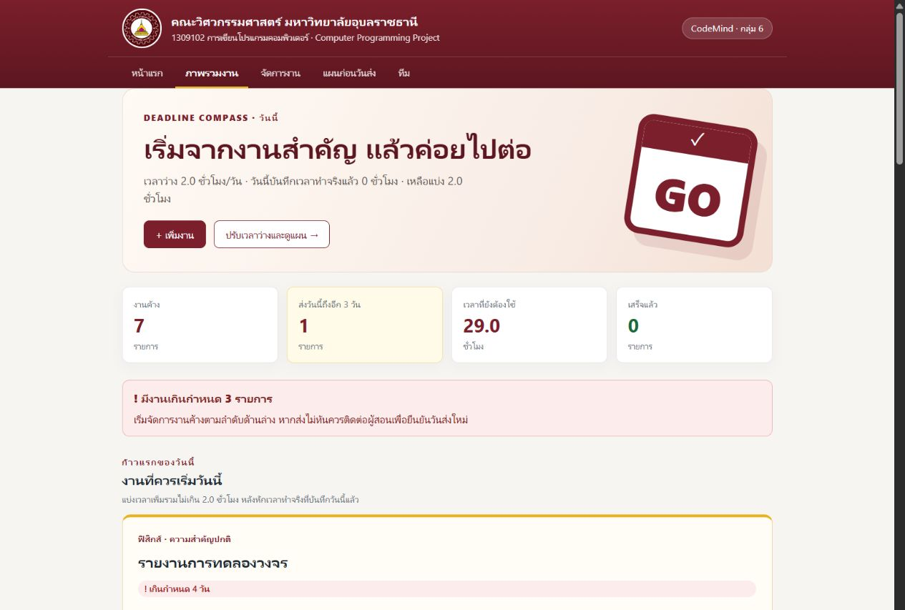
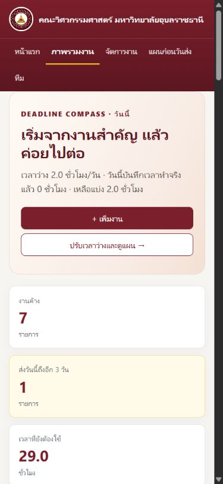
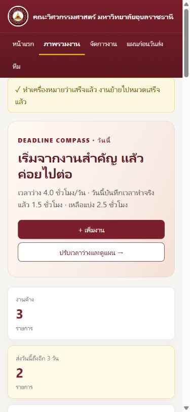
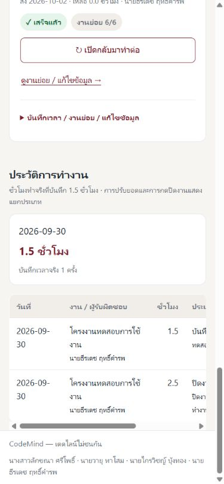

# รายงาน QA — ฉบับปรับปรุง 14 ข้อ

## การตรวจเพิ่มเติม: พื้นที่ไฟล์อ่านอย่างเดียว — 1 ตุลาคม 2569

- `pytest`: **55 passed** รวม 13 กรณีใหม่สำหรับการเลือกพื้นที่เก็บข้อมูลและเส้นทาง POST ที่เดิมเกิด `EROFS`
- ตัวตรวจอาจารย์: **60/60** และ SHA-256 ไฟล์ห้ามแก้ตรงทั้ง 6 ไฟล์ สำรองและคืน bytes ข้อมูลจริงหลังตรวจ
- จำลอง bundle อ่านอย่างเดียวแล้วทดสอบเพิ่ม แก้ไข ลบ เริ่ม/ปิด/เปิดงานกลับ บันทึกเวลา งานย่อย และชั่วโมงว่าง
- ทดสอบว่าข้อมูลและ settings ที่บันทึกไม่ถูกทับเมื่อ initializer ทำงานซ้ำ และ localhost ยังใช้ไฟล์โครงการตามเดิม
- อ่านข้อจำกัดของข้อมูลชั่วคราวและวิธีตั้งพื้นที่ถาวรใน [คู่มือ deployment](../DEPLOYMENT.md)
- ผลนี้เป็นการทดสอบในเครื่อง ยังไม่ได้ทดสอบ URL Vercel จริงหรือเผยแพร่ source รอบนี้

## ผลตรวจรอบปรับปรุง 14 ข้อก่อนหน้า

วันที่ตรวจ: 30 กันยายน 2569 · Workspace: C:\dev\Code

โครงการ: เดดไลน์ไม่ชนกัน · CodeMind กลุ่ม 6

## ผลอัตโนมัติ

| รายการ | ผล |
|---|---|
| check_project.main() | 60/60 ไม่มี warning |
| ไฟล์ห้ามแก้ 6 ไฟล์ | SHA-256 ตรง .given_hashes.json |
| pytest ทั้งชุด | 42 passed |
| Node ตรรกะ reminders.js | 4 ผ่าน 0 ไม่ผ่าน |
| JavaScript syntax | forms.js และ reminders.js ผ่าน |
| ข้อมูลจริงหลังตัวตรวจ | สำรอง bytes ก่อนตรวจและคืน bytes เดิมหลังตรวจ |

ตัวตรวจของอาจารย์มี storage.reset() จึงเรียกโดยเก็บ bytes ของ data.json ไว้และคืนใน finally ผลคะแนนยังเป็นผลตัวตรวจเดิม ไม่มีการแก้ตัวตรวจ

กรณีที่เพิ่มใน pytest แยก data/sample/settings ไป tmp_path ไม่มีการเขียนงานทดสอบลง data.json จริง

## เส้นทางที่ลองผ่านเบราว์เซอร์จริง

ใช้ `serve_fixture.py` พอร์ต 5002 ซึ่งแยกข้อมูลและ settings ชั่วคราว:

1. กรอกชั่วโมงทำแล้ว 5 จากชั่วโมงทั้งหมด 4 → ปฏิเสธและแสดง “เวลาที่ทำแล้วต้องไม่เกินเวลาทั้งหมด”
2. เพิ่ม “โครงงานทดสอบการใช้งาน” 4 ชั่วโมง เลือกธีรเดชเป็นผู้รับผิดชอบ เติมตัวอย่างงานย่อย 6 ข้อ → สถานะยังไม่เริ่ม งานย่อย 0/6
3. กดทางลัด → เปิดรายละเอียดงานและแบบบันทึกเวลา
4. บันทึกทำจริง 1.5 ชั่วโมง → ประวัติ work 1.5 และรวมวันที่เดียวกัน 1.5
5. Overview ตั้งเวลาว่าง 4 ชั่วโมง → แสดงทำจริงวันนี้ 1.5 เหลือแบ่ง 2.5
6. กดทำเครื่องหมายเสร็จ → งานค้างจาก 4 เป็น 3 งานเสร็จจาก 1 เป็น 2 งานย่อย 6/6
7. ประวัติหลังปิดงาน → ชั่วโมงจริงยัง 1.5 รายการปิดงาน 2.5 แยกประเภท complete
8. บันทึกเวลาว่างเป็น 3 ใน Plan → แผนใช้ 3 และแสดงชั่วโมงต้องทำ/มี/ขาด
9. กดเริ่มงานวันนี้จาก Plan → แสดงกำลังทำและปุ่มเริ่มหาย
10. ตรวจ log เบราว์เซอร์ช่วงเส้นทางที่ตรวจ → ไม่มีรายการระดับ error

## ผลตรวจขนาดหน้าจอ

| ความกว้าง viewport | หน้า | ความกว้าง document | ผล |
|---|---|---|---|
| 320 | Page 1 | 305 | ไม่ล้น |
| 320 | Page 2 | 305 | ไม่ล้น; ช่องหลัก 235 × 44px |
| 320 | Page 3 | 305 | ไม่ล้น; ช่องชั่วโมง 235 × 44px |
| 320 | Team | 305 | ไม่ล้น; การ์ดแนวตั้ง |
| 390 | Page 1 | 375 | ไม่ล้น; ปุ่มหลัก 305.6 × 44px |
| 390 | ประวัติ Page 2 | 375 | ตาราง 520px อยู่ในกรอบ 343px ที่เลื่อนได้ |
| 1280 | Overview ข้อมูลจริง | 1265 | ไม่ล้น; สถิติและการ์ดตามรูปแบบเดสก์ท็อป |

ความกว้าง document น้อยกว่า viewport เพราะพื้นที่แถบเลื่อน ภาพเหล่านี้มาจาก Chromium ในเบราว์เซอร์ของแอป ยังไม่ใช่ผลทดสอบ Safari/iOS/Android ทุกเครื่อง

## ภาพจากข้อมูลจริง

ข้อมูลตัวอย่างเดิม 7 รายการ คงเหลือรวม 29 ชั่วโมง ไม่มีชั่วโมงทำจริงที่สร้างย้อนหลัง ยังไม่ได้มอบหมายงานแทนผู้ใช้

## ภาพจากข้อมูลทดสอบชั่วคราว

ภาพด้านล่างมีงานและการกระทำสำหรับทดสอบ ไม่ใช่ข้อมูลจริงของกลุ่ม

## สิ่งที่ยังไม่ยืนยัน

- การแสดง Notification ของระบบปฏิบัติการจริงหลังได้รับสิทธิ์ และการเตือนเมื่ออุปกรณ์พัก
- การนำเข้า/เตือน .ics ในแอปปฏิทินทุกชนิด
- การบันทึกพร้อมกันหลายคนหรือหลาย process ระบบ version ตรวจฟอร์มเก่าแต่ไม่มี file lock
- การใช้งานเป็น PWA โดยปิดโปรแกรม Python หรือเป็นบริการหลายบัญชี

การทดสอบ Node ใช้ส่วนจำลองเพื่อตรวจการตัดสินใจและข้อความ ไม่ได้เปิดสิทธิ์อุปกรณ์หรือสร้าง Notification จริง

ดู [คู่มือผู้ทดสอบ](../presentation/TESTER_SUMMARY.md) สำหรับการทำซ้ำและ [รายละเอียดระบบ](../presentation/UPGRADE_DETAILS.md) สำหรับข้อสมมติของสูตร
